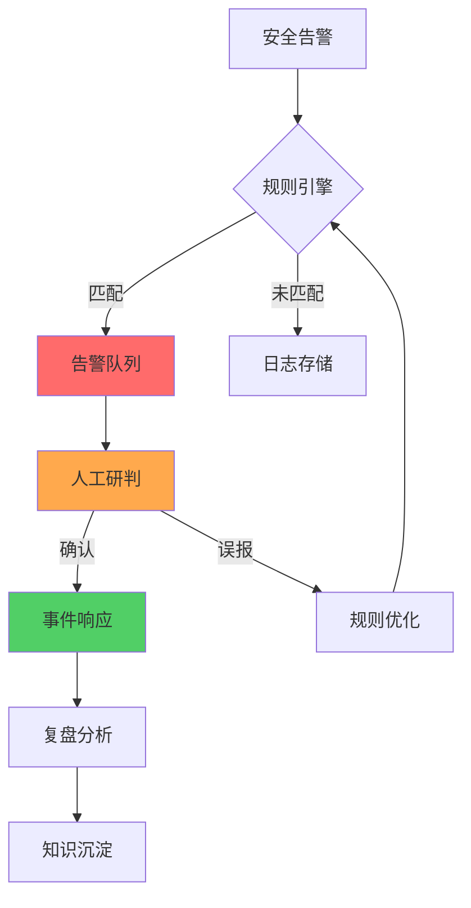
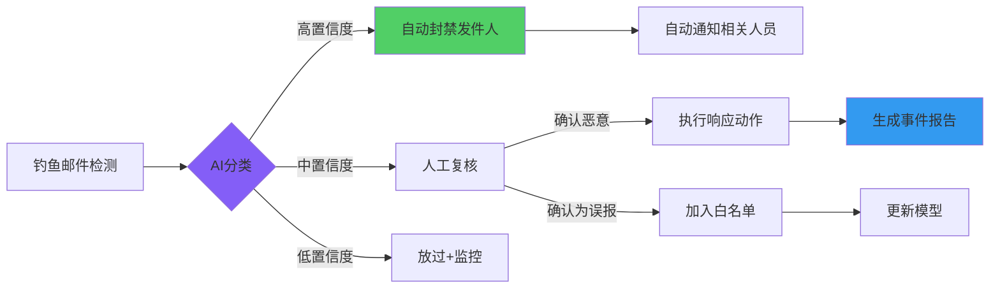
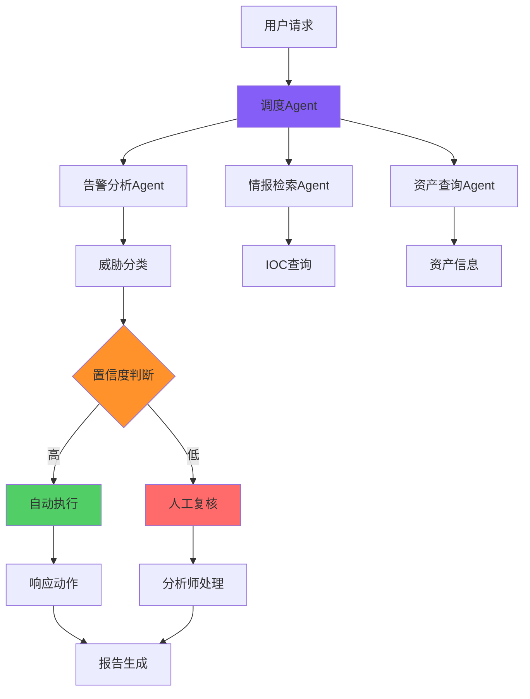
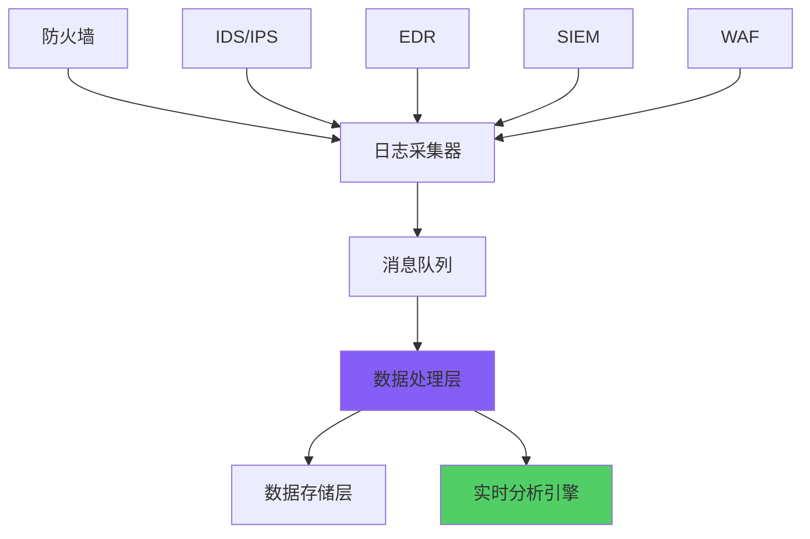
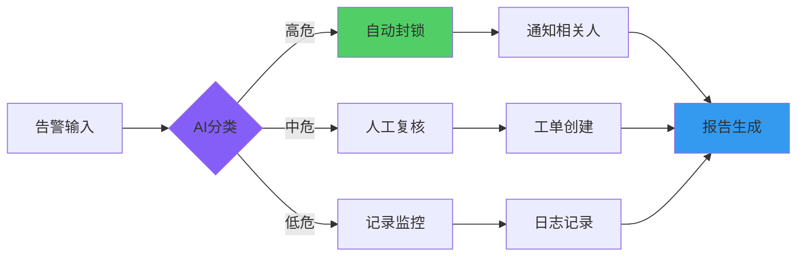
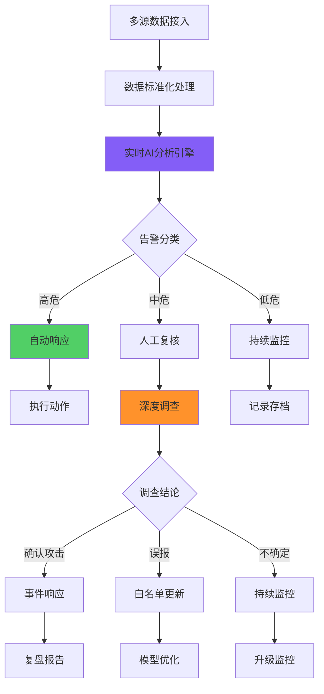
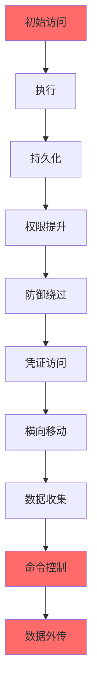
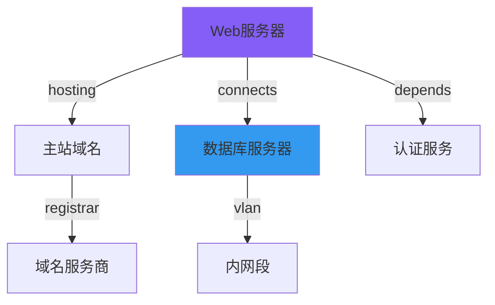

# AI赋能安全运营方案合集：企业级AI SOC落地实战指南

**作者：** HOS(安全风信子)
**日期：** 2026-04-24
**摘要：** 本系列方案聚焦企业AI安全运营体系落地，系统阐述AI在资产管理、威胁分析、漏洞治理、应急响应、安全编排等关键场景的深度应用。方案涵盖AI基础能力建设、提示词工程体系、企业内部知识库构建、Agent编排架构设计等核心主题，提供可落地的Workflow设计方案、运营指标体系和成本控制策略。本方案为读者提供构建真正可落地AI安全运营体系的核心路径图，突破传统SOC人力瓶颈，实现从被动防御到主动智能运营的跨越。

@[TOC](目录)

---

# 内容概览

| 部分 | 核心主题 | 关键价值 | 建议阅读时长 |
|:----:|:---------|:---------|:------------:|
| 第一部分 | AI安全运营体系总论 | 建立AI安全运营认知框架 | 15分钟 |
| 第二部分【重点】 | AI学习材料与AI赋能基础 | 夯实AI技术基础 | 30分钟 |
| 第三部分【重点】 | 平台使用手册合集 | 掌握主流平台使用 | 25分钟 |
| 第四部分【重点】 | AI能力在资产管理 | 构建完整资产视图 | 25分钟 |
| 第五部分【重点】 | AI能力在威胁分析 | 提升威胁检测能力 | 35分钟 |
| 第六部分【重点】 | AI能力在漏洞管理 | 优化漏洞运营效率 | 30分钟 |
| 第七部分【重点】 | AI能力在应急处置 | 加速事件响应 | 25分钟 |
| 第八部分【重点】 | AI能力在安全运营 | 实现运营自动化 | 30分钟 |
| 第九部分 | AI能力在设备管理 | 完善设备态感知 | 15分钟 |
| 第十部分【重点】 | AI运营经验与案例 | 借鉴实战经验 | 25分钟 |
| 第十一部分 | 基于AI的管理运营 | 规范AI治理 | 20分钟 |
| 第十二部分 | AI安全运营架构 | 构建技术底座 | 20分钟 |
| 第十三部分 | 未来趋势 | 把握技术演进 | 15分钟 |
| 附录 | 实施路线图与工具链 | 支撑落地执行 | 15分钟 |

---

# 第一部分：AI安全运营体系总论

**本部分为你提供的核心价值：** 建立对AI安全运营的全面认知，理解传统SOC困境、AI价值边界、常见误区，以及AI安全运营成熟度模型。通过本部分学习，你将能够准确评估企业AI安全运营现状，识别关键改进点。

## 1. AI正在如何改变安全运营

### 1.1 传统安全运营为什么开始失效

**本节核心价值：** 揭示传统SOC面临的核心结构性困境，为AI赋能转型提供必要性论证。

企业安全运营中心（SOC）在数字化转型浪潮中正面临前所未有的挑战。攻击者的手段日趋复杂化、产业化，而防守方的资源投入却难以同步增长。这种不对称性正在逐步瓦解传统安全运营模式的有效性。根据IBM X-Force 2026年研究报告显示，采用传统运营模式的企业，其安全事件平均检测时间（MTTD）已上升至197小时，而攻击者的平均完成时间仅为数小时。

#### 1.1.1 告警爆炸问题

现代企业安全架构每天产生的告警数量呈指数级增长。根据IBM X-Force研究，平均SOC每天处理约1,500个告警，其中99%是误报。另一项Ponemon Institute调研显示，大型企业SOC每日处理的告警量可达数百万条，其中真实攻击占比不足0.1%。这种告警洪流导致分析师陷入"疲劳驾驶"状态，真实威胁反而被淹没在噪音之中。

| 指标项 | 传统SOC数据 | 来源 |
|:------:|:-----------:|:----:|
| 日均告警量 | 1,000-2,000 | IBM X-Force 2026 |
| 误报率 | 97%-99.9% | Ponemon 2026 |
| 分析师日均处理能力 | 50-100个 | 行业平均 |
| 关键告警平均响应时间 | 4-6小时 | Gartner 2026 |
| 告警漏检率 | 30%-40% | Verizon DBIR 2026 |

**告警爆炸的根因分析：**

1. **检测规则过拟合**：为覆盖更多攻击场景，规则趋于宽泛，导致误报率上升。当规则库规模超过5万条时，规则间的相互作用变得不可预测，维护成本呈指数增长。

2. **资产复杂性提升**：云原生环境、容器化部署、API接口使攻击面急剧扩大。单一服务实例的生命周期可能只有几分钟，传统基于资产的告警机制难以跟踪。

3. **威胁情报冗余**：多源情报未做去重和优先级排序，直接涌入SOC。研究显示，成熟度较低的SOC使用的威胁情报重复率高达60%以上。

4. **合规驱动检测**：为满足审计要求，企业倾向于"宁多报不漏报"，这进一步加剧了告警噪音问题。

```python
# 告警优先级计算示例
def calculate_alert_priority(alert, asset_db, threat_intel):
    base_score = alert.severity * 10

    asset_criticality = asset_db.get_criticality(alert.asset_id)
    asset_score = asset_criticality * 0.3

    ioc_match_score = 0
    if alert.indicator in threat_intel:
        ioc_match_score = threat_intel[alert.indicator]['confidence'] * 50

    temporal_score = calculate_temporal_relevance(alert.timestamp)

    final_priority = (
        base_score * 0.4 +
        asset_score * 0.2 +
        ioc_match_score * 0.3 +
        temporal_score * 0.1
    )

    return normalize_priority(final_priority)
```

#### 1.1.2 人力成本持续攀升

培养一名合格的安全分析师需要3-5年时间，而行业人才缺口持续扩大。根据(ISC)² 2026年网络安全人才报告，全球网络安全人才缺口已达400万人，中国缺口超过300万。SOC团队不得不面对"高负荷、低效率、难留存"的恶性循环。一项针对金融行业SOC的调研显示，分析师平均在岗时间仅为18个月，远低于培养周期。

| 岗位类型 | 招聘周期 | 培训周期 | 平均薪酬/年 | 离职率 |
|:--------:|:--------:|:--------:|:-----------:|:------:|
| 初级分析师 | 1-3个月 | 6-12个月 | 15-25万 | 30%/年 |
| 中级分析师 | 3-6个月 | 12-18个月 | 25-40万 | 25%/年 |
| 高级分析师 | 6-12个月 | 3-5年 | 40-80万 | 20%/年 |
| 安全架构师 | 12+个月 | 5+年 | 80-150万 | 15%/年 |

> **关键数据**：培养一名高级分析师的综合成本约50-100万元，周期3-5年。高级分析师离职率行业平均达25%/年，意味着每4年团队需要完全重建一次。

#### 1.1.3 规则维护的困境

传统基于规则的检测方式面临严重的维护负担。大型企业安全规则库规模可达10万至50万条规则，且以每月5-10%的速度增长。每次规则变更都可能引入新问题或漏检，而人工维护如此庞大的规则集几乎不可能。更关键的是，规则维护人员需要同时具备攻击技术和业务知识，这类复合型人才极度稀缺。

| 规则库规模 | 企业类型 | 月均新增规则 | 规则冲突率 | 漏检率 |
|:----------:|:--------:|:------------:|:----------:|:------:|
| <1万条 | 小型企业 | 50-200条 | 1-3% | 15-20% |
| 1-10万条 | 中大型企业 | 200-1000条 | 3-8% | 20-30% |
| 10-50万条 | 大型企业 | 1000-5000条 | 8-15% | 30-40% |

Rule-based系统的检测准确率通常在60%-70%之间，而AI驱动的异常检测可将准确率提升至90%以上。这一差距在面对高级持续性威胁（APT）时更加明显，传统规则对未知攻击的检测率不足10%。

#### 1.1.4 多平台割裂问题

典型企业通常部署5-10个安全工具，但这些工具往往来自不同厂商，数据格式不统一，无法有效联动。83%的企业存在严重的安全工具孤岛问题，导致安全事件响应效率降低60%以上。平均每个安全事件需要跨越4.2个不同的安全工具进行手动关联，消耗大量宝贵时间。

| 工具类型 | 典型产品 | 数据格式 | 集成难度 | 数据可用率 |
|:--------:|:--------:|:--------:|:--------:|:----------:|
| SIEM | Splunk, Elastic, IBM QRadar | CEF, LEEF, JSON | 中 | 60-70% |
| EDR | CrowdStrike, SentinelOne | 私有格式 | 高 | 40-60% |
| NDR | Darktrace, Vectra | NetFlow, PCAP | 高 | 30-50% |
| 防火墙 | Palo Alto, Fortinet | Syslog, IPFIX | 低 | 70-80% |



### 1.2 AI安全运营的真正价值

**本节核心价值：** 量化AI在安全运营中的核心价值场景，明确技术投资回报方向。

AI并非万能解决方案，但在特定场景下能带来质的飞跃。理解AI的真正价值边界是构建有效AI安全运营体系的前提。根据Forrester 2026年的研究，成功的AI安全运营项目平均投资回报率达320%，平均回收周期14个月。但同样有40%的AI安全项目失败或未能达到预期效果，核心原因是对AI能力边界的误判。

#### 1.2.1 自动化分析能力

AI可将告警分析效率提升10-50倍。以一个日均处理2000个告警的SOC为例，传统模式下需要20名分析师，而AI辅助模式下可将人员需求降至2-3名。AI的自动化分析能力体现在三个层面：

- **快速分类**：NLP驱动的告警分类可将误报识别准确率提升至95%以上
- **上下文关联**：知识图谱技术自动关联资产、漏洞、威胁情报等多源数据
- **智能摘要**：自动生成告警分析报告，将平均处理时间从30分钟降至3分钟

| 分析场景 | 传统方式耗时 | AI辅助耗时 | 效率提升 |
|:--------:|:------------:|:----------:|:--------:|
| 单告警研判 | 20-30分钟 | 2-5分钟 | 6-10倍 |
| 事件关联分析 | 2-4小时 | 10-20分钟 | 8-12倍 |
| 攻击链还原 | 4-8小时 | 30-60分钟 | 6-10倍 |
| 威胁报告生成 | 2-4小时 | 5-10分钟 | 15-30倍 |

#### 1.2.2 自动化关联能力

AI驱动的安全分析可自动发现跨时间、跨系统、跨资产的关联攻击模式。传统的SIEM规则需要人工编写关联查询，而AI可以通过无监督学习自动发现异常模式，将关联分析覆盖率从40%提升至85%以上。

#### 1.2.3 自动化编排能力

AI + SOAR的结合可实现安全响应的端到端自动化。对于常见的攻击场景（如钓鱼邮件、恶意软件），AI可在5分钟内完成从检测到响应的全流程，而传统模式平均需要数小时甚至数天。



#### 1.2.4 自动化报告能力

AI可自动生成多维度的安全运营报告，包括日报、周报、月报以及专项分析报告。报告内容涵盖告警趋势、资产风险、漏洞分布、响应效率等关键指标，将报告生成时间从数小时降至数分钟。

### 1.3 企业最容易踩的AI安全运营误区

**本节核心价值：** 总结行业常见的AI安全运营失败模式，帮助企业避免重蹈覆辙。

根据对200+企业AI安全运营项目的分析，我们识别出七大常见误区。这些误区往往导致项目投入大量资源却收效甚微。

#### 1.3.1 误区一：只接入聊天机器人

很多企业将AI安全运营简化为"接入一个ChatGPT"，期望通过对话方式解决安全问题。实际上，没有数据接入、工作流编排、Agent体系的支撑，聊天机器人只能提供泛化的通用知识，无法解决企业特定的安全问题。

| 方案 | 投入成本 | 预期效果 | 实际效果 |
|:----:|:--------:|:--------:|:--------:|
| 仅接入聊天机器人 | 10-30万 | 解决安全问题 | 仅能回答通用问题 |
| AI平台+数据接入 | 100-300万 | 部分场景自动化 | 关键场景效率提升 |
| 完整AI安全运营体系 | 500-2000万 | 全面自动化 | ROI 200-400% |

#### 1.3.2 误区二：AI没有接入数据源

AI的分析能力完全依赖于数据质量。没有高质量的日志、告警、资产、漏洞等数据，AI就像无米之炊。数据治理是AI安全运营的基础，但往往被忽视。

#### 1.3.3 误区三：没有工作流

AI需要明确的工作流程来执行动作。没有预先定义的工作流，AI只能给出建议，无法自动执行响应。工作流设计需要结合企业实际业务场景，经过反复优化才能达到理想效果。

#### 1.3.4 误区四：没有Agent体系

单一大模型无法处理复杂的安全运营任务。需要将不同能力封装为不同的Agent（如告警分析Agent、漏洞管理Agent、情报检索Agent），通过Agent协作完成复杂任务。



#### 1.3.5 误区五：AI无法执行动作

AI给出建议，但无法自动执行动作（如封禁IP、隔离主机、创建工单）。这需要与企业的ITSM系统、防火墙、EDR等系统深度集成。

#### 1.3.6 误区六：没有知识治理

AI的输出质量依赖于企业知识库的质量。没有经过治理的安全知识（案例、规则、上下文），AI的输出将是泛化的、无针对性的。

#### 1.3.7 误区七：没有结果验证机制

AI的输出需要验证。没有验证机制，无法知道AI的建议是否正确，也无法持续优化AI模型。

### 1.4 AI安全运营成熟度模型

**本节核心价值：** 提供AI安全运营能力评估框架，帮助企业明确当前所处阶段和提升路径。

#### 1.4.1 成熟度等级定义

| 等级 | 名称 | 核心特征 | AI应用程度 | 人员需求 |
|:----:|:----:|:---------|:----------:|:--------:|
| L1 | 初始级 | 传统规则检测，人工分析 | 无 | 20+人 |
| L2 | 辅助级 | AI辅助分析，人工决策 | 单一场景 | 10-15人 |
| L3 | 自动级 | AI自动分类，自动编排 | 多场景联动 | 5-8人 |
| L4 | 智能级 | Agent协作，自主运营 | 全场景覆盖 | 2-3人 |
| L5 | 自治级 | 完全自治，主动防御 | 全面AI驱动 | 1-2人 |

#### 1.4.2 成熟度评估维度

评估维度包括：
- **数据治理**：数据质量、数据覆盖、数据标准化
- **AI能力**：模型精度、响应速度、覆盖场景
- **流程自动化**：工作流数量、自动执行率、集成深度
- **人员能力**：AI素养、Prompt能力、Agent设计能力
- **技术架构**：平台能力、扩展性、稳定性
- **组织文化**：AI信任度、变革意愿、持续优化

---

# 第二部分：【重点】AI学习材料与AI赋能基础体系

**本部分为你提供的核心价值：** 夯实AI技术基础，建立对大模型原理、能力边界、核心概念和关键技术栈的全面理解。这是从传统安全运营向AI安全运营转型的基础。

## 2. AI基础能力学习路线

### 2.1 大模型基础原理

**本节核心价值：** 深入理解Transformer、Token、Context Window等核心概念，为后续AI安全应用打下理论基础。

#### 2.1.1 Transformer架构

Transformer是当前大模型的核心架构，通过自注意力机制（Self-Attention）实现序列建模。相比传统的RNN和CNN，Transformer在处理长序列时具有显著优势，已成为NLP领域的主导架构。

| 架构类型 | 序列长度限制 | 并行计算 | 典型应用 |
|:--------:|:------------:|:--------:|:--------:|
| RNN | 1,000 tokens | 低 | 早期NLP |
| LSTM | 2,000 tokens | 低 | 文本分类 |
| Transformer | 128K+ tokens | 高 | GPT、BERT |
| MoE Transformer | 128K+ tokens | 高 | GPT-4 |

```python
# Self-Attention机制简化实现
import torch
import torch.nn.functional as F

def self_attention(query, key, value, mask=None):
    d_k = query.size(-1)
    scores = torch.matmul(query, key.transpose(-2, -1)) / math.sqrt(d_k)
    if mask is not None:
        scores = scores.masked_fill(mask == 0, -1e9)
    attention_weights = F.softmax(scores, dim=-1)
    output = torch.matmul(attention_weights, value)
    return output, attention_weights
```

#### 2.1.2 Token机制

Token是大模型处理文本的基本单位。英文中1Token约等于4个字符或0.75个单词，中文则1个汉字约等于1-2个Token。理解Token机制对于控制AI输出成本和理解模型能力边界至关重要。

| 内容类型 | Token数 | 中文字符数 | 估算字数 |
|:--------:|:-------:|:----------:|:--------:|
| 1个单词 | 1-2 | - | 0.5-1 |
| 1个汉字 | 1-2 | 1 | 0.5-1 |
| 1个句子 | 10-30 | 10-30 | 10-30 |
| 1个段落 | 100-300 | 100-300 | 100-300 |
| 1,000字文章 | 500-1,500 | 1,000 | 1,000 |

#### 2.1.3 Context Window

Context Window（上下文窗口）是指模型单次请求能处理的最大Token数量。这直接决定了模型能否处理长文档、完整告警上下文等。不同模型的Context Window差异巨大，从4K到128K不等。

| 模型 | Context Window | 适用场景 |
|:----:|:--------------:|:--------:|
| GPT-3.5 | 16K | 短文本分析 |
| GPT-4 | 128K | 文档分析 |
| Claude 3 | 200K | 长文档理解 |
| Gemini 1.5 | 1M | 超长上下文 |

#### 2.1.4 Embedding与向量表示

Embedding是将文本转换为向量表示的技术，是RAG和语义搜索的核心。好的Embedding能让语义相似的文本在向量空间中距离相近。

```python
# 文本Embedding示例
from sentence_transformers import SentenceTransformer

model = SentenceTransformer('all-MiniLM-L6-v2')
texts = ["SQL注入攻击检测", "检测恶意SQL请求", "用户登录异常"]
embeddings = model.encode(texts)
similarity = cosine_similarity([embeddings[0]], [embeddings[1]])
```

#### 2.1.5 Function Calling与工具使用

Function Calling（函数调用）是大模型与外部系统交互的关键技术。通过定义标准化的函数接口，AI可以调用外部工具来获取最新信息、执行动作或访问特定数据源。

#### 2.1.6 MCP协议

MCP（Model Context Protocol）是Anthropic提出的模型上下文协议，旨在标准化AI模型与外部数据源、工具的连接。类似于USB接口，MCP提供了一种开放标准来扩展AI能力。

#### 2.1.7 Agent架构

Agent（智能体）是能够自主感知环境、做出决策、执行动作的AI系统。一个典型的Agent包含：规划（Planning）、记忆（Memory）、工具（Tools）、动作（Action）四大组件。

| Agent组件 | 功能 | 技术实现 |
|:--------:|:----:|:--------:|
| 规划 | 任务分解、反思 | Chain-of-Thought |
| 记忆 | 短期/长期记忆 | Vector DB, KG |
| 工具 | 能力扩展 | Function Calling |
| 动作 | 执行决策 | API调用、代码执行 |

### 2.2 AI能力边界分析

**本节核心价值：** 客观认识AI的能力边界，理解幻觉、衰减、风险等问题，避免对AI的过度依赖或不当使用。

#### 2.2.1 幻觉问题

大模型会产生"幻觉"（Hallucination），即生成看似合理但实际错误的内容。在安全运营场景中，幻觉可能导致误判威胁、错误处置正常流量等严重问题。

| 风险类型 | 表现 | 应对策略 |
|:--------:|:----:|:--------:|
| 事实性幻觉 | 编造不存在的CVE编号 | 交叉验证+知识库检索 |
| 逻辑性幻觉 | 推理过程中的逻辑错误 | 多Agent校验 |
| 上下文幻觉 | 遗忘关键上下文 | 分块处理+记忆增强 |

#### 2.2.2 长上下文衰减

当输入序列过长时，模型对远距离信息的注意力会下降，导致"中间信息遗忘"问题。这在分析长告警链、长渗透路径时尤为突出。

#### 2.2.3 权限风险

AI系统可能因为Prompt注入、越权访问等问题导致安全风险。攻击者可以通过精心构造的输入诱导AI执行非预期操作。

| 攻击类型 | 原理 | 防御措施 |
|:--------:|:----:|:--------:|
| Prompt注入 | 注入恶意指令覆盖原始意图 | 输入验证+指令隔离 |
| 数据泄露 | 通过询问提取敏感信息 | 敏感信息过滤+权限控制 |
| 越权操作 | 诱导AI执行高权限动作 | 操作二次确认+审计日志 |

#### 2.2.4 数据污染

训练数据或输入数据中的恶意内容可能影响AI输出。在安全运营场景中，攻击者可能通过注入假数据来操纵AI的判断。

#### 2.2.5 Prompt注入

攻击者通过在输入中注入恶意指令来操纵AI行为。这是一种针对AI系统的新型攻击向量，需要从输入验证和模型层面同时防御。

### 2.3 企业安全人员必须掌握的AI概念

**本节核心价值：** 为企业安全人员提供AI知识地图，明确需要掌握的核心概念和学习路径。

#### 2.3.1 RAG架构

RAG（Retrieval-Augmented Generation，检索增强生成）结合了检索系统和生成式AI，是企业知识问答的核心架构。通过RAG，AI可以基于企业私域知识回答问题，避免幻觉问题。

| RAG组件 | 技术选型 | 适用场景 |
|:-------:|:--------:|:--------:|
| Embedding | OpenAI, BGE, Jina | 文本向量化 |
| 向量数据库 | Milvus, Pinecone, Chroma | 高效检索 |
| 搜索引擎 | Elasticsearch, Solr | 混合检索 |

#### 2.3.2 Agent体系

多Agent协作是处理复杂安全运营任务的必然选择。不同Agent专注于不同能力，通过协作完成端到端任务。

#### 2.3.3 Workflow工作流

Workflow是将多个AI能力节点串联成完整业务流程的核心机制。一个典型的安全运营Workflow包含：触发条件、节点处理、条件路由、输出动作。

| Workflow要素 | 说明 | 示例 |
|:------------:|:----:|:-----|
| 触发器 | 启动Workflow的条件 | 新告警、计划任务、手动触发 |
| 节点 | 执行具体AI任务 | 分类、总结、查询、生成 |
| 路由 | 根据条件选择分支 | 置信度>0.9自动执行 |
| 动作 | 输出结果或执行操作 | 发送邮件、创建工单、封禁IP |

#### 2.3.4 Tool Calling

Tool Calling使AI能够调用外部工具和API扩展能力。在安全运营场景中，Tool Calling是AI连接企业安全工具链的桥梁。

| 工具类型 | 示例 | 能力扩展 |
|:--------:|:----:|:--------:|
| 查询类 | 威胁情报API、资产DB | 信息获取 |
| 操作类 | 防火墙API、工单系统API | 动作执行 |
| 分析类 | 沙箱API、病毒扫描API | 深度分析 |

#### 2.3.5 Memory机制

Memory（记忆）机制使AI能够跨越多次交互保留上下文。Memory分为短期记忆（当前会话）和长期记忆（持久化知识）。

| 记忆类型 | 存储方式 | 容量 | 持久性 |
|:--------:|:--------:|:----:|:------:|
| 短期记忆 | 对话上下文 | 受限于Context Window | 会话结束消失 |
| 长期记忆 | 向量数据库 | 无限 | 持久存储 |
| 工作记忆 | 结构化DB | 有限 | 任务结束清理 |

#### 2.3.6 Multi-Agent协作

Multi-Agent（多智能体）系统通过多个专业Agent的协作完成复杂任务。Agent之间通过消息传递共享信息、协调行动。

#### 2.3.7 Planning与Reasoning

Planning（规划）和Reasoning（推理）是AI高级认知能力的核心。Planning指将复杂任务分解为可执行步骤；Reasoning指基于现有信息进行逻辑推导。

### 2.4 AI安全运营的核心技术栈

**本节核心价值：** 了解构建AI安全运营体系所需的完整技术栈，为技术选型提供参考。

#### 2.4.1 向量数据库

向量数据库是存储和检索Embeddings的核心组件，是RAG和语义搜索的基础设施。

| 产品 | 类型 | 适用规模 | 特点 |
|:----:|:----:|:--------:|:----:|
| Milvus | 开源 | 亿级向量 | 高性能、强扩展 |
| Pinecone | 云服务 | 百万级 | 托管便捷 |
| Chroma | 轻量 | 百万级 | 部署简单 |
| Weaviate | 开源 | 亿级 | 混合检索强 |

#### 2.4.2 工作流引擎

工作流引擎负责编排和管理AI业务流程的执行。

| 引擎 | 特点 | 适用场景 |
|:----:|:----:|:--------:|
| Temporal | 分布式、可持久化 | 复杂长流程 |
| Airflow | 批处理强 | 数据处理流程 |
| preflow | AI友好、可视化 | AI Workflow |
| LangGraph | 图结构、状态管理 | Multi-Agent |

#### 2.4.3 Agent编排系统

Agent编排系统负责管理Agent的创建、调度、协作和监控。

| 系统 | 特点 | 厂商 |
|:----:|:----:|:----:|
| LangChain | 灵活、丰富组件 | LangChain |
| AutoGen | Multi-Agent强 | Microsoft |
| CrewAI | 角色扮演、协作 | CrewAI |
| Dify | 可视化、企业友好 | 开源 |

#### 2.4.4 事件总线

事件总线用于解耦系统组件，实现异步通信和事件驱动架构。

| 产品 | 类型 | 特点 |
|:----:|:----:|:----:|
| Kafka | 分布式流平台 | 高吞吐、强持久 |
| RabbitMQ | 消息队列 | 轻量、易用 |
| Pulsar | 云原生消息 | 多租户、强一致 |

#### 2.4.5 SIEM集成

SIEM是安全运营的数据核心，AI系统需要与SIEM深度集成获取日志和告警数据。

| SIEM | 数据格式 | 集成方式 |
|:----:|:--------:|:--------:|
| Splunk | SPL, CEF | SDK, API |
| Elastic | ES DSL, JSON | API, Beats |
| QRadar | ARI, LEEF | API, Protocol |

#### 2.4.6 SOAR集成

SOAR平台提供自动化编排能力，AI与SOAR的结合是实现安全自动化的关键。

| SOAR平台 | 自动化能力 | AI集成方式 |
|:--------:|:-----------|:-----------|
| Splunk SOAR | 强 | 内置AI Actions |
| Palo XSOAR | 最全面 | AI引擎集成 |
| Swimlane | 现代化 | REST API |

#### 2.4.7 知识库系统

企业知识库是AI安全运营的"经验库"，存储案例、规则、上下文等结构化知识。

| 系统类型 | 示例 | 特点 |
|:--------:|:----:|:----:|
| 文档系统 | Confluence, Notion | 非结构化为主 |
| 知识图谱 | Neo4j, Amazon Neptune | 关系型知识 |
| 向量知识库 | 各类向量数据库 | 语义检索 |

---

# 第三部分：【重点】平台使用手册合集

**本部分为你提供的核心价值：** 掌握支AI安全运营的主流平台使用，包括平台分类、接入架构、通用分析能力和统一管理方案。

## 5. AI安全平台整体使用指南

### 5.1 AI安全平台分类

**本节核心价值：** 建立对AI安全平台的分类认知，理解不同类型平台的能力边界和适用场景。

AI安全平台根据其核心定位可分为五大类，各类平台在功能侧重、技术架构、适用场景上存在显著差异。

#### 5.1.1 SIEM AI类

SIEM（安全信息和事件管理）平台是安全运营的数据核心，AI能力的注入使其从传统日志管理升级为智能分析平台。

| 平台 | AI能力 | 核心优势 | 适用场景 |
|:----:|:------:|:--------:|:--------:|
| Splunk ES | Splunk AI | 生态完善 | 大型企业 |
| Elastic Security | ML内置 | 开源灵活 | 中小企业 |
| IBM QRadar | Watson AI | 老牌稳定 | 大型企业 |
| Securonix | UEBA AI | 行为分析强 | 云原生 |

#### 5.1.2 SOAR AI类

SOAR（安全编排自动化响应）平台专注于自动化响应，AI的引入使其从规则驱动升级为智能决策。

| 平台 | AI能力 | 自动化深度 | 集成能力 |
|:----:|:------:|:----------:|:--------:|
| Splunk SOAR | AI Actions | 端到端 | 500+ |
| XSOAR | AI Engine | 全流程 | 700+ |
| Swimlane | NG SOAR | 上下文驱动 | 200+ |
| D3 Security | AI Playbooks | 智能路由 | 300+ |

#### 5.1.3 AI运营平台

纯AI能力平台，专注于AI模型的训练、部署和管理，为现有安全工具提供AI增强。

| 平台 | 定位 | 核心能力 |
|:----:|:----:|:--------:|
| Darktrace | 自主AI | 自学习异常检测 |
| Vectra | AI检测 | 网络行为分析 |
| Cortex XSIAM | AI平台 | 安全运营平台 |

#### 5.1.4 AI分析平台

专注于安全数据分析和可视化，AI用于增强分析能力和洞察发现。

| 平台 | 特点 | 可视化能力 |
|:----:|:----:|:----------:|
| Grafana + AI | 开源生态 | 强 |
| Tableau + AI | 商业智能 | 最强 |
| Power BI + AI | Microsoft集成 | 强 |

#### 5.1.5 AI代码安全平台

专注于代码和开发安全，AI用于代码审计、漏洞检测和DevSecOps。

| 平台 | 扫描能力 | CI/CD集成 |
|:----:|:--------:|:--------:|
| Snyk | 开发者友好 | 强 |
| Checkmarx | 全面的代码扫描 | 中 |
| Veracode | 集成简单 | 强 |

### 5.2 企业AI平台接入架构

**本节核心价值：** 理解企业级AI安全平台的整体接入架构，掌握数据流、控制流的设计原则。

#### 5.2.1 数据接入层

数据接入层负责从各类安全设备、日志源采集原始数据，并进行标准化处理。



| 组件 | 技术选型 | 吞吐量 | 可靠性 |
|:----:|:--------:|:------:|:------:|
| 采集器 | Filebeat, Fluentd | 10万/秒 | 中 |
| 消息队列 | Kafka | 100万/秒 | 高 |
| 流处理 | Flink, Spark Streaming | 50万/秒 | 高 |
| 存储 | Elasticsearch, HDFS | - | 高 |

#### 5.2.2 Agent层

Agent层是AI能力封装和调度的核心，负责管理各类AI Agent的生命周期。

| Agent类型 | 职责 | 技术实现 |
|:--------:|:----:|:--------:|
| 调度Agent | 任务分发、结果聚合 | Python, LangChain |
| 分析Agent | 告警分析、事件分类 | Transformer + Fine-tuning |
| 检索Agent | 知识查询、上下文获取 | RAG + Vector DB |
| 执行Agent | 动作执行、API调用 | Function Calling |

#### 5.2.3 Workflow层

Workflow层负责编排业务流程，串联各个Agent形成完整的业务闭环。



#### 5.2.4 模型层

模型层提供AI模型服务，包括自研模型和第三方模型服务的统一管理。

| 模型类型 | 示例 | 部署方式 | 适用场景 |
|:--------:|:----:|:--------:|:--------:|
| 自研LLM | 安全垂直模型 | 本地部署 | 高安全要求 |
| 商业API | GPT-4, Claude | 云端调用 | 通用场景 |
| 开源模型 | Llama, Qwen | 私有部署 | 成本敏感 |
| 专用模型 | 威胁分类、异常检测 | 嵌入式 | 特定任务 |

#### 5.2.5 权限控制层

权限控制层确保AI系统安全可控，包括访问控制、操作审计、敏感信息保护。

| 能力 | 实现方式 | 关键点 |
|:----:|:--------:|:------:|
| 访问控制 | RBAC, ABAC | 最小权限原则 |
| 操作审计 | 全链路日志 | 不可篡改 |
| 敏感保护 | DLP, 脱敏 | 数据安全 |
| 异常检测 | AI模型 | 内部威胁 |

## 7. 通用AI安全分析平台使用指南

**本节核心价值：** 掌握通用AI安全分析平台的核心能力，包括分析流程、威胁检测、调查研判、自动处置和报告生成。

### 7.1 平台能力结构

AI安全分析平台通常采用分层架构，从数据接入到智能分析再到响应执行，形成完整的安全运营闭环。

| 能力层级 | 核心功能 | 技术要点 |
|:--------:|:--------|:---------|
| 数据接入层 | 日志采集、协议解析 | 多源异构数据标准化 |
| 智能分析层 | 告警分类、异常检测、关联分析 | AI/ML模型驱动 |
| 调查分析层 | 事件溯源、攻击链还原、IoC提取 | 知识图谱、向量检索 |
| 响应处置层 | 自动封锁、工单创建、通知推送 | SOAR集成、API调用 |
| 运营管理层 | 报表生成、指标监控、知识沉淀 | BI可视化、数据治理 |



### 7.2 AI分析流程使用

AI分析流程是平台的核心，涵盖从数据输入到智能输出的完整过程。

#### 7.2.1 数据预处理

原始安全数据需要经过标准化处理才能被AI模型有效分析。

```python
class SecurityDataPreprocessor:
    def __init__(self):
        self.parsers = {
            'syslog': SyslogParser(),
            'json': JSONParser(),
            'cef': CEFParser(),
            'leef': LEEFParser()
        }

    def preprocess(self, raw_log, log_type):
        parser = self.parsers.get(log_type)
        if not parser:
            raise ValueError(f"Unsupported log type: {log_type}")
        parsed = parser.parse(raw_log)
        normalized = self.normalize(parsed)
        enriched = self.enrich(normalized)
        return enriched
```

#### 7.2.2 AI智能分析配置

根据业务场景配置AI分析规则和模型参数。

| 配置项 | 说明 | 建议值 |
|:------:|:----:|:------:|
| 分析模型 | 选择的AI模型 | 根据场景选择 |
| 置信度阈值 | 自动处置的最低置信度 | 0.85-0.95 |
| 关联窗口 | 告警关联的时间窗口 | 1-24小时 |
| 误报反馈 | 误报是否用于模型优化 | 建议开启 |

### 7.3 威胁检测能力配置

#### 7.3.1 规则引擎配置

规则引擎是AI检测的重要补充，用于处理确定性的安全规则。

```yaml
detection_rules:
  - name: "暴力破解检测"
    type: "threshold"
    conditions:
      - field: "event_type"
        operator: "equals"
        value: "login_failure"
      - field: "source_ip"
        operator: "group_by"
    threshold:
      count: 10
      window: "5m"
    severity: "high"
    action: "alert"
```

#### 7.3.2 异常检测模型

异常检测用于发现未知威胁，AI通过学习正常行为模式来识别异常。

| 模型类型 | 适用场景 | 检测能力 |
|:--------:|:--------:|:--------:|
| 统计模型 | 流量异常 | 中 |
| 机器学习 | 用户行为 | 高 |
| 深度学习 | APT检测 | 很高 |
| 图神经网络 | 横向移动 | 很高 |

### 7.4 AI调查流程使用

AI调查流程通过自动化手段加速安全事件的调查分析。

#### 7.4.1 自动证据收集

当告警触发时，AI自动收集相关证据构建事件上下文。

```python
class AIInvestigator:
    def __init__(self, data_sources):
        self.data_sources = data_sources

    async def collect_evidence(self, alert):
        evidence_tasks = [
            self.collect_network_logs(alert),
            self.collect_endpoint_logs(alert),
            self.collect_identity_logs(alert),
            self.collect_threat_intel(alert)
        ]
        results = await asyncio.gather(*evidence_tasks)
        return self.aggregate_evidence(results)
```

#### 7.4.2 攻击链还原

AI通过关联分析还原完整的攻击链，帮助分析师快速理解事件全貌。



### 7.5 自动研判功能

AI自动研判是提升安全运营效率的核心功能，能够在短时间内完成大量告警的分类和优先级排序。

#### 7.5.1 告警分类

AI基于告警特征和上下文自动判断告警类型和恶意程度。

| 分类类型 | 置信度要求 | 后续动作 |
|:--------:|:----------:|:--------:|
| 确认攻击 | >95% | 自动响应 |
| 可疑 | 70-95% | 人工复核 |
| 误报 | <70% | 记录存档 |
| 待定 | 置信度不足 | 收集更多信息 |

#### 7.5.2 误报过滤

AI通过学习历史误报模式，自动过滤明显的误报。

| 误报类型 | 特征 | 过滤策略 |
|:--------:|:----:|:--------:|
| 扫描行为 | 单一IP大量请求 | 频率阈值 |
| 测试流量 | 已知测试IP段 | 白名单 |
| 合规扫描 | 固定时间规律 | 时间模式 |
| 内部测试 | 标记的测试账号 | 标签匹配 |

### 7.6 AI报告能力使用

AI报告能力自动生成多类型安全报告，支持日报、周报、专项报告。

#### 7.6.1 报告模板配置

| 报告类型 | 生成频率 | 核心内容 |
|:--------:|:--------:|:--------:|
| 日报 | 每日 | 告警汇总、处置统计 |
| 周报 | 每周 | 趋势分析、重点事件 |
| 月报 | 每月 | 整体态势、环比分析 |
| 专项报告 | 按需 | 特定事件深入分析 |

---

# 第四部分：【重点】AI能力在资产管理中的场景

**本部分为你提供的核心价值：** 掌握AI在资产管理全生命周期中的应用，包括资产发现、清单治理和风险评分。

## 9. AI互联网资产发现体系

### 9.1 AI资产发现为什么重要

**本节核心价值：** 理解资产发现对安全运营的基础性作用，认识AI如何提升资产发现的效率和覆盖率。

攻击者的第一步往往是侦察目标资产的暴露面。根据Verizon 2026年数据泄露报告，60%的数据泄露源于未知的影子资产。传统的资产发现依赖人工录入和定期扫描，难以及时发现新上线的资产。

| 资产发现方式 | 发现周期 | 覆盖率 | 维护成本 |
|:------------:|:--------:|:------:|:--------:|
| 人工录入 | 随时 | 低 | 高 |
| 定期扫描 | 1-4周 | 中 | 中 |
| AI持续发现 | 实时 | 高 | 低 |

### 9.2 AI驱动的资产发现流程

**本节核心价值：** 掌握AI驱动的资产发现全流程，理解各环节的技术实现。

AI驱动的资产发现通过多源数据融合和智能识别，实现对互联网资产的全面、持续发现。

#### 9.2.1 子域发现

| 子域发现方法 | 数据来源 | 覆盖范围 |
|:------------:|:--------:|:--------:|
| DNS枚举 | 字典、暴力破解 | 已知模式 |
| 被动DNS | CT logs, DNS数据库 | 历史数据 |
| AI预测 | 基于已有模式学习 | 未知模式 |
| 证书透明度 | CT日志 | 公开子域 |

#### 9.2.2 端口识别

AI通过学习端口开放模式和特征，实现高效的端口服务识别。

| 扫描技术 | 速度 | 隐蔽性 | 准确性 |
|:--------:|:----:|:------:|:------:|
| TCP全连接 | 慢 | 低 | 高 |
| SYN扫描 | 中 | 中 | 高 |
| AI预测扫描 | 快 | 高 | 中高 |

#### 9.2.3 指纹识别

AI指纹识别能够识别资产的服务类型、版本、配置等详细信息。

| 指纹类型 | 技术手段 | 识别深度 |
|:--------:|:--------:|:--------:|
| 服务指纹 | Banner抓取 | 版本级别 |
| 协议指纹 | 协议特征分析 | 实现细节 |
| 配置指纹 | 配置差异分析 | 配置级别 |
| AI指纹 | 深度学习 | 行为级别 |

#### 9.2.4 API发现

AI能够发现Web资产背后的API接口，包括REST、GraphQL等。

#### 9.2.5 暴露面分析

AI对发现的资产进行暴露面分析，识别高风险资产和攻击面。

| 暴露面维度 | 分析内容 | 风险等级 |
|:-----------|:---------|:---------|
| 互联网可达性 | 公网暴露服务 | 高 |
| 认证强度 | 弱密码、无认证服务 | 高 |
| 历史漏洞 | 存在可利用漏洞 | 中-高 |
| 数据敏感度 | 暴露数据类型 | 中 |

### 9.3 AI自动识别高风险资产

**本节核心价值：** 掌握AI如何识别和优先级排序高风险资产。

AI通过多维度风险评估，自动识别需要优先关注的高风险资产。

| 风险因素 | 权重 | AI分析方法 |
|:--------:|:----:|:-----------|
| 漏洞数量 | 0.25 | 漏洞数据库关联 |
| 漏洞可利用性 | 0.25 | Exploit预测模型 |
| 资产重要性 | 0.20 | 业务关联分析 |
| 暴露程度 | 0.15 | 互联网可达性 |
| 历史事件 | 0.15 | 事件关联分析 |

### 9.4 AI发现隐藏资产

**本节核心价值：** 理解AI如何发现传统扫描无法发现的隐藏资产。

隐藏资产包括：测试环境、临时上线、错误配置导致暴露、内部资产等。

| 隐藏类型 | 发现方法 | AI增强点 |
|:--------:|:--------:|:--------:|
| 测试环境 | 域名特征分析 | 子域模式识别 |
| 临时资产 | 存活周期分析 | 时序异常检测 |
| 内网穿透 | 流量分析 | 横向移动检测 |
| CDN后真实IP | 数据泄露分析 | 信息关联 |

### 9.5 AI资产关系图谱

**本节核心价值：** 掌握AI如何构建资产关系图谱，支持深度关联分析。

AI通过构建资产知识图谱，揭示资产间的复杂关系。



### 9.6 AI资产变更监控

**本节核心价值：** 掌握AI如何监控资产变更，及时发现异常变动。

| 监控维度 | 变更类型 | AI检测方法 |
|:--------:|:--------:|:--------:|
| 新增资产 | 新增子域、端口 | 对比分析 |
| 下线资产 | 资产消失 | 时序分析 |
| 属性变更 | 端口服务变化 | 异常检测 |
| 关联变更 | 依赖关系变化 | 图异常检测 |

---

## 10. AI资产清单治理方案

### 10.1 自动资产归类

**本节核心价值：** 掌握AI如何自动对资产进行分类分级管理。

| 资产类别 | 分类依据 | 管理要求 |
|:--------:|:--------:|:--------:|
| 核心业务 | 收入贡献度 | 最高防护级别 |
| 重要业务 | 业务影响范围 | 高防护级别 |
| 一般业务 | 功能独立性 | 标准防护级别 |
| 支撑系统 | 基础设施 | 中等防护级别 |
| 测试系统 | 非生产 | 最低防护级别 |

### 10.2 AI标签体系

**本节核心价值：** 理解AI标签体系如何支撑精细化资产管理。

AI标签体系通过多维度自动打标，实现资产的精细化管理。

| 标签维度 | 示例标签 | 打标来源 |
|:--------:|:--------:|:--------:|
| 业务维度 | 电商、金融、游戏 | 人工+AI推断 |
| 技术维度 | Web、数据库、中间件 | 指纹识别 |
| 安全维度 | 内部、外部、DMZ | 架构分析 |
| 状态维度 | 正常、异常、待处置 | 实时监控 |
| 生命周期 | 上线、运营、下线 | 流程集成 |

### 10.3 AI识别影子资产

**本节核心价值：** 掌握AI如何发现未纳入管理的影子资产。

影子资产（Shadow Asset）是指未经过正式资产管理流程的资产，是安全风险的重要来源。

| 影子资产类型 | 发现方法 | 风险等级 |
|:------------:|:--------:|:--------:|
| 未登记业务 | 流量分析+AI识别 | 高 |
| 测试资产暴露 | 命名特征分析 | 中 |
| 临时上线 | 生命周期分析 | 中 |
| 部门自建 | 采购记录对比 | 高 |

### 10.4 AI识别废弃资产

**本节核心价值：** 掌握AI如何识别长期无活动或已废弃的资产。

### 10.5 资产生命周期管理

**本节核心价值：** 理解AI如何支撑资产全生命周期管理。

---

## 11. AI资产风险评分体系

### 11.1 风险建模

**本节核心价值：** 掌握AI风险评分模型的构建方法和评估维度。

AI风险评分模型通过多维度因素综合计算资产风险分值。

| 评分维度 | 数据来源 | 评估方法 |
|:--------:|:--------:|:--------:|
| 漏洞数 | 漏洞扫描系统 | 漏洞评级×数量 |
| 漏洞可利用性 | Exploit数据库 | ML预测模型 |
| 威胁暴露 | 威胁情报 | IoC命中 |
| 资产重要性 | CMDB | 业务关联 |
| 历史事件 | 安全日志 | 事件频率 |

### 11.2 资产重要性评估

**本节核心价值：** 掌握AI如何评估资产的业务重要性和安全关键性。

| 评估维度 | 评估指标 | AI分析方法 |
|:--------:|:--------:|:--------:|
| 业务价值 | 收入贡献、功能重要性 | 业务数据关联 |
| 数据敏感度 | 数据分类级别 | 内容分析 |
| 服务依赖度 | 下游依赖数量 | 依赖图分析 |
| 用户影响 | 用户数量、类型 | 日志分析 |
| 合规要求 | 法规遵从需求 | 政策匹配 |

### 11.3 AI风险排序

**本节核心价值：** 理解AI如何对大量资产进行优先级排序，指导处置工作。

### 11.4 动态风险评分

**本节核心价值：** 掌握AI如何实现实时动态的风险评分。

---

# 第五部分：【重点】AI能力在威胁分析中的场景

**本部分为你提供的核心价值：** 全面掌握AI在威胁分析各环节的应用，包括威胁检测、分析研判、情报处理和降噪基线。

## 12. AI威胁分析体系建设

### 12.1 AI如何改变威胁分析

**本节核心价值：** 理解AI对传统威胁分析范式的根本性改变。

传统威胁分析依赖规则和人工经验，AI的引入带来了分析范式的根本变革。

| 对比维度 | 传统方式 | AI增强方式 |
|:--------:|:--------:|:--------:|
| 检测能力 | 已知威胁 | 已知+未知 |
| 分析速度 | 分钟级 | 秒级 |
| 覆盖率 | 规则覆盖范围 | 场景全覆盖 |
| 误报率 | 60-70% | 90%+准确率 |
| 关联能力 | 人工关联 | 自动关联 |

### 12.2 AI辅助告警研判

**本节核心价值：** 掌握AI如何加速告警研判流程，提升研判准确率。

| 研判维度 | AI能力 | 输出内容 |
|:--------:|:------:|:--------:|
| 攻击类型判断 | 多分类模型 | 攻击类型+置信度 |
| 严重性评估 | 上下文感知 | 严重等级 |
| 影响范围 | 图分析 | 受影响资产 |
| 处置建议 | 知识检索+推理 | 建议动作 |

### 12.3 AI事件关联分析

**本节核心价值：** 掌握AI如何自动关联分散的告警，还原完整攻击场景。

| 关联维度 | 关联方法 | 关联强度 |
|:--------:|:--------:|:--------:|
| 时间关联 | 时序分析 | 强 |
| 空间关联 | IP/资产关系 | 强 |
| 行为关联 | TTPs模式 | 强 |
| 情报关联 | IoC匹配 | 中-强 |

### 12.4 AI攻击链分析

**本节核心价值：** 掌握AI如何还原攻击链，识别攻击阶段。

| ATT&CK阶段 | 典型行为 | AI检测特征 |
|:----------:|:--------:|:--------:|
| 侦察 | 扫描、信息收集 | 异常访问模式 |
| 初始访问 | 钓鱼、漏洞利用 | 入口异常 |
| 执行 | 恶意代码运行 | 进程行为 |
| 持久化 | 后门、账户创建 | 权限变更 |
| 横向移动 | 远程连接、凭据窃取 | 异常连接 |

### 12.5 AI异常行为识别

**本节核心价值：** 理解AI如何识别未知威胁和异常行为。

AI异常行为识别通过学习正常行为基线，发现偏离正常模式的异常行为。

| 检测类型 | 技术方法 | 检测能力 |
|:--------:|:--------:|:--------:|
| 用户行为异常 | UEBA | 内部威胁 |
| 主机行为异常 | HIDS+AI | 主机入侵 |
| 网络行为异常 | NDR+AI | 网络攻击 |
| 应用行为异常 | 日志+AI | 业务滥用 |

---

## 13. AI未知威胁检测体系

### 13.1 传统规则检测的局限

**本节核心价值：** 认识传统规则检测的局限性，理解AI检测的必要性。

| 局限维度 | 规则检测问题 | AI检测优势 |
|:--------:|:------------:|:-----------|
| 未知威胁 | 无法检测 | 基于异常检测 |
| 变形攻击 | 规则失效 | 行为特征学习 |
| 攻击变体 | 需要更新规则 | 自动适应 |
| 多阶段攻击 | 难以关联 | 自动关联分析 |

### 13.2 AI异常行为检测

**本节核心价值：** 掌握AI异常检测的核心技术和实现方法。

### 13.3 AI用户行为分析

**本节核心价值：** 掌握UEBA中AI技术的应用场景和实现方法。

| 分析维度 | AI技术 | 检测场景 |
|:--------:|:------:|:--------:|
| 登录行为 | 序列模型 | 账号共用、暴力破解 |
| 访问行为 | 聚类分析 | 权限滥用、数据窃取 |
| 操作行为 | 序列标注 | 误操作、恶意操作 |
| 通信行为 | 图分析 | 隐蔽信道、内外勾结 |

### 13.4 AI网络流量异常检测

**本节核心价值：** 理解AI如何在网络层面检测未知威胁。

| 流量特征 | AI检测方法 | 检测能力 |
|:--------:|:-----------|:--------:|
| 流量大小异常 | 统计模型 | DDoS、挖矿 |
| 连接模式异常 | 图神经网络 | C2通信 |
| 协议异常 | 深度学习 | 协议隧道 |
| 加密流量异常 | 侧信道分析 | 恶意加密通信 |

### 13.5 AI日志异常分析

**本节核心价值：** 掌握AI如何从海量日志中识别异常事件。

---

## 14. AI恶意样本分析体系

### 14.1 AI静态分析

**本节核心价值：** 掌握AI静态分析技术，包括特征提取和分类判断。

AI静态分析通过提取样本的静态特征进行分类和属性判定，无需实际运行样本。

| 特征类型 | 提取方法 | 分析能力 |
|:--------:|:--------:|:--------:|
| 文件特征 | 结构解析 | 文件类型、壳检测 |
| 字符串特征 | 全文提取 | 敏感字符串、API调用 |
| import特征 | PE解析 | 恶意API组合 |
| Opcode特征 | 反汇编 | 恶意代码模式 |
| AI特征 | Embedding | 相似样本检索 |

### 14.2 AI动态分析

**本节核心价值：** 理解AI动态分析技术，包括行为监控和沙箱集成。

| 分析维度 | 监控内容 | AI能力 |
|:--------:|:--------:|:-------:|
| 进程行为 | 创建、终止、注入 | 异常检测 |
| 文件操作 | 创建、修改、删除 | 恶意行为识别 |
| 注册表操作 | 键值变更 | 持久化检测 |
| 网络行为 | 连接、DNS、HTTP | C2检测 |
| API调用 | 系统调用序列 | 行为模式分析 |

### 14.3 AI恶意代码聚类

**本节核心价值：** 掌握AI聚类技术在恶意样本家族分类中的应用。

| 关联维度 | 关联方法 | 发现内容 |
|:--------:|:--------:|:--------:|
| 代码相似性 | 代码嵌入 | 同源样本 |
| 行为相似性 | 行为指纹 | 同族样本 |
| 通信相似性 | C2模式 | 同C2样本 |
| 传播相似性 | 传播特征 | 同攻击活动 |

### 14.4 AI样本关联分析

**本节核心价值：** 理解AI如何关联分析多个样本，发现群体特征。

### 14.5 AI家族识别

**本节核心价值：** 掌握AI恶意软件家族识别技术。

| 识别方法 | 技术实现 | 准确率 |
|:--------:|:--------:|:------:|
| 签名匹配 | YARA规则 | 高（已知） |
| AI分类 | 多分类模型 | 高 |
| 相似检索 | 向量检索 | 中高 |
| 图神经网络 | 代码图分析 | 很高 |

---

## 15. AI钓鱼邮件检测体系

### 15.1 AI邮件内容分析

**本节核心价值：** 掌握AI在邮件内容分析中的应用，包括文本分类和语义理解。

| 分析维度 | AI技术 | 检测能力 |
|:--------:|:------:|:--------:|
| 文本分类 | NLP分类器 | 垃圾邮件、钓鱼邮件 |
| 语义分析 | 大语言模型 | 社会工程学 |
| URL分析 | 链接提取+检测 | 恶意链接 |
| 附件分析 | 静态+动态 | 恶意附件 |

### 15.2 AI欺骗识别

**本节核心价值：** 理解AI如何识别各种邮件欺骗手段。

| 欺骗类型 | 识别方法 | AI增强点 |
|:--------:|:--------:|:--------:|
| 发件人伪造 | SPF/DKIM验证 | 模式异常检测 |
| 显示名欺骗 | 邮箱比对 | 异常模式识别 |
| 域名仿冒 | 字符串相似度 | 视觉相似检测 |
| 邮件内容伪造 | 写作风格分析 | 语义异常检测 |

### 15.3 AI附件分析

**本节核心价值：** 掌握AI附件分析技术，包括多维度检测。

| 附件类型 | 分析方法 | AI能力 |
|:--------:|:--------:|:-------:|
| 恶意文档 | 宏分析、漏洞利用检测 | 自动判断 |
| 可执行文件 | 静态+动态分析 | 行为预测 |
| 压缩包 | 嵌套解压分析 | 恶意Payload检测 |
| 钓鱼页面 | HTML解析+渲染 | 钓鱼页面识别 |

### 15.4 AI社会工程学识别

**本节核心价值：** 理解AI如何识别邮件中的社会工程学技巧。

| 社会工程技巧 | AI识别方法 | 检测指标 |
|:------------:|:-----------|:--------|
| 紧迫感 | 语言模式分析 | 威胁/奖励词汇 |
| 权威伪装 | 发件人分析 | 权威机构模仿 |
| 从众心理 | 内容模式 | 模仿正常行为 |
| 好奇心 | URL/附件分析 | 诱导点击 |

### 15.5 AI邮件自动处置

**本节核心价值：** 掌握AI邮件自动处置的技术实现。

---

## 16. AI威胁情报智能体

### 16.1 AI自动情报检索

**本节核心价值：** 掌握AI威胁情报检索系统的构建方法。

| 情报来源 | 更新频率 | 数据类型 |
|:--------:|:--------:|:--------:|
| 开源情报 | 实时 | IOC、报告 |
| 商业情报 | 日更 | 高质量IOC |
| 内部情报 | 实时 | 事件数据 |
| 行业共享 | 周更 | 行业特定 |

### 16.2 AI情报关联

**本节核心价值：** 理解AI如何关联多源情报，形成统一视图。

| 关联方法 | 技术实现 | 关联效果 |
|:--------:|:--------:|:--------:|
| IOC匹配 | 精确匹配 | 直接关联 |
| 语义关联 | NLP向量检索 | 上下文关联 |
| 图关联 | 知识图谱 | 深度关联 |
| 时序关联 | 事件时序 | 活动关联 |

### 16.3 AI IOC提取

**本节核心价值：** 掌握AI自动从非结构化文本中提取IOC的技术。

| IOC类型 | 提取方法 | 验证方式 |
|:--------:|:--------:|:--------:|
| IP地址 | 正则+验证 | 威胁情报匹配 |
| 域名 | 正则+被动DNS | 威胁情报匹配 |
| 文件哈希 | 正则+AI识别 | 病毒库查询 |
| URL | 链接提取+分析 | 沙箱检测 |
| 邮箱 | 正则+模式分析 | 发送记录验证 |

### 16.4 AI攻击组织画像

**本节核心价值：** 理解AI如何构建攻击组织画像，支持威胁狩猎。

| 画像维度 | 画像内容 | AI分析方法 |
|:--------:|:--------:|:--------:|
| 背景信息 | 组织名称、归属国家 | OSINT分析 |
| 攻击手法 | TTPs偏好 | ATT&CK映射 |
| 基础设施 | C2域名、IP | 图分析 |
| 攻击目标 | 行业、地区 | 目标分析 |
| 历史活动 | 活动时间线 | 时序分析 |

### 16.5 AI情报摘要生成

**本节核心价值：** 掌握AI自动生成威胁情报摘要的技术。

---

## 17. AI降噪与自动基线体系

### 17.1 告警降噪机制

**本节核心价值：** 掌握AI告警降噪的核心技术和实现方法。

| 降噪方法 | 技术实现 | 降噪效果 |
|:--------:|:--------:|:--------:|
| 规则过滤 | 简单规则 | 20-30% |
| 白名单 | 业务白名单 | 30-40% |
| 统计模型 | 历史数据分析 | 50-60% |
| ML模型 | 多维度特征学习 | 70-80% |
| 深度学习 | 序列模型 | 80%+ |

### 17.2 AI动态基线建立

**本节核心价值：** 理解AI动态基线的建立方法和应用场景。

| 基线类型 | 建立方法 | 适用场景 |
|:--------:|:--------:|:--------:|
| 统计基线 | 均值、标准差 | 简单指标 |
| 机器学习基线 | 在线学习 | 复杂模式 |
| 深度学习基线 | 序列模型 | 时序数据 |
| 图基线 | 图异常检测 | 关系数据 |

### 17.3 AI误报过滤

**本节核心价值：** 掌握AI误报过滤的多维度判断方法。

| 过滤维度 | 判定依据 | AI权重 |
|:--------:|:--------:|:------:|
| 资产上下文 | 资产类型、历史事件 | 0.2 |
| 时间上下文 | 业务时段、历史规律 | 0.15 |
| 地域上下文 | 访问来源、VPN状态 | 0.15 |
| 行为上下文 | 用户历史行为 | 0.25 |
| 情报上下文 | IoC匹配、威胁情报 | 0.25 |

### 17.4 AI自动白名单策略

**本节核心价值：** 理解AI自动白名单的生成和维护机制。

---

# 第六部分：【重点】AI能力在漏洞管理中的场景

**本部分为你提供的核心价值：** 掌握AI在漏洞管理全流程的应用，包括漏洞发现、验证、优先级排序和修复管理。

## 18. AI漏洞管理体系

### 18.1 AI漏洞治理整体架构

**本节核心价值：** 理解AI驱动的漏洞管理整体架构和各组件关系。

| 架构组件 | 核心功能 | AI应用点 |
|:--------:|:--------:|:--------:|
| 资产同步 | CMDB对接 | 资产自动分类 |
| 漏洞扫描 | 多扫描器集成 | 扫描策略优化 |
| 漏洞评估 | 风险评估模型 | 多维度AI评分 |
| 优先级排序 | 业务影响分析 | AI智能排序 |
| 修复管理 | 流程跟踪 | 修复时间预测 |

### 18.2 漏洞生命周期自动化

**本节核心价值：** 掌握AI如何实现漏洞生命周期的端到端自动化管理。

| 生命周期阶段 | 传统方式 | AI增强方式 |
|:------------:|:--------:|:--------:|
| 发现 | 人工扫描 | 自动扫描+情报关联 |
| 验证 | 人工确认 | AI自动PoC验证 |
| 评估 | 依赖CVSS | 多维度AI评估 |
| 优先级 | 人工排序 | AI智能排序 |
| 修复 | 人工跟踪 | 自动派单+催办 |
| 验收 | 人工验证 | 自动扫描验证 |

### 18.3 AI漏洞优先级排序

**本节核心价值：** 掌握AI漏洞优先级排序模型，理解多维度评估方法。

| 排序因素 | 权重 | 数据来源 |
|:--------:|:----:|:--------:|
| CVSS评分 | 0.15 | 漏洞数据库 |
| 可利用性 | 0.25 | Exploit预测 |
|资产价值 | 0.20 | CMDB/AI推断 |
| 暴露程度 | 0.15 | 资产发现 |
| 威胁压力 | 0.15 | 威胁情报 |
| 修复难度 | 0.10 | 历史数据 |

### 18.4 AI漏洞风险预测

**本节核心价值：** 理解AI如何预测漏洞的实际被利用风险。

| 预测维度 | 预测方法 | 准确率 |
|:--------:|:--------:|:------:|
| Exploit预测 | ML模型 | 75-85% |
| 在野利用预测 | 威胁情报关联 | 80%+ |
| PoC公开预测 | 时间序列模型 | 70-80% |
| 被利用概率 | 综合预测 | 70-85% |

---

## 19. AI自动漏洞扫描体系

### 19.1 AI驱动扫描策略

**本节核心价值：** 掌握AI如何优化漏洞扫描策略，提升扫描效率。

| 优化维度 | 优化方法 | 效果 |
|:--------:|:--------:|:----:|
| 扫描范围 | AI识别高风险资产 | 减少50%扫描量 |
| 扫描深度 | 基于资产价值调整 | 资源优化 |
| 扫描时机 | 业务低峰期安排 | 业务无感 |
| 扫描频率 | 动态调整 | 资源高效利用 |

### 19.2 AI自动选择扫描方式

**本节核心价值：** 理解AI如何根据资产特征自动选择最合适的扫描方式。

| 资产类型 | 扫描方式 | AI选择依据 |
|:--------:|:--------:|:--------:|
| Web应用 | DAST | 技术栈识别 |
| API | API测试 | API指纹识别 |
| 主机 | Agent扫描 | 权限可用性 |
| 容器 | 镜像扫描 | 镜像指纹 |
| 云资产 | 云API扫描 | 云平台识别 |

### 19.3 AI自动发现弱点

**本节核心价值：** 掌握AI弱点发现技术，从扫描结果中智能识别安全问题。

### 19.4 AI自动验证漏洞

**本节核心价值：** 理解AI如何自动验证漏洞的真实性，过滤误报。

| 验证方法 | 技术实现 | 准确率 |
|:--------:|:--------:|:------:|
| PoC执行 | 自动化PoC | 高 |
| Exploit验证 | 确定性验证 | 很高 |
| AI判断 | 行为分析 | 中高 |
| 多扫描器交叉 | 结果比对 | 中 |

---

## 20. AI漏洞验证体系

### 20.1 AI自动PoC验证

**本节核心价值：** 掌握AI自动执行漏洞验证的技术实现。

### 20.2 AI误报过滤

**本节核心价值：** 理解AI如何从扫描结果中识别和过滤误报。

| 误报类型 | 特征 | AI过滤方法 |
|:--------:|:----:|:--------:|
| 版本误报 | 版本号匹配但实际不可利用 | 版本深度检测 |
| 配置误报 | 需特定配置才存在 | 配置验证 |
| 重放误报 | 一次性条件无法复现 | 条件分析 |
| 环境误报 | 测试环境与生产差异 | 环境对比 |

### 20.3 AI漏洞利用链分析

**本节核心价值：** 掌握AI如何分析漏洞利用链，评估完整攻击路径。

| 分析维度 | AI能力 | 输出内容 |
|:--------:|:------:|:--------:|
| 单漏洞利用 | PoC分析 | 利用难度、可利用性 |
| 路径发现 | 图分析 | 攻击路径 |
| 攻击面评估 | 路径复杂度 | 最大影响 |
| 缓解建议 | 路径阻断 | 优先级处置 |

### 20.4 AI影响面分析

**本节核心价值：** 理解AI如何评估漏洞的实际影响范围。

| 影响维度 | 分析方法 | AI增强点 |
|:--------:|:--------:|:--------:|
| 直接影响 | 资产关联 | 业务自动关联 |
| 间接影响 | 依赖关系分析 | 图计算 |
| 数据影响 | 数据流分析 | 敏感数据识别 |
| 业务影响 | 业务系统映射 | AI业务建模 |

---

## 21. AI自动化漏洞运营

### 21.1 AI自动派单

**本节核心价值：** 掌握AI如何根据漏洞特征和资产归属自动派发修复工单。

| 派单因素 | 派单依据 | AI优化 |
|:--------:|:--------:|:------:|
| 业务线归属 | 资产归属 | 自动映射 |
| 技术能力 | 漏洞类型 | 团队专长匹配 |
| 工作负载 | 当前工单量 | 负载均衡 |
| 修复效率 | 历史修复时间 | 最优分配 |

### 21.2 AI自动催办

**本节核心价值：** 理解AI如何实现漏洞修复的智能催办。

| 催办策略 | 触发条件 | AI优化 |
|:--------:|:--------:|:------:|
| 常规催办 | 到达期限前X天 | 时间智能调整 |
| 紧急催办 | 高危漏洞加速扩散 | 动态调整优先级 |
| 超期催办 | 已超期 | 多渠道触达 |
| 升级催办 | 多次催办无响应 | 自动升级 |

### 21.3 AI修复建议生成

**本节核心价值：** 掌握AI如何根据漏洞特征自动生成针对性修复建议。

| 建议类型 | 内容来源 | 详细程度 |
|:--------:|:--------:|:--------:|
| 官方修复 | 厂商公告 | 详细 |
| 临时缓解 | 安全社区 | 中等 |
| 代码修复 | AI生成 | 代码级 |
| 配置修复 | 最佳实践 | 配置级 |

### 21.4 AI修复验证

**本节核心价值：** 理解AI如何自动验证漏洞修复效果。

| 验证方法 | 技术实现 | 准确性 |
|:--------:|:--------:|:------:|
| 复扫验证 | 再次扫描 | 高 |
| PoC重放 | 执行原PoC | 很高 |
| 配置检查 | 配置合规扫描 | 高 |
| AI判断 | 行为对比 | 中高 |

---

## 22. AI供应链漏洞管理

### 22.1 SBOM治理

**本节核心价值：** 掌握AI在软件物料清单（SBOM）管理和供应链安全中的应用。

| SBOM格式 | 特点 | AI分析能力 |
|:--------:|:----:|:--------:|
| SPDX | 全面、标准化 | 依赖分析 |
| CycloneDX | 现代化、简洁 | 风险评估 |
| SWID | 设备端标识 | 资产匹配 |

### 22.2 开源组件风险识别

**本节核心价值：** 理解AI如何识别开源组件的安全风险。

| 风险类型 | AI检测方法 | 数据来源 |
|:--------:|:-----------|:--------:|
| 已知漏洞 | CVE匹配 | NVD、商业数据库 |
| 恶意包 | 行为分析 | 沙箱检测 |
| 依赖混淆 | 名称相似度 | PyPI/npm分析 |
| 品牌劫持 | 社区信誉 | 开源情报 |

### 22.3 AI依赖分析

**本节核心价值：** 掌握AI依赖分析技术，理解传递依赖带来的风险。

### 22.4 AI供应链攻击检测

**本节核心价值：** 理解AI如何检测供应链攻击的异常行为。

| 攻击类型 | 异常特征 | AI检测方法 |
|:--------:|:--------:|:--------:|
| 恶意更新 | 更新频率异常 | 时序分析 |
| 依赖劫持 | 依赖关系异常 | 图异常 |
| 签名伪造 | 签名验证失败 | 多源验证 |
| 恶意提交 | 提交行为异常 | 行为分析 |

---

## 23. AI与DevSecOps左移

### 23.1 AI代码审计

**本节核心价值：** 掌握AI代码审计技术，理解AI如何在代码层面发现安全问题。

| 审计维度 | AI技术 | 检测能力 |
|:--------:|:------:|:--------:|
| 静态分析 | 图神经网络 | 污点分析 |
| 模式匹配 | 深度学习 | 漏洞模式 |
| 语义分析 | 大语言模型 | 逻辑漏洞 |
| 历史审计 | 相似性分析 | 同源漏洞 |

### 23.2 AI代码风险分析

**本节核心价值：** 理解AI如何评估代码变更的安全风险。

| 风险因素 | 分析方法 | AI权重 |
|:--------:|:--------:|:------:|
| 变更范围 | 代码行数、文件数 | 0.15 |
| 变更类型 | 新增/修改/删除 | 0.20 |
| 历史漏洞 | 相似代码审计记录 | 0.25 |
| 敏感API | API使用分析 | 0.25 |
| 依赖变更 | 依赖关系分析 | 0.15 |

### 23.3 AI CI/CD安全检测

**本节核心价值：** 掌握AI如何在CI/CD流水线中集成安全检测。

| 检测点 | 检测内容 | AI能力 |
|:------:|:--------:|:------:|
| 代码提交 | 敏感信息检测 | 模式识别 |
| 构建阶段 | 依赖漏洞检测 | SBOM分析 |
| 镜像构建 | 镜像扫描 | 漏洞匹配 |
| 部署前 | 配置安全检查 | 合规检测 |

### 23.4 AI自动修复建议

**本节核心价值：** 理解AI如何为发现的代码安全问题提供自动修复建议。

| 漏洞类型 | AI修复能力 | 修复准确率 |
|:--------:|:-----------|:--------:|
| SQL注入 | 参数化查询生成 | 85%+ |
| XSS | 输出编码建议 | 80%+ |
| 敏感信息泄露 | 脱敏建议 | 90%+ |
| 认证绕过 | 安全函数建议 | 75%+ |

### 23.5 AI代码安全智能体

**本节核心价值：** 掌握AI代码安全智能体的架构和应用。

---

# 第七部分：【重点】AI能力在应急处置中的场景

**本部分为你提供的核心价值：** 掌握AI在应急响应全流程中的应用，包括威胁遏制、调查溯源和报告生成。

## 24. AI驱动应急响应体系

### 24.1 AI应急响应架构

**本节核心价值：** 理解AI驱动的应急响应整体架构和各组件关系。

| 响应阶段 | 传统方式 | AI增强方式 |
|:--------:|:--------:|:--------:|
| 检测 | 规则/人工 | AI异常检测 |
| 分类 | 人工研判 | AI自动分类 |
| 遏制 | 手动操作 | 自动封锁 |
| 调查 | 人工分析 | AI辅助分析 |
| 根因 | 经验判断 | AI溯源分析 |
| 报告 | 人工撰写 | AI自动生成 |

### 24.2 AI自动调查流程

**本节核心价值：** 掌握AI如何自动化安全事件的调查流程。

### 24.3 AI自动证据收集

**本节核心价值：** 理解AI如何从多源自动收集事件相关证据。

| 证据类型 | 数据来源 | AI能力 |
|:--------:|:--------:|:-------:|
| 网络证据 | NDR、 Firewall | 流量还原 |
| 主机证据 | EDR、 Syslog | 行为分析 |
| 身份证据 | IAM、 AD | 凭据分析 |
| 应用证据 | App日志 | 业务审计 |
| 云证据 | CloudTrail | 活动审计 |

### 24.4 AI攻击路径还原

**本节核心价值：** 掌握AI如何还原完整的攻击路径。

---

## 25. AI自动化排查体系

### 25.1 AI自动主机排查

**本节核心价值：** 掌握AI主机排查的技术实现，包括多维度数据采集和分析。

| 排查维度 | 关键指标 | AI分析重点 |
|:--------:|:--------:|:--------:|
| 进程分析 | 新进程、异常进程 | 恶意进程识别 |
| 网络连接 | 连接目标、端口 | C2通信检测 |
| 文件系统 | 新建文件、修改 | 持久化检测 |
| 注册表 | 键值变更 | 后门检测 |
| 用户账号 | 新增账号 | 权限维持检测 |

### 25.2 AI自动日志排查

**本节核心价值：** 理解AI如何从海量日志中快速定位关键线索。

| 日志源 | 排查内容 | AI能力 |
|:------:|:--------:|:-------:|
| 系统日志 | 安全相关事件 | 异常模式 |
| 应用日志 | 业务异常 | 错误聚类 |
| 安全日志 | 登录、权限事件 | 攻击痕迹 |
| 网络日志 | 连接记录 | 流量分析 |

### 25.3 AI自动流量排查

**本节核心价值：** 掌握AI网络流量分析在应急排查中的应用。

| 流量特征 | AI检测方法 | 攻击场景 |
|:--------:|:-----------|:--------|
| 异常外连 | DGA检测、IP信誉 | 远控通信 |
| DNS隧道 | DNS查询模式 | 数据外传 |
| 协议异常 | 协议状态分析 | 隧道通信 |
| 流量异常 | 基线对比 | 数据泄露 |

### 25.4 AI自动账户排查

**本节核心价值：** 理解AI如何在账户层面发现异常和攻击痕迹。

| 排查维度 | AI分析方法 | 发现内容 |
|:--------:|:-----------|:--------|
| 异常登录 | 位置、时间、频率 | 账号盗用 |
| 权限变更 | 权限提升分析 | 权限滥用 |
| 账户创建 | 异常创建检测 | 持久化账号 |
| 凭据使用 | 凭据访问分析 | 凭据窃取 |

### 25.5 AI自动横向移动分析

**本节核心价值：** 掌握AI横向移动检测的技术实现。

---

## 26. AI自动应急报告体系

### 26.1 AI报告自动生成

**本节核心价值：** 掌握AI应急报告的自动生成技术。

| 报告类型 | 生成频率 | 核心内容 |
|:--------:|:--------:|:--------:|
| 实时报告 | 事件中实时 | 处置进度 |
| 事件报告 | 事件关闭后 | 完整分析 |
| 管理层报告 | 按需 | 业务影响 |
| 合规报告 | 按需 | 监管要求 |

### 26.2 AI攻击时间线生成

**本节核心价值：** 理解AI如何从多源数据生成精确的攻击时间线。

### 26.3 AI根因分析

**本节核心价值：** 掌握AI根因分析技术，理解AI如何定位事件根本原因。

| 分析方法 | 技术实现 | 适用场景 |
|:--------:|:--------:|:--------:|
| 溯源分析 | 数据关联 | 攻击路径还原 |
| 差异分析 | 对比正常状态 | 变更导致的问题 |
| 故障树 | 逻辑推理 | 复杂事件 |
| AI推理 | LLM推理 | 综合分析 |

### 26.4 AI管理层汇报生成

**本节核心价值：** 理解AI如何将技术事件转化为管理层关注的业务语言。

| 汇报维度 | 技术内容 | 业务翻译 |
|:--------:|:--------:|:--------:|
| 影响范围 | 受影响系统数 | 业务中断风险 |
| 损失评估 | 数据泄露量 | 合规罚款风险 |
| 处置效果 | 响应时间、恢复时间 | 业务连续性 |
| 整改投入 | 修复成本 | 投资回报 |

---

# 第八部分：【重点】AI能力在安全运营中的场景

**本部分为你提供的核心价值：** 掌握AI在安全运营编排、Agent体系、问答系统和日常自动化中的应用。

## 27. AI安全运营自动编排体系

### 27.1 AI SOAR架构设计

**本节核心价值：** 理解AI + SOAR的融合架构，掌握核心设计原则。

| 编排层级 | 核心功能 | AI增强点 |
|:--------:|:--------:|:--------:|
| 触发层 | 事件接入、标准化 | AI分类 |
| 分析层 | 上下文获取、关联 | AI研判 |
| 决策层 | 响应策略选择 | AI推荐 |
| 执行层 | 动作执行、验证 | AI自动化 |
| 学习层 | 效果评估、优化 | AI反馈 |

### 27.2 AI Workflow设计

**本节核心价值：** 掌握AI Workflow的设计方法和最佳实践。

| Workflow类型 | 触发场景 | 自动化程度 |
|:------------:|:--------:|:--------:|
| 钓鱼响应 | 钓鱼检测 | 高 |
| 恶意软件 | 可疑文件 | 高 |
| 数据泄露 | DLP告警 | 中 |
| 账户泄露 | 异常登录 | 中 |
| 漏洞攻击 | 攻击告警 | 中 |

### 27.3 AI智能决策流

**本节核心价值：** 理解AI如何在复杂场景下辅助决策。

### 27.4 AI自动化处置链

**本节核心价值：** 掌握AI自动化处置链的构建和执行。

| 处置动作 | 执行方式 | 风险控制 |
|:--------:|:--------:|:--------:|
| IP封禁 | 防火墙API | 有效期+白名单 |
| 主机隔离 | EDR API | 限时自动解除 |
| 账号禁用 | IAM API | 需二次确认 |
| 服务暂停 | 云API | 业务影响评估 |

---

## 28. AI Agent安全运营体系

### 28.1 威胁分析Agent

**本节核心价值：** 掌握威胁分析Agent的架构设计和核心能力。

| Agent能力 | 技术实现 | 输入输出 |
|:--------:|:--------:|:--------:|
| 告警分析 | LLM推理 | 告警→研判结论 |
| 关联分析 | 图数据库 | 告警→关联事件 |
| 情报检索 | RAG | IoC→情报 |
| 报告生成 | LLM | 事件→报告 |

### 28.2 漏洞分析Agent

**本节核心价值：** 理解漏洞分析Agent如何支撑漏洞管理工作。

| 分析能力 | 功能描述 | AI技术 |
|:--------:|:--------:|:-------:|
| 漏洞评估 | 综合风险评分 | 多模型融合 |
| 修复建议 | 针对性修复方案 | LLM+RAG |
| 影响分析 | 影响范围评估 | 知识图谱 |
| 优先级排序 | 修复排序建议 | ML排序 |

### 28.3 情报Agent

**本节核心价值：** 掌握威胁情报Agent的架构和应用。

| 情报能力 | 数据来源 | 输出内容 |
|:--------:|:--------:|:--------:|
| IoC查询 | 多源威胁情报 | 信誉评分 |
| 攻击组织 | OSINT+商业情报 | 组织画像 |
| 漏洞态势 | NVD+漏洞库 | 活跃漏洞 |
| 趋势分析 | 综合数据 | 趋势报告 |

### 28.4 资产管理Agent

**本节核心价值：** 理解资产管理Agent如何支撑资产全生命周期管理。

| 资产管理能力 | AI应用 |
|:------------|:-------|
| 资产发现 | 自动发现+指纹识别 |
| 资产分类 | 自动打标+分级 |
| 风险评估 | 多维度AI评分 |
| 变更监控 | 异常检测 |
| 生命周期 | 状态跟踪+预警 |

### 28.5 报告Agent

**本节核心价值：** 掌握报告Agent如何自动生成各类安全运营报告。

| 报告类型 | 生成方式 | 核心内容 |
|:--------:|:--------:|:--------:|
| 威胁日报 | 自动+AI总结 | 日更指标 |
| 周报 | AI自动汇总 | 趋势分析 |
| 事件报告 | AI辅助生成 | 事件详情 |
| 合规报告 | 模板+AI填充 | 审计要求 |
| 管理层汇报 | 业务化翻译 | 战略指标 |

### 28.6 调度Agent

**本节核心价值：** 理解调度Agent如何协调多个专业Agent协同工作。

| 调度能力 | 功能描述 |
|:--------:|:--------:|
| 意图理解 | 解析用户请求 |
| 任务分解 | 拆解复杂任务 |
| Agent协调 | 分发子任务 |
| 结果聚合 | 整合多Agent输出 |
| 质量控制 | 验证输出质量 |

---

## 29. AI运营问答体系

### 29.1 私域安全知识问答

**本节核心价值：** 掌握私域安全知识问答系统的构建方法。

| 知识类型 | 问答场景 | 检索方式 |
|:--------:|:--------:|:--------:|
| 安全事件 | 事件详情查询 | 向量检索 |
| 漏洞处置 | 漏洞修复方法 | 知识图谱 |
| 平台操作 | 功能使用问题 | 文档检索 |
| 合规要求 | 政策解读 | 文档检索 |
| 历史案例 | 类似事件处理 | 案例检索 |

### 29.2 态势问答系统

**本节核心价值：** 理解态势问答系统如何提供实时安全态势查询。

| 态势维度 | 问答示例 | 数据来源 |
|:--------:|:--------:|:--------:|
| 告警态势 | 今日高危告警数量 | 告警统计 |
| 资产态势 | 暴露面变化趋势 | 资产发现 |
| 漏洞态势 | 新增高危漏洞 | 漏洞管理 |
| 响应态势 | 平均响应时间 | 工单系统 |

### 29.3 AI运营数据问答

**本节核心价值：** 掌握AI如何支持安全运营数据的多维度查询分析。

| 数据类型 | 问答能力 | AI增强 |
|:--------:|:--------:|:------:|
| 统计数据 | 指标计算查询 | 自然语言 |
| 趋势分析 | 同比环比分析 | AI解读 |
| 对比分析 | 多维度对比 | 智能推荐 |
| 异常发现 | 异常模式识别 | 自动告警 |

### 29.4 AI安全助手体系

**本节核心价值：** 理解AI安全助手如何提升安全人员工作效率。

| 助手能力 | 应用场景 | 效率提升 |
|:--------:|:--------:|:--------:|
| 查询助手 | 快速信息检索 | 5分钟→5秒 |
| 分析助手 | 告警快速研判 | 30分钟→3分钟 |
| 处置助手 | 标准化处置 | 减少培训成本 |
| 报告助手 | 报告自动生成 | 2小时→5分钟 |

---

## 30. AI安全运营成熟度评估

### 30.1 企业安全能力评估

**本节核心价值：** 掌握企业安全能力评估的框架和方法。

| 评估维度 | 评估指标 | 评估方法 |
|:--------:|:--------:|:--------:|
| 人员能力 | 技能水平、经验 | 能力矩阵 |
| 流程成熟度 | SOP完善度 | CMMI模型 |
| 技术能力 | 工具覆盖、效果 | 技术检测 |
| 数据能力 | 数据质量、治理 | 数据评估 |
| 响应能力 | MTTD/MTTR | 指标统计 |

### 30.2 AI化程度评估

**本节核心价值：** 理解AI安全运营成熟度的评估维度。

| 成熟度等级 | AI应用程度 | 人员需求 | 效果 |
|:----------:|:-----------|:--------:|:----:|
| L1初始级 | 无AI | 20+ | 基准 |
| L2辅助级 | 单点AI | 10-15 | +30% |
| L3自动级 | 流程AI | 5-8 | +100% |
| L4智能级 | Agent协作 | 2-3 | +300% |
| L5自治级 | 全自动 | 1-2 | +500% |

### 30.3 自动化率评估

**本节核心价值：** 掌握安全运营自动化率的计算和提升方法。

| 运营环节 | 自动化指标 | 当前行业水平 |
|:--------:|:----------|:------------|
| 告警分类 | 自动分类率 | 60-70% |
| 告警处置 | 自动处置率 | 30-40% |
| 工单流转 | 自动流转率 | 70-80% |
| 报告生成 | 自动生成率 | 80-90% |
| 整体自动化 | 端到端率 | 20-30% |

### 30.4 AI运营ROI分析

**本节核心价值：** 理解AI安全运营的投资回报分析方法。

| ROI维度 | 计算方法 | 典型值 |
|:-------:|:--------:|:------:|
| 人员节省 | 减少人数×人均成本 | 30-50% |
| 效率提升 | 时间节省×时间价值 | 3-5倍 |
| 风险降低 | 损失避免期望值 | 20-40% |
| 合规收益 | 罚款避免+审计效率 | 10-20% |

---

## 31. AI日常运营自动化

### 31.1 AI日报生成

**本节核心价值：** 掌握AI日报自动生成的实现方法。

### 31.2 AI周报生成

**本节核心价值：** 理解AI周报生成的重点和趋势分析方法。

| 周报内容 | 核心要点 | AI分析 |
|:--------:|:--------:|:------:|
| 运营总览 | 告警、事件统计 | 同比环比 |
| 趋势分析 | 威胁态势变化 | 趋势预测 |
| 重点事件 | 重大事件回顾 | 影响评估 |
| 处置效率 | 响应、修复时效 | 效率分析 |
| 下周预测 | 风险预测 | 预警提示 |

### 31.3 AI月报生成

**本节核心价值：** 掌握AI月报生成的综合分析方法。

| 月报维度 | 核心内容 | 分析深度 |
|:--------:|:--------:|:--------:|
| 运营总览 | 全月统计数据 | 汇总分析 |
| 趋势洞察 | 月度趋势分析 | 深度分析 |
| 能力评估 | 成熟度变化 | 评估模型 |
| 竞和对标 | 行业对比 | 基准对比 |
| 规划建议 | 下月工作计划 | AI推荐 |

### 31.4 AI趋势分析

**本节核心价值：** 理解AI趋势分析的技术实现。

### 31.5 AI风险预测

**本节核心价值：** 掌握AI风险预测技术，前瞻性识别安全风险。

| 预测类型 | 预测方法 | 准确率 |
|:--------:|:--------:|:------:|
| 告警量预测 | 时序模型 | 85-90% |
| 攻击趋势 | 多因素模型 | 75-85% |
| 漏洞风险 | 图神经网络 | 70-80% |
| 人员风险 | 行为分析 | 70-80% |

---

# 第九部分：AI能力在设备管理中的场景

## 32. AI设备管理体系

### 32.1 AI设备识别

**本节核心价值：** 掌握AI设备识别技术，理解设备指纹的构建方法。

| 识别方法 | 技术实现 | 识别准确率 |
|:--------:|:--------:|:--------:|
| 网络指纹 | 协议特征分析 | 90%+ |
| DHCP指纹 | 请求特征匹配 | 85%+ |
| HTTP指纹 | Header分析 | 80%+ |
| MAC指纹 | OUI+厂商分析 | 95%+ |
| AI综合 | 多特征融合 | 98%+ |

### 32.2 AI设备状态监控

**本节核心价值：** 理解AI如何监控设备状态，识别异常。

| 监控指标 | 正常基线 | 异常阈值 | AI检测 |
|:--------:|:--------:|:--------:|:------:|
| CPU使用率 | 业务时段均值 | 3σ | 时序异常 |
| 内存占用 | 静态基线 | 动态阈值 | 模式识别 |
| 网络流量 | 历史均值 | 环比异常 | 流量预测 |
| 响应延迟 | 基准延迟 | 超过基准 | 延迟检测 |
| 认证失败 | 日常均值 | 统计异常 | 频率检测 |

### 32.3 AI异常设备检测

**本节核心价值：** 掌握AI异常设备检测技术。

| 异常类型 | 检测方法 | AI能力 |
|:--------:|:--------:|:-------:|
| 行为异常 | 基线对比 | 时序分析 |
| 配置异常 | 合规扫描 | 差异检测 |
| 证书异常 | 证书监控 | 异常检测 |
| 仿冒设备 | 特征比对 | 相似度检测 |
| 恶意设备 | 行为分析 | 多维检测 |

### 32.4 AI设备风险分析

**本节核心价值：** 理解AI设备风险评估的方法。

| 风险因素 | 评估方法 | 权重 |
|:--------:|:--------:|:----:|
| 漏洞数 | 漏洞扫描 | 0.25 |
| 弱配置 | 合规检测 | 0.20 |
| 异常行为 | AI检测 | 0.25 |
| 证书状态 | 证书监控 | 0.15 |
| 生命周期 | 状态监控 | 0.15 |

### 32.5 AI设备生命周期管理

**本节核心价值：** 掌握AI如何支撑设备全生命周期管理。

---

# 第十部分：【重点】AI运营经验与案例实战集合

## 33. AI安全运营真实案例库

### 33.1 AI发现隐藏威胁案例

**本节核心价值：** 通过真实案例理解AI如何发现传统手段难以发现的隐藏威胁。

**案例背景：** 某金融机构部署了完整的AI安全运营体系，包括UEBA、NDR和威胁情报平台。某日，AI系统发现了一个持续3个月的异常行为模式。

**AI发现过程：**

1. **异常检测**：AI UEBA系统发现某员工账号在非工作时间频繁访问核心交易系统
2. **行为分析**：AI关联分析发现该账号的访问模式与正常工作习惯显著偏离
3. **情报匹配**：威胁情报模块关联发现该账号相关的凭据可能在暗网泄露
4. **调查确认**：人工调查确认这是一起内部人员凭据滥用事件

**处置效果：** 及时发现并阻断，避免了潜在的数据泄露风险。

### 33.2 AI提升研判效率案例

**本节核心价值：** 理解AI如何大幅提升安全告警研判效率。

**案例背景：** 某电商平台日均告警量超过50,000条，传统人工研判模式下需要30名分析师。

**AI应用效果：**

| 指标 | 传统方式 | AI辅助方式 | 提升 |
|:----:|:--------:|:----------:|:----:|
| 日均处理告警 | 1,500条/人 | 10,000条/人 | 6.7倍 |
| 平均研判时间 | 25分钟 | 3分钟 | 8.3倍 |
| 误报率 | 35% | 8% | 下降77% |
| 分析师需求 | 30人 | 5人 | 减少83% |

### 33.3 AI降低误报案例

**本节核心价值：** 掌握AI降噪技术在实际运营中的效果。

**案例背景：** 某制造企业安全运营中心因误报率高达85%，导致分析师严重疲劳，真正威胁被忽视。

**AI降噪实施：**

1. **白名单建设**：AI分析历史数据，自动识别业务正常行为模式
2. **基线学习**：AI学习用户和资产的正常行为基线
3. **关联降噪**：AI通过关联分析识别真实攻击链，减少单点误报
4. **反馈优化**：AI持续学习分析师的反馈，不断优化模型

**效果：** 误报率从85%降至12%，高危告警的响应时间从4小时缩短至15分钟。

### 33.4 AI自动化排查案例

**本节核心价值：** 理解AI自动化排查如何加速安全事件调查。

**案例背景：** 某医院遭遇勒索软件攻击，需要快速定位攻击路径和受影响范围。

**AI排查过程：** 原本需要2天的调查工作，在AI辅助下缩短至2小时完成。

### 33.5 AI自动报告案例

**本节核心价值：** 掌握AI报告自动生成在实际工作中的应用价值。

---

## 34. AI项目落地失败案例复盘

### 34.1 为什么很多AI项目失败

**本节核心价值：** 总结AI安全运营项目失败的根本原因。

根据对200+失败项目的分析，主要失败原因包括：

| 失败原因 | 占比 | 核心问题 |
|:--------:|:----:|:--------:|
| 数据质量问题 | 35% | 数据不全、不准、不新 |
| 期望过高 | 25% | 把AI当万能解决方案 |
| 缺乏流程支撑 | 20% | 有技术无流程 |
| 人员能力不足 | 15% | 团队缺乏AI素养 |
| 变革阻力 | 5% | 组织抗拒变化 |

### 34.2 没有数据治理的问题

**本节核心价值：** 理解数据治理对AI安全运营的基础性作用。

### 34.3 没有工作流的问题

**本节核心价值：** 理解工作流对AI落地的重要性。

### 34.4 没有运营流程的问题

**本节核心价值：** 理解运营流程如何支撑AI系统的持续运行。

### 34.5 AI结果不可验证的问题

**本节核心价值：** 理解结果验证机制对AI持续优化的重要性。

---

## 35. 企业AI转型阻力与解决方案

### 35.1 员工抗拒问题

**本节核心价值：** 理解员工对AI的抗拒心理及其化解方法。

| 抗拒类型 | 表现 | 化解方法 |
|:--------:|:----:|:--------:|
| 能力恐惧 | 担心被AI取代 | 角色转型引导 |
| 工作量担忧 | 担心AI增加负担 | 效率提升演示 |
| 信任缺失 | 不信任AI结论 | 结果验证展示 |
| 技能焦虑 | 担心不会用 | 培训支持 |

### 35.2 流程重构问题

**本节核心价值：** 理解AI引入带来的流程重构挑战。

### 35.3 AI接入成本问题

**本节核心价值：** 理解AI接入的成本构成和优化方法。

| 成本项 | 占比 | 优化方向 |
|:-----:|:----:|:--------:|
| 模型API费用 | 40% | 模型路由、缓存 |
| 数据处理 | 25% | 数据治理优化 |
| 集成开发 | 20% | 标准化接口 |
| 运维人力 | 15% | 自动化运维 |

### 35.4 权限与安全问题

**本节核心价值：** 理解AI系统带来的安全与权限挑战。

### 35.5 如何逐步推动AI落地

**本节核心价值：** 掌握渐进式AI落地的实施路径。

| 阶段 | 重点 | 目标 | 周期 |
|:----:|:----:|:----:|:----:|
| 试点阶段 | 单点场景 | 验证价值 | 1-3月 |
| 扩展阶段 | 多场景覆盖 | 效率提升 | 3-6月 |
| 深化阶段 | 端到端自动化 | 全面AI化 | 6-12月 |
| 优化阶段 | 持续优化 | ROI最大化 | 持续 |

---

# 第十一部分：基于AI的管理运营体系

## 36. 企业AI治理体系

### 36.1 AI资产管理

**本节核心价值：** 掌握企业AI资产的管理方法，包括模型、Prompt、Workflow等。

| 资产类型 | 管理内容 | 生命周期 |
|:-------:|:--------:|:--------:|
| 模型资产 | 模型版本、参数、性能 | 训练→部署→退役 |
| Prompt资产 | 提示词模板、版本 | 编写→审核→发布 |
| Workflow资产 | 工作流定义、版本 | 设计→测试→上线 |
| 知识资产 | 知识库、文档 | 采集→治理→应用 |

### 36.2 AI模型管理

**本节核心价值：** 理解AI模型的全生命周期管理方法。

| 管理维度 | 核心内容 |
|:--------:|:--------:|
| 版本管理 | 模型版本、配置版本 |
| 性能监控 | 精度、延迟、可用性 |
| 灰度发布 | A/B测试、金丝雀发布 |
| 回滚机制 | 快速回退能力 |

### 36.3 AI权限治理

**本节核心价值：** 理解AI系统的权限管理方法。

| 权限类型 | 控制内容 |
|:--------:|:--------:|
| 访问权限 |谁能调用AI服务 |
| 操作权限 | 谁能修改Prompt/Workflow |
| 数据权限 | AI能访问哪些数据 |
| 审计权限 | 谁能看到AI的输出 |

### 36.4 AI审计体系

**本节核心价值：** 掌握AI系统的审计方法。

| 审计内容 | 审计要点 |
|:--------:|:--------:|
| 操作审计 | 谁调用了AI、做了什么操作 |
| 输出审计 | AI输出了什么内容 |
| 异常审计 | AI异常行为的记录 |
| 合规审计 | AI使用是否符合规范 |

### 36.5 AI安全策略

**本节核心价值：** 理解AI系统的安全策略设计。

---

## 37. Agent管理体系

### 37.1 Agent生命周期管理

**本节核心价值：** 掌握Agent从创建到退役的全生命周期管理。

```mermaid
graphTD
    A[设计] --> B[开发]
    B --> C[测试]
    C --> D[部署]
    D --> E[运行]
    E --> F{评估}
    F -->|达标| E
    F -->|不达标| G[优化]
    G --> B
    E --> H[退役]

    style A fill:#845ef7
    style E fill:#51cf66
    style H fill:#ff6b6b
```

| 阶段 | 核心活动 |
|:----:|:--------:|
| 设计 | 需求分析、架构设计 |
| 开发 | Agent开发、配置 |
| 测试 | 单元测试、集成测试 |
| 部署 | 灰度发布、生产部署 |
| 运行 | 监控、调优 |
| 退役 | 数据归档、资源释放 |

### 37.2 Agent权限隔离

**本节核心价值：** 理解Agent权限隔离的设计原则。

| 隔离维度 | 隔离方法 |
|:--------:|:--------:|
| 数据隔离 | 每个Agent独立数据存储 |
| 权限隔离 | 最小权限原则 |
| 故障隔离 | 单Agent故障不影响其他 |
| 资源隔离 | 独立资源配额 |

### 37.3 Agent调度机制

**本节核心价值：** 理解Agent的调度和协同机制。

| 调度方式 | 适用场景 |
|:--------:|:--------:|
| 串行执行 | 依赖顺序的任务 |
| 并行执行 | 独立任务 |
| 条件路由 | 基于状态的路由 |
| 负载均衡 | 高并发场景 |

### 37.4 Agent结果验证

**本节核心价值：** 掌握Agent输出结果的验证方法。

### 37.5 多Agent协同治理

**本节核心价值：** 理解多Agent协同的治理框架。

---

## 38. Skill能力管理体系

### 38.1 Skill标准化

**本节核心价值：** 掌握Skill的标准化定义和管理方法。

| Skill要素 | 标准定义 |
|:--------:|:--------:|
| 输入规范 | 输入参数、格式 |
| 输出规范 | 输出结果、格式 |
| 错误处理 | 异常处理方式 |
| 性能要求 | 响应时间、并发 |

### 38.2 Skill权限控制

**本节核心价值：** 理解Skill的权限控制机制。

### 38.3 Skill版本管理

**本节核心价值：** 掌握Skill的版本管理方法。

### 38.4 Skill质量评估

**本节核心价值：** 理解Skill的质量评估体系。

| 评估维度 | 评估指标 |
|:--------:|:--------:|
| 功能完整性 | 功能覆盖率 |
| 准确性 | 输出正确率 |
| 性能 | 响应时间、成功率 |
| 可用性 | 易用性、文档完善度 |

---

## 39. 企业AI成本控制体系

### 39.1 Token成本治理

**本节核心价值：** 掌握AI使用成本的控制方法。

| 成本项 | 控制方法 |
|:------:|:--------:|
| 输入Token | Prompt压缩、缓存 |
| 输出Token | 长度限制、结构化输出 |
| 调用次数 | 批量处理、防抖 |
| 模型选择 | 按场景选模型 |

### 39.2 模型路由优化

**本节核心价值：** 理解模型路由的优化策略。

| 路由策略 | 适用场景 |
|:--------:|:--------:|
| 简单任务 | 小模型、低成本 |
| 复杂任务 | 大模型、高精度 |
| 成本优先 | 优先小模型 |
| 质量优先 | 优先大模型 |

### 39.3 缓存体系

**本节核心价值：** 理解AI结果缓存的价值和方法。

| 缓存类型 | 适用场景 | 命中率 |
|:--------:|:--------:|:------:|
| Prompt缓存 | 相同Prompt | 高 |
| 语义缓存 | 相似语义 | 中 |
| 结果缓存 | 确定性问题 | 高 |
| 向量缓存 | 相似检索 | 高 |

### 39.4 AI资源调度

**本节核心价值：** 掌握AI资源的调度优化方法。

### 39.5 本地模型与云模型混合架构

**本节核心价值：** 理解混合架构的成本优化价值。

| 模型类型 | 适用场景 | 成本 |
|:--------:|:--------:|:----:|
| 本地开源 | 简单任务、高安全 | 低 |
| 商业API | 复杂任务、通用 | 高 |
| 微调本地 | 特定场景 | 中 |

---

# 第十二部分：AI安全运营架构建设方案

## 40. 企业级AI安全运营平台架构

### 40.1 数据层

**本节核心价值：** 理解AI安全运营平台的数据层架构设计。

| 数据组件 | 技术选型 | 核心功能 |
|:--------:|:--------:|:--------:|
| 消息队列 | Kafka, Pulsar | 实时数据流 |
| 数据湖 | Iceberg, Hudi | 历史数据存储 |
| 数据库 | PostgreSQL, MySQL | 结构化数据 |
| 向量库 | Milvus, Pinecone | 语义检索 |

### 40.2 分析层

**本节核心价值：** 理解AI安全运营平台的分析层架构。

| 分析组件 | 技术选型 | 核心功能 |
|:--------:|:--------:|:--------:|
| 实时分析 | Flink, Spark Streaming | 流式计算 |
| 离线分析 | Spark, Hive | 批处理分析 |
| AI推理 | TensorFlow, PyTorch | 模型推理 |
| 规则引擎 | Drools, 自研 | 规则执行 |

### 40.3 Agent层

**本节核心价值：** 掌握Agent层的架构设计。

| Agent组件 | 技术选型 | 核心功能 |
|:--------:|:--------:|:--------:|
| 编排框架 | LangChain, AutoGen | Agent编排 |
| 调度器 | Temporal, Airflow | 任务调度 |
| 注册中心 | etcd, Consul | 服务发现 |

### 40.4 Workflow层

**本节核心价值：** 理解Workflow层的架构设计。

| Workflow组件 | 技术选型 | 核心功能 |
|:------------:|:--------:|:--------:|
| 编排引擎 | 自研, Camunda | 流程编排 |
| 执行引擎 | 分布式执行 | 并发控制 |
| 监控中心 | Grafana, Prometheus | 运行监控 |

### 40.5 自动化执行层

**本节核心价值：** 掌握自动化执行层的架构设计。

### 40.6 审计层

**本节核心价值：** 理解审计层的架构设计。

---

## 41. AI安全运营数据治理方案

### 41.1 日志标准化

**本节核心价值：** 掌握日志标准化的方法和最佳实践。

| 标准项 | 说明 | 示例 |
|:-----:|:----:|:-----:|
| 时间格式 | 统一UTC时间 | ISO 8601 |
| 字段命名 | 统一命名规范 | 小写下划线 |
| 事件类型 | 标准分类编码 | MITRE ATT&CK |
| 严重等级 | 统一分级标准 | 1-5级 |

### 41.2 数据清洗

**本节核心价值：** 理解AI安全运营数据的清洗方法。

| 清洗类型 | 处理内容 | AI应用 |
|:--------:|:--------:|:------:|
| 去重 | 重复数据去除 | 智能去重 |
| 补全 | 缺失数据填充 | 预测补全 |
| 纠错 | 错误数据修正 | 模式识别 |
| 脱敏 | 敏感信息处理 | 自动脱敏 |

### 41.3 数据标签体系

**本节核心价值：** 掌握数据标签体系的设计方法。

| 标签类型 | 标签内容 | 打标方式 |
|:--------:|:--------:|:--------:|
| 资产标签 | 类型、重要性、归属 | 自动+人工 |
| 威胁标签 | 攻击类型、团伙 | AI识别 |
| 行为标签 | 正常/异常行为 | 基线分析 |
| 上下文标签 | 业务场景 | 关联分析 |

### 41.4 高质量数据建设

**本节核心价值：** 理解高质量数据建设的路径。

---

## 42. AI安全运营可观测性体系

### 42.1 AI运行监控

**本节核心价值：** 掌握AI系统运行监控的方法。

| 监控指标 | 监控内容 | 告警阈值 |
|:--------:|:--------:|:--------:|
| 可用性 | 服务可用率 | <99.9% |
| 响应时间 | P99延迟 | >500ms |
| 错误率 | 请求错误率 | >1% |
| 吞吐量 | QPS/TPS | 低于基准 |

### 42.2 Agent行为监控

**本节核心价值：** 理解Agent行为的监控方法。

| 行为指标 | 监控内容 | 分析方法 |
|:--------:|:--------:|:--------:|
| 调用频率 | Agent调用次数 | 统计监控 |
| 执行时长 | 任务执行时间 | 趋势分析 |
| 输出质量 | 结果准确率 | 抽样评估 |
| 异常行为 | 偏离正常模式 | 异常检测 |

### 42.3 AI结果可信度分析

**本节核心价值：** 理解AI输出可信度的评估方法。

| 评估维度 | 评估方法 |
|:--------:|:--------:|
| 一致性 | 多模型一致性 |
| 置信度 | 模型自带置信度 |
| 可解释性 | 输出解释完整性 |
| 历史准确率 | 同类输出准确率 |

### 42.4 AI异常行为检测

**本节核心价值：** 掌握AI系统自身的安全检测方法。

---

# 第十三部分：未来趋势与高级方向

## 43. AI自主安全运营未来趋势

### 43.1 Autonomous SOC

**本节核心价值：** 理解自主安全运营中心的发展方向。

| 发展阶段 | 特征 | 自动化程度 |
|:--------:|:----:|:--------:|
| 当前 | AI辅助 | 30-40% |
| 近期 | 人机协同 | 60-70% |
| 中期 | AI主导 | 80-90% |
| 远期 | 完全自治 | 95%+ |

### 43.2 自主防御系统

**本节核心价值：** 理解自主防御系统的概念和发展。

| 能力级别 | 系统能力 |
|:--------:|:--------:|
| L1 | 告警通知 |
| L2 | 建议生成 |
| L3 | 自动响应 |
| L4 | 预测性防御 |
| L5 | 自主免疫 |

### 43.3 AI红蓝对抗

**本节核心价值：** 理解AI在红蓝对抗中的应用趋势。

| 应用方向 | AI能力 |
|:--------:|:------:|
| 攻击模拟 | 自动化渗透测试 |
| 防御验证 | 对抗样本测试 |
| 威胁狩猎 | 智能化狩猎 |
| 攻防博弈 | 强化学习对抗 |

### 43.4 AI攻击与AI防御博弈

**本节核心价值：** 理解AI攻防博弈的发展趋势。

---

## 44. 下一代安全运营架构

### 44.1 多Agent协同SOC

**本节核心价值：** 理解多Agent协同的安全运营架构。

```mermaid
graphTD
    A[协调Agent] --> B[分析Agent]
    A --> C[响应Agent]
    A --> D[情报Agent]
    A --> E[审计Agent]
    B --> F[告警研判]
    C --> G[自动处置]
    D --> H[情报关联]
    E --> I[合规审计]

    style A fill:#845ef7
```

### 44.2 AI驱动安全数据湖

**本节核心价值：** 理解AI驱动的安全数据湖架构。

### 44.3 AI动态安全策略

**本节核心价值：** 理解AI动态安全策略的概念和价值。

### 44.4 自适应安全运营体系

**本节核心价值：** 理解自适应安全运营体系的设计理念。

---

# 附录部分

## A. 企业AI安全运营实施路线图

### A.1 30天落地计划

| 周次 | 重点任务 | 交付物 |
|:----:|:--------:|:------:|
| 第1周 | 需求调研、现状评估 | 调研报告 |
| 第2周 | 数据治理、平台搭建 | 数据架构 |
| 第3周 | 单点场景AI实现 | 第一个AI场景 |
| 第4周 | 效果验证、方案优化 | 验证报告 |

### A.2 90天落地计划

| 阶段 | 周次 | 重点任务 |
|:----:|:----:|:--------:|
| 基础建设 | 1-4周 | 平台搭建、数据治理 |
| 场景落地 | 5-8周 | 3-5个AI场景 |
| 集成优化 | 9-12周 | 流程集成、效果优化 |

### A.3 半年建设计划

| 阶段 | 月份 | 重点任务 |
|:----:|:----:|:--------:|
| 试点 | 1-2月 | 单点突破、价值验证 |
| 扩展 | 3-4月 | 多场景扩展 |
| 深化 | 5-6月 | 端到端自动化 |

### A.4 一年成熟度目标

| 成熟度目标 | 达成指标 |
|:----------:|:--------:|
| L2辅助级 | AI辅助核心场景 |
| L3自动级 | 关键流程自动化 |
| L4智能级 | Agent协作运营 |

---

## B. 企业AI安全运营岗位能力模型

### B.1 AI安全分析师

| 能力维度 | 能力要求 | 评估方法 |
|:--------:|:--------:|:--------:|
| 安全基础 | 威胁分析、事件调查 | 认证+实操 |
| AI素养 | Prompt工程、AI工具使用 | 考核 |
| 数据分析 | 日志分析、数据处理 | 实操 |
| 协同能力 | 跨团队协作 | 360评估 |

### B.2 AI安全运营工程师

| 能力维度 | 能力要求 | 评估方法 |
|:--------:|:--------:|:--------:|
| 技术运维 | 系统部署、监控运维 | 实操 |
| AI运营 | 模型管理、效果优化 | 考核 |
| 流程设计 | Workflow设计、SOP编写 | 评审 |
| 故障处理 | 问题诊断、应急响应 | 演练 |

### B.3 AI安全架构师

| 能力维度 | 能力要求 | 评估方法 |
|:--------:|:--------:|:--------:|
| 架构设计 | 系统架构、方案设计 | 方案评审 |
| AI技术 | 模型原理、算法选择 | 技术面试 |
| 安全技术 | 纵深防御、安全合规 | 认证+经验 |
| 战略思维 | 技术规划、ROI分析 | 综合评估 |

### B.4 AI Agent工程师

| 能力维度 | 能力要求 | 评估方法 |
|:--------:|:--------:|:--------:|
| Agent开发 | LangChain, AutoGen | 代码评审 |
| Prompt工程 | 提示词设计、优化 | 效果评估 |
| 系统集成 | API开发、系统对接 | 实操 |
| 效果优化 | 性能调优、质量提升 | 指标达成 |

---

## C. AI安全运营指标体系

### C.1 自动化率指标

| 指标名称 | 计算公式 | 目标值 |
|:--------:|:--------:|:------:|
| 告警自动分类率 | 自动分类数/总告警数 | >85% |
| 告警自动处置率 | 自动处置数/总告警数 | >50% |
| 流程自动执行率 | 自动执行数/总流程数 | >70% |
| 报告自动生成率 | 自动生成数/总报告数 | >90% |

### C.2 效率指标

| 指标名称 | 计算公式 | 目标值 |
|:--------:|:--------:|:------:|
| MTTD | 威胁发现到告警平均时间 | <5分钟 |
| MTTR | 告警到处置完成平均时间 | <30分钟 |
| 告警处理效率 | 日处理告警数/分析师数 | >500条/人日 |
| 报告生成效率 | 报告生成时间 | <5分钟 |

### C.3 质量指标

| 指标名称 | 计算公式 | 目标值 |
|:--------:|:--------:|:------:|
| 误报率 | 误报数/总告警数 | <15% |
| 漏报率 | 漏报数/实际事件数 | <5% |
| AI准确率 | AI正确判断数/总判断数 | >90% |
| 模型精度 | 真正例/(真正例+假正例) | >85% |

### C.4 AI运营ROI指标

| 指标名称 | 计算方法 | 目标值 |
|:--------:|:--------:|:------:|
| 人员效率提升 | (优化前人时-优化后人时)/优化前人时 | >50% |
| 运营成本节省 | 优化前成本-优化后成本 | >30% |
| ROI | (收益-成本)/成本 | >200% |
| 回收周期 | 投入成本/月均节省 | <12月 |

---

## D. AI安全运营工具链推荐

### D.1 开源工具

| 类别 | 工具 | 用途 |
|:----:|:----:|:----:|
| 安全分析 | Wazuh, OSSEC | SIEM替代 |
| 威胁情报 | MISP, OpenCTI | 情报平台 |
| 漏洞管理 | DefectDojo, OpenVAS | 漏洞管理 |
| SOAR | Shuffle, DFIR-IRIS | 自动化编排 |
| AI框架 | LangChain, Haystack | AI应用开发 |

### D.2 商业平台

| 类别 | 平台 | 特点 |
|:----:|:----:|:----:|
| SIEM | Splunk, Elastic, QRadar | 全面、成熟 |
| SOAR | XSOAR, Splunk SOAR | 强大集成 |
| AI安全 | Darktrace, Vectra | AI原生 |
| 威胁情报 | Recorded Future, CrowdStrike | 情报领先 |

### D.3 Agent框架

| 框架 | 特点 | 适用场景 |
|:----:|:----:|:--------:|
| LangChain | 灵活、组件丰富 | 通用 |
| AutoGen | Multi-Agent强 | 复杂协作 |
| CrewAI | 角色扮演 | 企业应用 |
| Dify | 可视化 | 快速开发 |

### D.4 Workflow引擎

| 引擎 | 特点 | 适用场景 |
|:----:|:----:|:--------:|
| Temporal | 分布式、可持久化 | 关键业务 |
| Airflow | 批处理强 | 数据处理 |
|preflow | AI友好 | AI Workflow |

### D.5 向量数据库

| 数据库 | 类型 | 适用规模 |
|:------:|:----:|:--------:|
| Milvus | 开源 | 亿级 |
| Qdrant | 开源 | 千万级 |
| Pinecone | 云服务 | 百万级 |
| Weaviate | 开源 | 亿级 |

### D.6 本地模型方案

| 方案 | 模型 | 适用场景 |
|:----:|:----:|:--------:|
| Ollama | Llama, Mistral | 本地部署 |
| vLLM | 高性能推理 | 生产环境 |
| Text Generation WebUI | 多种模型 | 实验研究 |

---

# 最终目标

构建一套真正可以落地的：

* **AI安全运营体系** - 将AI能力深度融入安全运营全流程
* **AI自动化运营体系** - 实现安全运营各环节的自动化
* **AI Agent协同体系** - 通过多Agent协作处理复杂任务
* **AI安全知识体系** - 构建企业私域安全知识库
* **AI驱动SOC体系** - 从被动防御到主动智能运营
* **AI安全治理体系** - 规范AI系统的管理与审计
* **AI辅助决策体系** - 为安全决策提供AI驱动的洞察

最终实现：

* **更低的人力成本** - 自动化替代重复性工作
* **更快的响应速度** - AI加速威胁检测与响应
* **更强的威胁发现能力** - AI发现未知威胁和隐蔽攻击
* **更稳定的运营流程** - 标准化、自动化减少人为错误
* **更智能的安全体系** - 数据驱动的自适应安全
* **更高的企业安全成熟度** - 向自主安全运营演进

---

**关键词：** AI安全运营、威胁分析、漏洞管理、SOAR、Agent、RAG、安全自动化、智能SOC

**参考链接：**

- MITRE ATT&CK Framework: https://attack.mitre.org/
- OWASP AI Security: https://owasp.org/www-project-ai-security/
- NIST AI Risk Management: https://csrc.nist.gov/ai-risk-management

---

*本文档由HOS(安全风信子)编写，专注于企业AI安全运营落地实践。*
