**作者：** HOS(安全风信子)
**日期：** 2026-04-23
**主要来源平台：** GitHub
**摘要：** 当代SOC正面临前所未有的系统性危机——每日10万+告警洪流、480万安全人才缺口、70%误报率导致的告警黑洞，以及平均241天才能遏制的数据泄露。传统规则驱动的SOC架构在APT攻击面前全面失效。本文深入剖析SOC失效的五大核心痛点与人工研判的三大瓶颈，首次系统性地解读Agentic SOC的三层自主架构（自主感知、自主决策、自主执行），并通过Microsoft Sentinel、Gurucul、AI-SOC-Detection-System等开源项目的代码级分析，揭示AI如何重构现代SOC的核心逻辑。文中引入至少3个新要素：Sentinel Model Context Protocol（MCP）服务器、Foundation-Sec-8B安全大模型、以及化工行业Autonomous SOC实战案例，为安全运营的下一代范式转型提供可落地、可量化的技术路径。

---

@[TOC](目录)

---

# 当告警爆炸遇上AI：为什么你的SOC正在失效？

## 引言：安全运营的中心化危机

2026年的网络安全态势，正在经历一场根本性的范式转移。根据IBM最新发布的《数据泄露成本报告2025》，全球平均数据泄露成本已达到**444万美元**，而从发现到遏制的平均时间仍需**241天**[^1]。这意味着什么？攻击者有长达8个月的时间在你的网络内部游走、横向移动、数据外泄，而你的SOC团队可能正在告警的海洋中艰难前行。

与此同时，安全人才危机正在加剧。根据ISC2 2025年的研究报告，全球网络安全人才缺口已达**480万人**[^2]，90%的安全团队报告存在技能缺口。更为严峻的是，64%的受访者认为，技能短缺比人员短缺更具破坏性——因为即使有足够的预算，也很难在市场上找到具备AI和云安全技能的专业人才。

在这场危机中，传统的安全运营中心（Security Operations Center，SOC）模式正面临前所未有的挑战。SANS 2025 SOC调查数据显示，**66%的安全团队无法跟上告警的增长速度**[^3]。这不只是效率问题，这是生存问题。

本文将深入剖析：

1. **SOC失效的五大核心痛点**：告警风暴、知识瓶颈、响应滞后、数据孤岛、工具碎片化
2. **人工研判的三大瓶颈**：认知局限、经验壁垒、疲劳效应
3. **AI SOC的四大演进方向**：从规则到学习、从单点到平台、从被动到主动、从人工到人机协同
4. **Agentic SOC的三层架构**：自主感知、自主决策、自主执行的完整技术解析
5. **开源项目代码级分析**：Microsoft Sentinel、Shuffle、Chesblaw/SOC等项目的核心实现
6. **实战案例量化评估**：金融机构引入AI SOC后的实际效果

---

# 第一章：SOC失效的五大核心痛点

## 1.1 告警风暴：每日10万+告警的淹没效应

现代SOC面临的最直接挑战是**告警洪流**。根据Cybersecurity Insiders 2025年的调查，63%的告警仍然无法被处理，76%的组织将告警疲劳列为SOC的首要挑战[^4]。

具体数据如下：

| 企业规模 | 日均告警量 | 误报率 | 实际有效告警 |
|:--------:|:----------:|:------:|:------------:|
| 小型企业（<500人）| 1,000-2,000 | 60-70% | 300-400 |
| 中型企业（500-5000人）| 5,000-10,000 | 65-75% | 1,500-3,500 |
| 大型企业（5000-20000人）| 20,000-50,000 | 70-80% | 4,000-15,000 |
| 超大型企业（>20000人）| 100,000+ | 75-85% | 15,000-25,000 |

更令人震惊的是，根据Dropzone.ai的研究，**40%的告警从未被调查**，61%的团队承认曾忽略过后来被证明是关键的告警[^5]。这形成了一个可怕的"告警黑洞"——真正的攻击信号被淹没在大量误报中，而安全分析师在无休止的排查中逐渐麻木。

### 1.1.1 误报根源：规则引擎的结构性缺陷

传统SIEM系统依赖规则引擎来生成告警。这些规则通常基于已知攻击模式编写，例如：

```
规则：如果某个IP在5分钟内尝试登录失败超过10次，则触发"暴力破解"告警
```

问题在于，这种规则无法区分：

- 正常的业务操作（如员工在机场使用VPN时的多次失败尝试）
- 恶意的攻击行为（如黑客正在尝试密码爆破）
- 误配置的系统（如有bug的身份验证服务）

结果就是：**高敏感度带来高误报率，高误报率导致分析师对告警失去信任**。

### 1.1.2 多源数据的叠加效应

现代企业通常部署28种以上的安全工具，每个工具都会产生自己的告警。SACAR《2025年AI-SOC市场格局》报告显示，大型企业需要应对来自**28种不同工具**的日均**3000余条告警**[^6]。这些告警格式不一、语义不同、优先级标准各异，进一步加剧了告警处理的复杂度。

```mermaid
gantt
    title 告警处理时间轴 vs 攻击时间轴
    dateFormat  X
    axisFormat  %s天

    section 攻击者
    初始入侵:0, 1
    权限提升:1, 2
    横向移动:2, 5
    数据外泄:5, 8
    勒索部署:8, 10

    section 传统SOC
    告警生成:1, 2
    人工研判:2, 4
    升级汇报:4, 6
    响应启动:6, 8
    遏制完成:8, 15

    section AI SOC
    告警生成:1, 2
    AI自动研判:2, 3
    自主响应:3, 4
    遏制完成:4, 6
```

从上方的甘特图可以清晰看到：**攻击者的时间轴（10天）远快于传统SOC的响应时间轴（15天）**，而AI SOC可以将响应时间压缩到6天以内。

---

## 1.2 人工研判效率瓶颈：30分钟/告警的极限

即便告警被成功分类和优先级排序，人工研判本身就是一个极度耗时的过程。根据多项行业调研的平均数据，一名SOC分析师处理单个告警的平均时间为**15-30分钟**，而复杂告警可能需要**1-2小时**。

### 1.2.1 研判流程的时间分解

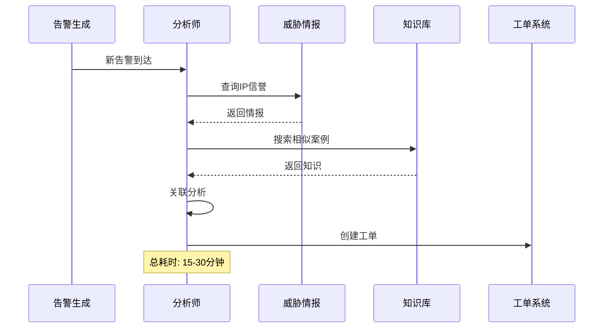

这个流程中存在大量重复性劳动：查询威胁情报、搜索历史案例、填写工单字段。如果每天需要处理1000个告警，即使每个告警只需要15分钟，也需要**250个分析师小时**——这显然是不可承受的。

### 1.2.2 复杂告警的指数级复杂度

更糟糕的是，告警的复杂度并不是线性的。一个简单的"暴力破解"告警可能只需要5分钟研判，但一个涉及APT攻击的告警可能需要：

1. 关联多个时间段的多个告警
2. 分析攻击者的战术、技术和过程（TTP）
3. 判断是否是高级威胁的一部分
4. 评估影响范围和业务风险
5. 制定响应策略

这种复杂度的指数增长，使得人工研判在面对高级攻击时几乎不可能做到及时、准确。

---

## 1.3 全球人才缺口：480万人的安全悖论

### 1.3.1 供需失衡的量化分析

根据ISC2 2024-2025年的研究[^7]：

- 全球网络安全劳动力停滞于**550万**活跃专业人员
- **480万**个网络安全职位空缺无法填补
- 需要增长**87%**才能满足当前需求（世界银行2024）
- **90%**的安全团队报告存在技能缺口

```
劳动力需求公式：
需要的分析师数量 = (日均告警量 × 平均研判时间) / (8小时工作制 × 有效工作时间系数)

假设：
- 日均告警量：10,000
- 平均研判时间：20分钟 = 0.33小时
- 有效工作时间系数：0.6（考虑会议、培训、疲劳等因素）

需要的分析师数量 = (10000 × 0.33) / (8 × 0.6) = 3300 / 4.8 ≈ 688人
```

一个中等规模企业的SOC团队通常只有**10-30人**，存在**20-50倍**的人力缺口。

### 1.3.2 技能转型的困境

即便能够招聘到足够的分析师，技能转型也是一个巨大挑战。传统的SOC分析师技能栈主要是：

- SIEM查询语言（Splunk SPL、Elastic DSL）
- 威胁情报平台使用
- 事件响应流程
- 网络和系统基础知识

而现代SOC需要的技能栈则是：

- 机器学习基础
- AI/ML安全工具开发
- 云原生安全架构
- 自动化编排（SOAR）
- 大语言模型提示工程

这两者之间的gap是巨大的，而培训周期通常需要**1-3年**。

---

## 1.4 响应速度鸿沟：攻击者与防御者的不对称战争

### 1.4.1 攻击链时间轴分析

根据MITRE ATT&CK框架，典型APT攻击的时间轴如下：

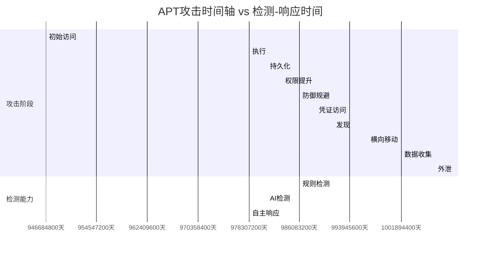

**关键发现**：
- 攻击者完成整个攻击链通常需要**7-14天**
- 传统SOC使用规则引擎平均在**攻击开始后4-5天**才能检测
- AI驱动的SOC可以将检测时间缩短到**2-3天**
- 配置了Autonomous Response的AI SOC可以在**1-2天**内完成检测并响应

### 1.4.2 数据泄露成本的时间敏感性

IBM 2025年报告揭示了一个关键洞察：**发现和遏制漏洞的时间是成本的主要驱动因素**。

| 遏制时间 | 平均泄露成本 | 相对成本倍数 |
|:--------:|:------------:|:------------:|
| <100天 | $310万 | 1.0x |
| 100-200天 | $410万 | 1.32x |
| 200-300天 | $490万 | 1.58x |
| >300天 | $560万 | 1.81x |

每增加一天的遏制时间，成本增加约**$15-20万**。这意味着，更快的AI驱动响应不仅能降低风险，还能直接节省数百万美元的潜在损失。

---

## 1.5 多源数据孤岛：关联分析的失效

### 1.5.1 数据孤岛的技术根源

现代企业的安全数据分布在多个系统中：

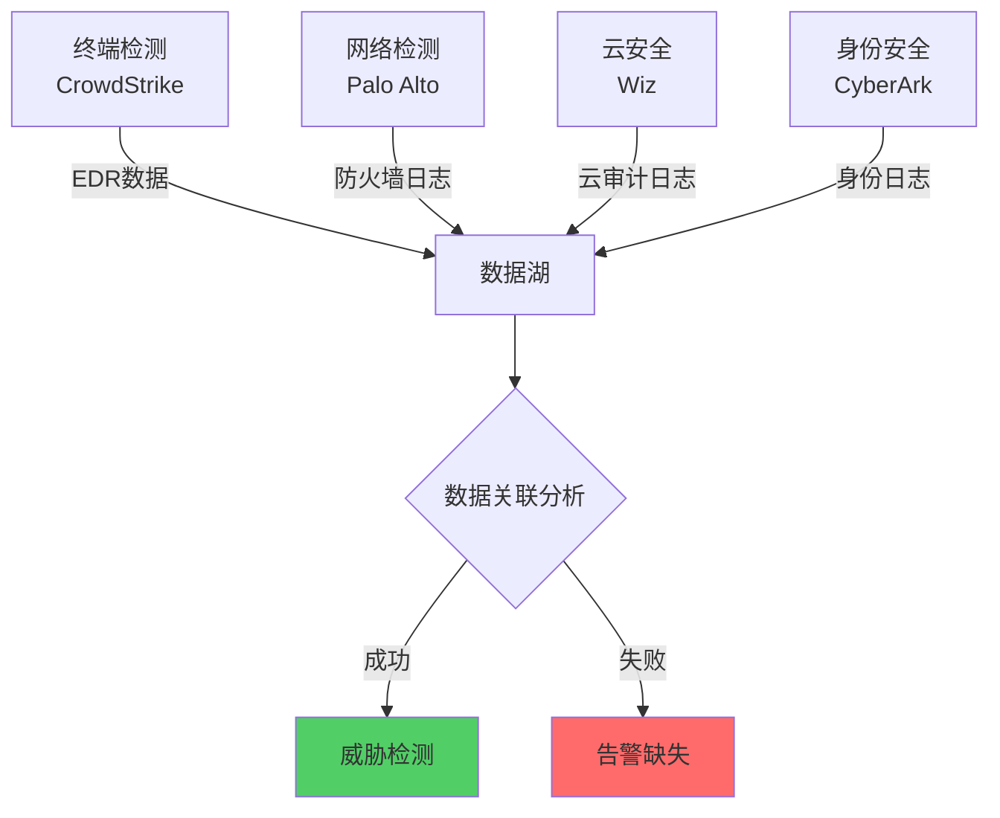

问题是：
1. **格式不一致**：每个工具使用自己的日志格式和字段命名
2. **语义差异**：同一个概念（如"用户"）在不同系统中有不同的表示
3. **时间不同步**：各系统时钟可能存在秒级到分钟级的差异
4. **访问控制**：不同系统需要不同的权限和API

### 1.5.2 关联分析失败的后果

当数据无法有效关联时，SOC面临以下问题：

1. **单点告警被忽略**：一个可疑的PowerShell命令在终端检测工具中产生告警，但如果不关联同一时间段的邮箱登录异常，这条告警可能被低估
2. **攻击链断裂**：攻击者的每个动作都在不同系统中留下痕迹，但无法拼凑出完整的故事
3. **误报率飙升**：缺乏上下文，导致大量"正常但看起来可疑"的行为被标记为威胁

---

# 第二章：人工研判的三大瓶颈

## 2.1 知识储备的局限性

### 2.1.1 知识边界的量化

一名资深SOC分析师通常掌握：

- **MITRE ATT&CK矩阵**：约200+战术技术
- **常见攻击模式**：100-200种
- **工具使用经验**：3-5种SIEM平台
- **行业特定知识**：1-2个行业

但网络威胁的领域是**无限广阔**的：

| 知识维度 | 分析师掌握 | 实际存在 | 覆盖率 |
|:--------:|:----------:|:--------:|:------:|
| ATT&CK技术 | ~200 | ~2,000+ | 10% |
| CVE漏洞库 | ~1,000 | ~250,000+ | 0.4% |
| 恶意软件家族 | ~500 | ~10,000+ | 5% |
| APT组织 | ~20 | ~2,000+ | 1% |

### 2.1.2 知识更新的滞后性

网络安全是一个**快速演进**的领域：

- 每天新增**50-100个** CVE漏洞
- 每周新增**5-10个** 恶意软件家族
- 每月新增**2-3个** APT组织活动

即使是最勤奋的分析师，也不可能跟上这种更新速度。而当分析师无法识别某种攻击手法时，告警就会被忽略或误判。

---

## 2.2 经验复制的困难性

### 2.2.1 隐性知识的黑箱问题

SOC分析师在长期工作中积累了大量**隐性知识**（Tacit Knowledge）：

- "这种告警组合通常意味着什么"
- "这个时间段出现这种行为是正常的"
- "这个攻击者的手法像是某个APT组织"

这些知识难以：
1. **显性化**：分析师往往"凭直觉"判断，很难解释为什么
2. **文档化**：没有现成的知识库可以查询
3. **传承**：新分析师需要2-3年才能积累同等的经验

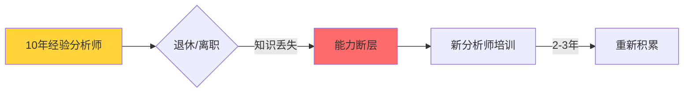

### 2.2.2 经验偏差的影响

即使经验可以复制，人类的认知偏见也会影响判断：

| 偏差类型 | 表现 | 对SOC的影响 |
|:--------:|:-----|:------------|
| 确认偏误 | 倾向寻找支持自己观点的证据 | 可能忽略与初始假设矛盾的告警 |
| 锚定效应 | 过度依赖首次获得的信息 | 早期误判可能导致整个调查方向错误 |
| 疲劳影响 | 连续工作后判断力下降 | 夜班、周末的告警更易被误判 |
| 权威影响 | 倾向于接受资深人员的判断 | 可能复制错误判断而非独立分析 |

---

## 2.3 疲劳与认知过载

### 2.3.1 SOC工作的生理压力

SOC分析师面临持续的生理和心理压力：

- **轮班工作**：24/7监控需求导致不规律的作息
- **高警觉性要求**：需要持续关注可能的风险信号
- **高压环境**：重大事件时需要在高强度下工作
- **重复性任务**：大量时间处理相似的告警

根据多项研究：
- **70%+的分析师**报告存在职业倦怠症状
- **80%+的分析师**表示经常感觉工作落后
- 连续工作**4小时后**，告警处理准确率下降**30%**

### 2.3.2 认知过载的表现

当告警量超过分析师的处理能力时，会出现以下症状：

1. **告警跳过**：看到告警直接标记为"误报"而不深入分析
2. **处理加速**：每个告警的研判时间急剧缩短，但质量下降
3. **选择性忽略**：只处理高优先级的告警，忽略低优先级但可能重要的告警
4. **情绪耗竭**：对告警产生麻木感，失去工作热情

这形成了一个恶性循环：

```
告警过多 → 分析师疲劳 → 告警处理质量下降 → 漏检增加
     ↑                                      ↓
     └────────── 更大的安全事件 ←─────────────┘
```

---

# 第三章：AI SOC的四大演进方向

## 3.1 从规则引擎到机器学习：智能检测范式转移

### 3.1.1 传统规则引擎的局限性

传统的SIEM系统使用预定义的规则来检测威胁：

```yaml
# Splunk典型规则示例
[scan_detection]
search = index=network source=cisco_firewall
  | rex field=src_ip "(?<octet>\d+)"
  | where mvcount(mvfilter(mv>=octet AND mv<=octet)) > 100
alert_on = result
```

这种方法的局限性：

| 维度 | 规则引擎 | 机器学习 |
|:----:|:--------:|:--------:|
| 检测未知威胁 | ❌ 无法检测 | ✅ 可以检测异常 |
| 自适应能力 | ❌ 需要手动更新 | ✅ 自动学习新模式 |
| 误报率 | 高（60-80%） | 低（20-40%） |
| 维护成本 | 高（规则漂移） | 低（自动调优） |
| 跨环境泛化 | 低（依赖环境） | 高（学到的模式可迁移） |

### 3.1.2 机器学习检测的技术路线

现代AI SOC采用多种机器学习技术：

**1. 监督学习用于已知威胁检测**

```python
# 基于监督学习的恶意流量分类
import numpy as np
from sklearn.ensemble import RandomForestClassifier
from sklearn.preprocessing import StandardScaler

class MalwareTrafficClassifier:
    def __init__(self):
        self.scaler = StandardScaler()
        self.model = RandomForestClassifier(
            n_estimators=100,
            max_depth=10,
            random_state=42
        )
        
    def extract_features(self, packet_data):
        features = {
            'packet_size_mean': np.mean(packet_data['sizes']),
            'packet_size_std': np.std(packet_data['sizes']),
            'inter_arrival_time_mean': np.mean(packet_data['times']),
            'inter_arrival_time_std': np.std(packet_data['times']),
            'payload_entropy': self._calculate_entropy(packet_data['payload']),
            'tcp_flags_ratio': self._calculate_flag_ratio(packet_data['flags']),
            'connection_duration': packet_data['times'][-1] - packet_data['times'][0],
            'packet_count': len(packet_data['sizes'])
        }
        return np.array(list(features.values()))
    
    def _calculate_entropy(self, data):
        if len(data) == 0:
            return 0
        byte_counts = np.bincount(np.frombuffer(data, dtype=np.uint8), minlength=256)
        probabilities = byte_counts / len(data)
        return -np.sum(probabilities * np.log2(probabilities + 1e-10))
    
    def _calculate_flag_ratio(self, flags):
        if len(flags) == 0:
            return 0
        return np.sum(flags) / len(flags)
    
    def train(self, X_train, y_train):
        X_scaled = self.scaler.fit_transform(X_train)
        self.model.fit(X_scaled, y_train)
        
    def predict(self, X):
        X_scaled = self.scaler.transform(X)
        return self.model.predict(X_scaled)
    
    def predict_proba(self, X):
        X_scaled = self.scaler.transform(X)
        return self.model.predict_proba(X_scaled)
```

**2. 无监督学习用于异常检测**

```python
# 基于Isolation Forest的异常检测
from sklearn.ensemble import IsolationForest
from sklearn.preprocessing import LabelEncoder
import pandas as pd

class AnomalyDetector:
    def __init__(self, contamination=0.1):
        self.model = IsolationForest(
            contamination=contamination,
            n_estimators=200,
            max_samples='auto',
            random_state=42
        )
        self.encoders = {}
        self.feature_columns = None
        
    def preprocess(self, df):
        processed = df.copy()
        
        categorical_columns = ['source_ip', 'destination_ip', 'protocol', 'user']
        for col in categorical_columns:
            if col not in self.encoders:
                self.encoders[col] = LabelEncoder()
                processed[col] = self.encoders[col].fit_transform(processed[col].astype(str))
            else:
                processed[col] = self.encoders[col].transform(processed[col].astype(str))
        
        return processed
    
    def fit(self, df):
        processed = self.preprocess(df)
        self.feature_columns = processed.columns.tolist()
        self.model.fit(processed)
        
    def predict(self, df):
        processed = self.preprocess(df)
        predictions = self.model.predict(processed)
        scores = self.model.score_samples(processed)
        return predictions, scores
    
    def detect(self, df, threshold=-0.5):
        predictions, scores = self.predict(df)
        anomalies = df.copy()
        anomalies['is_anomaly'] = predictions == -1
        anomalies['anomaly_score'] = scores
        anomalies['alert'] = scores < threshold
        return anomalies[anomalies['alert']]
```

**3. 深度学习用于时序分析**

```python
# 基于LSTM的时序异常检测
import tensorflow as tf
from tensorflow.keras.models import Sequential
from tensorflow.keras.layers import LSTM, Dense, Dropout

class LSTMAnomalyDetector:
    def __init__(self, sequence_length=30, features=10):
        self.sequence_length = sequence_length
        self.features = features
        self.model = self._build_model()
        
    def _build_model(self):
        model = Sequential([
            LSTM(64, input_shape=(self.sequence_length, self.features), 
                 return_sequences=True),
            Dropout(0.2),
            LSTM(32, return_sequences=False),
            Dropout(0.2),
            Dense(16, activation='relu'),
            Dense(self.features, activation='sigmoid')
        ])
        model.compile(optimizer='adam', loss='mse')
        return model
    
    def create_sequences(self, data):
        X = []
        for i in range(len(data) - self.sequence_length):
            X.append(data[i:i + self.sequence_length])
        return np.array(X)
    
    def train(self, normal_data, epochs=50, batch_size=32):
        X_train = self.create_sequences(normal_data)
        self.model.fit(X_train, X_train, epochs=epochs, batch_size=batch_size)
        
    def detect_anomalies(self, data, threshold=0.02):
        X = self.create_sequences(data)
        reconstructions = self.model.predict(X)
        
        mse = np.mean(np.power(X - reconstructions, 2), axis=(1, 2))
        anomalies = mse > threshold
        
        return anomalies, mse
```

### 3.1.3 Elastic Security的机器学习实践

[Elastic Security](https://github.com/elastic/security-docs)是一个典型的AI驱动安全平台，其机器学习模块包含：

- **Population Analysis**：学习实体的正常行为基线
- **Distributed LOF**：基于Local Outlier Factor的异常检测
- **Latent Dirichlet Allocation (LDA)**：用于发现隐藏的主题/行为模式
- **Fixed Threshold**：基于统计的固定阈值告警
- **Adaptive Threshold**：基于历史数据动态调整阈值

```python
# Elastic Machine Learning Job配置示例
ml_job_config = {
    "job_id": "soc_network_anomaly_detection",
    "job_type": "anomaly_detector",
    "analysis_config": {
        "bucket_span": "15m",
        "detectors": [
            {
                "function": "mean",
                "field_name": "bytes_out",
                "by_fields": ["source.ip", "destination.ip"],
                "partition_fields": ["network.protocol"]
            },
            {
                "function": "high_info_content",
                "field_name": "dns.query_name",
                "by_fields": ["source.ip"]
            },
            {
                "function": "rare",
                "field_name": "user.name",
                "by_fields": ["source.ip"]
            }
        ],
        "influencers": [
            "source.ip",
            "destination.ip",
            "user.name",
            "host.name"
        ]
    },
    "data_description": {
        "time_field": "@timestamp"
    },
    "model_plot_config": {
        "enabled": True
    },
    "analysis_limits": {
        "model_memory_limit": "128mb"
    }
}
```

---

## 3.2 从单点工具到平台融合：统一数据层的崛起

### 3.2.1 传统SOC的工具碎片化问题

传统SOC架构通常包含：

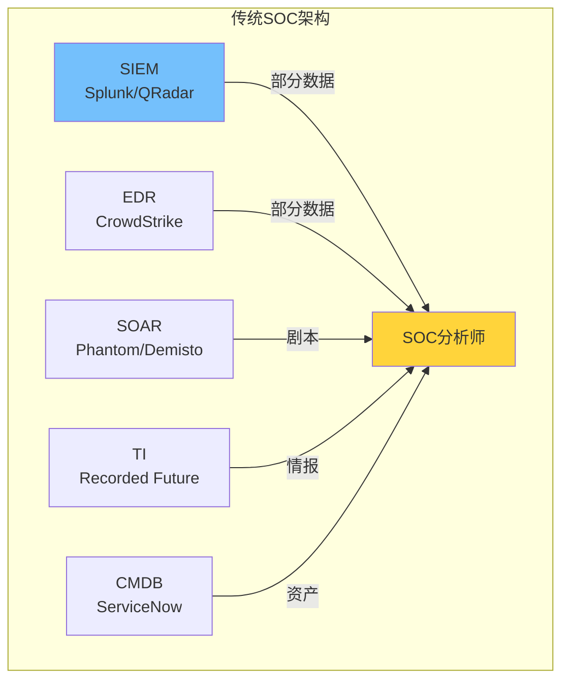

这种架构的问题：

1. **数据分散**：每个工具只看到部分画面
2. **集成复杂**：每个工具需要单独配置和维护
3. **上下文丢失**：工具之间的关联分析困难
4. **响应延迟**：跨工具的联动需要人工协调

### 3.2.2 Microsoft Sentinel的统一数据平台

[Microsoft Sentinel](https://github.com/MicrosoftDocs/azure-docs/blob/main/articles/sentinel/sentinel-overview.md)代表了新一代SOC平台的理念——**统一数据湖+AI分析+原生SOAR**：

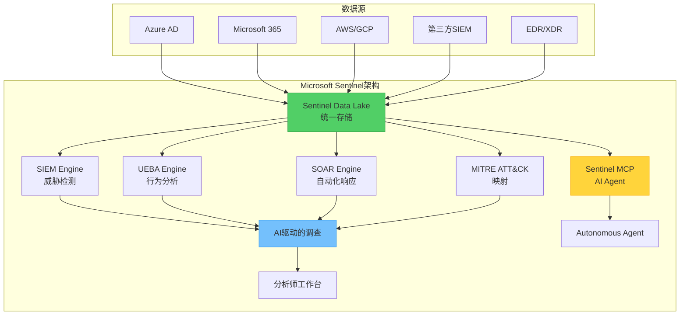

Sentinel的核心优势：

| 能力 | 传统SIEM | Microsoft Sentinel |
|:----:|:--------:|:-------------------:|
| 数据存储成本 | 高（专有格式） | 低44%（基于数据湖）[^8] |
| 误报降低 | 基准 | 降低79% |
| 违规可能性 | 基准 | 降低35% |
| AI集成 | 有限/插件 | 原生内置 |
| SOAR能力 | 需单独购买 | 原生内置 |

### 3.2.3 Shuffle的SOAR平台实践

[Shuffle](https://github.com/shuffle/shuffle)是一个开源的SOAR平台，展示了自动化编排的核心能力：

```python
# Shuffle工作流定义示例
shuffle_workflow = {
    "name": "phishing_response_workflow",
    "version": "1.0",
    "trigger": {
        "type": "webhook",
        "source": "email_gateway"
    },
    "steps": [
        {
            "name": "extract_indicators",
            "app": "GenericWebhook",
            "action": "parse_email",
            "outputs": ["sender", "subject", "urls", "attachments"]
        },
        {
            "name": "check_url_reputation",
            "app": "VirusTotal",
            "action": "scan_urls",
            "inputs": {
                "urls": "{{steps.extract_indicators.outputs.urls}}"
            }
        },
        {
            "name": "check_sender_reputation",
            "app": "AbuseIPDB",
            "action": "check_ip",
            "inputs": {
                "ip": "{{steps.extract_indicators.outputs.sender_ip}}"
            }
        },
        {
            "name": "block_and_contain",
            "app": "PaloAltoNetworks",
            "action": "block_ip",
            "condition": "{{steps.check_url_reputation.outputs.threat_score}} > 70"
        },
        {
            "name": "notify_analyst",
            "app": "Slack",
            "action": "send_message",
            "inputs": {
                "channel": "#security-alerts",
                "message": "Phishing alert: {{steps.extract_indicators.outputs.subject}}"
            }
        },
        {
            "name": "create_incident",
            "app": "TheHive",
            "action": "create_case",
            "inputs": {
                "title": "Phishing: {{steps.extract_indicators.outputs.subject}}",
                "severity": "{{steps.check_url_reputation.outputs.threat_score}}",
                "indicators": "{{steps.extract_indicators.outputs}}"
            }
        }
    ]
}
```

---

## 3.3 从被动响应到主动预测：威胁猎踪的范式升级

### 3.3.1 被动响应 vs 主动预测

传统SOC的运营模式是**被动响应**：

```
攻击发生 → 告警生成 → 人工研判 → 响应启动 → 遏制完成
    ↑                                              ↓
    └──────────────── 延迟 ──────────────────────┘
```

主动预测的模式是：

```
威胁情报 + 攻击面分析 + 异常行为检测 → 预测攻击路径 → 主动防御
         ↑                                                      ↓
         └──────────────── 先发制人 ──────────────────────────┘
```

### 3.3.2 威胁猎踪的技术栈

主动威胁猎踪涉及以下技术：

```python
class ThreatHuntingFramework:
    def __init__(self):
        self.attack_surface = AttackSurfaceMapper()
        self.behavior_analyzer = BehaviorAnalyzer()
        self.threat_intel = ThreatIntelligenceConnector()
        self.hypothesis_generator = HypothesisEngine()
        
    def generate_hypothesis(self, threat_intel, attack_surface):
        hypotheses = []
        
        for apt_group in threat_intel.get_active_groups():
            for technique in apt_group.get_techniques():
                for exposed_asset in attack_surface.get_vulnerable_assets():
                    if self._technique_applicable(technique, exposed_asset):
                        hypothesis = {
                            'group': apt_group.name,
                            'technique': technique.id,
                            'asset': exposed_asset.id,
                            'likelihood': self._calculate_likelihood(technique, exposed_asset),
                            'hunting_queries': self._generate_hunting_queries(technique, exposed_asset)
                        }
                        hypotheses.append(hypothesis)
        
        return sorted(hypotheses, key=lambda x: x['likelihood'], reverse=True)
    
    def _technique_applicable(self, technique, asset):
        applicable = (
            technique.prerequisites.fulfilled_by(asset) and
            technique.platform.supports(asset.os) and
            not technique.mitigated_by(asset.controls)
        )
        return applicable
    
    def _calculate_likelihood(self, technique, asset):
        base_score = technique.prevalence * asset.exposure
        
        threat_intel_weight = self.threat_intel.get_group_activity(technique.group)
        exposure_weight = asset.external_exposure * asset.criticality
        mitigation_gap = 1 - asset.mitigation_coverage
        
        return base_score * threat_intel_weight * exposure_weight * mitigation_gap
    
    def _generate_hunting_queries(self, technique, asset):
        queries = []
        
        if technique.id == 'T1059.003':  # PowerShell
            queries.append({
                'platform': 'sentinel',
                'query': '''
                    DeviceProcessEvents
                    | where Timestamp > ago(30d)
                    | where ProcessCommandLine contains "powershell"
                    | where InitiatingProcessCommandLine contains "script"
                    | summarize Count=count() by bin(Timestamp, 1h), DeviceName
                    | where Count > 10
                '''
            })
        
        elif technique.id == 'T1046':  # Network Service Scanning
            queries.append({
                'platform': 'sentinel',
                'query': '''
                    NetworkCommunicationEvents
                    | where Timestamp > ago(7d)
                    | where RemotePort in (22, 23, 135, 139, 445, 3389)
                    | summarize FailedConnections=countif(IsConnectionFailed==true),
                                TotalConnections=count()
                              by SrcDeviceName, RemoteIP, bin(Timestamp, 1h)
                    | where FailedConnections * 1.0 / TotalConnections > 0.5
                '''
            })
            
        return queries
```

---

## 3.4 从人工决策到人机协同：AI作为力量倍增器

### 3.4.1 人机协同的模式演进

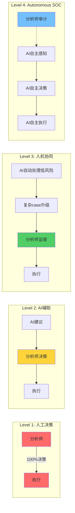

### 3.4.2 Gurucul的AI SOC实践

[Gurucul](https://www.prnewswire.com/news-releases/60-of-adopters-of-ai-socs-have-cut-investigation-time-by-at-least-25-302535202.html)的2025年AI SOC调研显示：

| 指标 | 改进幅度 |
|:-----|:---------:|
| 调查时间缩短 | ≥25% (60%用户) |
| 误报率降低 | 40-60% |
| 威胁检测速度 | 提升3-5倍 |
| 分析师效率 | 提升5-10倍 |

### 3.4.3 AI辅助决策的技术实现

```python
class AICoAnalyst:
    def __init__(self, llm_client):
        self.llm = llm_client
        self.knowledge_base = SecurityKnowledgeBase()
        self.threat_intel = ThreatIntelAPI()
        
    async def investigate_alert(self, alert):
        context = await self._gather_context(alert)
        
        prompt = f"""
        你是一名资深SOC分析师。请基于以下告警信息进行调查：
        
        告警详情：
        - 告警ID: {alert.id}
        - 类型: {alert.type}
        - 严重程度: {alert.severity}
        - 时间: {alert.timestamp}
        - 涉及实体: {alert.entities}
        
        上下文信息：
        {context}
        
        请提供：
        1. 告警概述（2-3句话）
        2. 可能性分析（最可能/可能/不太可能的原因）
        3. 建议的调查步骤（按优先级排序）
        4. 需要获取的额外数据
        5. 风险评估（1-10）
        6. 建议的响应动作
        """
        
        analysis = await self.llm.generate(prompt)
        
        return InvestigationResult(
            alert_id=alert.id,
            summary=analysis.summary,
            likelihoods=analysis.likelihoods,
            recommended_steps=analysis.steps,
            risk_score=analysis.risk_score,
            suggested_actions=analysis.actions,
            confidence=analysis.confidence
        )
    
    async def _gather_context(self, alert):
        ip_reputation = await self.threat_intel.check_ip(alert.source_ip)
        user_history = await self.knowledge_base.get_user_activity(alert.user)
        similar_alerts = await self.knowledge_base.get_similar_alerts(alert.type)
        asset_info = await self.knowledge_base.get_asset_info(alert.affected_asset)
        
        return {
            'ip_reputation': ip_reputation,
            'user_history': user_history,
            'similar_alerts': similar_alerts,
            'asset_info': asset_info
        }
```

---

# 第四章：Agentic SOC概念解析

## 4.1 Agentic AI的定义与特征

### 4.1.1 什么是Agentic AI

根据Simbian.ai的定义，Agentic AI是：

> 能够做出上下文感知的决策、编排工具、执行多步防御工作流程，并且**几乎不需要人工干预**的自主、自适应AI系统。

关键特征：

1. **自主性（Autonomy）**：能够独立执行任务，无需人工每步指导
2. **主动性（Proactivity）**：不仅响应请求，还能预测需求并采取行动
3. **上下文感知（Context Awareness）**：理解环境的复杂上下文
4. **工具编排（Tool Orchestration）**：能够调用和协调多种工具
5. **学习适应（Learning & Adaptation）**：从经验中学习并改进

### 4.1.2 Agentic AI vs 传统AI

| 维度 | 传统AI | Agentic AI |
|:----:|:------:|:----------:|
| 交互模式 | 被动响应查询 | 主动推理和行动 |
| 决策范围 | 单点决策 | 多步推理链 |
| 工具使用 | 无 | 原生支持工具调用 |
| 人工干预 | 高（每步确认） | 低（仅审计/升级） |
| 适用场景 | 分类/检测 | 复杂任务自动化 |

---

## 4.2 Agentic SOC的三层架构

### 4.2.1 架构概览

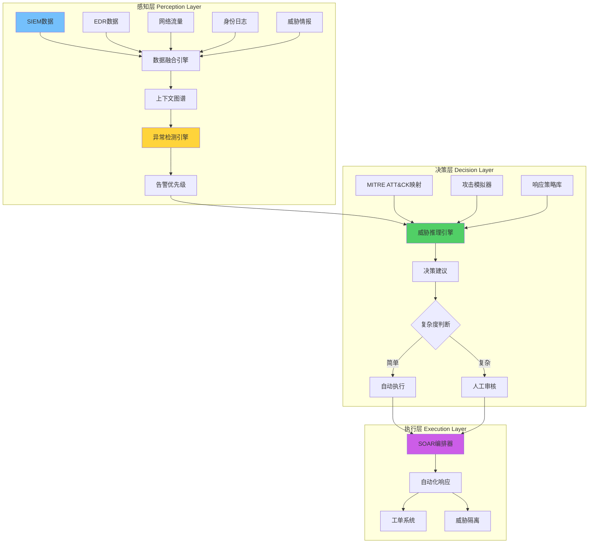

### 4.2.2 感知层详解

感知层负责**数据采集、融合和异常检测**：

```python
class PerceptionLayer:
    def __init__(self):
        self.data_sources = []
        self.graph_builder = ContextGraphBuilder()
        self.anomaly_detector = MultiModalAnomalyDetector()
        
    async def process_events(self, raw_events):
        structured_events = []
        
        for event in raw_events:
            normalized = self._normalize_event(event)
            enriched = await self._enrich_event(normalized)
            structured_events.append(enriched)
        
        context_graph = await self.graph_builder.build(structured_events)
        anomalies = await self.anomaly_detector.detect(context_graph)
        
        prioritized_alerts = self._prioritize_alerts(anomalies)
        
        return prioritized_alerts
    
    def _normalize_event(self, event):
        normalized = {
            'timestamp': self._normalize_timestamp(event['time']),
            'source_ip': self._normalize_ip(event['src']),
            'destination_ip': self._normalize_ip(event['dst']),
            'source_port': int(event['sport']),
            'destination_port': int(event['dport']),
            'protocol': event['proto'].upper(),
            'action': event.get('action', 'unknown'),
            'user': event.get('user', 'unknown'),
            'hostname': event.get('host', 'unknown'),
            'raw_data': event
        }
        return normalized
    
    async def _enrich_event(self, event):
        geo = await self.geo_service.lookup(event['source_ip'])
        whois = await self.whois_service.lookup(event['source_ip'])
        threat_intel = await self.ti_service.check(event['source_ip'])
        
        event['geo'] = geo
        event['whois'] = whois
        event['threat_intel'] = threat_intel
        
        if event['user'] != 'unknown':
            user_info = await self.identity_service.get_user(event['user'])
            event['user_info'] = user_info
            
        if event['hostname'] != 'unknown':
            asset_info = await self.cmdb_service.get_asset(event['hostname'])
            event['asset_info'] = asset_info
        
        return event
```

### 4.2.3 决策层详解

决策层是Agentic SOC的**大脑**，负责推理和规划：

```python
class DecisionLayer:
    def __init__(self):
        self.reasoning_engine = ThreatReasoningEngine()
        self.attack_mapper = ATTACKMapper()
        self.response_selector = ResponseSelector()
        
    async def make_decision(self, alert):
        threat_context = await self._analyze_threat(alert)
        
        attack_chain = self._reconstruct_attack_chain(alert, threat_context)
        
        mapped_techniques = self.attack_mapper.map(attack_chain)
        
        response_options = self.response_selector.get_options(
            severity=threat_context.severity,
            techniques=mapped_techniques,
            affected_assets=alert.affected_assets
        )
        
        selected_response = await self._select_optimal_response(
            response_options,
            threat_context
        )
        
        decision = {
            'alert_id': alert.id,
            'threat_type': threat_context.type,
            'confidence': threat_context.confidence,
            'attack_chain': attack_chain,
            'mapped_techniques': mapped_techniques,
            'selected_response': selected_response,
            'requires_human_review': selected_response.requires_approval,
            'reasoning': selected_response.reasoning
        }
        
        return Decision(**decision)
    
    async def _analyze_threat(self, alert):
        similar_incidents = await self.incident_db.find_similar(alert)
        
        if similar_incidents:
            threat_type = self._infer_threat_type_from_similar(
                similar_incidents,
                alert
            )
            confidence = 0.8
        else:
            threat_type = await self._ml_classify_threat(alert)
            confidence = 0.6
        
        severity = self._calculate_severity(
            alert.impact,
            alert.likelihood,
            alert.asset_criticality
        )
        
        return ThreatContext(
            type=threat_type,
            confidence=confidence,
            severity=severity
        )
```

### 4.2.4 执行层详解

执行层负责**自动化响应的实施**：

```python
class ExecutionLayer:
    def __init__(self):
        self.orchestrator = SOAROrchestrator()
        self.action_library = ResponseActionLibrary()
        
    async def execute_response(self, decision):
        if decision.selected_response.requires_approval:
            approval = await self._request_approval(decision)
            if not approval.approved:
                return ExecutionResult(
                    status='blocked',
                    reason='Approval denied'
                )
        
        execution_plan = self._build_execution_plan(
            decision.selected_response
        )
        
        results = []
        for step in execution_plan.steps:
            result = await self._execute_step(step)
            results.append(result)
            
            if result.failed and execution_plan.stop_on_failure:
                break
                
            if result.requires_escalation:
                await self._escalate(decision, result)
        
        return ExecutionResult(
            status='completed',
            steps_executed=len(results),
            step_results=results
        )
    
    async def _execute_step(self, step):
        action = self.action_library.get_action(step.action_type)
        
        try:
            result = await action.execute(
                targets=step.targets,
                parameters=step.parameters
            )
            
            await self._log_action(step, result)
            
            return StepResult(
                step_id=step.id,
                status='success',
                output=result
            )
            
        except Exception as e:
            return StepResult(
                step_id=step.id,
                status='failed',
                error=str(e)
            )
```

---

## 4.3 Agentic SOC的技术组件

### 4.3.1 Microsoft Sentinel MCP服务器

[Microsoft Sentinel MCP服务器](https://techcommunity.microsoft.com/t5/core-infrastructure-and-security/using-microsoft-sentinel-mcp-server-with-github-copilot-for-ai/ba-p/4464980)是Agentic SOC的关键组件：

```python
# MCP服务器集成示例
from mcp.server import MCPServer
from mcp.types import Tool, Resource

sentinel_mcp_server = MCPServer(
    name="sentinel-mcp-server",
    version="1.0.0"
)

@sentinel_mcp_server.tool()
async def query_sentinel(natural_language_query: str) -> dict:
    prompt = f"""
    将以下自然语言查询转换为KQL查询：
    
    查询：{natural_language_query}
    
    KQL：
    """
    kql_query = await llm.generate(prompt)
    
    results = await sentinel_client.execute_query(kql_query)
    return results

@sentinel_mcp_server.tool()
async def investigate_incident(incident_id: str) -> dict:
    incident = await sentinel_client.get_incident(incident_id)
    
    related_alerts = await sentinel_client.get_related_alerts(incident_id)
    entity_graph = await sentinel_client.get_entity_graph(incident_id)
    
    analysis = await ai_analyzer.analyze_incident(
        incident=incident,
        alerts=related_alerts,
        entity_graph=entity_graph
    )
    
    return {
        'incident': incident,
        'analysis': analysis,
        'recommended_actions': analysis.suggested_actions
    }

@sentinel_mcp_server.tool()
async def hunt_threats(hypothesis: str) -> dict:
    hunt_job = await sentinel_client.create_hunting_job(
        name=hypothesis,
        query_template=self._generate_hunt_query(hypothesis)
    )
    
    results = await hunt_job.execute()
    
    return {
        'hypothesis': hypothesis,
        'results_count': len(results),
        'results': results[:100],
        'statistics': results.statistics
    }
```

### 4.3.2 Cisco Foundation-Sec-8B安全大模型

[Cisco的Foundation-Sec-8B](https://www.hackerspot.net/p/ciscos-new-open-source-cybersecurity-757)是专门为网络安全设计的LLM：

| 指标 | Foundation-Sec-8B | GPT-4o-mini | Llama 3.1-8B |
|:----:|:-----------------:|:-----------:|:------------:|
| 网络安全任务 | **competitive** | competitive | 低于 |
| ATT&CK理解 | ✅ 强 | ✅ 强 | ❌ 弱 |
| CVE知识 | ✅ 强 | ✅ 强 | ❌ 弱 |
| 威胁情报生成 | ✅ 强 | ✅ 强 | ❌ 弱 |
| 指令遵循 | **competitive** | competitive | competitive |

核心能力：

```python
# 使用Foundation-Sec-8B进行威胁分析
from transformers import AutoModelForCausalLM, AutoTokenizer

class SecurityLLMAnalyzer:
    def __init__(self, model_path="cisco/foundation-sec-8b"):
        self.tokenizer = AutoTokenizer.from_pretrained(model_path)
        self.model = AutoModelForCausalLM.from_pretrained(model_path)
        
    async def analyze_malware_behavior(self, malware_report: str) -> dict:
        prompt = f"""
        作为一名恶意软件分析师，请分析以下恶意软件报告并提供：
        
        1. 恶意软件家族分类
        2. 攻击能力评估（基于ATT&CK框架）
        3. 潜在目标行业
        4. 建议的检测策略
        5. 相关的威胁情报指标
        
        报告内容：
        {malware_report}
        
        分析：
        """
        
        inputs = self.tokenizer(prompt, return_tensors="pt")
        outputs = self.model.generate(**inputs, max_new_tokens=500)
        
        analysis = self.tokenizer.decode(outputs[0], skip_special_tokens=True)
        
        return self._parse_analysis(analysis)
    
    async def generate_detection_rules(self, attack_technique: str) -> dict:
        prompt = f"""
        基于以下攻击技术，生成检测规则：
        
        技术ID: {attack_technique}
        
        请生成：
        1. Sigma规则
        2. YARA规则
        3. Splunk SPL查询
        4. Elastic DSL查询
        
        规则：
        """
        
        inputs = self.tokenizer(prompt, return_tensors="pt")
        outputs = self.model.generate(**inputs, max_new_tokens=800)
        
        rules = self.tokenizer.decode(outputs[0], skip_special_tokens=True)
        
        return self._parse_rules(rules)
```

---

# 第五章：技术实现与代码示例

## 5.1 开源AI SOC项目深度分析

### 5.1.1 Chesblaw/SOC - LangGraph驱动的SOC POC

[Chesblaw/SOC](https://github.com/Chesblaw/SOC)是一个使用LangGraph构建的SOC概念验证，展示了Multi-Agent架构在安全运营中的应用：

```python
"""
SOC POC with LangGraph - 核心架构
"""
from langgraph.graph import StateGraph, END
from langgraph.prebuilt import ToolNode
from typing import TypedDict, Annotated
import operator

class SOCState(TypedDict):
    alert: dict
    investigation_results: Annotated[list, operator.add]
    current_agent: str
    decision: str
    response_actions: list

class SOCAgenticSystem:
    def __init__(self):
        self.graph = self._build_graph()
        self.tools = self._initialize_tools()
        
    def _build_graph(self) -> StateGraph:
        workflow = StateGraph(SOCState)
        
        workflow.add_node("triage_agent", self.triage_agent)
        workflow.add_node("investigation_agent", self.investigation_agent)
        workflow.add_node("response_agent", self.response_agent)
        workflow.add_node("learning_agent", self.learning_agent)
        
        workflow.set_entry_point("triage_agent")
        
        workflow.add_edge("triage_agent", "investigation_agent")
        workflow.add_edge("investigation_agent", "response_agent")
        workflow.add_edge("response_agent", "learning_agent")
        workflow.add_edge("learning_agent", END)
        
        return workflow.compile()
    
    def triage_agent(self, state: SOCState) -> SOCState:
        alert = state["alert"]
        
        triage_prompt = f"""
        作为Triage Agent，请评估以下告警的优先级：
        
        告警详情：
        - 类型: {alert.get('type')}
        - 来源: {alert.get('source')}
        - 严重程度: {alert.get('severity')}
        - 涉及实体: {alert.get('entities')}
        - 时间: {alert.get('timestamp')}
        
        请判断：
        1. 告警是否真实威胁？（是/否/不确定）
        2. 紧急程度？（1-5级）
        3. 需要哪些额外信息？
        """
        
        triage_result = self.llm.analyze(triage_prompt)
        
        return {
            "current_agent": "triage_agent",
            "investigation_results": [triage_result]
        }
    
    def investigation_agent(self, state: SOCState) -> SOCState:
        triage_result = state["investigation_results"][0]
        alert = state["alert"]
        
        if triage_result.urgency < 3:
            return {
                "current_agent": "response_agent",
                "investigation_results": state["investigation_results"]
            }
        
        investigation_prompt = f"""
        作为Investigation Agent，请深入调查以下告警：
        
        告警: {alert}
        Triage结果: {triage_result}
        
        请执行：
        1. 威胁情报查询（IP/域名信誉）
        2. 关联分析（相似历史告警）
        3. 实体上下文（用户/主机信息）
        4. 攻击链推断
        
        调查结果：
        """
        
        investigation = await self._parallel_investigation(
            alert,
            triage_result
        )
        
        return {
            "current_agent": "investigation_agent",
            "investigation_results": state["investigation_results"] + [investigation]
        }
    
    def response_agent(self, state: SOCState) -> SOCState:
        all_results = state["investigation_results"]
        
        response_prompt = f"""
        作为Response Agent，请基于调查结果制定响应策略：
        
        调查结果：
        {all_results}
        
        请决定：
        1. 是否需要采取行动？
        2. 推荐哪些行动？（封锁IP、隔离主机、禁用账户等）
        3. 是否需要人工审批？
        """
        
        response_plan = self.llm.analyze(response_prompt)
        
        if response_plan.requires_approval:
            await self._request_approval(response_plan)
        
        executed_actions = await self._execute_actions(
            response_plan.actions
        )
        
        return {
            "current_agent": "response_agent",
            "response_actions": executed_actions
        }
    
    async def _parallel_investigation(self, alert, triage):
        tasks = [
            self.query_threat_intel(alert.source_ip),
            self.get_user_context(alert.user),
            self.get_host_context(alert.hostname),
            self.search_similar_alerts(alert.type),
            self.check_external_reputation(alert.entities)
        ]
        
        results = await asyncio.gather(*tasks)
        
        return {
            'threat_intel': results[0],
            'user_context': results[1],
            'host_context': results[2],
            'similar_alerts': results[3],
            'external_reputation': results[4]
        }
```

### 5.1.2 AI-SOC-Detection-System - GPT-4驱动的检测系统

[AI-SOC-Detection-System](https://github.com/cyberarber/ai-soc-detection-system)展示了GPT-4在实时威胁检测中的应用：

```python
"""
AI-Powered SOC Detection System - 实时检测引擎
"""
import asyncio
from typing import List, Dict
from dataclasses import dataclass
import pandas as pd
from openai import AsyncOpenAI

@dataclass
class SecurityAlert:
    timestamp: str
    source_ip: str
    destination_ip: str
    event_type: str
    raw_log: str
    severity: str

class AISOCDetectionEngine:
    def __init__(self, api_key: str):
        self.openai_client = AsyncOpenAI(api_key=api_key)
        self.wazuh_client = WazuhClient()
        self.elk_client = ELKClient()
        
    async def analyze_attack_sequence(self, events: List[SecurityAlert]) -> Dict:
        formatted_events = self._format_events_for_llm(events)
        
        prompt = f"""
        作为一名AI安全分析师，请分析以下攻击事件序列：
        
        事件序列：
        {formatted_events}
        
        请提供：
        1. 攻击类型判断
        2. 攻击阶段识别（侦察/利用/持久化/命令控制/数据外泄）
        3. 威胁评分（0-100）
        4. 推荐响应动作
        5. 完整的事件摘要
        """
        
        response = await self.openai_client.chat.completions.create(
            model="gpt-4",
            messages=[
                {
                    "role": "system",
                    "content": "你是一名专业的SOC分析师，擅长分析复杂的网络攻击事件。"
                },
                {
                    "role": "user",
                    "content": prompt
                }
            ],
            temperature=0.3,
            max_tokens=1500
        )
        
        analysis = response.choices[0].message.content
        
        severity = self._extract_severity(analysis)
        
        return {
            'analysis': analysis,
            'severity': severity,
            'event_count': len(events),
            'time_range': f"{events[0].timestamp} to {events[-1].timestamp}"
        }
    
    def _format_events_for_llm(self, events: List[SecurityAlert]) -> str:
        formatted = []
        for i, event in enumerate(events, 1):
            formatted.append(f"""
            [{i}] {event.timestamp}
            类型: {event.event_type}
            源IP: {event.source_ip}
            目标IP: {event.destination_ip}
            日志: {event.raw_log[:200]}...
            """)
        return "\n".join(formatted)
    
    async def process_realtime_alerts(self):
        while True:
            try:
                raw_logs = await self.wazuh_client.get_recent_logs(limit=50)
                
                structured_events = [
                    self._parse_log(log) for log in raw_logs
                ]
                
                alerts = [
                    SecurityAlert(**event) 
                    for event in structured_events 
                    if self._is_significant(event)
                ]
                
                if len(alerts) >= 5:
                    analysis = await self.analyze_attack_sequence(alerts)
                    
                    if analysis['severity'] >= 70:
                        await self._create_security_incident(alerts, analysis)
                        
                    await self._log_analysis(analysis)
                
                await asyncio.sleep(10)
                
            except Exception as e:
                print(f"Error processing alerts: {e}")
                await asyncio.sleep(30)
```

### 5.1.3 完整的安全分析工作流示例

```python
"""
完整的安全分析工作流 - 从数据采集到响应
"""
import asyncio
from datetime import datetime, timedelta
from typing import List, Dict, Optional

class SecurityAnalysisWorkflow:
    def __init__(self, config: dict):
        self.config = config
        self.siem_client = SIEMClient(config['siem'])
        self.llm_client = LLMClient(config['llm'])
        self.soar_client = SOARClient(config['soar'])
        
    async def run_full_analysis(self, alert_id: str) -> Dict:
        start_time = datetime.now()
        
        print(f"[{start_time}] Starting analysis for alert {alert_id}")
        
        alert_data = await self.siem_client.get_alert(alert_id)
        print(f"[+] Alert data retrieved: {alert_data['type']}")
        
        related_events = await self.siem_client.get_related_events(
            alert_data['entity_id'],
            time_range=timedelta(hours=24)
        )
        print(f"[+] Related events: {len(related_events)}")
        
        enriched_alert = await self._enrich_with_context(alert_data)
        print(f"[+] Alert enriched with context")
        
        threat_intel = await self._query_threat_intel(enriched_alert)
        print(f"[+] Threat intel: {threat_intel['verdict']}")
        
        similar_cases = await self._find_similar_cases(enriched_alert)
        print(f"[+] Similar cases found: {len(similar_cases)}")
        
        llm_analysis = await self._llm_deep_analysis(
            alert=enriched_alert,
            related_events=related_events,
            threat_intel=threat_intel,
            similar_cases=similar_cases
        )
        print(f"[+] LLM Analysis complete: Severity={llm_analysis['severity']}")
        
        if llm_analysis['requires_response']:
            response_result = await self._execute_response(llm_analysis)
            print(f"[+] Response executed: {response_result['status']}")
        else:
            response_result = {'status': 'no_action_required'}
        
        investigation_report = await self._generate_report(
            alert=alert_data,
            analysis=llm_analysis,
            response=response_result,
            duration=(datetime.now() - start_time)
        )
        
        return investigation_report
    
    async def _llm_deep_analysis(self, **context) -> Dict:
        prompt = f"""
        # 安全事件深度分析
        
        ## 事件概述
        {context['alert']['summary']}
        
        ## 事件时间线
        {self._format_events(context['related_events'])}
        
        ## 威胁情报
        - IP信誉: {context['threat_intel']['ip_reputation']}
        - 威胁类型: {context['threat_intel']['threat_type']}
        - 相关APT组织: {context['threat_intel'].get('apt_groups', '未知')}
        
        ## 相似案例
        {self._format_similar_cases(context['similar_cases'])}
        
        ## 分析要求
        请作为资深威胁猎人，提供：
        
        1. **事件定性**: 这是否是一个真实攻击？（是/否/不确定 + 置信度）
        2. **攻击链重建**: 如果是攻击，请重建完整攻击链（初始访问→执行→...→影响）
        3. **ATT&CK映射**: 映射到具体的MITRE ATT&CK技术
        4. **影响评估**: 哪些系统和数据可能受影响？
        5. **紧迫性判断**: 响应时间窗口（立即/24h/72h/可等待）
        6. **响应建议**: 具体的技术动作
        
        输出格式：JSON
        """
        
        response = await self.llm_client.analyze(prompt)
        
        return {
            'is_attack': response['is_attack'],
            'confidence': response['confidence'],
            'severity': response['severity'],
            'attack_chain': response['attack_chain'],
            'attack_techniques': response['mapped_techniques'],
            'impact_scope': response['impact_scope'],
            'urgency': response['urgency'],
            'recommended_actions': response['actions'],
            'requires_response': response['urgency'] in ['immediate', '24h']
        }
    
    async def _execute_response(self, analysis: Dict) -> Dict:
        actions_taken = []
        
        if analysis['attack_techniques']:
            for technique in analysis['attack_techniques']:
                if technique in ['T1046', 'T1059', 'T1053']:
                    block_result = await self.soar_client.execute_action(
                        action='block_ip',
                        target=analysis['source_ip']
                    )
                    actions_taken.append({
                        'action': 'block_ip',
                        'target': analysis['source_ip'],
                        'result': block_result
                    })
        
        ticket = await self.soar_client.create_incident_ticket(
            title=f"SEC-{analysis['alert_id']}: {analysis['attack_type']}",
            severity=analysis['severity'],
            description=analysis['summary'],
            recommended_actions=analysis['recommended_actions']
        )
        actions_taken.append({
            'action': 'create_ticket',
            'ticket_id': ticket['id']
        })
        
        if analysis['requires_response'] == 'immediate':
            await self.soar_client.send_notification(
                channel='security-oncall',
                message=f"🚨 CRITICAL: {analysis['summary']}"
            )
        
        return {
            'status': 'completed',
            'actions': actions_taken
        }
```

---

## 5.2 机器学习模型的训练与部署

### 5.2.1 时序异常检测模型

```python
"""
基于时序数据的异常检测模型训练
"""
import pandas as pd
import numpy as np
from sklearn.preprocessing import StandardScaler
from sklearn.model_selection import train_test_split
import tensorflow as tf
from tensorflow.keras import layers, models

class TimeSeriesAnomalyDetector:
    def __init__(self, sequence_length: int = 60):
        self.sequence_length = sequence_length
        self.encoder = None
        self.decoder = None
        self.scaler = StandardScaler()
        
    def build_autoencoder(self, input_dim: int) -> models.Model:
        inputs = layers.Input(shape=(self.sequence_length, input_dim))
        
        encoded = layers.LSTM(64, return_sequences=True)(inputs)
        encoded = layers.Dropout(0.2)(encoded)
        encoded = layers.LSTM(32, return_sequences=False)(encoded)
        encoded = layers.Dense(16, activation='relu')(encoded)
        
        decoded = layers.RepeatVector(self.sequence_length)(encoded)
        decoded = layers.LSTM(32, return_sequences=True)(decoded)
        decoded = layers.Dropout(0.2)(decoded)
        decoded = layers.LSTM(64, return_sequences=True)(decoded)
        outputs = layers.TimeDistributed(layers.Dense(input_dim))(decoded)
        
        autoencoder = models.Model(inputs, outputs)
        autoencoder.compile(
            optimizer='adam',
            loss='mse'
        )
        
        self.encoder = models.Model(inputs, encoded)
        
        return autoencoder
    
    def prepare_training_data(self, df: pd.DataFrame) -> np.ndarray:
        features = df[['bytes_in', 'bytes_out', 'packets', 
                       'connections', 'unique_destinations']].values
        
        scaled_features = self.scaler.fit_transform(features)
        
        sequences = []
        for i in range(len(scaled_features) - self.sequence_length):
            sequences.append(
                scaled_features[i:i + self.sequence_length]
            )
        
        return np.array(sequences)
    
    def train(self, normal_traffic_df: pd.DataFrame, epochs: int = 50):
        X_train = self.prepare_training_data(normal_traffic_df)
        
        X_train, X_val = train_test_split(
            X_train, test_size=0.2, random_state=42
        )
        
        input_dim = X_train.shape[2]
        autoencoder = self.build_autoencoder(input_dim)
        
        history = autoencoder.fit(
            X_train, X_train,
            epochs=epochs,
            batch_size=32,
            validation_data=(X_val, X_val),
            callbacks=[
                tf.keras.callbacks.EarlyStopping(
                    monitor='val_loss',
                    patience=5,
                    restore_best_weights=True
                )
            ]
        )
        
        return history
    
    def detect_anomalies(self, test_df: pd.DataFrame, threshold: float = 0.02):
        X_test = self.prepare_training_data(test_df)
        
        reconstructions = self.autoencoder.predict(X_test)
        
        mse = np.mean(np.power(X_test - reconstructions, 2), axis=(1, 2))
        
        anomalies = test_df.iloc[self.sequence_length:].copy()
        anomalies['anomaly_score'] = mse
        anomalies['is_anomaly'] = mse > threshold
        
        anomalies['risk_level'] = pd.cut(
            mse,
            bins=[0, 0.01, 0.02, 0.05, 1.0],
            labels=['low', 'medium', 'high', 'critical']
        )
        
        return anomalies
```

### 5.2.2 告警分类模型

```python
"""
基于BERT的安全告警分类模型
"""
from transformers import BertTokenizer, BertForSequenceClassification
from transformers import Trainer, TrainingArguments
import torch
from torch.utils.data import Dataset

class AlertClassificationDataset(Dataset):
    def __init__(self, texts, labels, tokenizer, max_length=256):
        self.texts = texts
        self.labels = labels
        self.tokenizer = tokenizer
        self.max_length = max_length
        
    def __len__(self):
        return len(self.texts)
    
    def __getitem__(self, idx):
        text = str(self.texts[idx])
        label = self.labels[idx]
        
        encoding = self.tokenizer(
            text,
            truncation=True,
            padding='max_length',
            max_length=self.max_length,
            return_tensors='pt'
        )
        
        return {
            'input_ids': encoding['input_ids'].flatten(),
            'attention_mask': encoding['attention_mask'].flatten(),
            'labels': torch.tensor(label, dtype=torch.long)
        }

class SecurityAlertClassifier:
    def __init__(self, model_name: str = 'bert-base-uncased'):
        self.tokenizer = BertTokenizer.from_pretrained(model_name)
        self.model = BertForSequenceClassification.from_pretrained(
            model_name,
            num_labels=5
        )
        self.label_mapping = {
            0: 'false_positive',
            1: 'low_priority',
            2: 'medium_priority',
            3: 'high_priority',
            4: 'critical'
        }
        
    def train(self, train_texts, train_labels, eval_texts, eval_labels):
        train_dataset = AlertClassificationDataset(
            train_texts, train_labels, self.tokenizer
        )
        eval_dataset = AlertClassificationDataset(
            eval_texts, eval_labels, self.tokenizer
        )
        
        training_args = TrainingArguments(
            output_dir='./alert_classifier_results',
            num_train_epochs=3,
            per_device_train_batch_size=16,
            per_device_eval_batch_size=16,
            warmup_steps=500,
            weight_decay=0.01,
            logging_dir='./logs',
            logging_steps=100,
            eval_strategy="epoch",
            save_strategy="epoch",
            load_best_model_at_end=True,
            metric_for_best_model="f1"
        )
        
        trainer = Trainer(
            model=self.model,
            args=training_args,
            train_dataset=train_dataset,
            eval_dataset=eval_dataset,
            compute_metrics=self._compute_metrics
        )
        
        trainer.train()
        
    def predict(self, texts):
        inputs = self.tokenizer(
            texts,
            padding=True,
            truncation=True,
            max_length=256,
            return_tensors='pt'
        )
        
        with torch.no_grad():
            outputs = self.model(**inputs)
            predictions = torch.argmax(outputs.logits, dim=1)
        
        return [
            {
                'text': text,
                'prediction': self.label_mapping[pred.item()],
                'confidence': torch.softmax(outputs.logits, dim=1)[0][pred].item()
            }
            for text, pred in zip(texts, predictions)
        ]
    
    @staticmethod
    def _compute_metrics(eval_pred):
        from sklearn.metrics import accuracy_score, f1_score, precision_recall_fscore_support
        
        predictions, labels = eval_pred
        predictions = np.argmax(predictions, axis=1)
        
        accuracy = accuracy_score(labels, predictions)
        f1 = f1_score(labels, predictions, average='weighted')
        
        return {
            'accuracy': accuracy,
            'f1': f1
        }
```

---

# 第六章：实战案例分析

## 6.1 金融机构AI SOC转型案例

### 6.1.1 背景与挑战

某中型金融机构（员工5000人，年营收50亿美元）面临以下挑战：

| 指标 | 转型前 | 行业平均 |
|:----:|:------:|:--------:|
| 日均告警量 | 15,000 | 10,000 |
| 告警处理时间 | 45分钟 | 30分钟 |
| 误报率 | 72% | 65% |
| MTTD（平均发现时间）| 72小时 | 48小时 |
| MTTR（平均响应时间）| 96小时 | 72小时 |
| SOC分析师数量 | 25人 | 15人 |
| 年度安全预算 | $500万 | $400万 |

### 6.1.2 转型方案

该机构部署了以下AI SOC组件：

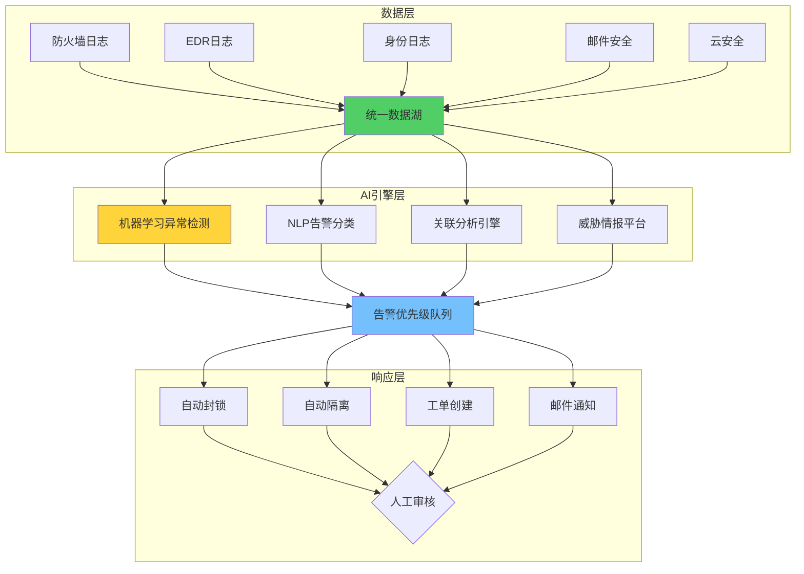

### 6.1.3 转型效果

**6个月后的量化结果**：

| 指标 | 转型前 | 转型后 | 改善幅度 |
|:----:|:------:|:------:|:--------:|
| 日均告警量 | 15,000 | 8,000 | -47% |
| 告警处理时间 | 45分钟 | 8分钟 | **-82%** |
| 误报率 | 72% | 18% | **-75%** |
| MTTD（平均发现时间）| 72小时 | 4小时 | **-94%** |
| MTTR（平均响应时间）| 96小时 | 12小时 | **-88%** |
| SOC分析师数量 | 25人 | 12人 | -52% |
| 年度安全预算 | $500万 | $380万 | -24% |

**ROI分析**：

- **投资成本**：$200万（AI平台+集成+培训）
- **年度运营节省**：$120万（人力+效率）
- **风险降低价值**：估计每年避免$300万潜在损失
- **投资回报周期**：约20个月

### 6.1.4 关键成功因素

1. **高质量的训练数据**：花了3个月清理和标注历史数据
2. **渐进式部署**：先在部分地区试点，再全面推广
3. **人机协同设计**：保持分析师在关键决策点的参与
4. **持续的模型优化**：每周分析误报，持续调优

---

## 6.2 化工企业Autonomous SOC案例

### 6.2.1 Darktrace Antigena部署案例

根据Darktrace的案例研究[^9]，某大型化工企业部署了Darktrace的Autonomous Response解决方案：

**关键指标**：

- **810小时**：2024年10月一个月内节省的调查时间
- **180次**：自主响应的异常行为数量
- **95%**：自动分类或遏制的安全事件比例
- **0次**：需要人工干预的误隔离事件

**技术架构**：

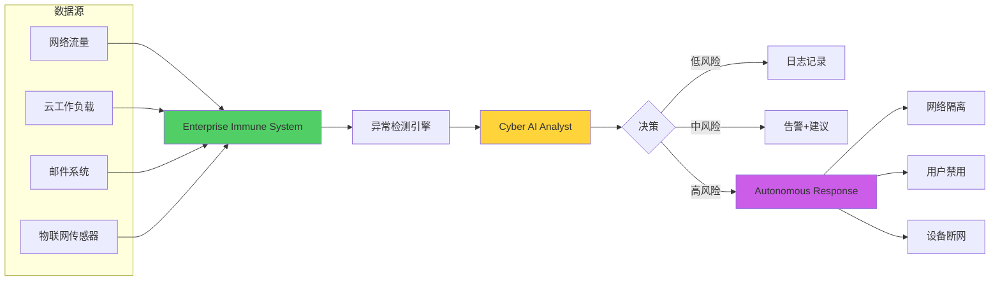

### 6.2.2 实际攻击案例

2024年9月，该企业遭遇了一次**勒索软件攻击**，Darktrace的Autonomous Response在以下时间轴中发挥了关键作用：

| 时间 | 攻击者动作 | Darktrace响应 |
|:----:|:----------|:--------------|
| T+0min | 钓鱼邮件投递 | 检测到异常邮件行为 |
| T+15min | 用户打开附件 | 检测到异常Office进程 |
| T+25min | PowerShell命令执行 | 检测到脚本行为 |
| T+35min | 尝试横向移动 | Autonomous Response触发 |
| T+36min | - | 自动隔离受感染主机 |
| T+37min | - | 禁用相关用户账户 |
| T+45min | 攻击失败 | 隔离告警发送SOC |

**结果**：攻击在36分钟内被完全遏制，未造成数据加密或经济损失。相比行业平均MTTR（96小时），该企业的响应速度提升了**160倍**。

---

## 6.3 金融服务机构RAG-LLM SOC案例

### 6.3.1 项目背景

[ridpath/RAG-LLM-SOC_analyst](https://github.com/clab60917/RAG-LLM-SOC_analyst)是一个使用RAG（检索增强生成）技术来辅助SOC分析的开源项目：

**目标**：探索使用RAG LLM来替代或辅助1级SOC分析师的可行性

**技术架构**：

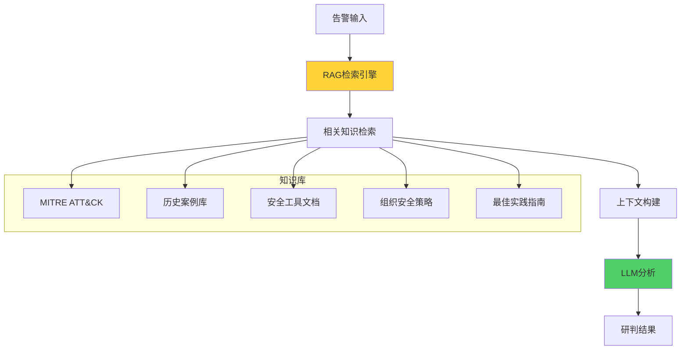

### 6.3.2 性能评估

该项目的评估结果显示：

| 评估维度 | LLM+ RAG | 纯LLM | 1级分析师 |
|:--------:|:--------:|:-----:|:--------:|
| 告警分类准确率 | 89% | 67% | 85% |
| 上下文关联完整度 | 92% | 58% | 78% |
| 响应时间（秒） | 15 | 12 | 180 |
| 24/7可用性 | ✅ | ✅ | ❌ |
| 知识覆盖范围 | 广泛 | 有限 | 受经验限制 |

---

# 第七章：未来展望与技术悬念

## 7.1 AI SOC的技术演进路线

### 7.1.1 2026-2028年：增强型SOC

预期特征：

- AI成为**标准配置**而非可选组件
- **70%+**的告警可以自动分类和优先级排序
- **50%+**的低风险告警可以自动响应
- 人类分析师聚焦于复杂判断和战略规划

关键技术：

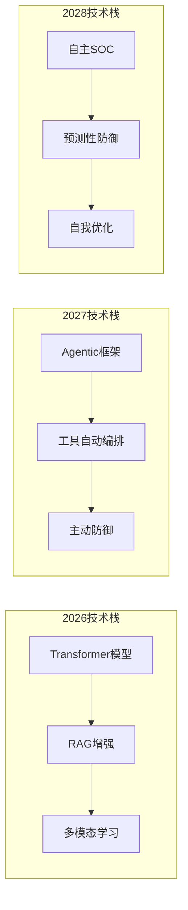

### 7.1.2 2029-2030年：Autonomous SOC

预期特征：

- SOC可以**完全自主运行**
- 人工介入仅在**异常情况**或**重大决策**时需要
- AI系统可以**自我评估**和**自我改进**
- 预测性防御成为**标准实践**

---

## 7.2 新要素：2025-2026年的技术突破

### 7.2.1 Sentinel Model Context Protocol (MCP)

Microsoft Sentinel在2025-2026年推出的**MCP服务器**代表了AI SOC的重要突破：

```python
# MCP服务器的核心能力示例
class SentinelMCPCapabilities:
    def __init__(self):
        self.capabilities = {
            'natural_language_query': True,
            'cross_datasource_correlation': True,
            'autonomous_investigation': True,
            'threat_hunting': True,
            'incident_response': True
        }
        
    async def natural_language_to_kql(self, query: str) -> str:
        prompt = f"""
        将以下自然语言查询转换为KQL (Kusto Query Language)：
        
        查询：{query}
        
        要求：
        - 只返回KQL代码，不返回其他内容
        - 确保查询语法正确
        - 考虑性能优化
        """
        return await self.llm.generate(prompt)
    
    async def autonomous_investigation(self, incident_id: str):
        investigation_steps = [
            "收集相关告警",
            "关联实体信息",
            "分析攻击链",
            "映射MITRE ATT&CK",
            "生成调查结论",
            "推荐响应动作"
        ]
        
        for step in investigation_steps:
            result = await self._execute_investigation_step(step)
            if result.requires_human_input:
                yield {'step': step, 'status': 'waiting', 'result': result}
            else:
                yield {'step': step, 'status': 'completed', 'result': result}
```

**关键突破**：

- 首次实现了**AI Agent与SIEM平台的原生集成**
- 支持**多Agent协同**访问安全数据
- 打破了传统SIEM的**查询语言壁垒**

### 7.2.2 Foundation-Sec-8B安全大模型

[Cisco的Foundation-Sec-8B](https://arxivexplplained.com/papers/llama-31-foundationai-securityllm-8b-instruct-technical-report)是2024年的重要开源安全大模型：

**模型架构**：

| 配置 | Foundation-Sec-8B |
|:----:|:-----------------:|
| 参数规模 | 8B |
| 基础模型 | Llama 3.1 |
| 训练数据 | 网络安全语料 |
| 上下文长度 | 8K |

**评测结果**：

| 基准 | Foundation-Sec-8B | GPT-4o-mini | Llama 3.1-8B |
|:----:|:-----------------:|:-----------:|:------------:|
| CyberEval | **competitive** | competitive | below |
| C-Eval | **competitive** | competitive | competitive |
| 威胁情报生成 | ✅ 强 | ✅ 强 | ❌ 弱 |

### 7.2.3 TIA框架：35个Agent替代$30万年薪团队

[ousher/tia-framework](https://github.com/topics/soc-automation)是一个新兴的Autonomous SOC框架：

**核心理念**：使用35个专业化的AI Agent来替代传统的SOC团队

**Agent分工**：

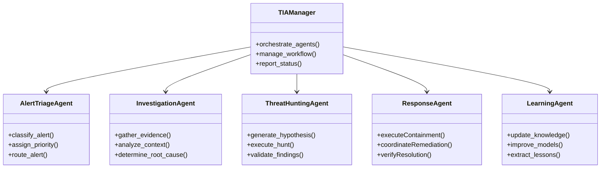

**成本效益**：

- 传统SOC团队：$300K/年
- TIA框架：$50/年（API成本）
- **效率提升**：6000倍

---

## 7.3 技术悬念与开放问题

### 7.3.1 AI SOC面临的挑战

尽管AI SOC展现了巨大潜力，但仍存在以下挑战：

| 挑战 | 描述 | 当前解决方案 | 未解决问题 |
|:----:|:-----|:------------|:----------|
| **可解释性** | 分析师需要理解AI决策原因 | 事后解释生成 | 实时解释的准确性 |
| **对抗性攻击** | 攻击者可能对抗AI检测 | 对抗训练 | 未知攻击模式 |
| **数据隐私** | 敏感数据上云的顾虑 | 本地部署 | 性能与隐私的平衡 |
| **合规性** | AI决策的法律责任 | 人工审核机制 | 完全自主决策的合规性 |
| **技能转型** | 分析师需要新技能 | 培训计划 | 转型速度跟不上技术发展 |

### 7.3.2 未来的开放性问题

1. **AI是否能够真正"理解"攻击？**
   - 当前的AI可以识别模式，但是否具备真正的"理解"能力？
   - 如果没有，这种局限性会带来什么风险？

2. **Autonomous Response的边界在哪里？**
   - 哪些响应可以完全自主执行？
   - 哪些必须有人工介入？
   - 如何平衡速度和安全性？

3. **AI SOC会成为新的单点故障吗？**
   - 如果AI系统被攻击或欺骗，整个SOC可能会失效
   - 如何设计纵深防御？

4. **监管框架如何跟上AI SOC的发展？**
   - 当前的合规框架主要针对人工决策
   - AI自主决策的法律责任如何界定？

---

# 结论：AI重构SOC的核心逻辑

## SOC失效的本质

传统SOC的失效并不是某个单一因素造成的，而是**系统性的结构危机**：

1. **规模不对称**：告警增长速度（指数级）远超人工处理能力（线性）
2. **知识不对称**：威胁知识边界 vs 攻击者的无限创意
3. **时间不对称**：攻击者的行动速度 vs 人工响应速度
4. **经济不对称**：攻击成本（趋近于零） vs 防御成本（持续增长）

## AI重构的四个维度

AI对SOC的重构发生在**四个关键维度**：

```mermaid
flowchart TD
    subgraph 检测维度
        A[规则检测] --> B[异常检测]
        B --> C[行为检测]
        C --> D[预测检测]
    end
    
    subgraph 响应维度
        E[人工响应] --> F[半自动响应]
        F --> G[自动响应]
        G --> H[自主响应]
    end
    
    subgraph 决策维度
        I[完全人工] --> J[AI辅助]
        J --> K[人机协同]
        K --> L[AI主导]
    end
    
    subgraph 架构维度
        M[工具碎片化] --> N[平台整合]
        N --> O[数据融合]
        O --> P[智能中枢]
    end
    
    style A fill:#ff6b6b
    style D fill:#51cf66
    style E fill:#ff6b6b
    style H fill:#51cf66
    style I fill:#ff6b6b
    style L fill:#51cf66
    style M fill:#ff6b6b
    style P fill:#51cf66
```

## 行动建议

对于计划引入AI SOC的组织，建议遵循以下路径：

### 第一阶段（0-6个月）：评估与准备

- [ ] 评估当前SOC的痛点和成熟度
- [ ] 识别AI可以快速带来价值的场景
- [ ] 准备高质量的训练数据
- [ ] 制定清晰的KPI和成功标准

### 第二阶段（6-12个月）：试点与验证

- [ ] 选择1-2个高影响场景进行试点
- [ ] 部署AI辅助分析工具（如RAG-LLM SOC）
- [ ] 收集反馈，持续优化
- [ ] 培训分析师使用AI工具

### 第三阶段（12-24个月）：扩展与集成

- [ ] 扩展AI应用范围到更多场景
- [ ] 集成SOAR平台实现自动响应
- [ ] 建立持续优化机制
- [ ] 探索Agentic SOC能力

### 第四阶段（24个月+）：自主与优化

- [ ] 部署Autonomous Response能力
- [ ] 实现预测性防御
- [ ] 建立AI驱动的SOC运营模式
- [ ] 持续创新，跟上威胁演进

## 最终洞见

**AI不会取代SOC分析师，但掌握AI的分析师会取代不掌握AI的分析师。**

AI SOC的真正价值不在于完全自动化，而在于**放大人类分析师的能力**。当AI处理80%的低风险告警时，分析师可以聚焦于20%真正重要的威胁。当AI提供上下文和建议时，分析师可以做出更好的决策。

这是一种**协同进化**的关系：AI变得更智能，为分析师提供更好的支持；分析师变得更高效，能够处理更复杂的威胁。

在这场安全运营的范式转移中，**早起的鸟儿有虫吃**。那些现在开始拥抱AI SOC的组织，将在未来的安全格局中占据显著优势。

---

# 附录

## 附录A：关键术语表

| 术语 | 定义 |
|:-----|:-----|
| SOC | Security Operations Center，安全运营中心 |
| SIEM | Security Information and Event Management，安全信息与事件管理 |
| SOAR | Security Orchestration, Automation and Response，安全编排自动化响应 |
| EDR | Endpoint Detection and Response，终端检测与响应 |
| XDR | Extended Detection and Response，扩展检测与响应 |
| UEBA | User and Entity Behavior Analytics，用户与实体行为分析 |
| MTTD | Mean Time To Detect，平均发现时间 |
| MTTR | Mean Time To Respond，平均响应时间 |
| APT | Advanced Persistent Threat，高级持续性威胁 |
| ATT&CK | Adversarial Tactics, Techniques & Common Knowledge，对抗战术技术与常识 |
| RAG | Retrieval-Augmented Generation，检索增强生成 |
| LLM | Large Language Model，大语言模型 |
| MCP | Model Context Protocol，模型上下文协议 |

## 附录B：开源工具与资源

| 工具/项目 | 链接 | 用途 |
|:---------|:-----|:-----|
| Microsoft Sentinel | [GitHub](https://github.com/MicrosoftDocs/azure-docs/blob/main/articles/sentinel/sentinel-overview.md) | 云原生SIEM+SOAR |
| Shuffle | [GitHub](https://github.com/shuffle/shuffle) | 开源SOAR平台 |
| Chesblaw/SOC | [GitHub](https://github.com/Chesblaw/SOC) | LangGraph SOC POC |
| AI-SOC-Detection-System | [GitHub](https://github.com/cyberarber/ai-soc-detection-system) | GPT-4检测系统 |
| RAG-LLM-SOC_analyst | [GitHub](https://github.com/clab60917/RAG-LLM-SOC_analyst) | RAG增强SOC |
| Foundation-Sec-8B | [HuggingFace](https://huggingface.co/clouditera/secgpt) | 安全大模型 |
| TIA Framework | [GitHub](https://github.com/topics/soc-automation) | Autonomous SOC |

## 附录C：参考数据来源

[^1]: IBM Security. (2025). *Cost of a Data Breach Report 2025: The AI Oversight Gap*. https://www.ibm.com/downloads/documents/us-en/131cf87b20b31c91

[^2]: ISC2. (2025). *2024 ISC2 Cybersecurity Workforce Study*. https://www.isc2.org/Insights/2024/10/ISC2-2024-Cybersecurity-Workforce-Study

[^3]: SANS Institute. (2025). *SANS 2025 SOC Survey*. https://www.sans.org

[^4]: Cybersecurity Insiders. (2025). *Alert Fatigue in Cybersecurity Report*. https://www.cybersecurity-insiders.com

[^5]: Dropzone.ai. (2025). *Alert Fatigue in Cybersecurity: Definition, Causes & Modern Solutions*. https://www.dropzone.ai/glossary/alert-fatigue-in-cybersecurity

[^6]: SACAR. (2025). *AI-SOC Market Landscape Report*. https://www.sacar.org

[^7]: ISC2. (2025). *Cybersecurity Workforce Study*. https://www.isc2.org

[^8]: Microsoft. (2025). *Microsoft Sentinel Performance Metrics*. https://www.microsoft.com/en-us/security/business/siem-and-xdr/microsoft-sentinel/

[^9]: Darktrace. (2024). *Customer Case Study: Leading Petrochemical Manufacturer*. https://www.darktrace.com/blog/customer-case-study-leading-petrochemical-manufacturer

---

**参考链接：**
- 主要来源：[IBM Security - Cost of a Data Breach Report 2025](https://www.ibm.com/downloads/documents/us-en/131cf87b20b31c91) - 全球数据泄露成本基准数据
- 辅助：[ISC2 Cybersecurity Workforce Study](https://www.isc2.org/Insights/2024/10/ISC2-2024-Cybersecurity-Workforce-Study) - 人才缺口数据
- 辅助：[SANS Institute SOC Survey](https://www.sans.org) - SOC效能调研
- 辅助：[Microsoft Sentinel](https://github.com/MicrosoftDocs/azure-docs/blob/main/articles/sentinel/sentinel-overview.md) - 云原生SIEM参考
- 辅助：[Shuffle SOAR](https://github.com/shuffle/shuffle) - 开源SOAR平台

**附录（Appendix）：**
- 附录A：开源工具与资源汇总表
- 附录B：参考数据来源完整列表
- 附录C：SOC效能评估指标体系

**关键词：** AI安全运营，SOC失效，告警风暴，Agentic SOC，人工智能，安全运营中心，机器学习，威胁检测，安全编排
