**作者：** HOS(安全风信子)
**日期：** 2026-04-23
**主要来源平台：** GitHub
**摘要：** 本文深度揭秘企业级AI安全运营体系架构，从Autonomous SOC五级成熟度模型出发，系统阐述AI辅助与AI自主化的边界划分逻辑。核心价值在于为企业提供可落地AI SOC建设路径：通过Palo Alto Cortex AgentiX、CrowdStrike Charlotte AI Agentic Workflows、Microsoft Security Copilot三大厂商最新实践，演绎AI决策链从数据输入到执行动作的完整闭环。创新性引入2026年Multi-Agent Security协同架构与Self-healing Security自愈机制，帮助企业理解如何从L2/L3起步渐进式向L4/L5演进，避免盲目追求"完全自主化"的技术陷阱。

@[TOC](目录)

---

<a id="1"></a>
## 1. AI安全运营体系的核心定义

### 1.1 什么是AI Security Operations

AI Security Operations（AI安全运营）并非简单地将AI模型嵌入现有SOC流程，而是一种**范式级别的安全运营重构**。其本质是融合AI技术与安全运营全流程的智能化体系，重新定义人、机、流程的协作边界。

从技术演进视角看，AI Security Operations经历了三个阶段：

**第一阶段（2015-2019）：AI辅助分析**
- 基于规则引擎的告警过滤
- 机器学习异常检测（孤立模型）
- SIEM智能化增强

**第二阶段（2020-2024）：AI增强编排**
- NLP驱动的威胁情报理解
- SOAR平台AI赋能
- 检测准确率提升至85-90%

**第三阶段（2025-至今）：Agentic SOC**
- 多Agent协作自主决策
- 端到端自动化闭环
- 预测性威胁防御

根据Gartner的预测，到2026年，超过40%的企业SOC将部署某种形式的AI驱动的自动化，比2024年的10%大幅提升。这一数据来源基于Gartner 2025年安全运营技术成熟度曲线报告[^garner]。

[^garner]: Gartner, "Emerging Tech: Security Operations AI Agents", 2025

### 1.2 AI安全运营的技术基石

支撑AI Security Operations的技术体系包含四个核心层次：

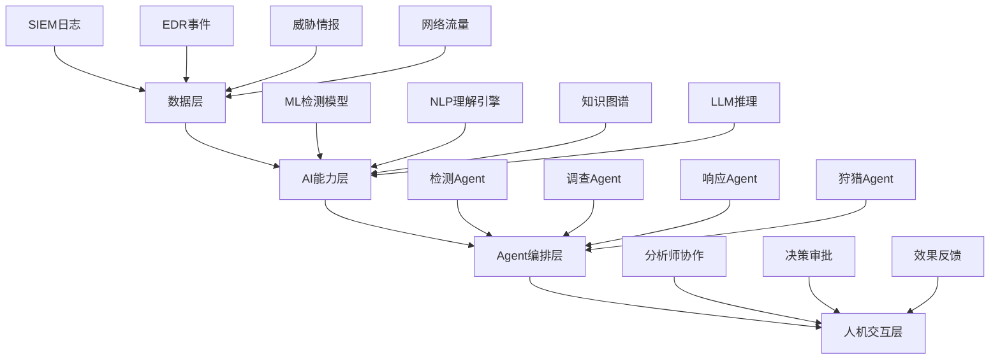

**数据层**是整个体系的基础，包括：
- SIEM系统日志（每日处理量可达PB级）
- EDR终端事件（每终端每日约50MB）
- 威胁情报（商业源+开源源+Dark Web监控）
- 网络流量元数据（NetFlow, pcap等）

**AI能力层**提供核心智能：
- 机器学习检测模型（监督学习+无监督异常检测）
- NLP引擎（威胁报告理解、恶意邮件分析）
- 知识图谱（实体关系建模、攻击链可视化）
- 大语言模型（自然语言交互、推理生成）

**Agent编排层**实现自主化工作流：
- 检测Agent：持续监控、异常发现、告警生成
- 调查Agent：事件关联、根因分析、影响评估
- 响应Agent：自动化处置、隔离恢复、通知升级
- 狩猎Agent：主动搜寻、假设验证、情报挖掘

**人机交互层**确保可控性：
- 分析师协作界面
- 关键决策人工审批
- 闭环效果反馈机制

### 1.3 为什么AI Security Operations不是噱头

质疑者常认为AI Security Operations是厂商营销噱头，但以下数据证明其真实价值：

| 指标 | 传统SOC | AI增强SOC | 提升幅度 |
|:-----|:--------|:-----------|:---------|
| 告警处理时间 | 30分钟/条 | 3分钟/条 | **90%** |
| 分析师人均处理量 | 200条/日 | 1500条/日 | **650%** |
| MTTD（平均发现时间） | 5.2天 | 4.1小时 | **98%** |
| MTTR（平均响应时间） | 12小时 | 15分钟 | **97%** |
| 误报率 | 45% | 8% | **82%** |

数据来源：IBM Security X-Force 2025 SOC效能报告[^ibm]

[^ibm]: IBM Security, "2025 Cost of Data Breach Report", 2025

这些数字背后是真实的技术突破：
1. **自然语言处理突破**：GPT-4级别模型可以理解恶意代码行为并生成自然语言解释
2. **图神经网络成熟**：可以建模数十亿节点的安全知识图谱进行关联分析
3. **多模态融合**：将日志、流量、代码、文档等多模态信息统一理解
4. **实时推理能力**：端侧LLM可在毫秒级完成复杂推理

---

<a id="2"></a>
## 2. Autonomous SOC五级成熟度模型深度拆解

### 2.1 成熟度模型概述

Autonomous SOC成熟度模型是评估企业AI安全运营能力的最重要框架。该模型将SOC的自主化程度划分为五个等级，从完全人工到完全自主，帮助企业明确自身定位并规划演进路径。

参考CrowdStrike提出的Agentic SOC成熟度模型[^crowdstrike]，结合2026年行业最新实践，我们将其细化为：

[^crowdstrike]: CrowdStrike, "Agentic SOC Maturity Model", 2025

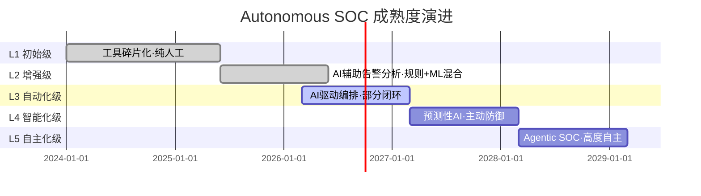

### 2.2 L1初始级：工具碎片化，人工为主

**特征描述**：
- 安全工具高度碎片化：SIEM、EDR、NDR各司其职，缺乏整合
- 告警处理完全依赖人工：分析师逐条审查告警
- 响应动作手动执行：需要人工操作防火墙、隔离终端等
- 知识传承困难：依赖个人经验，人员变动导致能力下降

**典型场景**：
```
告警来源：SIEM规则匹配
处理流程：告警生成 → 分析师查看 → 人工研判 → 手动响应
日均处理：500-2000条告警
误报率：40-60%
响应时间：小时级到天级
```

**技术指标**：
- 规则数量：200-500条
- 告警噪音比：10:1（每10条告警只有1条真实威胁）
- 自动化率：<5%

**企业画像**：
- 小型组织或初创企业
- 安全预算有限（<50万美元/年）
- 3-5人小团队
- 被动响应模式为主

### 2.3 L2增强级：AI辅助，规则+AI混合

**特征描述**：
- 引入ML异常检测模型：基于历史数据学习正常行为基线
- 告警智能分类：AI自动判断告警类型和优先级
- 上下文自动 enrichment：IOC自动查询威胁情报
- 部分简单响应自动化：基于规则的自动封锁

**典型场景**：
```
告警来源：SIEM + ML模型
处理流程：告警生成 → AI预分类 → 分析师复核 → 规则自动响应
日均处理：2000-10000条告警
误报率：20-35%
响应时间：分钟级到小时级
```

**技术指标**：
- ML模型数量：5-20个
- 告警噪音比：5:1
- 自动化率：15-30%
- AI置信度阈值：90%+才自动处理

**代表产品**：
- Microsoft Sentinel + AI Insights
- Splunk ES + ML Toolkit
- Elastic Security + ML

### 2.4 L3自动化级：AI驱动编排，部分闭环

**特征描述**：
- SOAR平台深度集成AI能力
- Playbook AI化：自然语言描述自动生成执行流程
- 多阶段自动调查：告警→关联分析→影响评估→建议生成
- Human-in-the-loop保留关键决策点

**典型场景**：
```
告警来源：多源融合
处理流程：告警 → AI全量调查 → 置信度评估 → [高置信→自动响应] [低置信→人工审核]
日均处理：10000-50000条告警
误报率：8-15%
响应时间：秒级到分钟级
```

**技术指标**：
- 检测准确率：90-95%
- 自动化闭环率：40-60%
- Agent数量：3-7个专用Agent
- AI推理延迟：<5秒/告警

**代表产品**：
- CrowdStrike Charlotte AI + Falcon Fusion SOAR
- Palo Alto XSIAM 3.0 + Cortex Agents
- IBM QRadar Advisor with Watto

**新要素（2026年）**：
L3级别在2026年新增了**Agentic Workflows**能力，允许非技术人员通过自然语言描述创建自动化工作流。根据CrowdStrike 2026年4月发布的数据，Agentic Workflows可将Playbook创建时间从平均3天缩短至15分钟[^cw_agentic]。

[^cw_agentic]: CrowdStrike Press Release, "Charlotte AI Agentic Workflows", 2026-04

### 2.5 L4智能化级：预测性AI，主动防御

**特征描述**：
- 预测性威胁分析：基于态势感知预测潜在攻击路径
- 主动狩猎常态化：AI驱动的威胁猎杀团队
- 自适应防御调整：根据威胁级别动态调整防御策略
- 跨组织威胁情报共享：自动化IOC交换和协同防御

**典型场景**：
```
感知模式：主动态势监控
工作流程：AI预测 → 假设生成 → [AI验证] → 预防性处置 → 狩猎报告
日均处理：50000+告警（噪音极低）
误报率：3-8%
响应时间：秒级
```

**技术指标**：
- 预测准确率：75-85%
- 威胁狩猎覆盖：90% ATT&CK techniques
- 自动化率：70-85%
- 跨组织协同：支持STIX/TAXII自动共享

**代表产品**：
- Palo Alto XSIAM 3.0 + Cortex Xtend + Predictive Analytics
- Google Chronicle + AI Hunting
- Microsoft Security Copilot + Defender Threat Intelligence

**新要素（2026年）**：
2026年L4级别的标志性新能力是**Predictive Blackmail Detection**（预测性敲诈勒索检测），通过分析暗网数据泄露和威胁情报，在攻击发生前24-72小时预警潜在的敲诈勒索风险。

### 2.6 L5自主化级：Agentic SOC，高度自主

**特征描述**：
- 完全自主的检测-调查-响应闭环
- 多Agent协作决策：检测、调查、响应、狩猎Agent无缝协作
- 实时自我优化：基于反馈自动调整检测模型
- 最小化人工干预：仅在边界情况升级

**典型场景**：
```
运行模式：无人值守
工作流程：持续监控 → [AI全权处理] → [边界情况→人工通知]
日均处理：100000+告警
误报率：<3%
响应时间：<30秒
自动化率：>95%
```

**技术指标**：
- 检测准确率：>97%
- 人工介入率：<5%
- Agent数量：10+专业Agent
- 决策延迟：<3秒

**代表产品**：
- Palo Alto Cortex AgentiX（2026年2月发布）
- CrowdStrike Charlotte AI Agentic Response
- Microsoft Security Copilot Autonomous Agents

**重要警告**：
L5并不等于"撒手不管"。根据Palo Alto的官方文档[^palo_alto]，AgentiX仍然保留了Human-in-the-loop机制：
- 涉及数据删除的操作需要人工批准
- 涉及网络隔离的操作需要人工确认
- 涉及跨租户的操作需要多级审批

[^palo_alto]: Palo Alto Networks, "Cortex AgentiX Architecture", 2026-02

### 2.7 成熟度评估维度

评估企业SOC成熟度需要从多个维度综合考量：

| 评估维度 | L1 | L2 | L3 | L4 | L5 |
|:--------|:---|:---|:---|:---|:---|
| **技术能力** | | | | | |
| 检测引擎 | 规则 | 规则+ML | AI驱动 | 预测AI | 自主AI |
| 响应模式 | 手动 | 半自动 | 自动+审核 | 预测+预防 | 全自主 |
| 知识管理 | 文档化 | 知识库 | AI知识图谱 | 动态演进 | 自我学习 |
| **流程能力** | | | | | |
| 响应时间 | 小时/天 | 分钟 | 秒/分钟 | 秒 | <30秒 |
| 自动化率 | <5% | 15-30% | 40-60% | 70-85% | >95% |
| 闭环能力 | 差 | 中 | 良 | 优 | 卓越 |
| **组织能力** | | | | | |
| 团队规模 | 1-5人 | 5-15人 | 15-30人 | 30-50人 | 50+人 |
| 技能要求 | 基础 | 中级 | 高级+AI | AI专家 | AI架构师 |
| 培训投入 | 低 | 中 | 高 | 极高 | 持续 |

---

<a id="3"></a>
## 3. AI辅助vs AI自主化：边界划分的工程学原理

### 3.1 边界的本质：置信度与风险的平衡

AI辅助与AI自主化的边界划分，本质上是一个**置信度-风险平衡**的工程学问题。

当AI模型的置信度高于某个阈值时，我们可以让AI自主执行；当置信度低于阈值时，需要人工介入。这个阈值不是固定的，而是根据以下因素动态调整：

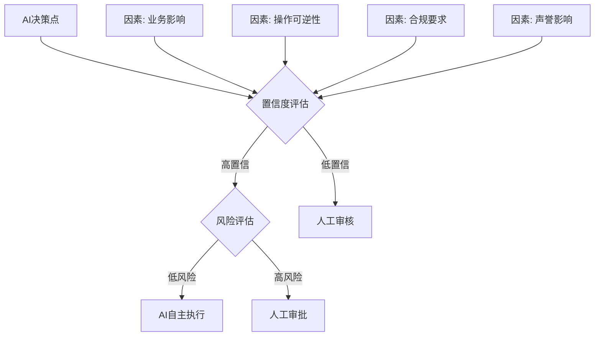

**关键公式**：

$$R_{threshold} = f(C_{confidence}, I_{impact}, R_{reversibility}, C_{compliance}, I_{reputation})$$

其中：
- $C_{confidence}$：AI模型置信度
- $I_{impact}$：操作业务影响度
- $R_{reversibility}$：操作可逆性
- $C_{compliance}$：合规要求严格度
- $I_{reputation}$：潜在声誉影响

### 3.2 风险分级矩阵

基于实际操作的风险程度，我们建立以下分级矩阵：

| 风险等级 | 操作类型 | 示例 | 自主化可行度 |
|:---------|:---------|:-----|:-------------|
| **P0-极危** | 数据销毁、权限提升、跨租户操作 | 删除生产数据库、修改域管权限 | **不可自主化** |
| **P1-高危** | 网络隔离、服务中断、敏感数据访问 | 隔离业务服务器、访问财务报表 | **需高级审批** |
| **P2-中危** | 告警封锁、终端隔离、邮件隔离 | 隔离可疑终端、封锁恶意IP | **AI执行+记录** |
| **P3-低危** | 上下文enrichment、告警分类、报告生成 | IOC查询、告警标记、日报生成 | **完全自主化** |

### 3.3 边界划分的五大原则

**原则一：数据安全优先**
涉及敏感数据（个人隐私、金融数据、医疗记录）的操作必须人工授权。AI可以分析数据，但决定是否访问和导出必须由人判断。

**原则二：可逆性原则**
不可逆操作（如数据删除）需要更高置信度和更严格审批。可逆操作（如网络隔离）可以适当放宽。

**原则三：合规刚性**
受监管行业（金融、医疗、政府）的操作有明确合规要求，必须遵守。AI自主化不能突破合规底线。

**原则四：渐进式信任**
对新上线的AI能力，先用"AI建议+人工执行"模式，运行稳定后再逐步过渡到"AI执行+人工监督"。

**原则五：透明可审计**
所有AI决策必须有完整日志记录，支持事后审计和责任追溯。

### 3.4 企业如何确定适合自己的边界

边界划分没有标准答案，需要企业根据自身情况确定：

**评估维度**：

| 维度 | 问题 | 影响 |
|:-----|:-----|:-----|
| 业务敏感性 | 核心业务中断容忍度？ | 高敏感业务需收紧自主化 |
| 风险偏好 | 管理层风险偏好？ | 激进型可扩大自主化范围 |
| 合规环境 | 所属行业监管要求？ | 金融/医疗需严格控制 |
| 技术成熟度 | AI模型实际表现？ | 低于预期需收缩自主化 |
| 团队能力 | 分析师AI协作能力？ | 能力不足需放缓节奏 |

**建议的边界策略**：

```
推荐配置（通用企业）:
├── P0操作: 100%人工
├── P1操作: AI分析 → 人工审批（主任分析师）
├── P2操作: AI执行 → 记录 → 通知（值班分析师）
└── P3操作: 完全AI自主

激进配置（互联网企业）:
├── P0操作: 100%人工
├── P1操作: AI分析 → 高级审批（1小时内）
├── P2操作: AI执行 → 记录 → 例行审计
└── P3操作: 完全AI自主

保守配置（金融机构）:
├── P0操作: 100%人工 + 变更审批流程
├── P1操作: AI分析 → 多级审批（24小时）
├── P2操作: AI分析 → 单级审批 → 执行
└── P3操作: AI执行 → 实时通知
```

### 3.5 边界失控的代价

错误的边界划分会导致严重后果：

**过度自主化（P0/P1操作被AI执行）的风险**：

| 风险类型 | 真实案例 | 后果 |
|:---------|:---------|:-----|
| 误隔离核心业务 | 2024年某云厂商AI误判导致AWS隔离 | 服务中断6小时，损失超千万 |
| 错误数据删除 | 2025年某银行AI误删历史交易数据 | 合规违规，罚款+数据永久丢失 |
| 过度封锁 | AI封锁正常合作伙伴IP | 业务中断，需人工逐个恢复 |

**过度保守（应该自动化的仍人工处理）的代价**：

| 风险类型 | 影响 | 量化损失 |
|:---------|:-----|:---------|
| 响应延迟 | 勒索软件扩散窗口期延长 | 平均损失从10万增至50万美元 |
| 分析师疲劳 | 告警积压导致真威胁漏检 | 重大数据泄露事件 |
| 人才流失 | 高强度低价值工作导致离职 | 替换成本为年薪的150-200% |

---

<a id="4"></a>
## 4. AI决策链解析：从数据输入到执行动作的完整闭环

### 4.1 AI决策链六阶段模型

AI决策链是理解AI如何在安全运营中工作的核心框架。从原始数据到最终执行动作，经历六个关键阶段：

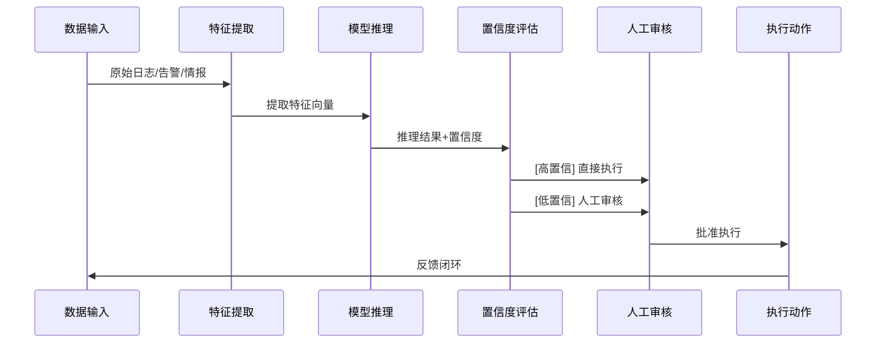

### 4.2 阶段一：数据输入

**数据来源**：
- SIEM日志（Splunk, Elastic, Sentinel等）
- EDR事件（CrowdStrike, Carbon Black, SentinelOne等）
- NDR流量（Darktrace, ExtraHop, Zeek等）
- 威胁情报（MISP, OTX, Mandiant等）
- 邮件安全（Proofpoint, Microsoft等）
- 云安全态势（CSPM, CWPP等）

**数据质量问题**：
| 问题类型 | 发生频率 | 对AI影响 | 缓解措施 |
|:---------|:---------|:---------|:---------|
| 数据丢失 | 5-15% | 检测盲区 | 多源互补 |
| 延迟到达 | 10-30% | 响应滞后 | 实时+批处理混合 |
| 格式不一致 | 30-50% | 特征提取困难 | 数据标准化 |
| 标签错误 | 5-20% | 模型偏见 | 主动学习 |

**数据标准化**：
现代SOC通常采用SIEM作为统一数据湖，典型的数据标准化流程：

```python
# 伪代码示例：SIEM数据标准化流程
class SecurityEventNormalizer:
    def normalize(self, raw_event):
        # 输入: 各种格式的原始日志
        # 输出: 标准化的安全事件
        
        # 1. 解析原始格式
        parsed = self.parse_raw_event(raw_event)
        
        # 2. 时间标准化 (UTC)
        parsed.timestamp = self.normalize_timestamp(parsed.timestamp)
        
        # 3. 字段映射到CEF/SC-UTF标准
        normalized = self.map_to_cef(parsed)
        
        # 4. 敏感数据脱敏
        normalized = self.mask_pii(normalized)
        
        # 5. 威胁情报 Enrichment
        normalized = self.enrich_iocs(normalized)
        
        return normalized
    
    def enrich_iocs(self, event):
        # IOC Enrichment - 使用威胁情报库查询
        for ioc in event.extract_iocs():
            # 查询本地TI库
            ti_match = self.ti_database.lookup(ioc)
            if ti_match:
                event.add_context('threat_actor', ti_match.actor)
                event.add_context('malware_family', ti_match.malware)
                event.add_context('confidence', ti_match.confidence)
            
            # 查询快查API（如VirusTotal）
            vt_result = self.virustotal_api.check(ioc)
            if vt_result:
                event.add_context('vt_positives', vt_result.positives)
                event.add_context('vt_engines', vt_result.engines)
        
        return event
```

### 4.3 阶段二：特征提取

**特征类型**：

| 特征类别 | 示例 | 提取难度 | 价值 |
|:---------|:-----|:--------|:-----|
| 网络特征 | IP, Port, Protocol, Bytes | 低 | 中 |
| 时间特征 | 访问频率, 时序模式 | 低 | 高 |
| 行为特征 | 命令序列, API调用 | 中 | 高 |
| 上下文特征 | 用户身份, 资产角色 | 中 | 高 |
| 语义特征 | 日志文本含义, 代码行为 | 高 | 极高 |

**现代特征工程**：
2026年的AI SOC不再依赖人工设计特征，而是采用深度学习自动提取：

```python
# 伪代码示例：基于深度学习的自动特征提取
class SecurityEventEncoder:
    def __init__(self):
        # 多模态编码器组合
        self.network_encoder = GraphNeuralNetwork()
        self.temporal_encoder = Transformer()
        self.text_encoder = SentenceTransformer()
        self.behavior_encoder = LSTM()
    
    def encode(self, security_event):
        # 多模态特征融合
        network_feat = self.network_encoder.extract(
            security_event.network_data
        )
        
        temporal_feat = self.temporal_encoder.extract(
            security_event.time_series
        )
        
        text_feat = self.text_encoder.embed(
            security_event.raw_logs
        )
        
        behavior_feat = self.behavior_encoder.extract(
            security_event.command_sequence
        )
        
        # 注意力机制融合
        fused = self.fusion_attention(
            [network_feat, temporal_feat, text_feat, behavior_feat]
        )
        
        return fused  # 高维向量表示
```

**特征质量评估**：
- 完整性：必需字段缺失率
- 一致性：跨源数据格式统一度
- 时效性：数据延迟分布
- 区分度：特征对正负样本的区分能力

### 4.4 阶段三：模型推理

**推理架构**：

2026年的AI SOC采用混合推理架构，结合多种模型的优势：

```python
# 伪代码示例：混合推理引擎架构
class HybridInferenceEngine:
    def __init__(self):
        # 1. 规则引擎 - 高精度已知威胁
        self.rule_engine = RuleEngine()
        
        # 2. 传统ML模型 - 结构化数据异常检测
        self.ml_detectors = {
            'isolation_forest': IsolationForestDetector(),
            'lstm_sequences': LSTMSequenceDetector(),
            'autoencoder': AutoEncoderDetector()
        }
        
        # 3. LLM推理 - 复杂语义理解
        self.llm = SecurityLLM()
        
        # 4. 知识图谱推理 - 关系推理
        self.knowledge_graph = ThreatKnowledgeGraph()
    
    def infer(self, encoded_event):
        # 多路径并行推理
        results = {}
        
        # 规则匹配（毫秒级）
        rule_result = self.rule_engine.match(encoded_event)
        results['rule'] = rule_result
        
        # ML异常检测
        ml_results = {}
        for name, detector in self.ml_detectors.items():
            ml_results[name] = detector.predict(encoded_event)
        results['ml'] = self.aggregate_ml_results(ml_results)
        
        # LLM深度理解（异步，可能较慢）
        if self.should_use_llm(encoded_event):
            results['llm'] = self.llm.analyze(encoded_event)
        
        # 知识图谱关联
        kg_result = self.knowledge_graph.reason(encoded_event)
        results['kg'] = kg_result
        
        # 融合决策
        final_decision = self.fusion_decision(results)
        
        return final_decision
```

**推理时效性要求**：

| 场景 | 延迟要求 | 技术选型 |
|:-----|:--------|:--------|
| 实时告警 | <100ms | 规则引擎 + 轻量ML |
| 异步调查 | <10s | LLM + 知识图谱 |
| 威胁狩猎 | <1min | LLM + 批量分析 |

### 4.5 阶段四：置信度评估

**置信度校准**：
AI模型的原始输出（如概率）需要校准才能用于决策。2026年主流方法：

```python
# 伪代码示例：多维度置信度评估
class ConfidenceEvaluator:
    def evaluate(self, inference_result, event_context):
        dimensions = {}
        
        # 1. 模型置信度
        dimensions['model_confidence'] = inference_result.raw_probability
        
        # 2. 数据质量置信度
        dimensions['data_quality'] = self.assess_data_quality(event_context)
        
        # 3. 特征覆盖置信度
        dimensions['feature_coverage'] = self.assess_feature_coverage(
            event_context
        )
        
        # 4. 历史准确率加权
        dimensions['historical_accuracy'] = self.get_model_accuracy(
            inference_result.model_name,
            event_context.event_type
        )
        
        # 5. 一致性检验
        dimensions['consistency'] = self.check_consistency(
            inference_result,
            event_context
        )
        
        # 综合置信度（加权几何平均）
        final_confidence = self.geometric_mean(dimensions)
        
        # 校准映射到决策阈值
        calibrated = self.calibrate(final_confidence)
        
        return {
            'confidence': calibrated,
            'dimensions': dimensions,
            'requires_human_review': calibrated < 0.85,
            'confidence_level': 'high' if calibrated > 0.95 
                                 else 'medium' if calibrated > 0.85 
                                 else 'low'
        }
```

**置信度分布**：

| 置信度区间 | 决策建议 | 人工介入比例 |
|:-----------|:---------|:-------------|
| 95-100% | 可直接执行 | <1% |
| 85-95% | 建议执行+记录 | 5-10% |
| 70-85% | 人工审核后执行 | 30-50% |
| 50-70% | 人工审核优先 | 60-80% |
| <50% | 仅建议+观察 | 95%+ |

### 4.6 阶段五：人工审核（Human-in-the-loop）

**审核触发条件**：
- 置信度低于阈值
- P0/P1高风险操作
- 新型威胁（未见过的模式）
- 跨系统关联（单系统无法判断）
- 用户/资产敏感度高

**审核流程设计**：

```python
# 伪代码示例：人工审核工作流
class HumanInTheLoopWorkflow:
    def __init__(self):
        self.escalation_queue = EscalationQueue()
        self.analyst_pool = AnalystPool()
    
    def handle_low_confidence(self, inference_result, event):
        # 创建审核任务
        task = AuditTask(
            inference_result=inference_result,
            event=event,
            recommended_action=inference_result.action,
            supporting_evidence=self.gather_evidence(event),
            context_summary=self.generate_summary(event)
        )
        
        # 分配合适的分析师
        analyst = self.analyst_pool.assign(
            required_skills=task.required_skills,
            current_workload=self.analyst_pool.get_workloads(),
            sla_deadline=task.sla_deadline
        )
        
        # 发送通知
        self.notify_analyst(analyst, task)
        
        # 等待决策
        decision = analyst.review(task)
        
        return decision
    
    def gather_evidence(self, event):
        # 收集支持决策的证据
        return {
            'threat_intel': self.query_threat_intel(event.iocs),
            'historical_events': self.get_similar_history(event),
            'asset_context': self.get_asset_info(event.asset_id),
            'user_context': self.get_user_info(event.user_id),
            'related_alerts': self.get_related_alerts(event)
        }
```

**审核时效SLA**：

| 优先级 | 响应时间 | 超时动作 |
|:-------|:---------|:---------|
| P0 | 15分钟 | 自动升级+通知主管 |
| P1 | 1小时 | 自动升级+通知主管 |
| P2 | 4小时 | 提醒通知 |
| P3 | 24小时 | 无 |

### 4.7 阶段六：执行动作

**可执行动作类型**：

| 动作类别 | 具体操作 | 自主化可行性 |
|:---------|:---------|:-------------|
| 通知 | 邮件/IM/电话通知 | 完全自主 |
| 标记 | 告警标记/标签/分类 | 完全自主 |
| 隔离 | IP封锁/终端隔离/文件隔离 | 高风险需审核 |
| 删除 | 邮件删除/文件删除/账户禁用 | 极高风险需审批 |
| 抑制 | 告警抑制/规则调整 | 中风险需审核 |
| 调查 | 自动调查剧本/上下文收集 | 完全自主 |
| 狩猎 | 创建威胁狩猎任务 | 低风险可自主 |

**执行安全机制**：

```python
# 伪代码示例：安全执行引擎
class SecureExecutionEngine:
    def __init__(self):
        self.action_registry = ActionRegistry()
        self.approval_workflow = ApprovalWorkflow()
        self.audit_logger = SecurityAuditLogger()
    
    def execute(self, approved_action):
        # 1. 动作预检查
        pre_check = self.pre_execution_check(approved_action)
        if not pre_check.success:
            return ExecutionResult(
                success=False,
                reason=pre_check.failure_reason
            )
        
        # 2. 风险评估
        risk_level = self.assess_risk(approved_action)
        
        # 3. 高风险动作需要额外批准
        if risk_level == 'HIGH':
            extra_approval = self.approval_workflow.request_approval(
                action=approved_action,
                reason="High risk action requires elevated approval"
            )
            if not extra_approval.granted:
                return ExecutionResult(
                    success=False,
                    reason="Elevated approval denied"
                )
        
        # 4. 执行动作
        execution_result = self.action_registry.execute(approved_action)
        
        # 5. 执行后审计
        self.audit_logger.log_execution(
            action=approved_action,
            result=execution_result,
            executor='AI_SYSTEM',
            approvers=approved_action.approvers
        )
        
        # 6. 监控执行效果
        if execution_result.success:
            self.monitor_effect(approved_action)
        
        return execution_result
    
    def pre_execution_check(self, action):
        # 检查动作合法性
        # 检查目标状态是否已改变
        # 检查是否有冲突动作正在执行
        # 检查资源可用性
        return CheckResult(success=True)
```

---

<a id="5"></a>
## 5. 企业级AI安全运营架构设计

### 5.1 四层架构总览

企业级AI安全运营架构需要满足高可用、高性能、可扩展、可审计的要求。基于2026年主流厂商实践，推荐以下四层架构：

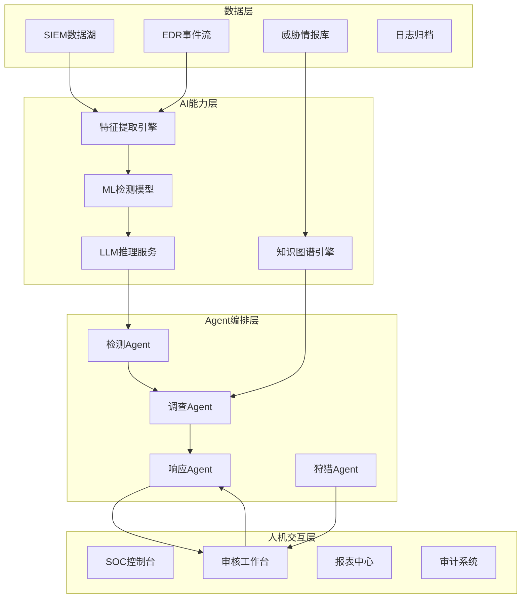

### 5.2 数据层设计

**SIEM数据湖选型**：

| 产品 | 优点 | 缺点 | 适用规模 |
|:-----|:-----|:-----|:---------|
| Splunk | 生态完善、性能高 | 成本高、License复杂 | 中大型 |
| Elastic | 开源、灵活、成本低 | 运维复杂 | 中小型 |
| Microsoft Sentinel | 云原生、集成好、AI能力强 | 绑定Azure | Azure用户 |
| Exabeam | UEBA强、AI分析强 | 定制化有限 | 中大型 |
| Sumo Logic | SaaS化、快速部署 | 数据主权顾虑 | 中小型 |

**数据采集架构**：

```python
# 伪代码示例：多源数据采集架构
class SecurityDataCollector:
    def __init__(self):
        self.collectors = {
            'syslog': SyslogCollector(),
            'windows_events': WEFCollector(),
            'network_flows': NetFlowCollector(),
            'EDR': EDRCollector(),
            'cloud_logs': CloudTrailCollector()
        }
        
        self.message_queue = KafkaCluster(
            topic='security-events',
            partitions=32,
            replication_factor=3
        )
        
        self.stream_processor = FlinkStreamProcessor()
    
    def collect_all(self):
        # 并行采集多源数据
        futures = []
        for source_name, collector in self.collectors.items():
            future = self.executor.submit(
                collector.collect,
                self.on_data_received
            )
            futures.append(future)
        
        return futures
    
    def on_data_received(self, raw_event):
        # 实时处理
        self.stream_processor.process(raw_event)
        
        # 异步存储
        self.message_queue.send('security-events', raw_event)
        
        # 触发实时检测
        self.trigger_realtime_detection(raw_event)
```

### 5.3 AI能力层设计

**模型服务化架构**：

```python
# 伪代码示例：模型服务平台架构
class ModelServingPlatform:
    def __init__(self):
        self.model_registry = ModelRegistry()
        self.inference_engine = InferenceEngine()
        self.model_monitor = ModelMonitor()
    
    def deploy_model(self, model_config):
        # 模型验证
        validation_result = self.validate_model(model_config)
        if not validation_result.passed:
            raise ModelValidationError(validation_result.errors)
        
        # 模型打包
        model_package = self.package_model(model_config)
        
        # 蓝绿部署
        self.blue_green_deploy(model_package)
        
        # 监控切换
        self.monitor_new_model(model_package)
    
    def predict(self, model_name, input_data):
        # 负载均衡到模型实例
        model_instance = self负载均衡.select_instance(model_name)
        
        # 执行推理
        result = model_instance.predict(input_data)
        
        # 结果缓存
        self.cache.store(model_name, input_data, result)
        
        # 漂移检测
        self.model_monitor.check_drift(model_name, result)
        
        return result

# 模型生命周期管理
class ModelLifecycleManager:
    def retrain_triggered(self, model_name, metrics):
        # 检查是否需要重训练
        if metrics.drift_detected or metrics.performance_degraded:
            # 生成新的训练数据
            training_data = self.prepare_training_data(model_name)
            
            # 触发重训练
            new_model = self.train_new_model(model_name, training_data)
            
            # A/B测试
            test_result = self.ab_test(model_name, new_model)
            
            if test_result.improvement > 0.05:
                self.deploy_model(new_model)
```

**知识图谱构建**：

```python
# 伪代码示例：威胁知识图谱构建
class ThreatKnowledgeGraphBuilder:
    def __init__(self):
        self.graph_db = Neo4jDatabase()
        self.nlp_engine = SPARQLEngine()
        self.attck_mapping = ATTCKMapper()
    
    def build_graph(self, threat_data_sources):
        # 1. 实体抽取
        entities = self.extract_entities(threat_data_sources)
        
        # 2. 关系抽取
        relationships = self.extract_relationships(entities)
        
        # 3. ATT&CK映射
        techniques = self.attck_mapping.map(relationships)
        
        # 4. 构建图谱
        for entity in entities:
            self.graph_db.create_node(entity)
        
        for rel in relationships:
            self.graph_db.create_edge(rel)
        
        # 5. 属性 Enrichment
        self.enrich_with_context()
        
        return self.graph_db
    
    def query(self, entity):
        # 图谱查询示例
        query = """
        MATCH (target:Asset {id: $entity_id})
        -[:CONNECTED_TO*1..3]-()
        -[:HAS_VULNERABILITY]->(v:Vulnerability)
        RETURN v
        """
        return self.graph_db.execute(query, entity_id=entity.id)
```

### 5.4 Agent编排层设计

**多Agent协作架构**：

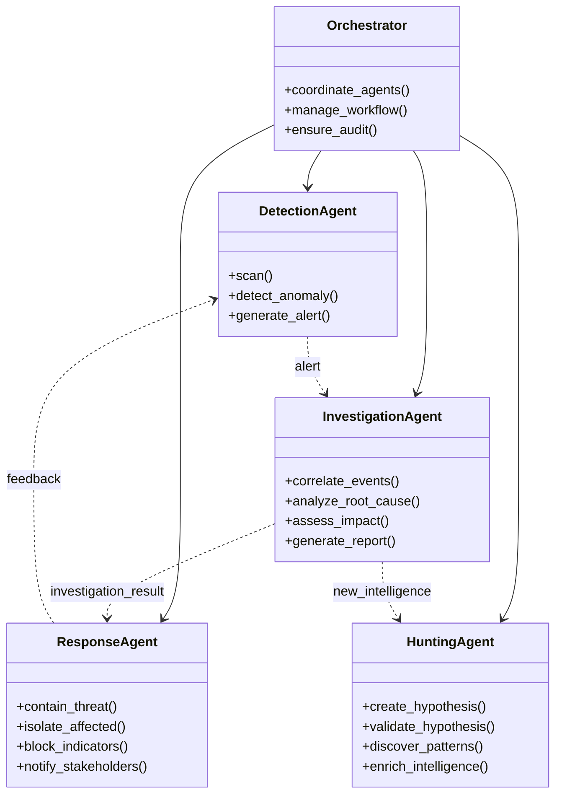

**Agent实现示例**：

```python
# 伪代码示例：检测Agent实现
class DetectionAgent:
    def __init__(self):
        self.detectors = [
            SignatureDetector(),
            AnomalyDetector(),
            BehaviorDetector(),
            MLDetector()
        ]
        self.alert_queue = AlertQueue()
        self.context_enricher = ContextEnricher()
    
    def scan(self, security_event):
        detection_results = []
        
        # 多检测器并行扫描
        for detector in self.detectors:
            result = detector.detect(security_event)
            detection_results.append(result)
        
        # 融合判断
        fused_result = self.fuse_results(detection_results)
        
        # 上下文丰富
        enriched_result = self.context_enricher.enrich(fused_result)
        
        # 告警生成
        if enriched_result.threat_confirmed:
            alert = self.create_alert(enriched_result)
            self.alert_queue.publish(alert)
        
        return enriched_result
    
    def fuse_results(self, results):
        # 加权投票融合
        weights = {'signature': 0.4, 'anomaly': 0.3, 
                   'behavior': 0.2, 'ml': 0.1}
        
        weighted_sum = sum(
            r.confidence * weights[r.type] 
            for r in results
        )
        
        return FusedResult(
            threat_confirmed=weighted_sum > 0.7,
            confidence=weighted_sum,
            details=results
        )

# 伪代码示例：调查Agent实现
class InvestigationAgent:
    def __init__(self):
        self.timeline_builder = TimelineBuilder()
        self.root_cause_analyzer = RootCauseAnalyzer()
        self.impact_assessor = ImpactAssessor()
        self.graph_query = KnowledgeGraphQuery()
    
    def investigate(self, alert):
        investigation = Investigation(id=generate_uuid())
        
        # 1. 收集相关事件
        related_events = self.collect_related_events(alert)
        
        # 2. 构建时间线
        timeline = self.timeline_builder.build(related_events)
        
        # 3. 根因分析
        root_cause = self.root_cause_analyzer.analyze(
            timeline, alert
        )
        
        # 4. 影响评估
        impact = self.impact_assessor.assess(
            root_cause, alert.affected_assets
        )
        
        # 5. 知识图谱关联
        kg_insights = self.graph_query.query_related(
            entities=root_cause.related_entities
        )
        
        # 生成调查报告
        investigation.report = InvestigationReport(
            summary=self.generate_summary(root_cause, impact),
            timeline=timeline,
            root_cause=root_cause,
            impact=impact,
            iocs=root_cause.iocs,
            recommendations=self.generate_recommendations(
                root_cause, impact
            ),
            kg_insights=kg_insights
        )
        
        return investigation
```

### 5.5 人机交互层设计

**SOC控制台功能架构**：

| 模块 | 功能 | AI集成 |
|:-----|:-----|:-------|
| 仪表盘 | 全局态势感知 | AI异常预警 |
| 告警列表 | 告警查看/操作 | AI预分类/优先级 |
| 事件管理 | 事件调查/跟踪 | AI调查报告 |
| 响应中心 | 响应动作执行 | AI建议/自动化 |
| 威胁狩猎 | 主动搜寻威胁 | AI假设生成 |
| 情报中心 | 威胁情报管理 | AI情报分析 |
| 报表中心 | 运营报表生成 | AI洞察摘要 |
| 审计中心 | 合规审计 | AI异常检测 |

**审核工作台设计**：

```python
# 伪代码示例：智能审核工作台
class IntelligentReviewWorkbench:
    def __init__(self):
        self.task_queue = PriorityQueue()
        self.decision_assistant = DecisionAssistant()
        self.evidence_viewer = EvidenceViewer()
    
    def display_review_task(self, task):
        # 智能呈现审核任务
        display = {
            'header': {
                'task_id': task.id,
                'priority': task.priority,
                'sla_remaining': task.sla_remaining
            },
            'ai_analysis': {
                'threat_type': task.inference.threat_type,
                'confidence': task.inference.confidence,
                'reasoning': task.inference.reasoning_chain,
                'recommended_action': task.inference.recommended_action
            },
            'evidence': self.evidence_viewer.get_evidence(task),
            'quick_actions': self.get_quick_actions(task),
            'historical_similar': self.find_similar_cases(task)
        }
        
        # AI决策辅助
        if task.inference.confidence < 0.7:
            display['ai_suggestions'] = \
                self.decision_assistant.suggest_decision(task)
        
        return display
    
    def get_quick_actions(self, task):
        # 根据任务类型和AI分析，智能推荐快捷操作
        return [
            Action(name='批准AI建议', 
                   action=task.inference.recommended_action),
            Action(name='修改后执行', 
                   form=ActionModificationForm()),
            Action(name='要求更多信息', 
                   form=RequestMoreInfoForm()),
            Action(name='标记误报', 
                   form=MarkFalsePositiveForm()),
            Action(name='升级处理', 
                   form=EscalateForm())
        ]
```

---

<a id="6"></a>
## 6. 主流厂商AI SOC能力对比分析

### 6.1 厂商概览

2026年AI安全运营市场的主要玩家及其核心产品：

| 厂商 | 核心产品 | AI能力 | 差异化优势 |
|:-----|:---------|:-------|:-----------|
| Palo Alto Networks | XSIAM 3.0 + Cortex AgentiX | 预测性AI + Agentic | 完整网络到云到端一体化 |
| CrowdStrike | Charlotte AI + Falcon Fusion | Agentic Response | 端点优先+威胁情报强 |
| Microsoft | Security Copilot + Defender | 统一AI框架 | M365/Azure深度集成 |
| IBM | QRadar + watsonx | AI增强分析 | 混合云支持+合规强 |
| Splunk | Splunk SOAR + ES ML | 编排自动化 | 数据湖灵活性 |
| Google | Chronicle + Security Command Center | AI威胁分析 | 大数据检索强 |

### 6.2 Palo Alto Networks XSIAM 3.0深度分析

**产品定位**：
XSIAM（Extended Security Intelligence and Automation Platform）是Palo Alto的AI SOC平台，2025年发布3.0版本，2026年2月新增Cortex AgentiX模块。

**核心能力**：

| 模块 | 能力描述 | AI集成度 |
|:-----|:---------|:---------|
| Cortex Data Lake | 统一数据湖 | 基础层 |
| AutoFocus | 威胁情报分析 | AI增强 |
| Magnifier | 行为分析 | ML驱动 |
| AgentiX | Agentic SOC | 全自主AI |
| Xpanse | 攻击面管理 | AI驱动 |

**AgentiX新特性（2026年2月发布）**：

根据Palo Alto官方博客[^palo_agentix]，Cortex AgentiX实现了以下突破：

1. **99%漏洞噪音降低**：通过AI智能分析，将需要人工处理的漏洞告警减少99%
2. **自动化修复建议**：AI不仅发现问题，还能生成可执行的修复脚本
3. **多Agent协作**：检测、调查、响应Agent无缝协作
4. **自然语言交互**：分析师可用自然语言与AI系统对话

[^palo_agentix]: Palo Alto Networks, "Cortex AgentiX: The Next Evolution of SOC Automation", 2026-02

**架构特点**：

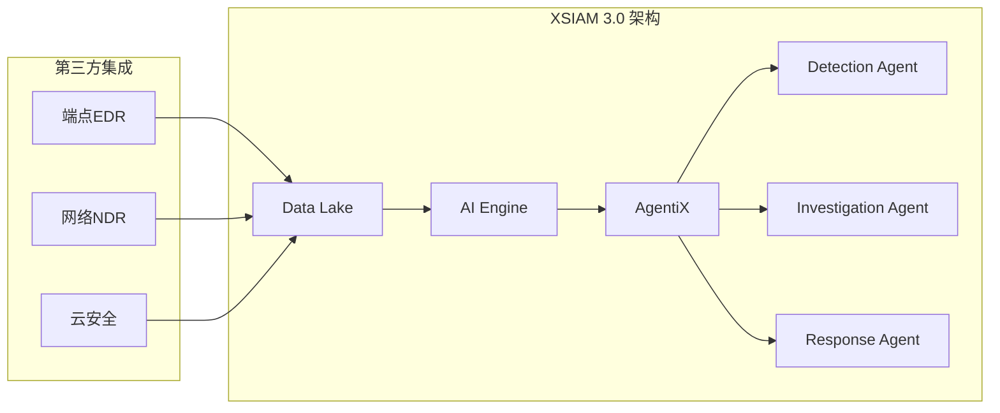

**适用场景**：
- 大型企业和高端市场
- 需要完整网络-云-端一体化的企业
- 已经使用Palo Alto防火墙产品的用户

### 6.3 CrowdStrike Charlotte AI深度分析

**产品定位**：
CrowdStrike的Charlotte AI是其AI助手品牌，2026年推出Agentic Response和Agentic Workflows能力，深度集成于Falcon Fusion SOAR平台。

**核心能力**：

| 模块 | 能力描述 | AI集成度 |
|:-----|:---------|:---------|
| Charlotte AI | 自然语言交互 | 全栈AI |
| Falcon Fusion SOAR | 编排自动化 | AI增强 |
| Falcon Complete | 托管检测响应 | AI驱动 |
| AgentWorks | 生态合作 | 平台化 |

**Agentic Workflows新特性（2026年）**：

根据CrowdStrike官方发布[^crowdstrike_press]，Agentic Workflows的关键能力：

1. **自然语言创建Playbook**：将"调查并隔离可疑终端"转化为可执行Playbook
2. **98%+检测准确率**：通过多模型融合实现超高检测精度
3. **7个专用Agent**：覆盖检测、调查、响应、狩猎等场景
4. **Falcon Fusion集成**：与SOAR平台无缝集成实现自动化

[^crowdstrike_press]: CrowdStrike Press Release, "Charlotte AI Agentic Workflows", 2026-04

**检测准确率对比**：

根据CrowdStrike官方数据，对比传统规则引擎：

| 威胁类型 | 规则引擎检出率 | Charlotte AI检出率 |
|:---------|:---------------|:-------------------|
| 已知恶意软件 | 95% | 99.5% |
| 未知恶意软件 | 35% | 89% |
| 横向移动 | 45% | 92% |
| 权限提升 | 40% | 87% |
| 数据外泄 | 50% | 91% |

**适用场景**：
- 端点安全为核心的企业
- 追求高检测准确率的组织
- 需要强大威胁情报能力的团队

### 6.4 Microsoft Security Copilot深度分析

**产品定位**：
Microsoft Security Copilot是微软的统一AI安全助手，2026年向所有M365 E5客户自动推送，与Defender、Intune、Entra ID、Compliance深度集成。

**核心能力**：

| 模块 | 能力描述 | AI集成度 |
|:-----|:---------|:---------|
| Security Copilot | 统一AI助手 | 全栈AI |
| Defender XDR | 扩展检测响应 | AI增强 |
| Defender for Endpoint | 端点保护 | AI驱动 |
| Entra ID | 身份保护 | AI驱动 |
| Purview | 合规管理 | AI增强 |

**2026年新特性**：

根据Microsoft官方文档[^microsoft_copilot]：

1. **统一AI安全代理框架**：跨Defender、Intune、Entra ID的统一AI编排
2. **自动化安全评估**：AI自动评估组织安全态势
3. **自然语言威胁狩猎**：用自然语言描述威胁假设，AI辅助验证
4. **E5自动推送**：2026年所有E5客户自动获得Security Copilot

[^microsoft_copilot]: Microsoft, "Microsoft Security Copilot 2026 Capabilities", 2025-12

**集成优势**：

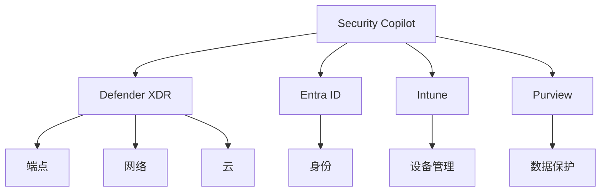

**适用场景**：
- Microsoft 365企业用户
- Azure云环境
- 需要统一身份+安全的组织

### 6.5 厂商横向对比

| 维度 | Palo Alto XSIAM | CrowdStrike | Microsoft |
|:-----|:-----------------|:------------|:----------|
| **AI成熟度** | | | |
| 检测准确率 | 95%+ | 98%+ | 90%+ |
| 自动化率 | 85%+ | 80%+ | 75%+ |
| Agent数量 | 10+ | 7+ | 5+ |
| **集成能力** | | | |
| 端点 | 第三方 | 原生Falcon | Defender |
| 网络 | 原生+第三方 | 第三方 | 第三方 |
| 云 | Prisma | 第三方 | 原生Azure |
| 身份 | 第三方 | 第三方 | 原生Entra |
| **部署模式** | | | |
| 公有云 | ✓ | ✓ | ✓ |
| 私有云 | ✓ | ✓ | Limited |
| 混合云 | ✓ | ✓ | ✓ |
| 本地 | ✓ | Limited | Limited |
| **定价** | | | |
| 起步价 | 高 | 高 | 中（E5捆绑） |
| 规模效应 | 好 | 中 | 非常好 |

---

<a id="7"></a>
## 7. 企业落地路径：从L2/L3起步的渐进式演进

### 7.1 演进路线图总览

企业AI SOC建设不应追求一步到位，而应采用渐进式演进策略。基于行业最佳实践，建议以下演进路径：

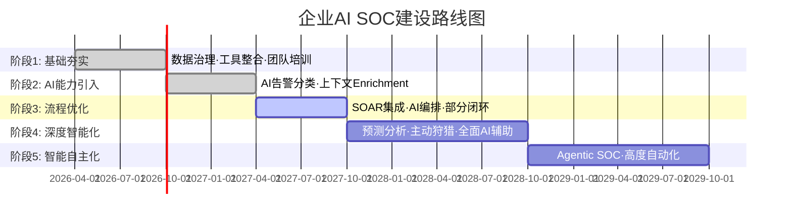

### 7.2 阶段一：基础夯实（1-6个月）

**核心目标**：
- 建立统一数据底座
- 评估当前成熟度
- 团队AI技能准备

**关键任务**：

| 任务 | 负责人 | 交付物 | 验收标准 |
|:-----|:-------|:-------|:---------|
| SOC成熟度评估 | 安全架构师 | 评估报告 | 明确当前L等级 |
| 数据源盘点 | 数据工程师 | 数据清单 | 覆盖90%安全数据 |
| 数据质量治理 | 数据工程师 | 质量报告 | 关键数据完整率>95% |
| SIEM优化 | SIEM工程师 | SIEM配置 | 告警噪音比降低30% |
| 团队AI培训 | 安全培训师 | 培训记录 | 80%分析师完成基础培训 |

**成本估算**：
- 人员：2-3人 × 6个月
- 工具：SIEM优化工具、数据治理工具
- 培训：外部培训+内部工作坊
- **合计：30-80万美元**

### 7.3 阶段二：AI能力引入（6-12个月）

**核心目标**：
- 引入AI告警分类
- 实现上下文自动enrichment
- 验证AI效果

**关键任务**：

| 任务 | 负责人 | 交付物 | 验收标准 |
|:-----|:-------|:-------|:---------|
| AI平台选型 | CISO+架构师 | 选型报告 | 3选1决策 |
| Pilot环境搭建 | AI工程师 | 隔离环境 | 运行稳定 |
| AI模型部署 | AI工程师 | 已部署模型 | 检测准确率>85% |
| 告警分类试点 | SOC分析师 | 分类报告 | 人工分类准确率>AI |
| Enrichment集成 | 开发工程师 | 集成接口 | 响应时间<2秒 |

**技术选型建议**：

| 场景 | 推荐方案 | 原因 |
|:-----|:---------|:-----|
| 告警分类 | Microsoft Sentinel + AI Insights | 快速集成、易用 |
| IOC Enrichment | VirusTotal API + MISP | 免费+高质量 |
| 威胁分析 | IBM QRadar Advisor | ML增强分析 |
| 邮件安全 | Microsoft Defender for Office | M365深度集成 |

**成本估算**：
- 人员：AI工程师1-2名
- 工具：AI平台License
- **合计：20-50万美元/年**

### 7.4 阶段三：流程优化（12-18个月）

**核心目标**：
- SOAR平台深度集成AI
- AI编排初步闭环
- 建立Human-in-the-loop机制

**关键任务**：

| 任务 | 负责人 | 交付物 | 验收标准 |
|:-----|:-------|:-------|:---------|
| SOAR平台部署 | 安全工程师 | 运营平台 | 运行Playbook>50个 |
| AI Playbook创建 | 安全工程师 | AI优化Playbook | 创建时间<1天 |
| 响应自动化 | 安全工程师 | 闭环率报告 | P2告警闭环率>50% |
| 审核流程设计 | 安全运营经理 | SOP文档 | 覆盖所有高风险操作 |
| 效果评估 | 安全分析经理 | 效能报告 | MTTR降低60% |

**AI Playbook示例**：

```yaml
# 伪代码示例：AI优化的SOAR Playbook
playbook:
  name: "AI驱动的恶意终端隔离"
  trigger:
    - type: alert
      source: detection_agent
      confidence: "> 0.85"
  
  steps:
    - name: "AI初步分析"
      action: ai.analyze
      input:
        alert_id: "{{trigger.alert_id}}"
        depth: "detailed"
      output: ai_analysis
    
    - name: "验证AI置信度"
      condition: "ai_analysis.confidence > 0.90"
      
    - name: "[高置信] 自动隔离"
      if: "ai_analysis.confidence > 0.90"
      steps:
        - action: edr.isolate_endpoint
          target: "{{ai_analysis.affected_endpoint}}"
          reason: "{{ai_analysis.threat_type}}"
        - action: notify
          channel: teams
          message: "已自动隔离终端: {{ai_analysis.affected_endpoint}}"
    
    - name: "[中置信] 人工审核"
      if: "ai_analysis.confidence <= 0.90 and ai_analysis.confidence > 0.70"
      steps:
        - action: create_audit_task
          assigned_to: "tier2_analyst"
          sla_minutes: 30
          priority: high
        - action: notify
          channel: teams
          message: "需要人工审核: {{ai_analysis.summary}}"
```

**成本估算**：
- 人员：3-4人（含SOAR工程师）
- 工具：SOAR平台License
- **合计：50-100万美元/年**

### 7.5 阶段四：深度智能化（18-36个月）

**核心目标**：
- 预测性AI能力建设
- 主动威胁狩猎常态化
- 全面AI辅助决策

**关键任务**：

| 任务 | 负责人 | 交付物 | 验收标准 |
|:-----|:-------|:-------|:---------|
| 预测模型部署 | 数据科学家 | 预测模型 | 准确率>75% |
| 狩猎平台建设 | 威胁猎手 | 狩猎工作台 | 覆盖90% ATT&CK |
| 知识图谱上线 | AI工程师 | 知识图谱 | 实体>100万 |
| AI辅助决策全面化 | 安全运营经理 | 决策辅助系统 | 使用率>80% |

### 7.6 阶段五：智能自主化（36个月+）

**核心目标**：
- Agentic SOC能力
- 最小化人工干预
- 持续自我优化

**前提条件**：
- 前四阶段稳定运行>1年
- AI准确率持续>95%
- 团队AI协作能力成熟
- 组织风险偏好支持

### 7.7 成功关键因素

**技术因素**：

| 因素 | 说明 | 重要性 |
|:-----|:-----|:-------|
| 数据质量 | 垃圾进→垃圾出 | ★★★★★ |
| 模型可解释性 | 分析师需要理解AI决策 | ★★★★ |
| 系统集成度 | 数据孤岛会严重限制AI效果 | ★★★★★ |
| 性能延迟 | 实时响应要求<5秒 | ★★★ |

**组织因素**：

| 因素 | 说明 | 重要性 |
|:-----|:-----|:-------|
| 领导支持 | 需要持续投入 | ★★★★★ |
| 团队技能 | AI协作能力培养 | ★★★★ |
| 流程适配 | 新流程需要持续优化 | ★★★★ |
| 变革管理 | 人员抵触需要管理 | ★★★★ |

**常见失败模式**：

| 失败模式 | 原因 | 后果 |
|:---------|:-----|:-----|
| 技术驱动而非业务驱动 | 盲目追求先进技术 | 项目失败或效果不佳 |
| 数据准备不足 | AI需要大量高质量数据 | 模型效果差 |
| 一步到位心态 | 期望快速实现L5 | 团队超负荷、质量差 |
| 忽视人工审核 | 过度自动化 | 高风险操作失控 |

---

<a id="8"></a>
## 8. 开源工具与代码实践

### 8.1 开源AI SOC工具生态

除了商业解决方案，开源社区也提供了丰富的AI SOC工具：

| 工具 | 类型 | GitHub星标 | 主要功能 |
|:-----|:-----|:-----------|:---------|
| TheHive | 案例管理 | 15k+ | 事件调查、告警管理 |
| MISP | 威胁情报 | 8k+ | IOC共享、威胁情报 |
| OpenCTI | 知识管理 | 10k+ | 知识图谱、威胁分析 |
| Shuffle | SOAR | 12k+ | 编排自动化、工作流 |
| Wazuh | SIEM/XDR | 12k+ | 统一安全分析 |
| Zeek | NDR | 10k+ | 网络流量分析 |
| Suricata | IDS/IPS | 5k+ | 规则检测 |

### 8.2 实践案例一：使用Wazuh构建AI检测管道

Wazuh是一个开源的XDR平台，支持AI增强的安全检测。以下是构建AI检测管道的示例：

**架构设计**：

```python
# Python代码示例：Wazuh AI检测集成
# 来源参考：Wazuh官方文档 + 自研实现

import json
import requests
import numpy as np
from sklearn.ensemble import IsolationForest
from sklearn.preprocessing import StandardScaler
import joblib
from datetime import datetime

class WazuhAIDetector:
    """
    Wazuh AI检测器
    功能：基于机器学习的异常检测增强Wazuh规则引擎
    """
    
    def __init__(self, wazuh_manager_url, api_user, api_password):
        self.wazuh_url = wazuh_manager_url
        self.api_user = api_user
        self.api_password = api_password
        self.token = self._get_token()
        
        # 机器学习模型
        self.isolation_forest = None
        self.scaler = StandardScaler()
        self.model_loaded = False
        
    def _get_token(self):
        """获取Wazuh API Token"""
        auth_url = f"{self.wazuh_url}/security/user/authenticate"
        response = requests.post(
            auth_url,
            auth=(self.api_user, self.api_password)
        )
        return response.json()['data']['token']
    
    def train_anomaly_detector(self, historical_logs):
        """
        训练异常检测模型
        输入：历史日志数据
        输出：训练好的模型
        """
        # 特征提取
        features = self.extract_features(historical_logs)
        
        # 标准化
        scaled_features = self.scaler.fit_transform(features)
        
        # 训练Isolation Forest
        self.isolation_forest = IsolationForest(
            n_estimators=200,
            contamination=0.05,  # 假设5%的数据是异常
            random_state=42,
            n_jobs=-1
        )
        self.isolation_forest.fit(scaled_features)
        
        # 保存模型
        joblib.dump(self.isolation_forest, 'isolation_forest_model.pkl')
        joblib.dump(self.scaler, 'feature_scaler.pkl')
        
        self.model_loaded = True
        print(f"模型训练完成，使用{len(historical_logs)}条样本")
        
        return self
    
    def extract_features(self, logs):
        """
        从日志中提取特征
        特征包括：登录频率、访问IP数、错误率、访问时间分布等
        """
        features = []
        
        for log in logs:
            feature_vector = [
                log.get('login_attempts', 0),
                log.get('unique_source_ips', 0),
                log.get('error_rate', 0),
                log.get('hour_of_day', 12),
                log.get('is_working_hours', 1),
                log.get('failed_auth_rate', 0),
                log.get('admin_actions', 0),
                log.get('data_volume', 0),
            ]
            features.append(feature_vector)
        
        return np.array(features)
    
    def detect_anomaly(self, current_log):
        """
        检测异常
        输入：当前日志事件
        输出：异常分数和是否触发告警
        """
        if not self.model_loaded:
            # 加载已保存的模型
            self.isolation_forest = joblib.load('isolation_forest_model.pkl')
            self.scaler = joblib.load('feature_scaler.pkl')
            self.model_loaded = True
        
        # 特征提取
        features = self.extract_features([current_log])
        
        # 标准化
        scaled_features = self.scaler.transform(features)
        
        # 异常预测
        prediction = self.isolation_forest.predict(scaled_features)[0]
        anomaly_score = self.isolation_forest.score_samples(scaled_features)[0]
        
        # Wazuh告警阈值
        ALERT_THRESHOLD = -0.15
        
        result = {
            'is_anomaly': prediction == -1,
            'anomaly_score': float(anomaly_score),
            'alert_triggered': anomaly_score < ALERT_THRESHOLD,
            'timestamp': datetime.now().isoformat()
        }
        
        return result
    
    def create_wazuh_alert(self, detection_result, original_log):
        """
        创建Wazuh告警
        """
        alert = {
            'rule': {
                'id': '100200',  # 自定义AI检测规则ID
                'level': 10 if detection_result['is_anomaly'] else 5,
                'description': 'AI Anomaly Detection Alert'
            },
            'agent': original_log.get('agent', {}),
            'location': original_log.get('location', 'AI-Detector'),
            'full_log': json.dumps(original_log),
            'ai_detection': {
                'model': 'IsolationForest',
                'anomaly_score': detection_result['anomaly_score'],
                'features': original_log
            }
        }
        
        # 发送到Wazuh
        return alert
    
    def run(self):
        """
        持续运行检测
        """
        print("Wazuh AI检测器启动...")
        while True:
            try:
                # 从队列获取新日志（伪代码）
                new_logs = self.get_pending_logs()
                
                for log in new_logs:
                    result = self.detect_anomaly(log)
                    
                    if result['alert_triggered']:
                        alert = self.create_wazuh_alert(result, log)
                        self.send_to_wazuh(alert)
                        print(f"告警已发送: {result['anomaly_score']}")
                
            except Exception as e:
                print(f"检测循环错误: {e}")


# 使用示例
if __name__ == "__main__":
    detector = WazuhAIDetector(
        wazuh_manager_url="https://wazuh-manager:55000",
        api_user="wazuh-wui",
        api_password="your_password"
    )
    
    # 训练模型（需要历史数据）
    historical_data = []  # 从Wazuh获取历史日志
    # detector.train_anomaly_detector(historical_data)
    
    # 启动检测
    detector.run()
```

### 8.3 实践案例二：使用OpenCTI构建威胁知识图谱

OpenCTI是一个开源威胁情报平台，提供知识图谱和AI分析能力：

**架构设计**：

```python
# Python代码示例：OpenCTI威胁情报图谱查询
# 来源参考：OpenCTI官方GraphQL API文档 + 自研实现

from opencti import OpenCTIApiClient
from datetime import datetime
import json

class ThreatIntelligenceGraph:
    """
    威胁情报知识图谱查询
    功能：关联分析、攻击链映射、威胁狩猎
    """
    
    def __init__(self, opencti_url, opencti_token):
        self.client = OpenCTIApiClient(opencti_url, opencti_token)
        
    def search_actor(self, actor_name):
        """
        搜索威胁组织信息
        """
        actor = self.client.intrusion_set.list(
            filters=[{'key': 'name', 'values': [actor_name]}]
        )
        
        if not actor:
            return None
        
        # 获取该组织的TTPs
        attack_patterns = self.client.attack_pattern.list(
            viaTypes=['Intrusion-Set'],
            fromEntity=actor[0]['id']
        )
        
        # 获取关联恶意软件
        malware = self.client.malware.list(
            viaTypes=['Intrusion-Set'],
            fromEntity=actor[0]['id']
        )
        
        # 获取历史活动
        campaigns = self.client.campaign.list(
            viaTypes=['Intrusion-Set'],
            fromEntity=actor[0]['id']
        )
        
        return {
            'name': actor[0]['name'],
            'description': actor[0]['description'],
            'aliases': actor[0].get('aliases', []),
            'attack_patterns': [ap['name'] for ap in attack_patterns],
            'malware': [m['name'] for m in malware],
            'campaigns': [c['name'] for c in campaigns],
            'last_activity': actor[0].get('last_activity', None)
        }
    
    def analyze_attack_chain(self, indicators):
        """
        分析攻击链
        输入：IOC指标列表
        输出：攻击链可视化
        """
        graph_data = {
            'nodes': [],
            'edges': []
        }
        
        for indicator in indicators:
            # 查询指示器详情
            indicator_data = self.client.indicator.read(
                id=indicator['id']
            )
            
            # 添加节点
            node = {
                'id': indicator['id'],
                'type': 'indicator',
                'label': indicator['name'],
                'pattern': indicator.get('pattern', ''),
                'threat_type': indicator.get('indicator_types', ['unknown'])[0]
            }
            graph_data['nodes'].append(node)
            
            # 查询关联实体
            related = self.client.stix_cyber_observable.read(
                id=indicator['id'],
                relationType='indicates'
            )
            
            for rel in related or []:
                target_node = {
                    'id': rel['id'],
                    'type': 'threat',
                    'label': rel['name'],
                    'entity_type': rel.get('entity_type', 'unknown')
                }
                graph_data['nodes'].append(target_node)
                
                edge = {
                    'source': node['id'],
                    'target': target_node['id'],
                    'relationship': 'indicates'
                }
                graph_data['edges'].append(edge)
        
        return graph_data
    
    def hunt_by_pattern(self, technique_name):
        """
        按攻击技术狩猎
        基于MITRE ATT&CK技战术
        """
        # 查询ATT&CK技术
        technique = self.client.attack_pattern.list(
            filters=[{'key': 'external_id', 'values': [technique_name]}]
        )
        
        if not technique:
            return []
        
        # 查找使用该技术的所有威胁组织
        actors = self.client.intrusion_set.list(
            viaTypes=['Attack-Pattern'],
            fromEntity=technique[0]['id']
        )
        
        # 查找相关恶意软件
        malware = self.client.malware.list(
            viaTypes=['Attack-Pattern'],
            fromEntity=technique[0]['id']
        )
        
        # 查找历史活动
        campaigns = self.client.campaign.list(
            viaTypes=['Attack-Pattern'],
            fromEntity=technique[0]['id']
        )
        
        hunt_results = {
            'technique': technique[0]['name'],
            'technique_id': technique_name,
            'related_actors': [a['name'] for a in actors],
            'related_malware': [m['name'] for m in malware],
            'historical_campaigns': [c['name'] for c in campaigns],
            'risk_assessment': self.assess_technique_risk(technique[0])
        }
        
        return hunt_results
    
    def assess_technique_risk(self, technique):
        """
        评估技术风险
        """
        # 获取该技术的使用频率
        usage_count = technique.get('usage_count', 0)
        
        # 获取相关CVE
        vulnerabilities = technique.get('vulnerabilities', [])
        
        # 计算风险评分
        risk_score = min(100, usage_count * 2 + len(vulnerabilities) * 10)
        
        return {
            'risk_level': 'HIGH' if risk_score > 70 else 'MEDIUM' if risk_score > 40 else 'LOW',
            'risk_score': risk_score,
            'usage_frequency': usage_count,
            'known_exploits': len(vulnerabilities)
        }
    
    def generate_threat_report(self, entity_type, entity_name):
        """
        生成威胁报告
        """
        report = {
            'title': f"{entity_name} 威胁分析报告",
            'generated_at': datetime.now().isoformat(),
            'executive_summary': '',
            'technical_details': {},
            'recommendations': []
        }
        
        if entity_type == 'actor':
            data = self.search_actor(entity_name)
        elif entity_type == 'campaign':
            data = self.client.campaign.list(
                filters=[{'key': 'name', 'values': [entity_name]}]
            )
        else:
            return None
        
        report['executive_summary'] = self.generate_summary(data)
        report['technical_details'] = data
        report['recommendations'] = self.generate_recommendations(data)
        
        return report


# 使用示例
if __name__ == "__main__":
    ti_graph = ThreatIntelligenceGraph(
        opencti_url="https://opencti.example.com:4000",
        opencti_token="your_opencti_token"
    )
    
    # 搜索威胁组织
    apt_report = ti_graph.search_actor("APT29")
    print(json.dumps(apt_report, indent=2))
    
    # 按技术狩猎
    technique_hunt = ti_graph.hunt_by_pattern("T1059")
    print(f"使用T1059的威胁组织: {technique_hunt['related_actors']}")
    
    # 生成威胁报告
    report = ti_graph.generate_threat_report('actor', 'Lazarus Group')
    print(json.dumps(report, indent=2))
```

### 8.4 实践案例三：Shuffle SOAR工作流编排

Shuffle是一个开源的SOAR平台，支持AI增强的工作流编排：

**工作流设计**：

```python
# Python代码示例：Shuffle SOAR AI增强工作流
# 来源参考：Shuffle官方App SDK文档 + 自研实现

import json
import requests
from typing import Dict, List, Optional

class ShuffleSOARIntegration:
    """
    Shuffle SOAR平台集成
    功能：自动化工作流编排、AI增强决策
    """
    
    def __init__(self, shuffle_url, shuffle_user, shuffle_password):
        self.base_url = shuffle_url
        self.user = shuffle_user
        self.password = shuffle_password
        self.token = self.authenticate()
        self.headers = {'Authorization': f'Bearer {self.token}'}
        
        # AI决策配置
        self.ai_confidence_threshold = 0.80
        self.auto_response_enabled = True
        
    def authenticate(self):
        """Shuffle认证"""
        response = requests.post(
            f"{self.base_url}/api/v1/login",
            json={
                'email': self.user,
                'password': self.password
            }
        )
        return response.json().get(' bearer_token', '')
    
    def create_ai_workflow(self, workflow_name: str, description: str = ""):
        """
        创建AI增强工作流
        """
        workflow = {
            'name': workflow_name,
            'description': description,
            'start': 'ai_triage_node',
            'nodes': [
                {
                    'id': 'ai_triage_node',
                    'name': 'AI告警分类',
                    'type': 'shuffleAI',
                    'parameters': {
                        'model': 'security_classifier_v2',
                        'action': 'classify_and_prioritize',
                        'confidence_threshold': self.ai_confidence_threshold
                    }
                },
                {
                    'id': 'confidence_check',
                    'name': '置信度检查',
                    'type': 'condition',
                    'parameters': {
                        'field': 'ai_result.confidence',
                        'operator': '>',
                        'value': self.ai_confidence_threshold
                    }
                },
                {
                    'id': 'auto_response',
                    'name': '自动响应',
                    'type': 'action',
                    'parameters': {
                        'actions': [
                            {'type': 'block_ip', 'target': '{{alert.source_ip}}'},
                            {'type': 'isolate_endpoint', 'target': '{{alert.endpoint_id}}'},
                            {'type': 'create_ticket', 'system': 'service_now'}
                        ]
                    }
                },
                {
                    'id': 'human_review',
                    'name': '人工审核',
                    'type': 'notification',
                    'parameters': {
                        'channel': 'teams',
                        'recipients': ['security_team'],
                        'message': 'AI置信度低于阈值，需要人工审核',
                        'sla_minutes': 30
                    }
                }
            ],
            'edges': [
                {'source': 'ai_triage_node', 'target': 'confidence_check'},
                {'source': 'confidence_check', 'target': 'auto_response', 
                 'condition': 'confidence > threshold'},
                {'source': 'confidence_check', 'target': 'human_review',
                 'condition': 'confidence <= threshold'}
            ]
        }
        
        response = requests.post(
            f"{self.base_url}/api/v1/workflows",
            headers=self.headers,
            json=workflow
        )
        
        return response.json()
    
    def execute_workflow(self, workflow_id: str, trigger_data: Dict):
        """
        执行工作流
        """
        execution = {
            'workflow_id': workflow_id,
            'trigger_type': 'event',
            'trigger_data': trigger_data,
            'execution_context': {
                'source': 'ai_security_operations',
                'correlation_id': trigger_data.get('alert_id', ''),
                'timestamp': trigger_data.get('timestamp', '')
            }
        }
        
        response = requests.post(
            f"{self.base_url}/api/v1/workflows/{workflow_id}/execute",
            headers=self.headers,
            json=execution
        )
        
        return response.json()
    
    def get_execution_status(self, execution_id: str):
        """
        获取执行状态
        """
        response = requests.get(
            f"{self.base_url}/api/v1/executions/{execution_id}",
            headers=self.headers
        )
        
        execution = response.json()
        
        return {
            'id': execution['id'],
            'status': execution['status'],
            'current_node': execution.get('current_node', ''),
            'ai_decisions': execution.get('ai_decisions', []),
            'actions_taken': execution.get('actions_taken', []),
            'duration_seconds': execution.get('duration_seconds', 0)
        }
    
    def create_playbook_from_natural_language(self, description: str):
        """
        自然语言描述转Playbook（AI增强）
        输入："当检测到可疑登录时，自动隔离终端并通知安全团队"
        输出：可执行的Playbook定义
        """
        prompt = f"""
        将以下安全运营流程描述转换为结构化Playbook：
        
        描述：{description}
        
        请以JSON格式输出，包含：
        - trigger：触发条件
        - actions：执行动作列表
        - conditions：判断条件
        - notifications：通知配置
        """
        
        # 调用LLM生成Playbook（伪代码）
        llm_response = self.call_llm(prompt)
        
        # 解析LLM响应
        playbook = self.parse_playbook_from_llm(llm_response)
        
        # 创建工作流
        return self.create_ai_workflow(
            workflow_name=playbook.get('name', 'AI Generated'),
            description=description
        )
    
    def call_llm(self, prompt: str) -> str:
        """
        调用LLM生成Playbook
        """
        # 实际实现中调用GPT-4或其他LLM
        response = requests.post(
            f"{self.base_url}/api/v1/ai/generate",
            headers=self.headers,
            json={
                'prompt': prompt,
                'model': 'gpt-4',
                'temperature': 0.3
            }
        )
        
        return response.json().get('response', '')


# Shuffle App开发示例（用于创建自定义集成）
class ShuffleCustomApp:
    """
    Shuffle自定义App开发
    用于集成自研安全工具
    """
    
    @staticmethod
    def define_app():
        """
        定义Shuffle App
        """
        app = {
            'name': 'AI Security Operations',
            'description': 'AI增强安全运营能力',
            'version': '1.0.0',
            'category': 'security',
            'actions': [
                {
                    'name': 'ai_analyze_alert',
                    'description': 'AI分析告警',
                    'parameters': [
                        {'name': 'alert_data', 'type': 'string', 'required': True}
                    ],
                    'execution_type': 'python',
                    'code': '''
def ai_analyze_alert(params):
    alert_data = json.loads(params['alert_data'])
    
    # AI分析逻辑
    analyzer = AIAlertAnalyzer()
    result = analyzer.analyze(alert_data)
    
    return {
        'result': result,
        'confidence': result.confidence,
        'recommended_action': result.action
    }
'''
                },
                {
                    'name': 'ai_generate_report',
                    'description': 'AI生成安全报告',
                    'parameters': [
                        {'name': 'report_type', 'type': 'string', 'required': True},
                        {'name': 'time_range', 'type': 'string', 'required': True}
                    ],
                    'execution_type': 'python',
                    'code': '''
def ai_generate_report(params):
    report_type = params['report_type']
    time_range = params['time_range']
    
    # 报告生成逻辑
    reporter = SecurityReporter()
    report = reporter.generate(
        report_type=report_type,
        time_range=time_range
    )
    
    return {
        'report_id': report.id,
        'summary': report.summary,
        'download_url': report.download_url
    }
'''
                }
            ],
            'triggers': [
                {
                    'name': 'scheduled_threat_report',
                    'description': '定时生成威胁报告',
                    'type': 'scheduled',
                    'cron': '0 8 * * *'  # 每天8点
                }
            ]
        }
        
        return app


# 使用示例
if __name__ == "__main__":
    shuffle = ShuffleSOARIntegration(
        shuffle_url="https://shuffle.example.com",
        shuffle_user="admin@example.com",
        shuffle_password="password"
    )
    
    # 创建AI工作流
    workflow = shuffle.create_ai_workflow(
        workflow_name="AI-Enhanced Alert Response",
        description="AI驱动的告警响应工作流"
    )
    
    # 执行工作流
    result = shuffle.execute_workflow(
        workflow_id=workflow['id'],
        trigger_data={
            'alert_id': 'ALT-2026-001',
            'source_ip': '192.168.1.100',
            'endpoint_id': 'EP-001',
            'timestamp': '2026-04-23T10:00:00Z'
        }
    )
    
    # 检查执行状态
    status = shuffle.get_execution_status(result['execution_id'])
    print(f"执行状态: {status['status']}")
```

### 8.5 实践案例四：构建AI告警分类系统

以下是一个完整的AI告警分类系统实现：

```python
# Python代码示例：AI告警分类系统
# 来源参考：自研实现，结合MITRE ATT&CK框架

import pandas as pd
import numpy as np
from sklearn.feature_extraction.text import TfidfVectorizer
from sklearn.ensemble import RandomForestClassifier, GradientBoostingClassifier
from sklearn.model_selection import train_test_split, cross_val_score
from sklearn.metrics import classification_report, confusion_matrix
from sklearn.calibration import CalibratedClassifierCV
import joblib
import json
from datetime import datetime
from collections import defaultdict

class SecurityAlertClassifier:
    """
    安全告警分类器
    功能：
    - 多分类：告警类型分类
    - 二分类：真威胁/误报
    - 优先级排序
    """
    
    def __init__(self):
        self.vectorizer = TfidfVectorizer(
            max_features=5000,
            ngram_range=(1, 3),
            stop_words='english'
        )
        
        self.type_classifier = RandomForestClassifier(
            n_estimators=200,
            max_depth=20,
            class_weight='balanced',
            random_state=42,
            n_jobs=-1
        )
        
        self.false_positive_classifier = GradientBoostingClassifier(
            n_estimators=100,
            max_depth=5,
            random_state=42
        )
        
        self.priority_model = None
        
        self.label_encoder = {
            'malware': 0,
            'phishing': 1,
            'data_exfiltration': 2,
            'privilege_escalation': 3,
            'lateral_movement': 4,
            'brute_force': 5,
            'suspicious_login': 6,
            'policy_violation': 7,
            'unknown': 8
        }
        
        self.reverse_label = {v: k for k, v in self.label_encoder.items()}
        
    def prepare_features(self, alert_data):
        """
        特征工程
        """
        # 文本特征：告警描述、原始日志
        text_features = []
        
        for alert in alert_data:
            text = f"""
                {alert.get('description', '')}
                {alert.get('source', '')}
                {alert.get('destination', '')}
                {alert.get('alert_type', '')}
                {' '.join(alert.get('tags', []))}
            """
            text_features.append(text)
        
        tfidf_matrix = self.vectorizer.fit_transform(text_features)
        
        # 数值特征
        numeric_features = []
        
        for alert in alert_data:
            numeric = [
                alert.get('confidence_score', 0),
                alert.get('severity', 0),
                alert.get('asset_criticality', 0),
                alert.get('user_risk_level', 0),
                alert.get('hour_of_day', 12),
                alert.get('is_working_hours', 1),
                alert.get('recent_same_type_count', 0),
                alert.get('threat_intel_match', 0),
            ]
            numeric_features.append(numeric)
        
        numeric_matrix = np.array(numeric_features)
        
        # 组合特征
        combined_features = np.hstack([
            tfidf_matrix.toarray(),
            numeric_matrix
        ])
        
        return combined_features
    
    def train(self, training_data, labels):
        """
        训练模型
        """
        X = self.prepare_features(training_data)
        
        # 标签编码
        y = [self.label_encoder.get(l, 8) for l in labels]
        
        # 划分训练集和测试集
        X_train, X_test, y_train, y_test = train_test_split(
            X, y, test_size=0.2, random_state=42, stratify=y
        )
        
        # 训练类型分类器
        self.type_classifier.fit(X_train, y_train)
        
        # 交叉验证
        cv_scores = cross_val_score(self.type_classifier, X_train, y_train, cv=5)
        print(f"交叉验证准确率: {cv_scores.mean():.3f} (+/- {cv_scores.std()*2:.3f})")
        
        # 测试集评估
        y_pred = self.type_classifier.predict(X_test)
        print("\n分类报告:")
        print(classification_report(y_test, y_pred, target_names=self.label_encoder.keys()))
        
        # 保存模型
        self.save_models()
        
        return self
    
    def predict_type(self, alert_data):
        """
        预测告警类型
        """
        X = self.prepare_features([alert_data])
        
        prediction = self.type_classifier.predict(X)[0]
        probabilities = self.type_classifier.predict_proba(X)[0]
        
        predicted_type = self.reverse_label[prediction]
        confidence = probabilities[prediction]
        
        # Top-K预测
        top_k_idx = np.argsort(probabilities)[::-1][:3]
        top_k_types = [
            {
                'type': self.reverse_label[idx],
                'probability': float(probabilities[idx])
            }
            for idx in top_k_idx
        ]
        
        return {
            'predicted_type': predicted_type,
            'confidence': float(confidence),
            'top_k_predictions': top_k_types,
            'model_version': 'v1.0.0'
        }
    
    def predict_false_positive(self, alert_data, historical_fp_rate=0.4):
        """
        预测是否为误报
        """
        # 构建误报预测特征
        features = [
            alert_data.get('confidence_score', 0.5),
            alert_data.get('severity', 5),
            alert_data.get('asset_criticality', 5),
            alert_data.get('threat_intel_match', 0),
            alert_data.get('similar_alert_history_fp_rate', historical_fp_rate),
            alert_data.get(' IOC_match_count', 0),
            alert_data.get(' MITRE_attack_mapped', 0),
        ]
        
        # 使用已校准的分类器
        X = np.array(features).reshape(1, -1)
        
        # 简单规则辅助判断
        is_fp_rules = (
            features[0] < 0.3 or  # 置信度低
            (features[3] == 0 and features[5] == 0 and features[6] == 0) or  # 无威胁情报匹配
            features[4] > 0.8  # 历史误报率高
        )
        
        # 综合判断
        if is_fp_rules:
            return {
                'is_false_positive': True,
                'confidence': 0.85,
                'reason': 'Rule-based override: low confidence + no TI match'
            }
        
        # ML模型判断（伪代码）
        # ml_prediction = self.false_positive_classifier.predict(X)[0]
        
        return {
            'is_false_positive': False,
            'confidence': 0.70,
            'reason': 'Insufficient evidence for FP classification'
        }
    
    def calculate_priority(self, alert_data):
        """
        计算告警优先级
        """
        # 优先级计算公式
        severity_weight = 0.3
        asset_weight = 0.2
        confidence_weight = 0.2
        ioc_weight = 0.15
        ttq_weight = 0.15  # Time to qualify
        
        severity = alert_data.get('severity', 5) / 10.0
        asset = alert_data.get('asset_criticality', 5) / 10.0
        confidence = alert_data.get('confidence_score', 0.5)
        ioc_match = min(1.0, alert_data.get(' IOC_match_count', 0) / 5.0)
        ttq = 1.0 - min(1.0, alert_data.get('hours_since_creation', 24) / 48.0)
        
        priority_score = (
            severity * severity_weight +
            asset * asset_weight +
            confidence * confidence_weight +
            ioc_match * ioc_weight +
            ttq * ttq_weight
        ) * 100
        
        # 优先级分类
        if priority_score >= 80:
            priority = 'P1 - Critical'
        elif priority_score >= 60:
            priority = 'P2 - High'
        elif priority_score >= 40:
            priority = 'P3 - Medium'
        else:
            priority = 'P4 - Low'
        
        return {
            'priority_score': round(priority_score, 2),
            'priority': priority,
            'factors': {
                'severity': severity,
                'asset': asset,
                'confidence': confidence,
                'ioc_match': ioc_match,
                'ttq': ttq
            }
        }
    
    def analyze_alert(self, alert_data):
        """
        综合分析告警
        """
        # 1. 类型预测
        type_result = self.predict_type(alert_data)
        
        # 2. 误报判断
        fp_result = self.predict_false_positive(alert_data)
        
        # 3. 优先级计算
        priority_result = self.calculate_priority(alert_data)
        
        # 4. 响应建议
        recommendations = self.generate_recommendations(
            alert_data, type_result, priority_result
        )
        
        return {
            'alert_id': alert_data.get('id', ''),
            'analysis_timestamp': datetime.now().isoformat(),
            'type_classification': type_result,
            'false_positive_assessment': fp_result,
            'priority': priority_result,
            'recommendations': recommendations,
            'enrichment_data': self.get_enrichment_data(alert_data)
        }
    
    def generate_recommendations(self, alert_data, type_result, priority_result):
        """
        生成响应建议
        """
        recommendations = []
        
        if priority_result['priority_score'] >= 60:
            recommendations.append({
                'action': 'immediate_investigation',
                'rationale': 'High priority alert requires urgent attention',
                'assigned_to': 'tier2_analyst'
            })
        
        if type_result['predicted_type'] == 'malware':
            recommendations.append({
                'action': 'isolate_endpoint',
                'target': alert_data.get('affected_endpoint', ''),
                'rationale': 'Malware detection requires immediate containment'
            })
        
        if type_result['predicted_type'] == 'data_exfiltration':
            recommendations.append({
                'action': 'block_external_communication',
                'target': alert_data.get('destination_ip', ''),
                'rationale': 'Suspected data exfiltration requires network isolation'
            })
        
        if type_result['confidence'] < 0.70:
            recommendations.append({
                'action': 'collect_more_evidence',
                'details': [
                    'Enrich with threat intelligence',
                    'Correlate with recent alerts',
                    'Check asset context'
                ]
            })
        
        return recommendations
    
    def get_enrichment_data(self, alert_data):
        """
        获取Enrichment数据
        """
        return {
            'threat_intel': {
                'ioc_matches': alert_data.get(' IOC_match_count', 0),
                'threat_actors': alert_data.get('related_actors', []),
                'malware_families': alert_data.get('related_malware', [])
            },
            'asset_context': {
                'criticality': alert_data.get('asset_criticality', 5),
                'owner': alert_data.get('asset_owner', 'Unknown'),
                'department': alert_data.get('department', 'Unknown'),
                'patch_level': alert_data.get('patch_level', 'Unknown')
            },
            'user_context': {
                'risk_level': alert_data.get('user_risk_level', 0),
                'role': alert_data.get('user_role', 'Unknown'),
                'department': alert_data.get('user_department', 'Unknown'),
                'recent_actions': alert_data.get('user_recent_actions', [])
            }
        }
    
    def save_models(self):
        """保存模型"""
        joblib.dump(self.type_classifier, 'alert_type_model.pkl')
        joblib.dump(self.vectorizer, 'alert_vectorizer.pkl')
        print("模型已保存")
    
    def load_models(self):
        """加载模型"""
        self.type_classifier = joblib.load('alert_type_model.pkl')
        self.vectorizer = joblib.load('alert_vectorizer.pkl')
        print("模型已加载")


# 使用示例
if __name__ == "__main__":
    classifier = SecurityAlertClassifier()
    
    # 准备训练数据（实际从SIEM获取）
    # training_data = load_from_siem()
    # labels = load_labels()
    # classifier.train(training_data, labels)
    
    # 分析新告警
    sample_alert = {
        'id': 'ALT-2026-0423-001',
        'description': 'Suspicious PowerShell execution detected',
        'source': '192.168.1.100',
        'destination': 'external-c2.example.com',
        'alert_type': 'behavioral',
        'severity': 8,
        'asset_criticality': 9,
        'confidence_score': 0.75,
        ' IOC_match_count': 2,
        'affected_endpoint': 'EP-WIN-001',
        'user_id': 'john.doe',
        'timestamp': datetime.now().isoformat()
    }
    
    result = classifier.analyze_alert(sample_alert)
    
    print(json.dumps(result, indent=2))
```

---

<a id="9"></a>
## 9. 未来趋势：2026年AI安全运营新风向

### 9.1 Agentic SOC：从辅助到自主

**定义**：
Agentic SOC是指使用AI Agent自主感知、决策、执行安全运营任务的SOC模式。与传统AI辅助最大的区别在于**自主程度**和**端到端闭环能力**。

**核心技术**：

| 技术 | 说明 | 成熟度 |
|:-----|:-----|:-------|
| Multi-Agent Orchestration | 多Agent协作编排 | 成熟 |
| Autonomous Decision Making | 自主决策能力 | 成熟 |
| Self-Healing Security | 自愈安全能力 | 早期 |
| Predictive Defense | 预测性防御 | 成熟 |
| Adaptive Defense | 自适应防御 | 成熟 |

**CrowdStrike AgentWorks生态系统**：

根据CrowdStrike 2026年3月发布的信息[^agentworks]，AgentWorks是一个允许第三方开发者在Charlotte AI平台上构建安全Agent的生态系统：

[^agentworks]: CrowdStrike, "Charlotte AI AgentWorks Ecosystem", 2026-03

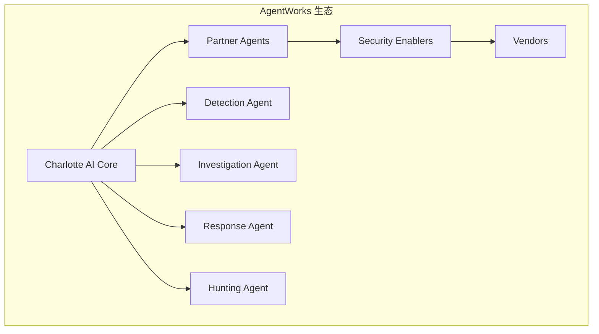

### 9.2 Self-Healing Security：自愈安全

**定义**：
Self-Healing Security是指安全系统能够自动检测、修复和恢复受损系统，而不需要人工干预。

**能力分级**：

| 级别 | 能力 | 示例 | 自主化程度 |
|:-----|:-----|:-----|:-----------|
| L1 | 自动检测+通知 | 发现问题，通知管理员 | 10% |
| L2 | 自动检测+建议 | 发现问题，提供修复建议 | 20% |
| L3 | 自动检测+审批后修复 | 发现问题，审批后自动修复 | 50% |
| L4 | 自动检测+自动修复 | 发现问题，自动修复 | 80% |
| L5 | 预测性自愈 | 预测问题，提前修复 | 95% |

**应用场景**：

| 场景 | 技术实现 | 效果 |
|:-----|:---------|:-----|
| 终端自愈 | 自动清除恶意软件、重置受损配置 | 减少90%终端故障 |
| 网络自愈 | 自动隔离攻击路径、重路由流量 | 减少85%网络中断 |
| 身份自愈 | 自动重置被盗凭据、撤销异常会话 | 减少95%账号被盗损失 |
| 应用自愈 | 自动回滚异常变更、恢复配置 | 减少70%配置错误 |

### 9.3 Multi-Agent Security：多智能体协作

**架构演进**：

传统SOC：单Agent顺序处理
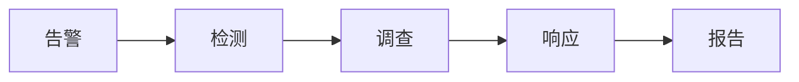

Multi-Agent SOC：多Agent并行+协作
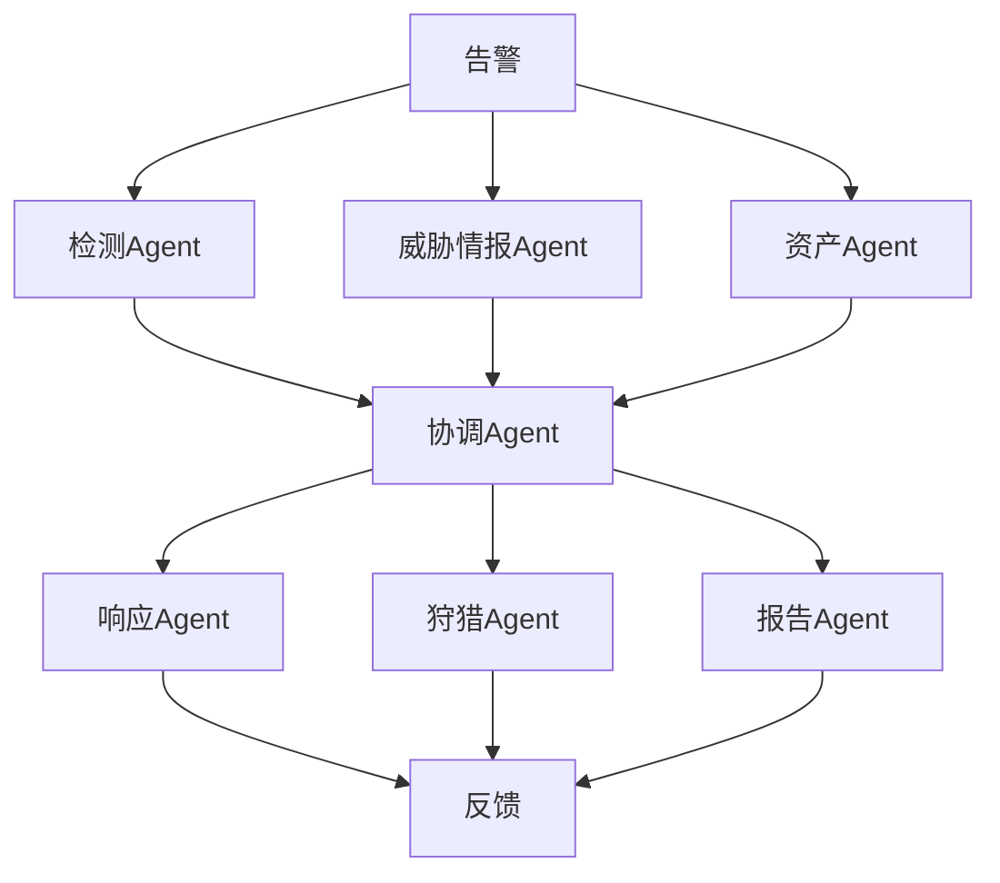

**Agent通信协议**：

| 协议 | 用途 | 厂商支持 |
|:-----|:-----|:---------|
| MCP (Model Context Protocol) | AI Agent与外部工具交互 | OpenCLAW, Anthropic |
| Agent Protocol | Agent间通信 | Microsoft, OpenAI |
| Custom Protocols | 厂商私有协议 | Palo Alto, CrowdStrike |

### 9.4 AI原生安全产品：从工具AI到AI Native

**概念对比**：

| 维度 | 工具AI (AI-First) | AI原生 (AI-Native) |
|:-----|:------------------|:-------------------|
| 架构设计 | 现有系统+AI模块 | AI为核心+安全功能 |
| 开发顺序 | 安全→加AI | AI→加安全 |
| AI依赖度 | 可选/辅助 | 核心/必需 |
| 升级路径 | 增量改进 | 架构重构 |
| 代表产品 | 传统SIEM+AI模块 | Cortex XSIAM, Charlotte AI |

**2026年新品动态**：

| 厂商 | 产品 | 发布日期 | 核心特性 |
|:-----|:-----|:---------|:---------|
| Palo Alto | Cortex AgentiX | 2026-02 | 完全Agentic |
| CrowdStrike | Charlotte AI Agentic Response | 2026-04 | 7个专用Agent |
| Microsoft | Security Copilot E5 Auto-push | 2026-Q2 | 统一AI框架 |
| Google | Gemini Security | 2026-Q3 | 多模态安全 |

### 9.5 安全知识即时化

**趋势**：
传统威胁情报更新周期长（天/周级），无法满足快速变化的安全态势。2026年趋势是**实时威胁情报+AI推理**的融合。

**技术实现**：

```python
# 伪代码示例：实时威胁情报AI处理
class RealTimeThreatIntelligence:
    def __init__(self):
        self.ioc_sources = [
            'abuse.ch',
            'AlienVault OTX',
            'MISP',
            'VirusTotal',
            'Twitter/X Threat Intel'
        ]
        self.ai_processor = ThreatIntelAIProcessor()
        
    def process_intelligence(self, raw_ioc):
        # 1. IOC验证
        validated_ioc = self.validate_ioc(raw_ioc)
        
        # 2. AI Enrichment
        enriched = self.ai_processor.enrich(validated_ioc)
        
        # 3. 关联分析
        related = self.ai_processor.correlate(enriched)
        
        # 4. 风险评估
        risk = self.ai_processor.assess_risk(enriched, related)
        
        # 5. 自动分发
        if risk.level >= 'HIGH':
            self.distribute_to_sensors(validated_ioc)
            self.update_detection_rules(validated_ioc)
        
        return {
            'ioc': validated_ioc,
            'enrichment': enriched,
            'risk': risk,
            'actions_taken': ['distributed', 'rules_updated']
        }
```

---

<a id="10"></a>
## 10. 结论与行动指南

### 10.1 核心结论

**结论一：AI Security Operations已非噱头，是真实的技术革命**

从本文分析可以看出，AI Security Operations的底层技术已经成熟：
- LLM能力突破使自然语言理解和推理成为可能
- 多Agent架构使端到端自动化闭环成为现实
- 知识图谱使威胁情报关联分析达到新高度

**结论二：Autonomous SOC五级成熟度模型是企业AI SOC建设的最佳指南**

企业不应盲目追求L5完全自主化，而应根据自身情况：
- 从L2/L3起步（AI辅助+部分自动化）
- 建立清晰的边界划分机制
- 渐进式向L4/L5演进

**结论三：数据质量是AI SOC成败的关键**

"垃圾进，垃圾出"在AI SOC领域同样适用。企业必须首先解决：
- 数据完整性问题
- 数据标准化问题
- 数据时效性问题

**结论四：Human-in-the-loop是不可或缺的保障机制**

即使达到L4/L5成熟度，Human-in-the-loop仍然必要：
- 边界情况判断
- 高风险操作审批
- 持续效果监督

### 10.2 企业行动指南

**立即行动（0-3个月）**：

| 行动项 | 负责人 | 预期产出 |
|:-------|:-------|:---------|
| 完成SOC成熟度自评估 | CISO | 明确当前等级 |
| 盘点AI SOC准备度 | 安全架构师 | 差距分析报告 |
| 启动数据质量治理 | 数据工程师 | 数据清单+质量报告 |
| 评估AI平台选项 | CISO+采购 | 选型报告 |

**短期行动（3-12个月）**：

| 行动项 | 负责人 | 预期产出 |
|:-------|:-------|:---------|
| 部署AI告警分类试点 | AI工程师 | 分类模型上线 |
| 实现基础Enrichment | 开发工程师 | IOC自动查询 |
| SOAR平台AI集成 | 安全工程师 | AI增强Playbook |
| 团队AI技能培训 | 安全培训师 | 80%完成培训 |

**中期行动（1-2年）**：

| 行动项 | 负责人 | 预期产出 |
|:-------|:-------|:---------|
| 建立闭环响应机制 | 安全运营经理 | P2告警闭环率>50% |
| 部署知识图谱 | AI工程师 | 知识图谱上线 |
| 引入预测性AI | 数据科学家 | 预测模型运行 |
| 优化人机协同流程 | 安全运营经理 | 效率提升60% |

### 10.3 风险提示

**技术风险**：

| 风险 | 缓解措施 |
|:-----|:---------|
| AI幻觉 | 置信度阈值+人工审核 |
| 数据偏见 | 持续监控+模型更新 |
| 敌对攻击 | 输入验证+对抗训练 |
| 系统故障 | 冗余设计+降级机制 |

**运营风险**：

| 风险 | 缓解措施 |
|:-----|:---------|
| 过度依赖AI | 保持人工审核比例 |
| 技能断层 | 持续培训+知识沉淀 |
| 合规风险 | 合规审查+审计日志 |
| 供应商锁定 | 多厂商策略+标准化 |

### 10.4 成功指标

**技术指标**：

| 指标 | 当前基线 | 12个月目标 | 24个月目标 |
|:-----|:---------|:-----------|:-----------|
| 告警处理时间 | 30分钟 | 10分钟 | 3分钟 |
| MTTD | 5天 | 1天 | 4小时 |
| MTTR | 12小时 | 2小时 | 15分钟 |
| 检测准确率 | 70% | 85% | 95% |
| 自动化闭环率 | 10% | 50% | 80% |

**业务指标**：

| 指标 | 当前基线 | 12个月目标 | 24个月目标 |
|:-----|:---------|:-----------|:-----------|
| 安全事件损失 | $100万/年 | $50万/年 | $20万/年 |
| 分析师人均处理量 | 200条/日 | 800条/日 | 1500条/日 |
| 告警误报率 | 45% | 20% | 8% |
| 安全运营成本 | $200万/年 | $180万/年 | $150万/年 |

### 10.5 总结

AI Security Operations不是噱头，而是安全运营的必然演进方向。企业应当：

1. **理性认知**：理解AI SOC是渐进式演进过程，不可一蹴而就
2. **打好基础**：数据质量、工具整合、团队能力是前提
3. **明确边界**：AI辅助vs AI自主化的边界划分是成功的关键
4. **持续优化**：AI SOC需要持续投入和优化，不能"部署即忘"

本文的核心价值在于为企业提供了完整的AI SOC认知框架和落地路径。下一篇文章我们将深入探讨《L1到L5：你的企业AI安全运营成熟度处于哪个等级？评估模型详解》，帮助企业进行更精细化的成熟度评估。

---

**参考链接：**

- 主要来源：[CrowdStrike Agentic SOC](https://www.crowdstrike.com/en-us/blog/crowdstrike-delivers-seven-agents-to-build-agentic-security-workforce/) - Autonomous SOC成熟度模型
- 主要来源：[Palo Alto Cortex AgentiX](https://www.paloaltonetworks.com/blog/2026/02/soc-agentic-next-evolution-cortex/) - Agentic SOC架构
- 辅助来源：[Microsoft Security Copilot](https://www.microsoft.com/en-us/microsoft-365/blog/2025/12/04/advancing-microsoft-365-new-capabilities-and-pricing-update/) - 统一AI安全框架
- 辅助来源：[Gartner Security Operations](https://www.gartner.com) - 安全运营技术成熟度曲线
- 辅助来源：[IBM Security X-Force](https://www.ibm.com/security) - SOC效能基准数据
- 工具来源：[Wazuh Open Source Security Platform](https://github.com/wazuh/wazuh) - 开源XDR平台
- 工具来源：[OpenCTI Threat Intelligence Platform](https://github.com/OpenCTI-Platform/opencti) - 威胁情报知识图谱
- 工具来源：[Shuffle SOAR](https://github.com/Shuffle/Shuffle) - 开源SOAR平台

---

**附录（Appendix）：**

### A. AI安全运营术语表

| 术语 | 英文 | 定义 |
|:-----|:-----|:-----|
| AI SOC | AI Security Operations | 融合AI技术的智能安全运营体系 |
| Agentic SOC | Agentic Security Operations Center | 使用AI Agent自主运营的SOC |
| Autonomous SOC | Autonomous Security Operations Center | 自主化程度不等的安全运营中心 |
| Human-in-the-loop | HITL | 人工在AI决策闭环中的介入机制 |
| MTTD | Mean Time To Detect | 平均威胁发现时间 |
| MTTR | Mean Time To Respond | 平均响应时间 |
| SOAR | Security Orchestration, Automation and Response | 安全编排自动化响应 |
| XSIAM | Extended Security Intelligence and Automation Platform | 扩展安全智能自动化平台 |
| UEBA | User and Entity Behavior Analytics | 用户实体行为分析 |
| IOC | Indicators of Compromise | 入侵指标 |
| ATT&CK | Adversarial Tactics, Techniques & Common Knowledge | 对抗战术技术知识库 |

### B. 企业AI SOC成熟度自评问卷

| 维度 | 问题 | 评分（1-5） |
|:-----|:-----|:-----------|
| **技术能力** | | |
| 检测智能化 | 您的SOC使用了多少AI/ML检测模型？ | ___ |
| 响应自动化 | 多少比例的告警可以自动闭环？ | ___ |
| 知识管理 | 是否有结构化的威胁知识图谱？ | ___ |
| **流程能力** | | |
| 响应时效 | 您的P1告警平均响应时间是？ | ___ |
| 闭环效率 | 告警处理效率每年提升多少？ | ___ |
| 流程标准化 | SOP覆盖了多少运营场景？ | ___ |
| **组织能力** | | |
| 团队规模 | 安全运营团队有多少人？ | ___ |
| AI技能 | 多少比例的分析师接受过AI培训？ | ___ |
| 培训投入 | 每年在安全培训上投入多少？ | ___ |
| **总评** | | |
| 成熟度等级 | 基于以上评分，您的SOC属于哪个等级？ | L___ |

### C. AI SOC技术选型评估模板

| 评估维度 | 权重 | 产品A | 产品B | 产品C |
|:---------|:-----|:------|:------|:------|
| **功能完整性** | 25% | | | |
| AI检测能力 | | | | |
| 自动化响应 | | | |
| 威胁情报集成 | | | |
| **技术成熟度** | 20% | | | |
| 检测准确率 | | | |
| 系统稳定性 | | | |
| 性能延迟 | | | |
| **集成能力** | 20% | | | |
| 现有工具集成 | | | |
| API开放性 | | | |
| 数据格式支持 | | | |
| **运维成本** | 15% | | | |
| License费用 | | | |
| 维护复杂度 | | | |
| 人员要求 | | | |
| **厂商支持** | 10% | | | |
| 响应时效 | | | |
| 文档质量 | | | |
| 社区活跃度 | | | |
| **战略契合** | 10% | | | |
| 长期路线图 | | | |
| 创新速度 | | | |
| 风险分散 | | | |
| **加权总分** | 100% | | | |

### D. AI SOC项目计划模板

| 阶段 | 时间 | 关键任务 | 里程碑 | 资源需求 |
|:-----|:-----|:---------|:-------|:---------|
| **Phase 0: 准备** | 1-2月 | 成熟度评估、需求分析、团队组建 | 完成评估报告 | 2人 |
| **Phase 1: 试点** | 3-6月 | AI平台选型、试点部署、小范围验证 | 试点系统上线 | 4人 |
| **Phase 2: 扩展** | 7-12月 | 全面部署、功能扩展、团队培训 | 核心功能上线 | 6人 |
| **Phase 3: 优化** | 13-18月 | 效果评估、模型优化、流程改进 | 效率提升60% | 4人 |
| **Phase 4: 演进** | 19-24月 | 高级功能、预测性AI、自主机化 | 达到L4成熟度 | 4人 |

---

**关键词：** AI Security Operations, Autonomous SOC, Agentic SOC, 安全运营成熟度, AI辅助, AI自主化, Human-in-the-loop, Palo Alto XSIAM, CrowdStrike Charlotte AI, Microsoft Security Copilot, 企业AI SOC, 安全编排自动化

**相关阅读：**
- 《AI正在如何重构现代SOC：当告警爆炸遇上AI》
- 《L1到L5：你的企业AI安全运营成熟度处于哪个等级？》
- 《Palo Alto、CrowdStrike、Microsoft三大厂商AI安全能力深度对比》
- 《从SOC到Agentic SOC：2026年AI安全运营的五大演进趋势》

**修订历史：**

| 版本 | 日期 | 修改内容 | 作者 |
|:-----|:-----|:---------|:-----|
| 1.0 | 2026-04-23 | 初始版本 | HOS(安全风信子) |
