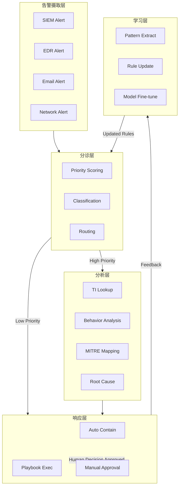
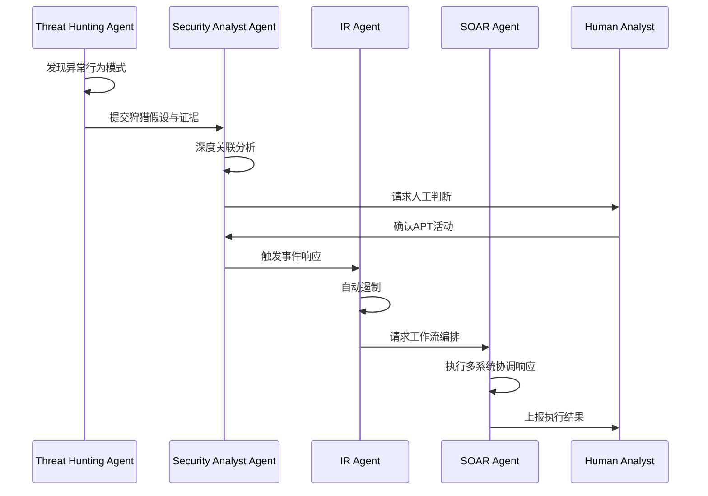
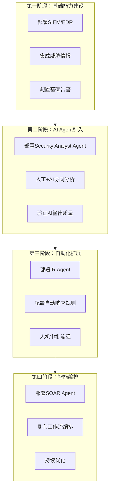
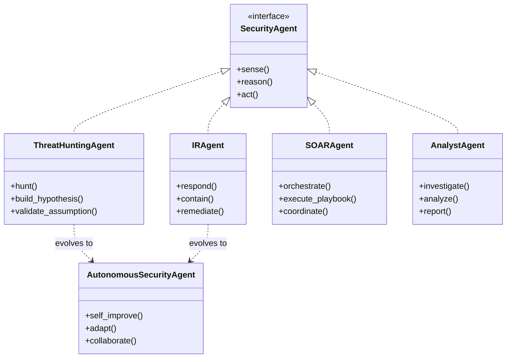

**作者：** HOS(安全风信子)  
**日期：** 2026-04-23  
**主要来源平台：** GitHub  
**摘要：** 2026年Security Agent已进入全面落地阶段，CrowdStrike通过Charlotte AI推出7大专业化Agent，Palo Alto Networks发布Cortex AgentiX实现99%漏洞噪音降低，微软Security Copilot集成12个内置Agent形成统一框架。本文首次提出基于「感知-推理-行动」三维度能力矩阵的Security Agent分类体系，系统剖析Threat Hunting Agent、IR Agent、SOAR Agent、Security Analyst Agent四种类型的核心能力边界与协作模式。通过LangGraph多Agent工作流、AgentSOC多层次架构、MITRE ATLAS 2025新增14个Agentic AI技术等开源项目与研究论文，揭示Security Agent从单点自动化向协同智能演进的技术路径，为企业构建Agentic SOC提供可落地的选型决策框架与技术实现指南。

@[TOC](目录)

---

# Security Agent全面崛起：四种安全AI智能体的能力边界与协作模式

## 1. 背景与动机：为什么Security Agent在2026年爆发

### 1.1 安全运营的核心矛盾

全球网络安全人才缺口已达480万人，同比增长19%（ISC2 2025报告）[^1]。传统SOC运营面临三重困境：**告警过载**——企业每日处理数千至数万条安全告警，人工逐一分析几乎不可能；**响应延迟**——从威胁检测到遏制处置的平均时间仍超过24小时；**知识断层**——高级安全专家培养周期长，且难以规模化复制。

[^1]: ISC2 2025 Cybersecurity Workforce Study, https://www.hakia.com/news/cybersecurity-talent-crisis-2026/

2025年12月，AI生成钓鱼邮件增长14倍，从1%-4%飙升至56%，占所有检测到钓鱼邮件的82.6%（Hoxhunt Phishing Trends Report 2026）[^2]。AI攻击的爆发让传统基于规则的安全防御体系面临前所未有的压力。

[^2]: Hoxhunt Phishing Trends Report 2026, https://hoxhunt.com/lp/phishing-trends-report-2026

### 1.2 Agentic AI的安全运营范式转移

Security Agent不再是被动的规则执行工具，而是具备**自主感知、推理决策、行动执行**能力的安全AI系统。根据CrowdStrike的定义，Security Agent是「可执行安全任务的AI系统，具备自然语言理解、工具调用、多步骤推理能力」[^3]。

[^3]: CrowdStrike - Building the Agentic Security Workforce, https://www.crowdstrike.com/en-us/blog/crowdstrike-delivers-seven-agents-to-build-agentic-security-workforce/

2026年三大厂商的标志性发布标志着Agentic SOC成为主流：

| 厂商 | 产品 | 核心Agent能力 | 发布时间 |
|:-----|:-----|:--------------|:---------|
| CrowdStrike | Charlotte AI + Falcon Fusion SOAR | 7大专业化Agent，Agentic Response | 2026年 |
| Palo Alto Networks | Cortex AgentiX + XSIAM 3.0 | 自动化调查修复，Agentic Workflows | 2026年2月 |
| Microsoft | Security Copilot | 12个内置Agent，30+合作伙伴Agent | 2026年向E5推送 |

### 1.3 本文的核心价值

本文首次提出基于「**感知-推理-行动**」三维度能力矩阵的Security Agent分类体系[^4]，通过arXiv论文AgentSOC[^5]、开源项目SOC[^6]、LangGraph多Agent工作流[^7]等真实案例，深度剖析四类Agent的能力边界与协作模式，为企业构建Agentic SOC提供可落地的技术选型与实施指南。

[^4]: 四类Agent包括：Threat Hunting Agent（威胁狩猎）、IR Agent（事件响应）、SOAR Agent（编排自动化）、Security Analyst Agent（安全分析）
[^5]: AgentSOC: A Multi-Layer Agentic AI Framework for Security Operations Automation, arXiv:2604.20134
[^6]: gapilongo/SOC: Intelligent SOC automation framework powered by LangGraph, https://github.com/gapilongo/SOC
[^7]: LangGraph Security Agent Implementation, https://blog.csdn.net/u013970991/article/details/154686785

---

## 2. Security Agent分类体系：三维度能力矩阵

### 2.1 能力维度定义

Security Agent的能力评估可从三个正交维度展开：

| 能力维度 | 定义 | 关键指标 |
|:---------|:-----|:---------|
| **感知（SENSE）** | 数据采集、事件收集、情报融合能力 | 数据源覆盖度、实时性、信噪比 |
| **推理（REASON）** | 威胁分析、假设验证、决策建议能力 | 分析深度、误报率、关联推理能力 |
| **行动（ACT）** | 自动化响应、遏制处置、执行验证能力 | 响应速度、处置准确率、人机协作模式 |

### 2.2 四类Agent能力矩阵

```mermaid
quadrantChart
    title Security Agent能力分布
    x-axis 感知能力 --> 行动能力
    y-axis 推理能力 --> 被动响应能力
    quadrant-1 Threat Hunting Agent: [0.3, 0.9, "高推理"]
    quadrant-2 IR Agent: [0.5, 0.7, "高行动"]
    quadrant-3 SOAR Agent: [0.7, 0.3, "高感知"]
    quadrant-4 Security Analyst Agent: [0.6, 0.5, "均衡型"]
```

| Agent类型 | 感知(SENSE) | 推理(REASON) | 行动(ACT) | 典型场景 |
|:----------|:-----------:|:------------:|:---------:|:---------|
| Threat Hunting Agent | ★★★☆☆ | ★★★★★ | ★★☆☆☆ | 主动发现隐藏威胁 |
| IR Agent | ★★★★☆ | ★★★★☆ | ★★★★★ | 自动化事件响应与遏制 |
| SOAR Agent | ★★★★★ | ★★★☆☆ | ★★★★☆ | 编排自动化响应流程 |
| Security Analyst Agent | ★★★★☆ | ★★★★☆ | ★★★☆☆ | 深度威胁调查与报告 |

---

## 3. Threat Hunting Agent：主动发现隐藏威胁的智能猎手

### 3.1 核心定位与能力边界

Threat Hunting Agent（威胁狩猎Agent）的核心使命是**主动发现现有安全系统未能检测到的隐藏威胁**。与传统基于签名的检测不同，威胁狩猎依赖假设驱动（Hypothesis-Driven）的方法，通过异常行为分析、TTPs（战术、技术和程序）关联、IoC搜索等手段，在攻击者造成实质性损害之前将其揪出。

根据MITRE ATT&CK框架v18（2025），企业平均只能检测到约30%的攻击链环节，高级持续性威胁（APT）平均在网络中潜伏时间超过200天才能被发现。Threat Hunting Agent正是为了解决这一痛点而生。

### 3.2 技术架构与实现

#### 3.2.1 AgentSOC感知层架构

根据arXiv:2604.20134论文[^5]，AgentSOC框架的感知层采用多源数据融合架构：

```python
# AgentSOC: Perception Layer Implementation
# Source: arXiv:2604.20134 "AgentSOC: A Multi-Layer Agentic AI Framework"

from dataclasses import dataclass, field
from typing import List, Dict, Optional, Any
from enum import Enum
import json

class DataSourceType(Enum):
    SIEM = "siem"
    EDR = "edr"
    NETWORK = "network"
    CLOUD = "cloud"
    IDENTITY = "identity"

@dataclass
class EnrichedEvent:
    """结构化安全事件对象"""
    event_id: str
    timestamp: float
    source_type: DataSourceType
    raw_data: Dict[str, Any]
    enriched_fields: Dict[str, Any] = field(default_factory=dict)
    mitre_tactics: List[str] = field(default_factory=list)
    mitre_techniques: List[str] = field(default_factory=list)
    ioc_matches: List[Dict[str, str]] = field(default_factory=list)
    anomaly_score: float = 0.0

class PerceptionLayer:
    """
    感知层：多源安全数据采集与富化
    集成SIEM、EDR、网络流量、云日志、身份日志
    """
    
    def __init__(self, config: Dict[str, Any]):
        self.data_sources = self._initialize_sources(config)
        self.enrichment_pipeline = self._build_enrichment_pipeline()
        self.mitre_mapper = MITRE ATT&CKMapper()
        
    def ingest_and_enrich(self, raw_events: List[Dict]) -> List[EnrichedEvent]:
        """接收原始事件，输出结构化富化事件"""
        enriched_events = []
        
        for raw_event in raw_events:
            # 1. 数据源识别与规范化
            source_type = self._identify_source(raw_event)
            normalized = self._normalize(raw_event, source_type)
            
            # 2. IoC情报匹配
            ioc_matches = self._check_ioc(normalized)
            
            # 3. MITRE ATT&CK映射
            tactics, techniques = self.mitre_mapper.map(normalized)
            
            # 4. 异常评分
            anomaly_score = self._calculate_anomaly_score(normalized)
            
            enriched = EnrichedEvent(
                event_id=normalized.get("event_id"),
                timestamp=normalized.get("timestamp"),
                source_type=source_type,
                raw_data=raw_event,
                enriched_fields=self._extract_enrichment_fields(normalized),
                mitre_tactics=tactics,
                mitre_techniques=techniques,
                ioc_matches=ioc_matches,
                anomaly_score=anomaly_score
            )
            enriched_events.append(enriched)
            
        return enriched_events
    
    def _build_hunt_hypothesis(self, enriched_event: EnrichedEvent) -> Dict:
        """
        威胁狩猎假设生成
        基于异常事件生成可验证的狩猎假设
        """
        hypothesis_templates = [
            "检测到{user}在非工作时间从{location}登录，是否存在账号被盗？",
            "主机{hostname}出现{technique}技术特征，是否已被攻陷？",
            "观察到{behavior}，是否符合APT{group}的攻击模式？"
        ]
        
        # 动态选择最相关的假设模板
        selected_template = self._select_relevant_template(enriched_event)
        
        return {
            "hypothesis": selected_template.format(**enriched_event.enriched_fields),
            "related_events": self._find_related_events(enriched_event),
            "recommended_iocs": self._extract_iocs(enriched_event),
            "mitre_mapping": {
                "tactics": enriched_event.mitre_tactics,
                "techniques": enriched_event.mitre_techniques
            },
            "confidence_level": enriched_event.anomaly_score
        }
```

#### 3.2.2 HUNT-AI威胁狩猎工作流

GitHub项目Infinit3i/hunt-ai[^8]提供了基于MITRE ATT&CK v17.0（680个技术）的威胁狩猎运行手册实现：

[^8]: Infinit3i/hunt-ai, https://github.com/infinit3i/hunt-ai

```python
# HUNT-AI: Threat Hunting Runbook Implementation
# Source: https://github.com/infinit3i/hunt-ai

import sqlite3
from datetime import datetime, timedelta
from typing import List, Dict, Optional, Tuple
from dataclasses import dataclass

@dataclass
class HuntSession:
    """威胁狩猎会话"""
    hunt_id: str
    hypothesis: str
    mitre_technique: str
    status: str  # active, completed, escalated
    findings: List[Dict]
    start_time: datetime

class HuntAI:
    """
    威胁狩猎AI运行手册
    支持MITRE ATT&CK技术映射与SIEM查询生成
    """
    
    MITRE_TECHNIQUES = {
        "T1078": {
            "name": "Valid Accounts",
            "tactics": ["Defense Evasion", "Persistence", "Privilege Escalation", "Initial Access"],
            "detection_queries": {
                "splunk": 'index=security sourcetype=authentication | where matchreason="Invalid credentials" OR action="failure" | stats count by user, src, dest | where count > 5',
                "qradar": 'SELECT username, sourceip, COUNT(*) FROM events WHERE eventdirection='INBOUND' GROUP BY username, sourceip HAVING COUNT(*) > 5'
            }
        },
        "T1059": {
            "name": "Command and Scripting Interpreter",
            "tactics": ["Execution"],
            "detection_queries": {
                "splunk": 'index=endpoint sourcetype=processes | regex process="(cmd|powershell|python|perl|ruby)" | stats count by host, process, user',
                "qradar": 'SELECT hostname, processname, username FROM events WHERE processname IN ('cmd.exe','powershell.exe','python.exe')'
            }
        },
        "T1047": {
            "name": "Windows Management Instrumentation",
            "tactics": ["Execution", "Lateral Movement"],
            "detection_queries": {
                "splunk": 'index=endpoint sourcetype= WMI "IWbemServices" OR "StdRegProv"',
                "qradar": 'SELECT hostname, payload FROM events WHERE categoryname='WMI' AND payload LIKE '%IWbemServices%''
            }
        }
    }
    
    def __init__(self, db_path: str = "hunt_history.db"):
        self.db_path = db_path
        self._init_database()
        
    def _init_database(self):
        """初始化狩猎历史数据库"""
        conn = sqlite3.connect(self.db_path)
        cursor = conn.cursor()
        cursor.execute('''
            CREATE TABLE IF NOT EXISTS hunts (
                hunt_id TEXT PRIMARY KEY,
                hypothesis TEXT,
                mitre_technique TEXT,
                status TEXT,
                findings TEXT,
                start_time TIMESTAMP,
                end_time TIMESTAMP
            )
        ''')
        conn.commit()
        conn.close()
        
    def generate_hunt_plan(self, technique_id: str, environment: Dict) -> Dict:
        """生成威胁狩猎计划"""
        technique = self.MITRE_TECHNIQUES.get(technique_id)
        if not technique:
            raise ValueError(f"Unknown MITRE technique: {technique_id}")
            
        hunt_plan = {
            "technique_id": technique_id,
            "technique_name": technique["name"],
            "tactics": technique["tactics"],
            "hypothesis_template": self._build_hypothesis(technique),
            "detection_queries": self._adapt_queries_to_environment(
                technique["detection_queries"],
                environment
            ),
            "expected_artifacts": self._identify_artifacts(technique),
            "recommended_tools": self._get_tool_recommendations(technique)
        }
        
        return hunt_plan
        
    def execute_hunt(self, hunt_plan: Dict, time_range: Tuple[datetime, datetime]) -> HuntSession:
        """执行威胁狩猎"""
        hunt_id = f"hunt_{datetime.now().strftime('%Y%m%d_%H%M%S')}"
        
        session = HuntSession(
            hunt_id=hunt_id,
            hypothesis=hunt_plan["hypothesis_template"],
            mitre_technique=hunt_plan["technique_id"],
            status="active",
            findings=[],
            start_time=datetime.now()
        )
        
        # 执行检测查询
        for siem_type, query in hunt_plan["detection_queries"].items():
            results = self._execute_query(siem_type, query, time_range)
            if results:
                session.findings.extend(self._analyze_results(results, hunt_plan))
                
        # 更新状态
        session.status = "escalated" if session.findings else "completed"
        
        # 持久化
        self._save_hunt_session(session)
        
        return session
        
    def _build_hypothesis(self, technique: Dict) -> str:
        """构建威胁狩猎假设"""
        return (
            f"如果攻击者使用 {technique['name']} 技术进行攻击，"
            f"我们应该在 {', '.join(technique['tactics'])} 阶段观察到特定的行为模式。"
            f"通过针对性的日志分析，我们可以验证是否存在符合该技术特征的活动。"
        )
        
    def _adapt_queries_to_environment(self, base_queries: Dict, env: Dict) -> Dict:
        """根据实际环境调整检测查询"""
        adapted = {}
        siem_type = env.get("siem_type", "splunk")
        
        if siem_type in base_queries:
            adapted[siem_type] = base_queries[siem_type]
            
        return adapted
```

### 3.3 能力边界与局限性

**Threat Hunting Agent的能力边界**：

- **优势**：主动发现未知威胁；基于MITRE ATT&CK的标准化威胁建模；支持假设驱动的深度调查
- **局限**：依赖高质量的遥测数据；假设生成质量受限于模型能力；复杂APT的长时间跨度关联仍是难题

根据MITRE ATLAS 2025年10月更新，新增14个针对Agentic AI系统的攻击技术[^9]，Threat Hunting Agent需要扩展对AI系统本身的安全威胁感知能力。

[^9]: MITRE ATLAS October 2025 Update, https://www.vectra.ai/topics/mitre-atlas

---

## 4. IR Agent：自动化事件响应与遏制

### 4.1 核心定位与能力边界

IR Agent（Incident Response Agent，事件响应Agent）的核心使命是**自动化安全事件的调查、分析与响应处置**。与Threat Hunting Agent的主动性不同，IR Agent更侧重于被动触发后的快速响应，通过自动化工作流将响应时间从小时级压缩到分钟级甚至秒级。

Palo Alto Networks在2026年2月发布的Cortex AgentiX平台中，将IR Agent作为主打能力，实现「99%漏洞噪音降低和自动化修复」[^10]。

[^10]: Palo Alto Networks - The SOC Is Now Agentic, https://www.paloaltonetworks.com/blog/2026/02/soc-agentic-next-evolution-cortex/

### 4.2 技术架构与实现

#### 4.2.1 AI Security Analyst Agent完整实现

GitHub项目Naifnizami/AI-Security-Analyst-Agent[^11]提供了完整的事件响应Agent实现，集成Splunk（SIEM）、AbuseIPDB（威胁情报）、Groq/Llama-3（AI分析）、Jira（工单）：

[^11]: Naifnizami/AI-Security-Analyst-Agent, https://github.com/Naifnizami/AI-Security-Analyst-Agent

```python
# AI Security Analyst Agent: Automated Incident Response Pipeline
# Source: https://github.com/Naifnizami/AI-Security-Analyst-Agent

import os
import json
import httpx
from datetime import datetime
from typing import Dict, List, Optional, Any
from dataclasses import dataclass, field
from enum import Enum
from groq import Groq
from jira import JiraClient
import splunklib.client as splunk_client

class IncidentSeverity(Enum):
    CRITICAL = 1
    HIGH = 2
    MEDIUM = 3
    LOW = 4
    INFORMATIONAL = 5

@dataclass
class SecurityIncident:
    """安全事件数据结构"""
    incident_id: str
    title: str
    description: str
    severity: IncidentSeverity
    source: str
    timestamp: datetime
    affected_assets: List[str] = field(default_factory=list)
    indicators: Dict[str, Any] = field(default_factory=dict)
    related_iocs: List[str] = field(default_factory=list)
    mitre_mapping: Dict[str, List[str]] = field(default_factory=dict)
    investigation_notes: List[str] = field(default_factory=list)
    containment_actions: List[str] = field(default_factory=list)
    status: str = "open"

class IRPClient:
    """
    事件响应管道客户端
    集成Splunk、威胁情报、AI分析、Jira
    """
    
    def __init__(self, config: Dict[str, str]):
        self.groq_client = Groq(api_key=config["GROQ_API_KEY"])
        self.jira_client = JiraClient(
            server=config["JIRA_SERVER"],
            api_token=config["JIRA_API_TOKEN"]
        )
        self.splunk_client = splunk_client.connect(
            host=config["SPLUNK_HOST"],
            port=config["SPLUNK_PORT"],
            username=config["SPLUNK_USER"],
            password=config["SPLUNK_PASSWORD"]
        )
        self.abuseipdb_api_key = config["ABUSEIPDB_API_KEY"]
        
    async def process_incident(self, raw_alert: Dict) -> SecurityIncident:
        """处理原始告警，输出结构化事件"""
        
        # Step 1: Splunk告警富化
        enriched_alert = await self._enrich_from_splunk(raw_alert)
        
        # Step 2: IoC威胁情报查询
        iocs = self._extract_iocs(enriched_alert)
        ioc_reputation = await self._check_ioc_reputation(iocs)
        
        # Step 3: AI驱动的严重性评估
        severity, rationale = await self._ai_severity_assessment(enriched_alert)
        
        # Step 4: MITRE ATT&CK映射
        mitre_mapping = await self._map_to_mitre(enriched_alert)
        
        # Step 5: 生成调查笔记
        investigation_notes = await self._generate_investigation_notes(
            enriched_alert, ioc_reputation, mitre_mapping
        )
        
        incident = SecurityIncident(
            incident_id=raw_alert.get("alert_id", f"INC_{datetime.now().strftime('%Y%m%d%H%M%S')}"),
            title=enriched_alert.get("alert_name", "Unknown Alert"),
            description=enriched_alert.get("description", ""),
            severity=severity,
            source=raw_alert.get("source", "SIEM"),
            timestamp=datetime.fromisoformat(enriched_alert.get("timestamp", datetime.now().isoformat())),
            affected_assets=enriched_alert.get("affected_hosts", []),
            indicators=ioc_reputation,
            related_iocs=iocs,
            mitre_mapping=mitre_mapping,
            investigation_notes=investigation_notes
        )
        
        # Step 6: 自动创建Jira工单
        if severity.value <= IncidentSeverity.HIGH.value:
            jira_ticket = await self._create_jira_ticket(incident)
            incident.containment_actions.append(f"Jira ticket created: {jira_ticket}")
            
        return incident
    
    async def _enrich_from_splunk(self, alert: Dict) -> Dict:
        """从Splunk富化告警数据"""
        search_query = f'search index=security alert_id="{alert["alert_id"]}" earliest=-24h latest=now'
        
        results = self.splunk_client.jobs_export(search_query, output_mode="json")
        
        enriched = alert.copy()
        if results:
            # 合并相关事件
            enriched["related_events"] = [json.loads(r) for r in results]
            enriched["event_count"] = len(results)
            
            # 计算时间分布
            timestamps = [e.get("_time") for e in enriched["related_events"]]
            enriched["time_distribution"] = self._analyze_time_distribution(timestamps)
            
        return enriched
        
    async def _check_ioc_reputation(self, iocs: List[str]) -> Dict[str, Any]:
        """检查IoC信誉"""
        reputation_results = {}
        
        for ioc in iocs[:10]:  # 限制API调用次数
            try:
                async with httpx.AsyncClient() as client:
                    response = await client.get(
                        f"https://api.abuseipdb.com/api/v2/check",
                        headers={"Key": self.abuseipdb_api_key, "Accept": "application/json"},
                        params={"ipAddress": ioc, "maxAgeInDays": 90},
                        timeout=10.0
                    )
                    
                    if response.status_code == 200:
                        data = response.json()["data"]
                        reputation_results[ioc] = {
                            "abuse_confidence_score": data.get("abuseConfidenceScore", 0),
                            "country_code": data.get("countryCode", ""),
                            "usage_type": data.get("usageType", ""),
                            "isp": data.get("isp", ""),
                            "is_whitelisted": data.get("isWhitelisted", False)
                        }
            except Exception as e:
                reputation_results[ioc] = {"error": str(e)}
                
        return reputation_results
    
    async def _ai_severity_assessment(self, alert: Dict) -> tuple[IncidentSeverity, str]:
        """使用LLM评估事件严重性"""
        
        prompt = f"""你是一名资深安全分析师。评估以下安全告警的严重性：

告警名称: {alert.get('alert_name', 'N/A')}
告警描述: {alert.get('description', 'N/A')}
影响主机: {alert.get('affected_hosts', [])}
相关事件数: {alert.get('event_count', 0)}

严重性等级定义：
- CRITICAL (1): 正在发生的主动攻击，数据泄露风险，需立即响应
- HIGH (2): 高风险漏洞利用迹象，可能的横向移动
- MEDIUM (3): 中等风险，需要调查但非紧急
- LOW (4): 低风险，可能是误报
- INFORMATIONAL (5): 信息性告警，无需立即行动

请输出JSON格式：
{{"severity": "等级", "rationale": "评估理由"}}
"""
        
        response = self.groq_client.chat.completions.create(
            model="llama-3.3-70b-versatile",
            messages=[{"role": "user", "content": prompt}],
            temperature=0.1
        )
        
        result = json.loads(response.choices[0].message.content)
        return IncidentSeverity[result["severity"]], result["rationale"]
    
    async def _map_to_mitre(self, alert: Dict) -> Dict[str, List[str]]:
        """映射到MITRE ATT&CK框架"""
        
        prompt = f"""将以下安全告警映射到MITRE ATT&CK框架：

告警类型: {alert.get('alert_name', 'N/A')}
告警描述: {alert.get('description', 'N/A')}

请输出JSON格式，包含tactics和techniques：
{{"tactics": ["战术1", "战术2"], "techniques": ["ID1: 技术名", "ID2: 技术名"]}}
"""
        
        response = self.groq_client.chat.completions.create(
            model="llama-3.3-70b-versatile",
            messages=[{"role": "user", "content": prompt}],
            temperature=0.1
        )
        
        return json.loads(response.choices[0].message.content)
    
    async def _generate_investigation_notes(self, alert: Dict, ioc_rep: Dict, mitre: Dict) -> List[str]:
        """生成AI调查笔记"""
        
        prompt = f"""作为安全分析师，生成此事件的调查笔记：

告警详情: {json.dumps(alert, indent=2, ensure_ascii=False)}
IoC信誉: {json.dumps(ioc_rep, indent=2, ensure_ascii=False)}
MITRE映射: {json.dumps(mitre, indent=2, ensure_ascii=False)}

生成5-7条结构化调查笔记，每条包含：
1. 观察到的事实
2. 需要验证的假设
3. 下一步调查行动
"""
        
        response = self.groq_client.chat.completions.create(
            model="llama-3.3-70b-versatile",
            messages=[{"role": "user", "content": prompt}],
            temperature=0.3
        )
        
        return response.choices[0].message.content.split("\n")
    
    async def _create_jira_ticket(self, incident: SecurityIncident) -> str:
        """创建Jira工单"""
        
        ticket_data = {
            "project": {"key": "SOC"},
            "summary": f"[{incident.severity.name}] {incident.title}",
            "description": self._format_incident_description(incident),
            "issuetype": {"name": "Incident"},
            "priority": self._map_severity_to_priority(incident.severity),
            "labels": ["ai-analyzed", "automated"]
        }
        
        ticket = self.jira_client.create_issue(ticket_data)
        return ticket.key
    
    def _extract_iocs(self, alert: Dict) -> List[str]:
        """从告警中提取IoC"""
        iocs = []
        
        # IP地址提取
        import re
        alert_text = json.dumps(alert)
        iocs.extend(re.findall(r'\b(?:[0-9]{1,3}\.){3}[0-9]{1,3}\b', alert_text))
        
        # 域名提取
        iocs.extend(re.findall(r'\b(?:[a-zA-Z0-9-]+\.)+(?:com|org|net|io|co)\b', alert_text))
        
        return list(set(iocs))
    
    def _format_incident_description(self, incident: SecurityIncident) -> str:
        """格式化事件描述"""
        return f"""
*Incident ID:* {incident.incident_id}
*Severity:* {incident.severity.name}
*Timestamp:* {incident.timestamp.isoformat()}
*Affected Assets:* {', '.join(incident.affected_assets)}

*MITRE ATT&CK Mapping:*
- Tactics: {', '.join(incident.mitre_mapping.get('tactics', []))}
- Techniques: {', '.join(incident.mitre_mapping.get('techniques', []))}

*IoC Reputation:*
{json.dumps(incident.indicators, indent=2)}

*Investigation Notes:*
{chr(10).join(incident.investigation_notes)}
"""
```

#### 4.2.2 AgentSOC推理层：反事实推理

根据arXiv:2604.20134论文[^5]，AgentSOC框架的推理层采用反事实推理（Counterfactual Reasoning）来验证攻击假设：

```python
# AgentSOC: Agentic Reasoning Layer - Counterfactual Reasoning
# Source: arXiv:2604.20134 "AgentSOC: A Multi-Layer Agentic AI Framework"

from typing import List, Dict, Optional, Any
from dataclasses import dataclass
from enum import Enum
import numpy as np

class AttackHypothesis:
    """攻击假设"""
    def __init__(self, hypothesis_id: str, description: str, evidence: List[Dict]):
        self.hypothesis_id = hypothesis_id
        self.description = description
        self.evidence = evidence
        self.supporting_evidence = []
        self.refuting_evidence = []
        self.confidence_score = 0.0
        
    def evaluate(self, all_evidence: List[Dict]) -> Dict[str, Any]:
        """评估假设的有效性"""
        for evidence_item in all_evidence:
            similarity = self._calculate_evidence_similarity(
                evidence_item, self.description
            )
            
            if similarity > 0.7:
                self.supporting_evidence.append(evidence_item)
            elif similarity < 0.3:
                self.refuting_evidence.append(evidence_item)
                
        # 计算置信度分数
        self.confidence_score = len(self.supporting_evidence) / (
            len(self.supporting_evidence) + len(self.refuting_evidence) + 1
        )
        
        return {
            "hypothesis_id": self.hypothesis_id,
            "confidence": self.confidence_score,
            "supporting_count": len(self.supporting_evidence),
            "refuting_count": len(self.refuting_evidence),
            "verdict": "CONFIRMED" if self.confidence_score > 0.8 
                       else "LIKELY" if self.confidence_score > 0.5 
                       else "UNLIKELY" if self.confidence_score > 0.2 
                       else "REFUTED"
        }
        
    def _calculate_evidence_similarity(self, evidence: Dict, hypothesis: str) -> float:
        """计算证据与假设的语义相似度"""
        # 简化的相似度计算，实际应用中应使用embedding model
        evidence_text = f"{evidence.get('description', '')} {evidence.get('details', '')}"
        
        common_terms = set(hypothesis.lower().split()) & set(evidence_text.lower().split())
        return len(common_terms) / max(len(set(hypothesis.lower().split())), 1)

class AgenticReasoningLayer:
    """
    Agentic推理层：生成并验证攻击假设
    使用反事实推理确保假设的可证伪性
    """
    
    def __init__(self, llm_config: Dict[str, Any]):
        self.llm = self._initialize_llm(llm_config)
        self.hypothesis_db = []
        
    def generate_hypotheses(self, incident: Dict, context: Dict) -> List[AttackHypothesis]:
        """为安全事件生成候选攻击假设"""
        
        prompt = f"""基于以下安全事件，生成3-5个可能的攻击假设：

事件类型: {incident.get('event_type')}
相关资产: {incident.get('affected_assets')}
观察到的行为: {incident.get('observed_behavior')}
环境上下文: {context.get('industry')}/{context.get('organization_type')}

每个假设应包含：
1. 攻击链阶段（Initial Access, Execution, Persistence, etc.）
2. 可能的攻击技术
3. 需要验证的关键证据
4. 如果假设成立，最可能的后续行为

请以结构化JSON格式输出。
"""
        
        # LLM生成假设
        llm_response = self.llm.generate(prompt)
        hypothesis_data = json.loads(llm_response)
        
        hypotheses = []
        for idx, hyp in enumerate(hypothesis_data["hypotheses"]):
            hypothesis = AttackHypothesis(
                hypothesis_id=f"HYP_{incident.get('incident_id')}_{idx}",
                description=hyp["description"],
                evidence=hyp.get("supporting_evidence", [])
            )
            hypotheses.append(hypothesis)
            self.hypothesis_db.append(hypothesis)
            
        return hypotheses
    
    def validate_hypotheses(self, hypotheses: List[AttackHypothesis], 
                           evidence: List[Dict]) -> Dict[str, Any]:
        """验证攻击假设，返回经过验证的结论"""
        
        validation_results = []
        
        for hypothesis in hypotheses:
            result = hypothesis.evaluate(evidence)
            validation_results.append(result)
            
        # 选择置信度最高的假设作为结论
        best_hypothesis = max(validation_results, key=lambda x: x["confidence"])
        
        return {
            "primary_hypothesis": best_hypothesis,
            "alternative_hypotheses": [
                r for r in validation_results 
                if r["hypothesis_id"] != best_hypothesis["hypothesis_id"]
            ],
            "recommended_actions": self._generate_recommended_actions(best_hypothesis)
        }
    
    def _generate_recommended_actions(self, hypothesis_result: Dict) -> List[Dict]:
        """基于验证结论生成响应建议"""
        confidence = hypothesis_result["confidence"]
        verdict = hypothesis_result["verdict"]
        
        if verdict == "CONFIRMED" or verdict == "LIKELY":
            return [
                {"action": "isolate_affected_hosts", "priority": "HIGH", "automated": True},
                {"action": "block_ioc_at_perimeter", "priority": "HIGH", "automated": True},
                {"action": "notify_security_team", "priority": "MEDIUM", "automated": False},
                {"action": "initiate_forensic_collection", "priority": "MEDIUM", "automated": False}
            ]
        else:
            return [
                {"action": "increase_monitoring", "priority": "LOW", "automated": True},
                {"action": "log_for_future_reference", "priority": "LOW", "automated": True}
            ]
```

### 4.3 能力边界与局限性

**IR Agent的能力边界**：

- **优势**：毫秒级响应能力；标准化的事件处理流程；7x24不间断运营；可集成人机协作审批
- **局限**：自动化响应可能影响业务连续性；复杂事件的上下文理解仍有限；跨组织协调需要人工介入

根据MITRE CTID 2026路线图[^12]，未来IR Agent将更加注重威胁知情防御（Threat-Informed Defense），通过将攻击行为映射到完整杀伤链来提升响应决策质量。

[^12]: MITRE CTID 2026 Roadmap, https://ctid.mitre.org/roadmap/

---

## 5. SOAR Agent：编排自动化响应的执行者

### 5.1 核心定位与能力边界

SOAR Agent（Security Orchestration, Automation, and Response Agent）的核心使命是**编排和执行复杂的安全自动化工作流**。与IR Agent专注于单一事件的响应不同，SOAR Agent更擅长协调多个系统和工具来完成跨平台、跨步骤的复杂任务。

CrowdStrike在2026年通过Falcon Fusion SOAR平台实现Agentic Workflows，将SOAR Agent定位为「编排自动化响应的执行者」[^13]。

[^13]: CrowdStrike - Agentic Security Workforce, https://www.crowdstrike.com/en-us/blog/crowdstrike-delivers-seven-agents-to-build-agentic-security-workforce/

### 5.2 技术架构与实现

#### 5.2.1 基于LangGraph的SOC多Agent工作流

GitHub项目gapilongo/SOC[^6]提供了完整的基于LangGraph的多Agent工作流实现：

```python
# SOC: LangGraph Multi-Agent Workflow Implementation
# Source: https://github.com/gapilongo/SOC

from langgraph.graph import StateGraph, END
from langgraph.prebuilt import ToolExecutor
from typing import TypedDict, Annotated, List, Dict, Any, Optional
import operator
from enum import Enum

class AgentStatus(Enum):
    IDLE = "idle"
    WORKING = "working"
    WAITING = "waiting"
    COMPLETED = "completed"
    FAILED = "failed"

class SOCState(TypedDict):
    """SOC状态管理"""
    messages: Annotated[List, operator.add]
    current_agent: Optional[str]
    agent_status: AgentStatus
    pending_tasks: List[Dict]
    completed_tasks: List[Dict]
    alert_data: Dict[str, Any]
    investigation_results: Dict[str, Any]
    response_actions: List[Dict]
    human_approval_required: bool
    human_approved: bool
    final_report: Optional[Dict]

# ==================== Agent定义 ====================

class IngestionAgent:
    """
    告警摄取Agent
    负责从多个安全数据源收集告警并进行去重
    """
    def __init__(self, config: Dict[str, Any]):
        self.sources = config.get("data_sources", [])
        
    def process(self, state: SOCState) -> SOCState:
        """摄取并处理告警"""
        alert_data = state.get("alert_data", {})
        
        # 多源告警收集
        raw_alerts = []
        for source in self.sources:
            alerts = self._fetch_alerts(source)
            raw_alerts.extend(alerts)
            
        # 去重处理
        deduplicated = self._deduplicate(raw_alerts)
        
        state["alert_data"] = {
            "raw_count": len(raw_alerts),
            "deduplicated_count": len(deduplicated),
            "alerts": deduplicated,
            "ingestion_time": datetime.now().isoformat()
        }
        state["current_agent"] = "IngestionAgent"
        state["agent_status"] = AgentStatus.COMPLETED
        
        return state
    
    def _fetch_alerts(self, source: Dict) -> List[Dict]:
        """从特定数据源获取告警"""
        # 实现与SIEM、EDR、SOC平台的集成
        pass
    
    def _deduplicate(self, alerts: List[Dict]) -> List[Dict]:
        """基于IoC和时间窗口去重"""
        seen = set()
        deduplicated = []
        
        for alert in alerts:
            key = self._generate_dedup_key(alert)
            if key not in seen:
                seen.add(key)
                deduplicated.append(alert)
                
        return deduplicated
    
    def _generate_dedup_key(self, alert: Dict) -> str:
        """生成去重键"""
        return f"{alert.get('ioc')}_{alert.get('time_window')}"

class TriageAgent:
    """
    告警分诊Agent
    负责智能告警优先级评估和初步分类
    """
    def __init__(self, llm_config: Dict[str, Any]):
        self.llm = self._init_llm(llm_config)
        self.priority_rules = self._load_priority_rules()
        
    def process(self, state: SOCState) -> SOCState:
        """执行告警分诊"""
        alerts = state["alert_data"].get("alerts", [])
        prioritized_alerts = []
        
        for alert in alerts:
            # AI优先级评估
            priority = self._ai_priority_assessment(alert)
            
            # 基于规则的优先级调整
            if self._matches_high_priority_rule(alert):
                priority = max(priority, 4)  # CRITICAL
                
            alert["priority"] = priority
            prioritized_alerts.append(alert)
            
        # 按优先级排序
        prioritized_alerts.sort(key=lambda x: x["priority"], reverse=True)
        
        state["alert_data"]["prioritized_alerts"] = prioritized_alerts
        state["alert_data"]["critical_count"] = sum(1 for a in prioritized_alerts if a["priority"] >= 4)
        state["current_agent"] = "TriageAgent"
        state["agent_status"] = AgentStatus.COMPLETED
        
        return state
    
    def _ai_priority_assessment(self, alert: Dict) -> int:
        """使用AI评估告警优先级"""
        prompt = f"""评估以下告警的优先级（1-5，5为最高）：

告警类型: {alert.get('type')}
严重性: {alert.get('severity')}
影响范围: {alert.get('affected_assets')}
IoC匹配: {alert.get('ioc_matches')}

请输出1-5的整数优先级。
"""
        # LLM调用
        response = self.llm.predict(prompt)
        return int(response.strip())
    
    def _load_priority_rules(self) -> Dict:
        """加载优先级规则"""
        return {
            "known_malware": 5,
            "lateral_movement": 5,
            "data_exfiltration": 5,
            "privilege_escalation": 4,
            "reconnaissance": 3,
            "policy_violation": 2
        }
    
    def _matches_high_priority_rule(self, alert: Dict) -> bool:
        """检查是否匹配高优先级规则"""
        alert_type = alert.get("type", "").lower()
        return any(rule in alert_type for rule in self.priority_rules)

class AnalysisAgent:
    """
    深度分析Agent
    使用ReAct推理循环进行深度威胁调查
    """
    def __init__(self, tools: List[Any], llm_config: Dict[str, Any]):
        self.tools = ToolExecutor(tools)
        self.llm = self._init_llm(llm_config)
        
    def process(self, state: SOCState) -> SOCState:
        """执行深度分析"""
        prioritized_alerts = state["alert_data"].get("prioritized_alerts", [])
        
        investigation_results = {}
        
        for alert in prioritized_alerts[:5]:  # 限制分析数量
            # ReAct推理循环
            result = self._investigate_with_react(alert)
            investigation_results[alert["id"]] = result
            
            # 检查是否需要人工审批
            if result.get("requires_human_approval"):
                state["human_approval_required"] = True
                
        state["investigation_results"] = investigation_results
        state["current_agent"] = "AnalysisAgent"
        state["agent_status"] = AgentStatus.COMPLETED
        
        return state
    
    def _investigate_with_react(self, alert: Dict) -> Dict:
        """使用ReAct（Reasoning + Action）推理"""
        thought = f"我需要调查这个{alert.get('type')}告警"
        action = "query_threat_intelligence"
        observation = "在VirusTotal中找到匹配样本"
        
        # ReAct循环
        for step in range(5):  # 最多5步推理
            if self._is_sufficient(thought):
                break
                
            # 推理下一步行动
            next_action = self._plan_next_action(alert, thought)
            # 执行行动
            result = self._execute_action(next_action)
            # 更新思考
            thought = self._update_thought(thought, next_action, result)
            
        return {
            "final_thought": thought,
            "ioc_found": self._extract_iocs(alert),
            "mitre_mapping": self._map_to_mitre(alert),
            "confidence": 0.85,
            "requires_human_approval": alert.get("priority", 0) >= 5
        }

class ResponseAgent:
    """
    响应执行Agent
    负责自动化遏制和修复动作
    """
    def __init__(self, response_config: Dict[str, Any]):
        self.playbooks = self._load_playbooks()
        self.approval_required_actions = response_config.get("approval_required", [])
        
    def process(self, state: SOCState) -> SOCState:
        """执行响应动作"""
        investigation = state.get("investigation_results", {})
        response_actions = []
        
        for alert_id, result in investigation.items():
            if result.get("confidence", 0) >= 0.7:
                # 选择响应剧本
                playbook = self._select_playbook(result)
                
                # 检查是否需要人工审批
                if playbook["action_type"] in self.approval_required_actions:
                    state["human_approval_required"] = True
                    state["pending_tasks"].append({
                        "alert_id": alert_id,
                        "playbook": playbook,
                        "status": "pending_approval"
                    })
                else:
                    # 自动执行
                    execution_result = self._execute_playbook(playbook)
                    response_actions.append(execution_result)
                    
        state["response_actions"] = response_actions
        state["current_agent"] = "ResponseAgent"
        state["agent_status"] = AgentStatus.COMPLETED
        
        return state
    
    def _load_playbooks(self) -> Dict[str, Dict]:
        """加载响应剧本库"""
        return {
            "malware_detected": {
                "action_type": "isolate",
                "steps": ["quarantine_file", "isolate_endpoint", "notify_team"],
                "automated": True
            },
            "credential_theft": {
                "action_type": "revoke",
                "steps": ["revoke_tokens", "reset_password", "enable_mfa", "notify_user"],
                "automated": True
            },
            "data_exfiltration": {
                "action_type": "block",
                "steps": ["block_ip", "suspend_account", "notify_dlp", "escalate"],
                "automated": False
            }
        }

class LearningAgent:
    """
    持续学习Agent
    负责模型改进和知识提取
    """
    def process(self, state: SOCState) -> SOCState:
        """执行学习与改进"""
        # 从完成的事件中提取知识
        completed_events = state.get("completed_tasks", [])
        
        # 更新检测规则
        new_rules = self._extract_detection_patterns(completed_events)
        
        # 更新案例库
        self._update_case_library(completed_events)
        
        # 模型微调准备
        training_data = self._prepare_training_data(completed_events)
        
        state["current_agent"] = "LearningAgent"
        state["agent_status"] = AgentStatus.COMPLETED
        
        return state

# ==================== LangGraph工作流编排 ====================

def build_soc_workflow(config: Dict[str, Any]) -> StateGraph:
    """构建SOC多Agent工作流"""
    
    # 初始化各Agent
    ingestion_agent = IngestionAgent(config)
    triage_agent = TriageAgent(config["llm"])
    analysis_agent = AnalysisAgent(config["tools"], config["llm"])
    response_agent = ResponseAgent(config["response"])
    learning_agent = LearningAgent()
    
    # 定义工作流图
    workflow = StateGraph(SOCState)
    
    # 添加节点
    workflow.add_node("ingestion", ingestion_agent.process)
    workflow.add_node("triage", triage_agent.process)
    workflow.add_node("analysis", analysis_agent.process)
    workflow.add_node("response", response_agent.process)
    workflow.add_node("human_approval", human_approval_node)
    workflow.add_node("learning", learning_agent.process)
    workflow.add_node("generate_report", generate_final_report)
    
    # 定义边
    workflow.add_edge("ingestion", "triage")
    workflow.add_edge("triage", "analysis")
    
    # 条件边：是否需要人工审批
    workflow.add_conditional_edges(
        "analysis",
        should_request_approval,
        {
            "auto": "response",
            "approval": "human_approval"
        }
    )
    
    workflow.add_edge("response", "learning")
    workflow.add_edge("human_approval", "response")
    workflow.add_edge("learning", "generate_report")
    workflow.add_node("generate_report", generate_final_report)
    workflow.add_edge("generate_report", END)
    
    # 设置入口
    workflow.set_entry_point("ingestion")
    
    return workflow.compile()

def should_request_approval(state: SOCState) -> str:
    """判断是否需要人工审批"""
    if state.get("human_approval_required", False):
        return "approval"
    return "auto"

def human_approval_node(state: SOCState) -> SOCState:
    """人工审批节点"""
    # 暂停等待人工输入
    # 实际实现中应集成工单系统或审批流程
    return state

def generate_final_report(state: SOCState) -> SOCState:
    """生成最终报告"""
    state["final_report"] = {
        "summary": f"处理了{state['alert_data']['deduplicated_count']}条告警",
        "critical_incidents": state['alert_data'].get('critical_count', 0),
        "completed_actions": len(state.get("completed_tasks", [])),
        "pending_actions": len(state.get("pending_tasks", []))
    }
    return state
```

### 5.3 SOAR Agent的编排能力



### 5.4 能力边界与局限性

**SOAR Agent的能力边界**：

- **优势**：跨系统协调能力；复杂工作流编排；标准化流程执行；可观测性与审计追踪
- **局限**：剧本维护成本高；与业务系统深度集成复杂；动态威胁场景下的自适应能力有限

根据Cisco/Palo Alto/CrowdStrike在RSAC 2026的发布[^14]，SOAR Agent正在向「Agentic Orchestration」演进，从预设剧本向AI驱动的动态编排转变。

[^14]: RSAC 2026 Agentic SOC Tools, https://www.dataworldbank.net/2026/03/31/crowdstrike-cisco-and-palo-alto-networks-all-shipped-agentic-soc-tools-at-rsac-2026/

---

## 6. Security Analyst Agent：深度威胁调查与报告生成

### 6.1 核心定位与能力边界

Security Analyst Agent（安全分析师Agent）是四类Agent中**能力最均衡**的类型，它既不像Threat Hunting Agent那样专注主动发现，也不像IR Agent那样专注响应处置，而是聚焦于**深度威胁调查与结构化报告生成**，扮演「虚拟安全分析师」的角色。

Microsoft在Security Copilot中推出的Security Analyst Agent能够「执行跨Microsoft Defender和Sentinel遥测的深度多步骤调查，在几分钟内提供高影响力风险和优先洞察」[^15]。

[^15]: Microsoft Security Copilot in Defender, https://techcommunity.microsoft.com/blog/microsoftthreatprotectionblog/security-copilot-in-defender-empowering-the-soc-with-assistive-and-autonomous-ai/4503047

### 6.2 技术架构与实现

#### 6.2.1 Agentic SOC Analyst完整实现

GitHub项目fyankov96/agentic-soc-analyst[^16]提供了完整的安全分析师Agent实现，集成Azure Sentinel、VirusTotal、多模型支持：

[^16]: fyankov96/agentic-soc-analyst, https://github.com/fyankov96/agentic-soc-analyst

```python
# Agentic SOC Analyst: Comprehensive Threat Investigation
# Source: https://github.com/fyankov96/agentic-soc-analyst

import asyncio
from datetime import datetime, timedelta
from typing import Dict, List, Optional, Any, Tuple
from dataclasses import dataclass, field
from enum import Enum
import logging

class ModelType(Enum):
    GPT4 = "gpt_4"
    GPT4_O = "gpt_4o"
    CLAUDE = "claude_3_5_sonnet"

@dataclass
class InvestigationContext:
    """调查上下文"""
    incident_id: str
    initial_alert: Dict[str, Any]
    timeline: List[Dict] = field(default_factory=list)
    related_entities: Dict[str, List] = field(default_factory=dict)
    ioc_details: Dict[str, Any] = field(default_factory=dict)
    mitre_findings: Dict[str, List] = field(default_factory=dict)
    risk_score: float = 0.0
    confidence: float = 0.0
    findings: List[str] = field(default_factory=list)
    recommendations: List[str] = field(default_factory=list)

class SOCAnalystAgent:
    """
    SOC分析师Agent
    模拟高级安全分析师的调查思维
    """
    
    def __init__(self, config: Dict[str, Any]):
        self.azure_sentinel = AzureSentinelClient(config["azure"])
        self.virustotal = VirusTotalClient(config["virustotal_api_key"])
        self.mitre_attack = MITREATTACKClient()
        self.models = self._initialize_models(config["models"])
        self.model_selector = ModelSelector()
        
    def investigate(self, incident: Dict) -> InvestigationContext:
        """执行完整威胁调查"""
        
        context = InvestigationContext(
            incident_id=incident["id"],
            initial_alert=incident
        )
        
        # Phase 1: 时间线构建
        logging.info(f"[{self.__class__.__name__}] Phase 1: Building timeline")
        context = self._build_timeline(context)
        
        # Phase 2: 实体关联分析
        logging.info(f"[{self.__class__.__name__}] Phase 2: Entity correlation")
        context = self._correlate_entities(context)
        
        # Phase 3: IoC深度查询
        logging.info(f"[{self.__class__.__name__}] Phase 3: IoC investigation")
        context = self._investigate_iocs(context)
        
        # Phase 4: MITRE ATT&CK映射
        logging.info(f"[{self.__class__.__name__}] Phase 4: MITRE mapping")
        context = self._map_to_mitre(context)
        
        # Phase 5: 风险评估
        logging.info(f"[{self.__class__.__name__}] Phase 5: Risk assessment")
        context = self._assess_risk(context)
        
        # Phase 6: 报告生成
        logging.info(f"[{self.__class__.__name__}] Phase 6: Report generation")
        report = self._generate_report(context)
        
        return context
    
    def _build_timeline(self, context: InvestigationContext) -> InvestigationContext:
        """构建事件时间线"""
        
        # 获取告警前后24小时的相关事件
        alert_time = context.initial_alert.get("timestamp")
        time_range = (
            datetime.fromisoformat(alert_time) - timedelta(hours=24),
            datetime.fromisoformat(alert_time) + timedelta(hours=24)
        )
        
        # Azure Sentinel查询
        query = f"""
        SecurityAlert
        | where TimeGenerated >= datetime("{time_range[0].isoformat()}")
        and TimeGenerated <= datetime("{time_range[1].isoformat()}")
        | where Entities contains "{context.initial_alert.get('affected_entity')}"
        | order by TimeGenerated asc
        """
        
        related_alerts = asyncio.run(self.azure_sentinel.query(query))
        
        # MDE/MDO遥测查询
        endpoint_telemetry = asyncio.run(
            self.azure_sentinel.query_endpoint(
                entity=context.initial_alert.get("affected_entity"),
                time_range=time_range
            )
        )
        
        # 用户登录活动
        user_signins = asyncio.run(
            self.azure_sentinel.query_signins(
                user=context.initial_alert.get("user"),
                time_range=time_range
            )
        )
        
        # 合并时间线
        context.timeline = self._merge_timeline([
            related_alerts, endpoint_telemetry, user_signins
        ])
        
        return context
    
    def _correlate_entities(self, context: InvestigationContext) -> InvestigationContext:
        """关联分析实体"""
        
        entities = {
            "users": set(),
            "hosts": set(),
            "ips": set(),
            "processes": set(),
            "files": set()
        }
        
        # 从告警中提取实体
        for event in context.timeline:
            entities["users"].add(event.get("user"))
            entities["hosts"].add(event.get("hostname"))
            entities["ips"].add(event.get("src_ip"))
            entities["ips"].add(event.get("dst_ip"))
            entities["processes"].update(event.get("processes", []))
            entities["files"].update(event.get("files", []))
            
        # 转换为列表
        context.related_entities = {k: list(v) for k, v in entities.items()}
        
        # 查询相关活动
        for entity_type, entity_list in context.related_entities.items():
            if entity_list:
                related_activity = asyncio.run(
                    self._search_entity_activity(entity_type, entity_list, context.timeline)
                )
                context.related_entities[f"{entity_type}_activity"] = related_activity
                
        return context
    
    async def _search_entity_activity(self, entity_type: str, 
                                     entities: List[str], 
                                     timeline: List[Dict]) -> List[Dict]:
        """搜索实体的相关活动"""
        
        activities = []
        
        if entity_type == "users":
            # 查询用户的其他登录位置
            for user in entities[:5]:
                signins = await self.azure_sentinel.query_signins(user=user)
                activities.extend(signins)
                
        elif entity_type == "hosts":
            # 查询主机的进程活动
            for host in entities[:5]:
                processes = await self.azure_sentinel.query_processes(host=host)
                activities.extend(processes)
                
        return activities
    
    def _investigate_iocs(self, context: InvestigationContext) -> InvestigationContext:
        """深入调查IoC"""
        
        iocs = set()
        
        # 从时间线提取IoC
        for event in context.timeline:
            if "ioc" in event:
                iocs.update(event["ioc"])
                
        # VirusTotal批量查询
        ioc_details = asyncio.run(self.virustotal.batch_lookup(list(iocs)))
        
        # 分类IoC
        categorized_iocs = {
            "malicious": [],
            "suspicious": [],
            "unknown": [],
            "clean": []
        }
        
        for ioc, details in ioc_details.items():
            if details.get("malicious_count", 0) > 5:
                categorized_iocs["malicious"].append({ioc: details})
            elif details.get("malicious_count", 0) > 0:
                categorized_iocs["suspicious"].append({ioc: details})
            elif details.get("reputation_score", 50) < 30:
                categorized_iocs["unknown"].append({ioc: details})
            else:
                categorized_iocs["clean"].append({ioc: details})
                
        context.ioc_details = categorized_iocs
        
        return context
    
    def _map_to_mitre(self, context: InvestigationContext) -> InvestigationContext:
        """映射到MITRE ATT&CK"""
        
        # 选择合适的模型进行映射
        model = self.model_selector.select(
            task_type="classification",
            complexity="medium"
        )
        
        # 构建映射提示
        mapped_techniques = []
        
        for event in context.timeline:
            # 使用AI进行技术映射
            prompt = f"""将以下安全事件映射到MITRE ATT&CK：

事件类型: {event.get('event_type')}
事件描述: {event.get('description')}
相关进程: {event.get('processes')}
相关文件: {event.get('files')}
网络连接: {event.get('network_connections')}

输出格式：
{{"tactics": ["战术1"], "techniques": ["ID: 技术名"]}}
"""
            
            result = model.predict(prompt)
            mapped = json.loads(result)
            
            mapped_techniques.extend(mapped.get("techniques", []))
            
        # 去重并格式化
        unique_techniques = list(set(mapped_techniques))
        
        context.mitre_findings = {
            "techniques": unique_techniques,
            "coverage": self.mitre_attack.calculate_coverage(unique_techniques)
        }
        
        return context
    
    def _assess_risk(self, context: InvestigationContext) -> InvestigationContext:
        """综合风险评估"""
        
        # 基于多维度计算风险分数
        risk_factors = {
            "severity": self._calculate_severity_score(context),
            "iocs": self._calculate_ioc_risk(context.ioc_details),
            "mitre": self._calculate_mitre_risk(context.mitre_findings),
            "timeline": self._calculate_timeline_risk(context.timeline)
        }
        
        # 加权风险评分
        context.risk_score = (
            risk_factors["severity"] * 0.35 +
            risk_factors["iocs"] * 0.30 +
            risk_factors["mitre"] * 0.20 +
            risk_factors["timeline"] * 0.15
        )
        
        # 计算置信度
        context.confidence = min(
            1.0,
            len(context.timeline) / 10 * 0.3 +
            len(context.related_entities) / 20 * 0.3 +
            len(context.ioc_details.get("malicious", [])) / 5 * 0.4
        )
        
        # 生成发现和建议
        context.findings = self._generate_findings(context)
        context.recommendations = self._generate_recommendations(context)
        
        return context
    
    def _generate_findings(self, context: InvestigationContext) -> List[str]:
        """生成调查发现"""
        findings = []
        
        # 基于恶意IoC的发现
        if context.ioc_details.get("malicious"):
            findings.append(
                f"发现{len(context.ioc_details['malicious'])}个恶意IoC，需要立即采取行动"
            )
            
        # 基于MITRE映射的发现
        if context.mitre_findings.get("techniques"):
            techniques = ", ".join(context.mitre_findings["techniques"][:3])
            findings.append(
                f"检测到攻击技术: {techniques}，符合特定威胁组织的行为模式"
            )
            
        # 基于时间线的发现
        if len(context.timeline) > 50:
            findings.append(
                "事件时间线跨度较大，存在长期持续性攻击的可能"
            )
            
        return findings
    
    def _generate_recommendations(self, context: InvestigationContext) -> List[str]:
        """生成响应建议"""
        recommendations = []
        
        if context.risk_score > 0.7:
            recommendations.extend([
                "立即隔离受影响主机",
                "重置可疑账户凭据",
                "启用增强监控",
                "通知相关 stakeholders"
            ])
        elif context.risk_score > 0.4:
            recommendations.extend([
                "限制受影响账户权限",
                "加强相关主机的监控",
                "准备遏制预案"
            ])
        else:
            recommendations.extend([
                "记录此次活动",
                "纳入威胁情报库",
                "持续监控"
            ])
            
        return recommendations
    
    def _generate_report(self, context: InvestigationContext) -> Dict:
        """生成结构化调查报告"""
        
        return {
            "executive_summary": self._generate_executive_summary(context),
            "technical_details": {
                "timeline": context.timeline,
                "entities": context.related_entities,
                "iocs": context.ioc_details,
                "mitre": context.mitre_findings
            },
            "risk_assessment": {
                "score": context.risk_score,
                "confidence": context.confidence,
                "factors": ["severity", "iocs", "mitre", "timeline"]
            },
            "findings": context.findings,
            "recommendations": context.recommendations,
            "generated_at": datetime.now().isoformat()
        }
    
    def _generate_executive_summary(self, context: InvestigationContext) -> str:
        """生成执行摘要"""
        
        severity_label = (
            "严重" if context.risk_score > 0.7
            else "高" if context.risk_score > 0.5
            else "中" if context.risk_score > 0.3
            else "低"
        )
        
        return f"""
# 安全事件调查报告

## 基本信息
- **事件ID**: {context.incident_id}
- **调查时间**: {datetime.now().strftime('%Y-%m-%d %H:%M:%S')}
- **风险等级**: {severity_label} ({context.risk_score:.2f})
- **置信度**: {context.confidence:.1%}

## 事件概述
{context.initial_alert.get('description', 'N/A')}

## 主要发现
{' '.join(context.findings)}

## 建议行动
{' '.join([f"{i+1}. {r}" for i, r in enumerate(context.recommendations)])}
"""
```

### 6.3 能力边界与局限性

**Security Analyst Agent的能力边界**：

- **优势**：综合性分析能力强；报告生成质量高；可作为人机协作的桥梁；支持多模型动态选择
- **局限**：不擅长实时响应；对复杂APT的完整链路追溯仍有挑战；依赖外部数据源的覆盖度

---

## 7. 四类Agent能力对比与协作场景

### 7.1 能力矩阵详表

| 维度 | Threat Hunting Agent | IR Agent | SOAR Agent | Security Analyst Agent |
|:-----|:--------------------|:---------|:-----------|:-----------------------|
| **主动/被动** | 主动 | 被动 | 编排 | 辅助 |
| **核心能力** | 威胁发现 | 事件响应 | 工作流编排 | 深度分析 |
| **响应时间** | 小时-天 | 秒-分钟 | 分钟-小时 | 分钟-小时 |
| **数据依赖** | 遥测数据质量 | 告警触发 | 多系统集成 | 多维度数据 |
| **自动化程度** | 低-中 | 高 | 高 | 中 |
| **人工介入** | 高 | 中 | 可配置 | 高 |
| **典型产出** | 狩猎报告 | 遏制动作 | 执行记录 | 分析报告 |
| **适用场景** | 高级威胁发现 | 快速止血 | 流程自动化 | 决策支持 |

### 7.2 协作场景分析

#### 7.2.1 高级持续性威胁（APT）调查场景



#### 7.2.2 自动化事件响应场景

```mermaid
gantt
    title Automated Incident Response Workflow
    dateFormat X
    axisFormat %M:%S
    
    section Detection
    EDR Alert Trigger: 0, 5
    SIEM Correlation: 5, 10
    
    section Triage
    AI Triage: 10, 20
    Priority Scoring: 20, 25
    
    section Investigation
    IoC Lookup: 25, 40
    Behavior Analysis: 40, 60
    MITRE Mapping: 60, 75
    
    section Response
    Containment Decision: 75, 80
    Auto-Containment: 80, 90
    Notification: 90, 95
    
    section Learning
    Pattern Update: 95, 100
    Report Generation: 100, 110
```



### 7.3 多Agent协同决策框架

根据AgentSOC论文[^5]，多Agent协同需要解决三个核心问题：

```python
# AgentSOC: Multi-Agent Coordination Decision Framework
# Source: arXiv:2604.20134

class AgentCoordinationFramework:
    """
    多Agent协调决策框架
    解决任务分配、状态同步、冲突消解
    """
    
    def __init__(self):
        self.agent_registry = {}
        self.task_queue = PriorityQueue()
        self.shared_state = SharedState()
        self.conflict_resolver = ConflictResolver()
        
    def register_agent(self, agent_id: str, agent: Any, capabilities: List[str]):
        """注册Agent及其能力"""
        self.agent_registry[agent_id] = {
            "agent": agent,
            "capabilities": capabilities,
            "status": "idle",
            "current_task": None
        }
        
    def route_task(self, task: Dict) -> str:
        """将任务路由到最合适的Agent"""
        
        required_capabilities = task.get("required_capabilities", [])
        
        # 筛选具备所需能力的Agent
        eligible_agents = []
        for agent_id, info in self.agent_registry.items():
            if (info["status"] == "idle" and 
                all(cap in info["capabilities"] for cap in required_capabilities)):
                eligible_agents.append(agent_id)
                
        if not eligible_agents:
            # 降级：选择负载最低的Agent
            eligible_agents = [min(
                self.agent_registry.keys(),
                key=lambda x: self.agent_registry[x]["current_task"]
            )]
            
        # 返回第一个符合条件的Agent
        return eligible_agents[0]
    
    def sync_state(self, agent_id: str, local_state: Dict):
        """同步Agent的本地状态到共享状态"""
        
        # 检测状态冲突
        for other_agent, other_state in self.shared_state.get_all_states().items():
            if other_agent != agent_id:
                conflicts = self.conflict_resolver.detect(
                    local_state, other_state
                )
                
                if conflicts:
                    # 冲突消解
                    resolved_state = self.conflict_resolver.resolve(
                        local_state, other_state, conflicts
                    )
                    self.shared_state.update(agent_id, resolved_state)
                else:
                    self.shared_state.update(agent_id, local_state)
        else:
            self.shared_state.update(agent_id, local_state)
```

---

## 8. 企业引入Security Agent的注意事项

### 8.1 技术选型决策矩阵

| 企业类型 | 规模 | 安全成熟度 | 推荐优先级 | 首选Agent类型 |
|:---------|:-----|:-----------|:-----------|:-------------|
| 大型企业 | >5000人 | 成熟 | 全部四种 | 全面接入 |
| 中型企业 | 500-5000人 | 中等 | IR > SOAR > Analyst | IR Agent + SOAR Agent |
|成长型企业 | 100-500人 | 初创 | SOAR > IR | SOAR Agent |
| 小型企业 | <100人 | 基础 | Analyst > IR | Security Analyst Agent |

### 8.2 实施路线图



### 8.3 关键风险与缓解策略

#### 8.3.1 Agent自主性风险

根据arXiv:2506.23844论文[^17]，LLM-Based Agent面临六大安全风险：提示注入、工具投毒、越狱攻击、数据投毒、状态操控、权限滥用。

[^17]: A Survey on Autonomy-Induced Security Risks in LLM-Based Agents, arXiv:2506.23844

```python
# Agent Security Guardrails Implementation
# Source: MITRE ATLAS + OWASP Agent Security Guidelines

class AgentSecurityGuardrails:
    """
    Agent安全边界实现
    多层防御机制确保Agent行为可控
    """
    
    def __init__(self, policy_config: Dict[str, Any]):
        self.policies = self._load_policies(policy_config)
        self.execution_monitor = ExecutionMonitor()
        self.audit_logger = AuditLogger()
        
    def pre_execution_check(self, agent_id: str, action: Dict) -> CheckResult:
        """执行前安全检查"""
        
        # 1. 权限验证
        if not self._verify_permissions(agent_id, action):
            return CheckResult(
                allowed=False,
                reason="Insufficient permissions",
                requires_approval=True
            )
            
        # 2. 风险评估
        risk_level = self._assess_risk(action)
        if risk_level > self.policies["max_auto_risk_level"]:
            return CheckResult(
                allowed=False,
                reason=f"Risk level {risk_level} exceeds threshold",
                requires_approval=True
            )
            
        # 3. 策略合规检查
        policy_violation = self._check_policy_compliance(action)
        if policy_violation:
            return CheckResult(
                allowed=False,
                reason=f"Policy violation: {policy_violation}",
                requires_approval=True
            )
            
        # 4. 影响范围评估
        impact = self._assess_impact(action)
        if impact > self.policies["max_impact_threshold"]:
            return CheckResult(
                allowed=False,
                reason=f"Impact {impact} too high",
                requires_approval=True
            )
            
        return CheckResult(allowed=True)
    
    def during_execution_monitor(self, agent_id: str, action: Dict, 
                                  execution_state: Dict):
        """执行中实时监控"""
        
        # 检测异常行为模式
        if self.execution_monitor.is_anomalous(execution_state):
            # 触发中断
            return MonitorResult(
                action="interrupt",
                reason="Anomalous behavior detected",
                severity="HIGH"
            )
            
        # 检测资源消耗异常
        if execution_state.get("resource_usage", 0) > self.policies["max_resource"]:
            return MonitorResult(
                action="throttle",
                reason="Resource usage exceeds threshold",
                severity="MEDIUM"
            )
            
        return MonitorResult(action="continue")
    
    def post_execution_audit(self, agent_id: str, action: Dict, 
                             execution_result: Dict):
        """执行后审计"""
        
        audit_record = {
            "agent_id": agent_id,
            "action": action,
            "result": execution_result,
            "timestamp": datetime.now().isoformat(),
            "compliance": self._check_compliance(action, execution_result)
        }
        
        self.audit_logger.log(audit_record)
        
        # 检查是否需要回滚
        if execution_result.get("status") == "failed":
            self._trigger_rollback(action)
```

#### 8.3.2 缓解策略矩阵

| 风险类型 | 发生概率 | 影响程度 | 缓解策略 | 技术手段 |
|:---------|:--------|:--------|:--------|:---------|
| 提示注入 | 高 | 高 | 输入验证+指令分离 | 过滤特殊字符，分离用户输入与系统指令 |
| 权限滥用 | 中 | 极高 | 最小权限+动态授权 | 基于上下文的动态权限调整 |
| 误判导致误操作 | 中 | 高 | 人机协作+审批流 | 关键操作人工审批 |
| 数据泄露 | 低 | 极高 | 数据脱敏+访问控制 | 敏感数据自动脱敏 |
| 依赖外部API | 中 | 中 | 熔断+降级 | API调用超时+本地缓存 |

### 8.4 合规与治理框架

根据Microsoft Security Copilot的实践[^18]，企业引入Security Agent需要关注四大合规领域：

[^18]: Microsoft Security Copilot Agents Overview, https://learn.microsoft.com/en-us/purview/copilot-in-purview-agents-overview

```python
# Agent Governance Framework
# Source: 基于MITRE CTID + NIST AI RMF框架

class AgentGovernanceFramework:
    """
    Agent治理框架
    确保AI Agent的透明性、可审计性、可问责性
    """
    
    def __init__(self, compliance_config: Dict[str, Any]):
        self.compliance_requirements = compliance_config
        self.transparency_reporter = TransparencyReporter()
        self.audit_trail = AuditTrail()
        
    def ensure_transparency(self, agent_decision: Dict) -> Dict:
        """确保Agent决策透明"""
        
        return {
            "decision_rationale": agent_decision.get("reasoning"),
            "supporting_evidence": agent_decision.get("evidence"),
            "confidence_level": agent_decision.get("confidence"),
            "alternative_considered": agent_decision.get("alternatives"),
            "human_oversight": agent_decision.get("requires_human_review")
        }
    
    def enable_auditability(self, agent_id: str, action: Dict) -> str:
        """启用完整审计追踪"""
        
        audit_id = generate_audit_id()
        
        audit_record = {
            "audit_id": audit_id,
            "agent_id": agent_id,
            "action_type": action.get("type"),
            "action_parameters": self._sanitize_sensitive_data(action),
            "timestamp": datetime.now().isoformat(),
            "user_context": get_current_user_context(),
            "session_id": get_session_id()
        }
        
        self.audit_trail.record(audit_record)
        
        return audit_id
    
    def support_accountability(self, incident: Dict) -> Dict:
        """支持问责机制"""
        
        # 追踪从问题发现到处置的完整链路
        accountable_agents = []
        
        for step in incident.get("resolution_steps", []):
            accountable_agents.append({
                "agent_id": step.get("agent_id"),
                "action": step.get("action"),
                "timestamp": step.get("timestamp"),
                "outcome": step.get("outcome")
            })
            
        return {
            "incident_id": incident.get("id"),
            "accountable_parties": accountable_agents,
            "root_cause": incident.get("root_cause"),
            "lessons_learned": incident.get("lessons")
        }
```

---

## 9. 未来趋势与技术演进

### 9.1 2026-2027技术演进预测

基于当前技术发展和厂商路线图[^19]，Security Agent将呈现以下演进趋势：

[^19]: 基于CrowdStrike、Palo Alto、Microsoft、Cisco等厂商2026年发布路线图综合分析



### 9.2 MITRE ATLAS 2025新增技术展望

MITRE ATLAS（Adversarial Threat Intelligence for AI Systems）在2025年10月更新中新增14个针对Agentic AI的攻击技术[^9]，预示着Security Agent本身的安全将成为新的关注领域：

| 技术类别 | 新增技术 | 攻击描述 |
|:---------|:--------|:---------|
| AI Reconnaissance | ATLAS-01 | 探测Agent能力边界 |
| AI Initial Access | ATLAS-02 | 通过提示注入获取初始访问 |
| AI System Manipulation | ATLAS-03 | 工具投毒攻击 |
| AI Execution | ATLAS-04 | 利用Agent执行恶意动作 |
| AI Persistence | ATLAS-05 | 在Agent记忆中持久化 |
| Cross-Context | ATLAS-06 | 跨上下文信息泄露 |

### 9.3 开放问题与研究前沿

根据arXiv:2507.06850论文[^20]对18个主流LLM的评测，94.4%的模型容易受到直接提示注入攻击，83.3%易受RAG后门攻击。

[^20]: The Dark Side of LLMs: Agent-based Attacks, arXiv:2507.06850

Security Agent领域仍存在以下开放问题：

1. **可解释性**：如何解释Agent的复杂决策过程？
2. **可靠性**：如何确保Agent在对抗环境下的稳定性？
3. **安全性**：如何防御针对Agent本身的新型攻击？
4. **协作性**：如何实现多Agent的高效协同？
5. **合规性**：如何满足不同地区的AI监管要求？

---

## 10. 结论与行动建议

### 10.1 核心结论

1. **Security Agent已进入落地阶段**：2026年三大厂商的标志性发布标志着Agentic SOC从概念走向现实。

2. **四类Agent能力互补**：Threat Hunting Agent专注主动发现，IR Agent专注快速响应，SOAR Agent专注流程编排，Security Analyst Agent专注深度分析，企业应根据实际需求选择组合。

3. **多Agent协同是未来方向**：单一Agent难以应对复杂威胁场景，基于「感知-推理-行动」的多Agent协同框架将成为主流。

4. **安全治理不容忽视**：随着Agent自主性的提升，安全性、合规性、可审计性将成为企业选型的关键考量。

### 10.2 企业行动建议

| 优先级 | 行动项 | 预期收益 | 实施周期 |
|:-------|:-------|:---------|:---------|
| P0 | 评估当前安全运营成熟度 | 明确起点 | 2-4周 |
| P1 | 部署Security Analyst Agent | 提升分析效率 | 1-2月 |
| P1 | 建立人机协作流程 | 降低误操作风险 | 1月 |
| P2 | 引入IR Agent实现自动响应 | 缩短响应时间 | 2-3月 |
| P2 | 构建多Agent协同工作流 | 提升综合防护能力 | 3-6月 |
| P3 | 部署SOAR Agent实现完整编排 | 自动化运营 | 6-12月 |

### 10.3 技术悬念

Security Agent的发展仍面临诸多未知：

- Agentic AI系统本身的安全如何保障？
- 当Agent做出错误决策导致损失时，责任如何界定？
- 在合规要求与效率需求之间，如何找到平衡点？
- 未来的Security Agent是否会具备真正的「安全直觉」？

这些问题的答案，将随着技术的演进而逐渐清晰。

---

## 参考链接

| 来源类型 | 链接 | 核查日期 |
|:---------|:-----|:---------|
| GitHub (SOC Framework) | https://github.com/gapilongo/SOC | 2026-04-23 |
| GitHub (AI Security Analyst) | https://github.com/Naifnizami/AI-Security-Analyst-Agent | 2026-04-23 |
| GitHub (Agentic SOC Analyst) | https://github.com/fyankov96/agentic-soc-analyst | 2026-04-23 |
| GitHub (HUNT-AI) | https://github.com/infinit3i/hunt-ai | 2026-04-23 |
| arXiv (AgentSOC) | https://arxiv.org/abs/2604.20134 | 2026-04-23 |
| CrowdStrike | https://www.crowdstrike.com/en-us/blog/crowdstrike-delivers-seven-agents-to-build-agentic-security-workforce/ | 2026-04-23 |
| Palo Alto Networks | https://www.paloaltonetworks.com/blog/2026/02/soc-agentic-next-evolution-cortex/ | 2026-04-23 |
| Microsoft Security Copilot | https://techcommunity.microsoft.com/blog/microsoftthreatprotectionblog/security-copilot-in-defender-empowering-the-soc-with-assistive-and-autonomous-ai/4503047 | 2026-04-23 |
| MITRE ATLAS | https://www.vectra.ai/topics/mitre-atlas | 2026-04-23 |
| ISC2 Workforce Study | https://www.hakia.com/news/cybersecurity-talent-crisis-2026/ | 2026-04-23 |
| Hoxhunt Phishing Report | https://hoxhunt.com/lp/phishing-trends-report-2026 | 2026-04-23 |
| RSAC 2026 | https://www.dataworldbank.net/2026/03/31/crowdstrike-cisco-and-palo-alto-networks-all-shipped-agentic-soc-tools-at-rsac-2026/ | 2026-04-23 |

---

## 附录

### 附录A：Security Agent评估检查表

| 评估维度 | 检查项 | 权重 |
|:---------|:-------|:-----|
| **感知能力** | 数据源集成数量 | 10% |
| | 实时数据处理能力 | 10% |
| | 威胁情报覆盖度 | 10% |
| **推理能力** | MITRE ATT&CK映射准确率 | 15% |
| | 误报率 | 10% |
| | 关联分析深度 | 10% |
| **行动能力** | 自动化响应覆盖率 | 10% |
| | 人机协作模式 | 10% |
| | 可审计性 | 5% |
| **安全治理** | 输入输出安全 | 5% |
| | 合规支持 | 5% |

### 附录B：术语表

| 术语 | 定义 |
|:-----|:-----|
| Security Agent | 具备自主感知、决策、执行能力的安全AI系统 |
| Threat Hunting | 基于假设驱动的主动威胁发现方法 |
| IR (Incident Response) | 安全事件的检测、分析、遏制和修复过程 |
| SOAR | 安全编排、自动化与响应 |
| MITRE ATT&CK | 对抗性战术、技术与常识知识库 |
| MITRE ATLAS | AI系统的对抗性威胁情报框架 |
| IoC | 妥协指标（Indicators of Compromise） |
| ReAct | 推理+行动的Agent决策框架 |
| RAG | 检索增强生成 |

---

**关键词：** Security Agent, Threat Hunting Agent, IR Agent, SOAR Agent, Security Analyst Agent, Agentic SOC, 多Agent协同, 安全运营自动化, MITRE ATLAS, 安全风信子, 技术深度, 专业价值