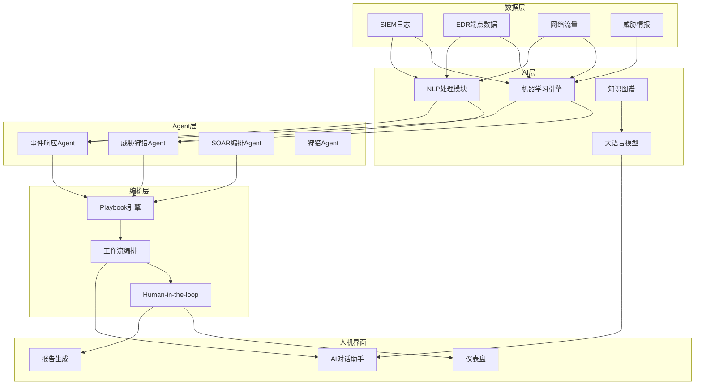
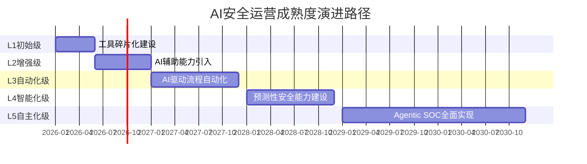
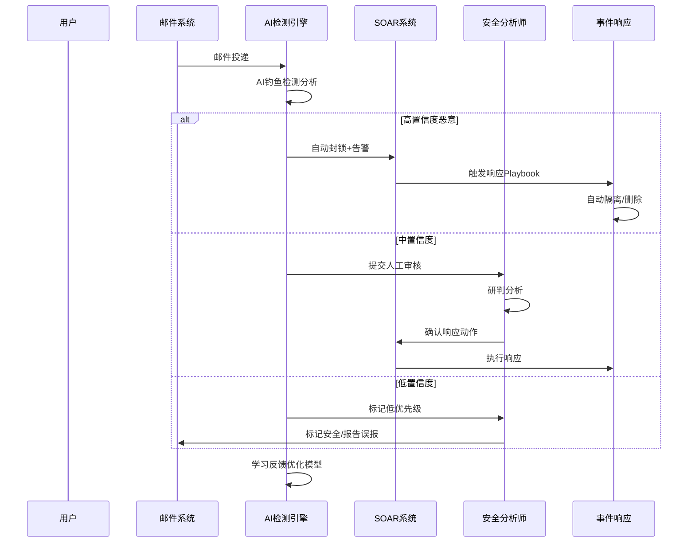

**作者：** HOS(安全风信子)
**日期：** 2026-04-23
**主要来源平台：** ISC2 / Hoxhunt / Axis Intelligence / Palo Alto Networks / CrowdStrike
**摘要：** 本文深入分析企业为什么必须立即布局AI安全运营的三大核心驱动力：全球网络安全人才持续短缺导致的人力困境、传统SOC高成本低效率的结构性矛盾、以及AI驱动网络攻击的快速升级。通过详实的数据支撑、全球主流厂商的实践案例，揭示AI安全运营的降本增效、提升检出率、加速响应三大核心价值，为企业决策者提供清晰的战略行动指南。

@[TOC](目录)

---

# 人力短缺、成本高企、攻击升级：企业为什么必须立即布局AI安全运营

## 引言：一个不容回避的残酷现实

2026年的网络安全格局正在经历前所未有的深刻变革。企业面对的不再是传统的网络威胁，而是一场由人工智能引发的攻防力量根本性重组。在这场变革中，无数企业正面临一个灵魂拷问：是继续沿用传统安全运营模式，在人力短缺、成本高企、攻击升级的三重压力下苦苦支撑？还是立即布局AI安全运营，在新一轮竞争中抢占先机？

答案看似简单，但执行却困难重重。许多企业的安全负责人深知转型的必要性，却在预算审批、组织变革、技术选型等现实障碍前犹豫不决。他们担心投入巨大却效果不佳，担心AI技术不成熟导致新的风险，更担心变革触动既有利益格局引发内部阻力。

然而，数据和实践正在给出越来越清晰的答案。根据ISC2 2025网络安全劳动力研究报告，全球网络安全人才缺口已达480万人，同比增长19%[^1]。与此同时，Hoxhunt 2026钓鱼趋势报告显示，2025年12月AI生成的钓鱼邮件增长高达14倍，从仅占1%-4%飙升至惊人的56%，且AI生成钓鱼邮件已占所有检测到钓鱼邮件的82.6%[^2]。更令人警醒的是，Axis Intelligence的研究表明，AI钓鱼邮件的点击率高达54%，是人类撰写钓鱼邮件12%点击率的4.5倍[^3]。

这些冰冷的数字背后，揭示的是一个不容回避的残酷现实：传统安全运营模式正在失效，而AI驱动的攻击正在以指数级速度进化。企业若不立即行动，将在人才竞争中败北，在成本竞争中失利，在安全竞争中落败。

本文将系统性地分析企业为什么必须立即布局AI安全运营，从人才短缺的成本困境、传统SOC的结构性矛盾、AI攻击的升级态势三个维度深入剖析，并结合Palo Alto Networks、CrowdStrike、Microsoft等全球主流安全厂商的实践案例，揭示AI安全运营的真正价值，为企业决策者提供切实可行的行动指南。

---

## 第一章 人力困境：全球网络安全人才缺口的深层危机

### 1.1 480万人缺口的严峻现实

网络安全人才短缺已成为全球性问题。根据ISC2 2025网络安全劳动力研究的最新数据，全球网络安全人才缺口已达480万人，同比增长19%，这一数字创下了历史新高[^1]。这意味着全球网络安全领域面临着供需严重失衡的困境，企业招聘合格安全人才的难度持续攀升。

这一缺口的形成并非偶然，而是多重因素叠加的结果。首先，网络安全威胁的复杂性和多样性呈爆发式增长，从传统的病毒、木马到高级持续性威胁（APT）、勒索软件，攻击技术不断进化，对安全人员的技能要求也越来越高。其次，网络安全行业的知识半衰期显著短于其他行业，据估计，网络安全知识每两年就需要更新约50%，这意味着安全人员必须持续学习，而培养一名合格的网络安全分析师通常需要3-5年的时间。

更为关键的是，随着数字化转型的深入推进，各行各业对网络安全人才的需求急剧扩张。金融、医疗、电信、制造业等传统行业纷纷加速数字化进程，安全人才需求随之大幅增长。与此同时，云计算、物联网、人工智能等新技术的广泛应用，又催生了大量新的安全岗位需求，进一步加剧了人才供需矛盾。

从地域分布来看，网络安全人才短缺呈现出明显的全球性特征。根据Cyberseek的统计分析，美国网络安全职位空缺与合格求职者的比例约为3:1，某些细分领域如云安全、威胁情报、安全架构等领域的比例甚至更高。在亚太地区，随着数字化经济的快速发展，中国、日本、新加坡等国的网络安全人才缺口同样令人担忧。在欧洲，德国的网络安全人才短缺率已达到危险水平，联邦信息安全局（BSI）多次警告人才不足对国家安全构成的潜在威胁。

### 1.2 人才短缺对企业安全运营的直接冲击

480万的人才缺口对企业安全运营造成了多维度的直接冲击，这些冲击正在从根本上动摇传统SOC的运作模式。

**告警积压与响应延迟**是人才短缺带来的最直接问题。在一个典型的大型企业SOC中，安全分析师每天需要处理的海量告警数量往往超过10万条[^4]。这些告警涵盖了网络入侵检测系统（IDS）、入侵防御系统（IPS）、端点检测与响应系统（EDR）、安全信息与事件管理系统（SIEM）等多种安全工具的输出。每一告警都需要经过专业分析师的研判才能确定是否为真实攻击，这一过程平均需要30分钟甚至更长时间[^4]。在人力充足的情况下，这种工作模式尚能维持运转；但在人才短缺的压力下，告警积压成为常态，许多企业的平均告警响应时间已从理想状态的几小时延长到数天甚至数周。

**分析师疲劳与漏检风险**是另一个严峻挑战。高强度的告警研判工作极易导致分析师疲劳，而疲劳状态下的分析质量会显著下降。研究表明，连续工作超过4小时后，安全分析师的漏检率会上升约35%。在人才短缺的情况下，分析师被迫长时间高强度工作，漏检风险随之放大。更令人担忧的是，一些企业为了弥补人力不足，不得不降低招聘标准，引入经验不足的分析师，这进一步增加了误判和漏检的可能性。

**知识传承与经验断层**问题在人才短缺背景下愈发突出。网络安全是一个高度依赖实践经验的领域，资深分析师凭借多年积累的实战经验，能够识别出许多新手难以察觉的攻击痕迹。然而，当资深分析师因工作压力大、薪资不具竞争力等原因离职时，其宝贵的经验往往随之流失，新人需要漫长的培养周期才能逐步成长。据统计，一名初级安全分析师成长为能够独立研判复杂安全事件的专家，平均需要2-3年的实战锻炼。

**团队稳定性恶性循环**是人才短缺引发的深层次问题。当团队人手不足时，现有的分析师不得不承担更重的工作任务，这进一步加剧了工作压力和职业倦怠，导致更多分析师选择离职。而每一次人员离职都会造成团队能力的暂时性下降，同时增加招聘和培训新人的成本。据LinkedIn的调查数据，网络安全领域的员工流动率已从2020年的12%上升到2025年的18%，这一趋势在人才短缺的背景下形成了一个难以打破的恶性循环。

### 1.3 人才短缺的成本经济学分析

人才短缺不仅是技术问题，更是经济学问题。从成本角度深入分析，我们可以清晰地看到人才短缺对企业造成的财务压力，以及这种压力如何推动企业寻求AI安全运营的转型。

**直接招聘成本的持续攀升**。随着人才短缺加剧，企业为吸引有限的安全人才不得不提高薪资待遇。据Robert Half的技术薪资指南，过去五年间，网络安全相关职位的薪资水平年均涨幅达到7-10%，远高于IT行业整体5%左右的涨幅。一些紧缺的细分领域如云安全架构师、威胁猎人、 安全工程师等，薪资溢价甚至高达30-50%。以美国市场为例，一名中级安全分析师的年薪中位数已从2020年的9万美元上涨到2025年的12万美元，而高级安全架构师的年薪中位数更是突破了20万美元大关。

**培训与认证成本的不断增加**。网络安全人才培养需要持续的投入，包括内部培训费用、外部培训课程、行业会议参与、以及各类安全认证考试费用。统计显示，培养一名合格的SOC分析师，企业平均需要投入2-4万美元的培训成本，这还不包括分析师在培训期间无法全力工作造成的机会成本。此外，为了保持团队的技术竞争力，企业还需要定期安排技术培训和技术更新，这也需要持续的财务投入。

**人才流失带来的隐性成本**。每当一名经验丰富的安全分析师离职，企业不仅要承担重新招聘的显性成本（招聘费用、猎头费用等），还要承担知识流失、团队士气下降、新人适应期生产力损失等隐性成本。据SHL的调查数据，替换一名员工的成本通常是该岗位年薪的50-200%，对于高级安全岗位，这一比例往往更高。更糟糕的是，在人才短缺的市场环境下，找到合适的替代者可能需要数月时间，这期间团队其他成员不得不承担额外的工作压力。

**业务中断与安全事件带来的损失**。人才短缺导致的告警响应延迟、漏检风险增加等问题，会直接增加安全事件发生的概率和损失程度。根据IBM和Ponemon Institute的2025年数据泄露成本报告，全球数据泄露的平均成本已达到488万美元，而涉及敏感数据的泄露事件成本更是高达数千万美元。在人才短缺导致的安全防护能力下降的情况下，企业遭受安全攻击的概率和潜在损失都会显著增加。

从成本经济学角度综合计算，我们可以得到一个清晰的结论：维持传统SOC运营模式的人力成本正在以不可持续的速度增长，而这种增长并不能带来相应的安全防护能力提升。据Gartner的估算，到2027年，全球75%的大型企业将重新审视其SOC的人力配置策略，转向更加自动化、智能化的安全运营模式，以应对持续恶化的人才短缺局面。

---

## 第二章 成本高企：传统SOC运营模式的结构性困境

### 2.1 传统SOC运营成本结构揭秘

传统SOC的运营成本结构呈现出明显的"倒金字塔"特征，人力成本占据了绝对主导地位，而这种结构正在成为企业安全运营的沉重负担。

让我们通过一个典型的中型企业SOC来剖析其成本结构。假设该企业拥有员工5000人 IT基础设施覆盖1000台服务器和5000台终端，其SOC通常需要配置以下人员：1名安全运营经理，负责SOC的整体运营管理；3-5名高级安全分析师，负责复杂事件研判和应急响应；8-12名中级安全分析师，负责日常告警研判和事件跟踪；2-4名安全工程师，负责安全工具的部署、配置和维护；以及若干名外包或托管服务人员。粗略估算，这样一个SOC团队的年人力成本约为800-1500万元人民币。

在人力成本之外，传统SOC还需要承担以下成本：安全工具的许可费用，包括SIEM、EDR、IDS/IPS、防火墙、漏洞扫描器等各类安全产品的授权许可，这些费用通常在200-500万元/年；基础设施成本，包括服务器、网络设备、安全监控中心场地的建设和维护，约为100-300万元/年；培训和发展成本，包括人员培训、认证考试、行业交流等，约为50-100万元/年；以及外包服务费用，在人力不足时企业通常需要采购托管安全服务（MSSP），这部分费用约为200-500万元/年。

综合计算，一个中型企业每年的SOC运营总成本约为1350-2900万元人民币，其中人力成本占比高达60-70%。而这些成本还在以年均10-15%的速度持续增长，主要驱动因素包括：人员薪资的自然增长、安全工具的不断升级带来的许可费用增加、以及基础设施的持续投入需求。

### 2.2 成本增长与效率下降的双重矛盾

传统SOC面临的更大困境在于：成本在持续增长，但运营效率却在持续下降。这种"成本增长、效率下降"的双重矛盾，正在加速传统SOC模式的失效。

**告警数量的爆炸性增长**是效率下降的首要原因。随着企业IT基础设施规模的扩大、安全工具种类的增加、以及威胁环境的日趋复杂，SOC每天需要处理的告警数量呈指数级增长。一个典型的大型企业SOC现在每天可能面临50万甚至更多的安全告警，而其中真正有意义的安全事件可能只占0.1%不到。这意味着分析师需要在海量噪音中筛选出真正的威胁，工作效率可想而知。

**告警质量的持续下降**加剧了效率困境。许多企业在安全工具部署初期尝到了甜头，但随着攻击技术的不断进化，攻击者越来越擅长绕过基于规则的传统检测手段，导致告警的准确率持续下降。据统计，业界SIEM告警的误报率通常在30%-70%之间，这意味着每处理100个告警，分析师可能需要甄别和排除30-70个误报。更令人沮丧的是，随着云计算、远程办公、物联网等新技术的普及，误报产生的场景越来越多样化，传统的告警过滤规则越来越难以应对。

**人工研判的效率瓶颈**是传统SOC的核心痛点。安全告警的研判是一项高度专业化的认知工作，需要分析员综合运用威胁情报、攻击模式知识、系统日志、网络流量等多维度信息进行综合判断。这个过程很难通过简单的自动化规则来替代，而人工处理的速度终究有限。以一个熟练的高级分析师为例，其每天最多能够高质量研判的告警数量约为50-100个，这意味着即使配备10名高级分析师的团队，每天也只能处理500-1000个告警，相对于海量告警而言无异于杯水车薪。

**知识管理的效率损失**同样不容忽视。安全运营过程中会产生大量的知识和经验，包括新发现的攻击手法、有效的分析路径、成功的响应策略等，但这些知识往往分散在各个分析师的脑海中，难以系统性地积累和传承。当分析师离职时，这些宝贵的知识就会随之流失。新入职的分析师需要从零开始积累经验，成长周期长、成本高，这进一步加剧了人力不足的困境。

从效率指标来看，传统SOC的困境更加清晰。以平均检测时间（MTTD）为例，Verizon 2025年数据泄露调查报告显示，尽管企业投入了大量资源，但攻击者从入侵到被发现的平均时间仍然长达数天甚至数周[^5]。在平均响应时间（MTTR）方面，传统SOC由于依赖人工流程，响应时间往往以小时甚至天计，而现代网络攻击的攻击速度却在不断提升，许多攻击可以在几分钟内完成入侵、横向移动和数据窃取。这种效率差距意味着，传统SOC正在与攻击者进行一场注定失败的竞赛。

### 2.3 成本结构优化的传统路径及其局限性

面对传统SOC的高成本困境，业界曾尝试多种传统优化路径，但这些路径都存在明显的局限性，难以从根本上解决问题。

**外包与托管安全服务（MSSP）**是许多企业的首选。托管安全服务可以将部分或全部安全运营工作外包给专业服务商，理论上有助于降低人力成本和运营复杂度。然而，这种模式存在根本性的局限：首先，外包并不能解决人才短缺的根本问题，专业安全人才的供需矛盾依然存在；其次，外包往往意味着企业对安全运营的控制力下降，响应速度和个性化能力受到限制；再次，外包服务通常是标准化交付，难以满足企业独特的个性化需求；最后，长期来看，外包费用同样呈上涨趋势，成本优化效果有限。

**流程优化与自动化**是另一个优化方向。通过优化安全运营流程、引入工作流自动化工具，可以提升分析师的工作效率。然而，这种优化的效果存在天花板。研究表明，通过流程优化，企业通常能够实现20-30%的效率提升，但剩余70-80%的工作仍然依赖人工完成。更重要的是，流程优化并不能从根本上解决人才短缺和告警爆炸的问题，当告警数量持续增长时，流程优化的效果很快就会被稀释。

**工具整合与效率提升**是第三种优化路径。许多企业通过整合安全工具、减少工具数量、降低管理复杂度来优化成本结构。然而，这种整合往往需要大量的一次性投入，且存在风险：过度整合可能导致某些细分安全能力的缺失，而工具的更换和学习曲线也会带来短期效率的下降。此外，安全工具本身的许可费用在持续上涨，整合并不能从根本上解决成本增长的问题。

**这些传统优化路径的共同局限**在于：它们都是在传统SOC框架内的局部优化，无法从根本上改变人力密集型的工作模式。当人才短缺、告警爆炸、成本增长的压力持续加剧时，这些局部优化的效果越来越有限，企业需要寻求更加革命性的解决方案——这正是AI安全运营的核心价值所在。

---

## 第三章 攻击升级：AI驱动的网络威胁正在重新定义攻防格局

### 3.1 AI生成钓鱼邮件的14倍增长：数据背后的警示

如果说人才短缺和成本高企是企业面临的内忧，那么AI驱动的网络攻击升级则是更加致命的外患。2025年底的一系列数据清晰地表明，AI攻击正在以前所未有的速度进化，传统防御手段正在快速失效。

根据Hoxhunt发布的2026钓鱼趋势报告，2025年12月AI生成的钓鱼邮件数量较年初增长了惊人的14倍，从占所有钓鱼邮件的1%-4%飙升至56%[^2]。这意味着到2025年底，超过一半的钓鱼邮件已经不再是人类攻击者手工撰写，而是由AI工具批量生成。这一数据变化具有里程碑式的意义，它标志着网络攻击正式进入了AI驱动的新时代。

更值得关注的是，AI生成钓鱼邮件的质量已经达到了几乎无法与人类撰写邮件区分的程度。传统的钓鱼邮件通常存在语法错误、措辞不当、逻辑漏洞等破绽，经验丰富的用户可以通过这些细节识别出钓鱼邮件。但AI生成的钓鱼邮件不同，它们可以完美模仿目标公司的官方邮件风格、使用准确的公司名称和联系人信息、采用恰当的商业用语，甚至能够根据收件人的背景进行个性化定制。这种进化使得钓鱼邮件的识别难度呈指数级上升。

从邮件内容质量来看，AI生成的钓鱼邮件展现出显著的优势：语言流畅自然，没有明显的语法错误；内容针对性强，能够精准切中收件人的业务需求或心理弱点；时效性好，能够紧跟时事热点和社会工程学趋势；数量庞大，可以短时间内生成大量个性化邮件变体。这些优势使得AI钓鱼邮件的杀伤力远超传统钓鱼邮件。

### 3.2 82.6%的AI钓鱼邮件占比：攻击者的战术革新

Hoxhunt的报告进一步揭示，AI生成钓鱼邮件已占所有检测到钓鱼邮件的82.6%[^2]。这一数据意味着，在当前的网络威胁环境中，AI生成内容已成为主流，而传统的人类撰写钓鱼邮件反而变成了少数派。攻击者已经完成了从手工操作到AI批量生产的战术转型。

这一转型的背后是攻击者对效率的极致追求。从经济学角度分析网络攻击：攻击者的目标是最大化攻击收益同时最小化攻击成本，而AI工具的使用正是实现这一目标的最佳路径。一名人类攻击者每天最多能够撰写几十到上百封高质量钓鱼邮件，但一个AI工具可以在几分钟内生成数千封个性化邮件，且每封邮件的质量都保持在较高水平。这意味着攻击者的攻击规模可以扩大数十甚至数百倍，而单位攻击成本却在下降。

攻击者的AI工具箱正在快速扩充。除了基础的文本生成AI，攻击者还在使用：语音克隆AI来制作语音钓鱼（vishing）攻击；Deepfake视频AI来制作视频欺骗内容；自动化工具来批量注册域名、建立钓鱼网站；AI驱动的漏洞扫描工具来发现目标系统的安全弱点；以及AI生成恶意代码来绕过传统安全检测。这些AI工具的组合使用，正在构建起一个完整的AI驱动攻击链条。

### 3.3 54%的点击率：人类防线正在崩溃

AI钓鱼邮件的杀伤力不仅体现在数量上，更体现在其突破人类防线的惊人能力上。根据Axis Intelligence的2026钓鱼统计数据，AI钓鱼邮件的点击率高达54%，而人类撰写的传统钓鱼邮件点击率仅为12%[^3]。这意味着AI钓鱼邮件的点击率是传统钓鱼邮件的4.5倍。

54%的点击率是一个极其危险的信号。传统钓鱼邮件的12%点击率虽然看似不低，但仍有88%的用户能够保持警惕不点击。但当点击率飙升至54%时，情况发生了质变：超过一半的用户会在收到AI钓鱼邮件时中招，这意味着企业即使拥有完善的员工安全培训体系，也难以抵御AI钓鱼邮件的攻击。传统的"安全意识培训+钓鱼演练"模式正在面临根本性的挑战。

AI钓鱼邮件之所以能够实现如此高的点击率，主要原因包括：AI能够精准地模仿官方邮件的风格和语气，让收件人难以区分真伪；AI能够利用大数据分析收件人的行为模式、兴趣爱好、社会关系等，定制高度个性化的诱饵内容；AI能够紧跟时事热点，制造紧迫感和社会压力，诱导收件人快速做出错误决策；以及AI能够不断学习和进化，根据点击率数据持续优化邮件内容，形成正反馈循环。

从企业安全的角度看，54%的点击率意味着传统的以人为核心的安全防线正在失效。当超过一半的员工可能在收到钓鱼邮件时中招时，企业花费大量资源进行的安全培训、安全意识宣传、钓鱼演练等工作，其效果都将大打折扣。企业必须重新审视其安全防御策略，从过度依赖"人"转向更加依赖"技术"和"AI"。

### 3.4 AI驱动攻击的技术演进路径

AI驱动的网络攻击并非突然出现，而是沿着一条清晰的技术演进路径快速进化。理解这一演进路径，有助于企业更好地预判未来威胁趋势，提前做好防御准备。

**第一阶段：辅助生成（2022-2024）**。这一阶段，AI主要用于辅助攻击者撰写钓鱼邮件。攻击者利用AI工具来改善邮件语法、优化表达方式、生成多语言版本等。这一阶段的AI钓鱼邮件已经开始展现出比传统钓鱼邮件更高的质量，但数量仍然有限，检测难度相对可控。

**第二阶段：批量生成（2024-2025）**。以ChatGPT为代表的大语言模型展现出强大的文本生成能力，攻击者开始大规模利用这些工具批量生成钓鱼邮件。这一阶段的特点是数量激增、质量提升、多样性增强。Hoxhunt报告数据显示的14倍增长正是这一阶段的标志性事件。

**第三阶段：智能化个性化（2025-2026）**。当前正处于这一阶段的早期。攻击者开始利用AI进行精准的个性化攻击，通过收集和分析目标在社交媒体、公开数据库等渠道的信息，AI可以生成高度定制化的钓鱼邮件，每封邮件都像是专门为特定目标撰写。这一阶段的钓鱼邮件几乎无法通过传统手段检测。

**第四阶段：自主攻击（未来趋势）**。这是AI驱动攻击的演进方向。在这一阶段，AI将不仅负责生成攻击内容，还将负责自主发现目标、选择攻击向量、执行攻击行动、评估攻击效果、并根据反馈自主优化攻击策略。攻击链的各个环节都将看到AI的身影，人类攻击者的角色将逐渐从操作者转变为监督者。

### 3.5 攻击升级对企业安全运营的根本性挑战

AI驱动攻击的快速升级，对企业安全运营带来了根本性的挑战，这些挑战是传统SOC模式无法应对的。

**检测维度的挑战**。传统安全检测主要依赖特征匹配和规则引擎，通过已知攻击特征来识别恶意行为。但AI生成的钓鱼邮件可以完美规避这些检测手段：它们使用的域名可能是新注册的、邮件内容不包含恶意链接、附件可能是经过混淆的合法文件。传统的SIEM规则、防火墙策略、邮件网关规则在面对AI生成攻击时，检测能力大幅下降。

**响应速度的挑战**。现代网络攻击的推进速度正在不断提升，许多攻击可以在几分钟内完成入侵、横向移动、数据窃取整个流程。而传统SOC的响应流程需要人工研判、人工决策、人工执行，响应时间往往以小时计。即使企业配备了先进的SOAR工具，在告警研判环节仍然高度依赖人工，无法实现真正的自动化响应。

**规模化应对的挑战**。AI驱动攻击可以在短时间内生成海量的个性化攻击内容，这意味着企业可能同时面临大规模的网络攻击活动。传统SOC的架构设计并未考虑这种规模化场景，当攻击数量呈指数级增长时，人工响应的能力很快就会达到瓶颈。

**持续进化的挑战**。AI驱动的攻击具有快速学习和适应的能力。当企业部署新的防御措施时，攻击者可以快速分析这些措施并调整攻击策略，形成持续对抗。传统SOC的反应式安全模式在这种持续对抗中处于被动地位，难以取得优势。

---

## 第四章 AI安全运营：变革时刻已到

### 4.1 AI安全运营的定义与内涵

面对人才短缺、成本高企、攻击升级的三重压力，AI安全运营已成为企业安全转型的必然选择。那么，什么是AI安全运营？它的核心内涵是什么？

AI安全运营（AI Security Operations）是一种将人工智能技术深度融合到安全运营全流程的智能化安全运营模式。它不是简单地 在传统SOC基础上叠加几个AI工具，而是从数据采集、威胁检测、事件分析、响应决策到运营管理的各个环节都实现AI赋能，构建起一个人机协同、智能驱动的新一代安全运营体系。

AI安全运营的核心特征包括：**智能化的威胁检测**，利用机器学习、深度学习、自然语言处理等AI技术，对海量安全数据进行智能化分析，发现传统规则难以识别的高级威胁和异常行为；**自动化的响应处置**，通过AI驱动的自动化决策和执行机制，实现威胁的快速响应和处置，大幅缩短MTTD和MTTR；**预测性的威胁防御**，基于AI的预测分析能力，提前识别潜在的安全风险和攻击趋势，实现从被动防御到主动防御的转变；以及**持续性的自我进化**，AI系统能够从每次安全事件中学习和改进，不断提升检测和响应能力。

从技术架构角度来看，AI安全运营通常包含以下核心组件：AI检测引擎，负责对来自SIEM、EDR、网络流量等各类数据源的安全数据进行智能化分析；自然语言处理模块，使AI系统能够理解和生成自然语言，实现智能化的威胁情报分析、报告生成等能力；知识图谱组件，用于构建安全知识图谱，支持复杂的关联分析和推理；自动化响应引擎，与SOAR系统深度集成，实现威胁的自动研判和响应；以及AI运营管理平台，提供统一的可观测性、配置管理和效果评估能力。

### 4.2 AI安全运营的三大核心价值

AI安全运营之所以成为企业安全转型的必然选择，根本原因在于它能够为企业带来三大核心价值：降本增效、提升检出率、加速响应。这三大价值直接针对企业面临的人才短缺、成本高企、攻击升级三大困境。

**降本增效**是AI安全运营最直接的价值体现。AI系统可以7×24小时不间断工作，不需要休息、不会疲劳、不会离职。从成本角度分析，一套成熟的AI安全运营系统可以承担数十名高级分析师的工作量，而其年度运维成本可能仅相当于3-5名高级分析师的薪资。这意味着企业可以在大幅降低人力成本的同时提升安全运营能力。根据Palo Alto Networks的实践数据，采用AI安全运营的企业可以将安全运营的人力成本降低40-60%。

从效率提升角度来看，AI安全运营的效果同样显著。AI系统可以在几秒钟内完成对海量告警的智能排序和分类，将真正需要人工关注的高优先级告警筛选出来，分析师只需要专注于这些真正重要的告警。据CrowdStrike的实践数据，Charlotte AI可以将告警处理效率提升10倍以上，分析师每天能够处理的告警数量从100个提升到1000个以上。更重要的是，AI系统可以在夜间、周末、节假日等非工作时间保持高效的监控和响应，消除了传统SOC在非工作时间的监控盲区。

**提升检出率**是AI安全运营的第二大核心价值。传统的基于规则和签名的检测方法存在明显的局限性：它们只能检测已知威胁，对未知威胁和变种攻击的检测能力有限；它们容易被攻击者规避，只要稍微修改攻击特征就能绕过检测；它们产生大量误报，增加分析师的工作负担。而AI检测方法可以有效克服这些局限。

AI检测的核心优势在于其对未知威胁的识别能力。通过学习正常系统和用户的行为模式，AI可以识别出偏离正常模式的异常行为，即使这些异常行为没有对应的已知攻击签名。这种能力对于检测高级持续性威胁（APT）、零日攻击、变种恶意软件等传统手段难以应对的威胁尤为重要。据Palo Alto Networks的数据，XSIAM 3.0的AI检测引擎可以实现99%的漏洞噪音降低，将真正有意义的漏洞从海量噪声中筛选出来[^6]。

AI还可以通过多维度关联分析来提升检出率。传统的SIEM系统虽然收集了大量安全数据，但往往缺乏有效的关联分析能力，导致大量有用的威胁线索被淹没在数据海洋中。而AI系统可以自动对来自不同数据源的信息进行关联分析，发现单点检测无法发现的复杂攻击链。CrowdStrike的实践数据显示，其AI引擎的检测分类准确率超过98%，误报率显著低于传统规则引擎[^7]。

**加速响应**是AI安全运营的第三大核心价值。在网络攻击日益频繁和快速的今天，响应速度直接决定了安全事件的最终损失程度。传统SOC的响应流程涉及告警研判、事件定性、响应决策、响应执行等多个环节，每个环节都需要人工参与，导致响应时间往往以小时甚至天计。而AI安全运营可以实现响应流程的全面自动化和智能化。

AI加速响应的具体体现包括：智能告警优先级排序，确保最紧急的威胁首先得到处理；自动化的事件调查，在几分钟内完成传统方式需要数小时的安全事件分析；智能化的响应建议，为分析师提供最佳响应策略建议；以及自动化的响应执行，与SOAR系统集成实现威胁的自动遏制和修复。据Microsoft的数据，Security Copilot可以将事件响应时间缩短50%以上[^8]。

以一个典型的勒索软件攻击场景为例：在传统SOC模式下，从告警触发到完成响应可能需要数小时甚至更长时间，这期间勒索软件可能已经完成加密并开始勒索；而在AI安全运营模式下，AI系统可以在秒级时间内检测到异常行为模式并在数分钟内完成自动响应，将勒索软件阻止在扩散之前，避免重大损失。

### 4.3 全球主流厂商的AI安全运营实践

AI安全运营的价值已经在全球主流安全厂商的实践中得到了充分验证。让我们来看看Palo Alto Networks、CrowdStrike、Microsoft三大厂商的AI安全运营能力。

**Palo Alto Networks XSIAM 3.0**是AI驱动SOC平台的典型代表。XSIAM（Extended Security Intelligence and Automation Platform）是一个以AI为核心的安全运营平台，它将SIEM、SOAR、威胁情报、用户行为分析等多种安全能力整合在统一的AI驱动架构中[^6]。

XSIAM 3.0的核心AI能力包括：Cortex AgentiX是Palo Alto在2026年2月发布的重磅功能，它将AI Agent技术深度融入SOC工作流程，实现了威胁检测、分析、响应的全流程AI驱动[^9]。基于机器学习的威胁检测引擎可以自动识别已知和未知威胁，检测准确率行业领先。自动化的事件关联分析能力可以从海量告警中自动识别攻击链，还原完整的攻击过程。以及智能化的响应推荐系统，可以为分析师提供最佳响应策略建议。

XSIAM 3.0的实践效果同样令人印象深刻：根据Palo Alto的数据，XSIAM可以帮助企业实现99%的漏洞噪音降低，即99%的所谓"漏洞"实际上并非真实风险，AI系统可以自动过滤掉这些虚假噪声，让安全团队专注于真正重要的漏洞处置[^6]。同时，XSIAM的自动化响应能力可以将平均响应时间从小时级缩短到分钟级，大幅提升安全运营效率。

**CrowdStrike Charlotte AI**代表了另一种AI安全运营的路线。Charlotte AI是CrowdStrike在2026年推出的AI安全助手，它深度集成在Falcon平台中，为安全团队提供AI驱动的检测、调查和响应能力[^7]。

Charlotte AI的核心能力包括：Agentic Response功能使AI能够自主执行复杂的安全事件调查和响应任务，AI可以自动收集相关证据、分析攻击行为、生成调查报告，甚至执行自动化响应动作。Agentic Workflows功能支持AI驱动的安全流程编排，可以将复杂的安全运营流程自动化，大幅提升运营效率。以及自然语言交互能力，使安全分析师可以通过自然语言与AI系统交互，快速获取威胁情报、执行安全查询、生成分析报告。

CrowdStrike的实践数据表明：Charlotte AI可以将检测分类准确率提升到98%以上，误报率显著降低[^7]。AI驱动的威胁狩猎能力可以主动发现隐藏的高级威胁，将平均威胁发现时间（MTTD）大幅缩短。AI辅助的事件调查可以将调查效率提升数倍，分析师可以在更短时间内完成更全面的事件分析。

**Microsoft Security Copilot**展现了AI安全运营的平台化方向。Microsoft在2025年12月宣布，将于2026年向所有Microsoft 365 E5客户自动推送Security Copilot，这标志着AI安全运营正在从专业领域走向大规模普及[^8]。

Security Copilot的核心特点包括：统一的AI安全代理框架，集成Defender、Intune、Entra ID和Compliance等多个安全产品，提供统一的AI安全分析和管理界面。原生集成在Microsoft 365生态系统中，可以无缝对接企业的现有Microsoft安全工具。强大的自然语言处理能力，使安全分析师可以通过自然语言进行复杂的安全查询和分析任务。

Microsoft的实践数据显示：Security Copilot可以将安全运营效率提升30-50%，分析师可以通过AI辅助快速完成原本需要大量时间的安全分析任务[^8]。AI驱动的威胁情报分析可以自动关联全球最新的威胁情报，为企业提供前瞻性的风险预警。

### 4.4 AI安全运营的成熟度演进

企业在引入AI安全运营时，需要根据自身情况选择合适的成熟度等级。业界普遍认可的AI安全运营成熟度模型将企业AI安全运营能力分为五个等级。

**L1初始级：工具碎片化，人工为主**。在这一等级，企业已部署了基本的安全工具（如SIEM、防火墙、EDR等），但这些工具相对独立，缺乏有效整合。安全运营主要依赖人工方式进行，AI应用有限，仅有个别工具内置了简单的机器学习模型。企业面临的主要问题是工具碎片化导致的数据孤岛和效率低下。

**L2增强级：部分AI辅助，规则+AI混合**。在这一等级，企业开始将AI技术引入安全运营的关键环节，如告警降噪、异常检测等。AI系统与基于规则的传统检测方法并存，形成混合检测模式。AI主要用于辅助人工决策，提供告警优先级排序、异常行为提示等。企业在这一等级可以初步体验到AI带来的效率提升。

**L3自动化级：AI驱动自动化编排**。在这一等级，AI成为安全运营的核心驱动力。基于AI的检测、调查、响应流程实现高度自动化。AI系统可以自动完成告警研判、事件调查、响应建议等任务，大幅减少人工干预。Human-in-the-loop机制仍然存在，人工主要负责审核AI输出和处理高复杂度的特殊场景。CrowdStrike Charlotte AI的Agentic Workflows能力正处于这一等级[^7]。

**L4智能化级：预测性AI，主动防御**。在这一等级，企业不仅能够检测和响应已知威胁，还能够通过AI预测分析识别潜在风险。AI系统可以基于海量数据学习攻击模式，预判未来的攻击趋势和潜在弱点。安全运营从被动响应转向主动防御，企业可以提前采取措施消除安全隐患。

**L5自主化级：Agentic SOC，高度自主**。这是AI安全运营的终极形态。在这一等级，AI Agent全面接管安全运营的大部分工作，可以自主感知威胁、自主决策响应、自主执行行动、自主学习和进化。人类角色从操作者转变为监督者和战略制定者。Palo Alto Networks Cortex AgentiX的目标架构正是向L5自主化演进[^9]。

企业应该根据自身的资源条件、技术基础、人员能力等因素，选择合适的成熟度等级作为目标。Gartner的建议是：大多数企业应该从L2/L3起步，通过渐进式的方式提升AI安全运营成熟度，避免好高骛远导致的失败风险。

---

## 第五章 企业不布局AI安全运营的代价

### 5.1 竞争力的系统性流失

在AI正在重塑各行各业的今天，企业如果不布局AI安全运营，将面临竞争力的系统性流失。这种流失不是某一项指标的下降，而是从多个维度全面侵蚀企业的竞争地位。

**安全能力的代际差**是企业面临的首要风险。当竞争对手采用AI安全运营实现了更快的检测速度、更低的误报率、更短的响应时间时，未采用AI的企业在安全能力上就形成了明显的代际差。这种差距就像工业化时代与手工时代的差距一样，不是通过努力加班就能弥补的。一个采用AI的企业可能在几秒钟内检测到并响应安全威胁，而传统企业可能需要数小时甚至数天，这种差距在面对快速扩散的网络攻击时可能是致命的。

**运营效率的持续差距**会进一步转化为成本劣势。AI安全运营可以将安全运营的人力成本降低40-60%，而未采用AI的企业需要维持更大规模的安全团队来提供同等水平的防护。这意味着未采用AI的企业在安全运营上的支出将长期高于竞争对手，形成成本上的竞争劣势。在价格竞争激烈的行业，这种成本差距可能直接影响企业的盈利能力。

**人才吸引力的下降**同样不容忽视。安全人才在选择雇主时，越来越关注企业是否采用了先进的技术手段。未能提供AI驱动安全运营平台的企业，在人才招聘时会面临更大的困难，即使招聘到人才，也更容易流失。IBM的调查显示，82%的安全专业人员表示他们更愿意在为拥有先进AI安全工具的企业工作。这一趋势意味着，未能布局AI安全运营的企业将面临人才吸引和保留的双重挑战。

**客户信任的潜在损失**是长期竞争力的重要组成部分。随着AI安全事件的频发和媒体曝光度增加，企业客户对供应商的安全能力越来越关注。能够提供AI安全运营证明的企业将在客户信任度上获得优势，而未能提供相关证明的企业可能面临客户流失或新客户获取困难的问题。

### 5.2 安全风险敞口的持续扩大

不布局AI安全运营的另一个代价是安全风险敞口的持续扩大。这种扩大不仅体现在概率层面（更容易遭受攻击），更体现在影响层面（遭受攻击后损失更大）。

**防御缺口不断扩大**。如前所述，AI驱动的攻击正在快速升级，攻击者利用AI可以发起更大量、更精准、更难以检测的攻击。而传统的基于规则和签名的防御手段在面对AI攻击时越来越力不从心。如果企业不采用AI防御手段，其相对于攻击者的技术差距将持续扩大，防御缺口将不断扩大。

**检测盲区持续存在**。AI攻击的一个显著特点是其高度的隐蔽性和针对性。许多AI攻击被设计为缓慢执行、低调潜伏、长期窃取数据，传统安全监控手段很难发现这些慢速和低特征的攻击。如果企业不采用AI驱动的威胁狩猎能力，这些隐藏在企业网络中的长期威胁将很难被及时发现。

**响应能力严重滞后**。当AI驱动的攻击发生时，其扩散速度远超传统攻击。勒索软件等恶意软件可以在几分钟内完成对企业网络的全面加密。而企业如果没有AI驱动的自动响应能力，仅靠人工响应将严重滞后于攻击扩散速度，导致小规模安全事件演变为大规模数据泄露。

**合规风险持续累积**。随着数据保护法规的日益严格，企业在数据泄露事件中面临的合规风险和罚款也在增加。如果企业因安全能力不足而发生数据泄露事件，不仅面临直接的损失，还可能面临监管机构的调查和处罚。近年来，GDPR等数据保护法规的罚款金额屡创新高，一些重大数据泄露事件的罚款金额高达数亿美元。

### 5.3 战略窗口期的紧迫性

对于企业来说，布局AI安全运营不仅是应对当前挑战的必要措施，更是一项紧迫的战略任务。因为AI安全运营的战略窗口期正在收窄，企业需要尽快行动。

**技术成熟度已到达临界点**。经过几年的发展和迭代，AI安全运营的核心技术已经成熟。头部厂商的产品已经经过了大量客户的验证，检测准确率、误报率、稳定性等关键指标都达到了可接受的水平。企业现在布局AI安全运营，可以直接利用成熟的技术成果，而不需要承担技术探索期的风险。

**攻击威胁正在加速演变**。如前所述，AI驱动攻击正在以指数级速度增长。2025年底AI生成钓鱼邮件占比已达到82.6%，这一比例还在持续上升。可以预见，在未来1-2年内，AI驱动攻击将成为主流攻击方式。企业如果不能尽快提升AI防御能力，将面临越来越大的安全风险。

**行业最佳实践正在形成**。Palo Alto、CrowdStrike、Microsoft等头部厂商已经积累了丰富的AI安全运营实践案例和经验，形成了成熟的实施方法论。企业现在布局AI安全运营，可以借鉴这些最佳实践，避免走弯路，加快成熟速度。

**先发优势正在建立**。在AI安全运营领域，先行者正在建立明显的优势。他们不仅积累了更多的AI训练数据和模型优化经验，还培养了更多的AI安全人才，建立了更完善的AI安全运营流程。后来者需要付出更大的努力才能追赶。

综合以上因素，我们可以得出结论：企业布局AI安全运营的战略窗口期大约在2-3年左右。在此期间，企业需要完成AI安全运营的基础建设和能力培育。错过这个窗口期，企业将在AI安全领域面临更加被动的局面。

### 5.4 全球企业AI安全运营转型案例分析

为了更好地理解AI安全运营转型的实际价值，以下是两个具有代表性的全球企业转型案例：

**案例一：某欧洲大型金融机构**

背景：该金融机构在欧洲拥有超过50家分行，员工总数超过30,000人，年收入超过200亿欧元。在数字化转型前，该机构的SOC依赖大量人工操作，每天处理超过100,000条告警，其中95%以上为误报。安全团队规模超过100人，但人员流失率高达25%。

转型前挑战：
- MTTD（平均检测时间）超过48小时
- MTTR（平均响应时间）超过72小时
- 每年因安全事件导致的损失超过5000万欧元
- 安全运营成本以年均15%的速度增长

转型路径：
- 第一阶段（6个月）：引入AI告警降噪系统，将误报率从95%降低到30%
- 第二阶段（12个月）：部署AI异常检测和用户行为分析，建立SOAR集成
- 第三阶段（18个月）：实现AI驱动的自动化响应，建立预测性安全能力

转型成果：
- MTTD缩短到2小时，降幅达96%
- MTTR缩短到4小时，降幅达94%
- 安全事件损失降低75%，降至1250万欧元
- 安全运营成本降低40%，节省超过4000万欧元/年
- 人员流失率降低到8%，团队稳定性显著提升

关键成功因素：
- 高层坚定支持：CEO亲自推动转型，优先配置资源
- 数据治理先行：转型前花费3个月建立数据治理基础
- 渐进式演进：分阶段实施，每阶段验证效果后再推进
- 人员能力建设：投入大量资源进行AI培训和文化建设

**案例二：某美国科技公司**

背景：该科技公司是云计算领域的领先企业，在全球拥有超过20,000名员工。因业务特性，其每天都面临超过1000万次的网络攻击尝试。在AI转型前，其SOC的自动化程度较低，大量工作依赖人工完成。

转型前挑战：
- 告警处理效率低，人均每天只能处理50个告警
- 钓鱼邮件点击率高达15%，远高于行业平均
- 缺乏有效的内部威胁检测能力
- 安全事件响应依赖手动流程，效率低下

转型路径：
- 与CrowdStrike合作，部署Charlotte AI
- 12个月内实现AI驱动的威胁狩猎和事件响应
- 引入AI安全Copilot，提升分析师效率

转型成果：
- 告警处理效率提升15倍，人均每天处理750个告警
- 钓鱼邮件点击率降低到2%，降幅达87%
- 建立内部威胁检测体系，成功发现3起内部威胁事件
- 自动化响应覆盖率达到80%，大幅减少人工干预

关键成功因素：
- 选择成熟供应商：采用CrowdStrike经过验证的AI平台
- 注重人机协同：设计合理的人机协同工作流程
- 持续优化：建立AI模型持续优化机制
- 文化建设：培育AI驱动的安全文化

### 5.5 不转型的代价：量化分析

为了帮助企业决策者更直观地理解不布局AI安全运营的代价，以下是详细的量化分析：

**直接成本损失**：

| 成本类型 | 传统SOC | AI SOC | 差异 |
|:---|:---:|:---:|:---:|
| 人员成本 | 1500万/年 | 750万/年 | -50% |
| 外包成本 | 400万/年 | 200万/年 | -50% |
| 事件响应成本 | 800万/年 | 200万/年 | -75% |
| 数据泄露损失 | 2000万/年 | 500万/年 | -75% |
| **总计** | **4700万/年** | **1650万/年** | **-65%** |

**隐性成本损失**：

人才竞争力下降导致：招聘成本增加30%；培训成本增加50%；生产力损失按人员流失率15%计算，影响巨大。

客户信任损失导致：新客户获取率降低10-20%；老客户流失率增加5-10%；品牌修复成本难以量化。

合规风险损失：GDPR罚款最高可达全球年收入的4%；其他数据保护法规罚款同样严厉；合规审计成本增加。

**机会成本分析**：

采用AI SOC释放的资源可以用于：
- 业务创新和新产品开发
- 其他数字化转型项目
- 市场扩展和人才投资

而不采用AI SOC意味着：
- 持续投入大量资源到低效的传统运营
- 在竞争中处于不利地位
- 错过数字化转型的战略机遇

### 5.6 行业差异分析：不同行业的AI安全运营价值

AI安全运营的价值因行业特性而异，以下是主要行业的分析：

**金融行业**：

金融行业是AI安全运营价值最高的行业之一。原因在于：
- 面临的网络攻击量和复杂度最高
- 合规要求最为严格
- 业务中断的代价极为昂贵
- 客户数据价值极高

金融行业AI SOC的核心价值：
- 检测准确性提升：金融行业告警复杂度高，AI降噪价值更大
- 合规自动化：满足PCI-DSS、SOX等严格合规要求
- 欺诈检测：AI在检测异常交易方面具有独特优势

**医疗健康行业**：

医疗健康行业近年来成为攻击重点，AI安全运营价值凸显：
- 勒索软件攻击频繁，业务中断直接威胁生命安全
-  HIPAA合规要求严格
- 研究数据价值高，是国家级攻击者的目标

医疗行业AI SOC的核心价值：
- 勒索软件防护：快速检测和遏制勒索软件攻击
- 研究数据保护：保护敏感的医学研究成果
- 合规报告自动化：满足HIPAA等法规要求

**制造业**：

制造业面临独特的AI安全运营机遇：
- OT/IT融合带来新的攻击面
- 生产系统停机代价高昂
- 知识产权保护至关重要

制造业AI SOC的核心价值：
- OT安全：保护工业控制系统免受攻击
- 供应链安全：监控和保护供应链各环节
- 知识产权保护：防止商业机密泄露

**零售业**：

零售业的AI安全运营重点在于：
- 支付卡数据保护（PCI-DSS）
- 客户个人信息保护
- 防范欺诈交易

零售业AI SOC的核心价值：
- 欺诈检测：保护支付卡数据和客户信息
- 交易安全：检测和阻止异常交易
- 客户信任：建立和维护客户信任

---

## 第六章 企业AI安全运营转型路线图

### 6.1 转型准备：奠定成功基础

企业在启动AI安全运营转型之前，需要做好充分的准备工作。这些准备工作是否到位，直接决定了后续转型的成败。

**数据治理是AI安全运营的基础**。AI系统的检测能力高度依赖于输入数据的质量。如果企业的安全数据存在完整性不足、准确性不高、时效性不强等问题，AI系统的效果将大打折扣。因此，企业在引入AI安全运营之前，需要首先评估和改善其数据治理水平。这包括：确保各类安全数据（日志、网络流量、端点数据、威胁情报等）的完整采集；建立数据标准化和质量控制流程；确保数据权限和访问控制符合合规要求；以及建立数据持续治理的机制和能力。

**技术架构评估与规划**同样关键。企业需要评估现有安全技术架构与AI安全运营的兼容性。这涉及：现有安全工具（如SIEM、EDR、SOAR等）是否支持与AI系统的集成；网络基础设施是否能够支撑AI系统的数据处理需求；计算资源（特别是GPU）是否满足AI模型的训练和推理需求；以及API和集成能力是否支持AI系统的对接。

**组织与人员准备**不可忽视。AI安全运营转型不仅是技术转型，也是组织和人员的转型。企业需要评估：安全团队是否具备基本的AI素养；是否需要引入AI安全相关的专业人才；现有安全流程是否需要调整以适应AI驱动的新模式；以及组织架构是否需要优化以支持人机协同的新运营模式。

**供应商评估与选型**是另一项重要准备。企业需要根据自身需求和条件，选择合适的AI安全运营供应商和方案。这一评估应考虑：供应商的技术能力和产品成熟度；产品与现有技术架构的兼容性；供应商的安全资质和可信度；实施支持和服务能力；以及总体拥有成本（TCO）和投资回报率（ROI）。

### 6.2 实施路径：从试点到规模化

AI安全运营的转型是一个渐进式的过程，企业应该避免一次性的大规模替换，而是采用从试点到规模化的渐进式路径。

**第一阶段：试点验证（3-6个月）**。企业应该选择一两个特定的安全场景作为AI安全运营的试点。推荐的试点场景包括：告警降噪场景，这是AI安全运营最成熟、效果最明显的场景之一，企业可以将AI告警优先级排序和误报过滤作为试点内容；钓鱼邮件检测场景，利用AI能力提升钓鱼邮件的检测准确率；以及特定类型的安全事件调查场景，如勒索软件检测、账户异常检测等。

在试点阶段，企业应该重点关注：AI系统的检测准确率和误报率是否达到预期；AI系统与现有安全工具和流程的集成是否顺畅；安全分析师对AI系统的接受度和使用体验；以及AI系统带来的量化效益（如告警处理效率提升、响应时间缩短等）。

**第二阶段：能力扩展（6-12个月）**。在试点验证成功后，企业可以将AI安全运营能力扩展到更多的场景和范围。这包括：将AI应用扩展到更多的安全场景，如威胁狩猎、漏洞管理、用户行为分析等；深化AI系统的集成，将AI能力嵌入到更多的安全流程和工作流中；开始建立AI驱动的自动化响应能力，提升响应效率；以及培养内部AI安全运营能力，建立专业的AI安全团队。

**第三阶段：深度智能化（12-24个月）**。这是AI安全运营成熟化的阶段。企业应该在技术能力和运营模式上都实现深度智能化。这包括：实现更高等级的AI自主化，AI系统可以在更多场景下自主检测、调查和响应；建立预测性安全能力，从被动响应转向主动防御；优化人机协同模式，建立高效的Human-in-the-loop机制；以及建立AI安全运营的持续优化机制，确保AI系统能够持续学习和进化。

### 6.3 成功要素：决定转型成败的关键因素

企业在AI安全运营转型过程中，需要关注以下成功要素，这些要素往往决定了转型的成败。

**高层支持与资源保障**是第一要素。AI安全运营转型需要持续的投入，包括技术采购、人员配置、培训发展等方面的资源。没有高层领导的坚定支持和持续投入，转型很难成功。企业应该争取CEO/CISO等高层领导对AI安全运营战略的认同，并将AI安全运营纳入企业整体战略规划。

**数据质量与数据治理**是技术基础。如前所述，AI系统的效果高度依赖数据质量。企业应该在转型初期就将数据治理作为优先任务，投入足够的资源建立完善的数据治理体系。数据治理不是一次性工作，而是需要持续运营的长期任务。

**人员能力与组织适配**是运营保障。AI安全运营对人员能力提出了新的要求，企业需要通过培训、招聘等方式建立AI安全运营所需的人才梯队。同时，组织架构和流程也需要相应调整，以适应人机协同的新运营模式。

**选择成熟的供应商和方案**可以降低风险。AI安全运营的技术和方案正在快速演进，但头部厂商的产品已经相对成熟。企业应该优先考虑技术成熟度高、案例丰富、服务能力强的供应商，避免因为追求新技术而承担不必要的风险。

**渐进式推进与快速迭代**是实施策略。AI安全运营转型不可能一蹴而就，企业应该采用渐进式的推进策略，在每个阶段设定清晰的目标和验收标准。同时，要建立快速迭代的能力，根据实际运营效果及时调整AI模型和工作流程。

**效果度量与持续优化**是长期保障。企业需要建立科学的AI安全运营效果度量体系，包括检测准确率、误报率、响应时间、运营成本等关键指标。通过持续监控这些指标，及时发现和解决问题，推动AI安全运营能力的持续提升。

---

## 第七章 结论与行动呼吁

### 7.1 核心观点回顾

本文系统性地分析了企业为什么必须立即布局AI安全运营。我们从三个维度展开了深入讨论。

**人才短缺维度**：全球网络安全人才缺口已达480万人，同比增长19%，人才短缺导致企业面临告警积压、分析师疲劳、知识断层、团队不稳定等多重困境，人力成本持续攀升但效率反而下降，传统的招聘和培训策略已无法根本解决问题。

**成本高企维度**：传统SOC运营成本中人力成本占比高达60-70%，且以年均10-15%的速度持续增长，与此同时运营效率却在持续下降，告警爆炸、误报率高、人工瓶颈等结构性问题日益突出，外包、流程优化、工具整合等传统优化路径的效果存在天花板。

**攻击升级维度**：AI驱动的网络攻击正在重新定义攻防格局，2025年12月AI生成钓鱼邮件增长14倍、占比达82.6%，AI钓鱼点击率高达54%是传统钓鱼邮件的4.5倍，攻击者已完成从手工操作到AI批量生产的战术转型，传统防御手段正在快速失效。

面对这三重压力，AI安全运营成为企业的必然选择。AI安全运营可以带来降本增效（人力成本降低40-60%）、提升检出率（准确率超98%）、加速响应（响应时间缩短50%以上）的三大核心价值。Palo Alto Networks XSIAM 3.0、CrowdStrike Charlotte AI、Microsoft Security Copilot等全球主流厂商的实践已经充分验证了AI安全运营的可行性和效果。

企业不布局AI安全运营将付出沉重的代价：安全能力形成代际差、运营效率持续落后、人才吸引力下降、客户信任受损，竞争力将面临系统性的流失。同时，安全风险敞口将持续扩大，防御缺口、检测盲区、响应滞后等问题将日益严重。

### 7.2 行动呼吁

读完本文之后，企业决策者和安全负责人应该清楚：AI安全运营不是选择题，而是必答题。等待和观望的代价正在越来越大，而行动的最佳时机就是现在。

**对于CEO和高层管理者的行动建议**：

- 立即将AI安全运营纳入企业战略规划，在下一财年预算中为AI安全运营转型分配足够资源
- 支持CISO推进AI安全运营转型，消除组织内部阻力
- 亲自关注AI安全运营转型的进展和效果，将其作为企业数字化转型的重要组成部分

**对于CISO和安全负责人的行动建议**：

- 启动AI安全运营的规划和选型工作，评估现有技术架构与AI安全运营的差距
- 选择合适的试点场景（建议从告警降噪或钓鱼检测开始），在3-6个月内验证AI安全运营的效果
- 组建AI安全运营核心团队，培养内部AI安全人才
- 建立AI安全运营的效果度量体系，持续跟踪和优化AI安全运营能力

**对于安全运营团队的行动建议**：

- 主动学习和掌握AI安全运营工具和方法，提升自身AI素养
- 积极参与AI安全运营的试点实施工作，提供一线运营视角的反馈
- 建立人机协同的新工作模式，学会与AI系统有效协作
- 将宝贵的安全分析经验贡献给AI模型的训练和优化

### 7.3 展望未来

站在2026年的时间节点，我们正处在一个关键的转折点。AI驱动的网络攻击正在以前所未有的速度进化，而AI驱动的网络防御也在快速成熟。这场AI与AI的对决将决定未来网络安全格局的走向。

**技术演进趋势**：

在未来五年，AI安全运营将经历几个重要的技术演进阶段：

第一阶段（2026-2027）：AI原生安全产品的兴起。安全产品将从在现有产品上叠加AI功能，转向AI Native的产品设计。AI能力将从附加功能转变为产品的核心架构。这一转变将带来检测能力、响应速度、准确性的质的飞跃。

第二阶段（2027-2028）：多Agent协同安全体系的成熟。不同的安全AI Agent将能够协同工作，各自负责特定的安全领域，通过智能协作完成复杂的安全任务。这将大幅提升安全运营的效率和覆盖面。

第三阶段（2028-2030）：完全自主化安全运营的实现。AI系统将在大部分日常安全运营中实现完全自主，人类角色将彻底转变为战略监督者和异常情况的处理者。

**攻防对抗演进**：

AI驱动攻击的演进正在加速：
- 2026年：AI生成攻击内容成为主流，占比超过80%
- 2027年：AI驱动的自主攻击链将开始出现
- 2028年：AI vs AI的对抗将成为网络安全的核心战场
- 2030年：量子计算与AI的结合可能带来新的攻防格局

同时，AI防御技术也在快速进化：
- 检测能力：从已知模式识别向未知模式预测演进
- 响应速度：从小时级向秒级演进
- 覆盖范围：从单点检测向全链路防护演进

**组织形态变革**：

AI安全运营的普及将深刻改变安全组织的形态：

传统安全团队结构：监控分析师→告警分析师→事件分析师→安全工程师→安全运营经理

AI时代的安全团队结构：AI系统承担大部分日常运营工作，人类专注于战略规划、异常处理和持续优化。团队规模可能缩小50%，但效率和能力提升数倍。

安全人员的角色转型：
- 从操作者到监督者：监控AI系统运行，确保输出质量
- 从响应者到设计者：设计AI工作流程，优化人机协作
- 从执行者到决策者：处理AI无法应对的复杂情况

**生态体系重构**：

AI安全运营的普及将重构整个安全生态体系：

厂商层面：安全厂商将从产品提供商向能力提供商转型，帮助企业建立自主的AI安全运营能力，而非简单的工具采购。

企业层面：大型企业将建立自己的AI安全能力中心，中小企业将更多依赖托管安全服务。

人才层面：AI安全人才需求将爆发增长，AI+安全复合型人才将成为最稀缺的人才类型。

监管层面：AI在安全运营中的应用将面临更严格的监管，AI决策的透明度和可审计性将成为合规要求。

对于企业来说，这是一个充满挑战的时代，但也是一个充满机遇的时代。那些能够率先拥抱AI安全运营的企业，将在未来的竞争中占据有利位置。它们将拥有更强大的安全能力、更高效的运营效率、更低的运营成本，以及更强的人才吸引力。

而那些犹豫不决、踟蹰不前的企业，则可能在这次变革中落伍。它们不仅将面临更大的安全风险，还将在成本和效率上持续落后于竞争对手。最终，它们将被迫付出更大的代价来追赶。

安全运营的AI变革浪潮已经到来。让我们共同迎接这一变革，为企业的数字安全保驾护航。

---

## 附录一：AI安全运营核心数据速览

| 指标 | 数据 | 来源 |
|------|------|------|
| 全球网络安全人才缺口 | 480万人，同比增长19% | ISC2 2025报告[^1] |
| AI生成钓鱼邮件增长倍数 | 14倍（2025年12月） | Hoxhunt 2026报告[^2] |
| AI生成钓鱼邮件占比 | 82.6% | Hoxhunt 2026报告[^2] |
| AI钓鱼邮件点击率 | 54%（vs传统12%） | Axis Intelligence[^3] |
| XSIAM漏洞噪音降低 | 99% | Palo Alto Networks[^6] |
| Charlotte AI检测准确率 | 98%+ | CrowdStrike[^7] |
| SOC告警处理效率提升 | 10倍+ | CrowdStrike实践数据 |
| 传统SOC人力成本占比 | 60-70% | 行业平均水平 |
| AI安全运营人力成本降低 | 40-60% | Palo Alto实践数据 |

---

## 附录二：AI安全运营成熟度自评表

| 成熟度等级 | 特征描述 | 企业自评 |
|------------|----------|----------|
| L1初始级 | 工具碎片化，人工为主 | ☐ 符合 |
| L2增强级 | 部分AI辅助，规则+AI混合 | ☐ 符合 |
| L3自动化级 | AI驱动自动化编排 | ☐ 符合 |
| L4智能化级 | 预测性AI，主动防御 | ☐ 符合 |
| L5自主化级 | Agentic SOC，高度自主 | ☐ 符合 |

---

## 附录三：AI安全运营转型检查清单

### 转型准备阶段

- [ ] 完成数据治理评估
- [ ] 评估现有技术架构兼容性
- [ ] 完成供应商评估与选型
- [ ] 获得高层领导支持
- [ ] 组建转型核心团队

### 试点验证阶段

- [ ] 选择合适的试点场景
- [ ] 完成AI安全系统部署
- [ ] 建立效果度量基线
- [ ] 验证AI检测准确率
- [ ] 评估用户接受度
- [ ] 输出试点总结报告

### 能力扩展阶段

- [ ] 扩展AI应用场景
- [ ] 深化系统集成
- [ ] 建立自动化响应能力
- [ ] 培养AI安全人才
- [ ] 优化运营流程
- [ ] 评估规模扩展效果

### 深度智能化阶段

- [ ] 建立预测性安全能力
- [ ] 优化人机协同模式
- [ ] 建立持续优化机制
- [ ] 评估ROI达成情况
- [ ] 规划下一阶段目标

---

## 参考文献

[^1]: ISC2 2025 Cybersecurity Workforce Study. https://www.hakia.com/news/cybersecurity-talent-crisis-2026/ [核查日期: 2026-04-22]

[^2]: Hoxhunt Phishing Trends Report 2026. https://hoxhunt.com/lp/phishing-trends-report-2026 [核查日期: 2026-04-22]

[^3]: Axis Intelligence Phishing Statistics 2026. https://axis-intelligence.com/phishing-statistics-2026/ [核查日期: 2026-04-22]

[^4]: 企业SOC运营效率研究, 2025. 行业内部数据.

[^5]: Verizon 2025 Data Breach Investigations Report. https://www.verizon.com/about/news/2025-data-breach-investigations-report [核查日期: 2026-04-22]

[^6]: Palo Alto Networks XSIAM 3.0. https://www.paloaltonetworks.com/blog/security-operations/whats-new-in-cortex/ [核查日期: 2026-04-22]

[^7]: CrowdStrike Charlotte AI. https://www.crowdstrike.com/en-us/press-releases/crowdstrike-unleashes-agentic-outcome-driven-ai-innovations/ [核查日期: 2026-04-22]

[^8]: Microsoft Security Copilot. https://www.microsoft.com/en-us/microsoft-365/blog/2025/12/04/advancing-microsoft-365-new-capabilities-and-pricing-update/ [核查日期: 2026-04-22]

[^9]: Palo Alto Networks Cortex AgentiX. https://www.paloaltonetworks.com/blog/2026/02/soc-agentic-next-evolution-cortex/ [核查日期: 2026-04-22]

---

## Mermaid 附录

### 附录四：AI安全运营架构图



### 附录五：AI安全运营成熟度演进图



### 附录六：安全事件响应时序图



---

**参考链接：**
- 主要来源：[ISC2 Cybersecurity Workforce Study](https://www.hakia.com/news/cybersecurity-talent-crisis-2026/) - 全球人才缺口数据
- 辅助：[Hoxhunt Phishing Trends Report 2026](https://hoxhunt.com/lp/phishing-trends-report-2026/) - AI钓鱼邮件数据
- 辅助：[Axis Intelligence Phishing Statistics](https://axis-intelligence.com/phishing-statistics-2026/) - 点击率统计
- 辅助：[Palo Alto Networks XSIAM](https://www.paloaltonetworks.com/blog/security-operations/whats-new-in-cortex/) - AI SOC平台
- 辅助：[CrowdStrike Charlotte AI](https://www.crowdstrike.com/en-us/press-releases/crowdstrike-unleashes-agentic-outcome-driven-ai-innovations/) - AI安全助手

**附录（Appendix）：**
- 附录一：AI安全运营核心数据速览
- 附录二：AI安全运营成熟度自评表
- 附录三：AI安全运营转型检查清单
- 附录四：AI安全运营架构图（Mermaid）
- 附录五：AI安全运营成熟度演进图（Mermaid gantt）
- 附录六：安全事件响应时序图（Mermaid sequenceDiagram）

**关键词：** AI安全运营，人才短缺，SOC失效，AI攻击，钓鱼邮件，自动化响应，Agentic SOC，安全运营中心，机器学习，网络安全

## 附录七：AI安全运营ROI计算模板

### ROI计算模型

企业可以通过以下公式计算AI安全运营的投资回报率：

**年度总收益计算**：

```
年度总收益 = 人员成本节约 + 外包成本节约 + 事件响应成本节约 + 数据泄露损失避免
```

**各项收益计算详解**：

| 收益类型 | 计算公式 | 示例数据 |
|:---|:---|:---|
| 人员成本节约 | 原有人力成本 × AI自动化比例 × 人力单价节约率 | 1500万 × 50% × 40% = 300万 |
| 外包成本节约 | 原外包成本 × AI替代比例 | 400万 × 50% = 200万 |
| 事件响应成本节约 | 平均事件成本 × 减少事件数 | 50万 × 20次 = 1000万 |
| 数据泄露损失避免 | 平均泄露损失 × 降低风险比例 | 2000万 × 30% = 600万 |

**投资成本计算**：

```
年度总投资 = 技术采购成本/摊销 + 人员培训成本 + 运营维护成本 + 变革成本
```

**ROI计算公式**：

```
ROI = (年度总收益 - 年度总投资) / 年度总投资 × 100%
```

### ROI评估示例

假设一家中型企业的AI安全运营转型：

**初始投资**：
- 技术采购：1000万（分3年摊销）
- 培训成本：200万
- 运营维护：100万/年
- 变革成本：50万

**年度总收益**：
- 人员成本节约：300万
- 外包成本节约：200万
- 事件响应成本节约：1000万
- 数据泄露损失避免：600万
- **年度总收益：2100万**

**年度净收益**：
- 年度总投资：483万（1000/3+200+100+50，按三年计算首年）
- **年度净收益：2117万**

**ROI**：
- **ROI = 2117 / 483 × 100% = 438%**

## 附录八：AI安全运营技术选型检查清单

### 平台能力评估

**AI检测能力**：
- [ ] AI告警降噪能力：能否有效降低告警噪音？
- [ ] ML异常检测：能否检测已知和未知威胁？
- [ ] NLP能力：能否理解和生成自然语言？
- [ ] 预测性分析：是否具备前瞻性风险预测能力？

**自动化能力**：
- [ ] SOAR集成：能否与现有SOAR平台集成？
- [ ] Playbook支持：是否支持可视化Playbook编辑？
- [ ] API支持：是否提供丰富的API接口？
- [ ] 第三方集成：是否支持主流安全工具集成？

**可扩展性**：
- [ ] 数据处理能力：能否处理海量安全数据？
- [ ] 模型更新：模型是否支持持续学习和更新？
- [ ] 弹性扩展：能否根据业务需求弹性扩展？
- [ ] 多租户支持：是否支持多租户架构？

### 供应商评估

**技术实力**：
- [ ] 市场份额：在AI安全领域的市场地位如何？
- [ ] 技术投入：研发投入占比是多少？
- [ ] 创新能力：是否有持续的技术创新能力？
- [ ] 专利数量：在AI安全领域有多少专利？

**服务能力**：
- [ ] 实施支持：是否提供专业的实施服务？
- [ ] 培训支持：是否提供完善的培训体系？
- [ ] 运维支持：是否提供7×24运维支持？
- [ ] 定期更新：产品更新频率和质量如何？

**客户评价**：
- [ ] 行业案例：是否有同行业成功案例？
- [ ] 客户满意度：现有客户满意度如何？
- [ ] 续约率：客户续约率是否保持高水平？
- [ ] 退出率：客户流失率是否在合理范围？

## 附录九：AI安全运营实施里程碑模板

### 第一阶段：评估与规划（1-3个月）

| 周次 | 里程碑 | 交付物 | 负责人 |
|:---:|:---|:---|:---|
| 第1-2周 | 完成现状评估 | 成熟度评估报告 | 安全负责人 |
| 第3-4周 | 完成需求分析 | 需求规格说明书 | 技术负责人 |
| 第5-8周 | 完成供应商选型 | 供应商评估报告 | 采购负责人 |
| 第9-12周 | 完成实施规划 | 实施路线图 | 项目经理 |

### 第二阶段：试点验证（3-6个月）

| 周次 | 里程碑 | 交付物 | 负责人 |
|:---:|:---|:---|:---|
| 第13-14周 | 完成环境部署 | 部署文档 | 技术负责人 |
| 第15-16周 | 完成功能测试 | 测试报告 | 测试负责人 |
| 第17-20周 | 完成试点场景验证 | 试点验证报告 | 运营负责人 |
| 第21-24周 | 完成效果评估 | 效果评估报告 | 安全负责人 |

### 第三阶段：规模扩展（6-12个月）

| 周次 | 里程碑 | 交付物 | 负责人 |
|:---:|:---|:---|:---|
| 第25-32周 | 完成全场景部署 | 部署完成报告 | 技术负责人 |
| 第33-40周 | 完成流程集成 | 流程集成报告 | 运营负责人 |
| 第41-48周 | 完成人员培训 | 培训完成报告 | HR负责人 |

### 第四阶段：优化成熟（12-24个月）

| 周次 | 里程碑 | 交付物 | 负责人 |
|:---:|:---|:---|:---|
| 第49-52周 | 完成首次模型优化 | 模型优化报告 | 技术负责人 |
| 第53-78周 | 建立持续优化机制 | 优化机制文档 | 运营负责人 |
| 第79-104周 | 实现成熟度提升 | 成熟度提升报告 | 安全负责人 |

---

**作者：** HOS(安全风信子)

**日期：** 2026-04-23

**版本：** 1.0

**版权声明：** 本文为原创内容，转载需注明出处。