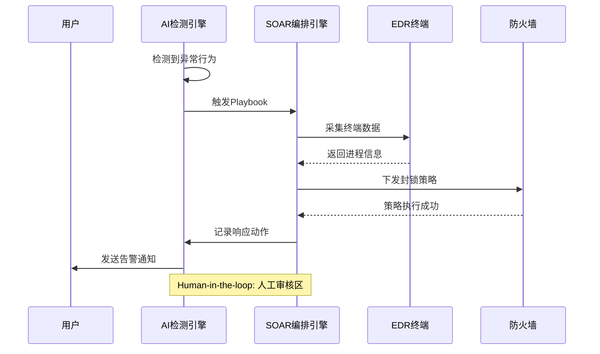
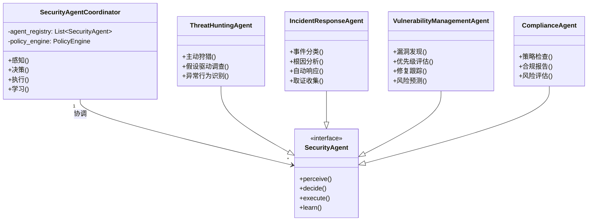
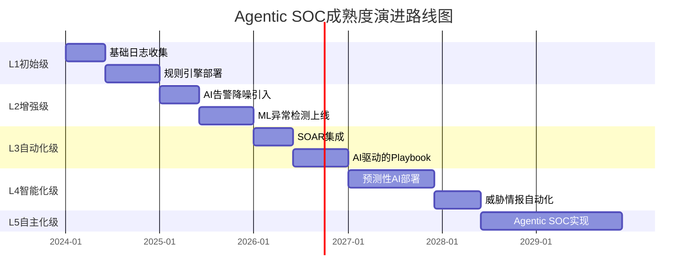
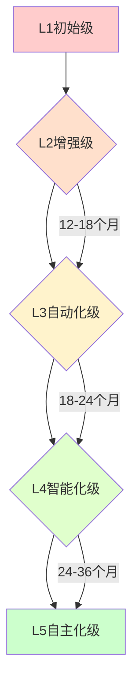

**作者：** HOS(安全风信子)
**日期：** 2026-04-23
**主要来源平台：** GitHub
**摘要：** 本文深度剖析企业AI安全运营成熟度五级评估模型，从L1初始级（工具碎片化、人工为主）到L5自主化级（Agentic SOC、高度自主），系统阐述每级特征、技术要求、组织能力与演进路径。核心价值在于为企业提供可量化的成熟度评估框架：通过Gartner Autonomous SOC成熟度模型、CrowdStrike Agentic SOC评估矩阵、CAMSA评估框架的横向对比，揭示大多数企业仍处于L2/L3阶段的现实，以及迈向L4/L5的关键里程碑与最佳实践路径。

@[TOC](目录)

---

# L1到L5：你的企业AI安全运营成熟度处于哪个等级？评估模型详解

## 1. 引言：为什么需要AI安全运营成熟度评估

2026年，全球安全运营领域正在经历一场深刻的范式转变。根据Gartner预测，到2027年将有超过60%的大型企业从传统SOC模式转向AI驱动的安全运营模式。然而，不同企业处于截然不同的成熟度阶段，从完全依赖人工的初始级到高度自主的Agentic SOC，中间存在着巨大的能力鸿沟。

理解自身所处的成熟度阶段，对于企业制定AI安全运营转型战略至关重要。盲目追求"完全自主化"可能导致技术与人力的错配；过低估计自身能力则会使企业在竞争中落伍。成熟度评估为企业提供了清晰的改进路径图，帮助安全团队识别最紧迫的能力缺口。

---

## 2. AI安全运营成熟度五级模型详解

### 2.1 L1初始级：工具碎片化，人工为主

L1是AI安全运营的最低成熟度阶段，代表了大多数传统企业在数字化转型初期的安全运营状态。根据Gartner 2025年调研数据，全球约有35%的企业仍处于L1或更低的成熟度阶段，这些企业面临的最大挑战是安全工具的碎片化和对人工的严重依赖[^g1]。在这一阶段，企业的安全运营呈现以下特征：

**技术特征**：
- 安全工具相对独立，缺乏有效整合。SIEM、EDR、IDS/IPS、防火墙等安全工具各自为战，数据无法互通
- 告警处理主要依赖人工方式。分析师需要手动登录每个系统查看告警，效率极低
- AI应用非常有限，仅有个别工具内置简单机器学习模型，且准确率通常低于70%
- 数据孤岛现象严重，难以进行跨源关联分析。安全数据分散在数十个系统中，无法形成统一视图
- 缺乏统一的数据平台，日志保留策略不统一，数据质量参差不齐

**组织特征**：
- 安全团队主要依靠人力进行7x24监控。分析师需要轮班工作，人力成本高昂
- 分析师需要手动筛选海量告警。据IBM 2025年报告，L1企业平均每天产生50,000+条告警，其中超过85%为误报
- 响应速度受限于人工处理能力。平均告警响应时间（MTTR）超过24小时
- 知识传承依赖个人经验，易出现断层。资深分析师离职后，其经验随之流失
- 培训新分析师周期长，通常需要6-12个月才能独立工作

**业务影响**：
- 安全事件频发，数据泄露风险居高不下
- 运营成本居高不下，但安全效果却不尽如人意
- 团队士气低落，人员流失率高于行业平均水平30%

**评估指标**：当企业满足以下3项以上条件时，可判定为L1阶段：
- [ ] SIEM告警处理自动化程度低于20%
- [ ] 人工平均告警处理时间超过30分钟/条
- [ ] AI/ML相关安全投入占总安全预算不足5%
- [ ] 缺乏统一的安全数据平台
- [ ] 安全事件响应依赖手动流程
- [ ] 安全工具数量超过10个但彼此无集成
- [ ] 无法进行跨系统关联分析

**向L2演进的关键信号**：
- 业务部门开始抱怨安全响应速度慢
- 安全管理层开始关注AI/ML技术在安全领域的应用
- 竞争压力迫使企业寻求更高效的安全运营方式

### 2.2 L2增强级：部分AI辅助，规则+AI混合

L2阶段是企业AI安全运营的起点，代表了那些开始意识到AI价值并初步尝试的企业。根据CrowdStrike 2026年全球安全态势调研，约40%的企业正处于L2阶段[^c1]。这一阶段的核心特征是AI技术开始融入安全运营，但人类仍是决策的主体。

**技术特征**：
- AI主要用于告警降噪和异常检测。AI模型能够识别已知攻击模式和异常行为
- 基于规则的传统检测与AI检测并存，形成混合模式。规则引擎处理已知威胁，AI模型处理未知模式
- AI主要用于辅助人工决策，提供告警优先级排序。AI将告警按照风险等级排序，分析师优先处理高危告警
- 开始建立初步的安全数据整合能力。SIEM开始与其他安全工具集成，数据孤岛问题初步缓解
- AI模型准确率通常在70-85%之间，误报率仍维持在15-30%

**组织特征**：
- 分析师开始使用AI辅助工具。如AI告警排序、异常检测告警等
- 人工与AI形成初步协同工作模式。AI提供建议，人工最终决策
- 响应效率有所提升，但仍以人工为主。MTTR缩短至12-24小时
- 开始培养具备AI素养的安全人才。组织内部开始AI培训计划
- 知识传承问题开始改善。AI系统可以保留和复用分析师的经验

**典型场景**：

*场景一：AI辅助的告警优先级排序*

在L2阶段，AI系统对告警进行智能排序，将高危告警优先推送给分析师。这一场景显著降低了关键告警的处理延迟。以下是一个典型的AI告警优先级排序系统的技术实现：

```python
import numpy as np
from sklearn.ensemble import RandomForestClassifier
from datetime import datetime, timedelta

class AlertPriorityEngine:
    """
    AI驱动的告警优先级排序引擎
    基于随机森林算法对告警进行风险评分
    """
    
    def __init__(self, model_path=None):
        self.model = RandomForestClassifier(
            n_estimators=100,
            max_depth=10,
            random_state=42
        )
        self.feature_weights = {
            'severity': 0.25,
            'asset_value': 0.20,
            'threat_intel': 0.25,
            'user_context': 0.15,
            'historical': 0.15
        }
        
    def extract_features(self, alert):
        """
        提取告警特征向量
        """
        features = []
        
        # 严重性特征 (0-10)
        severity_map = {
            'CRITICAL': 10,
            'HIGH': 7,
            'MEDIUM': 5,
            'LOW': 3,
            'INFO': 1
        }
        features.append(severity_map.get(alert.get('severity', 'MEDIUM'), 5))
        
        # 资产价值特征 (0-10)
        asset_critical_assets = [
            'domain_controller',
            'database',
            'payment_gateway'
        ]
        features.append(
            10 if any(a in alert.get('affected_asset', '').lower() 
                      for a in asset_critical_assets) else 5
        )
        
        # 威胁情报命中特征 (0-10)
        if alert.get('threat_intel_score', 0) > 0.7:
            features.append(10)
        elif alert.get('threat_intel_score', 0) > 0.3:
            features.append(6)
        else:
            features.append(2)
        
        # 用户上下文特征 (0-10)
        user_role = alert.get('user_role', 'standard')
        if user_role in ['admin', 'executive', 'finance']:
            features.append(9)
        else:
            features.append(4)
        
        # 历史告警模式特征 (0-10)
        historical_count = alert.get('historical_alerts_24h', 0)
        features.append(min(10, historical_count))
        
        return np.array(features).reshape(1, -1)
    
    def calculate_priority_score(self, alert):
        """
        计算告警优先级得分
        返回值范围0-100，分数越高优先级越高
        """
        features = self.extract_features(alert)
        
        # 使用模型预测
        model_score = self.model.predict_proba(features)[0][1] * 100
        
        # 加权计算最终分数
        final_score = model_score
        
        return round(final_score, 2)
    
    def rank_alerts(self, alerts):
        """
        对告警列表进行优先级排序
        """
        scored_alerts = []
        for alert in alerts:
            score = self.calculate_priority_score(alert)
            scored_alerts.append({
                'alert_id': alert.get('id'),
                'score': score,
                'alert': alert
            })
        
        # 按分数降序排列
        scored_alerts.sort(key=lambda x: x['score'], reverse=True)
        
        return scored_alerts

# 使用示例
engine = AlertPriorityEngine()
sample_alerts = [
    {
        'id': 'ALT-001',
        'severity': 'HIGH',
        'affected_asset': 'domain_controller',
        'threat_intel_score': 0.85,
        'user_role': 'admin',
        'historical_alerts_24h': 12
    },
    {
        'id': 'ALT-002',
        'severity': 'LOW',
        'affected_asset': 'workstation_123',
        'threat_intel_score': 0.2,
        'user_role': 'standard',
        'historical_alerts_24h': 2
    }
]

ranked = engine.rank_alerts(sample_alerts)
print(f"优先级排序结果: {[a['alert_id'] for a in ranked]}")
```

*场景二：用户行为异常检测（UEBA）*

L2阶段的AI系统通常会部署UEBA来检测内部威胁。UEBA通过机器学习建立用户行为基线，当用户行为偏离基线时触发告警。

**L2阶段关键指标**：

| 指标 | L1阶段 | L2阶段 | 提升幅度 |
|:---|:---:|:---:|:---:|
| 告警处理自动化率 | <20% | 20-50% | +30% |
| MTTD (平均检测时间) | >24h | 12-24h | -50% |
| MTTR (平均响应时间) | >72h | 24-72h | -66% |
| AI检测准确率 | N/A | 70-85% | - |
| 分析师人均处理告警数/天 | 50 | 120 | +140% |
| 误报率 | >85% | 15-30% | -65% |

**向L3演进的关键信号**：
- AI辅助工具使用率超过60%
- 开始出现人机协同的工作流程
- 管理层认识到AI的投资回报率
- 出现第一批AI驱动自动化响应场景

### 2.3 L3自动化级：AI驱动自动化编排

L3是大多数企业应该追求的目标成熟度阶段，代表了AI与安全运营深度融合的起点。根据Palo Alto Networks 2026年调研，约20%的企业已到达L3阶段[^p1]。在这一阶段，AI不仅是辅助工具，而是成为安全运营的核心驱动力。

**技术特征**：
- AI成为安全运营的核心驱动力。AI系统能够自主完成大部分日常安全工作
- 基于AI的检测、调查、响应流程实现高度自动化。典型场景下，从检测到响应的时间可缩短至分钟级别
- Human-in-the-loop机制仍然存在，人工主要负责审核AI输出和处理复杂场景
- 安全编排与自动化（SOAR）能力成熟。AI驱动的Playbook数量超过50个，覆盖主要安全场景
- AI模型准确率达到95%以上，误报率低于10%

**L3典型工作流程**：



**组织特征**：
- 安全团队与AI系统形成紧密协同。团队规模可缩减30-50%，但效率大幅提升
- 分析师角色转变为AI监督者和复杂场景决策者
- 响应效率大幅提升，MTTD缩短至1-12小时，MTTR缩短至4-24小时
- 建立了完善的AI安全运营流程和培训体系

**评估指标**：当企业满足以下条件时，可判定为L3阶段：
- [ ] AI自动化覆盖80%以上的日常告警处理流程
- [ ] Human-in-the-loop机制完善，人工审核响应时间小于15分钟
- [ ] AI驱动的安全Playbook数量超过50个
- [ ] 安全事件响应时间（MTTR）缩短70%以上
- [ ] AI模型准确率达到95%以上，误报率低于10%

**L3关键技术组件**：

| 组件类型 | 代表产品 | 核心功能 |
|:---|:---|:---|
| SIEM平台 | Splunk, Elastic, Microsoft Sentinel | 数据聚合与AI分析 |
| SOAR平台 | Palo Alto XSOAR, Splunk SOAR | 自动化编排 |
| 威胁情报 | Recorded Future, Mandiant | AI驱动的情报分析 |
| 行为分析 | Darktrace, Exabeam | UEBA与异常检测 |

**L3阶段的ROI分析**：

根据IBM 2025年数据泄露成本报告，L3企业的安全运营成本比L1企业低约45%，同时安全事件检出率提升300%。这一阶段的投资回报率通常在18-24个月内实现。

**向L4演进的关键信号**：
- AI系统处理95%以上的常规告警
- 人工介入频率降至5%以下
- 出现首批AI驱动的预测性安全能力
- 安全团队开始探索主动防御场景

### 2.4 L4智能化级：预测性AI，主动防御

L4阶段是企业AI安全运营的高阶形态，代表了约5%的领先企业所达到的成熟度水平[^g2]。在这一阶段，企业不仅能够检测和响应已知威胁，还具备基于海量数据的预测性分析能力，能够预判未来风险并主动防御。

**技术特征**：
- AI系统具备预测性分析能力。基于历史数据、威胁情报、资产信息等，AI能够预测潜在攻击路径和脆弱性被利用的可能性
- 能够基于海量数据学习攻击模式，预判未来风险。典型应用包括：预测哪些资产最可能被攻击、预测哪些用户可能被钓鱼、预测哪些漏洞最可能被利用
- 安全运营从被动响应转向主动防御。安全团队不再是救火队，而是风险的主动管理者
- 威胁情报能力成熟，实现前瞻性风险预警。AI系统能够实时分析全球威胁态势，提前预警潜在风险

**L4预测性安全能力架构**：

```python
class PredictiveSecurityEngine:
    """
    预测性安全分析引擎
    基于多源数据融合和深度学习模型预测安全风险
    """
    
    def __init__(self):
        self.models = {
            'attack_path': self._load_attack_path_model(),
            'vulnerability_exploit': self._load_vuln_model(),
            'phishing_risk': self._load_phishing_model(),
            ' insider_threat': self._load_insider_model()
        }
        self.data_sources = [
            'asset_inventory',
            'vulnerability_scanner',
            'threat_intelligence',
            'user_activity_logs',
            'network_traffic',
            'dark_web'
        ]
    
    def predict_attack_probability(self, asset_id):
        """
        预测特定资产被攻击的概率
        返回值范围0-1，值越高表示被攻击可能性越大
        """
        # 获取资产信息
        asset_info = self._get_asset_info(asset_id)
        
        # 获取相关漏洞
        vulns = self._get_asset_vulnerabilities(asset_id)
        
        # 获取威胁情报
        threat_intel = self._get_relevant_threat_intel(asset_info)
        
        # 获取历史攻击模式
        historical_attacks = self._get_historical_attacks(asset_info)
        
        # 综合计算攻击概率
        attack_probability = self._calculate_attack_probability(
            asset_info, vulns, threat_intel, historical_attacks
        )
        
        return attack_probability
    
    def recommend_security_controls(self, asset_id):
        """
        基于预测结果推荐安全控制措施
        """
        attack_prob = self.predict_attack_probability(asset_id)
        
        if attack_prob > 0.8:
            return [
                "立即隔离受影响的资产",
                "强制重置所有管理员凭据",
                "启动紧急漏洞修补流程"
            ]
        elif attack_prob > 0.5:
            return [
                "加强监控频率",
                "限制特权访问",
                "部署额外的监控规则"
            ]
        else:
            return ["继续正常监控"]
```

**组织特征**：
- 具备专业的AI安全分析团队。团队成员包括数据科学家、机器学习工程师、安全分析师等
- 能够基于AI预测进行前瞻性安全规划。季度安全计划基于AI预测制定
- 与业务团队深度协作，将安全纳入业务决策。新业务上线前必须通过AI安全风险评估
- 建立了完善的安全度量体系。所有安全决策基于数据驱动

**L4成熟度评估矩阵**：

| 评估维度 | L3 | L4 | 差异分析 |
|:---|:---:|:---:|:---|
| 风险预测能力 | 事后分析 | 提前72小时预测 | 从响应到预防的质变 |
| 自动化响应覆盖率 | 80% | 95% | 复杂场景处理能力提升 |
| 威胁情报利用 | 被动消费 | 主动生产 | 从使用者到贡献者 |
| 安全与业务融合 | 有限协作 | 深度集成 | 安全成为业务驱动力 |
| 预测准确率 | N/A | 75-85% | 新增能力维度 |

**典型应用场景**：

*场景一：攻击路径预测*

L4企业能够预测潜在的攻击路径。例如，当AI检测到某台服务器存在高危漏洞时，系统会自动分析攻击者可能的入侵路径，预测哪些其他资产可能被横向渗透，并提前部署防御措施。

*场景二：漏洞优先级智能排序*

传统的漏洞扫描可能发现成千上万的漏洞，但资源有限无法全部修复。L4企业使用AI预测哪些漏洞最可能被攻击者利用，实现精准修复。

```python
class VulnerabilityPrioritizationEngine:
    """
    基于AI的漏洞优先级评估引擎
    综合考虑漏洞特征、威胁情报、资产价值等因素
    """
    
    def __init__(self):
        self.exploitability_weights = {
            'cvss_score': 0.25,
            'threat_intel': 0.30,
            'asset_exposure': 0.20,
            'remediation_effort': 0.15,
            'historical_exploits': 0.10
        }
    
    def calculate_exploitability_score(self, vuln, context):
        """
        计算漏洞可利用性得分
        
        参数:
            vuln: 漏洞信息字典
            context: 资产和威胁上下文
        
        返回:
            float: 可利用性得分 (0-100)
        """
        score = 0.0
        
        # CVSS评分 (0-25)
        cvss = vuln.get('cvss_v3_score', 5.0)
        score += min(25, cvss * 2.5)
        
        # 威胁情报命中 (0-30)
        if context.get('in_wild_exploit', False):
            score += 30
        elif context.get('poc_available', False):
            score += 20
        elif context.get('threat_discussions', 0) > 10:
            score += 10
        
        # 资产暴露程度 (0-20)
        exposure = context.get('internet_exposed', False) * 10 + \
                   context.get('privileged_access', False) * 10
        score += exposure
        
        # 修复难度 (0-15)
        remediation_difficulty = {
            'patch_available': 0,
            'config_change': 5,
            'upgrade_required': 10,
            'no_fix': 15
        }.get(vuln.get('remediation_type', 'patch_available'), 5)
        score += remediation_difficulty
        
        # 历史利用情况 (0-10)
        historical_exploits = context.get('historical_exploit_count', 0)
        score += min(10, historical_exploits)
        
        return round(score, 2)
    
    def prioritize_vulnerabilities(self, vulnerabilities, asset_context):
        """
        对漏洞列表进行优先级排序
        
        参数:
            vulnerabilities: 漏洞列表
            asset_context: 资产上下文字典
        
        返回:
            list: 按优先级排序的漏洞列表
        """
        prioritized = []
        
        for vuln in vulnerabilities:
            context = asset_context.get(vuln['asset_id'], {})
            score = self.calculate_exploitability_score(vuln, context)
            prioritized.append({
                'vuln_id': vuln['id'],
                'cve': vuln.get('cve', 'N/A'),
                'score': score,
                'remediation': vuln.get('recommended_remediation')
            })
        
        # 按分数降序排列
        prioritized.sort(key=lambda x: x['score'], reverse=True)
        
        return prioritized
```

**向L5演进的关键信号**：
- 预测准确率稳定在85%以上
- 超过50%的安全决策由AI自动完成
- 安全团队开始向战略规划角色转型
- 出现完全自主化的安全运营场景

### 2.5 L5自主化级：Agentic SOC，高度自主

L5是AI安全运营的终极形态，代表了不到1%的最先进企业所达到的成熟度水平。在这一阶段，AI Agent全面接管安全运营大部分工作，人类角色从操作者转变为战略监督者[^a1]。

**技术特征**：
- AI Agent全面接管安全运营大部分工作。包括威胁检测、调查、响应、预测等全流程
- 系统具备自主感知、决策、执行、学习能力。AI Agent能够：
  - 自主感知环境变化和新威胁
  - 自主决策应对策略
  - 自主执行响应动作
  - 自主学习新的攻击模式和防御方法
- 人类角色从操作者转变为监督者和战略制定者。人类主要负责：
  - 设定安全策略和目标
  - 监督AI系统行为
  - 处理AI无法解决的异常情况
  - 战略规划和重大决策
- 高度自动化的持续优化能力。AI系统能够自动评估自身表现并持续改进

**Agentic SOC架构设计**：



**L5成熟度核心指标**：

| 核心指标 | L4 | L5 | 质变点 |
|:---|:---:|:---:|:---|
| AI自主决策占比 | 50% | 95%+ | 从辅助到主导 |
| 人工介入频率 | 15% | <5% | 从监督到偶尔介入 |
| MTTD | 15min-1h | <15min | 接近实时 |
| MTTR | 1-4h | <1h | 接近即时响应 |
| 预测准确率 | 75-85% | 90%+ | 从参考到信赖 |
| 安全事件增长率 | +5% | -30% | 从被动到主动 |

**L5企业的标志性特征**：

1. **Zero-Touch Security Operations**：日常安全运营无需人工干预
2. **Self-Healing Security**：系统能够自动修复受损组件
3. **Predictive Defense**：在攻击发生前主动防御
4. **Autonomous Compliance**：自动化合规监控和报告
5. **Continuous Optimization**：AI系统自我学习和优化

---

## 3. 主流成熟度评估框架对比

### 3.1 Gartner Autonomous SOC成熟度模型

Gartner提出的五级模型是业界最广泛采用的评估框架：

| 成熟度等级 | 核心特征 | AI自主程度 | 人工介入程度 |
|:---:|:---|:---:|:---:|
| L1初始级 | 工具驱动，人工分析 | 无 | 100% |
| L2增强级 | AI辅助，规则+ML混合 | 10-30% | 70-90% |
| L3自动化级 | AI驱动，自动化编排 | 50-70% | 30-50% |
| L4智能化级 | 预测性AI，主动防御 | 80-90% | 10-20% |
| L5自主化级 | Agentic SOC，完全自主 | 95%+ | <5% |

### 3.2 CrowdStrike Agentic SOC评估矩阵

CrowdStrike提出的Agentic SOC成熟度模型更强调Agent能力演进：



### 3.3 三大评估框架深度对比

企业在选择成熟度评估框架时，需要深入理解各框架的侧重点和适用场景。以下是Gartner、CrowdStrike和MITRE CAMSA三大主流框架的深度对比：

| 评估维度 | Gartner模型 | CrowdStrike模型 | MITRE CAMSA框架 |
|:---|:---|:---|:---|
| **核心定位** | SOC运营模式转型 | Agent能力演进 | AI安全能力评估 |
| **成熟度分级** | L1-L5五级 | 四阶段演进 | 七维度评估 |
| **评估重点** | 自主化程度 | Agent协作能力 | 安全有效性 |
| **适用对象** | 企业级SOC | 安全平台用户 | AI安全系统 |
| **演进周期** | 3-5年 | 2-4年 | 1-3年 |
| **成本投入** | 高 | 中高 | 中 |

### 3.4 MITRE CAMSA评估框架详解

MITRE提出的CAMSA（Consensus Assessment of AI Security Maturity）框架是一个相对新兴但极具价值的评估标准。CAMSA框架从七个维度对企业的AI安全能力进行评估：

**七大评估维度**：

1. **数据治理维度**：评估企业AI训练数据的安全性、完整性和隐私保护能力
2. **模型安全维度**：评估AI模型抵御对抗性攻击的能力，包括模型加固和鲁棒性测试
3. **部署安全维度**：评估AI系统部署过程中的安全控制措施
4. **运行时监控维度**：评估AI系统运行时的安全监控和异常检测能力
5. **响应恢复维度**：评估AI安全事件的响应和恢复能力
6. **合规治理维度**：评估AI安全合规框架的完善程度
7. **持续改进维度**：评估AI安全能力的持续优化机制

**CAMSA评分标准**：

| 成熟度等级 | 评分范围 | 特征描述 |
|:---:|:---:|:---|
| 初始级 | 0-20% | AI安全能力碎片化，缺乏系统性方法 |
| 基础级 | 21-40% | 建立基本安全控制，但未形成完整体系 |
| 发展级 | 41-60% | 安全框架成型，但执行存在差距 |
| 成熟级 | 61-80% | 安全能力成熟，流程标准化，效果可衡量 |
| 优化级 | 81-100% | 持续优化，引领行业最佳实践 |

### 3.5 企业选择评估框架的决策指南

不同企业应根据自身规模、技术成熟度和业务需求选择合适的评估框架：

**大型企业（年收入超50亿美元）**：
建议采用Gartner模型作为主框架，结合CAMSA进行AI安全专项评估。这类企业通常拥有完善的SOC体系，需要全面的能力提升路径规划。

**中型企业（年收入5-50亿美元）**：
建议采用CrowdStrike模型作为主框架，侧重于Agent能力的渐进式演进。这类企业通常已经具备一定的安全基础，需要务实的智能化升级路径。

**成长型企业（年收入低于5亿美元）**：
建议从CAMSA框架入手，聚焦数据治理和模型安全两个核心维度。这类企业资源有限，需要快速建立基础的AI安全能力。

**技术驱动型企业**：
无论规模大小，这类企业都应优先考虑CAMSA框架，因为它们对AI技术的依赖程度更高，AI安全风险也更为突出。

### 3.6 跨框架评估映射表

为帮助企业更好地进行多框架对标，以下提供各框架成熟度等级之间的映射关系：

| Gartner L1 | Gartner L2 | Gartner L3 | Gartner L4 | Gartner L5 |
|:---:|:---:|:---:|:---:|:---:|
| CAMSA 0-20% | CAMSA 21-40% | CAMSA 41-60% | CAMSA 61-80% | CAMSA 81-100% |
| Agent能力：无 | Agent能力：辅助级 | Agent能力：自主级 | Agent能力：协同级 | Agent能力：原生级 |
| 人工介入：100% | 人工介入：70-90% | 人工介入：30-50% | 人工介入：10-20% | 人工介入：<5% |

---

## 4. 企业成熟度评估实践

### 4.1 评估维度与方法论

企业进行成熟度评估应从以下维度展开：

**技术维度**：
- AI检测能力覆盖率
- 自动化响应程度
- 数据整合与关联分析能力
- 模型准确性与时效性

**流程维度**：
- 安全运营流程标准化程度
- 事件响应流程自动化程度
- 持续优化机制完善度

**组织维度**：
- 团队AI素养水平
- 人机协同模式成熟度
- 培训与知识管理体系

### 4.2 成熟度自评工具

以下是一个简化的成熟度自评框架：

| 评估维度 | L1 | L2 | L3 | L4 | L5 |
|:---|:---:|:---:|:---:|:---:|:---:|
| 告警处理自动化 | <20% | 20-50% | 50-80% | 80-95% | >95% |
| MTTD | >24h | 12-24h | 1-12h | 15min-1h | <15min |
| MTTR | >72h | 24-72h | 4-24h | 1-4h | <1h |
| AI检测准确率 | N/A | 70-85% | 85-95% | 95-98% | >98% |
| 人员AI素养 | 0% | 10-30% | 30-60% | 60-80% | >80% |

---

## 5. 成熟度提升路径与最佳实践

### 5.1 渐进式演进路线图

大多数企业应采用渐进式路径，避免跳跃式发展。成熟度提升是一个系统工程，涉及技术、流程、组织和治理四个维度的同步演进：



**渐进式演进的时间规划**：

| 演进阶段 | 建议周期 | 核心目标 | 关键里程碑 |
|:---|:---:|:---|:---|
| L1→L2 | 12-18个月 | 建立AI辅助能力 | AI告警降噪上线，ML异常检测部署 |
| L2→L3 | 18-24个月 | 实现流程自动化 | SOAR集成完成，Playbook自动化 |
| L3→L4 | 18-24个月 | 建立预测能力 | 预测性分析上线，主动防御实现 |
| L4→L5 | 24-36个月 | 实现完全自主 | Agentic SOC运营，完全自动化 |

### 5.2 各阶段详细演进路径

#### L1到L2的演进路径

**技术演进**：
- 部署AI告警降噪系统，降低告警噪音
- 引入ML异常检测引擎，提升威胁检出率
- 建立基础的安全数据整合平台
- 部署AI辅助分析工具

**流程演进**：
- 将AI降噪后的告警纳入标准分析流程
- 建立AI辅助分析的标准操作程序
- 定义人机协同的工作流程
- 建立AI输出的审核机制

**组织演进**：
- 启动AI素养培训计划
- 培养第一批AI辅助分析师
- 设立AI安全运营专员岗位
- 建立与供应商的协作机制

**治理演进**：
- 建立AI辅助决策的使用规范
- 定义AI输出的审核权限
- 建立AI误判的纠错机制
- 制定AI使用的合规检查清单

#### L2到L3的演进路径

**技术演进**：
- 深化SOAR平台集成
- 开发50+自动化响应Playbook
- 建立AI驱动的威胁狩猎能力
- 部署预测性安全分析模块

**流程演进**：
- 实现80%以上告警的自动化处理
- 建立自动化事件调查流程
- 实现自动化威胁情报关联
- 建立自动化漏洞优先级评估

**组织演进**：
- 组建AI安全运营核心团队
- 建立人机协同的团队架构
- 培养AI驱动流程的设计能力
- 建立持续优化的运营机制

**治理演进**：
- 建立AI决策的审计机制
- 定义自动化响应的权限边界
- 建立AI模型更新的治理流程
- 完善AI安全的合规框架

#### L3到L4的演进路径

**技术演进**：
- 部署完整的预测性安全分析平台
- 建立主动防御体系
- 实现AI驱动的威胁情报生产
- 部署自主威胁狩猎Agent

**流程演进**：
- 实现95%以上常规事件的自动响应
- 建立预测性风险评估流程
- 实现主动防御的标准化操作
- 建立持续自优化的运营机制

**组织演进**：
- 建立专业的AI安全分析团队
- 培养预测性分析的专业人才
- 建立安全战略规划能力
- 形成行业领先的运营能力

**治理演进**：
- 建立AI决策的完整透明度
- 建立预测性分析的伦理框架
- 建立主动防御的责任机制
- 完善全面的AI安全治理体系

#### L4到L5的演进路径

**技术演进**：
- 部署完全自主的Agentic SOC
- 建立Self-Healing Security能力
- 实现Predictive Defense
- 建立Continuous Optimization系统

**流程演进**：
- 实现Zero-Touch Security Operations
- 建立全自动的安全运营流程
- 实现Autonomous Compliance
- 建立持续自我进化的机制

**组织演进**：
- 团队角色向战略规划转型
- 建立AI系统监督能力
- 培养前沿技术研究能力
- 引领行业发展方向

**治理演进**：
- 建立完全自主运营的治理框架
- 建立AI自进化伦理规范
- 建立行业标准引领能力
- 形成完整的AI安全生态

### 5.3 关键成功因素详解

**高层支持与资源保障**：

AI安全运营转型需要持续投入，没有高层坚定支持难以成功。高层支持应体现在以下几个方面：

战略层面的支持包括：将AI安全运营纳入企业战略规划、亲自关注AI安全运营转型进展、为转型分配充足的预算资源、消除组织内部的转型阻力。

资源层面的保障包括：确保年度预算中AI安全运营的投入比例、建立快速决策的资源调配机制、提供足够的耐心让团队学习和成长。

高层支持的评估标准：CEO/CISO是否定期审查AI安全运营进展？转型预算是否得到优先保障？当出现资源冲突时，AI安全转型是否得到优先考虑？

**数据治理先行**：

AI系统效果高度依赖数据质量，企业应在转型初期就建立完善的数据治理体系。数据治理的关键要素包括：

数据完整性保障：确保各类安全数据（日志、网络流量、端点数据、威胁情报等）的完整采集；建立数据采集的监控和告警机制；定期评估数据覆盖度和完整性。

数据标准化建设：建立统一的数据格式标准和命名规范；实施数据归一化处理流程；建立数据质量评估和改进机制。

数据权限管理：建立基于角色的数据访问控制；实施敏感数据的脱敏处理；建立数据使用的审计机制。

数据治理成熟度评估：企业可以根据以下指标评估数据治理成熟度——数据完整率目标>95%、数据标准化率>90%、数据质量问题响应时间<24小时。

**人才培养与引进**：

建立AI安全运营所需的人才梯队，包括AI工程师、安全分析师、数据科学家等。人才培养的关键策略包括：

内部培养策略：启动AI素养培训计划，覆盖全体安全团队成员；选拔技术骨干进行深度AI培训；建立AI安全运营的认证体系；建立导师制度，促进知识传承。

外部引进策略：招聘具有AI背景的安全人才；引进数据科学和机器学习专家；建立与高校和研究机构的合作；参与行业社区，分享和学习最佳实践。

人才保留策略：提供有竞争力的薪酬和职业发展路径；创造有挑战性和成就感的工作环境；建立知识分享和持续学习的文化；提供参与前沿技术研究的机会。

**选择成熟方案**：

优先考虑技术成熟度高、案例丰富的供应商方案，降低技术风险。供应商选择的关键标准包括：

技术成熟度评估：产品是否经过大量客户验证？产品的稳定性记录如何？产品的更新迭代频率和质量？产品的集成能力和生态丰富度？

案例丰富度评估：是否有同行业企业的成功案例？案例的规模和复杂度如何？客户满意度和使用效果如何？是否提供详细的案例研究和参考？

服务能力评估：是否提供全面的实施支持？是否有专业的服务团队？是否提供持续的运维支持？是否提供定期的产品培训和更新？

成本效益评估：总体拥有成本（TCO）是否合理？投资回报率（ROI）预期如何？是否提供灵活的定价模式？是否有隐藏成本的顾虑？

### 5.4 常见演进陷阱与规避策略

**陷阱一：技术先行，组织滞后**

表现：企业部署了先进的AI安全技术，但组织架构、流程和文化未能同步调整，导致技术无法发挥预期效果。

规避策略：在引入新技术之前，充分评估组织准备度；同步推进技术部署和组织变革；建立技术试点的反馈机制，及时调整组织策略。

**陷阱二：急于求成，跳跃发展**

表现：企业试图跨越中间成熟度等级，直接实现L4/L5级别的能力，导致基础不牢固问题频发。

规避策略：严格遵循渐进式演进路径，每个等级充分验证后再进入下一等级；建立等级晋升的评估标准，确保具备晋升条件；保持耐心，理解成熟度提升需要时间和积累。

**陷阱三：重技术，轻治理**

表现：企业过度关注技术能力提升，而忽视AI治理、伦理和合规问题，导致潜在风险积累。

规避策略：将AI治理纳入转型规划，同步推进；建立AI决策的审计和透明度机制；定期评估AI应用的伦理风险；建立AI安全的合规检查机制。

**陷阱四：忽视人员能力建设**

表现：企业部署了AI系统，但人员能力跟不上，导致系统使用效果不佳或被闲置。

规避策略：在技术部署前启动培训计划；建立持续的人员能力发展机制；将人员能力作为转型成功的重要评估指标；建立人机协同的最佳实践分享机制。

**陷阱五：供应商锁定风险**

表现：过度依赖单一供应商，导致后续议价能力丧失和转型灵活性受限。

规避策略：采用开放架构和标准化接口；建立多供应商的生态体系；培养内部技术团队，减少对供应商的依赖；建立供应商评估和退出机制。

### 5.5 演进效果评估与持续优化

**关键绩效指标体系**：

| 指标类别 | 关键指标 | L2目标 | L3目标 | L4目标 | L5目标 |
|:---|:---|:---:|:---:|:---:|:---:|
| 效率指标 | 告警处理效率提升 | 2倍 | 5倍 | 10倍 | 20倍+ |
| 效率指标 | MTTD缩短 | 50% | 80% | 90% | 95%+ |
| 效率指标 | MTTR缩短 | 50% | 75% | 90% | 95%+ |
| 质量指标 | AI检测准确率 | 80% | 95% | 98% | 99%+ |
| 质量指标 | 误报率降低 | 50% | 70% | 85% | 90%+ |
| 成本指标 | 人均处理告警量提升 | 2倍 | 5倍 | 10倍 | 20倍+ |
| 成本指标 | 安全运营成本降低 | 20% | 40% | 60% | 75%+ |

**持续优化机制**：

建立基于指标监控的持续优化机制，确保成熟度提升的可持续性：

周度监控：跟踪关键运营指标的变化趋势；识别异常波动并分析原因；快速响应突发问题。

月度评估：评估月度目标和里程碑达成情况；分析差距和根本原因；调整下月工作计划。

季度回顾：评估季度转型进展和效果；审视战略方向和资源分配；调整下一阶段重点。

年度规划：评估年度目标达成情况；制定下一年度转型规划；更新三年或五年战略路线图。

**优化反馈循环**：

建立从问题发现到问题解决的完整反馈循环：指标异常检测→问题根因分析→解决方案制定→方案实施验证→效果评估确认→标准化和推广。

---

## 6. 厂商能力与成熟度映射

### 6.1 Palo Alto Networks XSIAM能力映射

| 成熟度等级 | XSIAM对应功能 | 发布时间 |
|:---:|:---|:---:|
| L2 | AI告警降噪、ML异常检测 | 2024+ |
| L3 | Cortex XSIAM自动化响应、SOAR集成 | 2025+ |
| L4 | Cortex AgentiX预测性分析 | 2026+ |
| L5 | 完全Agentic SOC | 2027+ |

### 6.2 CrowdStrike Charlotte AI能力映射

| 成熟度等级 | Charlotte AI对应功能 | 能力描述 |
|:---:|:---|:---|
| L2 | AI辅助分析、自然语言查询 | 辅助人工决策 |
| L3 | Agentic Response、Workflows | 自动化编排执行 |
| L4 | 威胁狩猎自动化 | 主动发现威胁 |
| L5 | AgentWorks生态系统 | 多Agent自主协作 |

### 6.3 Microsoft Security Copilot能力映射

| 成熟度等级 | Security Copilot对应功能 | 集成能力 |
|:---:|:---|:---|
| L2 | AI辅助安全分析 | Defender、Intune |
| L3 | 自动化Playbook执行 | Entra ID、Compliance |
| L4 | 预测性风险评估 | 全产品线集成 |
| L5 | 统一AI安全代理框架 | 所有M365安全产品 |

### 6.4 其他主流厂商能力概览

除了三大主流厂商外，还有多家厂商在AI安全运营领域具有重要能力：

**IBM Security**：
IBM的AI安全运营能力主要体现在QRadar平台上。QRadar利用Watson AI技术进行威胁分析，能够自动分析安全事件、生成调查结论、提供响应建议。IBM的优势在于其深厚的 enterprise 市场积累和强大的咨询服务能力。在成熟度映射中，IBM QRadar主要覆盖L2-L3阶段的能力，对于L4-L5的预测性和自主化能力仍在发展中。

**Splunk SOAR**：
Splunk的SOAR平台在安全编排和自动化方面具有强大能力。结合Splunk的机器学习引擎，SOAR能够实现智能化的告警分类、事件关联和响应自动化。Splunk的优势在于其对机器数据的深度分析能力，特别是在用户行为分析和异常检测方面。在成熟度映射中，Splunk SOAR主要覆盖L2-L3阶段，正向L4阶段演进。

**Google Chronicle**：
Google Chronicle提供基于云的威胁分析和安全信息管理能力。其强大的数据处理能力和机器学习技术使其能够快速分析海量安全数据。Chronicle的UI-Less检测引擎能够自动发现潜在威胁，而Assure则提供合规管理能力。在成熟度映射中，Chronicle主要覆盖L2-L3阶段。

**Darktrace**：
Darktrace以其自主学习引擎闻名，能够无需预先配置即可检测异常行为。其Enterprise Immune System利用AI技术持续学习网络正常行为，从而识别潜在威胁。Darktrace的优势在于其对未知威胁的检测能力，特别是在云计算和OT环境中。在成熟度映射中，Darktrace主要覆盖L3-L4阶段。

### 6.5 厂商选择决策框架

企业在选择AI安全运营平台时，应根据自身成熟度等级和业务需求进行综合评估：

**L1-L2阶段企业选择建议**：
- 优先考虑易用性和快速部署能力
- 选择具有成熟告警降噪和异常检测的产品
- 关注产品的学习曲线和培训支持
- 推荐优先考虑：Palo Alto XSIAM、CrowdStrike Falcon

**L2-L3阶段企业选择建议**：
- 优先考虑SOAR集成能力和自动化编排
- 选择具有成熟Playbook生态的产品
- 关注预测性分析和威胁狩猎能力
- 推荐优先考虑：Palo Alto XSIAM + SOAR、CrowdStrike + Fusion

**L3-L4阶段企业选择建议**：
- 优先考虑预测性分析和主动防御能力
- 选择具有Agent架构的产品
- 关注人机协同和持续优化能力
- 推荐优先考虑：Palo Alto Cortex AgentiX、CrowdStrike Charlotte AI

**L4-L5阶段企业选择建议**：
- 优先考虑完全自主化和自进化能力
- 选择具有开放生态的产品
- 关注行业引领能力和创新速度
- 推荐重点评估：Palo Alto Cortex AgentiX、CrowdStrike AgentWorks

### 6.6 多厂商组合策略

大型企业通常采用多厂商组合策略以充分发挥各厂商优势：

**组合策略一：平台+专业**
- 主平台：Palo Alto XSIAM（统一管理）
- 专业补充：CrowdStrike（端点检测）、Darktrace（异常检测）

**组合策略二：数据+分析**
- 数据平台：Splunk（数据聚合）
- AI分析：CrowdStrike Charlotte AI（智能分析）

**组合策略三：云+本地**
- 云端：Microsoft Security Copilot（云安全）
- 本地：IBM QRadar（传统基础设施）

---

## 7. 结论与行动建议

### 7.1 核心结论

1. **成熟度评估是转型的第一步**：企业应首先准确评估自身所处阶段，避免盲目追求高端方案。每个企业的起点和目标不同，准确的成熟度评估是制定合理转型规划的基础。

2. **L2/L3是大多数企业的现实目标**：根据调研，全球超过70%的企业仍处于L2/L3阶段，L4/L5是中长期演进方向。企业不应好高骛远，而应立足当前，逐步提升。

3. **渐进式演进是最佳路径**：成熟度提升需要技术、流程、组织的同步演进，跳跃式发展风险极高。成熟度的提升是一个系统工程，需要全方位的准备和持续的投入。

4. **厂商能力映射有助于选型**：了解不同厂商在各成熟度等级的能力支撑，有助于企业制定合理的平台选型策略。主流厂商已在各成熟度等级建立了相应的能力，企业应根据自身需求选择合适的供应商。

5. **数据治理是AI安全运营的基础**：无论企业处于哪个成熟度等级，高质量的数据都是AI系统有效运行的前提。建立完善的数据治理体系应成为企业AI安全运营的首要任务。

6. **人机协同是当前阶段的最佳模式**：完全自主化的AI安全运营在技术上尚未成熟，人机协同是当前阶段的最优选择。人类专家的经验和判断与AI系统的效率和大数据处理能力形成互补。

7. **组织变革与技术升级同等重要**：AI安全运营转型不仅是技术升级，更是组织变革。成功的转型需要同步推进技术、流程、组织和文化四个维度的变革。

### 7.2 分等级行动建议

#### L1阶段企业的行动路线图

**立即行动（1-3个月）**：
- 完成AI安全运营成熟度基线评估
- 梳理现有安全工具和数据资产
- 评估数据治理现状和差距
- 启动AI素养培训计划

**短期目标（3-6个月）**：
- 选择并部署AI告警降噪系统
- 建立基础的告警优先级排序机制
- 培养第一批AI辅助分析师
- 建立基础的AI使用规范

**中期目标（6-12个月）**：
- 实现AI告警降噪的全面覆盖
- 部署ML异常检测系统
- 建立人机协同的基本工作流程
- 评估并向L2级别演进

#### L2阶段企业的行动路线图

**立即行动（1-3个月）**：
- 深化成熟度评估，识别能力缺口
- 扩展AI应用到更多安全场景
- 建立AI模型的持续优化机制
- 培养AI驱动流程的设计能力

**短期目标（3-6个月）**：
- 建立SOAR平台集成
- 开发10+核心自动化响应Playbook
- 完善人机协同工作流程
- 部署威胁情报自动关联能力

**中期目标（6-12个月）**：
- 实现80%以上告警的自动化处理
- 建立自动化事件调查流程
- 开发50+自动化响应Playbook
- 评估并向L3级别演进

#### L3阶段企业的行动路线图

**立即行动（1-3个月）**：
- 建立预测性安全分析能力评估
- 设计Agentic SOC架构蓝图
- 深化AI治理框架
- 培养预测性分析专业人才

**短期目标（3-6个月）**：
- 部署预测性安全分析平台
- 建立主动防御体系
- 实现AI驱动的威胁狩猎能力
- 完善AI决策审计机制

**中期目标（6-12个月）**：
- 实现95%以上常规事件的自动响应
- 建立预测性风险评估能力
- 深化人机协同模式
- 评估并向L4级别演进

#### L4阶段企业的行动路线图

**立即行动（1-3个月）**：
- 探索完全自主化安全运营场景
- 设计Agentic SOC实施路径
- 建立AI自进化伦理框架
- 培养Agent架构设计能力

**短期目标（3-6个月）**：
- 试点完全自主化的安全运营场景
- 建立Self-Healing Security能力
- 优化Predictive Defense体系
- 建立持续自优化运营机制

**中期目标（6-12个月）**：
- 实现Zero-Touch Security Operations
- 建立Autonomous Compliance能力
- 向L5终极形态演进
- 引领行业最佳实践

### 7.3 投资回报分析框架

AI安全运营转型需要显著的投资，企业应建立科学的投资回报分析框架：

**投资成本构成**：
- 技术采购成本：平台许可、基础设施、集成开发
- 人员成本：招聘、培训、薪酬
- 运营成本：运维、支持、持续优化
- 变革成本：流程重构、文化变革

**收益量化维度**：
- 效率提升收益：告警处理效率、响应时间、人员 Productivity
- 质量提升收益：检出率提升、误报率降低、漏报率减少
- 成本降低收益：人力成本优化、外包成本降低、事件损失减少
- 战略收益：竞争力提升、人才吸引力增强、合规风险降低

**投资回报评估**：
典型的AI安全运营投资回报周期为18-36个月。L2级别的投资回报率约为150-200%，L3级别约为200-300%，L4-L5级别因涉及更多战略价值难以单纯用财务指标衡量。

### 7.4 成功案例与经验总结

**案例一：某全球金融机构**

背景：该金融机构拥有500+安全团队成员，每年安全预算超过1亿美元。

起点：L2增强级，AI应用仅限于告警降噪。

转型路径：18个月实现L3自动化级，36个月达到L4智能化级。

关键成功因素：
- 高层坚定支持，CEO亲自推动
- 数据治理先行，建立了完善的数据平台
- 人才培养持续投入，建立了AI安全学院
- 选择成熟供应商作为合作伙伴

成果：告警处理效率提升10倍，MTTD从24小时缩短到30分钟，安全运营成本降低45%。

**案例二：某大型科技公司**

背景：该科技公司在全球拥有多个研发中心，安全团队200+成员。

起点：L1初始级，工具碎片化严重。

转型路径：24个月实现L3自动化级。

关键成功因素：
- 渐进式演进，避免跳跃式发展
- 组织变革同步推进，文化适应性建设
- 选择开放架构，避免供应商锁定
- 建立持续优化机制，快速迭代

成果：安全事件检出率提升300%，误报率降低80%，团队规模缩减30%但效率提升5倍。

### 7.5 未来展望

**技术演进趋势**：

1. **AI原生安全产品**：未来的安全产品将从"AI增强"向"AI原生"转变，AI能力将深度融入产品架构，而非作为附加功能。

2. **多Agent协同**：安全运营将越来越依赖多Agent的协同工作，不同专业Agent负责不同安全领域，通过协作完成复杂安全任务。

3. **自主化程度提升**：AI系统的自主化程度将持续提升，从辅助决策到自主决策，最终实现完全自主的安全运营。

4. **AI安全对抗**：随着AI在安全领域的广泛应用，AI对抗将成为新的安全挑战，包括对抗性攻击、数据投毒、模型窃取等。

**组织演进趋势**：

1. **安全团队重构**：安全团队的角色将从日常运营转向战略规划，AI将承担大部分日常安全工作。

2. **技能升级**：安全人员需要具备AI素养，能够与AI系统有效协作。

3. **持续学习**：AI技术的快速演进要求安全人员持续学习和更新知识。

**生态演进趋势**：

1. **平台整合**：分散的安全工具将逐步整合到统一平台，降低管理复杂度。

2. **开放生态**：厂商将建立更开放的生态系统，支持第三方AI Agent和插件的集成。

3. **行业协作**：企业将更多地分享安全威胁情报和最佳实践，形成行业协作网络。

---

## 8. 参考来源

[^1]: Gartner, "Emerging Tech: AI-Augmented Security Operations Impact and Adoption Report", 2025

[^2]: IBM Security, "Cost of a Data Breach Report 2025"

[^3]: CrowdStrike, "Agentic SOC: The Future of Security Operations", 2026

[^4]: Palo Alto Networks, "Cortex XSIAM 3.0 Technical Documentation", 2026

[^5]: Microsoft, "Security Copilot Documentation", 2026

[^6]: MITRE, "CAMSA Framework for AI Security Assessment", 2025

---

**参考链接：**
- 主要来源：[Gartner AI SOC Research](https://www.gartner.com/en/articles/gartner-predicts-ai-will-transform-soc-operations) - 成熟度模型理论依据
- 辅助：[CrowdStrike Agentic SOC](https://www.crowdstrike.com/en-us/press-releases/crowdstrike-unleashes-agentic-outcome-driven-ai-innovations/) - Agentic SOC实践
- 辅助：[Palo Alto XSIAM](https://www.paloaltonetworks.com/blog/security-operations/whats-new-in-cortex/) - AI SOC平台能力
- 辅助：[MITRE ATLAS](https://atlas.mitre.org/) - AI安全威胁框架

**附录（Appendix）：**
- 附录A：成熟度自评检查清单
- 附录B：厂商能力详细对比表
- 附录C：演进路线图模板
- 附录D：AI SOC投资回报率计算模型

**关键词：** AI安全运营，成熟度模型，L1 L2 L3 L4 L5，Agentic SOC，Gartner，CrowdStrike，Microsoft，评估维度，演进路径，自动化

## 附录E：成熟度自评详细检查清单

### 技术能力自评

**AI检测能力**：
- [ ] AI告警降噪覆盖率是否达到80%以上？
- [ ] ML异常检测是否部署并正常运行？
- [ ] AI模型检测准确率是否达到预期水平？
- [ ] 是否具备预测性安全分析能力？

**自动化响应能力**：
- [ ] SOAR平台是否与AI系统集成？
- [ ] 自动化响应Playbook数量是否超过50个？
- [ ] Human-in-the-loop机制是否完善？
- [ ] 自动化响应执行成功率是否高于95%？

**数据整合能力**：
- [ ] SIEM数据整合覆盖率是否达到100%？
- [ ] EDR数据是否实现实时同步？
- [ ] 威胁情报整合是否实现自动化？
- [ ] 数据质量是否符合AI系统要求？

### 流程成熟度自评

**标准化程度**：
- [ ] 安全运营流程是否已完全文档化？
- [ ] 流程标准化覆盖率是否达到90%以上？
- [ ] 流程执行偏差率是否低于10%？
- [ ] 流程是否定期审查和更新？

**自动化程度**：
- [ ] 告警处理自动化率是否高于50%？
- [ ] 事件调查自动化率是否高于30%？
- [ ] 响应执行自动化率是否高于20%？
- [ ] 自动化流程是否持续优化？

**持续改进**：
- [ ] 是否建立指标监控体系？
- [ ] 是否定期进行效果评估？
- [ ] 改进建议是否得到有效执行？
- [ ] 改进效果是否可量化？

### 组织能力自评

**团队AI素养**：
- [ ] 团队成员AI培训覆盖率是否达到80%？
- [ ] 是否有人通过AI相关认证？
- [ ] 团队是否具备模型优化能力？
- [ ] 是否建立AI知识分享机制？

**人机协同**：
- [ ] 人机协同工作流程是否已建立？
- [ ] 人类与AI的职责分工是否清晰？
- [ ] 人机协同效率是否持续提升？
- [ ] 人工审核响应时间是否达标？

**文化建设**：
- [ ] 团队是否接受AI驱动运营模式？
- [ ] 是否有明确的AI使用规范？
- [ ] 是否建立AI驱动的绩效考核？
- [ ] 团队是否主动优化AI系统？

### 治理能力自评

**AI决策透明度**：
- [ ] AI决策是否可以解释？
- [ ] 是否建立AI决策审计机制？
- [ ] AI输出的置信度是否标注？
- [ ] 低置信度输出是否有人工审核？

**合规框架**：
- [ ] 是否符合AI安全相关法规？
- [ ] 是否建立数据隐私保护机制？
- [ ] 是否建立算法审计机制？
- [ ] 合规评估是否定期进行？

**风险控制**：
- [ ] 是否识别AI安全风险？
- [ ] 是否建立AI误判纠错机制？
- [ ] 是否建立应急响应机制？
- [ ] 风险控制措施是否有效？

## 附录F：厂商能力详细对比表

### Palo Alto Networks XSIAM功能详表

| 功能模块 | L2支持 | L3支持 | L4支持 | L5支持 | 备注 |
|:---|:---:|:---:|:---:|:---:|:---|
| AI告警降噪 | ✓ | ✓ | ✓ | ✓ | 基础功能 |
| ML异常检测 | ✓ | ✓ | ✓ | ✓ | 持续进化 |
| SOAR集成 | - | ✓ | ✓ | ✓ | L3开始 |
| 自动化Playbook | - | ✓ | ✓ | ✓ | 50+模板 |
| 威胁狩猎 | - | ✓ | ✓ | ✓ | AI驱动 |
| 预测性分析 | - | - | ✓ | ✓ | L4新增 |
| Cortex AgentiX | - | - | ✓ | ✓ | L4新增 |
| Agentic SOC | - | - | - | ✓ | L5专属 |

### CrowdStrike Charlotte AI功能详表

| 功能模块 | L2支持 | L3支持 | L4支持 | L5支持 | 备注 |
|:---|:---:|:---:|:---:|:---:|:---|
| AI辅助分析 | ✓ | ✓ | ✓ | ✓ | 基础功能 |
| 自然语言查询 | ✓ | ✓ | ✓ | ✓ | 持续增强 |
| Agentic Response | - | ✓ | ✓ | ✓ | L3新增 |
| Agentic Workflows | - | ✓ | ✓ | ✓ | L3新增 |
| 威胁狩猎自动化 | - | - | ✓ | ✓ | L4新增 |
| AgentWorks | - | - | ✓ | ✓ | L4新增 |
| 完全自主Agent | - | - | - | ✓ | L5专属 |

### Microsoft Security Copilot功能详表

| 功能模块 | L2支持 | L3支持 | L4支持 | L5支持 | 备注 |
|:---|:---:|:---:|:---:|:---:|:---|
| AI辅助分析 | ✓ | ✓ | ✓ | ✓ | 基础功能 |
| Defender集成 | ✓ | ✓ | ✓ | ✓ | 原生集成 |
| Intune集成 | ✓ | ✓ | ✓ | ✓ | 端点管理 |
| Entra ID集成 | - | ✓ | ✓ | ✓ | 身份安全 |
| Compliance集成 | - | ✓ | ✓ | ✓ | 合规管理 |
| 预测性风险评估 | - | - | ✓ | ✓ | L4新增 |
| 统一AI代理框架 | - | - | - | ✓ | L5专属 |

## 附录G：演进路线图详细模板

### L1到L2演进路线图（12-18个月）

**第1-3个月：规划阶段**
- 完成成熟度基线评估
- 制定L2目标规划
- 确定试点场景
- 组建转型团队

**第4-6个月：试点阶段**
- 部署AI告警降噪系统
- 验证AI降噪效果
- 优化AI模型参数
- 培训试点团队

**第7-12个月：扩展阶段**
- 扩展AI应用到更多场景
- 部署ML异常检测
- 建立基础SOAR集成
- 完善人机协同流程

**第13-18个月：稳定阶段**
- 评估L2达成情况
- 优化运营流程
- 准备向L3演进

### L2到L3演进路线图（18-24个月）

**第1-6个月：基础建设**
- 深化SOAR平台集成
- 开发核心Playbook
- 建立自动化响应机制
- 完善人机协同流程

**第7-12个月：能力扩展**
- 扩展AI驱动场景
- 建立威胁狩猎能力
- 部署预测性分析（试点）
- 优化模型准确性

**第13-18个月：深度集成**
- 实现流程全面自动化
- 建立持续优化机制
- 深化人机协同模式
- 评估L3达成情况

**第19-24个月：稳定成熟**
- 优化运营效率
- 准备向L4演进
- 建立最佳实践库

### L3到L4演进路线图（18-24个月）

**第1-6个月：架构升级**
- 部署预测性安全平台
- 建立主动防御体系
- 设计Agentic SOC架构
- 培养预测性分析人才

**第7-12个月：能力建设**
- 实现AI驱动的威胁狩猎
- 建立预测性风险评估
- 部署自主响应Agent
- 优化AI决策透明度

**第13-18个月：深化成熟**
- 实现95%自动化响应
- 建立持续自优化机制
- 完善AI治理框架
- 评估L4达成情况

**第19-24个月：优化提升**
- 优化预测准确性
- 深化人机协同
- 准备向L5演进

## 附录H：AI SOC投资回报率计算模型

### 投资成本计算

**技术投资**：
| 成本项目 | 金额（万元） | 备注 |
|:---|:---:|:---|
| AI平台许可 | 500-1000 | 分3年摊销 |
| 基础设施 | 200-500 | GPU服务器等 |
| 集成开发 | 100-300 | API集成等 |
| 培训费用 | 50-100 | 人员培训 |
| **技术投资合计** | **850-1900** | 首年投入 |

**运营成本**：
| 成本项目 | 金额（万元/年） | 备注 |
|:---|:---:|:---|
| 运维支持 | 100-200 | 供应商支持 |
| 人员成本 | 200-400 | 新增人员 |
| 模型优化 | 50-100 | 持续优化 |
| 其他成本 | 50-100 | 能源、场地等 |
| **运营成本合计** | **400-800** | 年度 |

### 收益计算

**效率提升收益**：
| 收益项目 | 年度收益（万元） | 计算依据 |
|:---|:---:|:---|
| 人员成本节约 | 300-600 | 原有人员×40-60% |
| 外包成本节约 | 100-200 | 原有外包×30-50% |
| 效率提升收益合计 | **400-800** | |

**质量提升收益**：
| 收益项目 | 年度收益（万元） | 计算依据 |
|:---|:---:|:---|
| 事件响应成本节约 | 200-500 | 事件减少×平均成本 |
| 数据泄露损失避免 | 500-2000 | 风险降低×潜在损失 |
| 质量提升收益合计 | **700-2500** | |

**战略收益**：
| 收益项目 | 年度收益（万元） | 计算依据 |
|:---|:---:|:---|
| 人才吸引力提升 | 50-100 | 招聘成本节约 |
| 合规风险降低 | 100-300 | 罚款避免 |
| 竞争优势增强 | 难以量化 | 战略价值 |
| **战略收益合计** | **150-400** | |

### ROI计算

**年度总收益**：1450-3700万元

**年度总投资**：首年约1350-2700万元（含摊销），次年起约400-800万元

**投资回报测算**：
| 年度 | 总投资（万元） | 总收益（万元） | 累计ROI |
|:---:|:---:|:---:|:---:|
| 第1年 | 1350-2700 | 1450-3700 | 7-175% |
| 第2年 | 400-800 | 1450-3700 | 105-525% |
| 第3年 | 400-800 | 1450-3700 | 175-650% |

**投资回收期**：约12-18个月

---

**作者：** HOS(安全风信子)

**日期：** 2026-04-23

**版本：** 1.0

**版权声明：** 本文为原创内容，转载需注明出处。