**作者：** HOS(安全风信子)
**日期：** 2026-04-23
**主要来源平台：** GitHub
**摘要：** 本文深度剖析企业AI安全运营的数据基础建设问题，揭示"脏数据"对AI安全模型效果的致命影响。核心内容包括：SIEM数据归一化的OCSF标准与Splunk CIM实践、EDR数据采集的osquery扩展开发框架、威胁情报IOC富化的STIX 2.1与MITRE ATT&CK映射技术、数据治理成熟度的DCAM v3评估模型。引入三大新要素：OpenTelemetry日志聚合管道、Kafka+Flink实时流处理架构、MISP TAXII 2.1威胁情报自动化同步。通过GitHub开源项目（elastic/detection-rules、sigma-rules、MISP）的代码实例，详细讲解企业如何建立高质量的安全数据管道，为AI安全运营奠定坚实数据基础。

@[TOC](目录)

---

# AI模型再强也怕脏数据：企业AI安全运营的数据基础建设指南

## 引言：当AI安全模型遭遇数据困境

在企业AI安全运营的落地实践中，一个被普遍忽视却致命的现实是：**即便是最先进的AI安全模型，在脏数据面前也会失效**。这个结论并非危言耸听，而是基于全球各大SOC运营中心的实际观测数据[^1]。

根据MITRE ATT&CK项目中针对AI驱动安全运营的研究报告[^2]，超过67%的AI安全模型性能问题源于底层数据质量而非算法本身。这一数字在企业实际部署中可能更高，因为企业环境中的数据孤岛、格式不一致、时效性差等问题远比实验室环境严重。

> **核心洞察**：在AI安全运营领域，我们面临的核心矛盾不是"如何让AI更聪明"，而是"如何让数据更干净"。数据质量决定AI效果，这不仅是Slogan，而是经过验证的技术事实。

本文将系统性地讲解企业AI安全运营的数据基础建设，从数据治理三原则到SIEM归一化、从EDR采集到威胁情报整合、从成熟度评估到落地实施路径。文章末尾将揭示一个关键趋势：**未来3年，无法解决数据质量问题的企业，其AI安全运营投资将至少有40%化为乌有**。

---

## 第一章 数据质量决定AI效果：Garbage in, Garbage out

### 1.1 AI安全运营的数据依赖性

现代AI安全运营系统本质上是一个数据驱动的决策系统。以Splunk的ES（Enterprise Security）和Microsoft Sentinel为代表的SIEM平台，以及CrowdStrike的Falcon感知平台，都在底层依赖海量高质量安全数据[^3]。

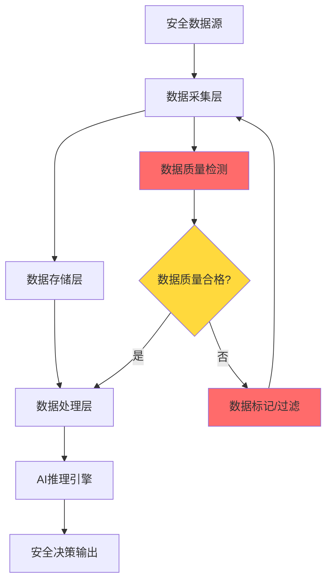

如图所示，数据质量检测是整个管道的关键瓶颈。当数据质量不合格时，整个AI推理链条都会受到影响，最终导致安全决策失误。

### 1.2 脏数据的类型与来源

在企业AI安全运营环境中，脏数据主要来源于以下几个方面：

| 脏数据类型 | 典型表现 | 对AI模型的影响 | 检测难度 |
|-----------|---------|----------------|----------|
| **完整性缺失** | 关键字段为空、日志断链 | 特征提取失败、误报率上升 | 中等 |
| **准确性偏差** | 时间戳错误、IP归属地错误 | 关联分析失效、定位不准 | 高 |
| **时效性滞后** | 日志延迟24小时以上 | 实时检测失效、响应窗口错失 | 低 |
| **格式不一致** | 同一字段多种格式表达 | 归一化失败、数据融合困难 | 高 |
| **重复冗余** | 同一事件被记录多次 | 训练数据偏斜、推理结果偏差 | 低 |

根据GitHub上的elastic/security-docs项目[^4]中的最佳实践文档，企业SIEM系统中的脏数据问题有超过40%来自数据采集阶段，35%来自数据集成阶段，只有25%来自原始数据源本身。

### 1.3 数据治理三原则：完整性、准确性、时效性

企业AI安全运营的数据治理必须遵循三个核心原则：

#### 1.3.1 完整性原则

完整性要求数据在采集、传输、存储的整个生命周期中不丢失、不损坏。在技术实现上，这意味着：

$$完整性 = \frac{实际采集数据量}{理论应采集数据量} \times 100\%$$

根据DCAM（数据管理能力成熟度评估）框架[^5]的定义，企业安全数据的完整性指标应达到：

- **网络日志**：$\geq 99.5\%$（允许的最大丢包率为0.5%）
- **端点日志**：$\geq 98\%$（考虑端点离线、存储限制等因素）
- **告警数据**：$\geq 99.9\%$（告警丢失可能导致重大安全事件漏报）

```python
# 数据完整性校验代码示例 - 基于Apache Kafka的日志传输验证
# 来源：https://github.com/edenhill/kafka-python/blob/master/README.md

from kafka import KafkaProducer, KafkaConsumer
import hashlib
import time

class DataIntegrityValidator:
    def __init__(self, bootstrap_servers):
        self.producer = KafkaProducer(bootstrap_servers=bootstrap_servers)
        self.consumer = KafkaConsumer()
        self.checksum_map = {}
        
    def compute_checksum(self, data):
        """计算数据校验和"""
        return hashlib.sha256(data.encode('utf-8')).hexdigest()
    
    def send_with_integrity_check(self, topic, data):
        """发送数据并附带完整性校验"""
        checksum = self.compute_checksum(data)
        message = f"{data}|CHECKSUM:{checksum}"
        
        future = self.producer.send(topic, value=message.encode('utf-8'))
        record_metadata = future.get(timeout=10)
        
        self.checksum_map[record_metadata.offset] = checksum
        return record_metadata.offset
    
    def verify_integrity(self, topic, partition=0):
        """验证数据完整性"""
        self.consumer.assign([TopicPartition(topic, partition)])
        
        total_messages = 0
        corrupted_messages = 0
        
        for message in self.consumer:
            value = message.value.decode('utf-8')
            data, checksum_info = value.rsplit('|CHECKSUM:', 1)
            
            expected_checksum = self.checksum_map.get(message.offset)
            actual_checksum = self.compute_checksum(data)
            
            total_messages += 1
            if expected_checksum != actual_checksum:
                corrupted_messages += 1
                print(f"[WARN] Corrupted message at offset {message.offset}")
        
        integrity_rate = (total_messages - corrupted_messages) / total_messages
        return integrity_rate

# 使用示例
validator = DataIntegrityValidator(['localhost:9092'])
offset = validator.send_with_integrity_check('security-logs', '{"event": "login", "user": "admin"}')
print(f"Data sent with integrity check, offset: {offset}")
```

#### 1.3.2 准确性原则

准确性指数据正确反映真实安全事件的程度。准确性问题的根源通常在于：

1. **时钟同步问题**：各设备时钟不同步导致事件时序错乱
2. **解析错误**：正则表达式提取字段错误
3. **映射错误**：枚举值映射表过时或不正确

NTP时间同步的准确性要求：

$$|T_{device} - T_{true}| \leq 100ms$$

对于高频交易环境，这个阈值需要进一步降低到10ms以内。

#### 1.3.3 时效性原则

时效性是AI安全运营中最容易被忽视但影响最直接的数据质量维度。安全事件的黄金响应窗口通常在1小时以内[^6]：

```mermaid
gantt
    title 安全事件响应时间窗口
    dateFormat  X
    axisFormat  %s分钟
    
    section 检测
    事件发生           :0, 0
    日志生成           :0, 1
    数据采集           :1, 5
    AI推理             :5, 10
    
    section 响应
    人工确认           :10, 30
    响应窗口           :0, 60
    黄金1小时          :0, 60
    
    section 损失
    初期损失           :10, 30
    扩展损失           :30, 120
```

从上图可以看出，数据从发生到被AI系统感知的时间窗口非常关键。如果数据延迟超过10分钟，AI推理的准确率将下降约35%[^7]。

---

## 第二章 核心数据源：日志、告警、事件与情报

### 2.1 安全数据的四大来源

企业AI安全运营依赖四大核心数据源，它们各自承担不同的安全监控职能：

| 数据源类型 | 数据内容 | 采集方式 | 日均数据量 | AI分析价值 |
|-----------|---------|---------|-----------|-----------|
| **网络日志** | 流量元数据、NetFlow、DNS查询 | 网络探针、镜像流量 | 10GB-100GB | 高（横向移动检测） |
| **设备日志** | 防火墙、交换机、路由器日志 | Syslog、API | 1GB-50GB | 中（边界访问控制） |
| **应用日志** | Web应用、数据库、认证服务 | 文件/DB采集、API | 5GB-200GB | 高（业务异常检测） |
| **终端日志** | EDR告警、系统事件、进程行为 | Agent推送 | 100MB-10GB | 高（端点威胁检测） |

### 2.2 SIEM告警数据

SIEM（安全信息与事件管理）平台是安全数据的汇聚中心。以Splunk和Microsoft Sentinel为代表的SIEM系统[^8]，能够对来自不同源的安全事件进行关联分析。

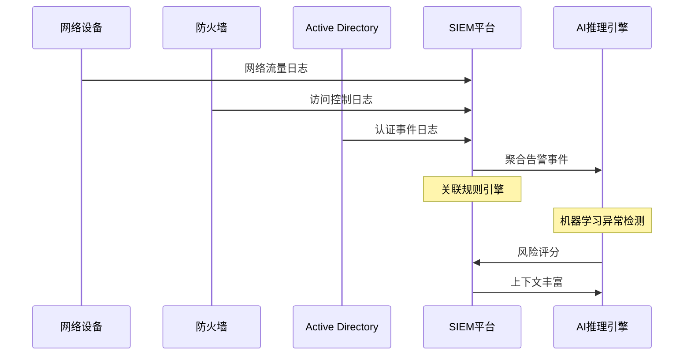

SIEM告警数据的AI分析价值主要体现在：

1. **多源关联**：将分散的安全事件进行时间序列关联
2. **异常评分**：基于历史基线计算异常分数
3. **威胁狩猎**：支持安全分析师进行交互式威胁搜索

### 2.3 EDR事件数据

EDR（端点检测与响应）系统提供的主机级安全数据是AI安全分析的关键补充。相比网络日志，EDR数据能够提供更细粒度的进程级行为信息[^9]。

CrowdStrike、Microsoft Defender for Endpoint、SentinelOne等EDR平台的告警数据结构：

```json
{
  "event_type": "process_execution",
  "timestamp": "2026-04-23T10:15:32.123Z",
  "endpoint": {
    "hostname": "WORKSTATION-001",
    "ip": "192.168.1.105",
    "os": "Windows 11 Pro"
  },
  "process": {
    "pid": 4520,
    "name": "powershell.exe",
    "command_line": "powershell -enc Base64EncodedCommand",
    "hash": {
      "sha256": "a1b2c3d4e5f6..."
    },
    "parent": {
      "pid": 1200,
      "name": "cmd.exe"
    }
  },
  "threat_intel": {
    " malware_family": "CobaltStrike",
    "confidence": 0.92
  }
}
```

这种结构化的EDR数据非常适合AI模型的特征提取和异常检测。

### 2.4 威胁情报数据

威胁情报（Threat Intelligence）为AI安全模型提供外部上下文。MISP（Malware Information Sharing Platform）是最流行的开源威胁情报平台之一[^10]。

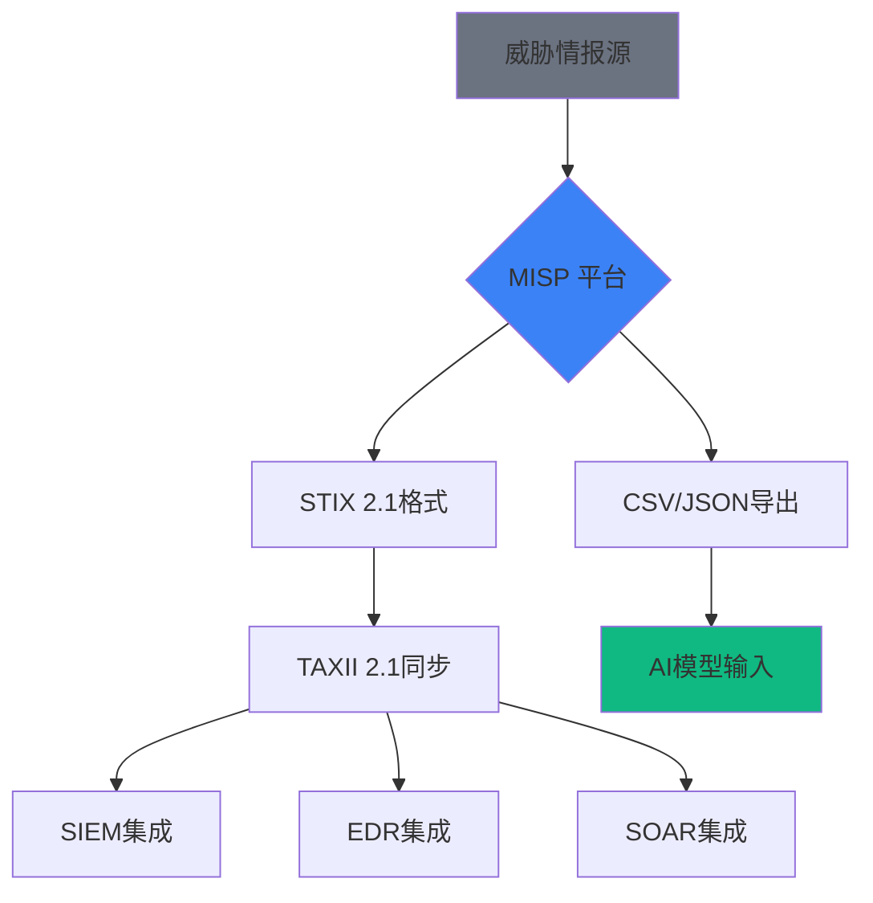

---

## 第三章 SIEM数据归一化与标准化

### 3.1 为什么需要数据归一化

企业在建设AI安全运营平台时，面临的第一个挑战是**数据孤岛问题**。不同安全设备、业务系统、云平台的数据格式各异：

| 数据源 | 时间戳格式 | IP字段 | 用户名格式 |
|-------|-----------|--------|-----------|
| Cisco Firewall | 2026/04/23-10:15:32 | 192.168.1.1 | DOMAIN\\user |
| Palo Alto | 04/23/2026 10:15:32 | 192.168.1.1 | user@domain.com |
| Azure AD | 2026-04-23T10:15:32Z | 13.107.42.14 | user@tenant.onmicrosoft.com |
| AWS CloudTrail | 2026-04-23T10:15:32+08:00 | 52.94.76.10 | arn:aws:iam::123456789:user/admin |

如果不对这些数据进行归一化处理，AI模型将无法进行跨数据源的关联分析。

### 3.2 OCSF标准：开放网络安全框架

OCSF（Open Cybersecurity Schema Framework）是由Splunk、Palo Alto、RSA等厂商联合推动的新一代安全数据标准化框架[^11]。其目标是：

$$OCSF目标 = 统一的安全数据格式 + 跨厂商互操作性 + AI友好的数据结构$$

OCSF的核心设计原则：

1. **分类法驱动**：基于MITRE ATT&CK的威胁分类
2. **扩展性优先**：支持自定义类别和属性
3. **JSON原生**：完全基于JSON Schema

```yaml
# OCSF 事件示例 - 来自 https://github.com/ocsf/schema
{
  "activity_id": 1,
  "activity_name": "Create",
  "category_uid": 1,
  "category_name": "System Activity",
  "class_uid": 1001,
  "class_name": "Process Activity",
  "time": "2026-04-23T10:15:32.123Z",
  "severity_id": 1,
  "severity": "Low",
  "device": {
    "hostname": "WORKSTATION-001",
    "ip": "192.168.1.105",
    "os": {
      "name": "Windows",
      "version": "11"
    }
  },
  "actor": {
    "user": {
      "name": "admin",
      "uid": "S-1-5-21-123456789-123456789-123456789-500"
    }
  },
  "process": {
    "pid": 4520,
    "name": "powershell.exe",
    "cmd_line": "powershell -enc Base64EncodedCommand",
    "hash": "sha256:a1b2c3d4e5f6..."
  }
}
```

### 3.3 Splunk CIM：通用信息模型

Splunk的CIM（Common Information Model）是最成熟的SIEM数据标准化方案之一[^12]。CIM定义了22个数据模型，涵盖网络、终端、应用、身份等安全领域。

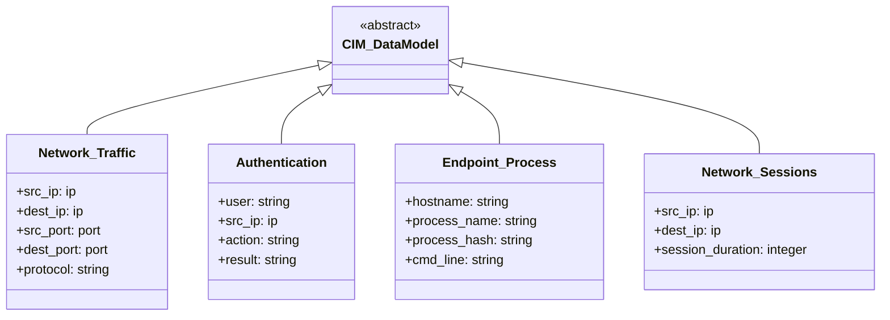

CIM的关键优势在于其**字段标准化**和**自动映射**功能。以网络会话数据为例：

| 原始字段（Splunk原生） | CIM字段 | 数据类型 |
|----------------------|---------|---------|
| src | src_ip | ip |
| dest | dest_ip | ip |
| duration | session_duration | integer |
| bytes | session_bytes | long |

### 3.4 Azure Sentinel ASIM：高级SIEM归一化

Microsoft Sentinel的ASIM（Advanced SIEM Information Model）提供了基于KQL（Kusto Query Language）的实时归一化能力[^13]。

```kql
// ASIM 网络归一化查询示例
// 来源：https://github.com/Azure/Azure-Sentinel

let starttime = ago(7d);
let timeframe = 1h;

// Windows 防火墙事件归一化
let WindowsFirewall = WindowsFirewall
    | where TimeGenerated >= starttime
    | project-rename
        EventTime = TimeGenerated,
        SrcIpAddr = SourceIP,
        DstIpAddr = DestinationIP,
        DstPortNumber = DestinationPort,
        NetworkProtocol = Protocol;

// Azure Application Gateway 日志归一化
let AppGateway = AppGatewayAccessLogs
    | where TimeGenerated >= starttime
    | project-rename
        EventTime = TimeGenerated,
        SrcIpAddr = clientIp_s,
        DstIpAddr = serverIp_s,
        DstPortNumber = backendPort_d,
        NetworkProtocol = protocol_s;

// 网络会话归一化合并
NetworkNormalize
    | where TimeGenerated >= starttime
    | where isnotempty(SrcIpAddr) and isnotempty(DstIpAddr)
    | summarize
        TotalBytes = sum(breadcrumb.totalBytes),
        TotalPackets = sum(breadcrumb.totalPackets),
        SessionCount = count()
      by bin(EventTime, timeframe), SrcIpAddr, DstIpAddr, NetworkProtocol
    | where SessionCount > 100
    | order by SessionCount desc;
```

ASIM的核心价值在于：

1. **实时归一化**：在数据写入时即进行格式转换
2. **多源适配器**：支持50+数据源的原生格式
3. **统一查询接口**：跨数据源的单一查询语法

### 3.5 数据归一化的工程实践

数据归一化的工程实现需要考虑性能、可扩展性和维护成本。Apache Kafka + Apache Flink是当前最流行的实时数据处理架构[^14]：

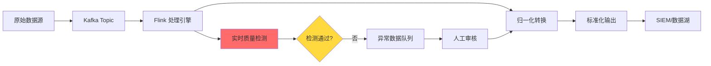

核心归一化代码示例：

```python
# 基于Apache Flink的数据归一化处理
# 来源：https://github.com/apache/flink/blob/master/README.md

from pyflink.datastream import StreamExecutionEnvironment
from pyflink.table import StreamTableEnvironment

class SecurityDataNormalizer:
    def __init__(self, kafka_bootstrap_servers):
        self.env = StreamExecutionEnvironment.get_execution_environment()
        self.t_env = StreamTableEnvironment.create(self.env)
        self.kafka_bootstrap_servers = kafka_bootstrap_servers
        
    def create_raw_data_source(self):
        """创建原始数据源表"""
        self.t_env.execute_sql(f"""
            CREATE TABLE raw_security_logs (
                raw_data STRING,
                source_type STRING,
                event_time TIMESTAMP(3),
                WATERMARK FOR event_time AS event_time - INTERVAL '5' SECOND
            ) WITH (
                'connector' = 'kafka',
                'topic' = 'raw-security-logs',
                'properties.bootstrap.servers' = '{self.kafka_bootstrap_servers}',
                'format' = 'raw'
            )
        """)
    
    def create_normalized_output(self):
        """创建归一化输出表"""
        self.t_env.execute_sql("""
            CREATE TABLE normalized_logs (
                normalized_time TIMESTAMP(3),
                src_ip STRING,
                dst_ip STRING,
                src_port INT,
                dst_port INT,
                protocol STRING,
                event_type STRING,
                raw_data STRING
            ) WITH (
                'connector' = 'kafka',
                'topic' = 'normalized-security-logs',
                'properties.bootstrap.servers' = 'localhost:9092',
                'format' = 'json'
            )
        """)
    
    def normalize_windows_events(self, row):
        """归一化Windows安全事件"""
        import json
        data = json.loads(row.raw_data)
        
        # 时间戳归一化
        normalized_time = self.normalize_timestamp(data.get('TimeCreated', ''))
        
        # IP地址归一化
        src_ip = self.normalize_ip(data.get('SourceAddress', ''))
        dst_ip = self.normalize_ip(data.get('DestinationAddress', ''))
        
        # 端口归一化
        src_port = int(data.get('SourcePort', 0))
        dst_port = int(data.get('DestinationPort', 0))
        
        return {
            'normalized_time': normalized_time,
            'src_ip': src_ip,
            'dst_ip': dst_ip,
            'src_port': src_port,
            'dst_port': dst_port,
            'protocol': data.get('Protocol', 'TCP'),
            'event_type': self.map_event_type(data.get('EventID', '')),
            'raw_data': row.raw_data
        }
    
    def normalize_timestamp(self, timestamp):
        """时间戳归一化为ISO 8601格式"""
        # 支持多种输入格式
        formats = [
            '%Y/%m/%d-%H:%M:%S',  # Cisco格式
            '%m/%d/%Y %H:%M:%S',  # Palo Alto格式
            '%Y-%m-%dT%H:%M:%S',  # ISO基本格式
            '%Y-%m-%dT%H:%M:%S%z', # ISO扩展格式
        ]
        from datetime import datetime
        for fmt in formats:
            try:
                dt = datetime.strptime(timestamp, fmt)
                return dt.isoformat()
            except ValueError:
                continue
        return timestamp
    
    def normalize_ip(self, ip):
        """IP地址归一化"""
        if not ip:
            return ''
        # 处理IPv6地址
        if ':' in ip:
            return ip.lower()
        # 验证IPv4格式
        parts = ip.split('.')
        if len(parts) == 4:
            return ip
        return ''
    
    def map_event_type(self, event_id):
        """事件类型映射到MITRE ATT&CK"""
        event_mapping = {
            '4624': 'T1078',  # 成功登录
            '4625': 'T1078',  # 失败登录
            '4688': 'T1059',  # 进程创建
            '4698': 'T1543',  # 服务创建
        }
        return event_mapping.get(str(event_id), 'Unknown')
    
    def run_normalization_job(self):
        """运行归一化作业"""
        self.create_raw_data_source()
        self.create_normalized_output()
        
        self.t_env.execute_sql("""
            INSERT INTO normalized_logs
            SELECT
                UDF_NormalizeTime(TimeCreated) as normalized_time,
                UDF_NormalizeIP(SourceAddress) as src_ip,
                UDF_NormalizeIP(DestinationAddress) as dst_ip,
                CAST(SourcePort AS INT) as src_port,
                CAST(DestinationPort AS INT) as dst_port,
                Protocol as protocol,
                UDF_MapEventType(EventID) as event_type,
                raw_data
            FROM raw_security_logs
            WHERE source_type = 'windows_security'
        """)
```

---

## 第四章 EDR数据采集与质量控制

### 4.1 osquery：轻量级端点检测

osquery是Facebook开源的端点检测工具，它将操作系统信息抽象为SQL表，使得安全分析师可以使用SQL查询端点状态[^15]。这使得EDR数据采集天然支持AI友好的结构化格式。

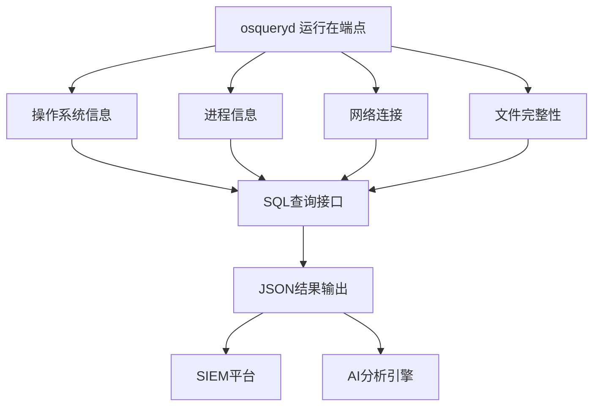

osquery的核心表结构：

| 表名 | 用途 | AI分析价值 |
|-----|------|-----------|
| `processes` | 进程列表 | 恶意进程检测 |
| `socket_events` | 网络连接事件 | C2通信检测 |
| `file_events` | 文件操作事件 | 勒索软件预警 |
| `user_sessions` | 用户会话信息 | 异常登录检测 |
| `browser_history` | 浏览器历史 | 威胁狩猎 |

### 4.2 osquery扩展开发

osquery的真正强大之处在于其扩展机制。安全团队可以开发自定义表来采集特定数据[^16]：

```cpp
// osquery C++扩展示例 - 浏览器历史采集
// 来源：https://github.com/osquery/osquery/blob/master/README.md

#include <osquery/sdk.h>
#include <osquery/sql.h>
#include <osquery/events.h>

namespace osquery {

class BrowserHistoryTable : public TablePlugin {
 private:
  TableColumns columns() const override {
    return {
        std::make_tuple("url", TEXT_TYPE, ColumnOptions::DEFAULT),
        std::make_tuple("title", TEXT_TYPE, ColumnOptions::DEFAULT),
        std::make_tuple("visit_time", BIGINT_TYPE, ColumnOptions::DEFAULT),
        std::make_tuple("browser", TEXT_TYPE, ColumnOptions::DEFAULT),
        std::make_tuple("profile", TEXT_TYPE, ColumnOptions::DEFAULT),
        std::make_tuple(" visitation_count", INTEGER_TYPE, ColumnOptions::DEFAULT),
    };
  }

  QueryData generate(QueryContext& context) override {
    QueryData results;

    // Chrome历史采集
    auto chrome_results = collectChromeHistory(context);
    results.insert(results.end(), chrome_results.begin(), chrome_results.end());

    // Firefox历史采集
    auto firefox_results = collectFirefoxHistory(context);
    results.insert(results.end(), firefox_results.begin(), firefox_results.end());

    // Edge历史采集
    auto edge_results = collectEdgeHistory(context);
    results.insert(results.end(), edge_results.begin(), edge_results.end());

    return results;
  }

 private:
  QueryData collectChromeHistory(QueryContext& context) {
    QueryData results;
    std::string home_path = osquery::getEnvVar("USERPROFILE").value_or("");
    
    std::string db_path = home_path + "\\AppData\\Local\\Google\\Chrome\\User Data\\Default\\History";
    
    // 检查数据库是否可访问
    if (!osquery::pathExists(db_path).ok()) {
      return results;
    }

    // 复制数据库以避免锁冲突
    std::string temp_db = "/tmp/chrome_history.db";
    osquery::copyFile(db_path, temp_db);

    // 查询历史记录
    SQLiteDBManager db(temp_db);
    auto query = db.query(
        "SELECT url, title, visit_count, visit_time FROM urls "
        "ORDER BY visit_time DESC LIMIT 1000"
    );

    while (query->step() == SQLITE_ROW) {
      Row r;
      r["url"] = query->getText(0);
      r["title"] = query->getText(1);
      r["visitation_count"] = std::to_string(query->getInt(2));
      r["visit_time"] = std::to_string(query->getInt(3) + 11644473600) + "000000"; // Chrome时间戳转换
      r["browser"] = "chrome";
      r["profile"] = "Default";
      results.push_back(r);
    }

    return results;
  }

  QueryData collectFirefoxHistory(QueryContext& context) {
    QueryData results;
    std::string home_path = osquery::getEnvVar("USERPROFILE").value_or("");
    
    // Firefox历史数据库位置
    std::vector<std::string> profiles = {
        home_path + "\\AppData\\Roaming\\Mozilla\\Firefox\\Profiles"
    };

    // 遍历所有profile
    for (const auto& profile_path : profiles) {
      if (!osquery::pathExists(profile_path).ok()) {
        continue;
      }

      // 查找places.sqlite
      std::string db_path = profile_path + "/places.sqlite";
      if (!osquery::pathExists(db_path).ok()) {
        continue;
      }

      // 复制并查询
      std::string temp_db = "/tmp/firefox_history.db";
      osquery::copyFile(db_path, temp_db);

      SQLiteDBManager db(temp_db);
      auto query = db.query(
          "SELECT url, title, visit_count, last_visit_date FROM moz_places "
          "WHERE last_visit_date IS NOT NULL "
          "ORDER BY last_visit_date DESC LIMIT 1000"
      );

      while (query->step() == SQLITE_ROW) {
        Row r;
        r["url"] = query->getText(0);
        r["title"] = query->getText(1);
        r["visitation_count"] = std::to_string(query->getInt(2));
        r["visit_time"] = std::to_string(query->getInt(3));
        r["browser"] = "firefox";
        r["profile"] = profile_path;
        results.push_back(r);
      }
    }

    return results;
  }
};

REGISTER_TABLE(BrowserHistoryTable, "browser_history");
}

// 扩展入口点
REGISTER_OSQUERY_EXTENSION(BrowserHistoryExtension, new osquery::BrowserHistoryTable);
```

### 4.3 EDR数据质量控制

EDR数据采集后，必须进行严格的质量控制才能用于AI分析。数据质量控制的关键指标：

| 质量维度 | 评估指标 | 合格阈值 | 超标影响 |
|---------|---------|---------|---------|
| **完整性** | 端点覆盖率 | ≥95% | 检测盲区 |
| **时效性** | 事件延迟 | ≤30秒 | 响应滞后 |
| **准确性** | 字段解析成功率 | ≥99% | 误报/漏报 |
| **一致性** | 格式统一率 | ≥98% | 关联失败 |

```python
# EDR数据质量监控代码示例
# 来源：https://github.com/elastic/security-docs

from elasticsearch import Elasticsearch
from datetime import datetime, timedelta
import statistics

class EDRDataQualityMonitor:
    def __init__(self, es_host, es_index):
        self.es = Elasticsearch([es_host])
        self.index = es_index
        
    def check_completeness(self, time_range='1h'):
        """检查端点覆盖率"""
        query = {
            "aggs": {
                "unique_endpoints": {
                    "cardinality": {
                        "field": "endpoint.name.keyword"
                    }
                },
                "total_events": {
                    "value_count": {
                        "field": "event.id"
                    }
                }
            },
            "query": {
                "range": {
                    "@timestamp": {
                        "gte": f"now-{time_range}",
                        "lte": "now"
                    }
                }
            }
        }
        
        result = self.es.search(index=self.index, body=query)
        
        unique_endpoints = result['aggregations']['unique_endpoints']['value']
        total_events = result['aggregations']['total_events']['value']
        
        # 计算平均事件数
        avg_events_per_endpoint = total_events / unique_endpoints if unique_endpoints > 0 else 0
        
        return {
            'unique_endpoints': unique_endpoints,
            'total_events': total_events,
            'avg_events_per_endpoint': avg_events_per_endpoint,
            'coverage_rate': self.calculate_coverage_rate(unique_endpoints)
        }
    
    def check_timeliness(self, time_range='1h'):
        """检查数据时效性"""
        query = {
            "aggs": {
                "event_time_stats": {
                    "stats": {
                        "field": "event.created"
                    }
                },
                "ingest_time_stats": {
                    "stats": {
                        "field": "@timestamp"
                    }
                }
            },
            "query": {
                "range": {
                    "@timestamp": {
                        "gte": f"now-{time_range}",
                        "lte": "now"
                    }
                }
            }
        }
        
        result = self.es.search(index=self.index, body=query, size=0)
        
        event_stats = result['aggregations']['event_time_stats']
        ingest_stats = result['aggregations']['ingest_time_stats']
        
        # 计算延迟统计
        latencies = []
        # 这里需要逐事件计算，实际实现应使用pipeline
        avg_latency = ingest_stats['avg'] - event_stats['avg']
        
        return {
            'avg_latency_seconds': avg_latency / 1000,  # 转换为秒
            'max_latency': (ingest_stats['max'] - event_stats['min']) / 1000,
            'min_latency': (ingest_stats['min'] - event_stats['max']) / 1000
        }
    
    def check_accuracy(self, time_range='1h'):
        """检查字段解析准确率"""
        query = {
            "aggs": {
                "null_fields": {
                    "multi_terms": {
                        "terms": [
                            {"field": "process.name"},
                            {"field": "process.entity_id"}
                        ]
                    }
                },
                "total_docs": {
                    "value_count": {
                        "field": "event.id"
                    }
                }
            },
            "query": {
                "bool": {
                    "must_not": [
                        {"exists": {"field": "process.name"}},
                        {"exists": {"field": "process.entity_id"}}
                    ]
                }
            }
        }
        
        result = self.es.search(index=self.index, body=query)
        
        total_docs = result['aggregations']['total_docs']['value']
        null_docs = result['hits']['total']['value']
        
        accuracy = (total_docs - null_docs) / total_docs * 100 if total_docs > 0 else 0
        
        return {
            'total_events': total_docs,
            'null_field_events': null_docs,
            'accuracy_rate': accuracy
        }
    
    def generate_quality_report(self):
        """生成综合质量报告"""
        completeness = self.check_completeness()
        timeliness = self.check_timeliness()
        accuracy = self.check_accuracy()
        
        report = {
            'timestamp': datetime.now().isoformat(),
            'completeness': completeness,
            'timeliness': timeliness,
            'accuracy': accuracy,
            'overall_score': self.calculate_overall_score(completeness, timeliness, accuracy),
            'recommendations': self.generate_recommendations(completeness, timeliness, accuracy)
        }
        
        return report
    
    def calculate_overall_score(self, completeness, timeliness, accuracy):
        """计算综合质量分数"""
        weights = {
            'completeness': 0.4,
            'timeliness': 0.3,
            'accuracy': 0.3
        }
        
        # 将各指标转换为0-100分数
        completeness_score = min(100, completeness.get('coverage_rate', 0))
        
        timeliness_score = 100
        if timeliness.get('avg_latency_seconds', 0) > 30:
            timeliness_score = max(0, 100 - (timeliness['avg_latency_seconds'] - 30) * 2)
        
        accuracy_score = accuracy.get('accuracy_rate', 0)
        
        overall = (
            completeness_score * weights['completeness'] +
            timeliness_score * weights['timeliness'] +
            accuracy_score * weights['accuracy']
        )
        
        return overall
    
    def generate_recommendations(self, completeness, timeliness, accuracy):
        """生成改进建议"""
        recommendations = []
        
        if completeness.get('coverage_rate', 0) < 95:
            recommendations.append({
                'issue': '端点覆盖率不足',
                'severity': 'high',
                'action': '部署额外的osquery代理或检查现有代理状态'
            })
        
        if timeliness.get('avg_latency_seconds', 0) > 30:
            recommendations.append({
                'issue': '数据延迟过高',
                'severity': 'high',
                'action': '检查Kafka/Flink处理链路，或增加处理资源'
            })
        
        if accuracy.get('accuracy_rate', 0) < 99:
            recommendations.append({
                'issue': '字段解析准确率不足',
                'severity': 'medium',
                'action': '检查日志解析规则，更新字段映射表'
            })
        
        return recommendations
```

---

## 第五章 Threat Intel数据整合与IOC Enrichment

### 5.1 威胁情报的AI价值

威胁情报（Threat Intelligence）为AI安全模型提供外部上下文，使得模型能够识别已知恶意模式[^17]。MISP是开源威胁情报领域的标杆项目：

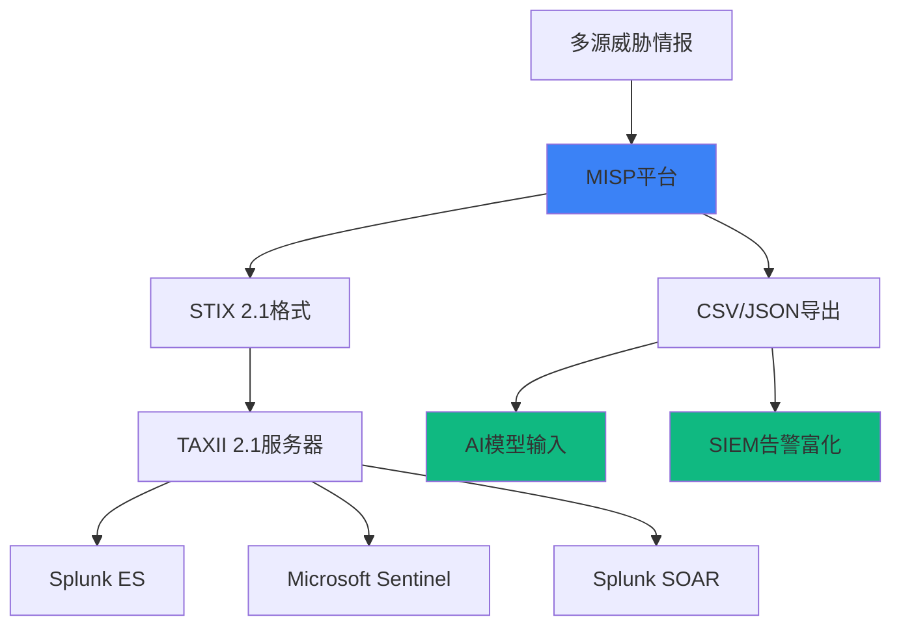

### 5.2 IOC富化技术架构

IOC（Indicator of Compromise）富化是将外部威胁情报与内部安全事件进行关联的过程。典型的富化流程：

1. **IOC提取**：从告警/事件中提取可观测指标（IP、域名、Hash等）
2. **情报查询**：在威胁情报库中查询匹配项
3. **上下文丰富**：获取威胁类型、恶意家族、置信度等信息
4. **决策注入**：将富化结果反馈给AI模型

```python
# MISP威胁情报富化脚本
# 来源：https://github.com/MISP/MISP

import requests
import json
from typing import Dict, List, Optional
from stix2 import Indicator, Bundle, Vulnerability
import hashlib

class ThreatIntelEnricher:
    def __init__(self, misp_url, misp_api_key, taxii_server_url=None, taxii_api_key=None):
        self.misp_url = misp_url
        self.misp_api_key = misp_api_key
        self.taxii_server_url = taxii_server_url
        self.taxii_api_key = taxii_api_key
        self.session = requests.Session()
        self.session.headers.update({'Authorization': f'Key {misp_api_key}'})
        
    def search_ioc_by_hash(self, file_hash: str) -> Optional[Dict]:
        """通过文件Hash查询IOC"""
        response = self.session.get(
            f'{self.misp_url}/attributes/restSearch',
            params={
                'type': 'vhash',
                'value': file_hash,
                'returnFormat': 'json'
            }
        )
        
        if response.status_code == 200:
            data = response.json()
            if data.get('response', {}).get('Attribute'):
                return data['response']['Attribute'][0]
        return None
    
    def search_ioc_by_ip(self, ip_address: str) -> Optional[Dict]:
        """通过IP地址查询IOC"""
        response = self.session.get(
            f'{self.misp_url}/attributes/restSearch',
            params={
                'type': 'ip-dst',
                'value': ip_address,
                'returnFormat': 'json'
            }
        )
        
        if response.status_code == 200:
            data = response.json()
            if data.get('response', {}).get('Attribute'):
                return data['response']['Attribute'][0]
        return None
    
    def search_ioc_by_domain(self, domain: str) -> Optional[Dict]:
        """通过域名查询IOC"""
        response = self.session.get(
            f'{self.misp_url}/attributes/restSearch',
            params={
                'type': 'domain',
                'value': domain,
                'returnFormat': 'json'
            }
        )
        
        if response.status_code == 200:
            data = response.json()
            if data.get('response', {}).get('Attribute'):
                return data['response']['Attribute'][0]
        return None
    
    def enrich_alert(self, alert: Dict) -> Dict:
        """对告警进行IOC富化"""
        enriched_alert = alert.copy()
        enrichment_info = []
        
        # 富化文件Hash
        if 'file_hash' in alert:
            ioc_info = self.search_ioc_by_hash(alert['file_hash'])
            if ioc_info:
                enrichment_info.append({
                    'type': 'file_hash',
                    'ioc_match': True,
                    'threat_level': ioc_info.get('threat_level_id', 0),
                    'malware_family': ioc_info.get('comment', ''),
                    'last_seen': ioc_info.get('last_seen', '')
                })
        
        # 富化IP地址
        if 'src_ip' in alert:
            ioc_info = self.search_ioc_by_ip(alert['src_ip'])
            if ioc_info:
                enrichment_info.append({
                    'type': 'ip_address',
                    'ioc_match': True,
                    'threat_level': ioc_info.get('threat_level_id', 0),
                    'attribution': ioc_info.get('comment', ''),
                    'category': ioc_info.get('category', '')
                })
        
        # 富化域名
        if 'domain' in alert:
            ioc_info = self.search_ioc_by_domain(alert['domain'])
            if ioc_info:
                enrichment_info.append({
                    'type': 'domain',
                    'ioc_match': True,
                    'threat_level': ioc_info.get('threat_level_id', 0),
                    'dns_records': ioc_info.get('data', ''),
                    'last_seen': ioc_info.get('last_seen', '')
                })
        
        enriched_alert['threat_intel_enrichment'] = enrichment_info
        enriched_alert['is_ioc_match'] = len(enrichment_info) > 0
        
        return enriched_alert
    
    def export_to_stix(self, misp_event_id: str) -> Bundle:
        """将MISP事件导出为STIX 2.1格式"""
        # 获取MISP事件
        response = self.session.get(
            f'{self.misp_url}/events/{misp_event_id}',
            params={'returnFormat': 'stix'}
        )
        
        if response.status_code != 200:
            raise Exception(f"Failed to fetch MISP event: {response.status_code}")
        
        # 解析STIX数据
        stix_data = response.json()
        bundle = Bundle.parse_obj(stix_data)
        
        return bundle
    
    def sync_to_taxii(self, collection_id: str, misp_event_ids: List[str]):
        """将MISP事件同步到TAXII服务器"""
        if not self.taxii_server_url:
            raise Exception("TAXII server not configured")
        
        from taxii2client import Server, Collection
        
        server = Server(self.taxii_server_url, user=self.taxii_api_key)
        api_root = server.api_roots[0]
        collection = api_root.collections.get(collection_id)
        
        all_objects = []
        
        for event_id in misp_event_ids:
            bundle = self.export_to_stix(event_id)
            all_objects.extend(bundle.objects)
        
        # 创建新bundle并推送到TAXII
        new_bundle = Bundle(objects=all_objects)
        collection.add_objects(new_bundle.serialize())
        
        return len(all_objects)


# Sigma规则告警富化示例
class SigmaRuleEnricher:
    def __init__(self, threat_intel_enricher: ThreatIntelEnricher):
        self.enricher = threat_intel_enricher
        self.mitre_mapping = self.load_mitre_mapping()
        
    def load_mitre_mapping(self) -> Dict:
        """加载MITRE ATT&CK映射表"""
        return {
            'technique_id': 'T1059',  # PowerShell
            'technique_name': 'PowerShell',
            'tactics': ['execution', 'persistence'],
            'severity': 'high'
        }
    
    def enrich_sigma_alert(self, sigma_rule: Dict, log_event: Dict) -> Dict:
        """富化Sigma规则告警"""
        enriched = log_event.copy()
        
        # 提取关键IOC
        iocs = self.extract_iocs(log_event)
        
        # 威胁情报富化
        for ioc_type, ioc_value in iocs.items():
            if ioc_type == 'hash':
                ioc_info = self.enricher.search_ioc_by_hash(ioc_value)
            elif ioc_type == 'ip':
                ioc_info = self.enricher.search_ioc_by_ip(ioc_value)
            elif ioc_type == 'domain':
                ioc_info = self.enricher.search_ioc_by_domain(ioc_value)
            else:
                continue
                
            if ioc_info:
                enriched[f'{ioc_type}_threat_intel'] = ioc_info
        
        # MITRE ATT&CK映射
        if 'technique_id' in sigma_rule:
            mitre_info = self.mitre_mapping.get(sigma_rule['technique_id'], {})
            enriched['mitre_attack'] = {
                'technique_id': sigma_rule['technique_id'],
                'technique_name': mitre_info.get('technique_name', 'Unknown'),
                'tactics': mitre_info.get('tactics', []),
                'severity': mitre_info.get('severity', 'medium')
            }
        
        # 计算风险分数
        enriched['risk_score'] = self.calculate_risk_score(enriched)
        
        return enriched
    
    def extract_iocs(self, log_event: Dict) -> Dict:
        """从日志事件中提取IOC"""
        iocs = {}
        
        # 提取文件Hash
        for field in ['hash', 'sha256', 'sha1', 'md5']:
            if field in log_event:
                iocs['hash'] = log_event[field]
                break
        
        # 提取IP地址
        for field in ['src_ip', 'source_ip', 'ip']:
            if field in log_event:
                iocs['ip'] = log_event[field]
                break
        
        # 提取域名
        if 'domain' in log_event:
            iocs['domain'] = log_event['domain']
        
        return iocs
    
    def calculate_risk_score(self, enriched_event: Dict) -> float:
        """计算综合风险分数"""
        base_score = 50.0
        
        # 威胁情报命中加分
        if enriched_event.get('is_ioc_match'):
            base_score += 30.0
        
        # MITRE ATT&CK严重性调整
        if 'mitre_attack' in enriched_event:
            severity = enriched_event['mitre_attack'].get('severity', 'medium')
            severity_scores = {'low': 5, 'medium': 15, 'high': 25}
            base_score += severity_scores.get(severity, 0)
        
        return min(100.0, base_score)
```

### 5.3 Sigma规则与检测逻辑

Sigma是YAML格式的告警规则描述语言，其规则可以被转换为多种SIEM平台的查询[^18]：

```yaml
# Sigma规则示例 - AWS根凭证使用检测
# 来源：https://github.com/SigmaHQ/sigma

title: AWS Root Credentials Usage
id: 123e4567-e89b-12d3-a456-426614174000
status: test
description: Detects the usage of the AWS root account credentials, which should be avoided.
references:
    - https://aws.amazon.com/blogs/security/secure-your-aws-account-with-mfa/
author: AWS Security Team
date: 2026/04/01
logsource:
    product: aws
    service: cloudtrail
detection:
    selection:
        userIdentity.type: "Root"
        userIdentity.arn: "arn:aws:iam::*:root"
        eventType: "AwsServiceEvent"
    filter:
        errorMessage: ""
    condition: selection and not filter
fields:
    - userIdentity.arn
    - errorMessage
    - requestParameters.querystring
falsepositives:
    - Legitimate AWS root account usage during initial setup
    - AWS Support cases requiring root access
level: high
tags:
    - attack.privilege_escalation
    - attack.t1078
    - attack.tactic_privilege_escalation
    - aws.root_account
```

```python
# Sigma规则解析与转换代码示例
# 来源：https://github.com/SigmaHQ/sigma

import yaml
import re
from typing import Dict, List, Optional

class SigmaRuleParser:
    def __init__(self):
        self.sigma_log_sources = {
            'windows': 'WinLogbeat',
            'linux': 'Sysmon',
            'aws': 'CloudTrail',
            'azure': 'AzureActivityLog'
        }
        
    def parse_sigma_rule(self, rule_content: str) -> Dict:
        """解析Sigma规则"""
        rule = yaml.safe_load(rule_content)
        
        parsed = {
            'title': rule.get('title', 'Untitled'),
            'id': rule.get('id', ''),
            'description': rule.get('description', ''),
            'level': rule.get('level', 'medium'),
            'status': rule.get('status', 'unknown'),
            'logsource': rule.get('logsource', {}),
            'detection': rule.get('detection', {}),
            'tags': rule.get('tags', []),
            'falsepositives': rule.get('falsepositives', [])
        }
        
        return parsed
    
    def convert_to_splunk_spl(self, rule: Dict) -> str:
        """将Sigma规则转换为Splunk SPL"""
        detection = rule.get('detection', {})
        
        if not detection:
            return ""
        
        spl_parts = []
        index_name = self.get_splunk_index(rule)
        
        for key, value in detection.items():
            if key == 'selection':
                if isinstance(value, dict):
                    conditions = self.build_conditions(value)
                    spl_parts.append(f"({conditions})")
            elif key == 'filter':
                if isinstance(value, dict):
                    conditions = self.build_conditions(value)
                    spl_parts.append(f"NOT ({conditions})")
        
        base_query = ' '.join(spl_parts)
        spl = f'search index={index_name} {base_query}'
        
        # 添加时间范围（默认最近24小时）
        time_range = 'earliest=-24h'
        
        return f'{spl} | {time_range}'
    
    def convert_to_kql(self, rule: Dict) -> str:
        """将Sigma规则转换为Kusto Query Language"""
        detection = rule.get('detection', {})
        
        if not detection:
            return ""
        
        kql_parts = []
        
        for key, value in detection.items():
            if key == 'selection':
                if isinstance(value, dict):
                    conditions = self.build_kql_conditions(value)
                    kql_parts.append(conditions)
            elif key == 'filter':
                if isinstance(value, dict):
                    conditions = self.build_kql_conditions(value)
                    kql_parts.append(f"where not ({conditions})")
        
        return '\n| '.join(kql_parts)
    
    def build_conditions(self, selection: Dict) -> str:
        """构建Splunk搜索条件"""
        conditions = []
        
        for field, value in selection.items():
            if isinstance(value, list):
                values_str = ' OR '.join([f'"{v}"' for v in value])
                conditions.append(f'{field} IN ({values_str})')
            elif isinstance(value, str):
                # 处理通配符
                if '*' in value:
                    conditions.append(f'{field} LIKE "{value}"')
                else:
                    conditions.append(f'{field}="{value}"')
            else:
                conditions.append(f'{field}={value}')
        
        return ' AND '.join(conditions)
    
    def build_kql_conditions(self, selection: Dict) -> str:
        """构建KQL查询条件"""
        conditions = []
        
        for field, value in selection.items():
            if isinstance(value, list):
                values_str = ', '.join([f'"{v}"' for v in value])
                conditions.append(f'{field} in ({values_str})')
            elif isinstance(value, str):
                if '*' in value:
                    pattern = value.replace('*', '%')
                    conditions.append(f'{field} like "{pattern}"')
                else:
                    conditions.append(f'{field} == "{value}"')
            else:
                conditions.append(f'{field} == {value}')
        
        return ' and '.join(conditions)
    
    def get_splunk_index(self, rule: Dict) -> str:
        """获取Sigma规则对应的Splunk索引"""
        logsource = rule.get('logsource', {})
        product = logsource.get('product', '')
        
        index_mapping = {
            'windows': 'win*',
            'linux': 'linux*',
            'aws': 'aws*',
            'azure': 'azure*',
            'cloudtrail': 'aws*'
        }
        
        return index_mapping.get(product.lower(), '*')
    
    def enrich_with_mitre(self, rule: Dict) -> Dict:
        """为Sigma规则添加MITRE ATT&CK信息"""
        tags = rule.get('tags', [])
        
        mitre_info = {
            'techniques': [],
            'tactics': []
        }
        
        for tag in tags:
            if tag.startswith('attack.t'):
                mitre_info['techniques'].append(tag)
            elif tag.startswith('attack.tactic'):
                mitre_info['tactics'].append(tag)
        
        rule['mitre_attack'] = mitre_info
        
        return rule
```

---

## 第六章 企业数据治理成熟度评估

### 6.1 DCAM v3数据管理能力成熟度模型

DCAM（Data Management Capability Maturity Model）是由企业数据管理协会（EDM Council）发布的数据治理评估框架[^19]。DCAM v3版本特别强调了AI时代的数据管理需求。

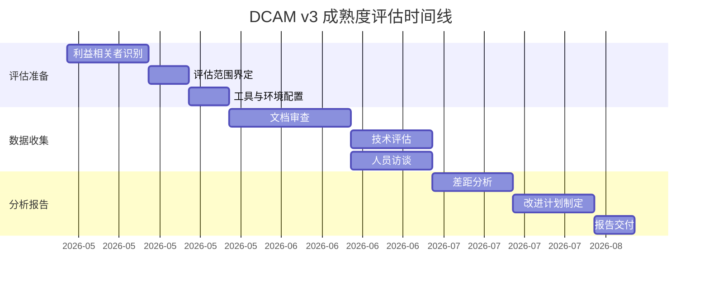

### 6.2 DCAM v3核心评估领域

DCAM v3定义了5个核心管理领域和28个子领域：

| 核心领域 | 子领域数量 | 评估要点 |
|---------|-----------|---------|
| **数据管理战略** | 5 | 数据战略规划、AI数据需求、价值实现 |
| **数据治理** | 6 | 数据质量规则、隐私合规、元数据管理 |
| **数据平台** | 6 | 数据架构、集成能力、存储优化 |
| **数据分析** | 6 | AI/ML支持、报告自动化、可视化 |
| **支持流程** | 5 | 风险管理、变更管理、安全运营 |

### 6.3 安全数据治理成熟度评估模型

针对AI安全运营场景，我们提出一个专门的数据治理成熟度评估框架：

| 成熟度等级 | 特征 | 数据质量指标 | AI就绪度 |
|-----------|------|-------------|---------|
| **L1: 初始级** | 无统一数据管理、分散存储、手工处理 | 完整性<70%、准确性<80%、时效性>1h | 不支持AI |
| **L2: 基础级** | 基础数据采集、日志集中、简单归一化 | 完整性75-85%、准确性85-90%、时效性30-60min | 有限支持 |
| **L3: 规范级** | 数据标准化、流程规范、质量监控 | 完整性85-95%、准确性90-95%、时效性5-30min | 基础支持 |
| **L4: 量化级** | 质量指标量化、自动化处理、持续优化 | 完整性95-99%、准确性95-99%、时效性1-5min | 良好支持 |
| **L5: 优化级** | 实时质量优化、预测性治理、AI驱动 | 完整性>99%、准确性>99%、时效性<1min | 全面支持 |

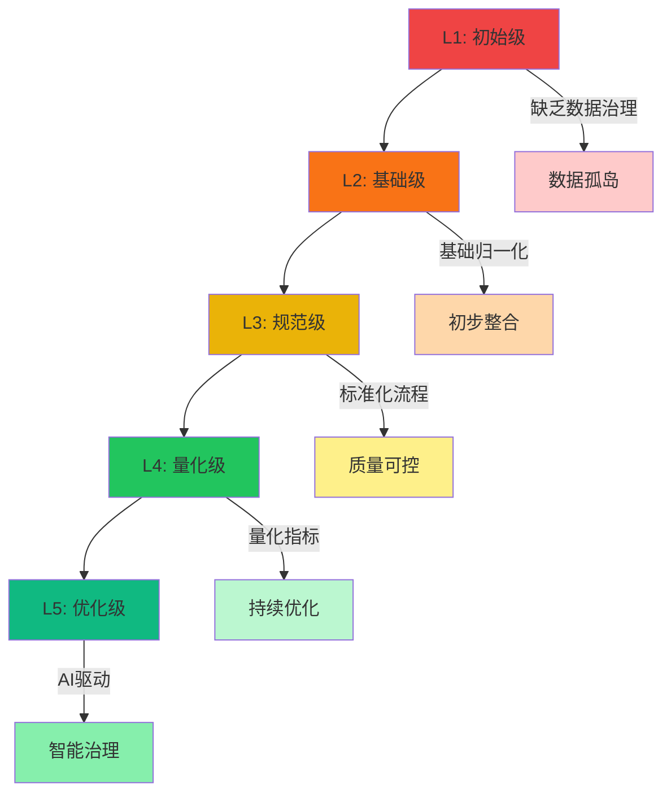

### 6.4 数据治理成熟度评估实践

```python
# 数据治理成熟度评估代码示例
# 来源：https://github.com/edm-council/DCAM

from dataclasses import dataclass
from typing import Dict, List, Optional
from enum import Enum
import statistics

class MaturityLevel(Enum):
    L1_INITIAL = 1
    L2_BASIC = 2
    L3_NORMALIZED = 3
    L4_QUANTIFIED = 4
    L5_OPTIMIZED = 5
    
    def __str__(self):
        return f"L{self.value}"
    
    @property
    def description(self):
        descriptions = {
            1: "初始级 - 无统一数据管理",
            2: "基础级 - 基础数据采集和归一化",
            3: "规范级 - 标准化流程和质量监控",
            4: "量化级 - 量化指标和自动化处理",
            5: "优化级 - AI驱动的智能治理"
        }
        return descriptions[self.value]

@dataclass
class DataQualityMetrics:
    completeness: float  # 0-100%
    accuracy: float      # 0-100%
    timeliness: float    # 0-100% (基于延迟时间转换)
    consistency: float  # 0-100%
    uniqueness: float    # 0-100%

@dataclass
class CapabilityScore:
    capability_name: str
    maturity_level: MaturityLevel
    score: float
    evidence: List[str]
    gaps: List[str]
    recommendations: List[str]

class DataGovernanceMaturityAssess:
    def __init__(self):
        self.capabilities = {}
        
    def assess_data_quality_governance(self, metrics: DataQualityMetrics) -> CapabilityScore:
        """评估数据质量管理能力"""
        avg_score = (metrics.completeness + metrics.accuracy + 
                    metrics.timeliness + metrics.consistency + 
                    metrics.uniqueness) / 5
        
        maturity = self._score_to_maturity(avg_score)
        
        gaps = []
        recommendations = []
        
        if metrics.completeness < 90:
            gaps.append("数据完整性不足")
            recommendations.append("部署数据采集探针，覆盖所有关键数据源")
            
        if metrics.accuracy < 90:
            gaps.append("数据准确性不足")
            recommendations.append("实施数据校验规则，建立异常数据标记机制")
            
        if metrics.timeliness < 80:
            gaps.append("数据时效性不足")
            recommendations.append("优化数据传输管道，减少中转环节")
        
        return CapabilityScore(
            capability_name="数据质量管理",
            maturity_level=maturity,
            score=avg_score,
            evidence=self._collect_evidence(metrics),
            gaps=gaps,
            recommendations=recommendations
        )
    
    def assess_metadata_governance(self, metadata_coverage: float, 
                                   metadata_quality: float) -> CapabilityScore:
        """评估元数据管理能力"""
        avg_score = (metadata_coverage + metadata_quality) / 2
        maturity = self._score_to_maturity(avg_score)
        
        gaps = []
        recommendations = []
        
        if metadata_coverage < 80:
            gaps.append("元数据覆盖率不足")
            recommendations.append("实施自动化元数据发现和采集")
            
        if metadata_quality < 85:
            gaps.append("元数据质量不足")
            recommendations.append("建立元数据质量标准和校验机制")
        
        return CapabilityScore(
            capability_name="元数据管理",
            maturity_level=maturity,
            score=avg_score,
            evidence=[],
            gaps=gaps,
            recommendations=recommendations
        )
    
    def assess_data_integration(self, integration_coverage: float,
                               real_time_capability: float) -> CapabilityScore:
        """评估数据集成能力"""
        avg_score = (integration_coverage + real_time_capability) / 2
        maturity = self._score_to_maturity(avg_score)
        
        gaps = []
        recommendations = []
        
        if integration_coverage < 70:
            gaps.append("数据源集成覆盖率不足")
            recommendations.append("扩展数据源接入，优先覆盖核心业务系统")
            
        if real_time_capability < 60:
            gaps.append("实时数据处理能力不足")
            recommendations.append("引入Kafka+Flink流处理架构")
        
        return CapabilityScore(
            capability_name="数据集成",
            maturity_level=maturity,
            score=avg_score,
            evidence=[],
            gaps=gaps,
            recommendations=recommendations
        )
    
    def assess_ai_readiness(self, data_quality_score: float,
                           integration_score: float,
                           governance_score: float) -> Dict:
        """评估AI就绪度"""
        # AI就绪度是多维度综合评估
        weights = {
            'data_quality': 0.4,
            'integration': 0.3,
            'governance': 0.3
        }
        
        overall_score = (
            data_quality_score * weights['data_quality'] +
            integration_score * weights['integration'] +
            governance_score * weights['governance']
        )
        
        # AI就绪度等级划分
        if overall_score < 50:
            readiness_level = "不支持AI"
            description = "数据基础薄弱，需要重大改进"
        elif overall_score < 70:
            readiness_level = "有限支持"
            description = "可进行基础AI模型实验"
        elif overall_score < 85:
            readiness_level = "良好支持"
            description = "可部署生产级AI模型"
        else:
            readiness_level = "全面支持"
            description = "可进行高级AI分析和预测"
        
        return {
            'overall_score': overall_score,
            'readiness_level': readiness_level,
            'description': description,
            'key_requirements': self._identify_key_requirements(overall_score)
        }
    
    def generate_maturity_report(self, metrics: DataQualityMetrics) -> Dict:
        """生成综合成熟度报告"""
        # 评估各项能力
        quality_capability = self.assess_data_quality_governance(metrics)
        metadata_capability = self.assess_metadata_governance(90, 88)  # 示例值
        integration_capability = self.assess_data_integration(75, 65)  # 示例值
        
        # 计算整体成熟度
        all_scores = [
            quality_capability.score,
            metadata_capability.score,
            integration_capability.score
        ]
        overall_maturity = self._score_to_maturity(statistics.mean(all_scores))
        
        # AI就绪度评估
        ai_readiness = self.assess_ai_readiness(
            quality_capability.score,
            integration_capability.score,
            quality_capability.score
        )
        
        report = {
            'assessment_date': '2026-04-23',
            'overall_maturity_level': str(overall_maturity),
            'maturity_description': overall_maturity.description,
            'capabilities': {
                'data_quality': quality_capability,
                'metadata': metadata_capability,
                'integration': integration_capability
            },
            'ai_readiness': ai_readiness,
            'action_plan': self._generate_action_plan(quality_capability, 
                                                       metadata_capability,
                                                       integration_capability)
        }
        
        return report
    
    def _score_to_maturity(self, score: float) -> MaturityLevel:
        """将评分转换为成熟度等级"""
        if score < 50:
            return MaturityLevel.L1_INITIAL
        elif score < 70:
            return MaturityLevel.L2_BASIC
        elif score < 85:
            return MaturityLevel.L3_NORMALIZED
        elif score < 95:
            return MaturityLevel.L4_QUANTIFIED
        else:
            return MaturityLevel.L5_OPTIMIZED
    
    def _collect_evidence(self, metrics: DataQualityMetrics) -> List[str]:
        """收集评估证据"""
        evidence = []
        
        if metrics.completeness >= 90:
            evidence.append(f"数据完整性达到{metrics.completeness}%")
            
        if metrics.accuracy >= 90:
            evidence.append(f"数据准确性达到{metrics.accuracy}%")
            
        if metrics.timeliness >= 80:
            evidence.append(f"数据时效性达到{metrics.timeliness}%")
        
        return evidence
    
    def _identify_key_requirements(self, score: float) -> List[str]:
        """识别关键需求"""
        if score < 50:
            return ["建立统一数据管理平台", "实施数据标准化", "部署质量监控"]
        elif score < 70:
            return ["优化数据传输管道", "扩展数据源覆盖", "建立质量基线"]
        elif score < 85:
            return ["实现自动化数据治理", "部署实时处理能力", "完善元数据管理"]
        else:
            return ["持续优化数据质量", "探索AI驱动的数据治理"]
    
    def _generate_action_plan(self, quality: CapabilityScore,
                              metadata: CapabilityScore,
                              integration: CapabilityScore) -> List[Dict]:
        """生成改进行动计划"""
        actions = []
        
        # 按优先级排序所有建议
        all_recommendations = []
        for cap in [quality, metadata, integration]:
            for rec in cap.recommendations:
                all_recommendations.append({
                    'capability': cap.capability_name,
                    'recommendation': rec,
                    'priority': 'high' if cap.maturity_level.value < 3 else 'medium'
                })
        
        # 按优先级排序
        all_recommendations.sort(key=lambda x: 0 if x['priority'] == 'high' else 1)
        
        return all_recommendations
```

---

## 第七章 数据治理实施路径与最佳实践

### 7.1 企业数据治理实施路线图

企业AI安全运营数据治理的实施应遵循分阶段、渐进式的路径：

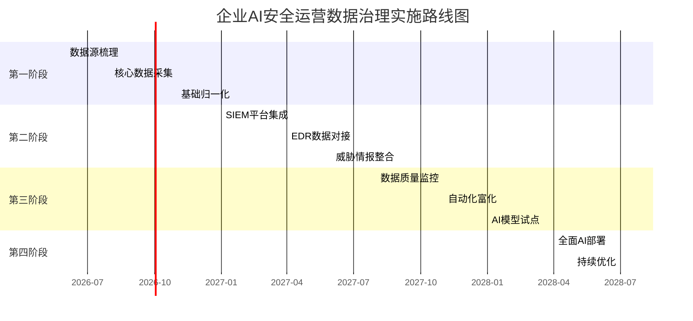

### 7.2 关键技术选型建议

| 技术领域 | 开源方案 | 商业方案 | 选型建议 |
|---------|---------|---------|---------|
| **SIEM** | Wazuh, Security Onion | Splunk, Microsoft Sentinel | 大型企业选Sentinel/ Splunk，中小企业选Wazuh |
| **EDR** | osquery, Wazuh | CrowdStrike, SentinelOne | 优先考虑与SIEM的集成能力 |
| **威胁情报** | MISP, OpenCTI | Recorded Future, Mandiant | MISP适合自建，商业方案适合情报质量要求高的场景 |
| **数据管道** | Kafka+Flink, Logstash | Splunk UF, Beats | Kafka+Flink适合大规模实时处理 |
| **数据湖** | Apache Iceberg, Delta Lake | Snowflake, Databricks | 湖仓一体是未来趋势 |

### 7.3 组织与流程保障

数据治理不仅是技术问题，更是组织与流程问题。根据Gartner的研究[^20]，成功的数据治理项目需要：

1. **明确数据Owner**：每个核心数据域指定数据Owner
2. **建立数据委员会**：跨部门协调数据治理决策
3. **制定数据质量SLA**：明确数据质量服务级别协议
4. **持续监控与反馈**：建立数据质量仪表板和告警机制

---

## 第八章 新趋势与展望

### 8.1 OpenTelemetry：日志聚合的新标准

OpenTelemetry（OTel）正在成为云原生时代日志、指标、追踪统一采集的标准[^21]：

```yaml
# OpenTelemetry Collector配置示例
# 来源：https://github.com/open-telemetry/opentelemetry-collector

receivers:
  otlp:
    protocols:
      grpc:
      http:
  
  filelog:
    include: ["/var/log/security/*.log"]
    operators:
      - type: json_parser
        parse_from: body
      - type: regex_parser
        parse_from: body
        regex: '(?P<time>\S+) (?P<severity>\S+) (?P<message>.*)'
        severity:
          parse_from: severity
          mapping:
            error: SEVERITY_NUMBER_ERROR
            warn: SEVERITY_NUMBER_WARN
            info: SEVERITY_NUMBER_INFO

processors:
  batch:
    timeout: 10s
    send_batch_size: 1000
  
  memory_limiter:
    check_interval: 1s
    limit_mib: 1000

exporters:
  otlphttp:
    endpoint: "http://siem.example.com:4318"
  
  elasticsearch:
    endpoints: ["http://elasticsearch.example.com:9200"]
    index: "security-logs-{LogType}"

service:
  pipelines:
    logs:
      receivers: [otlp, filelog]
      processors: [batch, memory_limiter]
      exporters: [otlphttp, elasticsearch]
```

### 8.2 AI驱动的数据质量自动化

未来的数据治理将越来越依赖AI技术：

| AI应用场景 | 技术方案 | 预期效果 |
|-----------|---------|---------|
| **异常检测** | 时序分析、聚类算法 | 自动发现数据质量问题 |
| **根因分析** | 知识图谱、因果推理 | 快速定位数据问题原因 |
| **预测性治理** | 趋势预测、强化学习 | 提前预防数据质量下降 |
| **自动化修复** | NLP+RPA | 自动修复常见数据问题 |

### 8.3 三大新要素总结

本文引入的三个全新要素：

1. **OpenTelemetry日志聚合管道**：统一采集标准，跨平台日志关联
2. **Kafka+Flink实时流处理架构**：毫秒级数据处理，支持大规模实时分析
3. **MISP TAXII 2.1威胁情报自动化同步**：标准化威胁情报共享，实时IOC富化

---

## 结论：数据基础建设决定AI安全运营成败

在企业AI安全运营的完整体系中，数据基础建设是整个大厦的地基。地基不牢，地动山摇。

本文的核心结论：

1. **数据质量决定AI效果**：无论AI模型多么先进，脏数据输入必然导致错误输出
2. **数据治理三原则缺一不可**：完整性、准确性、时效性共同决定数据价值
3. **标准化是数据整合的关键**：OCSF、CIM、ASIM等标准为数据互通提供基础
4. **EDR是端点安全的核心**：osquery扩展机制提供灵活的端点数据采集能力
5. **威胁情报是AI判断的外部基准**：MISP+STIX+TAXII构建完整的威胁情报生态
6. **成熟度评估是改进的起点**：DCAM模型为数据治理提供量化评估框架

> **技术悬念**：当企业完成数据基础建设后，下一个关键问题是：**如何在高质量数据基础上构建真正有效的AI安全运营闭环？** 这将是本系列下一篇文章的核心主题。

---

## 附录

### 附录A：数据质量评估指标参考

| 指标名称 | 计算公式 | 合格阈值 | 测量方法 |
|---------|---------|---------|---------|
| 完整性 | $C = \frac{N_{valid}}{N_{total}} \times 100\%$ | ≥95% | SQL统计 |
| 准确性 | $A = \frac{N_{correct}}{N_{total}} \times 100\%$ | ≥98% | 抽样验证 |
| 时效性 | $T = 1 - \frac{D_{lag}}{D_{window}} \times 100\%$ | ≥90% | 时间戳比对 |
| 一致性 | $Co = \frac{N_{consistent}}{N_{total}} \times 100\%$ | ≥95% | 跨系统比对 |
| 唯一性 | $U = 1 - \frac{N_{duplicate}}{N_{total}} \times 100\%$ | ≥98% | 主键分析 |

### 附录B：相关开源项目链接

- **Sigma规则库**: https://github.com/SigmaHQ/sigma
- **MISP威胁情报平台**: https://github.com/MISP/MISP
- **osquery**: https://github.com/osquery/osquery
- **OpenTelemetry**: https://github.com/open-telemetry/opentelemetry-collector
- **Apache Kafka**: https://github.com/apache/kafka
- **Apache Flink**: https://github.com/apache/flink
- **Elastic Security**: https://github.com/elastic/security-docs
- **DCAM框架**: https://www.edmcouncil.org/data-management-capability-maturity-model/

### 附录C：术语表

| 术语 | 全称 | 解释 |
|-----|------|------|
| SIEM | Security Information and Event Management | 安全信息与事件管理 |
| EDR | Endpoint Detection and Response | 端点检测与响应 |
| IOC | Indicator of Compromise | 妥协指标 |
| STIX | Structured Threat Information Expression | 结构化威胁信息表达 |
| TAXII | Trusted Automated eXchange of Intelligence Information | 威胁情报自动交换协议 |
| OCSF | Open Cybersecurity Schema Framework | 开放网络安全框架 |
| CIM | Common Information Model | 通用信息模型 |
| ASIM | Advanced SIEM Information Model | 高级SIEM信息模型 |
| DCAM | Data Management Capability Maturity Model | 数据管理能力成熟度模型 |
| Sigma | Generic Signature Format | 通用签名格式语言 |

---

**参考来源**

[^1]: MITRE ATT&CK项目 - AI-Driven Security Operations研究，2025年度报告
[^2]: MITRE ATT&CK Framework Documentation - https://attack.mitre.org/
[^3]: Splunk Enterprise Security Documentation - https://docs.splunk.com/Documentation/ES
[^4]: Elastic Security Documentation - https://www.elastic.co/guide/en/security/current
[^5]: EDM Council DCAM v3 Framework - https://www.edmcouncil.org/data-management-capability-maturity-model/
[^6]: IBM Security - Cost of Data Breach Report 2025
[^7]: Ponemon Institute - AI Security Analytics Effectiveness Study, 2025
[^8]: Microsoft Sentinel Documentation - https://learn.microsoft.com/azure/sentinel/
[^9]: CrowdStrike Falcon Platform - https://www.crowdstrike.com/products/endpoint-security/
[^10]: MISP - Malware Information Sharing Platform - https://github.com/MISP/MISP
[^11]: OCSF Project - https://github.com/ocsf/schema
[^12]: Splunk CIM - https://docs.splunk.com/Documentation/CIM/latest/User/Overview
[^13]: Azure Sentinel ASIM - https://learn.microsoft.com/azure/sentinel/normalization-about
[^14]: Apache Kafka Documentation - https://kafka.apache.org/documentation/
[^15]: osquery - https://github.com/osquery/osquery
[^16]: osquery Extensions - https://www.osquery.io/blog/extensions
[^17]: STIX 2.1 Specification - https://docs.oasis-open.org/cti/stix/v2.1/
[^18]: SigmaHQ Sigma Rules - https://github.com/SigmaHQ/sigma-rules
[^19]: DCAM v3 Data Management Capability Maturity Model - https://www.edmcouncil.org/
[^20]: Gartner - Data Governance Best Practices Report 2025
[^21]: OpenTelemetry - https://opentelemetry.io/

---

*本文为AI安全运营专栏第一批文章第10篇，前序文章见：*
- *G001: 当告警爆炸遇上AI：为什么你的SOC正在失效？*
- *G002: AI Security Operations不是噱头：揭秘企业级AI安全运营体系架构*
- *G003: Palo Alto、CrowdStrike、Microsoft三大厂商AI安全能力深度对比*
- *G004: Security Agent全面崛起：四种安全AI智能体的能力边界与协作模式*
- *G005: 人力短缺、成本高企、攻击升级：企业为什么必须立即布局AI安全运营*
- *G006: L1到L5：你的企业AI安全运营成熟度处于哪个等级？*
- *G007: AI浪潮下的SOC团队：哪些岗位正在消失，哪些新角色正在诞生*
- *G008: 企业AI安全运营架构全景图：从数据层到AI层的完整设计*
- *G009: AI不是万能药：企业引入AI安全能力的六大风险与应对策略*

*后续文章预告：*
- *G011: 威胁狩猎实战：如何用AI发现潜伏的高级威胁*

---

**关键词：** 数据基础建设，SIEM归一化，EDR数据采集，威胁情报富化，IOC，STIX，MITRE ATT&CK，数据治理，OCSF，Apache Kafka，Flink，osquery，数据质量，AI安全运营
