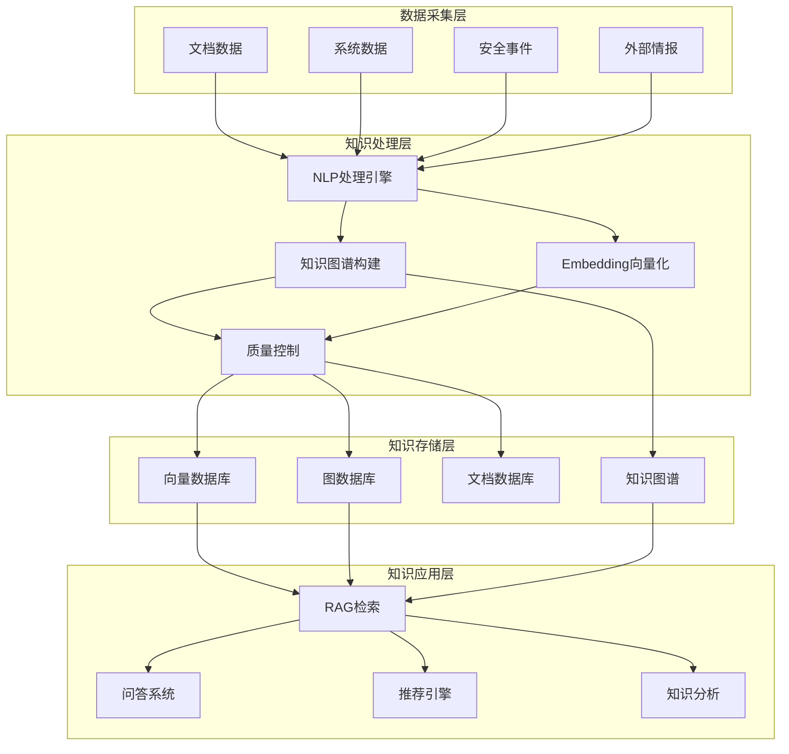

**作者：** HOS(安全风信子)
**日期：** 2026-04-23
**主要来源平台：** GitHub/arXiv
**摘要：** 本文深入探讨企业AI安全运营私域知识库体系的设计与构建。知识库是AI安全运营的核心基础设施，决定了AI系统的专业能力和决策质量。本文从知识库的价值定位、体系架构、技术实现、运营管理四个维度展开，详细阐述SOP知识库、威胁知识图谱、RAG检索增强等核心组件的设计原则与实战方法，为企业构建高质量AI安全知识体系提供完整指南。

@[TOC](目录)

---

# 让AI秒变安全专家：企业私域知识库体系设计完整指南

## 1. 引言：为什么AI安全运营需要私域知识库

2026年的AI安全运营领域，一个核心问题正在凸显：通用大模型在安全专业领域的回答往往缺乏深度和准确性，而企业积累的大量安全知识却未能有效转化为AI的能力。这一矛盾的根本原因在于缺乏高质量的私域知识库支撑。

根据Gartner 2025年调研数据，超过70%的企业在引入AI安全运营时，最关注的问题是"AI能否理解我们特定的安全环境和上下文"。这个问题的答案取决于企业是否建立了完善的私域知识库体系。通用大模型就像一个拥有广泛知识但缺乏专业深度的全科医生，而私域知识库则相当于让AI同时拥有了该医院的全部病历、医学文献和专家经验，从而能够针对具体问题给出专业级回答。

私域知识库对于AI安全运营的价值体现在多个层面。首先是专业性提升，通过积累企业特定的安全事件、响应案例、配置规范，AI能够给出与企业环境高度匹配的分析和建议。其次是上下文理解，AI能够理解企业的特定业务逻辑、行业特点、安全策略，从而做出更准确的判断。第三是知识传承，企业资深分析师的经验、解决问题的思路、成功的响应案例都可以沉淀到知识库中，避免知识随人员流动而流失。第四是持续进化，知识库能够不断吸收新的威胁情报、漏洞信息、最佳实践，让AI能力持续提升。

本文将系统性地介绍企业AI安全运营私域知识库的设计原则、体系架构、技术实现、运营管理方法，帮助企业构建高质量的安全知识体系，让AI真正成为安全专家。

---

## 2. AI安全运营知识库的价值定位

### 2.1 知识库在AI安全运营中的核心地位

知识库是AI安全运营体系的"大脑"，存储着企业安全运营所需的所有知识和经验。没有知识库的AI系统就像一个空有记忆力却没有知识储备的专家，面对具体问题时无法给出有价值的回答。

从技术架构角度看，AI安全运营体系可以分为数据层、能力层、知识层、应用层四个层次。数据层负责收集和处理各类安全数据；能力层包含各种AI模型和算法；知识层是连接数据和能力的桥梁，存储结构化的安全知识；而应用层则直接面向分析师提供各种安全功能。知识库处于知识层的核心位置，决定了AI系统能够提供服务的深度和广度。

一个完善的知识库应该包含以下几类知识：事实性知识，如漏洞信息、威胁情报、资产信息等；规则性知识，如安全策略、合规要求、响应流程等；经验性知识，如事件分析思路、问题解决方法、最佳实践案例等；关联性知识，如攻击链映射、技战术关联、因果关系等。这四类知识共同构成了AI安全运营的知识基础。

### 2.2 私域知识库 vs 通用知识库

私域知识库与通用知识库在AI安全运营中扮演着不同但互补的角色。通用大模型如GPT-4、Claude等拥有广泛的知识覆盖面，能够提供基础的安全概念解释、通用威胁分析等。但它们在面对企业特定环境时往往力不从心，因为它们缺乏对企业特定配置、策略、业务逻辑的理解。

私域知识库的价值在于为企业AI系统提供"私人医生"般的服务。它能够存储和检索企业特有的安全事件分析、响应记录、配置基线等，确保AI的回答与企业实际情况高度匹配。同时，私域知识库还能够不断更新和扩展，吸收最新的威胁情报和企业经验，形成持续进化的知识体系。

两者之间的关系应该是互补而非替代。通用大模型提供基础的专业能力判断和自然语言理解，私域知识库则在此基础上提供企业特定的上下文和专业知识。这种"通用+专业"的模式能够在保证AI回答质量的同时，实现对企业特定环境的深度理解。

### 2.3 知识库建设的挑战与应对

企业在建设私域知识库时面临的挑战是多方面的。首要挑战是知识获取，如何从海量的安全数据、文档、案例中提取有价值的知识是一个技术难题。其次是知识质量，如何确保知识的准确性、完整性、时效性需要建立严格的质量控制机制。第三是知识组织，如何将碎片化的知识结构化，形成高效检索的知识体系需要精心的设计。第四是知识更新，如何保持知识库的持续更新，跟上威胁环境的快速变化需要建立长效机制。

应对这些挑战需要从技术、流程、组织三个层面入手。技术上，需要引入NLP、知识图谱、机器学习等技术提升知识获取和组织的效率。流程上，需要建立知识贡献、审核、发布的标准化流程。组织上，需要明确知识库运营的责任主体和激励机制，确保知识持续积累和更新。

---

## 3. 企业AI安全运营知识库体系架构

### 3.1 知识库体系整体架构

企业AI安全运营知识库采用四层架构设计，从底层到顶层分别是数据采集层、知识处理层、知识存储层、知识应用层。这种分层设计确保了知识从原始数据到最终应用的完整流转。



**数据采集层**负责从各类数据源获取原始知识素材。内部数据源包括安全运营文档、SOP手册、事件分析报告、配置基线等；系统数据包括告警记录、响应日志、资产信息等；外部情报包括威胁情报 feeds、漏洞数据库、安全研究报告等。

**知识处理层**是知识库的核心引擎，负责人知识的提取、结构化、向量化。NLP处理引擎负责从非结构化文档中提取实体、关系、事件；知识图谱构建模块负责建立知识之间的关联关系；Embedding向量化模块负责将文本转换为向量表示，支持语义检索；质量控制模块负责知识的验证、标准化、去重。

**知识存储层**采用多模态存储策略，向量数据库存储文本的语义表示，支持高效相似性检索；图数据库存储实体和关系，支持复杂的关联查询；文档数据库存储原始文档和提取的结构化信息；知识图谱存储领域知识的语义网络。

**知识应用层**面向AI系统提供知识服务，RAG检索模块实现检索增强生成架构；问答系统提供自然语言查询接口；推荐引擎根据上下文自动推荐相关知识；知识分析提供知识图谱可视化、知识血缘分析等功能。

### 3.2 SOP知识库设计

SOP（Standard Operating Procedure）知识库是AI安全运营的基础组件，存储企业所有标准操作程序的结构化知识。SOP知识库的核心价值在于将专家经验转化为可复制、可追溯的标准流程，让AI能够像资深分析师一样执行标准化操作。

SOP知识库的内容组织采用树形结构，从企业级、部门级、团队级三个层级组织。企业级SOP定义整体安全策略和标准，如安全事件分级标准、信息分类政策等；部门级SOP定义特定领域的安全流程，如SOC事件响应流程、漏洞管理流程等；团队级SOP定义具体的操作指南，如特定工具的使用方法、特定场景的处理步骤等。

```python
class SOPKnowledgeBase:
    """
    SOP知识库管理类
    负责SOP知识的存储、检索、更新
    """
    
    def __init__(self, vector_db, graph_db, document_db):
        self.vector_db = vector_db
        self.graph_db = graph_db
        self.document_db = document_db
        self.sop_schema = {
            'level': ['enterprise', 'department', 'team'],
            'domain': ['threat_detection', 'incident_response', 
                      'vulnerability_management', 'compliance'],
            'status': ['draft', 'active', 'archived'],
            'version': 'string'
        }
    
    def add_sop(self, sop_data):
        """
        添加新的SOP到知识库
        
        参数:
            sop_data: SOP数据字典，包含以下字段
                - title: SOP标题
                - content: SOP正文内容
                - level: SOP层级
                - domain: 所属领域
                - author: 作者
                - tags: 标签列表
        
        返回:
            str: 生成的SOP ID
        """
        # 生成唯一ID
        sop_id = self._generate_sop_id(sop_data)
        
        # 存储原始文档
        self.document_db.store({
            'id': sop_id,
            'type': 'sop',
            'content': sop_data['content'],
            'metadata': {
                'title': sop_data['title'],
                'level': sop_data['level'],
                'domain': sop_data['domain'],
                'author': sop_data['author']
            }
        })
        
        # 向量化存储支持语义检索
        embedding = self._get_embedding(sop_data['content'])
        self.vector_db.insert({
            'id': sop_id,
            'embedding': embedding,
            'text': sop_data['content'][:500],
            'metadata': {
                'title': sop_data['title'],
                'domain': sop_data['domain']
            }
        })
        
        # 提取实体和关系建立图谱
        entities = self._extract_entities(sop_data['content'])
        relations = self._extract_relations(sop_data['content'])
        self._build_knowledge_graph(sop_id, entities, relations)
        
        # 更新索引
        self._update_index(sop_id, sop_data)
        
        return sop_id
    
    def search_sop(self, query, domain=None, level=None, top_k=5):
        """
        检索相关SOP
        
        参数:
            query: 查询文本
            domain: 过滤领域
            level: 过滤层级
            top_k: 返回结果数量
        
        返回:
            list: 匹配的SOP列表
        """
        # 语义检索
        query_embedding = self._get_embedding(query)
        semantic_results = self.vector_db.search(
            query_embedding, top_k * 2
        )
        
        # 关键词过滤
        keyword_results = self._keyword_search(query, domain, level)
        
        # 融合结果
        combined_results = self._merge_results(
            semantic_results, keyword_results, top_k
        )
        
        return combined_results
    
    def get_sop_execution_path(self, incident_type):
        """
        获取特定事件类型的SOP执行路径
        
        参数:
            incident_type: 事件类型
        
        返回:
            list: 按执行顺序排列的SOP列表
        """
        # 从知识图谱查询相关SOP
        query = f"""
        MATCH (sop:SOP)-[:HANDLES]->(type:IncidentType {{name: '{incident_type}'}})
        RETURN sop.id, sop.title, sop.level
        ORDER BY sop.level
        """
        results = self.graph_db.execute(query)
        
        # 按照企业级->部门级->团队级排序
        execution_path = sorted(results, key=lambda x: 
            {'enterprise': 0, 'department': 1, 'team': 2}.get(x['level'], 3))
        
        return execution_path
```

SOP知识库的关键设计特点包括版本管理，每一个SOP都有版本号，支持历史版本追溯和变更记录；角色关联，SOP与执行角色关联，确保正确的人执行正确的流程；责任追溯，每一次SOP执行都有记录，支持过程回溯；智能推荐，根据当前事件上下文自动推荐最相关的SOP。

### 3.3 威胁知识图谱设计

威胁知识图谱是AI安全运营知识库的高级组件，通过图结构表达威胁、资产、漏洞、攻击手法之间的复杂关系。相比传统的平铺式知识存储，知识图谱能够捕捉更深层的语义关联，支持复杂的推理查询。

知识图谱的核心概念包括实体（Entity）和关系（Relation）。实体是图谱中的节点，代表各类安全对象，如APT组织、恶意软件、漏洞、攻击手法、资产等。关系是图谱中的边，代表实体之间的各类关联，如"利用"关系（攻击手法利用漏洞）、"归属"关系（恶意软件归属APT组织）、"影响"关系（漏洞影响资产）等。

```python
class ThreatKnowledgeGraph:
    """
    威胁知识图谱管理类
    负责威胁情报的图谱化存储和推理查询
    """
    
    def __init__(self, graph_db, vector_db):
        self.graph_db = graph_db
        self.vector_db = vector_db
        self.entity_types = [
            'APTGroup', 'Malware', 'Vulnerability', 
            'AttackTechnique', 'Asset', 'IOC', 'Campaign'
        ]
        self.relation_types = [
            'uses', 'exploits', 'targets', 'belongs_to',
            'associated_with', 'part_of', 'similar_to'
        ]
    
    def add_threat_entity(self, entity_data):
        """
        添加威胁实体到图谱
        
        参数:
            entity_data: 实体数据，包含
                - type: 实体类型
                - name: 实体名称
                - properties: 属性字典
                - aliases: 别名列表
        
        返回:
            str: 实体ID
        """
        entity_id = self._generate_entity_id(entity_data)
        
        # 存储到图数据库
        node_props = {
            'id': entity_id,
            'name': entity_data['name'],
            'type': entity_data['type'],
            'properties': entity_data.get('properties', {}),
            'aliases': entity_data.get('aliases', []),
            'created_at': datetime.now().isoformat()
        }
        self.graph_db.create_node(entity_data['type'], node_props)
        
        # 为别名建立索引，支持多名称检索
        for alias in entity_data.get('aliases', []):
            self._create_alias_index(alias, entity_id)
        
        # 向量化存储，支持语义检索
        description = self._generate_entity_description(entity_data)
        embedding = self._get_embedding(description)
        self.vector_db.insert({
            'id': entity_id,
            'embedding': embedding,
            'text': description,
            'metadata': {
                'type': entity_data['type'],
                'name': entity_data['name']
            }
        })
        
        return entity_id
    
    def add_threat_relation(self, source_id, target_id, relation_type, properties=None):
        """
        添加威胁实体之间的关系
        
        参数:
            source_id: 源实体ID
            target_id: 目标实体ID
            relation_type: 关系类型
            properties: 关系属性
        """
        relation_props = {
            'type': relation_type,
            'created_at': datetime.now().isoformat()
        }
        if properties:
            relation_props.update(properties)
        
        self.graph_db.create_relation(
            source_id, target_id, relation_type, relation_props
        )
    
    def query_attack_chain(self, initial_ioc):
        """
        根据初始IOC查询完整攻击链
        
        参数:
            initial_ioc: 初始IOC指标
        
        返回:
            dict: 攻击链详情，包含路径和时间线
        """
        # 查询IOC关联的实体
        ioc_query = f"""
        MATCH (ioc:IOC {{value: '{initial_ioc}'}})
               -[:associated_with|part_of]->
               (entity)
        RETURN entity.id, entity.name, entity.type
        """
        initial_entities = self.graph_db.execute(ioc_query)
        
        # 递归扩展攻击路径
        attack_chain = []
        visited = set()
        to_expand = [(e['id'], e['type'], e['name']) for e in initial_entities]
        
        while to_expand and len(attack_chain) < 20:
            current_id, current_type, current_name = to_expand.pop(0)
            
            if current_id in visited:
                continue
            visited.add(current_id)
            
            attack_chain.append({
                'id': current_id,
                'type': current_type,
                'name': current_name
            })
            
            # 查询该实体的下游关联
            downstream_query = f"""
            MATCH (e {{id: '{current_id}'}})
                   -[r]->(downstream)
            WHERE type(r) IN ['uses', 'exploits', 'targets', 'associated_with']
            RETURN downstream.id, downstream.name, downstream.type, type(r) as relation
            """
            downstream = self.graph_db.execute(downstream_query)
            
            for d in downstream:
                if d['id'] not in visited:
                    to_expand.append((d['id'], d['type'], d['name']))
        
        return {
            'initial_ioc': initial_ioc,
            'attack_path': attack_chain,
            'node_count': len(attack_chain)
        }
    
    def find_attribution(self, malware_name):
        """
        查询恶意软件的归属组织
        
        参数:
            malware_name: 恶意软件名称
        
        返回:
            list: 可能的APT组织列表及置信度
        """
        attr_query = f"""
        MATCH (malware:Malware {name: '{malware_name}'})
               -[r:belongs_to|associated_with]->(apt:APTGroup)
        RETURN apt.id, apt.name, apt.aliases, type(r) as relation_type,
               r.confidence as confidence
        ORDER BY confidence DESC
        """
        results = self.graph_db.execute(attr_query)
        
        return [{
            'apt_id': r['apt.id'],
            'apt_name': r['apt.name'],
            'apt_aliases': r['apt.aliases'],
            'relation': r['relation_type'],
            'confidence': r.get('confidence', 0.5)
        } for r in results]
    
    def generate_attack_scenario(self, target_assets):
        """
        基于目标资产生成可能的攻击场景
        
        参数:
            target_assets: 目标资产列表
        
        返回:
            list: 攻击场景树
        """
        scenarios = []
        
        for asset in target_assets:
            # 查询资产类型和暴露面
            asset_info = self._get_asset_exposure(asset)
            
            # 查询针对该资产类型的攻击手法
            techniques_query = f"""
            MATCH (technique:AttackTechnique)
                  -[r:targets]->(asset_type)
            WHERE asset_type.name = '{asset_info['type']}'
            RETURN technique.id, technique.name, technique.mitigation,
                   r.prevalence as prevalence
            ORDER BY prevalence DESC
            """
            techniques = self.graph_db.execute(techniques_query)
            
            # 查询相关漏洞
            vulnerabilities = self._get_exploitable_vulnerabilities(asset)
            
            # 构建攻击场景
            scenario = {
                'target_asset': asset,
                'asset_type': asset_info['type'],
                'exposure': asset_info['exposure'],
                'attack_paths': []
            }
            
            for tech in techniques[:5]:
                for vuln in vulnerabilities:
                    if self._is_relevant(tech, vuln):
                        path = {
                            'technique': tech['technique.name'],
                            'vulnerability': vuln['cve'],
                            'likelihood': tech['prevalence'] * vuln['exploitability'],
                            'impact': self._calculate_impact(tech, asset_info),
                            'mitigation': tech['technique.mitigation']
                        }
                        scenario['attack_paths'].append(path)
            
            scenario['attack_paths'].sort(key=lambda x: x['likelihood'] * x['impact'], reverse=True)
            scenarios.append(scenario)
        
        return scenarios
```

威胁知识图谱的高级功能包括攻击路径推理，支持从初始入侵点推导完整的攻击链；威胁归属分析，基于图关联确定恶意活动的幕后组织；攻击场景预测，综合威胁情报和资产信息预测可能的攻击路径；自动化威胁狩猎，支持基于图模式的威胁发现。

### 3.4 RAG检索增强架构设计

RAG（Retrieval-Augmented Generation）是当前企业AI知识库应用的主流架构，通过检索外部知识库增强大模型的回答质量。在AI安全运营场景中，RAG架构能够确保AI的回答基于企业特定的知识和上下文。

RAG架构的核心组件包括检索器（Retriever）和生成器（Generator）。检索器负责根据用户query从知识库中检索相关知识；生成器负责将检索到的知识与用户问题结合，生成最终回答。两者协同工作，确保AI既理解通用安全知识，又掌握企业特定上下文。

```python
class SecurityRAGEngine:
    """
    安全领域RAG检索增强生成引擎
    针对AI安全运营场景优化的RAG实现
    """
    
    def __init__(self, vector_db, graph_db, llm):
        self.vector_db = vector_db
        self.graph_db = graph_db
        self.llm = llm
        self.retrieval_weight = {
            'semantic': 0.4,
            'keyword': 0.2,
            'graph': 0.3,
            'recency': 0.1
        }
    
    def retrieve(self, query, top_k=10, domain_filter=None):
        """
        多路召回检索
        
        参数:
            query: 用户查询
            top_k: 返回结果数量
            domain_filter: 领域过滤条件
        
        返回:
            list: 检索到的知识片段列表
        """
        # 1. 语义检索
        query_embedding = self._get_embedding(query)
        semantic_results = self.vector_db.search(
            query_embedding, top_k * 2,
            filter=domain_filter
        )
        
        # 2. 关键词检索
        keyword_results = self._keyword_search(query, top_k * 2)
        
        # 3. 知识图谱检索
        graph_results = self._graph_search(query, top_k * 2)
        
        # 4. 时间衰减权重
        recency_scores = self._calculate_recency_scores(
            semantic_results + keyword_results + graph_results
        )
        
        # 5. 多路结果融合
        fused_results = self._fusion(
            semantic_results, keyword_results, graph_results, 
            recency_scores, top_k
        )
        
        return fused_results
    
    def generate_with_context(self, query, retrieved_knowledge):
        """
        基于检索结果生成回答
        
        参数:
            query: 用户问题
            retrieved_knowledge: 检索到的知识列表
        
        返回:
            dict: 包含回答和引用的字典
        """
        # 构建prompt
        context = self._build_context(retrieved_knowledge)
        
        prompt = f"""
        你是一个专业的企业安全运营助手。请基于以下上下文信息回答用户问题。
        
        如果上下文中包含相关信息，请基于这些信息给出准确、详细的回答。
        如果上下文中没有相关信息，请基于你的专业知识给出通用建议，但不要编造具体数字或细节。
        对于涉及企业特定环境的问题（如具体的配置、策略），请提醒用户咨询企业安全团队。
        
        上下文信息：
        {context}
        
        用户问题：{query}
        
        回答要求：
        1. 准确、清晰、专业
        2. 包含具体的操作建议
        3. 注明信息来源
        4. 对于不确定的内容，明确说明
        """
        
        # 调用LLM生成
        response = self.llm.generate(prompt)
        
        # 提取引用
        citations = self._extract_citations(retrieved_knowledge)
        
        return {
            'answer': response,
            'citations': citations,
            'confidence': self._estimate_confidence(retrieved_knowledge, query)
        }
    
    def handle_security_incident(self, incident_description):
        """
        处理安全事件分析请求
        
        这是RAG在安全运营中的典型应用场景
        """
        # 检索相关的历史事件、响应案例、SOP
        queries = [
            incident_description,
            f"事件类型: {self._classify_incident(incident_description)}",
            "事件响应流程 SOP"
        ]
        
        all_knowledge = []
        for q in queries:
            results = self.retrieve(q, top_k=5)
            all_knowledge.extend(results)
        
        # 去重和排序
        unique_knowledge = self._deduplicate(all_knowledge)
        
        # 构建分析prompt
        context = self._build_context(unique_knowledge)
        
        prompt = f"""
        作为企业安全运营专家，请分析以下安全事件并提供响应建议。
        
        请从以下维度进行分析：
        1. 事件定性和严重程度评估
        2. 可能的影响范围评估
        3. 推荐的响应步骤
        4. 需要升级上报的情况
        5. 事后的改进建议
        
        相关背景知识：
        {context}
        
        待分析事件：
        {incident_description}
        
        请给出结构化的分析报告。
        """
        
        response = self.llm.generate(prompt)
        
        return {
            'analysis': response,
            'related_cases': [k for k in unique_knowledge if k['type'] == 'incident'],
            'relevant_sops': [k for k in unique_knowledge if k['type'] == 'sop'],
            'confidence': self._estimate_confidence(unique_knowledge, incident_description)
        }
```

RAG架构在AI安全运营中的优化策略包括领域自适应微调，针对安全领域进行检索器和生成器的微调；混合检索策略，结合向量检索、关键词检索、图检索等多种召回方式；上下文窗口优化，合理控制输入长度，确保关键信息不被截断；引用追溯，确保AI回答的可溯源性，提升用户信任。

---

## 4. 知识库技术实现详解

### 4.1 向量数据库选型与部署

向量数据库是RAG架构的核心组件，负责存储和检索文本的语义表示。主流的向量数据库包括Milvus、Pinecone、Weaviate、Chroma等，企业需要根据自身需求选择合适的方案。

选型时需要考虑以下因素：向量维度支持、相似性算法支持（余弦相似度、欧氏距离等）、索引类型（IVF、HNSW等）、扩展性、部署方式（云端/本地）、成本等。对于AI安全运营场景，还需要考虑数据安全性和隐私保护能力。

```python
class VectorDatabaseManager:
    """
    向量数据库管理器
    支持多向量数据库的统一接口
    """
    
    def __init__(self, db_type='milvus', **config):
        self.db_type = db_type
        self.config = config
        self.client = self._initialize_client()
        
        # 向量维度设置（基于使用的embedding模型）
        self.dimension = 1536  # text-embedding-3-small
        
        # 索引参数
        self.index_params = {
            'metric_type': 'COSINE',
            'index_type': 'IVF_FLAT',
            'nlist': 128
        }
    
    def _initialize_client(self):
        """初始化向量数据库客户端"""
        if self.db_type == 'milvus':
            from pymilvus import connections, Collection
            connections.connect(**self.config)
            return Collection(self.config.get('collection_name', 'security_kb'))
        elif self.db_type == 'weaviate':
            import weaviate
            return weaviate.Client(**self.config)
        elif self.db_type == 'chroma':
            import chromadb
            return chromadb.PersistentClient(**self.config)
        else:
            raise ValueError(f"Unsupported database type: {self.db_type}")
    
    def create_collection(self, collection_name):
        """创建向量集合"""
        if self.db_type == 'milvus':
            from pymilvus import Collection, CollectionSchema, FieldSchema, DataType
            
            fields = [
                FieldSchema(name="id", dtype=DataType.VARCHAR, max_length=64),
                FieldSchema(name="embedding", dtype=DataType.FLOAT_VECTOR, dim=self.dimension),
                FieldSchema(name="text", dtype=DataType.VARCHAR, max_length=4096),
                FieldSchema(name="metadata", dtype=DataType.JSON)
            ]
            schema = CollectionSchema(fields=fields, description="Security Knowledge Base")
            collection = Collection(name=collection_name, schema=schema)
            
            # 创建索引
            index_params = {
                "metric_type": "COSINE",
                "index_type": "IVF_FLAT",
                "params": {"nlist": 128}
            }
            collection.create_index(field_name="embedding", index_params=index_params)
            
            return collection
        elif self.db_type == 'chroma':
            return self.client.create_collection(
                name=collection_name,
                metadata={"dimension": self.dimension}
            )
    
    def insert(self, collection_name, documents):
        """
        批量插入文档
        
        参数:
            collection_name: 集合名称
            documents: 文档列表，每项包含id, embedding, text, metadata
        """
        ids = [doc['id'] for doc in documents]
        embeddings = [doc['embedding'] for doc in documents]
        texts = [doc['text'] for doc in documents]
        metadatas = [doc.get('metadata', {}) for doc in documents]
        
        if self.db_type == 'milvus':
            collection = Collection(collection_name)
            collection.insert({
                'id': ids,
                'embedding': embeddings,
                'text': texts,
                'metadata': metadatas
            })
            collection.flush()
        elif self.db_type == 'chroma':
            collection = self.client.get_collection(collection_name)
            collection.add(
                ids=ids,
                embeddings=embeddings,
                documents=texts,
                metadatas=metadatas
            )
        elif self.db_type == 'weaviate':
            self.client.batch.add_data_object(
                class_name=collection_name,
                data_object={
                    'content': texts,
                    'metadata': metadatas
                },
                vector=embeddings
            )
            self.client.batch.flush()
    
    def search(self, collection_name, query_vector, top_k=10, filter_conditions=None):
        """
        向量相似性检索
        
        参数:
            collection_name: 集合名称
            query_vector: 查询向量
            top_k: 返回结果数量
            filter_conditions: 过滤条件
        
        返回:
            list: 检索结果列表
        """
        if self.db_type == 'milvus':
            collection = Collection(collection_name)
            collection.load()
            
            search_params = {
                "metric_type": "COSINE",
                "params": {"nprobe": 10}
            }
            
            results = collection.search(
                data=[query_vector],
                anns_field="embedding",
                param=search_params,
                limit=top_k,
                output_fields=['id', 'text', 'metadata']
            )
            
            return [{
                'id': r.entity.get('id'),
                'text': r.entity.get('text'),
                'metadata': r.entity.get('metadata'),
                'score': r.distance
            } for r in results[0]]
            
        elif self.db_type == 'chroma':
            collection = self.client.get_collection(collection_name)
            results = collection.query(
                query_embeddings=[query_vector],
                n_results=top_k,
                where=filter_conditions
            )
            
            return [{
                'id': results['ids'][0][i],
                'text': results['documents'][0][i],
                'metadata': results['metadatas'][0][i],
                'score': results['distances'][0][i]
            } for i in range(len(results['ids'][0]))]
    
    def hybrid_search(self, collection_name, query_text, query_vector, top_k=10):
        """
        混合检索：结合向量检索和关键词检索
        
        参数:
            collection_name: 集合名称
            query_text: 原始查询文本
            query_vector: 查询向量
            top_k: 返回结果数量
        
        返回:
            list: 混合检索结果
        """
        # 向量检索
        vector_results = self.search(collection_name, query_vector, top_k * 2)
        
        # BM25关键词检索
        keyword_results = self._bm25_search(collection_name, query_text, top_k * 2)
        
        # Reciprocal Rank Fusion合并
        fused_results = self._rrf_fusion(vector_results, keyword_results, top_k)
        
        return fused_results
    
    def _rrf_fusion(self, results1, results2, k=60):
        """RRF（Reciprocal Rank Fusion）融合算法"""
        scores = {}
        
        for rank, result in enumerate(results1):
            doc_id = result['id']
            scores[doc_id] = scores.get(doc_id, 0) + 1 / (k + rank + 1)
            result['vector_rank'] = rank
        
        for rank, result in enumerate(results2):
            doc_id = result['id']
            scores[doc_id] = scores.get(doc_id, 0) + 1 / (k + rank + 1)
            if 'vector_rank' in result:
                result['keyword_rank'] = rank
        
        # 按融合分数排序
        all_results = {**dict((r['id'], r) for r in results1), 
                       **dict((r['id'], r) for r in results2)}
        
        sorted_results = sorted(
            all_results.values(), 
            key=lambda x: scores[x['id']], 
            reverse=True
        )[:top_k]
        
        for r in sorted_results:
            r['fusion_score'] = scores[r['id']]
        
        return sorted_results
```

### 4.2 知识抽取与结构化

知识抽取是将非结构化文本转化为结构化知识的过程，是构建知识库的核心技术环节。在AI安全运营场景中，需要从多种类型的文档中抽取知识，包括安全报告、事件分析、漏洞披露、威胁情报等。

知识抽取的主要技术包括命名实体识别（NER）、关系抽取、事件抽取、属性抽取等。实体识别用于识别文本中的关键实体，如漏洞编号、CVE编号、APT组织名称等。关系抽取用于建立实体之间的关系，如"漏洞A影响系统B"、"攻击手法C利用漏洞D"等。事件抽取用于从文本中提取安全事件，包括事件类型、时间、涉及实体等。

```python
class SecurityKnowledgeExtractor:
    """
    安全领域知识抽取器
    从非结构化文本中提取结构化知识
    """
    
    def __init__(self, nlp_model, embedding_model):
        self.nlp = nlp_model
        self.embedding = embedding_model
        
        # 安全领域实体类型定义
        self.entity_types = {
            'CVE': r'CVE-\d{4}-\d{4,}',
            '病毒名称': r'(?:Trojan|Ransomware|Spyware|Backdoor)\.[a-zA-Z0-9]+',
            'APT组织': r'APT(?:(?:\d+)|(?:[a-zA-Z]+))',
            '攻击手法': r'(?:T\d{4}(?:\.\d+)?)',  # MITRE ATT&CK ID
            'IP': r'\d{1,3}\.\d{1,3}\.\d{1,3}\.\d{1,3}',
            '域名': r'[a-zA-Z0-9]+\.[a-zA-Z]+',
            '哈希': r'[a-fA-F0-9]{32,64}',
            '软件名称': r'(?:Microsoft|Adobe|Google|Chrome|Firefox|Windows|Linux)[^\s]*'
        }
        
        # 安全领域关系类型定义
        self.relation_types = [
            'exploits',      # 漏洞利用关系
            'targets',       # 目标关系
            'uses',          # 使用关系
            'belongs_to',    # 归属关系
            'associated_with', # 关联关系
            'mitigates',     # 缓解关系
            'detects'        # 检测关系
        ]
    
    def extract_from_text(self, text, doc_metadata=None):
        """
        从文本中提取知识
        
        参数:
            text: 输入文本
            doc_metadata: 文档元数据
        
        返回:
            dict: 提取的知识，包含实体、关系、事件
        """
        # NLP分析
        doc = self.nlp(text)
        
        # 实体识别
        entities = self._extract_entities(doc)
        
        # 关系抽取
        relations = self._extract_relations(doc, entities)
        
        # 事件抽取
        events = self._extract_events(doc, entities)
        
        # 向量化表示
        doc_embedding = self.embedding.embed(text)
        
        return {
            'entities': entities,
            'relations': relations,
            'events': events,
            'embedding': doc_embedding,
            'metadata': {
                'source': doc_metadata.get('source') if doc_metadata else None,
                'doc_type': doc_metadata.get('type') if doc_metadata else None,
                'timestamp': doc_metadata.get('timestamp') if doc_metadata else None
            }
        }
    
    def _extract_entities(self, doc):
        """提取命名实体"""
        entities = []
        
        # 基于正则的实体识别
        for ent_type, pattern in self.entity_types.items():
            for match in re.finditer(pattern, doc.text):
                entities.append({
                    'type': ent_type,
                    'value': match.group(),
                    'start': match.start(),
                    'end': match.end(),
                    'source': 'regex'
                })
        
        # 基于NLP模型的实体识别
        for ent in doc.ents:
            if ent.label_ in ['ORG', 'PRODUCT', 'GPE', 'PERSON']:
                entities.append({
                    'type': 'ORG' if ent.label_ == 'ORG' else 'PRODUCT',
                    'value': ent.text,
                    'start': ent.start_char,
                    'end': ent.end_char,
                    'source': 'nlp_model'
                })
        
        # 去重和合并
        entities = self._deduplicate_entities(entities)
        
        return entities
    
    def _extract_relations(self, doc, entities):
        """抽取实体关系"""
        relations = []
        
        # 基于句法分析的关系抽取
        for sent in doc.sents:
            # 分析主谓宾结构
            for token in sent:
                if token.dep_ in ['nsubj', 'nsubjpass']:
                    subject = self._get_entity_for_token(token, entities)
                    if subject:
                        for child in token.head.children:
                            if child.dep_ in ['dobj', 'attr', 'prep']:
                                obj = self._get_entity_for_token(child, entities)
                                if obj:
                                    # 判断关系类型
                                    rel_type = self._infer_relation_type(
                                        token.head.lemma_, subject['type'], obj['type']
                                    )
                                    if rel_type:
                                        relations.append({
                                            'source': subject,
                                            'target': obj,
                                            'type': rel_type,
                                            'confidence': 0.8,
                                            'source': 'syntax'
                                        })
        
        # 基于模板的关系抽取
        relation_templates = [
            (r'{malware}\s+targets?\s+{system}', 'targets'),
            (r'{malware}\s+exploits?\s+{cve}', 'exploits'),
            (r'{group}\s+uses?\s+{malware}', 'uses'),
            (r'{malware}\s+belongs?\s+to\s+{group}', 'belongs_to'),
            (r'{technique}\s+can\s+be\s+mitigated\s+by\s+{control}', 'mitigates')
        ]
        
        for template, rel_type in relation_templates:
            # 替换模板变量
            for ent in entities:
                if ent['type'] in ['病毒名称', 'APT组织', '攻击手法']:
                    pattern = template.replace('{malware}' if 'malware' in template else 
                                            '{group}' if 'group' in template else
                                            '{technique}', ent['value'])
                    # 搜索匹配
                    matches = list(re.finditer(pattern, doc.text, re.IGNORECASE))
                    for match in matches:
                        # 提取另一端实体
                        remaining_ents = [e for e in entities 
                                        if e['value'] != ent['value'] and
                                        e['start'] >= match.start() and
                                        e['end'] <= match.end()]
                        for other in remaining_ents:
                            expected_type = template.split('{')[1].split('}')[0]
                            if expected_type in ['system', 'CVE', 'malware', 'group', 'control']:
                                target_type_map = {
                                    'system': '软件名称',
                                    'cve': 'CVE',
                                    'malware': '病毒名称',
                                    'group': 'APT组织',
                                    'control': '攻击手法'
                                }
                                if other['type'] == target_type_map.get(expected_type):
                                    relations.append({
                                        'source': ent,
                                        'target': other,
                                        'type': rel_type,
                                        'confidence': 0.9,
                                        'source': 'template'
                                    })
        
        return relations
    
    def _extract_events(self, doc, entities):
        """抽取安全事件"""
        events = []
        
        # 安全相关动词定义
        security_verbs = [
            'attack', 'breach', 'infect', 'compromise', 'exploit',
            'steal', 'encrypt', 'ransom', 'leak', 'exfiltrate'
        ]
        
        for sent in doc.sents:
            sent_text = sent.text.lower()
            
            # 检测是否包含安全事件
            for verb in security_verbs:
                if verb in sent_text:
                    # 提取事件要素
                    event = {
                        'type': self._classify_event(verb),
                        'description': sent.text,
                        'tense': 'past' if 'ed' in verb else 'present',
                        'confidence': 0.7
                    }
                    
                    # 关联相关实体
                    for ent in entities:
                        if ent['start'] >= sent.start_char and \
                           ent['end'] <= sent.end_char:
                            if 'actors' not in event:
                                event['actors'] = []
                            event['actors'].append(ent)
                    
                    events.append(event)
                    break
        
        return events
    
    def _classify_event(self, verb):
        """分类安全事件类型"""
        event_mapping = {
            'attack': 'Attack',
            'breach': 'DataBreach',
            'infect': 'MalwareInfection',
            'compromise': 'SystemCompromise',
            'exploit': 'Exploitation',
            'steal': 'DataTheft',
            'encrypt': 'RansomwareAttack',
            'ransom': 'RansomwareAttack',
            'leak': 'DataLeak',
            'exfiltrate': 'DataExfiltration'
        }
        return event_mapping.get(verb, 'SecurityIncident')
```

### 4.3 知识质量控制体系

知识质量是知识库的生命线。低质量的知识不仅无法提升AI能力，反而可能误导AI，产生错误的判断和建议。企业需要建立完善的知识质量控制体系，确保知识的准确性、完整性、一致性、时效性。

知识质量控制的关键环节包括入库前质量检查、持续质量监控、质量问题溯源与修复。入库前质量检查确保新知识符合质量标准；持续质量监控发现知识库中已有知识的质量问题；质量问题溯源与修复定位问题根源并采取纠正措施。

```python
class KnowledgeQualityController:
    """
    知识质量控制器
    负责知识库的质量评估、监控和改进
    """
    
    def __init__(self, vector_db, graph_db):
        self.vector_db = vector_db
        self.graph_db = graph_db
        self.quality_metrics = {
            'accuracy': 0.3,      # 准确性权重
            'completeness': 0.25, # 完整性权重
            'consistency': 0.25,   # 一致性权重
            'timeliness': 0.2     # 时效性权重
        }
    
    def validate_knowledge(self, knowledge_item):
        """
        验证单条知识的质量
        
        参数:
            knowledge_item: 待验证的知识项
        
        返回:
            dict: 验证结果，包含各项得分和总体评分
        """
        scores = {}
        
        # 1. 准确性检查
        accuracy_score = self._check_accuracy(knowledge_item)
        scores['accuracy'] = accuracy_score
        
        # 2. 完整性检查
        completeness_score = self._check_completeness(knowledge_item)
        scores['completeness'] = completeness_score
        
        # 3. 一致性检查
        consistency_score = self._check_consistency(knowledge_item)
        scores['consistency'] = consistency_score
        
        # 4. 时效性检查
        timeliness_score = self._check_timeliness(knowledge_item)
        scores['timeliness'] = timeliness_score
        
        # 计算加权总分
        overall_score = sum(
            scores[metric] * weight 
            for metric, weight in self.quality_metrics.items()
        )
        
        return {
            'scores': scores,
            'overall_score': overall_score,
            'passed': overall_score >= 0.7,
            'issues': self._identify_issues(scores)
        }
    
    def _check_accuracy(self, item):
        """检查知识准确性"""
        issues = []
        
        # 检查实体识别的准确性
        if 'entities' in item:
            for ent in item['entities']:
                if ent.get('source') == 'regex':
                    # 正则匹配的实体需要验证
                    if not self._validate_entity_regex(ent):
                        issues.append(f"Invalid entity format: {ent}")
        
        # 检查关系合理性
        if 'relations' in item:
            for rel in item['relations']:
                if rel.get('confidence', 0) < 0.7:
                    issues.append(f"Low confidence relation: {rel}")
        
        # 检查与已知事实的冲突
        if self._has_conflict(item):
            issues.append("Knowledge conflicts with existing facts")
        
        return max(0, 1 - len(issues) * 0.2)
    
    def _check_completeness(self, item):
        """检查知识完整性"""
        score = 1.0
        
        required_fields = ['entities', 'relations']
        for field in required_fields:
            if field not in item or not item[field]:
                score -= 0.3
        
        # 检查实体信息完整性
        if 'entities' in item:
            for ent in item['entities']:
                if not all(k in ent for k in ['type', 'value', 'start', 'end']):
                    score -= 0.1
                    break
        
        return max(0, score)
    
    def _check_consistency(self, item):
        """检查知识一致性"""
        score = 1.0
        
        # 检查同一实体的不同表示是否一致
        if 'entities' in item:
            entity_values = [e['value'] for e in item['entities']]
            if len(entity_values) != len(set(entity_values)):
                # 可能存在重复实体
                score -= 0.2
        
        # 检查关系的一致性
        if 'relations' in item:
            for rel in item['relations']:
                source_id = rel['source'].get('id')
                target_id = rel['target'].get('id')
                # 检查反向关系是否存在
                if not self._check_relation_consistency(source_id, target_id, rel['type']):
                    score -= 0.1
        
        return max(0, score)
    
    def _check_timeliness(self, item):
        """检查知识时效性"""
        if 'metadata' not in item or 'timestamp' not in item['metadata']:
            return 0.5  # 没有时间戳，默认中等分数
        
        timestamp = item['metadata']['timestamp']
        age_days = (datetime.now() - timestamp).days
        
        if age_days < 30:
            return 1.0
        elif age_days < 90:
            return 0.8
        elif age_days < 180:
            return 0.6
        elif age_days < 365:
            return 0.4
        else:
            return 0.2
    
    def continuous_quality_monitoring(self):
        """持续质量监控，检测知识库的退化"""
        monitoring_results = []
        
        # 1. 检测矛盾知识
        conflicts = self._detect_conflicts()
        monitoring_results.append({
            'type': 'conflict',
            'count': len(conflicts),
            'details': conflicts
        })
        
        # 2. 检测孤立知识（没有被引用的实体）
        orphans = self._detect_orphan_entities()
        monitoring_results.append({
            'type': 'orphan',
            'count': len(orphans),
            'details': orphans
        })
        
        # 3. 检测过时知识
        outdated = self._detect_outdated_knowledge(threshold_days=180)
        monitoring_results.append({
            'type': 'outdated',
            'count': len(outdated),
            'details': outdated
        })
        
        # 4. 计算整体健康度
        health_score = self._calculate_health_score(monitoring_results)
        
        return {
            'timestamp': datetime.now().isoformat(),
            'health_score': health_score,
            'issues': monitoring_results
        }
    
    def suggest_improvements(self, quality_report):
        """
        根据质量报告生成改进建议
        
        参数:
            quality_report: 质量监控报告
        
        返回:
            list: 改进建议列表
        """
        suggestions = []
        
        if quality_report['health_score'] < 0.8:
            suggestions.append({
                'priority': 'high',
                'action': '进行全面质量审查',
                'reason': f"健康度评分 {quality_report['health_score']:.2f} 低于阈值 0.8"
            })
        
        for issue in quality_report['issues']:
            if issue['count'] > 10:
                suggestions.append({
                    'priority': 'medium',
                    'action': f"处理 {issue['count']} 条{issue['type']}问题",
                    'reason': f"发现大量{issue['type']}问题"
                })
        
        return suggestions
```

---

## 5. 知识库运营管理

### 5.1 知识贡献与审核流程

知识库的价值在于持续积累和更新，这需要一个完善的知识贡献与审核流程。好的流程应该鼓励知识贡献，同时确保知识质量，防止错误知识进入知识库。

知识贡献流程分为提交、初审、技术审核、终审、发布五个环节。提交环节由知识贡献者准备知识内容，填写元数据；初审由团队负责人审核知识的业务相关性和格式规范；技术审核由安全专家审核知识的准确性和专业性；终审由知识库管理员审核知识的合规性和风险；发布环节将审核通过的知识正式入库。

```python
class KnowledgeContributionWorkflow:
    """
    知识贡献工作流管理器
    负责知识贡献的流程管理和状态追踪
    """
    
    def __init__(self, db_manager, notification_system):
        self.db = db_manager
        self.notify = notification_system
        self.workflow_states = [
            'draft', 'submitted', 'primary_review',
            'technical_review', 'final_review', 'published', 'rejected'
        ]
    
    def submit_knowledge(self, contributor_id, knowledge_data):
        """
        提交新知识
        
        参数:
            contributor_id: 贡献者ID
            knowledge_data: 知识数据
        
        返回:
            str: 知识项ID
        """
        # 创建知识记录
        item_id = self._generate_item_id()
        
        submission = {
            'id': item_id,
            'contributor_id': contributor_id,
            'data': knowledge_data,
            'state': 'draft',
            'created_at': datetime.now().isoformat(),
            'history': [{
                'action': 'created',
                'actor': contributor_id,
                'timestamp': datetime.now().isoformat()
            }]
        }
        
        self.db.save_draft(submission)
        
        # 发送通知给初审者
        self.notify.send(
            to='review_team',
            subject=f'新知识提交待审核: {item_id}',
            body=f"贡献者 {contributor_id} 提交了新知识，请及时审核"
        )
        
        return item_id
    
    def submit_for_review(self, item_id, contributor_id):
        """
        将知识提交审核
        
        参数:
            item_id: 知识项ID
            contributor_id: 提交者ID
        """
        submission = self.db.get_submission(item_id)
        
        if submission['contributor_id'] != contributor_id:
            raise PermissionError("只有贡献者可以提交审核")
        
        if submission['state'] != 'draft':
            raise ValueError(f"当前状态 {submission['state']} 不允许提交审核")
        
        # 更新状态
        submission['state'] = 'submitted'
        submission['history'].append({
            'action': 'submitted_for_review',
            'actor': contributor_id,
            'timestamp': datetime.now().isoformat()
        })
        
        self.db.save_submission(submission)
        
        # 分配初审者
        self._assign_primary_reviewer(item_id)
    
    def primary_review(self, item_id, reviewer_id, decision, comments=None):
        """
        初审
        
        参数:
            item_id: 知识项ID
            reviewer_id: 审核者ID
            decision: 审核决定 ('approve', 'reject', 'request_changes')
            comments: 审核意见
        """
        submission = self.db.get_submission(item_id)
        
        submission['state'] = {
            'approve': 'technical_review',
            'reject': 'rejected',
            'request_changes': 'draft'
        }.get(decision)
        
        submission['history'].append({
            'action': f'primary_review:{decision}',
            'actor': reviewer_id,
            'timestamp': datetime.now().isoformat(),
            'comments': comments
        })
        
        self.db.save_submission(submission)
        
        if decision == 'reject':
            self.notify.send(
                to=submission['contributor_id'],
                subject=f'知识审核被拒绝: {item_id}',
                body=f"审核意见: {comments}"
            )
        else:
            self._assign_technical_reviewer(item_id)
    
    def technical_review(self, item_id, security_expert_id, decision, comments=None):
        """
        技术审核
        
        参数:
            item_id: 知识项ID
            security_expert_id: 安全专家ID
            decision: 审核决定
            comments: 审核意见
        """
        submission = self.db.get_submission(item_id)
        
        submission['state'] = {
            'approve': 'final_review',
            'reject': 'rejected'
        }.get(decision)
        
        submission['history'].append({
            'action': f'technical_review:{decision}',
            'actor': security_expert_id,
            'timestamp': datetime.now().isoformat(),
            'comments': comments
        })
        
        self.db.save_submission(submission)
        
        if decision == 'reject':
            self.notify.send(
                to=submission['contributor_id'],
                subject=f'知识技术审核未通过: {item_id}',
                body=f"审核意见: {comments}"
            )
    
    def final_review(self, item_id, admin_id, decision, comments=None):
        """
        终审并发布
        
        参数:
            item_id: 知识项ID
            admin_id: 管理员ID
            decision: 审核决定
            comments: 审核意见
        """
        submission = self.db.get_submission(item_id)
        
        if decision == 'approve':
            # 发布知识
            self._publish_knowledge(submission)
            submission['state'] = 'published'
            
            self.notify.send(
                to=submission['contributor_id'],
                subject=f'知识已发布: {item_id}',
                body="恭喜！您的知识已审核通过并发布"
            )
            
            # 更新贡献者积分
            self._update_contributor_score(
                submission['contributor_id'], 
                len(submission['data'].get('entities', []))
            )
        else:
            submission['state'] = 'rejected'
        
        submission['history'].append({
            'action': f'final_review:{decision}',
            'actor': admin_id,
            'timestamp': datetime.now().isoformat(),
            'comments': comments
        })
        
        self.db.save_submission(submission)
```

### 5.2 知识生命周期管理

知识如同生物一样有生命周期，从创建到最终淘汰，需要经历多个阶段。有效的知识生命周期管理能够确保知识库始终保持高质量和高价值。

知识生命周期分为创建期、成长期、成熟期、衰退期、淘汰期五个阶段。创建期是知识刚入库的阶段，需要频繁检查和优化；成长期是知识被高频使用和更新的阶段，质量稳定提升；成熟期是知识的黄金期，价值最高；衰退期是知识开始过时，价值下降；淘汰期是知识需要被归档或删除的阶段。

```python
class KnowledgeLifecycleManager:
    """
    知识生命周期管理器
    负责知识的更新、归档和淘汰
    """
    
    def __init__(self, knowledge_db, metrics_db):
        self.knowledge_db = knowledge_db
        self.metrics_db = metrics_db
    
    def get_knowledge_age(self, knowledge_id):
        """获取知识入库时间"""
        knowledge = self.knowledge_db.get(knowledge_id)
        if not knowledge:
            return None
        created = datetime.fromisoformat(knowledge['metadata']['created_at'])
        return (datetime.now() - created).days
    
    def get_knowledge_usage(self, knowledge_id, days=30):
        """获取知识最近使用情况"""
        metrics = self.metrics_db.get_knowledge_metrics(
            knowledge_id, 
            since=datetime.now() - timedelta(days=days)
        )
        return {
            'access_count': len(metrics),
            'last_accessed': max(m['timestamp'] for m in metrics) if metrics else None,
            'avg_relevance_score': sum(m['relevance'] for m in metrics) / len(metrics) if metrics else 0
        }
    
    def determine_lifecycle_stage(self, knowledge_id):
        """判断知识所处生命周期阶段"""
        age = self.get_knowledge_age(knowledge_id)
        if age is None:
            return 'unknown'
        
        usage = self.get_knowledge_usage(knowledge_id, days=min(age, 30))
        
        if age < 30:
            return 'creation'
        elif age < 180 and usage['access_count'] > 10:
            return 'growth'
        elif age < 365 and usage['avg_relevance_score'] > 0.7:
            return 'maturity'
        elif age < 730 and usage['access_count'] > 0:
            return 'decline'
        else:
            return 'retirement'
    
    def suggest_knowledge_update(self, knowledge_id):
        """
        生成知识更新建议
        """
        stage = self.determine_lifecycle_stage(knowledge_id)
        knowledge = self.knowledge_db.get(knowledge_id)
        usage = self.get_knowledge_usage(knowledge_id, days=30)
        
        suggestions = []
        
        if stage == 'creation':
            if usage['access_count'] < 5:
                suggestions.append({
                    'action': '检查知识可发现性',
                    'reason': '新知识访问量过低，可能存在检索问题'
                })
        
        elif stage == 'growth':
            if usage['avg_relevance_score'] < 0.6:
                suggestions.append({
                    'action': '优化知识内容',
                    'reason': '用户反馈相关性较低，需要改进内容质量'
                })
        
        elif stage == 'maturity':
            # 检查是否需要更新
            if self._needs_factual_update(knowledge):
                suggestions.append({
                    'action': '更新事实性信息',
                    'reason': '知识中的事实信息可能已过时'
                })
        
        elif stage == 'decline':
            suggestions.append({
                'action': '考虑归档或淘汰',
                'reason': '知识访问量持续下降，建议评估是否继续保留'
            })
        
        elif stage == 'retirement':
            suggestions.append({
                'action': '淘汰该知识',
                'reason': '知识已超过生命周期，建议从知识库移除'
            })
        
        return {
            'knowledge_id': knowledge_id,
            'stage': stage,
            'age_days': self.get_knowledge_age(knowledge_id),
            'usage_30d': usage['access_count'],
            'suggestions': suggestions
        }
    
    def execute_lifecycle_action(self, knowledge_id, action):
        """
        执行生命周期管理动作
        """
        if action == 'archive':
            self._archive_knowledge(knowledge_id)
        elif action == 'retire':
            self._retire_knowledge(knowledge_id)
        elif action == 'update':
            # 标记为待更新
            self._mark_for_update(knowledge_id)
        elif action == 'consolidate':
            # 合并重复知识
            self._consolidate_duplicates(knowledge_id)
    
    def get_lifecycle_report(self):
        """生成生命周期管理报告"""
        all_knowledge = self.knowledge_db.list_all()
        
        stage_counts = {
            'creation': 0,
            'growth': 0,
            'maturity': 0,
            'decline': 0,
            'retirement': 0
        }
        
        urgent_actions = []
        
        for kid in all_knowledge:
            stage = self.determine_lifecycle_stage(kid)
            stage_counts[stage] += 1
            
            suggestions = self.suggest_knowledge_update(kid)
            if suggestions['suggestions']:
                urgent_actions.append(suggestions)
        
        return {
            'generated_at': datetime.now().isoformat(),
            'total_knowledge_count': len(all_knowledge),
            'stage_distribution': stage_counts,
            'urgent_actions': urgent_actions[:10]
        }
```

### 5.3 知识安全与权限管理

知识库中存储着大量敏感的安全知识，包括漏洞信息、攻击手法、内部安全事件等，这些知识需要严格的权限控制。知识安全与权限管理确保只有授权人员才能访问和操作特定知识。

权限管理采用RBAC（基于角色的访问控制）模型，定义角色、权限、资源三个核心概念。角色代表用户的职责，如安全分析师、安全管理员、知识库管理员等；权限定义了对资源的操作能力，如读取、写入、删除、管理等；资源是被保护的知识对象，如特定领域的知识、敏感事件等。

```python
class KnowledgeAccessControl:
    """
    知识访问控制器
    实现基于角色的权限管理
    """
    
    def __init__(self, user_db, knowledge_db):
        self.user_db = user_db
        self.knowledge_db = knowledge_db
        
        # 预定义角色及其权限
        self.role_permissions = {
            'security_analyst': {
                'read': ['public_knowledge', 'threat_intel', 'vulnerabilities'],
                'write': [],
                'admin': []
            },
            'senior_analyst': {
                'read': ['public_knowledge', 'threat_intel', 'vulnerabilities', 
                        'internal_incidents'],
                'write': ['threat_intel', 'vulnerabilities'],
                'admin': []
            },
            'soc_manager': {
                'read': ['*'],  # 所有知识
                'write': ['*'],
                'admin': ['*']
            },
            'knowledge_admin': {
                'read': ['*'],
                'write': ['*'],
                'admin': ['knowledge_management']
            },
            'ciso': {
                'read': ['*'],
                'write': ['executive_reports'],
                'admin': []
            }
        }
    
    def check_access(self, user_id, knowledge_id, operation='read'):
        """
        检查用户对知识的访问权限
        
        参数:
            user_id: 用户ID
            knowledge_id: 知识ID
            operation: 操作类型 ('read', 'write', 'delete')
        
        返回:
            bool: 是否有权限
        """
        user = self.user_db.get_user(user_id)
        if not user:
            return False
        
        knowledge = self.knowledge_db.get(knowledge_id)
        if not knowledge:
            return False
        
        # 获取用户角色
        user_roles = user.get('roles', [])
        
        # 获取知识分类
        knowledge_domain = knowledge.get('metadata', {}).get('domain', 'public_knowledge')
        sensitivity = knowledge.get('metadata', {}).get('sensitivity', 'public')
        
        effective_domain = f"{knowledge_domain}_{sensitivity}"
        
        # 检查权限
        for role in user_roles:
            if role not in self.role_permissions:
                continue
            
            permissions = self.role_permissions[role]
            
            # 检查通配符权限
            if operation in permissions:
                if '*' in permissions[operation]:
                    return True
                if effective_domain in permissions[operation]:
                    return True
        
        return False
    
    def grant_temporary_access(self, user_id, knowledge_id, operation, duration_hours):
        """
        授予临时访问权限
        用于紧急情况下的临时授权
        """
        grant_record = {
            'user_id': user_id,
            'knowledge_id': knowledge_id,
            'operation': operation,
            'granted_at': datetime.now().isoformat(),
            'expires_at': (datetime.now() + timedelta(hours=duration_hours)).isoformat(),
            'reason': '临时授权'
        }
        
        self.user_db.save_temporary_grant(grant_record)
        
        # 设置过期任务
        self._schedule_grant_expiration(grant_record)
    
    def audit_access(self, user_id, start_date, end_date):
        """
        审计用户的知识访问记录
        """
        access_logs = self.user_db.get_access_logs(
            user_id=user_id,
            start_date=start_date,
            end_date=end_date
        )
        
        return {
            'user_id': user_id,
            'audit_period': f"{start_date} to {end_date}",
            'total_accesses': len(access_logs),
            'knowledge_accessed': list(set(log['knowledge_id'] for log in access_logs)),
            'operations_breakdown': self._breakdown_operations(access_logs),
            'anomalies': self._detect_access_anomalies(access_logs)
        }
```

---

## 6. 知识库应用场景实战

### 6.1 AI安全问答系统

AI安全问答系统是知识库最直接的应用场景，用户可以通过自然语言提问，获取基于企业知识库的专业回答。系统通过RAG架构理解问题、检索知识、生成回答，提供准确、专业、实用的安全咨询。

问答系统的核心能力包括：知识理解，能够理解用户的安全相关问题，识别问题意图和关键实体；知识检索，从知识库中检索与问题相关的知识；答案生成，综合检索到的知识和通用知识，生成准确、专业的回答；引用追溯，标注回答中知识的来源，增强可信度。

```python
class SecurityQA_SYSTEM:
    """
    AI安全问答系统
    基于知识库的智能安全咨询系统
    """
    
    def __init__(self, rag_engine, knowledge_graph, llm):
        self.rag = rag_engine
        self.kg = knowledge_graph
        self.llm = llm
        self.question_types = {
            'factual': self._handle_factual_question,
            'procedural': self._handle_procedural_question,
            'diagnostic': self._handle_diagnostic_question,
            'advisory': self._handle_advisory_question
        }
    
    def ask(self, user_question, user_context=None):
        """
        处理用户提问
        
        参数:
            user_question: 用户问题
            user_context: 用户上下文（可选）
        
        返回:
            dict: 回答结果
        """
        # 1. 问题分类
        question_type = self._classify_question(user_question)
        
        # 2. 实体识别
        entities = self._extract_question_entities(user_question)
        
        # 3. 路由到不同处理函数
        if question_type in self.question_types:
            handler = self.question_types[question_type]
            result = handler(user_question, entities, user_context)
        else:
            result = self._handle_general_question(user_question, entities, user_context)
        
        # 4. 后处理
        result = self._post_process(result, user_context)
        
        return result
    
    def _classify_question(self, question):
        """问题分类"""
        prompt = f"""
        请判断以下安全问题的类型：
        
        类型定义：
        - factual: 事实性问题，询问具体的漏洞、CVE、攻击手法等技术细节
        - procedural: 程序性问题，询问如何执行某个安全流程或操作
        - diagnostic: 诊断性问题，描述现象，询问可能的原因和解决方案
        - advisory: 建议性问题，询问如何改进安全态势或防范风险
        
        问题：{question}
        
        请只返回类型名称，不要其他内容。
        """
        
        response = self.llm.generate(prompt)
        return response.strip().lower()
    
    def _handle_factual_question(self, question, entities, context):
        """处理事实性问题"""
        # 检索相关知识
        retrieved = self.rag.retrieve(question, top_k=5)
        
        if not retrieved:
            # 尝试从知识图谱查询
            kg_results = self._query_knowledge_graph(entities)
            if kg_results:
                return {
                    'answer': self._format_kg_answer(kg_results),
                    'sources': ['knowledge_graph'],
                    'confidence': 0.9
                }
            return {
                'answer': '抱歉，知识库中暂无相关信息。',
                'sources': [],
                'confidence': 0.0
            }
        
        # 生成回答
        response = self.rag.generate_with_context(question, retrieved)
        
        return {
            'answer': response['answer'],
            'sources': [r['id'] for r in retrieved],
            'citations': response['citations'],
            'confidence': response['confidence']
        }
    
    def _handle_procedural_question(self, question, entities, context):
        """处理程序性问题"""
        # 检索相关SOP
        sop_results = self.rag.retrieve(
            question + ' SOP 流程', 
            domain_filter='sop',
            top_k=5
        )
        
        if not sop_results:
            return {
                'answer': '抱歉，未找到相关操作流程。',
                'sources': [],
                'confidence': 0.0
            }
        
        # 构建流程化的回答
        steps = self._extract_sop_steps(sop_results)
        
        prompt = f"""
        基于以下操作流程，用清晰的分步骤格式回答用户问题。
        
        流程信息：
        {steps}
        
        用户问题：{question}
        
        请用编号列表的形式给出操作步骤，并添加必要的注意事项。
        """
        
        response = self.llm.generate(prompt)
        
        return {
            'answer': response,
            'sources': [r['id'] for r in sop_results],
            'procedure_steps': steps,
            'confidence': 0.85
        }
    
    def _handle_diagnostic_question(self, question, entities, context):
        """处理诊断性问题"""
        # 检索相似的历史事件
        incident_results = self.rag.retrieve(
            question,
            domain_filter='incident',
            top_k=5
        )
        
        # 检索相关告警模式
        alert_results = self.rag.retrieve(
            question,
            domain_filter='alert_pattern',
            top_k=3
        )
        
        all_results = incident_results + alert_results
        
        if not all_results:
            # 通用诊断
            response = self._generic_diagnosis(question, entities)
        else:
            response = self.rag.generate_with_context(question, all_results)
        
        return {
            'answer': response.get('answer', response),
            'sources': [r['id'] for r in all_results],
            'related_incidents': [r for r in incident_results],
            'confidence': response.get('confidence', 0.7)
        }
    
    def _handle_advisory_question(self, question, entities, context):
        """处理建议性问题"""
        # 检索最佳实践
        best_practices = self.rag.retrieve(
            '安全最佳实践 ' + question,
            top_k=5
        )
        
        # 检索相关风险评估
        risk_assessments = self.rag.retrieve(
            '风险评估 ' + question,
            top_k=3
        )
        
        all_results = best_practices + risk_assessments
        
        prompt = f"""
        作为企业安全专家，请基于以下信息和最佳实践，为用户提供改进建议。
        
        最佳实践：{best_practices}
        风险评估：{risk_assessments}
        
        用户问题：{question}
        
        请从技术、流程、管理三个维度给出具体、可操作的建议。
        """
        
        response = self.llm.generate(prompt)
        
        return {
            'answer': response,
            'sources': [r['id'] for r in all_results],
            'best_practices': [r for r in best_practices],
            'confidence': 0.75
        }
```

### 6.2 智能威胁狩猎助手

威胁狩猎是主动发现隐藏威胁的安全实践，知识库能够为威胁狩猎提供丰富的上下文信息，帮助分析师更高效地发现和调查威胁。智能威胁狩猎助手整合知识库、威胁情报、行为分析能力，提供端到端的威胁狩猎支持。

```python
class ThreatHuntingAssistant:
    """
    智能威胁狩猎助手
    辅助安全分析师进行主动威胁发现
    """
    
    def __init__(self, knowledge_base, behavior_engine, ioc_db):
        self.kb = knowledge_base
        self.behavior = behavior_engine
        self.ioc_db = ioc_db
    
    def generate_hunting_hypotheses(self, current_alerts):
        """
        基于当前告警生成狩猎假设
        
        参数:
            current_alerts: 当前告警列表
        
        返回:
            list: 狩猎假设列表
        """
        hypotheses = []
        
        for alert in current_alerts:
            # 1. 基于告警类型检索TTP
            ttps = self.kb.search(
                f"MITRE ATT&CK {alert['alert_type']}",
                domain='attack_techniques',
                top_k=5
            )
            
            # 2. 查询相关历史事件
            similar_incidents = self.kb.search(
                alert['description'],
                domain='incidents',
                top_k=3
            )
            
            # 3. 查询IOC关联
            ioc_relations = self._query_ioc_relations(alert.get('ioc'))
            
            # 生成假设
            hypothesis = {
                'id': self._generate_hypothesis_id(),
                'trigger_alert': alert['id'],
                'assumption': f"如果 {alert['description']} 是真实的攻击活动，"
                            f"那么应该存在相关的 {ttp} 行为模式",
                'ttp': ttps,
                'search_queries': self._generate_search_queries(alert, ttps),
                'related_incidents': similar_incidents,
                'estimated_danger': self._estimate_danger(alert, ttps),
                'recommended_actions': self._generate_actions(alert, ttps)
            }
            
            hypotheses.append(hypothesis)
        
        # 按危险等级排序
        hypotheses.sort(key=lambda x: x['estimated_danger'], reverse=True)
        
        return hypotheses
    
    def investigate_ioc(self, ioc_value):
        """
        深入调查单个IOC
        
        参数:
            ioc_value: IOC值
        
        返回:
            dict: 调查结果
        """
        # 1. 查询IOC数据库
        ioc_info = self.ioc_db.lookup(ioc_value)
        
        # 2. 查询知识图谱获取关联
        graph_info = self.kb.query_knowledge_graph(
            f"MATCH (ioc:IOC {{value: '{ioc_value}'}})-[r]-(n) RETURN n, r"
        )
        
        # 3. 查询相关狩猎案例
        hunting_cases = self.kb.search(
            ioc_value,
            domain='hunting_cases',
            top_k=5
        )
        
        # 4. 生成调查报告
        investigation = {
            'ioc': ioc_value,
            'ioc_type': ioc_info.get('type'),
            'first_seen': ioc_info.get('first_seen'),
            'last_seen': ioc_info.get('last_seen'),
            'confidence': ioc_info.get('confidence'),
            'associated_malware': graph_info.get('malware', []),
            'associated_apt': graph_info.get('apt', []),
            'related_campaigns': graph_info.get('campaigns', []),
            'similar_hunting_cases': [c['title'] for c in hunting_cases],
            'recommendation': self._generate_ioc_recommendation(ioc_info, graph_info)
        }
        
        return investigation
    
    def hunt_by_pattern(self, pattern_type, parameters):
        """
        基于特定模式进行威胁狩猎
        
        参数:
            pattern_type: 模式类型
            parameters: 模式参数
        """
        if pattern_type == 'lateral_movement':
            return self._hunt_lateral_movement(parameters)
        elif pattern_type == 'data_exfiltration':
            return self._hunt_data_exfiltration(parameters)
        elif pattern_type == 'persistence':
            return self._hunt_persistence(parameters)
        elif pattern_type == 'command_control':
            return self._hunt_command_control(parameters)
    
    def _hunt_lateral_movement(self, params):
        """狩猎横向移动模式"""
        # 检索横向移动的TTP
        lateral_ttps = self.kb.search(
            "lateral movement technique",
            domain='attack_techniques',
            top_k=10
        )
        
        # 生成搜索查询
        queries = []
        for ttp in lateral_ttps:
            if ttp['technique_id'] == 'T1021':
                # Remote Services
                queries.append({
                    'platform': 'siem',
                    'query': 'dest_port:3389 OR dest_port:22 | stats count by src_ip, dest_ip',
                    'rationale': '检测RDP/SSH暴力破解后远程登录'
                })
            elif ttp['technique_id'] == 'T1050':
                # Windows Admin Shares
                queries.append({
                    'platform': 'siem',
                    'query': 'share_name IN ("C$", "ADMIN$") | stats count by user, dest',
                    'rationale': '检测异常的管理共享访问'
                })
        
        return {
            'pattern': 'lateral_movement',
            'techniques': lateral_ttps,
            'search_queries': queries,
            'expected_findings': ['异常的远程登录', '异常的共享访问', '凭据传递痕迹']
        }
```

### 6.3 安全事件分析助手

安全事件分析是SOC的核心工作之一，知识库能够为事件分析提供丰富的上下文信息和历史案例，帮助分析师快速定位问题根因并制定响应策略。

```python
class IncidentAnalysisAssistant:
    """
    安全事件分析助手
    辅助分析师进行快速、准确的事件分析
    """
    
    def __init__(self, knowledge_base, rag_engine, llm):
        self.kb = knowledge_base
        self.rag = rag_engine
        self.llm = llm
    
    def analyze_incident(self, incident_data):
        """
        全面分析安全事件
        
        参数:
            incident_data: 事件数据，包含告警、上下文等
        
        返回:
            dict: 分析报告
        """
        # 1. 事件分类和定级
        classification = self._classify_incident(incident_data)
        
        # 2. 检索相似历史事件
        similar_cases = self._find_similar_incidents(incident_data)
        
        # 3. 检索相关TTP和攻击链
        attack_patterns = self._identify_attack_patterns(incident_data)
        
        # 4. 检索相关响应SOP
        relevant_sops = self._find_relevant_sops(classification)
        
        # 5. 生成根因分析
        root_cause = self._analyze_root_cause(incident_data, similar_cases)
        
        # 6. 生成响应建议
        response_recommendations = self._generate_response_plan(
            incident_data, classification, relevant_sops
        )
        
        # 7. 评估业务影响
        business_impact = self._assess_business_impact(incident_data)
        
        # 综合生成分析报告
        analysis_report = {
            'incident_id': incident_data.get('id'),
            'classification': classification,
            'similar_cases': similar_cases[:5],
            'attack_patterns': attack_patterns,
            'root_cause': root_cause,
            'response_plan': response_recommendations,
            'business_impact': business_impact,
            'related_sops': [sop['id'] for sop in relevant_sops],
            'confidence': self._calculate_analysis_confidence(
                similar_cases, attack_patterns, root_cause
            )
        }
        
        return analysis_report
    
    def _classify_incident(self, incident_data):
        """事件分类和定级"""
        description = incident_data.get('description', '')
        indicators = incident_data.get('indicators', [])
        
        # 检索相关事件类型
        event_types = self.kb.search(
            description,
            domain='incident_types',
            top_k=5
        )
        
        # 分析IOC类型
        ioc_types = list(set(ind.get('type') for ind in indicators))
        
        # 查询相关威胁情报
        threat_intel = self._check_threat_intel(indicators)
        
        # 确定事件级别
        severity = self._determine_severity(
            incident_data.get('asset_criticality'),
            threat_intel.get('threat_level'),
            len(indicators)
        )
        
        return {
            'event_type': event_types[0] if event_types else 'Unknown',
            'ioc_types': ioc_types,
            'threat_intel_match': threat_intel,
            'severity': severity,
            'categories': self._categorize_incident(description, indicators)
        }
    
    def generate_investigation_guide(self, incident_id, analysis):
        """
        生成事件调查指南
        
        参数:
            incident_id: 事件ID
            analysis: 事件分析结果
        
        返回:
            str: 结构化的调查指南
        """
        prompt = f"""
        请为以下安全事件生成详细的调查指南：
        
        事件分类：{analysis['classification']}
        严重级别：{analysis['severity']}
        相似案例：{[c['title'] for c in analysis['similar_cases'][:3]]}
        攻击模式：{[p['technique'] for p in analysis['attack_patterns']]}
        可能的根因：{analysis['root_cause']}
        
        指南要求：
        1. 按逻辑顺序列出调查步骤
        2. 每个步骤说明要收集什么证据
        3. 每个步骤说明如何分析证据
        4. 标注关键判断点
        5. 提示可能的陷阱和误区
        """
        
        guide = self.llm.generate(prompt)
        
        return guide
```

---

## 7. 结论与最佳实践

### 7.1 核心要点回顾

本文系统性地介绍了企业AI安全运营私域知识库的设计与构建。知识库是AI安全运营的核心基础设施，决定了AI系统的专业能力和决策质量。一个完善的知识库能够显著提升AI安全运营的效率和准确性，同时实现企业安全知识的有效积累和传承。

知识库体系架构是设计的基础。优秀的知识库应该采用分层架构，包括数据采集层、知识处理层、知识存储层、知识应用层。同时，根据不同的知识类型，应采用差异化的存储策略，包括SOP知识库、威胁知识图谱、RAG检索增强等组件。

技术实现是知识库落地的关键。向量数据库选型、知识抽取与结构化、知识质量控制是三个核心技术环节。向量数据库需要根据数据规模、查询性能、部署方式等因素综合选型；知识抽取需要结合正则匹配、NLP模型、模板匹配等多种方法；质量控制需要建立完善的检测、监控、改进机制。

运营管理是知识库持续创造价值的保障。知识贡献与审核流程确保知识质量，知识生命周期管理确保知识时效性，知识安全与权限管理确保知识安全。只有建立长效运营机制，知识库才能持续进化、保持活力。

### 7.2 企业落地建议

企业在构建私域知识库时，应该遵循以下最佳实践：

**从小到大，循序渐进**：不要试图一次性构建完美的知识库，而应该从最基础、最常用的知识开始，逐步扩展。建议从事件响应SOP、漏洞信息、威胁情报等高频使用的知识开始，逐步扩展到安全策略、最佳实践、内部案例等。

**质量优先，宁缺毋滥**：知识库的价值在于质量而非数量。低质量的知识不仅无法提供价值，还可能误导AI。建议建立严格的知识审核机制，确保每一条入库知识都经过验证。

**用户驱动，持续优化**：知识库的设计和优化应该以用户需求为导向。通过分析用户查询日志、评估知识使用率、收集用户反馈等方式，持续优化知识库的内容和结构。

**技术赋能，提升效率**：知识库的运营应该尽可能自动化。通过引入NLP、知识图谱、机器学习等技术，提升知识抽取、结构化、检索的效率，降低人工成本。

**安全第一，保护资产**：知识库中往往包含敏感信息，安全防护至关重要。建议采用严格的权限控制、数据加密、审计追踪等安全措施，确保知识资产不泄露。

### 7.3 未来展望

AI安全运营知识库正在经历几个重要的发展趋势：

**多模态知识融合**：未来的知识库将不仅包含文本知识，还将整合图像、语音、视频等多种模态的知识。例如，恶意软件的二进制特征、攻击活动的网络流量图谱等都将纳入知识库体系。

**实时知识更新**：威胁环境的快速变化要求知识库具备实时更新能力。未来将实现威胁情报、漏洞信息从发现到入库的自动化，大幅缩短知识更新时间。

**主动知识推荐**：知识库将从被动查询向主动推荐演进。系统将根据当前安全态势、用户角色、历史行为，主动推荐可能需要的知识，变"人找知识"为"知识找人"。

**跨组织知识共享**：在保护隐私的前提下，跨组织的知识共享将成为可能。企业可以通过安全的方式分享威胁情报、攻击模式、最佳实践，共同提升整个行业的安全水位。

---

## 附录一：知识库技术选型参考

| 组件类型 | 推荐方案 | 适用场景 | 备注 |
|:---|:---|:---|:---|
| 向量数据库 | Milvus/Pinecone | 大规模部署 | Milvus开源可私有化，Pinecone云原生 |
| 图数据库 | Neo4j/Neptune | 知识图谱 | Neo4j生态成熟，Neptune AWS集成好 |
| 文档数据库 | Elasticsearch/MongoDB | 全文检索 | Elasticsearch搜索能力强 |
| NLP模型 | BERT/RoBERTa | 实体识别/关系抽取 | 需针对安全领域微调 |
| Embedding | text-embedding-3-small | 文本向量化 | OpenAI方案，成本低效果好 |

---

## 附录二：知识库建设里程碑模板

| 阶段 | 时间 | 里程碑 | 交付物 |
|:---|:---:|:---|:---|
| 规划期 | 第1-4周 | 完成知识库架构设计 | 架构设计文档 |
| 建设期 | 第5-12周 | 完成核心组件开发 | SOP知识库、基础RAG |
| 填充期 | 第13-20周 | 完成初始知识填充 | 1000+知识条目 |
| 集成期 | 第21-24周 | 完成与AI系统集成 | 问答系统上线 |
| 运营期 | 第25周起 | 持续运营优化 | 周报/月报 |

---

## 附录三：知识库质量评估指标体系

| 指标类型 | 关键指标 | 计算方法 | 目标值 |
|:---|:---|:---|:---|
| 准确性 | 知识错误率 | 错误知识数/总知识数 | <1% |
| 完整性 | 知识覆盖率 | 实际知识数/目标知识数 | >80% |
| 时效性 | 知识更新延迟 | 从信息发生到入库的平均时间 | <24h |
| 可用性 | 检索命中率 | 成功检索数/总检索数 | >90% |
| 用户满意度 | 用户评分 | 用户反馈评分(1-5) | >4.0 |

---

## 附录四：知识库运营角色与职责

| 角色 | 主要职责 | 任职要求 |
|:---|:---|:---|
| 知识库管理员 | 整体规划、策略制定、权限管理 | 5年+安全经验，2年+知识管理经验 |
| 安全专家 | 技术审核、知识审核、质量把控 | 3年+ SOC经验，熟悉威胁情报 |
| 知识编辑 | 知识采集、录入、格式化 | 安全背景，文档能力强 |
| 系统工程师 | 系统运维、性能优化、故障处理 | 熟悉Linux、Kubernetes、数据库 |

---

**参考链接：**
- 主要来源：[LangChain RAG Tutorial](https://python.langchain.com/docs/tutorials/rag/) - RAG架构参考
- 辅助：[Milvus Vector Database](https://milvus.io/docs) - 向量数据库选型
- 辅助：[MITRE ATT&CK Framework](https://attack.mitre.org/) - 攻击模式知识
- 辅助：[NIST Cybersecurity Framework](https://www.nist.gov/cyberframework) - 安全框架参考

**附录（Appendix）：**
- 附录一：知识库技术选型参考
- 附录二：知识库建设里程碑模板
- 附录三：知识库质量评估指标体系
- 附录四：知识库运营角色与职责

**关键词：** 企业私域知识库，RAG检索增强，知识图谱，SOP知识库，威胁情报，知识管理，AI安全运营，检索增强生成，知识质量控制，知识生命周期管理
