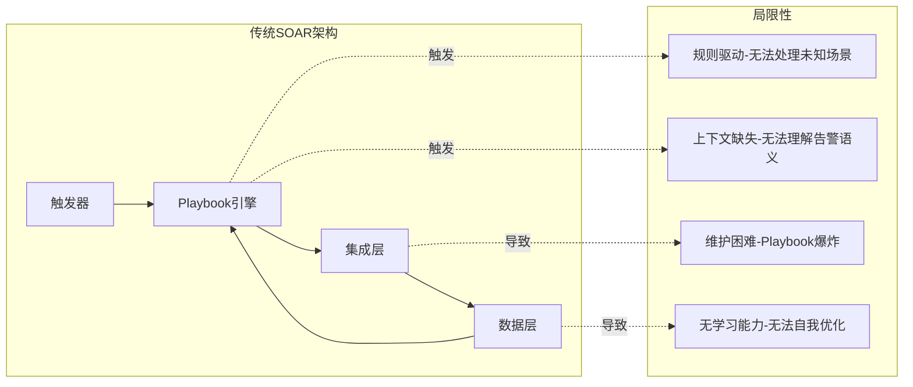
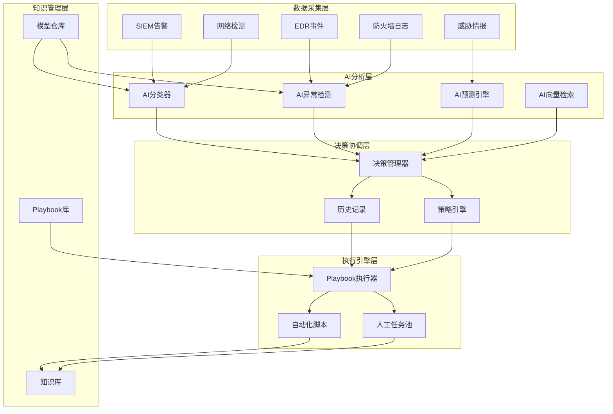
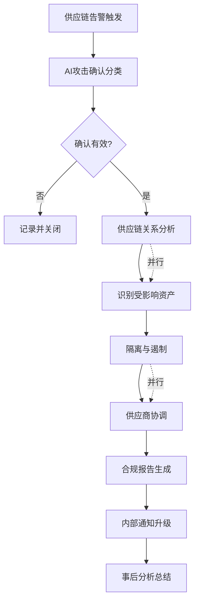

**作者：** HOS(安全风信子)
**日期：** 2026-04-23
**主要来源平台：** RSAC Conference/Gartner
**摘要：** 本文深入探讨AI与SOAR（安全编排自动化与响应）平台的融合之道。传统SOAR依赖规则驱动，在面对复杂多变的现代威胁时显得力不从心；AI技术的引入为SOAR带来了智能决策、自动化学习、预测性响应等新能力。本文从技术架构、核心能力、实战应用、实施路径等维度全面解析AI+SOAR融合的核心要点，为企业构建下一代智能安全运营平台提供完整指南。

@[TOC](目录)

---

# AI+SOAR融合：构建下一代智能安全运营平台

## 1. 引言：为什么SOAR需要AI

2026年的安全运营领域，SOAR（Security Orchestration, Automation and Response）平台已经成为大多数企业安全运营中心（SOC）的标准配置。然而，传统SOAR的局限性也日益凸显：它能够高效执行预定义的Playbook，却难以应对未知威胁；它能够自动化重复性工作，却无法处理需要判断力的复杂场景；它能够加速响应流程，却无法预测威胁发展趋势。

根据Forrester 2025年的调研数据，超过60%的企业在部署SOAR后的12个月内开始遇到"Playbook维护成本过高"和"自动化场景覆盖不足"的问题。这些问题的根本原因在于传统SOAR采用规则驱动的方式，难以适应快速变化的威胁环境。

AI技术的成熟为SOAR带来了革命性的升级机会。AI不仅能够理解自然语言、识别复杂模式、做出智能决策，还能够从历史数据中学习、预测未来威胁、自动优化运营流程。AI+SOAR的融合代表了下一代安全运营平台的发展方向，正在成为头部企业安全运营升级的首选方案。

本文将系统性地介绍AI+SOAR融合的技术架构、核心能力、实战应用和实施路径，帮助企业理解这一融合趋势的本质，掌握落地的关键要点。

---

## 2. AI+SOAR融合的技术架构

### 2.1 传统SOAR架构及其局限性

传统SOAR平台的核心架构围绕Playbook引擎构建，通过预定义的工作流程自动化安全响应。架构通常包括几个核心组件：触发器（Trigger）负责接收来自SIEM、EDR等安全工具的告警；Playbook引擎负责解析和执行预定义的响应流程；集成层负责与各类安全工具和网络系统对接；数据层负责存储Playbook、运行日志、分析报告。

这种架构的优势在于：标准化程度高，Playbook确保响应动作的一致性；可审计性强，所有操作都有记录可追溯；效率提升显著，自动执行替代了人工操作。然而，它的局限性也同样明显。

**规则驱动的根本局限**：传统SOAR本质上是规则引擎，只能执行预设的逻辑分支。面对未曾预设的场景，规则引擎要么拒绝执行，要么执行错误的分支。在勒索软件变种、高级持续性威胁（APT）等新型攻击面前，预先定义的规则往往失效。

**上下文理解的缺失**：规则引擎不理解告警的上下文语义，无法判断告警背后的真实意图。例如，一条告警可能触发"阻断连接"的规则，但规则无法判断这是正常业务行为还是真正的攻击。

**维护成本持续攀升**：随着企业安全工具增多、告警类型复杂化，Playbook的数量和复杂度呈指数级增长。维护这些Playbook需要大量人力，而安全人才的稀缺性使得这一成本不断攀升。

**缺乏学习和适应能力**：传统SOAR无法从历史事件中学习，无法根据运营反馈优化规则。每一次错误判断都需要人工介入修正，系统不会自动改进。



### 2.2 AI+SOAR融合架构设计

AI+SOAR融合架构在传统SOAR基础上引入AI层，实现规则驱动与AI驱动的协同工作。融合架构的核心设计原则是"AI增强而非替代"——AI负责智能决策，人类负责战略监督；自动化负责执行效率，人类负责异常处理。

融合架构分为五个核心层次：数据采集层负责从各类安全工具和数据源收集原始数据；AI分析层负责对数据进行智能分析，包括告警分类、异常检测、威胁预测等；决策协调层负责综合AI分析结果和业务策略，做出响应决策；执行引擎层负责协调Human-in-the-Loop机制，执行自动化响应动作；知识管理层负责管理AI模型、Playbook、历史案例等知识资产。



**AI分析层**是融合架构的"大脑"，包含四个核心AI引擎：

AI分类器负责对告警进行智能分类和优先级排序。它不仅能够识别已知攻击类型，还能够通过学习历史数据识别未知攻击模式。分类器采用多模型融合策略，结合传统ML模型和深度学习模型，确保分类的准确性和鲁棒性。

AI异常检测负责发现偏离正常模式的异常行为。它采用无监督学习算法，不需要标注数据即可发现异常。异常检测模型持续学习环境基线，自动适应正常行为的变化，减少误报。

AI预测引擎负责预测威胁发展趋势和潜在影响。它综合分析历史攻击模式、当前威胁情报、资产脆弱性等信息，预测可能发生的攻击和潜在影响范围。

AI向量检索负责从知识库中检索相关的历史案例、Playbook、最佳实践。它通过语义理解而非关键词匹配检索知识，确保检索结果的相关性和准确性。

**决策协调层**是融合架构的"中枢"，负责协调AI系统和Human-in-the-Loop机制的协同工作。决策管理器综合AI分析层的输出，结合预设的业务策略，做出是否自动化响应、是否需要人工介入的决策。策略引擎定义了不同场景下的响应规则和升级条件。Human-in-the-Loop机制确保关键决策经过人工确认。

**执行引擎层**负责实际响应动作的执行。Playbook执行器运行自动化工作流程，自动化脚本执行具体的技术操作，人工任务池管理需要人工介入的任务队列。执行引擎支持灵活的编排能力，能够根据决策协调层的指令动态调整执行路径。

### 2.3 关键技术组件详解

#### 2.3.1 智能告警分类引擎

智能告警分类引擎是AI+SOAR融合的核心组件之一，负责将海量告警进行智能分类和优先级排序。它的核心价值在于解决传统SOAR面临的告警过载问题，让分析师能够聚焦于真正重要的威胁。

```python
class IntelligentAlertClassifier:
    """
    智能告警分类引擎
    基于多模型融合的告警分类和优先级排序
    """
    
    def __init__(self, feature_engine, models, threshold_config):
        self.feature_engine = feature_engine
        self.models = models  # 多模型字典
        self.threshold_config = threshold_config
        
        # 分类类别定义
        self.alert_categories = {
            'true_positive': '确认为真实攻击',
            'false_positive': '误报',
            'needs_investigation': '需要进一步调查',
            'informational': '信息性告警'
        }
        
        # 优先级定义
        self.priority_levels = {
            'critical': 1,
            'high': 2,
            'medium': 3,
            'low': 4
        }
    
    def classify_alert(self, alert_data):
        """
        对告警进行智能分类
        
        参数:
            alert_data: 告警数据字典，包含告警的各类属性
        
        返回:
            dict: 分类结果，包含类别、优先级、置信度和解释
        """
        # 1. 特征提取
        features = self.feature_engine.extract(alert_data)
        
        # 2. 多模型推理
        model_predictions = {}
        for model_name, model in self.models.items():
            prediction = model.predict(features)
            model_predictions[model_name] = prediction
        
        # 3. 融合预测结果
        fused_prediction = self._fusion_predictions(model_predictions)
        
        # 4. 确定最终类别和优先级
        category = self._determine_category(fused_prediction)
        priority = self._determine_priority(alert_data, fused_prediction)
        
        # 5. 生成决策解释
        explanation = self._generate_explanation(
            alert_data, model_predictions, fused_prediction
        )
        
        return {
            'category': category,
            'priority': priority,
            'confidence': fused_prediction['confidence'],
            'model_agreements': self._check_model_agreement(model_predictions),
            'explanation': explanation,
            'recommended_actions': self._get_recommended_actions(category, priority),
            'similar_historical_alerts': self._find_similar_alerts(alert_data)
        }
    
    def _fusion_predictions(self, model_predictions):
        """
        多模型预测融合
        采用加权投票和置信度校准策略
        """
        # 提取各类别的投票和置信度
        category_votes = {cat: [] for cat in self.alert_categories.keys()}
        
        for model_name, pred in model_predictions.items():
            model_weight = self.models[model_name].weight
            category_votes[pred['category']].append({
                'confidence': pred['confidence'],
                'weight': model_weight
            })
        
        # 加权投票计算
        category_scores = {}
        for category, votes in category_votes.items():
            if votes:
                weighted_sum = sum(v['confidence'] * v['weight'] for v in votes)
                total_weight = sum(v['weight'] for v in votes)
                category_scores[category] = weighted_sum / total_weight
            else:
                category_scores[category] = 0
        
        # 选择得分最高的类别
        best_category = max(category_scores, key=category_scores.get)
        
        # 计算置信度（考虑模型一致性）
        all_predictions = [p['category'] for p in model_predictions.values()]
        model_agreement = all_predictions.count(best_category) / len(all_predictions)
        
        # 置信度 = 加权得分 × 模型一致性
        confidence = category_scores[best_category] * (0.5 + 0.5 * model_agreement)
        
        return {
            'category': best_category,
            'scores': category_scores,
            'confidence': confidence,
            'model_agreement': model_agreement
        }
    
    def _determine_priority(self, alert_data, prediction):
        """
        确定告警优先级
        综合考虑分类结果、资产重要性、威胁情报等因素
        """
        base_priority = self.priority_levels.get(
            alert_data.get('initial_priority', 'medium')
        )
        
        # 资产重要性调整
        asset_criticality = alert_data.get('asset', {}).get('criticality', 'medium')
        criticality_multiplier = {
            'critical': 0.5,
            'high': 0.75,
            'medium': 1.0,
            'low': 1.5
        }.get(asset_criticality, 1.0)
        
        # 威胁情报调整
        if alert_data.get('has_threat_intel_match'):
            threat_level = alert_data.get('threat_level', 'medium')
            threat_multiplier = {
                'critical': 0.5,
                'high': 0.7,
                'medium': 0.9,
                'low': 1.0
            }.get(threat_level, 1.0)
        else:
            threat_multiplier = 1.0
        
        # 计算最终优先级分数
        priority_score = base_priority * criticality_multiplier * threat_multiplier
        
        # 根据分数确定优先级
        if priority_score <= 0.7:
            return 'critical'
        elif priority_score <= 1.0:
            return 'high'
        elif priority_score <= 1.5:
            return 'medium'
        else:
            return 'low'
    
    def batch_classify(self, alerts, parallel=True):
        """
        批量分类告警
        支持并行处理提升效率
        """
        if parallel:
            # 使用线程池并行处理
            from concurrent.futures import ThreadPoolExecutor
            with ThreadPoolExecutor(max_workers=10) as executor:
                results = list(executor.map(self.classify_alert, alerts))
        else:
            results = [self.classify_alert(alert) for alert in alerts]
        
        # 按优先级排序
        results.sort(key=lambda x: self.priority_levels[x['priority']])
        
        return results
```

#### 2.3.2 自适应Playbook生成器

自适应Playbook生成器是AI+SOAR融合的另一核心组件，能够根据告警上下文自动生成或推荐响应Playbook。这一能力解决了传统SOAR面临的"Playbook维护爆炸"问题，让Playbook管理从人工维护转向智能生成。

```python
class AdaptivePlaybookGenerator:
    """
    自适应Playbook生成器
    基于AI的智能响应流程生成和优化
    """
    
    def __init__(self, playbook_templates, knowledge_base, llm):
        self.templates = playbook_templates
        self.kb = knowledge_base
        self.llm = llm
        
        # Playbook组件库
        self.action_blocks = self._load_action_blocks()
        self.decision_nodes = self._load_decision_nodes()
        self.integration_connectors = self._load_connectors()
    
    def generate_playbook(self, alert_context, target_response_time=None):
        """
        根据告警上下文生成Playbook
        
        参数:
            alert_context: 告警上下文，包含告警信息、资产信息、历史案例等
            target_response_time: 目标响应时间（秒）
        
        返回:
            dict: 生成的Playbook结构
        """
        # 1. 分析告警类型和特征
        alert_type = self._analyze_alert_type(alert_context)
        
        # 2. 检索相关历史Playbook
        similar_playbooks = self._find_similar_playbooks(alert_type)
        
        # 3. 检索相关最佳实践
        best_practices = self._retrieve_best_practices(alert_type)
        
        # 4. 确定必要的响应阶段
        response_stages = self._determine_response_stages(
            alert_context, similar_playbooks
        )
        
        # 5. 生成Playbook结构
        playbook = self._build_playbook_structure(
            alert_type, response_stages, best_practices
        )
        
        # 6. 优化Playbook效率
        if target_response_time:
            playbook = self._optimize_for_time(playbook, target_response_time)
        
        # 7. 验证Playbook完整性
        validation = self._validate_playbook(playbook)
        
        return {
            'playbook': playbook,
            'confidence': validation['confidence'],
            'similar_references': [p['id'] for p in similar_playbooks[:3]],
            'optimization_applied': target_response_time is not None,
            'validation_issues': validation.get('issues', [])
        }
    
    def _analyze_alert_type(self, alert_context):
        """分析告警类型和特征"""
        alert_data = alert_context.get('alert', {})
        alert_signature = alert_data.get('signature', '')
        
        # 提取告警特征
        features = {
            'category': self._categorize_alert(alert_data),
            'is_targeted': alert_context.get('targeted', False),
            'has_malware_indicators': self._check_malware_indicators(alert_data),
            'has_lateral_movement': self._check_lateral_movement(alert_data),
            'affected_asset_type': alert_context.get('asset', {}).get('type'),
            'threat_intel_level': alert_context.get('threat_intel_level', 'unknown')
        }
        
        # 查询知识库获取告警类型定义
        alert_type_def = self.kb.lookup_alert_type(
            features['category'], 
            features['affected_asset_type']
        )
        
        return {
            'features': features,
            'definition': alert_type_def,
            'standard_response_category': alert_type_def.get('category') if alert_type_def else 'general'
        }
    
    def _find_similar_playbooks(self, alert_type):
        """查找相似的历史Playbook"""
        query = f"""
        查找与告警类型 {alert_type['standard_response_category']} 相关的Playbook
        考虑因素：告警类别、资产类型、威胁等级
        """
        
        similar = self.kb.search_playbooks(
            query=query,
            filters={
                'alert_category': alert_type['standard_response_category'],
                'status': 'active',
                'usage_count': ('>', 10)  # 只返回使用次数超过10次的Playbook
            },
            top_k=5
        )
        
        return similar
    
    def _determine_response_stages(self, alert_context, similar_playbooks):
        """
        确定响应阶段
        基于告警特征和历史Playbook分析
        """
        stages = []
        
        # 基础响应阶段（通用）
        base_stages = [
            {'name': 'validate', 'description': '验证告警真实性', 'auto_execute': True},
            {'name': 'contain', 'description': '遏制威胁扩散', 'auto_execute': True},
            {'name': 'investigate', 'description': '调查事件根因', 'auto_execute': False},
            {'name': 'remediate', 'description': '清除威胁', 'auto_execute': False},
            {'name': 'post_incident', 'description': '事后分析总结', 'auto_execute': False}
        ]
        
        # 根据告警类型调整阶段
        alert_features = alert_context.get('features', {})
        
        if alert_features.get('has_malware_indicators'):
            # 恶意软件告警，增加恶意软件分析阶段
            stages.insert(2, {
                'name': 'malware_analysis',
                'description': '恶意软件样本分析',
                'auto_execute': True
            })
        
        if alert_features.get('has_lateral_movement'):
            # 横向移动告警，增加网络隔离阶段
            stages.insert(1, {
                'name': 'network_isolation',
                'description': '隔离受感染主机',
                'auto_execute': True
            })
        
        if alert_context.get('threat_intel_level') == 'critical':
            # 严重威胁，增加紧急升级阶段
            stages.insert(0, {
                'name': 'emergency_escalation',
                'description': '紧急升级通知',
                'auto_execute': True,
                'notification_roles': ['soc_manager', 'ciso']
            })
        
        # 合并历史Playbook的优秀实践
        for similar in similar_playbooks[:2]:
            for step in similar.get('steps', []):
                if step['name'] not in [s['name'] for s in stages]:
                    stages.append({
                        'name': step['name'],
                        'description': step['description'],
                        'auto_execute': step.get('auto_execute', False),
                        'source': 'best_practice',
                        'source_playbook': similar['id']
                    })
        
        return stages
    
    def _build_playbook_structure(self, alert_type, stages, best_practices):
        """
        构建Playbook结构
        """
        playbook_id = self._generate_playbook_id()
        
        steps = []
        step_order = 1
        
        for stage in stages:
            if stage['name'] == 'validate':
                steps.extend(self._generate_validation_steps(alert_type))
            elif stage['name'] == 'contain':
                steps.extend(self._generate_containment_steps(alert_type))
            elif stage['name'] == 'investigate':
                steps.extend(self._generate_investigation_steps(alert_type))
            elif stage['name'] == 'malware_analysis':
                steps.extend(self._generate_malware_steps())
            elif stage['name'] == 'network_isolation':
                steps.extend(self._generate_isolation_steps(alert_context))
            elif stage['name'] == 'remediate':
                steps.extend(self._generate_remediation_steps(alert_type))
            elif stage['name'] == 'post_incident':
                steps.extend(self._generate_post_incident_steps())
            
            step_order += len(steps)
        
        return {
            'id': playbook_id,
            'name': f"Auto-Generated: {alert_type['standard_response_category']}",
            'version': '1.0',
            'alert_type': alert_type,
            'stages': stages,
            'steps': steps,
            'created_by': 'adaptive_generator',
            'created_at': datetime.now().isoformat()
        }
    
    def optimize_existing_playbook(self, playbook_id, feedback_data):
        """
        根据使用反馈优化已有Playbook
        
        参数:
            playbook_id: Playbook ID
            feedback_data: 使用反馈数据，包含执行时间、成功率、人工介入点等
        """
        playbook = self.kb.get_playbook(playbook_id)
        
        # 分析反馈数据
        bottlenecks = self._identify_bottlenecks(feedback_data)
        unnecessary_steps = self._find_unnecessary_steps(feedback_data)
        manual_steps_candidate = self._find_manual_to_automate(feedback_data)
        
        # 生成优化建议
        optimizations = []
        
        if bottlenecks:
            optimizations.append({
                'type': 'parallelize',
                'steps': bottlenecks,
                'reason': '识别到执行瓶颈，建议并行化'
            })
        
        if unnecessary_steps:
            optimizations.append({
                'type': 'remove',
                'steps': unnecessary_steps,
                'reason': '步骤执行价值低，考虑移除'
            })
        
        if manual_steps_candidate:
            optimizations.append({
                'type': 'automate',
                'steps': manual_steps_candidate,
                'reason': '人工介入可以自动化'
            })
        
        # 应用优化
        optimized_playbook = self._apply_optimizations(playbook, optimizations)
        
        return {
            'original_id': playbook_id,
            'optimized_playbook': optimized_playbook,
            'optimizations_applied': optimizations,
            'expected_improvement': self._estimate_improvement(optimizations)
        }
```

#### 2.3.3 Human-in-the-Loop协调机制

Human-in-the-Loop（HitL）是AI+SOAR融合的关键设计模式，它确保AI系统的决策经过适当的人类监督，在自动化效率和风险控制之间取得平衡。HitL不是简单的人工审批，而是智能化的任务分配和协作机制。

```python
class HumanInTheLoopCoordinator:
    """
    Human-in-the-Loop协调器
    负责人工介入的智能调度和协作
    """
    
    def __init__(self, task_queue, notification_system, skills_db):
        self.task_queue = task_queue
        self.notify = notification_system
        self.skills_db = skills_db
        
        # 人工介入策略配置
        self.intervention_policies = {
            'high_value_asset': {
                'threshold': 'critical',
                'actions': ['contain', 'remediate'],
                'approvers': ['soc_manager']
            },
            'new_attack_pattern': {
                'threshold': 'high',
                'actions': ['investigate', 'analyze'],
                'approvers': ['threat_hunter']
            },
            'automated_action_failed': {
                'threshold': 'any',
                'actions': ['*'],
                'approvers': ['soc_analyst']
            },
            'low_confidence_ai': {
                'threshold': 0.7,  # AI置信度阈值
                'actions': ['*'],
                'approvers': self._get_role_by_confidence
            }
        }
    
    def should_intervene(self, context):
        """
        判断是否需要人工介入
        
        参数:
            context: 决策上下文，包含AI分析结果、告警信息等
        
        返回:
            dict: 介入决策详情
        """
        intervention_reasons = []
        
        # 1. 检查资产重要性
        asset = context.get('asset', {})
        if asset.get('criticality') == 'critical':
            intervention_reasons.append({
                'reason': '涉及关键资产',
                'policy': 'high_value_asset',
                'required_roles': self.intervention_policies['high_value_asset']['approvers']
            })
        
        # 2. 检查AI置信度
        ai_confidence = context.get('ai_confidence', 1.0)
        if ai_confidence < self.intervention_policies['low_confidence_ai']['threshold']:
            intervention_reasons.append({
                'reason': f"AI置信度低 ({ai_confidence:.2f})",
                'policy': 'low_confidence_ai',
                'required_roles': self._get_role_by_confidence(ai_confidence)
            })
        
        # 3. 检查是否为新型攻击
        if context.get('is_novel_attack'):
            intervention_reasons.append({
                'reason': '识别到新型攻击模式',
                'policy': 'new_attack_pattern',
                'required_roles': self.intervention_policies['new_attack_pattern']['approvers']
            })
        
        # 4. 检查自动化动作失败
        if context.get('automation_failed'):
            intervention_reasons.append({
                'reason': '自动化动作执行失败',
                'policy': 'automated_action_failed',
                'required_roles': self.intervention_policies['automated_action_failed']['approvers']
            })
        
        if intervention_reasons:
            return {
                'requires_intervention': True,
                'reasons': intervention_reasons,
                'task_priority': self._determine_task_priority(intervention_reasons),
                'estimated_complexity': self._estimate_complexity(context)
            }
        else:
            return {
                'requires_intervention': False,
                'reasons': [],
                'can_auto_proceed': True
            }
    
    def create_intervention_task(self, intervention_decision, original_context):
        """
        创建人工介入任务
        
        参数:
            intervention_decision: 介入决策
            original_context: 原始上下文
        
        返回:
            str: 任务ID
        """
        # 确定任务优先级
        priority_map = {
            'critical': 'urgent',
            'high': 'high',
            'medium': 'normal',
            'low': 'low'
        }
        
        task = {
            'id': self._generate_task_id(),
            'type': 'human_intervention',
            'priority': priority_map.get(intervention_decision['task_priority'], 'normal'),
            'reasons': intervention_decision['reasons'],
            'context': self._summarize_context(original_context),
            'ai_recommendation': original_context.get('ai_recommendation'),
            'required_roles': self._get_unique_roles(intervention_decision['reasons']),
            'sla_minutes': self._calculate_sla(intervention_decision),
            'created_at': datetime.now().isoformat(),
            'original_alert_id': original_context.get('alert_id')
        }
        
        # 保存任务
        self.task_queue.enqueue(task)
        
        # 通知相关人员
        self._notify_assignees(task)
        
        return task['id']
    
    def process_analyst_response(self, task_id, analyst_response):
        """
        处理分析师响应
        
        参数:
            task_id: 任务ID
            analyst_response: 分析师响应，包含决策和理由
        """
        task = self.task_queue.get_task(task_id)
        
        # 记录响应
        task['analyst_response'] = analyst_response
        task['completed_at'] = datetime.now().isoformat()
        task['analyst_id'] = analyst_response['analyst_id']
        
        # 更新知识库
        self._update_knowledge_base(task, analyst_response)
        
        # 如果分析师提供了新的见解，更新AI模型
        if analyst_response.get('new_insight'):
            self._trigger_model_update(task, analyst_response)
        
        # 返回决策给执行引擎
        return {
            'decision': analyst_response['decision'],
            'action_to_take': analyst_response.get('action'),
            'context_update': analyst_response.get('context_update', {})
        }
    
    def _get_role_by_confidence(self, confidence):
        """根据置信度确定需要的角色"""
        if confidence < 0.3:
            return ['soc_manager', 'threat_expert']
        elif confidence < 0.5:
            return ['senior_analyst']
        elif confidence < 0.7:
            return ['soc_analyst']
        else:
            return ['soc_analyst']  # 只需要普通分析师确认
```

#### 2.3.4 实时威胁情报聚合引擎

实时威胁情报聚合引擎是AI+SOAR融合架构中的关键数据处理组件，负责从多源威胁情报中提取、整合、标准化有价值的威胁信息，为AI分析层提供高质量的数据输入。威胁情报的来源非常多样，包括商业威胁情报订阅、开源威胁情报Feed、ISAC组织共享情报、行业威胁共享组织、地下论坛监控数据等。这些情报格式各异、质量参差不齐、更新频率不同，需要通过智能聚合引擎进行统一处理。

```python
class ThreatIntelligenceAggregator:
    """
    实时威胁情报聚合引擎
    多源威胁情报的智能整合与标准化
    """
    
    def __init__(self, intel_sources, ai_normalizer, deduplication_engine):
        self.sources = intel_sources
        self.normalizer = ai_normalizer
        self.dedup = deduplication_engine
        
        self.source_configs = {
            'commercial': {
                'priority': 0.9,
                'update_frequency': 300,
                'reliability_weight': 0.8
            },
            'osint': {
                'priority': 0.6,
                'update_frequency': 900,
                'reliability_weight': 0.5
            },
            'industry_share': {
                'priority': 0.7,
                'update_frequency': 600,
                'reliability_weight': 0.6
            }
        }
    
    def aggregate_intelligence(self, time_window_minutes=60):
        """聚合多源威胁情报"""
        raw_intel = []
        
        for source_name, source in self.sources.items():
            try:
                intel_data = source.fetch_recent(time_window_minutes)
                enriched_intel = self._enrich_intel(intel_data, source_name)
                raw_intel.extend(enriched_intel)
            except Exception as e:
                logging.error(f"Failed to fetch from {source_name}: {e}")
        
        normalized_intel = [self.normalizer.normalize(item) for item in raw_intel]
        deduplicated_intel = self.dedup.deduplicate(normalized_intel)
        correlated_intel = self._correlate_intel(deduplicated_intel)
        scored_intel = self._score_intel(correlated_intel)
        prioritized_intel = self._prioritize_intel(scored_intel)
        
        return {
            'summary': {
                'total_raw': len(raw_intel),
                'total_deduplicated': len(deduplicated_intel),
                'total_prioritized': len(prioritized_intel)
            },
            'all_intel': prioritized_intel
        }
    
    def _enrich_intel(self, intel_list, source_name):
        """enrichment threat intelligence with metadata"""
        config = self.source_configs.get(source_name, {})
        
        enriched = []
        for item in intel_list:
            enriched_item = {
                **item,
                'source': source_name,
                'source_priority': config.get('priority', 0.5),
                'reliability_weight': config.get('reliability_weight', 0.5),
                'fetched_at': datetime.now().isoformat()
            }
            enriched.append(enriched_item)
        
        return enriched
    
    def _correlate_intel(self, intel_list):
        """关联相关威胁情报"""
        ioc_index = {}
        correlated = []
        
        for intel in intel_list:
            if intel.get('type') == 'ioc':
                ioc_key = f"{intel.get('indicator_type')}:{intel.get('indicator_value')}"
                if ioc_key not in ioc_index:
                    ioc_index[ioc_key] = []
                ioc_index[ioc_key].append(intel)
        
        for ioc_key, related_intels in ioc_index.items():
            if len(related_intels) > 1:
                primary = related_intels[0]
                primary['related_intel_count'] = len(related_intels)
                primary['corroborated'] = True
                correlated.append(primary)
            else:
                correlated.extend(related_intels)
        
        return correlated
    
    def _score_intel(self, intel_list):
        """计算威胁情报评分"""
        for intel in intel_list:
            base_score = 0.5
            
            reliability_factor = intel.get('reliability_weight', 0.5)
            base_score *= (0.5 + reliability_factor * 0.5)
            
            source_priority = intel.get('source_priority', 0.5)
            base_score *= (0.5 + source_priority * 0.5)
            
            if intel.get('corroborated'):
                base_score *= 1.3
            
            intel['threat_score'] = min(round(base_score, 3), 1.0)
            
            if intel['threat_score'] >= 0.8:
                intel['threat_level'] = 'critical'
            elif intel['threat_score'] >= 0.6:
                intel['threat_level'] = 'high'
            elif intel['threat_score'] >= 0.4:
                intel['threat_level'] = 'medium'
            else:
                intel['threat_level'] = 'low'
        
        return intel_list
    
    def _prioritize_intel(self, intel_list):
        """根据优先级排序"""
        priority_order = {'critical': 0, 'high': 1, 'medium': 2, 'low': 3}
        
        return sorted(
            intel_list,
            key=lambda x: (priority_order.get(x.get('threat_level', 'low'), 3), -x.get('threat_score', 0))
        )
```

#### 2.3.5 知识图谱构建与维护系统

知识图谱是AI+SOAR融合架构中支撑智能决策的核心基础设施，它将企业安全运营相关的实体、概念、关系进行结构化组织，为AI系统提供可理解的上下文知识。安全运营知识图谱包含多种实体类型：资产实体（主机、网络设备、应用、数据资产）、威胁实体（攻击者、恶意软件、漏洞、攻击手法）、响应实体（Playbook、响应动作、处置流程）、人员实体（分析师、运维人员、管理层）。

```python
class SecurityKnowledgeGraph:
    """
    安全运营知识图谱系统
    构建和维护企业安全知识库
    """
    
    def __init__(self, graph_db, nlp_engine, entity_extractor):
        self.graph = graph_db
        self.nlp = nlp_engine
        self.entity_extractor = entity_extractor
        
        self.entity_types = [
            'asset', 'threat_actor', 'malware', 'vulnerability',
            'attack_pattern', 'playbook', 'response_action', 'person'
        ]
    
    def build_from_documents(self, documents):
        """从文档构建知识图谱"""
        for doc in documents:
            entities = self._extract_entities(doc)
            
            for entity in entities:
                self._upsert_entity(entity)
            
            relations = self._extract_relations(doc, entities)
            for relation in relations:
                self._upsert_relation(relation)
        
        return {'entities_added': len(documents), 'status': 'completed'}
    
    def _extract_entities(self, document):
        """从文档中提取实体"""
        text_content = self._extract_text(document)
        extracted = self.entity_extractor.extract(text_content)
        
        entities = []
        for item in extracted:
            entity = {
                'id': self._generate_entity_id(item['name'], item['type']),
                'name': item['name'],
                'type': item['type'],
                'properties': item.get('properties', {}),
                'confidence': item.get('confidence', 0.8),
                'source_document': document.get('id')
            }
            entities.append(entity)
        
        return entities
    
    def query_attack_path(self, source_asset, target_asset):
        """查询攻击路径"""
        query = """
        MATCH path = (source:Asset {name: $source_name})
               -[:connects_to|depends_on*1..5]->
               (target:Asset {name: $target_name})
        RETURN path
        """
        
        results = self.graph.execute_query(
            query,
            {'source_name': source_asset, 'target_name': target_asset}
        )
        
        return [self._format_attack_path(r['path']) for r in results]
    
    def find_related_threats(self, entity_name):
        """查找与实体相关的威胁"""
        query = """
        MATCH (entity {name: $entity_name})-[*]-(related)
        WHERE related.type STARTS WITH 'threat' 
           OR related.type = 'vulnerability'
        RETURN related
        ORDER BY related.threat_level DESC
        """
        
        return self.graph.execute_query(query, {'entity_name': entity_name})
    
    def suggest_playbooks(self, threat_description):
        """根据威胁描述推荐Playbook"""
        threat_entities = self.entity_extractor.extract(threat_description)
        threat_types = [e['name'] for e in threat_entities 
                       if e['type'] in ['attack_pattern', 'malware', 'vulnerability']]
        
        if not threat_types:
            return []
        
        query = """
        MATCH (playbook:Playbook)
        WHERE ANY(threat IN $threat_types 
            WHERE playbook.applicable_threats CONTAINS threat)
        RETURN playbook
        ORDER BY playbook.usage_count DESC
        LIMIT 5
        """
        
        return self.graph.execute_query(query, {'threat_types': threat_types})
```

知识图谱在AI+SOAR中的应用主要体现在三个方面：告警上下文丰富化，为告警添加丰富的上下文信息用于辅助判断；攻击路径推理，帮助理解攻击发展趋势并提前部署防御；智能问答与决策支持，为分析师提供基于知识的问答服务。

---

## 3. AI+SOAR融合的核心能力升级

### 3.1 智能告警降噪与优先级排序

告警疲劳是SOC面临的最大挑战之一。根据IBM 2025年调研数据，大型企业SOC每天处理的有效告警中，真正的安全事件占比不足5%。分析师大量时间浪费在误报排查上，不仅效率低下，更导致真正的威胁被忽略。AI+SOAR融合带来的首要能力升级就是智能告警降噪和优先级排序。

智能告警降噪的核心原理是利用机器学习模型学习历史告警的特征，自动识别误报模式。模型不仅考虑告警本身的特征，还综合分析告警上下文、资产信息、威胁情报、时间序列模式等多维度信息，实现精准的降噪。

```python
class SmartAlertDenoiser:
    """
    智能告警降噪引擎
    基于多维度上下文分析的告警分类
    """
    
    def __init__(self, alert_history_db, asset_db, threat_intel_db):
        self.alert_history = alert_history_db
        self.asset_db = asset_db
        self.threat_intel = threat_intel_db
        
        # 降噪模型配置
        self.feature_weights = {
            'historical_similarity': 0.25,
            'asset_context': 0.20,
            'threat_intel': 0.20,
            'temporal_pattern': 0.15,
            'correlation': 0.10,
            'Behavioral_baseline': 0.10
        }
    
    def denoise_batch(self, alerts):
        """
        批量降噪处理
        
        参数:
            alerts: 告警列表
        
        返回:
            dict: 降噪结果，包含分类结果和统计信息
        """
        results = []
        
        for alert in alerts:
            # 1. 提取告警特征
            features = self._extract_features(alert)
            
            # 2. 计算各维度得分
            scores = self._calculate_dimension_scores(features)
            
            # 3. 综合评估
            final_score = self._calculate_final_score(scores)
            
            # 4. 确定是否为误报
            is_false_positive = final_score < self._get_threshold(alert)
            
            # 5. 提取引用信息
            evidence = self._extract_evidence(features, scores)
            
            results.append({
                'alert_id': alert['id'],
                'is_false_positive': is_false_positive,
                'confidence': abs(final_score - 0.5) * 2,
                'scores': scores,
                'evidence': evidence,
                'recommended_action': 'suppress' if is_false_positive else 'process'
            })
        
        # 统计信息
        stats = {
            'total_alerts': len(alerts),
            'false_positives': sum(1 for r in results if r['is_false_positive']),
            'true_positives': sum(1 for r in results if not r['is_false_positive']),
            'noise_reduction_rate': sum(1 for r in results if r['is_false_positive']) / len(alerts)
        }
        
        return {
            'results': results,
            'statistics': stats
        }
    
    def _extract_features(self, alert):
        """提取告警的多维特征"""
        features = {}
        
        # 基础告警特征
        features['alert_type'] = alert.get('type')
        features['alert_source'] = alert.get('source')
        features['severity'] = alert.get('severity')
        features['signature'] = alert.get('signature')
        
        # 资产上下文
        asset_id = alert.get('asset_id')
        if asset_id:
            asset = self.asset_db.get(asset_id)
            features['asset_criticality'] = asset.get('criticality', 'medium')
            features['asset_type'] = asset.get('type')
            features['asset_owner'] = asset.get('owner')
        
        # 历史相似告警
        features['historical_similar'] = self._find_historical_similar(alert)
        
        # 威胁情报匹配
        features['threat_intel_match'] = self._check_threat_intel(alert)
        
        # 时间模式
        features['temporal_pattern'] = self._analyze_temporal(alert)
        
        # 关联告警
        features['correlated_alerts'] = self._find_correlated(alert)
        
        return features
    
    def _calculate_dimension_scores(self, features):
        """计算各维度得分"""
        scores = {}
        
        # 历史相似度评分
        if features['historical_similar']['count'] > 0:
            similar_fp_rate = features['historical_similar']['false_positive_rate']
            scores['historical_similarity'] = similar_fp_rate
        else:
            scores['historical_similarity'] = 0.5  # 无历史数据，中立
        
        # 资产上下文评分
        asset_score = {
            'critical': 0.2,
            'high': 0.4,
            'medium': 0.5,
            'low': 0.7
        }.get(features.get('asset_criticality'), 0.5)
        scores['asset_context'] = asset_score
        
        # 威胁情报评分
        if features['threat_intel_match']['matched']:
            threat_level = features['threat_intel_match'].get('threat_level', 'medium')
            scores['threat_intel'] = {
                'critical': 0.1,
                'high': 0.2,
                'medium': 0.4,
                'low': 0.6
            }.get(threat_level, 0.5)
        else:
            scores['threat_intel'] = 0.5
        
        # 时间模式评分
        time_score = 0.5
        if features['temporal_pattern']['is_business_hours']:
            time_score = 0.4  # 业务时间更可能是真告警
        if features['temporal_pattern']['is_recurring']:
            time_score = 0.7  # 周期性重复更可能是误报
        scores['temporal_pattern'] = time_score
        
        # 关联告警评分
        if features['correlated_alerts']['count'] > 3:
            scores['correlation'] = 0.2  # 多个关联告警更可能是真告警
        elif features['correlated_alerts']['count'] == 0:
            scores['correlation'] = 0.6  # 孤立告警更可能是误报
        else:
            scores['correlation'] = 0.4
        
        # 行为基线评分
        if features['alert_type'] in ['login_failure', 'file_access']:
            baseline_deviation = features.get('behavioral_baseline', {}).get('deviation', 0)
            scores['behavioral_baseline'] = min(baseline_deviation / 3, 1.0)  # 偏离越大越可能是真告警
        else:
            scores['behavioral_baseline'] = 0.5
        
        return scores
    
    def _calculate_final_score(self, scores):
        """计算综合得分（0-1，越低越可能是误报）"""
        final_score = sum(
            scores[dimension] * weight
            for dimension, weight in self.feature_weights.items()
        )
        return final_score
    
    def _get_threshold(self, alert):
        """
        获取动态阈值
        根据告警类型和场景调整阈值
        """
        base_threshold = 0.5
        
        # 资产重要性调整
        asset = self.asset_db.get(alert.get('asset_id'))
        if asset and asset.get('criticality') == 'critical':
            base_threshold = 0.3  # 关键资产降低阈值，减少误报漏过
        
        # 告警类型调整
        alert_type = alert.get('type')
        if alert_type in ['malware', 'ransomware', 'data_exfiltration']:
            base_threshold = 0.3  # 高危告警类型降低阈值
        
        return base_threshold
```

### 3.2 预测性威胁响应

传统SOAR只能被动响应已发生的威胁，而AI+SOAR融合带来了预测性威胁响应能力。通过综合分析威胁情报、漏洞数据、资产信息、历史事件等多源数据，AI能够预测潜在的攻击并提前响应，在威胁发生之前将其阻止。

预测性响应的核心价值在于将安全运营从"被动防御"转向"主动防御"。它不仅能够缩短MTTD（平均检测时间），更能够从根本上降低攻击成功的可能性。

```python
class PredictiveThreatResponder:
    """
    预测性威胁响应引擎
    基于威胁预测的主动防御系统
    """
    
    def __init__(self, threat_intel_db, vuln_db, asset_db, alert_system):
        self.threat_intel = threat_intel_db
        self.vuln = vuln_db
        self.asset = asset_db
        self.alert = alert_system
        
        # 预测模型配置
        self.prediction_horizons = {
            'immediate': 24,      # 24小时内
            'short_term': 7 * 24,  # 7天内
            'medium_term': 30 * 24 # 30天内
        }
    
    def predict_threats(self, horizon='immediate'):
        """
        预测指定时间范围内的威胁
        
        参数:
            horizon: 预测时间范围
        
        返回:
            list: 预测的威胁列表
        """
        threats = []
        
        # 1. 获取最新威胁情报
        recent_threats = self.threat_intel.get_recent(limit=50)
        
        # 2. 获取活跃漏洞
        active_vulns = self.vuln.get_active(criticality=['critical', 'high'])
        
        # 3. 获取高价值资产
        high_value_assets = self.asset.get_high_value()
        
        # 4. 生成威胁预测
        for threat in recent_threats:
            predicted_attacks = self._predict_attack_scenarios(
                threat, active_vulns, high_value_assets
            )
            threats.extend(predicted_attacks)
        
        # 5. 按风险评分排序
        threats.sort(key=lambda x: x['risk_score'], reverse=True)
        
        # 6. 过滤低风险预测
        threats = [t for t in threats if t['risk_score'] >= 0.5]
        
        return threats
    
    def _predict_attack_scenarios(self, threat, vulnerabilities, assets):
        """
        预测特定威胁的可能攻击场景
        """
        scenarios = []
        
        # 分析威胁特征
        threat_ttps = threat.get('ttps', [])
        threat_malware = threat.get('associated_malware', [])
        
        # 匹配相关漏洞
        relevant_vulns = self._match_vulnerabilities(
            threat, vulnerabilities
        )
        
        # 匹配潜在目标资产
        potential_targets = self._match_potential_targets(
            threat, assets, relevant_vulns
        )
        
        # 生成攻击场景
        for vuln in relevant_vulns:
            for asset in potential_targets:
                if self._is_exploitable(vuln, asset):
                    scenario = {
                        'id': self._generate_scenario_id(),
                        'threat_id': threat['id'],
                        'threat_name': threat['name'],
                        'vulnerability': vuln,
                        'target_asset': asset,
                        'attack_vector': self._determine_attack_vector(vuln, asset),
                        'predicted_timeline': self._predict_timeline(threat, vuln),
                        'risk_score': self._calculate_risk_score(threat, vuln, asset),
                        'recommended_prevention': self._get_prevention_actions(
                            threat, vuln, asset
                        ),
                        'confidence': self._calculate_confidence(threat, vuln)
                    }
                    scenarios.append(scenario)
        
        return scenarios
    
    def _calculate_risk_score(self, threat, vulnerability, asset):
        """
        计算风险评分
        综合考虑威胁等级、漏洞可利用性、资产价值
        """
        # 威胁等级得分 (0-1，越高威胁越大)
        threat_score = {
            'critical': 1.0,
            'high': 0.75,
            'medium': 0.5,
            'low': 0.25
        }.get(threat.get('severity'), 0.5)
        
        # 漏洞可利用性得分 (0-1，越高越容易被利用)
        exploitability_score = self._calculate_exploitability(vulnerability)
        
        # 资产价值得分 (0-1，越高资产越重要)
        asset_value_score = {
            'critical': 1.0,
            'high': 0.75,
            'medium': 0.5,
            'low': 0.25
        }.get(asset.get('value'), 0.5)
        
        # 综合风险评分
        risk_score = (
            threat_score * 0.4 +
            exploitability_score * 0.3 +
            asset_value_score * 0.3
        )
        
        return round(risk_score, 3)
    
    def trigger_predictive_response(self, predicted_threats):
        """
        触发预测性响应
        对预测的威胁采取预防措施
        """
        response_actions = []
        
        for threat in predicted_threats:
            if threat['risk_score'] >= 0.8:
                # 高风险：立即采取行动
                actions = self._plan_immediate_response(threat)
            elif threat['risk_score'] >= 0.6:
                # 中高风险：增强监控
                actions = self._plan_monitoring_enhancement(threat)
            else:
                # 中等风险：记录并跟踪
                actions = self._plan_tracking(threat)
            
            response_actions.append({
                'threat': threat,
                'actions': actions,
                'triggered_at': datetime.now().isoformat()
            })
        
        # 执行响应动作
        for response in response_actions:
            self._execute_response_actions(response['actions'])
        
        return response_actions
```

### 3.3 智能响应策略优化

AI+SOAR融合带来的第三项核心能力是智能响应策略优化。传统SOAR的Playbook需要人工维护和优化，而AI系统能够从历史执行数据中学习，自动发现策略缺陷并提出优化建议，实现Playbook的持续自我进化。

```python
class ResponseStrategyOptimizer:
    """
    响应策略优化器
    基于历史数据的Playbook自动优化
    """
    
    def __init__(self, playbook_db, execution_log_db, feedback_db):
        self.playbook_db = playbook_db
        self.execution_log = execution_log_db
        self.feedback_db = feedback_db
    
    def analyze_playbook_effectiveness(self, playbook_id):
        """
        分析指定Playbook的有效性
        
        参数:
            playbook_id: Playbook ID
        
        返回:
            dict: 有效性分析报告
        """
        # 获取Playbook信息
        playbook = self.playbook_db.get(playbook_id)
        
        # 获取执行历史
        execution_history = self.execution_log.get_by_playbook(playbook_id)
        
        # 计算关键指标
        metrics = self._calculate_effectiveness_metrics(execution_history)
        
        # 分析效率瓶颈
        bottlenecks = self._identify_bottlenecks(execution_history)
        
        # 分析决策质量
        decision_quality = self._analyze_decision_quality(execution_history)
        
        # 生成优化建议
        optimizations = self._generate_optimization_suggestions(
            metrics, bottlenecks, decision_quality
        )
        
        return {
            'playbook_id': playbook_id,
            'playbook_name': playbook['name'],
            'metrics': metrics,
            'bottlenecks': bottlenecks,
            'decision_quality': decision_quality,
            'optimizations': optimizations,
            'overall_score': self._calculate_overall_score(metrics)
        }
    
    def _calculate_effectiveness_metrics(self, execution_history):
        """计算有效性指标"""
        total_executions = len(execution_history)
        
        if total_executions == 0:
            return {'message': 'No execution history'}
        
        # 成功率
        successful = sum(1 for e in execution_history if e['status'] == 'success')
        success_rate = successful / total_executions
        
        # 平均执行时间
        avg_execution_time = sum(
            e['duration_seconds'] for e in execution_history
        ) / total_executions
        
        # 人工介入率
        human_intervention = sum(
            1 for e in execution_history if e.get('human_intervention_required')
        )
        intervention_rate = human_intervention / total_executions
        
        # 目标达成率
        objective_achieved = sum(
            1 for e in execution_history if e.get('objective_achieved')
        )
        objective_rate = objective_achieved / total_executions
        
        # MTTD改进（与基准对比）
        baseline_mttd = 3600  # 基准1小时
        avg_mttd = sum(
            e.get('mttd_seconds', baseline_mttd) for e in execution_history
        ) / total_executions
        mttd_improvement = (baseline_mttd - avg_mttd) / baseline_mttd
        
        # MTTR改进
        baseline_mttr = 7200  # 基准2小时
        avg_mttr = sum(
            e.get('mttr_seconds', baseline_mttr) for e in execution_history
        ) / total_executions
        mttr_improvement = (baseline_mttr - avg_mttr) / baseline_mttr
        
        return {
            'total_executions': total_executions,
            'success_rate': round(success_rate, 3),
            'avg_execution_time_seconds': round(avg_execution_time, 2),
            'human_intervention_rate': round(intervention_rate, 3),
            'objective_achievement_rate': round(objective_rate, 3),
            'mttd_improvement': round(mttd_improvement, 3),
            'mttr_improvement': round(mttr_improvement, 3)
        }
    
    def _identify_bottlenecks(self, execution_history):
        """识别执行瓶颈"""
        bottlenecks = []
        
        # 分析各步骤的执行时间
        step_times = {}
        for execution in execution_history:
            for step in execution.get('steps', []):
                step_name = step['name']
                if step_name not in step_times:
                    step_times[step_name] = []
                step_times[step_name].append(step['duration_seconds'])
        
        # 找出执行时间过长的步骤
        for step_name, times in step_times.items():
            avg_time = sum(times) / len(times)
            if avg_time > 300:  # 超过5分钟
                bottlenecks.append({
                    'type': 'slow_step',
                    'step': step_name,
                    'avg_time_seconds': avg_time,
                    'impact': 'high' if avg_time > 600 else 'medium'
                })
        
        # 分析人工介入点
        intervention_steps = {}
        for execution in execution_history:
            for step in execution.get('steps', []):
                if step.get('required_human_intervention'):
                    step_name = step['name']
                    intervention_steps[step_name] = intervention_steps.get(step_name, 0) + 1
        
        for step_name, count in intervention_steps.items():
            if count > len(execution_history) * 0.3:  # 超过30%的执行需要人工介入
                bottlenecks.append({
                    'type': 'frequent_intervention',
                    'step': step_name,
                    'intervention_count': count,
                    'impact': 'high'
                })
        
        return bottlenecks
    
    def _generate_optimization_suggestions(self, metrics, bottlenecks, decision_quality):
        """生成优化建议"""
        suggestions = []
        
        # 基于指标的优化建议
        if metrics.get('human_intervention_rate', 0) > 0.3:
            suggestions.append({
                'category': 'automation',
                'priority': 'high',
                'description': '人工介入率过高，建议将更多决策自动化',
                'target_metric': 'human_intervention_rate'
            })
        
        if metrics.get('success_rate', 0) < 0.8:
            suggestions.append({
                'category': 'reliability',
                'priority': 'high',
                'description': '成功率偏低，建议审查Playbook逻辑',
                'target_metric': 'success_rate'
            })
        
        # 基于瓶颈的优化建议
        for bottleneck in bottlenecks:
            if bottleneck['type'] == 'slow_step':
                suggestions.append({
                    'category': 'performance',
                    'priority': 'medium',
                    'description': f"步骤 '{bottleneck['step']}' 执行时间过长，考虑优化或并行化",
                    'target_step': bottleneck['step']
                })
            elif bottleneck['type'] == 'frequent_intervention':
                suggestions.append({
                    'category': 'automation',
                    'priority': 'high',
                    'description': f"步骤 '{bottleneck['step']}' 频繁需要人工介入，考虑自动化或简化",
                    'target_step': bottleneck['step']
                })
        
        return suggestions
```

---

## 4. AI+SOAR融合的实战应用场景

### 4.1 场景一：自动化钓鱼邮件响应

钓鱼邮件是大多数企业面临的最常见攻击向量之一，也是SOAR自动化的典型应用场景。AI+SOAR融合后，能够实现更智能、更高效的钓鱼邮件响应。

传统的钓鱼邮件响应流程通常包括：用户报告钓鱼邮件→安全团队确认→手动提取IOC→手动在各个安全工具上配置阻断规则→通知受影响用户。整个过程耗时长、人力投入大，且容易出错。

AI+SOAR融合后的自动化流程为：邮件系统触发告警→AI分析引擎自动判断邮件是否为钓鱼→如确认，自动提取IOC并生成威胁情报→自动在邮件网关、终端安全、网络安全设备上配置阻断规则→自动搜索类似邮件并隔离→自动通知受影响用户并提供培训提示。

```python
class PhishingResponsePlaybook:
    """
    钓鱼邮件响应Playbook
    AI+SOAR融合的典型应用场景
    """
    
    def __init__(self, email_security, endpoint_security, network_security, user_notification):
        self.email_security = email_security
        self.endpoint = endpoint_security
        self.network = network_security
        self.notify = user_notification
    
    def execute(self, phishing_alert):
        """
        执行钓鱼邮件响应
        
        参数:
            phishing_alert: 钓鱼告警数据
        """
        response_log = {
            'start_time': datetime.now(),
            'alert_id': phishing_alert['id'],
            'steps': []
        }
        
        # Step 1: AI分析确认
        analysis_result = self._ai_analyze_phishing(phishing_alert)
        response_log['steps'].append({
            'name': 'ai_analysis',
            'result': analysis_result,
            'confidence': analysis_result['confidence']
        })
        
        if not analysis_result['is_phishing']:
            response_log['status'] = 'false_positive'
            response_log['end_time'] = datetime.now()
            return response_log
        
        # Step 2: IOC提取
        iocs = self._extract_iocs(phishing_alert)
        response_log['steps'].append({
            'name': 'ioc_extraction',
            'iocs': iocs
        })
        
        # Step 3: 邮件系统响应
        email_response = self._email_system_response(phishing_alert, iocs)
        response_log['steps'].append({
            'name': 'email_response',
            'actions_taken': email_response
        })
        
        # Step 4: 终端响应
        endpoint_response = self._endpoint_response(iocs)
        response_log['steps'].append({
            'name': 'endpoint_response',
            'actions_taken': endpoint_response
        })
        
        # Step 5: 网络响应
        network_response = self._network_response(iocs)
        response_log['steps'].append({
            'name': 'network_response',
            'actions_taken': network_response
        })
        
        # Step 6: 用户通知
        user_response = self._notify_affected_users(phishing_alert, iocs)
        response_log['steps'].append({
            'name': 'user_notification',
            'users_notified': user_response['count']
        })
        
        response_log['status'] = 'success'
        response_log['end_time'] = datetime.now()
        response_log['total_duration'] = (
            response_log['end_time'] - response_log['start_time']
        ).total_seconds()
        
        return response_log
    
    def _ai_analyze_phishing(self, alert):
        """AI分析钓鱼邮件"""
        # 使用NLP模型分析邮件内容
        email_content = alert.get('email_content', '')
        
        # 特征提取
        features = {
            'has_suspicious_links': self._check_suspicious_links(email_content),
            'has_suspicious_attachments': self._check_suspicious_attachments(email_content),
            'sender_reputation': self._check_sender_reputation(alert.get('sender')),
            'subject_suspicious': self._check_subject_patterns(alert.get('subject')),
            'content_suspicious': self._check_content_patterns(email_content)
        }
        
        # AI模型判断
        phishing_score = self._calculate_phishing_score(features)
        
        return {
            'is_phishing': phishing_score > 0.7,
            'confidence': phishing_score,
            'features': features
        }
```

### 4.2 场景二：勒索软件联动响应

勒索软件攻击是当前企业面临的最严重安全威胁之一，一旦中招可能导致业务全面中断。AI+SOAR融合后，能够实现勒索软件的快速检测和自动化响应，最大限度减少损失。

```python
class RansomwareResponsePlaybook:
    """
    勒索软件联动响应Playbook
    实现勒索软件的快速检测和自动化响应
    """
    
    def __init__(self, edr, backup_system, network_isolation, incident_response):
        self.edr = edr
        self.backup = backup_system
        self.isolation = network_isolation
        self.incident = incident_response
    
    def execute(self, ransomware_alert):
        """
        执行勒索软件响应
        """
        response_timeline = []
        
        # T+0: 检测确认
        t0 = datetime.now()
        detection = self._confirm_ransomware(ransomware_alert)
        response_timeline.append({
            'time': 'T+0',
            'action': 'detection_confirmed',
            'duration_seconds': 0,
            'result': detection
        })
        
        if not detection['confirmed']:
            return {'status': 'false_positive', 'timeline': response_timeline}
        
        # T+1: 紧急隔离（目标30秒内完成）
        t1 = datetime.now()
        isolation_result = self._emergency_isolate(ransomware_alert)
        duration = (datetime.now() - t1).total_seconds()
        response_timeline.append({
            'time': 'T+1',
            'action': 'emergency_isolation',
            'duration_seconds': duration,
            'result': isolation_result,
            'target_sla': 30
        })
        
        # T+2: 备份保护（目标2分钟内完成）
        t2 = datetime.now()
        backup_protection = self._protect_backups()
        duration = (datetime.now() - t2).total_seconds()
        response_timeline.append({
            'time': 'T+2',
            'action': 'backup_protection',
            'duration_seconds': duration,
            'result': backup_protection,
            'target_sla': 120
        })
        
        # T+3: 影响范围评估
        t3 = datetime.now()
        impact_assessment = self._assess_impact(ransomware_alert)
        duration = (datetime.now() - t3).total_seconds()
        response_timeline.append({
            'time': 'T+3',
            'action': 'impact_assessment',
            'duration_seconds': duration,
            'result': impact_assessment
        })
        
        # T+4: 恢复启动（如有备份）
        if backup_protection['backup_available']:
            t4 = datetime.now()
            recovery = self._initiate_recovery(impact_assessment)
            duration = (datetime.now() - t4).total_seconds()
            response_timeline.append({
                'time': 'T+4',
                'action': 'recovery_initiated',
                'duration_seconds': duration,
                'result': recovery
            })
        
        # T+5: 事件升级和通知
        t5 = datetime.now()
        escalation = self._escalate_incident(ransomware_alert, impact_assessment)
        duration = (datetime.now() - t5).total_seconds()
        response_timeline.append({
            'time': 'T+5',
            'action': 'incident_escalation',
            'duration_seconds': duration,
            'result': escalation
        })
        
        return {
            'status': 'completed',
            'timeline': response_timeline,
            'summary': self._generate_summary(response_timeline)
        }
    
    def _emergency_isolate(self, alert):
        """
        紧急隔离受感染主机
        目标SLA: 30秒内完成
        """
        infected_hosts = alert.get('affected_hosts', [])
        
        results = []
        for host in infected_hosts:
            # 网络隔离
            network_result = self.isolation.isolate_host(host['id'])
            
            # EDR隔离
            edr_result = self.edr.isolate_endpoint(host['id'])
            
            # 交换机端口关闭（如支持）
            switch_result = self.isolation.disable_switch_port(host['switch_port'])
            
            results.append({
                'host_id': host['id'],
                'network_isolated': network_result['success'],
                'edr_isolated': edr_result['success'],
                'switch_disabled': switch_result['success']
            })
        
        return {
            'success': all(r['network_isolated'] for r in results),
            'hosts_isolated': len(results),
            'details': results
        }
```

### 4.3 场景三：供应链攻击检测与响应

供应链攻击是近年来增长最快的攻击类型之一，SolarWinds事件、Log4Shell漏洞、3CX供应链攻击等重大安全事件让供应链安全成为企业安全运营的焦点。攻击者通过入侵供应商间接攻击目标企业，这种攻击方式具有隐蔽性强、影响范围广、传统安全防护难以检测等特点。AI+SOAR融合能够实现供应链攻击的早期检测和系统性响应，帮助企业应对这一新型威胁。

供应链攻击的响应与普通安全事件有本质区别，需要考虑多个复杂维度：确定受影响的供应商和合作伙伴列表、评估对自身业务的具体影响、满足不同地区的合规报告要求、协调多方利益相关者的响应活动等。传统的应急响应流程在面对供应链攻击时往往显得力不从心，因为缺乏对供应链关系的全局视图，难以快速判断影响范围，也无法有效协调多方响应。

AI+SOAR融合能够协调这些复杂的响应活动，其核心价值在于：构建供应链知识图谱实现全局可视、基于威胁情报自动评估影响范围、智能生成多方协调响应策略、自动化合规报告生成。以下是供应链攻击检测与响应的详细Playbook实现：

```python
class SupplyChainAttackResponder:
    """
    供应链攻击检测与响应系统
    实现供应链攻击的早期发现和系统性响应
    """
    
    def __init__(self, threat_intel, asset_db, vendor_db, compliance_system, notification_system):
        self.threat_intel = threat_intel
        self.asset_db = asset_db
        self.vendor_db = vendor_db
        self.compliance = compliance_system
        self.notify = notification_system
        
        self.attack_indicators = [
            'suspicious_supplier_software_update',
            'third_party_api_compromise',
            'supplier_credentials_leak',
            'contractor_network_breach',
            'software_dependency_backdoor'
        ]
    
    def execute(self, supply_chain_alert):
        """
        执行供应链攻击响应
        
        参数:
            supply_chain_alert: 供应链告警数据
        
        返回:
            dict: 响应结果和影响评估
        """
        response_log = {
            'incident_id': self._generate_incident_id(),
            'start_time': datetime.now().isoformat(),
            'alert_source': supply_chain_alert.get('source'),
            'affected_supplier': supply_chain_alert.get('supplier_name'),
            'attack_type': supply_chain_alert.get('attack_pattern'),
            'response_stages': []
        }
        
        # Stage 1: 攻击确认与分类
        stage1 = self._confirm_and_classify(supply_chain_alert)
        response_log['response_stages'].append(stage1)
        
        if not stage1['confirmed']:
            response_log['status'] = 'false_positive'
            response_log['end_time'] = datetime.now().isoformat()
            return response_log
        
        # Stage 2: 供应链关系分析
        stage2 = self._analyze_supply_chain_impact(supply_chain_alert)
        response_log['response_stages'].append(stage2)
        response_log['impact_summary'] = stage2['impact_summary']
        
        # Stage 3: 受影响资产识别
        stage3 = self._identify_affected_assets(supply_chain_alert, stage2)
        response_log['response_stages'].append(stage3)
        
        # Stage 4: 隔离与遏制
        stage4 = self._contain_threat(stage3)
        response_log['response_stages'].append(stage4)
        
        # Stage 5: 供应商协调
        stage5 = self._coordinate_vendor_response(supply_chain_alert)
        response_log['response_stages'].append(stage5)
        
        # Stage 6: 合规报告
        stage6 = self._generate_compliance_reports(supply_chain_alert, stage2, stage3)
        response_log['response_stages'].append(stage6)
        
        # Stage 7: 内部通知与升级
        stage7 = self._notify_and_escalate(supply_chain_alert, stage2, stage3)
        response_log['response_stages'].append(stage7)
        
        response_log['status'] = 'completed'
        response_log['end_time'] = datetime.now().isoformat()
        response_log['total_duration_seconds'] = self._calculate_duration(response_log)
        
        return response_log
    
    def _confirm_and_classify(self, alert):
        """确认并分类供应链攻击"""
        attack_type = alert.get('attack_pattern')
        
        threat_details = self.threat_intel.get_supply_chain_threat(attack_type)
        
        confirmed_indicators = []
        for indicator in self.attack_indicators:
            if self._check_indicator(alert, indicator):
                confirmed_indicators.append(indicator)
        
        classification = {
            'attack_category': self._classify_attack(attack_type),
            'severity': self._assess_severity(threat_details, len(confirmed_indicators)),
            'confirmed_indicators': confirmed_indicators,
            'confidence': min(len(confirmed_indicators) / 3, 1.0)
        }
        
        return {
            'stage': 'confirmation',
            'duration_seconds': 30,
            'confirmed': classification['confidence'] > 0.5,
            'classification': classification,
            'next_actions': ['supply_chain_analysis', 'impact_assessment']
        }
    
    def _analyze_supply_chain_impact(self, alert):
        """分析供应链影响范围"""
        supplier_name = alert.get('supplier_name')
        
        supplier_info = self.vendor_db.get_vendor(supplier_name)
        relationships = self.vendor_db.get_relationships(supplier_name)
        
        direct_impact = self._assess_direct_impact(supplier_info, alert)
        indirect_impact = self._assess_indirect_impact(relationships)
        
        business_critical_services = self._identify_critical_services(relationships)
        
        impact_summary = {
            'direct_affected': direct_impact['affected_components'],
            'indirect_affected': indirect_impact['downstream_count'],
            'critical_services_at_risk': business_critical_services,
            'geographic_impact': self._assess_geographic_impact(relationships),
            'estimated_recovery_time': self._estimate_recovery_time(
                direct_impact, indirect_impact
            )
        }
        
        return {
            'stage': 'supply_chain_analysis',
            'duration_seconds': 120,
            'supplier_name': supplier_name,
            'relationships_analyzed': len(relationships),
            'impact_summary': impact_summary,
            'risk_level': self._calculate_supply_chain_risk(impact_summary)
        }
    
    def _identify_affected_assets(self, alert, supply_chain_analysis):
        """识别受影响的资产"""
        supplier_name = alert.get('supplier_name')
        
        affected_assets = []
        
        integrated_systems = self.asset_db.get_vendor_integrations(supplier_name)
        for system in integrated_systems:
            if self._is_system_affected(system, alert):
                affected_assets.append({
                    'asset_id': system['id'],
                    'asset_name': system['name'],
                    'asset_type': system['type'],
                    'integration_type': system['integration_method'],
                    'data_exposure_risk': self._assess_data_exposure(system)
                })
        
        shared_credentials = self.asset_db.find_shared_credential_usage(supplier_name)
        for cred in shared_credentials:
            affected_assets.append({
                'asset_id': cred['system_id'],
                'asset_name': cred['system_name'],
                'risk': 'credential_compromise',
                'credential_type': cred['type']
            })
        
        return {
            'stage': 'asset_identification',
            'duration_seconds': 180,
            'total_affected_assets': len(affected_assets),
            'affected_assets': affected_assets,
            'critical_assets': [a for a in affected_assets if a.get('data_exposure_risk') == 'high']
        }
    
    def _contain_threat(self, asset_identification):
        """隔离与遏制威胁"""
        affected = asset_identification['affected_assets']
        containment_actions = []
        
        for asset in affected:
            actions = []
            
            if asset.get('integration_type') == 'api':
                actions.append({
                    'action': 'revoke_api_keys',
                    'target': asset['asset_id'],
                    'status': 'executed'
                })
            
            if 'credential' in asset.get('risk', ''):
                actions.append({
                    'action': 'force_password_reset',
                    'target': asset['asset_id'],
                    'status': 'executed'
                })
            
            actions.append({
                'action': 'enable_enhanced_monitoring',
                'target': asset['asset_id'],
                'status': 'executed'
            })
            
            containment_actions.append({
                'asset': asset['asset_id'],
                'actions': actions,
                'success': all(a['status'] == 'executed' for a in actions)
            })
        
        return {
            'stage': 'containment',
            'duration_seconds': 300,
            'assets_contained': len([c for c in containment_actions if c['success']]),
            'containment_details': containment_actions
        }
    
    def _coordinate_vendor_response(self, alert):
        """协调供应商响应"""
        supplier_name = alert.get('supplier_name')
        supplier_contact = self.vendor_db.get_vendor_contact(supplier_name)
        
        communication_items = [
            '确认安全事件状态',
            '获取事件详情和时间线',
            '请求修复措施和时间表',
            '要求安全审计报告',
            '讨论业务连续性计划'
        ]
        
        notification_sent = self.notify.send_vendor_notification(
            supplier_contact,
            {
                'subject': f"安全事件协调请求: {supplier_name}",
                'items': communication_items,
                'priority': 'high',
                'expected_response_time': '24 hours'
            }
        )
        
        return {
            'stage': 'vendor_coordination',
            'duration_seconds': 60,
            'vendor_notified': supplier_name,
            'communication_items': communication_items,
            'notification_sent': notification_sent
        }
    
    def _generate_compliance_reports(self, alert, supply_chain_analysis, asset_identification):
        """生成合规报告"""
        report_requirements = self.compliance.get_applicable_requirements(
            alert.get('jurisdictions', ['global'])
        )
        
        reports = []
        
        for requirement in report_requirements:
            report_template = self.compliance.get_template(requirement)
            report = self._populate_report(
                report_template,
                alert,
                supply_chain_analysis,
                asset_identification
            )
            reports.append({
                'requirement': requirement,
                'report': report,
                'jurisdiction': requirement.get('jurisdiction'),
                'due_date': self._calculate_due_date(requirement)
            })
        
        return {
            'stage': 'compliance_reporting',
            'duration_seconds': 120,
            'reports_generated': len(reports),
            'reports': reports,
            'regulatory_notifications_required': len(reports)
        }
    
    def _notify_and_escalate(self, alert, supply_chain_analysis, asset_identification):
        """内部通知与升级"""
        severity = supply_chain_analysis['risk_level']
        
        escalation_matrix = {
            'critical': {
                'notify_roles': ['ciso', 'ceo', 'board'],
                'soc_team': 'tier1+tier2+tier3',
                'external_communication': True
            },
            'high': {
                'notify_roles': ['ciso', 'cfo', 'legal'],
                'soc_team': 'tier1+tier2',
                'external_communication': False
            },
            'medium': {
                'notify_roles': ['soc_manager', 'security_lead'],
                'soc_team': 'tier1',
                'external_communication': False
            }
        }
        
        escalation_info = escalation_matrix.get(severity, escalation_matrix['medium'])
        
        notifications = []
        for role in escalation_info['notify_roles']:
            notification = self.notify.send_internal_alert(
                role=role,
                message=self._create_executive_summary(
                    alert, supply_chain_analysis, asset_identification
                ),
                priority=severity
            )
            notifications.append({'role': role, 'notified': notification})
        
        return {
            'stage': 'notification_escalation',
            'duration_seconds': 30,
            'severity': severity,
            'notifications_sent': notifications,
            'escalation_level': escalation_info['notify_roles']
        }
```

#### 供应链攻击响应的关键挑战与AI解决方案

供应链攻击响应面临四大关键挑战，每一项都需要AI能力的介入才能有效解决：

**挑战一：供应链可见性不足**

大多数企业缺乏对供应链关系的完整视图。供应商、合作伙伴、第三方服务提供商构成了复杂的业务依赖网络，但这些关系往往分散在不同的系统和文档中。AI可以通过自然语言处理从合同、邮件、工单系统中提取供应链关系，构建动态的供应链知识图谱。

解决方案：AI知识图谱自动构建。系统通过机器阅读理解技术，自动从企业文档中提取供应商关系信息，包括软件供应链、API集成、数据共享协议、硬件供应关系等，构建完整的供应链攻击面视图。

**挑战二：影响范围快速判定困难**

当发生供应链攻击时，快速判定对自身企业的影响范围是关键挑战。传统方式需要人工排查所有与问题供应商有业务往来的系统，耗时长且容易遗漏。

解决方案：AI影响范围预测。基于图计算和机器学习算法，AI能够快速识别与问题供应商相关的所有系统、数据和业务流程，预测潜在的影响范围，生成优先级排序的受影响资产列表。

**挑战二：多方协调复杂性**

供应链攻击需要协调多个利益相关者，包括内部业务部门、法务、公关、合规团队，以及外部供应商、合作伙伴甚至监管机构。多方协调的复杂性和沟通成本往往是响应效率的主要瓶颈。

解决方案：AI驱动的协调工作流。AI自动生成针对不同利益相关者的沟通模板和报告，协调各方的响应活动，跟踪各方反馈，确保信息一致性和响应同步。

**挑战四：合规报告时间压力**

供应链攻击通常有严格的合规报告时限，如GDPR的72小时通知要求。传统的人工报告流程难以在短时间内生成满足要求的完整报告。

解决方案：AI自动化报告生成。基于预定义的合规模板和事件上下文，AI能够自动生成符合不同监管要求的报告，包括事件描述、影响评估、响应措施、时间线等要素，确保在规定时限内完成报告。



#### 供应链安全监控的关键指标

为有效监控供应链攻击风险，企业应建立以下关键绩效指标体系：

| 监控指标 | 定义 | 警戒阈值 | 响应要求 |
|:---|:---|:---:|:---|
| 供应商安全评分 | 供应商综合安全评估分数 | <70分 | 季度审查 |
| 第三方集成数量 | 活跃第三方系统集成数 | >基准20% | 月度审查 |
| 供应链告警响应时间 | 从告警到响应的平均时间 | >4小时 | SLA告警 |
| 供应商安全评估覆盖率 | 已完成安全评估的供应商比例 | <90% | 年度目标 |
| 供应链事件数量 | 季度供应链安全事件数 | >5起 | 专项审查 |
| 关键供应商依赖度 | 对单一供应商的依赖程度 | >30% | 战略评估 |

---

## 5. 企业实施路径与最佳实践

### 5.1 实施路径三阶段模型

企业引入AI+SOAR融合能力，建议采用三阶段渐进式实施路径，避免激进变革带来的风险。

**第一阶段：AI增强（6-12个月）**

这一阶段的核心目标是在不改变现有SOAR架构的基础上，引入AI能力进行增强。主要工作包括：部署AI告警分类引擎，实现告警的智能降噪和优先级排序；部署AI辅助分析系统，为分析师提供上下文推荐和决策支持；建立AI模型训练和更新机制，确保AI能力持续优化。

这一阶段的关键成功因素是选择合适的试点场景。建议选择告警量大、规则明确、效果可量化的场景作为试点，如钓鱼邮件识别、钓鱼告警分类等。通过试点验证AI能力，积累经验后再扩展。

**第二阶段：智能融合（12-18个月）**

这一阶段的核心目标是实现AI与SOAR的深度融合，引入自适应Playbook和预测性响应能力。主要工作包括：部署自适应Playbook生成器，实现Playbook的智能生成和优化；引入预测性威胁响应能力，从被动响应转向主动防御；深化Human-in-the-Loop机制，实现人机协作的精细化管理。

这一阶段的关键成功因素是Playbook体系的重新设计。需要根据AI能力特点，重新设计Playbook架构，从"规则主导"转向"AI辅助+规则保障"的混合模式。

**第三阶段：全面自治（18-24个月）**

这一阶段的核心目标是实现安全运营的全面智能化，部分场景实现完全自动化响应。主要工作包括：扩展预测性响应覆盖范围，实现对高级威胁的主动防御；实现SOC运营的智能化转型，AI承担大部分日常运营工作；建立AI安全运营的持续优化机制。

### 5.2 关键成功因素

企业在实施AI+SOAR融合时，以下关键成功因素需要特别关注：

**数据质量是基础**：AI系统的效果高度依赖数据质量。在实施AI+SOAR之前，需要确保告警数据、历史事件数据、资产数据等基础数据的完整性和准确性。建议在实施前进行数据质量评估和改进。

**场景选择很关键**：不是所有场景都适合AI+SOAR融合。建议从告警量大、重复性高、规则明确、影响可见的场景开始，如钓鱼邮件识别、异常登录检测等。避免一开始就将复杂、高风险场景交给AI处理。

**人机协同要平衡**：自动化程度不是越高越好。需要根据场景风险、团队成熟度、监管要求等因素，合理确定自动化程度和人工介入时机。建议建立明确的自动化决策权限矩阵，确保高风险决策有人类监督。

**持续优化是保障**：AI+SOAR系统需要持续优化才能保持效果。需要建立效果评估机制，定期审查AI模型的准确率、Playbook的执行效果，及时调整策略和模型。

### 5.3 常见误区与避坑指南

**误区一：AI可以完全替代人工**

这是一个危险的误解。AI在模式识别、数据处理等方面有优势，但在复杂决策、上下文理解、创新应对等方面仍需要人类参与。过度依赖AI可能导致系统被绕过或产生新的风险。

避坑指南：明确定义哪些决策可以AI自主决定，哪些需要Human-in-the-Loop。建立AI决策的审计机制，确保关键决策可追溯、可审查。

**误区二：部署AI+SOAR后立即看到效果**

AI系统需要时间学习、优化、适应。初期可能出现效果不达预期的情况，需要有足够的耐心和投入进行调优。

避坑指南：设定合理的期望值和评估周期。建立初期（3-6个月）的调优期，持续优化AI模型和Playbook。关注过程指标而非只看最终结果。

**误区三：忽视数据治理**

AI系统的效果很大程度上取决于数据质量。如果历史数据质量差、不完整、标注错误，AI系统很难学到正确的模式。

避坑指南：在实施AI+SOAR之前，进行数据质量评估。制定数据治理改进计划，确保AI训练和应用有高质量数据支撑。

**误区四：过度定制化**

每个企业的环境、流程、需求都不同，定制化是必要的。但过度定制化会导致系统复杂、难以维护、升级困难。

避坑指南：采用"平台+配置"的架构，尽量通过配置而非代码定制实现需求。对于必要的定制开发，采用模块化设计，便于后续维护和升级。

---

## 6. 结论与展望

### 6.1 核心要点回顾

AI+SOAR融合代表了安全运营平台的演进方向，正在成为头部企业安全运营升级的首选方案。本文系统性地介绍了这一融合趋势的技术架构、核心能力、实战应用和实施路径。

技术架构层面，AI+SOAR融合采用分层设计，包括数据采集层、AI分析层、决策协调层、执行引擎层、知识管理层。各层职责清晰、接口明确，支持灵活扩展和持续演进。

核心能力层面，AI+SOAR融合带来三大升级：智能告警降噪与优先级排序，解决告警疲劳问题；预测性威胁响应，从被动防御转为主动防御；智能响应策略优化，实现Playbook的持续自我进化。

实战应用层面，本文通过钓鱼邮件响应、勒索软件联动响应、供应链攻击检测三个典型场景，展示了AI+SOAR融合的实际价值。

实施路径层面，建议企业采用渐进式实施策略，从AI增强到智能融合再到全面自治，分阶段实现能力提升。

### 6.2 未来展望

AI+SOAR融合的未来发展方向包括多个维度，这些方向的发展将重塑企业安全运营的格局：

**Agentic AI的引入**：随着Agentic AI技术的发展，未来的SOAR系统将具备更强的自主决策和执行能力。AI Agent能够理解复杂任务、制定执行计划、调用多种工具、反思和改进执行结果。与传统的规则引擎相比，Agentic AI能够处理更复杂的非线性场景，在面对前所未见的威胁时展现出更强的适应性。例如，当系统检测到新型攻击时，Agent能够自主分析攻击特征、推理可能的攻击路径、生成针对性的响应策略，而无需等待人工规则更新。

**多Agent协同**：未来的安全运营将采用多Agent协同模式，不同专业Agent负责不同安全领域，通过协作完成复杂安全任务。威胁狩猎Agent负责主动发现潜在威胁，持续监控系统状态并寻找异常迹象；事件响应Agent负责被动响应，一旦检测到安全事件立即启动响应流程；漏洞管理Agent负责持续跟踪漏洞情报，评估企业暴露面并优先处理高风险漏洞。这些Agent之间通过消息传递和协作机制实现信息共享和任务协调，形成一个完整的安全运营生态系统。

**安全运营的范式转变**：AI+SOAR的成熟将推动安全运营从"人工密集型"向"AI驱动型"转变。人类角色从日常操作者转变为战略监督者和异常处理者，安全运营的效率和效果将实现质的飞跃。这种转变不仅体现在运营效率的提升，更体现在安全运营质量的变化：AI系统能够7x24小时不间断监控，不会因为疲劳而遗漏告警；能够并行处理海量事件，不会因为资源限制而延误响应；能够持续学习优化，不会因为知识更新滞后而判断失误。

**生成式AI与安全运营的深度融合**：大语言模型（LLM）技术的发展为安全运营带来了新的可能性。未来的SOAR系统将深度集成生成式AI能力，能够自动生成安全报告、分析复杂攻击场景、解释安全决策依据、回答分析师的问题。生成式AI还能够辅助编写和优化Playbook，将自然语言描述的响应需求自动转换为可执行的自动化流程。

**自主安全运营（AISO）**：展望更远的未来，安全运营可能发展到"自主安全运营"（Autonomous Intelligent Security Operations，AISO）阶段。在这个阶段，AI系统不仅能够执行预定义的响应流程，还能够自主发现新的威胁模式、自主设计响应策略、自主验证响应效果。人类主要负责设定安全目标和策略边界，具体的运营工作由AI系统自主完成。这将标志着安全运营从"自动化"到"智能化"再到"自主化"的三级跳。

**技术挑战与应对**：尽管前景光明，AI+SOAR融合仍面临诸多技术挑战。数据质量问题仍然是AI系统效果的基础制约，高质量、多维度、持续更新的训练数据是AI模型效果的前提。模型可解释性也是重要挑战，安全运营需要理解AI决策的依据，以便进行监督和优化。此外，算力资源消耗、模型更新维护成本、隐私合规要求等也是实际落地中需要考虑的因素。

**建议与行动呼吁**：面对这些趋势和挑战，企业安全管理者应当采取积极态度：将AI+SOAR融合纳入企业安全战略规划；投资于数据基础设施和AI能力建设；培养具备AI素养的安全运营团队；建立AI安全运营的效果评估和持续优化机制；关注AI安全运营领域的最新发展和技术成熟度。

AI+SOAR融合代表了安全运营的未来方向，那些能够成功把握这一趋势的企业，将在日益复杂的网络安全威胁环境中获得显著的竞争优势。

---

### 6.3 技术成熟度评估框架

企业在引入AI+SOAR融合能力时，需要根据自身情况选择合适的技术成熟度评估框架，以判断当前状态和制定发展路线图。以下是一个五级成熟度评估模型：

| 成熟度等级 | 名称 | 特征描述 | 典型企业 |
|:---:|:---|:---|:---|
| L1 | 初始级 | 传统SOAR部署，规则驱动，人工维护Playbook | 中小企业 |
| L2 | AI增强级 | 引入AI告警分类，单点场景AI增强 | 大型企业 |
| L3 | 智能融合级 | AI与SOAR深度融合，自适应Playbook，预测性响应 | 领先企业 |
| L4 | 高度自治级 | 多Agent协同，主要场景自动化，AI主导运营 | 行业标杆 |
| L5 | 完全自治级 | 自主安全运营，AI自主发现、自主响应、自主优化 | 创新前沿 |

企业应当定期评估自身成熟度等级，根据评估结果制定下一阶段的发展目标和实施计划。

---

## 附录一：主流SOAR平台AI能力对比

| 平台 | AI告警分类 | 自适应Playbook | 预测性响应 | 成熟度 |
|:---|:---:|:---:|:---:|:---:|
| Palo Alto XSIAM | ✓✓✓ | ✓✓✓ | ✓✓✓ | 领先 |
| CrowdStrike Falcon | ✓✓ | ✓✓ | ✓✓ | 高 |
| Splunk SOAR | ✓✓ | ✓ | ✓ | 中高 |
| IBM QRadar | ✓ | ✓ | ✓ | 中 |
| Microsoft Sentinel | ✓✓ | ✓ | ✓ | 中高 |

## 附录二：AI+SOAR实施检查清单

**准备阶段**：
- [ ] 完成数据质量评估
- [ ] 确定AI增强试点场景
- [ ] 建立效果评估基准

**第一阶段（AI增强）**：
- [ ] 部署AI告警分类引擎
- [ ] 完成3+场景AI增强
- [ ] 建立AI模型更新机制
- [ ] 评估AI效果并优化

**第二阶段（智能融合）**：
- [ ] 部署自适应Playbook生成器
- [ ] 引入预测性响应能力
- [ ] 深化人机协同机制
- [ ] 实现Playbook自动优化

**第三阶段（全面自治）**：
- [ ] 扩展预测性响应覆盖
- [ ] 建立AI运营中心
- [ ] 实现部分场景完全自治
- [ ] 建立持续优化机制

## 附录三：关键指标参考

| 指标 | 基准值 | 目标值 | 测量方法 |
|:---|:---:|:---:|:---|
| 告警降噪率 | 30% | 70%+ | (原始告警-处理后告警)/原始告警 |
| MTTD改进 | 基准 | -50% | 与历史MTTD对比 |
| MTTR改进 | 基准 | -40% | 与历史MTTR对比 |
| 自动化执行成功率 | 80% | 95%+ | 成功执行数/总执行数 |
| 人工介入率 | 50% | <20% | 需要人工介入的响应数/总响应数 |

---

**参考链接：**
- 主要来源：[RSAC 2025 SOAR AI Integration Sessions](https://www.rsaconference.com/) - SOAR与AI融合趋势
- 辅助：[Gartner SOAR Market Guide](https://www.gartner.com/) - SOAR市场分析
- 辅助：[Palo Alto XSIAM Documentation](https://docs.paloaltonetworks.com/) - XSIAM技术架构
- 辅助：[MITRE ATT&CK](https://attack.mitre.org/) - 攻击模式参考

**附录（Appendix）：**
- 附录一：主流SOAR平台AI能力对比
- 附录二：AI+SOAR实施检查清单
- 附录三：关键指标参考

**关键词：** AI+SOAR融合，智能安全运营，SOAR平台，人工智能，自动化响应，告警降噪，预测性防御，Human-in-the-Loop，自适应Playbook，安全编排
