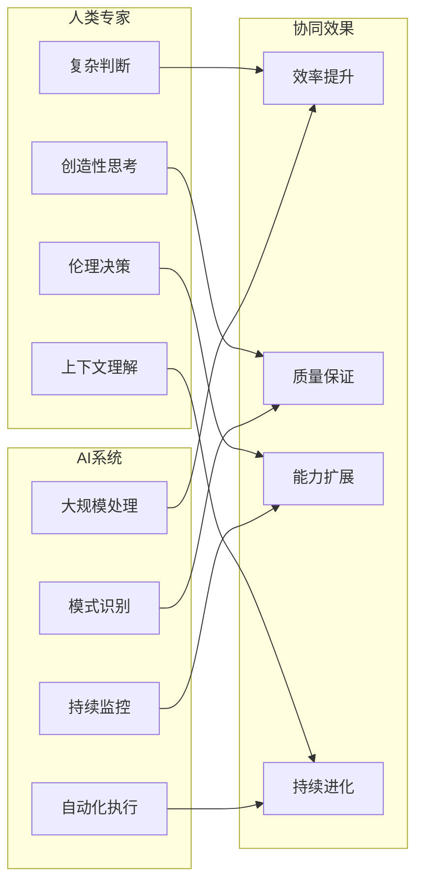
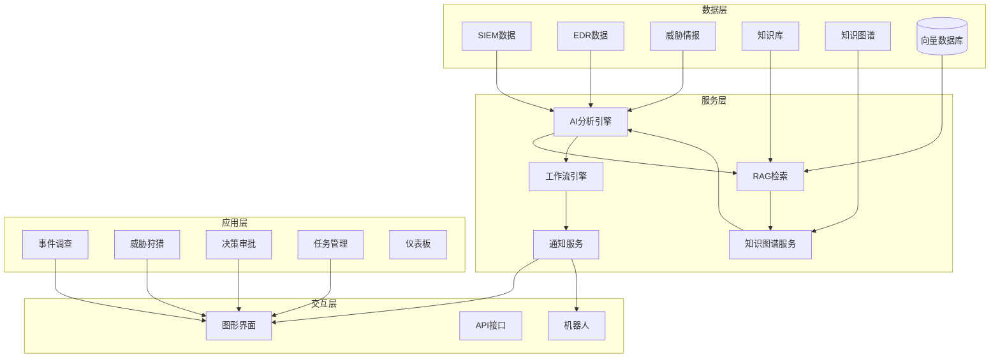
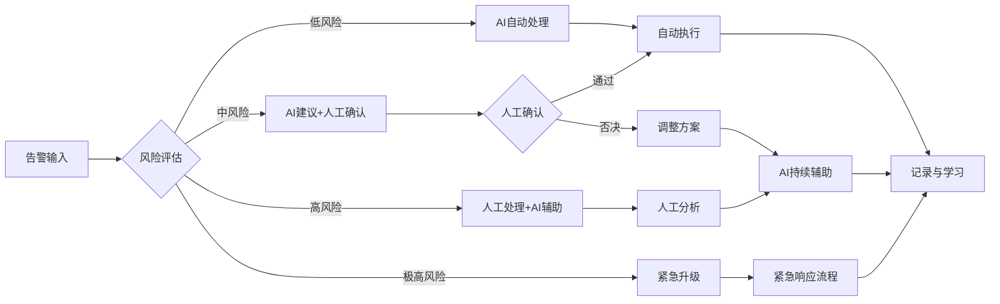

**作者：** HOS(安全风信子)
**日期：** 2026-04-23
**主要来源平台：** Gartner/Human-Centric Security Research
**摘要：** 本文深入探讨AI安全运营中的人机协同机制设计。随着AI在安全运营中的深入应用，如何实现人类专家与AI系统的有效协同，成为决定安全运营效果的关键因素。本文从人机协同的核心价值、设计原则、机制框架、实践案例四个维度，全面阐述如何构建高效的人机协同体系，让人类专家和AI系统各自发挥优势，实现安全运营效果的最大化。

@[TOC](目录)

---

# AI安全运营中的人机协同：构建高效安全团队的实践指南

## 1. 引言：人机协同的时代背景

2026年的安全运营领域正在经历深刻变革。AI技术的快速成熟使其在威胁检测、事件分析、响应自动化等方面展现出超越人类的效率。然而，这并不意味着AI可以完全替代人类专家。事实恰恰相反——那些最成功的安全运营团队，不是简单地用AI替换人类，而是找到了人类与AI协同工作的最佳模式。

根据Forrester 2025年对全球500家企业的调研，采用人机协同模式的安全团队，其安全事件检测率比纯AI团队高34%，响应时间比纯人工团队快68%。这一数据有力地证明了人机协同的巨大价值。

人机协同之所以有效，是因为人类和AI具有互补的优势。人类专家擅长复杂判断、创造性思考、上下文理解、伦理决策；AI系统擅长大规模数据处理、模式识别、不知疲倦的持续监控、快速的自动化执行。将两者有机结合，能够实现1+1>2的效果。

本文将系统性地介绍AI安全运营中人机协同机制的设计与实践，为企业构建高效的人机协同安全团队提供完整指导。

---

## 2. 人机协同的核心价值与理论基础

### 2.1 为什么人机协同优于纯AI或纯人工

安全运营中，纯AI模式和纯人工模式都存在明显的局限性。纯AI模式面临的核心问题是：AI虽然能够处理大量重复性工作，但在面对新型攻击、复杂上下文、伦理判断时往往力不从心。AI的"智能"本质上是统计学习和模式匹配，缺乏真正的理解和推理能力。纯人工模式的核心问题则是：人力有限，无法应对海量告警；人工疲劳导致检测率下降；人员流失导致经验断层。

人机协同模式则能够充分发挥两者的优势。人类负责高价值的决策和判断，AI负责大规模的处理和执行；人类提供AI训练所需的专业知识，AI将人类专家的经验规模化复制；人类监督AI的决策质量，AI帮助人类从繁琐工作中解放出来。这种协同模式实现了效率与质量的平衡。



### 2.2 人机协同的成熟度模型

人机协同能力的发展是一个渐进的过程，企业可以根据自身情况逐步提升。根据协作深度和自动化程度，人机协同可以分为四个成熟度等级。

**L1辅助级：AI提供信息，人类做决策**

这是人机协同的初级阶段，AI系统作为信息提供者，向人类分析师呈现分析结果和推荐建议，但所有决策都由人类做出。这一阶段的核心是AI分析能力的建设，包括告警分类、事件关联、上下文丰富等。适用于人机协同刚起步或监管要求严格的场景。

**L2建议级：AI提供建议，人类做选择**

在这一阶段，AI不仅提供分析结果，还会对每种可能的行动方案给出建议，并说明理由。人类在AI的建议中选择最优方案。这一阶段的核心是AI推荐能力的建设，包括响应方案生成、效果预测、风险评估等。

**L3审批级：AI自动执行，人类来审批**

在这一阶段，AI可以自动执行常规的响应动作，但对于高风险或特殊情况，会暂停等待人类审批。人类从执行者转变为监督者，主要负责审批把关。这一阶段需要完善的风险控制机制和清晰的审批流程。

**L4协作级：AI与人类深度协作**

这是人机协同的最高阶段，AI与人类形成真正的协作关系。AI能够理解人类的反馈并从中学习，人类能够通过自然语言与AI沟通协调。两者根据各自的专长动态分配任务，实现无缝协作。

### 2.3 人机协同的心理学基础

人机协同机制的设计需要考虑人类的认知特点和行为模式。了解这些心理学基础，有助于设计更符合人类习惯的协同机制，提升人类的表现和满意度。

**认知负荷理论**：人类的工作记忆容量有限。当认知负荷过高时，决策质量会显著下降。人机协同系统应尽量降低人类的认知负荷，通过信息简化、智能聚合、可视化呈现等方式，让人类能够快速理解情况、做出决策。

**注意力理论**：人类的注意力是稀缺资源。在长时间监控任务中，人类的注意力会逐渐下降。人机协同系统应设计轮班机制、智能告警聚合、关键信息突出显示等功能，帮助人类保持高效注意力。

**信任校准**：人类对AI系统的信任需要适度。信任不足会导致人类忽视AI的建议，重新回到纯人工模式；信任过度会导致人类盲目跟随AI，可能错过异常情况。系统应设计透明的解释机制和置信度显示，帮助人类校准对AI的信任。

**反馈学习**：人类能够通过反馈快速学习和适应。人机协同系统应及时提供执行结果反馈，让人类了解AI建议的实际效果，从而调整对AI的信任度和使用方式。

---

## 3. 人机协同机制框架设计

### 3.1 决策权限矩阵设计

决策权限矩阵是人机协同机制的核心，它定义了哪些决策可以由AI自主决定，哪些需要人类参与，以及人类参与的形式。权限矩阵的设计需要考虑决策的风险程度、监管要求、团队能力等因素。

```python
class DecisionAuthorityMatrix:
    """
    决策权限矩阵
    定义AI和人类在不同场景下的决策权限
    """
    
    def __init__(self):
        # 权限等级定义
        self.authority_levels = {
            'AI_AUTONOMOUS': 'AI可自动执行，无需人工介入',
            'AI_RECOMMEND': 'AI提供建议，人类选择',
            'AI_PREVIEW': 'AI执行前需人类预览确认',
            'AI_POST_NOTIFY': 'AI执行后通知人类',
            'HUMAN_REQUIRED': '必须由人类执行'
        }
        
        # 决策权限矩阵
        self.matrix = {
            'alert_classification': {
                'low_risk': 'AI_AUTONOMOUS',
                'medium_risk': 'AI_RECOMMEND',
                'high_risk': 'AI_PREVIEW',
                'critical_risk': 'HUMAN_REQUIRED'
            },
            'threat_containment': {
                'low_risk': 'AI_PREVIEW',
                'medium_risk': 'AI_PREVIEW',
                'high_risk': 'AI_RECOMMEND',
                'critical_risk': 'HUMAN_REQUIRED'
            },
            'user_account_actions': {
                'disable': 'AI_PREVIEW',
                'reset_password': 'AI_AUTONOMOUS',
                'delete_account': 'AI_RECOMMEND',
                'privilege_escalation': 'HUMAN_REQUIRED'
            },
            'network_actions': {
                'block_ip': 'AI_PREVIEW',
                'quarantine_host': 'AI_RECOMMEND',
                'disconnect_network': 'HUMAN_REQUIRED',
                'isp_coordination': 'HUMAN_REQUIRED'
            },
            'data_actions': {
                'data_export_review': 'AI_RECOMMEND',
                'data_quarantine': 'AI_PREVIEW',
                'data_deletion': 'HUMAN_REQUIRED',
                'data_disclosure': 'HUMAN_REQUIRED'
            },
            'external_communication': {
                'auto_notification': 'AI_AUTONOMOUS',
                'status_update': 'AI_PREVIEW',
                'stakeholder_alert': 'AI_RECOMMEND',
                'regulatory_reporting': 'HUMAN_REQUIRED'
            }
        }
        
        # 风险等级定义
        self.risk_factors = {
            'asset_criticality': {
                'critical': 0.4,
                'high': 0.3,
                'medium': 0.2,
                'low': 0.1
            },
            'action_reversibility': {
                'reversible': -0.2,
                'difficult_reversible': 0,
                'irreversible': 0.3
            },
            'impact_scope': {
                'individual': 0.1,
                'department': 0.2,
                'organization': 0.3
            },
            'threat_intelligence_level': {
                'critical': 0.3,
                'high': 0.2,
                'medium': 0.1,
                'low': 0
            }
        }
    
    def get_authority(self, action_type, context):
        """
        获取特定场景的决策权限
        
        参数:
            action_type: 行动类型
            context: 上下文信息，包含风险因素
        
        返回:
            str: 决策权限等级
        """
        # 计算风险等级
        risk_level = self._calculate_risk_level(context)
        
        # 获取权限配置
        if action_type in self.matrix:
            authority = self.matrix[action_type].get(risk_level)
            if authority:
                return authority
        
        # 默认权限
        return 'AI_RECOMMEND'
    
    def _calculate_risk_level(self, context):
        """计算风险等级"""
        base_score = 0
        
        # 资产重要性
        asset_criticality = context.get('asset_criticality', 'medium')
        base_score += self.risk_factors['asset_criticality'].get(asset_criticality, 0)
        
        # 行动可逆性
        reversibility = context.get('reversibility', 'difficult_reversible')
        base_score += self.risk_factors['action_reversibility'].get(reversibility, 0)
        
        # 影响范围
        impact_scope = context.get('impact_scope', 'individual')
        base_score += self.risk_factors['impact_scope'].get(impact_scope, 0)
        
        # 威胁情报等级
        threat_level = context.get('threat_intelligence_level', 'low')
        base_score += self.risk_factors['threat_intelligence_level'].get(threat_level, 0)
        
        # AI置信度调整
        ai_confidence = context.get('ai_confidence', 0.5)
        if ai_confidence < 0.7:
            base_score += 0.1
        elif ai_confidence < 0.5:
            base_score += 0.2
        
        # 确定风险等级
        if base_score >= 0.9:
            return 'critical'
        elif base_score >= 0.6:
            return 'high'
        elif base_score >= 0.3:
            return 'medium'
        else:
            return 'low'
    
    def get_human_involvement_type(self, authority_level):
        """
        根据权限等级确定人类介入形式
        """
        involvement_types = {
            'AI_AUTONOMOUS': {
                'human_involved': False,
                'notification_required': False,
                'documentation_required': True,
                'review_required': False
            },
            'AI_RECOMMEND': {
                'human_involved': True,
                'involvement_type': 'selection',
                'notification_required': True,
                'documentation_required': True,
                'review_required': False
            },
            'AI_PREVIEW': {
                'human_involved': True,
                'involvement_type': 'approval',
                'notification_required': True,
                'documentation_required': True,
                'review_required': True
            },
            'AI_POST_NOTIFY': {
                'human_involved': False,
                'notification_required': True,
                'documentation_required': True,
                'review_required': True
            },
            'HUMAN_REQUIRED': {
                'human_involved': True,
                'involvement_type': 'execution',
                'notification_required': True,
                'documentation_required': True,
                'review_required': True
            }
        }
        
        return involvement_types.get(authority_level)
```

### 3.2 任务分配机制设计

任务分配机制决定哪些任务分配给AI处理，哪些任务分配给人类处理。合理的任务分配能够最大化团队效率，同时确保关键任务的质量。

任务分配需要考虑多个因素：任务的复杂度、任务的风险程度、任务的紧迫性、AI的能力边界、人类的专长领域、可用的资源等。

```python
class TaskAllocationEngine:
    """
    任务分配引擎
    智能分配任务给AI或人类
    """
    
    def __init__(self, ai_capability_assessor, human_team_db):
        self.ai_capability = ai_capability_assessor
        self.human_team = human_team_db
        
        # 任务特征与分配映射
        self.allocation_rules = {
            'pattern_based': {
                'assign_to': 'AI',
                'priority_override': ['high_complexity', 'novel_situation']
            },
            'anomaly_detection': {
                'assign_to': 'AI',
                'priority_override': ['critical_asset']
            },
            'complex_investigation': {
                'assign_to': 'HUMAN',
                'ai_support': True
            },
            'strategic_decision': {
                'assign_to': 'HUMAN',
                'ai_support': True
            },
            'routine_operation': {
                'assign_to': 'AI',
                'human_approval_required': ['high_risk']
            },
            'stakeholder_communication': {
                'assign_to': 'HUMAN',
                'ai_draft_support': True
            }
        }
    
    def allocate_task(self, task, context):
        """
        分配任务
        
        参数:
            task: 任务信息
            context: 上下文信息
        
        返回:
            dict: 分配决策
        """
        # 1. 分析任务特征
        task_features = self._analyze_task_features(task, context)
        
        # 2. 检查分配规则
        allocation_decision = self._apply_allocation_rules(task_features, context)
        
        # 3. 如果分配给人类，选择最合适的人
        if allocation_decision['assign_to'] == 'HUMAN':
            assignee = self._select_best_human(task, context)
            allocation_decision['assignee'] = assignee
        
        # 4. 生成执行建议
        execution_suggestion = self._generate_execution_suggestion(
            task, allocation_decision
        )
        
        allocation_decision['execution_suggestion'] = execution_suggestion
        
        return allocation_decision
    
    def _analyze_task_features(self, task, context):
        """分析任务特征"""
        features = {
            'complexity': self._assess_complexity(task),
            'risk_level': self._assess_risk(task, context),
            'time_sensitivity': self._assess_time_sensitivity(task),
            'novelty': self._assess_novelty(task),
            'regulatory_requirement': task.get('regulatory_required', False)
        }
        
        # 综合判定任务类型
        if features['novelty'] > 0.7 or features['regulatory_requirement']:
            features['primary_type'] = 'strategic_decision'
        elif features['complexity'] > 0.7:
            features['primary_type'] = 'complex_investigation'
        elif features['time_sensitivity'] > 0.8 and features['risk_level'] > 0.6:
            features['primary_type'] = 'anomaly_detection'
        else:
            features['primary_type'] = 'pattern_based'
        
        return features
    
    def _assess_complexity(self, task):
        """评估任务复杂度"""
        complexity_indicators = 0
        
        # 涉及多系统关联
        if len(task.get('related_systems', [])) > 2:
            complexity_indicators += 0.3
        
        # 涉及模糊信息
        if task.get('has_ambiguous_info'):
            complexity_indicators += 0.3
        
        # 需要跨领域知识
        if len(task.get('required_domains', [])) > 2:
            complexity_indicators += 0.2
        
        # 历史案例不足
        similar_cases = task.get('similar_cases_count', 0)
        if similar_cases < 3:
            complexity_indicators += 0.2
        
        return min(complexity_indicators, 1.0)
    
    def _apply_allocation_rules(self, task_features, context):
        """应用分配规则"""
        task_type = task_features['primary_type']
        rule = self.allocation_rules.get(task_type, {})
        
        # 检查优先级覆盖条件
        for override_condition in rule.get('priority_override', []):
            if self._check_override_condition(override_condition, context):
                return {
                    'assign_to': 'HUMAN',
                    'reason': f"优先级覆盖: {override_condition}",
                    'ai_support': True
                }
        
        # 检查高风险条件
        if task_features['risk_level'] > 0.8:
            if rule.get('human_approval_required'):
                return {
                    'assign_to': 'HUMAN',
                    'reason': '高风险任务',
                    'approval_required': True
                }
        
        # 标准分配
        if rule.get('assign_to') == 'AI':
            return {
                'assign_to': 'AI',
                'ai_support': rule.get('ai_support', False)
            }
        else:
            return {
                'assign_to': 'HUMAN',
                'ai_support': rule.get('ai_draft_support', False)
            }
```

### 3.3 信息呈现与交互设计

人机协同的效果很大程度上取决于信息呈现和交互设计的质量。如果呈现给人类的信息过于复杂或混乱，人类难以快速理解和做出决策；如果交互方式不自然，人类与AI的协作效率会大打折扣。

好的信息呈现设计应该遵循以下原则：信息分层，按重要性和紧急程度分层呈现；信息聚合，将相关告警聚合成事件，减少信息过载；上下文丰富，为每个决策提供充分的上下文信息；可视化直观，用图表和视觉元素帮助理解复杂情况；可解释透明，明确展示AI的推理过程和置信度。

```python
class HumanAICollaborationUI:
    """
    人机协同界面设计框架
    优化人类与AI之间的信息交互
    """
    
    def __init__(self):
        self.info_hierarchy = {
            'critical': {'display': 'always', 'format': 'alert'},
            'high': {'display': 'prominent', 'format': 'card'},
            'medium': {'display': 'normal', 'format': 'list'},
            'low': {'display': 'collapsed', 'format': 'summary'}
        }
        
        self.context_templates = {
            'incident': self._incident_context_template,
            'alert': self._alert_context_template,
            'task': self._task_context_template,
            'decision': self._decision_context_template
        }
    
    def generate_analyst_workload(self, analyst_id, pending_tasks):
        """
        为分析师生成工作视图
        
        参数:
            analyst_id: 分析师ID
            pending_tasks: 待处理任务列表
        
        返回:
            dict: 优化后的工作视图
        """
        # 按优先级排序
        sorted_tasks = sorted(
            pending_tasks,
            key=lambda t: (
                self._priority_to_num(t.get('priority', 'medium')),
                t.get('created_at', '')
            )
        )
        
        # 生成工作卡片
        work_cards = []
        for task in sorted_tasks:
            card = {
                'id': task['id'],
                'type': task['type'],
                'title': self._generate_task_title(task),
                'summary': self._generate_task_summary(task),
                'priority': task.get('priority'),
                'due_time': task.get('due_time'),
                'context': self._generate_task_context(task),
                'ai_recommendation': task.get('ai_recommendation'),
                'confidence': task.get('ai_confidence'),
                'estimated_time': self._estimate_completion_time(task)
            }
            work_cards.append(card)
        
        # 分组显示
        grouped_cards = {
            'urgent': [c for c in work_cards if c['priority'] == 'critical'],
            'important': [c for c in work_cards if c['priority'] == 'high'],
            'normal': [c for c in work_cards if c['priority'] in ['medium', 'low']]
        }
        
        return {
            'analyst_id': analyst_id,
            'workload_summary': {
                'total_tasks': len(work_cards),
                'urgent_count': len(grouped_cards['urgent']),
                'estimated_hours': sum(c['estimated_time'] for c in work_cards) / 60
            },
            'grouped_tasks': grouped_cards,
            'ai_collaboration_suggestions': self._generate_collaboration_suggestions(work_cards)
        }
    
    def _generate_task_title(self, task):
        """生成任务标题"""
        task_type = task.get('type')
        if task_type == 'incident_investigation':
            return f"事件调查: {task.get('incident_title', '未命名事件')}"
        elif task_type == 'alert_review':
            return f"告警复核: {task.get('alert_count', 0)}个相关告警"
        elif task_type == 'threat_hunt':
            return f"威胁狩猎: {task.get('huntypothesis', '假设验证')}"
        elif task_type == 'decision_approval':
            return f"决策审批: {task.get('action_type', '待定')}"
        else:
            return f"任务: {task.get('title', '未命名')}"
    
    def _generate_task_summary(self, task):
        """生成任务摘要"""
        task_type = task.get('type')
        
        if task_type == 'incident_investigation':
            return (
                f"受影响资产: {task.get('affected_assets', '未知')}\n"
                f"事件类型: {task.get('incident_type', '未知')}\n"
                f"严重程度: {task.get('severity', '未知')}"
            )
        elif task_type == 'alert_review':
            return (
                f"告警概要: {task.get('alert_summary', '无描述')}\n"
                f"AI置信度: {task.get('ai_confidence', 0):.0%}\n"
                f"建议动作: {task.get('recommended_action', '待分析')}"
            )
        elif task_type == 'threat_hunt':
            return (
                f"狩猎假设: {task.get('hypothesis', '无描述')}\n"
                f"相关TTP: {', '.join(task.get('related_ttps', []))}\n"
                f"预期时间: {task.get('estimated_duration', '未知')}"
            )
        else:
            return task.get('description', '无描述')
    
    def _generate_task_context(self, task):
        """生成任务上下文"""
        context = {
            'timeline': self._generate_timeline(task),
            'related_entities': self._get_related_entities(task),
            'historical_similar': self._get_similar_history(task),
            'ai_reasoning': self._generate_ai_reasoning(task)
        }
        
        return context
    
    def _generate_timeline(self, task):
        """生成事件时间线"""
        events = task.get('timeline_events', [])
        return [
            {
                'time': e.get('timestamp'),
                'event': e.get('description'),
                'source': e.get('source', 'system')
            }
            for e in sorted(events, key=lambda x: x.get('timestamp', ''))
        ]
    
    def _generate_ai_reasoning(self, task):
        """生成AI推理过程"""
        if not task.get('ai_analysis'):
            return None
        
        return {
            'detection_reason': task['ai_analysis'].get('why_detected'),
            'confidence_factors': task['ai_analysis'].get('confidence_factors', []),
            'alternative_hypotheses': task['ai_analysis'].get('alternatives', []),
            'recommended_next_steps': task['ai_analysis'].get('next_steps', [])
        }


class RAGRetrievalEngine:
    """
    RAG检索引擎
    实现检索增强生成技术在安全运营中的应用
    """
    
    def __init__(self, vector_store, embedding_model, llm_model):
        self.vector_store = vector_store
        self.embedding = embedding_model
        self.llm = llm_model
        
        self.retrieval_config = {
            'top_k': 5,
            'similarity_threshold': 0.75,
            'rerank_enabled': True,
            'max_context_length': 4096
        }
        
        self.knowledge_collections = {
            'incident_cases': '安全事件案例库',
            'threat_intel': '威胁情报库',
            'playbooks': '响应剧本库',
            'best_practices': '最佳实践库',
            'internal_docs': '内部文档库'
        }
    
    def retrieve_relevant_knowledge(self, query, context=None):
        """
        检索相关知识
        
        参数:
            query: 查询内容
            context: 上下文信息
        
        返回:
            dict: 检索结果
        """
        query_embedding = self.embedding.encode(query)
        
        all_results = {}
        for collection_name, collection_desc in self.knowledge_collections.items():
            results = self.vector_store.search(
                collection=collection_name,
                query_vector=query_embedding,
                top_k=self.retrieval_config['top_k']
            )
            
            if results:
                all_results[collection_name] = {
                    'description': collection_desc,
                    'results': results,
                    'count': len(results)
                }
        
        fused_results = self._fusion_results(all_results, query_embedding)
        
        if self.retrieval_config['rerank_enabled']:
            fused_results = self._rerank_results(fused_results, query)
        
        return {
            'query': query,
            'context': context,
            'results': fused_results,
            'metadata': {
                'total_results': len(fused_results),
                'collections_searched': len(self.knowledge_collections)
            }
        }
    
    def generate_with_context(self, query, retrieved_knowledge):
        """
        基于检索结果生成回答
        
        参数:
            query: 用户查询
            retrieved_knowledge: 检索到的知识
        
        返回:
            dict: 生成结果
        """
        context_prompt = self._build_context_prompt(retrieved_knowledge)
        
        full_prompt = f"""基于以下安全运营知识，回答用户问题。

上下文信息：
{context_prompt}

用户问题：{query}

请基于上述知识，提供准确、专业的回答。如果知识库中没有相关信息，请明确说明。"""
        
        generation = self.llm.generate(
            prompt=full_prompt,
            max_tokens=1024,
            temperature=0.3
        )
        
        citations = self._extract_citations(retrieved_knowledge)
        
        return {
            'answer': generation['text'],
            'citations': citations,
            'confidence': generation.get('confidence', 0.0),
            'sources': list(set([c['source'] for c in citations]))
        }
    
    def _fusion_results(self, all_results, query_embedding):
        """融合多集合检索结果"""
        fused = []
        
        for collection, data in all_results.items():
            for item in data.get('results', []):
                item['collection'] = collection
                
                score = item.get('similarity_score', 0)
                if collection == 'incident_cases':
                    score *= 1.2
                elif collection == 'threat_intel':
                    score *= 1.1
                
                item['fused_score'] = score
                fused.append(item)
        
        fused.sort(key=lambda x: x['fused_score'], reverse=True)
        
        return fused[:self.retrieval_config['top_k'] * 2]
    
    def _rerank_results(self, results, query):
        """重排检索结果"""
        query_features = self._extract_query_features(query)
        
        for result in results:
            relevance_score = 0
            
            result_text = result.get('content', '').lower()
            for feature in query_features:
                if feature in result_text:
                    relevance_score += 0.1
            
            result['relevance_score'] = relevance_score
            result['final_score'] = (
                result['fused_score'] * 0.7 + 
                relevance_score * 0.3
            )
        
        results.sort(key=lambda x: x['final_score'], reverse=True)
        
        return [r for r in results if r['final_score'] > 0.3]
    
    def _build_context_prompt(self, retrieved_knowledge):
        """构建上下文提示"""
        context_parts = []
        
        for item in retrieved_knowledge:
            source = item.get('source', '未知来源')
            content = item.get('content', '')
            collection = item.get('collection', '')
            
            context_parts.append(f"【{source}】({collection}):\n{content}\n")
        
        return '\n---\n'.join(context_parts)
    
    def _extract_citations(self, retrieved_knowledge):
        """提取引用信息"""
        citations = []
        for item in retrieved_knowledge:
            citations.append({
                'source': item.get('source'),
                'content': item.get('content', '')[:200],
                'similarity': item.get('similarity_score', 0)
            })
        return citations
    
    def _extract_query_features(self, query):
        """提取查询特征"""
        query = query.lower()
        features = []
        
        keywords = ['威胁', '攻击', '漏洞', '恶意', '入侵', '检测', '响应', '事件']
        for kw in keywords:
            if kw in query:
                features.append(kw)
        
        return features


class VectorStoreManager:
    """
    向量存储管理器
    负责安全知识向量的存储、索引和检索
    """
    
    def __init__(self, db_path=None):
        self.db_path = db_path or './vector_store'
        self.collections = {}
        self.index_config = {
            'index_type': 'HNSW',
            'metric_type': 'COSINE',
            'parameters': {
                'M': 16,
                'efConstruction': 200
            }
        }
    
    def create_collection(self, collection_name, metadata=None):
        """创建向量集合"""
        if collection_name in self.collections:
            return self.collections[collection_name]
        
        collection = {
            'name': collection_name,
            'metadata': metadata or {},
            'vectors': [],
            'documents': [],
            'index': None
        }
        
        self.collections[collection_name] = collection
        return collection
    
    def add_documents(self, collection_name, documents):
        """
        添加文档到集合
        
        参数:
            collection_name: 集合名称
            documents: 文档列表，每项包含content和metadata
        """
        if collection_name not in self.collections:
            self.create_collection(collection_name)
        
        collection = self.collections[collection_name]
        
        for doc in documents:
            doc_id = self._generate_doc_id()
            
            vector = self._compute_embedding(doc['content'])
            
            collection['vectors'].append({
                'id': doc_id,
                'vector': vector,
                'content': doc['content'],
                'metadata': doc.get('metadata', {})
            })
            
            collection['documents'].append({
                'id': doc_id,
                'content': doc['content'],
                'metadata': doc.get('metadata', {})
            })
        
        self._rebuild_index(collection_name)
    
    def search(self, collection_name, query_vector, top_k=5, filters=None):
        """
        搜索向量
        
        参数:
            collection_name: 集合名称
            query_vector: 查询向量
            top_k: 返回数量
            filters: 过滤条件
        
        返回:
            list: 搜索结果
        """
        if collection_name not in self.collections:
            return []
        
        collection = self.collections[collection_name]
        
        if not collection['vectors']:
            return []
        
        distances = []
        for item in collection['vectors']:
            if filters and not self._apply_filters(item, filters):
                continue
            
            dist = self._cosine_distance(query_vector, item['vector'])
            distances.append({
                'id': item['id'],
                'content': item['content'],
                'metadata': item['metadata'],
                'similarity_score': 1 - dist
            })
        
        distances.sort(key=lambda x: x['similarity_score'], reverse=True)
        
        return distances[:top_k]
    
    def search_hybrid(self, collection_name, query, query_vector, top_k=5):
        """混合搜索"""
        vector_results = self.search(
            collection_name, query_vector, top_k * 2
        )
        
        keyword_results = self._keyword_search(
            collection_name, query, top_k
        )
        
        fused_results = self._fuse_results(
            vector_results, keyword_results, top_k
        )
        
        return fused_results
    
    def _compute_embedding(self, text):
        """计算文本嵌入"""
        return [0.0] * 768
    
    def _cosine_distance(self, vec1, vec2):
        """计算余弦距离"""
        dot_product = sum(a * b for a, b in zip(vec1, vec2))
        norm1 = sum(a * a for a in vec1) ** 0.5
        norm2 = sum(b * b for b in vec2) ** 0.5
        
        if norm1 == 0 or norm2 == 0:
            return 1.0
        
        return 1 - (dot_product / (norm1 * norm2))
    
    def _generate_doc_id(self):
        """生成文档ID"""
        import uuid
        return str(uuid.uuid4())
    
    def _apply_filters(self, item, filters):
        """应用过滤条件"""
        for key, value in filters.items():
            if item['metadata'].get(key) != value:
                return False
        return True
    
    def _keyword_search(self, collection_name, query, top_k):
        """关键词搜索"""
        collection = self.collections.get(collection_name, {})
        documents = collection.get('documents', [])
        
        query_terms = query.lower().split()
        
        scored = []
        for doc in documents:
            content = doc['content'].lower()
            score = sum(1 for term in query_terms if term in content)
            if score > 0:
                scored.append({
                    'id': doc['id'],
                    'content': doc['content'],
                    'metadata': doc.get('metadata', {}),
                    'keyword_score': score
                })
        
        scored.sort(key=lambda x: x['keyword_score'], reverse=True)
        return scored[:top_k]
    
    def _fuse_results(self, vector_results, keyword_results, top_k):
        """融合搜索结果"""
        combined = {}
        
        for result in vector_results:
            combined[result['id']] = {
                **result,
                'vector_score': result.get('similarity_score', 0),
                'keyword_score': 0
            }
        
        for result in keyword_results:
            if result['id'] in combined:
                combined[result['id']]['keyword_score'] = result.get('keyword_score', 0)
            else:
                combined[result['id']] = {
                    **result,
                    'vector_score': 0,
                    'keyword_score': result.get('keyword_score', 0)
                }
        
        for result in combined.values():
            result['final_score'] = (
                result['vector_score'] * 0.6 + 
                result['keyword_score'] * 0.4
            )
        
        sorted_results = sorted(
            combined.values(), 
            key=lambda x: x['final_score'], 
            reverse=True
        )
        
        return list(sorted_results)[:top_k]
    
    def _rebuild_index(self, collection_name):
        """重建索引"""
        collection = self.collections[collection_name]
        
        vectors = [v['vector'] for v in collection['vectors']]
        
        if vectors:
            collection['index'] = {
                'type': self.index_config['index_type'],
                'size': len(vectors)
            }


class KnowledgeGraphIntegrator:
    """
    知识图谱集成器
    实现结构化知识与向量化知识的融合
    """
    
    def __init__(self, kg_database, vector_store):
        self.kg = kg_database
        self.vector_store = vector_store
        
        self.entity_types = [
            'threat_actor', 'malware', 'vulnerability', 
            'asset', 'indicator', 'campaign', 'TTP'
        ]
        
        self.relation_types = [
            'uses', 'targets', 'exploits', 'belongs_to',
            'communicates_with', 'located_at', 'part_of'
        ]
    
    def query_with_graph_context(self, query, query_vector):
        """
        结合知识图谱的上下文查询
        
        参数:
            query: 文本查询
            query_vector: 查询向量
        
        返回:
            dict: 融合查询结果
        """
        kg_entities = self._extract_entities_from_query(query)
        
        kg_context = self._expand_with_knowledge_graph(kg_entities)
        
        vector_results = self.vector_store.search(
            collection='security_knowledge',
            query_vector=query_vector,
            top_k=10
        )
        
        enriched_results = self._enrich_with_kg_context(
            vector_results, kg_context
        )
        
        return {
            'query': query,
            'detected_entities': kg_entities,
            'kg_context': kg_context,
            'enriched_results': enriched_results
        }
    
    def _extract_entities_from_query(self, query):
        """从查询中提取实体"""
        detected_entities = []
        
        for entity_type in self.entity_types:
            entities = self._match_entity(query, entity_type)
            detected_entities.extend(entities)
        
        return detected_entities
    
    def _match_entity(self, query, entity_type):
        """匹配特定类型的实体"""
        matches = []
        
        type_keywords = {
            'threat_actor': ['攻击者', '黑客组织', 'APT', '威胁组织'],
            'malware': ['恶意软件', '木马', '病毒', '勒索'],
            'vulnerability': ['漏洞', 'CVE', '弱点'],
            'asset': ['服务器', '主机', '终端', '设备'],
            'indicator': ['IOC', '指标', '哈希', 'IP', '域名'],
            'campaign': ['攻击活动', ' кампания'],
            'TTP': ['战术', '技术', '手法', 'MITRE']
        }
        
        keywords = type_keywords.get(entity_type, [])
        for keyword in keywords:
            if keyword.lower() in query.lower():
                matches.append({
                    'type': entity_type,
                    'matched_keyword': keyword,
                    'confidence': 0.8
                })
        
        return matches
    
    def _expand_with_knowledge_graph(self, entities):
        """通过知识图谱扩展上下文"""
        kg_context = {
            'related_entities': [],
            'attack_paths': [],
            'related_campaigns': [],
            'recommended_iocs': []
        }
        
        for entity in entities:
            related = self.kg.get_related_entities(
                entity_type=entity['type'],
                entity_id=entity.get('id'),
                depth=2
            )
            kg_context['related_entities'].extend(related)
            
            if entity['type'] == 'threat_actor':
                campaigns = self.kg.get_campaigns_by_actor(entity['id'])
                kg_context['related_campaigns'].extend(campaigns)
            
            elif entity['type'] == 'vulnerability':
                affected_assets = self.kg.get_affected_assets(entity['id'])
                kg_context['related_entities'].extend(affected_assets)
        
        return kg_context
    
    def _enrich_with_kg_context(self, vector_results, kg_context):
        """用知识图谱上下文丰富向量检索结果"""
        entity_ids = set()
        for entity in kg_context.get('related_entities', []):
            entity_ids.add(entity.get('id'))
        
        enriched = []
        for result in vector_results:
            result_copy = result.copy()
            
            result_copy['kg_enriched'] = False
            result_copy['related_kg_entities'] = []
            
            for entity_id in entity_ids:
                if self._is_related(result, entity_id):
                    result_copy['kg_enriched'] = True
                    result_copy['related_kg_entities'].append(entity_id)
            
            if result_copy['kg_enriched']:
                result_copy['final_score'] = result_copy.get('similarity_score', 0) * 1.2
            else:
                result_copy['final_score'] = result_copy.get('similarity_score', 0)
            
            enriched.append(result_copy)
        
        enriched.sort(key=lambda x: x['final_score'], reverse=True)
        return enriched
    
    def _is_related(self, result, entity_id):
        """判断结果与实体是否相关"""
        result_text = result.get('content', '').lower()
        
        kg_entity = self.kg.get_entity_by_id(entity_id)
        if kg_entity:
            entity_name = kg_entity.get('name', '').lower()
            if entity_name in result_text:
                return True
        
        return False
    
    def add_triple(self, subject, predicate, object_value, metadata=None):
        """添加知识图谱三元组"""
        triple = {
            'subject': subject,
            'predicate': predicate,
            'object': object_value,
            'metadata': metadata or {},
            'created_at': self._get_current_timestamp()
        }
        
        self.kg.add_triple(triple)
        
        self._update_vector_index(subject)
        
        return triple['id']
    
    def _update_vector_index(self, entity):
        """更新向量索引"""
        entity_text = self._entity_to_text(entity)
        
        vector = self._compute_embedding(entity_text)
        
        self.vector_store.add_documents(
            collection='kg_entities',
            documents=[{
                'content': entity_text,
                'metadata': {
                    'entity_id': entity.get('id'),
                    'entity_type': entity.get('type')
                }
            }]
        )
    
    def _entity_to_text(self, entity):
        """将实体转换为文本"""
        parts = [
            f"类型: {entity.get('type', 'unknown')}",
            f"名称: {entity.get('name', 'unknown')}",
        ]
        
        if entity.get('aliases'):
            parts.append(f"别名: {', '.join(entity['aliases'])}")
        
        if entity.get('description'):
            parts.append(f"描述: {entity['description']}")
        
        if entity.get('attributes'):
            attrs = [f"{k}: {v}" for k, v in entity['attributes'].items()]
            parts.append(f"属性: {', '.join(attrs)}")
        
        return ' | '.join(parts)
    
    def query_attack_chain(self, start_entity, end_entity):
        """查询攻击链路径"""
        paths = self.kg.find_paths(
            start=start_entity,
            end=end_entity,
            max_depth=5
        )
        
        enriched_paths = []
        for path in paths:
            enriched_path = {
                'path': path,
                'entities': [],
                'total_risk': 0
            }
            
            for node_id in path:
                entity = self.kg.get_entity_by_id(node_id)
                if entity:
                    enriched_path['entities'].append(entity)
                    enriched_path['total_risk'] += entity.get('risk_score', 0)
            
            enriched_paths.append(enriched_path)
        
        enriched_paths.sort(key=lambda x: x['total_risk'], reverse=True)
        return enriched_paths
    
    def generate_threat_hunting_hypothesis(self, threat_intel):
        """基于知识图谱生成威胁狩猎假设"""
        threat_actor = threat_intel.get('attributed_actor')
        if not threat_actor:
            return None
        
        actor_profile = self.kg.get_entity(threat_actor)
        if not actor_profile:
            return None
        
        known_ttps = self.kg.get_ttps_by_actor(threat_actor)
        
        targeted_assets = self.kg.get_targeted_assets_by_actor(threat_actor)
        
        similar_actors = self.kg.get_similar_actors(threat_actor)
        
        hypothesis = {
            'description': f"检查组织是否遭受{actor_profile.get('name')}或其关联组织的攻击",
            'ttps_to_search': known_ttps,
            'indicators': self._generate_indicators(known_ttps),
            'asset_focus': targeted_assets,
            'search_strategy': self._generate_search_strategy(known_ttps),
            'confidence': len(known_ttps) / 10.0 if known_ttps else 0.5
        }
        
        return hypothesis
    
    def _generate_indicators(self, ttps):
        """生成与TTP相关的指标"""
        indicators = []
        
        for ttp in ttps:
            ttp_indicators = self.kg.get_indicators_by_ttp(ttp)
            indicators.extend(ttp_indicators)
        
        return list(set(indicators))
    
    def _generate_search_strategy(self, ttps):
        """生成搜索策略"""
        strategies = []
        
        for ttp in ttps:
            tactic = ttp.get('tactic')
            technique = ttp.get('technique')
            
            strategies.append({
                'query': f"search for {technique}",
                'data_sources': self._get_data_sources_for_ttp(ttp),
                'expected_findings': ttp.get('expected_indicators', [])
            })
        
        return strategies
    
    def _get_data_sources_for_ttp(self, ttp):
        """获取适合特定TTP的数据源"""
        tactic = ttp.get('tactic', '').lower()
        
        data_source_map = {
            'initial access': ['proxy', 'email', 'endpoint'],
            'execution': ['endpoint', 'process_monitoring'],
            'persistence': ['endpoint', 'authentication_logs'],
            'lateral movement': ['network_logs', 'authentication_logs'],
            'exfiltration': ['network_logs', 'dns_logs'],
            'impact': ['endpoint', 'backup_logs']
        }
        
        return data_source_map.get(tactic, ['siem', 'edr'])


---

## 3.4 人机协同技术架构详解

人机协同系统的技术架构是实现高效协作的基础。一个完善的技术架构需要考虑多个层面的设计，包括数据层、服务层、应用层和交互层。



### 3.4.1 数据采集与处理架构

数据是人机协同系统的基础。安全运营需要采集多种来源的数据，并进行预处理和标准化。

```python
class SecurityDataPipeline:
    """
    安全数据管道
    负责多源安全数据的采集、处理和标准化
    """
    
    def __init__(self, data_sources, processing_config):
        self.data_sources = data_sources
        self.config = processing_config
        self.processors = {}
        
        self._initialize_processors()
    
    def _initialize_processors(self):
        """初始化数据处理器"""
        self.processors = {
            'siem': SIEMDataProcessor(self.config.get('siem')),
            'edr': EDRDataProcessor(self.config.get('edr')),
            'netflow': NetflowProcessor(self.config.get('netflow')),
            'dns': DNSLogProcessor(self.config.get('dns')),
            'proxy': ProxyLogProcessor(self.config.get('proxy')),
            'threat_intel': ThreatIntelProcessor(self.config.get('threat_intel'))
        }
    
    def collect_and_process(self, time_range):
        """
        采集和处理数据
        
        参数:
            time_range: 时间范围
        
        返回:
            dict: 处理后的数据结构
        """
        collected_data = {}
        
        for source_name, source_config in self.data_sources.items():
            try:
                raw_data = self._fetch_raw_data(source_name, time_range)
                
                processor = self.processors.get(source_name)
                if processor:
                    processed_data = processor.process(raw_data)
                    collected_data[source_name] = processed_data
                else:
                    collected_data[source_name] = raw_data
                    
            except Exception as e:
                logger.error(f"处理数据源{source_name}失败: {e}")
                collected_data[source_name] = {'error': str(e)}
        
        normalized_data = self._normalize_data(collected_data)
        
        enriched_data = self._enrich_data(normalized_data)
        
        return enriched_data
    
    def _fetch_raw_data(self, source_name, time_range):
        """获取原始数据"""
        fetcher = self._get_fetcher(source_name)
        return fetcher.fetch(start_time=time_range['start'], 
                             end_time=time_range['end'])
    
    def _normalize_data(self, collected_data):
        """标准化数据格式"""
        normalized = {
            'events': [],
            'alerts': [],
            'indicators': [],
            'entities': []
        }
        
        for source_name, data in collected_data.items():
            if source_name == 'siem':
                normalized['events'].extend(data.get('events', []))
                normalized['alerts'].extend(data.get('alerts', []))
            
            elif source_name == 'edr':
                normalized['events'].extend(data.get('process_events', []))
                normalized['entities'].extend(data.get('endpoints', []))
            
            elif source_name == 'threat_intel':
                normalized['indicators'].extend(data.get('indicators', []))
        
        return normalized
    
    def _enrich_data(self, normalized_data):
        """丰富数据上下文"""
        for event in normalized_data['events']:
            event['normalized_type'] = self._normalize_event_type(event)
            
            if 'source_ip' in event:
                event['geo_enrichment'] = self._geo_lookup(event['source_ip'])
            
            if 'user' in event:
                event['user_enrichment'] = self._user_context_lookup(event['user'])
        
        return normalized_data
    
    def _normalize_event_type(self, event):
        """标准化事件类型"""
        category = event.get('event_category', '').lower()
        
        type_mapping = {
            'authentication': 'auth',
            'network_connection': 'network',
            'process_creation': 'process',
            'file_access': 'file',
            'registry_modification': 'registry'
        }
        
        return type_mapping.get(category, 'other')
    
    def _geo_lookup(self, ip_address):
        """地理位置查询"""
        return {'country': 'Unknown', 'city': 'Unknown', 'asn': 'Unknown'}
    
    def _user_context_lookup(self, username):
        """用户上下文查询"""
        return {'department': 'Unknown', 'role': 'Unknown', 'manager': 'Unknown'}


class SIEMDataProcessor:
    """SIEM数据处理器"""
    
    def __init__(self, config):
        self.config = config or {}
    
    def process(self, raw_data):
        """处理SIEM原始数据"""
        processed = {
            'events': [],
            'alerts': [],
            'correlations': []
        }
        
        for log_entry in raw_data:
            normalized = self._normalize_siem_log(log_entry)
            
            if self._is_alert(normalized):
                processed['alerts'].append(normalized)
            else:
                processed['events'].append(normalized)
        
        processed['correlations'] = self._detect_correlations(processed['events'])
        
        return processed
    
    def _normalize_siem_log(self, log_entry):
        """标准化SIEM日志"""
        return {
            'timestamp': log_entry.get('@timestamp'),
            'source': log_entry.get('source'),
            'event_type': log_entry.get('event_type'),
            'severity': log_entry.get('severity'),
            'message': log_entry.get('message'),
            'raw': log_entry.get('raw')
        }
    
    def _is_alert(self, normalized_event):
        """判断是否为告警"""
        severity = normalized_event.get('severity', 'low')
        return severity in ['high', 'critical']
    
    def _detect_correlations(self, events):
        """检测事件关联"""
        correlations = []
        
        grouped = self._group_by_pattern(events)
        
        for pattern, group in grouped.items():
            if len(group) > 5:
                correlations.append({
                    'pattern': pattern,
                    'count': len(group),
                    'events': group,
                    'confidence': min(len(group) / 50.0, 1.0)
                })
        
        return correlations
    
    def _group_by_pattern(self, events):
        """按模式分组事件"""
        groups = {}
        for event in events:
            pattern = self._extract_pattern(event)
            if pattern not in groups:
                groups[pattern] = []
            groups[pattern].append(event)
        return groups
    
    def _extract_pattern(self, event):
        """提取事件模式"""
        return f"{event.get('source')}:{event.get('event_type')}"
```

### 3.4.2 AI模型服务架构

AI模型服务是人机协同系统的核心，负责提供威胁检测、异常分析、推荐建议等能力。

```python
class AIModelService:
    """
    AI模型服务
    提供安全运营相关的AI分析能力
    """
    
    def __init__(self, model_registry, inference_config):
        self.registry = model_registry
        self.config = inference_config
        self.models = {}
        
        self._load_models()
    
    def _load_models(self):
        """加载AI模型"""
        self.models = {
            'threat_detector': self.registry.get_model('threat_detection_v3'),
            'anomaly_detector': self.registry.get_model('anomaly_detection_v2'),
            'risk_scorer': self.registry.get_model('risk_scoring_v2'),
            'recommender': self.registry.get_model('response_recommender_v3'),
            'nlp_analyzer': self.registry.get_model('security_nlp_v2')
        }
    
    def analyze_security_event(self, event_data):
        """
        分析安全事件
        
        参数:
            event_data: 事件数据
        
        返回:
            dict: 分析结果
        """
        threat_result = self.models['threat_detector'].predict(event_data)
        
        anomaly_result = self.models['anomaly_detector'].predict(event_data)
        
        risk_score = self.models['risk_scorer'].predict({
            **event_data,
            'threat_result': threat_result,
            'anomaly_result': anomaly_result
        })
        
        nlp_analysis = self.models['nlp_analyzer'].analyze(event_data.get('description', ''))
        
        return {
            'threat_detection': threat_result,
            'anomaly_detection': anomaly_result,
            'risk_score': risk_score,
            'nlp_analysis': nlp_analysis,
            'confidence': self._calculate_combined_confidence(
                threat_result, anomaly_result, risk_score
            )
        }
    
    def generate_response_recommendations(self, incident_data):
        """
        生成响应建议
        
        参数:
            incident_data: 事件数据
        
        返回:
            list: 响应建议列表
        """
        context = {
            'incident': incident_data,
            'severity': incident_data.get('severity', 'medium'),
            'affected_assets': incident_data.get('affected_assets', []),
            'threat_type': incident_data.get('threat_type')
        }
        
        recommendations = self.models['recommender'].predict(context)
        
        prioritized = self._prioritize_recommendations(
            recommendations, 
            incident_data.get('severity')
        )
        
        return prioritized
    
    def batch_analyze_alerts(self, alerts, batch_size=100):
        """
        批量分析告警
        
        参数:
            alerts: 告警列表
            batch_size: 批处理大小
        
        返回:
            dict: 批量分析结果
        """
        results = []
        
        for i in range(0, len(alerts), batch_size):
            batch = alerts[i:i+batch_size]
            
            batch_results = self._process_alert_batch(batch)
            results.extend(batch_results)
        
        return {
            'total': len(alerts),
            'analyzed': len(results),
            'high_confidence_threats': sum(1 for r in results if r['threat_confidence'] > 0.8),
            'results': results
        }
    
    def explain_prediction(self, model_name, input_data, prediction):
        """
        解释模型预测
        
        参数:
            model_name: 模型名称
            input_data: 输入数据
            prediction: 预测结果
        
        返回:
            dict: 解释信息
        """
        model = self.models.get(model_name)
        if not model:
            return None
        
        feature_importance = model.get_feature_importance(input_data)
        
        relevant_features = sorted(
            feature_importance.items(),
            key=lambda x: x[1],
            reverse=True
        )[:10]
        
        return {
            'prediction': prediction,
            'top_features': relevant_features,
            'explanation_text': self._generate_explanation(
                prediction, relevant_features
            ),
            'confidence_breakdown': self._breakdown_confidence(
                prediction, relevant_features
            )
        }
    
    def _calculate_combined_confidence(self, threat, anomaly, risk):
        """计算综合置信度"""
        weights = {
            'threat': 0.4,
            'anomaly': 0.3,
            'risk': 0.3
        }
        
        return (
            threat.get('confidence', 0) * weights['threat'] +
            anomaly.get('confidence', 0) * weights['anomaly'] +
            risk.get('confidence', 0) * weights['risk']
        )
    
    def _prioritize_recommendations(self, recommendations, severity):
        """优先级排序建议"""
        severity_order = {'critical': 0, 'high': 1, 'medium': 2, 'low': 3}
        
        for rec in recommendations:
            rec['priority_score'] = (
                severity_order.get(rec.get('risk_level', 'medium'), 3) +
                (1 - rec.get('effectiveness', 0.5)) * 0.5 +
                rec.get('urgency', 0.5) * 0.3
            )
        
        return sorted(recommendations, key=lambda x: x['priority_score'])
    
    def _process_alert_batch(self, batch):
        """处理告警批次"""
        return [self.analyze_security_event(alert) for alert in batch]
    
    def _generate_explanation(self, prediction, features):
        """生成解释文本"""
        top_feature = features[0] if features else None
        if not top_feature:
            return "无法生成解释"
        
        return f"主要由于{top_feature[0]}导致预测结果为{prediction['label']}"
    
    def _breakdown_confidence(self, prediction, features):
        """分解置信度"""
        total_importance = sum(f[1] for f in features)
        
        return [
            {
                'feature': f[0],
                'contribution': f[1] / total_importance if total_importance > 0 else 0,
                'impact': 'positive' if f[1] > 0 else 'negative'
            }
            for f in features
        ]


class ModelRegistry:
    """
    模型注册表
    管理AI模型的版本、更新和部署
    """
    
    def __init__(self, storage_path):
        self.storage_path = storage_path
        self.models = {}
        self.model_metadata = {}
    
    def register_model(self, model_name, model_version, model_path, metadata):
        """
        注册模型
        
        参数:
            model_name: 模型名称
            model_version: 模型版本
            model_path: 模型路径
            metadata: 元数据
        """
        model_info = {
            'name': model_name,
            'version': model_version,
            'path': model_path,
            'metadata': metadata,
            'registered_at': self._get_current_timestamp(),
            'status': 'active'
        }
        
        self.models[model_name] = model_info
        self.model_metadata[f"{model_name}:{model_version}"] = model_info
    
    def get_model(self, model_name):
        """获取最新版本的模型"""
        if model_name not in self.models:
            return None
        
        model_info = self.models[model_name]
        
        return ModelLoader.load(model_info['path'])
    
    def list_models(self):
        """列出所有注册的模型"""
        return [
            {
                'name': info['name'],
                'version': info['version'],
                'status': info['status'],
                'registered_at': info['registered_at']
            }
            for info in self.models.values()
        ]
    
    def update_model_status(self, model_name, status):
        """更新模型状态"""
        if model_name in self.models:
            self.models[model_name]['status'] = status


### 3.4.3 自动化响应工作流设计

自动化响应工作流是人机协同的重要载体，它定义了从检测到响应的完整流程。

```python
class AutomatedResponseWorkflow:
    """
    自动化响应工作流引擎
    支持复杂的安全响应流程编排
    """
    
    def __init__(self, workflow_config):
        self.config = workflow_config
        self.playbooks = {}
        self.active_instances = {}
        
        self._load_playbooks()
    
    def _load_playbooks(self):
        """加载响应剧本"""
        self.playbooks = {
            'malware_detection': self._create_malware_playbook(),
            'phishing_response': self._create_phishing_playbook(),
            'data_exfiltration': self._create_exfiltration_playbook(),
            'privilege_escalation': self._create_privilege_escalation_playbook(),
            'lateral_movement': self._create_lateral_movement_playbook()
        }
    
    def execute_playbook(self, playbook_name, incident_data, context):
        """
        执行响应剧本
        
        参数:
            playbook_name: 剧本名称
            incident_data: 事件数据
            context: 执行上下文
        
        返回:
            dict: 执行结果
        """
        playbook = self.playbooks.get(playbook_name)
        if not playbook:
            return {'status': 'error', 'message': f'剧本{playbook_name}不存在'}
        
        instance_id = self._generate_instance_id()
        
        instance = {
            'id': instance_id,
            'playbook': playbook_name,
            'status': 'running',
            'started_at': self._get_current_timestamp(),
            'current_step': 0,
            'steps_executed': [],
            'incident_data': incident_data,
            'context': context
        }
        
        self.active_instances[instance_id] = instance
        
        result = self._execute_workflow(instance)
        
        return result
    
    def _execute_workflow(self, instance):
        """执行工作流"""
        playbook = self.playbooks.get(instance['playbook'])
        
        for step in playbook['steps']:
            step_result = self._execute_step(instance, step)
            instance['steps_executed'].append(step_result)
            
            if step_result['status'] == 'failed':
                instance['status'] = 'failed'
                return {
                    'instance_id': instance['id'],
                    'status': 'failed',
                    'failed_at': step['name'],
                    'steps_executed': instance['steps_executed']
                }
            
            if step.get('requires_human_approval') and not step_result.get('approved'):
                instance['status'] = 'pending_approval'
                return {
                    'instance_id': instance['id'],
                    'status': 'pending_approval',
                    'pending_step': step['name'],
                    'approval_request': step_result.get('approval_request')
                }
            
            if step.get('condition'):
                if not self._evaluate_condition(step['condition'], instance):
                    continue
            
            instance['current_step'] += 1
        
        instance['status'] = 'completed'
        instance['completed_at'] = self._get_current_timestamp()
        
        return {
            'instance_id': instance['id'],
            'status': 'completed',
            'steps_executed': instance['steps_executed'],
            'actions_taken': self._summarize_actions(instance['steps_executed'])
        }
    
    def _execute_step(self, instance, step):
        """执行单个步骤"""
        step_type = step.get('type')
        
        if step_type == 'ai_analysis':
            return self._execute_ai_analysis_step(instance, step)
        elif step_type == 'human_approval':
            return self._request_human_approval(instance, step)
        elif step_type == 'automated_action':
            return self._execute_automated_action(instance, step)
        elif step_type == 'notification':
            return self._send_notification(instance, step)
        elif step_type == 'condition':
            return self._evaluate_condition_step(instance, step)
        elif step_type == 'wait':
            return self._wait_step(instance, step)
        else:
            return {'status': 'error', 'message': f'未知步骤类型: {step_type}'}
    
    def _execute_ai_analysis_step(self, instance, step):
        """执行AI分析步骤"""
        analysis_type = step.get('analysis_type')
        
        ai_service = self._get_ai_service()
        
        if analysis_type == 'threat_classification':
            result = ai_service.classify_threat(instance['incident_data'])
        elif analysis_type == 'impact_assessment':
            result = ai_service.assess_impact(instance['incident_data'])
        elif analysis_type == 'recommendation':
            result = ai_service.generate_recommendations(instance['incident_data'])
        else:
            result = ai_service.analyze_security_event(instance['incident_data'])
        
        instance['context'][f'{analysis_type}_result'] = result
        
        return {
            'step': step['name'],
            'status': 'completed',
            'result': result
        }
    
    def _request_human_approval(self, instance, step):
        """请求人工审批"""
        approval_request = {
            'step_name': step['name'],
            'action_description': step.get('action_description'),
            'context': instance['context'],
            'options': step.get('options', ['approve', 'reject']),
            'urgency': step.get('urgency', 'normal'),
            'timeout': step.get('timeout', 3600)
        }
        
        approval_id = self._create_approval_request(approval_request)
        
        return {
            'step': step['name'],
            'status': 'pending',
            'approval_request': approval_request,
            'approval_id': approval_id
        }
    
    def _execute_automated_action(self, instance, step):
        """执行自动化动作"""
        action_type = step.get('action_type')
        action_config = step.get('config', {})
        
        action_executor = self._get_action_executor()
        
        try:
            result = action_executor.execute(
                action_type=action_type,
                target=action_config.get('target'),
                parameters=action_config.get('parameters'),
                context=instance['context']
            )
            
            instance['context']['last_action_result'] = result
            
            return {
                'step': step['name'],
                'status': 'completed',
                'action_type': action_type,
                'result': result
            }
        except Exception as e:
            return {
                'step': step['name'],
                'status': 'failed',
                'error': str(e)
            }
    
    def _send_notification(self, instance, step):
        """发送通知"""
        notification_service = self._get_notification_service()
        
        notification = {
            'channel': step.get('channel', 'email'),
            'recipients': step.get('recipients', []),
            'subject': step.get('subject', '安全事件通知'),
            'message': self._format_notification_message(step, instance),
            'priority': step.get('priority', 'normal')
        }
        
        notification_service.send(notification)
        
        return {
            'step': step['name'],
            'status': 'completed',
            'notification_id': notification.get('id')
        }
    
    def _create_malware_playbook(self):
        """创建恶意软件响应剧本"""
        return {
            'name': '恶意软件检测响应',
            'description': '处理恶意软件检测事件的标准化流程',
            'version': '2.0',
            'steps': [
                {
                    'name': 'malware_classification',
                    'type': 'ai_analysis',
                    'analysis_type': 'threat_classification',
                    'timeout': 60
                },
                {
                    'name': 'isolate_endpoint',
                    'type': 'automated_action',
                    'action_type': 'isolate_endpoint',
                    'condition': {
                        'type': 'severity_check',
                        'operator': '>=',
                        'value': 'high'
                    }
                },
                {
                    'name': 'human_approval_for_blocking',
                    'type': 'human_approval',
                    'action_description': '隔离受感染主机并阻断恶意通信',
                    'requires_human_approval': True,
                    'options': ['approve', 'reject', 'modify'],
                    'timeout': 1800
                },
                {
                    'name': 'collect_evidence',
                    'type': 'automated_action',
                    'action_type': 'collect_evidence',
                    'config': {
                        'target': 'endpoint',
                        'parameters': {
                            'memory_dump': True,
                            'disk_image': True,
                            'network_capture': True
                        }
                    }
                },
                {
                    'name': 'notify_security_team',
                    'type': 'notification',
                    'channel': 'teams',
                    'recipients': ['security_ops', 'ciso'],
                    'subject': '恶意软件事件需要处理'
                },
                {
                    'name': 'create_incident_ticket',
                    'type': 'automated_action',
                    'action_type': 'create_ticket',
                    'config': {
                        'system': 'ticketing',
                        'priority': 'high'
                    }
                }
            ]
        }
    
    def _create_phishing_playbook(self):
        """创建钓鱼邮件响应剧本"""
        return {
            'name': '钓鱼邮件响应',
            'description': '处理钓鱼邮件报告的标准化流程',
            'version': '1.5',
            'steps': [
                {
                    'name': 'analyze_phishing_email',
                    'type': 'ai_analysis',
                    'analysis_type': 'phishing_analysis'
                },
                {
                    'name': 'extract_indicators',
                    'type': 'automated_action',
                    'action_type': 'extract_iocs'
                },
                {
                    'name': 'check_similar_emails',
                    'type': 'automated_action',
                    'action_type': 'search_similar_emails'
                },
                {
                    'name': 'block_sender',
                    'type': 'automated_action',
                    'action_type': 'block_sender',
                    'condition': {
                        'type': 'confidence_check',
                        'operator': '>=',
                        'value': 0.8
                    }
                },
                {
                    'name': 'notify_affected_users',
                    'type': 'notification',
                    'channel': 'email',
                    'recipients': ['affected_users'],
                    'subject': '钓鱼邮件警告'
                },
                {
                    'name': 'reset_credentials',
                    'type': 'human_approval',
                    'action_description': '强制重置受影响用户的凭据'
                }
            ]
        }
    
    def _create_exfiltration_playbook(self):
        """创建数据泄露响应剧本"""
        return {
            'name': '数据泄露响应',
            'description': '处理可疑数据泄露事件的标准化流程',
            'version': '2.1',
            'steps': [
                {
                    'name': 'assess_data_exposure',
                    'type': 'ai_analysis',
                    'analysis_type': 'impact_assessment'
                },
                {
                    'name': 'block_external_transfer',
                    'type': 'automated_action',
                    'action_type': 'block_data_transfer'
                },
                {
                    'name': 'human_approval_for_isolation',
                    'type': 'human_approval',
                    'action_description': '隔离涉及数据泄露的主机',
                    'requires_human_approval': True
                },
                {
                    'name': 'preserve_logs',
                    'type': 'automated_action',
                    'action_type': 'preserve_evidence'
                },
                {
                    'name': 'notify_dlp_team',
                    'type': 'notification',
                    'channel': 'email',
                    'recipients': ['dlp_team', 'legal']
                }
            ]
        }
    
    def _create_privilege_escalation_playbook(self):
        """创建权限提升响应剧本"""
        return {
            'name': '权限提升响应',
            'description': '处理权限提升告警的标准化流程',
            'version': '1.3',
            'steps': [
                {
                    'name': 'analyze_privilege_change',
                    'type': 'ai_analysis',
                    'analysis_type': 'threat_classification'
                },
                {
                    'name': 'identify_escalation_vector',
                    'type': 'automated_action',
                    'action_type': 'analyze_privilege_chain'
                },
                {
                    'name': 'revoke_elevated_privileges',
                    'type': 'human_approval',
                    'action_description': '撤销可疑的权限提升'
                },
                {
                    'name': 'investigate_account_activity',
                    'type': 'ai_analysis',
                    'analysis_type': 'account_investigation'
                }
            ]
        }
    
    def _create_lateral_movement_playbook(self):
        """创建横向移动响应剧本"""
        return {
            'name': '横向移动响应',
            'description': '处理横向移动检测的标准化流程',
            'version': '2.0',
            'steps': [
                {
                    'name': 'detect_movement_pattern',
                    'type': 'ai_analysis',
                    'analysis_type': 'threat_classification'
                },
                {
                    'name': 'identify_compromised_hosts',
                    'type': 'automated_action',
                    'action_type': 'find_related_compromise'
                },
                {
                    'name': 'segment_network',
                    'type': 'human_approval',
                    'action_description': '隔离受影响的网络段'
                },
                {
                    'name': 'reset_credentials_network',
                    'type': 'human_approval',
                    'action_description': '重置受影响网络的凭据'
                }
            ]
        }


class WorkflowAnalytics:
    """
    工作流分析引擎
    分析工作流执行效果并提供优化建议
    """
    
    def __init__(self, workflow_engine):
        self.workflow = workflow_engine
        self.metrics_collector = MetricsCollector()
    
    def analyze_workflow_performance(self, time_range):
        """
        分析工作流性能
        
        参数:
            time_range: 分析时间范围
        
        返回:
            dict: 性能分析结果
        """
        execution_history = self._get_execution_history(time_range)
        
        playbook_metrics = self._calculate_playbook_metrics(execution_history)
        
        step_metrics = self._calculate_step_metrics(execution_history)
        
        bottlenecks = self._identify_bottlenecks(execution_history)
        
        optimization_suggestions = self._generate_optimization_suggestions(
            playbook_metrics, step_metrics, bottlenecks
        )
        
        return {
            'time_range': time_range,
            'summary': {
                'total_executions': len(execution_history),
                'success_rate': self._calculate_success_rate(execution_history),
                'average_duration': self._calculate_average_duration(execution_history),
                'human_intervention_rate': self._calculate_human_intervention_rate(execution_history)
            },
            'playbook_metrics': playbook_metrics,
            'step_metrics': step_metrics,
            'bottlenecks': bottlenecks,
            'optimization_suggestions': optimization_suggestions
        }
    
    def _calculate_playbook_metrics(self, executions):
        """计算剧本维度的指标"""
        playbook_stats = {}
        
        for execution in executions:
            playbook_name = execution.get('playbook')
            if playbook_name not in playbook_stats:
                playbook_stats[playbook_name] = {
                    'total': 0,
                    'success': 0,
                    'failed': 0,
                    'pending': 0,
                    'durations': []
                }
            
            stats = playbook_stats[playbook_name]
            stats['total'] += 1
            
            status = execution.get('status')
            if status == 'completed':
                stats['success'] += 1
            elif status == 'failed':
                stats['failed'] += 1
            else:
                stats['pending'] += 1
            
            if 'duration' in execution:
                stats['durations'].append(execution['duration'])
        
        for playbook_name, stats in playbook_stats.items():
            if stats['durations']:
                stats['avg_duration'] = sum(stats['durations']) / len(stats['durations'])
                stats['min_duration'] = min(stats['durations'])
                stats['max_duration'] = max(stats['durations'])
            stats['success_rate'] = stats['success'] / stats['total'] if stats['total'] > 0 else 0
        
        return playbook_stats
    
    def _calculate_step_metrics(self, executions):
        """计算步骤维度的指标"""
        step_stats = {}
        
        for execution in executions:
            for step_result in execution.get('steps_executed', []):
                step_name = step_result.get('step')
                if step_name not in step_stats:
                    step_stats[step_name] = {
                        'total_executions': 0,
                        'successes': 0,
                        'failures': 0,
                        'pending_approvals': 0,
                        'durations': []
                    }
                
                stats = step_stats[step_name]
                stats['total_executions'] += 1
                
                status = step_result.get('status')
                if status == 'completed':
                    stats['successes'] += 1
                elif status == 'failed':
                    stats['failures'] += 1
                elif status == 'pending':
                    stats['pending_approvals'] += 1
                
                if 'duration' in step_result:
                    stats['durations'].append(step_result['duration'])
        
        return step_stats
    
    def _identify_bottlenecks(self, executions):
        """识别性能瓶颈"""
        bottlenecks = []
        
        step_wait_times = {}
        for execution in executions:
            for step_result in execution.get('steps_executed', []):
                step_name = step_result.get('step')
                wait_time = step_result.get('waiting_time', 0)
                
                if step_name not in step_wait_times:
                    step_wait_times[step_name] = []
                step_wait_times[step_name].append(wait_time)
        
        for step_name, wait_times in step_wait_times.items():
            if wait_times:
                avg_wait = sum(wait_times) / len(wait_times)
                if avg_wait > 300:
                    bottlenecks.append({
                        'step': step_name,
                        'type': 'human_approval_wait',
                        'average_wait_time': avg_wait,
                        'impact': 'high' if avg_wait > 600 else 'medium'
                    })
        
        return sorted(bottlenecks, key=lambda x: x['average_wait_time'], reverse=True)
    
    def _generate_optimization_suggestions(self, playbook_metrics, step_metrics, bottlenecks):
        """生成优化建议"""
        suggestions = []
        
        for playbook_name, stats in playbook_metrics.items():
            if stats['success_rate'] < 0.95:
                suggestions.append({
                    'type': 'playbook_improvement',
                    'target': playbook_name,
                    'suggestion': f'剧本{playbook_name}成功率较低({stats["success_rate"]:.1%})，建议审查失败案例',
                    'priority': 'high'
                })
            
            if stats.get('avg_duration', 0) > 1800:
                suggestions.append({
                    'type': 'performance_optimization',
                    'target': playbook_name,
                    'suggestion': f'剧本{playbook_name}平均执行时间过长({stats["avg_duration"]/60:.1f}分钟)，建议优化流程',
                    'priority': 'medium'
                })
        
        for bottleneck in bottlenecks:
            if bottleneck['impact'] == 'high':
                suggestions.append({
                    'type': 'bottleneck_resolution',
                    'target': bottleneck['step'],
                    'suggestion': f'步骤{bottleneck["step"]}存在严重瓶颈，平均等待时间{bottleneck["average_wait_time"]:.0f}秒',
                    'priority': 'high',
                    'potential_solution': '考虑增加审批人员或调整自动化策略'
                })
        
        return suggestions
```

---

## 3.5 实时监控与反馈机制

人机协同系统需要完善的实时监控和反馈机制，确保系统运行状态可视化和持续优化。

```python
class CollaborationMonitor:
    """
    人机协同监控系统
    实时监控人机协同系统的运行状态
    """
    
    def __init__(self, metrics_db, alert_threshold_config):
        self.metrics_db = metrics_db
        self.thresholds = alert_threshold_config
        
        self.current_state = {
            'ai_health': 'healthy',
            'human_workload': 'normal',
            'collaboration_efficiency': 'good',
            'overall_status': 'operational'
        }
    
    def monitor_realtime(self):
        """
        实时监控
        
        返回:
            dict: 当前系统状态
        """
        ai_metrics = self._collect_ai_metrics()
        
        human_metrics = self._collect_human_metrics()
        
        collaboration_metrics = self._collect_collaboration_metrics()
        
        self._update_state(ai_metrics, human_metrics, collaboration_metrics)
        
        alerts = self._check_alerts()
        
        return {
            'timestamp': self._get_current_timestamp(),
            'state': self.current_state,
            'ai_metrics': ai_metrics,
            'human_metrics': human_metrics,
            'collaboration_metrics': collaboration_metrics,
            'alerts': alerts
        }
    
    def _collect_ai_metrics(self):
        """采集AI系统指标"""
        return {
            'model_accuracy': self._get_model_accuracy(),
            'avg_response_time': self._get_avg_response_time(),
            'throughput': self._get_throughput(),
            'error_rate': self._get_error_rate(),
            'confidence_calibration': self._get_confidence_calibration()
        }
    
    def _collect_human_metrics(self):
        """采集人类分析师指标"""
        return {
            'active_analysts': self._get_active_analysts(),
            'avg_response_time': self._get_analyst_avg_response_time(),
            'workload_distribution': self._get_workload_distribution(),
            'task_completion_rate': self._get_task_completion_rate(),
            'approval_queue_depth': self._get_approval_queue_depth()
        }
    
    def _collect_collaboration_metrics(self):
        """采集协同效果指标"""
        return {
            'human_ai_agreement_rate': self._get_agreement_rate(),
            'overridden_ai_decisions': self._get_overridden_count(),
            'ai_assistance_accept_rate': self._get_accept_rate(),
            'avg_collaboration_time': self._get_avg_collab_time()
        }
    
    def _update_state(self, ai_metrics, human_metrics, collab_metrics):
        """更新系统状态"""
        self.current_state['ai_health'] = self._evaluate_ai_health(ai_metrics)
        self.current_state['human_workload'] = self._evaluate_human_workload(human_metrics)
        self.current_state['collaboration_efficiency'] = self._evaluate_collab_efficiency(collab_metrics)
        self.current_state['overall_status'] = self._determine_overall_status()
    
    def _evaluate_ai_health(self, metrics):
        """评估AI系统健康状态"""
        if metrics['error_rate'] > self.thresholds.get('error_rate_critical', 0.1):
            return 'critical'
        elif metrics['error_rate'] > self.thresholds.get('error_rate_warning', 0.05):
            return 'degraded'
        elif metrics['avg_response_time'] > self.thresholds.get('response_time_warning', 5):
            return 'degraded'
        else:
            return 'healthy'
    
    def _evaluate_human_workload(self, metrics):
        """评估人工工作负载"""
        active = metrics['active_analysts']
        queue_depth = metrics['approval_queue_depth']
        
        if queue_depth > self.thresholds.get('queue_depth_critical', 50):
            return 'overloaded'
        elif queue_depth > self.thresholds.get('queue_depth_warning', 20):
            return 'high'
        elif active < self.thresholds.get('min_analysts', 2):
            return 'understaffed'
        else:
            return 'normal'
    
    def _evaluate_collab_efficiency(self, metrics):
        """评估协同效率"""
        agreement = metrics['human_ai_agreement_rate']
        accept_rate = metrics['ai_assistance_accept_rate']
        
        if agreement < 0.6 or accept_rate < 0.5:
            return 'poor'
        elif agreement < 0.75 or accept_rate < 0.7:
            return 'fair'
        elif agreement < 0.9 or accept_rate < 0.85:
            return 'good'
        else:
            return 'excellent'
    
    def _determine_overall_status(self):
        """确定整体状态"""
        if self.current_state['ai_health'] == 'critical':
            return 'degraded'
        elif self.current_state['human_workload'] == 'overloaded':
            return 'degraded'
        elif any(s == 'poor' for s in [
            self.current_state['ai_health'],
            self.current_state['human_workload'],
            self.current_state['collaboration_efficiency']
        ]):
            return 'degraded'
        else:
            return 'operational'
    
    def _check_alerts(self):
        """检查告警条件"""
        alerts = []
        
        if self.current_state['ai_health'] in ['critical', 'degraded']:
            alerts.append({
                'severity': 'high',
                'source': 'ai_health',
                'message': f"AI系统健康状态: {self.current_state['ai_health']}"
            })
        
        if self.current_state['human_workload'] == 'overloaded':
            alerts.append({
                'severity': 'critical',
                'source': 'human_workload',
                'message': '人工审批队列严重积压，需要立即处理'
            })
        
        if self.current_state['collaboration_efficiency'] == 'poor':
            alerts.append({
                'severity': 'medium',
                'source': 'collaboration',
                'message': '人机协同效率较低，建议审查协同机制'
            })
        
        return alerts


class FeedbackLearningSystem:
    """
    反馈学习系统
    从人类反馈中持续学习和优化AI系统
    """
    
    def __init__(self, feedback_store, model_updater):
        self.feedback_store = feedback_store
        self.model_updater = model_updater
        
        self.feedback_types = {
            'correction': '人类纠正AI的决策',
            'rejection': '人类拒绝AI的建议',
            'modification': '人类修改AI的建议',
            'endorsement': '人类认可AI的决策',
            'comment': '人类提供评论意见'
        }
    
    def record_feedback(self, feedback_data):
        """
        记录反馈
        
        参数:
            feedback_data: 反馈数据
        """
        feedback_entry = {
            'id': self._generate_feedback_id(),
            'type': feedback_data.get('type'),
            'ai_decision_id': feedback_data.get('ai_decision_id'),
            'original_ai_output': feedback_data.get('original_output'),
            'human_feedback': feedback_data.get('human_feedback'),
            'analyst_id': feedback_data.get('analyst_id'),
            'timestamp': self._get_current_timestamp(),
            'context': feedback_data.get('context'),
            'severity': feedback_data.get('severity', 'medium')
        }
        
        self.feedback_store.save(feedback_entry)
        
        if self._should_trigger_retraining(feedback_entry):
            self._schedule_retraining(feedback_entry)
        
        return feedback_entry['id']
    
    def analyze_feedback_trends(self, time_range):
        """
        分析反馈趋势
        
        参数:
            time_range: 分析时间范围
        
        返回:
            dict: 趋势分析结果
        """
        feedback_list = self.feedback_store.query(time_range)
        
        type_distribution = self._calculate_type_distribution(feedback_list)
        
        temporal_patterns = self._analyze_temporal_patterns(feedback_list)
        
        model_performance = self._analyze_model_performance(feedback_list)
        
        top_correction_areas = self._identify_correction_areas(feedback_list)
        
        return {
            'time_range': time_range,
            'total_feedback': len(feedback_list),
            'type_distribution': type_distribution,
            'temporal_patterns': temporal_patterns,
            'model_performance': model_performance,
            'top_correction_areas': top_correction_areas,
            'recommendations': self._generate_improvement_recommendations(
                type_distribution, model_performance, top_correction_areas
            )
        }
    
    def _calculate_type_distribution(self, feedback_list):
        """计算反馈类型分布"""
        distribution = {ftype: 0 for ftype in self.feedback_types.keys()}
        
        for feedback in feedback_list:
            ftype = feedback.get('type')
            if ftype in distribution:
                distribution[ftype] += 1
        
        total = len(feedback_list)
        if total > 0:
            for ftype in distribution:
                distribution[ftype] = {
                    'count': distribution[ftype],
                    'percentage': distribution[ftype] / total
                }
        
        return distribution
    
    def _analyze_temporal_patterns(self, feedback_list):
        """分析时间模式"""
        hourly_pattern = {}
        daily_pattern = {}
        
        for feedback in feedback_list:
            timestamp = feedback.get('timestamp')
            if not timestamp:
                continue
            
            hour = timestamp.hour
            day = timestamp.weekday()
            
            hourly_pattern[hour] = hourly_pattern.get(hour, 0) + 1
            daily_pattern[day] = daily_pattern.get(day, 0) + 1
        
        return {
            'hourly': hourly_pattern,
            'daily': daily_pattern
        }
    
    def _analyze_model_performance(self, feedback_list):
        """分析模型性能"""
        endorsement_count = 0
        correction_count = 0
        
        for feedback in feedback_list:
            if feedback.get('type') == 'endorsement':
                endorsement_count += 1
            elif feedback.get('type') in ['correction', 'rejection']:
                correction_count += 1
        
        total = endorsement_count + correction_count
        accuracy = endorsement_count / total if total > 0 else 0
        
        return {
            'accuracy_rate': accuracy,
            'endorsements': endorsement_count,
            'corrections': correction_count,
            'trend': 'improving' if accuracy > 0.85 else 'stable' if accuracy > 0.75 else 'needs_attention'
        }
    
    def _identify_correction_areas(self, feedback_list):
        """识别需要纠正的领域"""
        area_stats = {}
        
        for feedback in feedback_list:
            if feedback.get('type') in ['correction', 'rejection']:
                area = feedback.get('context', {}).get('detection_type', 'unknown')
                if area not in area_stats:
                    area_stats[area] = {'corrections': 0, 'examples': []}
                area_stats[area]['corrections'] += 1
                if len(area_stats[area]['examples']) < 3:
                    area_stats[area]['examples'].append(feedback)
        
        sorted_areas = sorted(
            area_stats.items(),
            key=lambda x: x[1]['corrections'],
            reverse=True
        )
        
        return [
            {'area': area, 'corrections': stats['corrections'], 'examples': stats['examples']}
            for area, stats in sorted_areas[:5]
        ]
    
    def _generate_improvement_recommendations(self, type_dist, perf, correction_areas):
        """生成改进建议"""
        recommendations = []
        
        if perf['accuracy_rate'] < 0.75:
            recommendations.append({
                'priority': 'high',
                'recommendation': 'AI模型准确率偏低，建议进行全面模型审查和更新'
            })
        
        if correction_areas:
            top_area = correction_areas[0]
            recommendations.append({
                'priority': 'medium',
                'recommendation': f'{top_area["area"]}领域纠错率最高({top_area["corrections"]}次)，建议优化该领域的检测逻辑'
            })
        
        return recommendations
    
    def _should_trigger_retraining(self, feedback_entry):
        """判断是否应触发再训练"""
        if feedback_entry['type'] in ['correction', 'rejection']:
            severity = feedback_entry.get('severity', 'medium')
            if severity == 'high' or severity == 'critical':
                return True
        
        recent_count = self.feedback_store.count_recent(
            since_minutes=30,
            feedback_type=['correction', 'rejection']
        )
        
        if recent_count > 20:
            return True
        
        return False
    
    def _schedule_retraining(self, feedback_entry):
        """调度再训练任务"""
        retraining_task = {
            'triggered_by': feedback_entry['id'],
            'trigger_type': 'feedback_accumulation',
            'priority': 'high',
            'scheduled_at': self._get_current_timestamp(),
            'status': 'scheduled'
        }
        
        self.model_updater.schedule_retraining(retraining_task)
        
        return retraining_task


class PerformanceDashboard:
    """
    性能仪表板生成器
    为安全运营团队生成可视化仪表板配置
    """
    
    def __init__(self, metrics_collector):
        self.collector = metrics_collector
    
    def generate_dashboard_config(self):
        """
        生成仪表板配置
        
        返回:
            dict: 仪表板配置
        """
        return {
            'title': '人机协同安全运营仪表板',
            'refresh_interval': 30,
            'widgets': [
                self._create_overall_status_widget(),
                self._create_ai_performance_widget(),
                self._create_human_workload_widget(),
                self._create_collaboration_metrics_widget(),
                self._create_incident_trend_widget(),
                self._create_alert_distribution_widget(),
                self._create_response_time_widget(),
                self._create_feedback_summary_widget()
            ]
        }
    
    def _create_overall_status_widget(self):
        """创建整体状态组件"""
        return {
            'type': 'status_indicator',
            'title': '系统状态',
            'metrics': [
                {'key': 'ai_health', 'label': 'AI健康度'},
                {'key': 'human_workload', 'label': '人工负载'},
                {'key': 'collaboration_efficiency', 'label': '协同效率'},
                {'key': 'overall_status', 'label': '整体状态'}
            ],
            'layout': {'x': 0, 'y': 0, 'w': 12, 'h': 2}
        }
    
    def _create_ai_performance_widget(self):
        """创建AI性能组件"""
        return {
            'type': 'line_chart',
            'title': 'AI检测性能趋势',
            'metrics': [
                {'key': 'threat_detection_rate', 'label': '威胁检测率'},
                {'key': 'false_positive_rate', 'label': '误报率'},
                {'key': 'avg_confidence', 'label': '平均置信度'}
            ],
            'time_range': '7d',
            'layout': {'x': 0, 'y': 2, 'w': 6, 'h': 4}
        }
    
    def _create_human_workload_widget(self):
        """创建人工负载组件"""
        return {
            'type': 'gauge_chart',
            'title': '分析师工作负载分布',
            'metrics': [
                {'key': 'active_analysts', 'label': '在线分析师'},
                {'key': 'pending_approvals', 'label': '待审批任务'},
                {'key': 'avg_task_duration', 'label': '平均处理时间'}
            ],
            'layout': {'x': 6, 'y': 2, 'w': 6, 'h': 4}
        }
    
    def _create_collaboration_metrics_widget(self):
        """创建协同指标组件"""
        return {
            'type': 'bar_chart',
            'title': '人机协同效果',
            'metrics': [
                {'key': 'agreement_rate', 'label': '一致率'},
                {'key': 'accept_rate', 'label': '采纳率'},
                {'key': 'override_rate', 'label': '否决率'}
            ],
            'layout': {'x': 0, 'y': 6, 'w': 6, 'h': 4}
        }
    
    def _create_incident_trend_widget(self):
        """创建事件趋势组件"""
        return {
            'type': 'area_chart',
            'title': '安全事件趋势',
            'metrics': [
                {'key': 'critical_incidents', 'label': '严重事件'},
                {'key': 'high_incidents', 'label': '高危事件'},
                {'key': 'medium_incidents', 'label': '中危事件'}
            ],
            'time_range': '30d',
            'layout': {'x': 6, 'y': 6, 'w': 6, 'h': 4}
        }
    
    def _create_alert_distribution_widget(self):
        """创建告警分布组件"""
        return {
            'type': 'pie_chart',
            'title': '告警类型分布',
            'metrics': [
                {'key': 'malware_alerts', 'label': '恶意软件'},
                {'key': 'phishing_alerts', 'label': '钓鱼邮件'},
                {'key': 'intrusion_alerts', 'label': '入侵检测'},
                {'key': 'data_leak_alerts', 'label': '数据泄露'},
                {'key': 'other_alerts', 'label': '其他'}
            ],
            'layout': {'x': 0, 'y': 10, 'w': 4, 'h': 4}
        }
    
    def _create_response_time_widget(self):
        """创建响应时间组件"""
        return {
            'type': 'histogram',
            'title': '事件响应时间分布',
            'metrics': [
                {'key': 'detection_time', 'label': '检测时间'},
                {'key': 'escalation_time', 'label': '升级时间'},
                {'key': 'resolution_time', 'label': '解决时间'}
            ],
            'layout': {'x': 4, 'y': 10, 'w': 4, 'h': 4}
        }
    
    def _create_feedback_summary_widget(self):
        """创建反馈摘要组件"""
        return {
            'type': 'summary_cards',
            'title': '反馈摘要',
            'metrics': [
                {'key': 'total_feedback', 'label': '总反馈数'},
                {'key': 'corrections', 'label': '纠正数'},
                {'key': 'endorsements', 'label': '认可数'},
                {'key': 'accuracy_rate', 'label': '准确率'}
            ],
            'layout': {'x': 8, 'y': 10, 'w': 4, 'h': 4}
        }
```

---

## 3.6 人机交互界面设计最佳实践

人机交互界面直接影响人机协同的效率和体验。好的界面设计需要遵循以下原则：

**信息分层展示**：按照信息的重要性和紧急程度进行分层，使用颜色、位置、大小等视觉元素区分不同层级的信息。关键告警应该占据视觉中心并使用醒目颜色；次要信息可以通过折叠、鼠标悬停等方式访问。

**上下文连贯性**：保持决策上下文的一致性，让分析师在任何时候都能清晰了解当前任务的背景、进展和相关情况。使用面包屑导航、进度指示器等元素维护上下文感知。

**渐进式信息披露**：采用渐进式的信息披露策略，初始界面只显示概要信息，用户需要时可以深入查看详细信息。这样可以降低认知负荷，同时保证信息可访问性。

**一致性和可预测性**：界面元素和交互模式应该保持一致，分析师能够预测相似操作会产生相似结果，减少学习成本和操作错误。

**反馈及时性**：所有操作都应当有及时、明确的反馈，让用户了解系统正在处理什么、已经完成什么、结果如何。



---

## 4. 人机协同的实践应用

### 4.1 场景一：AI辅助的事件调查

事件调查是人机协同的典型应用场景。当安全事件发生时，AI系统可以快速完成初步分析，提取关键信息，构建调查框架；人类分析师在此基础上进行深入分析，做出最终判断。这种分工能够大幅提升调查效率，同时确保调查质量。

```python
class CollaborativeIncidentInvestigator:
    """
    协同事件调查系统
    实现AI与分析师的高效协作调查
    """
    
    def __init__(self, ai_analyzer, knowledge_base, case_management):
        self.ai = ai_analyzer
        self.kb = knowledge_base
        self.cases = case_management
    
    def start_investigation(self, incident_data):
        """
        启动协同调查
        
        参数:
            incident_data: 事件数据
        
        返回:
            dict: 调查启动信息，包含AI初步分析结果
        """
        # 1. AI快速初步分析
        initial_analysis = self.ai.analyze_incident(incident_data)
        
        # 2. 检索相关历史案例
        similar_cases = self.kb.search_similar_incidents(
            incident_data,
            top_k=5
        )
        
        # 3. 检索相关TTP和攻击模式
        attack_patterns = self.kb.lookup_attack_patterns(
            initial_analysis.get('detected_ttps', [])
        )
        
        # 4. 生成调查框架
        investigation_framework = self._generate_framework(
            incident_data, initial_analysis, similar_cases
        )
        
        # 5. 创建调查任务
        investigation_task = {
            'incident_id': incident_data['id'],
            'initial_analysis': initial_analysis,
            'similar_cases': similar_cases,
            'attack_patterns': attack_patterns,
            'framework': investigation_framework,
            'analyst_assignments': self._suggest_analyst_assignments(
                incident_data, investigation_framework
            )
        }
        
        return investigation_task
    
    def ai_assist_investigation(self, investigation_id, analyst_request):
        """
        调查过程中提供AI辅助
        
        参数:
            investigation_id: 调查ID
            analyst_request: 分析师请求
        
        返回:
            dict: AI辅助结果
        """
        investigation = self.cases.get_investigation(investigation_id)
        
        # 分析请求类型
        request_type = analyst_request.get('type')
        
        if request_type == 'expand_ioc':
            # 扩展IOC搜索
            ioc = analyst_request.get('ioc')
            expanded_iocs = self._expand_ioc_search(ioc)
            return {
                'type': 'ioc_expansion',
                'results': expanded_iocs,
                'summary': f"基于 {ioc} 扩展发现 {len(expanded_iocs)} 个相关指标"
            }
        
        elif request_type == 'analyze_behavior':
            # 行为分析
            entity = analyst_request.get('entity')
            behavior_analysis = self._analyze_entity_behavior(entity)
            return {
                'type': 'behavior_analysis',
                'results': behavior_analysis,
                'summary': self._summarize_behavior(behavior_analysis)
            }
        
        elif request_type == 'check_attack_chain':
            # 攻击链分析
            initial_ioc = analyst_request.get('ioc')
            attack_chain = self._build_attack_chain(initial_ioc)
            return {
                'type': 'attack_chain',
                'results': attack_chain,
                'summary': self._summarize_attack_chain(attack_chain)
            }
        
        elif request_type == 'suggest_next_steps':
            # 建议下一步
            current_progress = analyst_request.get('progress')
            suggestions = self._suggest_next_steps(current_progress)
            return {
                'type': 'next_steps',
                'results': suggestions,
                'summary': f"建议 {len(suggestions)} 个下一步行动"
            }
        
        elif request_type == 'generate_report':
            # 生成报告
            report = self._generate_investigation_report(investigation)
            return {
                'type': 'report',
                'results': report,
                'summary': '调查报告已生成'
            }
    
    def _generate_framework(self, incident, ai_analysis, similar_cases):
        """生成调查框架"""
        framework = {
            'investigation_scope': self._define_scope(incident),
            'key_questions': self._generate_key_questions(incident, ai_analysis),
            'data_to_collect': self._identify_data_needs(incident),
            'hypothesis': ai_analysis.get('primary_hypothesis'),
            'alternative_hypotheses': ai_analysis.get('alternative_hypotheses', []),
            'expected_timeline': self._estimate_timeline(incident)
        }
        
        # 如果有相似案例，从中提取调查要点
        if similar_cases:
            framework['lessons_learned'] = [
                {
                    'case_id': case['id'],
                    'key_insight': case.get('root_cause'),
                    'investigation_tip': case.get('investigation_tip')
                }
                for case in similar_cases[:3]
            ]
        
        return framework
```

### 4.2 场景二：AI辅助的威胁狩猎

威胁狩猎是主动发现隐藏威胁的高级安全实践，人机协同能够显著提升狩猎效率和效果。AI系统可以辅助生成狩猎假设、筛选数据、识别异常；人类专家负责验证假设、深入调查、确认威胁。

```python
class CollaborativeThreatHunter:
    """
    协同威胁狩猎系统
    支持人机协作的主动威胁发现
    """
    
    def __init__(self, data_platform, ai_engine, threat_intel):
        self.data = data_platform
        self.ai = ai_engine
        self.intel = threat_intel
    
    def generate_hunting_campaign(self, threat_intel_context):
        """
        生成威胁狩猎任务
        
        参数:
            threat_intel_context: 威胁情报上下文
        
        返回:
            dict: 狩猎任务建议
        """
        # 1. 分析最新威胁情报
        current_threats = self.intel.get_current_threats()
        
        # 2. AI生成狩猎假设
        hypotheses = self.ai.generate_hypotheses(
            current_threats,
            self._get_environment_context()
        )
        
        # 3. 评估假设可行性
        validated_hypotheses = []
        for hyp in hypotheses:
            feasibility = self._assess_hypothesis_feasibility(hyp)
            if feasibility['score'] > 0.5:
                validated_hypotheses.append({
                    **hyp,
                    'feasibility': feasibility
                })
        
        # 4. 生成狩猎任务
        campaigns = []
        for hyp in validated_hypotheses:
            campaign = {
                'id': self._generate_campaign_id(),
                'hypothesis': hyp['description'],
                'ttp': hyp.get('related_ttp'),
                'search_queries': hyp.get('search_queries', []),
                'expected_duration': hyp.get('estimated_hours', 4),
                'required_skills': self._identify_required_skills(hyp),
                'success_criteria': self._define_success_criteria(hyp),
                'priority': hyp.get('priority', 'medium')
            }
            campaigns.append(campaign)
        
        # 按优先级排序
        campaigns.sort(key=lambda x: 
            {'critical': 0, 'high': 1, 'medium': 2, 'low': 3}.get(x['priority'], 4)
        )
        
        return {
            'campaigns': campaigns,
            'summary': {
                'total_count': len(campaigns),
                'critical_count': sum(1 for c in campaigns if c['priority'] == 'critical'),
                'estimated_total_hours': sum(c['expected_duration'] for c in campaigns)
            }
        }
    
    def execute_hunting_campaign(self, campaign_id, hunter):
        """
        执行威胁狩猎任务
        
        参数:
            campaign_id: 狩猎任务ID
            hunter: 负责的猎人（人类专家）
        
        返回:
            dict: 狩猎执行记录
        """
        campaign = self._get_campaign(campaign_id)
        execution_log = {
            'campaign_id': campaign_id,
            'hunter': hunter['id'],
            'start_time': datetime.now().isoformat(),
            'steps': []
        }
        
        # Step 1: 假设验证准备
        prep_step = self._prepare_hypothesis_verification(campaign)
        execution_log['steps'].append(prep_step)
        
        # Step 2: 数据搜索（AI辅助）
        search_results = self._execute_ai_assisted_search(campaign)
        execution_log['steps'].append({
            'name': 'data_search',
            'duration_seconds': search_results['duration'],
            'results_summary': search_results['summary']
        })
        
        # Step 3: 异常发现（AI辅助）
        anomalies = self._detect_anomalies(search_results)
        execution_log['steps'].append({
            'name': 'anomaly_detection',
            'anomaly_count': len(anomalies),
            'notable_findings': [a for a in anomalies if a['significance'] > 0.7]
        })
        
        # Step 4: 人工验证（人类专家）
        verification_results = self._human_verify_anomalies(
            anomalies, hunter
        )
        execution_log['steps'].append({
            'name': 'human_verification',
            'verified_true_positives': verification_results['true_positives'],
            'verified_false_positives': verification_results['false_positives']
        })
        
        # Step 5: 威胁确认和升级
        if verification_results['true_positives']:
            confirmed_threats = self._confirm_threats(
                verification_results['true_positives']
            )
            execution_log['steps'].append({
                'name': 'threat_confirmation',
                'confirmed_threats': confirmed_threats,
                'escalation_triggered': len(confirmed_threats) > 0
            })
        
        execution_log['end_time'] = datetime.now().isoformat()
        execution_log['status'] = 'completed'
        
        return execution_log
    
    def _execute_ai_assisted_search(self, campaign):
        """
        AI辅助的数据搜索
        """
        queries = campaign.get('search_queries', [])
        start_time = datetime.now()
        
        all_results = []
        for query in queries:
            # AI优化查询
            optimized_query = self.ai.optimize_query(query)
            
            # 执行搜索
            results = self.data.execute_query(
                optimized_query['query'],
                platforms=optimized_query.get('platforms', ['siem', 'edr', 'network'])
            )
            
            all_results.extend(results)
        
        duration = (datetime.now() - start_time).total_seconds()
        
        # AI总结结果
        summary = self.ai.summarize_search_results(all_results)
        
        return {
            'query_count': len(queries),
            'total_results': len(all_results),
            'duration': duration,
            'summary': summary,
            'raw_results': all_results
        }
```

### 4.3 场景三：AI辅助的决策审批

在高风险安全决策中，Human-in-the-Loop审批机制至关重要。AI系统可以提供充分的分析支持和决策建议，帮助审批者快速理解情况、做出高质量决策。

```python
class DecisionApprovalSystem:
    """
    决策审批系统
    支持人机协同的高风险决策
    """
    
    def __init__(self, ai_analyzer, workflow_engine, notification_system):
        self.ai = ai_analyzer
        self.workflow = workflow_engine
        self.notify = notification_system
    
    def request_approval(self, decision_context):
        """
        请求决策审批
        
        参数:
            decision_context: 决策上下文
        
        返回:
            str: 审批任务ID
        """
        # 1. AI生成决策分析
        analysis = self.ai.analyze_decision(
            decision_context.get('action'),
            decision_context.get('context')
        )
        
        # 2. 生成审批请求
        approval_request = {
            'id': self._generate_request_id(),
            'action': decision_context.get('action'),
            'context': decision_context.get('context'),
            'analysis': analysis,
            'options': self._generate_options(decision_context, analysis),
            'recommended_option': analysis.get('recommended_action'),
            'risk_assessment': self._assess_risks(decision_context, analysis),
            'created_at': datetime.now().isoformat(),
            'due_time': self._calculate_due_time(decision_context),
            'approvers': self._determine_approvers(decision_context)
        }
        
        # 3. 创建工作流任务
        task_id = self.workflow.create_task(approval_request)
        
        # 4. 通知审批者
        self._notify_approvers(approval_request)
        
        return task_id
    
    def process_approval(self, request_id, approver_decision):
        """
        处理审批决策
        
        参数:
            request_id: 审批请求ID
            approver_decision: 审批决策，包含决定和理由
        
        返回:
            dict: 决策结果
        """
        request = self.workflow.get_task(request_id)
        
        # 记录决策
        decision_record = {
            'request_id': request_id,
            'approver': approver_decision['approver_id'],
            'decision': approver_decision['decision'],  # approve, reject, modify
            'reason': approver_decision.get('reason'),
            'modified_option': approver_decision.get('modified_option'),
            'timestamp': datetime.now().isoformat()
        }
        
        # 更新知识库
        self._update_decision_knowledge(request, decision_record)
        
        # 如果批准，执行动作
        if approver_decision['decision'] == 'approve':
            execution_result = self._execute_action(
                request['action'],
                request.get('context')
            )
        else:
            execution_result = {'status': 'not_executed', 'reason': approver_decision['decision']}
        
        return {
            'decision_record': decision_record,
            'execution_result': execution_result
        }
    
    def _generate_options(self, context, analysis):
        """生成可选方案"""
        base_action = context.get('action')
        
        options = [
            {
                'id': 'option_1',
                'action': base_action,
                'description': '执行建议的标准动作',
                'risk_level': analysis.get('risk_level', 'medium'),
                'expected_outcome': analysis.get('expected_outcome'),
                'rollback_plan': analysis.get('rollback_plan')
            }
        ]
        
        # 如果有替代方案
        if analysis.get('alternative_actions'):
            for i, alt in enumerate(analysis['alternative_actions']):
                options.append({
                    'id': f'option_{i+2}',
                    'action': alt['action'],
                    'description': alt['description'],
                    'risk_level': alt.get('risk_level', 'medium'),
                    'expected_outcome': alt.get('expected_outcome'),
                    'tradeoffs': alt.get('tradeoffs')
                })
        
        return options


### 4.4 场景四：AI辅助的合规审计

合规审计是企业安全运营的重要组成部分，涉及大量的日志审查、策略检查和报告生成工作。人机协同能够显著提升合规审计的效率和覆盖率。

```python
class CollaborativeComplianceAuditor:
    """
    协同合规审计系统
    支持人机协作的合规检查和报告生成
    """
    
    def __init__(self, compliance_framework, ai_analyzer, evidence_collector):
        self.framework = compliance_framework
        self.ai = ai_analyzer
        self.evidence = evidence_collector
        
        self.compliance_standards = {
            'SOC2': self._load_soc2_controls(),
            'ISO27001': self._load_iso27001_controls(),
            'GDPR': self._load_gdpr_controls(),
            'PCI-DSS': self._load_pcidss_controls()
        }
    
    def conduct_compliance_audit(self, standard, scope):
        """
        执行合规审计
        
        参数:
            standard: 合规标准
            scope: 审计范围
        
        返回:
            dict: 审计结果
        """
        controls = self.compliance_standards.get(standard, [])
        
        audit_results = []
        for control in controls:
            result = self._audit_control(control, scope)
            audit_results.append(result)
        
        summary = self._generate_audit_summary(audit_results)
        
        gap_analysis = self._identify_compliance_gaps(audit_results)
        
        recommendations = self._generate_remediation_recommendations(gap_analysis)
        
        report = self._generate_compliance_report(
            standard, scope, audit_results, summary, gap_analysis, recommendations
        )
        
        return {
            'standard': standard,
            'scope': scope,
            'total_controls': len(controls),
            'audited_controls': len(audit_results),
            'compliant_count': sum(1 for r in audit_results if r['status'] == 'compliant'),
            'non_compliant_count': sum(1 for r in audit_results if r['status'] == 'non_compliant'),
            'partial_compliant_count': sum(1 for r in audit_results if r['status'] == 'partial'),
            'gap_analysis': gap_analysis,
            'recommendations': recommendations,
            'report': report
        }
    
    def _audit_control(self, control, scope):
        """审计单个控制项"""
        evidence = self.evidence.collect(
            control_id=control['id'],
            scope=scope
        )
        
        ai_assessment = self.ai.assess_compliance(
            control=control,
            evidence=evidence
        )
        
        status = self._determine_compliance_status(ai_assessment, control)
        
        return {
            'control_id': control['id'],
            'control_name': control['name'],
            'category': control.get('category'),
            'status': status,
            'evidence_summary': self._summarize_evidence(evidence),
            'ai_assessment': ai_assessment,
            'findings': ai_assessment.get('findings', []),
            'risk_level': ai_assessment.get('risk_level', 'medium')
        }
    
    def _determine_compliance_status(self, ai_assessment, control):
        """判定合规状态"""
        compliance_score = ai_assessment.get('compliance_score', 0)
        evidence_quality = ai_assessment.get('evidence_quality', 0)
        
        if compliance_score >= 0.9 and evidence_quality >= 0.8:
            return 'compliant'
        elif compliance_score >= 0.5:
            return 'partial'
        else:
            return 'non_compliant'
    
    def _generate_audit_summary(self, audit_results):
        """生成审计摘要"""
        return {
            'total_controls': len(audit_results),
            'compliant': sum(1 for r in audit_results if r['status'] == 'compliant'),
            'partial': sum(1 for r in audit_results if r['status'] == 'partial'),
            'non_compliant': sum(1 for r in audit_results if r['status'] == 'non_compliant'),
            'compliance_rate': sum(1 for r in audit_results if r['status'] == 'compliant') / len(audit_results) if audit_results else 0,
            'high_risk_findings': sum(1 for r in audit_results if r.get('risk_level') == 'high')
        }
    
    def _identify_compliance_gaps(self, audit_results):
        """识别合规差距"""
        gaps = []
        
        for result in audit_results:
            if result['status'] != 'compliant':
                gaps.append({
                    'control_id': result['control_id'],
                    'control_name': result['control_name'],
                    'current_status': result['status'],
                    'gap_description': self._describe_gap(result),
                    'affected_systems': result.get('affected_systems', []),
                    'evidence_gaps': result.get('evidence_gaps', [])
                })
        
        return sorted(gaps, key=lambda x: len(x.get('affected_systems', [])), reverse=True)
    
    def _describe_gap(self, result):
        """描述合规差距"""
        findings = result.get('findings', [])
        if findings:
            return '; '.join(findings[:3])
        return '未能提供足够的合规证据'
    
    def _generate_remediation_recommendations(self, gaps):
        """生成整改建议"""
        recommendations = []
        
        for gap in gaps:
            rec = {
                'control_id': gap['control_id'],
                'control_name': gap['control_name'],
                'priority': 'high' if gap['current_status'] == 'non_compliant' else 'medium',
                'actions': self._suggest_remediation_actions(gap),
                'estimated_effort': self._estimate_remediation_effort(gap),
                'responsible_team': self._identify_responsible_team(gap)
            }
            recommendations.append(rec)
        
        return sorted(recommendations, key=lambda x: {'high': 0, 'medium': 1, 'low': 2}.get(x['priority'], 3))
    
    def _suggest_remediation_actions(self, gap):
        """建议整改行动"""
        actions = []
        
        if gap.get('evidence_gaps'):
            actions.append({
                'action': '收集缺失的证据',
                'details': gap['evidence_gaps']
            })
        
        if gap['current_status'] == 'non_compliant':
            actions.append({
                'action': '实施控制措施',
                'details': '需要实施或增强相关安全控制'
            })
        
        actions.append({
            'action': '更新文档和策略',
            'details': '确保文档反映当前的控制状态'
        })
        
        return actions
    
    def _estimate_remediation_effort(self, gap):
        """估算整改工作量"""
        evidence_gaps = len(gap.get('evidence_gaps', []))
        affected_systems = len(gap.get('affected_systems', []))
        
        if gap['current_status'] == 'non_compliant':
            return f"{evidence_gaps * 2 + affected_systems * 3}人日"
        else:
            return f"{evidence_gaps + affected_systems}人日"
    
    def _identify_responsible_team(self, gap):
        """识别负责团队"""
        category = gap.get('control_name', '')
        
        if 'access' in category.lower() or 'identity' in category.lower():
            return 'IAM团队'
        elif 'network' in category.lower():
            return '网络团队'
        elif 'data' in category.lower():
            return '数据治理团队'
        else:
            return '安全运营团队'
    
    def _generate_compliance_report(self, standard, scope, results, summary, gaps, recommendations):
        """生成合规报告"""
        return {
            'title': f'{standard}合规审计报告',
            'scope': scope,
            'generated_at': self._get_current_timestamp(),
            'executive_summary': {
                'compliance_rate': summary['compliance_rate'],
                'total_findings': summary['high_risk_findings'],
                'overall_status': 'compliant' if summary['compliance_rate'] >= 0.9 else 'needs_improvement'
            },
            'detailed_results': results,
            'gap_summary': gaps,
            'remediation_plan': recommendations
        }


### 4.5 场景五：AI辅助的资产安全评估

资产安全评估是识别组织资产风险的重要工作。人机协同能够帮助分析师更全面、更准确地评估资产的安全状态。

```python
class CollaborativeAssetSecurityAssessor:
    """
    协同资产安全评估系统
    支持人机协作的资产风险评估
    """
    
    def __init__(self, asset_database, vulnerability_scanner, threat_intel):
        self.assets = asset_database
        self.scanner = vulnerability_scanner
        self.threat_intel = threat_intel
    
    def assess_asset_security(self, asset_id, context):
        """
        评估资产安全
        
        参数:
            asset_id: 资产ID
            context: 评估上下文
        
        返回:
            dict: 评估结果
        """
        asset_info = self.assets.get_asset(asset_id)
        
        vulnerabilities = self.scanner.scan_asset(asset_id)
        
        threat_exposure = self._assess_threat_exposure(asset_info, context)
        
        ai_risk_score = self._calculate_ai_risk_score(
            asset_info, vulnerabilities, threat_exposure
        )
        
        risk_factors = self._analyze_risk_factors(
            asset_info, vulnerabilities, threat_exposure
        )
        
        mitigation_priorities = self._prioritize_mitigations(
            vulnerabilities, threat_exposure
        )
        
        return {
            'asset_id': asset_id,
            'asset_info': asset_info,
            'vulnerability_summary': {
                'critical': sum(1 for v in vulnerabilities if v['severity'] == 'critical'),
                'high': sum(1 for v in vulnerabilities if v['severity'] == 'high'),
                'medium': sum(1 for v in vulnerabilities if v['severity'] == 'medium'),
                'low': sum(1 for v in vulnerabilities if v['severity'] == 'low'),
                'total': len(vulnerabilities)
            },
            'threat_exposure': threat_exposure,
            'ai_risk_score': ai_risk_score,
            'risk_factors': risk_factors,
            'mitigation_priorities': mitigation_priorities,
            'analyst_review_needed': ai_risk_score > 70 or len([v for v in vulnerabilities if v['severity'] == 'critical']) > 0
        }
    
    def batch_assess_assets(self, asset_ids, assessment_type='full'):
        """
        批量评估资产
        
        参数:
            asset_ids: 资产ID列表
            assessment_type: 评估类型
        
        返回:
            dict: 批量评估结果
        """
        results = []
        
        for asset_id in asset_ids:
            result = self.assess_asset_security(asset_id, {'type': assessment_type})
            results.append(result)
        
        high_risk_assets = [r for r in results if r['ai_risk_score'] > 70]
        
        return {
            'total_assets': len(asset_ids),
            'assessed_assets': len(results),
            'high_risk_count': len(high_risk_assets),
            'medium_risk_count': sum(1 for r in results if 40 < r['ai_risk_score'] <= 70),
            'low_risk_count': sum(1 for r in results if r['ai_risk_score'] <= 40),
            'results': results,
            'priority_review_list': self._generate_priority_review_list(high_risk_assets)
        }
    
    def _assess_threat_exposure(self, asset_info, context):
        """评估威胁暴露面"""
        asset_type = asset_info.get('type')
        
        threat_actors = self.threat_intel.get_actors_targeting(asset_type)
        
        relevant_ttps = self.threat_intel.get_ttps_for_asset_type(asset_type)
        
        exposure_factors = {
            'internet_facing': asset_info.get('internet_facing', False),
            'has_critical_data': asset_info.get('handles_critical_data', False),
            'privileged_access': asset_info.get('has_privileged_access', False),
            'third_party_access': asset_info.get('has_third_party_access', False)
        }
        
        exposure_score = sum([
            30 if exposure_factors['internet_facing'] else 0,
            25 if exposure_factors['has_critical_data'] else 0,
            20 if exposure_factors['privileged_access'] else 0,
            15 if exposure_factors['third_party_access'] else 0
        ])
        
        return {
            'targeting_actors': [a['name'] for a in threat_actors[:5]],
            'relevant_ttps': relevant_ttps[:5],
            'exposure_score': min(exposure_score, 100),
            'exposure_factors': exposure_factors
        }
    
    def _calculate_ai_risk_score(self, asset_info, vulnerabilities, threat_exposure):
        """计算AI风险评分"""
        vuln_score = 0
        for v in vulnerabilities:
            severity = v.get('severity', 'low')
            if severity == 'critical':
                vuln_score += 40
            elif severity == 'high':
                vuln_score += 25
            elif severity == 'medium':
                vuln_score += 10
            elif severity == 'low':
                vuln_score += 5
        
        vuln_score = min(vuln_score, 50)
        
        asset_value = asset_info.get('business_criticality', 50)
        asset_score = asset_value / 100 * 30
        
        exposure_score = threat_exposure.get('exposure_score', 0) / 100 * 20
        
        total_score = vuln_score + asset_score + exposure_score
        
        return min(round(total_score), 100)
    
    def _analyze_risk_factors(self, asset_info, vulnerabilities, threat_exposure):
        """分析风险因素"""
        factors = []
        
        if vulnerabilities:
            critical_vulns = [v for v in vulnerabilities if v['severity'] == 'critical']
            if critical_vulns:
                factors.append({
                    'category': 'vulnerability',
                    'severity': 'critical',
                    'description': f'存在{len(critical_vulns)}个严重漏洞',
                    'affected_assets': [v.get('cve_id') for v in critical_vulns]
                })
        
        if threat_exposure.get('targeting_actors'):
            factors.append({
                'category': 'threat',
                'severity': 'high',
                'description': f'当前有{len(threat_exposure["targeting_actors"])}个威胁组织将此类型资产作为目标',
                'affected_assets': threat_exposure['targeting_actors']
            })
        
        if asset_info.get('end_of_support'):
            factors.append({
                'category': 'asset',
                'severity': 'medium',
                'description': '资产已过支持期限',
                'affected_assets': [asset_info.get('name')]
            })
        
        return factors
    
    def _prioritize_mitigations(self, vulnerabilities, threat_exposure):
        """优先级排序修复措施"""
        mitigations = []
        
        for vuln in vulnerabilities:
            mitigations.append({
                'type': 'vulnerability',
                'source': vuln.get('cve_id', 'unknown'),
                'description': vuln.get('description', ''),
                'severity': vuln.get('severity'),
                'priority': self._calculate_vuln_priority(vuln),
                'suggested_action': self._suggest_vuln_remediation(vuln),
                'estimated_effort': vuln.get('remediation_effort', 'unknown')
            })
        
        return sorted(mitigations, key=lambda x: {
            'critical': 0, 'high': 1, 'medium': 2, 'low': 3
        }.get(x['severity'], 4))
    
    def _calculate_vuln_priority(self, vuln):
        """计算漏洞优先级"""
        severity_order = {'critical': 0, 'high': 1, 'medium': 2, 'low': 3}
        return severity_order.get(vuln.get('severity', 'low'), 4)
    
    def _suggest_vuln_remediation(self, vuln):
        """建议漏洞修复方案"""
        cve_id = vuln.get('cve_id', '')
        
        if cve_id.startswith('CVE-2024'):
            return '应用最新安全补丁'
        elif 'remote code execution' in vuln.get('description', '').lower():
            return '立即隔离并修复，考虑网络分段'
        elif 'privilege escalation' in vuln.get('description', '').lower():
            return '审查访问控制，限制权限'
        else:
            return '评估并应用适当的修复措施'
    
    def _generate_priority_review_list(self, high_risk_assets):
        """生成优先审查列表"""
        return sorted(
            high_risk_assets,
            key=lambda x: x['ai_risk_score'],
            reverse=True
        )[:10]
```

### 4.6 场景对比分析

不同的人机协同场景在协作模式、AI角色、人工介入程度等方面存在差异。以下表格对比了主要应用场景的特点：

| 场景类型 | AI角色定位 | 人工介入形式 | 决策时效要求 | 典型响应时间 | 风险程度 | 自动执行比例 |
|:---|:---|:---|:---|:---|:---|:---|
| 事件调查 | 辅助分析 | 深度参与 | 中等 | 30分钟-4小时 | 高 | 30-40% |
| 威胁狩猎 | 假设生成 | 验证执行 | 低 | 2-8小时 | 中高 | 20-30% |
| 决策审批 | 风险评估 | 最终决策 | 高 | 5-30分钟 | 高 | 50-60% |
| 合规审计 | 证据分析 | 报告审核 | 低 | 数天-数周 | 中 | 40-50% |
| 资产评估 | 风险计算 | 优先级确认 | 中等 | 1-24小时 | 中 | 60-70% |
| 告警分类 | 初步分类 | 复核确认 | 高 | 1-10分钟 | 中低 | 70-80% |
| 恶意软件分析 | 静态动态分析 | 深度分析 | 中等 | 15-60分钟 | 高 | 35-45% |
| 网络流量分析 | 异常检测 | 调查确认 | 中等 | 10-30分钟 | 中高 | 50-60% |

---

## 5. 人机协同的团队建设
```

---

## 5. 人机协同的团队建设

### 5.1 安全团队角色重塑

AI的引入正在深刻改变安全团队的组织和角色。传统的安全团队按照专业领域划分，如网络分析师、端点分析师、应用安全工程师等。AI时代，团队需要按照人机协同的方式重新设计角色和职责。

**AI训练师**：负责训练和优化AI模型，包括数据标注、模型评估、策略配置等。这一角色需要既懂安全又懂AI的复合型人才。

**AI审核员**：负责审核AI的输出，确保AI决策质量，及时发现和纠正AI的错误。这一角色需要有丰富安全经验的高级分析师。

**人机协调员**：负责协调人类和AI的工作分配，监控人机协同效果，优化协同流程。这一角色需要具备项目管理能力和技术理解力。

**策略规划师**：负责制定安全策略和响应策略，为AI和人类提供行动指南。这一角色需要深厚的安全专业知识和战略思维能力。

### 5.2 能力培养与转型

人机协同模式对安全人员的能力要求发生了变化。安全人员需要发展新的能力来适应这一变化。

**AI素养提升**：安全人员需要理解AI的工作原理、能力和局限性，能够有效地与AI系统交互，能够评估AI输出的质量和可靠性。

**决策能力强化**：在AI承担更多执行工作后，人类专家的核心价值转向复杂决策。安全人员需要强化复杂问题分析、多方案权衡、高风险决策等能力。

**持续学习习惯**：AI和威胁环境都在快速变化，安全人员需要保持持续学习的习惯，不断更新知识和技能。

### 5.3 人机协同文化建设

技术和流程之外，人机协同的成功还依赖于团队文化的建设。

**信任文化建设**：团队需要建立对AI系统的合理信任。过度怀疑AI会降低效率，过度依赖AI会带来风险。管理层应该通过培训和实践帮助团队建立适度信任。

**反馈文化建立**：人机协同是一个持续优化的过程，需要团队成员积极提供反馈。AI的建议是否准确？工作流程是否顺畅？这些反馈对于优化人机协同至关重要。

**学习文化培育**：AI技术在快速发展，团队需要保持学习的心态。定期的培训、分享会、最佳实践交流能够促进团队共同进步。

---

## 6. 效果评估与持续优化

### 6.1 人机协同效果评估指标

评估人机协同效果需要综合考虑多个维度的指标。

**效率指标**：包括平均事件处理时间、AI自动化执行率、人工介入次数等。效率指标反映人机协同的运营效率。

**质量指标**：包括事件检测准确率、响应决策正确率、误报率、漏报率等。质量指标反映人机协同的决策质量。

**体验指标**：包括分析师工作满意度、AI系统使用率、反馈提交率等。体验指标反映团队对人机协同的接受程度。

### 6.2 持续优化机制

人机协同机制需要持续优化才能保持效果。

**定期回顾**：每周/每月回顾人机协同的关键指标，分析趋势和异常，识别改进机会。

**反馈收集**：建立反馈收集机制，定期收集分析师对AI系统的意见和建议。

**模型更新**：根据反馈和评估结果，定期更新AI模型和决策策略。

**流程改进**：根据实际情况，不断优化工作流程和协同机制。

---

## 7. 结论与展望

### 7.1 核心要点回顾

本文系统性地介绍了AI安全运营中人机协同机制的设计与实践。

核心价值层面，人机协同通过发挥人类和AI的互补优势，实现1+1>2的效果。相比纯AI或纯人工模式，人机协同在效率和效果上都更胜一筹。

机制设计层面，决策权限矩阵定义了人与AI的决策边界；任务分配机制确保任务分配给最合适的执行者；信息呈现设计提升人机交互效率。

实践应用层面，本文通过AI辅助事件调查、威胁狩猎、决策审批三个典型场景，展示了人机协同的具体实现方式。

团队建设层面，AI时代需要重新设计团队角色，培养新型能力，建设适合人机协同的团队文化。

### 7.2 未来展望

人机协同是安全运营发展的重要方向。未来，人机协同将向更深层次发展：

**更智能的AI辅助**：AI将能够理解更复杂的上下文，提供更精准的建议，甚至主动预测人类的需求。

**更自然的交互方式**：自然语言交互、语音交互、多模态交互将让人与AI的沟通更加自然高效。

**更深入的协作模式**：人类和AI将从"辅助"关系走向"协作"关系，形成真正的合作伙伴。

---

## 附录一：人机协同成熟度评估表

| 评估维度 | L1初始级 | L2发展级 | L3成熟级 | L4优化级 |
|:---|:---:|:---:|:---:|:---:|
| **AI覆盖场景** | <20% | 20-50% | 50-80% | >80% |
| **自动化执行率** | <30% | 30-50% | 50-70% | >70% |
| **人工介入时间** | >30min | 10-30min | 5-10min | <5min |
| **AI置信度校准** | 无 | 基础 | 完善 | 实时 |
| **分析师满意度** | <3.0 | 3.0-3.5 | 3.5-4.0 | >4.0 |

## 附录二：人机协同最佳实践检查清单

**机制建设**：
- [ ] 建立决策权限矩阵并定期更新
- [ ] 设计合理的任务分配策略
- [ ] 优化AI输出的信息呈现
- [ ] 建立反馈收集机制

**团队建设**：
- [ ] 定义新的人机协同角色
- [ ] 开展AI素养培训
- [ ] 建立持续学习机制
- [ ] 培育信任和反馈文化

**效果评估**：
- [ ] 建立效果评估指标体系
- [ ] 定期评估人机协同效果
- [ ] 根据评估结果持续优化

---

**参考链接：**
- 主要来源：[Gartner Human-Centric Security Report 2025](https://www.gartner.com/) - 人本安全研究报告
- 辅助：[Forrester AI Security Operations Study](https://www.forrester.com/) - AI安全运营研究
- 辅助：[SANS Security Automation Research](https://www.sans.org/) - 安全自动化研究

**关键词：** 人机协同，Human-in-the-Loop，AI安全运营，人工智能，决策权限，任务分配，安全团队转型，人机协作，AI辅助决策，协同机制

---

## 附录三：人机协同技术方案对比

### A3.1 向量数据库技术对比

| 特性 | Milvus | Pinecone | Weaviate | Chroma | Qdrant |
|:---|:---|:---|:---|:---|:---|
| **开源** | 是 | 否 | 是 | 是 | 是 |
| **部署方式** | 混合云 | SaaS/私有化 | 混合云 | 本地 | 混合云 |
| **向量维度支持** | 最高65536 | 最高16000 | 最高65536 | 最高4096 | 最高4096 |
| **索引算法** | HNSW/IVF/DiskANN | HNSW | HNSW/IVF | HNSW/IVF | HNSW |
| **每秒查询量(QPS)** | 100k+ | 100k+ | 50k+ | 10k+ | 80k+ |
| **支持元数据过滤** | 是 | 是 | 是 | 是 | 是 |
| **混合搜索** | 是 | 是 | 是 | 是 | 是 |
| **实时更新** | 支持 | 支持 | 支持 | 支持 | 支持 |
| **云原生** | 是 | 是 | 是 | 部分 | 是 |
| **适用场景** | 大规模部署 | 快速上线 | 灵活部署 | 原型验证 | 高性能需求 |
| **学习曲线** | 中等 | 低 | 中等 | 低 | 中等 |

### A3.2 RAG架构模式对比

| 模式 | 基础RAG | 高级RAG | 模块化RAG | 图谱增强RAG |
|:---|:---|:---|:---|:---|
| **检索策略** | 语义相似度 | 混合检索+重排 | 多路召回+筛选 | 知识图谱+向量 |
| **生成策略** | 标准prompt | 上下文优化 | 动态prompt | 图谱增强生成 |
| **检索质量** | 中等 | 高 | 高 | 最高 |
| **实现复杂度** | 低 | 中 | 中高 | 高 |
| **计算成本** | 低 | 中 | 中高 | 高 |
| **适用数据类型** | 文档为主 | 文档+结构化 | 多模态 | 复杂关联关系 |
| **幻觉问题处理** | 弱 | 中 | 中强 | 强 |
| **可解释性** | 低 | 中 | 中 | 高 |
| **响应延迟** | 低 | 中 | 中 | 中高 |

### A3.3 AI模型服务架构对比

| 架构模式 | 单模型服务 | 模型集成 | 智能路由 | 微调适配 |
|:---|:---|:---|:---|:---|
| **模型数量** | 单一 | 多个 | 多个 | 多个+微调 |
| **部署复杂度** | 低 | 中 | 中高 | 高 |
| **推理成本** | 低 | 中 | 中 | 高 |
| **准确性** | 中等 | 高 | 高 | 最高 |
| **响应速度** | 快 | 快 | 中 | 中 |
| **场景适应性** | 通用 | 领域适配 | 动态选择 | 高度定制 |
| **维护成本** | 低 | 中 | 中 | 高 |
| **资源利用效率** | 低 | 中 | 高 | 中 |
| **适用成熟度** | L1-L2 | L2-L3 | L3-L4 | L4 |

### A3.4 工作流引擎技术对比

| 特性 | Temporal | Airflow | Prefect | Cadence | Step Functions |
|:---|:---|:---|:---|:---|:---|
| **工作流类型** | 持久化 | DAG | DAG | 持久化 | 状态机 |
| **容错能力** | 强 | 中 | 中 | 强 | 中 |
| **状态管理** | 内置 | 外部 | 外部 | 内置 | 云服务 |
| **人工介入** | 原生支持 | 需扩展 | 需扩展 | 原生支持 | 有限支持 |
| **执行模型** | 持久化执行 | 调度执行 | 调度执行 | 持久化执行 | 事件驱动 |
| **可观测性** | 内置 | 需集成 | 需集成 | 内置 | 云原生 |
| **扩展性** | 高 | 高 | 高 | 高 | 云限制 |
| **社区活跃度** | 高 | 很高 | 高 | 中 | AWS绑定 |
| **学习曲线** | 中 | 低 | 低 | 高 | 低 |

---

## 附录四：实施路线图模板

### A4.1 人机协同系统实施阶段规划

| 阶段 | 时间周期 | 主要目标 | 关键交付物 | 成功标准 |
|:---|:---|:---|:---|:---|
| **Phase 1: 基础建设** | 1-3月 | 建立基础设施 | 基础设施部署完成 | AI系统稳定运行 |
| **Phase 2: 单点突破** | 4-6月 | 单一场景验证 | 首个自动化场景上线 | 场景效率提升30%+ |
| **Phase 3: 扩展覆盖** | 7-12月 | 多场景覆盖 | 5+场景上线 | 核心场景80%覆盖 |
| **Phase 4: 优化迭代** | 13-18月 | 持续优化 | 效果评估与优化 | 效率提升50%+ |
| **Phase 5: 成熟运营** | 19-24月 | 全面运营 | 全面运营体系 | 达到L3-L4成熟度 |

### A4.2 资源投入估算

| 角色 | Phase 1 | Phase 2 | Phase 3 | Phase 4-5 |
|:---|:---|:---|:---|:---|
| **项目经理** | 0.5 FTE | 0.5 FTE | 0.5 FTE | 0.3 FTE |
| **安全架构师** | 0.5 FTE | 0.5 FTE | 0.5 FTE | 0.3 FTE |
| **AI/ML工程师** | 2 FTE | 2 FTE | 3 FTE | 2 FTE |
| **安全分析师** | 1 FTE | 2 FTE | 3 FTE | 3 FTE |
| **开发工程师** | 2 FTE | 2 FTE | 2 FTE | 1 FTE |
| **运维工程师** | 1 FTE | 1 FTE | 1 FTE | 1 FTE |
| **总计** | 7 FTE | 8 FTE | 10 FTE | 7.6 FTE |

### A4.3 风险登记册

| 风险类别 | 风险描述 | 可能性 | 影响 | 应对策略 |
|:---|:---|:---|:---|:---|
| **技术风险** | AI模型准确率不足 | 中 | 高 | 渐进式训练，持续优化 |
| **技术风险** | 系统集成困难 | 中 | 中 | 预留技术缓冲时间 |
| **人员风险** | 团队技能不足 | 中 | 高 | 培训计划，外部支持 |
| **人员风险** | 用户抵触情绪 | 高 | 中 | 充分沟通，参与式设计 |
| **业务风险** | 业务中断 | 低 | 高 | 充分测试，回滚计划 |
| **业务风险** | 监管合规问题 | 中 | 高 | 合规团队介入 |
| **组织风险** | 优先级变化 | 高 | 中 | 敏捷方法，快速迭代 |
| **组织风险** | 预算削减 | 中 | 高 | 价值可视化，阶段交付 |

---

## 附录五：技术术语表

| 术语 | 英文 | 定义 |
|:---|:---|:---|
| 人机协同 | Human-Machine Collaboration | 人类与AI系统共同完成任务的工作模式 |
| 人类在环 | Human-in-the-Loop | 一种AI系统设计模式，确保人类参与关键决策 |
| 检索增强生成 | RAG (Retrieval-Augmented Generation) | 结合检索和生成的技术架构 |
| 决策权限矩阵 | Decision Authority Matrix | 定义人与AI决策边界的框架 |
| 威胁狩猎 | Threat Hunting | 主动发现网络中隐藏威胁的活动 |
| 安全编排自动化与响应 | SOAR (Security Orchestration, Automation and Response) | 安全自动化的技术平台 |
| 知识图谱 | Knowledge Graph | 用图结构表示实体和关系的数据模型 |
| 向量嵌入 | Vector Embedding | 将文本转换为数值向量的技术 |
| 提示工程 | Prompt Engineering | 优化AI模型输入提示的技术 |
| 模型幻觉 | Hallucination | AI模型生成不准确或虚假信息的现象 |
| 零样本学习 | Zero-shot Learning | 模型能够识别从未见过的类别 |
| 少样本学习 | Few-shot Learning | 仅用少量样本进行模型适应的技术 |
| 迁移学习 | Transfer Learning | 将一个任务的知识迁移到另一个任务 |
| 模型可解释性 | Model Interpretability | 理解AI模型决策过程的能力 |
| MTTR | Mean Time To Respond | 平均响应时间 |
| MTTD | Mean Time To Detect | 平均检测时间 |
| MTTC | Mean Time To Contain | 平均控制时间 |
