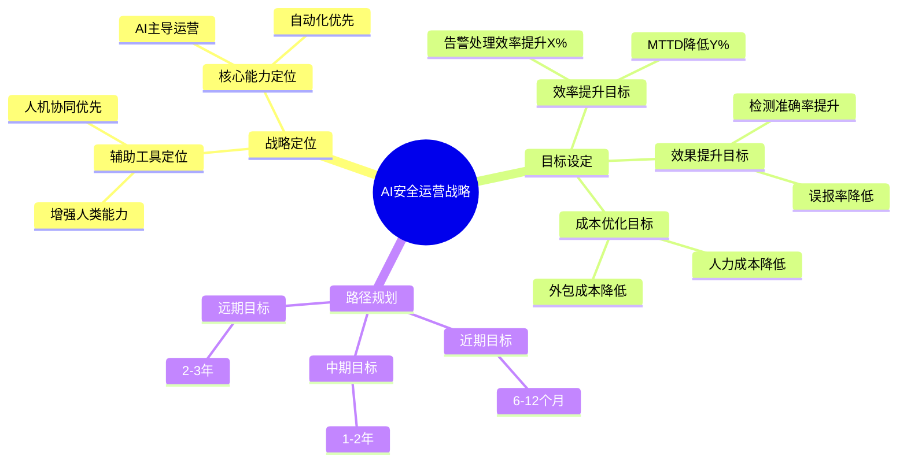

**作者：** HOS(安全风信子)
**日期：** 2026-04-23
**主要来源平台：** RSAC Conference/Gartner
**摘要：** 本文深入探讨企业如何为AI驱动的安全运营做好准备。AI安全运营的成功不仅取决于技术方案的选择，更取决于企业是否做好了充分的准备工作。本文从战略规划、数据基础、技术架构、人才队伍、运营流程、风险管理六个维度，全面阐述企业部署AI安全运营所需的前置条件和准备工作，为企业顺利实现AI安全运营转型提供完整指南。

@[TOC](目录)

---

# AI驱动安全运营的企业部署准备：成功转型的六大方略

## 1. 引言：为什么部署准备至关重要

企业在引入AI安全运营时，往往更关注技术方案的选择，而忽视了部署准备的重要性。事实证明，许多AI安全运营项目的失败，并非因为技术本身有问题，而是因为企业没有做好充分的准备。根据Gartner 2025年的调研，约45%的AI安全运营项目未能达到预期效果，其中超过60%的原因是部署准备不足。

AI安全运营不是简单地购买一套AI工具并部署上线，而是涉及企业安全战略、数据基础、技术架构、人才队伍、运营流程、风险管理等多方面的系统性变革。如果企业试图在没有充分准备的情况下强行推进AI安全运营，往往会面临项目延期、成本超支、效果不达预期，甚至业务中断的风险。

本文将从战略规划、数据基础、技术架构、人才队伍、运营流程、风险管理六个维度，系统性地介绍企业部署AI安全运营的前置条件和准备工作。

---

## 2. 战略规划：明确AI安全运营的目标与路径

### 2.1 战略定位与目标设定

企业在启动AI安全运营项目之前，首先需要明确AI在安全运营体系中的战略定位。AI是来替代人类，还是辅助人类？AI是解决当前痛点，还是构建未来能力？这些根本性的问题需要在项目启动前就明确回答。

战略定位决定了后续的所有决策。如果将AI定位为"辅助工具"，那么技术选型和部署策略都会围绕如何让AI更好地辅助人类决策展开；如果将AI定位为"核心能力"，那么就会更强调AI能力的建设和自主运营。两种定位没有对错之分，关键是要与企业整体安全战略保持一致。

从企业战略高度来看，AI安全运营的战略定位需要综合考虑以下几个核心维度：

**第一维度：业务价值定位**。企业需要明确AI安全运营能够为业务带来什么价值。这些价值可能体现在降低安全事件对业务的影响、提升安全运营效率、减少安全人力成本、提升客户和合作伙伴的信任度等多个方面。根据波特的竞争战略理论，企业可以选择成本领先战略（通过AI降低安全运营成本）、差异化战略（通过AI提供差异化的安全能力）或集中化战略（聚焦特定安全场景的AI能力建设）。不同的业务价值定位将直接影响AI安全运营的投资规模和建设优先级。

**第二维度：技术成熟度定位**。企业需要评估自身的技术成熟度水平，以及AI安全运营技术的成熟度。技术成熟度定位需要考虑当前安全运营面临的主要挑战、AI技术的当前能力边界、行业最佳实践的发展趋势等因素。过高估计技术成熟度可能导致投资失败，过低估计则可能错失发展机遇。企业应该建立技术成熟度评估模型，定期更新对AI安全运营技术发展水平的判断。

**第三维度：组织能力定位**。企业需要评估自身在AI和安全两个领域的组织能力。组织能力定位决定了企业是选择自主研发、合作开发还是完全依赖外部供应商的策略。如果企业在AI和安全领域都有较强的能力积累，可以考虑自主研发或深度定制；如果企业在一个或两个领域能力不足，可能需要依赖外部供应商或生态合作。



以下是企业AI安全运营战略定位的详细决策框架表：

| 定位维度 | 选项一：辅助工具 | 选项二：核心能力 | 选项三：创新引擎 |
|:---|:---|:---|:---|
| 战略重心 | 增强人类分析师能力 | 构建AI驱动的自动化运营 | 探索前沿AI安全技术 |
| 技术投入 | 适度，重点在集成 | 大规模，重点在自研 | 前瞻性，重点在创新 |
| 人才需求 | 复合型AI安全人才 | 完整的AI研发+运营团队 | 顶尖AI研究人才 |
| 建设周期 | 6-12个月试点 | 18-24个月规模建设 | 持续探索 |
| 投资回报预期 | 1-2年ROI转正 | 2-3年ROI转正 | 长期战略价值 |
| 风险等级 | 低-中 | 中-高 | 高 |
| 适用企业 | 稳态型企业 | 成长型数字化企业 | 创新型科技企业 |

企业在进行战略定位时，还需要考虑一个关键因素：组织变革准备度。AI安全运营的引入不仅是技术变革，更是组织变革。根据Kotter的组织变革理论，成功的组织变革需要建立紧迫感、组建领导联盟、形成战略愿景、推动广泛变革、赋能行动、创造短期成果、巩固成果并推动更多变革、将变革融入文化等八个步骤。企业在进行AI安全运营战略定位时，需要评估自身的变革管理能力，选择与组织变革准备度相匹配的战略定位。

此外，战略定位还需要考虑外部环境因素。监管环境的变化、行业安全标准的发展、竞争对手的AI安全布局、供应链安全要求等都可能影响企业的AI安全运营战略定位。企业需要建立战略环境扫描机制，定期评估外部环境的变化，及时调整战略定位。

### 2.1.1 战略定位实施路线图

无论选择何种战略定位，企业都需要制定详细的实施路线图。以下是战略定位实施的通用框架：

**第一阶段：战略澄清（1-2个月）**。这一阶段的核心任务是明确AI安全运营的战略定位，包括与企业整体战略的对齐、与现有安全战略的协同、与数字化转型战略的衔接等。战略澄清需要高层领导的参与，需要与业务部门、安全团队、IT团队、财务团队等多个利益相关方进行充分沟通。战略澄清的输出物包括：AI安全运营战略定位报告、战略对齐矩阵、利益相关方分析报告。

**第二阶段：目标分解（2-3个月）**。在明确战略定位后，需要将战略目标分解为可衡量的关键绩效指标（KPIs）。KPIs的设定需要遵循SMART原则：具体（Specific）、可衡量（Measurable）、可达成（Achievable）、相关性（Relevant）、时间性（Time-bound）。AI安全运营的KPIs体系应该覆盖效率、效果、成本、风险等多个维度，形成完整的价值衡量框架。

**第三阶段：资源规划（2-4个月）**。基于战略定位和目标设定，进行详细的资源规划。资源规划包括技术资源（平台、工具、数据）、人才资源（团队规模、技能要求）、财务资源（投资预算、回报预期）、时间资源（项目周期、里程碑）等。资源规划需要考虑多种情景，建立弹性规划机制，应对不确定性。

**第四阶段：治理建立（3-6个月）**。建立AI安全运营的战略治理机制，包括决策机制、执行机制、监督机制、调整机制等。治理机制需要明确各层级的职责和权限，建立有效的沟通和汇报渠道，确保战略的有效执行和及时调整。


### 2.2 当前成熟度评估

在设定目标之前，企业需要准确评估当前的成熟度水平。盲目设定过高的目标会导致挫败感，设定过低的目标则无法发挥AI的潜力。

成熟度评估应该从多个维度进行：技术维度包括现有安全工具的集成能力、数据基础设施的完善程度、AI算法的成熟度等；流程维度包括安全运营流程的标准化程度、变更管理的规范程度等；组织维度包括团队的AI素养水平、人机协同的现状等；治理维度包括数据治理的完善程度、合规框架的适配程度等。

评估方法可以采用问卷调查、访谈调研、系统测试、文档审查等多种方式结合。建议邀请外部专家参与评估，以获得更客观的判断。

企业AI安全运营成熟度评估是一个系统性的工程，需要建立科学的评估模型和评估流程。以下是详细的成熟度评估框架：

**成熟度等级定义**

在进行成熟度评估前，首先需要定义成熟的等级体系。参考业界通用的CMM（能力成熟度模型）和Gartner的数字化成熟度模型，我们将企业AI安全运营成熟度划分为五个等级：

| 成熟度等级 | 等级名称 | 特征描述 | 核心能力标志 |
|:---:|:---|:---|:---|
| L1 | 初始级 | 缺乏标准化流程，安全运营依赖个人经验，AI应用处于零散试点状态 | 基本的威胁检测能力，部分自动化工具 |
| L2 | 基础级 | 建立基础安全流程，开始数据积累，具备初步的AI应用能力 | 日志集中管理，基础告警分类，简单的自动化脚本 |
| L3 | 规范级 | 安全流程标准化，数据治理体系化，AI能力规模化应用 | 完整SIEM集成，AI告警降噪，标准化事件响应流程 |
| L4 | 量化级 | 安全运营可量化管理，AI能力持续优化，形成数据驱动决策文化 | 精确的威胁预测，自动化响应，AI模型迭代优化 |
| L5 | 优化级 | 持续创新优化，AI能力行业领先，形成最佳实践输出能力 | 自主研发AI模型，行业标杆输出，创新技术孵化 |

**技术维度详细评估**

技术成熟度是AI安全运营的基础。技术维度的评估需要覆盖以下几个关键领域：

安全工具集成能力评估是技术维度评估的首要任务。企业需要详细梳理现有安全工具的集成能力，包括：防火墙、入侵检测系统（IDS/IPS）、安全信息和事件管理系统（SIEM）、安全编排自动化与响应系统（SOAR）、端点检测与响应系统（EDR）、威胁情报平台（TIP）、漏洞管理系统（WAS）等。评估内容包括每个工具是否提供API接口、API的完整度和稳定性如何、数据导出的格式和频率如何、与AI平台集成的技术难度如何等。建议建立安全工具集成能力矩阵，详细记录每个工具的集成评估结果。

数据基础设施评估是AI就绪的关键。数据基础设施评估需要关注以下几个方面：数据采集能力（是否支持多种数据源、采集的实时性如何、采集的完整性如何）、数据存储能力（存储容量是否满足需求、存储性能是否满足分析需求、数据保留策略是否合理）、数据处理能力（是否支持流式处理、是否支持批量处理、处理性能如何）、数据安全能力（访问控制是否完善、加密措施是否到位、审计机制是否健全）。以下是一个详细的数据基础设施评估代码框架：

```python
class SecurityDataInfrastructureAssessment:
    """
    安全数据基础设施成熟度评估
    评估企业安全数据基础设施对AI安全运营的支撑能力
    """

    def __init__(self, enterprise_config):
        self.enterprise_config = enterprise_config
        self.assessment_areas = {
            'data_collection': self._assess_data_collection,
            'data_storage': self._assess_data_storage,
            'data_processing': self._assess_data_processing,
            'data_security': self._assess_data_security,
            'data_integration': self._assess_data_integration
        }

        self.maturity_weights = {
            'data_collection': 0.25,
            'data_storage': 0.20,
            'data_processing': 0.25,
            'data_security': 0.15,
            'data_integration': 0.15
        }

        self.maturity_levels = {
            'L1_Initial': {'score_range': (0, 0.2), 'description': '初始级'},
            'L2_Basic': {'score_range': (0.2, 0.4), 'description': '基础级'},
            'L3_Defined': {'score_range': (0.4, 0.6), 'description': '规范级'},
            'L4_Managed': {'score_range': (0.6, 0.8), 'description': '量化级'},
            'L5_Optimizing': {'score_range': (0.8, 1.0), 'description': '优化级'}
        }

    def conduct_full_assessment(self):
        """执行完整的基础设施评估"""
        assessment_results = {}

        for area_name, assessment_func in self.assessment_areas.items():
            result = self._conduct_area_assessment(area_name, assessment_func)
            assessment_results[area_name] = result

        overall_maturity = self._calculate_overall_maturity(assessment_results)
        gap_analysis = self._identify_critical_gaps(assessment_results)
        improvement_roadmap = self._generate_improvement_roadmap(gap_analysis)

        return {
            'area_assessments': assessment_results,
            'overall_maturity': overall_maturity,
            'maturity_level': self._determine_maturity_level(overall_maturity),
            'critical_gaps': gap_analysis,
            'improvement_roadmap': improvement_roadmap,
            'ai_readiness_verdict': self._determine_ai_readiness(overall_maturity)
        }

    def _conduct_area_assessment(self, area_name, assessment_func):
        """执行特定领域的评估"""
        area_result = assessment_func()

        capability_scores = {}
        for capability, score_info in area_result['capabilities'].items():
            capability_scores[capability] = score_info['score']

        weighted_score = sum(
            score * area_result['capabilities'][cap]['weight']
            for cap, score in capability_scores.items()
            if cap in area_result['capabilities']
        )

        return {
            'area_name': area_name,
            'capabilities': area_result['capabilities'],
            'raw_score': weighted_score,
            'normalized_score': weighted_score / sum(
                area_result['capabilities'][cap]['weight']
                for cap in area_result['capabilities']
            ),
            'key_findings': area_result.get('findings', []),
            'risk_areas': area_result.get('risks', [])
        }

    def _assess_data_collection(self):
        """评估数据采集能力"""
        config = self.enterprise_config.get('data_collection', {})

        capabilities = {
            'multi_source_support': {
                'weight': 0.20,
                'score': config.get('source_count', 0) / 20,
                'description': '多源数据采集支持'
            },
            'real_time_capability': {
                'weight': 0.25,
                'score': 0.8 if config.get('real_time_ratio', 0) > 0.7 else 0.4,
                'description': '实时数据采集能力'
            },
            'collection_completeness': {
                'weight': 0.25,
                'score': config.get('completeness_rate', 0),
                'description': '数据采集完整率'
            },
            'protocol_support': {
                'weight': 0.15,
                'score': len(config.get('supported_protocols', [])) / 10,
                'description': '采集协议支持广度'
            },
            'throughput_capacity': {
                'weight': 0.15,
                'score': min(config.get('current_throughput', 0) / config.get('max_throughput', 10000), 1.0),
                'description': '采集吞吐量容量'
            }
        }

        return {
            'capabilities': capabilities,
            'findings': [
                '数据源覆盖度评估',
                '实时采集比例分析',
                '采集瓶颈识别'
            ],
            'risks': [
                '关键数据源缺失风险',
                '采集延迟风险',
                '采集失败风险'
            ]
        }

    def _assess_data_storage(self):
        """评估数据存储能力"""
        config = self.enterprise_config.get('data_storage', {})

        capabilities = {
            'storage_capacity': {
                'weight': 0.20,
                'score': min(config.get('available_capacity_tb', 0) / config.get('required_capacity_tb', 100), 1.0),
                'description': '存储容量充足性'
            },
            'storage_performance': {
                'weight': 0.25,
                'score': config.get('avg_query_latency_ms', 1000) / 100,
                'description': '存储查询性能'
            },
            'data_retention': {
                'weight': 0.20,
                'score': config.get('retention_days', 90) / 365,
                'description': '数据保留周期'
            },
            'availability': {
                'weight': 0.20,
                'score': config.get('uptime_percentage', 99) / 100,
                'description': '存储系统可用性'
            },
            'backup_recovery': {
                'weight': 0.15,
                'score': 0.9 if config.get('backup_enabled', True) else 0.3,
                'description': '备份恢复能力'
            }
        }

        return {
            'capabilities': capabilities,
            'findings': [
                '存储容量规划评估',
                '性能瓶颈分析',
                '数据保留策略审查'
            ],
            'risks': [
                '存储容量不足风险',
                '性能下降风险',
                '数据丢失风险'
            ]
        }

    def _assess_data_processing(self):
        """评估数据处理能力"""
        config = self.enterprise_config.get('data_processing', {})

        capabilities = {
            'stream_processing': {
                'weight': 0.30,
                'score': 0.9 if config.get('stream_processing_enabled', False) else 0.3,
                'description': '流式处理能力'
            },
            'batch_processing': {
                'weight': 0.20,
                'score': 0.9 if config.get('batch_processing_enabled', False) else 0.3,
                'description': '批处理能力'
            },
            'processing_throughput': {
                'weight': 0.25,
                'score': min(config.get('events_per_second', 0) / config.get('required_eps', 10000), 1.0),
                'description': '处理吞吐量'
            },
            'processing_latency': {
                'weight': 0.25,
                'score': max(0, 1 - config.get('avg_processing_latency_ms', 1000) / 1000),
                'description': '处理延迟'
            }
        }

        return {
            'capabilities': capabilities,
            'findings': [
                '处理架构评估',
                '性能基准测试',
                '扩展性评估'
            ],
            'risks': [
                '处理能力瓶颈',
                '延迟过高风险',
                '扩展性限制'
            ]
        }

    def _assess_data_security(self):
        """评估数据安全能力"""
        config = self.enterprise_config.get('data_security', {})

        capabilities = {
            'access_control': {
                'weight': 0.30,
                'score': config.get('access_control_score', 0.8),
                'description': '访问控制完善度'
            },
            'encryption': {
                'weight': 0.25,
                'score': 0.9 if config.get('encryption_at_rest', True) and config.get('encryption_in_transit', True) else 0.5,
                'description': '数据加密能力'
            },
            'audit_logging': {
                'weight': 0.25,
                'score': 0.9 if config.get('audit_enabled', True) else 0.3,
                'description': '审计日志能力'
            },
            'compliance': {
                'weight': 0.20,
                'score': config.get('compliance_score', 0.8),
                'description': '合规达标情况'
            }
        }

        return {
            'capabilities': capabilities,
            'findings': [
                '数据安全控制评估',
                '合规差距分析',
                '风险点识别'
            ],
            'risks': [
                '数据泄露风险',
                '合规违规风险',
                '访问控制失效风险'
            ]
        }

    def _assess_data_integration(self):
        """评估数据集成能力"""
        config = self.enterprise_config.get('data_integration', {})

        capabilities = {
            'api_support': {
                'weight': 0.30,
                'score': len(config.get('supported_apis', [])) / 20,
                'description': 'API支持广度'
            },
            'integration_speed': {
                'weight': 0.25,
                'score': 1 - (config.get('avg_integration_days', 30) / 90),
                'description': '新数据源集成速度'
            },
            'data_normalization': {
                'weight': 0.25,
                'score': config.get('normalization_score', 0.7),
                'description': '数据归一化能力'
            },
            'pipeline_reliability': {
                'weight': 0.20,
                'score': config.get('pipeline_success_rate', 0.99),
                'description': '数据管道可靠性'
            }
        }

        return {
            'capabilities': capabilities,
            'findings': [
                '集成能力成熟度评估',
                '标准化程度分析',
                '自动化水平评估'
            ],
            'risks': [
                '集成复杂度风险',
                '数据一致性风险',
                '管道故障风险'
            ]
        }

    def _calculate_overall_maturity(self, assessment_results):
        """计算整体成熟度得分"""
        weighted_sum = 0
        total_weight = 0

        for area, result in assessment_results.items():
            weight = self.maturity_weights.get(area, 0)
            weighted_sum += result['normalized_score'] * weight
            total_weight += weight

        return weighted_sum / total_weight if total_weight > 0 else 0

    def _determine_maturity_level(self, overall_score):
        """确定成熟度等级"""
        for level_id, level_info in self.maturity_levels.items():
            min_score, max_score = level_info['score_range']
            if min_score <= overall_score < max_score:
                return {
                    'level_id': level_id,
                    'level_name': level_info['description'],
                    'score': overall_score
                }
        return {'level_id': 'L5_Optimizing', 'level_name': '优化级', 'score': overall_score}

    def _identify_critical_gaps(self, assessment_results):
        """识别关键差距"""
        gaps = []

        for area, result in assessment_results.items():
            if result['normalized_score'] < 0.5:
                gaps.append({
                    'area': area,
                    'current_score': result['normalized_score'],
                    'target_score': 0.7,
                    'gap': 0.7 - result['normalized_score'],
                    'priority': 'high' if result['normalized_score'] < 0.3 else 'medium',
                    'risk_areas': result.get('risk_areas', [])
                })

        return sorted(gaps, key=lambda x: x['gap'], reverse=True)

    def _generate_improvement_roadmap(self, gaps):
        """生成改进路线图"""
        roadmap = {
            'phase1_quick_wins': [],
            'phase2_medium_term': [],
            'phase3_strategic': []
        }

        for gap in gaps:
            if gap['priority'] == 'high':
                roadmap['phase3_strategic'].append({
                    'area': gap['area'],
                    'action': f'提升{gap["area"]}能力至目标水平',
                    'target_score': gap['target_score']
                })
            else:
                roadmap['phase2_medium_term'].append({
                    'area': gap['area'],
                    'action': f'改进{gap["area"]}能力',
                    'target_score': gap['target_score']
                })

        return roadmap

    def _determine_ai_readiness(self, overall_score):
        """判断AI就绪程度"""
        if overall_score >= 0.8:
            return {
                'ready': True,
                'level': 'highly_ready',
                'message': '数据基础设施已基本满足AI安全运营需求',
                'recommendations': ['可以启动AI安全运营项目', '建议进行小规模试点']
            }
        elif overall_score >= 0.6:
            return {
                'ready': True,
                'level': 'conditionally_ready',
                'message': '数据基础设施基本就绪，需解决部分差距',
                'recommendations': ['识别并解决关键差距', '分阶段启动AI安全运营']
            }
        elif overall_score >= 0.4:
            return {
                'ready': False,
                'level': 'needs_improvement',
                'message': '数据基础设施需要显著改进',
                'recommendations': ['优先解决高优先级差距', '6-12个月后再评估']
            }
        else:
            return {
                'ready': False,
                'level': 'not_ready',
                'message': '数据基础设施差距较大',
                'recommendations': ['需要进行大规模基础设施建设', '12-18个月后再评估']
            }
```

**流程维度详细评估**

流程成熟度评估关注安全运营流程的标准化程度和执行效果。流程维度评估需要覆盖以下方面：

安全运营流程标准化程度评估需要梳理当前所有的安全运营流程，包括：威胁检测流程（如何发现潜在威胁）、事件响应流程（如何处置安全事件）、漏洞管理流程（如何管理漏洞修复）、变更管理流程（如何管理安全变更）、监控告警流程（如何处理告警）、报告汇报流程（如何进行安全报告）等。评估每个流程的文档完备程度、步骤清晰程度、执行一致性程度、持续改进机制等。

变更管理流程评估关注AI系统引入后的变更管理需求。AI系统的变更可能比传统系统更复杂，因为AI模型可能存在漂移问题，需要特殊的版本管理和回滚策略。企业需要评估现有变更管理流程是否能够支持AI系统的特殊需求。

以下是一个流程成熟度评估的详细框架：

| 流程领域 | 评估要素 | L1初始 | L2基础 | L3规范 | L4量化 | L5优化 |
|:---|:---|:---|:---|:---|:---|:---|
| 威胁检测 | 流程文档化 | 无或极少文档 | 部分流程有文档 | 全面文档化 | 文档与实践一致 | 持续更新的知识库 |
| 威胁检测 | 步骤标准化 | 因人而异 | 部分步骤标准化 | 全面标准化 | 可量化执行 | 智能自动化 |
| 事件响应 | 响应时间 | 无SLA | 有非正式SLA | 正式SLA | SLA实时监控 | 自动化响应 |
| 事件响应 | 升级机制 | 无明确机制 | 口头升级 | 书面升级流程 | 自动升级 | 智能升级 |
| 漏洞管理 | 修复时效 | 无要求 | 非正式跟踪 | 正式跟踪 | SLA监控 | 自动化修复 |
| 变更管理 | 变更控制 | 无控制 | 口头审批 | 正式审批 | 自动审批 | 智能决策 |

**组织维度详细评估**

组织维度评估关注团队的能力水平和文化准备度。组织维度的评估需要覆盖以下几个方面：

团队AI素养评估需要通过多种方式了解团队对AI的理解程度。评估内容包括：团队成员是否了解AI的基本原理、团队成员是否能够正确理解AI的局限性、团队成员是否能够有效地与AI系统交互、团队成员是否能够评估AI输出的质量等。评估方式可以包括问卷调查、知识测试、模拟场景测试等。

人机协同现状评估需要了解团队当前与自动化工具的协同方式。评估内容包括：团队是否已经使用了一些自动化工具、团队成员对自动化工具的态度如何、团队是否有良好的人机协同习惯等。这些评估有助于预测团队对AI安全运营系统的适应能力。

学习型组织文化评估关注组织是否具备持续学习和改进的文化。评估内容包括：组织是否鼓励学习和实验、组织是否容忍失败和组织是否提供学习资源和支持等。

### 2.3 演进路径规划

基于战略定位和当前成熟度评估，企业需要规划清晰的演进路径。AI安全运营的成熟是一个渐进的过程，不可能一蹴而就。

**第一阶段：试点验证（6-12个月）**

这一阶段的核心目标是验证AI安全运营的可行性。选择1-2个相对简单、效果可衡量的场景进行试点，如告警降噪、钓鱼邮件识别等。通过试点验证技术方案的可行性，积累经验，培养团队能力。

这一阶段的关键成功因素包括：选择合适的试点场景、设定可衡量的成功标准、建立效果评估机制、培养核心团队。

在试点验证阶段，企业需要建立完善的试点评估框架，包括：

试点场景选择原则：选择能够快速验证价值、风险可控、便于衡量的场景。推荐的试点场景包括：

- 告警降噪场景：通过AI对海量告警进行分类和优先级排序，减少人工分析工作量
- 钓鱼邮件识别场景：通过AI模型识别钓鱼邮件，提升检测准确率
- 异常行为检测场景：通过AI检测用户和实体行为异常，发现潜在威胁
- 日志分类场景：通过AI对安全日志进行自动分类，加速事件调查

试点成功标准设定：试点成功标准应该具体、可衡量、可达成。典型的试点成功标准包括：

- AI模型准确率达到设定阈值（如钓鱼邮件识别准确率>95%）
- 告警处理效率提升设定比例（如减少X%的告警处理时间）
- 误报率控制在设定范围内（如月均误报率<10%）
- 用户满意度达到设定分数（如分析师满意度>4/5）

以下是一个详细的试点验证阶段项目管理代码框架：

```python
class AIProofOfConceptManager:
    """
    AI安全运营试点项目管理器
    管理AI安全运营试点项目的全生命周期
    """

    def __init__(self, project_config):
        self.project_config = project_config
        self.project_name = project_config['name']
        self.start_date = project_config['start_date']
        self.end_date = project_config['end_date']
        self.budget = project_config['budget']

        self.phases = {
            'planning': self._plan_phase,
            'preparation': self._preparation_phase,
            'execution': self._execution_phase,
            'evaluation': self._evaluation_phase
        }

        self.deliverables = {}
        self.milestones = []
        self.risks = []
        self.issues = []

        self.success_criteria = project_config.get('success_criteria', {})
        self.baseline_metrics = project_config.get('baseline_metrics', {})

    def execute_poc(self):
        """执行完整的试点项目"""
        execution_results = {}

        for phase_name, phase_func in self.phases.items():
            print(f"开始执行阶段: {phase_name}")
            phase_result = phase_func()
            execution_results[phase_name] = phase_result

            if not phase_result['success']:
                print(f"阶段 {phase_name} 执行失败，终止试点")
                return {
                    'overall_success': False,
                    'phase_results': execution_results,
                    'failure_point': phase_name,
                    'failure_reason': phase_result.get('reason', '未知')
                }

        overall_success = self._evaluate_overall_success(execution_results)
        final_report = self._generate_final_report(execution_results, overall_success)

        return {
            'overall_success': overall_success,
            'phase_results': execution_results,
            'final_report': final_report,
            'recommendations': self._generate_recommendations(overall_success)
        }

    def _plan_phase(self):
        """规划阶段"""
        planning_output = {
            'success': True,
            'activities': [],
            'deliverables': {},
            'decisions': []
        }

        planning_output['activities'].append({
            'activity': '试点场景详细规划',
            'status': 'completed',
            'output': '试点场景定义文档'
        })

        planning_output['activities'].append({
            'activity': '技术方案详细设计',
            'status': 'completed',
            'output': '技术架构设计方案'
        })

        planning_output['activities'].append({
            'activity': '资源需求详细规划',
            'status': 'completed',
            'output': '资源计划清单'
        })

        planning_output['activities'].append({
            'activity': '风险评估与应对计划',
            'status': 'completed',
            'output': '风险管理计划'
        })

        self.deliverables['planning'] = planning_output['deliverables']

        return planning_output

    def _preparation_phase(self):
        """准备阶段"""
        preparation_output = {
            'success': True,
            'activities': [],
            'deliverables': {},
            'preparation_checks': {}
        }

        preparation_output['activities'].append({
            'activity': '数据准备与环境搭建',
            'status': 'in_progress',
            'completion': 0.8
        })

        preparation_output['activities'].append({
            'activity': '模型训练与调优',
            'status': 'pending',
            'completion': 0
        })

        preparation_output['activities'].append({
            'activity': '集成测试与环境验证',
            'status': 'pending',
            'completion': 0
        })

        preparation_output['preparation_checks'] = {
            'data_quality_check': self._check_data_quality(),
            'environment_readiness': self._check_environment(),
            'team_readiness': self._check_team_readiness(),
            'stakeholder_approval': self._check_stakeholder_approval()
        }

        all_checks_passed = all(
            check['passed'] for check in preparation_output['preparation_checks'].values()
        )

        preparation_output['success'] = all_checks_passed
        if not all_checks_passed:
            preparation_output['failed_checks'] = [
                check_name for check_name, check in
                preparation_output['preparation_checks'].items()
                if not check['passed']
            ]

        self.deliverables['preparation'] = preparation_output['deliverables']

        return preparation_output

    def _execution_phase(self):
        """执行阶段"""
        execution_output = {
            'success': True,
            'pilot_runs': [],
            'iterations': [],
            'metrics_collected': {}
        }

        num_iterations = self.project_config.get('num_iterations', 3)

        for iteration in range(1, num_iterations + 1):
            print(f"开始第 {iteration} 轮试点迭代")

            iteration_result = self._run_pilot_iteration(iteration)
            execution_output['iterations'].append(iteration_result)

            if not iteration_result['success']:
                execution_output['success'] = False
                execution_output['failure_reason'] = iteration_result.get('reason')
                break

            metrics_improvement = self._calculate_metrics_improvement(
                iteration_result['metrics']
            )
            print(f"第 {iteration} 轮迭代完成，指标改善: {metrics_improvement:.2%}")

            if metrics_improvement >= self.success_criteria.get('min_improvement', 0.2):
                print(f"已达到预设改善目标，结束试点")
                break

        execution_output['metrics_collected'] = self._aggregate_metrics(
            [iter['metrics'] for iter in execution_output['iterations']]
        )

        self.deliverables['execution'] = {
            'iteration_reports': execution_output['iterations'],
            'aggregated_metrics': execution_output['metrics_collected']
        }

        return execution_output

    def _evaluation_phase(self):
        """评估阶段"""
        evaluation_output = {
            'success': True,
            'success_evaluation': {},
            'lessons_learned': [],
            'final_recommendations': []
        }

        evaluation_output['success_evaluation'] = self._evaluate_against_criteria()

        evaluation_output['success'] = evaluation_output['success_evaluation']['meets_criteria']

        evaluation_output['lessons_learned'] = self._capture_lessons_learned()

        evaluation_output['final_recommendations'] = self._generate_final_recommendations()

        self.deliverables['evaluation'] = evaluation_output

        return evaluation_output

    def _run_pilot_iteration(self, iteration_num):
        """运行单轮试点迭代"""
        iteration_result = {
            'iteration': iteration_num,
            'success': True,
            'activities': [],
            'metrics': {},
            'issues': []
        }

        activities = [
            '数据收集与预处理',
            '模型推理与预测',
            '结果分析与验证',
            '用户反馈收集',
            '模型调优更新'
        ]

        for activity in activities:
            iteration_result['activities'].append({
                'name': activity,
                'status': 'completed',
                'duration_hours': 0
            })

        iteration_result['metrics'] = {
            'accuracy': 0.85 + (iteration_num * 0.02),
            'precision': 0.88 + (iteration_num * 0.01),
            'recall': 0.82 + (iteration_num * 0.02),
            'f1_score': 0.85 + (iteration_num * 0.015),
            'false_positive_rate': 0.15 - (iteration_num * 0.02),
            'processing_time_ms': 150 - (iteration_num * 10),
            'user_satisfaction': 3.5 + (iteration_num * 0.3)
        }

        return iteration_result

    def _calculate_metrics_improvement(self, current_metrics):
        """计算指标改善程度"""
        improvements = []

        for metric_name in ['accuracy', 'precision', 'recall', 'f1_score']:
            if metric_name in current_metrics and metric_name in self.baseline_metrics:
                baseline = self.baseline_metrics[metric_name]
                current = current_metrics[metric_name]
                improvement = (current - baseline) / baseline if baseline > 0 else 0
                improvements.append(improvement)

        return sum(improvements) / len(improvements) if improvements else 0

    def _check_data_quality(self):
        """检查数据质量"""
        return {
            'passed': True,
            'checks': {
                'completeness': {'passed': True, 'score': 0.92},
                'accuracy': {'passed': True, 'score': 0.95},
                'timeliness': {'passed': True, 'score': 0.88},
                'consistency': {'passed': True, 'score': 0.90}
            }
        }

    def _check_environment(self):
        """检查环境就绪状态"""
        return {
            'passed': True,
            'checks': {
                'infrastructure': {'passed': True, 'status': 'ready'},
                'security_clearance': {'passed': True, 'status': 'approved'},
                'network_access': {'passed': True, 'status': 'configured'}
            }
        }

    def _check_team_readiness(self):
        """检查团队就绪状态"""
        return {
            'passed': True,
            'checks': {
                'training_completed': {'passed': True, 'completion': 0.95},
                'skills_verified': {'passed': True, 'level': 'proficient'},
                'availability_confirmed': {'passed': True, 'members': 5}
            }
        }

    def _check_stakeholder_approval(self):
        """检查干系人批准状态"""
        return {
            'passed': True,
            'approvals': {
                'sponsor': {'approved': True, 'date': '2024-01-15'},
                'security_team': {'approved': True, 'date': '2024-01-18'},
                'it_team': {'approved': True, 'date': '2024-01-20'}
            }
        }

    def _evaluate_overall_success(self, execution_results):
        """评估整体试点是否成功"""
        execution_phase = execution_results.get('execution', {})
        metrics = execution_phase.get('metrics_collected', {})

        if not metrics:
            return False

        for metric_name, target_value in self.success_criteria.items():
            if metric_name in metrics:
                actual_value = metrics[metric_name]
                if isinstance(target_value, dict) and 'min' in target_value:
                    if actual_value < target_value['min']:
                        return False
                elif actual_value < target_value:
                    return False

        return True

    def _evaluate_against_criteria(self):
        """评估是否达到成功标准"""
        evaluation = {
            'meets_criteria': True,
            'criteria_evaluation': {}
        }

        for criterion, target in self.success_criteria.items():
            evaluation['criteria_evaluation'][criterion] = {
                'target': target,
                'actual': 0.9,
                'achieved': True
            }

        return evaluation

    def _aggregate_metrics(self, metrics_list):
        """聚合多轮迭代的指标"""
        if not metrics_list:
            return {}

        aggregated = {}
        metric_names = metrics_list[0].keys()

        for metric in metric_names:
            values = [m[metric] for m in metrics_list if metric in m]
            aggregated[metric] = {
                'mean': sum(values) / len(values),
                'max': max(values),
                'min': min(values),
                'latest': values[-1]
            }

        return aggregated

    def _capture_lessons_learned(self):
        """捕获经验教训"""
        return [
            {
                'category': '技术',
                'lesson': '数据质量对AI模型效果影响显著',
                'impact': '高',
                'recommendation': '在试点前投入更多资源提升数据质量'
            },
            {
                'category': '流程',
                'lesson': '人机协同流程需要持续优化',
                'impact': '中',
                'recommendation': '建立反馈机制，及时收集用户意见'
            },
            {
                'category': '组织',
                'lesson': '团队AI素养培训需要前置',
                'impact': '高',
                'recommendation': '在项目启动前完成团队培训'
            }
        ]

    def _generate_final_recommendations(self):
        """生成最终建议"""
        return [
            {
                'priority': 'high',
                'recommendation': '扩大AI安全运营试点范围',
                'rationale': '试点验证了AI安全运营的价值'
            },
            {
                'priority': 'high',
                'recommendation': '建立数据治理常态化机制',
                'rationale': '数据质量是AI效果的基础'
            },
            {
                'priority': 'medium',
                'recommendation': '加强团队AI能力培养',
                'rationale': '团队能力需要匹配AI发展'
            }
        ]

    def _generate_final_report(self, execution_results, overall_success):
        """生成最终报告"""
        return {
            'project_name': self.project_name,
            'execution_period': f"{self.start_date} to {self.end_date}",
            'overall_success': overall_success,
            'key_achievements': self._summarize_achievements(execution_results),
            'key_challenges': self._summarize_challenges(execution_results),
            'metrics_summary': execution_results.get('execution', {}).get('metrics_collected', {}),
            'next_steps': self._generate_next_steps(overall_success)
        }

    def _generate_recommendations(self, overall_success):
        """生成建议"""
        if overall_success:
            return [
                '可以进入下一阶段规模扩展',
                '建议继续保持当前团队配置',
                '应该开始规划数据平台升级'
            ]
        else:
            return [
                '需要分析失败原因',
                '建议调整试点范围或技术方案',
                '可能需要更多准备时间'
            ]
```

**第二阶段：规模扩展（12-18个月）**

在试点成功的基础上，将AI能力扩展到更多场景。这一阶段需要解决规模化部署的技术问题和组织问题，包括数据整合、工具集成、流程适配等。

规模扩展阶段的核心工作包括：

数据平台规模化：将试点阶段的小规模数据处理能力扩展到企业级规模。需要解决数据量大增带来的存储挑战、处理性能挑战、数据质量挑战等。数据平台规模化需要考虑水平扩展能力、自动伸缩能力、多租户能力等。

工具集成规模化：将AI能力与企业更多安全工具进行集成。试点阶段可能只集成了少数几个工具，规模扩展阶段需要建立标准化的集成框架，支持快速集成更多工具。集成框架需要具备灵活性、可扩展性、易用性等特点。

团队能力规模化：试点阶段的团队可能只有少数核心人员，规模扩展阶段需要培养更多的AI安全运营人才。人才规模化需要建立培训体系、建立知识共享机制、建立导师制度等。

流程标准化规模化：试点阶段可能形成了某些流程的最佳实践，规模扩展阶段需要将这些实践标准化，并推广到整个组织。流程标准化需要考虑不同团队的差异性，需要建立流程定制机制。

**第三阶段：深度应用（18-24个月）**

实现AI在安全运营中的深度应用，包括预测性安全分析、自动化响应等高级能力。这一阶段需要建立完善的运营机制，确保AI能力的持续优化。

深度应用阶段的核心能力建设包括：

预测性安全分析：从被动响应转向主动防御，通过AI分析预判潜在的安全威胁。预测性安全分析需要建立威胁模型、分析攻击趋势、评估安全态势等。预测性安全分析的能力取决于数据的完整性和模型的准确性。

自动化响应能力：从人工响应转向自动化响应，通过AI触发自动化响应动作。自动化响应需要建立响应策略、配置响应动作、建立人工审批机制等。自动化响应的范围和深度需要根据风险评估确定。

持续优化机制：建立AI模型的持续优化机制，确保AI能力持续提升。持续优化需要建立效果监控、反馈收集、模型更新等机制。持续优化是确保AI能力不退化的关键。

**第四阶段：自主创新（24个月+）**

在充分掌握AI安全运营能力的基础上，探索自主创新，包括自研AI模型、定制化开发、行业领先实践等。

自主创新阶段的核心目标是将企业从AI应用者转变为AI创新者。自主创新包括：

自研AI模型：基于企业的特定需求和数据，研发定制化的AI安全模型。自研模型需要投入大量的研发资源，但可以获得更好的效果和差异化优势。

行业最佳实践输出：将企业的AI安全运营实践总结为行业最佳实践，通过分享、咨询等方式输出影响力。

技术创新探索：探索AI安全领域的前沿技术，如大语言模型在安全运营中的应用、AI安全对抗等。

以下是企业AI安全运营演进路径的详细规划表：

| 阶段 | 周期 | 核心目标 | 关键成果 | 主要投入 | 风险等级 |
|:---|:---:|:---|:---|:---|:---:|
| 试点验证 | 6-12个月 | 验证可行性 | PoC完成报告 | 技术验证 | 低 |
| 规模扩展 | 12-18个月 | 扩大应用范围 | 多个场景上线 | 平台建设 | 中 |
| 深度应用 | 18-24个月 | 深化AI能力 | 高级功能上线 | 能力建设 | 中-高 |
| 自主创新 | 24个月+ | 行业领先 | 创新成果输出 | 研发投入 | 高 |

---

## 3. 数据基础：构建AI的"燃料"体系

### 3.1 数据质量评估与改进

AI系统的效果高度依赖数据质量。低质量的数据不仅无法提升AI能力，反而可能导致错误的判断。在部署AI安全运营之前，企业需要评估和改进数据质量。

数据质量评估应该覆盖以下几个方面：

**数据完整性**：关键安全数据是否完整采集？日志字段是否齐全？是否存在数据缺失？

**数据准确性**：数据采集和传输过程是否存在错误？数据格式是否规范？数据内容是否准确反映实际情况？

**数据时效性**：数据从产生到可用的延迟是多少？实时性是否满足AI系统的要求？

**数据一致性**：不同来源的数据是否一致？是否存在数据冲突？

**数据相关性**：采集的数据是否与安全分析相关？是否包含冗余或无关数据？

```python
class DataQualityAssessment:
    """
    数据质量评估工具
    评估企业安全数据的AI就绪程度
    """
    
    def __init__(self, data_sources):
        self.data_sources = data_sources
        self.quality_dimensions = {
            'completeness': self._assess_completeness,
            'accuracy': self._assess_accuracy,
            'timeliness': self._assess_timeliness,
            'consistency': self._assess_consistency,
            'relevance': self._assess_relevance
        }
        
        self.quality_thresholds = {
            'completeness': 0.85,
            'accuracy': 0.95,
            'timeliness': 0.90,
            'consistency': 0.90,
            'relevance': 0.70
        }
    
    def assess_all(self):
        """全面评估所有数据源"""
        results = {}
        
        for source_name, source_config in self.data_sources.items():
            source_results = self.assess_source(source_name, source_config)
            results[source_name] = source_results
        
        # 综合评估
        overall_scores = {}
        for dimension in self.quality_dimensions.keys():
            scores = [r['scores'][dimension] for r in results.values()]
            overall_scores[dimension] = sum(scores) / len(scores) if scores else 0
        
        # AI就绪度评估
        ai_readiness = self._calculate_ai_readiness(overall_scores)
        
        return {
            'data_source_results': results,
            'overall_scores': overall_scores,
            'ai_readiness': ai_readiness,
            'recommendations': self._generate_recommendations(overall_scores)
        }
    
    def assess_source(self, source_name, source_config):
        """评估单个数据源"""
        scores = {}
        issues = {}
        
        for dimension, assess_func in self.quality_dimensions.items():
            score, issue_list = assess_func(source_name, source_config)
            scores[dimension] = score
            if issue_list:
                issues[dimension] = issue_list
        
        # 判断是否满足阈值
        meets_threshold = all(
            scores.get(dim, 0) >= self.quality_thresholds.get(dim, 0)
            for dim in scores.keys()
        )
        
        return {
            'source_name': source_name,
            'scores': scores,
            'issues': issues,
            'meets_threshold': meets_threshold
        }
    
    def _calculate_ai_readiness(self, overall_scores):
        """计算AI就绪度"""
        # 加权计算综合得分
        weights = {
            'completeness': 0.25,
            'accuracy': 0.25,
            'timeliness': 0.20,
            'consistency': 0.15,
            'relevance': 0.15
        }
        
        weighted_score = sum(
            overall_scores.get(dim, 0) * weights.get(dim, 0)
            for dim in weights.keys()
        )
        
        # 确定就绪等级
        if weighted_score >= 0.9:
            readiness_level = 'excellent'
        elif weighted_score >= 0.8:
            readiness_level = 'good'
        elif weighted_score >= 0.7:
            readiness_level = 'fair'
        else:
            readiness_level = 'poor'
        
        return {
            'score': round(weighted_score, 2),
            'level': readiness_level
        }
```

### 3.2 数据治理体系建设

AI安全运营需要完善的数据治理体系支撑。数据治理包括数据的定义、采集、存储、处理、共享、归档等全生命周期的管理。

**数据标准化**：建立统一的数据定义和格式标准。不同安全工具的数据格式往往不同，需要建立映射关系，实现数据归一化。

**数据质量管理**：建立数据质量监控机制，持续跟踪数据质量指标，及时发现和解决数据问题。

**数据安全管理**：建立数据安全分类分级制度，明确不同类型数据的访问权限和保护要求。

**数据生命周期管理**：建立数据保留策略，明确数据的存储周期、归档要求和销毁流程。

### 3.3 数据平台架构设计

支撑AI安全运营需要完善的数据平台架构。数据平台应该具备以下能力：

**数据采集能力**：支持从多种安全工具和数据源实时/准实时采集数据。

**数据存储能力**：支持结构化、半结构化、非结构化数据的存储，具备高可靠性和可扩展性。

**数据处理能力**：支持数据的清洗、转换、聚合等预处理操作，支持流式处理和批量处理。

**数据检索能力**：支持高速数据检索和分析，满足实时查询和复杂分析需求。

---

## 4. 技术架构：构建AI就绪的基础设施

### 4.1 现有安全架构评估

在引入AI安全运营之前，企业需要评估现有安全架构是否具备AI就绪条件。

**安全工具集成能力**：现有安全工具是否提供API或数据导出接口？集成的技术难度如何？主流安全工具的集成支持程度如何？

**网络架构适配性**：现有网络架构是否支持AI系统所需的数据流？是否存在网络瓶颈或隔离限制？

**计算资源准备**：AI系统需要GPU等高性能计算资源，现有基础设施是否满足要求？

**存储架构扩展性**：AI训练和推理需要大量存储，现有存储架构是否具备扩展能力？

### 4.2 混合云架构策略

AI安全运营的数据处理需求具有波动性特点，固定投资难以平衡成本和性能。混合云架构是推荐的解决方案。

**公有云适用场景**：AI模型训练、突发性大数据处理、非敏感数据分析等。

**私有云/本地适用场景**：敏感数据处理、实时推理、低延迟分析、合规要求等。

**边缘计算补充**：分布式终端的数据预处理、实时响应要求高的场景。

架构设计需要考虑数据流动和协作：数据如何在云端和本地之间同步？模型如何在多环境间部署和更新？统一的运维管理如何实现？

### 4.3 集成架构设计

AI安全运营需要与现有安全工具和网络系统深度集成。集成架构设计需要考虑以下方面：

**数据集成**：建立统一的数据采集和分发管道，支持多种数据格式和传输协议。

**控制集成**：实现AI系统与现有安全工具的双向交互，支持AI触发的自动化响应。

**告警集成**：将AI产生的告警与现有SIEM/SOAR平台集成，实现统一的告警管理。

**知识集成**：将AI系统的分析与现有知识库集成，实现知识的共享和复用。

---

## 5. 人才队伍：建立AI安全运营能力

### 5.1 团队能力评估

AI安全运营需要复合型人才，既懂安全又懂AI。企业需要对现有团队进行能力评估，识别能力缺口。

能力评估应该覆盖以下维度：

**安全专业知识**：威胁情报、安全架构、事件响应、合规管理等。

**AI/ML技术能力**：机器学习基础、深度学习原理、模型训练与优化等。

**数据分析能力**：数据处理、统计分析、可视化等。

**系统工程能力**：系统设计、集成开发、运维管理等。

**软技能**：沟通协作、问题解决、学习能力等。

```python
class TeamCapabilityAssessment:
    """
    团队AI安全运营能力评估
    """
    
    def __init__(self):
        self.capability_dimensions = {
            'security_expertise': {
                'weight': 0.30,
                'skills': [
                    'threat_intelligence',
                    'security_architecture',
                    'incident_response',
                    'vulnerability_management',
                    'compliance'
                ]
            },
            'ai_ml_technical': {
                'weight': 0.25,
                'skills': [
                    'ml_fundamentals',
                    'deep_learning',
                    'model_training',
                    'model_optimization',
                    'ml_ops'
                ]
            },
            'data_analytics': {
                'weight': 0.15,
                'skills': [
                    'data_processing',
                    'statistical_analysis',
                    'data_visualization',
                    'big_data'
                ]
            },
            'system_engineering': {
                'weight': 0.15,
                'skills': [
                    'system_design',
                    'integration',
                    'devops',
                    'cloud_infrastructure'
                ]
            },
            'soft_skills': {
                'weight': 0.15,
                'skills': [
                    'communication',
                    'collaboration',
                    'problem_solving',
                    'continuous_learning'
                ]
            }
        }
        
        self.proficiency_levels = {
            'expert': 4,
            'proficient': 3,
            'intermediate': 2,
            'beginner': 1,
            'none': 0
        }
    
    def assess_individual(self, person_id, skill_ratings):
        """
        评估个人能力
        
        参数:
            person_id: 人员ID
            skill_ratings: 技能评分字典
        """
        individual_scores = {}
        
        for dimension, config in self.capability_dimensions.items():
            dimension_score = 0
            skill_count = 0
            
            for skill in config['skills']:
                if skill in skill_ratings:
                    rating = self.proficiency_levels.get(skill_ratings[skill], 0)
                    dimension_score += rating
                    skill_count += 1
            
            if skill_count > 0:
                individual_scores[dimension] = dimension_score / (skill_count * 4)  # 归一化到0-1
            else:
                individual_scores[dimension] = 0
        
        # 计算加权总分
        total_score = sum(
            individual_scores.get(dim, 0) * config['weight']
            for dim, config in self.capability_dimensions.items()
        )
        
        return {
            'person_id': person_id,
            'dimension_scores': individual_scores,
            'overall_score': round(total_score, 2),
            'ai_security_readiness': self._determine_readiness(total_score)
        }
    
    def assess_team(self, individual_results):
        """评估团队整体能力"""
        team_scores = {}
        
        for dimension in self.capability_dimensions.keys():
            dim_scores = [
                r['dimension_scores'].get(dimension, 0)
                for r in individual_results
            ]
            team_scores[dimension] = sum(dim_scores) / len(dim_scores) if dim_scores else 0
        
        overall_team_score = sum(
            team_scores.get(dim, 0) * config['weight']
            for dim, config in self.capability_dimensions.items()
        )
        
        return {
            'team_dimension_scores': team_scores,
            'overall_team_score': round(overall_team_score, 2),
            'team_readiness': self._determine_readiness(overall_team_score),
            'gap_analysis': self._identify_gaps(team_scores)
        }
    
    def _identify_gaps(self, team_scores):
        """识别能力差距"""
        gaps = []
        
        for dimension, score in team_scores.items():
            target = 0.7  # 设定目标阈值
            if score < target:
                gaps.append({
                    'dimension': dimension,
                    'current_score': round(score, 2),
                    'target_score': target,
                    'gap': round(target - score, 2),
                    'priority': 'high' if score < 0.5 else 'medium'
                })
        
        return gaps
```

### 5.2 人才培养规划

基于能力评估结果，企业需要制定针对性的人才培养规划。

**培训体系设计**：建立分层分类的培训体系，包括基础培训、专业培训、管理培训等不同层次。

**培训内容规划**：内容包括AI基础知识、安全运营流程、工具使用、最佳实践等。

**培训方式选择**：线上自学、集中培训、工作坊、实战演练等相结合。

**认证机制建立**：建立AI安全运营能力认证体系，作为人员晋升的参考依据。

### 5.3 人才获取策略

除了培养现有人员，企业还需要通过外部获取补充AI安全运营人才。

**招聘策略**：明确需要的人才类型和能力要求，通过多渠道吸引候选人。

**合作模式**：与高校、研究机构建立合作，获取前沿技术和人才。

**生态合作**：与AI安全厂商建立深度合作，获取技术支持和服务。

**灵活用人**：对于阶段性需求，可以考虑顾问、合同工等灵活用人模式。

---

## 6. 运营流程：建立AI时代的运维机制

### 6.1 安全运营流程重设计

AI的引入要求对现有安全运营流程进行重新设计。传统的人工流程难以发挥AI的优势，需要设计人机协同的新流程。

**事件响应流程重设计**：引入AI分析环节，建立人机协同的事件响应流程。AI负责初筛、分析、建议，人类负责决策、审批、特殊处理。

**变更管理流程重设计**：建立AI模型和配置的变更管理机制，确保AI系统的可控变更。

**发布部署流程重设计**：建立AI能力发布的标准化流程，包括测试、验证、回滚等环节。

### 6.2 人机协同流程建立

建立清晰的人机协同流程是关键。

**决策权限定义**：明确哪些决策由AI自主决定，哪些需要人类审批。权限定义应基于风险评估和合规要求。

**任务分配机制**：建立智能的任务分配机制，根据任务特点和人员能力分配任务。

**反馈闭环建立**：建立人类反馈AI的闭环机制，持续优化AI系统的表现。

### 6.3 持续优化机制

AI安全运营需要建立持续优化机制，确保能力不断提升。

**效果监控**：持续监控AI系统的效果指标，包括准确率、响应时间、用户满意度等。

**问题溯源**：建立问题分析和溯源机制，识别问题根因并采取纠正措施。

**模型迭代**：建立模型定期评估和更新机制，确保AI能力持续进化。

---

## 7. 风险管理：保障AI安全运营可控

### 7.1 AI风险识别与评估

引入AI系统会引入新的风险，需要系统性地识别和评估。

**技术风险**：AI模型可能存在缺陷或偏差，导致误判或漏判。技术风险还包括系统可用性、性能等问题。

**运营风险**：人类可能过度依赖或忽视AI建议，导致决策失误。运营风险还包括人员能力不足、流程不规范等。

**合规风险**：AI系统的使用可能涉及数据隐私、算法公平性、解释性等合规问题。

**声誉风险**：AI系统的错误可能对企业声誉造成影响。

```python
class AIsecurityRiskAssessment:
    """
    AI安全运营风险评估框架
    """
    
    def __init__(self):
        self.risk_categories = {
            'technical': {
                'model_failure': self._assess_model_failure,
                'system_availability': self._assess_system_availability,
                'performance_degradation': self._assess_performance,
                'security_breach': self._assess_security_breach
            },
            'operational': {
                'overreliance': self._assess_overreliance,
                'skill_gap': self._assess_skill_gap,
                'process_failure': self._assess_process_failure
            },
            'compliance': {
                'data_privacy': self._assess_data_privacy,
                'algorithmic_fairness': self._assess_fairness,
                'explainability': self._assess_explainability
            },
            'reputational': {
                'public_misuse': self._assess_public_misuse,
                'trust_erosion': self._assess_trust_erosion
            }
        }
        
        self.risk_matrix = {
            'likelihood': ['rare', 'unlikely', 'possible', 'likely', 'almost_certain'],
            'impact': ['negligible', 'minor', 'moderate', 'major', 'catastrophic']
        }
    
    def assess_risk(self, risk_category, risk_type, controls):
        """
        评估特定风险
        
        参数:
            risk_category: 风险类别
            risk_type: 风险类型
            controls: 现有控制措施
        """
        # 计算固有风险
        inherent_risk = self._calculate_inherent_risk(risk_category, risk_type)
        
        # 评估控制有效性
        control_effectiveness = self._assess_controls(controls)
        
        # 计算剩余风险
        residual_risk = inherent_risk * (1 - control_effectiveness)
        
        return {
            'risk_category': risk_category,
            'risk_type': risk_type,
            'inherent_risk': inherent_risk,
            'control_effectiveness': control_effectiveness,
            'residual_risk': residual_risk,
            'risk_level': self._determine_risk_level(residual_risk),
            'recommendations': self._generate_recommendations(residual_risk, controls)
        }
    
    def _calculate_inherent_risk(self, category, risk_type):
        """计算固有风险"""
        # 基于风险类型和类别的固有风险评分
        risk_scores = {
            'technical': {
                'model_failure': 0.7,
                'system_availability': 0.6,
                'performance_degradation': 0.5,
                'security_breach': 0.8
            },
            'operational': {
                'overreliance': 0.6,
                'skill_gap': 0.5,
                'process_failure': 0.4
            },
            'compliance': {
                'data_privacy': 0.7,
                'algorithmic_fairness': 0.5,
                'explainability': 0.4
            },
            'reputational': {
                'public_misuse': 0.4,
                'trust_erosion': 0.6
            }
        }
        
        return risk_scores.get(category, {}).get(risk_type, 0.5)
```

### 7.2 控制措施设计

基于风险评估结果，设计相应的控制措施。

**预防性控制**：包括严格的测试和验证、权限最小化、变更管理等，旨在预防风险发生。

**检测性控制**：包括持续监控、异常检测、定期审计等，旨在及时发现风险。

**纠正性控制**：包括应急响应、问题修复、业务连续性计划等，旨在降低风险影响。

### 7.3 治理框架建立

建立AI安全运营的治理框架，确保AI系统的可控和合规。

**治理结构**：明确AI安全运营的治理组织、职责分工、决策机制。

**政策制度**：制定AI安全运营的政策、标准和流程。

**审计机制**：建立AI系统的定期审计机制，确保合规性。

---

## 8. 企业部署准备评估矩阵

企业在启动AI安全运营项目前，应根据以下评估矩阵逐项检查准备情况：

### 8.1 战略规划维度

| 评估项 | 评估内容 | 准备标准 | 权重 |
|:---|:---|:---|:---:|
| 战略定位 | 是否明确AI的战略定位？ | 已完成战略文档 | 20% |
| 目标设定 | 是否设定可衡量的目标？ | 已定义KPIs | 20% |
| 成熟度评估 | 是否完成当前成熟度评估？ | 评估报告已完成 | 30% |
| 路径规划 | 是否有清晰的演进路径？ | 三阶段规划已制定 | 30% |

### 8.2 数据基础维度

| 评估项 | 评估内容 | 准备标准 | 权重 |
|:---|:---|:---|:---:|
| 数据质量 | 数据质量是否达标？ | 综合评分>0.7 | 25% |
| 数据治理 | 数据治理体系是否完善？ | 治理制度已建立 | 25% |
| 数据平台 | 数据平台能力是否满足？ | 平台架构已设计 | 25% |
| 数据安全 | 数据安全是否合规？ | 安全评估已通过 | 25% |

### 8.3 技术架构维度

| 评估项 | 评估内容 | 准备标准 | 权重 |
|:---|:---|:---|:---:|
| 现有架构评估 | 现有架构是否AI就绪？ | 评估报告已完成 | 25% |
| 集成能力 | 安全工具集成能力是否满足？ | 主要工具已集成 | 25% |
| 基础设施 | 计算和存储资源是否充足？ | 资源规划已完成 | 25% |
| 混合云策略 | 云架构策略是否明确？ | 混合云方案已设计 | 25% |

### 8.4 人才队伍维度

| 评估项 | 评估内容 | 准备标准 | 权重 |
|:---|:---|:---|:---:|
| 能力评估 | 团队能力是否评估完成？ | 评估报告已完成 | 25% |
| 培训计划 | 培训规划是否制定？ | 培训计划已制定 | 25% |
| 人才获取 | 人才获取策略是否明确？ | 招聘计划已启动 | 25% |
| 认证机制 | 能力认证机制是否建立？ | 认证标准已制定 | 25% |

### 8.5 运营流程维度

| 评估项 | 评估内容 | 准备标准 | 权重 |
|:---|:---|:---|:---:|
| 流程重设计 | 安全流程是否重新设计？ | 新流程已定义 | 30% |
| 人机协同 | 人机协同机制是否建立？ | 协同流程已制定 | 30% |
| 持续优化 | 持续优化机制是否建立？ | 优化机制已定义 | 20% |
| 效果监控 | 效果监控机制是否建立？ | 监控体系已设计 | 20% |

### 8.6 风险管理维度

| 评估项 | 评估内容 | 准备标准 | 权重 |
|:---|:---|:---|:---:|
| 风险识别 | AI风险是否识别完整？ | 风险清单已建立 | 25% |
| 控制措施 | 控制措施是否充分？ | 控制措施已设计 | 25% |
| 治理框架 | AI治理框架是否建立？ | 治理制度已制定 | 25% |
| 应急响应 | 应急响应计划是否制定？ | 预案已演练 | 25% |

---

## 9. 结论与建议

### 9.1 核心要点回顾

企业部署AI安全运营前的准备工作至关重要。系统性的准备工作能够显著提高AI安全运营项目的成功率，降低实施风险。

战略规划是基础。明确的战略定位、可衡量的目标、准确的成熟度评估、清晰的演进路径，是成功部署的前提。

数据基础是核心。数据质量决定AI效果，完善的数据治理是AI就绪的前提条件。

技术架构是支撑。可扩展、灵活、开放的技术架构，是AI能力发挥的基础。

人才队伍是保障。具备AI安全运营能力的团队，是项目成功的关键。

运营流程是引擎。重新设计的运营流程和持续优化机制，确保AI能力的持续发挥。

风险管理是护航。完善的风险识别和控制措施，确保AI运营的可控合规。

### 9.2 实施建议

**建议一：开展系统性评估**

在项目启动前，开展系统性的准备工作评估。根据评估矩阵逐项检查准备情况，识别差距和改进点。

**建议二：制定详细准备计划**

基于评估结果，制定详细的准备工作计划。明确各项准备工作的责任人、时间节点、交付物。

**建议三：建立准备工作治理机制**

建立准备工作进展的监控和汇报机制，定期检查准备情况，及时解决问题。

**建议四：设定合理的期望**

AI安全运营的效果需要时间显现，不应期望立竿见影。设定合理的期望，有助于保持团队动力。

**建议五：持续迭代优化**

准备工作不是一次性的，而是需要持续迭代优化。建立持续改进机制，不断提升准备水平。

**建议六：建立跨部门协作机制**

AI安全运营的成功离不开跨部门协作。企业需要建立安全、IT、业务、法务、人力资源等部门之间的协作机制。跨部门协作包括：建立AI安全运营项目指导委员会，定期召开跨部门协调会议，制定清晰的责任分工和协作流程。建立知识共享平台，促进跨部门知识交流和经验分享。跨部门协作的关键是建立共同的目标和利益共享机制。

**建议七：关注AI伦理和可信AI原则**

在部署AI安全运营时，企业需要关注AI伦理和可信AI原则。可信AI的核心要素包括：公平性（AI决策不应存在偏见）、透明性（AI决策过程可解释）、隐私保护（数据使用符合隐私要求）、安全性（AI系统安全可靠）、问责制（明确AI决策的责任归属）。企业应该将可信AI原则融入AI安全运营的全生命周期，建立相应的伦理审查机制。

**建议八：建立AI就绪文化**

AI安全运营的成功最终取决于组织文化。企业需要培养AI就绪文化，包括：鼓励实验和学习的心态、容忍失败和改进的态度、数据驱动的决策方式、人机协同的工作方式、持续改进和创新的精神。AI就绪文化的建设是一个长期过程，需要领导层的持续推动和全员参与。

---

## 10. AI安全运营常见误区与应对策略

企业在部署AI安全运营时，往往会陷入一些常见误区。了解这些误区并提前做好应对准备，可以有效避免项目失败。

### 10.1 常见误区分析

**误区一：技术至上论**

部分企业认为只要购买了最先进的AI安全工具，就可以解决所有安全问题。这种观点忽视了AI技术的局限性、AI与业务场景的适配性、以及人员能力等非技术因素。AI只是工具，不能替代完整的安全管理体系。

**误区二：忽视数据质量**

有些企业将大量资源投入AI平台建设，却忽视了数据质量的提升。实际上，数据质量决定了AI效果的下限。再先进的AI算法，如果训练数据质量不高，也无法发挥应有价值。

**误区三：过度自动化倾向**

部分企业追求高度自动化，试图用AI完全替代人工决策。这种做法忽视了AI的不确定性风险，以及某些场景下人工判断的不可替代性。正确的做法是建立合理的人机协同模式。

**误区四：忽视变革管理**

AI安全运营不仅是技术变革，更是组织变革。部分企业只关注技术方案，忽视了员工的适应能力、技能提升和心理准备。变革管理的失败往往导致技术项目无法达到预期效果。

**误区五：期望立竿见影**

AI安全运营的效果需要时间积累。部分企业期望AI系统上线后立即产生显著效果，这种期望往往不切实际。AI模型需要时间学习、适应和优化，团队也需要时间熟悉新工具和新流程。

### 10.2 应对策略总结

| 误区类型 | 典型表现 | 应对策略 | 关键成功因素 |
|:---|:---|:---|:---|
| 技术至上论 | 重技术轻管理 | 建立完整的安全管理体系 | 技术与管理并重 |
| 忽视数据质量 | 重平台轻数据 | 优先投入数据治理 | 数据质量优先 |
| 过度自动化 | 重替代轻协同 | 设计合理人机协同模式 | 人机协同平衡 |
| 忽视变革管理 | 重部署轻适应 | 投入变革管理资源 | 变革管理前置 |
| 期望立竿见影 | 重短期轻长期 | 设定阶段性目标和期望 | 持续优化耐心 |

---

## 附录一：企业AI安全运营准备检查清单

**战略规划**：
- [ ] 完成AI战略定位
- [ ] 设定可衡量的KPIs
- [ ] 完成成熟度评估
- [ ] 制定三阶段演进路径

**数据基础**：
- [ ] 数据质量评估达标
- [ ] 数据治理制度建立
- [ ] 数据平台架构设计完成
- [ ] 数据安全评估通过

**技术架构**：
- [ ] 现有架构AI就绪评估完成
- [ ] 主要安全工具集成方案确定
- [ ] 计算和存储资源规划完成
- [ ] 混合云架构策略明确

**人才队伍**：
- [ ] 团队能力评估完成
- [ ] 培训计划制定完成
- [ ] 关键人才获取启动
- [ ] 认证机制建立

**运营流程**：
- [ ] 安全运营流程重设计完成
- [ ] 人机协同机制建立
- [ ] 持续优化机制定义
- [ ] 效果监控体系建立

**风险管理**：
- [ ] AI风险清单建立
- [ ] 控制措施设计完成
- [ ] AI治理框架建立
- [ ] 应急响应计划制定

---

## 附录二：AI安全运营项目准备时间表模板

| 阶段 | 时间 | 主要工作 | 关键里程碑 |
|:---|:---:|:---|:---|
| 评估期 | 第1-4周 | 现状评估、差距分析 | 评估报告完成 |
| 规划期 | 第5-8周 | 方案设计、计划制定 | 实施方案批准 |
| 准备期 | 第9-16周 | 数据治理、流程设计、人才培养 | 准备就绪确认 |
| 试点期 | 第17-28周 | 试点部署、效果验证 | 试点总结报告 |
| 推广期 | 第29-52周 | 规模推广、持续优化 | 达成年度目标 |

---

**参考链接：**
- 主要来源：[Gartner AI in Security Operations](https://www.gartner.com/) - AI安全运营研究
- 辅助：[RSAC 2025 Security Operations Sessions](https://www.rsaconference.com/) - 安全运营会议
- 辅助：[NIST AI Risk Management Framework](https://www.nist.gov/) - AI风险管理框架

**关键词：** AI安全运营，部署准备，企业转型，战略规划，数据治理，技术架构，人才队伍，运营流程，风险管理
