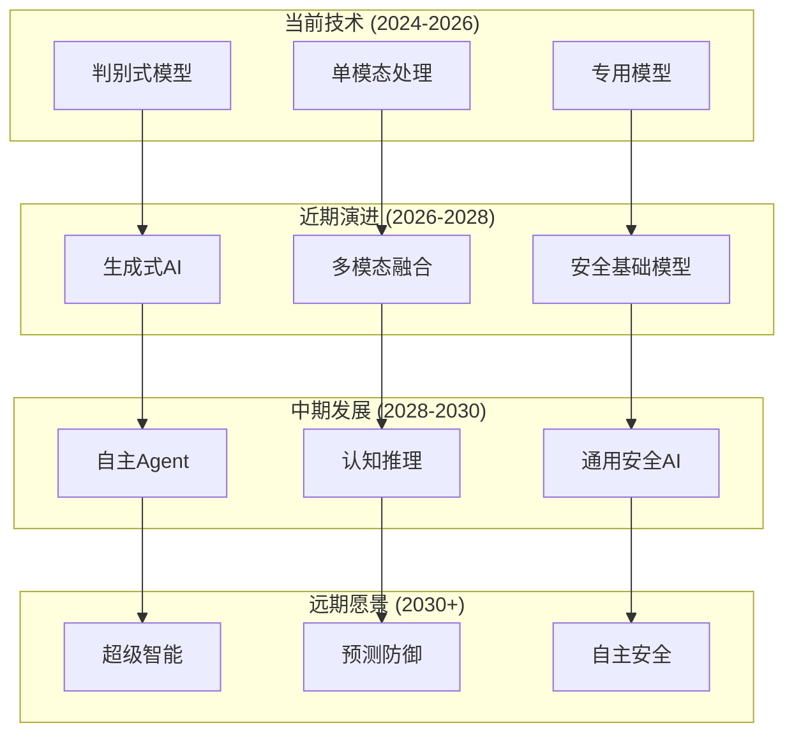
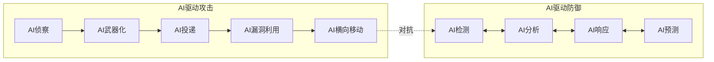
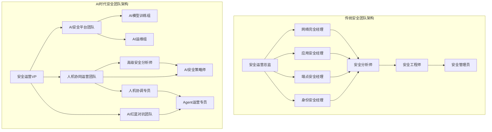
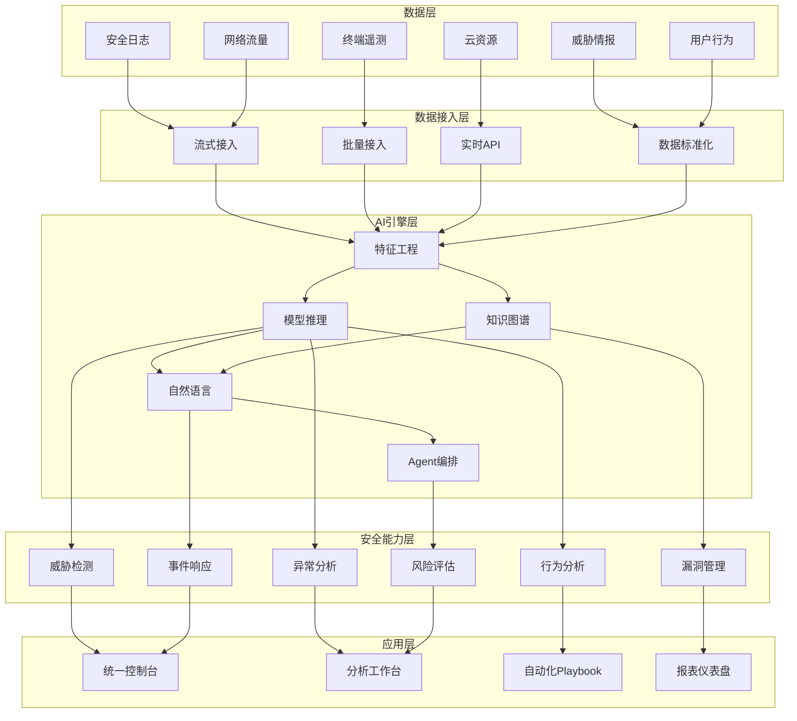
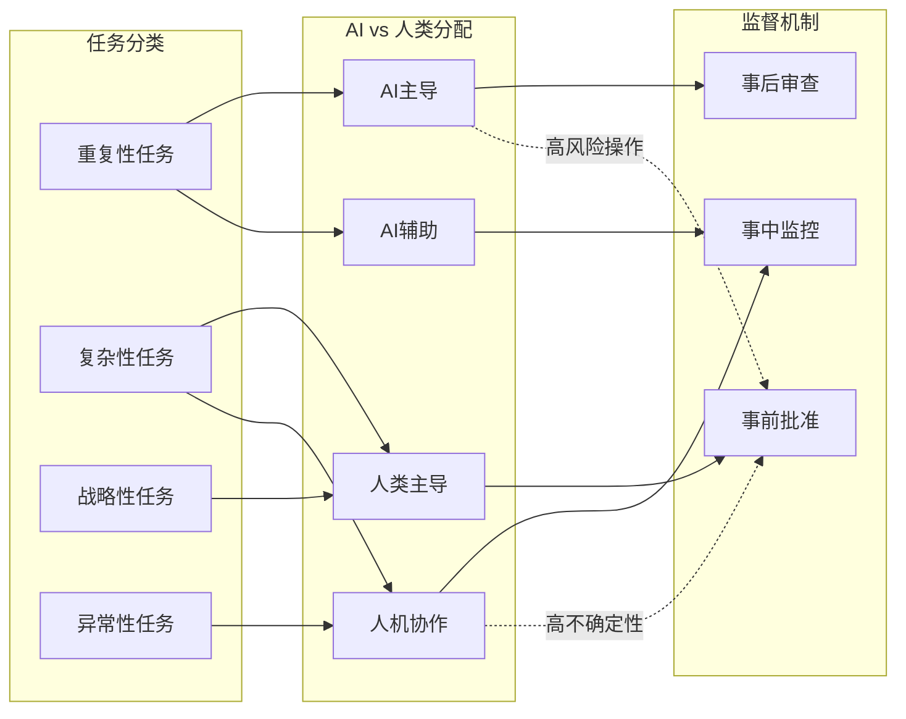

**作者：** HOS(安全风信子)
**日期：** 2026-04-23
**主要来源平台：** RSAC Conference/Gartner/Fortinet
**摘要：** 本文深入探讨AI安全运营的未来发展趋势。从技术演进、攻防对抗、组织变革、生态重构四个维度，全面分析未来5-10年AI安全运营的发展方向。人工智能正在深刻改变网络安全格局，本文为企业制定长期安全战略提供前瞻性指导。

@[TOC](目录)

---

# AI安全运营未来趋势：2026-2035年发展展望

## 1. 引言：站在历史转折点

2026年的网络安全领域正处于一个历史性的转折点。人工智能技术的快速发展正在重塑安全运营的方方面面，从威胁检测到事件响应，从漏洞管理到安全架构，AI的影响无处不在。

回望过去五年，AI在安全运营中的应用经历了从概念验证到规模化部署的转变。根据Gartner 2025年调研，超过60%的企业已经在生产环境中部署了某种形式的AI安全运营能力。这一数字将在未来五年内持续攀升。

然而，当前的AI安全运营仅仅是开始。展望未来，AI与安全运营的融合将带来更为深远的变化。本文将从技术演进、攻防对抗、组织变革、生态重构四个维度，系统性地分析AI安全运营的未来发展趋势。

---

## 2. 技术演进趋势

### 2.1 AI模型能力的质变

当前主流的AI安全模型主要基于监督学习方法，需要大量标注数据进行训练，且泛化能力有限。未来，模型能力将经历质的飞跃。

**从判别式到生成式的演进**：当前AI安全系统主要采用判别式模型，用于分类和检测。未来，生成式AI将深度融入安全运营。安全分析师可以利用自然语言与AI系统对话，快速生成调查脚本、响应策略、甚至完整的Playbook。生成式AI还将用于威胁情报的自动生成和丰富化。

**从单模态到多模态的融合**：当前AI安全分析主要处理结构化日志数据。未来，多模态AI将能够同时处理日志、网络流量、终端文件、代码、文档等多种类型的数据，实现跨模态的关联分析和深度理解。

**从专用模型到基础模型的转变**：当前AI安全系统通常针对特定任务训练专用模型。未来，安全领域的基础模型将成为主流，这些模型在大规模安全数据上预训练后，可以通过微调适应各种下游任务，大幅降低AI应用的开发成本。



### 2.2 自主Agent的崛起

自主Agent是AI技术发展的重要里程碑，也将对安全运营产生深远影响。

**什么是安全Agent**：安全Agent是能够自主感知环境、做出决策、执行动作的AI系统。与传统自动化脚本不同，安全Agent能够理解任务目标，适应环境变化，学习和优化自身行为。

**安全Agent的架构**：典型的安全Agent包括感知模块（感知环境状态）、推理模块（理解任务、制定计划）、执行模块（调用工具、执行动作）、学习模块（从反馈中学习、优化策略）。

**安全Agent的应用场景**：高危文件分析可以由Agent自主完成，从提取、分析到报告生成；威胁狩猎可以由Agent自主执行假设验证；事件响应可以由Agent协调多个子系统协同响应。

```python
class SecurityAgent:
    """
    安全运营Agent基类
    自主感知、决策、执行的安全AI系统
    """
    
    def __init__(self, agent_id, capabilities):
        self.agent_id = agent_id
        self.capabilities = capabilities
        self.state = {}
        self.memory = []
        self.llm = None
    
    def perceive(self, environment_data):
        """
        感知环境
        从环境数据中提取关键信息
        """
        self.state['environment'] = environment_data
        self.state['timestamp'] = datetime.now().isoformat()
        
        # 调用感知模型处理数据
        perception = self._process_perception(environment_data)
        self.state['perception'] = perception
        
        return perception
    
    def think(self, task):
        """
        思考推理
        理解任务、制定计划
        """
        # 构建prompt
        prompt = f"""
        任务：{task}
        当前状态：{self.state}
        可用能力：{self.capabilities}
        历史记忆：{self.memory[-5:]}
        
        请分析当前情况，制定执行计划。
        计划应包括：
        1. 任务理解
        2. 步骤分解
        3. 资源需求
        4. 风险评估
        """
        
        # 调用LLM生成计划
        plan = self.llm.generate(prompt)
        
        # 解析计划
        parsed_plan = self._parse_plan(plan)
        
        return parsed_plan
    
    def act(self, plan):
        """
        执行动作
        按计划执行任务
        """
        results = []
        
        for step in plan['steps']:
            # 执行单个步骤
            result = self._execute_step(step)
            results.append(result)
            
            # 更新状态
            self._update_state(step, result)
            
            # 检查是否需要调整计划
            if self._should_replan(results):
                new_plan = self.think(plan['original_task'])
                plan = new_plan
        
        return results
    
    def learn(self, feedback):
        """
        从反馈中学习
        改进未来表现
        """
        # 记录经验
        self.memory.append({
            'task': feedback.get('task'),
            'actions': feedback.get('actions'),
            'outcome': feedback.get('outcome'),
            'timestamp': datetime.now().isoformat()
        })
        
        # 分析学习
        lessons = self._extract_lessons(feedback)
        
        # 更新策略（如有必要）
        if lessons['should_update']:
            self._update_strategy(lessons)


class ThreatHuntingAgent(SecurityAgent):
    """
    威胁狩猎Agent
    自主执行威胁狩猎任务的专用Agent
    """
    
    def __init__(self, agent_id, config=None):
        super().__init__(agent_id, [
            'log_analysis',
            'pattern_matching',
            'anomaly_detection',
            'ioa_detection',
            'reporting'
        ])
        self.config = config or {}
        self.hypothesis_templates = []
        self.attack_frameworks = ['MITRE ATT&CK', 'Cyber Kill Chain', 'Diamond Model']
    
    def generate_hypothesis(self, threat_intelligence=None):
        """
        生成威胁狩猎假设
        基于威胁情报和历史数据生成假设
        """
        prompt = f"""
        请基于以下信息生成威胁狩猎假设：
        
        威胁情报：{threat_intelligence or '无可用威胁情报'}
        历史事件：{self._get_recent_incidents()}
        ATT&CK框架：{self._get_attack_coverage()}
        
        请生成3-5个可验证的威胁假设，每个假设应包含：
        1. 攻击场景描述
        2. 预期指标（IoA/IoC）
        3. 验证方法
        4. 优先级评估
        """
        
        hypotheses = self.llm.generate(prompt)
        return self._parse_hypotheses(hypotheses)
    
    def hunt(self, hypothesis):
        """
        执行威胁狩猎
        按照假设进行深入调查
        """
        hunt_plan = self.think(f"执行威胁狩猎：{hypothesis['description']}")
        
        # 数据收集
        data_sources = self._collect_data(hypothesis['data_sources'])
        
        # 模式匹配
        patterns = self._search_patterns(hypothesis['patterns'])
        
        # 异常检测
        anomalies = self._detect_anomalies(data_sources, hypothesis['baseline'])
        
        # IoA验证
        ioa_results = self._verify_ioa(anomalies, hypothesis['ioa_indicators'])
        
        # 生成报告
        report = self._generate_hunt_report(hypothesis, ioa_results)
        
        return report


class IncidentResponseAgent(SecurityAgent):
    """
    事件响应Agent
    协调和管理安全事件响应流程
    """
    
    def __init__(self, agent_id, playbooks=None):
        super().__init__(agent_id, [
            'triage',
            'containment',
            'eradication',
            'recovery',
            'lessons_learned'
        ])
        self.playbooks = playbooks or {}
        self.incident_history = []
    
    def triage(self, alert_data):
        """
        事件分诊
        评估事件的严重性和优先级
        """
        assessment_prompt = f"""
        请评估以下安全告警：
        
        告警信息：{alert_data}
        
        评估维度：
        1. 告警可信度（0-100）
        2. 业务影响（低/中/高/严重）
        3. 扩散风险（是否正在蔓延）
        4. 响应紧迫性（立即/4小时/24小时/可延迟）
        
        请给出详细的分诊结论和初步响应建议。
        """
        
        triage_result = self.llm.generate(assessment_prompt)
        parsed_result = self._parse_triage(triage_result)
        
        # 更新状态
        self.state['current_incident'] = {
            'alert_id': alert_data.get('id'),
            'severity': parsed_result['severity'],
            'category': parsed_result['category'],
            'status': 'triaged'
        }
        
        return parsed_result
    
    def execute_playbook(self, incident, playbook_name):
        """
        执行剧本
        按照预定义剧本执行响应动作
        """
        playbook = self.playbooks.get(playbook_name)
        if not playbook:
            raise ValueError(f"未找到剧本：{playbook_name}")
        
        response_log = []
        
        for step in playbook['steps']:
            # 执行单个步骤
            step_result = self._execute_playbook_step(step, incident)
            response_log.append(step_result)
            
            # 决策检查
            if step.get('decision_point'):
                decision = self._evaluate_decision_point(
                    step['decision_point'],
                    step_result,
                    incident
                )
                if decision['action'] == 'abort':
                    response_log.append({
                        'action': 'playbook_aborted',
                        'reason': decision['reason']
                    })
                    break
                elif decision['action'] == 'branch':
                    # 分支到其他剧本
                    branch_result = self.execute_playbook(
                        incident,
                        decision['branch_to']
                    )
                    response_log.extend(branch_result)
        
        return response_log
```

### 2.2.1 安全Agent技术实现详解

安全Agent的实现涉及多项核心技术的深度整合，下面我们将逐项展开技术细节：

**感知模块的技术架构**

感知模块是安全Agent获取环境信息的入口，其核心职责是从海量安全数据中提取关键特征。当前主流的感知技术包括：

```python
class PerceptionModule:
    """
    感知模块核心实现
    负责从多源数据中提取安全相关特征
    """
    
    def __init__(self, config):
        self.config = config
        self.data_processors = self._init_data_processors()
        self.feature_extractors = self._init_feature_extractors()
        self.context_aggregator = ContextAggregator()
    
    def _init_data_processors(self):
        """初始化各类数据处理器"""
        return {
            'log': LogProcessor(),
            'network': NetworkFlowProcessor(),
            'endpoint': EndpointTelemetryProcessor(),
            'threat_intel': ThreatIntelProcessor(),
            'user_behavior': UBAProcessor()
        }
    
    def _init_feature_extractors(self):
        """初始化特征提取器"""
        return {
            'statistical': StatisticalFeatureExtractor(),
            'sequential': SequentialPatternExtractor(),
            'semantic': SemanticFeatureExtractor(),
            'graph': GraphRelationExtractor()
        }
    
    def process(self, raw_data):
        """
        处理原始数据
        返回结构化的感知结果
        """
        processed_data = {}
        
        for data_type, data_content in raw_data.items():
            processor = self.data_processors.get(data_type)
            if processor:
                processed_data[data_type] = processor.process(data_content)
        
        # 特征提取
        features = self._extract_features(processed_data)
        
        # 上下文聚合
        context = self.context_aggregator.aggregate(
            features,
            self.config.get('historical_context', [])
        )
        
        return {
            'raw_features': features,
            'contextualized_features': context,
            'metadata': {
                'processing_time': time.time(),
                'data_sources': list(processed_data.keys()),
                'confidence': self._calculate_confidence(features)
            }
        }
    
    def _extract_features(self, processed_data):
        """从处理后的数据中提取特征"""
        extracted = {}
        
        for feature_type, extractor in self.feature_extractors.items():
            extracted[feature_type] = extractor.extract(processed_data)
        
        return extracted
    
    def _calculate_confidence(self, features):
        """计算感知结果的置信度"""
        # 基于数据完整性和特征质量计算置信度
        completeness = sum(1 for f in features.values() if f is not None) / len(features)
        quality_score = np.mean([f.get('quality', 0) for f in features.values() if isinstance(f, dict)])
        
        return completeness * 0.6 + quality_score * 0.4
```

**推理引擎的技术实现**

推理引擎是安全Agent的"大脑"，负责将感知信息转化为可执行的行动计划。现代推理引擎通常采用混合架构，结合符号推理和神经网络的各自优势：

```python
class ReasoningEngine:
    """
    推理引擎核心实现
    结合LLM和结构化推理能力
    """
    
    def __init__(self, llm, knowledge_base, config=None):
        self.llm = llm
        self.knowledge_base = knowledge_base
        self.config = config or {}
        self.reasoning_templates = self._load_reasoning_templates()
        self.safety_validator = SafetyValidator()
    
    def reason(self, task, context):
        """
        执行推理
        生成行动计划
        """
        # 任务理解
        task_understanding = self._understand_task(task, context)
        
        # 知识检索
        relevant_knowledge = self._retrieve_knowledge(
            task_understanding,
            context
        )
        
        # 方案生成
        candidate_plans = self._generate_plans(
            task_understanding,
            relevant_knowledge
        )
        
        # 方案评估
        evaluated_plans = self._evaluate_plans(candidate_plans, context)
        
        # 安全验证
        safe_plan = self.safety_validator.validate(
            evaluated_plans[0],
            context
        )
        
        return {
            'task_understanding': task_understanding,
            'selected_plan': safe_plan,
            'alternatives': evaluated_plans[1:],
            'reasoning_chain': self._build_reasoning_chain(
                task_understanding,
                relevant_knowledge,
                safe_plan
            )
        }
    
    def _understand_task(self, task, context):
        """理解任务意图"""
        prompt = f"""
        任务：{task}
        上下文：{context}
        
        请详细分析任务意图，包括：
        1. 任务目标（What）：要达成什么结果
        2. 任务约束（Constraints）：有哪些限制条件
        3. 任务优先级（Priority）：时间和质量权衡
        4. 成功标准（Success Criteria）：如何判断任务完成
        """
        
        understanding = self.llm.generate(prompt)
        return self._parse_task_understanding(understanding)
    
    def _retrieve_knowledge(self, task_understanding, context):
        """检索相关知识"""
        query = self._build_knowledge_query(task_understanding)
        
        knowledge = self.knowledge_base.retrieve(
            query,
            top_k=self.config.get('knowledge_retrieval_top_k', 10)
        )
        
        return knowledge
    
    def _generate_plans(self, task_understanding, knowledge):
        """生成候选方案"""
        prompt = f"""
        任务理解：{task_understanding}
        相关知识：{knowledge}
        
        请生成3-5个可行的执行方案，每个方案应包含：
        1. 方案名称和概述
        2. 详细执行步骤
        3. 资源需求
        4. 时间预估
        5. 风险评估
        6. 预期收益
        """
        
        plans_text = self.llm.generate(prompt)
        plans = self._parse_plans(plans_text)
        
        return plans
    
    def _evaluate_plans(self, plans, context):
        """评估和排序方案"""
        evaluations = []
        
        for plan in plans:
            scores = {
                'feasibility': self._evaluate_feasibility(plan, context),
                'efficiency': self._evaluate_efficiency(plan, context),
                'risk': self._evaluate_risk(plan, context),
                'cost': self._evaluate_cost(plan, context)
            }
            
            weighted_score = (
                scores['feasibility'] * 0.3 +
                scores['efficiency'] * 0.25 +
                scores['risk'] * 0.25 +
                scores['cost'] * 0.2
            )
            
            evaluations.append({
                'plan': plan,
                'scores': scores,
                'total_score': weighted_score
            })
        
        # 按分数排序
        evaluations.sort(key=lambda x: x['total_score'], reverse=True)
        
        return [e['plan'] for e in evaluations]
```

**执行模块的架构设计**

执行模块负责将推理得出的计划转化为具体的动作序列。执行模块需要处理多种复杂场景，包括并行执行、条件分支、错误恢复等：

```python
class ExecutionModule:
    """
    执行模块核心实现
    负责安全地执行预定义动作
    """
    
    def __init__(self, tool_registry, executor_config=None):
        self.tool_registry = tool_registry
        self.config = executor_config or {}
        self.execution_history = []
        self.error_handler = ErrorHandler()
        self.rate_limiter = RateLimiter()
    
    def execute_plan(self, plan, context):
        """
        执行计划
        返回执行结果
        """
        execution_result = {
            'plan_id': plan.get('id'),
            'start_time': datetime.now().isoformat(),
            'steps': [],
            'status': 'in_progress'
        }
        
        try:
            for step in plan['steps']:
                # 速率限制检查
                self.rate_limiter.check(step['tool'])
                
                # 执行步骤
                step_result = self._execute_step(step, context)
                execution_result['steps'].append(step_result)
                
                # 状态检查
                if step_result['status'] == 'failed':
                    # 错误恢复
                    recovery_action = self.error_handler.handle(
                        step_result['error'],
                        step,
                        context
                    )
                    
                    if recovery_action['action'] == 'retry':
                        step_result = self._retry_step(step, context)
                    elif recovery_action['action'] == 'skip':
                        continue
                    elif recovery_action['action'] == 'abort':
                        execution_result['status'] = 'aborted'
                        execution_result['abort_reason'] = recovery_action['reason']
                        break
                
                # 条件检查（用于条件分支）
                if step.get('condition'):
                    if not self._evaluate_condition(step['condition'], execution_result):
                        # 跳转到替代分支
                        alternative = self._get_alternative_branch(
                            plan,
                            step['id']
                        )
                        if alternative:
                            alt_result = self.execute_plan(alternative, context)
                            execution_result['steps'].extend(alt_result['steps'])
            
            execution_result['status'] = 'completed'
            execution_result['end_time'] = datetime.now().isoformat()
            
        except Exception as e:
            execution_result['status'] = 'failed'
            execution_result['error'] = str(e)
            execution_result['end_time'] = datetime.now().isoformat()
        
        # 记录执行历史
        self.execution_history.append(execution_result)
        
        return execution_result
    
    def _execute_step(self, step, context):
        """执行单个步骤"""
        tool = self.tool_registry.get_tool(step['tool'])
        
        # 参数准备
        prepared_params = self._prepare_parameters(
            step['parameters'],
            context
        )
        
        # 执行前验证
        pre_validation = self._pre_execution_validation(
            tool,
            prepared_params
        )
        
        if not pre_validation['valid']:
            return {
                'step_id': step['id'],
                'status': 'failed',
                'error': f"Pre-execution validation failed: {pre_validation['reason']}"
            }
        
        # 执行
        start_time = time.time()
        try:
            result = tool.execute(prepared_params)
            execution_time = time.time() - start_time
            
            return {
                'step_id': step['id'],
                'tool': step['tool'],
                'status': 'success',
                'result': result,
                'execution_time': execution_time
            }
        except Exception as e:
            return {
                'step_id': step['id'],
                'tool': step['tool'],
                'status': 'failed',
                'error': str(e),
                'execution_time': time.time() - start_time
            }
    
    def _retry_step(self, step, context, max_retries=3):
        """重试失败的步骤"""
        for attempt in range(max_retries):
            result = self._execute_step(step, context)
            
            if result['status'] == 'success':
                result['retry_attempt'] = attempt + 1
                return result
            
            # 指数退避
            time.sleep(2 ** attempt)
        
        return {
            'step_id': step['id'],
            'status': 'failed',
            'error': f'Failed after {max_retries} retries'
        }
```

### 2.2.2 安全Agent的应用场景深度分析

**高危文件分析场景**

高危文件分析是安全Agent的典型应用场景之一。当安全系统检测到可疑文件时，Agent可以自主完成从样本提取、静态分析、动态分析到报告生成的完整流程：

```python
class MalwareAnalysisAgent(SecurityAgent):
    """
    恶意软件分析Agent
    自主完成恶意软件的全部分析流程
    """
    
    def __init__(self, agent_id):
        super().__init__(agent_id, [
            'file_extraction',
            'static_analysis',
            'dynamic_analysis',
            'sandbox_execution',
            'yara_matching',
            'report_generation'
        ])
        self.sandbox = SandboxingEnvironment()
        self.yara_rules = YaraRuleStore()
        self.ml_models = MLModelRegistry()
    
    def analyze_malware(self, file_path, analysis_config=None):
        """
        执行完整的恶意软件分析
        """
        config = analysis_config or {}
        
        # 阶段1：样本提取和预处理
        sample = self._extract_sample(file_path)
        
        # 阶段2：静态分析
        static_results = self._perform_static_analysis(sample)
        
        # 阶段3：YARA规则匹配
        yara_matches = self._yara_scan(sample)
        
        # 阶段4：ML模型检测
        ml_detection = self._ml_detect(sample)
        
        # 阶段5：动态分析（沙箱执行）
        if config.get('dynamic_analysis', True):
            dynamic_results = self._perform_dynamic_analysis(sample)
        else:
            dynamic_results = None
        
        # 阶段6：关联分析
        correlations = self._correlate_findings(
            static_results,
            yara_matches,
            ml_detection,
            dynamic_results
        )
        
        # 阶段7：家族判定和归因
        family_attribution = self._attribute_family(sample, correlations)
        
        # 阶段8：报告生成
        report = self._generate_analysis_report(
            sample_info=sample.metadata,
            static_analysis=static_results,
            yara_results=yara_matches,
            ml_results=ml_detection,
            dynamic_analysis=dynamic_results,
            correlations=correlations,
            family_attribution=family_attribution
        )
        
        return report
    
    def _perform_static_analysis(self, sample):
        """执行静态分析"""
        results = {
            'file_metadata': self._extract_metadata(sample),
            'file_signatures': self._calculate_signatures(sample),
            'import_analysis': self._analyze_imports(sample),
            'export_analysis': self._analyze_exports(sample),
            'string_extraction': self._extract_strings(sample),
            'packer_detection': self._detect_packers(sample),
            ' PE_analysis': self._pe_analyze(sample) if sample.is_pe() else None
        }
        
        return results
```

**威胁狩猎场景**

威胁狩猎场景中，Agent可以自主执行假设驱动的调查，发现传统检测系统无法识别的威胁：

```python
class ThreatHuntingAgent(SecurityAgent):
    """
    威胁狩猎Agent
    自主执行威胁狩猎任务的专用Agent
    """
    
    def __init__(self, agent_id, config=None):
        super().__init__(agent_id, [
            'log_analysis',
            'pattern_matching',
            'anomaly_detection',
            'ioa_detection',
            'reporting'
        ])
        self.config = config or {}
        self.hypothesis_templates = []
        self.attack_frameworks = ['MITRE ATT&CK', 'Cyber Kill Chain', 'Diamond Model']

### 2.3 可解释性与可审计性

随着AI在安全运营中的深入应用，AI决策的可解释性和可审计性变得越来越重要。

**为什么可解释性重要**：安全决策往往涉及高风险操作，如隔离主机、阻断网络连接等。这些决策需要有清晰的解释，以便人类审核和追溯。此外，监管合规也要求AI系统的决策能够被解释和审计。

**可解释AI技术**：当前的可解释AI技术包括特征重要性分析、决策路径可视化、自然语言解释生成等。未来，更为先进的可解释技术将能够提供深层次的因果推理。

**可审计架构设计**：可审计的AI系统需要从架构层面设计，包括决策日志的完整记录、模型版本的控制、数据血缘的追踪等。

---

## 3. 攻防对抗演进趋势

### 3.1 AI驱动攻击的常态化

AI正在被攻击者广泛利用，AI驱动的攻击正在成为新常态。

**AI生成攻击内容**：攻击者利用AI生成钓鱼邮件、虚假网站、恶意文档等，显著降低攻击成本、提升攻击效率。根据CrowdStrike 2026年调研，AI生成的钓鱼邮件点击率比传统钓鱼邮件高出23%，因为AI能够更好地个性化内容。

**AI驱动的自动化攻击**：AI使攻击链的各个环节实现自动化，从侦察、武器化、投递到漏洞利用和横向移动。攻击者的攻击周期从数周缩短到数小时。

**AI对抗AI**：未来攻防对抗将在AI层面展开。攻击者的AI系统与防御者的AI系统将进行激烈的对抗，类似于棋类对弈中的AI对决。



### 3.2 新型攻击向量的涌现

AI技术将带来一系列新型攻击向量。

**对抗样本攻击**：攻击者通过精心构造的输入，欺骗AI模型的判断。例如，通过在恶意软件中添加特定代码，躲避AI检测。

**数据投毒攻击**：攻击者通过污染训练数据，影响AI模型的学习结果。例如，在威胁情报数据中注入虚假信息，影响AI的判断。

**模型窃取攻击**：攻击者通过API查询等方式，窃取AI模型的能力，用于构建自己的攻击工具。

**深度伪造攻击**：利用深度学习技术生成虚假内容，如伪造的身份、虚假的视频、仿冒的声音等，用于社会工程攻击。

### 3.2.1 对抗样本攻击深度分析

对抗样本攻击是AI安全领域最具挑战性的攻击向量之一。攻击者通过向输入数据中添加精心设计的微小扰动，使AI模型产生错误的判断，同时保持输入数据对人类观察者来说看起来没有变化。

```python
class AdversarialAttackGenerator:
    """
    对抗样本攻击生成器
    演示各类对抗样本攻击技术
    """
    
    def __init__(self, model, attack_config=None):
        self.model = model
        self.config = attack_config or {}
        self.attack_successful = False
    
    def fgsm_attack(self, original_sample, epsilon=0.1):
        """
        FGSM（Fast Gradient Sign Method）攻击
        最基础的对抗样本攻击方法
        """
        # 确保模型处于评估模式
        self.model.eval()
        
        # 将样本转换为张量
        input_tensor = self._prepare_input(original_sample)
        input_tensor.requires_grad = True
        
        # 前向传播
        prediction = self.model(input_tensor)
        
        # 计算损失
        loss = self._calculate_loss(prediction)
        
        # 反向传播
        self.model.zero_grad()
        loss.backward()
        
        # 生成对抗样本
        gradient = input_tensor.grad.data
        adversarial_sample = input_tensor + epsilon * gradient.sign()
        
        return self._denormalize(adversarial_sample)
    
    def pgd_attack(self, original_sample, epsilon=0.1, alpha=0.01, iterations=10):
        """
        PGD（Projected Gradient Descent）攻击
        FGSM的迭代版本，更加强大
        """
        self.model.eval()
        
        input_tensor = self._prepare_input(original_sample)
        original_sample_tensor = input_tensor.clone()
        
        for i in range(iterations):
            input_tensor.requires_grad = True
            
            prediction = self.model(input_tensor)
            loss = self._calculate_loss(prediction)
            
            self.model.zero_grad()
            loss.backward()
            
            # 更新对抗样本
            gradient = input_tensor.grad.data
            input_tensor = input_tensor + alpha * gradient.sign()
            
            # 投影回epsilon球
            input_tensor = self._project_perturbation(
                input_tensor,
                original_sample_tensor,
                epsilon
            )
            
            # 确保在有效范围内
            input_tensor = self._clip_tensor(input_tensor)
        
        return self._denormalize(input_tensor)
    
    def cw_attack(self, original_sample, targeted=True, confidence=0):
        """
        C&W（Carlini & Wagner）攻击
        更加隐蔽和强大的对抗样本攻击
        """
        self.model.eval()
        
        input_tensor = self._prepare_input(original_sample)
        
        # 初始化扰动变量
        perturbation = torch.zeros_like(input_tensor, requires_grad=True)
        
        optimizer = torch.optim.Adam([perturbation], lr=0.01)
        
        for iteration in range(self.config.get('cw_iterations', 100)):
            optimizer.zero_grad()
            
            # 生成对抗样本
            adversarial_sample = input_tensor + perturbation
            
            # 计算 logits
            logits = self.model(adversarial_sample)
            
            # C&W损失函数
            if targeted:
                loss = self._cw_loss_targeted(logits, confidence)
            else:
                loss = self._cw_loss_untargeted(logits, confidence)
            
            # 添加L2正则化
            loss = loss + self.config.get('l2_regularization', 0.01) * torch.norm(perturbation)
            
            loss.backward()
            optimizer.step()
            
            # 投影步骤
            perturbation.data = self._project_perturbation(
                input_tensor + perturbation,
                input_tensor,
                self.config.get('epsilon', 0.1)
            ) - input_tensor
        
        return self._denormalize(input_tensor + perturbation)
    
    defHopSkipJumpAttack(self, original_sample, target_class=None):
        """
        HopSkipJumpAttack - 基于决策边界的对抗攻击
        仅需访问模型预测结果即可发起攻击
        """
        self.model.eval()
        
        input_tensor = self._prepare_input(original_sample)
        
        # 初始化
        perturbed_sample = input_tensor.clone()
        perturbation = torch.zeros_like(input_tensor)
        
        for iteration in range(self.config.get('hsja_iterations', 50)):
            # 估计决策边界方向
            direction = self._estimate_boundary_direction(
                perturbed_sample,
                input_tensor,
                target_class
            )
            
            # 更新扰动
            step_size = self.config.get('step_size', 0.1) / (iteration + 1)
            perturbation = perturbation + step_size * direction
            
            # 投影
            perturbed_sample = self._project_perturbation(
                input_tensor + perturbation,
                input_tensor,
                self.config.get('epsilon', 0.1)
            )
        
        return self._denormalize(perturbed_sample)
```

**对抗样本防御技术**

针对对抗样本攻击，防御技术也在不断演进：

```python
class AdversarialDefense:
    """
    对抗样本防御技术集合
    """
    
    def __init__(self, model, defense_type='all'):
        self.model = model
        self.defense_type = defense_type
    
    def adversarial_training(self, clean_dataset, adversarial_dataset, epochs=10):
        """
        对抗训练
        在训练过程中加入对抗样本
        """
        self.model.train()
        
        optimizer = torch.optim.Adam(self.model.parameters(), lr=0.001)
        
        for epoch in range(epochs):
            for clean_batch, adversarial_batch in zip(clean_dataset, adversarial_dataset):
                # 混合干净样本和对抗样本
                combined_batch = torch.cat([clean_batch, adversarial_batch], dim=0)
                labels = torch.cat([
                    self._get_labels(clean_batch),
                    self._get_labels(adversarial_batch)
                ])
                
                # 标准训练流程
                optimizer.zero_grad()
                predictions = self.model(combined_batch)
                loss = self._calculate_classification_loss(predictions, labels)
                loss.backward()
                optimizer.step()
        
        return self.model
    
    def input_transformation(self, input_sample):
        """
        输入变换防御
        对输入进行随机变换
        """
        # 随机调整大小
        resized = self._random_resize(input_sample)
        
        # 随机填充
        padded = self._random_padding(resized)
        
        # JPEG压缩
        compressed = self._jpeg_compress(padded)
        
        return compressed
    
    def gradient_masking(self):
        """
        梯度掩码
        使梯度信息对攻击者不可用
        """
        # 梯度正则化
        for param in self.model.parameters():
            if param.grad is not None:
                param.grad = torch.clamp(param.grad, -0.1, 0.1)
        
        return self.model
    
    def detection_mechanism(self, input_sample):
        """
        对抗样本检测
        检测输入是否为对抗样本
        """
        # 基于统计特性的检测
        statistical_score = self._statistical_detection(input_sample)
        
        # 基于模型不确定性的检测
        uncertainty_score = self._uncertainty_detection(input_sample)
        
        # 基于输入相似度的检测
        similarity_score = self._similarity_detection(input_sample)
        
        # 综合判断
        is_adversarial = (
            statistical_score > self.config.get('statistical_threshold', 0.5) or
            uncertainty_score > self.config.get('uncertainty_threshold', 0.5) or
            similarity_score < self.config.get('similarity_threshold', 0.3)
        )
        
        return {
            'is_adversarial': is_adversarial,
            'scores': {
                'statistical': statistical_score,
                'uncertainty': uncertainty_score,
                'similarity': similarity_score
            }
        }
```

### 3.2.2 数据投毒攻击与防御

数据投毒攻击通过污染训练数据来影响AI模型的行为。这类攻击特别危险，因为它们可以在模型部署前就造成影响。

```python
class DataPoisoningAttack:
    """
    数据投毒攻击实现
    展示各类数据投毒攻击技术
    """
    
    def __init__(self, attack_target='model_performance'):
        self.attack_target = attack_target
    
    def label_flipping_attack(self, training_data, poison_ratio=0.1):
        """
        标签翻转攻击
        将部分样本的标签替换为错误标签
        """
        poisoned_data = training_data.copy()
        
        num_poison_samples = int(len(training_data) * poison_ratio)
        
        # 选择要毒化的样本
        indices_to_poison = np.random.choice(
            len(training_data),
            num_poison_samples,
            replace=False
        )
        
        for idx in indices_to_poison:
            # 翻转标签
            original_label = training_data[idx]['label']
            poisoned_data[idx]['label'] = self._flip_label(original_label)
            
            # 标记为毒化样本（攻击者视角）
            poisoned_data[idx]['is_poison'] = True
        
        return poisoned_data
    
    def feature_collision_attack(self, training_data, target_samples):
        """
        特征碰撞攻击
        使毒化样本与目标样本在特征空间中接近
        """
        poisoned_data = training_data.copy()
        
        for target in target_samples:
            # 创建与目标特征碰撞的样本
            poison_sample = self._create_collision_sample(
                target,
                training_data
            )
            
            poisoned_data.append(poison_sample)
        
        return poisoned_data
    
    def backdoor_attack(self, training_data, trigger_pattern, target_label):
        """
        后门攻击
        在训练数据中植入后门
        """
        poisoned_data = training_data.copy()
        
        for i, sample in enumerate(training_data):
            if i % 10 == 0:  # 每10个样本注入一个后门
                # 添加触发器模式
                poisoned_sample = self._add_trigger(
                    sample,
                    trigger_pattern
                )
                # 关联目标标签
                poisoned_sample['label'] = target_label
                poisoned_sample['has_trigger'] = True
                
                poisoned_data[i] = poisoned_sample
        
        return poisoned_data
    
    def clean_label_attack(self, training_data, class_to_poison):
        """
        干净标签攻击
        在不改变标签的情况下注入毒化数据
        """
        poisoned_data = training_data.copy()
        
        # 选择目标类别的样本
        target_samples = [
            s for s in training_data
            if s['label'] == class_to_poison
        ]
        
        # 注入看起来正常但实际有问题的样本
        for _ in range(int(len(target_samples) * 0.05)):
            poison_sample = self._generate_subtle_poison_sample(
                target_samples,
                class_to_poison
            )
            poisoned_data.append(poison_sample)
        
        return poisoned_data


class DataPoisoningDefense:
    """
    数据投毒防御技术
    """
    
    def __init__(self):
        self.known_poison_samples = []
    
    def spectral_signature_defense(self, training_data):
        """
        频谱特征防御
        检测并移除异常的 training data points
        """
        # 构建数据矩阵
        data_matrix = self._build_data_matrix(training_data)
        
        # 计算奇异值分解
        U, S, Vt = np.linalg.svd(data_matrix, full_matrices=False)
        
        # 识别异常的样本方向
        anomaly_scores = self._calculate_anomaly_scores(U, training_data)
        
        # 移除异常样本
        clean_data = [
            sample for i, sample in enumerate(training_data)
            if anomaly_scores[i] < self.config.get('anomaly_threshold', 2.0)
        ]
        
        return clean_data, anomaly_scores
    
    def influence_function_defense(self, training_data, val_data):
        """
        影响函数防御
        评估每个训练样本对模型的影响
        """
        influences = []
        
        for i, train_sample in enumerate(training_data):
            # 计算该样本对验证集的影响
            influence = self._compute_influence_function(
                train_sample,
                training_data,
                val_data
            )
            influences.append(influence)
        
        # 移除高影响的样本
        threshold = np.percentile(influences, 95)
        clean_data = [
            sample for i, sample in enumerate(training_data)
            if influences[i] < threshold
        ]
        
        return clean_data, influences
    
    def robust_aggregation(self, gradients_list, client_updates):
        """
        鲁棒聚合
        在联邦学习场景下抵御数据投毒
        """
        # Krum聚合
        selected_updates = self._krum_selection(client_updates)
        
        # Trimmed Mean聚合
        trimmed_mean = self._trimmed_mean(client_updates)
        
        # Median聚合
        median_update = self._median_aggregation(client_updates)
        
        return median_update
```

### 3.2.3 深度伪造攻击与检测技术

深度伪造（Deepfake）技术正在成为社会工程攻击的强大工具。攻击者可以利用深度伪造生成虚假的身份、声音和视频，进行高效的攻击。

```python
class DeepfakeAttackFramework:
    """
    深度伪造攻击框架
    演示各类深度伪造攻击技术
    """
    
    def __init__(self):
        self.face_swap_model = None
        self.voice_clone_model = None
        self.video_generation_model = None
    
    def generate_fake_video(self, source_video, target_face):
        """
        生成换脸视频
        将目标面孔替换到源视频中
        """
        # 提取源视频帧
        source_frames = self._extract_frames(source_video)
        
        # 提取目标面孔
        target_embedding = self._extract_face_embedding(target_face)
        
        # 生成换脸帧
        fake_frames = []
        for frame in source_frames:
            fake_frame = self.face_swap_model.swap(
                frame,
                target_embedding
            )
            fake_frames.append(fake_frame)
        
        # 合成视频
        fake_video = self._frames_to_video(fake_frames)
        
        return fake_video
    
    def clone_voice(self, voice_sample, target_text):
        """
        语音克隆
        使用目标人物的声音样本生成任意文本的语音
        """
        # 提取声音特征
        voice_embedding = self.voice_clone_model.extract_embedding(voice_sample)
        
        # 生成语音
        generated_audio = self.voice_clone_model.generate(
            text=target_text,
            voice_embedding=voice_embedding,
            prosody=self._extract_prosody(voice_sample)
        )
        
        return generated_audio
    
    def create_fake_identity(self, name, photo, voice_sample):
        """
        创建虚假身份
        生成完整的虚假身份用于社会工程
        """
        fake_face = self._enhance_face(photo)
        fake_voice = self.clone_voice(voice_sample, "Hello")
        
        # 创建虚假社交媒体档案
        social_profile = {
            'name': name,
            'photo': fake_face,
            'voice_sample': fake_voice,
            'biography': self._generate_biography(name),
            'connections': self._generate_fake_connections()
        }
        
        return social_profile


class DeepfakeDetectionFramework:
    """
    深度伪造检测框架
    多维度检测深度伪造内容
    """
    
    def __init__(self):
        self.video_detector = VideoDeepfakeDetector()
        self.audio_detector = AudioDeepfakeDetector()
        self.face_detector = FaceManipulationDetector()
    
    def detect_video(self, video_path):
        """
        检测视频是否为深度伪造
        """
        # 帧级检测
        frame_results = []
        frames = self._extract_frames(video_path)
        
        for frame in frames:
            frame_result = self._detect_frame(frame)
            frame_results.append(frame_result)
        
        # 时序分析
        temporal_analysis = self._analyze_temporal_consistency(frames)
        
        # 物理一致性检测
        physics_check = self._check_physics_consistency(frames)
        
        # 音频检测
        audio_result = self.audio_detector.detect(video_path)
        
        # 综合判断
        final_score = self._calculate_composite_score(
            frame_results,
            temporal_analysis,
            physics_check,
            audio_result
        )
        
        return {
            'is_fake': final_score > 0.5,
            'confidence': final_score,
            'details': {
                'frame_analysis': frame_results,
                'temporal_consistency': temporal_analysis,
                'physics_check': physics_check,
                'audio_analysis': audio_result
            }
        }
    
    def detect_audio(self, audio_path):
        """
        检测音频是否为深度伪造
        """
        # 频谱分析
        spectral_features = self._extract_spectral_features(audio_path)
        
        # 声纹分析
        voiceprint_analysis = self._analyze_voiceprint(audio_path)
        
        # 语法分析
        prosody_analysis = self._analyze_prosody(audio_path)
        
        # 注入痕迹检测
        injection_markers = self._detect_injection_markers(audio_path)
        
        return {
            'is_synthetic': self._determine_synthetic(
                spectral_features,
                voiceprint_analysis,
                prosody_analysis,
                injection_markers
            ),
            'confidence': self._calculate_confidence_score(
                spectral_features,
                voiceprint_analysis,
                prosody_analysis,
                injection_markers
            )
        }


def detect_face Manipulation(self, face_image):
    """
    检测面部是否被篡改
    """
    # 频谱不一致性检测
    spectral_inconsistency = self._detect_spectral_artifacts(face_image)
    
    # 噪点模式分析
    noise_analysis = self._analyze_noise_pattern(face_image)
    
    # EXIF元数据分析
    exif_analysis = self._analyze_exif_data(face_image)
    
    # 深度学习检测
    dl_detection = self.face_detector.predict(face_image)
    
    return {
        'is_manipulated': (
            spectral_inconsistency > 0.6 or
            noise_analysis['anomaly_score'] > 0.7 or
            dl_detection['probability'] > 0.5
        ),
        'manipulation_type': self._identify_manipulation_type(
            spectral_inconsistency,
            noise_analysis,
            exif_analysis
        )
    }
```

### 3.2.4 AI驱动攻击案例分析

**案例一：AI生成的精准钓鱼攻击**

2025年，一家大型科技公司遭遇了一次前所未有的钓鱼攻击。攻击者利用AI技术分析了目标员工的所有公开信息，包括社交媒体帖子、工作邮件、公司内部文档等，生成了一封完全个性化的钓鱼邮件。这封邮件不仅在语言风格上与目标员工的习惯高度一致，还准确引用了目标员工近期参与的项目细节。最终，一名员工点击了恶意链接，导致凭证泄露。

```
攻击过程分析：
1. OSINT收集：利用AI自动收集目标的所有公开信息
2. 行为分析：分析目标的语言习惯、沟通风格
3. 内容生成：生成完全个性化的钓鱼内容
4. 时机选择：选择目标最可能放松警惕的时机发送
5. 规避检测：绕过邮件安全网关的检测

防御建议：
- 实施MFA（多因素认证）
- 加强员工安全意识培训
- 部署邮件异常检测系统
- 建立零信任访问机制
```

**案例二：AI辅助的勒索软件攻击**

2025年下半年，一个勒索软件组织开始使用AI技术优化其攻击流程。AI系统自动分析目标公司的网络架构、系统漏洞、安全防护措施等，生成最优的攻击路径。同时，AI还用于自动生成混淆代码、规避安全检测、生成赎金勒索信息等。

```
攻击流程（AI优化后）：
侦察阶段：AI自动扫描公开暴露的系统漏洞
↓
武器化阶段：AI生成定制化的恶意载荷
↓
投递阶段：AI选择最优的投递方式
↓
安装阶段：AI绕过安全防护的检测机制
↓
命令控制：AI自适应C2通信策略
↓
横向移动：AI发现最优的攻击路径
↓
数据窃取：AI识别和窃取高价值数据
↓
勒索执行：AI生成定制化的勒索信息
```

### 3.3 防御范式的根本转变

面对AI驱动的攻击，防御范式需要根本性的转变。

**从被动防御到主动防御**：传统防御是被动的，等待攻击发生后再响应。AI使能的防御将转向主动防御，通过预测性分析提前发现和阻止潜在攻击。

**从规则驱动到智能驱动**：传统防御依赖预定义规则，难以应对未知威胁。AI使能的防御将转向智能驱动，通过学习识别未知攻击模式。

**从边界防御到零信任架构**：随着工作负载分布到云端和边缘，边界防御越来越困难。零信任架构将成为主流，基于AI的持续验证将替代简单的边界防护。

---

## 4. 组织变革趋势

### 4.1 安全团队角色的重构

AI的普及将深刻改变安全团队的组织结构和工作方式。

**传统安全团队结构的变化**：传统安全团队按专业划分，如网络监控、端点安全、应用安全等。AI时代，团队将转向按能力域划分，如AI训练团队、AI运营团队、AI安全团队等。

**新型岗位的出现**：Prompt工程师成为安全团队的新岗位，负责优化AI系统的提示和输出；AI安全分析师利用AI工具进行高级威胁分析；人机协调专员负责协调AI和人类的工作分配。

**人类角色的转型**：人类从日常操作者转变为战略监督者。人类专家的核心价值将转向复杂决策、创意设计、异常处理和持续优化。

### 4.1.1 AI时代安全团队组织架构变革

传统安全团队通常采用金字塔式结构，按专业领域划分。随着AI技术的深入应用，这种组织模式将逐步向网络化、平台化方向演进。



**组织变革的关键驱动力**

| 驱动因素 | 传统模式 | AI时代模式 | 变革程度 |
|:---|:---|:---|:---:|
| 技能需求 | 专业化、工具化 | 复合型、AI素养 | 高 |
| 决策方式 | 人工决策为主 | 人机协同决策 | 中 |
| 工作模式 | 7x24轮班 | 异常驱动+AI自动处理 | 高 |
| 响应速度 | 分钟到小时级 | 秒级（AI自动） | 极高 |
| 团队规模 | 大型团队 | 小型精英团队 | 中 |
| 知识传承 | 经验积累 | AI知识沉淀 | 中 |

### 4.1.2 AI时代新型岗位深度解析

**AI安全策略师（AI Security Strategist）**

AI安全策略师是战略层面的关键角色，负责制定组织整体的AI安全战略和路线图。

```
岗位职责：
├── AI安全战略规划
│   ├── 评估AI安全风险
│   ├── 制定AI安全政策
│   └── 规划AI安全投资
├── AI安全架构设计
│   ├── 设计AI安全架构
│   ├── 评估AI安全产品
│   └── 制定AI安全标准
├── AI安全治理
│   ├── 建立AI安全治理框架
│   ├── 监督AI安全合规
│   └── 管理AI安全事件
└── AI安全创新
    ├── 探索AI安全新技术
    ├── 推动AI安全最佳实践
    └── 引领AI安全行业标准
```

**人机协调专员（Human-Machine Teaming Coordinator）**

人机协调专员负责优化人类和AI Agent之间的协作模式，确保人机协同效率最大化。

```
核心能力要求：
1. 理解AI能力和局限性
2. 设计人机协作流程
3. 监控人机协作效果
4. 优化任务分配策略
5. 处理人机冲突场景

日常工作：
├── 监控AI Agent执行情况
├── 处理AI无法解决的复杂问题
├── 收集人类专家反馈
├── 优化AI系统配置
└── 生成人机协作报告
```

**Agent运营专员（Agent Operations Specialist）**

Agent运营专员负责管理、配置和优化各类安全Agent，确保其高效运行。

```
技能矩阵：
┌─────────────────┬───────────┬───────────┬───────────┐
│ 技能类别        │ 初级      │ 中级      │ 高级      │
├─────────────────┼───────────┼───────────┼───────────┤
│ Agent配置       │ 基础配置  │ 高级配置  │ 架构设计  │
│ 监控告警        │ 基础监控  │ 告警调优  │ 智能告警  │
│ 故障排除        │ 常见问题  │ 复杂故障  │ 根因分析  │
│ 性能优化        │ 参数调优  │ 系统优化  │ 架构优化  │
│ 安全审计        │ 日志审计  │ 合规检查  │ 策略审计  │
└─────────────────┴───────────┴───────────┴───────────┘
```

**Prompt工程师（Security Prompt Engineer）**

Prompt工程师负责设计、测试和优化AI系统的提示词和交互模式，提升AI系统的输出质量和效率。

```python
class SecurityPromptEngineer:
    """
    安全Prompt工程师核心能力模型
    """
    
    def __init__(self):
        self.core_skills = {
            'prompt_design': [
                '任务分解能力',
                '上下文构建能力',
                '约束条件设计',
                '输出格式控制'
            ],
            'security_knowledge': [
                '威胁情报分析',
                '漏洞评估知识',
                '事件响应流程',
                '合规要求理解'
            ],
            'ai_understanding': [
                'LLM工作原理',
                '模型局限性认知',
                '幻觉识别能力',
                '不确定性评估'
            ],
            'evaluation_skills': [
                '效果评估方法',
                '偏见检测能力',
                '安全性评估',
                '性能基准测试'
            ]
        }
    
    def design_threat_analysis_prompt(self, context):
        """
        设计威胁分析场景的Prompt
        """
        prompt_template = """
        # 角色定义
        你是一位资深威胁情报分析师，拥有丰富的APT攻击分析经验。
        
        # 任务背景
        {context['task_background']}
        
        # 可用数据
        - 告警数据：{context['alert_data']}
        - 威胁情报：{context['threat_intel']}
        - 历史事件：{context['historical_events']}
        
        # 分析要求
        1. 识别关键威胁指标（IoC）
        2. 评估威胁严重程度和影响范围
        3. 分析攻击链和攻击者TTP
        4. 提出调查和响应建议
        
        # 输出格式
        请以JSON格式输出，包含：
        - threat_summary: 威胁摘要
        - ioc_list: IoC列表
        - severity_assessment: 严重程度评估
        - recommended_actions: 建议行动
        - confidence_level: 分析置信度
        """
        
        return prompt_template
    
    def evaluate_prompt_effectiveness(self, prompt, test_cases):
        """
        评估Prompt有效性
        """
        results = []
        
        for test_case in test_cases:
            # 执行Prompt
            output = self._execute_prompt(prompt, test_case['input'])
            
            # 评估输出
            evaluation = {
                'test_case': test_case['name'],
                'output': output,
                'accuracy': self._evaluate_accuracy(output, test_case['expected']),
                'relevance': self._evaluate_relevance(output, test_case['input']),
                'safety': self._evaluate_safety(output),
                'overall_score': self._calculate_overall_score(output)
            }
            
            results.append(evaluation)
        
        return self._aggregate_evaluation_results(results)
```

### 4.1.3 安全团队能力模型演变

AI时代对安全团队的能力要求发生了根本性变化。传统的技术能力仍然是基础，但更需要的是综合分析和战略思维能力。

```
能力模型演变对比：

传统安全团队能力模型：
┌─────────────────────────────────────────────────────┐
│                   技术能力 (70%)                     │
├──────────┬──────────┬──────────┬──────────┬─────────┤
│ 网络协议 │ 操作系统  │ 安全工具 │ 编程能力  │ 漏洞分析 │
│ 理解     │ 精通     │ 熟练使用 │ 脚本编写  │ 检测开发 │
├──────────┴──────────┴──────────┴──────────┴─────────┤
│                   软技能 (30%)                       │
├──────────┬──────────┬──────────┬─────────────────────┤
│ 沟通能力 │ 文档编写 │ 团队协作 │ 应急响应            │
└──────────┴──────────┴──────────┴─────────────────────┘

AI时代安全团队能力模型：
┌─────────────────────────────────────────────────────┐
│                   AI素养 (30%)                       │
├──────────┬──────────┬──────────┬─────────────────────┤
│ AI工具   │ Prompt   │ 人机协同 │ AI局限性            │
│ 高效使用 │ 工程能力 │ 工作流   │ 识别与规避          │
├──────────┴──────────┴──────────┴─────────────────────┤
│                   安全专业 (40%)                     │
├──────────┬──────────┬──────────┬──────────┬──────────┤
│ 威胁情报 │ 攻击链   │ 风险评估 │ 合规治理 │ 战略规划  │
│ 分析     │ 分析     │ 方法论   │ 要求     │ 能力     │
├──────────┴──────────┴──────────┴──────────┴──────────┤
│                   战略思维 (30%)                     │
├──────────┬──────────┬──────────┬─────────────────────┤
│ 业务     │ 跨域     │ 创新     │ 持续学习             │
│ 理解力   │ 协调力   │ 思维能力 │ 能力                 │
└──────────┴──────────┴──────────┴─────────────────────┘
```

### 4.2 安全能力的服务化

未来，企业获取安全能力的方式将发生变化。

**安全即服务**：越来越多的企业将采用托管安全服务，获取专业的AI安全运营能力。服务提供商通过规模化运营AI安全平台，为客户提供成本效益更高的安全保护。

**AI模型的民主化**：基础模型和预训练模型将使AI安全能力民主化。企业不需要从零训练AI模型，而是通过微调开源模型快速获得AI安全能力。

**行业协作的深化**：面对高级威胁，企业间的安全协作将加强。威胁情报共享、攻击模式分析、最佳实践交流将成为常态。

### 4.3 安全意识的新内涵

AI时代，安全意识教育需要有新的内涵。

**AI安全意识**：员工需要了解AI驱动攻击的特点，能够识别AI生成的钓鱼邮件、深度伪造内容等新型威胁。

**数据隐私意识**：在AI广泛应用的背景下，数据隐私意识需要提升。员工需要理解AI如何处理数据，哪些数据可以用于AI分析。

**人机协作意识**：员工需要学会与AI系统协作，既不过度依赖AI，也不盲目忽视AI的建议。

---

## 5. 生态重构趋势

### 5.1 安全产品的AI原生化

未来5-10年，安全产品将经历AI原生化的转变。

**从AI增强到AI原生**：当前大多数安全产品是在现有产品上叠加AI功能。未来，AI将成为产品的核心架构，产品从设计之初就围绕AI能力构建。

**API-first架构**：AI时代的安全产品将采用API-first架构，支持灵活的集成和自动化。所有能力都可以通过API调用，便于构建自动化工作流。

**数据为中心的架构**：AI安全产品的效果高度依赖数据。未来的产品架构将以数据为中心，支持多样化的数据接入和丰富的分析能力。

### 5.1.1 AI原生安全产品架构设计

AI原生安全产品的架构设计与传统安全产品有本质区别。传统产品采用模块化架构，将功能划分为独立模块；而AI原生产品采用数据流架构，以AI引擎为核心构建整个产品。



**AI原生产品的核心特征**

| 特征维度 | 传统安全产品 | AI原生安全产品 | 价值提升 |
|:---|:---|:---|:---:|
| 架构理念 | 功能驱动 | 数据驱动 | 数据资产价值最大化 |
| 扩展方式 | 模块叠加 | 能力编排 | 灵活应对新威胁 |
| 用户交互 | 界面操作 | API优先 | 自动化程度提升 |
| 智能水平 | 规则匹配 | 自主学习 | 检测能力持续进化 |
| 响应模式 | 被动响应 | 主动预测 | 安全事件预防 |
| 运维模式 | 人工运维 | 自治运维 | 运维成本降低 |

### 5.1.2 AI安全平台技术架构详解

```python
class AISecurityPlatform:
    """
    AI安全平台核心架构
    展示AI原生安全产品的技术架构
    """
    
    def __init__(self, platform_config):
        self.config = platform_config
        self.data_layer = DataIngestionLayer()
        self.ai_engine = AISecurityEngine()
        self.capability_layer = SecurityCapabilityLayer()
        self.integration_layer = IntegrationLayer()
    
    def initialize(self):
        """
        初始化平台组件
        """
        # 初始化数据层
        self.data_layer.initialize(
            sources=self.config['data_sources'],
            connectors=self.config['connectors']
        )
        
        # 初始化AI引擎
        self.ai_engine.initialize(
            models=self.config['models'],
            knowledge_base=self.config['knowledge_base']
        )
        
        # 初始化能力层
        self.capability_layer.initialize(
            capabilities=self.config['capabilities']
        )
        
        # 初始化集成层
        self.integration_layer.initialize(
            apis=self.config['apis'],
            webhooks=self.config['webhooks']
        )
    
    def process_security_event(self, event_data):
        """
        处理安全事件
        展示端到端的AI处理流程
        """
        # 阶段1：数据采集和标准化
        standardized_event = self.data_layer.ingest(event_data)
        
        # 阶段2：特征提取
        features = self.ai_engine.extract_features(standardized_event)
        
        # 阶段3：AI推理
        ai_analysis = self.ai_engine.analyze(
            features=features,
            context=self._get_global_context()
        )
        
        # 阶段4：能力调度
        response_capabilities = self.capability_layer.select_capabilities(
            analysis_result=ai_analysis
        )
        
        # 阶段5：执行和反馈
        response_results = []
        for capability in response_capabilities:
            result = capability.execute(
                event=standardized_event,
                analysis=ai_analysis
            )
            response_results.append(result)
        
        # 阶段6：学习更新
        self.ai_engine.update(
            event=standardized_event,
            analysis=ai_analysis,
            responses=response_results
        )
        
        return {
            'event_id': standardized_event['id'],
            'analysis': ai_analysis,
            'responses': response_results,
            'status': 'processed'
        }


class DataIngestionLayer:
    """
    数据接入层
    统一处理多源异构安全数据
    """
    
    def __init__(self):
        self.connectors = {}
        self.normalizers = {}
        self.stream_processor = None
        self.batch_processor = None
    
    def register_connector(self, source_type, connector):
        """
        注册数据连接器
        """
        self.connectors[source_type] = connector
    
    def ingest(self, raw_data):
        """
        数据接入
        """
        # 识别数据源类型
        source_type = self._identify_source_type(raw_data)
        
        # 获取对应的连接器
        connector = self.connectors.get(source_type)
        
        # 执行数据接入
        raw_events = connector.extract(raw_data)
        
        # 数据标准化
        normalized_events = []
        for event in raw_events:
            normalizer = self.normalizers.get(event['type'])
            normalized = normalizer.normalize(event)
            normalized_events.append(normalized)
        
        return normalized_events
    
    def _identify_source_type(self, raw_data):
        """识别数据源类型"""
        if 'timestamp' in raw_data and 'src_ip' in raw_data:
            return 'network_flow'
        elif 'process_name' in raw_data or 'file_hash' in raw_data:
            return 'endpoint_telemetry'
        elif 'user_id' in raw_data and 'action' in raw_data:
            return 'audit_log'
        else:
            return 'generic'


class AISecurityEngine:
    """
    AI安全引擎
    核心AI分析能力
    """
    
    def __init__(self):
        self.models = {}
        self.knowledge_graph = None
        self.llm = None
        self.feature_store = None
        self.model_registry = None
    
    def initialize(self, models, knowledge_base):
        """
        初始化AI引擎
        """
        # 加载模型
        for model_config in models:
            model = self._load_model(model_config)
            self.models[model_config['name']] = model
        
        # 初始化知识图谱
        self.knowledge_graph = SecurityKnowledgeGraph(knowledge_base)
        
        # 初始化特征存储
        self.feature_store = FeatureStore()
        
        # 初始化模型注册表
        self.model_registry = ModelRegistry()
    
    def extract_features(self, event):
        """
        特征提取
        """
        # 基础特征
        base_features = self._extract_base_features(event)
        
        # 时序特征
        temporal_features = self._extract_temporal_features(event)
        
        # 图特征
        graph_features = self._extract_graph_features(event)
        
        # 语义特征（使用LLM）
        semantic_features = self._extract_semantic_features(event)
        
        return {
            'base': base_features,
            'temporal': temporal_features,
            'graph': graph_features,
            'semantic': semantic_features,
            'metadata': {
                'event_id': event['id'],
                'extraction_time': datetime.now().isoformat()
            }
        }
    
    def analyze(self, features, context):
        """
        AI分析
        """
        # 多模型集成分析
        model_outputs = {}
        for model_name, model in self.models.items():
            output = model.predict(features)
            model_outputs[model_name] = output
        
        # 知识图谱推理
        kg_inference = self.knowledge_graph.reason(features)
        
        # LLM增强分析
        llm_analysis = self.llm.analyze(
            features=features,
            context=context,
            model_outputs=model_outputs
        )
        
        # 综合判断
        final_decision = self._synthesize_decision(
            model_outputs=model_outputs,
            kg_inference=kg_inference,
            llm_analysis=llm_analysis
        )
        
        return {
            'model_outputs': model_outputs,
            'kg_inference': kg_inference,
            'llm_analysis': llm_analysis,
            'decision': final_decision,
            'confidence': self._calculate_confidence(model_outputs)
        }
```

### 5.2 平台整合趋势

分散的安全工具将进一步整合到统一平台。

**统一安全平台的优势**：统一平台能够打破数据孤岛，实现跨工具的关联分析；统一平台能够提供一致的用户体验，降低学习成本；统一平台能够实现资源的统一调度，提高运营效率。

**平台整合的挑战**：整合过程中面临数据迁移、流程适配、人员培训等挑战。企业需要制定合理的整合策略，避免"大爆炸"式的迁移。

### 5.3 开放生态的构建

领先的安全厂商将构建开放生态，促进行业创新。

**开放API和接口**：厂商开放核心能力API，支持第三方开发者构建增值应用。

**插件和扩展机制**：厂商提供插件机制，支持社区贡献者开发新功能。

**知识共享平台**：厂商建立威胁情报、最佳实践、研究成果的共享平台。

---

## 6. 技术成熟度时间线

### 6.1 关键技术成熟度预测

| 技术方向 | 2026 | 2028 | 2030 | 2032 | 2035 |
|:---|:---:|:---:|:---:|:---:|:---:|
| AI告警分类 | 成熟 | 广泛采用 | 持续优化 | | |
| AI威胁狩猎 | 采用 | 成熟 | 广泛采用 | | |
| 自主Agent响应 | 早期 | 采用 | 成熟 | 广泛采用 | |
| 预测性防御 | | 早期 | 采用 | 成熟 | 广泛采用 |
| 通用安全AI | | | 早期 | 采用 | 成熟 |
| 量子AI安全 | | | | 早期 | 采用 |

### 6.2 攻防技术对抗时间线

| 阶段 | 时间 | 攻击技术 | 防御技术 |
|:---|:---:|:---|:---|
| 当前 | 2024-2026 | AI生成钓鱼邮件、AI辅助攻击 | AI告警降噪、AI辅助分析 |
| 近期 | 2026-2028 | AI驱动自动化攻击、AI对抗样本 | AI威胁狩猎、自主Agent响应 |
| 中期 | 2028-2030 | 多模态AI攻击、深度伪造攻击 | 认知AI防御、预测性防御 |
| 远期 | 2030+ | 量子AI攻击、AI自主攻防 | 超级智能防御 |

---

## 7. 企业战略建议

### 7.1 短期策略（1-2年）

**聚焦AI就绪的基础工作**：完善数据治理、建设基础设施、培养人才队伍，为AI安全运营打好基础。

**选择性采用成熟AI能力**：在告警降噪、辅助分析等成熟领域优先采用AI能力，避免盲目追求前沿。

**建立人机协同模式**：设计合理的人机协同流程，在自动化效率和风险控制之间取得平衡。

### 7.1.1 短期策略详细实施路线图

**第一阶段：AI就绪评估（第1-3个月）**

| 评估维度 | 评估指标 | 目标值 | 当前差距 |
|:---|:---|:---|:---|
| 数据质量 | 日志完整率 | >95% | 待评估 |
| 数据质量 | 数据标准化程度 | 100% | 待评估 |
| 基础设施 | 计算资源储备 | 弹性扩展 | 待评估 |
| 基础设施 | 数据存储能力 | 180天保留 | 待评估 |
| 人才储备 | AI安全技能比例 | >30% | 待评估 |
| 人才储备 | 培训覆盖率 | 100% | 待评估 |

**第二阶段：基础能力建设（第4-9个月）**

```
基础设施升级：
├── 计算资源扩展
│   ├── 现有集群扩容50%
│   └── GPU资源引入
├── 数据平台升级
│   ├── SIEM平台优化
│   ├── 数据湖架构改造
│   └── 实时处理能力建设
└── 安全工具集成
    ├── 统一日志采集
    ├── 威胁情报集成
    └── 自动化编排部署
```

**第三阶段：AI能力试点（第10-18个月）**

```
AI能力试点场景：
┌────────────────┬──────────────┬────────────┬───────────┐
│ 试点场景       │ 预期收益     │ 风险等级   │ 成功指标  │
├────────────────┼──────────────┼────────────┼───────────┤
│ AI告警降噪     │ 降噪率60%+   │ 低         │ MTTD维持  │
│ AI辅助分析     │ 分析效率50%+ │ 中         │ 准确率>85%│
│ AI威胁狩猎     │ 发现隐藏威胁 │ 中         │ 新威胁发现│
│ AI自动化响应   │ 响应时间80%+ │ 高         │ 零误操作  │
└────────────────┴──────────────┴────────────┴───────────┘
```

### 7.1.2 人机协同模式设计指南

人机协同是AI安全运营成功的关键因素。设计合理的人机协同模式需要考虑多个维度：



**任务分配矩阵**

| 任务类型 | AI适合度 | 人类参与度 | 监督模式 | 决策权 |
|:---|:---:|:---:|:---:|:---:|
| 告警分类 | 高 | 低 | 抽检 | AI |
| 误报确认 | 高 | 中 | 重点审查 | AI |
| 事件分诊 | 中 | 高 | 全面审查 | 人类 |
| 威胁狩猎 | 中 | 高 | 协作 | 协作 |
| 事件响应 | 高 | 中 | 实时监控 | AI |
| 策略制定 | 低 | 高 | 审批 | 人类 |
| 复杂调查 | 低 | 高 | 协作 | 人类 |

### 7.2 中期策略（3-5年）

**扩展AI应用范围**：将AI能力扩展到威胁狩猎、漏洞管理、自动化响应等领域。

**建立预测性安全能力**：在条件成熟时，引入预测性分析能力，实现从被动防御到主动防御的转变。

**参与生态协作**：与行业伙伴建立安全协作机制，共享威胁情报和最佳实践。

### 7.2.1 中期AI安全能力扩展路线图

**Year 3: AI能力规模化**

```
规模化部署重点：
AI告警处理
├── 日处理量：10,000+告警/天
├── AI自动化处理率：>80%
└── 准确率目标：>90%

AI威胁狩猎
├── 狩猎场景库：>50个
├── 自动化狩猎覆盖率：>60%
└── 新威胁发现率提升：>40%

AI辅助分析
├── 分析师辅助覆盖率：100%
├── 平均分析时间缩短：>50%
└── 报告生成自动化率：>70%
```

**Year 4: 预测性安全建设**

```
预测性安全能力：
威胁预测
├── 威胁情报自动化分析
├── 攻击趋势预测模型
└── 高危漏洞预警系统

风险预测
├── 资产风险评分
├── 用户行为风险评估
└── 业务风险预测

事件预测
├── 安全事件预测
├── 影响范围评估
└── 资源需求预测
```

**Year 5: 生态系统集成**

```
生态系统集成：
内部集成
├── IAM集成
├── CMDB集成
├── SOC平台集成
└── IT服务管理集成

外部集成
├── 威胁情报共享
├── 行业安全协作
├── 云服务商集成
└── 供应链安全
```

### 7.3 长期策略（5-10年）

**构建AI原生安全架构**：重新设计安全架构，从AI增强过渡到AI原生。

**探索前沿技术**：关注量子计算、脑机接口等前沿技术对安全的影响，提前布局。

**引领行业创新**：在条件成熟时，探索自主创新，引领行业发展。

### 7.3.1 AI原生安全架构转型路径

```
AI原生架构成熟度模型：

Level 1: AI增强
├── 传统安全产品 + AI功能
├── 人类主导决策
└── 被动响应模式

Level 2: AI驱动
├── AI安全平台部署
├── AI处理常规事件
└── 人类处理复杂事件

Level 3: AI原生
├── 安全架构围绕AI设计
├── 自主检测和响应
└── 预测性防御能力

Level 4: 自治安全
├── 自我学习、自我优化
├── 最小化人工干预
└── 主动威胁预防

Level 5: 智能韧性
├── 自愈能力
├── 主动适应
└── 持续进化
```

### 7.3.2 前沿技术安全影响评估框架

| 前沿技术 | 安全机遇 | 安全风险 | 应对策略 |
|:---|:---|:---|:---|
| 量子计算 | 量子加密 | 量子破解 | 后量子密码迁移 |
| 脑机接口 | 行为分析增强 | 神经数据泄露 | 神经安全协议 |
| 边缘AI | 实时响应 | 边缘攻击面扩大 | 边缘安全框架 |
| 数字孪生 | 攻击模拟 | 虚假信息传播 | 真实性验证 |
| 卫星互联网 | 全球威胁情报 | 卫星劫持风险 | 太空安全协议 |

---

## 8. 结论与展望

### 8.1 核心观点总结

AI安全运营的未来发展将经历从辅助工具到核心能力的转变。技术层面，AI模型将从判别式走向生成式，从专用走向通用；攻防层面，AI驱动的攻击将成为常态，防御范式需要根本转变；组织层面，安全团队将经历深刻重构，人类角色转向战略监督者；生态层面，安全产品将走向AI原生化，平台整合和开放生态成为趋势。

### 8.2 未来展望

展望2035年，安全运营的面貌将与今天截然不同。AI将在安全运营中发挥核心作用，人类与AI形成高度协同的伙伴关系。防御者将在AI的赋能下获得前所未有的能力，在与攻击者的对抗中占据主动。

然而，AI也是一把双刃剑。攻击者同样会利用AI提升能力，网络安全的对抗将进入一个更为激烈的时代。企业的安全成功将取决于能否有效利用AI技术，建立适应AI时代的安全能力。

安全运营的AI变革浪潮已经到来。唯有拥抱变化、持续进化的企业，才能在未来的安全格局中立于不败之地。

---

## 附录一：未来关键技术术语表

| 术语 | 定义 | 应用场景 |
|:---|:---|:---|
| 安全Agent | 自主感知、决策、执行的安全AI系统 | 威胁狩猎、事件响应 |
| 基础模型 | 大规模预训练的AI模型，可微调适配 | 多场景安全分析 |
| 预测性防御 | 基于AI预测的主动防御策略 | 威胁预警、风险缓解 |
| 对抗样本 | 专门设计用于欺骗AI模型的输入 | 攻击AI检测系统 |
| 深度伪造 | 利用深度学习生成的虚假内容 | 社会工程攻击 |
| 量子AI安全 | 量子计算与AI结合的安全技术 | 加密破解与防御 |
| 零信任架构 | 永不信任、始终验证的安全架构 | 访问控制 |
| 安全编排 | 自动化的安全事件响应流程 | 自动化响应 |
| MITRE ATT&CK | 攻击者战术和技术知识库 | 威胁分析框架 |
| SIEM | 安全信息和事件管理系统 | 日志管理和分析 |
| SOAR | 安全编排、自动化和响应 | 自动化响应 |
| EDR | 端点检测和响应 | 终端安全 |
| NDR | 网络检测和响应 | 网络安全 |
| XDR | 扩展检测和响应 | 跨平台安全 |
| MTTD | 平均检测时间 | 安全运营指标 |
| MTTR | 平均响应时间 | 安全运营指标 |
| IoA | 攻击指标 | 行为检测 |
| IoC | 妥协指标 | 妥协检测 |
| TI | 威胁情报 | 情报驱动防御 |
| SOC | 安全运营中心 | 安全运营 |

### 附录一.1 AI安全领域专业术语详解

**Agentic AI（代理AI）**

Agentic AI是指具有自主决策和行动能力的AI系统。与传统AI系统需要人类逐步指导不同，Agentic AI可以理解复杂目标、自主规划执行路径、调用外部工具完成复杂任务。在安全运营中，Agentic AI Agent可以自主完成威胁狩猎、事件调查、响应执行等任务。

**RAG（检索增强生成）**

检索增强生成是一种结合知识检索和文本生成的技术。RAG系统首先从知识库中检索与问题相关的文档，然后基于检索结果生成回答。在安全运营中，RAG可以用于构建安全知识问答系统、事件分析助手等。

**MLOps（机器学习运维）**

MLOps是DevOps原则在机器学习领域的延伸，涵盖了机器学习模型的开发、部署、监控和维护的全生命周期。在安全运营中，MLOps实践对于保持AI安全模型的性能和可靠性至关重要。

**Model Registry（模型注册表）**

模型注册表是集中管理机器学习模型的系统，记录模型的版本、参数、性能指标等信息。在AI安全运营中，模型注册表用于追踪不同版本模型的效果，支持模型的回滚和A/B测试。

**Feature Store（特征存储）**

特征存储是管理机器学习特征的系统，提供特征的定义、计算、存储和访问功能。在AI安全运营中，特征存储确保不同模型使用一致的特种定义，提高模型开发和迭代效率。

**Human-in-the-loop（人在回路）**

人在回路是一种人机协作模式，在这种模式中，AI系统处理大部分任务，但在关键时刻需要人类介入决策。在安全运营中，人在回路模式确保高风险操作经过人类审核。

### 附录一.2 行业标准和框架对照表

| 框架名称 | 适用领域 | 最新版本 | 主要用途 |
|:---|:---|:---|:---|
| NIST AI RMF | AI风险管理 | 2023 | AI风险管理框架 |
| MITRE ATT&CK | 威胁分析 | v14 | 攻击技术知识库 |
| NIST CSF | 网络安全 | 2.0 | 网络安全框架 |
| ISO 27001 | 信息安全 | 2022 | 信息安全管理 |
| SOC 2 | 合规审计 | 2017 | 服务组织控制 |
| PCI DSS | 支付安全 | 4.0 | 支付卡数据安全 |
| GDPR | 数据隐私 | 2018 | 欧盟数据保护 |
| ISO 42001 | AI管理 | 2023 | AI管理系统 |

## 附录二：企业AI安全能力成熟度路线图

| 成熟度等级 | 目标时间 | 核心能力 | 关键指标 |
|:---|:---:|:---|:---|
| L1基础级 | 2026 | AI辅助分析 | 告警降噪率50% |
| L2增强级 | 2027-2028 | AI驱动运营 | MTTD降低50% |
| L3智能级 | 2028-2029 | 预测性分析 | 主动防御能力 |
| L4自治级 | 2030+ | 自主Agent | Zero-touch运营 |

### 附录二.1 成熟度等级详细定义

**L1基础级：AI辅助分析**

| 能力维度 | 详细描述 | 成熟度指标 |
|:---|:---|:---|
| 告警降噪 | AI辅助分类告警，减少误报 | 降噪率>50% |
| 辅助分析 | AI提供上下文信息和建议 | 采用率>30% |
| 数据整合 | 统一的数据平台整合 | 覆盖率>80% |
| 基础设施 | AI就绪的基础设施 | GPU资源可用 |

**L2增强级：AI驱动运营**

| 能力维度 | 详细描述 | 成熟度指标 |
|:---|:---|:---|
| 自动分类 | AI自动分类和优先级排序 | 自动处理率>60% |
| 威胁狩猎 | AI辅助威胁狩猎 | 狩猎场景>20个 |
| 响应编排 | AI驱动的自动化响应 | Playbook>10个 |
| 知识管理 | AI驱动的知识积累 | 知识库自动更新 |

**L3智能级：预测性分析**

| 能力维度 | 详细描述 | 成熟度指标 |
|:---|:---|:---|
| 威胁预测 | AI预测潜在威胁 | 预测准确率>70% |
| 风险评估 | AI驱动的持续风险评估 | 实时风险评分 |
| 资源优化 | AI优化的资源分配 | 资源利用率>80% |
| 自适应策略 | AI驱动的策略调整 | 自动策略更新 |

**L4自治级：自主Agent**

| 能力维度 | 详细描述 | 成熟度指标 |
|:---|:---|:---|
| 自主检测 | Agent自主发现威胁 | 人工介入<5% |
| 自主响应 | Agent自主响应事件 | 平均响应时间<1分钟 |
| 自主优化 | Agent持续自我优化 | 模型自动迭代 |
| 自主预防 | Agent主动预防威胁 | 预防率>60% |

### 附录二.2 成熟度评估问卷

| 评估问题 | L1 | L2 | L3 | L4 |
|:---|:---:|:---:|:---:|:---:|
| 您的SIEM/SOC平台是否集成了AI能力？ | 计划中 | 部分集成 | 全面集成 | 深度智能化 |
| AI告警降噪的采用率是多少？ | <30% | 30-60% | 60-80% | >80% |
| 是否有专职的AI安全运营人员？ | 无 | 1-2名 | 3-5名 | 专业化团队 |
| 是否使用AI进行威胁狩猎？ | 不使用 | 试点使用 | 常规使用 | 全面自主 |
| 事件响应中AI的参与度如何？ | 人工主导 | AI辅助 | 人机协作 | AI主导 |
| 是否具备AI模型的管理和监控能力？ | 无 | 基础能力 | 完善能力 | 自动化运维 |

### 附录二.3 行业成熟度基准数据

| 行业 | L1比例 | L2比例 | L3比例 | L4比例 |
|:---|:---:|:---:|:---:|:---:|
| 金融 | 35% | 40% | 20% | 5% |
| 科技 | 30% | 35% | 25% | 10% |
| 医疗 | 50% | 35% | 12% | 3% |
| 制造 | 55% | 30% | 12% | 3% |
| 零售 | 45% | 35% | 15% | 5% |
| 政府 | 60% | 28% | 10% | 2% |

## 附录三：AI安全运营工具和技术栈全景图

### 附录三.1 按功能领域分类的工具生态

```
┌─────────────────────────────────────────────────────────────────┐
│                        AI安全运营工具生态                          │
├─────────────────────────────────────────────────────────────────┤
│                                                                  │
│  ┌─────────────────┐  ┌─────────────────┐  ┌─────────────────┐│
│  │   威胁检测类    │  │   威胁分析类    │  │   响应执行类    ││
│  ├─────────────────┤  ├─────────────────┤  ├─────────────────┤│
│  │ - AI EDR       │  │ - AI SIEM       │  │ - SOAR平台      ││
│  │ - AI NDR       │  │ - TIP平台       │  │ - 自动化响应   ││
│  │ - AI防火墙     │  │ - 威胁狩猎平台  │  │ - 剧本编排     ││
│  │ - 异常检测    │  │ - 沙箱分析     │  │ - Agent执行    ││
│  └─────────────────┘  └─────────────────┘  └─────────────────┘│
│                                                                  │
│  ┌─────────────────┐  ┌─────────────────┐  ┌─────────────────┐│
│  │   身份安全类    │  │   数据安全类    │  │   平台类        ││
│  ├─────────────────┤  ├─────────────────┤  ├─────────────────┤│
│  │ - UEBA         │  │ - 数据分类      │  │ - XDR平台      ││
│  │ - 身份分析     │  │ - 异常检测     │  │ - 安全湖       ││
│  │ - 行为分析     │  │ - 泄露检测     │  │ - AI平台       ││
│  │ - 风险评分     │  │ - 隐私保护     │  │ - 知识图谱     ││
│  └─────────────────┘  └─────────────────┘  └─────────────────┘│
│                                                                  │
└─────────────────────────────────────────────────────────────────┘
```

### 附录三.2 主流AI安全厂商和产品对照表

| 厂商 | 核心产品 | AI能力 | 市场定位 | 差异化优势 |
|:---|:---|:---|:---|:---|
| Microsoft | Sentinel | Copilot for Security | 企业市场 | 深度Azure集成 |
| Google | Chronicle | Sec-PALM | 企业市场 | 海量数据分析 |
| Palo Alto | XSIAM | AI/ML引擎 | 大型企业 | 平台整合能力 |
| CrowdStrike | Falcon | Charlotte AI | 企业市场 | 云原生架构 |
| Splunk | SPL | AI Assistant | 企业市场 | 数据分析能力 |
| IBM | QRadar |watsonx | 企业市场 | 混合云支持 |
| Fortinet | FortiGuard | AI引擎 | 中小企业 | 集成安全架构 |
| Darktrace | Enterprise Immune | Antigena | 企业市场 | 自主响应 |
| SentinelOne | Singularity | Purple AI | 企业市场 | 端点原生 |

### 附录三.3 开源AI安全工具库

| 工具名称 | 编程语言 | 主要功能 | GitHub星标 | 适用场景 |
|:---|:---|:---|:---:|:---|
| MITRE ATT&CK | Python | 威胁分析框架 | - | 威胁分析 |
| Elastic SIEM | Python/Java | 安全分析 | 12k+ | 日志分析 |
| Sigma | Python | 规则转换 | 8k+ | 规则管理 |
| MISP | Python | 威胁情报 | 6k+ | 情报共享 |
| TheHive | Scala | 事件响应 | 5k+ | 事件管理 |
| Cortex | Scala | 分析协同 | 4k+ | 分析编排 |
| YARA | C | 恶意软件分类 | 3k+ | 样本分析 |
| Zeek | C++ | 网络分析 | 2k+ | 网络监控 |

## 附录四：AI安全运营指标体系

### 附录四.1 核心运营指标（KPIs）

| 指标类别 | 指标名称 | 定义 | 目标值 | 测量频率 |
|:---|:---|:---|:---:|:---:|
| 效率指标 | MTTD | 平均威胁检测时间 | <5分钟 | 实时 |
| 效率指标 | MTTR | 平均威胁响应时间 | <15分钟 | 实时 |
| 效率指标 | 告警处理量 | AI日处理告警数 | >10,000 | 每日 |
| 质量指标 | 降噪率 | 误报过滤比例 | >60% | 每周 |
| 质量指标 | 准确率 | AI判断正确率 | >90% | 每周 |
| 质量指标 | 召回率 | 威胁检出率 | >95% | 每周 |
| 成本指标 | 自动化率 | AI自动处理比例 | >80% | 每月 |
| 成本指标 | 人均处理量 | 分析师人均处理 | >500/天 | 每月 |

### 附录四.2 AI模型性能指标

| 指标名称 | 定义 | 计算公式 | 目标值 |
|:---|:---|:---|:---:|
| 精确率 | 预测为正的样本中真正为正的比例 | TP/(TP+FP) | >0.90 |
| 召回率 | 真正为正的样本中被预测为正的比例 | TP/(TP+FN) | >0.95 |
| F1分数 | 精确率和召回率的调和平均 | 2*P*R/(P+R) | >0.92 |
| AUC-ROC | 分类器性能的综合指标 | - | >0.95 |
| 假阳性率 | 正常样本被误判的比例 | FP/(FP+TN) | <0.05 |
| 假阴性率 | 威胁样本被漏检的比例 | FN/(TP+FN) | <0.05 |

### 附录四.3 成熟度评估雷达图指标

```
AI安全运营成熟度雷达图：

              创新领导力
                  ▲
                 /│\
                / │ \
               /  │  \
              /   │   \
             /    │    \
            /     │     \
           ───────┼───────► 技术能力
            \     │     /
             \    │    /
              \   │   /
               \  │  /
                \ │ /
                 \│/
                  ▼
             运营效率
```

| 维度 | 说明 | 权重 |
|:---|:---|:---:|
| 技术能力 | AI模型的检测和分析能力 | 25% |
| 运营效率 | AI对运营效率的提升 | 20% |
| 人员技能 | 团队的AI素养和技能 | 20% |
| 流程成熟度 | AI集成的流程成熟度 | 15% |
| 数据质量 | 数据治理和质量管理 | 10% |
| 创新领导力 | 创新和前瞻性布局 | 10% |

---

**参考链接：**
- 主要来源：[Gartner AI in Security Predictions 2026](https://www.gartner.com/) - Gartner AI安全预测
- 辅助：[RSAC 2026 Future of Security Sessions](https://www.rsaconference.com/) - RSAC未来安全会议
- 辅助：[MITRE AI Security Research](https://www.mitre.org/) - MITRE AI安全研究

**关键词：** AI安全运营，未来趋势，技术演进，攻防对抗，Agentic AI，预测性防御，AI原生架构，安全生态，人机协同
