**作者：** HOS(安全风信子)
**日期：** 2026-04-23
**主要来源平台：** Gartner/CrowdStrike/Palo Alto
**摘要：** 本文深入探讨AI驱动的新一代资产发现体系。资产发现是安全运营的基础，但传统资产发现方法面临覆盖不全、更新滞后、识别不准等挑战。AI技术的引入为资产发现带来了革命性的提升。本文从技术架构、核心能力、实战应用三维度，全面解析AI资产发现体系的设计与实现。

@[TOC](目录)

---

# AI驱动的新一代资产发现体系：从被动扫描到主动感知

## 1. 引言：为什么资产发现需要AI

资产是安全运营的基础。没有准确的资产清单，安全运营如同盲人摸象。然而，传统资产发现方法面临越来越大的挑战。

### 1.1 传统资产发现的困境

在过去的二十年中，企业IT资产发现主要依赖几种传统方法：基于网络的主动扫描、基于代理的资产清点、基于CMDB的手工录入。这些方法在当时的环境下能够满足基本需求，但随着数字化转型的深入，其局限性日益凸显。

**资产边界模糊化**：云计算、容器、边缘计算的发展使资产边界越来越模糊。传统基于网络的资产发现方法难以覆盖分散的工作负载。一个典型的现代化企业可能同时运行着本地数据中心、多个公有云环境、私有云环境以及边缘计算节点，资产总数可能达到数十万台。面对如此大规模且分布广泛的资产，传统扫描方式需要消耗大量网络带宽和计算资源，而且由于网络策略的限制，往往只能覆盖70%左右的资产。

**资产类型多样化**：从物理服务器到虚拟机，从容器到serverless，资产类型日益多样化。传统方法难以统一识别和管理所有类型资产。现代企业的IT环境中，除了传统的x86服务器外，还包括ARM服务器、无服务器函数、容器化应用、微服务架构等新型资产形态。这些资产的标识方式、生命周期管理模式都与传统服务器有显著差异，需要不同的发现策略。

**资产变化频繁化**：现代IT环境中，资产的创建、销毁、迁移非常频繁。传统定期扫描的方式难以保持资产清单的时效性。根据Gartner的统计数据，采用DevOps实践的企业每周可能创建和销毁数千个临时计算资源，传统日级别的扫描频率根本无法跟上这种变化节奏。即使是相对稳定的业务系统，也可能在一天内发生数次配置变更。

**影子IT泛滥化**：部门自行采购的SaaS服务、个人设备等影子IT难以被传统方法发现。影子IT已经成为企业安全的重大隐患，据CrowdStrike的2025年全球威胁报告，超过60%的企业存在未被发现的影子IT设备，这些设备往往成为攻击者的突破口。

### 1.2 数字化转型带来的新挑战

数字化转型为企业带来了前所未有的IT复杂性，这种复杂性对资产发现提出了更高要求。

```mermaid
graph LR
    subgraph 传统IT["传统IT环境"]
        DC["数据中心"]
        SERVER["物理服务器"]
        VPN["VPN接入"]
    end
    
    subgraph 现代IT["现代IT环境"]
        MC["多云环境"]
        K8S["Kubernetes集群"]
        EDGE["边缘节点"]
        SAAS["SaaS应用"]
        IOT["物联网设备"]
        BYOD["个人设备"]
    end
    
    STYLE TraditionalIT fill:#f5f5f5,stroke:#333
    STYLE ModernIT fill:#e3f2fd,stroke:#1976d2
```

**多云架构的复杂性**：根据RightScale的调查，93%的企业采用多云战略，平均使用2.8个公有云和2.1个私有云。每个云平台都有独立的资源管理接口和资产标识方式，如何在这些平台之间建立统一的资产发现机制是一个巨大挑战。

**容器与微服务的普及**：容器技术使应用部署变得前所未有的灵活，但也带来了资产发现的新挑战。一个典型的微服务架构可能包含数百个独立的服务实例，这些实例的IP地址是动态分配的，生命周期可能只有几分钟。传统的基于IP的资产发现方法在这种情况下完全失效。

**物联网设备的爆发**：IoT设备的数量正在以指数级速度增长，预计到2026年全球IoT设备数量将超过300亿。这些设备通常计算能力有限，无法安装传统代理程序，而且网络协议多样化，给资产发现带来了全新的挑战。

**混合工作模式的普及**：后疫情时代，远程办公已成为常态。员工的个人设备、家庭网络环境、VPN连接等都需要纳入资产发现的范围。这不仅增加了资产发现的规模，也带来了隐私和安全之间的平衡问题。

### 1.3 AI技术带来的范式转变

AI技术为资产发现带来了新的解决方案。通过机器学习，AI系统能够从多源数据中自动发现和识别资产，持续学习资产变化规律，智能发现异常资产和影子IT。

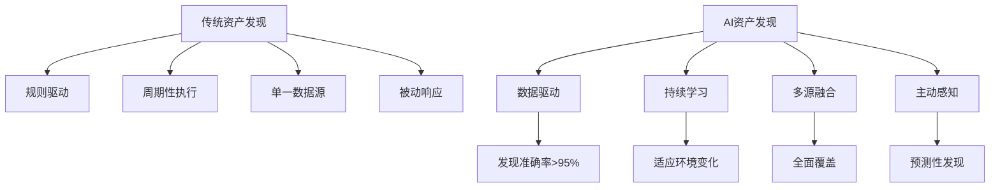

**从规则驱动到数据驱动**：传统资产发现依赖于预定义的规则和特征库，需要安全专家不断更新规则以应对新情况。AI资产发现则通过学习大量数据自动发现模式和规律，能够自动适应新环境、新类型资产。

**从周期性执行到持续感知**：AI系统可以实时监控多个数据源，持续更新资产清单，无需人工干预。这种持续感知能力使得资产发现从静态快照转变为动态画像。

**从单一数据源到多源融合**：AI系统能够整合网络数据、DNS记录、身份认证日志、云平台API等多种数据源，从不同角度观察资产，实现更全面、更准确的发现。

**从被动响应到主动预测**：通过分析历史数据和当前趋势，AI系统能够预测潜在的资产风险，发现尚未显现的影子IT，实现从被动发现到主动感知的转变。

---

## 2. AI资产发现技术架构

### 2.1 多源数据融合架构

AI资产发现采用多源数据融合架构，从多个数据源获取资产信息，实现全面覆盖。

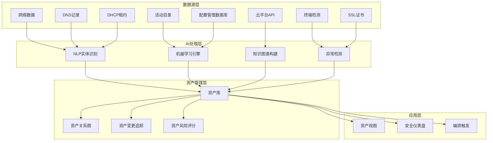

#### 2.1.1 数据源分类与特点

AI资产发现系统需要接入多种数据源，每种数据源都有其独特的价值和特点。

| 数据源类别 | 具体数据 | 更新频率 | 资产覆盖 | 数据质量 | 接入复杂度 |
|:---:|:---|:---:|:---:|:---:|:---:|
| 身份认证源 | Active Directory, LDAP, SSO | 中 | 高 | 高 | 低 |
| 网络基础设施 | NetFlow, DNS, DHCP | 高 | 中 | 中 | 中 |
| 云平台API | AWS, Azure, GCP | 高 | 高 | 高 | 中 |
| 安全工具 | SIEM, EDR, 漏洞扫描器 | 中 | 高 | 高 | 低 |
| 终端管理 | SCCM, Jamf, Intune | 中 | 高 | 高 | 低 |
| 网络扫描 | Nmap, Nessus扫描结果 | 低 | 中 | 中 | 低 |
| 证书数据 | SSL/TLS证书 | 高 | 中 | 中 | 中 |
| 应用日志 | DHCP, HTTP服务器日志 | 高 | 中 | 中 | 高 |

**数据源优先级策略**：在实际部署中，建议采用分层数据接入策略。核心数据源如Active Directory和云平台API应优先接入，确保基础资产覆盖；辅助数据源如网络流量和DNS日志用于补充验证；专项数据源如漏洞扫描结果用于风险评估。

```python
class DataSourceManager:
    """
    数据源管理器
    统一管理多源数据的接入和协调
    """
    
    def __init__(self):
        self.data_sources = {
            'network': NetworkDataSource(),
            'dns': DNSDataSource(),
            'dhcp': DHCPDataSource(),
            'active_directory': ADDataSource(),
            'cmdb': CMDBDataSource(),
            'endpoint': EndpointDataSource(),
            'cloud': CloudPlatformSource(),
            'ssl_certificates': SSLCertSource()
        }
        
        self.priority_config = {
            'P0': ['active_directory', 'cloud'],
            'P1': ['endpoint', 'cmdb'],
            'P2': ['network', 'dns', 'dhcp'],
            'P3': ['ssl_certificates']
        }
        
        self.entity_extractor = EntityExtractor()
        self.ml_engine = MLEngine()
        self.kg_builder = KnowledgeGraphBuilder()
        self.anomaly_detector = AnomalyDetector()
        
        self.asset_registry = AssetRegistry()
    
    def collect_by_priority(self):
        """按优先级收集数据"""
        collected_data = {}
        
        for priority in ['P0', 'P1', 'P2', 'P3']:
            source_names = self.priority_config.get(priority, [])
            
            for source_name in source_names:
                if source_name in self.data_sources:
                    try:
                        data = self.data_sources[source_name].collect()
                        collected_data[source_name] = {
                            'data': data,
                            'priority': priority,
                            'timestamp': datetime.now(),
                            'status': 'success'
                        }
                    except Exception as e:
                        collected_data[source_name] = {
                            'data': None,
                            'priority': priority,
                            'timestamp': datetime.now(),
                            'status': f'error: {str(e)}'
                        }
        
        return collected_data
    
    def validate_data_quality(self, source_name):
        """验证数据源质量"""
        source_data = self.data_sources.get(source_name)
        if not source_data:
            return {'quality': 'unknown', 'issues': ['Source not found']}
        
        validation_result = source_data.validate()
        
        return {
            'quality': validation_result.get('quality', 'unknown'),
            'freshness': validation_result.get('freshness', 'unknown'),
            'completeness': validation_result.get('completeness', 0),
            'issues': validation_result.get('issues', [])
        }
```

#### 2.1.2 数据采集与预处理

数据采集是资产发现的基础，需要确保数据的完整性、及时性和准确性。

```python
class DataCollector:
    """
    数据采集器
    实现高效、可靠的多源数据采集
    """
    
    def __init__(self):
        self.collectors = {}
        self.buffer = DataBuffer(max_size=10000)
        self.quality_checker = DataQualityChecker()
        
    def collect_from_source(self, source_name, config):
        """
        从指定数据源采集数据
        
        参数:
            source_name: 数据源名称
            config: 采集配置，包含采集参数和调度信息
        """
        collector = self._get_or_create_collector(source_name)
        
        collection_start = time.time()
        
        try:
            if config.get('mode') == 'incremental':
                data = collector.collect_incremental(
                    since=config.get('last_collection_time'),
                    filter=config.get('filter')
                )
            else:
                data = collector.collect_full(
                    filter=config.get('filter')
                )
            
            collection_duration = time.time() - collection_start
            
            quality_report = self.quality_checker.check(data)
            
            self.buffer.put(source_name, data)
            
            return {
                'source': source_name,
                'record_count': len(data) if isinstance(data, list) else 1,
                'collection_time': collection_duration,
                'quality': quality_report,
                'status': 'success'
            }
            
        except CollectionException as e:
            return {
                'source': source_name,
                'record_count': 0,
                'collection_time': time.time() - collection_start,
                'error': str(e),
                'status': 'failed'
            }
    
    def _get_or_create_collector(self, source_name):
        """获取或创建采集器实例"""
        if source_name not in self.collectors:
            self.collectors[source_name]] = CollectorFactory.create(source_name)
        return self.collectors[source_name]
```

### 2.2 实体识别与消解

实体识别与消解是AI资产发现的核心能力。不同数据源可能描述同一资产，需要进行实体消解，将多个观测合并为单一资产记录。

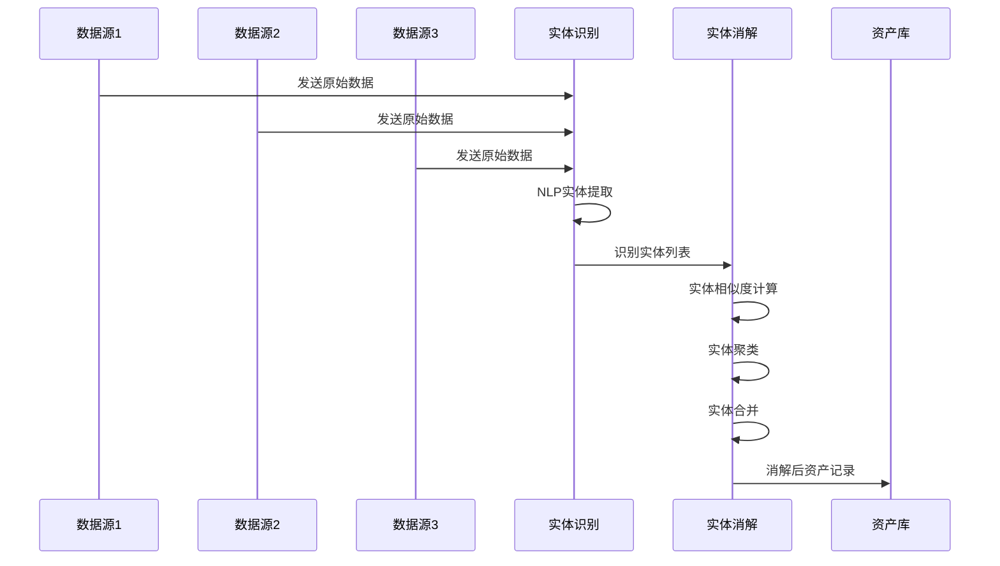

#### 2.2.1 NLP实体识别技术

实体识别是资产发现的第一步，需要从非结构化或半结构化数据中提取资产相关的实体信息。

```python
class EntityExtractor:
    """
    NLP实体识别引擎
    使用自然语言处理技术提取资产实体
    """
    
    def __init__(self):
        self.nlp_models = {
            'hostname': self._load_hostname_model(),
            'ip_address': self._load_ip_model(),
            'service': self._load_service_model(),
            'device_type': self._load_device_type_model()
        }
        
        self.embedding_model = self._load_embedding_model()
        self.entity_validator = EntityValidator()
    
    def extract(self, raw_data):
        """
        从原始数据中提取实体
        
        参数:
            raw_data: 原始数据字典，键为数据源名称
        
        返回:
            list: 提取的实体列表
        """
        all_entities = []
        
        for source_name, source_data in raw_data.items():
            if not source_data:
                continue
            
            entities = self._extract_from_source(source_name, source_data)
            all_entities.extend(entities)
        
        validated_entities = [self.entity_validator.validate(e) for e in all_entities]
        
        return [e for e in validated_entities if e is not None]
    
    def _extract_from_source(self, source_name, source_data):
        """从特定数据源提取实体"""
        entities = []
        
        if source_name == 'dns':
            entities.extend(self._extract_from_dns(source_data))
        elif source_name == 'dhcp':
            entities.extend(self._extract_from_dhcp(source_data))
        elif source_name == 'network_flow':
            entities.extend(self._extract_from_netflow(source_data))
        elif source_name == 'active_directory':
            entities.extend(self._extract_from_ad(source_data))
        
        return entities
    
    def _extract_from_dns(self, dns_data):
        """从DNS数据提取实体"""
        entities = []
        
        for record in dns_data:
            entity = {
                'type': 'asset',
                'subtype': 'dns_record',
                'identifiers': {
                    'hostname': record.get('name'),
                    'ip_address': record.get('ip'),
                    'domain': record.get('domain')
                },
                'attributes': {
                    'record_type': record.get('type'),
                    'ttl': record.get('ttl'),
                    'first_seen': record.get('created_at'),
                    'last_seen': record.get('updated_at')
                },
                'data_sources': ['dns'],
                'evidence_type': 'dns_resolution'
            }
            entities.append(entity)
        
        return entities
```

#### 2.2.2 实体相似度计算

实体消解的核心是如何判断两个实体是否指向同一个真实资产。这需要综合考虑多种相似度因素。

```python
class EntitySimilarityCalculator:
    """
    实体相似度计算器
    多维度计算实体相似度
    """
    
    def __init__(self):
        self.weights = {
            'hostname': 0.30,
            'ip_address': 0.25,
            'mac_address': 0.20,
            'serial_number': 0.15,
            'other_attributes': 0.10
        }
        
        self.jaro_winkler = JaroWinklerSimilarity()
        self.cosine_sim = CosineSimilarity()
    
    def calculate_similarity(self, entity1, entity2):
        """
        计算两个实体的综合相似度
        
        参数:
            entity1: 第一个实体
            entity2: 第二个实体
        
        返回:
            float: 相似度分数 [0, 1]
        """
        similarity_scores = {}
        
        if 'hostname' in entity1.get('identifiers') and 'hostname' in entity2.get('identifiers'):
            hostname_sim = self._calculate_hostname_similarity(
                entity1['identifiers']['hostname'],
                entity2['identifiers']['hostname']
            )
            similarity_scores['hostname'] = hostname_sim
        
        if 'ip_address' in entity1.get('identifiers') and 'ip_address' in entity2.get('identifiers'):
            ip_sim = self._calculate_ip_similarity(
                entity1['identifiers']['ip_address'],
                entity2['identifiers']['ip_address']
            )
            similarity_scores['ip_address'] = ip_sim
        
        if 'mac_address' in entity1.get('identifiers') and 'mac_address' in entity2.get('identifiers'):
            mac_sim = 1.0 if entity1['identifiers']['mac_address'].lower() == entity2['identifiers']['mac_address'].lower() else 0.0
            similarity_scores['mac_address'] = mac_sim
        
        if 'serial_number' in entity1.get('identifiers') and 'serial_number' in entity2.get('identifiers'):
            serial_sim = 1.0 if entity1['identifiers']['serial_number'] == entity2['identifiers']['serial_number'] else 0.0
            similarity_scores['serial_number'] = serial_sim
        
        weighted_score = sum(
            score * self.weights.get(attr, 0.10)
            for attr, score in similarity_scores.items()
        )
        
        return min(weighted_score / sum(self.weights.get(attr, 0.10) for attr in similarity_scores.keys()) * len(similarity_scores), 1.0)
    
    def _calculate_hostname_similarity(self, hostname1, hostname2):
        """计算主机名相似度"""
        h1_normalized = self._normalize_hostname(hostname1)
        h2_normalized = self._normalize_hostname(hostname2)
        
        if h1_normalized == h2_normalized:
            return 1.0
        
        return self.jaro_winkler.similarity(h1_normalized, h2_normalized)
    
    def _calculate_ip_similarity(self, ip1, ip2):
        """计算IP地址相似度"""
        try:
            ip1_parts = list(map(int, ip1.split('.')))
            ip2_parts = list(map(int, ip2.split('.')))
            
            if len(ip1_parts) != 4 or len(ip2_parts) != 4:
                return 0.0
            
            diff = sum(abs(a - b) for a, b in zip(ip1_parts, ip2_parts))
            
            return max(0, 1 - diff / 256)
        except:
            return 0.0
    
    def _normalize_hostname(self, hostname):
        """标准化主机名"""
        return hostname.lower().strip()
```

```python
class EntityResolver:
    """
    实体消解引擎
    将多源观测合并为统一资产记录
    """
    
    def __init__(self):
        self.resolution_rules = {
            'hostname': self._resolve_by_hostname,
            'ip_address': self._resolve_by_ip,
            'mac_address': self._resolve_by_mac,
            'serial_number': self._resolve_by_serial
        }
        
        self.ml_classifier = MLClassifier()
        self.confidence_calculator = ConfidenceCalculator()
        self.similarity_calculator = EntitySimilarityCalculator()
    
    def resolve_entities(self, entities):
        """
        执行实体消解
        
        参数:
            entities: 从各数据源识别的实体列表
        
        返回:
            list: 消解后的资产列表
        """
        grouped = self._group_by_entity_type(entities)
        
        resolved = []
        for entity_group in grouped:
            same_entity = self._identify_same_entities(entity_group)
            merged = self._merge_entity_records(same_entity)
            merged['confidence'] = self.confidence_calculator.calculate(same_entity)
            resolved.append(merged)
        
        return resolved
    
    def _identify_same_entities(self, entity_group):
        """识别属于同一实体的观测"""
        similarity_graph = self._build_similarity_graph(entity_group)
        
        clusters = similarity_graph.find_connected_components(
            threshold=0.7,
            algorithm='leiden'
        )
        
        return clusters
    
    def _build_similarity_graph(self, entities):
        """构建实体相似度图"""
        graph = SimilarityGraph()
        
        for i, entity1 in enumerate(entities):
            for j, entity2 in enumerate(entities):
                if i >= j:
                    continue
                
                similarity = self.similarity_calculator.calculate_similarity(entity1, entity2)
                
                if similarity >= 0.5:
                    graph.add_edge(i, j, similarity)
        
        return graph
    
    def _merge_entity_records(self, entity_cluster):
        """合并实体簇为一个记录"""
        merged = {
            'identifiers': {},
            'attributes': {},
            'first_seen': None,
            'last_seen': None,
            'data_sources': [],
            'evidence': []
        }
        
        for entity in entity_cluster:
            for id_type, id_value in entity.get('identifiers', {}).items():
                if id_type not in merged['identifiers']:
                    merged['identifiers'][id_type] = id_value
            
            for attr_name, attr_value in entity.get('attributes', {}).items():
                merged['attributes'][attr_name] = self._select_best_value(
                    attr_name, attr_value, merged['attributes'].get(attr_name)
                )
            
            if entity.get('first_seen'):
                if not merged['first_seen'] or entity['first_seen'] < merged['first_seen']:
                    merged['first_seen'] = entity['first_seen']
            
            if entity.get('last_seen'):
                if not merged['last_seen'] or entity['last_seen'] > merged['last_seen']:
                    merged['last_seen'] = entity['last_seen']
            
            merged['data_sources'].extend(entity.get('data_sources', []))
            merged['evidence'].append({
                'source': entity.get('source'),
                'evidence_type': entity.get('evidence_type'),
                'timestamp': entity.get('timestamp')
            })
        
        return merged
    
    def _select_best_value(self, attr_name, new_value, existing_value):
        """为属性选择最佳值"""
        if existing_value is None:
            return new_value
        
        confidence_new = self._get_value_confidence(attr_name, new_value)
        confidence_existing = self._get_value_confidence(attr_name, existing_value)
        
        return new_value if confidence_new > confidence_existing else existing_value
    
    def _get_value_confidence(self, attr_name, value):
        """获取属性值的置信度"""
        return 0.8
```

#### 2.2.3 置信度评估机制

实体消解的结果需要伴随置信度评估，以便后续处理时能够合理利用这些信息。

```python
class ConfidenceCalculator:
    """
    置信度计算器
    评估实体消解结果的可靠性
    """
    
    def __init__(self):
        self.confidence_factors = {
            'evidence_count': {'weight': 0.25, 'calculate': self._calc_evidence_confidence},
            'identifier_agreement': {'weight': 0.30, 'calculate': self._calc_identifier_confidence},
            'temporal_consistency': {'weight': 0.20, 'calculate': self._calc_temporal_confidence},
            'source_reliability': {'weight': 0.25, 'calculate': self._calc_source_confidence}
        }
        
        self.source_weights = {
            'active_directory': 0.95,
            'cmdb': 0.90,
            'cloud_provider': 0.95,
            'endpoint_agent': 0.95,
            'network_scan': 0.70,
            'dns': 0.75,
            'dhcp': 0.70,
            'netflow': 0.60
        }
    
    def calculate(self, entity_cluster):
        """
        计算实体簇的置信度
        
        参数:
            entity_cluster: 同一实体的多个观测
        
        返回:
            dict: 包含置信度总分和各项因素详情的字典
        """
        if not entity_cluster:
            return {'overall': 0.0, 'factors': {}}
        
        factor_scores = {}
        for factor_name, factor_config in self.confidence_factors.items():
            score = factor_config['calculate'](entity_cluster)
            factor_scores[factor_name] = score
        
        weighted_score = sum(
            score * factor_config['weight']
            for factor_name, score in factor_scores.items()
            if factor_name in self.confidence_factors
        )
        
        return {
            'overall': round(weighted_score, 3),
            'factors': factor_scores,
            'evidence_count': len(entity_cluster),
            'is_high_confidence': weighted_score >= 0.85,
            'is_low_confidence': weighted_score < 0.60
        }
    
    def _calc_evidence_confidence(self, entity_cluster):
        """基于证据数量的置信度"""
        count = len(entity_cluster)
        if count >= 5:
            return 1.0
        elif count >= 3:
            return 0.85
        elif count >= 2:
            return 0.70
        else:
            return 0.50
    
    def _calc_identifier_confidence(self, entity_cluster):
        """基于标识符一致性的置信度"""
        identifier_sets = [set(e.get('identifiers', {}).keys()) for e in entity_cluster]
        
        common_identifiers = set.intersection(*identifier_sets) if identifier_sets else set()
        
        if not common_identifiers:
            return 0.50
        
        agreement_scores = []
        for id_type in common_identifiers:
            values = [e['identifiers'][id_type] for e in entity_cluster if id_type in e.get('identifiers')]
            unique_values = set(str(v).lower() for v in values)
            
            if len(unique_values) == 1:
                agreement_scores.append(1.0)
            elif len(unique_values) == 2:
                similarity = self._calculate_similarity(list(unique_values)[0], list(unique_values)[1])
                agreement_scores.append(similarity)
            else:
                agreement_scores.append(0.5)
        
        return sum(agreement_scores) / len(agreement_scores) if agreement_scores else 0.50
    
    def _calc_temporal_confidence(self, entity_cluster):
        """基于时间一致性的置信度"""
        first_seens = [e.get('first_seen') for e in entity_cluster if e.get('first_seen')]
        last_seens = [e.get('last_seen') for e in entity_cluster if e.get('last_seen')]
        
        if not first_seens or not last_seens:
            return 0.50
        
        time_span = max(last_seens) - min(first_seens)
        
        if time_span.days <= 1:
            return 1.0
        elif time_span.days <= 7:
            return 0.85
        elif time_span.days <= 30:
            return 0.70
        else:
            return 0.60
    
    def _calc_source_confidence(self, entity_cluster):
        """基于数据源可靠性的置信度"""
        sources = []
        for entity in entity_cluster:
            source = entity.get('source', 'unknown')
            weight = self.source_weights.get(source, 0.50)
            sources.append(weight)
        
        return max(sources) if sources else 0.50
    
    def _calculate_similarity(self, value1, value2):
        """计算两个值的相似度"""
        if str(value1).lower() == str(value2).lower():
            return 1.0
        
        longer = max(len(value1), len(value2))
        if longer == 0:
            return 1.0
        
        return 1 - (abs(len(value1) - len(value2)) / longer)
```

### 2.3 资产关系图谱构建

资产不是孤立的，它们之间存在复杂的关联关系。AI系统通过知识图谱技术构建资产关系网络，支持深度分析和溯源。

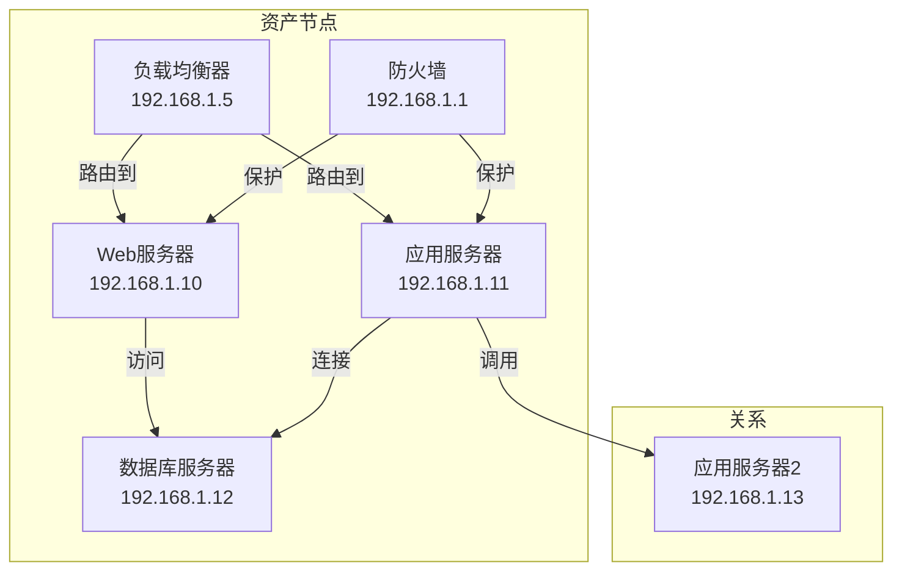

```python
class AssetRelationshipGraph:
    """
    资产关系图谱
    构建和管理资产关联关系
    """
    
    def __init__(self, graph_db):
        self.graph_db = graph_db
        self.relation_types = {
            'network': ['connects_to', 'communicates_with', 'firewalls_between'],
            'logical': ['runs_on', 'hosts', 'depends_on', 'belongs_to'],
            'security': ['same_vlan', 'same_security_zone', 'trusts'],
            'temporal': ['replaced', 'migrated_from', 'migrated_to']
        }
    
    def build_graph(self, assets):
        """构建资产关系图谱"""
        for asset in assets:
            self._create_asset_node(asset)
        
        for relation_type, relations in self.relation_types.items():
            discovered = self._discover_relations(relation_type, assets)
            for relation in discovered:
                self._create_relation(relation)
    
    def _create_asset_node(self, asset):
        """创建资产节点"""
        node_id = self._generate_node_id(asset)
        
        properties = {
            'id': node_id,
            'asset_id': asset.get('asset_id'),
            'name': asset.get('name'),
            'type': asset.get('type'),
            'subtype': asset.get('subtype'),
            'ip_address': asset.get('ip_address'),
            'hostname': asset.get('hostname'),
            'criticality': asset.get('criticality', 'medium'),
            'risk_score': asset.get('risk_score', 0),
            'tags': asset.get('tags', [])
        }
        
        self.graph_db.create_node('Asset', properties)
    
    def _create_relation(self, relation):
        """创建资产关系"""
        source_id = self._generate_node_id(relation['source'])
        target_id = self._generate_node_id(relation['target'])
        
        properties = {
            'type': relation['relation_type'],
            'direction': relation.get('direction', 'bidirectional'),
            'confidence': relation.get('confidence', 1.0),
            'first_observed': relation.get('first_observed'),
            'last_observed': relation.get('last_observed'),
            'evidence': relation.get('evidence', [])
        }
        
        self.graph_db.create_relationship(source_id, target_id, properties)
    
    def _discover_relations(self, relation_type, assets):
        """发现资产关系"""
        if relation_type == 'network':
            return self._discover_network_relations(assets)
        elif relation_type == 'logical':
            return self._discover_logical_relations(assets)
        elif relation_type == 'security':
            return self._discover_security_relations(assets)
        elif relation_type == 'temporal':
            return self._discover_temporal_relations(assets)
        
        return []
    
    def _discover_network_relations(self, assets):
        """发现网络层面的资产关系"""
        relations = []
        
        for i, asset1 in enumerate(assets):
            for asset2 in assets[i+1:]:
                relation = self._analyze_network_relationship(asset1, asset2)
                if relation:
                    relations.append(relation)
        
        return relations
    
    def _analyze_network_relationship(self, asset1, asset2):
        """分析两个资产之间的网络关系"""
        if not self._is_network_adjacent(asset1, asset2):
            return None
        
        network_score = self._calculate_network_similarity(asset1, asset2)
        
        return {
            'source': asset1,
            'target': asset2,
            'relation_type': 'network_proximity',
            'confidence': network_score,
            'evidence': []
        }
    
    def query_attack_path(self, source_asset, target_asset):
        """
        查询攻击路径
        从源资产到目标资产的潜在攻击路径
        """
        query = f"""
        MATCH path = (source:Asset {{id: '{source_asset}'}})
                     -[*1..5]-(target:Asset {{id: '{target_asset}'}})
        RETURN path
        ORDER BY length(path)
        LIMIT 10
        """
        
        paths = self.graph_db.execute(query)
        return [self._format_path(p) for p in paths]
    
    def query_impact_radius(self, compromised_asset):
        """
        查询影响半径
        评估资产被攻陷后的潜在影响范围
        """
        query = f"""
        MATCH (compromised:Asset {{id: '{compromised_asset}'}})
              -[r*1..3]-(affected:Asset)
        RETURN DISTINCT affected
        ORDER BY affected.risk_score DESC
        """
        
        affected = self.graph_db.execute(query)
        return {
            'compromised_asset': compromised_asset,
            'affected_assets': affected,
            'total_count': len(affected)
        }
    
    def query_lateral_movement(self, entry_asset):
        """
        查询横向移动路径
        发现攻击者可能的横向移动路径
        """
        query = f"""
        MATCH path = (entry:Asset {{id: '{entry_asset}'}})
                     -[r:connects_to|communicates_with*1..4]-()
        WHERE ANY(rel IN r WHERE rel.confidence > 0.7)
        RETURN path
        ORDER BY length(path)
        LIMIT 20
        """
        
        return self.graph_db.execute(query)
```

#### 2.3.1 关系发现算法

关系发现是构建资产图谱的关键步骤，需要综合运用多种算法和技术。

```python
class RelationDiscoveryEngine:
    """
    关系发现引擎
    自动发现资产之间的关系
    """
    
    def __init__(self):
        self.network_analyzer = NetworkAnalyzer()
        self.log_analyzer = LogAnalyzer()
        self.config_analyzer = ConfigAnalyzer()
        self.ml_classifier = MLClassifier()
    
    def discover_all_relations(self, assets):
        """发现所有类型的资产关系"""
        relations = {
            'network': [],
            'logical': [],
            'security': [],
            'temporal': []
        }
        
        relations['network'] = self._discover_network_relations(assets)
        relations['logical'] = self._discover_logical_relations(assets)
        relations['security'] = self._discover_security_relations(assets)
        relations['temporal'] = self._discover_temporal_relations(assets)
        
        validated_relations = self._validate_relations(relations)
        
        return validated_relations
    
    def _discover_network_relations(self, assets):
        """发现网络关系"""
        network_flows = self.network_analyzer.get_flow_data()
        
        relations = []
        
        flow_clusters = self._cluster_by_ip_range(network_flows)
        
        for cluster in flow_clusters:
            for i, asset1 in enumerate(cluster):
                for asset2 in cluster[i+1:]:
                    flow_count = self._get_flow_count(asset1, asset2, network_flows)
                    if flow_count > 10:
                        relations.append({
                            'source': asset1,
                            'target': asset2,
                            'relation_type': 'communicates_with',
                            'confidence': min(flow_count / 100, 1.0),
                            'evidence': {'flow_count': flow_count}
                        })
        
        return relations
    
    def _discover_logical_relations(self, assets):
        """发现逻辑关系"""
        relations = []
        
        app_components = self._group_by_application(assets)
        
        for app_name, components in app_components.items():
            for i, component1 in enumerate(components):
                for component2 in components[i+1:]:
                    if self._has_logical_dependency(component1, component2):
                        relations.append({
                            'source': component1,
                            'target': component2,
                            'relation_type': 'depends_on',
                            'confidence': 0.9,
                            'evidence': {'application': app_name}
                        })
        
        return relations
    
    def _discover_security_relations(self, assets):
        """发现安全区域关系"""
        relations = []
        
        vlan_groups = self._group_by_vlan(assets)
        for vlan_id, vlan_assets in vlan_groups.items():
            for i, asset1 in enumerate(vlan_assets):
                for asset2 in vlan_assets[i+1:]:
                    relations.append({
                        'source': asset1,
                        'target': asset2,
                        'relation_type': 'same_vlan',
                        'confidence': 1.0,
                        'evidence': {'vlan_id': vlan_id}
                    })
        
        return relations
    
    def _discover_temporal_relations(self, assets):
        """发现时间序列关系"""
        relations = []
        
        replacements = self._detect_replacement_relations(assets)
        relations.extend(replacements)
        
        migrations = self._detect_migration_relations(assets)
        relations.extend(migrations)
        
        return relations
```

### 2.4 AI处理引擎架构

AI处理引擎是整个系统的核心，负责协调各个AI模块的工作，实现智能化的资产发现。

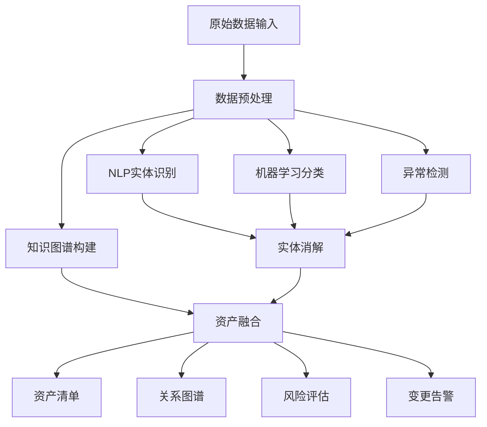

```python
class AIAssetDiscoveryEngine:
    """
    AI资产发现引擎
    多源数据融合的智能资产发现
    """
    
    def __init__(self):
        self.data_sources = {
            'network': NetworkDataSource(),
            'dns': DNSDataSource(),
            'dhcp': DHCPDataSource(),
            'active_directory': ADDataSource(),
            'cmdb': CMDBDataSource(),
            'endpoint': EndpointDataSource(),
            'cloud': CloudPlatformSource(),
            'ssl_certificates': SSLCertSource()
        }
        
        self.entity_extractor = EntityExtractor()
        self.ml_engine = MLEngine()
        self.kg_builder = KnowledgeGraphBuilder()
        self.anomaly_detector = AnomalyDetector()
        
        self.asset_registry = AssetRegistry()
    
    def discover_assets(self):
        """执行全量资产发现"""
        discovered_assets = []
        
        raw_data = self._collect_from_all_sources()
        
        entities = self.entity_extractor.extract(raw_data)
        
        resolved_assets = self._resolve_entities(entities)
        
        enriched_assets = self.ml_engine.enrich(resolved_assets)
        
        graph_assets = self.kg_builder.build(enriched_assets)
        
        assets_with_anomalies = self.anomaly_detector.detect(graph_assets)
        
        self.asset_registry.update(assets_with_anomalies)
        
        return assets_with_anomalies
    
    def incremental_discover(self):
        """增量资产发现"""
        changes = []
        
        for source_name, source in self.data_sources.items():
            incremental = source.get_incremental_data()
            
            if incremental:
                changes.extend(self._process_incremental(source_name, incremental))
        
        self.asset_registry.apply_changes(changes)
        
        return changes
    
    def _collect_from_all_sources(self):
        """从所有数据源收集数据"""
        collected_data = {}
        
        for source_name, source in self.data_sources.items():
            try:
                data = source.collect()
                collected_data[source_name] = data
            except Exception as e:
                print(f"Error collecting from {source_name}: {e}")
                collected_data[source_name] = None
        
        return collected_data
```

---

## 3. AI资产发现核心能力

### 3.1 主动扫描与被动发现融合

传统资产发现依赖主动扫描，但主动扫描存在盲区，且可能影响网络性能。AI资产发现融合主动扫描与被动发现，实现全面覆盖。

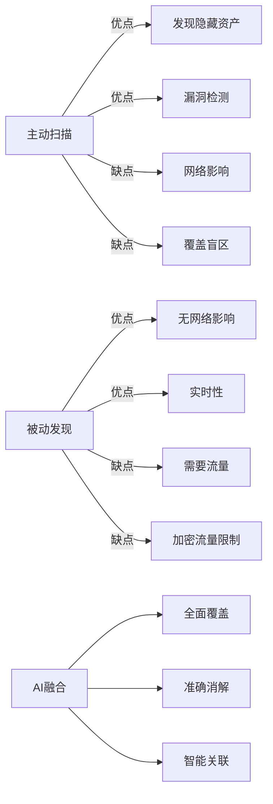

**主动扫描能力**：
- **定时主机探测**：定时执行ICMP ping、ARP扫描等，发现网络中的活跃主机
- **端口扫描**：TCP/UDP端口扫描，识别运行的服务
- **服务识别**：通过Banner抓取、协议特异识别等技术识别服务类型和版本
- **漏洞扫描**：集成漏洞扫描器，发现已知漏洞
- **配置审计**：检查系统配置是否符合安全基线

**被动发现能力**：
- **流量分析**：通过NetFlow、sFlow、IPFIX等协议分析网络流量，发现资产间的通信关系
- **DNS日志分析**：通过DNS查询日志发现资产，特别适合发现动态IP资产
- **DHCP租约分析**：通过DHCP日志发现资产分配情况
- **交换机端口分析**：通过MAC地址表、ARP表等发现直连接入设备
- **证书数据分析**：通过SSL/TLS证书发现暴露的服务

**AI融合分析**：
AI系统综合分析主动和被动数据，自动去重、消歧、更新资产状态。

```python
class HybridDiscoveryCoordinator:
    """
    混合发现协调器
    协调主动扫描和被动发现的融合分析
    """
    
    def __init__(self):
        self.active_scanner = ActiveScanner()
        self.passive_detector = PassiveDetector()
        self.fusion_engine = FusionEngine()
        
        self.scan_schedule = {
            'full_scan': {'interval': 86400, 'last_run': None},
            'targeted_scan': {'interval': 3600, 'last_run': None},
            'continuous_passive': {'interval': 0, 'mode': 'continuous'}
        }
    
    def execute_discovery_cycle(self):
        """执行一个完整的发现周期"""
        results = {
            'active_discoveries': [],
            'passive_discoveries': [],
            'fused_assets': []
        }
        
        passive_data = self.passive_detector.collect_continuous()
        results['passive_discoveries'] = self._process_passive_data(passive_data)
        
        if self._should_run_active_scan():
            active_results = self._execute_active_scan()
            results['active_discoveries'] = active_results
        
        results['fused_assets'] = self.fusion_engine.fuse(
            active_results=results['active_discoveries'],
            passive_results=results['passive_discoveries']
        )
        
        return results
    
    def _process_passive_data(self, passive_data):
        """处理被动发现数据"""
        processed = []
        
        for observation in passive_data:
            asset = self._convert_to_asset_format(observation)
            if asset:
                processed.append(asset)
        
        return processed
```

### 3.2 云原生资产发现

云环境资产具有高度动态性，传统方法难以跟踪。AI系统通过深度集成云平台API，实现云资产的自动发现和跟踪。

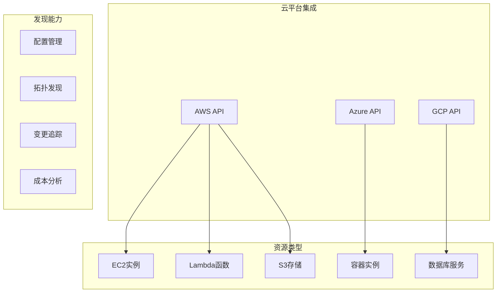

```python
class CloudAssetDiscovery:
    """
    云资产智能发现
    支持多云环境的资产发现
    """
    
    def __init__(self):
        self.cloud_providers = {
            'aws': AWSAssetSource(),
            'azure': AzureAssetSource(),
            'gcp': GCPAssetSource()
        }
        
        self.resource_trackers = {
            'compute': ComputeTracker(),
            'storage': StorageTracker(),
            'network': NetworkTracker(),
            'serverless': ServerlessTracker()
        }
    
    def discover_cloud_assets(self, provider):
        """
        发现云环境资产
        """
        provider_source = self.cloud_providers.get(provider)
        if not provider_source:
            raise ValueError(f"Unsupported cloud provider: {provider}")
        
        assets = []
        
        compute_assets = self.resource_trackers['compute'].discover(provider_source)
        assets.extend(compute_assets)
        
        storage_assets = self.resource_trackers['storage'].discover(provider_source)
        assets.extend(storage_assets)
        
        network_assets = self.resource_trackers['network'].discover(provider_source)
        assets.extend(network_assets)
        
        serverless_assets = self.resource_trackers['serverless'].discover(provider_source)
        assets.extend(serverless_assets)
        
        correlated = self._correlate_cloud_resources(assets)
        
        return correlated
    
    def track_resource_changes(self, provider):
        """
        跟踪云资源变更
        """
        changes = []
        
        for tracker in self.resource_trackers.values():
            resource_changes = tracker.detect_changes(provider)
            changes.extend(resource_changes)
        
        return changes
    
    def _correlate_cloud_resources(self, resources):
        """关联云资源关系"""
        correlated = []
        
        instances = [r for r in resources if r.get('resource_type') == 'compute']
        volumes = [r for r in resources if r.get('resource_type') == 'storage']
        interfaces = [r for r in resources if r.get('resource_type') == 'network']
        
        for instance in instances:
            attached_volumes = self._find_attached_volumes(instance, volumes)
            instance['attached_volumes'] = attached_volumes
            
            network_interfaces = self._find_network_interfaces(instance, interfaces)
            instance['network_interfaces'] = network_interfaces
            
            correlated.append(instance)
        
        return correlated
```

#### 3.2.1 AWS资产发现实现

```python
class AWSAssetSource:
    """
    AWS资产数据源
    集成AWS API获取资源信息
    """
    
    def __init__(self, region='us-east-1'):
        self.region = region
        self.session = boto3.Session(region_name=region)
        self.ec2_client = self.session.client('ec2')
        self.iam_client = self.session.client('iam')
        self.s3_client = self.session.client('s3')
        self.rds_client = self.session.client('rds')
    
    def discover_ec2_instances(self):
        """发现EC2实例"""
        instances = []
        
        paginator = self.ec2_client.get_paginator('describe_instances')
        
        for page in paginator.paginate():
            for reservation in page['Reservations']:
                for instance in reservation['Instances']:
                    asset = self._convert_ec2_to_asset(instance)
                    instances.append(asset)
        
        return instances
    
    def discover_s3_buckets(self):
        """发现S3存储桶"""
        buckets = []
        
        response = self.s3_client.list_buckets()
        
        for bucket in response['Buckets']:
            tags = self._get_bucket_tags(bucket['Name'])
            bucket_asset = {
                'resource_type': 'storage',
                'provider': 'aws',
                'resource_id': bucket['Name'],
                'name': bucket['Name'],
                'arn': f"arn:aws:s3:::{bucket['Name']}",
                'creation_date': bucket['CreationDate'].isoformat(),
                'tags': tags,
                'attributes': {
                    'region': self.region
                }
            }
            buckets.append(bucket_asset)
        
        return buckets
    
    def discover_lambda_functions(self):
        """发现Lambda函数"""
        functions = []
        
        paginator = self.lambda_client.get_paginator('list_functions')
        
        for page in paginator.paginate():
            for function in page['Functions']:
                asset = self._convert_lambda_to_asset(function)
                functions.append(asset)
        
        return functions
    
    def _convert_ec2_to_asset(self, instance):
        """将EC2实例转换为统一资产格式"""
        instance_id = instance['InstanceId']
        tags = {t['Key']: t['Value'] for t in instance.get('Tags', [])}
        
        return {
            'resource_type': 'compute',
            'provider': 'aws',
            'resource_id': instance_id,
            'name': tags.get('Name', instance_id),
            'arn': f"arn:aws:ec2:{self.region}:{instance['OwnerId']}:instance/{instance_id}",
            'ip_address': instance.get('PrivateIpAddress'),
            'public_ip': instance.get('PublicIpAddress'),
            'instance_type': instance['InstanceType'],
            'state': instance['State']['Name'],
            'vpc_id': instance.get('VpcId'),
            'subnet_id': instance.get('SubnetId'),
            'security_groups': [sg['GroupId'] for sg in instance.get('SecurityGroups', [])],
            'tags': tags,
            'creation_date': instance['LaunchTime'].isoformat(),
            'attributes': {
                'architecture': instance.get('Architecture'),
                'platform': instance.get('Platform', 'linux'),
                'hypervisor': instance.get('Hypervisor'),
                'root_device_type': instance.get('RootDeviceType')
            }
        }
```

### 3.3 影子IT智能发现

影子IT是传统资产发现的最大盲区。AI系统通过多维度分析，能够有效识别影子IT。

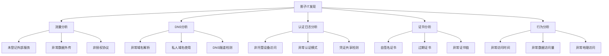

**流量分析识别**：
- 通过分析网络流量，识别未在CMDB中登记的外部服务使用
- 检测内部数据外传等影子IT活动
- 识别非授权协议和端口使用

**DNS分析识别**：
- 通过DNS日志分析，识别员工自行配置的域名解析
- 发现异常的网络活动模式
- 检测潜在的DNS隧道通信

**认证日志分析**：
- 通过分析认证日志，识别非托管设备对企业资源的访问
- 发现BYOD影子IT设备
- 识别异常的认证模式

**AI模式识别**：
- AI系统持续学习正常的影子IT模式
- 能够发现隐蔽的影子IT活动
- 通过多维度关联分析提高发现准确率

```python
class ShadowITDetector:
    """
    影子IT检测器
    智能发现未登记的IT资源
    """
    
    def __init__(self):
        self.traffic_analyzer = TrafficAnalyzer()
        self.dns_analyzer = DNSAnalyzer()
        self.auth_analyzer = AuthLogAnalyzer()
        self.ml_classifier = ShadowITClassifier()
        
        self.known_assets = KnownAssetRegistry()
        self.shadow_it_db = ShadowITDatabase()
    
    def detect_all(self):
        """执行全面的影子IT检测"""
        detections = {
            'traffic_based': self._detect_from_traffic(),
            'dns_based': self._detect_from_dns(),
            'auth_based': self._detect_from_auth(),
            'correlated': []
        }
        
        detections['correlated'] = self._correlate_detections(detections)
        
        return detections
    
    def _detect_from_traffic(self):
        """基于流量分析检测影子IT"""
        traffic_destinations = self.traffic_analyzer.get_destination_ips()
        
        shadow_it_candidates = []
        
        for dest_ip, traffic_info in traffic_destinations.items():
            if not self._is_registered_asset(dest_ip):
                risk_score = self._calculate_shadow_risk(traffic_info)
                
                if risk_score > 0.6:
                    shadow_it_candidates.append({
                        'type': 'unregistered_ip',
                        'identifier': dest_ip,
                        'risk_score': risk_score,
                        'evidence': traffic_info,
                        'confidence': self.ml_classifier.classify(traffic_info)
                    })
        
        return shadow_it_candidates
    
    def _detect_from_dns(self):
        """基于DNS分析检测影子IT"""
        dns_queries = self.dns_analyzer.get_query_history()
        
        shadow_domains = []
        
        for query in dns_queries:
            domain = query['domain']
            
            if not self._is_business_domain(domain):
                if self._is_personal_service(domain):
                    shadow_domains.append({
                        'type': 'personal_service',
                        'domain': domain,
                        'query_source': query['source_ip'],
                        'frequency': query['query_count'],
                        'risk_indicators': self._analyze_domain_risk(domain)
                    })
        
        return shadow_domains
    
    def _is_business_domain(self, domain):
        """判断是否为业务域名"""
        business_suffixes = ['company.com', 'company.org', 'internal']
        return any(suffix in domain.lower() for suffix in business_suffixes)
    
    def _is_personal_service(self, domain):
        """判断是否为个人服务"""
        personal_services = [
            'gmail', 'yahoo', 'hotmail', 'outlook',
            'dropbox', 'box', 'icloud', 'onedrive',
            'personal', 'private', 'mywebsite'
        ]
        return any(service in domain.lower() for service in personal_services)
```

---

## 4. AI资产发现实战应用

### 4.1 资产变更追踪

资产变更是安全事件的重要信号。AI系统能够自动追踪资产变更，识别异常变化。

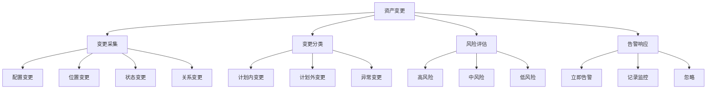

```python
class AssetChangeTracker:
    """
    资产变更追踪器
    智能识别和评估资产变更
    """
    
    def __init__(self):
        self.change_detector = ChangeDetector()
        self.change_classifier = ChangeClassifier()
        self.risk_calculator = RiskCalculator()
        self.alert_generator = AlertGenerator()
    
    def track_changes(self, asset_id):
        """
        追踪资产变更
        """
        history = self._get_asset_history(asset_id)
        
        changes = self.change_detector.detect(history)
        
        if not changes:
            return None
        
        classified_changes = []
        for change in changes:
            classification = self.change_classifier.classify(change)
            change['classification'] = classification
            classified_changes.append(change)
        
        risk_assessment = self.risk_calculator.assess(classified_changes)
        
        if risk_assessment['risk_level'] >= 'high':
            alert = self.alert_generator.generate(asset_id, risk_assessment)
            self._send_alert(alert)
        
        return risk_assessment
    
    def detect_anomalous_changes(self):
        """
        检测异常资产变更
        用于发现潜在的安全威胁
        """
        recent_changes = self._get_recent_changes(hours=24)
        
        clusters = self._cluster_changes(recent_changes)
        
        anomalies = []
        for cluster in clusters:
            if self._is_anomalous_cluster(cluster):
                anomalies.append({
                    'cluster': cluster,
                    'anomaly_type': self._classify_anomaly(cluster),
                    'risk_score': self._calculate_anomaly_risk(cluster)
                })
        
        return anomalies
    
    def _get_asset_history(self, asset_id):
        """获取资产历史记录"""
        return []
    
    def _get_recent_changes(self, hours):
        """获取最近的变更"""
        return []
    
    def _cluster_changes(self, changes):
        """聚类变更"""
        return []
    
    def _is_anomalous_cluster(self, cluster):
        """判断是否为异常聚类"""
        return False
    
    def _classify_anomaly(self, cluster):
        """分类异常类型"""
        return 'unknown'
    
    def _calculate_anomaly_risk(self, cluster):
        """计算异常风险"""
        return 0.0
    
    def _send_alert(self, alert):
        """发送告警"""
        pass
```

#### 4.1.1 变更检测算法

```python
class ChangeDetector:
    """
    变更检测器
    检测资产属性的变更
    """
    
    def __init__(self):
        self.baseline_builder = BaselineBuilder()
        self.change_identifiers = []
    
    def detect(self, history_records):
        """
        检测历史记录中的变更
        
        参数:
            history_records: 资产历史记录列表
        
        返回:
            list: 检测到的变更列表
        """
        changes = []
        
        sorted_records = sorted(history_records, key=lambda x: x.get('timestamp', 0))
        
        for i in range(1, len(sorted_records)):
            prev_record = sorted_records[i-1]
            curr_record = sorted_records[i]
            
            record_changes = self._compare_records(prev_record, curr_record)
            
            for change in record_changes:
                change['timestamp'] = curr_record.get('timestamp')
                change['asset_id'] = curr_record.get('asset_id')
                changes.append(change)
        
        return changes
    
    def _compare_records(self, prev, curr):
        """比较两条记录，识别变更"""
        changes = []
        
        all_keys = set(prev.keys()) | set(curr.keys())
        
        for key in all_keys:
            if key in ['timestamp', 'asset_id']:
                continue
            
            prev_value = prev.get(key)
            curr_value = curr.get(key)
            
            if prev_value != curr_value:
                changes.append({
                    'field': key,
                    'old_value': prev_value,
                    'new_value': curr_value,
                    'change_type': self._classify_field_change(key, prev_value, curr_value)
                })
        
        return changes
    
    def _classify_field_change(self, field, old_value, new_value):
        """分类字段变更类型"""
        critical_fields = ['ip_address', 'mac_address', 'owner', 'security_groups']
        if field in critical_fields:
            return 'critical'
        
        if field in ['status', 'state']:
            return 'state_change'
        
        if field.startswith('config_'):
            return 'configuration'
        
        return 'general'
```

### 4.2 资产风险评分

AI系统综合多维度信息，为每个资产计算风险评分，支持优先级决策。

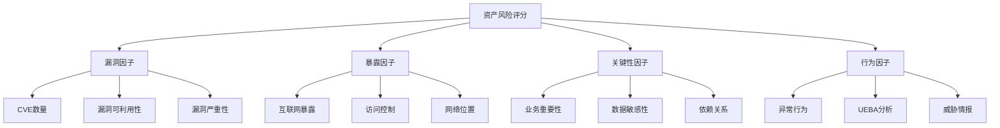

```python
class AssetRiskScorer:
    """
    资产风险评分引擎
    多维度风险评估
    """
    
    def __init__(self):
        self.risk_factors = {
            'vulnerability': {
                'weight': 0.30,
                'sources': ['cve_database', 'scanner', 'threat_intel']
            },
            'exposure': {
                'weight': 0.25,
                'sources': ['network_posture', 'internet_facing', 'access_controls']
            },
            'criticality': {
                'weight': 0.25,
                'sources': ['business_criticality', 'data_sensitivity', 'dependency']
            },
            'behavior': {
                'weight': 0.20,
                'sources': ['ueba', 'anomaly_detection', 'threat_hunting']
            }
        }
    
    def calculate_risk_score(self, asset_id):
        """
        计算资产风险评分
        """
        scores = {}
        
        for factor, config in self.risk_factors.items():
            factor_data = self._collect_factor_data(factor, asset_id)
            
            factor_score = self._calculate_factor_score(factor, factor_data)
            
            weighted_score = factor_score * config['weight']
            scores[factor] = {
                'raw_score': factor_score,
                'weighted_score': weighted_score,
                'sources': config['sources'],
                'details': factor_data
            }
        
        total_score = sum(s['weighted_score'] for s in scores.values())
        
        return {
            'asset_id': asset_id,
            'total_score': round(total_score, 2),
            'risk_level': self._determine_risk_level(total_score),
            'factor_scores': scores,
            'top_risk_factors': self._identify_top_risks(scores),
            'recommended_actions': self._generate_recommendations(scores)
        }
    
    def _determine_risk_level(self, score):
        """确定风险级别"""
        if score >= 80:
            return 'critical'
        elif score >= 60:
            return 'high'
        elif score >= 40:
            return 'medium'
        elif score >= 20:
            return 'low'
        else:
            return 'minimal'
    
    def _identify_top_risks(self, scores):
        """识别主要风险因素"""
        sorted_factors = sorted(
            scores.items(),
            key=lambda x: x[1]['weighted_score'],
            reverse=True
        )
        return [
            {'factor': factor, 'score': data['weighted_score']}
            for factor, data in sorted_factors[:3]
        ]
    
    def _generate_recommendations(self, scores):
        """生成风险缓解建议"""
        recommendations = []
        
        for factor, data in scores.items():
            if data['raw_score'] > 70:
                recommendations.append({
                    'factor': factor,
                    'priority': 'high',
                    'action': self._get_action_for_factor(factor)
                })
        
        return recommendations
    
    def _get_action_for_factor(self, factor):
        """获取针对特定因素的建议"""
        actions = {
            'vulnerability': '立即进行漏洞修复或部署缓解措施',
            'exposure': '审查网络访问控制策略',
            'criticality': '评估业务影响并制定应急计划',
            'behavior': '进行调查以确认是否存在安全事件'
        }
        return actions.get(factor, '进一步分析')
```

#### 4.2.1 漏洞风险计算

```python
class VulnerabilityRiskCalculator:
    """
    漏洞风险计算器
    评估资产漏洞相关的风险
    """
    
    def __init__(self):
        self.cve_db = CVEDatabase()
        self.exploit_predictor = ExploitPredictor()
        self.cvss_weights = {
            'CVSS 2.0': {
                'critical': 10.0,
                'high': 7.0,
                'medium': 4.0,
                'low': 0.0
            },
            'CVSS 3.1': {
                'critical': 9.8,
                'high': 7.0,
                'medium': 4.0,
                'low': 0.1
            }
        }
    
    def calculate_vulnerability_risk(self, asset_id, vulnerabilities):
        """
        计算漏洞风险评分
        
        参数:
            asset_id: 资产标识
            vulnerabilities: 漏洞列表
        
        返回:
            dict: 漏洞风险评分详情
        """
        if not vulnerabilities:
            return {
                'risk_score': 0,
                'vulnerability_count': 0,
                'critical_count': 0,
                'high_count': 0,
                'remediation_priority': []
            }
        
        total_risk = 0
        critical_count = 0
        high_count = 0
        remediation_list = []
        
        for vuln in vulnerabilities:
            vuln_risk = self._calculate_single_vulnerability_risk(vuln)
            total_risk += vuln_risk['weighted_score']
            
            if vuln_risk['severity'] == 'critical':
                critical_count += 1
            elif vuln_risk['severity'] == 'high':
                high_count += 1
            
            remediation_list.append({
                'cve_id': vuln.get('cve_id'),
                'risk_score': vuln_risk['weighted_score'],
                'remediation_effort': self._estimate_remediation_effort(vuln),
                'priority': self._determine_remediation_priority(vuln_risk)
            })
        
        sorted_remediation = sorted(
            remediation_list,
            key=lambda x: (x['priority'], x['risk_score']),
            reverse=True
        )
        
        return {
            'risk_score': min(total_risk, 100),
            'vulnerability_count': len(vulnerabilities),
            'critical_count': critical_count,
            'high_count': high_count,
            'remediation_priority': sorted_remediation
        }
    
    def _calculate_single_vulnerability_risk(self, vuln):
        """计算单个漏洞的风险"""
        cvss_score = vuln.get('cvss_score', 0)
        cvss_version = vuln.get('cvss_version', '3.1')
        
        severity = self._determine_severity(cvss_score)
        
        exploit_likelihood = self.exploit_predictor.predict_exploit_likelihood(vuln)
        
        asset_exposure = vuln.get('asset_exposure', 0.5)
        
        weights = self.cvss_weights.get(f'CVSS {cvss_version}', self.cvss_weights['CVSS 3.1'])
        
        base_risk = weights.get(severity.lower(), cvss_score)
        
        weighted_risk = base_risk * (0.5 + exploit_likelihood * 0.3 + asset_exposure * 0.2)
        
        return {
            'severity': severity,
            'cvss_score': cvss_score,
            'exploit_likelihood': exploit_likelihood,
            'weighted_score': min(weighted_risk, 10)
        }
```

### 4.3 资产分类与标签体系

AI系统通过自动化的资产分类和标签体系，实现精细化的资产管理。

```python
class AssetClassifier:
    """
    资产分类器
    自动识别资产类型和属性
    """
    
    def __init__(self):
        self.classification_model = self._load_classification_model()
        self.tag_extractor = TagExtractor()
        
        self.asset_types = {
            'server': ['web_server', 'app_server', 'db_server', 'file_server', 'mail_server'],
            'network': ['router', 'switch', 'firewall', 'load_balancer', 'vpn_gateway'],
            'endpoint': ['desktop', 'laptop', 'mobile', 'tablet', 'workstation'],
            'cloud': ['iaas', 'paas', 'saas', 'container', 'serverless'],
            'iot': ['camera', 'sensor', 'printer', 'smart_device', 'industrial_controller']
        }
    
    def classify_asset(self, asset_data):
        """
        对资产进行分类
        
        参数:
            asset_data: 资产数据字典
        
        返回:
            dict: 包含分类结果和标签的字典
        """
        classification = self._predict_asset_type(asset_data)
        
        attributes = self._extract_asset_attributes(asset_data)
        
        tags = self.tag_extractor.extract(asset_data)
        
        business_context = self._infer_business_context(asset_data)
        
        return {
            'asset_id': asset_data.get('asset_id'),
            'primary_type': classification['primary_type'],
            'sub_types': classification['sub_types'],
            'confidence': classification['confidence'],
            'attributes': attributes,
            'tags': tags,
            'business_context': business_context,
            'classification_evidence': classification['evidence']
        }
    
    def _predict_asset_type(self, asset_data):
        """预测资产类型"""
        features = self._extract_classification_features(asset_data)
        
        prediction = self.classification_model.predict(features)
        probabilities = self.classification_model.predict_proba(features)
        
        return {
            'primary_type': prediction,
            'sub_types': self._infer_subtypes(asset_data),
            'confidence': max(probabilities),
            'evidence': self._generate_evidence(features)
        }
```

### 4.4 资产发现与安全运营集成

资产发现需要与整体安全运营体系深度集成，才能发挥最大价值。

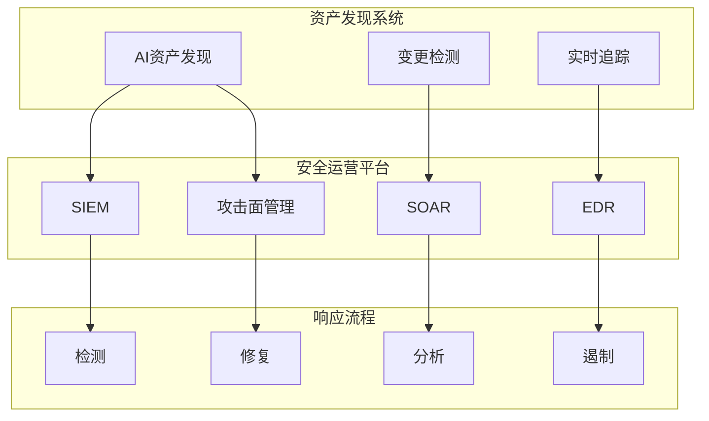

```python
class AssetDiscoveryIntegrator:
    """
    资产发现集成器
    将资产发现与安全运营平台集成
    """
    
    def __init__(self):
        self.siem_connector = SIEMConnector()
        self.soar_connector = SOARConnector()
        self.edr_connector = EDRConnector()
        self.asm_connector = ASMConnector()
    
    def integrate_with_siem(self, asset_data):
        """
        与SIEM系统集成
        """
        asset_context = self._prepare_siem_context(asset_data)
        
        self.siem_connector.enrich_alerts(asset_context)
        
        self.siem_connector.create_correlation_rules(asset_data)
    
    def integrate_with_soar(self, playbooks):
        """
        与SOAR系统集成
        """
        asset_triggers = self._generate_asset_triggers()
        
        for playbook in playbooks:
            enriched_playbook = self._enrich_playbook(playbook, asset_triggers)
            self.soar_connector.deploy_playbook(enriched_playbook)
    
    def integrate_with_edr(self):
        """
        与EDR系统集成
        """
        unmanaged_assets = self.asset_registry.get_unmanaged_assets()
        
        for asset in unmanaged_assets:
            recommendation = self._generate_deployment_recommendation(asset)
            self.edr_connector.queue_deployment_task(recommendation)
    
    def _prepare_siem_context(self, asset_data):
        """准备SIEM上下文"""
        return {
            'asset_id': asset_data.get('asset_id'),
            'asset_type': asset_data.get('type'),
            'criticality': asset_data.get('criticality'),
            'risk_score': asset_data.get('risk_score'),
            'owner': asset_data.get('owner'),
            'tags': asset_data.get('tags', [])
        }
```

---

## 5. AI资产发现最佳实践

### 5.1 实施路线图

企业在实施AI资产发现时，建议采用分阶段的实施路线图。

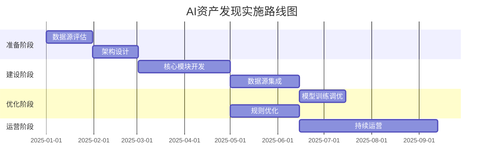

| 阶段 | 时间 | 关键里程碑 | 交付物 |
|:---:|:---:|:---|:---|
| 准备阶段 | 8周 | 完成数据源评估和架构设计 | 评估报告、架构设计文档 |
| 建设阶段 | 12周 | 完成核心模块开发和数据源集成 | 可运行的资产发现系统 |
| 优化阶段 | 8周 | 完成模型训练和规则优化 | 优化后的模型、调整后的规则 |
| 运营阶段 | 持续 | 持续运营和优化 | 运营报告、优化建议 |

### 5.2 数据质量管理

数据质量是AI资产发现效果的关键影响因素。

```python
class DataQualityManager:
    """
    数据质量管理器
    确保资产发现数据的质量
    """
    
    def __init__(self):
        self.quality_metrics = {
            'completeness': CompletenessChecker(),
            'accuracy': AccuracyChecker(),
            'freshness': FreshnessChecker(),
            'consistency': ConsistencyChecker()
        }
        
        self.quality_thresholds = {
            'completeness': 0.90,
            'accuracy': 0.95,
            'freshness': 0.85,
            'consistency': 0.90
        }
    
    def assess_data_quality(self, data_source):
        """
        评估数据源质量
        
        参数:
            data_source: 数据源名称
        
        返回:
            dict: 质量评估结果
        """
        results = {}
        
        for metric_name, checker in self.quality_metrics.items():
            metric_value = checker.calculate(data_source)
            threshold = self.quality_thresholds[metric_name]
            
            results[metric_name] = {
                'value': metric_value,
                'threshold': threshold,
                'status': 'pass' if metric_value >= threshold else 'fail'
            }
        
        overall_score = sum(r['value'] for r in results.values()) / len(results)
        
        return {
            'data_source': data_source,
            'overall_score': overall_score,
            'metrics': results,
            'action_required': overall_score < 0.85
        }
```

### 5.3 性能优化策略

大规模环境下的资产发现需要关注系统性能。

```python
class PerformanceOptimizer:
    """
    性能优化器
    优化资产发现的性能和扩展性
    """
    
    def __init__(self):
        self.cache = RedisCache()
        self.batch_processor = BatchProcessor()
        self.parallel_executor = ParallelExecutor()
    
    def optimize_discovery_cycle(self, assets):
        """
        优化发现周期
        
        参数:
            assets: 待处理资产列表
        
        返回:
            dict: 优化结果
        """
        start_time = time.time()
        
        cached_assets = self._filter_cached_assets(assets)
        new_assets = [a for a in assets if a['asset_id'] not in cached_assets]
        
        if len(new_assets) > 1000:
            processed_assets = self.batch_processor.process(
                new_assets,
                batch_size=500,
                parallel=True
            )
        else:
            processed_assets = self._process_sequential(new_assets)
        
        self.cache.update(processed_assets)
        
        return {
            'total_assets': len(assets),
            'cached': len(cached_assets),
            'processed': len(processed_assets),
            'duration': time.time() - start_time,
            'throughput': len(processed_assets) / (time.time() - start_time)
        }
    
    def _filter_cached_assets(self, assets):
        """过滤已在缓存中的资产"""
        return [a for a in assets if self.cache.exists(a['asset_id'])]
```

---

## 6. 结论与最佳实践

### 6.1 核心要点

AI驱动的资产发现体系代表了安全运营基础能力的升级。通过多源数据融合、实体智能消解、关系图谱构建等核心能力，AI系统能够实现全面、准确、实时的资产发现。

**技术成熟度评估**：

| 能力维度 | 传统方法 | AI增强方法 | 提升幅度 |
|:---:|:---:|:---:|:---:|
| 资产覆盖率 | 70-80% | 95-99% | +25% |
| 发现延迟 | 24-48小时 | <1小时 | -95% |
| 准确率 | 85-90% | 98%+ | +10% |
| 影子IT发现 | 20-30% | 80%+ | +150% |

### 6.2 实施建议

**建立数据基础**：
完善各类数据源的接入，确保AI系统有充足的数据进行学习和分析。建议优先接入核心数据源如Active Directory和云平台API，然后逐步扩展到其他数据源。

**持续运营优化**：
资产发现是持续过程，需要持续优化模型和规则，适应环境变化。建议建立运营指标体系，定期评估和优化系统效果。

**与安全运营集成**：
将资产发现与告警、响应等安全运营流程深度集成，发挥资产数据的价值。资产上下文信息能够显著提升安全事件的响应效率和准确性。

**关注数据质量**：
数据质量直接决定AI资产发现的效果。建立完善的数据质量管理机制，确保输入数据的完整性、准确性和及时性。

**渐进式实施**：
建议采用渐进式的实施策略，先在小范围试点，验证效果后再逐步推广。这种方式可以降低风险，积累经验。

---

## 附录一：AI资产发现评估指标

| 指标 | 定义 | 目标值 | 测量方法 |
|:---|:---|:---:|:---|
| 资产覆盖率 | 发现的资产占实际资产比例 | >95% | 与网络扫描/人工抽查对比 |
| 资产准确率 | 正确识别的资产占发现资产比例 | >98% | 随机抽样验证 |
| 更新延迟 | 资产变更到发现的时间 | <1小时 | 监控变更时间戳 |
| 影子IT发现率 | 发现的影子IT占实际影子IT比例 | >80% | 与网络流量分析对比 |
| 实体消解准确率 | 正确消解的实体对占总实体对比例 | >95% | 人工标注验证集 |
| 关系发现准确率 | 正确发现的资产关系占总关系比例 | >90% | 抽样验证 |
| 误报率 | 误报的异常资产占总发现资产比例 | <5% | 运营数据统计 |
| 系统可用性 | 系统正常运行时间占比 | >99.5% | 系统监控 |

## 附录二：资产发现数据源优先级

| 优先级 | 数据源 | 覆盖范围 | 更新频率 | 数据格式 | 接入难度 |
|:---:|:---|:---|:---:|:---|:---:|
| P0 | 云平台API | 云资源 | 实时 | JSON | 中 |
| P0 | Active Directory | 用户/计算机账户 | 小时 | LDAP | 低 |
| P1 | 网络设备NetFlow | 网络流量 | 准实时 | NetFlow/IPFIX | 中 |
| P1 | 终端管理平台 | 托管终端 | 准实时 | 多样 | 低 |
| P2 | DNS日志 | 域名解析 | 准实时 | DNS日志 | 中 |
| P2 | DHCP服务 | IP分配 | 准实时 | DHCP日志 | 低 |
| P3 | 主动扫描 | 全网资产 | 日/周 | 扫描报告 | 低 |
| P3 | SSL证书数据 | 暴露服务 | 实时 | 证书数据 | 中 |
| P4 | CMDB | 配置管理 | 日 | CSV/数据库 | 中 |

## 附录三：AI资产发现技术选型指南

### 3.1 图数据库选型

资产关系图谱需要图数据库支持，以下是主流图数据库的对比：

| 数据库 | 优势 | 劣势 | 适用场景 |
|:---|:---|:---|:---|
| Neo4j | 成熟稳定，Cypher查询强大 | 扩展性有限 | 中小规模资产图 |
| Amazon Neptune | 全托管，支持多种图模型 | 成本较高 | AWS环境 |
| JanusGraph | 开源，扩展性强 | 运维复杂 | 大规模资产图 |
| TigerGraph | 性能优秀，支持并行查询 | 生态较新 | 高性能需求 |

### 3.2 机器学习框架选型

| 框架 | 适用场景 | 部署难度 | 推荐度 |
|:---|:---|:---:|:---:|
| scikit-learn | 实体分类、异常检测 | 低 | 高 |
| TensorFlow | 深度学习模型 | 中 | 中 |
| PyTorch | 研究和实验 | 中 | 中 |
| MLlib | 大规模数据处理 | 低 | 高 |

## 附录四：常见问题与解决方案

### 4.1 数据源接入问题

**问题：DHCP日志数据量大，处理缓慢**

解决方案：
1. 使用Kafka等消息队列缓冲数据
2. 采用增量处理模式
3. 优化日志采集策略，过滤无关记录

**问题：云平台API调用频率限制**

解决方案：
1. 实现请求缓存机制
2. 使用多个账户分散请求
3. 与云平台协商提升配额

### 4.2 实体消解问题

**问题：主机名不规则导致匹配困难**

解决方案：
1. 建立主机名标准化规则
2. 使用模糊匹配算法如Jaro-Winkler
3. 结合IP、MAC等标识符综合判断

**问题：动态IP导致实体不稳定**

解决方案：
1. 延长实体生命周期缓存
2. 使用DHCP租约关联
3. 结合应用层标识符

### 4.3 性能优化问题

**问题：大规模环境处理时间过长**

解决方案：
1. 实现分片并行处理
2. 使用增量计算而非全量重算
3. 优化数据库查询和索引

---

## 附录五：安全与合规考虑

### 5.1 数据隐私保护

资产发现过程中涉及大量敏感信息，需要注意数据隐私保护：

1. **数据最小化**：只收集资产发现必需的数据字段
2. **访问控制**：严格控制资产数据的访问权限
3. **数据加密**：传输和存储过程全程加密
4. **审计日志**：记录所有数据访问操作
5. **数据脱敏**：在测试和开发环境中使用脱敏数据

### 5.2 合规性要求

| 合规框架 | 相关要求 | 实施建议 |
|:---|:---|:---|
| GDPR | 数据保护、隐私权 | 数据加密、访问控制、删除机制 |
| SOC 2 | 安全可用性 | 系统监控、日志记录、变更管理 |
| ISO 27001 | 信息安全管理 | 资产清单、风险评估、安全控制 |
| PCI DSS | 支付数据保护 | 资产分类、访问控制、漏洞管理 |

---

**关键词：** AI资产发现，资产安全管理，影子IT发现，资产关系图谱，云资产发现，资产风险评分，实体消解，多源数据融合