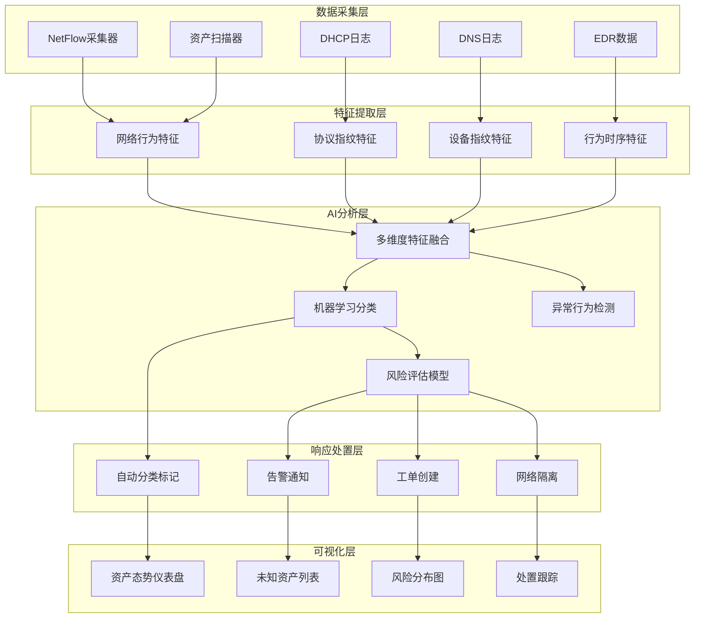

**作者：** HOS(安全风信子)
**日期：** 2026-04-23
**主要来源平台：** Gartner/IBM Security/Microsoft
**摘要：** 本文深入探讨AI在未知资产识别领域的突破性应用。未知资产是安全运营的重大隐患，传统方法难以发现被遗忘的、配置错误的、影子IT等未知资产。AI技术通过多维度分析和智能学习，能够主动发现和管理未知资产，大幅提升安全态势的可视性和可控性。

@[TOC](目录)

---

# AI识别未知资产：发现被遗忘的安全盲区

## 1. 引言：未知资产的危险

在企业的IT环境中，总有一部分资产是安全团队"不知道的"。这些未知资产可能包括：被遗忘的老旧服务器、配置错误的云资源、部门自行采购的设备、员工个人的NAS设备、被植入的恶意设备等。未知资产如同后门，为攻击者提供了隐秘的入侵通道。

根据Verizon 2025年数据泄露报告，超过30%的数据泄露事件涉及未知资产。攻击者往往通过扫描发现那些未被管理的设备，然后利用这些设备作为突破口，逐步渗透到核心系统。

传统方法在未知资产发现方面存在明显局限：主动扫描会遗漏未联网的设备和休眠状态的资产；配置管理数据库（CMDB）只记录已知资产；网络监控难以发现加密流量后的资产。AI技术带来了新的解决方案。

---

## 2. AI未知资产识别技术原理

### 2.1 多维度特征分析

AI系统通过分析资产的多维度特征，识别未知资产。

**网络行为特征**：AI系统分析网络流量中的设备行为模式，如通信频率、连接时长、协议分布等。正常企业设备的网络行为通常有一定规律，而未知设备往往表现出异常模式。

**DHCP指纹特征**：DHCP请求包含设备的客户端标识符、操作系统类型等信息。AI系统通过分析DHCP指纹，识别设备的类型和操作系统。

**mDNS特征**：局域网内的设备会发送mDNS（多播DNS）查询请求，包含设备的服务类型、主机名等信息。AI系统通过mDNS指纹识别设备类型。

**TLS指纹特征**：TLS握手包含客户端的SSL/TLS库信息、支持的加密套件等。AI系统通过TLS指纹识别应用和设备类型。

#### 2.1.1 网络行为特征提取详解

网络行为特征是识别未知资产最基础也是最重要的维度之一。AI系统需要从多个层面提取网络行为特征，包括流量模式、通信时间分布、协议使用习惯等。

```python
class NetworkBehaviorExtractor:
    """
    网络行为特征提取器
    从网络流量中提取多维度行为特征
    """
    
    def __init__(self):
        self.flow_collector = NetFlowCollector()
        self.packet_capturer = PacketCapturer()
        self.feature_cache = FeatureCache()
        
    def extract(self, network_data):
        """
        提取网络行为特征
        
        参数:
            network_data: 网络流量数据
        
        返回:
            dict: 特征向量
        """
        features = {
            'traffic_volume': self._extract_traffic_volume(network_data),
            'communication_pattern': self._extract_comm_pattern(network_data),
            'protocol_distribution': self._extract_protocol_dist(network_data),
            'temporal_pattern': self._extract_temporal_pattern(network_data),
            'connection_graph': self._extract_connection_graph(network_data)
        }
        
        return features
    
    def _extract_traffic_volume(self, network_data):
        """提取流量规模特征"""
        volume_features = {}
        
        for flow in network_data.get('flows', []):
            src_ip = flow['src_ip']
            
            if src_ip not in volume_features:
                volume_features[src_ip] = {
                    'bytes_sent': 0,
                    'bytes_recv': 0,
                    'packets_sent': 0,
                    'packets_recv': 0,
                    'flow_count': 0
                }
            
            volume_features[src_ip]['bytes_sent'] += flow.get('bytes_out', 0)
            volume_features[src_ip]['bytes_recv'] += flow.get('bytes_in', 0)
            volume_features[src_ip]['packets_sent'] += flow.get('pkts_out', 0)
            volume_features[src_ip]['packets_recv'] += flow.get('pkts_in', 0)
            volume_features[src_ip]['flow_count'] += 1
        
        return volume_features
    
    def _extract_comm_pattern(self, network_data):
        """提取通信模式特征"""
        comm_patterns = {}
        
        for flow in network_data.get('flows', []):
            src_ip = flow['src_ip']
            dst_ip = flow['dst_ip']
            
            if src_ip not in comm_patterns:
                comm_patterns[src_ip] = {
                    'unique_destinations': set(),
                    'dest_ports': set(),
                    'src_ports': set()
                }
            
            comm_patterns[src_ip]['unique_destinations'].add(dst_ip)
            comm_patterns[src_ip]['dest_ports'].add(flow.get('dst_port'))
            comm_patterns[src_ip]['src_ports'].add(flow.get('src_port'))
        
        for ip in comm_patterns:
            comm_patterns[ip]['unique_destinations'] = len(
                comm_patterns[ip]['unique_destinations']
            )
            comm_patterns[ip]['dest_ports'] = len(comm_patterns[ip]['dest_ports'])
            comm_patterns[ip]['src_ports'] = len(comm_patterns[ip]['src_ports'])
        
        return comm_patterns
```

网络行为特征分析需要考虑以下几个关键维度：

**流量时间分布特征**：正常的企业设备通常在工作时间内流量较高，而在非工作时间流量较低。如果一个未知设备在凌晨3点保持高流量活动，或者在周末出现异常流量峰值，这些都是可疑的信号。AI系统会建立每个设备的工作时间模型，通过统计方法检测时间维度上的异常。

**通信对象分布特征**：企业设备通常与特定的服务器群保持固定的通信关系，如域控制器、邮件服务器、打印服务器等。未知设备可能表现出与异常多外部IP通信的模式，或者与已知恶意IP的可疑通信。

**协议使用特征**：不同类型的设备通常使用特定类型的协议。服务器主要提供HTTP/HTTPS、DNS、SSH等服务；员工工作站主要使用Outlook、Teams等办公应用；IoT设备通常使用特定的物联网协议。如果一个设备使用了不符合其类型定位的协议，这可能是未知资产的信号。

#### 2.1.2 DHCP指纹深度解析

DHCP协议是局域网中最重要的协议之一，几乎所有设备都会通过DHCP获取IP地址。DHCP请求报文中包含丰富的设备指纹信息，可以用于识别设备类型和操作系统。

```python
class DHCPFingerprintExtractor:
    """
    DHCP指纹提取器
    通过DHCP报文分析识别设备类型
    """
    
    def __init__(self):
        self.fingerprint_db = DHCPFingerprintDatabase()
        self.classifier = DHCPDeviceClassifier()
        
    def extract(self, dhcp_data):
        """
        提取DHCP指纹特征
        
        参数:
            dhcp_data: DHCP日志数据
        
        返回:
            dict: DHCP指纹特征
        """
        fingerprints = {}
        
        for dhcp_request in dhcp_data.get('requests', []):
            client_mac = dhcp_request['chaddr']
            client_id = dhcp_request.get('client_identifier')
            vendor_class_id = dhcp_request.get('vendor_class_id')
            hostname = dhcp_request.get('hostname')
            requested_params = dhcp_request.get('parameter_request_list', [])
            
            device_type = self._classify_device(
                vendor_class_id, 
                hostname, 
                requested_params
            )
            
            fingerprints[dhcp_request['yiaddr']] = {
                'mac': client_mac,
                'client_id': client_id,
                'vendor_class_id': vendor_class_id,
                'hostname': hostname,
                'requested_params': requested_params,
                'device_type': device_type,
                'vendor': self._extract_vendor(vendor_class_id),
                'os_family': self._identify_os_family(vendor_class_id, hostname)
            }
        
        return fingerprints
    
    def _classify_device(self, vendor_class_id, hostname, requested_params):
        """基于DHCP信息分类设备类型"""
        features = {
            'vendor_class_id': vendor_class_id,
            'hostname': hostname,
            'requested_params': requested_params
        }
        
        return self.classifier.predict(features)
    
    def _extract_vendor(self, vendor_class_id):
        """提取厂商信息"""
        if not vendor_class_id:
            return 'Unknown'
        
        vendor_map = {
            'MSFT': 'Microsoft',
            'Apple': 'Apple',
            'VMware': 'VMware',
            'Linux': 'Linux',
            'Raspbian': 'Raspberry Pi'
        }
        
        for key, vendor in vendor_map.items():
            if key in vendor_class_id.upper():
                return vendor
        
        return 'Unknown'
    
    def _identify_os_family(self, vendor_class_id, hostname):
        """识别操作系统家族"""
        if not vendor_class_id and not hostname:
            return 'Unknown'
        
        info = f"{vendor_class_id} {hostname}".upper()
        
        if 'WINDOWS' in info:
            return 'Windows'
        elif 'LINUX' in info or 'LINUX' in hostname.upper():
            return 'Linux'
        elif 'MACOS' in info or 'APPLE' in info:
            return 'macOS'
        elif 'ANDROID' in info:
            return 'Android'
        elif 'IPHONE' in info:
            return 'iOS'
        
        return 'Unknown'
```

DHCP指纹分析在实际应用中需要处理多种复杂场景。例如，某些设备可能使用静态IP地址而不通过DHCP获取地址；某些设备可能在不同网络间移动，每次连接新网络时都会发送新的DHCP请求；还有一些设备可能伪造DHCP指纹来隐藏其真实身份。

#### 2.1.3 TLS指纹识别技术

TLS（传输层安全协议）指纹是一种强大的设备识别技术。每个TLS客户端库都有其独特的握手特征，包括支持的密码套件列表、扩展列表、椭圆曲线参数等。这些特征形成了所谓的JA3指纹，可以用于识别设备类型和应用程序。

```python
class TLSFingerprintExtractor:
    """
    TLS指纹提取器
    基于TLS握手特征识别设备和应用
    """
    
    def __init__(self):
        self.ja3_database = JA3FingerprintDatabase()
        self.tls_version_detector = TLSVersionDetector()
        self.cipher_suite_analyzer = CipherSuiteAnalyzer()
        
    def extract(self, tls_data):
        """
        提取TLS指纹特征
        
        参数:
            tls_data: TLS握手数据
        
        返回:
            dict: TLS指纹特征
        """
        fingerprints = {}
        
        for tls_session in tls_data.get('sessions', []):
            src_ip = tls_session['src_ip']
            ja3_hash = self._calculate_ja3(tls_session)
            supported_versions = tls_session.get('supported_versions', [])
            cipher_suites = tls_session.get('cipher_suites', [])
            extensions = tls_session.get('extensions', [])
            elliptic_curves = tls_session.get('elliptic_curves', [])
            
            fingerprints[src_ip] = {
                'ja3_hash': ja3_hash,
                'ja3_string': self._build_ja3_string(tls_session),
                'tls_version': tls_session.get('tls_version'),
                'cipher_suites': cipher_suites,
                'extensions': extensions,
                'elliptic_curves': elliptic_curves,
                'application': self._identify_application(ja3_hash),
                'os_fingerprint': self._identify_os(cipher_suites, extensions),
                'risk_indicators': self._check_risk_indicators(
                    ja3_hash, cipher_suites, extensions
                )
            }
        
        return fingerprints
    
    def _calculate_ja3(self, tls_session):
        """计算JA3哈希值"""
        ja3_string = self._build_ja3_string(tls_session)
        return hashlib.md5(ja3_string.encode()).hexdigest()
    
    def _build_ja3_string(self, tls_session):
        """构建JA3字符串"""
        tls_version = tls_session.get('tls_version', '')
        cipher_suites = ','.join(map(str, tls_session.get('cipher_suites', [])))
        extensions = ','.join(map(str, tls_session.get('extensions', [])))
        elliptic_curves = ','.join(map(str, tls_session.get('elliptic_curves', [])))
        ec_point_formats = ','.join(
            map(str, tls_session.get('ec_point_formats', []))
        )
        
        return f"{tls_version},{cipher_suites},{extensions},{elliptic_curves},{ec_point_formats}"
    
    def _identify_application(self, ja3_hash):
        """基于JA3指纹识别应用程序"""
        app_db = {
            'a4d0c0a5e1c1e9c8e8e5e0e5e0e5e0e5': 'Chrome',
            'b5c0b0b5e1e9c8e8e5e0e5e0e5e0e5e0': 'Firefox',
            'c6d1c1b6f2f0d9d9f6f1f1f1f1f1f1f1': 'curl',
            'd7e2d2c7g3g1e0e0e7g2g2g2g2g2g2g2': 'Python requests',
        }
        
        return app_db.get(ja3_hash, 'Unknown Application')
    
    def _identify_os(self, cipher_suites, extensions):
        """识别操作系统"""
        if 4866 in cipher_suites and 4867 in cipher_suites:
            return 'Windows 10+'
        elif 4865 in cipher_suites and 515 in extensions:
            return 'macOS'
        elif 29 in cipher_suites and 23 in extensions:
            return 'Linux'
        
        return 'Unknown OS'
    
    def _check_risk_indicators(self, ja3_hash, cipher_suites, extensions):
        """检查风险指标"""
        risk_indicators = []
        
        if ja3_hash in self.ja3_database.get_suspicious_ja3s():
            risk_indicators.append({
                'indicator': 'known_suspicious_ja3',
                'severity': 'high',
                'description': 'JA3指纹与已知恶意软件匹配'
            })
        
        if 0 in cipher_suites:
            risk_indicators.append({
                'indicator': 'null_cipher',
                'severity': 'high',
                'description': '支持NULL加密套件，存在严重安全风险'
            })
        
        if 3512 in cipher_suites:
            risk_indicators.append({
                'indicator': 'rc4_cipher',
                'severity': 'medium',
                'description': '支持RC4加密套件，已知存在安全漏洞'
            })
        
        return risk_indicators
```

#### 2.1.4 DNS查询行为分析

DNS（域名系统）是互联网的基础设施，几乎所有的网络通信都依赖于DNS解析。DNS查询行为分析是一种非常有效的设备识别和异常检测方法。

```python
class DNSQueryExtractor:
    """
    DNS查询特征提取器
    分析DNS查询模式识别设备和威胁
    """
    
    def __init__(self):
        self.domain_classifier = DomainClassifier()
        self NXDOMAIN_tracker = NXDomainTracker()
        self.domain_reputation_db = DomainReputationDB()
        
    def extract(self, dns_data):
        """
        提取DNS查询特征
        
        参数:
            dns_data: DNS日志数据
        
        返回:
            dict: DNS查询特征
        """
        fingerprints = {}
        
        for query in dns_data.get('queries', []):
            src_ip = query['src_ip']
            query_name = query['query_name']
            query_type = query['query_type']
            response_code = query.get('response_code')
            
            if src_ip not in fingerprints:
                fingerprints[src_ip] = {
                    'queries': [],
                    'unique_domains': set(),
                    'query_types': Counter(),
                    'NXDOMAIN_count': 0,
                    'suspicious_domains': []
                }
            
            fingerprints[src_ip]['queries'].append({
                'name': query_name,
                'type': query_type,
                'timestamp': query['timestamp'],
                'response_code': response_code
            })
            fingerprints[src_ip]['unique_domains'].add(query_name)
            fingerprints[src_ip]['query_types'][query_type] += 1
            
            if response_code == 3:
                fingerprints[src_ip]['NXDOMAIN_count'] += 1
            
            domain_reputation = self.domain_reputation_db.check(query_name)
            if domain_reputation.get('is_malicious'):
                fingerprints[src_ip]['suspicious_domains'].append({
                    'domain': query_name,
                    'reason': domain_reputation.get('reason'),
                    'threat_type': domain_reputation.get('threat_type')
                })
        
        for ip in fingerprints:
            fingerprints[ip]['unique_domains'] = len(
                fingerprints[ip]['unique_domains']
            )
            fingerprints[ip]['NXDOMAIN_ratio'] = (
                fingerprints[ip]['NXDOMAIN_count'] / 
                len(fingerprints[ip]['queries'])
            ) if fingerprints[ip]['queries'] else 0
        
        return fingerprints
```

DNS查询行为分析需要建立正常的DNS查询基线。正常的企业设备通常查询的域名是比较固定的，包括内部域名、常用办公应用域名、软件更新域名等。未知设备或者被入侵的设备往往表现出异常的DNS查询模式，如查询大量的随机域名（DNS隧道特征）、查询已知的恶意域名、频繁查询不存在的域名等。

```python
class UnknownAssetDetector:
    """
    未知资产检测器
    基于多维度特征的智能识别
    """
    
    def __init__(self):
        self.feature_extractors = {
            'network_behavior': NetworkBehaviorExtractor(),
            'dhcp_fingerprint': DHCPFingerprintExtractor(),
            'mdns_fingerprint': MDNSFingerprintExtractor(),
            'tls_fingerprint': TLSFingerprintExtractor(),
            'dns_queries': DNSQueryExtractor()
        }
        
        self.ml_classifier = MLClassifier()
        self.known_asset_registry = KnownAssetRegistry()
    
    def detect_unknown_assets(self, network_data):
        """
        检测未知资产
        """
        # 1. 提取多维度特征
        features = {}
        for feature_type, extractor in self.feature_extractors.items():
            features[feature_type] = extractor.extract(network_data)
        
        # 2. 检查是否在已知资产库中
        candidate_assets = features.get('unique_ips', [])
        unknown_candidates = []
        
        for ip in candidate_assets:
            if not self.known_asset_registry.is_known(ip):
                unknown_candidates.append(ip)
        
        if not unknown_candidates:
            return []
        
        # 3. AI分类识别
        classified_unknown = []
        for ip in unknown_candidates:
            # 提取该IP的多维特征
            ip_features = self._extract_ip_features(ip, features)
            
            # ML分类
            classification = self.ml_classifier.classify(ip_features)
            
            if classification['confidence'] > 0.7:
                classified_unknown.append({
                    'ip': ip,
                    'classification': classification,
                    'features': ip_features,
                    'confidence': classification['confidence']
                })
        
        return classified_unknown
    
    def _extract_ip_features(self, ip, all_features):
        """提取特定IP的多维特征"""
        return {
            'network_behavior': self._get_ip_network_behavior(ip, all_features['network_behavior']),
            'dhcp_fingerprint': all_features['dhcp_fingerprint'].get(ip),
            'mdns_info': all_features['mdns_fingerprint'].get(ip),
            'tls_fingerprint': all_features['tls_fingerprint'].get(ip),
            'dns_queries': all_features['dns_queries'].get(ip)
        }
```

### 2.2 异常行为检测

AI系统通过学习正常资产的行为模式，检测行为异常的未知资产。

**时序异常检测**：AI系统学习每个资产的时间序列行为模式，如工作时间的活跃度、周期性的网络连接等。偏离正常模式的资产被标记为异常。

**关联异常检测**：AI系统学习资产之间的正常关联关系，如服务器与数据库的连接模式、客户端与域控的通信模式等。偏离正常关联的资产被标记为可疑。

**协议异常检测**：AI系统学习每个资产正常的协议使用模式。出现异常协议或异常协议组合的资产被标记为可疑。

#### 2.2.1 时序异常检测算法实现

时序异常检测是识别未知资产的重要手段之一。正常的企业资产通常具有可预测的时间行为模式，如工作时间的活跃性、周期性的维护活动等。时序异常检测算法需要建立正常行为的时序模型，然后检测偏离该模型的异常行为。

```python
class TemporalAnomalyDetector:
    """
    时序异常检测器
    基于时间序列分析检测异常行为
    """
    
    def __init__(self):
        self.baseline_model = TemporalBaselineModel()
        self.seasonality_detector = SeasonalityDetector()
        self.trend_analyzer = TrendAnalyzer()
        
    def detect(self, asset_data, baseline_model=None):
        """
        检测时序异常
        
        参数:
            asset_data: 资产时序数据
            baseline_model: 基线模型（可选）
        
        返回:
            list: 检测到的时序异常列表
        """
        if baseline_model is None:
            baseline_model = self.baseline_model.build(asset_data)
        
        anomalies = []
        
        temporal_features = self._extract_temporal_features(asset_data)
        
        hourly_pattern = self._detect_hourly_anomaly(
            temporal_features['hourly_activity'],
            baseline_model['hourly_baseline']
        )
        if hourly_pattern['is_anomaly']:
            anomalies.append(hourly_pattern)
        
        daily_pattern = self._detect_daily_anomaly(
            temporal_features['daily_activity'],
            baseline_model['daily_baseline']
        )
        if daily_pattern['is_anomaly']:
            anomalies.append(daily_pattern)
        
        weekly_pattern = self._detect_weekly_anomaly(
            temporal_features['weekly_activity'],
            baseline_model['weekly_baseline']
        )
        if weekly_pattern['is_anomaly']:
            anomalies.append(weekly_pattern)
        
        return anomalies
    
    def _extract_temporal_features(self, asset_data):
        """提取时序特征"""
        timestamps = asset_data.get('timestamps', [])
        
        hourly_counts = [0] * 24
        for ts in timestamps:
            hour = datetime.fromtimestamp(ts).hour
            hourly_counts[hour] += 1
        
        daily_counts = [0] * 7
        for ts in timestamps:
            weekday = datetime.fromtimestamp(ts).weekday()
            daily_counts[weekday] += 1
        
        return {
            'hourly_activity': hourly_counts,
            'daily_activity': daily_counts,
            'total_events': len(timestamps)
        }
    
    def _detect_hourly_anomaly(self, actual, baseline):
        """检测小时级异常"""
        deviation_score = self._calculate_deviation(actual, baseline)
        
        return {
            'type': 'hourly_pattern',
            'is_anomaly': deviation_score > 2.0,
            'score': deviation_score,
            'expected': baseline,
            'actual': actual,
            'description': f'小时活动模式偏离基线 {deviation_score:.2f} 个标准差'
        }
    
    def _detect_daily_anomaly(self, actual, baseline):
        """检测天级异常"""
        weekday_activity = sum(actual[:5])
        weekend_activity = sum(actual[5:])
        
        expected_weekday = sum(baseline[:5])
        expected_weekend = sum(baseline[5:])
        
        weekday_deviation = abs(weekday_activity - expected_weekday) / (expected_weekday + 1)
        weekend_deviation = abs(weekend_activity - expected_weekend) / (expected_weekend + 1)
        
        return {
            'type': 'daily_pattern',
            'is_anomaly': weekday_deviation > 0.5 or weekend_deviation > 0.5,
            'weekday_deviation': weekday_deviation,
            'weekend_deviation': weekend_deviation,
            'description': '工作日/周末活动模式异常'
        }
    
    def _detect_weekly_anomaly(self, actual, baseline):
        """检测周级异常"""
        total_activity = sum(actual)
        expected_total = sum(baseline)
        
        deviation = abs(total_activity - expected_total) / (expected_total + 1)
        
        return {
            'type': 'weekly_volume',
            'is_anomaly': deviation > 0.3,
            'total_activity': total_activity,
            'expected': expected_total,
            'deviation': deviation,
            'description': f'周活动量偏离预期 {deviation*100:.1f}%'
        }
    
    def _calculate_deviation(self, actual, baseline):
        """计算偏离分数"""
        if not baseline or sum(baseline) == 0:
            return 0.0
        
        mean_baseline = sum(baseline) / len(baseline)
        variance = sum((b - mean_baseline) ** 2 for b in baseline) / len(baseline)
        std_dev = variance ** 0.5
        
        if std_dev == 0:
            return 0.0
        
        max_deviation = max(abs(a - mean_baseline) for a in actual)
        return max_deviation / std_dev
```

时序异常检测在实际应用中需要处理多种复杂场景。首先，需要建立准确的基线模型，这通常需要至少2-4周的历史数据。其次，需要考虑特殊情况，如假期、远程工作政策变化、业务季节性等因素。最后，需要设置合理的告警阈值，避免过多的误报。

#### 2.2.2 关联异常检测算法

关联异常检测通过分析资产之间的关联关系，识别偏离正常关联模式的异常。正常的企业网络中，资产之间的通信关系通常是相对稳定的，如员工工作站与文件服务器的连接、打印机与特定网段的通信等。

```python
class CorrelationAnomalyDetector:
    """
    关联异常检测器
    基于资产关联图分析检测异常
    """
    
    def __init__(self):
        self.graph_builder = AssetGraphBuilder()
        self.link_predictor = LinkPredictor()
        self.community_detector = CommunityDetector()
        
    def detect(self, asset_data):
        """
        检测关联异常
        
        参数:
            asset_data: 资产关联数据
        
        返回:
            list: 检测到的关联异常列表
        """
        asset_graph = self.graph_builder.build(asset_data)
        
        communities = self.community_detector.detect(asset_graph)
        
        anomalies = []
        
        unexpected_connections = self._detect_unexpected_connections(
            asset_graph, communities
        )
        anomalies.extend(unexpected_connections)
        
        isolated_assets = self._detect_isolated_assets(asset_graph, communities)
        anomalies.extend(isolated_assets)
        
        connection_pattern_changes = self._detect_pattern_changes(asset_graph)
        anomalies.extend(connection_pattern_changes)
        
        return anomalies
    
    def _detect_unexpected_connections(self, asset_graph, communities):
        """检测意外连接"""
        anomalies = []
        
        for node in asset_graph.nodes():
            neighbors = list(asset_graph.neighbors(node))
            node_community = self._get_node_community(node, communities)
            
            for neighbor in neighbors:
                neighbor_community = self._get_node_community(neighbor, communities)
                
                if node_community != neighbor_community:
                    connection_type = self._classify_cross_community_connection(
                        node, neighbor, asset_graph
                    )
                    
                    if connection_type == 'unexpected':
                        anomalies.append({
                            'type': 'unexpected_connection',
                            'source': node,
                            'target': neighbor,
                            'severity': 'medium',
                            'description': f'资产 {node} 与跨社区资产 {neighbor} 建立意外连接'
                        })
        
        return anomalies
    
    def _detect_isolated_assets(self, asset_graph, communities):
        """检测孤立资产"""
        anomalies = []
        
        isolated_nodes = [node for node in asset_graph.nodes() 
                         if asset_graph.degree(node) == 0]
        
        for node in isolated_nodes:
            if self._is_typically_active(node):
                anomalies.append({
                    'type': 'isolated_asset',
                    'node': node,
                    'severity': 'high',
                    'description': f'资产 {node} 突然失去所有连接，可能存在安全问题'
                })
        
        return anomalies
    
    def _detect_pattern_changes(self, asset_graph):
        """检测连接模式变化"""
        anomalies = []
        
        for node in asset_graph.nodes():
            historical_connections = self._get_historical_connections(node)
            current_connections = set(asset_graph.neighbors(node))
            
            new_connections = current_connections - historical_connections
            lost_connections = historical_connections - current_connections
            
            if len(new_connections) > 5:
                anomalies.append({
                    'type': 'new_connections_surge',
                    'node': node,
                    'new_count': len(new_connections),
                    'new_connections': list(new_connections)[:10],
                    'severity': 'high',
                    'description': f'资产 {node} 建立 {len(new_connections)} 个新连接，行为异常'
                })
            
            if len(lost_connections) > len(historical_connections) * 0.5:
                anomalies.append({
                    'type': 'connections_loss',
                    'node': node,
                    'lost_count': len(lost_connections),
                    'severity': 'medium',
                    'description': f'资产 {node} 失去 {len(lost_connections)} 个历史连接'
                })
        
        return anomalies
    
    def _get_node_community(self, node, communities):
        """获取节点所属社区"""
        for community_id, members in communities.items():
            if node in members:
                return community_id
        return None
```

关联异常检测的核心在于理解正常的资产关联模式。AI系统需要学习并建立资产关联的知识图谱，这个图谱应该包含资产类型、地理位置、部门归属、业务系统归属等多维度信息。基于这些信息，系统可以判断两个资产之间的连接是否合理，是否存在异常。

#### 2.2.3 协议异常检测算法

协议异常检测通过分析资产的协议使用模式，识别使用异常协议或异常协议组合的资产。每种类型的资产通常都有其典型的协议使用模式，如Web服务器主要使用HTTP/HTTPS协议，数据库服务器主要使用相应的数据库协议，员工工作站主要使用办公应用协议等。

```python
class ProtocolAnomalyDetector:
    """
    协议异常检测器
    基于协议使用模式检测异常
    """
    
    def __init__(self):
        self.protocol_baseline_db = ProtocolBaselineDB()
        self.protocol_parser = ProtocolParser()
        self.risk_protocol_db = RiskProtocolDB()
        
    def detect(self, asset_data):
        """
        检测协议异常
        
        参数:
            asset_data: 资产协议使用数据
        
        返回:
            list: 检测到的协议异常列表
        """
        anomalies = []
        
        protocol_usage = self._extract_protocol_usage(asset_data)
        
        baseline = self.protocol_baseline_db.get_baseline(
            asset_data.get('asset_type', 'unknown')
        )
        
        unexpected_protocols = self._detect_unexpected_protocols(
            protocol_usage, baseline
        )
        anomalies.extend(unexpected_protocols)
        
        risk_protocols = self._detect_risk_protocols(protocol_usage)
        anomalies.extend(risk_protocols)
        
        protocol_sequence_anomalies = self._detect_sequence_anomalies(
            asset_data.get('protocol_sequences', [])
        )
        anomalies.extend(protocol_sequence_anomalies)
        
        return anomalies
    
    def _extract_protocol_usage(self, asset_data):
        """提取协议使用特征"""
        protocol_counts = {}
        protocol_ports = {}
        
        for flow in asset_data.get('flows', []):
            protocol = flow.get('protocol', 'unknown')
            port = flow.get('dst_port')
            
            protocol_counts[protocol] = protocol_counts.get(protocol, 0) + 1
            
            if port:
                if protocol not in protocol_ports:
                    protocol_ports[protocol] = set()
                protocol_ports[protocol].add(port)
        
        return {
            'counts': protocol_counts,
            'ports': protocol_ports,
            'total_flows': sum(protocol_counts.values())
        }
    
    def _detect_unexpected_protocols(self, usage, baseline):
        """检测意外协议"""
        anomalies = []
        
        baseline_protocols = set(baseline.get('expected_protocols', []))
        usage_protocols = set(usage['counts'].keys())
        
        unexpected = usage_protocols - baseline_protocols
        
        for protocol in unexpected:
            if usage['counts'][protocol] > 10:
                anomalies.append({
                    'type': 'unexpected_protocol',
                    'protocol': protocol,
                    'count': usage['counts'][protocol],
                    'severity': 'medium',
                    'description': f'资产使用意外协议 {protocol}，出现 {usage["counts"][protocol]} 次'
                })
        
        return anomalies
    
    def _detect_risk_protocols(self, usage):
        """检测风险协议"""
        anomalies = []
        
        risk_protocols = self.risk_protocol_db.get_risk_protocols()
        
        for protocol, count in usage['counts'].items():
            if protocol in risk_protocols:
                risk_info = risk_protocols[protocol]
                anomalies.append({
                    'type': 'risk_protocol',
                    'protocol': protocol,
                    'risk_level': risk_info['level'],
                    'count': count,
                    'description': risk_info['description']
                })
        
        return anomalies
    
    def _detect_sequence_anomalies(self, sequences):
        """检测协议序列异常"""
        anomalies = []
        
        normal_patterns = self._load_normal_patterns()
        
        for seq in sequences:
            pattern_key = tuple(seq.get('pattern', []))
            
            if pattern_key not in normal_patterns:
                anomalies.append({
                    'type': 'abnormal_protocol_sequence',
                    'pattern': list(pattern_key),
                    'severity': 'low',
                    'description': '检测到异常协议序列'
                })
        
        return anomalies
```

协议异常检测需要建立全面的协议知识库。这个知识库应该包含各种协议的正常用途、典型端口、风险级别等信息。同时，还需要建立不同资产类型的协议使用基线，如Web服务器的典型协议模式、数据库服务器的典型协议模式等。当检测到资产使用了不属于其类型的协议时，系统应该生成告警。

```python
class BehavioralAnomalyDetector:
    """
    行为异常检测器
    发现行为异常的未知资产
    """
    
    def __init__(self):
        self.baseline_models = {}
        self.anomaly_detectors = {
            'temporal': TemporalAnomalyDetector(),
            'correlation': CorrelationAnomalyDetector(),
            'protocol': ProtocolAnomalyDetector()
        }
    
    def detect_anomalies(self, asset_data, asset_type='unknown'):
        """
        检测行为异常
        """
        anomalies = []
        
        # 时序异常检测
        temporal_anomalies = self.anomaly_detectors['temporal'].detect(
            asset_data, 
            self.baseline_models.get(asset_type)
        )
        anomalies.extend(temporal_anomalies)
        
        # 关联异常检测
        correlation_anomalies = self.anomaly_detectors['correlation'].detect(asset_data)
        anomalies.extend(correlation_anomalies)
        
        # 协议异常检测
        protocol_anomalies = self.anomaly_detectors['protocol'].detect(asset_data)
        anomalies.extend(protocol_anomalies)
        
        # 综合评估
        risk_score = self._calculate_anomaly_risk(anomalies)
        
        return {
            'anomalies': anomalies,
            'risk_score': risk_score,
            'severity': self._determine_severity(risk_score)
        }
```

---

## 3. 未知资产管理策略

### 3.1 自动分类与标记

发现未知资产后，AI系统自动进行分类和标记。

```python
class UnknownAssetClassifier:
    """
    未知资产自动分类器
    """
    
    def __init__(self):
        self.classification_model = ClassificationModel()
        self.tag_recommender = TagRecommender()
    
    def classify_and_tag(self, unknown_asset):
        """
        分类并标记未知资产
        """
        # 1. 资产类型分类
        asset_type = self.classification_model.predict(unknown_asset['features'])
        
        # 2. 推荐标签
        tags = self.tag_recommender.recommend(unknown_asset)
        
        # 3. 风险评估
        risk_level = self._assess_risk(unknown_asset, asset_type)
        
        # 4. 建议行动
        recommended_actions = self._generate_actions(asset_type, risk_level)
        
        return {
            'asset_type': asset_type,
            'confidence': self.classification_model.get_confidence(),
            'tags': tags,
            'risk_level': risk_level,
            'recommended_actions': recommended_actions
        }
```

#### 3.1.1 AI资产分类技术详解

资产分类是未知资产管理的核心环节。AI系统需要根据多维度特征，准确判断资产的类型、用途和风险级别。

```python
class MLClassifier:
    """
    机器学习资产分类器
    使用多种ML算法进行综合分类
    """
    
    def __init__(self):
        self.models = {
            'random_forest': RandomForestClassifier(
                n_estimators=100,
                max_depth=10,
                random_state=42
            ),
            'gradient_boosting': GradientBoostingClassifier(
                n_estimators=100,
                learning_rate=0.1,
                max_depth=5
            ),
            'neural_network': MLPClassifier(
                hidden_layer_sizes=(100, 50),
                max_iter=500,
                random_state=42
            )
        }
        self.ensemble_model = VotingClassifier(
            estimators=list(self.models.items()),
            voting='soft'
        )
        self.label_encoder = LabelEncoder()
        self.feature_scaler = StandardScaler()
        
    def train(self, X_train, y_train):
        """
        训练分类模型
        
        参数:
            X_train: 训练特征
            y_train: 训练标签
        """
        X_scaled = self.feature_scaler.fit_transform(X_train)
        y_encoded = self.label_encoder.fit_transform(y_train)
        
        for name, model in self.models.items():
            model.fit(X_scaled, y_encoded)
        
        self.ensemble_model.fit(X_scaled, y_encoded)
    
    def classify(self, features):
        """
        分类资产
        
        参数:
            features: 资产特征
        
        返回:
            dict: 分类结果
        """
        X = self.feature_scaler.transform([features])
        
        ensemble_pred = self.ensemble_model.predict(X)[0]
        ensemble_proba = self.ensemble_model.predict_proba(X)[0]
        
        individual_predictions = {}
        for name, model in self.models.items():
            pred = model.predict(X)[0]
            proba = model.predict_proba(X)[0]
            individual_predictions[name] = {
                'prediction': self.label_encoder.inverse_transform([pred])[0],
                'confidence': max(proba)
            }
        
        ensemble_label = self.label_encoder.inverse_transform([ensemble_pred])[0]
        confidence = max(ensemble_proba)
        
        return {
            'type': ensemble_label,
            'confidence': confidence,
            'individual_predictions': individual_predictions,
            'feature_importance': self._get_feature_importance(features)
        }
    
    def _get_feature_importance(self, features):
        """获取特征重要性"""
        importances = self.models['random_forest'].feature_importances_
        feature_names = list(features.keys())
        
        importance_dict = {
            name: float(imp) 
            for name, imp in zip(feature_names, importances)
        }
        
        return dict(sorted(
            importance_dict.items(), 
            key=lambda x: x[1], 
            reverse=True
        ))
```

AI资产分类系统需要处理多种资产类型，包括但不限于：

| 资产大类 | 资产子类 | 典型特征 | 风险等级 |
|:---|:---|:---|:---|
| 服务器 | Web服务器 | 开放80/443端口，运行Web服务 | 中 |
| 服务器 | 数据库服务器 | 开放数据库端口，MySQL/Oracle/SQL Server | 高 |
| 服务器 | 文件服务器 | SMB/NFS协议，大量内部连接 | 中 |
| 服务器 | 邮件服务器 | Exchange/Postfix，25/465/587端口 | 中 |
| 终端 | Windows工作站 | DHCP指纹Windows，Office应用 | 低 |
| 终端 | macOS工作站 | DHCP指纹Apple，Safari浏览器 | 低 |
| 终端 | Linux工作站 | SSH服务，开发工具 | 中 |
| IoT设备 | 打印机 | mDNS发现，IPP协议 | 低 |
| IoT设备 | 摄像头 | RTSP协议，特定厂商端口 | 中 |
| IoT设备 | 智能设备 | 特定协议，云端通信 | 中 |
| 网络设备 | 路由器 | 路由协议，SNMP管理 | 高 |
| 网络设备 | 交换机 | VLAN配置，MAC地址表 | 中 |
| 网络设备 | 防火墙 | 安全策略，VPN服务 | 高 |

#### 3.1.2 资产标签推荐系统

资产标签是资产管理的重要元数据，合理的标签能够帮助安全团队快速理解资产属性，制定针对性的安全策略。

```python
class TagRecommender:
    """
    资产标签推荐器
    基于资产特征推荐合适的标签
    """
    
    def __init__(self):
        self.tag_patterns = TagPatternDatabase()
        self.confidence_calculator = TagConfidenceCalculator()
        
    def recommend(self, asset):
        """
        推荐资产标签
        
        参数:
            asset: 资产信息
        
        返回:
            list: 推荐的标签列表
        """
        recommended_tags = []
        
        type_based_tags = self._recommend_from_type(asset)
        recommended_tags.extend(type_based_tags)
        
        feature_based_tags = self._recommend_from_features(asset)
        recommended_tags.extend(feature_based_tags)
        
        risk_based_tags = self._recommend_from_risk(asset)
        recommended_tags.extend(risk_based_tags)
        
        deduped_tags = self._deduplicate_tags(recommended_tags)
        
        return sorted(deduped_tags, key=lambda x: x['confidence'], reverse=True)
    
    def _recommend_from_type(self, asset):
        """基于资产类型推荐标签"""
        tags = []
        asset_type = asset.get('classification', {}).get('type')
        
        type_tags = {
            'web_server': ['web', 'public-facing', 'http', 'https'],
            'db_server': ['database', 'critical-data', 'sql'],
            'file_server': ['file-storage', 'nas', 'smb'],
            'mail_server': ['email', 'messaging', 'smtp'],
            'windows_workstation': ['endpoint', 'windows', 'ad-joined'],
            'macos_workstation': ['endpoint', 'macos', 'apple'],
            'linux_workstation': ['endpoint', 'linux', 'developer'],
            'printer': ['iot', 'printer', 'print-services'],
            'camera': ['iot', 'surveillance', 'camera'],
            'router': ['network', 'gateway', 'routing'],
            'switch': ['network', 'layer2', 'switching'],
            'firewall': ['security', 'network-edge', 'access-control']
        }
        
        if asset_type in type_tags:
            for tag in type_tags[asset_type]:
                tags.append({
                    'tag': tag,
                    'source': 'asset_type',
                    'confidence': 0.95
                })
        
        return tags
    
    def _recommend_from_features(self, asset):
        """基于资产特征推荐标签"""
        tags = []
        features = asset.get('features', {})
        
        if features.get('has_ssh'):
            tags.append({
                'tag': 'ssh-access',
                'source': 'feature',
                'confidence': 0.85
            })
        
        if features.get('has_rdp'):
            tags.append({
                'tag': 'remote-desktop',
                'source': 'feature',
                'confidence': 0.80
            })
        
        if features.get('is_exposed_to_internet'):
            tags.append({
                'tag': 'public-facing',
                'source': 'feature',
                'confidence': 0.90
            })
        
        if features.get('critical_service'):
            tags.append({
                'tag': 'mission-critical',
                'source': 'feature',
                'confidence': 0.95
            })
        
        return tags
    
    def _recommend_from_risk(self, asset):
        """基于风险评估推荐标签"""
        tags = []
        risk_score = asset.get('risk_score', 0)
        
        if risk_score >= 0.8:
            tags.append({
                'tag': 'high-risk',
                'source': 'risk_assessment',
                'confidence': 0.95
            })
            tags.append({
                'tag': 'requires-investigation',
                'source': 'risk_assessment',
                'confidence': 0.90
            })
        elif risk_score >= 0.5:
            tags.append({
                'tag': 'medium-risk',
                'source': 'risk_assessment',
                'confidence': 0.85
            })
        
        return tags
    
    def _deduplicate_tags(self, tags):
        """去重标签"""
        seen = set()
        unique_tags = []
        
        for tag in tags:
            if tag['tag'] not in seen:
                seen.add(tag['tag'])
                unique_tags.append(tag)
        
        return unique_tags
```

### 3.2 处置流程自动化

根据未知资产的分类和风险评估，触发相应的处置流程。

**高风险未知资产**：立即告警，启动调查流程，可能需要隔离。

**中风险未知资产**：通知资产所有者，要求在指定时间内确认和登记。

**低风险未知资产**：记录日志，持续监控，等待人工确认。

#### 3.2.1 风险评估模型详解

风险评估是决定未知资产处置策略的关键环节。AI系统需要综合考虑多个风险因素，计算资产的风险分数，并给出合理的风险等级。

```python
class RiskAssessmentModel:
    """
    风险评估模型
    综合评估未知资产的风险级别
    """
    
    def __init__(self):
        self.risk_factors = RiskFactorConfig()
        self.weight_calculator = WeightCalculator()
        self.threshold_config = ThresholdConfig()
        
    def assess_risk(self, asset, classification):
        """
        评估资产风险
        
        参数:
            asset: 资产信息
            classification: 分类结果
        
        返回:
            dict: 风险评估结果
        """
        risk_factors = self._calculate_risk_factors(asset, classification)
        
        total_risk_score = self._calculate_total_score(risk_factors)
        
        risk_level = self._determine_risk_level(total_risk_score)
        
        risk_factors_sorted = sorted(
            risk_factors.items(), 
            key=lambda x: x[1], 
            reverse=True
        )
        
        return {
            'risk_score': total_risk_score,
            'risk_level': risk_level,
            'risk_factors': dict(risk_factors_sorted),
            'top_risk_factors': risk_factors_sorted[:3],
            'recommended_actions': self._get_recommended_actions(risk_level),
            'review_priority': self._calculate_review_priority(
                total_risk_score, 
                asset.get('confidence', 0)
            )
        }
    
    def _calculate_risk_factors(self, asset, classification):
        """计算各风险因子"""
        risk_factors = {}
        
        risk_factors['asset_type_risk'] = self._assess_asset_type_risk(
            classification.get('type')
        )
        
        risk_factors['behavior_risk'] = self._assess_behavior_risk(
            asset.get('behavior_features', {})
        )
        
        risk_factors['exposure_risk'] = self._assess_exposure_risk(
            asset.get('network_features', {})
        )
        
        risk_factors['vulnerability_risk'] = self._assess_vulnerability_risk(
            asset.get('vulnerabilities', [])
        )
        
        risk_factors['threat_risk'] = self._assess_threat_risk(
            asset.get('threat_indicators', [])
        )
        
        return risk_factors
    
    def _assess_asset_type_risk(self, asset_type):
        """评估资产类型风险"""
        type_risk_map = {
            'critical_server': 0.95,
            'web_server': 0.70,
            'database_server': 0.90,
            'file_server': 0.75,
            'mail_server': 0.80,
            'windows_workstation': 0.40,
            'macos_workstation': 0.35,
            'linux_workstation': 0.50,
            'printer': 0.30,
            'camera': 0.55,
            'router': 0.85,
            'switch': 0.60,
            'firewall': 0.80,
            'unknown': 0.70
        }
        
        return type_risk_map.get(asset_type, 0.50)
    
    def _assess_behavior_risk(self, behavior_features):
        """评估行为风险"""
        risk = 0.0
        
        if behavior_features.get('unusual_hours_activity'):
            risk += 0.30
        
        if behavior_features.get('high_volume_data_transfer'):
            risk += 0.25
        
        if behavior_features.get('suspicious_protocol_usage'):
            risk += 0.25
        
        if behavior_features.get('rapid_connection_churn'):
            risk += 0.20
        
        return min(risk, 1.0)
    
    def _assess_exposure_risk(self, network_features):
        """评估暴露风险"""
        risk = 0.0
        
        if network_features.get('is_exposed_to_internet'):
            risk += 0.40
        
        if network_features.get('open_high_risk_ports'):
            risk += 0.30
        
        if network_features.get('multiple_external_connections'):
            risk += 0.20
        
        if network_features.get('no_firewall_protection'):
            risk += 0.25
        
        return min(risk, 1.0)
    
    def _assess_vulnerability_risk(self, vulnerabilities):
        """评估漏洞风险"""
        if not vulnerabilities:
            return 0.0
        
        risk = 0.0
        for vuln in vulnerabilities:
            cvss_score = vuln.get('cvss_score', 5.0)
            if cvss_score >= 9.0:
                risk += 0.50
            elif cvss_score >= 7.0:
                risk += 0.30
            elif cvss_score >= 4.0:
                risk += 0.15
        
        return min(risk, 1.0)
    
    def _assess_threat_risk(self, threat_indicators):
        """评估威胁风险"""
        if not threat_indicators:
            return 0.0
        
        risk = 0.0
        for indicator in threat_indicators:
            if indicator.get('confirmed_malicious'):
                risk += 0.60
            elif indicator.get('suspected_malicious'):
                risk += 0.35
            elif indicator.get('anomalous_behavior'):
                risk += 0.20
        
        return min(risk, 1.0)
    
    def _calculate_total_score(self, risk_factors):
        """计算总风险分数"""
        weights = {
            'asset_type_risk': 0.25,
            'behavior_risk': 0.25,
            'exposure_risk': 0.20,
            'vulnerability_risk': 0.15,
            'threat_risk': 0.15
        }
        
        total_score = sum(
            risk_factors.get(factor, 0) * weight 
            for factor, weight in weights.items()
        )
        
        return round(total_score, 2)
    
    def _determine_risk_level(self, risk_score):
        """确定风险等级"""
        if risk_score >= 0.75:
            return 'critical'
        elif risk_score >= 0.55:
            return 'high'
        elif risk_score >= 0.35:
            return 'medium'
        else:
            return 'low'
    
    def _get_recommended_actions(self, risk_level):
        """获取建议的行动"""
        actions = {
            'critical': [
                '立即告警通知安全团队',
                '启动紧急调查流程',
                '考虑立即网络隔离',
                '收集完整取证数据'
            ],
            'high': [
                '24小时内通知安全团队',
                '安排优先级调查',
                '考虑限制网络访问',
                '加强监控'
            ],
            'medium': [
                '3天内通知资产所有者',
                '要求资产确认和登记',
                '持续监控行为',
                '记录在案'
            ],
            'low': [
                '添加观察列表',
                '定期复核',
                '持续被动监控',
                '等待人工确认'
            ]
        }
        
        return actions.get(risk_level, actions['low'])
    
    def _calculate_review_priority(self, risk_score, confidence):
        """计算审查优先级"""
        priority_score = risk_score * 0.7 + confidence * 0.3
        
        if priority_score >= 0.8:
            return 'P1 - 紧急'
        elif priority_score >= 0.6:
            return 'P2 - 高'
        elif priority_score >= 0.4:
            return 'P3 - 中'
        else:
            return 'P4 - 低'
```

#### 3.2.2 自动化处置工作流

未知资产的处置需要一套完整的自动化工作流来确保快速响应和规范化处理。

```python
class AutomatedResponseWorkflow:
    """
    自动化响应工作流
    根据风险等级自动触发响应动作
    """
    
    def __init__(self):
        self.workflow_templates = WorkflowTemplateDB()
        self.notification_service = NotificationService()
        self.ticket_system = TicketSystem()
        self.network_control = NetworkControl()
        
    def execute_workflow(self, asset, risk_assessment):
        """
        执行处置工作流
        
        参数:
            asset: 资产信息
            risk_assessment: 风险评估结果
        """
        risk_level = risk_assessment['risk_level']
        workflow = self.workflow_templates.get_workflow(risk_level)
        
        execution_results = []
        
        for step in workflow['steps']:
            result = self._execute_step(step, asset, risk_assessment)
            execution_results.append(result)
            
            if not result['success'] and step.get('critical'):
                break
        
        return {
            'workflow': workflow['name'],
            'risk_level': risk_level,
            'execution_results': execution_results,
            'overall_status': self._determine_status(execution_results)
        }
    
    def _execute_step(self, step, asset, risk_assessment):
        """执行单个工作流步骤"""
        step_type = step['type']
        
        try:
            if step_type == 'notification':
                return self._send_notification(step, asset, risk_assessment)
            elif step_type == 'ticket':
                return self._create_ticket(step, asset, risk_assessment)
            elif step_type == 'isolation':
                return self._isolate_asset(step, asset, risk_assessment)
            elif step_type == 'enrichment':
                return self._enrich_asset_data(step, asset, risk_assessment)
            else:
                return {'success': False, 'error': f'Unknown step type: {step_type}'}
        except Exception as e:
            return {'success': False, 'error': str(e)}
    
    def _send_notification(self, step, asset, risk_assessment):
        """发送通知"""
        channels = step.get('channels', ['email', 'slack'])
        recipients = step.get('recipients', ['security_team'])
        
        notification = {
            'title': f"未知资产告警 - {asset.get('ip')}",
            'message': self._format_notification_message(
                asset, risk_assessment
            ),
            'severity': risk_assessment['risk_level'],
            'channels': channels,
            'recipients': recipients
        }
        
        success = self.notification_service.send(notification)
        
        return {
            'step': step['name'],
            'success': success,
            'notification': notification
        }
    
    def _create_ticket(self, step, asset, risk_assessment):
        """创建工单"""
        ticket_data = {
            'title': f"未知资产需要确认 - {asset.get('ip')}",
            'description': self._format_ticket_description(
                asset, risk_assessment
            ),
            'priority': risk_assessment['review_priority'],
            'category': 'asset_management',
            'assignee': self._determine_assignee(asset, risk_assessment)
        }
        
        ticket_id = self.ticket_system.create(ticket_data)
        
        return {
            'step': step['name'],
            'success': ticket_id is not None,
            'ticket_id': ticket_id
        }
    
    def _isolate_asset(self, step, asset, risk_assessment):
        """隔离资产"""
        isolation_type = step.get('isolation_type', 'full')
        
        isolation_result = self.network_control.isolate(
            asset.get('ip'),
            isolation_type=isolation_type
        )
        
        return {
            'step': step['name'],
            'success': isolation_result['success'],
            'isolation_details': isolation_result
        }
```

### 3.3 未知资产管理平台架构

一个完整的未知资产管理平台需要具备数据采集、智能分析、自动化处置、可视化展示等核心能力。



#### 3.3.1 实战应用场景

**场景一：检测影子IT设备**

某企业安全团队通过AI未知资产识别系统，发现研发部网络中有一台未知设备持续与外部云服务提供商通信。系统通过TLS指纹分析发现该设备的JA3指纹与某款云同步应用的特征一致，进一步调查发现是某开发人员私自部署的代码同步工具，存在数据泄露风险。

**检测过程**：
1. 网络行为分析发现异常外部通信
2. TLS指纹匹配识别出应用类型
3. DNS查询分析发现大量云服务域名查询
4. 风险评估标记为中风险
5. 自动创建工单通知IT部门

**场景二：发现被遗忘的测试服务器**

某企业IT团队在进行资产梳理时，通过AI未知资产识别系统发现一台被遗忘的老旧服务器。该服务器运行着过时操作系统，存在多个高危漏洞，且没有任何安全监控。系统自动将其识别为高风险未知资产，并触发了紧急告警流程。

**检测过程**：
1. DHCP指纹分析识别出操作系统类型
2. 端口扫描发现开放的高危端口
3. 漏洞扫描发现多个未修复的高危漏洞
4. 行为分析发现无正常业务通信
5. 风险评估标记为高风险，自动隔离

**场景三：识别员工私接路由器**

某企业安全团队通过AI未知资产识别系统，发现办公网络中有一台设备表现出路由器的行为特征。系统分析发现该设备在进行NAT转换，且连接了多台其他设备，进一步调查发现是员工私接的家用路由器。

**检测过程**：
1. 网络行为分析发现NAT特征
2. DHCP分析发现路由器类型指纹
3. 关联分析发现该设备连接了多台设备
4. 位置分析发现设备在办公区域
5. 风险评估标记为低风险，通知网络管理员

### 3.4 最佳实践与实施建议

#### 3.4.1 实施路线图

未知资产管理平台的建设是一个循序渐进的过程，建议按照以下路线图实施：

| 阶段 | 时间 | 目标 | 关键任务 |
|:---|:---|:---|:---|
| 基础建设 | 1-2月 | 建立数据采集能力 | 部署NetFlow采集、配置DHCP/DNS日志采集 |
| 能力建设 | 3-4月 | 实现基本识别能力 | 部署资产指纹库、实现基本分类算法 |
| 智能提升 | 5-6月 | 提升AI分析能力 | 部署ML模型、实现异常检测 |
| 自动化处置 | 7-8月 | 实现自动响应 | 配置工作流、实现自动隔离 |
| 持续优化 | 持续 | 优化运营效率 | 模型迭代、规则优化、流程改进 |

#### 3.4.2 关键成功因素

**数据质量**：AI模型的效果直接依赖于输入数据的质量。需要确保各种数据源的采集完整性、时间同步准确性和数据格式标准化。

**基线准确性**：异常检测依赖于准确的正常行为基线。建立基线需要足够长的观察周期（通常2-4周），并考虑业务周期性变化。

**人机协同**：AI系统应该辅助而非替代人类专家。当AI系统的置信度较低时，应该交由人工判断；同时，AI系统的判断结果应该接受人工审核，不断优化模型。

**持续迭代**：威胁环境和业务环境都在不断变化，AI模型需要持续迭代更新，适应新的威胁和业务模式。

---

## 4. 结论

未知资产管理是安全运营的重要环节。AI技术通过多维度特征分析、异常行为检测、智能分类标记等能力，能够有效发现和管理未知资产，降低安全风险。

---

## 附录一：未知资产发现数据源

| 数据源 | 可发现信息 | 覆盖范围 | 数据格式 | 采集难度 |
|:---|:---|:---|:---|:---|
| DHCP日志 | IP分配、设备类型、主机名 | 全网 | syslog/日志文件 | 低 |
| NetFlow | 网络流量、设备通信 | 全网 | NetFlow v5/v9/IPFIX | 中 |
| DNS日志 | 域名解析、设备指纹 | 全网 | syslog/日志文件 | 低 |
| mDNS | 局域网设备发现 | 局域网 | 多播流量 | 中 |
| 交换机CAM表 | MAC地址表 | 网络层 | SNMP/CLI | 中 |
| 无线控制器 | 无线设备发现 | 无线网络 | API/CLI | 中 |
| 802.1X | 认证设备信息 | 有线/无线 | RADIUS日志 | 高 |
| EDR数据 | 终端资产信息 | 终端 | API/日志 | 低 |
| 漏洞扫描 | 资产指纹、漏洞信息 | 全网 | 扫描报告 | 中 |

## 附录二：资产指纹技术对比

| 指纹类型 | 精度 | 覆盖范围 | 隐蔽性 | 实现复杂度 | 典型应用 |
|:---|:---|:---|:---|:---|:---|
| DHCP指纹 | 中 | 仅DHCP客户端 | 低 | 低 | 设备类型识别 |
| TLS指纹(JA3) | 高 | TLS客户端 | 中 | 中 | 应用识别 |
| HTTP User-Agent | 高 | Web客户端 | 低 | 低 | 浏览器识别 |
| SSH指纹 | 高 | SSH客户端 | 中 | 低 | 服务器识别 |
| mDNS指纹 | 中 | 局域网设备 | 低 | 低 | 苹果设备识别 |
| NetBIOS指纹 | 中 | Windows网络 | 低 | 低 | Windows设备 |
| CDR指纹 | 高 | 加密流量 | 高 | 高 | 恶意软件识别 |
| DNS指纹 | 中 | DNS客户端 | 低 | 低 | 操作系统识别 |

## 附录三：未知资产风险等级定义

| 风险等级 | 风险分数 | 定义 | 典型场景 | 响应时间 |
|:---|:---|:---|:---|:---|
| 严重(Critical) | 0.75-1.0 | 确认存在安全威胁或极高风险资产 | 已确认恶意软件、严重漏洞暴露 | 即时 |
| 高(High) | 0.55-0.74 | 存在较高安全风险，需要立即关注 | 影子IT、高危漏洞服务器 | 24小时 |
| 中(Medium) | 0.35-0.54 | 存在一定风险，需要评估处理 | 未登记设备、配置错误 | 7天 |
| 低(Low) | 0-0.34 | 风险较低，持续观察 | 可信IoT设备、测试设备 | 30天 |

## 附录四：AI模型训练数据要求

未知资产识别AI模型的训练需要高质量的标注数据，以下是各模型的数据要求：

### 分类模型训练数据要求

```python
TRAINING_DATA_REQUIREMENTS = {
    'classification_model': {
        'min_samples_per_class': 100,
        'recommended_samples_per_class': 500,
        'feature_dimensions': 50,
        'training_period': '90 days',
        'update_frequency': 'monthly',
        'validation_split': 0.2,
        'test_split': 0.1
    },
    'anomaly_detection_model': {
        'normal_baseline_period': '30 days',
        'min_normal_samples': 10000,
        'contamination_ratio': 0.1,
        'update_frequency': 'weekly'
    },
    'risk_assessment_model': {
        'historical_incidents': 100,
        'label_distribution': 'balanced',
        'update_frequency': 'quarterly'
    }
}
```

## 附录五：未知资产管理指标体系

评估未知资产管理能力的关键指标：

| 指标类别 | 指标名称 | 计算公式 | 目标值 |
|:---|:---|:---|:---|
| 发现能力 | 资产覆盖率 | 已发现资产/实际资产 | >95% |
| 发现能力 | 未知资产发现率 | 新发现未知资产/总资产 | >5%/月 |
| 识别能力 | 分类准确率 | 正确分类数/总分类数 | >90% |
| 识别能力 | 首次识别时间 | 发现到识别的时间 | <24h |
| 响应能力 | 高风险响应时间 | 识别到处置的时间 | <4h |
| 响应能力 | 自动处置率 | 自动处置数/总需处置数 | >70% |
| 运营效率 | 误报率 | 误报数/总告警数 | <10% |
| 运营效率 | 处置完成率 | 已处置数/应处置数 | >95% |

## 附录六：未知资产管理技术架构参考

企业未知资产管理平台的典型技术架构包括以下核心组件：数据采集层负责从DHCP服务器、DNS服务器、网络设备、安全设备等来源收集原始数据；特征提取层对采集的原始数据进行解析和特征提取，生成可用于分析的结构化特征数据；AI分析层采用机器学习算法对特征数据进行分类和异常检测，识别未知资产并评估其风险等级；响应处置层根据分析结果触发相应的告警和处置工作流；可视化层提供直观的仪表盘和报表，帮助安全团队快速了解未知资产态势。

## 附录七：常见未知资产类型识别特征参考

服务器类设备通常开放多个服务端口，运行着标准化的服务进程，其网络行为呈现出与特定业务系统相关的固定模式。终端设备如工作站和笔记本电脑通常使用DHCP获取IP地址，表现为间歇性的网络活动模式，并且与文件服务器、域控制器等基础设施保持持续通信。物联网设备则表现出单一协议或少数固定协议的特征，其网络行为通常是周期性的或事件驱动的。网络设备如路由器、交换机和防火墙通常保持24小时在线，开放SNMP、SSH或管理接口，其网络行为相对稳定但可能存在配置变更等事件驱动的活动。虚拟化基础设施的虚拟机可能表现出与物理服务器相似的特征，但其生命周期可能更短，迁移模式也可能与传统物理设备不同。

---

**关键词：** 未知资产管理，资产发现，影子IT检测，资产识别，行为异常检测，AI安全运营
