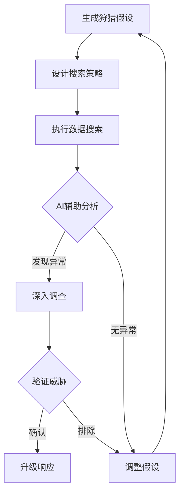

**作者：** HOS(安全风信子)
**日期：** 2026-04-23
**主要来源平台：** MITRE/CrowdStrike/SentinelOne
**摘要：** 本文深入探讨AI驱动的新一代威胁狩猎体系。传统的基于规则的威胁狩猎难以应对日益复杂的高级威胁，AI技术的引入为威胁狩猎带来了革命性的突破。本文从威胁狩猎的基本原理、AI赋能的威胁狩猎技术架构、核心算法实现、实战应用场景四维度，全面解析AI威胁狩猎的设计与实现。

@[TOC](目录)

---

# AI驱动的新一代威胁狩猎：从规则到智能的范式转变

## 1. 引言：为什么威胁狩猎需要AI

威胁狩猎是SOC的高级安全实践，通过主动搜寻隐藏威胁，发现那些被动监控无法检测到的攻击。然而，传统的威胁狩猎面临严峻挑战。

**告警疲劳困境**：现代SOC每天产生数以万计的告警，威胁狩猎人员疲于应付告警，难以投入精力进行主动狩猎。

**攻击手法进化**：攻击者的手法日益复杂，传统的特征匹配难以检测未知攻击和高级持续性威胁（APT）。

**数据海量挑战**：威胁狩猎需要分析海量安全数据，人工分析难以覆盖所有数据，发现隐藏的攻击痕迹。

**人才稀缺瓶颈**：专业的威胁狩猎人才极其稀缺，大多数企业缺乏足够的狩猎能力。

AI技术为威胁狩猎带来了新的可能性。AI系统能够从海量数据中自动发现异常模式，辅助狩猎人员生成假设、验证假设，加速威胁发现过程。

---

## 2. AI威胁狩猎技术架构

### 2.1 威胁狩猎假设生成

威胁狩猎始于假设，好的假设是成功狩猎的关键。AI系统能够自动生成威胁狩猎假设。

#### 2.1.1 基于威胁情报的假设生成

威胁情报是驱动威胁狩猎的重要来源。AI系统通过整合外部威胁情报和内部安全数据，自动生成针对性的狩猎假设。

```python
class ThreatIntelDrivenHypothesisGenerator:
    """
    威胁情报驱动的假设生成器
    基于最新威胁情报生成狩猎假设
    """
    
    def __init__(self, threat_intel_feed, internal_context):
        self.threat_intel_feed = threat_intel_feed
        self.internal_context = internal_context
        self.ttp_mapping = TTPMappingEngine()
        self.hypothesis_validator = HypothesisValidator()
        
    def generate_hypotheses(self, context=None):
        """
        生成威胁情报驱动的假设
        
        参数:
            context: 额外的上下文信息
        
        返回:
            list: 狩猎假设列表
        """
        hypotheses = []
        
        recent_intel = self.threat_intel_feed.get_recent(
            days=7,
            min_confidence=0.7
        )
        
        for intel_item in recent_intel:
            if self._is_relevant_to_environment(intel_item):
                related_hypotheses = self._generate_for_intel_item(intel_item)
                hypotheses.extend(related_hypotheses)
        
        return self._rank_and_filter_hypotheses(hypotheses)
    
    def _is_relevant_to_environment(self, intel_item):
        """判断威胁情报是否与当前环境相关"""
        relevant_indicators = ['apt', 'ransomware', 'targeted_attack']
        threat_type = intel_item.get('threat_type', '').lower()
        
        if any(indicator in threat_type for indicator in relevant_indicators):
            return True
        
        targeted_industries = intel_item.get('targeted_industries', [])
        if self.internal_context.get('industry') in targeted_industries:
            return True
        
        targeted_regions = intel_item.get('targeted_regions', [])
        if self.internal_context.get('region') in targeted_regions:
            return True
        
        return False
    
    def _generate_for_intel_item(self, intel_item):
        """为单个威胁情报项生成假设"""
        hypotheses = []
        
        related_ttps = intel_item.get('related_ttps', [])
        
        for ttp in related_ttps:
            hypothesis = self._create_ttp_based_hypothesis(intel_item, ttp)
            if self.hypothesis_validator.is_valid(hypothesis):
                hypotheses.append(hypothesis)
        
        if intel_item.get('indicators'):
            ioa_hypothesis = self._create_ioa_based_hypothesis(intel_item)
            if self.hypothesis_validator.is_valid(ioa_hypothesis):
                hypotheses.append(ioa_hypothesis)
        
        return hypotheses
    
    def _create_ttp_based_hypothesis(self, intel_item, ttp):
        """创建基于TTP的假设"""
        attack_pattern = self.ttp_mapping.get_attack_pattern(ttp['technique_id'])
        
        search_queries = self._generate_detection_queries(attack_pattern)
        
        required_data_sources = self._identify_required_data_sources(attack_pattern)
        
        return {
            'id': self._generate_hypothesis_id(),
            'type': 'ttp_based',
            'title': f"狩猎 {intel_item['name']} 相关的 {ttp['technique_name']} 活动",
            'assumption': (
                f"如果 {intel_item['name']} 或相关威胁组织正在针对我们，"
                f"那么应该能检测到 {ttp['technique_name']} 的行为痕迹"
            ),
            'ttps': [ttp],
            'threat_actor': intel_item.get('attributed_actor'),
            'confidence': intel_item.get('confidence', 0.7) * ttp.get('likelihood', 0.5),
            'priority': self._calculate_priority(intel_item, ttp),
            'search_queries': search_queries,
            'required_data_sources': required_data_sources,
            'expected_impact': intel_item.get('potential_impact', 'unknown'),
            'recommended_tools': self._get_recommended_tools(attack_pattern)
        }
    
    def _create_ioa_based_hypothesis(self, intel_item):
        """创建基于IOC的假设"""
        indicators = intel_item.get('indicators', [])
        
        detection_logic = self._build_detection_logic(indicators)
        
        return {
            'id': self._generate_hypothesis_id(),
            'type': 'ioa_based',
            'title': f"狩猎 {intel_item['name']} 使用的指标",
            'assumption': (
                f"如果 {intel_item['name']} 已经在我们的环境中活动，"
                f"那么应该存在相关指标（IP、域名、文件哈希等）的痕迹"
            ),
            'indicators': indicators,
            'detection_logic': detection_logic,
            'confidence': 0.85,
            'priority': 'high',
            'search_queries': self._generate_ioa_queries(indicators)
        }
    
    def _generate_detection_queries(self, attack_pattern):
        """生成检测查询"""
        queries = []
        
        for data_source in attack_pattern.get('data_sources', []):
            query = self._build_query_for_data_source(
                data_source, 
                attack_pattern
            )
            if query:
                queries.append(query)
        
        return queries
    
    def _build_query_for_data_source(self, data_source, attack_pattern):
        """为特定数据源构建查询"""
        query_templates = {
            'windows_event_log': (
                "wineventlog://{channel} "
                "WHERE {condition} "
                "TIMESPAN {timespan}"
            ),
            'network_flow': (
                "netflow://{source} "
                "WHERE destination_ip IN ({ips}) "
                "TIMESPAN {timespan}"
            ),
            'dns_query': (
                "dns://queries "
                "WHERE query_name IN ({domains}) "
                "TIMESPAN {timespan}"
            ),
            'file_activity': (
                "file://{path} "
                "WHERE operation IN ({operations}) "
                "TIMESPAN {timespan}"
            )
        }
        
        template = query_templates.get(data_source['type'])
        if not template:
            return None
        
        return template.format(
            channel=data_source.get('channel', 'Security'),
            condition=self._build_condition(attack_pattern),
            timespan=data_source.get('timespan', '7d'),
            source=data_source.get('source', 'internal'),
            ips=', '.join(attack_pattern.get('related_ips', [])),
            domains=', '.join(attack_pattern.get('related_domains', [])),
            path=data_source.get('path', 'C:\\'),
            operations=', '.join(attack_pattern.get('file_operations', []))
        )
```

#### 2.1.2 基于异常的假设生成

除了威胁情报驱动，AI系统还能通过分析环境中的异常活动来生成狩猎假设。

```python
class AnomalyDrivenHypothesisGenerator:
    """
    异常驱动的假设生成器
    基于环境中的异常活动生成狩猎假设
    """
    
    def __init__(self, anomaly_detector, baseline_manager):
        self.anomaly_detector = anomaly_detector
        self.baseline_manager = baseline_manager
        self.severity_classifier = SeverityClassifier()
        
    def generate_hypotheses(self, time_range='24h'):
        """
        生成异常驱动的假设
        
        参数:
            time_range: 分析的时间范围
        
        返回:
            list: 狩猎假设列表
        """
        detected_anomalies = self.anomaly_detector.detect(time_range)
        
        hypotheses = []
        
        for anomaly in detected_anomalies:
            if self._is_significant_anomaly(anomaly):
                hypothesis = self._create_hypothesis_from_anomaly(anomaly)
                hypotheses.append(hypothesis)
        
        return self._correlate_and_rank_hypotheses(hypotheses)
    
    def _is_significant_anomaly(self, anomaly):
        """判断异常是否显著"""
        if anomaly.get('severity') in ['high', 'critical']:
            return True
        
        if anomaly.get('anomaly_score', 0) > 0.7:
            return True
        
        if anomaly.get('is_rare_event'):
            return True
        
        return False
    
    def _create_hypothesis_from_anomaly(self, anomaly):
        """从异常创建假设"""
        anomaly_type = anomaly.get('type')
        
        hypothesis_templates = {
            'unusual_authentication': self._auth_anomaly_template,
            'unexpected_network_activity': self._network_anomaly_template,
            'privilege_escalation': self._privilege_anomaly_template,
            'data_exfiltration': self._data_exfil_template,
            'command_control': self._c2_template
        }
        
        template_func = hypothesis_templates.get(
            anomaly_type, 
            self._generic_anomaly_template
        )
        
        return template_func(anomaly)
    
    def _auth_anomaly_template(self, anomaly):
        """认证异常假设模板"""
        return {
            'id': self._generate_hypothesis_id(),
            'type': 'anomaly_based',
            'subtype': 'authentication_anomaly',
            'title': f"调查异常认证活动 - {anomaly['entity']}",
            'assumption': (
                f"如果用户 {anomaly['entity']} 的认证活动异常，"
                f"那么可能存在账户被盗用或内部威胁"
            ),
            'anomaly_details': {
                'entity': anomaly['entity'],
                'anomaly_type': anomaly['subtype'],
                'baseline': anomaly['baseline'],
                'actual': anomaly['actual'],
                'deviation': anomaly['deviation']
            },
            'confidence': min(anomaly['anomaly_score'] * 1.2, 1.0),
            'priority': self.severity_classifier.classify(anomaly),
            'investigation_steps': [
                '检查该账户的完整认证历史',
                '分析异常认证请求的特征',
                '检查是否有地理位置异常',
                '评估是否需要暂时禁用账户'
            ],
            'data_sources': [
                'authentication_logs',
                'active_directory_logs',
                'vpn_logs'
            ]
        }
    
    def _network_anomaly_template(self, anomaly):
        """网络异常假设模板"""
        return {
            'id': self._generate_hypothesis_id(),
            'type': 'anomaly_based',
            'subtype': 'network_anomaly',
            'title': f"调查异常网络流量 - {anomaly['source_ip']}",
            'assumption': (
                f"如果 {anomaly['source_ip']} 表现出异常网络行为，"
                f"那么可能已被入侵或存在数据泄露风险"
            ),
            'anomaly_details': {
                'source_ip': anomaly['source_ip'],
                'destination_ips': anomaly.get('destinations', []),
                'anomaly_type': anomaly['subtype'],
                'volume_deviation': anomaly.get('volume_deviation'),
                'protocol_usage': anomaly.get('protocol_usage')
            },
            'confidence': anomaly['anomaly_score'],
            'priority': self.severity_classifier.classify(anomaly),
            'investigation_steps': [
                '分析异常流量的详细内容',
                '检查与可疑外部IP的通信',
                '评估是否存在数据外传',
                '检查主机是否有其他异常'
            ],
            'data_sources': [
                'netflow_data',
                'dns_logs',
                'proxy_logs',
                'firewall_logs'
            ]
        }
```

### 2.2 异常行为检测引擎

AI威胁狩猎通过机器学习检测异常行为，发现潜在的攻击痕迹。

```python
class BehavioralAnomalyDetector:
    """
    行为异常检测引擎
    用于威胁狩猎的行为分析
    """
    
    def __init__(self):
        self.models = {
            'user': UserBehaviorModel(),
            'host': HostBehaviorModel(),
            'network': NetworkBehaviorModel()
        }
        self.detectors = {
            'statistical': StatisticalAnomalyDetector(),
            'ml': MLAnomalyDetector(),
            'isolation': IsolationForestDetector()
        }
    
    def detect_anomalies(self, entity_type, entity_id, time_window='7d'):
        """
        检测实体异常
        """
        # 获取行为数据
        behavior_data = self._get_behavior_data(entity_type, entity_id, time_window)
        
        # 多检测器融合
        anomaly_scores = {}
        for detector_name, detector in self.detectors.items():
            score = detector.detect(behavior_data)
            anomaly_scores[detector_name] = score
        
        # 加权融合
        fused_score = self._fusion_scores(anomaly_scores)
        
        return {
            'entity_type': entity_type,
            'entity_id': entity_id,
            'anomaly_score': fused_score,
            'is_anomalous': fused_score > 0.7,
            'contributing_factors': self._explain_anomaly(behavior_data),
            'similar_historical': self._find_similar_cases(behavior_data)
        }
```

#### 2.2.1 用户行为异常检测

用户行为异常检测是威胁狩猎的核心领域之一。AI系统通过学习用户正常行为模式，检测偏离该模式的异常活动。

```python
class UserBehaviorModel:
    """
    用户行为模型
    学习和检测用户行为异常
    """
    
    def __init__(self):
        self.baseline_profiles = {}
        self.feature_extractor = UserFeatureExtractor()
        self.model = self._load_model()
        
    def build_baseline(self, user_id, historical_data):
        """
        构建用户行为基线
        
        参数:
            user_id: 用户ID
            historical_data: 历史行为数据
        """
        features = self.feature_extractor.extract(historical_data)
        
        self.baseline_profiles[user_id] = {
            'typical_hours': self._calculate_typical_hours(features),
            'typical_locations': self._calculate_typical_locations(features),
            'typical_devices': self._calculate_typical_devices(features),
            'typical_access_patterns': self._calculate_access_patterns(features),
            'communication_patterns': self._calculate_communication_patterns(features),
            'file_access_patterns': self._calculate_file_access_patterns(features)
        }
        
        return self.baseline_profiles[user_id]
    
    def detect_anomalies(self, user_id, current_activity):
        """
        检测用户行为异常
        
        参数:
            user_id: 用户ID
            current_activity: 当前活动数据
        
        返回:
            dict: 异常检测结果
        """
        if user_id not in self.baseline_profiles:
            return {'error': 'No baseline available for user'}
        
        baseline = self.baseline_profiles[user_id]
        current_features = self.feature_extractor.extract(current_activity)
        
        anomalies = []
        
        time_anomaly = self._detect_time_anomaly(
            current_features, 
            baseline['typical_hours']
        )
        if time_anomaly:
            anomalies.append(time_anomaly)
        
        location_anomaly = self._detect_location_anomaly(
            current_features,
            baseline['typical_locations']
        )
        if location_anomaly:
            anomalies.append(location_anomaly)
        
        device_anomaly = self._detect_device_anomaly(
            current_features,
            baseline['typical_devices']
        )
        if device_anomaly:
            anomalies.append(device_anomaly)
        
        access_anomaly = self._detect_access_anomaly(
            current_features,
            baseline['typical_access_patterns']
        )
        if access_anomaly:
            anomalies.append(access_anomaly)
        
        overall_score = self._calculate_anomaly_score(anomalies)
        
        return {
            'user_id': user_id,
            'overall_score': overall_score,
            'is_anomalous': overall_score > 0.7,
            'detected_anomalies': anomalies,
            'recommendation': self._generate_recommendation(anomalies, overall_score)
        }
    
    def _calculate_typical_hours(self, features):
        """计算典型活动时间"""
        auth_times = features.get('authentication_times', [])
        
        hourly_distribution = [0] * 24
        for timestamp in auth_times:
            hour = datetime.fromtimestamp(timestamp).hour
            hourly_distribution[hour] += 1
        
        total = sum(hourly_distribution)
        if total == 0:
            return {'peak_hours': [], 'typical_range': (0, 23)}
        
        typical_hours = [
            i for i, count in enumerate(hourly_distribution)
            if count / total > 0.1
        ]
        
        return {
            'peak_hours': typical_hours,
            'distribution': hourly_distribution,
            'typical_range': self._find_typical_range(hourly_distribution)
        }
    
    def _detect_time_anomaly(self, current_features, baseline):
        """检测时间异常"""
        current_hour = current_features.get('current_hour')
        if current_hour is None:
            return None
        
        peak_hours = baseline.get('peak_hours', [])
        typical_range = baseline.get('typical_range', (0, 23))
        
        is_unusual_hour = (
            current_hour < typical_range[0] or 
            current_hour > typical_range[1]
        )
        
        is_rare_hour = current_hour not in peak_hours and len(peak_hours) > 0
        
        if is_unusual_hour or is_rare_hour:
            return {
                'type': 'time_anomaly',
                'severity': 'high' if is_unusual_hour else 'medium',
                'description': f'用户在非典型时间 {current_hour}:00 活动',
                'evidence': {
                    'current_hour': current_hour,
                    'typical_range': typical_range,
                    'peak_hours': peak_hours
                }
            }
        
        return None
    
    def _detect_location_anomaly(self, current_features, baseline):
        """检测位置异常"""
        current_locations = current_features.get('login_locations', [])
        typical_locations = baseline.get('typical_locations', set())
        
        unusual_locations = [
            loc for loc in current_locations
            if loc not in typical_locations
        ]
        
        if len(unusual_locations) > 0:
            return {
                'type': 'location_anomaly',
                'severity': 'high',
                'description': f'用户从 {len(unusual_locations)} 个新位置登录',
                'evidence': {
                    'unusual_locations': unusual_locations,
                    'typical_locations': list(typical_locations)
                }
            }
        
        return None
```

```python
class ThreatHuntingHypothesisGenerator:
    """
    威胁狩猎假设生成器
    基于威胁情报和态势感知生成狩猎假设
    """
    
    def __init__(self, threat_intel_db, asset_db, behavior_baseline):
        self.threat_intel = threat_intel_db
        self.asset_db = asset_db
        self.baseline = behavior_baseline
        self.hypothesis_templates = HypothesisTemplates()
    
    def generate_hypotheses(self, context):
        """
        生成威胁狩猎假设
        
        参数:
            context: 当前态势上下文
        
        返回:
            list: 假设列表
        """
        hypotheses = []
        
        # 1. 基于威胁情报生成假设
        intel_hypotheses = self._generate_from_threat_intel(context)
        hypotheses.extend(intel_hypotheses)
        
        # 2. 基于资产脆弱性生成假设
        vuln_hypotheses = self._generate_from_vulnerabilities(context)
        hypotheses.extend(vuln_hypotheses)
        
        # 3. 基于行为异常生成假设
        anomaly_hypotheses = self._generate_from_anomalies(context)
        hypotheses.extend(anomaly_hypotheses)
        
        # 4. 基于历史案例生成假设
        case_hypotheses = self._generate_from_historical_cases(context)
        hypotheses.extend(case_hypotheses)
        
        # 5. 排序和筛选
        ranked_hypotheses = self._rank_hypotheses(hypotheses)
        
        return ranked_hypotheses
    
    def _generate_from_threat_intel(self, context):
        """基于威胁情报生成假设"""
        hypotheses = []
        
        # 获取最新威胁情报
        recent_threats = self.threat_intel.get_recent(threat_types=['apt', 'malware'])
        
        for threat in recent_threats:
            # 生成针对该威胁的狩猎假设
            for ttp in threat.get('related_ttps', []):
                hypothesis = {
                    'id': self._generate_id(),
                    'type': 'threat_intel_driven',
                    'assumption': f"如果 {threat['name']} 在我们的环境中活动，"
                                  f"那么应该存在 {ttp['technique']} 的行为痕迹",
                    'ttps': [ttp],
                    'threat_actor': threat.get('actor'),
                    'confidence': threat.get('confidence', 0.7),
                    'priority': self._calculate_priority(threat, ttp),
                    'search_queries': self._generate_queries(ttp),
                    'estimated_danger': self._estimate_danger(threat, ttp)
                }
                hypotheses.append(hypothesis)
        
        return hypotheses
```

### 2.2 异常行为检测引擎

AI威胁狩猎通过机器学习检测异常行为，发现潜在的攻击痕迹。

```python
class BehavioralAnomalyDetector:
    """
    行为异常检测引擎
    用于威胁狩猎的行为分析
    """
    
    def __init__(self):
        self.models = {
            'user': UserBehaviorModel(),
            'host': HostBehaviorModel(),
            'network': NetworkBehaviorModel()
        }
        self.detectors = {
            'statistical': StatisticalAnomalyDetector(),
            'ml': MLAnomalyDetector(),
            'isolation': IsolationForestDetector()
        }
    
    def detect_anomalies(self, entity_type, entity_id, time_window='7d'):
        """
        检测实体异常
        """
        # 获取行为数据
        behavior_data = self._get_behavior_data(entity_type, entity_id, time_window)
        
        # 多检测器融合
        anomaly_scores = {}
        for detector_name, detector in self.detectors.items():
            score = detector.detect(behavior_data)
            anomaly_scores[detector_name] = score
        
        # 加权融合
        fused_score = self._fusion_scores(anomaly_scores)
        
        return {
            'entity_type': entity_type,
            'entity_id': entity_id,
            'anomaly_score': fused_score,
            'is_anomalous': fused_score > 0.7,
            'contributing_factors': self._explain_anomaly(behavior_data),
            'similar_historical': self._find_similar_cases(behavior_data)
        }
```

---

## 3. AI威胁狩猎实战流程

### 3.1 假设驱动狩猎流程



### 3.2 AI辅助狩猎工具链

**数据采集层**：从SIEM、EDR、网络流量、身份认证系统等采集数据。

**AI分析层**：对采集的数据进行模式识别、异常检测、关联分析。

**狩猎工作台**：为狩猎人员提供统一的操作界面，支持假设管理、搜索执行、结果分析。

---

## 4. 核心检测算法实现

### 4.1 横向移动检测

横向移动是APT攻击的关键阶段，AI能够识别异常横向移动模式。

```python
class LateralMovementDetector:
    """
    横向移动检测器
    基于序列分析和图分析的检测
    """
    
    def __init__(self):
        self.sequence_model = SequentialPatternModel()
        self.graph_analyzer = GraphAnalyzer()
    
    def detect_lateral_movement(self, auth_events):
        """
        检测横向移动
        
        参数:
            auth_events: 认证事件列表
        
        返回:
            dict: 检测结果
        """
        # 1. 构建认证图
        auth_graph = self.graph_analyzer.build_auth_graph(auth_events)
        
        # 2. 异常路径检测
        abnormal_paths = self._find_abnormal_paths(auth_graph)
        
        # 3. 序列异常检测
        sequences = self._extract_auth_sequences(auth_events)
        sequence_anomalies = self.sequence_model.detect(sequences)
        
        # 4. 融合判断
        if abnormal_paths or sequence_anomalies:
            return {
                'detected': True,
                'type': 'lateral_movement',
                'evidence': {
                    'abnormal_paths': abnormal_paths,
                    'sequence_anomalies': sequence_anomalies
                },
                'risk_level': 'high'
            }
        
        return {'detected': False}
```

#### 4.1.1 认证图分析详解

认证图是检测横向移动的核心数据结构。图中的节点代表资产或用户，边代表认证关系。通过分析认证图的模式，可以发现异常的认证路径。

```python
class AuthGraphAnalyzer:
    """
    认证图分析器
    用于检测横向移动的图分析方法
    """
    
    def __init__(self):
        self.graph_builder = GraphBuilder()
        self.path_finder = PathFinder()
        self.anomaly_scorer = AnomalyScorer()
        
    def build_auth_graph(self, auth_events):
        """
        构建认证图
        
        参数:
            auth_events: 认证事件列表
        
        返回:
            Graph: 认证图
        """
        graph = self.graph_builder.create_directed_graph()
        
        for event in auth_events:
            source = event['source_asset']
            destination = event['destination_asset']
            user = event.get('user')
            auth_type = event.get('auth_type')
            timestamp = event.get('timestamp')
            success = event.get('success', True)
            
            if not success:
                continue
            
            self.graph_builder.add_node(graph, source, node_type='asset')
            self.graph_builder.add_node(graph, destination, node_type='asset')
            
            edge_attrs = {
                'user': user,
                'auth_type': auth_type,
                'timestamp': timestamp,
                'weight': 1
            }
            self.graph_builder.add_edge(
                graph, 
                source, 
                destination, 
                **edge_attrs
            )
        
        return graph
    
    def detect_lateral_movement_paths(self, auth_graph, baseline_graph=None):
        """
        检测横向移动路径
        
        参数:
            auth_graph: 当前认证图
            baseline_graph: 基线认证图
        
        返回:
            list: 检测到的横向移动路径
        """
        lateral_movement_paths = []
        
        all_paths = self.path_finder.find_all_paths(
            auth_graph,
            max_length=5
        )
        
        for path in all_paths:
            path_score = self._score_path(path, baseline_graph)
            
            if path_score['is_lateral_movement']:
                lateral_movement_paths.append({
                    'path': path,
                    'score': path_score,
                    'evidence': self._collect_path_evidence(path)
                })
        
        return sorted(
            lateral_movement_paths, 
            key=lambda x: x['score']['risk_score'], 
            reverse=True
        )
    
    def _score_path(self, path, baseline_graph):
        """
        评估路径的横向移动可能性
        
        返回:
            dict: 评分结果
        """
        score_components = {}
        
        score_components['unusual_sequence'] = self._score_sequence_unusualness(
            path, baseline_graph
        )
        
        score_components['rare_hop'] = self._score_rare_hops(path, baseline_graph)
        
        score_components['admin_privilege'] = self._score_admin_usage(path)
        
        score_components['off_hours_activity'] = self._score_timing(path)
        
        score_components['failed_before_success'] = self._score_failed_attempts(path)
        
        total_score = sum(score_components.values()) / len(score_components)
        
        return {
            'risk_score': total_score,
            'is_lateral_movement': total_score > 0.6,
            'score_breakdown': score_components,
            'confidence': self._calculate_confidence(score_components)
        }
    
    def _score_sequence_unusualness(self, path, baseline_graph):
        """评估路径序列的异常程度"""
        if baseline_graph is None:
            return 0.5
        
        baseline_paths = baseline_graph.get('paths', [])
        
        if not baseline_paths:
            return 0.5
        
        path_signature = self._create_path_signature(path)
        
        similarity = max(
            self._calculate_similarity(path_signature, bp)
            for bp in baseline_paths
        )
        
        return 1.0 - similarity
    
    def _score_rare_hops(self, path, baseline_graph):
        """评估路径中罕见跳数的分数"""
        if baseline_graph is None:
            return 0.7
        
        rare_hop_count = 0
        total_hops = len(path) - 1
        
        for i in range(total_hops):
            hop = (path[i], path[i+1])
            hop_frequency = baseline_graph.get_hop_frequency(hop)
            
            if hop_frequency < 0.05:
                rare_hop_count += 1
        
        return rare_hop_count / total_hops if total_hops > 0 else 0
    
    def _score_admin_usage(self, path):
        """评估路径中特权使用的分数"""
        admin_usage_count = sum(
            1 for edge in path.get('edges', [])
            if edge.get('is_admin_auth')
        )
        
        return min(admin_usage_count * 0.3, 1.0)
    
    def _score_timing(self, path):
        """评估路径时间异常分数"""
        hours = [
            datetime.fromtimestamp(edge.get('timestamp', 0)).hour
            for edge in path.get('edges', [])
        ]
        
        off_hours_count = sum(
            1 for hour in hours
            if hour < 6 or hour > 22
        )
        
        return off_hours_count / len(hours) if hours else 0
    
    def _score_failed_attempts(self, path):
        """评估路径中失败后成功的分数"""
        edges = path.get('edges', [])
        
        for i in range(len(edges) - 1):
            if not edges[i].get('success') and edges[i+1].get('success'):
                return 0.8
        
        return 0.0
```

#### 4.1.2 异常认证序列检测

除了图分析方法，序列分析也是检测横向移动的重要手段。AI系统通过学习正常的认证序列模式，检测异常的认证序列。

```python
class AuthSequenceAnalyzer:
    """
    认证序列分析器
    检测异常认证序列模式
    """
    
    def __init__(self):
        self.sequence_model = SequentialPatternAnalyzer()
        self.markov_chain = MarkovChainModel()
        self.lstm_model = self._load_lstm_model()
        
    def detect_anomalous_sequences(self, auth_events):
        """
        检测异常认证序列
        
        参数:
            auth_events: 按时间排序的认证事件
        
        返回:
            list: 异常序列列表
        """
        sequences = self._extract_sequences(auth_events)
        
        anomalies = []
        
        for sequence in sequences:
            anomaly_score = self._calculate_sequence_anomaly_score(sequence)
            
            if anomaly_score > 0.7:
                anomalies.append({
                    'sequence': sequence,
                    'score': anomaly_score,
                    'type': self._classify_sequence_anomaly(sequence)
                })
        
        return anomalies
    
    def _calculate_sequence_anomaly_score(self, sequence):
        """计算序列异常分数"""
        scores = []
        
        transition_score = self.markov_chain.score_sequence(sequence)
        scores.append(1.0 - transition_score)
        
        lstm_score = self.lstm_model.predict_proba([sequence])[0]
        scores.append(lstm_score)
        
        rarity_score = self.sequence_model.calculate_rarity(sequence)
        scores.append(rarity_score)
        
        return sum(scores) / len(scores)
    
    def _classify_sequence_anomaly(self, sequence):
        """分类序列异常类型"""
        sequence_length = len(sequence)
        
        if sequence_length > 10:
            return 'excessive_lateral_movement'
        
        unique_destinations = len(set(s['destination'] for s in sequence))
        if unique_destinations > 5:
            return 'wide_lateral_movement'
        
        rapid_auth = self._check_rapid_authentication(sequence)
        if rapid_auth:
            return 'rapid_authentication'
        
        privilege_escalation = self._check_privilege_escalation(sequence)
        if privilege_escalation:
            return 'privilege_escalation_sequence'
        
        return 'unknown_anomaly'
```

### 4.2 持久化机制检测

攻击者需要建立持久化才能长期控制系统，AI能够检测多种持久化机制。

```python
class PersistenceMechanismDetector:
    """
    持久化机制检测器
    检测多种持久化建立方式
    """
    
    def __init__(self):
        self.persistence_patterns = {
            'registry': RegistryPersistencePattern(),
            'scheduled_task': ScheduledTaskPattern(),
            'service': ServiceCreationPattern(),
            'wmi': WMIPersistencePattern()
        }
    
    def detect_persistence(self, system_events):
        """
        检测持久化机制
        """
        detected_persistence = []
        
        for pattern_name, pattern in self.persistence_patterns.items():
            matches = pattern.match(system_events)
            for match in matches:
                if self._is_suspicious(match):
                    detected_persistence.append({
                        'pattern_type': pattern_name,
                        'details': match,
                        'risk_score': self._calculate_risk(match)
                    })
        
        return detected_persistence
```

#### 4.2.1 注册表持久化检测

注册表是Windows系统中最常见的持久化位置之一。攻击者通常通过修改注册表的Run键来建立持久化。

```python
class RegistryPersistencePattern:
    """
    注册表持久化检测模式
    检测注册表中的恶意持久化项
    """
    
    def __init__(self):
        self.suspicious_keys = self._build_suspicious_key_list()
        self.ml_classifier = RegistryPatternClassifier()
        
    def match(self, registry_events):
        """
        检测注册表持久化
        
        参数:
            registry_events: 注册表事件列表
        
        返回:
            list: 匹配到的持久化项
        """
        matches = []
        
        for event in registry_events:
            if not self._is_persistence_key(event):
                continue
            
            persistence_entry = {
                'timestamp': event.get('timestamp'),
                'registry_key': event.get('key_path'),
                'registry_value': event.get('value_name'),
                'value_data': event.get('value_data'),
                'action': event.get('action'),
                'process': event.get('process_name')
            }
            
            is_suspicious = self._is_suspicious_entry(persistence_entry)
            if is_suspicious:
                persistence_entry['suspicious_reason'] = is_suspicious
                matches.append(persistence_entry)
        
        return matches
    
    def _is_persistence_key(self, event):
        """判断是否是持久化相关的注册表键"""
        key_path = event.get('key_path', '').lower()
        
        persistence_paths = [
            'hkcu\\software\\microsoft\\windows\\currentversion\\run',
            'hkcu\\software\\microsoft\\windows\\currentversion\\runonce',
            'hkcu\\software\\microsoft\\windows\\currentversion\\run services',
            'hklm\\software\\microsoft\\windows\\currentversion\\run',
            'hklm\\software\\microsoft\\windows\\currentversion\\runonce',
            'hklm\\software\\microsoft\\windows\\currentversion\\run services',
            'software\\microsoft\\windows\\currentversion\\explorer\\user shell folders',
            'software\\microsoft\\windows\\currentversion\\explorer\\shell folders'
        ]
        
        for path in persistence_paths:
            if path in key_path:
                return True
        
        return False
    
    def _is_suspicious_entry(self, entry):
        """判断注册表项是否可疑"""
        reasons = []
        
        value_data = entry.get('value_data', '')
        if self._is_base64_encoded(value_data):
            reasons.append('base64_encoded_value')
        
        if self._contains_suspicious_path(value_data):
            reasons.append('suspicious_path')
        
        if self._is_uncommon_executable(value_data):
            reasons.append('uncommon_executable')
        
        if self._has_anomalous_process(entry.get('process')):
            reasons.append('anomalous_creating_process')
        
        value_name = entry.get('registry_value', '').lower()
        suspicious_names = ['update', 'backup', 'security', 'system', 'windows']
        if any(name in value_name for name in suspicious_names):
            if not any(x in value_data.lower() for x in ['microsoft', 'windows']):
                reasons.append('deceptive_value_name')
        
        return reasons if reasons else False
    
    def _is_base64_encoded(self, value_data):
        """检查是否包含Base64编码数据"""
        import re
        base64_pattern = r'^[A-Za-z0-9+/]{20,}={0,2}$'
        return bool(re.match(base64_pattern, value_data.strip()))
    
    def _contains_suspicious_path(self, value_data):
        """检查是否包含可疑路径"""
        suspicious_paths = [
            '%appdata%',
            '%temp%',
            '%localappdata%',
            '\\tmp\\',
            'downloads',
            'public\\'
        ]
        
        value_lower = value_data.lower()
        return any(path.lower() in value_lower for path in suspicious_paths)
    
    def _is_uncommon_executable(self, value_data):
        """检查是否是不常见的可执行文件"""
        common_executables = {
            'svchost.exe', 'services.exe', 'lsass.exe',
            'explorer.exe', 'cmd.exe', 'powershell.exe',
            'rundll32.exe', 'regsvr32.exe'
        }
        
        value_lower = value_data.lower()
        for exe in common_executables:
            if exe in value_lower:
                return False
        
        if '.exe' in value_lower or '.dll' in value_lower:
            return True
        
        return False
```

#### 4.2.2 计划任务持久化检测

计划任务是另一种常见的持久化机制。AI系统通过分析计划任务的创建和修改事件，检测恶意的计划任务持久化。

```python
class ScheduledTaskPattern:
    """
    计划任务持久化检测
    检测异常的计划任务创建
    """
    
    def __init__(self):
        self.task_baseline = TaskBaselineManager()
        self.ml_detector = TaskMLDetector()
        
    def match(self, task_events):
        """
        检测计划任务持久化
        
        参数:
            task_events: 计划任务事件列表
        
        返回:
            list: 匹配到的可疑任务
        """
        matches = []
        
        for event in task_events:
            if event.get('action') not in ['created', 'modified']:
                continue
            
            task_info = self._parse_task_event(event)
            
            if self._is_suspicious_task(task_info):
                matches.append({
                    'task_name': task_info['task_name'],
                    'task_path': task_info['task_path'],
                    'trigger': task_info['trigger'],
                    'action': task_info['action'],
                    'created_by': task_info.get('creator'),
                    'timestamp': event.get('timestamp'),
                    'suspicious_indicators': self._get_suspicious_indicators(task_info)
                })
        
        return matches
    
    def _is_suspicious_task(self, task_info):
        """判断计划任务是否可疑"""
        indicators = self._get_suspicious_indicators(task_info)
        return len(indicators) > 0
    
    def _get_suspicious_indicators(self, task_info):
        """获取可疑指标"""
        indicators = []
        
        task_name = task_info.get('task_name', '').lower()
        if any(x in task_name for x in ['update', 'backup', 'sync', 'check']):
            if not any(x in task_name for x in ['windows', 'microsoft', 'security']):
                indicators.append('deceptive_task_name')
        
        action = task_info.get('action', {})
        if action.get('type') == 'exec':
            cmd = action.get('command', '').lower()
            if self._is_suspicious_command(cmd):
                indicators.append('suspicious_command')
        
        trigger = task_info.get('trigger', {})
        if trigger.get('type') == 'idle' or trigger.get('type') == 'startup':
            if action.get('type') == 'exec':
                indicators.append('persistence_on_idle_startup')
        
        creator = task_info.get('creator', '')
        if creator and not self._is_trusted_creator(creator):
            indicators.append('untrusted_creator')
        
        task_path = task_info.get('task_path', '')
        if '\\temp\\' in task_path.lower() or '\\tmp\\' in task_path.lower():
            indicators.append('temp_location_task')
        
        return indicators
    
    def _is_suspicious_command(self, cmd):
        """判断命令是否可疑"""
        suspicious_patterns = [
            'powershell.*-enc',
            'powershell.*-encodedcommand',
            'cmd.*/c.*del',
            'certutil.*-decode',
            'mshta.*vbs',
            'wscript.*js',
            'cscript.*js'
        ]
        
        import re
        for pattern in suspicious_patterns:
            if re.search(pattern, cmd):
                return True
        
        return False
    
    def _is_trusted_creator(self, creator):
        """判断是否是可信的创建者"""
        trusted_creators = {
            'SYSTEM', 'NT AUTHORITY\\SYSTEM',
            ' administrators', 'NT AUTHORITY\\administrators'
        }
        
        return creator in trusted_creators
```

#### 4.2.3 服务创建持久化检测

服务是Windows系统中最高权限的持久化机制之一。AI系统通过监控服务的创建事件，检测恶意服务持久化。

```python
class ServiceCreationPattern:
    """
    服务创建持久化检测
    检测异常的服务创建事件
    """
    
    def __init__(self):
        self.service_whitelist = ServiceWhitelist()
        self.ml_detector = ServiceMLDetector()
        
    def match(self, service_events):
        """
        检测服务创建持久化
        
        参数:
            service_events: 服务事件列表
        
        返回:
            list: 可疑服务列表
        """
        matches = []
        
        for event in service_events:
            if event.get('event_type') != 'service_created':
                continue
            
            service_info = self._parse_service_event(event)
            
            if self._is_suspicious_service(service_info):
                matches.append({
                    'service_name': service_info['service_name'],
                    'display_name': service_info.get('display_name'),
                    'executable_path': service_info['path_to_binary'],
                    'service_type': service_info.get('service_type'),
                    'start_type': service_info.get('start_type'),
                    'created_by': event.get('creator'),
                    'timestamp': event.get('timestamp'),
                    'suspicious_reasons': self._get_suspicious_reasons(service_info)
                })
        
        return matches
    
    def _is_suspicious_service(self, service_info):
        """判断服务是否可疑"""
        reasons = self._get_suspicious_reasons(service_info)
        return len(reasons) > 0
    
    def _get_suspicious_reasons(self, service_info):
        """获取可疑原因"""
        reasons = []
        
        service_name = service_info.get('service_name', '')
        if self.service_whitelist.is_whitelisted(service_name):
            return reasons
        
        executable = service_info.get('path_to_binary', '').lower()
        
        if any(x in executable for x in ['\\temp\\', '\\tmp\\', '\\appdata\\']):
            reasons.append('executable_in_temp_location')
        
        if any(x in executable for x in ['.ps1', '.vbs', '.js', '.bat', '.cmd']):
            reasons.append('script_based_service')
        
        if not self._is_signed_executable(executable):
            reasons.append('unsigned_executable')
        
        service_type = service_info.get('service_type', 0)
        if service_type == 0x110:  # WIN32_OWN_PROCESS
            reasons.append('standalone_service_no_interaction')
        
        start_type = service_info.get('start_type', 0)
        if start_type == 2:  # AUTO_START
            reasons.append('auto_start_service')
        
        return reasons
```

### 4.3 数据外泄检测

数据外泄是攻击者的最终目标之一。AI系统通过监控异常的数据流动，检测潜在的数据外泄行为。

```python
class DataExfiltrationDetector:
    """
    数据外泄检测器
    检测异常的数据外泄行为
    """
    
    def __init__(self):
        self.baseline_manager = DataTransferBaselineManager()
        self.dlp_monitor = DLPMonitor()
        self.network_analyzer = NetworkFlowAnalyzer()
        
    def detect_exfiltration(self, data_transfer_events):
        """
        检测数据外泄
        
        参数:
            data_transfer_events: 数据传输事件
        
        返回:
            list: 检测到的外泄行为
        """
        exfiltration_indicators = []
        
        volume_anomalies = self._detect_volume_anomalies(data_transfer_events)
        if volume_anomalies:
            exfiltration_indicators.extend(volume_anomalies)
        
        timing_anomalies = self._detect_timing_anomalies(data_transfer_events)
        if timing_anomalies:
            exfiltration_indicators.extend(timing_anomalies)
        
        destination_anomalies = self._detect_destination_anomalies(data_transfer_events)
        if destination_anomalies:
            exfiltration_indicators.extend(destination_anomalies)
        
        content_anomalies = self._detect_content_anomalies(data_transfer_events)
        if content_anomalies:
            exfiltration_indicators.extend(content_anomalies)
        
        return self._correlate_indicators(exfiltration_indicators)
    
    def _detect_volume_anomalies(self, events):
        """检测容量异常"""
        anomalies = []
        
        for entity in self._group_by_entity(events):
            baseline = self.baseline_manager.get_baseline(entity['type'], entity['id'])
            
            if not baseline:
                continue
            
            current_volume = entity['total_bytes']
            baseline_volume = baseline.get('avg_daily_volume', 0)
            
            if baseline_volume > 0:
                volume_ratio = current_volume / baseline_volume
                
                if volume_ratio > 3.0:
                    anomalies.append({
                        'type': 'volume_anomaly',
                        'entity_type': entity['type'],
                        'entity_id': entity['id'],
                        'current_volume': current_volume,
                        'baseline_volume': baseline_volume,
                        'ratio': volume_ratio,
                        'severity': 'high' if volume_ratio > 5.0 else 'medium'
                    })
        
        return anomalies
```

### 4.4 命令与控制（C2）检测

命令与控制通信是受害者主机与攻击者服务器之间的通信链路。检测C2通信是阻止攻击的关键。

```python
class C2DetectionEngine:
    """
    C2通信检测引擎
    检测各种命令与控制通信模式
    """
    
    def __init__(self):
        self.detectors = {
            'dns_tunnel': DNSTunnelDetector(),
            'http_c2': HTTPC2Detector(),
            'covert_channel': CovertChannelDetector(),
            'beacon': BeaconingDetector()
        }
        self.ai_classifier = C2MLClassifier()
        
    def detect_c2(self, network_events):
        """
        检测C2通信
        
        参数:
            network_events: 网络事件列表
        
        返回:
            list: 检测到的C2通信
        """
        c2_indicators = []
        
        for detector_name, detector in self.detectors.items():
            detections = detector.detect(network_events)
            for detection in detections:
                detection['detector_type'] = detector_name
                c2_indicators.append(detection)
        
        ai_detections = self.ai_classifier.detect(network_events)
        for detection in ai_detections:
            detection['detector_type'] = 'ml_classifier'
            c2_indicators.append(detection)
        
        return self._correlate_c2_indicators(c2_indicators)
    
    def _correlate_c2_indicators(self, indicators):
        """关联C2指标"""
        correlated = []
        
        grouped = self._group_by_source(indicators)
        
        for source, group in grouped.items():
            if len(group) >= 2:
                correlated.append({
                    'source_ip': source,
                    'detection_count': len(group),
                    'detection_types': list(set(g['detector_type'] for g in group)),
                    'indicators': group,
                    'confidence': self._calculate_confidence(group),
                    'recommended_action': 'investigate'
                })
        
        return correlated
```

### 4.5 检测算法性能对比

| 检测算法 | 检测能力 | 误报率 | 计算开销 | 适用场景 | 局限性 |
|:---|:---|:---|:---|:---|:---|
| 规则匹配 | 已知威胁 | 低 | 低 | 快速部署 | 无法检测未知威胁 |
| 统计异常 | 行为异常 | 中 | 低 | 实时检测 | 需要足够历史数据 |
| 机器学习 | 复杂模式 | 中高 | 中 | 高级威胁 | 需要大量标注数据 |
| 深度学习 | 复杂模式 | 中 | 高 | APT检测 | 需要大量计算资源 |
| 图分析 | 关系异常 | 中 | 高 | 横向移动 | 需要完整认证数据 |
| 时序分析 | 周期性异常 | 中 | 中 | C2检测 | 需要长期数据积累 |
| 集成方法 | 综合能力 | 低 | 高 | 全方位检测 | 实现复杂度高 |

---

## 5. 结论与最佳实践

### 5.1 成功关键因素

**高质量数据**：AI模型效果依赖数据质量，确保数据采集的完整性和准确性。

**持续模型优化**：定期评估模型效果，根据新威胁持续优化模型。

**人机协同**：AI辅助而非替代人类，狩猎人员的经验和直觉仍不可少。

### 5.2 实施建议

**从小做起**：从单一场景开始，逐步扩展狩猎覆盖范围。

**聚焦高价值**：优先狩猎高风险场景，如特权账号、核心资产。

**度量效果**：建立狩猎效果评估机制，持续改进狩猎效率。

---

## 附录一：MITRE ATT&CK狩猎假设模板

| TTP | 狩猎假设模板 | 数据源 |
|:---|:---|:---|
| T1050 服务创建 | 如果攻击者建立持久化，那么会创建异常服务 | Windows事件日志 |
| T1053 计划任务 | 如果攻击者建立持久化，那么会创建异常计划任务 | Windows事件日志 |
| T1547 注册表启动项 | 如果攻击者建立持久化，那么会修改注册表启动项 | Windows事件日志 |
| T1060 注册表Run键 | 如果攻击者建立持久化，那么会修改Run键 | Windows事件日志 |

## 附录二：MITRE ATT&CK高优先级狩猎场景

| 战术阶段 | 技术ID | 技术名称 | 狩猎优先级 | 关键数据源 |
|:---|:---|:---|:---|:---|
| 初始访问 | T1190 | 利用面向公众的应用程序 | 高 | WAF日志、应用日志 |
| 初始访问 | T1133 | 外部远程服务 | 高 | VPN日志、RADIUS日志 |
| 执行 | T1059 | 命令和脚本解释器 | 高 | PowerShell日志、审计日志 |
| 执行 | T1047 | Windows管理规范 | 高 | WMI日志、Sysmon日志 |
| 持久化 | T1050 | 新建服务 | 高 | Windows事件日志、服务创建日志 |
| 持久化 | T1053 | 计划任务 | 高 | Windows事件日志、任务计划日志 |
| 持久化 | T1547 | 启动项 | 高 | 注册表监控、审计日志 |
| 权限提升 | T1068 | 利用漏洞提权 | 高 | 漏洞扫描数据、EDR告警 |
| 权限提升 | T1078 | 有效账户滥用 | 高 | 认证日志、特权账户监控 |
| 防御规避 | T1562 | 禁用安全工具 | 高 | 安全工具日志、EDR数据 |
| 防御规避 | T1070 | 清除痕迹 | 高 | 审计日志完整性检查 |
| 凭据访问 | T1003 | 从凭证存储中提取 | 高 | LSASS访问日志、内存转储检测 |
| 凭据访问 | T1110 | 暴力破解 | 高 | 认证失败日志、账户锁定日志 |
| 发现 | T1046 | 网络服务扫描 | 中 | NetFlow、网络分割日志 |
| 发现 | T1087 | 账户发现 | 中 | 认证日志、目录服务日志 |
| 横向移动 | T1021 | 远程服务利用 | 高 | 认证日志、RDP/SMB日志 |
| 横向移动 | T1075 | 传递哈希 | 高 | NTLM认证日志、Kerberos日志 |
| 收集 | T1005 | 本地步点数据 | 中 | DLP日志、文件访问日志 |
| 收集 | T1039 | 网络共享步点数据 | 中 | 文件访问日志、网络监控 |
| 外泄 | T1041 | 外泄通道 | 高 | NetFlow、DNS监控、外发代理日志 |
| 命令控制 | T1071 | 应用层协议 | 高 | 网络流量分析、DNS监控 |
| 命令控制 | T1105 | 入口工具转移 | 高 | 网络防火墙日志、代理日志 |

## 附录三：AI威胁狩猎平台评估指标

评估AI威胁狩猎平台效果的关键指标体系：

| 指标类别 | 指标名称 | 计算公式 | 目标值 | 重要性 |
|:---|:---|:---|:---|:---|
| 发现能力 | 威胁检出率 | 检出威胁数/实际威胁数 | >85% | 关键 |
| 发现能力 | 未知威胁发现率 | 未知威胁数/总威胁数 | >30% | 关键 |
| 发现能力 | 狩猎覆盖TTP率 | 已覆盖TTP数/总TTP数 | >70% | 高 |
| 准确性 | 误报率 | 误报数/总告警数 | <15% | 关键 |
| 准确性 | 准确率 | 准确判断数/总判断数 | >90% | 高 |
| 准确性 | 精确率 | 真阳性/(真阳性+假阳性) | >80% | 高 |
| 准确性 | 召回率 | 真阳性/(真阳性+假阴性) | >85% | 高 |
| 效率 | 平均检测时间(MTTD) | 总检测时间/威胁数 | <24h | 关键 |
| 效率 | 平均响应时间(MTTR) | 总响应时间/威胁数 | <4h | 高 |
| 效率 | 狩猎自动化率 | 自动狩猎数/总狩猎数 | >60% | 中 |
| 效果 | 钓鱼攻击阻断率 | 阻断钓鱼攻击数/钓鱼攻击总数 | >95% | 关键 |
| 效果 | 数据泄露防护率 | 成功防护数据泄露数/泄露尝试数 | >90% | 关键 |
| 效果 | 横向移动阻断率 | 阻断横向移动数/横向移动总数 | >85% | 高 |

## 附录四：AI威胁狩猎工具链推荐

### 数据采集层工具

| 工具类型 | 推荐产品 | 关键能力 | 适用场景 |
|:---|:---|:---|:---|
| SIEM | Splunk, Elastic, Microsoft Sentinel | 日志采集、存储、搜索 | 全平台日志管理 |
| EDR | CrowdStrike, SentinelOne, Microsoft Defender | 终端行为采集 | Windows终端监控 |
| NDR | Darktrace, Vectra, ExtraHop | 网络流量分析 | 网络行为分析 |
| 身份日志 | Azure AD, Okta, Ping Identity | 身份认证日志 | 身份威胁狩猎 |
| 漏洞扫描 | Tenable, Qualys, Rapid7 | 漏洞发现 | 脆弱性评估 |

### AI分析层工具

| 工具类型 | 推荐产品 | 关键能力 | 适用场景 |
|:---|:---|:---|:---|
| 威胁狩猎平台 | AlphaSOC, Thinkst Canary | 自动化狩猎 | 威胁狩猎 |
| 用户行为分析 | Exabeam, Securonix, Microsoft Cloud App Security | UEBA分析 | 用户异常检测 |
| 网络分析 | Core Security, Infocyte | 网络行为分析 | 网络威胁狩猎 |
| 威胁情报 | Recorded Future, Mandiant, MISP | 威胁情报整合 | 情报驱动狩猎 |

### 响应自动化工具

| 工具类型 | 推荐产品 | 关键能力 | 适用场景 |
|:---|:---|:---|:---|
| SOAR | Splunk SOAR, Palo Alto XSOAR, Tines | 自动化响应 | 安全编排 |
| 隔离工具 | CrowdStrike Fusion, Azure NSC | 网络隔离 | 威胁遏制 |
| 终端隔离 | SentinelOne, Carbon Black | 终端隔离 | 终端响应 |

## 附录五：AI威胁狩猎最佳实践清单

### 第一阶段：基础建设（1-3月）

- [ ] 部署全面的日志采集基础设施
- [ ] 配置SIEM平台并完成数据源集成
- [ ] 建立资产清单和分类体系
- [ ] 部署EDR解决方案
- [ ] 配置NetFlow或NDR解决方案
- [ ] 建立基本的告警规则和检测逻辑

### 第二阶段：AI能力建设（3-6月）

- [ ] 建立用户行为基线（至少90天数据）
- [ ] 部署机器学习异常检测模型
- [ ] 建立威胁情报集成
- [ ] 开发假设生成自动化能力
- [ ] 建立假阳性反馈机制
- [ ] 评估和优化检测模型

### 第三阶段：高级狩猎能力（6-9月）

- [ ] 开发横向移动检测能力
- [ ] 部署持久化机制检测
- [ ] 建立C2通信检测
- [ ] 开发数据外泄检测
- [ ] 实施MITRE ATT&CK映射
- [ ] 建立狩猎场景库

### 第四阶段：自动化和优化（9-12月）

- [ ] 开发SOAR集成
- [ ] 建立自动响应工作流
- [ ] 实施威胁狩猎度量体系
- [ ] 定期狩猎演练和评估
- [ ] 持续优化检测规则和模型
- [ ] 建立狩猎知识库

## 附录六：典型APT攻击狩猎案例

### 案例一：检测APT29模仿攻击

**背景**：APT29是一个已知的高级持续性威胁组织，主要目标是政府机构和关键基础设施。该组织使用复杂的隐藏技术来避免被传统安全工具检测。

**狩猎过程**：

1. **假设生成**：基于APT29的最新TTPs（战术、技术和程序），生成以下假设：
   - 如果APT29在我们的环境中活动，那么会存在异常的网络钴景通信
   - 如果APT29建立了持久化，那么会创建异常的计划任务
   - 如果APT29窃取凭据，那么会存在异常的LSASS进程访问

2. **数据收集**：
   - 收集过去30天的DNS查询日志
   - 收集所有计划任务创建事件
   - 收集LSASS进程访问事件
   - 收集网络流量数据进行时序分析

3. **分析执行**：
   - 使用Beaconing检测算法分析DNS查询模式
   - 使用计划任务检测规则识别可疑任务
   - 使用时序异常检测识别周期性C2通信

4. **发现结果**：
   - 发现一台服务器与已知APT29基础设施有异常的DNS查询
   - 发现一个伪装成Windows Update的计划任务
   - 发现LSASS进程被异常工具访问

**关键学习点**：
- 威胁情报驱动的狩猎能够发现传统告警系统遗漏的威胁
- 多维度数据关联分析是发现高级威胁的关键
- 行为异常检测能够发现使用隐藏技术的威胁

### 案例二：检测内部威胁数据窃取

**背景**：某公司怀疑有内部人员正在窃取敏感知识产权，但没有具体的告警或证据。

**狩猎过程**：

1. **假设生成**：
   - 如果内部人员正在窃取数据，那么会存在异常的大容量数据传输
   - 如果内部人员使用隐蔽通道，那么会存在异常的协议使用
   - 如果内部人员准备离职前窃取数据，那么会有异常的文件访问

2. **数据收集**：
   - 收集所有外发网络流量
   - 收集文件服务器访问日志
   - 收集邮件发送记录
   - 收集USB设备使用日志

3. **分析执行**：
   - 使用数据外泄检测算法分析外发流量
   - 分析员工文件访问模式的变化
   - 检查异常的文件打包和传输行为

4. **发现结果**：
   - 发现一名员工在非工作时间频繁访问敏感文件
   - 发现该员工使用压缩工具将多个文件打包
   - 发现该员工将打包文件上传到个人云存储

**关键学习点**：
- 用户行为分析能够有效检测内部威胁
- 上下文相关的异常检测比单纯的阈值检测更有效
- 数据外泄检测需要结合网络和行为两个维度

## 附录七：威胁狩猎报告模板

```markdown
# 威胁狩猎报告

## 基本信息
- **狩猎ID**: [自动生成]
- **狩猎日期**: YYYY-MM-DD
- **狩猎人员**: [姓名]
- **狩猎时长**: [时长]

## 狩猎假设
### 主假设
[描述主要狩猎假设]

### 子假设
1. [子假设1]
2. [子假设2]
3. [子假设3]

## 数据源
- [数据源1]
- [数据源2]
- [数据源3]

## 分析方法
- [分析方法1]
- [分析方法2]

## 发现
### 关键发现
| 发现ID | 描述 | 严重程度 | 置信度 |
|:---|:---|:---|:---|
| F001 | [描述] | 高 | 90% |
| F002 | [描述] | 中 | 75% |

### 关联指标
| 类型 | 值 | 来源 |
|:---|:---|:---|
| IP | xxx.xxx.xxx.xxx | DNS日志 |
| 域名 | suspicious.domain | DNS日志 |
| 文件哈希 | abc123... | EDR |

## 响应建议
- [建议1]
- [建议2]

## 附录
- 原始查询
- 完整日志
- 证据截图

## 结论
[狩猎结论和建议后续行动]
```

## 附录八：AI威胁狩猎技术术语表

| 术语 | 英文全称 | 定义 |
|:---|:---|:---|
| APT | Advanced Persistent Threat | 高级持续性威胁，指具有高度隐蔽性和持续性的攻击 |
| ATT&CK | Adversarial Tactics, Techniques & Common Knowledge | 对抗性战术、技术和常识知识库 |
| C2 | Command and Control | 命令与控制，攻击者与受害者通信的机制 |
| EDR | Endpoint Detection and Response | 端点检测与响应 |
| IOA | Indicator of Attack | 攻击指标，表示正在发生攻击的证据 |
| IOC | Indicator of Compromise | 妥协指标，表示已被入侵的证据 |
| MTTD | Mean Time To Detect | 平均检测时间 |
| MTTR | Mean Time To Respond | 平均响应时间 |
| NDR | Network Detection and Response | 网络检测与响应 |
| SIEM | Security Information and Event Management | 安全信息和事件管理 |
| SOAR | Security Orchestration, Automation and Response | 安全编排、自动化和响应 |
| UEBA | User and Entity Behavior Analytics | 用户和实体行为分析 |

## 附录九：威胁狩猎成熟度模型

| 成熟度级别 | 名称 | 特征 | 组织能力 |
|:---|:---|:---|:---|
| 1级 | 初始级 | 被动响应告警，无主动狩猎 | 基础安全运营 |
| 2级 | 基础级 | 基于规则的告警，有简单IOC匹配 | 事件响应能力 |
| 3级 | 规范级 | 有正式狩猎流程，基于威胁情报狩猎 | 威胁情报运营 |
| 4级 | 先进级 | AI辅助假设生成，行为异常检测 | 主动防御能力 |
| 5级 | 优化级 | 全自动化狩猎，持续优化 | 智能安全运营 |

## 附录十：常见威胁狩猎场景检查清单

### 初始访问阶段检查清单

- [ ] 检查VPN/远程访问服务的暴力破解尝试
- [ ] 检查钓鱼邮件的链接点击和附件打开情况
- [ ] 检查面向公众服务的漏洞利用尝试
- [ ] 检查无线网络是否有未授权设备
- [ ] 检查是否有从外部直接访问内网服务的尝试
- [ ] 检查供应链攻击迹象

### 执行阶段检查清单

- [ ] 检查PowerShell脚本执行历史
- [ ] 检查Windows Script Host执行记录
- [ ] 检查是否有异常的可执行文件下载
- [ ] 检查是否有可疑的LOLBAS技术使用
- [ ] 检查是否有异常的批处理或脚本文件创建
- [ ] 检查是否有来自异常位置的命令行活动

### 持久化阶段检查清单

- [ ] 检查注册表Run键是否被修改
- [ ] 检查是否有新增的计划任务
- [ ] 检查是否有新增的服务
- [ ] 检查WMI事件订阅是否异常
- [ ] 检查启动文件夹是否有新增项
- [ ] 检查是否有影子凭据攻击痕迹

### 权限提升阶段检查清单

- [ ] 检查是否有本地管理员权限提升
- [ ] 检查是否有令牌操纵攻击痕迹
- [ ] 检查是否有UAC绕过技术使用
- [ ] 检查是否有域权限提升攻击
- [ ] 检查是否有绕过用户账户控制的行为
- [ ] 检查是否有DLL劫持攻击

### 防御规避阶段检查清单

- [ ] 检查安全工具是否被禁用
- [ ] 检查日志是否被清除或篡改
- [ ] 检查是否有进程注入攻击
- [ ] 检查是否有恶意驱动程序加载
- [ ] 检查是否有Rootkit感染迹象
- [ ] 检查是否有可疑的进程 hollowing

### 凭据访问阶段检查清单

- [ ] 检查LSASS进程是否有异常访问
- [ ] 检查是否有密码dump工具使用
- [ ] 检查SAM数据库是否被读取
- [ ] 检查Kerberos票据是否被窃取
- [ ] 检查是否有密码喷洒攻击
- [ ] 检查浏览器凭据是否被窃取

### 横向移动阶段检查清单

- [ ] 检查远程服务利用痕迹
- [ ] 检查Pass-the-Hash攻击
- [ ] 检查是否有异常的文件共享访问
- [ ] 检查远程桌面使用是否异常
- [ ] 检查内网扫描活动
- [ ] 检查端口转发或 tunneling 活动

### 命令控制阶段检查清单

- [ ] 检查是否有异常的DNS查询
- [ ] 检查是否有可疑的HTTP/HTTPS通信
- [ ] 检查是否有加密协议隧道
- [ ] 检查是否有后门通信
- [ ] 检查是否有DNS隧道活动
- [ ] 检查是否有跳板攻击痕迹

### 影响阶段检查清单

 - [ ] 检查是否有数据加密勒索迹象
 - [ ] 检查是否有数据外泄前兆
 - [ ] 检查系统可用性是否受影响
 - [ ] 检查是否有数据篡改痕迹
 - [ ] 检查是否有凭证失效
 - [ ] 检查是否有销毁证据行为

## 附录十一：威胁狩猎资源推荐

### 官方参考资料

- MITRE ATT&CK官方文档
- NIST网络安全框架
- SANS威胁狩猎研究报告
- Verizon数据泄露报告

### 威胁情报来源

- MISP开源威胁情报平台
- AlienVault OTX威胁情报社区
- ThreatConnect威胁情报平台
- IBM X-Force威胁情报

### 学习资源

 - SANS SEC555威胁狩猎课程
 - MITRE ATT&CK防御评估
 - CrowdStrike威胁狩猎最佳实践
 - Microsoft威胁狩猎指南

### 工具资源

 - Elastic Security威胁狩猎平台
 - Splunk ES威胁狩猎应用
 - OpenDXL威胁情报集成
 - GRR Rapid Response远程取证框架
 - Velociraptor开源取证平台
 - Osquery终端查询框架
 - Kali Linux渗透测试发行版
 - Volatility内存取证框架
 - YARA恶意软件规则编写工具
 - MITRE ATT&CK导航器可视化工具
 - Cuckoo沙箱恶意软件分析系统
 - DomainTools域名情报分析平台
 - AbuseIPD恶意IP数据库查询工具
 - VirusTotal在线恶意文件分析平台
 - Hybrid Analysis混合分析平台
 - Joe Sandbox云端沙箱分析系统
 - ANY.RUN交互式恶意软件分析平台
 - Intezer基于代码分析的恶意软件检测平台

---

**关键词：** AI威胁狩猎，假设驱动狩猎，行为异常检测，横向移动检测，持久化检测，MITRE ATT&CK，APT检测，人机协同
