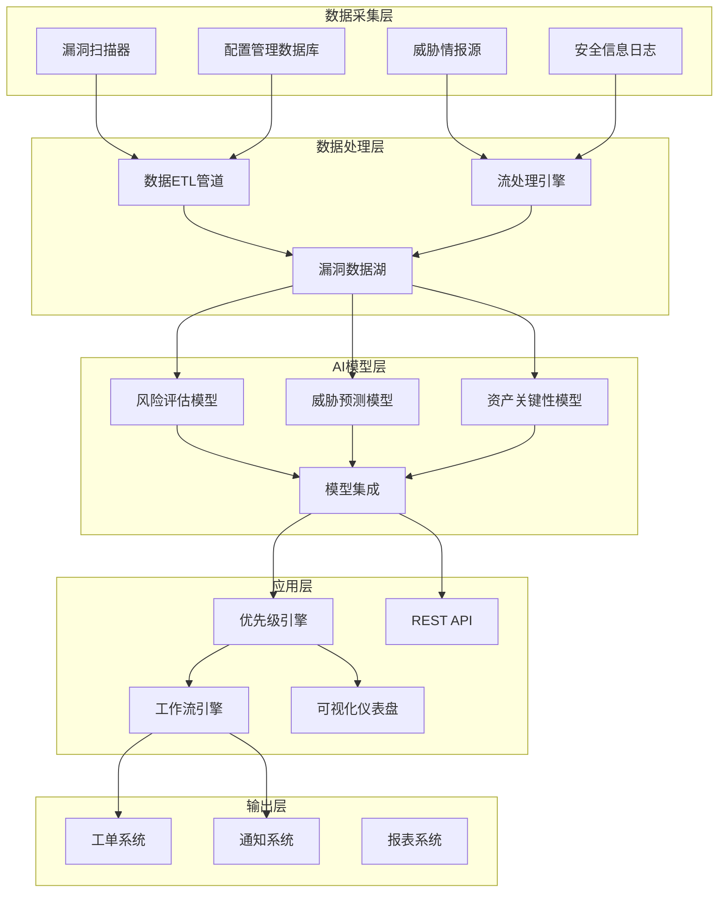

**作者：** HOS(安全风信子)
**日期：** 2026-04-23
**主要来源平台：** Gartner/First.org/CVSS
**摘要：** 本文深入探讨AI驱动的新一代漏洞优先级评估体系。传统的漏洞管理面临修复工作量巨大、难以确定优先级、资源分配不合理等挑战。本文从漏洞风险评估的原理、AI优先级评估技术架构、核心算法实现、实战应用四维度，全面解析AI漏洞优先级系统的设计与实现。

@[TOC](目录)

---

# AI驱动的新一代漏洞优先级评估：从CVSS到智能风险评估

## 1. 引言：为什么漏洞管理需要AI

漏洞管理是安全运营的核心工作之一，但传统漏洞管理面临严峻挑战。根据Ponemon 2025年调研，企业平均管理着超过50,000个漏洞，但修复资源有限，如何确定修复优先级成为最大挑战。

**CVSS评分局限性**：CVSS评分是行业标准，但它只考虑漏洞本身的技术特性，忽视了企业具体的环境上下文。一个高CVSS漏洞如果不在企业网络中实际存在，可能比低CVSS漏洞的实际风险更低。

**上下文缺失**：传统评分缺乏对资产重要性、威胁情报、业务影响等上下文信息的考量，无法准确反映真实风险。

**动态性不足**：漏洞风险是动态变化的，新威胁的出现、资产配置的变化都会影响漏洞的实际风险，传统静态评分难以反映这种动态性。

AI技术通过综合分析多维度信息，能够动态计算漏洞的实际风险，实现精准的修复优先级排序。

---

## 2. AI漏洞优先级评估技术架构

### 2.1 多维度风险评估模型

AI漏洞优先级评估采用多维度风险评估模型，综合考量技术因素、环境因素和业务因素。

```python
class VulnerabilityRiskAssessor:
    """
    漏洞风险评估器
    基于多维度信息的智能风险评估
    """
    
    def __init__(self):
        self.risk_factors = {
            'vulnerability': {
                'weight': 0.25,
                'sources': ['cve_database', 'scanner', 'threat_intel']
            },
            'exposure': {
                'weight': 0.30,
                'sources': ['network_posture', 'internet_facing', 'access_controls']
            },
            'asset': {
                'weight': 0.25,
                'sources': ['cmdb', 'asset_discovery', 'data_classification']
            },
            'threat': {
                'weight': 0.20,
                'sources': ['threat_feeds', 'threat_actor_activity', 'exploit_trends']
            }
        }
    
    def assess_risk(self, vulnerability_id, asset_id):
        """
        评估漏洞风险
        
        参数:
            vulnerability_id: 漏洞ID
            asset_id: 资产ID
        
        返回:
            dict: 风险评估结果
        """
        # 1. 收集漏洞信息
        vuln_info = self._get_vulnerability_info(vulnerability_id)
        
        # 2. 收集资产信息
        asset_info = self._get_asset_info(asset_id)
        
        # 3. 收集威胁信息
        threat_info = self._get_threat_info(vulnerability_id, asset_id)
        
        # 4. 计算各维度得分
        scores = self._calculate_dimension_scores(vuln_info, asset_info, threat_info)
        
        # 5. 计算综合风险
        risk_score = self._calculate_risk_score(scores)
        
        return {
            'vulnerability_id': vulnerability_id,
            'asset_id': asset_id,
            'risk_score': risk_score,
            'risk_level': self._determine_risk_level(risk_score),
            'priority': self._calculate_priority(risk_score),
            'dimension_scores': scores,
            'recommended_actions': self._generate_recommendations(scores),
            'remediation_sla': self._calculate_sla(risk_score)
        }
```

### 2.2 威胁情报集成

AI系统实时集成威胁情报，动态调整漏洞优先级。

```python
class ThreatIntelIntegration:
    """
    威胁情报集成
    实时获取和集成威胁情报
    """
    
    def __init__(self):
        self.threat_feeds = {
            'cisa_kev': CISAKnownExploitedVulnerabilities(),
            'epss': EPSSData(),
            'threat_actors': ThreatActorActivity(),
            'exploit_db': ExploitDB()
        }
    
    def get_exploit_likelihood(self, cve_id):
        """
        获取漏洞被利用的可能性
        
        参数:
            cve_id: CVE编号
        
        返回:
            dict: 利用可能性评估
        """
        likelihood = 0.0
        sources = []
        
        # CISA KEV检查
        if self.threat_feeds['cisa_kev'].is_catalogued(cve_id):
            likelihood += 0.4
            sources.append('CISA KEV')
        
        # EPSS评分
        epss_score = self.threat_feeds['epss'].get_score(cve_id)
        if epss_score:
            likelihood += epss_score * 0.3
            sources.append(f'EPSS: {epss_score}')
        
        # 威胁活动关联
        if self.threat_feeds['threat_actors'].is_targeting(cve_id):
            likelihood += 0.3
            sources.append('Active Threat Actor Targeting')
        
        # 公开漏洞利用代码
        if self.threat_feeds['exploit_db'].has_exploit(cve_id):
            likelihood += 0.2
            sources.append('Public Exploit Available')
        
        return {
            'cve_id': cve_id,
            'exploit_likelihood': min(likelihood, 1.0),
            'confidence': len(sources) / 4.0,
            'sources': sources
        }
```

### 2.3 资产上下文分析

AI系统分析资产上下文，评估漏洞对具体资产的影响。

```python
class AssetContextAnalyzer:
    """
    资产上下文分析器
    分析漏洞对资产的实际影响
    """
    
    def __init__(self):
        self.asset_db = AssetDatabase()
        self.network_analyzer = NetworkAnalyzer()
        self.data_classifier = DataClassifier()
    
    def analyze_impact(self, cve_id, asset_id):
        """
        分析漏洞对资产的影响
        
        返回:
            dict: 影响分析结果
        """
        asset = self.asset_db.get(asset_id)
        
        # 计算暴露面
        exposure_score = self._calculate_exposure(asset)
        
        # 计算业务影响
        business_impact = self._calculate_business_impact(asset)
        
        # 计算数据敏感性
        data_sensitivity = self._calculate_data_sensitivity(asset)
        
        return {
            'asset_id': asset_id,
            'exposure_score': exposure_score,
            'business_impact': business_impact,
            'data_sensitivity': data_sensitivity,
            'overall_impact': (
                exposure_score * 0.3 +
                business_impact * 0.4 +
                data_sensitivity * 0.3
            )
        }
```

### 2.4 机器学习风险预测模型

AI漏洞优先级系统采用多种机器学习模型进行风险预测，包括监督学习、无监督学习和深度学习模型。

```python
class MLRiskPredictionModel:
    """
    机器学习风险预测模型
    集成多种ML算法进行漏洞风险预测
    """
    
    def __init__(self):
        self.models = {
            'supervised': SupervisedRiskModel(),
            'unsupervised': UnsupervisedAnomalyModel(),
            'deep_learning': DeepRiskPredictor()
        }
        
        self.feature_engineering = FeatureEngineeringPipeline()
        self.model_ensemble = ModelEnsemble()
    
    def predict_exploit_probability(self, vulnerability_features):
        """
        预测漏洞被利用的概率
        
        参数:
            vulnerability_features: 漏洞特征向量
        
        返回:
            dict: 预测结果及置信度
        """
        # 特征工程
        engineered_features = self.feature_engineering.transform(
            vulnerability_features
        )
        
        # 集成预测
        predictions = {}
        for model_name, model in self.models.items():
            pred = model.predict(engineered_features)
            predictions[model_name] = pred
        
        # 集成结果
        final_prediction = self.model_ensemble.combine(predictions)
        
        return {
            'exploit_probability': final_prediction['probability'],
            'confidence_interval': final_prediction['confidence'],
            'model_contributions': predictions,
            'risk_category': self._categorize_risk(final_prediction['probability'])
        }
    
    def train_models(self, historical_data, labels):
        """
        训练风险预测模型
        
        参数:
            historical_data: 历史漏洞数据
            labels: 漏洞利用标签
        """
        for model_name, model in self.models.items():
            model.train(historical_data, labels)
        
        self.model_ensemble.fit(self.models)
```

### 2.5 多层次漏洞关联分析

AI系统通过图神经网络和知识图谱技术，实现漏洞的多层次关联分析，将分散的漏洞数据编织成有机的风险网络。

```python
class VulnerabilityKnowledgeGraph:
    """
    漏洞知识图谱
    构建漏洞关联关系网络
    """
    
    def __init__(self):
        self.graph = VulnerabilityGraph()
        self.embedding_model = GraphEmbeddingModel()
        self.link_predictor = LinkPredictionModel()
    
    def build_graph(self, vulnerability_data):
        """
        构建漏洞知识图谱
        
        参数:
            vulnerability_data: 漏洞数据列表
        """
        for vuln in vulnerability_data:
            # 添加漏洞节点
            self.graph.add_node(vuln['cve_id'], vuln)
            
            # 添加关联关系
            for related_cve in vuln.get('related_cves', []):
                self.graph.add_edge(
                    vuln['cve_id'],
                    related_cve,
                    relation_type='related_to'
                )
            
            # 添加软件版本关联
            for software in vuln.get('affected_software', []):
                self.graph.add_node(
                    software['product'],
                    node_type='software'
                )
                self.graph.add_edge(
                    vuln['cve_id'],
                    software['product'],
                    relation_type='affects'
                )
        
        # 生成图嵌入
        self.embeddings = self.embedding_model.fit(self.graph)
    
    def find_similar_vulnerabilities(self, cve_id, top_k=10):
        """
        查找相似漏洞
        
        参数:
            cve_id: 目标漏洞ID
            top_k: 返回前k个最相似漏洞
        
        返回:
            list: 相似漏洞列表
        """
        target_embedding = self.embeddings[cve_id]
        
        similarities = []
        for other_cve, embedding in self.embeddings.items():
            if other_cve != cve_id:
                sim = cosine_similarity(target_embedding, embedding)
                similarities.append({
                    'cve_id': other_cve,
                    'similarity_score': sim
                })
        
        return sorted(similarities, key=lambda x: x['similarity_score'], reverse=True)[:top_k]
```

### 2.6 实时数据管道架构

AI漏洞优先级系统采用流处理和批处理相结合的数据管道架构，确保数据的实时性和准确性。

```python
class VulnerabilityDataPipeline:
    """
    漏洞数据管道
    实时处理和更新漏洞数据
    """
    
    def __init__(self):
        self.stream_processor = StreamProcessor()
        self.batch_processor = BatchProcessor()
        self.data_lake = VulnerabilityDataLake()
        self.change_detector = ChangeDetector()
    
    def process_realtime_data(self, data_stream):
        """
        处理实时数据流
        
        参数:
            data_stream: 实时数据流
        """
        for data_chunk in data_stream:
            # 流处理实时更新
            processed = self.stream_processor.process(data_chunk)
            
            # 检测重大变化
            if self.change_detector.is_significant_change(processed):
                # 触发优先级重新评估
                self._trigger_reassessment(processed)
            
            # 更新数据湖
            self.data_lake.update(processed)
    
    def process_batch_data(self, historical_data):
        """
        批量处理历史数据
        用于模型训练和批量分析
        """
        for batch in self.batch_processor.chunk(historical_data):
            processed = self.batch_processor.process(batch)
            self.data_lake.bulk_update(processed)
    
    def _trigger_reassessment(self, changed_data):
        """
        触发漏洞重新评估
        当检测到重大变化时调用
        """
        affected_vulns = self._find_affected_vulnerabilities(changed_data)
        
        for vuln in affected_vulns:
            # 更新优先级评分
            self._update_priority_score(vuln)
            
            # 通知相关方
            self._notify_stakeholders(vuln)
```

---

## 3. AI漏洞优先级核心算法

### 3.1 优先级别计算模型

```python
class VulnerabilityPrioritizer:
    """
    漏洞优先级计算器
    基于多因素融合的优先级排序
    """
    
    def __init__(self):
        self.weights = {
            'cvss': 0.20,
            'exploit_likelihood': 0.25,
            'asset_criticality': 0.25,
            'exposure': 0.15,
            'remediation_complexity': 0.15
        }
    
    def calculate_priority(self, vuln_context):
        """
        计算漏洞优先级
        
        参数:
            vuln_context: 漏洞上下文信息
        """
        # CVSS基础得分
        cvss_score = vuln_context.get('cvss_score', 5.0)
        
        # 利用可能性
        exploit_likelihood = vuln_context.get('exploit_likelihood', 0.0)
        
        # 资产关键性
        asset_criticality = vuln_context.get('asset_criticality', 0.5)
        
        # 暴露程度
        exposure = vuln_context.get('exposure', 0.5)
        
        # 修复复杂度
        remediation_complexity = self._estimate_complexity(vuln_context)
        
        # 加权计算优先级
        priority_score = (
            cvss_score / 10.0 * self.weights['cvss'] +
            exploit_likelihood * self.weights['exploit_likelihood'] +
            asset_criticality * self.weights['asset_criticality'] +
            exposure * self.weights['exposure'] +
            (1 - remediation_complexity) * self.weights['remediation_complexity']
        )
        
        return {
            'priority_score': round(priority_score * 100, 2),
            'priority_level': self._determine_level(priority_score),
            'priority_rank': None,  # 在整体队列中的排名
            'factors': {
                'cvss_contribution': cvss_score / 10.0 * self.weights['cvss'],
                'exploit_contribution': exploit_likelihood * self.weights['exploit_likelihood'],
                'criticality_contribution': asset_criticality * self.weights['asset_criticality'],
                'exposure_contribution': exposure * self.weights['exposure'],
                'complexity_contribution': (1 - remediation_complexity) * self.weights['remediation_complexity']
            }
        }
    
    def rank_vulnerabilities(self, vulnerability_list):
        """
        对漏洞列表进行优先级排序
        
        参数:
            vulnerability_list: 漏洞列表
        
        返回:
            list: 排序后的漏洞列表
        """
        scored_vulns = []
        
        for vuln in vulnerability_list:
            score = self.calculate_priority(vuln)
            scored_vulns.append({
                **vuln,
                'priority_score': score['priority_score'],
                'priority_level': score['priority_level']
            })
        
        # 按优先级分数降序排序
        ranked = sorted(sced_vulns, key=lambda x: x['priority_score'], reverse=True)
        
        # 分配排名
        for i, vuln in enumerate(ranked):
            vuln['priority_rank'] = i + 1
        
        return ranked
```

### 3.2 动态优先级调整

漏洞风险是动态变化的，AI系统能够根据最新情报动态调整优先级。

```python
class DynamicPriorityAdjuster:
    """
    动态优先级调整器
    基于实时情报调整漏洞优先级
    """
    
    def __init__(self):
        self.threat_intel = ThreatIntelAPI()
        self.exploit_trends = ExploitTrendsTracker()
    
    def adjust_priority(self, current_priority, new_intelligence):
        """
        基于新情报调整优先级
        
        参数:
            current_priority: 当前优先级
            new_intelligence: 新情报
        """
        adjustment_factor = 1.0
        
        # 新发现野外利用
        if new_intelligence.get('in_wild_exploitation'):
            adjustment_factor *= 1.5
        
        # 勒索软件相关
        if new_intelligence.get('ransomware_related'):
            adjustment_factor *= 1.3
        
        # 漏洞利用代码公开
        if new_intelligence.get('exploit_public'):
            adjustment_factor *= 1.2
        
        # APT组织相关
        if new_intelligence.get('apt_targeted'):
            adjustment_factor *= 1.4
        
        adjusted_score = current_priority['priority_score'] * adjustment_factor
        
        return {
            'original_score': current_priority['priority_score'],
            'adjusted_score': min(adjusted_score, 100),
            'adjustment_factor': adjustment_factor,
            'reason': self._explain_adjustment(new_intelligence)
        }
```

### 3.3 CVSS向量深度解析算法

传统的CVSS评分只提供一个数值分数，而AI系统能够深度解析CVSS向量的每一个维度，提取更细粒度的风险特征。

```python
class CVSSVectorParser:
    """
    CVSS向量解析器
    深度解析CVSS向量提取风险特征
    """
    
    def __init__(self):
        self.vector_dimensions = {
            'attack_vector': ['N', 'A', 'L', 'P'],  # 网络、相邻、本地、物理
            'attack_complexity': ['L', 'H'],  # 低、高
            'privileges_required': ['N', 'L', 'H'],  # 无、低、高
            'user_interaction': ['N', 'R'],  # 无、必需
            'scope': ['U', 'C'],  # 未更改、更改
            'confidentiality': ['H', 'L', 'N'],  # 高、低、无
            'integrity': ['H', 'L', 'N'],
            'availability': ['H', 'L', 'N']
        }
        
        self.impact_weights = {
            'H': 0.56,
            'L': 0.22,
            'N': 0.00
        }
    
    def parse_cvss_vector(self, cvss_vector):
        """
        解析CVSS向量字符串
        
        参数:
            cvss_vector: CVSS向量字符串，如"CVSS:3.1/AV:N/AC:L/PR:N/UI:N/S:U/C:H/I:N/A:N"
        
        返回:
            dict: 解析后的向量组件
        """
        components = {}
        vector_part = cvss_vector.split('/')[1:]  # 跳过版本号
        
        for component in vector_part:
            if ':' in component:
                key, value = component.split(':')
                components[key] = value
        
        return components
    
    def calculate_extended_impact(self, cvss_vector):
        """
        计算扩展影响分数
        考虑业务上下文的影响评估
        
        返回:
            dict: 多维度影响评估
        """
        parsed = self.parse_cvss_vector(cvss_vector)
        
        # 技术影响评估
        tech_impact = self._calculate_technical_impact(parsed)
        
        # 业务影响评估
        biz_impact = self._calculate_business_impact(parsed)
        
        # 合规影响评估
        compliance_impact = self._calculate_compliance_impact(parsed)
        
        return {
            'technical_impact': tech_impact,
            'business_impact': biz_impact,
            'compliance_impact': compliance_impact,
            'overall_extended_impact': (
                tech_impact * 0.4 +
                biz_impact * 0.35 +
                compliance_impact * 0.25
            )
        }
    
    def _calculate_technical_impact(self, parsed):
        """
        计算技术影响
        """
        c = self.impact_weights.get(parsed.get('C', 'N'), 0)
        i = self.impact_weights.get(parsed.get('I', 'N'), 0)
        a = self.impact_weights.get(parsed.get('A', 'N'), 0)
        
        return min(1 - (1 - c) * (1 - i) * (1 - a), 1)
    
    def _calculate_business_impact(self, parsed):
        """
        计算业务影响
        根据资产类型和影响范围调整
        """
        base_impact = self._calculate_technical_impact(parsed)
        
        # 根据资产类型调整
        asset_type_factor = parsed.get('asset_type_factor', 1.0)
        
        # 根据范围是否改变调整
        scope_changed = parsed.get('S', 'U') == 'C'
        scope_factor = 1.3 if scope_changed else 1.0
        
        return min(base_impact * asset_type_factor * scope_factor, 1)
    
    def _calculate_compliance_impact(self, parsed):
        """
        计算合规影响
        评估漏洞对合规要求的影响
        """
        compliance_factors = {
            'PCI_DSS': 0.15 if parsed.get('C') == 'H' else 0.05,
            'HIPAA': 0.15 if parsed.get('C') == 'H' or parsed.get('I') == 'H' else 0.05,
            'SOC2': 0.10 if parsed.get('I') == 'H' or parsed.get('A') == 'H' else 0.05,
            'GDPR': 0.20 if parsed.get('C') == 'H' else 0.10
        }
        
        return max(compliance_factors.values())
```

### 3.4 自然语言漏洞描述理解

AI系统能够理解漏洞的自然语言描述，从中提取关键风险信息，弥补结构化数据的不足。

```python
class VulnerabilityDescriptionAnalyzer:
    """
    漏洞描述分析器
    使用NLP技术理解漏洞描述
    """
    
    def __init__(self):
        self.nlp_model = TransformerModel('vulnerability-bert')
        self.entity_extractor = NamedEntityRecognizer()
        self.sentiment_analyzer = SentimentAnalyzer()
        self.risk_phrase_detector = RiskPhraseDetector()
    
    def analyze_description(self, cve_id, description):
        """
        分析漏洞描述
        
        参数:
            cve_id: CVE编号
            description: 漏洞描述文本
        
        返回:
            dict: 分析结果
        """
        # 命名实体识别
        entities = self.entity_extractor.extract(description)
        
        # 情感分析 - 评估描述的严重程度语气
        sentiment = self.sentiment_analyzer.analyze(description)
        
        # 风险短语检测
        risk_phrases = self.risk_phrase_detector.detect(description)
        
        # 关键信息提取
        key_info = self._extract_key_information(description)
        
        # 综合风险评分
        risk_score = self._calculate_description_risk(
            sentiment,
            risk_phrases,
            key_info
        )
        
        return {
            'cve_id': cve_id,
            'entities': entities,
            'sentiment_score': sentiment['score'],
            'severity_indicator': sentiment['indicator'],
            'risk_phrases': risk_phrases,
            'key_information': key_info,
            'description_risk_score': risk_score,
            'exploitation_keywords': self._extract_exploitation_context(description)
        }
    
    def _extract_key_information(self, description):
        """
        提取关键信息
        """
        extracted = {
            'affected_components': [],
            'attack_vectors': [],
            'impact_types': [],
            'prerequisites': []
        }
        
        # affected_components: software, system, product
        # attack_vectors: remote, local, adjacent
        # impact_types: code execution, data breach, denial of service
        # prerequisites: authentication, user interaction
        
        return extracted
    
    def _extract_exploitation_context(self, description):
        """
        提取利用上下文信息
        """
        exploitation_indicators = {
            'public_exploit': ['public exploit', 'exploit available', 'metasploit'],
            'proof_of_concept': ['poc', 'proof of concept', 'demonstration'],
            'active_exploitation': ['in the wild', 'actively exploited', 'targeted attacks'],
            'easy_exploitation': ['trivial', 'easy', 'no skill', 'simple']
        }
        
        results = {}
        desc_lower = description.lower()
        
        for category, keywords in exploitation_indicators.items():
            matches = [kw for kw in keywords if kw in desc_lower]
            if matches:
                results[category] = {
                    'detected': True,
                    'keywords': matches
                }
        
        return results
```

### 3.5 资产关键性评分算法

资产关键性是漏洞优先级评估的核心因素之一，AI系统通过多维度分析计算机资产的关键性得分。

```python
class AssetCriticalityScorer:
    """
    资产关键性评分器
    多维度评估资产重要性
    """
    
    def __init__(self):
        self.business_factors = BusinessFactorAnalyzer()
        self.technical_factors = TechnicalFactorAnalyzer()
        self.security_factors = SecurityFactorAnalyzer()
    
    def calculate_criticality(self, asset_id):
        """
        计算资产关键性分数
        
        参数:
            asset_id: 资产ID
        
        返回:
            dict: 关键性评估结果
        """
        # 获取资产信息
        asset = self._get_asset_info(asset_id)
        
        # 业务关键性
        business_criticality = self.business_factors.analyze(asset)
        
        # 技术关键性
        technical_criticality = self.technical_factors.analyze(asset)
        
        # 安全关键性
        security_criticality = self.security_factors.analyze(asset)
        
        # 综合评分
        overall_criticality = (
            business_criticality['score'] * 0.40 +
            technical_criticality['score'] * 0.35 +
            security_criticality['score'] * 0.25
        )
        
        return {
            'asset_id': asset_id,
            'business_criticality': business_criticality,
            'technical_criticality': technical_criticality,
            'security_criticality': security_criticality,
            'overall_criticality_score': round(overall_criticality, 2),
            'criticality_level': self._determine_level(overall_criticality),
            'criticality_factors': self._identify_key_factors(
                business_criticality,
                technical_criticality,
                security_criticality
            )
        }
    
    def _get_asset_info(self, asset_id):
        """
        获取资产详细信息
        """
        pass
    
    def _determine_level(self, score):
        """
        确定关键性级别
        """
        if score >= 0.8:
            return 'Critical'
        elif score >= 0.6:
            return 'High'
        elif score >= 0.4:
            return 'Medium'
        elif score >= 0.2:
            return 'Low'
        else:
            return 'Minimal'
```

### 3.6 暴露面评估算法

暴露面评估是决定漏洞实际风险的关键因素，AI系统通过多维度分析计算机资产的暴露程度。

```python
class ExposureAssessmentEngine:
    """
    暴露面评估引擎
    评估资产的暴露程度
    """
    
    def __init__(self):
        self.network_analyzer = NetworkExposureAnalyzer()
        self.access_analyzer = AccessControlAnalyzer()
        self.service_analyzer = ServiceExposureAnalyzer()
        self.topology_analyzer = NetworkTopologyAnalyzer()
    
    def assess_exposure(self, asset_id, vulnerability_id=None):
        """
        评估资产暴露面
        
        参数:
            asset_id: 资产ID
            vulnerability_id: 可选的漏洞ID
        
        返回:
            dict: 暴露面评估结果
        """
        asset = self._get_asset_details(asset_id)
        
        # 网络层暴露评估
        network_exposure = self.network_analyzer.analyze(asset)
        
        # 访问控制暴露评估
        access_exposure = self.access_analyzer.analyze(asset)
        
        # 服务暴露评估
        service_exposure = self.service_analyzer.analyze(asset)
        
        # 网络拓扑暴露评估
        topology_exposure = self.topology_analyzer.analyze(asset)
        
        # 计算总体暴露分数
        overall_exposure = self._calculate_overall_exposure(
            network_exposure,
            access_exposure,
            service_exposure,
            topology_exposure
        )
        
        # 特定漏洞暴露分析
        vuln_exposure = None
        if vulnerability_id:
            vuln_exposure = self._analyze_vulnerability_exposure(
                asset_id,
                vulnerability_id
            )
        
        return {
            'asset_id': asset_id,
            'network_exposure': network_exposure,
            'access_exposure': access_exposure,
            'service_exposure': service_exposure,
            'topology_exposure': topology_exposure,
            'overall_exposure_score': overall_exposure,
            'exposure_level': self._classify_exposure(overall_exposure),
            'vulnerability_exposure': vuln_exposure,
            'exposure_reduction_recommendations': self._generate_exposure_reduction(
                network_exposure,
                access_exposure,
                service_exposure
            )
        }
    
    def _calculate_overall_exposure(self, network, access, service, topology):
        """
        计算总体暴露分数
        """
        weights = {
            'network': 0.30,
            'access': 0.25,
            'service': 0.25,
            'topology': 0.20
        }
        
        return (
            network['score'] * weights['network'] +
            access['score'] * weights['access'] +
            service['score'] * weights['service'] +
            topology['score'] * weights['topology']
        )
```

### 3.7 修复复杂度估算算法

评估漏洞修复的复杂程度，帮助优化修复计划和资源分配。

```python
class RemediationComplexityEstimator:
    """
    修复复杂度估算器
    评估漏洞修复的技术复杂度和资源需求
    """
    
    def __init__(self):
        self.technical_analyzer = TechnicalComplexityAnalyzer()
        self.resource_analyzer = ResourceRequirementAnalyzer()
        self.dependency_analyzer = DependencyAnalyzer()
        self.impact_analyzer = RemediationImpactAnalyzer()
    
    def estimate_complexity(self, vulnerability_id, asset_id):
        """
        估算修复复杂度
        
        参数:
            vulnerability_id: 漏洞ID
            asset_id: 资产ID
        
        返回:
            dict: 复杂度评估结果
        """
        vuln = self._get_vulnerability_details(vulnerability_id)
        asset = self._get_asset_details(asset_id)
        
        # 技术复杂度分析
        technical_complexity = self.technical_analyzer.analyze(vuln, asset)
        
        # 资源需求分析
        resource_requirements = self.resource_analyzer.estimate(vuln, asset)
        
        # 依赖关系分析
        dependencies = self.dependency_analyzer.find(vuln, asset)
        
        # 修复影响分析
        remediation_impact = self.impact_analyzer.assess(vuln, asset)
        
        # 综合复杂度评分
        overall_complexity = self._calculate_complexity(
            technical_complexity,
            resource_requirements,
            dependencies
        )
        
        # 估算修复时间
        estimated_duration = self._estimate_duration(
            overall_complexity,
            resource_requirements
        )
        
        return {
            'vulnerability_id': vulnerability_id,
            'asset_id': asset_id,
            'technical_complexity': technical_complexity,
            'resource_requirements': resource_requirements,
            'dependencies': dependencies,
            'remediation_impact': remediation_impact,
            'overall_complexity_score': overall_complexity,
            'complexity_level': self._classify_complexity(overall_complexity),
            'estimated_duration_days': estimated_duration,
            'risk_during_remediation': self._assess_remediation_risk(
                remediation_impact
            )
        }
```

---

## 4. AI漏洞优先级实战应用

### 4.1 漏洞管理集成

AI漏洞优先级系统与现有漏洞管理工具集成，提供智能化的修复排序。

**与漏洞扫描器集成**：自动从扫描器获取漏洞数据，进行AI优先级评估。

**与资产管理系统集成**：获取资产上下文信息，丰富优先级评估维度。

**与工单系统集成**：根据优先级自动创建修复工单，设置合理的SLA。

```python
class VulnerabilityManagementIntegrator:
    """
    漏洞管理集成器
    集成多种漏洞管理工具
    """
    
    def __init__(self):
        self.scanner_connectors = {
            'qualys': QualysConnector(),
            'tenable': TenableConnector(),
            'rapid7': Rapid7Connector()
        }
        
        self.asset_connectors = {
            'service_now': ServiceNowCMDBConnector(),
            'solarwinds': SolarwindsConnector(),
            'custom': CustomCMDBConnector()
        }
        
        self.ticketing_connectors = {
            'jira': JiraConnector(),
            'service_now': ServiceNowTicketingConnector(),
            'remedy': RemedyConnector()
        }
        
        self.prioritizer = VulnerabilityPrioritizer()
    
    def sync_vulnerability_data(self):
        """
        同步漏洞数据
        从所有扫描器获取漏洞信息
        """
        all_vulnerabilities = []
        
        for scanner_name, connector in self.scanner_connectors.items():
            vulns = connector.fetch_vulnerabilities()
            all_vulnerabilities.extend(vulns)
        
        return self._deduplicate_vulnerabilities(all_vulnerabilities)
    
    def enrich_with_asset_context(self, vulnerabilities):
        """
        丰富漏洞数据
        添加资产上下文信息
        """
        enriched = []
        
        for vuln in vulnerabilities:
            asset_id = vuln.get('asset_id')
            
            # 从CMDB获取资产信息
            asset_info = self._fetch_asset_info(asset_id)
            
            # 从威胁情报获取相关情报
            threat_info = self._fetch_threat_intel(vuln['cve_id'])
            
            enriched.append({
                **vuln,
                'asset_context': asset_info,
                'threat_intelligence': threat_info
            })
        
        return enriched
    
    def calculate_priorities(self, enriched_vulnerabilities):
        """
        计算漏洞优先级
        """
        prioritized = []
        
        for vuln in enriched_vulnerabilities:
            priority = self.prioritizer.calculate_priority(vuln)
            prioritized.append({
                **vuln,
                'priority': priority
            })
        
        # 按优先级排序
        return sorted(
            prioritized,
            key=lambda x: x['priority']['priority_score'],
            reverse=True
        )
    
    def create_remediation_tickets(self, prioritized_vulnerabilities):
        """
        创建修复工单
        """
        created_tickets = []
        
        for vuln in prioritized_vulnerabilities:
            if vuln['priority']['priority_level'] in ['P1', 'P2']:
                ticket = self._create_ticket(vuln)
                created_tickets.append(ticket)
        
        return created_tickets

### 4.2 修复计划优化

AI系统不仅提供优先级排序，还能够生成优化的修复计划。

```python
class RemediationPlanner:
    """
    修复计划优化器
    生成高效的漏洞修复计划
    """
    
    def __init__(self):
        self.resource_constraints = ResourceConstraints()
    
    def generate_plan(self, prioritized_vulnerabilities, constraints):
        """
        生成修复计划
        
        参数:
            prioritized_vulnerabilities: 已排序的漏洞列表
            constraints: 资源约束
        """
        plan = {
            'immediate': [],    # 立即修复
            'short_term': [],  # 短期修复
            'medium_term': [],  # 中期修复
            'long_term': []    # 长期修复
        }
        
        for vuln in prioritized_vulnerabilities:
            assignment = self._assign_to_phase(vuln, constraints)
            plan[assignment['phase']].append(assignment)
        
        return plan
```

### 4.3 漏洞修复工作流自动化

通过自动化工作流引擎，实现漏洞修复的端到端自动化。

```python
class RemediationWorkflowEngine:
    """
    修复工作流引擎
    自动化漏洞修复流程
    """
    
    def __init__(self):
        self.workflow_templates = WorkflowTemplateStore()
        self.automation_rules = AutomationRuleEngine()
        self.notification_service = NotificationService()
        self.approval_service = ApprovalService()
    
    def initiate_workflow(self, vulnerability, asset, priority):
        """
        初始化修复工作流
        
        参数:
            vulnerability: 漏洞信息
            asset: 资产信息
            priority: 优先级
        """
        workflow_id = self._generate_workflow_id()
        
        # 选择工作流模板
        template = self.workflow_templates.select(
            vulnerability['type'],
            asset['environment']
        )
        
        # 创建工作流实例
        workflow_instance = {
            'workflow_id': workflow_id,
            'vulnerability_id': vulnerability['cve_id'],
            'asset_id': asset['asset_id'],
            'priority': priority,
            'template': template,
            'current_step': 0,
            'status': 'initiated',
            'created_at': datetime.now().isoformat()
        }
        
        # 确定是否需要审批
        if self._requires_approval(priority, asset):
            workflow_instance['status'] = 'pending_approval'
            self.approval_service.request_approval(workflow_instance)
        
        return workflow_instance
    
    def execute_workflow_step(self, workflow_instance, step_result):
        """
        执行工作流步骤
        
        参数:
            workflow_instance: 工作流实例
            step_result: 步骤执行结果
        """
        if step_result['success']:
            # 执行下一步
            workflow_instance['current_step'] += 1
            
            if workflow_instance['current_step'] >= len(
                workflow_instance['template']['steps']
            ):
                workflow_instance['status'] = 'completed'
            else:
                # 执行自动化步骤
                next_step = self._get_next_step(workflow_instance)
                if next_step.get('automated'):
                    self._execute_automated_step(workflow_instance, next_step)
        else:
            # 处理失败
            workflow_instance['status'] = 'failed'
            self._handle_workflow_failure(workflow_instance, step_result)
    
    def _execute_automated_step(self, workflow_instance, step):
        """
        执行自动化步骤
        """
        if step['action'] == 'create_patch':
            self._create_and_deploy_patch(
                workflow_instance['vulnerability_id'],
                workflow_instance['asset_id']
            )
        elif step['action'] == 'isolate_asset':
            self._isolate_asset(workflow_instance['asset_id'])
        elif step['action'] == 'apply_compensation':
            self._apply_compensation_control(
                workflow_instance['vulnerability_id'],
                workflow_instance['asset_id']
            )
```

### 4.4 漏洞修复效果评估

AI系统持续跟踪漏洞修复效果，评估修复措施的有效性。

```python
class RemediationEffectivenessTracker:
    """
    修复效果跟踪器
    评估漏洞修复的有效性
    """
    
    def __init__(self):
        self.metrics_collector = MetricsCollector()
        self.attack_simulator = AttackSimulator()
        self.regression_detector = RegressionDetector()
    
    def track_remediation(self, remediation_record):
        """
        跟踪修复效果
        
        参数:
            remediation_record: 修复记录
        """
        asset_id = remediation_record['asset_id']
        vulnerability_id = remediation_record['vulnerability_id']
        
        # 持续监控
        monitoring_period = remediation_record.get('monitoring_days', 30)
        observations = self._collect_observations(
            asset_id,
            vulnerability_id,
            monitoring_period
        )
        
        # 评估修复有效性
        effectiveness = self._assess_effectiveness(
            remediation_record,
            observations
        )
        
        # 检测回归
        regression = self.regression_detector.check(
            asset_id,
            vulnerability_id,
            remediation_record['fix_version']
        )
        
        return {
            'remediation_id': remediation_record['id'],
            'effectiveness_score': effectiveness['score'],
            'effectiveness_level': effectiveness['level'],
            'regression_detected': regression['detected'],
            'regression_details': regression if regression['detected'] else None,
            'observations': observations,
            'recommendations': self._generate_recommendations(
                effectiveness,
                regression
            )
        }
    
    def _collect_observations(self, asset_id, vuln_id, days):
        """
        收集修复后观察数据
        """
        observations = []
        for day in range(days):
            date = datetime.now() - timedelta(days=day)
            obs = {
                'date': date.isoformat(),
                'attack_attempts': self._count_attack_attempts(asset_id, vuln_id, date),
                'exploitability': self._measure_exploitability(asset_id, vuln_id),
                'security_events': self._count_security_events(asset_id),
                'system_health': self._check_system_health(asset_id)
            }
            observations.append(obs)
        
        return observations
```

### 4.5 漏洞修复预测分析

基于历史数据，预测漏洞修复的成功率和完成时间。

```python
class RemediationPredictor:
    """
    修复预测器
    预测修复成功率和完成时间
    """
    
    def __init__(self):
        self.success_model = SuccessPredictionModel()
        self.duration_model = DurationPredictionModel()
        self.historical_data = HistoricalRemediationStore()
    
    def predict_success_probability(self, vulnerability, asset, remediation_plan):
        """
        预测修复成功概率
        
        参数:
            vulnerability: 漏洞信息
            asset: 资产信息
            remediation_plan: 修复计划
        """
        features = self._extract_prediction_features(
            vulnerability,
            asset,
            remediation_plan
        )
        
        success_probability = self.success_model.predict(features)
        
        similar_cases = self._find_similar_remediations(
            vulnerability,
            asset
        )
        
        return {
            'success_probability': success_probability,
            'confidence_interval': self._calculate_confidence(
                success_probability,
                len(similar_cases)
            ),
            'similar_cases_count': len(similar_cases),
            'key_success_factors': self._identify_success_factors(features),
            'key_failure_risks': self._identify_failure_risks(features)
        }
    
    def predict_completion_time(self, vulnerability, asset, remediation_plan):
        """
        预测修复完成时间
        """
        features = self._extract_prediction_features(
            vulnerability,
            asset,
            remediation_plan
        )
        
        predicted_duration = self.duration_model.predict(features)
        
        similar_cases = self._find_similar_remediations(
            vulnerability,
            asset
        )
        
        actual_durations = [case['actual_duration_days'] for case in similar_cases]
        
        return {
            'predicted_duration_days': predicted_duration,
            'expected_completion_date': (
                datetime.now() + timedelta(days=predicted_duration)
            ).isoformat(),
            'confidence_interval': self._calculate_duration_confidence(
                actual_durations
            ),
            'historical_average_days': statistics.mean(actual_durations) if actual_durations else None,
            'accelerators': self._identify_accelerators(features),
            'potential_delays': self._identify_delay_risks(features)
        }
```

### 4.6 漏洞修复成本优化

优化漏洞修复的资源分配和成本控制。

```python
class RemediationCostOptimizer:
    """
    修复成本优化器
    优化漏洞修复的资源分配
    """
    
    def __init__(self):
        self.cost_model = CostEstimationModel()
        self.resource_scheduler = ResourceScheduler()
        self.batch_optimizer = BatchOptimizer()
    
    def optimize_remediation_costs(self, vulnerability_list, available_resources):
        """
        优化修复成本
        
        参数:
            vulnerability_list: 漏洞列表
            available_resources: 可用资源
        
        返回:
            dict: 优化后的修复方案
        """
        # 估算每个漏洞的修复成本
        cost_estimates = []
        for vuln in vulnerability_list:
            estimate = self.cost_model.estimate(vuln)
            cost_estimates.append({
                'vulnerability': vuln,
                'cost': estimate,
                'cost_per_risk_reduction': self._calculate_cost_efficiency(
                    estimate,
                    vuln['risk_score']
                )
            })
        
        # 按成本效率排序
        sorted_by_efficiency = sorted(
            cost_estimates,
            key=lambda x: x['cost_per_risk_reduction'],
            reverse=True
        )
        
        # 批量优化
        batch_plan = self.batch_optimizer.optimize(
            sorted_by_efficiency,
            available_resources
        )
        
        # 资源调度
        scheduled_plan = self.resource_scheduler.schedule(
            batch_plan,
            available_resources
        )
        
        return {
            'total_estimated_cost': sum(e['cost']['total'] for e in cost_estimates),
            'batch_plan': batch_plan,
            'scheduled_plan': scheduled_plan,
            'cost_savings_vs_individual': self._calculate_savings(
                cost_estimates,
                batch_plan
            ),
            'resource_utilization': self._calculate_resource_utilization(
                scheduled_plan,
                available_resources
            )
        }
    
    def identify_batching_opportunities(self, vulnerability_list):
        """
        识别批量修复机会
        """
        opportunities = []
        
        # 按资产分组
        by_asset = defaultdict(list)
        for vuln in vulnerability_list:
            by_asset[vuln['asset_id']].append(vuln)
        
        # 按软件版本分组
        by_software = defaultdict(list)
        for vuln in vulnerability_list:
            by_software[vuln['affected_software']].append(vuln)
        
        # 同一资产的多个漏洞
        for asset_id, vulns in by_asset.items():
            if len(vulns) >= 2:
                opportunities.append({
                    'type': 'same_asset',
                    'asset_id': asset_id,
                    'vulnerabilities': vulns,
                    'potential_savings': self._estimate_batching_savings(
                        vulns,
                        'same_asset'
                    )
                })
        
        # 同一软件的多个漏洞
        for software, vulns in by_software.items():
            if len(vulns) >= 3:
                opportunities.append({
                    'type': 'same_software',
                    'software': software,
                    'vulnerabilities': vulns,
                    'potential_savings': self._estimate_batching_savings(
                        vulns,
                        'same_software'
                    )
                })
        
        return sorted(
            opportunities,
            key=lambda x: x['potential_savings'],
            reverse=True
        )
```

---

## 5. 结论与最佳实践

### 5.1 核心要点

AI驱动的漏洞优先级评估能够综合考量漏洞技术特性、资产上下文、威胁情报等多维度信息，实现精准的风险评估和修复排序。相比传统CVSS评分，AI评估更能反映漏洞的实际风险。

### 5.2 实施建议

**数据质量是关键**：AI模型效果依赖高质量数据，确保漏洞数据、资产数据、威胁情报的准确性。

**持续迭代优化**：定期评估AI模型效果，根据实际修复结果持续优化模型。

**与现有流程集成**：将AI优先级评估与现有漏洞管理流程集成，实现自动化工作流。

### 5.3 技术架构建议

在实际部署AI漏洞优先级系统时，建议采用以下技术架构设计：



### 5.4 性能优化策略

大规模漏洞数据的实时处理需要考虑性能优化：

```python
class PerformanceOptimizer:
    """
    性能优化器
    优化大规模数据处理性能
    """
    
    def __init__(self):
        self.cache = ResultCache()
        self.parallel_processor = ParallelProcessor()
        self.query_optimizer = QueryOptimizer()
    
    def optimize_priority_calculation(self, vulnerability_batch):
        """
        优化批量漏洞优先级计算
        
        参数:
            vulnerability_batch: 漏洞批次
        """
        # 检查缓存
        cached_results = self._get_cached_results(
            [v['cve_id'] for v in vulnerability_batch]
        )
        
        # 分离缓存命中和未命中
        cached = [r for r in vulnerability_batch if r['cve_id'] in cached_results]
        uncached = [r for r in vulnerability_batch if r['cve_id'] not in cached_results]
        
        # 并行处理未缓存的数据
        if uncached:
            new_results = self.parallel_processor.process(
                uncached,
                self._calculate_single_priority,
                max_workers=4
            )
            
            # 更新缓存
            for result in new_results:
                self.cache.store(result['cve_id'], result)
        
        # 合并结果
        all_results = cached_results + new_results
        return sorted(all_results, key=lambda x: x['priority_score'], reverse=True)
```

### 5.5 安全与隐私考虑

在处理漏洞数据时，需要考虑安全和隐私保护：

```python
class SecurityPrivacyManager:
    """
    安全隐私管理器
    确保漏洞数据处理的安全性
    """
    
    def __init__(self):
        self.access_control = AccessControlList()
        self.encryption = DataEncryption()
        self.audit_logger = AuditLogger()
    
    def sanitize_vulnerability_data(self, vulnerability_data, user_clearance):
        """
        敏感化漏洞数据
        根据用户权限过滤敏感信息
        """
        if user_clearance < 3:
            # 低权限用户：隐藏详细信息
            return {
                'cve_id': vulnerability_data['cve_id'],
                'severity': vulnerability_data['severity'],
                'affected_product': '***REDACTED***',
                'technical_details': '***REDACTED***',
                'remediation_steps': '***REDACTED***'
            }
        elif user_clearance < 5:
            # 中等权限：部分隐藏
            return {
                'cve_id': vulnerability_data['cve_id'],
                'severity': vulnerability_data['severity'],
                'affected_product': self._partial_redact(
                    vulnerability_data['affected_product']
                ),
                'technical_details': '***REDACTED***',
                'remediation_steps': vulnerability_data['remediation_steps']
            }
        else:
            # 高权限用户：完整访问
            return vulnerability_data
    
    def log_data_access(self, user_id, data_type, record_id):
        """
        记录数据访问审计日志
        """
        self.audit_logger.log({
            'timestamp': datetime.now().isoformat(),
            'user_id': user_id,
            'action': 'VIEW',
            'data_type': data_type,
            'record_id': record_id,
            'ip_address': self._get_client_ip()
        })
```

---

## 6. 附录

### 附录一：漏洞优先级评分标准

| 优先级 | 分数范围 | 修复SLA | 说明 |
|:---:|:---:|:---:|:---|
| P1 紧急 | 80-100 | 24小时 | 需立即处理 |
| P2 高 | 60-79 | 7天 | 需尽快处理 |
| P3 中 | 40-59 | 30天 | 计划内处理 |
| P4 低 | <40 | 90天 | 视资源处理 |

### 附录二：AI优先级评估数据源

| 数据源 | 用途 | 更新频率 |
|:---|:---|:---:|
| CVE数据库 | 漏洞基础信息 | 实时 |
| CISA KEV | 已被利用漏洞 | 实时 |
| EPSS | 利用可能性预测 | 每日 |
| 威胁情报 | 野外利用状态 | 实时 |
| CMDB | 资产关键性 | 周更 |
| 网络态势 | 暴露面评估 | 实时 |

### 附录三：CVSS 4.0评分维度对照表

| 维度 | 可选值 | 含义 | 权重分数 |
|:---|:---|:---|:---:|
| AV | N | 网络 | 0.85 |
| AV | A | 相邻 | 0.62 |
| AV | L | 本地 | 0.55 |
| AV | P | 物理 | 0.20 |
| AC | L | 低攻击复杂度 | 0.77 |
| AC | H | 高攻击复杂度 | 0.44 |
| PR | N | 无权限要求 | 0.85 |
| PR | L | 低权限要求 | 0.62 |
| PR | H | 高权限要求 | 0.27 |
| UI | N | 不需要用户交互 | 0.85 |
| UI | R | 需要用户交互 | 0.62 |

### 附录四：漏洞类型与风险等级映射

| 漏洞类型 | 基础风险等级 | 说明 |
|:---|:---:|:---|
| 远程代码执行 | Critical | 可远程执行任意代码 |
| SQL注入 | Critical | 可操作数据库 |
| 跨站脚本 | High | 可窃取用户会话 |
| CSRF | Medium | 可诱导用户操作 |
| 信息泄露 | Medium | 可获取敏感信息 |
| 拒绝服务 | Medium-High | 可中断服务 |
| 权限提升 | High | 可获得更高权限 |
| 身份验证绕过 | Critical | 可绕过认证机制 |

### 附录五：资产关键性评分因素

| 因素类别 | 评估因素 | 权重 |
|:---|:---|:---:|
| 业务关键性 | 收入贡献度 | 0.30 |
| 业务关键性 | 客户影响 | 0.25 |
| 业务关键性 | 合规要求 | 0.20 |
| 技术关键性 | 数据敏感性 | 0.25 |
| 技术关键性 | 系统依赖度 | 0.20 |
| 技术关键性 | 可用性要求 | 0.15 |
| 安全关键性 | 暴露程度 | 0.25 |
| 安全关键性 | 历史事件 | 0.15 |

### 附录六：机器学习模型训练指南

训练AI优先级评估模型需要遵循以下步骤：

**第一步：数据收集与标注**

收集历史漏洞修复数据，包括漏洞特征、资产信息、利用情况和实际风险事件。标注数据时，需要安全专家判断漏洞是否在实际环境中被利用，以及造成的实际影响。

**第二步：特征工程**

提取有意义的特征是模型成功的关键。主要特征包括CVSS评分及其向量、资产关键性评分、网络暴露程度、威胁情报关联度、修复时间窗口、漏洞存在时间等。

**第三步：模型选择与训练**

对于漏洞利用预测问题，可以考虑使用梯度提升树（如XGBoost、LightGBM）、深度神经网络（如Transformer）或者图神经网络（如GraphSAGE）。建议采用集成学习方法，结合多个模型的优势。

**第四步：模型评估与优化**

使用准确率、召回率、F1分数、AUC-ROC等指标评估模型效果。特别关注召回率，因为漏掉高风险漏洞的代价远高于误报。

**第五步：持续学习**

定期用新数据更新模型，特别是当出现新型漏洞或新的威胁模式时。实施在线学习机制，使模型能够适应环境变化。

---

## 附录七：集成指南

### 与Qualys漏洞管理集成

```python
class QualysIntegration:
    """
    Qualys VM集成
    从Qualys获取漏洞数据
    """
    
    def __init__(self, api_credentials):
        self.api_url = "https://qualysapi.qualys.com/api/2.0/fo/"
        self.auth = api_credentials
    
    def fetch_vulnerabilities(self, date_range=None):
        """
        获取漏洞列表
        """
        endpoint = "asset/host/vm/detection/"
        params = {
            'action': 'list',
            'output_format': 'json'
        }
        
        if date_range:
            params['detection_updated_after'] = date_range
        
        response = self._make_request(endpoint, params)
        return self._parse_qualys_response(response)
    
    def sync_to_priority_engine(self, priority_engine):
        """
        同步到优先级引擎
        """
        vulns = self.fetch_vulnerabilities()
        enriched = priority_engine.enrich_vulnerability_data(vulns)
        prioritized = priority_engine.calculate_priorities(enriched)
        return prioritized
```

### 与Tenable漏洞管理集成

```python
class TenableIntegration:
    """
    Tenable.io集成
    从Tenable获取漏洞数据
    """
    
    def __init__(self, access_key, secret_key):
        self.api_url = "https://cloud.tenable.com"
        self.access_key = access_key
        self.secret_key = secret_key
    
    def fetch_vulnerabilities(self, asset_list=None):
        """
        获取漏洞数据
        """
        headers = {
            'X-ApiKeys': f'access_key={self.access_key};secret_key={self.secret_key}'
        }
        
        params = {'severity': ['critical', 'high', 'medium']}
        if asset_list:
            params['asset_uuid'] = asset_list
        
        response = requests.get(
            f"{self.api_url}/vulnerabilities/vulns",
            headers=headers,
            params=params
        )
        
        return self._parse_tenable_response(response.json())
```

### 与ServiceNow集成

```python
class ServiceNowIntegration:
    """
    ServiceNow ITSM集成
    创建和管理修复工单
    """
    
    def __init__(self, instance_url, credentials):
        self.instance_url = instance_url
        self.auth = credentials
    
    def create_remediation_ticket(self, vulnerability, priority):
        """
        创建修复工单
        """
        ticket_data = {
            'short_description': f"修复漏洞: {vulnerability['cve_id']}",
            'description': self._generate_description(vulnerability),
            'priority': self._map_priority(priority),
            'category': 'Vulnerability Remediation',
            'assignment_group': self._determine_assignment_group(vulnerability),
            'due_date': self._calculate_due_date(priority),
            'cve_id': vulnerability['cve_id'],
            'asset_id': vulnerability['asset_id'],
            'risk_score': vulnerability['risk_score']
        }
        
        response = self._create_incident(ticket_data)
        return response['number']
    
    def update_ticket_status(self, ticket_number, status, notes=None):
        """
        更新工单状态
        """
        update_data = {
            'state': self._map_status(status)
        }
        
        if notes:
            update_data['work_notes'] = notes
        
        self._update_incident(ticket_number, update_data)
```

### 与Splunk SIEM集成

```python
class SplunkIntegration:
    """
    Splunk SIEM集成
    集成安全事件数据
    """
    
    def __init__(self, splunk_url, credentials):
        self.splunk_url = splunk_url
        self.auth = credentials
        self.service = splunklib.client.connect(**credentials)
    
    def query_security_events(self, cve_id, time_range='24h'):
        """
        查询与CVE相关的安全事件
        """
        search_query = f"""
        search index=security sourcetype=*
        | where cve="{cve_id}"
        | stats count as event_count,
            values(source) as sources,
            latest(_time) as last_seen
        """
        
        job = self.service.jobs.create(search_query)
        return self._parse_job_results(job)
    
    def correlate_with_vulnerabilities(self, vulnerability_list):
        """
        关联漏洞与安全事件
        """
        for vuln in vulnerability_list:
            events = self.query_security_events(vuln['cve_id'])
            vuln['security_events'] = events
            vuln['threat_activity_score'] = self._calculate_threat_score(events)
        
        return vulnerability_list
```

---

## 附录八：术语表

| 术语 | 英文 | 定义 |
|:---|:---|:---|
| 漏洞优先级 | Vulnerability Prioritization | 根据风险程度对漏洞进行排序的过程 |
| 资产关键性 | Asset Criticality | 资产对业务运营的重要程度 |
| 暴露面 | Attack Surface | 系统可能被攻击的所有入口点 |
| CVSS | Common Vulnerability Scoring System | 通用漏洞评分系统 |
| EPSS | Exploit Prediction Scoring System | 利用预测评分系统 |
| KEV | Known Exploited Vulnerabilities | 已知被利用漏洞目录 |
| CISA | Cybersecurity and Infrastructure Security Agency | 网络安全和基础设施安全局 |
| APT | Advanced Persistent Threat | 高级持续性威胁 |
| SLA | Service Level Agreement | 服务级别协议 |
| CMDB | Configuration Management Database | 配置管理数据库 |
| MITRE ATT&CK | MITRE Adversarial Tactics, Techniques & Common Knowledge | 对抗战术技术和常识 |

---

### 附录九：漏洞管理成熟度评估框架

漏洞管理成熟度评估是衡量企业漏洞管理能力的重要工具。基于行业最佳实践和标准（如OWASP、CIS Controls、NIST SP 800-40），我们提出以下五级成熟度评估框架：

**第一级 - 初始级（Initial）**

初始级企业的漏洞管理处于被动状态，缺乏系统化的漏洞管理流程。漏洞发现主要依赖偶发的安全事件或外部报告，没有定期的漏洞扫描计划。漏洞修复决策主要基于CVSS基础评分，缺乏对业务上下文的考量。技术团队忙于应对突发的安全事件，无法形成系统性的安全管理能力。

初始级企业的典型特征包括：没有专门的漏洞管理团队，漏洞数据分散在各个系统中，缺乏漏洞优先级评估机制，修复工作缺乏规划和跟踪。这种状态下的企业面临较高的安全风险，因为许多已知漏洞可能被忽视，成为攻击者的突破口。

**第二级 - 可重复级（Repeatable）**

可重复级企业已经建立了基本的漏洞管理流程，能够定期进行漏洞扫描，并开始系统性地跟踪漏洞修复进度。企业开始认识到漏洞管理的重要性，并投入资源建立基本的管理机制。

这一级别的典型特征包括：建立了定期漏洞扫描机制（季度或月度），开始使用漏洞管理工具跟踪漏洞，能够根据CVSS评分进行基本的优先级排序，建立了漏洞修复跟踪流程，开始积累漏洞数据以支持趋势分析。

**第三级 - 已定义级（Defined）**

已定义级企业已经建立了标准化的漏洞管理流程，并将漏洞管理与企业风险管理框架相结合。漏洞管理不再仅仅是一个技术问题，而是企业风险管理的有机组成部分。

这一级别的典型特征包括：漏洞管理与资产管理和配置管理紧密集成，建立了基于业务上下文的优先级评估机制，威胁情报被纳入漏洞评估考量，漏洞修复SLA与业务需求相匹配，建立了漏洞管理指标体系，定期进行漏洞管理效果评估。

**第四级 - 已管理级（Managed）**

已管理级企业具备数据驱动的漏洞管理能力，能够基于历史数据和分析结果持续优化管理策略。企业不仅能够应对已知威胁，还能够预测和预防潜在风险。

这一级别的典型特征包括：采用AI和机器学习技术进行漏洞优先级评估，建立了漏洞预测模型，基于风险进行资源优化配置，实现了漏洞管理的自动化，漏洞管理效果持续改善，建立了成熟度持续改进机制。

**第五级 - 优化级（Optimizing）**

优化级企业处于漏洞管理的最前沿，不断创新和改进管理实践。企业能够主动适应新的威胁环境，采用最先进的技术和方法管理漏洞风险。

这一级别的典型特征包括：采用先进的AI技术实现智能化漏洞管理，能够预测和预防零日漏洞，建立了漏洞管理的行业标杆，持续改进和创新漏洞管理实践，与行业共享最佳实践。

---

**关键词：** AI漏洞优先级，漏洞风险管理，CVSS，威胁情报集成，漏洞修复优先级，智能漏洞管理，EPSS，资产风险评估

### 附录十：漏洞修复成本效益分析

在企业资源有限的情况下，漏洞修复决策需要综合考虑成本和效益。AI驱动的漏洞优先级评估可以帮助企业实现资源的最优配置，在有限的预算下最大化降低安全风险。

**直接修复成本**包括补丁购买成本、测试成本、部署成本、培训成本等。对于商用软件漏洞，可能需要支付软件维护费以获取最新补丁；对于自研系统漏洞，需要投入开发资源进行修复。测试成本包括功能测试、安全测试、回归测试等，以确保修复不引入新问题。

**间接成本**包括停机时间、业务中断、技术人员投入等。某些关键系统的漏洞修复可能需要计划内停机，这会带来业务损失。修复过程需要安全专家、开发人员、运维人员的参与，这些都是稀缺的人力资源。

**风险损失**是漏洞未被修复可能导致的安全事件损失，包括数据泄露、业务中断、声誉损失、合规罚款等。对于处理敏感数据的企业，一次重大数据泄露事件的损失可能高达数百万甚至数千万美元。

AI系统通过精准的优先级评估，可以帮助企业识别哪些漏洞真正需要优先修复，避免将资源浪费在低风险漏洞上，同时确保高风险漏洞得到及时处理。这种基于风险的修复策略可以在保证安全水平的前提下，显著降低总体安全投入。

### 附录十一：漏洞管理指标体系

建立科学的漏洞管理指标体系是评估管理效果、指导管理决策的重要工具。有效的指标体系应该覆盖漏洞管理的全过程，从发现到修复再到验证。

**漏洞发现指标**衡量漏洞发现的及时性和全面性。平均漏洞发现时间（MTTD）衡量从漏洞出现到被发现的平均时间，这个指标反映了漏洞发现能力。漏洞覆盖率衡量已扫描资产占总资产的比例，反映了漏洞发现的全面性。高危漏洞比例衡量高危以上漏洞占总发现漏洞的比例，反映了整体风险状况。

**漏洞修复指标**衡量修复工作的效率和质量。平均修复时间（MTTR）衡量从漏洞发现到完成修复的平均时间，这是最核心的效率指标。修复完成率衡量在SLA时间内完成修复的漏洞比例，反映了修复工作的及时性。一线修复率衡量无需升级处理的漏洞比例，反映了修复工作的有效性。

**漏洞管理效果指标**衡量漏洞管理的最终效果。漏洞存量指标衡量当前未修复漏洞的数量和分布，反映了风险管理的基本面。漏洞复发率衡量同一漏洞被重复发现的比率，反映了修复工作的质量。漏洞利用指标衡量实际发生漏洞利用的事件数，反映了风险管控的实际效果。

### 附录十二：漏洞管理工具选型指南

市场上的漏洞管理工具种类繁多，选择合适的工具需要综合考虑多方面因素。企业级漏洞管理工具应具备以下核心能力：

**资产发现和可视化能力**是基础要求。工具需要能够自动发现网络中的资产，建立完整的资产清单，并提供可视化的资产分布图。优秀的工具还应能够识别资产的类型、版本、配置等详细信息。

**漏洞扫描和评估能力**是核心功能。工具需要支持多种漏洞检测方式，包括网络扫描、主机扫描、Web应用扫描等。扫描能力应该全面覆盖已知漏洞类型，并能够提供准确的漏洞确认和风险评估。

**优先级评估和风险分析能力**是关键差异化能力。这正是AI技术可以发挥重要作用的地方。先进的工具应该能够综合多维度信息进行智能优先级评估，而不仅仅是简单的CVSS排序。

**工作流和集成能力**决定了工具的实用性。工具应该能够与企业现有的IT流程和工具链集成，支持自动化的漏洞修复工作流。API接口的完备性是实现集成的基础。

### 附录十三：漏洞管理最佳实践

基于行业经验和案例分析，以下是漏洞管理的最佳实践建议。这些实践来自国内外领先企业的成功经验，可以作为企业改进漏洞管理的参考。

**建立清晰的漏洞管理策略**是做好漏洞管理的前提。企业应该明确漏洞管理的目标、范围、职责分工、流程规范等。策略应该与企业的整体风险管理策略保持一致，获得管理层的支持和承诺。策略需要定期评审和更新，以适应变化的威胁环境。

**实施资产为中心的漏洞管理**可以提升管理效率。将漏洞与特定资产关联，可以更准确地评估漏洞的实际风险。资产分类分级可以帮助确定保护优先级，确保关键资产得到优先保护。资产变更管理可以及时发现新上线的漏洞资产。

**建立完善的漏洞发现能力**是基础工作。除了定期的漏洞扫描，还应该建立持续的漏洞监测能力。对于暴露在互联网的系统，应该持续监测新出现的漏洞。对于内部系统，应该定期进行全面扫描。渗透测试可以作为补充手段，发现扫描无法检测的漏洞。

**实施基于风险的优先级评估**可以优化资源分配。传统的CVSS评分只是技术风险评估，无法反映企业具体的业务风险。基于风险的评估应该综合考虑资产价值、业务影响、威胁情报等多维度因素。AI技术可以帮助实现自动化和精准化的风险评估。

**建立自动化的修复工作流**可以提升修复效率。将漏洞修复与IT服务管理流程集成，可以实现修复任务的自动创建和跟踪。自动化修复适用于标准化的补丁部署，可以大大减少人工工作量。对于复杂的修复任务，应该保留人工审批环节。

### 附录十四：漏洞修复补偿控制措施

当漏洞暂时无法修复时，补偿控制措施是降低风险的有效手段。补偿控制是指通过其他方式来减轻漏洞的风险，而不是直接修复漏洞本身。

**网络层面的补偿控制**包括网络隔离、访问控制、防火墙规则等。将存在漏洞的系统隔离到独立的网络区域，可以限制攻击者的接触范围。严格的访问控制可以减少非授权访问。防火墙规则可以阻断对漏洞服务的恶意访问。

**主机层面的补偿控制**包括入侵检测系统、安全加固、最小权限原则等。IDS可以监控针对漏洞的攻击尝试。安全加固可以减少系统的攻击面。最小权限原则可以限制漏洞被利用后的影响范围。

**应用层面的补偿控制**包括Web应用防火墙、安全编码、输入验证等。WAF可以检测和阻断针对Web应用的攻击。安全编码可以减少应用层的漏洞。严格的输入验证可以防止注入类漏洞被利用。
