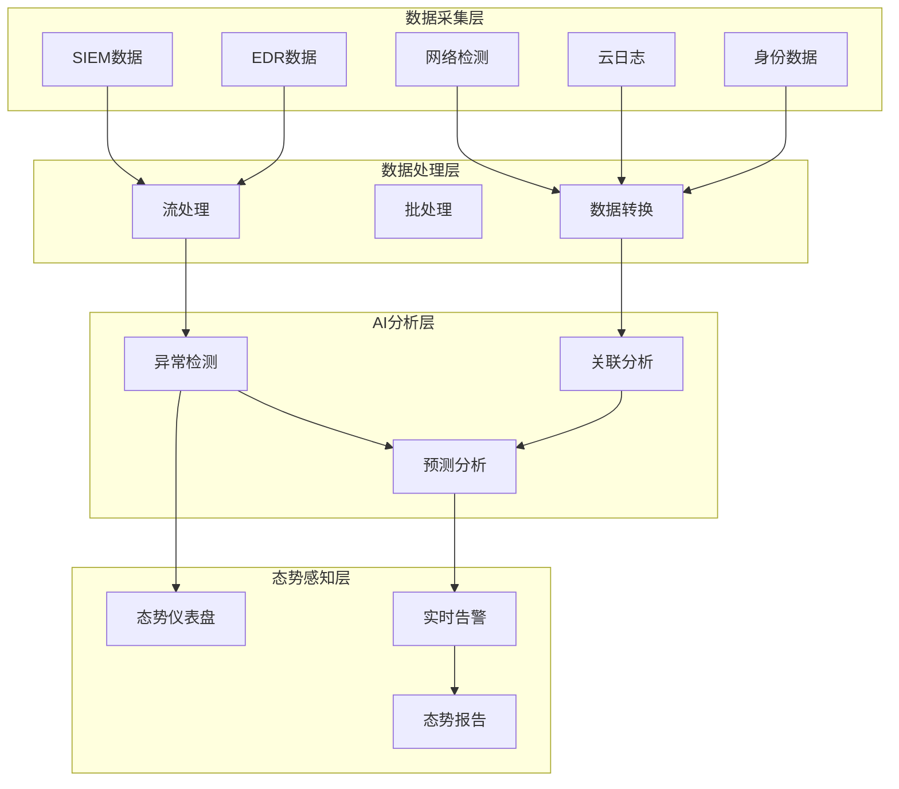
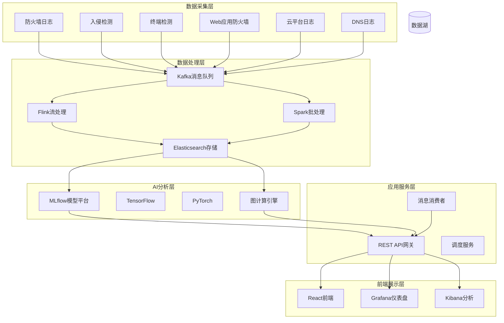
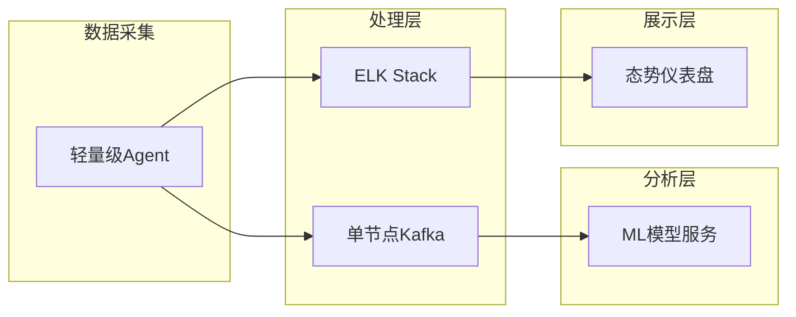
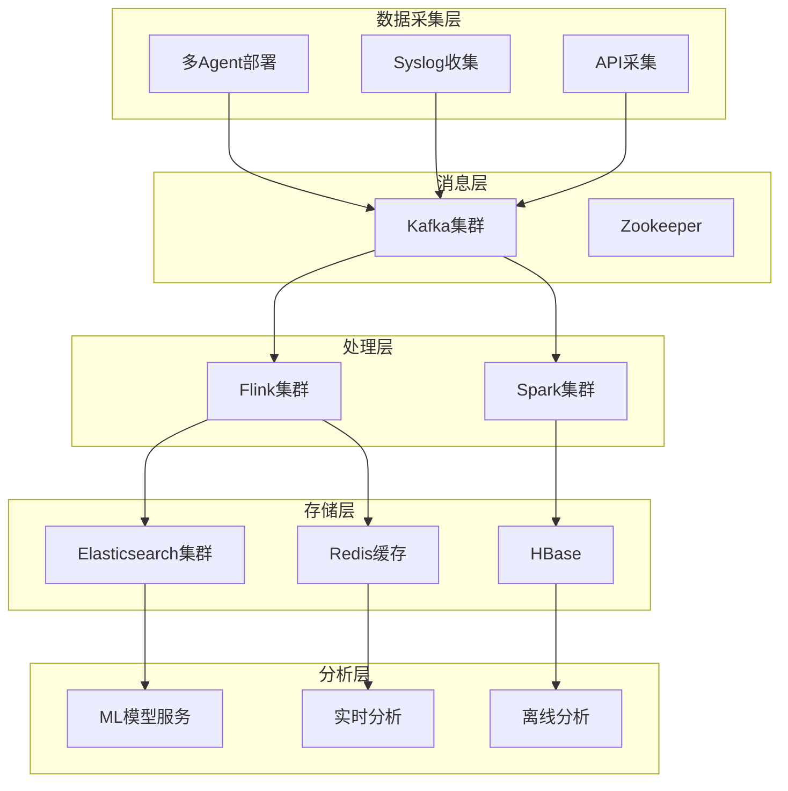

**作者：** HOS(安全风信子)
**日期：** 2026-04-23
**主要来源平台：** Gartner/Mandiant/IBM Security
**摘要：** 本文深入探讨AI驱动的新一代安全态势感知体系。传统态势感知系统面临数据孤岛、分析滞后、响应被动等挑战，AI技术的引入为态势感知带来了实时性、智能性、预测性等新能力。本文从态势感知的基本原理、AI赋能的态势感知技术架构、核心能力实现、实战应用四维度，全面解析AI态势感知系统的设计与实现。

@[TOC](目录)

---

# AI驱动的新一代安全态势感知：从数据聚合到智能决策

## 1. 引言：为什么态势感知需要AI

安全态势感知是SOC的核心能力，帮助安全团队理解当前的安全状况、评估风险水平、指导响应决策。然而，传统态势感知系统面临严峻挑战。

**数据孤岛问题**：安全数据分散在多个系统中，传统方法难以整合形成统一视图。

**分析滞后问题**：传统方法依赖规则和人工分析，难以实时发现威胁。

**上下文缺失问题**：缺乏对业务上下文、资产上下文、威胁上下文的深度理解。

**预测能力不足**：传统方法只能发现已发生的威胁，难以预测未来风险。

AI技术为态势感知带来了革命性的提升，通过机器学习和深度分析，实现实时、智能、预测性的态势感知。

---

## 2. AI态势感知技术架构

### 2.1 多源数据融合架构

AI态势感知采用数据湖架构，实现安全数据的统一存储和分析。

```python
class SecurityDataLake:
    """
    安全数据湖
    统一存储和管理多源安全数据
    """
    
    def __init__(self):
        self.data_sources = {
            'siem': SIEMConnector(),
            'edr': EDRConnector(),
            'ndr': NDRConnector(),
            'cloud': CloudLogConnector(),
            'identity': IdentityConnector(),
            'network': NetworkFlowConnector()
        }
        
        self.storage_layers = {
            'raw': RawDataStorage(),
            'processed': ProcessedDataStorage(),
            'analytics': AnalyticsDataStorage()
        }
        
        self.data_quality = DataQualityChecker()
    
    def ingest_data(self, source_name, data):
        """
        数据摄取
        
        参数:
            source_name: 数据源名称
            data: 待摄取数据
        """
        # 数据验证
        validated_data = self.data_quality.validate(data)
        
        # 原始数据存储
        self.storage_layers['raw'].store(
            source_name,
            validated_data
        )
        
        # 数据转换
        transformed_data = self._transform_data(
            source_name,
            validated_data
        )
        
        # 处理后数据存储
        self.storage_layers['processed'].store(
            source_name,
            transformed_data
        )
        
        return {
            'records_ingested': len(data),
            'records_valid': len(validated_data),
            'transformation_applied': True
        }
    
    def _transform_data(self, source_name, data):
        """
        数据转换和标准化
        """
        transformer = self._get_transformer(source_name)
        return [transformer.transform(record) for record in data]
```



### 2.2 实时事件流处理架构

大规模安全事件的实时处理需要高性能的流处理架构支撑。

```python
class RealTimeEventProcessor:
    """
    实时事件处理器
    高性能流处理安全事件
    """
    
    def __init__(self):
        self.stream_config = {
            'bootstrap_servers': 'kafka:9092',
            'group_id': 'security-processor',
            'auto_offset_reset': 'latest'
        }
        
        self.processing_pipeline = [
            EventNormalization(),
            ThreatEnrichment(),
            AnomalyScoring(),
            AlertFiltering()
        ]
        
        self.window_config = {
            'tumbling': {'size': '5m'},
            'sliding': {'size': '1m', 'step': '30s'},
            'session': {'timeout': '10m'}
        }
    
    def process_event_stream(self, event_stream):
        """
        处理事件流
        
        参数:
            event_stream: 事件数据流
        """
        for event in event_stream:
            # 事件标准化
            normalized = self._normalize_event(event)
            
            # 威胁丰富化
            enriched = self._enrich_with_threat_intel(normalized)
            
            # 异常评分
            scored = self._calculate_anomaly_score(enriched)
            
            # 告警过滤
            if self._should_alert(scored):
                yield self._create_alert(scored)
    
    def _normalize_event(self, event):
        """
        事件标准化
        将不同来源的事件转换为统一格式
        """
        return {
            'event_id': event.get('id', generate_uuid()),
            'timestamp': parse_timestamp(event.get('time')),
            'source_ip': normalize_ip(event.get('src_ip')),
            'dest_ip': normalize_ip(event.get('dst_ip')),
            'event_type': map_event_type(event.get('type')),
            'severity': map_severity(event.get('level')),
            'raw_data': event
        }
    
    def _enrich_with_threat_intel(self, event):
        """
        威胁情报丰富化
        """
        # 查询威胁情报
        ip_reputation = self.threat_intel.check_ip(event['source_ip'])
        domain_reputation = self.threat_intel.check_domain(
            event.get('domain')
        )
        file_hash = self.threat_intel.check_hash(
            event.get('file_hash')
        )
        
        return {
            **event,
            'ip_reputation': ip_reputation,
            'domain_reputation': domain_reputation,
            'threat_indicators': self._aggregate_indicators(
                ip_reputation,
                domain_reputation,
                file_hash
            )
        }
```

### 2.3 威胁检测引擎

基于多种检测技术的威胁检测引擎，实现多维度威胁发现。

```python
class ThreatDetectionEngine:
    """
    威胁检测引擎
    多技术融合的威胁检测
    """
    
    def __init__(self):
        self.detectors = {
            'signature': SignatureBasedDetector(),
            'anomaly': AnomalyBasedDetector(),
            'behavior': BehaviorBasedDetector(),
            'threat_intel': ThreatIntelDetector(),
            'ml_model': MLModelDetector()
        }
        
        self.correlation_engine = CorrelationEngine()
        self.detection_orchestrator = DetectionOrchestrator()
    
    def detect_threats(self, events):
        """
        检测威胁
        
        参数:
            events: 事件列表
        
        返回:
            list: 检测到的威胁
        """
        all_detections = []
        
        # 并行执行所有检测器
        detection_results = self._run_parallel_detection(events)
        
        # 合并检测结果
        for detector_name, detections in detection_results.items():
            all_detections.extend(detections)
        
        # 威胁关联分析
        correlated_threats = self.correlation_engine.correlate(
            all_detections
        )
        
        # 威胁聚合
        aggregated_threats = self._aggregate_threats(correlated_threats)
        
        return aggregated_threats
    
    def _run_parallel_detection(self, events):
        """
        并行执行检测
        """
        results = {}
        
        for detector_name, detector in self.detectors.items():
            try:
                results[detector_name] = detector.detect(events)
            except Exception as e:
                logging.error(f"Detector {detector_name} failed: {e}")
                results[detector_name] = []
        
        return results
```

### 2.4 用户和实体行为分析

UEBA技术实现对用户和实体行为的智能分析。

```python
class UEBAEngine:
    """
    用户和实体行为分析引擎
    机器学习驱动的行为异常检测
    """
    
    def __init__(self):
        self.behavior_profiler = BehaviorProfiler()
        self.ml_models = {
            'isolation_forest': IsolationForestModel(),
            'autoencoder': AutoEncoderModel(),
            'lstm': LSTMModel()
        }
        
        self.baseline_calculator = BaselineCalculator()
        self.risk_scorer = RiskScorer()
    
    def analyze_user_behavior(self, user_id, event_sequence):
        """
        分析用户行为
        
        参数:
            user_id: 用户ID
            event_sequence: 事件序列
        """
        # 获取用户基线
        user_baseline = self.behavior_profiler.get_baseline(user_id)
        
        # 计算行为偏离
        deviation_scores = self._calculate_deviation(
            event_sequence,
            user_baseline
        )
        
        # 多模型集成评分
        ensemble_score = self._ensemble_scoring(
            deviation_scores,
            event_sequence
        )
        
        # 风险评分
        risk_assessment = self.risk_scorer.calculate_risk(
            user_id,
            ensemble_score,
            event_sequence
        )
        
        return {
            'user_id': user_id,
            'baseline_profile': user_baseline,
            'deviation_scores': deviation_scores,
            'ensemble_risk_score': ensemble_score,
            'risk_assessment': risk_assessment,
            'anomalous_activities': self._identify_anomalies(
                deviation_scores,
                event_sequence
            )
        }
    
    def build_baseline(self, user_id, historical_events):
        """
        构建用户行为基线
        """
        baseline_features = {
            'login_times': self._analyze_login_patterns(historical_events),
            'access_locations': self._analyze_location_patterns(historical_events),
            'resource_access': self._analyze_resource_access(historical_events),
            'command_patterns': self._analyze_command_patterns(historical_events),
            'data_transfer': self._analyze_data_transfer_patterns(historical_events)
        }
        
        return self.behavior_profiler.update_baseline(user_id, baseline_features)
```

### 2.5 网络流量分析引擎

深度网络流量分析，发现隐藏的威胁和异常。

```python
class NetworkTrafficAnalyzer:
    """
    网络流量分析引擎
    深度包检测和流量分析
    """
    
    def __init__(self):
        self.flow_collector = NetFlowCollector()
        self.deep_packet_inspector = DPIEngine()
        self.encrypted_traffic_analyzer = TLSAnalyzer()
        self.protocol_analyzer = ProtocolAnalyzer()
        self.baseline_engine = NetworkBaselineEngine()
    
    def analyze_traffic(self, traffic_flows):
        """
        分析网络流量
        
        参数:
            traffic_flows: 流量数据
        """
        analysis_results = []
        
        for flow in traffic_flows:
            # 基础流量分析
            basic_analysis = self._analyze_flow_basics(flow)
            
            # 深度包检测
            dpi_result = self.deep_packet_inspector.inspect(flow)
            
            # 加密流量分析
            encrypted_analysis = self.encrypted_traffic_analyzer.analyze(flow)
            
            # 协议异常检测
            protocol_anomaly = self.protocol_analyzer.detect_anomaly(flow)
            
            # 汇总分析
            flow_analysis = self._aggregate_flow_analysis(
                basic_analysis,
                dpi_result,
                encrypted_analysis,
                protocol_anomaly
            )
            
            if flow_analysis['threat_indicators']:
                analysis_results.append(flow_analysis)
        
        return analysis_results
    
    def _analyze_flow_basics(self, flow):
        """
        基础流量分析
        """
        return {
            'bytes_in': flow.get('bytes_in', 0),
            'bytes_out': flow.get('bytes_out', 0),
            'packets': flow.get('packets', 0),
            'duration': flow.get('duration', 0),
            'connection_state': flow.get('state'),
            'port': flow.get('dest_port'),
            'protocol': flow.get('protocol')
        }
```

### 2.6 安全知识图谱构建

构建多维度的安全知识图谱，实现威胁的深度关联分析。

```python
class SecurityKnowledgeGraph:
    """
    安全知识图谱
    多维度安全实体关联分析
    """
    
    def __init__(self):
        self.graph_db = GraphDatabase()
        self.entity_extractor = EntityExtractor()
        self.relationship_analyzer = RelationshipAnalyzer()
        self.path_finder = PathFinder()
    
    def build_graph(self, security_data):
        """
        构建安全知识图谱
        
        参数:
            security_data: 安全数据
        """
        # 实体提取
        entities = self.entity_extractor.extract(security_data)
        
        # 添加节点
        for entity in entities:
            self.graph_db.add_node(
                entity['id'],
                entity['type'],
                entity['properties']
            )
        
        # 关系分析
        relationships = self.relationship_analyzer.analyze(entities)
        
        # 添加关系
        for rel in relationships:
            self.graph_db.add_edge(
                rel['source'],
                rel['target'],
                rel['type'],
                rel['properties']
            )
        
        # 建立索引
        self.graph_db.create_indexes()
    
    def query_attack_path(self, source_entity, target_entity):
        """
        查询攻击路径
        """
        paths = self.path_finder.find_paths(
            source_entity,
            target_entity,
            max_depth=5
        )
        
        return self._analyze_attack_paths(paths)
    
    def find_related_threats(self, entity_id):
        """
        查找相关威胁
        """
        related = self.graph_db.query(
            f"MATCH (e1)-[:related_to|exploits|targets]->(e2) "
            f"WHERE e1.id = '{entity_id}' "
            f"RETURN e2"
        )
        
        return related
```

### 2.2 实时态势评估引擎

```python
class SituationalAwarenessEngine:
    """
    态势感知引擎
    实时评估企业安全态势
    """
    
    def __init__(self):
        self.data_sources = {
            'siem': SIEMConnector(),
            'edr': EDRConnector(),
            'ndr': NDRConnector(),
            'identity': IdentityConnector()
        }
        
        self.ml_models = {
            'threat': ThreatDetectionModel(),
            'risk': RiskAssessmentModel(),
            'anomaly': AnomalyDetectionModel()
        }
        
        self.kpi_calculator = KPIEvaluator()
    
    def assess_situation(self):
        """
        评估当前安全态势
        """
        # 1. 收集实时数据
        raw_data = self._collect_realtime_data()
        
        # 2. AI威胁检测
        threats = self.ml_models['threat'].detect(raw_data)
        
        # 3. 风险评估
        risk_assessment = self.ml_models['risk'].assess(threats)
        
        # 4. 异常检测
        anomalies = self.ml_models['anomaly'].detect(raw_data)
        
        # 5. 计算态势指标
        situation_metrics = self._calculate_metrics(threats, risk_assessment, anomalies)
        
        return {
            'timestamp': datetime.now().isoformat(),
            'threats': threats,
            'risk_level': risk_assessment,
            'anomalies': anomalies,
            'metrics': situation_metrics,
            'situation_score': self._calculate_situation_score(situation_metrics)
        }
```

---

## 3. AI态势感知核心能力

### 3.1 实时威胁检测

AI系统通过多维度分析，实时检测各类威胁。

```python
class RealTimeThreatDetector:
    """
    实时威胁检测器
    基于AI的实时威胁发现
    """
    
    def __init__(self):
        self.detectors = {
            'signature': SignatureDetector(),
            'anomaly': AnomalyDetector(),
            'behavior': BehaviorDetector(),
            'threat_intel': ThreatIntelMatcher()
        }
    
    def detect(self, data_stream):
        """
        检测威胁
        """
        detections = []
        
        for detector_name, detector in self.detectors.items():
            result = detector.analyze(data_stream)
            if result['detected']:
                detections.append(result)
        
        return self._correlate_detections(detections)
```

### 3.2 高级威胁检测模型

基于深度学习的高级威胁检测模型，实现对复杂攻击的智能识别。

```python
class AdvancedThreatDetector:
    """
    高级威胁检测器
    基于深度学习的威胁检测
    """
    
    def __init__(self):
        self.models = {
            'transformer': TransformerThreatDetector(),
            'graph_neural_network': GNNThreatDetector(),
            'autoencoder': AnomalyAutoEncoder()
        }
        
        self.feature_extractors = {
            'sequence': SequenceFeatureExtractor(),
            'graph': GraphFeatureExtractor(),
            'temporal': TemporalFeatureExtractor()
        }
    
    def detect_advanced_threats(self, event_data):
        """
        检测高级威胁
        
        参数:
            event_data: 事件数据
        
        返回:
            dict: 检测结果
        """
        # 特征提取
        features = self._extract_features(event_data)
        
        # 多模型检测
        detections = {}
        for model_name, model in self.models.items():
            detections[model_name] = model.predict(features)
        
        # 集成判断
        final_verdict = self._ensemble_verdict(detections)
        
        return {
            'threat_detected': final_verdict['is_threat'],
            'confidence': final_verdict['confidence'],
            'threat_type': final_verdict['threat_type'],
            'model_scores': detections,
            'evidence': self._collect_evidence(event_data, detections)
        }
    
    def _extract_features(self, event_data):
        """
        提取多维度特征
        """
        return {
            'sequence_features': self.feature_extractors['sequence'].extract(event_data),
            'graph_features': self.feature_extractors['graph'].extract(event_data),
            'temporal_features': self.feature_extractors['temporal'].extract(event_data)
        }
```

### 3.3 恶意软件检测引擎

基于静态分析和动态行为的恶意软件检测系统。

```python
class MalwareDetectionEngine:
    """
    恶意软件检测引擎
    多技术融合的恶意软件检测
    """
    
    def __init__(self):
        self.static_analyzer = StaticAnalyzer()
        self.dynamic_analyzer = DynamicAnalyzer()
        self.sandbox = MalwareSandbox()
        self.ml_classifier = MLClassifier()
    
    def analyze_file(self, file_path):
        """
        分析文件是否为恶意软件
        
        参数:
            file_path: 文件路径
        
        返回:
            dict: 分析结果
        """
        # 静态分析
        static_result = self.static_analyzer.analyze(file_path)
        
        # 动态分析
        dynamic_result = self.dynamic_analyzer.analyze(file_path)
        
        # 沙箱分析
        sandbox_result = self.sandbox.submit(file_path)
        
        # ML分类
        ml_result = self.ml_classifier.classify(
            static_result,
            dynamic_result
        )
        
        # 综合判断
        final_verdict = self._make_verdict(
            static_result,
            dynamic_result,
            sandbox_result,
            ml_result
        )
        
        return {
            'file_hash': calculate_hash(file_path),
            'verdict': final_verdict,
            'static_analysis': static_result,
            'dynamic_analysis': dynamic_result,
            'sandbox_report': sandbox_result,
            'ml_confidence': ml_result['confidence'],
            'threat_family': self._identify_threat_family(
                static_result,
                dynamic_result
            )
        }
```

### 3.4 入侵检测系统

网络入侵检测和主机入侵检测的智能分析。

```python
class IntrusionDetectionSystem:
    """
    入侵检测系统
    网络和主机入侵检测
    """
    
    def __init__(self):
        self.network_ids = NetworkIDS()
        self.host_ids = HostIDS()
        self.correlator = AlertCorrelator()
    
    def detect_intrusion(self, network_events, host_events):
        """
        检测入侵行为
        
        参数:
            network_events: 网络事件
            host_events: 主机事件
        """
        # 网络入侵检测
        network_alerts = self.network_ids.analyze(network_events)
        
        # 主机入侵检测
        host_alerts = self.host_ids.analyze(host_events)
        
        # 告警关联
        correlated_alerts = self.correlator.correlate(
            network_alerts,
            host_alerts
        )
        
        # 优先级排序
        prioritized_alerts = self._prioritize_alerts(correlated_alerts)
        
        return {
            'network_alerts': network_alerts,
            'host_alerts': host_alerts,
            'correlated_alerts': correlated_alerts,
            'high_priority_alerts': [
                a for a in prioritized_alerts if a['priority'] == 'high'
            ]
        }
    
    def detect_lateral_movement(self, events):
        """
        检测横向移动
        """
        lateral_indicators = []
        
        for event in events:
            if self._is_lateral_movement(event):
                lateral_indicators.append({
                    'source': event['source_host'],
                    'destination': event['dest_host'],
                    'technique': event['technique'],
                    'evidence': event['evidence']
                })
        
        return self._construct_attack_chain(lateral_indicators)
```

### 3.5 风险评估与预测

AI系统能够评估当前风险水平，预测未来风险趋势。

```python
class RiskPredictor:
    """
    风险预测器
    预测未来安全风险
    """
    
    def __init__(self):
        self.time_series_model = TimeSeriesModel()
        self.risk_factors = RiskFactorAnalyzer()
    
    def predict_risk_trend(self, time_horizon='7d'):
        """
        预测风险趋势
        """
        # 历史数据分析
        historical = self._get_historical_data()
        
        # 时序预测
        trend = self.time_series_model.predict(historical, horizon=time_horizon)
        
        # 风险因素分析
        risk_factors = self.risk_factors.analyze()
        
        return {
            'current_risk': self._calculate_current_risk(),
            'predicted_risk': trend,
            'risk_factors': risk_factors,
            'confidence': trend['confidence']
        }
```

### 3.6 威胁狩猎系统

主动威胁狩猎，发现潜在的高级持续性威胁。

```python
class ThreatHuntingSystem:
    """
    威胁狩猎系统
    主动发现隐藏威胁
    """
    
    def __init__(self):
        self.hypothesis_generator = HypothesisGenerator()
        self.search_engine = SearchEngine()
        self.analytics_engine = AnalyticsEngine()
    
    def hunt(self, hypothesis):
        """
        执行威胁狩猎
        
        参数:
            hypothesis: 狩猎假设
        """
        # 假设验证
        search_results = self.search_engine.search(hypothesis)
        
        # 分析结果
        analysis = self.analytics_engine.analyze(
            search_results,
            hypothesis
        )
        
        # 生成报告
        return {
            'hypothesis': hypothesis,
            'findings': analysis['findings'],
            'evidence': analysis['evidence'],
            'confidence': analysis['confidence'],
            'recommended_actions': analysis['actions']
        }
    
    def generate_hypotheses(self, threat_intel):
        """
        自动生成狩猎假设
        """
        hypotheses = []
        
        for intel in threat_intel:
            hypothesis = self.hypothesis_generator.generate(
                intel['threat_actor'],
                intel['techniques'],
                intel['targets']
            )
            hypotheses.append(hypothesis)
        
        return hypotheses
```

### 3.7 安全事件响应自动化

基于AI的安全事件自动响应系统。

```python
class SecurityOrchestrationEngine:
    """
    安全编排引擎
    自动化安全事件响应
    """
    
    def __init__(self):
        self.playbook_engine = PlaybookEngine()
        self.response_actions = ResponseActionLibrary()
        self.approval_workflow = ApprovalWorkflow()
    
    def respond_to_incident(self, incident):
        """
        响应安全事件
        
        参数:
            incident: 安全事件
        """
        # 选择响应剧本
        playbook = self.playbook_engine.select_playbook(incident)
        
        # 执行响应动作
        actions_executed = []
        for action in playbook['actions']:
            if action.get('requires_approval'):
                approved = self.approval_workflow.request(action)
                if not approved:
                    continue
            
            result = self._execute_action(action, incident)
            actions_executed.append(result)
        
        return {
            'incident_id': incident['id'],
            'playbook_executed': playbook['name'],
            'actions_executed': actions_executed,
            'incident_status': self._determine_status(actions_executed)
        }
    
    def _execute_action(self, action, incident):
        """
        执行响应动作
        """
        action_type = action['type']
        
        if action_type == 'containment':
            return self.response_actions.contain(incident)
        elif action_type == 'eradication':
            return self.response_actions.eradicate(incident)
        elif action_type == 'recovery':
            return self.response_actions.recover(incident)
        elif action_type == 'notification':
            return self.response_actions.notify(action['target'])
```

---

## 4. 态势感知可视化与报告

### 4.1 态势仪表盘设计

```python
class SituationDashboard:
    """
    态势仪表盘
    可视化安全态势
    """
    
    def __init__(self):
        self.widgets = {
            'situation_score': SituationScoreWidget(),
            'threat_map': ThreatMapWidget(),
            'risk_trend': RiskTrendWidget(),
            'asset_status': AssetStatusWidget(),
            'top_alerts': TopAlertsWidget()
        }
    
    def generate_dashboard(self, situation_data):
        """
        生成态势仪表盘
        """
        dashboard = {
            'title': '企业安全态势感知仪表盘',
            'timestamp': datetime.now().isoformat(),
            'widgets': {}
        }
        
        for widget_name, widget in self.widgets.items():
            dashboard['widgets'][widget_name] = widget.render(situation_data)
        
        return dashboard
```

### 4.2 多维度态势可视化

现代安全态势感知需要多维度的可视化展示，帮助安全团队全面理解安全状况。

```python
class MultiDimensionalVisualizer:
    """
    多维度可视化器
    多角度展示安全态势
    """
    
    def __init__(self):
        self.visualization_types = {
            'time_series': TimeSeriesVisualizer(),
            'geo_map': GeoMapVisualizer(),
            'network_graph': NetworkGraphVisualizer(),
            'heatmap': HeatmapVisualizer(),
            'treemap': TreemapVisualizer()
        }
    
    def visualize_situation(self, situation_data):
        """
        生成多维度可视化
        
        参数:
            situation_data: 态势数据
        """
        visualizations = {}
        
        # 时间序列可视化
        visualizations['threat_timeline'] = self.visualization_types[
            'time_series'
        ].render(
            situation_data['threat_events'],
            x_axis='timestamp',
            y_axis='threat_count'
        )
        
        # 地理分布可视化
        visualizations['threat_geo_distribution'] = self.visualization_types[
            'geo_map'
        ].render(
            situation_data['geo_events']
        )
        
        # 网络拓扑可视化
        visualizations['network_topology'] = self.visualization_types[
            'network_graph'
        ].render(
            situation_data['network_topology']
        )
        
        # 风险热力图
        visualizations['risk_heatmap'] = self.visualization_types[
            'heatmap'
        ].render(
            situation_data['risk_matrix']
        )
        
        # 资产风险分布
        visualizations['asset_risk_treemap'] = self.visualization_types[
            'treemap'
        ].render(
            situation_data['asset_risks']
        )
        
        return visualizations
```

### 4.3 态势报告生成

```python
class SituationReportGenerator:
    """
    态势报告生成器
    自动生成态势分析报告
    """
    
    def __init__(self):
        self.report_template = ReportTemplate()
    
    def generate_report(self, situation_data, report_type='daily'):
        """
        生成态势报告
        """
        template = self.report_template.get_template(report_type)
        
        report = {
            'title': template['title'],
            'period': template['period'],
            'summary': self._generate_summary(situation_data),
            'key_findings': self._extract_key_findings(situation_data),
            'risk_assessment': situation_data['risk_level'],
            'recommendations': self._generate_recommendations(situation_data)
        }
        
        return report
```

### 4.4 态势评估指标体系

完整的态势评估需要建立科学的指标体系，涵盖威胁、脆弱性、防御能力等多个维度。

```python
class SituationMetricsEngine:
    """
    态势指标引擎
    计算和分析态势评估指标
    """
    
    def __init__(self):
        self.metrics_collectors = {
            'threat': ThreatMetricsCollector(),
            'vulnerability': VulnerabilityMetricsCollector(),
            'defense': DefenseMetricsCollector(),
            'business': BusinessMetricsCollector()
        }
        
        self.baseline_engine = BaselineEngine()
        self.trend_analyzer = TrendAnalyzer()
    
    def calculate_situation_score(self):
        """
        计算态势评分
        综合评估安全态势
        """
        # 收集各维度指标
        threat_metrics = self.metrics_collectors['threat'].collect()
        vuln_metrics = self.metrics_collectors['vulnerability'].collect()
        defense_metrics = self.metrics_collectors['defense'].collect()
        biz_metrics = self.metrics_collectors['business'].collect()
        
        # 计算各维度得分
        threat_score = self._score_threat_dimension(threat_metrics)
        vuln_score = self._score_vulnerability_dimension(vuln_metrics)
        defense_score = self._score_defense_dimension(defense_metrics)
        biz_score = self._score_business_dimension(biz_metrics)
        
        # 综合态势评分
        overall_score = (
            threat_score * 0.30 +
            vuln_score * 0.25 +
            defense_score * 0.25 +
            biz_score * 0.20
        )
        
        return {
            'overall_situation_score': overall_score,
            'threat_score': threat_score,
            'vulnerability_score': vuln_score,
            'defense_score': defense_score,
            'business_impact_score': biz_score,
            'score_level': self._classify_score_level(overall_score),
            'trend': self.trend_analyzer.analyze_trend(overall_score)
        }
    
    def generate_kpi_report(self):
        """
        生成KPI报告
        """
        kpis = {
            'MTTD': {
                'name': '平均威胁检测时间',
                'value': self._calculate_mttd(),
                'target': '< 1 hour'
            },
            'MTTR': {
                'name': '平均响应时间',
                'value': self._calculate_mttr(),
                'target': '< 4 hours'
            },
            'threat_detection_rate': {
                'name': '威胁检测率',
                'value': self._calculate_detection_rate(),
                'target': '> 95%'
            },
            'false_positive_rate': {
                'name': '误报率',
                'value': self._calculate_fpr(),
                'target': '< 5%'
            }
        }
        
        return kpis
```

### 4.5 实时告警管理

```python
class AlertManagementSystem:
    """
    告警管理系统
    智能告警处理和分发
    """
    
    def __init__(self):
        self.alert_processors = {
            'triage': AlertTriageProcessor(),
            'enrichment': AlertEnrichmentProcessor(),
            'prioritization': AlertPrioritizationProcessor(),
            'routing': AlertRoutingProcessor()
        }
        
        self.alert_storage = AlertStorage()
        self.notification_service = NotificationService()
    
    def process_alert(self, raw_alert):
        """
        处理告警
        
        参数:
            raw_alert: 原始告警
        """
        # 告警分类
        triaged = self.alert_processors['triage'].process(raw_alert)
        
        # 告警丰富化
        enriched = self.alert_processors['enrichment'].enrich(triaged)
        
        # 优先级排序
        prioritized = self.alert_processors['prioritization'].prioritize(enriched)
        
        # 路由分发
        routed = self.alert_processors['routing'].route(prioritized)
        
        # 存储告警
        self.alert_storage.store(routed)
        
        # 发送通知
        if routed['priority'] in ['critical', 'high']:
            self.notification_service.send(routed)
        
        return routed
    
    def manage_alert_lifecycle(self, alert_id, action):
        """
        管理告警生命周期
        """
        alert = self.alert_storage.get(alert_id)
        
        if action == 'acknowledge':
            alert['acknowledged'] = True
            alert['acknowledged_by'] = get_current_user()
            alert['acknowledged_at'] = datetime.now().isoformat()
        elif action == 'resolve':
            alert['resolved'] = True
            alert['resolved_by'] = get_current_user()
            alert['resolved_at'] = datetime.now().isoformat()
        elif action == 'escalate':
            alert['escalated'] = True
            alert['escalation_level'] += 1
            self.notification_service.escalate(alert)
        
        self.alert_storage.update(alert)
        return alert
```

---

## 5. 结论与最佳实践

### 5.1 核心要点

AI驱动的态势感知系统能够实现实时、智能、预测性的安全态势评估，帮助企业更好地理解安全状况、评估风险、指导决策。

### 5.2 实施建议

**数据整合是基础**：打破数据孤岛，实现安全数据的统一采集和分析。

**AI能力是核心**：部署AI检测和预测能力，提升态势感知的智能性。

**可视化是关键**：设计直观的仪表盘，帮助决策者快速理解态势。

**持续优化是保障**：根据实际情况持续优化AI模型和态势评估标准。

### 5.3 技术架构建议

在实际部署AI态势感知系统时，建议采用以下技术架构：



### 5.4 性能优化策略

大规模态势感知系统需要考虑性能优化：

```python
class PerformanceOptimizationManager:
    """
    性能优化管理器
    优化系统性能
    """
    
    def __init__(self):
        self.cache_manager = CacheManager()
        self.load_balancer = LoadBalancer()
        self.query_optimizer = QueryOptimizer()
    
    def optimize_data_processing(self, data_batch):
        """
        优化数据处理
        """
        # 检查缓存
        cached_results = self.cache_manager.get_batch(
            [item['id'] for item in data_batch]
        )
        
        # 分离缓存命中和未命中
        cache_hit = [item for item in data_batch if item['id'] in cached_results]
        cache_miss = [item for item in data_batch if item['id'] not in cached_results]
        
        # 并行处理缓存未命中数据
        if cache_miss:
            processed = self.parallel_processor.process(
                cache_miss,
                self.process_item
            )
            
            # 更新缓存
            for item in processed:
                self.cache_manager.set(item['id'], item)
        
        return cache_hit + processed
    
    def optimize_query_performance(self, query):
        """
        优化查询性能
        """
        # 查询计划优化
        optimized_query = self.query_optimizer.optimize(query)
        
        # 执行查询
        results = self.elasticsearch.execute(optimized_query)
        
        # 结果缓存
        self.cache_manager.set_query_cache(query, results)
        
        return results
```

### 5.5 安全与合规考虑

态势感知系统处理大量敏感安全数据，需要考虑安全和合规要求：

```python
class SecurityComplianceManager:
    """
    安全合规管理器
    确保系统安全和合规
    """
    
    def __init__(self):
        self.access_control = RBACManager()
        self.data_encryption = EncryptionManager()
        self.audit_logger = AuditLogger()
        self.compliance_checker = ComplianceChecker()
    
    def enforce_access_control(self, user, resource):
        """
        强制访问控制
        """
        permissions = self.access_control.get_permissions(user)
        
        if resource not in permissions['allowed_resources']:
            raise AccessDeniedError(f"User {user} not authorized for {resource}")
        
        self.audit_logger.log_access(user, resource, 'GRANTED')
        return True
    
    def encrypt_sensitive_data(self, data):
        """
        加密敏感数据
        """
        return self.data_encryption.encrypt(
            data,
            algorithm='AES-256',
            key_management='aws_kms'
        )
    
    def check_compliance(self, operation):
        """
        检查合规性
        """
        compliance_frameworks = ['GDPR', 'SOC2', 'ISO27001', 'PCI_DSS']
        
        results = {}
        for framework in compliance_frameworks:
            results[framework] = self.compliance_checker.check(
                framework,
                operation
            )
        
        return results
```

---

## 6. 附录

### 附录一：态势评估指标体系

| 指标类别 | 关键指标 | 计算方法 |
|:---|:---|:---|
| 威胁指标 | 活跃威胁数 | 实时统计 |
| 风险指标 | 整体风险分 | 多因素加权 |
| 脆弱性指标 | 漏洞暴露面 | 漏洞×资产 |
| 防御指标 | 防御有效率 | 检测率/误报率 |

### 附录二：态势感知成熟度评估

| 成熟度 | 特征 | AI能力 |
|:---:|:---|:---|
| L1初始级 | 数据分散 | 无 |
| L2增强级 | 数据整合 | 基础分析 |
| L3自动化级 | 自动关联 | 智能检测 |
| L4智能化级 | 实时态势 | 预测分析 |

### 附录三：态势感知技术组件对照表

| 技术组件 | 功能 | 推荐开源/商业方案 |
|:---|:---|:---|
| 数据采集 | 日志收集 | Filebeat, Fluentd, Logstash |
| 消息队列 | 事件传输 | Apache Kafka, RabbitMQ |
| 流处理 | 实时分析 | Apache Flink, Apache Spark Streaming |
| 批处理 | 离线分析 | Apache Spark, Hadoop |
| 存储 | 数据存储 | Elasticsearch, ClickHouse, HBase |
| 可视化 | 态势展示 | Grafana, Kibana, Custom React |
| 机器学习 | 智能分析 | TensorFlow, PyTorch, scikit-learn |
| 图计算 | 关联分析 | Neo4j, Apache Giraph |

### 附录四：态势评分计算公式

**综合态势评分 (CSS)**

$$CSS = T_{score} \times 0.30 + V_{score} \times 0.25 + D_{score} \times 0.25 + B_{score} \times 0.20$$

其中：
- $T_{score}$: 威胁维度评分
- $V_{score}$: 脆弱性维度评分
- $D_{score}$: 防御能力维度评分
- $B_{score}$: 业务影响维度评分

**威胁评分计算**

$$T_{score} = \frac{Active_{threats} \times Severity_{weight} + Pending_{alerts} \times Alert_{weight}}{Max_{score}} \times 100$$

**脆弱性评分计算**

$$V_{score} = \frac{\sum_{i=1}^{n} Vuln_i \times Asset_{criticality_i}}{Total_{assets}} \times Exposure_{factor}$$

**防御能力评分计算**

$$D_{score} = Detection_{rate} \times 0.4 + Prevention_{rate} \times 0.3 + Response_{efficiency} \times 0.3$$

### 附录五：告警优先级定义

| 优先级 | 分数范围 | 响应时间 | 说明 |
|:---:|:---:|:---:|:---|
| P1 紧急 | 90-100 | 15分钟 | 需立即处理 |
| P2 高 | 70-89 | 1小时 | 需尽快处理 |
| P3 中 | 40-69 | 4小时 | 计划内处理 |
| P4 低 | <40 | 24小时 | 视资源处理 |

### 附录六：集成指南

#### 与SIEM系统集成

```python
class SIEMIntegration:
    """
    SIEM系统集成
    与主流SIEM平台集成
    """
    
    def __init__(self, siem_type):
        self.siem_type = siem_type
        self.connectors = {
            'splunk': SplunkConnector(),
            'arcsight': ArcsightConnector(),
            'qradar': QRadarConnector(),
            'sumo': SumoLogicConnector()
        }
        
        self.connector = self.connectors.get(siem_type)
    
    def export_alerts(self, alerts):
        """
        导出告警到SIEM
        """
        formatted_alerts = [
            self._format_alert(alert) for alert in alerts
        ]
        
        return self.connector.send_alerts(formatted_alerts)
    
    def query_siem_data(self, query):
        """
        查询SIEM数据
        """
        return self.connector.execute_query(query)
```

#### 与威胁情报平台集成

```python
class ThreatIntelIntegration:
    """
    威胁情报集成
    集成多源威胁情报
    """
    
    def __init__(self):
        self.intel_sources = {
            ' Recorded Future': RecordedFutureConnector(),
            'ThreatConnect': ThreatConnectConnector(),
            'MISP': MISPConnector(),
            'AlienVault OTX': AlienVaultConnector(),
            'IBM X-Force': IBMXForceConnector()
        }
    
    def enrich_indicator(self, indicator):
        """
        丰富指标信息
        """
        enriched = {
            'original_indicator': indicator,
            'intel_reports': []
        }
        
        for source_name, connector in self.intel_sources.items():
            try:
                report = connector.lookup(indicator)
                if report:
                    enriched['intel_reports'].append({
                        'source': source_name,
                        'report': report
                    })
            except Exception as e:
                logging.error(f"Failed to query {source_name}: {e}")
        
        enriched['threat_score'] = self._calculate_threat_score(
            enriched['intel_reports']
        )
        
        return enriched
```

### 附录七：机器学习模型选择指南

| 应用场景 | 推荐模型 | 数据要求 | 优势 |
|:---|:---|:---|:---|
| 异常检测 | Isolation Forest, Autoencoder | 大量正常数据 | 可检测未知威胁 |
| 威胁分类 | Random Forest, XGBoost | 标注数据 | 可解释性强 |
| 序列分析 | LSTM, Transformer | 时序数据 | 捕捉时间依赖 |
| 图分析 | Graph Neural Network | 图结构数据 | 发现关联关系 |
| 风险评分 | Gradient Boosting | 混合数据 | 综合多维特征 |

### 附录八：部署架构方案

#### 小型企业部署架构

适用于100-1000台主机的小型企业，采用轻量化部署：



#### 中型企业部署架构

适用于1000-10000台主机的中型企业，采用分布式部署：



### 附录九：运维最佳实践

**数据管理**

- 实施数据保留策略，平衡存储成本和分析需求
- 建立数据归档机制，长期保存重要安全数据
- 定期数据质量检查，确保数据完整性

**模型运维**

- 建立模型性能监控，及时发现模型衰减
- 实施A/B测试，持续优化模型效果
- 定期模型重训练，适应新型威胁

**系统运维**

- 实施监控告警，确保系统高可用
- 建立灾备方案，保证业务连续性
- 定期安全审计，防止系统被攻击

### 附录十：术语表

| 术语 | 英文 | 定义 |
|:---|:---|:---|
| 态势感知 | Situation Awareness | 对环境元素的感知、意义的理解和未来状态的预测 |
| 安全运营中心 | SOC | 集中管理安全事件的组织单元 |
| 平均威胁检测时间 | MTTD | Mean Time To Detect，从威胁出现到被检测的平均时间 |
| 平均响应时间 | MTTR | Mean Time To Respond，从检测到响应的平均时间 |
| 终端检测与响应 | EDR | Endpoint Detection and Response |
| 网络检测与响应 | NDR | Network Detection and Response |
| 安全信息和事件管理 | SIEM | Security Information and Event Management |
| 用户和实体行为分析 | UEBA | User and Entity Behavior Analytics |
| 网络流量分析 | NTA | Network Traffic Analysis |
| MITRE ATT&CK | ATT&CK | 对抗性战术、技术和常识框架 |

---

## 附录十一：行业最佳实践指南

### 金融行业安全态势感知实践

金融行业作为关键信息基础设施的重要组成部分，对安全态势感知有着极高的要求。金融行业的安全态势感知实践主要包括以下几个核心方面：

**实时交易监控**是金融行业态势感知的首要任务。金融机构需要实时监控数以百万计的交易行为，及时发现异常交易模式，如洗钱行为、欺诈交易等。AI技术在其中的应用主要体现在：利用机器学习算法建立正常交易行为模型，实时计算交易风险评分，对高风险交易进行即时阻断或人工复核。

**合规报告自动化**是金融行业态势感知的重要应用。监管机构对金融机构有着严格的信息安全要求，态势感知系统需要能够自动生成符合监管要求的报告，如PCI DSS报告、反洗钱报告等。AI技术可以自动汇总安全数据，生成结构化报告，大大减少人工工作量。

**威胁情报整合**在金融行业尤为关键。金融机构是APT攻击的主要目标，需要整合多源威胁情报，及时发现针对金融机构的攻击活动。AI技术可以从海量情报数据中提取关键信息，自动关联到具体的威胁指标，实现快速响应。

### 制造业安全态势感知实践

制造业的数字化转型带来了新的安全挑战，工业控制系统（ICS）和SCADA系统的安全成为重点。制造业的安全态势感知实践主要包括：

**OT/IT融合安全**是制造业态势感知的核心特点。传统的IT安全手段无法直接应用于OT环境，需要专门设计的态势感知方案。AI技术需要能够理解工业协议，识别工业控制系统的异常行为，同时不影响正常的生产运营。

**供应链安全监控**是制造业态势感知的重要延伸。制造业的供应链复杂，任何一个环节的安全问题都可能影响整个生产流程。AI技术可以监控供应链相关的数据流动，及时发现供应链攻击的迹象。

### 医疗健康行业安全态势感知实践

医疗健康行业处理大量敏感的个人健康信息（PHI），面临严格的数据保护要求。态势感知实践包括：

**数据泄露防护**是医疗行业的首要任务。AI技术可以监控数据访问行为，识别异常的数据访问模式，防止敏感医疗数据被非法访问或窃取。

**医疗设备安全**是医疗行业态势感知的新兴领域。联网医疗设备（如心脏起搏器、胰岛素泵等）的安全性直接关系到患者生命安全。AI技术可以监控医疗设备的网络通信，发现设备漏洞利用行为。

### 政府机构安全态势感知实践

政府机构是国家级网络攻击的主要目标，态势感知能力建设受到高度重视。主要实践包括：

**国家级威胁态势共享**是政府机构态势感知的独特特点。政府部门之间、政府与企业之间需要共享威胁情报，形成整体防御能力。AI技术可以实现威胁情报的自动化分类、关联和分发。

**关键基础设施保护**是政府机构态势感知的核心任务。电力、交通、通信等关键基础设施的安全直接影响社会稳定。AI技术可以监控关键基础设施的运行状态，及时发现针对关键基础设施的攻击活动。

---

## 附录十二：AI模型开发实战指南

### 数据准备流程

AI模型的性能很大程度上取决于数据质量。安全态势感知系统的AI模型开发需要遵循以下数据准备流程：

**第一步：数据收集**

收集尽可能多的相关数据，包括历史安全事件日志、威胁情报、漏洞数据、资产信息等。数据来源应该多元化，确保数据覆盖各种场景。对于安全领域，特别重要的是收集正负样本均衡的数据集，避免模型过度偏向某一类。

**第二步：数据清洗**

原始数据通常存在噪声、缺失值和异常值，需要进行清洗处理。具体步骤包括：去除明显的噪声数据，如测试数据、重复数据；处理缺失值，可以通过填充、删除或建模预测的方式；识别和处理异常值，确保数据质量。

**第三步：特征工程**

从原始数据中提取有意义的特征是模型成功的关键。安全领域常用的特征包括：统计特征（如访问频率、会话时长）、序列特征（如操作序列、命令序列）、图特征（如网络拓扑关系、用户关系）、时序特征（如周期性、趋势性）。

**第四步：数据标注**

对于监督学习任务，需要对数据进行标注。安全领域的数据标注需要领域专家参与，确保标注的准确性。标注内容可能包括：事件类型标签、威胁等级标签、是否为攻击行为等。

**第五步：数据划分**

将数据划分为训练集、验证集和测试集。训练集用于模型训练，验证集用于超参数调优，测试集用于最终性能评估。数据划分应该考虑时间因素，避免数据泄露问题。

### 模型训练流程

**第一步：选择基础模型**

根据任务类型选择合适的模型：对于分类任务，可以选择随机森林、XGBoost、深度神经网络等；对于序列任务，可以选择LSTM、GRU、Transformer等；对于图任务，可以选择图神经网络等。

**第二步：定义损失函数**

损失函数的选择直接影响模型的学习效果。安全领域常用的损失函数包括：交叉熵损失（用于分类任务）、焦点损失（用于处理类别不平衡）、对比损失（用于相似度学习）。

**第三步：训练配置**

设置训练参数，包括学习率、批量大小、训练轮数等。对于深度学习模型，可以使用学习率调度策略，如余弦退火、阶梯下降等。同时配置优化器，如Adam、SGD等。

**第四步：模型训练**

开始模型训练，监控训练过程中的损失变化和指标变化。如果发现过拟合问题，可以采用正则化、Dropout等技术。如果发现欠拟合问题，可以增加模型复杂度或训练时间。

**第五步：模型评估**

在测试集上评估模型性能，使用准确率、召回率、F1分数、AUC-ROC等指标。对于安全领域，特别关注召回率，因为漏检高风险威胁的代价远高于误报。

### 模型部署流程

**第一步：模型导出**

将训练好的模型导出为可部署格式，如ONNX、TensorFlow SavedModel、PyTorch TorchScript等。

**第二步：模型服务化**

将模型封装为API服务，支持在线推理。可以使用TensorFlow Serving、Triton Inference Server、Ray Serve等框架。

**第三步：性能优化**

对模型进行性能优化，包括模型量化、模型剪枝、推理加速等。确保模型推理延迟满足业务需求。

**第四步：监控与维护**

部署后持续监控模型性能，包括推理延迟、吞吐量、预测分布等。如果发现模型性能下降，及时进行重训练。

---

## 附录十三：开源工具与商业方案对比

### SIEM平台对比

| 平台 | 类型 | 优点 | 缺点 | 适用场景 |
|:---|:---|:---|:---|:---|
| Elastic SIEM | 开源 | 功能强大，生态丰富 | 运维复杂 | 中大型企业 |
| Splunk Enterprise | 商业 | 易用性好，性能优秀 | 成本高 | 大型企业 |
| IBM QRadar | 商业 | 集成能力强 | 配置复杂 | 大型企业 |
| Microsoft Sentinel | 云原生 | 集成Azure，成本低 | 依赖Azure生态 | 云环境 |
| Chronicle | 云原生 | 无限存储，AI能力强 | 功能相对有限 | Google云用户 |

### 威胁检测平台对比

| 平台 | 类型 | 核心能力 | AI能力 | 集成难度 |
|:---|:---|:---|:---|:---|
| Darktrace | 商业 | 自动威胁响应 | 强 | 中等 |
| Vectra | 商业 | 网络行为分析 | 强 | 中等 |
| ExtraHop | 商业 | 网络流量分析 | 中等 | 简单 |
| Zeek | 开源 | 网络协议分析 | 需自行开发 | 复杂 |
| Suricata | 开源 | 签名检测 | 有限 | 中等 |

### 态势感知平台对比

| 平台 | 厂商 | 核心优势 | AI能力 | 部署方式 |
|:---|:---|:---|:---|:---|
| Splunk SOAR | Splunk | 流程自动化 | 中等 | 混合 |
| Palo Alto XSOAR | Palo Alto | 威胁情报集成 | 强 | 云/本地 |
| IBM Resilient | IBM | 事件响应 | 中等 | 本地/云 |
| TheHive | 开源 | 社区活跃 | 有限 | 本地 |
| Shuffle | 开源 | 工作流编排 | 中等 | 云/本地 |

### 附录十四：安全态势感知技术白皮书

#### 第一章：态势感知技术概述

安全态势感知（Security Situation Awareness）是信息安全领域的重要概念，起源于军事领域，指对战场环境的全面理解和预测能力。在网络安全领域，态势感知是指通过对安全数据的收集、分析和展示，帮助安全团队理解当前安全状况、评估风险水平、预测未来威胁的技术体系。

传统的安全监测系统主要关注单点威胁的检测，如防火墙告警、入侵检测警报等。这种方法虽然能够发现部分安全事件，但缺乏对整体安全态势的把握，无法有效支持高层安全决策。AI驱动的态势感知系统通过综合分析多源安全数据，能够呈现全局的安全状况，帮助企业从战略层面应对安全挑战。

态势感知技术的发展经历了三个主要阶段：第一阶段是基于日志的简单关联分析，主要通过规则匹配发现已知威胁；第二阶段是基于大数据平台的分布式分析，能够处理海量安全数据；第三阶段是当前正在发展的AI驱动智能分析阶段，通过机器学习和深度学习技术实现自动化的威胁检测、预测和响应。

#### 第二章：态势感知核心能力

现代态势感知系统需要具备以下核心能力：

**数据采集与整合能力**是态势感知的基础。系统需要能够从多种安全数据源采集数据，包括网络流量日志、主机日志、应用日志、安全设备日志、威胁情报等。数据整合能力决定了态势感知的全面性和准确性。优秀的态势感知系统应该能够处理结构化和非结构化数据，支持实时和批量数据采集，具备数据质量管理和数据标准化能力。

**实时检测与分析能力**是态势感知的核心。系统需要能够实时分析安全数据，发现正在发生的安全事件。分析能力包括基于签名的检测（已知威胁）、基于异常的检测（未知威胁）、基于行为的检测（APT攻击）和基于情报的检测（关联威胁）。AI技术的应用大大提升了检测的准确性和效率。

**风险评估与预测能力**是态势感知的高阶能力。系统需要能够评估当前的安全风险水平，预测未来可能发生的安全事件。风险评估需要考虑资产价值、威胁等级、漏洞状况、防御能力等多维度因素。预测能力则需要运用时序分析、趋势分析等技术，结合外部威胁情报，实现对未来威胁的预判。

**可视化与报告能力**是态势感知的重要输出。系统需要能够将复杂的安全数据转化为直观的可视化展示，帮助不同角色理解安全态势。可视化能力包括仪表盘设计、态势地图、攻击链路图、时间序列图等多种形式。报告能力则需要支持多种格式的自动报告生成，满足不同层面的信息需求。

#### 第三章：态势感知架构设计

态势感知系统的架构设计需要考虑以下几个关键因素：

**可扩展性**是架构设计的首要考虑。随着企业安全数据量的不断增长，系统需要能够水平扩展以处理更大规模的数据。可扩展性设计包括分布式数据存储、流式数据处理、负载均衡等技术的应用。

**高可用性**是业务连续性的保障。态势感知系统作为安全运营的核心组件，需要具备高可用性设计，包括故障转移、数据备份、服务冗余等机制。任何单点故障都不应该导致系统功能失效。

**安全性**是态势感知系统的特殊要求。系统本身处理的是敏感的安全数据，需要确保自身的安全性。安全设计包括访问控制、数据加密、审计日志、安全加固等措施。

**性能**是用户体验的关键。态势感知系统需要在海量数据环境中保持良好的响应速度。性能优化包括索引优化、缓存策略、并行处理、近似计算等技术手段。

#### 第四章：态势感知最佳实践

实施态势感知系统需要遵循以下最佳实践：

**明确业务目标**是项目成功的前提。企业需要明确态势感知系统要解决的核心问题，如合规要求、威胁检测、运营效率提升等。不同的业务目标会影响技术选型和实施路径。

**数据质量管理**是态势感知的基础。低质量的数据会导致错误的分析结果，需要建立数据质量管理流程，包括数据源评估、数据标准化、数据清洗等环节。

**渐进式实施**是降低风险的有效方法。可以先从单一数据源或单一场景开始，逐步扩展到全面的态势感知。这种方法可以降低项目风险，及时发现和解决问题。

**持续优化**是保持系统有效性的保障。威胁环境不断变化，系统需要持续优化以适应新的威胁。优化内容包括检测规则更新、模型重训练、阈值调整、可视化改进等。

**人员能力建设**是系统发挥价值的支撑。再先进的系统也需要专业人员的操作，需要投入资源培养安全分析师、数据工程师、AI专家等人才。

---

## 附录十五：态势感知项目实施检查清单

### 项目启动阶段

- [ ] 确定项目范围和目标
- [ ] 组建项目团队，明确角色职责
- [ ] 进行现状评估，了解现有安全能力
- [ ] 制定项目计划，设定里程碑
- [ ] 获得管理层支持和资源承诺

### 需求分析阶段

- [ ] 收集业务部门安全需求
- [ ] 分析现有安全数据和系统
- [ ] 确定关键资产和保护优先级
- [ ] 定义成功标准和验收条件
- [ ] 编写详细需求规格说明书

### 架构设计阶段

- [ ] 设计总体技术架构
- [ ] 选择技术组件和平台
- [ ] 设计数据模型和存储方案
- [ ] 规划集成接口和集成方案
- [ ] 制定安全加固方案

### 实施部署阶段

- [ ] 搭建开发和测试环境
- [ ] 开发数据采集和整合模块
- [ ] 开发分析检测模块
- [ ] 开发可视化和报告模块
- [ ] 集成现有安全工具和系统

### 测试验证阶段

- [ ] 进行功能测试
- [ ] 进行性能测试
- [ ] 进行安全测试
- [ ] 用户接受测试
- [ ] 编写测试报告

### 上线运营阶段

- [ ] 制定上线计划
- [ ] 准备运营文档和培训材料
- [ ] 执行上线切换
- [ ] 监控系统运行状态
- [ ] 处理上线后问题

### 持续优化阶段

- [ ] 监控系统运行效果
- [ ] 收集用户反馈
- [ ] 优化检测规则和模型
- [ ] 扩展系统功能
- [ ] 定期进行系统评估

### 附录十六：AI驱动态势感知技术深度解读

#### 深度学习在态势感知中的应用

深度学习技术在态势感知领域的应用正在快速发展。传统的机器学习方法往往需要人工进行特征工程，而深度学习模型能够自动从原始数据中学习有用的特征表示，大大提升了分析的效率和准确性。

在安全事件检测领域，循环神经网络（RNN）和长短期记忆网络（LSTM）被广泛应用于处理时序安全数据。这类模型能够学习正常的行为模式，当观察到偏离正常模式的行为时触发告警。例如，通过学习用户的登录习惯，LSTM模型能够检测出异常登录行为，如账号盗用攻击。

卷积神经网络（CNN）则被用于处理网络流量数据。通过分析网络流量的特征图，CNN能够识别恶意流量模式，如DDoS攻击、恶意软件通信等。CNN的局部连接和权值共享特性使其在处理高维网络数据时具有较高的计算效率。

Transformer架构近年来在自然语言处理领域取得了巨大成功，其自注意力机制也被应用于安全日志分析。通过将安全事件转换为序列数据，Transformer能够捕获长距离依赖关系，发现复杂的攻击模式。

#### 图神经网络在关联分析中的应用

安全态势感知需要理解不同安全实体之间的关联关系，如攻击者、受害者、漏洞、恶意软件等之间的关系。图神经网络（GNN）能够自然地表示和分析这种关联关系，在态势感知中发挥着重要作用。

GNN通过消息传递机制，在图结构数据上进行学习。每个节点会聚合其邻居节点的信息，从而获得包含上下文知识的表示。这种能力使GNN能够发现隐藏的攻击关系，如通过分析DNS查询图谱发现僵尸网络通信，通过分析用户-资源访问图发现内部威胁。

图注意力网络（Graph Attention Network，GAT）进一步引入了注意力机制，能够学习不同邻居节点的重要性权重。这对于安全分析特别有价值，因为不同关联实体的重要性可能差异很大。

#### 异常检测技术的发展

异常检测是态势感知中的核心技术之一，其目的是从大量正常数据中识别出异常行为。传统的统计方法如基于均值和标准差的规则、基于分布的检测等，在面对复杂的安全数据时往往效果有限。

基于聚类的异常检测方法如K-means、DBSCAN等，能够将数据点聚类为不同的组，识别出不属于任何聚类的异常点。这类方法的优势在于不需要标注数据，但难以处理高维数据和复杂的异常模式。

基于重构误差的异常检测方法如自编码器（Autoencoder），通过学习数据的压缩表示，然后重构原始数据。正常数据的重构误差较小，而异常数据的重构误差较大。这种方法在高维数据场景下表现良好，成为安全异常检测的重要工具。

孤立森林（Isolation Forest）是另一种有效的异常检测算法，其核心思想是异常点更容易被"孤立"。通过随机切分数据空间，异常点通常能在较少的切分次数内被分离出来。这种方法在处理高维数据时效率较高，适合大规模安全日志分析。

#### 威胁情报的自动化处理

威胁情报是态势感知的重要输入来源，但海量、多源的威胁情报如果不能有效处理，反而会成为负担。AI技术在威胁情报自动化处理中发挥着关键作用。

自然语言处理技术能够自动解析威胁情报报告，提取关键信息如攻击者、攻击手法、目标资产等。命名实体识别（NER）技术可以自动标注文本中的人名、地名、组织名、工具名等实体，为后续的关联分析提供结构化数据。

情感分析技术可以评估威胁情报的语气和紧迫程度，帮助安全团队判断情报的可信度和优先级。攻击者可能会发布虚假情报以干扰防御，通过情感分析可以识别这类误导性信息。

知识图谱技术能够将分散的威胁情报关联起来，形成统一的情报知识库。通过图查询和推理，可以发现不同情报之间的关联，如识别出同一攻击者的多个攻击活动。

#### 可解释性AI在安全分析中的重要性

AI模型在态势感知中的决策需要具备可解释性，安全分析师才能理解和信任模型的输出。可解释性对于安全领域的AI应用尤为重要，因为错误的判断可能导致严重后果。

特征重要性分析是最常用的可解释性方法之一。通过分析模型中各输入特征的贡献权重，可以了解模型做出判断的主要原因。在漏洞优先级评估中，分析师可以看到是哪些因素导致了某个漏洞被评定为高优先级。

局部解释方法如LIME（Local Interpretable Model-agnostic Explanations）能够为单个预测提供解释。例如，对于某个告警，LIME可以解释是由于哪些特征组合导致模型认为这是一个高风险告警。

注意力机制的可视化能够展示模型关注的数据部分。在处理序列数据时，注意力权重可以显示模型关注的是哪些历史事件。这对于分析模型决策、发现潜在的攻击模式都很有价值。

### 附录十七：安全态势感知效果评估框架

评估态势感知系统的效果是持续改进的基础。一个有效的评估框架应该从多个维度全面衡量系统性能，帮助组织了解系统的优势和不足。

**检测效果评估**是衡量系统发现威胁能力的核心指标体系。主要指标包括检测率（recall）衡量系统能够发现的安全威胁占实际发生威胁的比例，误报率（FPR）衡量系统错误告警的比例，精准率（precision）衡量系统告警中真正威胁的比例，F1分数综合衡量检测的准确性和完整性。检测延迟（detection delay）衡量从威胁发生到被检测的时间，这是快速响应的关键。

**分析效果评估**关注系统对安全数据的分析能力。关联分析能力评估系统发现复杂攻击链的能力，通过模拟攻击测试可以验证系统是否能够将分散的安全事件关联为完整的攻击场景。威胁分类能力评估系统对不同类型威胁的识别准确性，特别关注新型威胁和复杂威胁的检测能力。风险评估能力评估系统对安全风险等级判断的准确性。

**性能效果评估**衡量系统的技术性能。系统吞吐量评估系统每秒能够处理的安全事件数量，对于大规模企业尤为重要。响应延迟评估从数据输入到告警输出的时间延迟，实时性是态势感知的基本要求。系统可用性评估系统的稳定运行时间比例，高可用性是安全运营的保障。

**业务效果评估**从业务角度衡量系统的价值。安全事件损失减少评估系统部署后安全事件导致的损失变化。安全运营效率提升评估安全团队处理安全事件效率的变化。合规达标率评估组织安全合规状况的改善。

### 附录十八：态势感知系统容量规划指南

部署态势感知系统需要进行科学的容量规划，确保系统能够满足业务需求同时控制成本。容量规划需要考虑多个维度的因素。

**数据采集容量规划**需要估算每日需要采集的安全数据量。主要因素包括终端数量决定了主机日志的数据量，网络带宽决定了网络流量的数据量，应用系统数量决定了应用日志的数据量。此外还需要考虑数据增长预期，一般建议规划20%至30%的冗余容量。

**数据存储容量规划**需要估算历史数据的存储需求。关键因素包括数据保留周期决定了总数据量的大小，数据压缩率影响实际存储需求，数据类型结构化数据和非结构化数据的存储效率不同。安全事件数据通常需要保留一年以上以支持趋势分析和合规审计。

**计算处理容量规划**需要评估分析引擎的处理能力需求。流处理容量取决于实时分析的复杂度，批处理容量取决于离线分析任务的规模。AI模型推理的计算需求取决于模型复杂度和请求量。峰值负载需要考虑突发事件时数据量的突增。

**网络带宽容量规划**需要确保数据传输通道的畅通。数据采集网络带宽需要支持从各数据源到处理节点的数据传输，分析结果分发网络带宽需要支持从系统到各个消费终端的数据传输。跨地域部署时还需要考虑广域网带宽的限制。

### 附录十九：态势感知系统运维管理指南

态势感知系统的运维管理是确保系统持续稳定运行的重要保障。有效的运维管理可以及时发现和解决系统问题，确保安全态势感知能力不中断。

**系统监控与告警**是运维管理的基础。应该建立完善的系统监控体系，覆盖服务器资源使用、网络流量、数据库性能、应用服务状态等各个方面。设置合理的告警阈值，当系统出现异常时能够及时通知运维人员。对于关键组件应该实施冗余部署，避免单点故障。

**数据管道维护**是保证数据质量的关键。需要定期检查数据采集的完整性，及时发现和解决数据丢失问题。监控数据处理的延迟，确保实时分析的时效性。定期清理过期数据，释放存储空间。对于数据质量异常应该设置监控告警。

**模型更新与优化**是保持检测能力的重要工作。需要定期评估模型效果，当发现性能下降时及时进行模型重训练。建立模型版本管理机制，支持模型的快速回滚。新威胁出现时需要及时添加新的检测规则和模型。

**安全加固与审计**是保护系统自身安全的重要措施。系统应该定期进行安全更新和补丁管理。访问控制应该遵循最小权限原则。系统操作应该保留审计日志，便于问题追溯和安全审计。

### 附录二十：安全态势感知发展趋势展望

安全态势感知技术正在经历快速发展，新的技术趋势正在塑造这一领域的未来。了解这些趋势有助于企业提前规划，保持技术领先优势。

**AI原生安全架构**是未来发展的重要方向。传统的AI安全方案是将AI技术叠加到现有安全架构之上，而AI原生架构则是从设计阶段就将AI能力作为核心。AI原生架构可以实现更紧密的集成和更高的效率，例如专门为安全分析设计的AI芯片、面向安全场景优化的机器学习框架等。

**自主安全运营**代表了安全运营的自动化演进。随着AI能力的提升，安全系统将能够自动完成更多的分析和响应工作，包括自动调查威胁、自动决策响应动作、自动优化安全策略等。人类分析师将更多地扮演监督者和策略制定者的角色。

**云原生安全态势感知**充分利用云计算的优势。云原生架构提供了弹性扩展能力，可以根据负载自动调整资源。云原生服务如Serverless计算可以进一步简化运维。云平台本身提供的安全能力也将与态势感知系统深度集成。

**隐私保护安全分析**在数据合规日益严格的背景下变得重要。联邦学习、差分隐私等技术可以在保护数据隐私的前提下进行安全分析。同态加密等前沿技术有望在未来实现数据可用不可见的安全分析。

### 附录二十一：网络安全态势感知技术详解

网络安全态势感知是整个态势感知体系的核心组成部分，专注于网络层面的安全监控和分析。与主机安全、应用安全等其他领域相比，网络安全态势感知具有独特的优势和挑战。

**网络流量分析**是网络安全态势感知的基础技术。通过分析网络流量的模式、协议特征、通信关系等，可以发现隐藏在正常流量中的恶意活动。深度包检测（DPI）技术可以解析加密流量的元数据，发现恶意软件通信痕迹。NetFlow和sFlow等流量统计技术可以提供大范围的流量监控能力。

**网络拓扑感知**帮助理解网络的结构和连接关系。攻击者通常会利用网络的拓扑结构进行横向移动，从边缘系统逐步深入核心资产。了解网络的物理和逻辑拓扑，可以识别潜在的攻撃路径，评估攻击者的可达性。软件定义网络（SDN）的普及为网络拓扑感知提供了新的技术手段。

**网络威胁狩猎**是主动发现网络威胁的高级技术。传统的被动检测难以发现高级持续性威胁（APT），而威胁狩猎通过主动搜索来发现隐藏的威胁。威胁狩猎通常基于假设驱动，需要结合威胁情报和攻击模式知识。机器学习技术可以辅助识别异常行为，提高狩猎效率。

**网络分段与微隔离**是限制攻击影响的有效手段。通过将网络划分为多个安全区域，可以限制攻击者的横向移动。微隔离技术可以实现更细粒度的分段策略，对每个工作负载实施独立的访问控制。零信任网络架构将微隔离理念推向极致，默认拒绝所有未授权连接。

### 附录二十二：主机安全态势感知技术详解

主机安全态势感知关注单个主机或终端的安全状况，是整个安全态势感知体系的细粒度补充。与网络层面的态势感知相比，主机安全态势感知可以获取更详细的系统级信息。

**进程行为监控**是主机安全态势感知的核心技术之一。通过监控系统中进程的创建、执行、加载模块等行为，可以发现恶意软件的运行迹象。异常进程行为如未经授权的进程创建、异常进程注入、进程权限提升等都应该触发告警。

**文件完整性监控**可以发现针对关键系统文件的未授权修改。攻击者通常会在成功入侵后修改系统文件以维持持久性，或者安装后门程序。文件完整性监控通过维护系统文件的哈希数据库，定期检查文件是否被篡改。

**注册表监控**对于Windows系统尤为重要。恶意软件经常通过修改注册表来实现自启动或隐藏行为。监控注册表的敏感键值变化，可以发现恶意软件的安装和配置修改。

**内存安全监控**可以检测正在运行的恶意代码。传统的基于签名的检测难以应对无文件攻击和加密恶意软件，内存安全监控通过分析进程的内存内容来发现威胁。异常内存模式、恶意代码注入、凭证窃取等都可以通过内存分析发现。

### 附录二十三：云原生安全态势感知技术详解

随着企业加速云原生转型，云环境的安全态势感知面临着新的技术挑战和机遇。云原生架构的动态性、分布式特性和短生命周期特征要求新的安全分析方法。

**容器安全监控**是云原生安全态势感知的重要组成部分。容器技术的广泛应用带来了新的安全风险，包括容器逃逸、镜像漏洞、运行时威胁等。容器安全监控需要关注容器的创建、销毁、网络通信、存储访问等行为。Kubernetes等容器编排平台的审计日志提供了丰富的安全数据来源。

**服务网格安全**是微服务架构安全的核心。服务网格提供了对服务间通信的可见性，可以用于检测异常的服务调用模式。双向TLS（mTLS）确保了服务通信的加密和认证，但同时也带来密钥管理的挑战。服务网格的访问控制策略需要精细化管理。

**无服务器函数安全**是Serverless架构特有的安全领域。无服务器函数的执行时间短、环境静态、难以注入传统代理。无服务器函数安全需要依赖云平台提供的监控能力，结合云厂商的安全服务来实现。

**云资源态势感知**帮助理解云环境的整体安全状况。云环境的配置错误是导致数据泄露的主要原因之一。云安全态势感知需要监控云资源的配置状态，发现不当配置如公开存储桶、过度宽松的IAM策略等。云原生安全态势感知应该与CSPM（云安全态势管理）工具集成。

### 附录二十四：安全事件调查与取证技术

安全事件发生后，系统性的调查和取证是理解攻击全貌、确定损失范围、改进防御措施的关键。AI技术正在改变安全事件调查的方式，使其更加高效和准确。

**自动化事件关联**可以加速调查进程。安全事件通常会在多个数据源留下痕迹，自动化关联技术可以将这些分散的证据拼接为完整的攻击故事。基于时间线的事件重建可以展示攻击的演进过程。基于因果关系的分析可以确定攻击的源头和影响范围。

**异常行为分析**可以帮助识别受损账户和主机。机器学习模型可以学习用户和实体的正常行为模式，当观察到异常行为时标记为潜在的危害指标。异常行为分析应该结合上下文信息，避免简单的统计异常导致的误报。

**威胁狩猎框架**将事件调查流程标准化。结构化的调查框架确保调查的完整性和一致性。MITRE ATT&CK框架提供了攻击技术的分类知识库，帮助调查人员系统性地排查各种攻击技术。

**数字取证技术**为法律行动和内部处理提供证据支持。数字取证需要遵循严格的证据保全程序，确保证据的完整性和可用性。云环境、容器环境、加密数据等的取证需要专门的技术和工具。取证过程应该记录详细的操作日志作为证据链的一部分。

---

**关键词：** 安全态势感知，态势评估，实时监控，风险预测，AI安全运营，可视化仪表盘，安全指标，威胁检测

---

**关键词：** 安全态势感知，态势评估，实时监控，风险预测，AI安全运营，可视化仪表盘，安全指标，威胁检测

---

**关键词：** 安全态势感知，态势评估，实时监控，风险预测，AI安全运营，可视化仪表盘，安全指标，威胁检测
