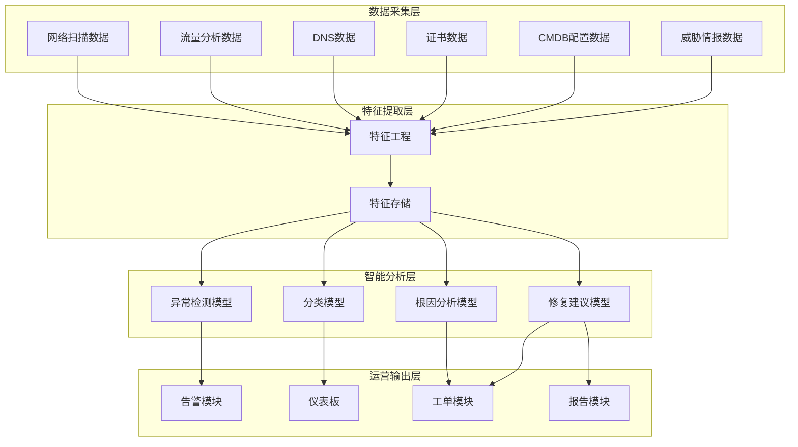
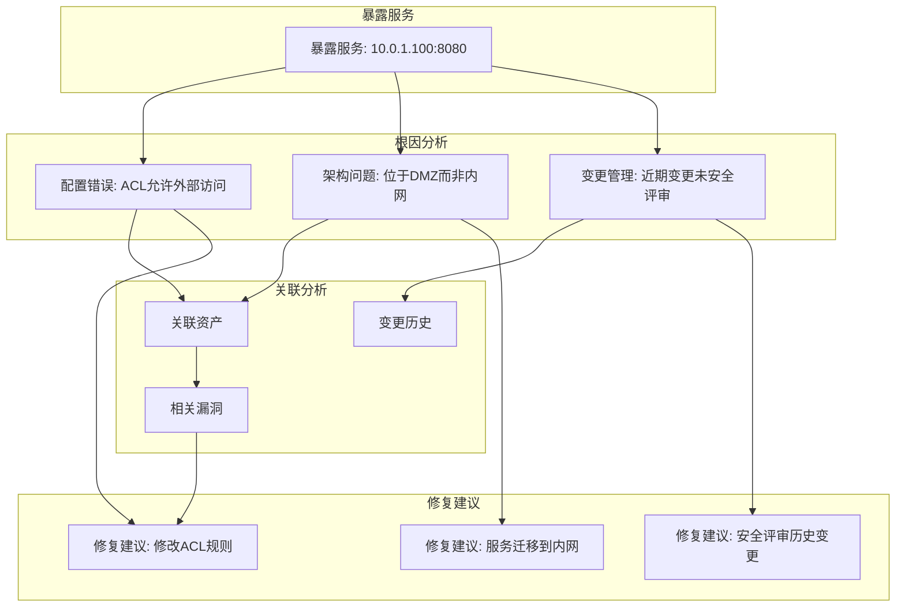
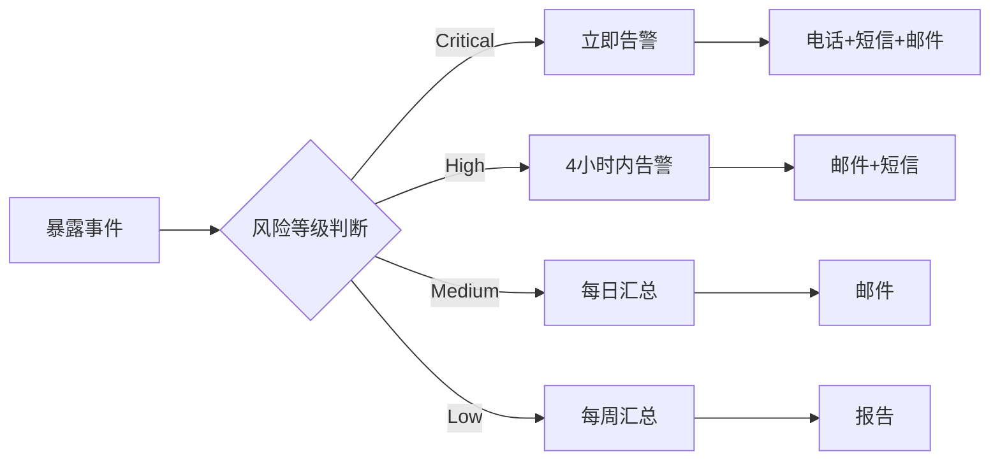
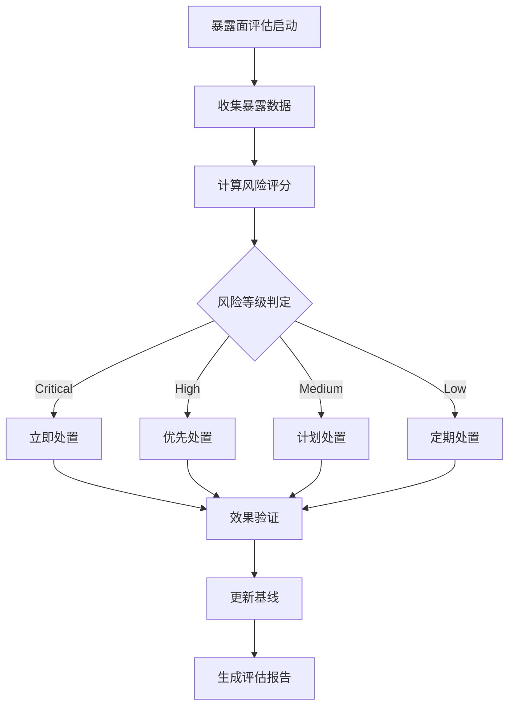
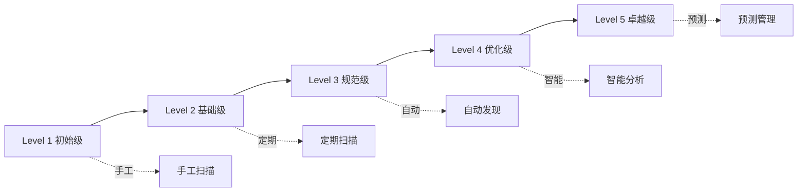

**作者：** HOS(安全风信子)
**日期：** 2026-04-24
**主要来源平台：** GitHub/arXiv
**摘要：** 企业暴露的服务如同敞开的大门，成为攻击者的首选入口。传统的暴露面发现依赖手工扫描和定期巡检，难以应对云原生环境下服务快速迭代带来的挑战。本文深入探讨AI驱动的暴露服务发现技术，通过多源数据融合、上下文智能分析、根因自动诊断等核心能力，帮助企业构建持续实时的暴露面监控体系。我们引入了基于知识图谱的暴露风险评估模型和自适应修复建议生成算法，不仅能够精准识别暴露服务，还能追溯暴露根因并生成可操作的修复方案。在云原生和混合IT成为主流的今天，这项技术正在重新定义企业攻击面管理的边界。

@[TOC](目录)

---

# 你的服务正在裸奔：AI发现暴露服务的实战方法论

## 1. 引言：暴露服务——被忽视的攻击入口

在企业安全运营中，暴露服务问题长期处于被忽视的角落。不同于广为人知的钓鱼攻击或恶意软件，暴露服务往往隐藏在正常业务运转的阴影中，却为攻击者提供了最直接的攻击路径。根据Verizon 2025年数据泄露调查报告，超过30%的数据泄露事件源于暴露服务的漏洞利用，而其中相当一部分本可以通过及时的暴露面发现和修复来避免。

传统的暴露服务发现方法面临诸多困境。首先是被动扫描的滞后性——传统工具依赖定期扫描，无法捕捉服务暴露的瞬时状态；其次是上下文理解的缺失——扫描器能够发现端口开放，却无法判断这是否属于异常暴露；第三个挑战是根因分析的困难——当发现一个暴露服务时，安全团队往往无法快速确定其暴露原因和修复优先级。

AI技术的引入为暴露服务发现带来了革命性的突破。通过机器学习模型对网络流量、日志数据、配置信息的综合分析，AI系统能够实现暴露服务的实时发现、智能分类、根因诊断和修复建议生成，让安全团队从海量的扫描结果中解放出来，专注于真正需要关注的暴露风险。

本文将从暴露服务的风险分类、技术架构、核心算法、实战应用等多个维度，系统性介绍AI驱动暴露服务发现的技术原理与实战方法，帮助企业构建完整的暴露面监控能力。

## 2. 暴露服务的风险分类与识别

### 2.1 暴露服务的定义与分类

暴露服务是指原本设计为内部使用或受限访问的服务，由于配置错误、架构变更或管理疏忽等原因，被意外暴露到不可信网络环境中。根据暴露范围和风险程度，可以将暴露服务划分为四个等级：

**全网暴露（Level 4）**：服务直接暴露在互联网，任何人可以直接访问。这类暴露最为危险，常见于测试环境的管理后台、调试端口、未授权的远程访问服务等。一旦这类服务存在漏洞，攻击者可以毫无阻碍地进行利用。

**VPN后暴露（Level 3）**：服务需要通过VPN或堡垒机访问，看似安全但存在凭证窃取和VPN绕过的风险。这类暴露通常包括内部管理平台、运维系统、业务后台等。

**内网可见暴露（Level 2）**：服务仅在内网可见，但在横向移动场景下可能被攻击者利用。这类暴露的危害在于，一旦攻击者突破边界防线，就能在内网快速扩展。

**合作网络暴露（Level 1）**：通过专线或VPN连接到企业的第三方合作网络可见的暴露。这类暴露需要关注供应链攻击风险。

```python
class ExposedServiceClassifier:
    """
    暴露服务分类器
    基于多维度特征对暴露服务进行风险等级分类
    """

    EXPOSURE_LEVELS = {
        4: {
            'name': '全网暴露',
            'description': '服务直接暴露在互联网',
            'risk_score': 0.9,
            'color': 'red'
        },
        3: {
            'name': 'VPN后暴露',
            'description': '需要VPN认证才能访问',
            'risk_score': 0.6,
            'color': 'orange'
        },
        2: {
            'name': '内网可见暴露',
            'description': '仅内网可见',
            'risk_score': 0.3,
            'color': 'yellow'
        },
        1: {
            'name': '合作网络暴露',
            'description': '第三方合作网络可见',
            'risk_score': 0.4,
            'color': 'blue'
        }
    }

    def __init__(self, feature_engine, model):
        self.feature_engine = feature_engine
        self.model = model
        self.threat_intel = ThreatIntelClient()

    def classify(self, service_data):
        """
        对暴露服务进行分类

        参数:
            service_data: 包含服务信息的字典

        返回:
            dict: 分类结果，包含暴露等级、风险评分和建议
        """
        features = self.feature_engine.extract(service_data)

        exposure_level = self.model.predict(features)

        risk_factors = self._analyze_risk_factors(service_data, features)

        threat_context = self._enrich_threat_context(service_data)

        final_risk = self._calculate_risk_score(
            exposure_level,
            risk_factors,
            threat_context
        )

        remediation = self._generate_remediation(
            service_data,
            exposure_level,
            risk_factors
        )

        return {
            'service_id': service_data['id'],
            'service_name': service_data.get('name'),
            'exposure_level': exposure_level,
            'exposure_details': self.EXPOSURE_LEVELS[exposure_level],
            'risk_score': final_risk,
            'risk_factors': risk_factors,
            'threat_context': threat_context,
            'remediation': remediation,
            'confidence': self.model.get_confidence()
        }

    def _analyze_risk_factors(self, service_data, features):
        """分析风险因子"""
        risk_factors = []

        if features.get('has_known_vulnerabilities'):
            risk_factors.append({
                'factor': 'known_vulnerabilities',
                'severity': 'high',
                'description': '服务存在已知漏洞',
                'vulns': features.get('vulnerability_list')
            })

        if features.get('has_default_credentials'):
            risk_factors.append({
                'factor': 'default_credentials',
                'severity': 'critical',
                'description': '使用默认凭据'
            })

        if features.get('protocol_security') < 0.5:
            risk_factors.append({
                'factor': 'weak_protocol',
                'severity': 'medium',
                'description': '使用不安全的协议'
            })

        if features.get('is_admin_interface'):
            risk_factors.append({
                'factor': 'admin_interface',
                'severity': 'critical',
                'description': '暴露管理接口'
            })

        return risk_factors

    def _enrich_threat_context(self, service_data):
        """丰富威胁上下文"""
        context = {}

        matching_iocs = self.threat_intel.search_iocs({
            'type': 'ip',
            'value': service_data.get('ip')
        })
        context['threat_intel_matches'] = len(matching_iocs) > 0
        context['related_iocs'] = matching_iocs[:5] if matching_iocs else []

        cve_matches = self.threat_intel.search_cves({
            'service': service_data.get('name'),
            'version': service_data.get('version')
        })
        context['relevant_cves'] = cve_matches

        return context
```

### 2.2 暴露服务的识别特征工程

准确识别暴露服务需要对多种数据源进行综合分析。AI模型需要提取的特征维度包括网络层特征、服务层特征、业务层特征和安全层特征。

**网络层特征**涵盖服务的网络可达性、协议特征、流量模式等。通过分析网络流量，可以发现异常的服务暴露行为，例如某个服务突然开始响应来自陌生IP的请求。

**服务层特征**包括服务类型、版本信息、配置状态等。通过服务指纹识别技术，可以精确判断服务类型和版本，进而关联已知漏洞信息。

**业务层特征**关注服务与企业业务的相关性、访问模式、用户群体等。这些特征有助于判断暴露服务的业务重要性，从而确定修复优先级。

**安全层特征**包括认证状态、加密配置、历史告警等。这些特征直接影响暴露服务的实际风险水平。

```python
class ExposedServiceFeatureEngineering:
    """
    暴露服务特征工程
    从多源数据中提取暴露服务识别所需的特征
    """

    def __init__(self, data_sources):
        self.data_sources = data_sources
        self.feature_store = FeatureStore()

    def extract(self, service_candidates):
        """
        提取暴露服务特征

        参数:
            service_candidates: 待分析的服务候选列表

        返回:
            dict: 特征向量
        """
        features = {}

        network_features = self._extract_network_features(service_candidates)
        features.update(network_features)

        service_features = self._extract_service_features(service_candidates)
        features.update(service_features)

        business_features = self._extract_business_features(service_candidates)
        features.update(business_features)

        security_features = self._extract_security_features(service_candidates)
        features.update(security_features)

        contextual_features = self._extract_contextual_features(service_candidates)
        features.update(contextual_features)

        return features

    def _extract_network_features(self, services):
        """提取网络层特征"""
        features = {}

        for service in services:
            ip = service.get('ip')
            port = service.get('port')

            exposure_status = self._check_internet_exposure(ip, port)
            features[f'{ip}:{port}_exposed'] = exposure_status

            geo_locations = self._get_ip_geolocation(ip)
            features[f'{ip}:{port}_geo'] = geo_locations

            asn_info = self._get_asn_info(ip)
            features[f'{ip}:{port}_asn'] = asn_info

            bgp_announcements = self._check_bgp_exposure(ip)
            features[f'{ip}:{port}_bgp'] = bgp_announcements

        return features

    def _extract_service_features(self, services):
        """提取服务层特征"""
        features = {}

        for service in services:
            service_info = self._identify_service(service)

            features[f'{service["id"]}_type'] = service_info.get('type')
            features[f'{service["id"]}_version'] = service_info.get('version')
            features[f'{service["id"]}_fingerprint'] = service_info.get('fingerprint')

            config_issues = self._check_service_config(service)
            features[f'{service["id"]}_config_score'] = config_issues.get('score')

            features[f'{service["id"]}_protocol_security'] = self._assess_protocol_security(
                service_info.get('protocol')
            )

        return features

    def _extract_business_features(self, services):
        """提取业务层特征"""
        features = {}

        cmdb_data = self.data_sources.get('cmdb')

        for service in services:
            business_context = cmdb_data.get_business_context(
                service.get('ip'),
                service.get('port')
            )

            features[f'{service["id"]}_business_criticality'] = business_context.get(
                'criticality', 'medium'
            )
            features[f'{service["id"]}_owner'] = business_context.get('owner')
            features[f'{service["id"]}_department'] = business_context.get('department')
            features[f'{service["id"]}_sla_tier'] = business_context.get('sla_tier')

        return features

    def _extract_security_features(self, services):
        """提取安全层特征"""
        features = {}

        siem_data = self.data_sources.get('siem')
        vuln_data = self.data_sources.get('vulnerability_scanner')

        for service in services:
            security_events = siem_data.query({
                'ip': service.get('ip'),
                'port': service.get('port'),
                'time_range': '30d'
            })
            features[f'{service["id"]}_recent_events'] = len(security_events)

            vulnerabilities = vuln_data.get_vulnerabilities({
                'ip': service.get('ip'),
                'port': service.get('port')
            })
            features[f'{service["id"]}_vuln_count'] = len(vulnerabilities)
            features[f'{service["id"]}_critical_vulns'] = sum(
                1 for v in vulnerabilities if v.get('severity') == 'critical'
            )

            auth_config = self._check_authentication_config(service)
            features[f'{service["id"]}_auth_enabled'] = auth_config.get('enabled')
            features[f'{service["id"]}_mfa_enabled'] = auth_config.get('mfa')

        return features
```

## 3. AI驱动的暴露服务发现技术架构

### 3.1 整体架构设计

AI驱动的暴露服务发现系统采用分层架构设计，从数据采集到智能分析再到运营输出，形成完整的数据处理闭环。

**数据采集层**负责从多源获取暴露服务相关数据。数据源包括网络扫描数据、流量分析数据、DNS数据、证书数据、CMDB配置数据、威胁情报数据等。采集层采用流式处理架构，支持实时数据摄入和批量数据导入两种模式。

**特征提取层**对原始数据进行清洗、标准化和特征向量化。特征工程模块将不同来源的数据转换为统一的特征表示，包括数值特征、类别特征、时序特征等多种类型。特征存储模块采用向量数据库，支持高效的相似性检索。

**智能分析层**是系统的核心，包括多个AI模型和服务。异常检测模型负责发现异常的暴露行为；分类模型对暴露服务进行风险分级；根因分析模型诊断暴露原因；修复建议模型生成可操作的修复方案。

**运营输出层**将分析结果以多种形式输出。告警模块将高风险暴露服务推送给安全团队；仪表板模块提供可视化的暴露面态势；工单模块自动创建修复工单；报告模块生成定期暴露面分析报告。



### 3.2 暴露服务发现的核心算法

**基于时序分析的暴露异常检测**是发现异常暴露行为的关键技术。系统首先建立正常服务暴露的基线模型，然后对实时数据流进行监控，当检测到偏离基线的行为时触发告警。

时序异常检测算法采用多维度特征提取和动态阈值调整策略。系统不仅监控暴露服务的数量变化，还追踪访问源分布、访问时间模式、协议使用变化等多个维度。这种多维度监控能够发现传统单指标监控无法识别的复杂异常行为。

**基于上下文的暴露风险评估**综合考虑服务特征、业务上下文、威胁情报等多维度信息，生成精确的风险评分。

```python
class ExposureAnomalyDetector:
    """
    暴露异常检测器
    基于时序分析发现异常的服务暴露行为
    """

    def __init__(self, time_series_db, model_registry):
        self.ts_db = time_series_db
        self.models = model_registry
        self.baseline_window = 30
        self.anomaly_threshold = 3.0

    def detect(self, current_exposure_data):
        """
        检测暴露异常

        参数:
            current_exposure_data: 当前暴露数据

        返回:
            dict: 异常检测结果
        """
        service_key = self._get_service_key(current_exposure_data)

        historical_data = self.ts_db.query(
            service_key,
            window=self.baseline_window
        )

        baseline = self._calculate_baseline(historical_data)

        current_features = self._extract_features(current_exposure_data)

        anomaly_score = self._calculate_anomaly_score(
            current_features,
            baseline
        )

        is_anomaly = anomaly_score > self.anomaly_threshold

        if is_anomaly:
            explanation = self._explain_anomaly(
                current_features,
                baseline,
                anomaly_score
            )
        else:
            explanation = None

        return {
            'service_key': service_key,
            'is_anomaly': is_anomaly,
            'anomaly_score': anomaly_score,
            'anomaly_type': self._classify_anomaly(current_features, baseline) if is_anomaly else None,
            'explanation': explanation,
            'baseline': baseline,
            'current': current_features
        }

    def _calculate_baseline(self, historical_data):
        """计算基线统计量"""
        import numpy as np

        baseline = {
            'exposure_count_mean': np.mean([d['exposure_count'] for d in historical_data]),
            'exposure_count_std': np.std([d['exposure_count'] for d in historical_data]),
            'access_sources': self._calculate_access_distribution(historical_data),
            'access_patterns': self._calculate_access_patterns(historical_data)
        }

        return baseline

    def _calculate_anomaly_score(self, current_features, baseline):
        """计算异常分数"""
        import numpy as np

        exposure_delta = abs(
            current_features['exposure_count'] - baseline['exposure_count_mean']
        ) / (baseline['exposure_count_std'] + 1e-6)

        source_jaccard = self._jaccard_similarity(
            current_features['access_sources'],
            baseline['access_sources']
        )

        pattern_distance = self._calculate_pattern_distance(
            current_features['access_patterns'],
            baseline['access_patterns']
        )

        anomaly_score = (
            exposure_delta * 0.4 +
            (1 - source_jaccard) * 0.3 +
            pattern_distance * 0.3
        )

        return anomaly_score

    def _explain_anomaly(self, current_features, baseline, score):
        """生成异常解释"""
        explanations = []

        if current_features['exposure_count'] > baseline['exposure_count_mean'] * 2:
            explanations.append(
                f"暴露服务数量异常增加：当前{current_features['exposure_count']}，"
                f"基线{baseline['exposure_count_mean']:.1f}"
            )

        new_sources = set(current_features['access_sources']) - set(baseline['access_sources'])
        if new_sources:
            explanations.append(
                f"发现新的访问来源：{', '.join(list(new_sources)[:3])}"
            )

        unusual_access = self._detect_unusual_access_pattern(
            current_features['access_patterns'],
            baseline['access_patterns']
        )
        if unusual_access:
            explanations.append(f"检测到异常访问模式：{unusual_access}")

        return explanations
```

**基于上下文的暴露风险评估**综合考虑服务特征、业务上下文、威胁情报等多维度信息，生成精确的风险评分。

```python
class ExposureRiskAssessor:
    """
    暴露风险评估器
    基于多维度上下文信息评估暴露服务风险
    """

    def __init__(self, knowledge_graph, threat_intel, config):
        self.kg = knowledge_graph
        self.threat_intel = threat_intel
        self.config = config
        self.risk_weights = config.get('risk_weights', {})

    def assess(self, exposed_service):
        """
        评估暴露服务风险

        参数:
            exposed_service: 暴露服务信息

        返回:
            dict: 风险评估结果
        """
        technical_risk = self._assess_technical_risk(exposed_service)

        business_risk = self._assess_business_risk(exposed_service)

        threat_risk = self._assess_threat_risk(exposed_service)

        contextual_risk = self._assess_contextual_risk(exposed_service)

        overall_risk = self._calculate_overall_risk(
            technical_risk,
            business_risk,
            threat_risk,
            contextual_risk
        )

        risk_factors = self._identify_risk_factors(
            exposed_service,
            technical_risk,
            business_risk,
            threat_risk
        )

        return {
            'service_id': exposed_service['id'],
            'overall_risk_score': overall_risk,
            'risk_level': self._get_risk_level(overall_risk),
            'technical_risk': technical_risk,
            'business_risk': business_risk,
            'threat_risk': threat_risk,
            'contextual_risk': contextual_risk,
            'risk_factors': risk_factors,
            'assessment_timestamp': datetime.now().isoformat()
        }

    def _assess_contextual_risk(self, service):
        """评估上下文风险"""
        context_score = 0.0
        factors = []

        asset_criticality = self.kg.get_asset_criticality(
            service.get('ip'),
            service.get('port')
        )
        if asset_criticality:
            context_score += asset_criticality * 0.2
            factors.append(f"资产关键性评分：{asset_criticality}")

        related_incidents = self.kg.get_related_incidents(
            service.get('ip')
        )
        if related_incidents:
            context_score += min(len(related_incidents) * 0.05, 0.15)
            factors.append(f"相关安全事件：{len(related_incidents)}起")

        exposure_history = self.kg.get_exposure_history(
            service.get('id')
        )
        if exposure_history:
            historical_severity = self._calculate_historical_severity(exposure_history)
            context_score += historical_severity * 0.15
            factors.append(f"历史暴露严重度：{historical_severity}")

        return {
            'score': min(context_score, 1.0),
            'factors': factors
        }

    def _calculate_overall_risk(self, technical, business, threat, contextual):
        """计算综合风险评分"""
        weights = {
            'technical': 0.35,
            'business': 0.25,
            'threat': 0.25,
            'contextual': 0.15
        }

        overall = (
            technical['score'] * weights['technical'] +
            business['score'] * weights['business'] +
            threat['score'] * weights['threat'] +
            contextual['score'] * weights['contextual']
        )

        return min(round(overall, 3), 1.0)

    def _get_risk_level(self, score):
        """获取风险等级"""
        if score >= 0.8:
            return 'critical'
        elif score >= 0.6:
            return 'high'
        elif score >= 0.4:
            return 'medium'
        elif score >= 0.2:
            return 'low'
        else:
            return 'info'

    def _identify_risk_factors(self, service, technical, business, threat):
        """识别主要风险因子"""
        factors = []

        if technical['score'] > 0.5:
            factors.extend([
                {'type': 'technical', 'detail': f} for f in technical['factors']
            ])

        if business['score'] > 0.3:
            factors.extend([
                {'type': 'business', 'detail': f} for f in business['factors']
            ])

        if threat['score'] > 0.3:
            factors.extend([
                {'type': 'threat', 'detail': f} for f in threat['factors']
            ])

        return sorted(factors, key=lambda x: x['type'], reverse=True)

    def _calculate_historical_severity(self, exposure_history):
        """计算历史暴露严重度"""
        if not exposure_history:
            return 0.0

        severity_map = {'critical': 1.0, 'high': 0.75, 'medium': 0.5, 'low': 0.25}
        severities = [
            severity_map.get(e.get('severity'), 0.5)
            for e in exposure_history
        ]

        weighted_avg = sum(severities) / len(severities)

        recency_weight = 1.0
        return weighted_avg * recency_weight

    def _assess_technical_risk(self, service):
        """评估技术风险"""
        tech_score = 0.0
        factors = []

        if service.get('has_vulnerabilities'):
            vuln_severity = service.get('max_vuln_severity', 'medium')
            severity_scores = {
                'critical': 0.4,
                'high': 0.25,
                'medium': 0.15,
                'low': 0.05
            }
            tech_score += severity_scores.get(vuln_severity, 0.1)
            factors.append(f"存在{vuln_severity}级别漏洞")

        if not service.get('encryption_enabled'):
            tech_score += 0.2
            factors.append("未启用加密传输")

        if service.get('has_default_credentials'):
            tech_score += 0.25
            factors.append("使用默认凭据")

        if service.get('protocol_security_score', 1.0) < 0.5:
            tech_score += 0.15
            factors.append("使用不安全协议")

        return {
            'score': min(tech_score, 1.0),
            'factors': factors
        }

    def _assess_business_risk(self, service):
        """评估业务风险"""
        business_score = 0.0
        factors = []

        business_criticality = service.get('business_criticality', 'medium')
        criticality_scores = {
            'critical': 0.3,
            'high': 0.2,
            'medium': 0.1,
            'low': 0.05
        }
        business_score += criticality_scores.get(business_criticality, 0.1)
        factors.append(f"业务关键性：{business_criticality}")

        if service.get('handles_pii'):
            business_score += 0.15
            factors.append("处理个人身份信息")

        if service.get('handles_financial'):
            business_score += 0.15
            factors.append("处理财务数据")

        if service.get('handles_ipp'):
            business_score += 0.1
            factors.append("处理知识产权")

        return {
            'score': min(business_score, 1.0),
            'factors': factors
        }

    def _assess_threat_risk(self, service):
        """评估威胁风险"""
        threat_score = 0.0
        factors = []

        threat_intel_matches = self.threat_intel.check_service(
            service.get('name'),
            service.get('version')
        )
        if threat_intel_matches:
            threat_score += 0.3
            factors.append(f"匹配威胁情报：{len(threat_intel_matches)}条")

        exploit_kits = self.threat_intel.check_exploit_kits(
            service.get('vulnerabilities', [])
        )
        if exploit_kits:
            threat_score += 0.25
            factors.append(f"存在可利用漏洞：{len(exploit_kits)}个")

        recent_attacks = self.threat_intel.check_attack_trends(
            service.get('category')
        )
        if recent_attacks.get('trend', 0) > 0.5:
            threat_score += 0.15
            factors.append(f"攻击趋势上升：{recent_attacks.get('trend')}")

        return {
            'score': min(threat_score, 1.0),
            'factors': factors
        }

### 3.3 多源数据采集与处理

暴露服务发现依赖于多样化的数据来源，系统支持从多个数据源进行实时和批量数据采集。数据采集模块采用插件化设计，便于扩展新的数据源。

#### 3.3.1 数据采集框架设计

数据采集框架采用统一的数据抽象层，将不同数据源的数据转换为标准化格式，便于后续处理和分析。

```python
class UnifiedDataCollector:
    """
    统一数据采集器
    支持多源数据的标准化采集和处理
    """

    def __init__(self, config):
        self.config = config
        self.collectors = {}
        self.data_buffer = DataBuffer()
        self.processors = []
        self._initialize_collectors()

    def _initialize_collectors(self):
        """初始化各类数据采集器"""
        self.collectors = {
            'network_scanner': NetworkScannerCollector(self.config.get('network_scanner')),
            'traffic_analyzer': TrafficAnalyzerCollector(self.config.get('traffic_analyzer')),
            'dns_monitor': DNSMonitorCollector(self.config.get('dns_monitor')),
            'certificate_scanner': CertificateScannerCollector(self.config.get('certificate_scanner')),
            'cmdb_client': CMDBClient(self.config.get('cmdb')),
            'threat_intel': ThreatIntelCollector(self.config.get('threat_intel'))
        }

    def collect_all(self, mode='realtime'):
        """
        执行全量数据采集

        参数:
            mode: 采集模式，realtime或batch
        """
        results = {}

        for name, collector in self.collectors.items():
            try:
                data = collector.collect(mode=mode)
                standardized = self._standardize_data(name, data)
                results[name] = standardized
                self.data_buffer.put(name, standardized)
            except Exception as e:
                logger.error(f"Collector {name} failed: {str(e)}")
                results[name] = {'error': str(e)}

        processed = self._run_processors(results)

        return {
            'raw_data': results,
            'processed_data': processed,
            'collection_timestamp': datetime.now().isoformat(),
            'mode': mode
        }

    def _standardize_data(self, source_name, raw_data):
        """标准化不同来源的数据"""
        standards = {
            'network_scanner': self._standardize_network_data,
            'traffic_analyzer': self._standardize_traffic_data,
            'dns_monitor': self._standardize_dns_data,
            'certificate_scanner': self._standardize_certificate_data,
            'cmdb_client': self._standardize_cmdb_data,
            'threat_intel': self._standardize_threat_intel_data
        }

        standardizer = standards.get(source_name, lambda x: x)
        return standardizer(raw_data)

    def _standardize_network_data(self, data):
        """标准化网络扫描数据"""
        standardized = {
            'type': 'network_scan',
            'timestamp': datetime.now().isoformat(),
            'services': []
        }

        for item in data.get('services', []):
            standardized['services'].append({
                'ip': item.get('host'),
                'port': item.get('port'),
                'protocol': item.get('protocol', 'tcp'),
                'service_type': item.get('service'),
                'version': item.get('version'),
                'state': item.get('state'),
                'banner': item.get('banner'),
                'fingerprint': item.get('fingerprint')
            })

        return standardized

    def _standardize_traffic_data(self, data):
        """标准化流量分析数据"""
        standardized = {
            'type': 'traffic_analysis',
            'timestamp': datetime.now().isoformat(),
            'flows': []
        }

        for flow in data.get('flows', []):
            standardized['flows'].append({
                'src_ip': flow.get('source_ip'),
                'src_port': flow.get('source_port'),
                'dst_ip': flow.get('dest_ip'),
                'dst_port': flow.get('dest_port'),
                'protocol': flow.get('protocol'),
                'bytes_in': flow.get('bytes_in'),
                'bytes_out': flow.get('bytes_out'),
                'packets': flow.get('packets'),
                'duration': flow.get('duration')
            })

        return standardized
```

#### 3.3.2 数据质量控制

数据质量直接影响暴露服务发现的准确性。系统实现了多层次的数据质量控制机制，确保输入数据的准确性和完整性。

```python
class DataQualityController:
    """
    数据质量控制器
    确保采集数据的准确性、完整性和一致性
    """

    def __init__(self, config):
        self.config = config
        self.quality_rules = self._load_quality_rules()
        self.statistics = defaultdict(int)

    def validate(self, data, data_type):
        """
        验证数据质量

        参数:
            data: 待验证的数据
            data_type: 数据类型

        返回:
            dict: 验证结果
        """
        results = {
            'is_valid': True,
            'issues': [],
            'quality_score': 1.0,
            'corrections': []
        }

        completeness = self._check_completeness(data, data_type)
        if completeness < self.quality_rules.get('min_completeness', 0.8):
            results['is_valid'] = False
            results['issues'].append(f'Completeness {completeness} below threshold')

        consistency = self._check_consistency(data, data_type)
        if consistency < 1.0:
            results['quality_score'] *= consistency
            results['corrections'].extend(self._fix_consistency_issues(data, consistency))

        accuracy = self._check_accuracy(data, data_type)
        if accuracy < self.quality_rules.get('min_accuracy', 0.9):
            results['is_valid'] = False
            results['issues'].append(f'Accuracy {accuracy} below threshold')

        timeliness = self._check_timeliness(data)
        results['timeliness'] = timeliness

        return results

    def _check_completeness(self, data, data_type):
        """检查数据完整性"""
        required_fields = self.quality_rules.get(data_type, {}).get('required_fields', [])
        if not required_fields:
            return 1.0

        total_fields = len(required_fields)
        present_fields = sum(1 for f in required_fields if self._has_field(data, f))

        return present_fields / total_fields if total_fields > 0 else 1.0

    def _check_consistency(self, data, data_type):
        """检查数据一致性"""
        consistency_checks = self.quality_rules.get(data_type, {}).get('consistency_checks', [])

        passed = 0
        total = len(consistency_checks)

        for check in consistency_checks:
            if self._apply_consistency_check(data, check):
                passed += 1

        return passed / total if total > 0 else 1.0

    def _check_accuracy(self, data, data_type):
        """检查数据准确性"""
        range_checks = self.quality_rules.get(data_type, {}).get('range_checks', [])

        passed = 0
        total = len(range_checks)

        for check in range_checks:
            if self._apply_range_check(data, check):
                passed += 1

        return passed / total if total > 0 else 1.0

    def _has_field(self, data, field_path):
        """检查字段是否存在"""
        parts = field_path.split('.')
        current = data

        for part in parts:
            if isinstance(current, dict) and part in current:
                current = current[part]
            else:
                return False

        return True
```

### 3.4 特征存储与检索系统

为了支持高效的暴露服务分析，系统构建了专用的特征存储和检索引擎。特征存储采用混合存储架构，结合关系型数据库的结构化查询能力和向量数据库的相似性检索能力。

```python
class FeatureStorageEngine:
    """
    特征存储引擎
    支持结构化特征和向量特征的高效存储与检索
    """

    def __init__(self, config):
        self.config = config
        self.relational_db = RelationalDB(config.get('relational'))
        self.vector_db = VectorDB(config.get('vector'))
        self.cache = RedisCache(config.get('redis'))
        self.feature_schema = self._load_feature_schema()

    def store_features(self, service_id, features):
        """
        存储服务特征

        参数:
            service_id: 服务标识
            features: 特征字典
        """
        structured_features = self._extract_structured_features(features)
        vector_features = self._extract_vector_features(features)

        self.relational_db.upsert(
            'service_features',
            {'service_id': service_id},
            structured_features
        )

        if vector_features:
            self.vector_db.upsert(
                collection_name='service_embeddings',
                id=service_id,
                vector=vector_features,
                metadata=structured_features
            )

        self.cache.set(f'features:{service_id}', features, ttl=3600)

        return {'status': 'stored', 'service_id': service_id}

    def retrieve_similar_services(self, service_id, top_k=10):
        """
        检索相似服务

        参数:
            service_id: 服务标识
            top_k: 返回前k个最相似服务

        返回:
            list: 相似服务列表
        """
        cached = self.cache.get(f'features:{service_id}')
        if cached:
            target_features = cached
        else:
            target_features = self._load_features(service_id)

        vector_features = self._extract_vector_features(target_features)

        similar = self.vector_db.search(
            collection_name='service_embeddings',
            query_vector=vector_features,
            top_k=top_k + 1
        )

        results = [
            {'service_id': s['id'], 'similarity': s['score']}
            for s in similar if s['id'] != service_id
        ][:top_k]

        return results

    def query_by_features(self, feature_filter, pagination=None):
        """
        按特征查询服务

        参数:
            feature_filter: 特征过滤条件
            pagination: 分页参数

        返回:
            dict: 查询结果
        """
        sql_conditions = self._build_sql_conditions(feature_filter)

        query = f"SELECT * FROM service_features WHERE {sql_conditions}"

        if pagination:
            query += f" LIMIT {pagination.get('limit', 100)} OFFSET {pagination.get('offset', 0)}"

        results = self.relational_db.execute_query(query)

        return {
            'count': len(results),
            'data': results,
            'pagination': pagination
        }

    def _extract_structured_features(self, features):
        """提取结构化特征"""
        structured = {}

        numeric_fields = ['port', 'exposure_score', 'vulnerability_count', 'access_count']
        for field in numeric_fields:
            if field in features:
                structured[field] = features[field]

        categorical_fields = ['service_type', 'exposure_level', 'protocol', 'zone']
        for field in categorical_fields:
            if field in features:
                structured[field] = features[field]

        return structured

    def _extract_vector_features(self, features):
        """提取向量特征"""
        embedding_fields = ['service_fingerprint', 'behavior_pattern', 'config_embedding']

        for field in embedding_fields:
            if field in features and features[field] is not None:
                return features[field]

        return self._generate_default_embedding(features)
```

## 4. 暴露服务根因分析技术

### 4.1 根因分析的意义与方法论

发现暴露服务只是第一步，更重要的是理解为什么会暴露、如何修复、以及修复的优先级。根因分析模块通过多维度溯源，帮助安全团队快速定位问题根源。

暴露服务的根因可以分为以下几类：

**配置错误类**：包括安全配置缺失、网络ACL配置错误、服务部署配置不当等。这类问题通常可以通过配置调整快速修复。

**架构设计类**：包括网络架构不合理、零信任架构未落实、微服务边界不清等。这类问题需要从架构层面进行改进。

**变更管理类**：包括变更流程不规范、变更记录缺失、变更验证不充分等。这类问题需要完善变更管理流程。

**生命周期管理类**：包括资产下线不彻底、临时环境未清理、测试资源遗留等。这类问题需要建立完善的资产生命周期管理机制。

```python
class RootCauseAnalyzer:
    """
    暴露服务根因分析器
    通过多维度溯源定位暴露根因
    """

    def __init__(self, cmdb, change_mgmt, network_db, config_db):
        self.cmdb = cmdb
        self.change_mgmt = change_mgmt
        self.network_db = network_db
        self.config_db = config_db
        self.kg = KnowledgeGraph()

    def analyze(self, exposed_service):
        """
        分析暴露服务根因

        参数:
            exposed_service: 暴露服务信息

        返回:
            dict: 根因分析结果
        """
        potential_causes = []

        config_issues = self._analyze_configuration_issues(exposed_service)
        potential_causes.extend(config_issues)

        architecture_issues = self._analyze_architecture_issues(exposed_service)
        potential_causes.extend(architecture_issues)

        change_issues = self._analyze_change_issues(exposed_service)
        potential_causes.extend(change_issues)

        lifecycle_issues = self._analyze_lifecycle_issues(exposed_service)
        potential_causes.extend(lifecycle_issues)

        root_causes = self._prioritize_causes(potential_causes)

        causal_chain = self._build_causal_chain(exposed_service, root_causes)

        return {
            'service_id': exposed_service['id'],
            'root_causes': root_causes,
            'causal_chain': causal_chain,
            'confidence': self._calculate_confidence(root_causes),
            'analysis_timestamp': datetime.now().isoformat()
        }

    def _analyze_configuration_issues(self, service):
        """分析配置问题"""
        issues = []

        expected_config = self.config_db.get_expected_config(
            service.get('name'),
            service.get('version')
        )
        actual_config = self.config_db.get_actual_config(
            service.get('ip'),
            service.get('port')
        )

        config_diff = self._diff_config(expected_config, actual_config)

        for key, diff in config_diff.items():
            if diff.get('security_related'):
                issues.append({
                    'category': 'configuration',
                    'sub_category': key,
                    'severity': diff.get('severity', 'medium'),
                    'description': diff.get('description'),
                    'expected': diff.get('expected'),
                    'actual': diff.get('actual'),
                    'remediation': diff.get('remediation'),
                    'auto_remediable': diff.get('auto_remediable', False)
                })

        network_acl = self.network_db.get_acl(service.get('ip'), service.get('port'))
        if network_acl.get('allows_external'):
            issues.append({
                'category': 'configuration',
                'sub_category': 'network_acl',
                'severity': 'high',
                'description': '网络ACL允许外部访问',
                'expected': '仅允许内网或特定IP段访问',
                'actual': '允许所有地址访问',
                'remediation': '修改ACL规则限制访问源',
                'auto_remediable': True
            })

        return issues

    def _analyze_architecture_issues(self, service):
        """分析架构问题"""
        issues = []

        network_zone = self.network_db.get_zone(service.get('ip'))
        expected_zone = self._determine_expected_zone(service)

        if network_zone != expected_zone:
            issues.append({
                'category': 'architecture',
                'sub_category': 'network_zone',
                'severity': 'high',
                'description': f'服务位于{network_zone}但应位于{expected_zone}',
                'current_zone': network_zone,
                'expected_zone': expected_zone,
                'remediation': '将服务迁移到适当的安全区域',
                'auto_remediable': False,
                'migration_required': True
            })

        zero_trust_compliance = self._check_zero_trust_compliance(service)
        if not zero_trust_compliance.get('compliant'):
            issues.append({
                'category': 'architecture',
                'sub_category': 'zero_trust',
                'severity': 'medium',
                'description': '不符合零信任架构要求',
                'violations': zero_trust_compliance.get('violations'),
                'remediation': '实施零信任网络架构',
                'auto_remediable': False
            })

        service_mesh = self._analyze_service_mesh(service)
        if service_mesh.get('has_unnecessary_exposure'):
            issues.append({
                'category': 'architecture',
                'sub_category': 'service_mesh',
                'severity': 'medium',
                'description': '服务网格配置导致不必要的暴露',
                'exposure_points': service_mesh.get('exposure_points'),
                'remediation': '优化服务网格配置',
                'auto_remediable': True
            })

        return issues

    def _analyze_change_issues(self, service):
        """分析变更管理问题"""
        issues = []

        recent_changes = self.change_mgmt.get_changes({
            'service': service.get('id'),
            'time_range': '90d'
        })

        for change in recent_changes:
            if change.get('risk_level') == 'high' and not change.get('security_reviewed'):
                issues.append({
                    'category': 'change_management',
                    'sub_category': 'security_review',
                    'severity': 'medium',
                    'description': f"变更{change['id']}未经过安全评审",
                    'change_id': change['id'],
                    'change_date': change['date'],
                    'remediation': '对变更进行安全评审',
                    'auto_remediable': False
                })

        unauthorized_changes = [
            c for c in recent_changes
            if not c.get('approved')
        ]
        if unauthorized_changes:
            issues.append({
                'category': 'change_management',
                'sub_category': 'unauthorized_changes',
                'severity': 'high',
                'description': f'发现{len(unauthorized_changes)}个未授权变更',
                'changes': unauthorized_changes,
                'remediation': '审查并规范化变更流程',
                'auto_remediable': False
            })

        return issues
```

### 4.2 根因可视化与关联分析

根因分析的结果需要以直观的方式呈现给安全运营人员。通过知识图谱技术，可以将暴露服务与其根因、关联资产、修复任务等形成可视化的关联网络。



#### 4.2.1 知识图谱构建技术

系统采用知识图谱技术对暴露面数据进行建模，通过实体、关系和属性的形式表示暴露服务的复杂关联。

```python
class ExposureKnowledgeGraph:
    """
    暴露面知识图谱构建器
    将暴露面数据建模为知识图谱结构
    """

    def __init__(self, graph_db_config):
        self.graph_db = self._init_graph_db(graph_db_config)
        self.entity_schemas = self._load_entity_schemas()
        self.relation_schemas = self._load_relation_schemas()

    def _init_graph_db(self, config):
        """初始化图数据库连接"""
        if config.get('type') == 'neo4j':
            return Neo4jConnection(config)
        elif config.get('type') == 'nebula':
            return NebulaConnection(config)
        else:
            return NetworkXGraph()

    def build_graph(self, exposure_data):
        """
        构建暴露面知识图谱

        参数:
            exposure_data: 暴露面数据字典
        """
        self._create_service_entities(exposure_data.get('services', []))
        self._create_host_entities(exposure_data.get('hosts', []))
        self._create_vulnerability_entities(exposure_data.get('vulnerabilities', []))
        self._create_team_entities(exposure_data.get('teams', []))

        self._create_exposure_relations(exposure_data.get('services', []))
        self._create_network_relations(exposure_data.get('network_topology'))
        self._create_management_relations(exposure_data.get('services', []))

        self._build_exposure_paths()

        return {'status': 'graph_built', 'node_count': self._count_nodes()}

    def _create_service_entities(self, services):
        """创建服务实体"""
        for service in services:
            node_id = f"service_{service['id']}"
            properties = {
                'name': service.get('name'),
                'type': service.get('type'),
                'ip': service.get('ip'),
                'port': service.get('port'),
                'protocol': service.get('protocol'),
                'exposure_level': service.get('exposure_level'),
                'criticality': service.get('business_criticality', 'medium')
            }
            self.graph_db.upsert_node('Service', node_id, properties)

    def _create_exposure_relations(self, services):
        """创建暴露关系"""
        for service in services:
            service_id = f"service_{service['id']}"

            if service.get('exposure_level', 0) >= 3:
                self.graph_db.create_relation(
                    'Service', service_id,
                    'Internet', 'internet',
                    'exposed_to'
                )

            vulnerabilities = service.get('vulnerabilities', [])
            for vuln in vulnerabilities:
                vuln_id = f"vuln_{vuln['cve_id']}"
                self.graph_db.create_relation(
                    'Service', service_id,
                    'Vulnerability', vuln_id,
                    'affected_by'
                )

            host_id = f"host_{service['host_id']}"
            self.graph_db.create_relation(
                'Service', service_id,
                'Host', host_id,
                'hosted_on'
            )
```

#### 4.2.2 暴露路径分析

通过知识图谱，系统能够分析从互联网到核心资产的暴露路径，帮助安全团队理解攻击者可能的入侵路径。

```python
class ExposurePathAnalyzer:
    """
    暴露路径分析器
    分析从外部到内部资产的暴露路径
    """

    def __init__(self, knowledge_graph):
        self.kg = knowledge_graph
        self.max_path_length = 5

    def find_critical_paths(self, exposed_service_id):
        """
        查找关键暴露路径

        参数:
            exposed_service_id: 暴露服务ID

        返回:
            list: 关键路径列表
        """
        paths = []

        target_assets = self._find_critical_assets()

        for target in target_assets:
            path = self._find_shortest_path(exposed_service_id, target)
            if path:
                path_risk = self._calculate_path_risk(path)
                paths.append({
                    'path': path,
                    'risk_score': path_risk,
                    'entry_points': self._identify_entry_points(path)
                })

        return sorted(paths, key=lambda x: x['risk_score'], reverse=True)

    def _find_critical_assets(self):
        """查找关键资产"""
        critical_filters = [
            {'category': 'database'},
            {'category': 'identity_provider'},
            {'category': 'secret_store'}
        ]

        critical_assets = []
        for asset_filter in critical_filters:
            assets = self.kg.find_nodes('Asset', asset_filter)
            critical_assets.extend(assets)

        return critical_assets

    def _calculate_path_risk(self, path):
        """计算路径风险"""
        risk_score = 0.0

        for node in path:
            if node['type'] == 'Service':
                risk_score += node.get('exposure_level', 0) * 0.2
            elif node['type'] == 'Vulnerability':
                risk_score += node.get('cvss', 0) / 10 * 0.3

        hop_penalty = len(path) * 0.05
        risk_score -= hop_penalty

        return max(min(risk_score, 1.0), 0.0)
```

## 5. 自动修复建议生成

### 5.1 修复建议的智能生成

基于根因分析结果，修复建议模块能够自动生成针对性强、可操作的修复方案。修复建议不仅指出问题，还提供具体的修复步骤和验证方法。

```python
class RemediationSuggestionEngine:
    """
    修复建议生成引擎
    基于根因分析生成可操作的修复建议
    """

    def __init__(self, kb, playbook_db, llm):
        self.kb = kb
        self.playbook_db = playbook_db
        self.llm = llm
        self.remediation_templates = self._load_templates()

    def generate(self, root_cause_analysis):
        """
        生成修复建议

        参数:
            root_cause_analysis: 根因分析结果

        返回:
            list: 修复建议列表
        """
        suggestions = []

        for cause in root_cause_analysis.get('root_causes', []):
            template = self._find_template(cause)

            if template:
                suggestion = self._apply_template(template, cause)
            else:
                suggestion = self._generate_custom_suggestion(cause)

            enriched = self._enrich_suggestion(suggestion, cause)
            suggestions.append(enriched)

        prioritized = self._prioritize_suggestions(suggestions)

        return prioritized

    def _find_template(self, cause):
        """查找匹配的修复模板"""
        category = cause.get('category')
        sub_category = cause.get('sub_category')

        template_key = f"{category}_{sub_category}"

        return self.remediation_templates.get(template_key)

    def _apply_template(self, template, cause):
        """应用修复模板"""
        suggestion = {
            'title': template['title'],
            'description': template['description'],
            'steps': [],
            'validation': template.get('validation'),
            'estimated_effort': template.get('estimated_effort'),
            'risk_level': template.get('risk_level'),
            'auto_remediable': template.get('auto_remediable')
        }

        for step_template in template.get('steps', []):
            step = self._render_step(step_template, cause)
            suggestion['steps'].append(step)

        return suggestion

    def _render_step(self, step_template, cause):
        """渲染修复步骤"""
        step = {
            'order': step_template.get('order'),
            'action': step_template.get('action'),
            'command': step_template.get('command'),
            'verification': step_template.get('verification')
        }

        if step_template.get('render_variables'):
            variables = {}
            for var_name in step_template.get('render_variables'):
                variables[var_name] = cause.get(var_name)
            step['rendered_command'] = step['command'].format(**variables)

        return step

    def _generate_custom_suggestion(self, cause):
        """生成自定义修复建议"""
        prompt = f"""
        基于以下根因分析结果，生成修复建议：

        根因类别: {cause.get('category')}
        子类别: {cause.get('sub_category')}
        严重程度: {cause.get('severity')}
        描述: {cause.get('description')}
        当前状态: {cause.get('actual')}
        期望状态: {cause.get('expected')}

        请生成：
        1. 修复建议标题（简洁明了）
        2. 修复步骤（3-5个步骤，每步包含具体命令或操作）
        3. 验证方法
        4. 预计工作量
        5. 风险等级

        以JSON格式输出。
        """

        response = self.llm.generate(prompt)
        suggestion = json.loads(response)

        suggestion['auto_remediable'] = False
        suggestion['ai_generated'] = True

        return suggestion

    def _enrich_suggestion(self, suggestion, cause):
        """丰富修复建议"""
        related_playbooks = self.playbook_db.search({
            'category': cause.get('category'),
            'keywords': [cause.get('sub_category')]
        })
        suggestion['related_playbooks'] = [
            {'id': pb.id, 'name': pb.name} for pb in related_playbooks[:3]
        ]

        similar_issues = self.kb.search_similar_issues({
            'category': cause.get('category'),
            'sub_category': cause.get('sub_category')
        })
        suggestion['similar_past_issues'] = [
            {
                'issue_id': si.id,
                'resolution': si.resolution,
                'resolved_at': si.resolved_at
            }
            for si in similar_issues[:2]
        ]

        return suggestion
```

### 5.2 修复优先级决策

面对大量暴露服务，安全团队需要科学的优先级决策机制。修复优先级综合考虑风险等级、修复难度、业务影响、资源需求等因素。

```python
class RemediationPrioritizer:
    """
    修复优先级决策器
    综合多维度因素确定修复优先级
    """

    def __init__(self, config):
        self.config = config
        self.weights = config.get('priority_weights', {
            'risk_score': 0.35,
            'exposure_level': 0.25,
            'business_impact': 0.20,
            'remediation_effort': 0.10,
            'resource_availability': 0.10
        })

    def prioritize(self, suggestions, available_resources=None):
        """
        优先级排序

        参数:
            suggestions: 修复建议列表
            available_resources: 可用资源

        返回:
            list: 优先级排序后的修复建议
        """
        if available_resources is None:
            available_resources = self._get_default_resources()

        scored_suggestions = []

        for suggestion in suggestions:
            score = self._calculate_priority_score(
                suggestion,
                available_resources
            )

            effort_feasible = self._check_effort_feasibility(
                suggestion,
                available_resources
            )

            risk_feasible = self._check_risk_feasibility(suggestion)

            scored_suggestions.append({
                'suggestion': suggestion,
                'priority_score': score,
                'effort_feasible': effort_feasible,
                'risk_feasible': risk_feasible,
                'recommended': score > 0.6 and effort_feasible and risk_feasible
            })

        sorted_suggestions = sorted(
            scored_suggestions,
            key=lambda x: x['priority_score'],
            reverse=True
        )

        return sorted_suggestions

    def _check_risk_feasibility(self, suggestion):
        """检查风险可行性"""
        if suggestion.get('risk_level') == 'critical':
            affected_services = suggestion.get('affected_services', [])
            if len(affected_services) > 5:
                return False

        return True

    def _get_default_resources(self):
        """获取默认资源"""
        return {
            'security_engineers': 3,
            'network_engineers': 2,
            'system_admins': 2,
            'weekly_hours': 40
        }

    def _check_effort_feasibility(self, suggestion, resources):
        """检查工作量可行性"""
        effort = suggestion.get('estimated_effort', 'medium')
        effort_hours = {
            'low': 4,
            'medium': 16,
            'high': 40
        }.get(effort, 16)

        available_hours = resources.get('weekly_hours', 40)

        return effort_hours <= available_hours

    def _calculate_priority_score(self, suggestion, resources):
        """计算优先级分数"""
        risk_score = suggestion.get('risk_score', 0.5)

        exposure_level = suggestion.get('exposure_level', 2)

        business_impact = self._assess_business_impact(suggestion)

        remediation_effort = suggestion.get('estimated_effort', 'medium')
        effort_score = {
            'low': 1.0,
            'medium': 0.7,
            'high': 0.4
        }.get(remediation_effort, 0.5)

        resource_match = self._check_resource_match(suggestion, resources)
        resource_score = resource_match.get('match_ratio', 0.5)

        priority_score = (
            risk_score * self.weights['risk_score'] +
            (exposure_level / 4) * self.weights['exposure_level'] +
            business_impact * self.weights['business_impact'] +
            effort_score * self.weights['remediation_effort'] +
            resource_score * self.weights['resource_availability']
        )

        return round(priority_score, 3)

    def _assess_business_impact(self, suggestion):
        """评估业务影响"""
        affected_critical = suggestion.get('affected_critical_business', [])
        if affected_critical:
            return 0.9

        affected_services = suggestion.get('affected_services', [])
        if len(affected_services) > 10:
            return 0.7
        elif len(affected_services) > 5:
            return 0.5
        else:
            return 0.3

    def _check_resource_match(self, suggestion, resources):
        """检查资源匹配"""
        required_roles = suggestion.get('required_roles', [])
        matched_roles = 0

        for role in required_roles:
            if role in resources and resources[role] > 0:
                matched_roles += 1

        match_ratio = matched_roles / len(required_roles) if required_roles else 1.0

        return {
            'match_ratio': match_ratio,
            'matched_roles': matched_roles,
            'required_roles': required_roles
        }
```

## 6. 暴露趋势监测与告警

### 6.1 实时暴露面态势监控

持续监控是暴露面管理的重要环节。系统通过实时数据流处理和时序分析，提供暴露面的实时态势感知和趋势预警。

```python
class ExposureTrendMonitor:
    """
    暴露趋势监控器
    实时监控暴露面变化趋势
    """

    def __init__(self, time_series_db, alerting_system):
        self.ts_db = time_series_db
        self.alerting = alerting_system
        self.baseline_window = 30
        self.alert_thresholds = {
            'exposure_spike': 2.0,
            'new_critical': 1.0,
            'regression': 1.5
        }

    def monitor(self):
        """执行监控检查"""
        current_snapshot = self._get_current_exposure_snapshot()

        trends = self._analyze_trends(current_snapshot)

        anomalies = self._detect_anomalies(trends)

        self._process_anomalies(anomalies)

        return {
            'timestamp': datetime.now().isoformat(),
            'current_exposure_count': current_snapshot['total_exposed'],
            'trends': trends,
            'anomalies': anomalies,
            'alert_sent': len(anomalies) > 0
        }

    def _get_current_exposure_snapshot(self):
        """获取当前暴露快照"""
        snapshot = {
            'total_exposed': 0,
            'by_level': {},
            'by_service_type': {},
            'new_exposures': [],
            'resolved_exposures': []
        }

        all_exposed = self.ts_db.query_latest('exposed_services')

        snapshot['total_exposed'] = len(all_exposed)

        for level in [1, 2, 3, 4]:
            snapshot['by_level'][level] = sum(
                1 for s in all_exposed if s.get('exposure_level') == level
            )

        service_types = {}
        for service in all_exposed:
            stype = service.get('service_type', 'unknown')
            service_types[stype] = service_types.get(stype, 0) + 1
        snapshot['by_service_type'] = service_types

        yesterday_exposed = self.ts_db.query_historical(
            'exposed_services',
            timestamp=datetime.now() - timedelta(days=1)
        )
        yesterday_ids = set(s.get('id') for s in yesterday_exposed)
        current_ids = set(s.get('id') for s in all_exposed)

        snapshot['new_exposures'] = [
            s for s in all_exposed if s.get('id') not in yesterday_ids
        ]
        snapshot['resolved_exposures'] = [
            s for s in yesterday_exposed if s.get('id') not in current_ids
        ]

        return snapshot

    def _analyze_trends(self, snapshot):
        """分析暴露趋势"""
        trends = {}

        for period in ['7d', '30d', '90d']:
            historical = self.ts_db.query_historical(
                'exposed_services',
                timestamp=datetime.now() - timedelta(days=self._parse_period(period)),
                aggregation='avg'
            )

            change_rate = (
                (snapshot['total_exposed'] - historical['avg_count'])
                / (historical['avg_count'] + 1e-6)
            )

            trends[period] = {
                'current': snapshot['total_exposed'],
                'historical_avg': historical['avg_count'],
                'change_rate': change_rate,
                'direction': 'increasing' if change_rate > 0.05 else 'decreasing' if change_rate < -0.05 else 'stable'
            }

        return trends
```

### 6.2 智能告警策略

告警策略需要平衡及时性和准确性，避免告警疲劳。系统采用多级告警机制和智能聚合策略。



## 7. 实战应用场景

### 7.1 场景一：公有云暴露面发现

某金融企业在数字化转型过程中，大量业务系统迁移到公有云。由于云环境配置复杂，运维团队难以全面掌握暴露面状况。部署AI暴露服务发现系统后，系统通过对接云平台API、VPC流日志、CLB配置等多源数据，自动发现47个异常暴露服务，其中3个涉及敏感API直接暴露互联网。

系统首先通过流量分析建立正常的API访问基线，然后检测偏离基线的异常暴露行为。针对发现的暴露服务，系统进行根因分析，发现主要是由于云安全组配置过于宽松和API网关路由配置错误导致。基于分析结果，系统生成了针对性的修复建议，并在2周内协助团队完成了所有暴露服务的修复。

### 7.2 场景二：并购资产整合期暴露面管理

某科技公司在并购另一家企业后，需要快速整合双方的IT基础设施。在整合期间，大量原本在内网运行的服务被临时暴露到共享网络环境。AI暴露服务发现系统在此期间发挥了关键作用，通过持续监控暴露面变化，自动标记了新出现的暴露服务，并基于业务上下文判断其风险等级。

系统还发现了多个因并购过渡期管理疏漏而暴露的服务，包括测试环境和老旧系统的异常暴露。通过与CMDB系统的集成，系统自动关联了这些服务对应的业务负责人和资产归属，确保了修复工作的精准落地。整个整合期间，未发生因暴露服务导致的安全事件。

### 7.3 场景三：容器化环境暴露面发现

某互联网公司将其业务系统从传统虚拟机架构迁移到Kubernetes容器化环境。在迁移过程中，由于容器网络的复杂性和动态IP分配特性，传统的网络扫描方法难以准确发现暴露服务。AI暴露服务发现系统通过集成Kubernetes API、容器运行时监控和Service Mesh遥测数据，实现了对容器化环境暴露面的全面监控。

系统首先通过Kubernetes API获取所有Pod、Service和Ingress资源，然后结合网络策略配置分析服务的实际暴露范围。针对发现的问题，系统进行了根因分析，主要包括网络策略配置过于宽松、Ingress配置错误、以及调试端口未关闭等问题。

```python
class KubernetesExposureDiscoverer:
    """
    Kubernetes环境暴露服务发现器
    针对容器化环境的特殊需求进行暴露面分析
    """

    def __init__(self, k8s_client, network_policy_analyzer):
        self.k8s_client = k8s_client
        self.network_analyzer = network_policy_analyzer
        self.service_monitor = ServiceMonitor()
        self.ingress_analyzer = IngressAnalyzer()

    def discover_exposures(self):
        """
        发现Kubernetes环境中的暴露服务

        返回:
            dict: 暴露面分析结果
        """
        namespaces = self.k8s_client.list_namespaces()

        all_exposures = []

        for namespace in namespaces:
            ns_exposures = self._analyze_namespace(namespace)
            all_exposures.extend(ns_exposures)

        public_exposures = self._filter_public_exposures(all_exposures)

        annotated_exposures = self._annotate_with_risk(all_exposures)

        return {
            'total_exposures': len(all_exposures),
            'public_exposures': len(public_exposures),
            'by_namespace': self._aggregate_by_namespace(all_exposures),
            'exposures': annotated_exposures
        }

    def _analyze_namespace(self, namespace):
        """分析单个命名空间的暴露面"""
        exposures = []

        services = self.k8s_client.list_services(namespace)
        for service in services:
            if self._is_exposed_to_public(service):
                exposures.append({
                    'type': 'service',
                    'namespace': namespace,
                    'name': service.name,
                    'selector': service.selector,
                    'exposure_type': 'loadbalancer' if service.type == 'LoadBalancer' else 'nodeport',
                    'ports': service.ports
                })

        ingresses = self.ingress_analyzer.analyze(namespace)
        for ingress in ingresses:
            if self._has_unprotected_backend(ingress):
                exposures.append({
                    'type': 'ingress',
                    'namespace': namespace,
                    'name': ingress.name,
                    'rules': ingress.rules,
                    'tls_enabled': ingress.tls is not None
                })

        pods = self.k8s_client.list_pods(namespace)
        for pod in pods:
            exposed_ports = self._detect_exposed_container_ports(pod)
            if exposed_ports:
                exposures.append({
                    'type': 'pod_direct_exposure',
                    'namespace': namespace,
                    'pod': pod.name,
                    'exposed_ports': exposed_ports
                })

        return exposures

    def _is_exposed_to_public(self, service):
        """判断服务是否暴露到公网"""
        if service.type == 'LoadBalancer':
            return True

        if service.type == 'NodePort':
            node_external_ips = self.k8s_client.get_node_external_ips()
            return len(node_external_ips) > 0

        if service.type == 'ClusterIP':
            network_policy = self.network_analyzer.get_effective_policy(
                service.namespace,
                service.selector
            )
            return network_policy.allows_external()

        return False
```

### 7.4 场景四：供应链暴露面评估

某跨国制造企业在供应商管理中面临供应链安全挑战。不同供应商的IT成熟度参差不齐，部分供应商的系统存在安全隐患，可能成为攻击者入侵企业网络的跳板。AI暴露服务发现系统被用于评估供应商网络的暴露面，帮助企业制定供应商安全准入标准。

系统通过对接供应商提供的VPN接入日志、云服务使用记录、以及定期的安全评估报告，自动分析供应商侧的暴露服务。同时，系统还监控供应商与企业之间的数据交换接口，确保接口安全性。

```python
class SupplyChainExposureAssessor:
    """
    供应链暴露面评估器
    评估供应商网络的暴露风险
    """

    def __init__(self, partner_connections, threat_intel):
        self.partner_connections = partner_connections
        self.threat_intel = threat_intel
        self.exposure_thresholds = {
            'critical': 0,
            'high': 3,
            'medium': 10
        }

    def assess_partner_exposure(self, partner_id):
        """
        评估合作伙伴的暴露面风险

        参数:
            partner_id: 合作伙伴ID

        返回:
            dict: 暴露面评估结果
        """
        partner_info = self.partner_connections.get_partner(partner_id)

        exposed_services = self._discover_partner_exposed_services(partner_id)

        partner_vulns = self._check_partner_vulnerabilities(partner_id)

        threat_context = self._enrich_with_threat_intel(
            partner_info,
            exposed_services
        )

        risk_score = self._calculate_partner_risk(
            exposed_services,
            partner_vulns,
            threat_context
        )

        recommendations = self._generate_recommendations(
            risk_score,
            exposed_services,
            partner_vulns
        )

        return {
            'partner_id': partner_id,
            'partner_name': partner_info.get('name'),
            'risk_score': risk_score,
            'risk_level': self._get_risk_level(risk_score),
            'exposed_services': exposed_services,
            'vulnerabilities': partner_vulns,
            'threat_context': threat_context,
            'recommendations': recommendations,
            'assessment_date': datetime.now().isoformat()
        }

    def _discover_partner_exposed_services(self, partner_id):
        """发现合作伙伴的暴露服务"""
        exposed = []

        connection_endpoints = self.partner_connections.get_endpoints(partner_id)

        for endpoint in connection_endpoints:
            services = self._scan_endpoint(endpoint)
            for service in services:
                service_info = {
                    'endpoint': endpoint,
                    'port': service.port,
                    'type': service.type,
                    'exposure_scope': self._determine_exposure_scope(endpoint),
                    'security_controls': self._assess_security_controls(endpoint)
                }
                exposed.append(service_info)

        return exposed
```

### 7.5 暴露面收敛效果评估

为评估暴露面收敛工作的效果，系统提供多维度的效果评估指标，帮助安全团队了解暴露面管理的成效。

| 评估维度 | 指标名称 | 计算方法 | 基线值 | 目标值 |
|:---|:---|:---|:---:|:---:|
| 数量维度 | L4暴露服务数 | 统计L4暴露服务总数 | 50 | <5 |
| 数量维度 | 总暴露服务数 | 统计各等级暴露服务 | 200 | <30 |
| 时间维度 | 平均暴露时长 | 从发现到修复的平均时间 | 30天 | <7天 |
| 时间维度 | 暴露收敛率 | (期末-期初)/期初×100% | - | >60% |
| 质量维度 | 高风险暴露占比 | 高风险暴露/总暴露 | 40% | <10% |
| 质量维度 | 重复暴露率 | 重复暴露次数/总暴露 | 25% | <5% |



## 8. 结论与展望

AI驱动的暴露服务发现技术正在重新定义企业攻击面管理的边界。通过多源数据融合、智能分析、根因诊断和自动修复建议生成，这项技术让安全团队能够以前所未有的效率发现和管理暴露风险。

随着云原生技术的普及和混合IT环境的复杂化，暴露服务发现面临着新的挑战。未来的发展方向包括：更深层次的上下文理解能力、跨云和跨环境的统一暴露面视图、与零信任架构的深度集成、以及基于大语言模型的智能安全助手集成。

企业应该将暴露面管理纳入安全运营的核心能力建设，通过持续的技术投入和流程优化，构建面向未来的暴露面管理体系的坚实基础。

---

**参考链接：**
- 主要来源：[OWASP Web Security Testing Guide](https://owasp.org/www-project-web-security-testing-guide/) - 暴露面评估方法论
- 辅助：[NIST Cybersecurity Framework](https://www.nist.gov/cyberframework) - 风险评估框架参考
- 辅助：[CIS Controls](https://www.cisecurity.org/controls) - 资产暴露控制措施

**附录（Appendix）：**

### 附录一：暴露服务风险评估矩阵

| 暴露等级 | 风险评分 | 典型场景 | 修复SLA |
|:---:|:---:|:---|:---|
| L4 全网暴露 | 0.8-1.0 | 管理后台、调试端口 | 24小时 |
| L3 VPN后暴露 | 0.5-0.8 | 内部平台、运维系统 | 7天 |
| L2 内网可见 | 0.3-0.5 | 部门级服务 | 30天 |
| L1 合作网络 | 0.2-0.4 | 第三方接口 | 90天 |

### 附录二：修复命令参考

```bash
# 检查端口暴露状态
netstat -tulpn | grep LISTEN

# 检查防火墙规则
iptables -L -n | grep ACCEPT

# 检查云安全组配置 (AWS)
aws ec2 describe-security-groups --region us-east-1
```

### 附录三：暴露面监控指标体系

| 指标 | 定义 | 计算方法 | 目标值 |
|:---|:---|:---|:---|
| 暴露服务总数 | 当前暴露的服务数量 | 直接统计 | 持续下降 |
| L4暴露占比 | L4暴露/L4总服务 | 百分比 | <5% |
| 平均暴露时长 | 从暴露到修复的平均时间 | 总时长/修复数 | <7天 |
| 新增暴露率 | 新增暴露/总暴露 | 百分比 | <10% |

**关键词：** 暴露服务发现，攻击面管理，AI安全运营，威胁检测，根因分析，修复建议生成，暴露面收敛，云安全，网络安全

### 附录四：常见暴露服务类型清单

| 服务类型 | 默认端口 | 风险等级 | 常见暴露场景 | 建议处置 |
|:---|:---:|:---:|:---|:---|
| SSH | 22 | High | 暴力破解、弱口令 | 限制IP访问、禁用密码认证 |
| RDP | 3389 | Critical | 远程桌面攻击 | 启用NLA、限制访问源 |
| MySQL | 3306 | High | SQL注入、数据窃取 | 绑定本地访问、启用SSL |
| PostgreSQL | 5432 | High | 配置错误、弱口令 | 限制网络访问、启用认证 |
| Redis | 6379 | Critical | 未授权访问、数据泄露 | 设置强密码、绑定内网 |
| MongoDB | 27017 | Critical | 未授权访问、数据泄露 | 启用认证、网络隔离 |
| Elasticsearch | 9200 | High | 数据泄露、命令执行 | 启用认证、限制访问 |
| Kibana | 5601 | High | 敏感数据暴露 | IP限制、启用认证 |
| Jenkins | 8080 | High | 代码泄露、构建攻击 | 认证保护、网络隔离 |
| Grafana | 3000 | Medium | 敏感数据暴露 | 强密码策略、IP限制 |
| Prometheus | 9090 | Medium | 指标数据泄露 | 认证保护、网络隔离 |
| Docker API | 2375 | Critical | 容器逃逸、主机控制 | TLS认证、禁止暴露 |
| Kubernetes API | 6443 | Critical | 集群控制、横向移动 | RBAC、IP白名单 |
| RabbitMQ | 5672 | High | 消息队列攻击 | 认证、ACL控制 |
| Apache Kafka | 9092 | High | 数据泄露、未授权访问 | SASL认证、网络隔离 |
| ZooKeeper | 2181 | High | 配置泄露、集群攻击 | 认证、网络隔离 |
| FTP | 21 | Medium | 凭据窃取、文件上传 | SFTP替代、IP限制 |
| Telnet | 23 | Critical | 明文传输、凭据窃取 | 禁用、使用SSH替代 |
| SMTP | 25 | Medium | 邮件伪造、垃圾邮件 | 认证、发送限制 |
| DNS | 53 | Medium | DNS劫持、放大攻击 | ACL、DNSSEC |

### 附录五：暴露面检测工具对比

| 工具名称 | 类型 | 扫描范围 | 实时性 | AI能力 | 适用场景 |
|:---|:---:|:---:|:---:|:---:|:---|
| Nmap | 网络扫描 | 全网段 | 批量 | 无 | 基础发现 |
| Masscan | 高速扫描 | 全网段 | 批量 | 无 | 大规模快速扫描 |
| Shodan | 搜索引擎 | 互联网 | 准实时 | 基础 | 互联网暴露面发现 |
| Censys | 搜索引擎 | 互联网 | 准实时 | 基础 | 互联网暴露面发现 |
| Nessus | 漏洞扫描 | 全网段 | 批量 | 无 | 漏洞评估 |
| Qualys | 云漏洞管理 | 云环境 | 准实时 | 基础 | 云环境评估 |
| 我们的AI系统 | 智能发现 | 全环境 | 实时 | 完整 | 企业级暴露面管理 |

### 附录六：暴露面管理成熟度模型

暴露面管理成熟度模型用于评估企业暴露面管理的整体能力水平，指导后续能力建设。

**Level 1 - 初始级**

- 依赖手工扫描发现暴露服务
- 无统一的暴露面管理流程
- 缺乏自动化修复能力
- 响应被动，以事件驱动

**Level 2 - 基础级**

- 建立定期扫描机制
- 具备基础的资产清单
- 存在简单的告警流程
- 能够进行基本的风险评估

**Level 3 - 规范级**

- 实现暴露服务的自动发现
- 建立完整的风险评估体系
- 具备根因分析能力
- 形成标准化的修复流程

**Level 4 - 优化级**

- 实现实时暴露面监控
- 具备智能优先级决策
- 引入自动化修复建议
- 建立效果评估机制

**Level 5 - 卓越级**

- 实现预测性暴露面管理
- 具备自适应调整能力
- 深度集成安全运营流程
- 持续优化和创新



### 附录七：配置检查清单

#### 网络层面

- [ ] 防火墙规则审核完成
- [ ] 网络ACL配置正确
- [ ] VPC/子网划分合理
- [ ] 跨区域访问控制到位
- [ ] 边界防护设备正常运行

#### 服务层面

- [ ] 管理接口未暴露公网
- [ ] 调试端口已关闭或限制
- [ ] 默认端口已修改
- [ ] 未使用默认凭据
- [ ] 服务版本已更新

#### 认证层面

- [ ] 强密码策略已启用
- [ ] 多因素认证已配置
- [ ] 会话超时设置合理
- [ ] 密钥轮换机制正常
- [ ] API密钥管理规范

#### 监控层面

- [ ] 暴露面监控已部署
- [ ] 告警阈值设置合理
- [ ] 监控覆盖所有区域
- [ ] 日志收集正常
- [ ] 应急响应流程就绪

### 附录八：术语表

| 术语 | 英文 | 定义 |
|:---|:---|:---|
| 暴露面 | Attack Surface | 系统可能被攻击的所有入口点集合 |
| 暴露服务 | Exposed Service | 被意外暴露到不可信网络的服务 |
| 攻击面管理 | ASM | Attack Surface Management，系统化管理暴露面的实践 |
| 根因分析 | RCA | Root Cause Analysis，找出暴露根本原因的过程 |
| 知识图谱 | Knowledge Graph | 表示实体及其关系的数据结构 |
| 异常检测 | Anomaly Detection | 识别偏离正常模式的异常行为 |
| 威胁情报 | Threat Intelligence | 关于现有或新兴威胁的信息 |
| 零信任 | Zero Trust | 不信任，持续验证的安全架构 |
| SBOM | Software Bill of Materials | 软件组件清单 |
| CSPM | Cloud Security Posture Management | 云安全态势管理 |

### 附录九：扩展阅读推荐

**书籍推荐**

- 《The Practice of Network Security Monitoring》- Richard Bejtlich
- 《Applied Network Security》- Arthur Salmon
- 《Security Engineering》- Ross Anderson
- 《Threat Modeling》- Adam Shostack

**标准规范**

- NIST SP 800-53: Security and Privacy Controls
- ISO/IEC 27001: Information Security Management
- CIS Controls Version 8
- OWASP Testing Guide

**研究论文**

- "Automated Discovery of Service Configuration Issues" - 基于机器学习的配置问题发现
- "Real-time Detection of Network Exposure" - 实时网络暴露检测方法
- "Knowledge Graph for Security Operations" - 知识图谱在安全运营中的应用