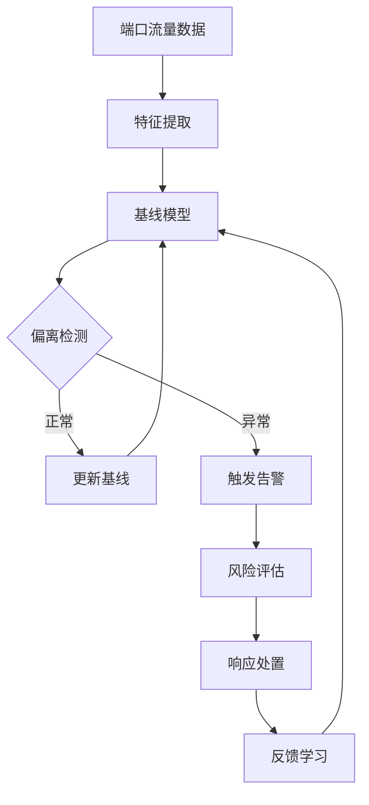
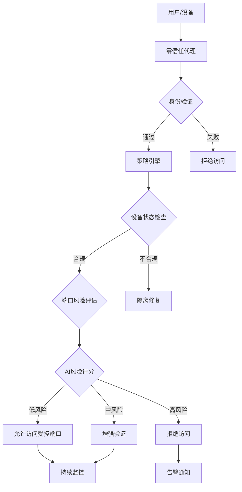
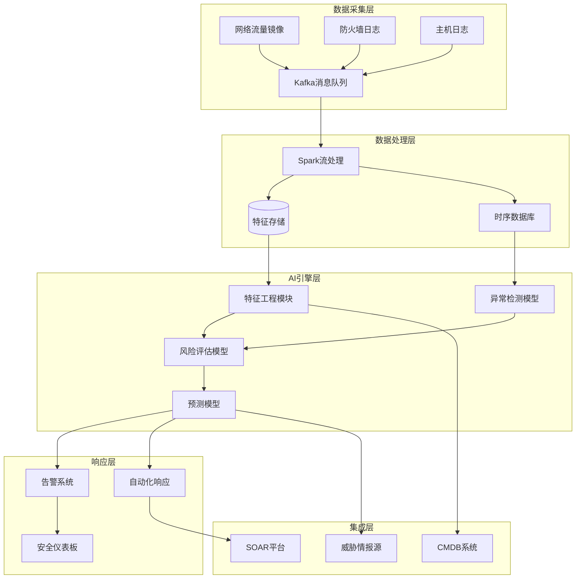

**作者：** HOS(安全风信子)
**日期：** 2026-04-24
**主要来源平台：** GitHub/arXiv
**摘要：** 端口是网络服务的门户，也是攻击者入侵的入口。每一个开放端口都代表着潜在的攻击面，而高危端口更是黑客攻击的首选目标。传统端口扫描依赖周期性巡检，难以捕捉端口暴露的动态变化；传统风险评估基于静态规则，无法适应复杂多变的网络环境。本文深入探讨AI驱动的危险端口识别技术，通过流量基线学习、时序异常检测、上下文智能分析等核心能力，实现端口暴露风险的实时评估和预测。我们引入了基于深度学习的端口风险评分算法和自适应基线调整机制，让安全团队能够精准识别真正需要关注的高危端口，将有限的精力投入到最关键的风险处置中。

@[TOC](目录)

---

# 端口即风险：AI如何精准识别高危端口与异常服务

## 1. 引言：端口——网络攻防的第一战场

在网络安全的攻防对抗中，端口始终占据着核心位置。每一个开放端口都可能是攻击者的潜在入口，而高危端口更是被恶意软件和黑客工具重点关注。根据安全研究机构的统计数据，勒索软件攻击中超过60%利用了远程桌面协议（RDP，端口3389）作为初始入口，而挖矿木马则主要针对SSH（端口22）和RDP（端口3389）等管理端口。

传统的端口安全管理面临三大挑战。首先是静态规则与动态环境的矛盾——基于端口号黑名单的静态规则难以应对合法业务对常用端口的灵活使用；其次是上下文理解的缺失——端口22在服务器运维场景下是必要的，但在测试环境中可能就是安全风险；第三是海量数据的处理困境——企业网络每天产生数以百万计的连接日志，人工分析几乎不可能。

AI技术的引入为端口安全管理带来了革命性的突破。通过机器学习模型对网络流量、连接行为、历史告警等多维度数据的学习，AI系统能够建立动态的端口风险评估模型，自动识别异常端口使用行为，预测潜在的端口暴露风险。

本文将从端口风险分类、智能识别技术、异常检测算法、自动化响应等多个维度，系统性介绍AI驱动的高危端口识别技术原理与实战方法。

## 2. 高危端口的风险分类体系

### 2.1 端口风险等级划分标准

并非所有端口都生而平等。根据端口被攻击利用的历史频率、漏洞数量、协议安全性等因素，可以将端口划分为四个风险等级。

**极高危端口（L4）**包括直接托管敏感数据或提供关键服务的端口。RDP（3389）作为Windows系统远程管理的事实标准，长期是攻击者的首选目标。CVE数据库中与RDP相关的漏洞超过100个，其中多个可导致远程代码执行。SSH（22）虽然采用加密传输，但默认配置下的暴力破解和凭据喷射攻击仍构成严重威胁。 SMB（445）协议曾被WannaCry等勒索软件大规模利用，其139端口也因NetBIOS协议而存在类似风险。数据库端口如MySQL（3306）、PostgreSQL（5432）、Redis（6379）等如果暴露互联网，将直接导致数据泄露风险。

**高危端口（L3）**包括提供重要但非关键服务的端口。Telnet（23）协议以明文传输数据，极易被中间人攻击。FTP（20/21）和SFTP（22，虽然名称相近但通常指代SSH）在文件传输场景中广泛使用，匿名访问和弱密码问题普遍存在。VNC（5900）等远程桌面协议在某些场景下是RDP的替代，但同样面临凭据安全问题。邮件服务端口SMTP（25）、IMAP（143）、POP3（110）等面临社工攻击和垃圾邮件利用风险。

**中危端口（L2）**主要是常规业务服务端口。HTTP（80）和HTTPS（443）虽然是互联网服务的门户，但现代Web应用面临SQL注入、XSS、CSRF等多种Web攻击。DNS（53）面临DNS劫持和DNS隧道攻击风险。LDAP（389）等目录服务端口如果暴露，可能导致目录信息泄露。

**低危端口（L1）**主要是内部管理和监控端口。SNMP（161）、NTP（123）等协议虽然可能被利用进行放大攻击或作为跳板，但在严格的网络隔离环境下风险可控。

### 2.2 端口风险评估的特征工程

准确的端口风险评估需要综合考虑多种特征维度。AI模型需要提取的特征包括协议特征、配置特征、流量特征、上下文特征和历史特征。

**协议特征**关注端口所使用的网络协议本身的安全性。例如，明文传输协议（如HTTP、Telnet、FTP）的风险分数高于加密协议（如HTTPS、SSH）。无认证协议的风险分数高于需要强认证的协议。

**配置特征**关注端口服务的具体配置状态。是否使用了默认端口、是否启用了匿名访问、是否配置了访问控制列表、是否启用了安全选项等，都是重要的配置特征。

**流量特征**分析端口的访问模式。异常高的访问量可能表明端口被扫描或攻击；来自陌生IP的访问可能表明存在未授权使用；非工作时间的访问可能表明存在安全违规。

**上下文特征**将端口放入业务上下文中分析。同一端口在不同业务场景下的风险不同，例如SSH在运维服务器上是必需的，但在开发测试环境中可能是多余的暴露。

**历史特征**关注端口相关的历史安全事件。历史上曾被攻击利用过的端口，其风险评估应该上调。

```python
class PortRiskClassifier:
    """
    端口风险分类器
    基于多维度特征对端口风险等级进行分类
    """

    RISK_LEVELS = {
        4: {
            'name': '极高危',
            'color': 'red',
            'description': '直接暴露敏感服务或关键基础设施'
        },
        3: {
            'name': '高危',
            'color': 'orange',
            'description': '提供重要服务但存在已知安全风险'
        },
        2: {
            'name': '中危',
            'color': 'yellow',
            'description': '常规业务端口，需关注Web和应用层攻击'
        },
        1: {
            'name': '低危',
            'color': 'green',
            'description': '内部管理和监控端口，风险可控'
        }
    }

    HIGH_RISK_PORTS = {
        22: {
            'name': 'SSH',
            'protocol': 'TCP',
            'risk_factors': ['brute_force', 'credential_stuffing', 'default_credentials'],
            'cve_count': 87,
            'attack_frequency': 'very_high'
        },
        23: {
            'name': 'Telnet',
            'protocol': 'TCP',
            'risk_factors': ['plaintext_transmission', 'no_encryption', 'weak_auth'],
            'cve_count': 45,
            'attack_frequency': 'high',
            'recommendation': '禁用并迁移到SSH'
        },
        3389: {
            'name': 'RDP',
            'protocol': 'TCP',
            'risk_factors': ['brute_force', 'bluekeep_cve', 'ntlm_relay'],
            'cve_count': 112,
            'attack_frequency': 'very_high',
            'notable_attacks': ['WannaCry', 'NotPetya', 'DeadEyeRDP']
        },
        445: {
            'name': 'SMB',
            'protocol': 'TCP',
            'risk_factors': ['eternalblue_cve', 'smb蠕虫', 'ntlm_relay'],
            'cve_count': 156,
            'attack_frequency': 'very_high',
            'notable_attacks': ['WannaCry', 'NotPetya', 'Conficker']
        },
        3306: {
            'name': 'MySQL',
            'protocol': 'TCP',
            'risk_factors': ['sql_injection', 'weak_password', 'unencrypted'],
            'cve_count': 234,
            'attack_frequency': 'high'
        },
        5432: {
            'name': 'PostgreSQL',
            'protocol': 'TCP',
            'risk_factors': ['weak_password', 'sql_injection', 'log_privilege'],
            'cve_count': 189,
            'attack_frequency': 'medium_high'
        },
        6379: {
            'name': 'Redis',
            'protocol': 'TCP',
            'risk_factors': ['no_auth_default', 'arbitrary_command_exec', 'master_slave_takeover'],
            'cve_count': 67,
            'attack_frequency': 'high'
        },
        27017: {
            'name': 'MongoDB',
            'protocol': 'TCP',
            'risk_factors': ['no_auth_default', 'unescaped_query', 'web_interface'],
            'cve_count': 98,
            'attack_frequency': 'medium_high'
        }
    }

    def __init__(self, feature_engine, context_analyzer):
        self.feature_engine = feature_engine
        self.context_analyzer = context_analyzer

    def classify(self, port, service_context):
        """
        对端口进行风险分类

        参数:
            port: 端口号
            service_context: 服务上下文信息

        返回:
            dict: 分类结果
        """
        base_risk = self._get_base_risk(port)

        context_risk = self.context_analyzer.analyze(service_context)

        exposure_risk = self._assess_exposure_risk(
            port,
            service_context.get('network_zone'),
            service_context.get('access_control')
        )

        temporal_risk = self._assess_temporal_risk(
            port,
            service_context.get('recent_events')
        )

        overall_risk = self._calculate_overall_risk(
            base_risk,
            context_risk,
            exposure_risk,
            temporal_risk
        )

        return {
            'port': port,
            'service_name': service_context.get('name'),
            'risk_level': self._get_risk_level(overall_risk),
            'risk_score': overall_risk,
            'risk_breakdown': {
                'base_risk': base_risk,
                'context_risk': context_risk,
                'exposure_risk': exposure_risk,
                'temporal_risk': temporal_risk
            },
            'risk_factors': self._identify_risk_factors(port, service_context),
            'recommendations': self._generate_recommendations(port, overall_risk)
        }

    def _get_base_risk(self, port):
        """获取基础风险分数"""
        if port in self.HIGH_RISK_PORTS:
            port_info = self.HIGH_RISK_PORTS[port]
            attack_freq_scores = {
                'very_high': 0.9,
                'high': 0.75,
                'medium_high': 0.6,
                'medium': 0.4
            }
            return attack_freq_scores.get(port_info['attack_frequency'], 0.5)
        elif port < 1024:
            return 0.4
        elif port < 10000:
            return 0.3
        else:
            return 0.2
```

### 2.3 端口风险评估的多维度分析

#### 2.3.1 基于CVE漏洞数据库的风险评估

端口的固有风险与其承载服务的历史漏洞密切相关。AI系统通过整合CVE（Common Vulnerabilities and Exposures）漏洞数据库，构建端口漏洞画像。每个端口的CVE评分从三个维度计算：

**CVSS评分加权平均**：CVSS（Common Vulnerability Scoring System）是漏洞严重性的行业标准评分系统。对于每个端口，AI系统计算所有相关CVE的CVSS评分加权平均值，权重考虑漏洞的利用复杂度、影响范围等因素。

**漏洞可利用性因子**：并非所有高CVSS评分的漏洞都易于利用。AI系统引入可利用性因子，考虑漏洞利用代码的公开程度（Exploit Database、POC公开情况）、攻击工具的可用性（Metasploit模块、Shodan查询结果）等因素。

**漏洞时效性因子**：新披露的漏洞通常具有更高的风险，因为利用代码可能尚未广泛传播，但攻击者可能已经掌握0day漏洞。时效性因子根据CVE披露时间计算，越新的漏洞因子越高。

```python
class CVEBasedRiskAssessor:
    """
    基于CVE数据库的端口风险评估器
    综合漏洞数量、CVSS评分和可利用性因子
    """

    def __init__(self, cve_database, exploit_intelligence):
        self.cve_db = cve_database
        self.exploit_intel = exploit_intelligence
        self.port_cve_mapping = self._build_port_cve_mapping()

    def _build_port_cve_mapping(self):
        """构建端口-CVE映射表"""
        mapping = {}
        for cve_id, cve_info in self.cve_db.get_all_cves():
            for port in cve_info.get('affected_ports', []):
                if port not in mapping:
                    mapping[port] = []
                mapping[port].append(cve_id)
        return mapping

    def assess_port_vulnerability(self, port):
        """
        评估端口漏洞风险

        参数:
            port: 端口号

        返回:
            dict: 漏洞风险评估结果
        """
        cve_ids = self.port_cve_mapping.get(port, [])

        if not cve_ids:
            return {
                'port': port,
                'cve_count': 0,
                'vulnerability_score': 0.0,
                'exploitability_score': 0.0,
                'risk_level': 'low'
            }

        cve_details = [self.cve_db.get_cve(cid) for cid in cve_ids]

        cvss_scores = [cve['cvss_score'] for cve in cve_details if cve.get('cvss_score')]
        vulnerability_score = self._calculate_vulnerability_score(cvss_scores)

        exploitability_factors = []
        for cve in cve_details:
            exploit_info = self.exploit_intel.get_exploit_status(cve['cve_id'])
            exploitability_factors.append({
                'cve_id': cve['cve_id'],
                'public_exploit': exploit_info.get('has_public_exploit', False),
                'metasploit_module': exploit_info.get('has_metasploit_module', False),
                'in_the_wild': exploit_info.get('used_in_wild', False),
                'poc_available': exploit_info.get('has_poc', False)
            })

        overall_exploitability = self._calculate_exploitability_score(exploitability_factors)

        recency_penalty = self._calculate_recency_penalty(cve_details)

        final_score = (
            vulnerability_score * 0.4 +
            overall_exploitability * 0.4 +
            recency_penalty * 0.2
        )

        return {
            'port': port,
            'cve_count': len(cve_ids),
            'cve_ids': cve_ids[:10],
            'vulnerability_score': vulnerability_score,
            'exploitability_score': overall_exploitability,
            'recency_factor': recency_penalty,
            'risk_score': final_score,
            'risk_level': self._get_risk_level(final_score),
            'critical_cves': [cve['cve_id'] for cve in cve_details if cve.get('cvss_score', 0) >= 9.0],
            'exploitability_details': exploitability_factors
        }

    def _calculate_vulnerability_score(self, cvss_scores):
        """计算漏洞严重性评分"""
        if not cvss_scores:
            return 0.0

        import numpy as np

        max_score = max(cvss_scores)
        avg_score = np.mean(cvss_scores)

        critical_count = sum(1 for s in cvss_scores if s >= 9.0)
        high_count = sum(1 for s in cvss_scores if 7.0 <= s < 9.0)
        medium_count = sum(1 for s in cvss_scores if 4.0 <= s < 7.0)

        weighted_score = (
            avg_score * 0.3 +
            max_score * 0.4 +
            (critical_count * 10 + high_count * 5 + medium_count * 2) * 0.3
        )

        return min(weighted_score / 10.0, 1.0)

    def _calculate_exploitability_score(self, exploitability_factors):
        """计算可利用性评分"""
        if not exploitability_factors:
            return 0.0

        scores = []
        for factor in exploitability_factors:
            score = 0.0
            if factor['in_the_wild']:
                score = 1.0
            elif factor['public_exploit']:
                score = 0.8
            elif factor['metasploit_module']:
                score = 0.7
            elif factor['poc_available']:
                score = 0.5
            scores.append(score)

        import numpy as np
        return np.max(scores)

    def _calculate_recency_penalty(self, cve_details):
        """计算时效性因子"""
        from datetime import datetime, timedelta

        current_date = datetime.now()
        one_year_ago = current_date - timedelta(days=365)

        recent_count = 0
        for cve in cve_details:
            pub_date = cve.get('published_date')
            if pub_date and pub_date > one_year_ago:
                recent_count += 1

        recency_ratio = recent_count / len(cve_details) if cve_details else 0

        return recency_ratio * 0.5 + 0.5
```

#### 2.3.2 基于网络暴露面的风险评估

端口的网络暴露程度是决定其实际风险的关键因素。一个承载敏感服务的端口如果完全隔离在内网，其风险远低于暴露在互联网的同一端口。AI系统从多个维度评估端口的暴露风险：

**互联网暴露评估**：通过扫描资产的外网IP、负载均衡器、公共云实例等，判断端口是否直接暴露于互联网。同时分析CDN、WAF等安全设备的覆盖情况。

**网络区域分析**：评估端口所在网络区域的安全级别。例如，DMZ区域的端口虽然不直接暴露，但承载的服务通常更面向外部；核心业务网络的端口虽然在内网，但价值更高。

**访问控制有效性**：分析防火墙规则、安全组策略、ACL列表等访问控制措施的有效性。识别规则配置错误、过度 permissive的规则、过于宽泛的允许列表等。

```python
class ExposureRiskAssessor:
    """
    端口暴露风险评估器
    评估端口的网络暴露程度和访问控制有效性
    """

    def __init__(self, network_topology, firewall_client, cloud_connector):
        self.topology = network_topology
        self.firewall = firewall_client
        self.cloud = cloud_connector
        self.exposure_cache = {}

    def assess_exposure(self, asset_ip, port):
        """
        评估端口暴露风险

        参数:
            asset_ip: 资产IP地址
            port: 端口号

        返回:
            dict: 暴露风险评估结果
        """
        cache_key = f"{asset_ip}:{port}"
        if cache_key in self.exposure_cache:
            return self.exposure_cache[cache_key]

        internet_exposed = self._check_internet_exposure(asset_ip, port)

        network_zone = self.topology.get_network_zone(asset_ip)

        zone_risk = self._calculate_zone_risk(network_zone)

        acl_effectiveness = self._evaluate_acl_effectiveness(asset_ip, port)

        geo_restriction = self._analyze_geo_restrictions(asset_ip, port)

        authentication_strength = self._assess_authentication(asset_ip, port)

        exposure_score = self._calculate_exposure_score(
            internet_exposed,
            zone_risk,
            acl_effectiveness,
            geo_restriction,
            authentication_strength
        )

        result = {
            'asset_ip': asset_ip,
            'port': port,
            'internet_exposed': internet_exposed,
            'network_zone': network_zone,
            'zone_risk': zone_risk,
            'acl_effectiveness': acl_effectiveness,
            'geo_restricted': geo_restriction['is_restricted'],
            'auth_strength': authentication_strength,
            'exposure_score': exposure_score,
            'exposure_level': self._get_exposure_level(exposure_score),
            'attack_surface_factors': self._identify_attack_surface_factors(
                internet_exposed, acl_effectiveness, geo_restriction
            ),
            'recommended_controls': self._generate_control_recommendations(
                exposure_score, acl_effectiveness, authentication_strength
            )
        }

        self.exposure_cache[cache_key] = result
        return result

    def _check_internet_exposure(self, asset_ip, port):
        """检查端口是否暴露于互联网"""
        shodan_result = self._query_shodan(asset_ip, port)
        if shodan_result.get('has_open_port'):
            return {
                'exposed': True,
                'sources': ['shodan'],
                'shodan_data': shodan_result
            }

        censys_result = self._query_censys(asset_ip, port)
        if censys_result.get('port_detected'):
            return {
                'exposed': True,
                'sources': ['censys'],
                'censys_data': censys_result
            }

        cloud_security_groups = self.cloud.check_security_groups(asset_ip)
        for sg in cloud_security_groups:
            for rule in sg.get('ingress_rules', []):
                if rule.get('port') == port and rule.get('source') == '0.0.0.0/0':
                    return {
                        'exposed': True,
                        'sources': ['cloud_security_group'],
                        'security_group': sg.get('group_id')
                    }

        return {'exposed': False}

    def _evaluate_acl_effectiveness(self, asset_ip, port):
        """评估访问控制列表有效性"""
        firewall_rules = self.firewall.get_applicable_rules(asset_ip, port)

        permissive_rules = []
        restrictive_rules = []

        for rule in firewall_rules:
            if rule.get('action') == 'allow':
                source = rule.get('source', '0.0.0.0/0')
                if source == '0.0.0.0/0':
                    permissive_rules.append(rule)
                else:
                    restrictive_rules.append(rule)
            else:
                restrictive_rules.append(rule)

        effectiveness_score = 1.0
        if permissive_rules:
            effectiveness_score -= min(len(permissive_rules) * 0.2, 0.6)

        blocked_known_malicious = self._check_blocked_malicious_sources(
            restrictive_rules
        )
        effectiveness_score += blocked_known_malicious * 0.1

        return {
            'effectiveness_score': min(max(effectiveness_score, 0.0), 1.0),
            'permissive_rules_count': len(permissive_rules),
            'restrictive_rules_count': len(restrictive_rules),
            'needs_improvement': len(permissive_rules) > 0,
            'recommendations': self._generate_acl_recommendations(
                permissive_rules, restrictive_rules
            )
        }
```

### 2.4 端口风险评估的特征工程详细实现

```python
class PortRiskFeatureEngineering:
    """
    端口风险特征工程
    从多维度数据中提取端口风险评估特征
    """

    def __init__(self, data_sources):
        self.data_sources = data_sources
        self.feature_cache = {}

    def extract(self, port, asset_info):
        """
        提取端口风险特征

        参数:
            port: 端口号
            asset_info: 资产信息

        返回:
            dict: 特征向量
        """
        features = {}

        protocol_features = self._extract_protocol_features(port)
        features.update(protocol_features)

        config_features = self._extract_config_features(port, asset_info)
        features.update(config_features)

        traffic_features = self._extract_traffic_features(port, asset_info)
        features.update(traffic_features)

        context_features = self._extract_context_features(port, asset_info)
        features.update(context_features)

        historical_features = self._extract_historical_features(port, asset_info)
        features.update(historical_features)

        return features

    def _extract_protocol_features(self, port):
        """提取协议层特征"""
        features = {}

        protocol_info = self._identify_protocol(port)
        features['protocol_type'] = protocol_info.get('type')
        features['is_encrypted'] = protocol_info.get('encrypted', False)
        features['requires_auth'] = protocol_info.get('requires_auth', True)
        features['is_stateful'] = protocol_info.get('stateful', True)

        plaintext_protocols = [21, 23, 25, 80, 110, 143]
        features['is_plaintext'] = port in plaintext_protocols

        auth_protocols = [22, 3389, 3306, 5432, 6379]
        features['requires_strong_auth'] = port in auth_protocols

        return features

    def _extract_traffic_features(self, port, asset_info):
        """提取流量层特征"""
        features = {}

        traffic_stats = self._get_traffic_statistics(
            port,
            asset_info.get('ip')
        )

        features['connection_count_24h'] = traffic_stats.get('connections_24h', 0)
        features['unique_source_ips'] = traffic_stats.get('unique_sources', 0)
        features['avg_daily_connections'] = traffic_stats.get('avg_daily', 0)

        features['traffic_anomaly_score'] = self._calculate_traffic_anomaly(
            traffic_stats
        )

        geographic_features = self._analyze_geo_distribution(
            traffic_stats.get('source_ips', [])
        )
        features.update(geographic_features)

        temporal_features = self._analyze_temporal_pattern(
            traffic_stats.get('connection_times', [])
        )
        features.update(temporal_features)

        return features

    def _extract_context_features(self, port, asset_info):
        """提取上下文特征"""
        features = {}

        cmdb_data = self.data_sources.get('cmdb')
        context = cmdb_data.get_asset_context(
            asset_info.get('ip'),
            asset_info.get('hostname')
        )

        features['business_unit'] = context.get('business_unit')
        features['asset_criticality'] = context.get('criticality', 'medium')
        features['is_production'] = context.get('environment') == 'production'
        features['is_test'] = context.get('environment') == 'test'

        features['has_direct_internet_exposure'] = context.get(
            'internet_exposed', False
        )

        features['exposed_duration_days'] = context.get(
            'port_exposed_days',
            0
        )

        return features
```

## 3. AI驱动的端口异常检测技术

### 3.1 基于时序分析的端口行为基线

建立正常的端口行为基线是异常检测的基础。AI系统通过学习历史流量数据，自动建立每个端口连接数、访问源分布、时间分布等指标的正常范围，并以此检测偏离基线的异常行为。

```python
class PortBehaviorBaseline:
    """
    端口行为基线
    基于时序分析建立端口正常行为模型
    """

    def __init__(self, time_series_db, model_store):
        self.ts_db = time_series_db
        self.model_store = model_store
        self.baseline_window = 30
        self.update_frequency = 'daily'

    def build_baseline(self, port, asset_ip):
        """
        构建端口行为基线

        参数:
            port: 端口号
            asset_ip: 资产IP

        返回:
            dict: 基线模型
        """
        historical_data = self._fetch_historical_data(port, asset_ip)

        baseline_model = {
            'connection_stats': self._calculate_connection_stats(historical_data),
            'source_distribution': self._calculate_source_distribution(historical_data),
            'temporal_pattern': self._calculate_temporal_pattern(historical_data),
            'protocol_behavior': self._analyze_protocol_behavior(historical_data),
            'session_characteristics': self._analyze_session_chars(historical_data)
        }

        self.model_store.save(
            f'port_baseline_{port}_{asset_ip}',
            baseline_model
        )

        return baseline_model

    def detect_anomaly(self, port, asset_ip, current_data):
        """
        检测端口异常

        参数:
            port: 端口号
            asset_ip: 资产IP
            current_data: 当前数据

        返回:
            dict: 异常检测结果
        """
        baseline = self.model_store.load(f'port_baseline_{port}_{asset_ip}')

        if not baseline:
            return {'status': 'no_baseline', 'anomaly': None}

        anomalies = []

        connection_anomaly = self._check_connection_anomaly(
            current_data,
            baseline['connection_stats']
        )
        if connection_anomaly:
            anomalies.append(connection_anomaly)

        source_anomaly = self._check_source_anomaly(
            current_data,
            baseline['source_distribution']
        )
        if source_anomaly:
            anomalies.append(source_anomaly)

        temporal_anomaly = self._check_temporal_anomaly(
            current_data,
            baseline['temporal_pattern']
        )
        if temporal_anomaly:
            anomalies.append(temporal_anomaly)

        return {
            'status': 'analyzed',
            'anomaly_detected': len(anomalies) > 0,
            'anomaly_count': len(anomalies),
            'anomalies': anomalies,
            'overall_score': self._calculate_overall_anomaly_score(anomalies)
        }

    def _calculate_connection_stats(self, historical_data):
        """计算连接统计基线"""
        import numpy as np

        connections = [d['connection_count'] for d in historical_data]

        return {
            'mean': np.mean(connections),
            'std': np.std(connections),
            'median': np.median(connections),
            'p95': np.percentile(connections, 95),
            'p99': np.percentile(connections, 99),
            'max': np.max(connections),
            'min': np.min(connections)
        }

    def _calculate_temporal_pattern(self, historical_data):
        """计算时间模式基线"""
        hourly_pattern = {}
        daily_pattern = {}
        weekly_pattern = {}

        for record in historical_data:
            timestamp = record['timestamp']
            connection_count = record['connection_count']

            hour = timestamp.hour
            day_of_week = timestamp.dayofweek

            hourly_pattern[hour] = hourly_pattern.get(hour, []) + [connection_count]
            weekly_pattern[day_of_week] = weekly_pattern.get(day_of_week, []) + [connection_count]

        import numpy as np
        hourly_avg = {
            h: np.mean(v) for h, v in hourly_pattern.items()
        }
        weekly_avg = {
            d: np.mean(v) for d, v in weekly_pattern.items()
        }

        return {
            'hourly_avg': hourly_avg,
            'weekly_avg': weekly_avg,
            'business_hours_avg': np.mean([
                v for h, v in hourly_avg.items() if 9 <= h <= 18
            ]),
            'off_hours_avg': np.mean([
                v for h, v in hourly_avg.items() if h < 9 or h > 18
            ])
        }

    def _check_temporal_anomaly(self, current_data, temporal_baseline):
        """检测时间异常"""
        current_hour = current_data['timestamp'].hour
        current_count = current_data['connection_count']

        if 9 <= current_hour <= 18:
            expected = temporal_baseline['business_hours_avg']
        else:
            expected = temporal_baseline['off_hours_avg']

        std = temporal_baseline.get('connection_stats', {}).get('std', 1)

        deviation = abs(current_count - expected) / (std + 1e-6)

        if deviation > 3.0:
            return {
                'type': 'temporal',
                'severity': 'high' if deviation > 5.0 else 'medium',
                'description': f'连接数在{current_hour}时异常，'
                             f'当前{current_count}，期望{expected:.1f}',
                'expected': expected,
                'actual': current_count,
                'deviation': deviation
            }

        return None
```

### 3.2 深度学习驱动的端口风险预测

除了检测当前的异常行为，AI系统还能预测端口未来的风险趋势。通过LSTM、Transformer等时序模型，系统可以学习端口风险的演变规律，提前预警潜在的风险升级。

```python
class PortRiskPredictor:
    """
    端口风险预测器
    基于深度学习预测端口风险趋势
    """

    def __init__(self, model_registry, feature_engine):
        self.model_registry = model_registry
        self.feature_engine = feature_engine
        self.prediction_horizons = [1, 7, 30]

    def predict(self, port, asset_ip, horizon='7d'):
        """
        预测端口风险

        参数:
            port: 端口号
            asset_ip: 资产IP
            horizon: 预测时间范围

        返回:
            dict: 预测结果
        """
        model = self._get_or_train_model(port)

        historical_features = self._prepare_sequence(port, asset_ip, horizon)

        predictions = model.predict(historical_features)

        risk_trend = self._analyze_risk_trend(predictions)

        confidence = self._calculate_confidence(predictions)

        risk_factors = self._identify_future_risk_factors(
            port,
            predictions
        )

        return {
            'port': port,
            'asset_ip': asset_ip,
            'horizon': horizon,
            'risk_level': predictions.get('risk_level'),
            'risk_score': predictions.get('risk_score'),
            'risk_trend': risk_trend,
            'confidence': confidence,
            'risk_factors': risk_factors,
            'recommended_actions': self._generate_recommended_actions(
                predictions
            )
        }

    def _get_or_train_model(self, port):
        """获取或训练模型"""
        model_key = f'port_risk_predictor_{port}'
        model = self.model_registry.get(model_key)

        if not model:
            model = self._train_new_model(port)
            self.model_registry.register(model_key, model)

        return model

    def _prepare_sequence(self, port, asset_ip, horizon):
        """准备输入序列"""
        historical_data = self.feature_engine.get_historical_features(
            port,
            asset_ip,
            window=self._parse_horizon(horizon)
        )

        features = []
        for record in historical_data:
            feature_vector = self._to_feature_vector(record)
            features.append(feature_vector)

        return np.array(features)

    def _analyze_risk_trend(self, predictions):
        """分析风险趋势"""
        current = predictions.get('current_risk', 0)
        predicted = predictions.get('risk_score', 0)

        change_rate = (predicted - current) / (current + 1e-6)

        if change_rate > 0.2:
            trend = 'increasing'
            severity = 'high' if change_rate > 0.5 else 'medium'
        elif change_rate < -0.2:
            trend = 'decreasing'
            severity = 'low'
        else:
            trend = 'stable'
            severity = 'low'

        return {
            'direction': trend,
            'change_rate': change_rate,
            'severity': severity,
            'description': self._generate_trend_description(
                trend,
                change_rate,
                current,
                predicted
            )
        }
```

### 3.3 基于机器学习的端口扫描检测

端口扫描通常是攻击的前奏。AI系统通过机器学习算法识别各种类型的端口扫描行为，包括TCP连接扫描、SYN扫描、UDP扫描等。

```python
class PortScanDetector:
    """
    端口扫描检测器
    基于机器学习识别恶意端口扫描行为
    """

    def __init__(self, traffic_analyzer, threat_intel):
        self.traffic_analyzer = traffic_analyzer
        self.threat_intel = threat_intel
        self.scan_patterns = self._load_scan_patterns()
        self.ml_classifier = self._initialize_ml_classifier()

    def detect_scan(self, source_ip, target_network, scan_activity):
        """
        检测端口扫描行为

        参数:
            source_ip: 源IP地址
            target_network: 目标网络
            scan_activity: 扫描活动数据

        返回:
            dict: 检测结果
        """
        pattern_match = self._check_scan_patterns(scan_activity)

        ml_result = self.ml_classifier.predict(scan_activity)

        behavioral_score = self._analyze_scan_behavior(scan_activity)

        threat_intel_result = self.threat_intel.check_ip_reputation(source_ip)

        combined_score = self._calculate_combined_score(
            pattern_match,
            ml_result,
            behavioral_score,
            threat_intel_result
        )

        scan_type = self._identify_scan_type(scan_activity)

        return {
            'source_ip': source_ip,
            'target_network': target_network,
            'is_scan_detected': combined_score > 0.7,
            'confidence': combined_score,
            'scan_type': scan_type,
            'pattern_match': pattern_match,
            'ml_detection': ml_result,
            'behavioral_score': behavioral_score,
            'threat_intel': threat_intel_result,
            'severity': self._calculate_severity(combined_score, scan_type),
            'recommended_actions': self._generate_response_actions(
                combined_score, scan_type, source_ip
            )
        }

    def _check_scan_patterns(self, scan_activity):
        """检查扫描模式匹配"""
        results = []

        for pattern_name, pattern_config in self.scan_patterns.items():
            match_score = self._evaluate_pattern_match(
                scan_activity,
                pattern_config
            )
            results.append({
                'pattern': pattern_name,
                'score': match_score,
                'matched': match_score > pattern_config.get('threshold', 0.7)
            })

        return {
            'patterns': results,
            'max_score': max(r['score'] for r in results) if results else 0,
            'matched_patterns': [r['pattern'] for r in results if r['matched']]
        }

    def _evaluate_pattern_match(self, scan_activity, pattern_config):
        """评估模式匹配度"""
        score = 0.0
        factors = pattern_config.get('factors', [])

        for factor in factors:
            factor_type = factor['type']
            factor_weight = factor.get('weight', 1.0)

            if factor_type == 'port_range_speed':
                observed = scan_activity.get('port_range_speed', 0)
                expected = factor.get('expected_speed', 1000)
                if observed > expected * 0.8:
                    score += 0.3 * factor_weight

            elif factor_type == 'sequential_ports':
                observed_sequence = scan_activity.get('port_sequence', [])
                if self._is_sequential(observed_sequence):
                    score += 0.4 * factor_weight

            elif factor_type == 'connection_failure_rate':
                failure_rate = scan_activity.get('connection_failure_rate', 0)
                if failure_rate > 0.5:
                    score += 0.3 * factor_weight

        return min(score, 1.0)

    def _identify_scan_type(self, scan_activity):
        """识别扫描类型"""
        activity_type = scan_activity.get('type', 'unknown')

        if activity_type == 'tcp_connect':
            return 'TCP_CONNECT_SCAN'
        elif activity_type == 'tcp_syn':
            return 'TCP_SYN_SCAN'
        elif activity_type == 'tcp_fin':
            return 'TCP_FIN_SCAN'
        elif activity_type == 'udp':
            return 'UDP_SCAN'
        elif activity_type == 'ack':
            return 'TCP_ACK_SCAN'
        else:
            return 'UNKNOWN_SCAN'

    def _analyze_scan_behavior(self, scan_activity):
        """分析扫描行为特征"""
        features = self._extract_behavioral_features(scan_activity)

        port_diversity = features['unique_ports'] / max(features['total_attempts'], 1)

        speed_consistency = 1.0 - features['speed_variance']

        source_distribution = self._analyze_source_distribution(
            scan_activity.get('source_ips', [])
        )

        behavioral_score = (
            port_diversity * 0.3 +
            speed_consistency * 0.3 +
            source_distribution['score'] * 0.4
        )

        return {
            'score': behavioral_score,
            'port_diversity': port_diversity,
            'speed_consistency': speed_consistency,
            'source_diversity': source_distribution['diversity'],
            'indicators': self._extract_behavioral_indicators(features)
        }
```

### 3.4 异常检测的统计模型与机器学习模型对比

在端口异常检测领域，AI系统通常采用多种算法模型，从简单的统计模型到复杂的深度学习模型，以适应不同的检测场景和性能要求。

**统计模型**具有可解释性强、计算效率高的优势。Z-score检测基于数据点与均值的标准差距离，适用于具有稳定基线的流量模式。Isolation Forest通过随机划分特征空间来隔离异常点，对于多维特征的异常检测效果良好。Local Outlier Factor（LOF）通过比较数据点与其邻域的密度来识别异常，能够捕捉局部异常模式。

**机器学习模型**在处理非线性关系和高维数据时表现出色。随机森林能够处理大规模特征集，提供特征重要性排序，适合处理端口风险评估中的多维度特征。梯度提升决策树（XGBoost/LightGBM）具有优秀的预测精度，能够自动处理缺失值和类别特征。One-Class SVM适合建立单类分类模型，仅从正常流量中学习，识别偏离正常模式的异常。

**深度学习模型**能够自动学习复杂的流量模式和时序依赖。LSTM（长短期记忆网络）擅长处理时序数据，能够捕捉端口流量的长期依赖关系。Transformer模型通过自注意力机制，能够同时关注不同时间步的重要性，适用于复杂的流量模式学习。Autoencoder（自编码器）通过重构误差识别异常，适合学习流量的正常模式并检测偏离。

```python
class AnomalyDetectionEnsemble:
    """
    异常检测集成模型
    综合多种算法提升检测准确性
    """

    def __init__(self):
        self.statistical_models = self._initialize_statistical_models()
        self.ml_models = self._initialize_ml_models()
        self.deep_learning_models = self._initialize_dl_models()
        self.ensemble_weights = {
            'statistical': 0.2,
            'ml': 0.3,
            'deep_learning': 0.5
        }

    def detect(self, port, traffic_data):
        """
        集成异常检测

        参数:
            port: 端口号
            traffic_data: 流量数据

        返回:
            dict: 集成检测结果
        """
        statistical_results = self._run_statistical_detection(traffic_data)

        ml_results = self._run_ml_detection(traffic_data)

        dl_results = self._run_deep_learning_detection(traffic_data)

        weighted_scores = self._calculate_weighted_scores(
            statistical_results,
            ml_results,
            dl_results
        )

        final_decision = self._make_decision(weighted_scores)

        return {
            'port': port,
            'is_anomaly': final_decision['is_anomaly'],
            'confidence': final_decision['confidence'],
            'anomaly_score': weighted_scores['overall_score'],
            'component_scores': {
                'statistical': statistical_results,
                'ml': ml_results,
                'deep_learning': dl_results
            },
            'detection_method': self._select_primary_method(
                statistical_results,
                ml_results,
                dl_results
            ),
            'recommendations': self._generate_recommendations(weighted_scores)
        }

    def _run_statistical_detection(self, traffic_data):
        """运行统计模型检测"""
        results = {}

        zscore_result = self._zscore_detection(
            traffic_data.get('connection_counts', [])
        )
        results['zscore'] = zscore_result

        if_result = self._isolation_forest_detection(traffic_data)
        results['isolation_forest'] = if_result

        lof_result = self._lof_detection(traffic_data)
        results['lof'] = lof_result

        avg_score = np.mean([r['score'] for r in results.values()])
        max_score = max(r['score'] for r in results.values())

        return {
            'score': self.ensemble_weights['statistical'] * avg_score,
            'individual_scores': results,
            'is_anomaly': any(r['is_anomaly'] for r in results.values())
        }
```

## 4. 端口暴露风险的智能评估

### 4.1 多维度风险评分算法

端口的风险不能仅看端口号本身，还需要结合暴露上下文、业务重要性、历史事件等多种因素。AI系统采用多维度评分算法，综合计算端口的最终风险分数。

```python
class PortRiskScorer:
    """
    端口风险评分器
    多维度综合评估端口风险
    """

    def __init__(self, config):
        self.weights = config.get('weights', {
            'intrinsic': 0.30,
            'exposure': 0.25,
            'context': 0.20,
            'threat': 0.15,
            'temporal': 0.10
        })

    def calculate(self, port, assessment_data):
        """
        计算端口风险评分

        参数:
            port: 端口号
            assessment_data: 评估数据

        返回:
            dict: 风险评分结果
        """
        intrinsic_score = self._calculate_intrinsic_score(port, assessment_data)

        exposure_score = self._calculate_exposure_score(assessment_data)

        context_score = self._calculate_context_score(assessment_data)

        threat_score = self._calculate_threat_score(port, assessment_data)

        temporal_score = self._calculate_temporal_score(assessment_data)

        overall_score = (
            intrinsic_score * self.weights['intrinsic'] +
            exposure_score * self.weights['exposure'] +
            context_score * self.weights['context'] +
            threat_score * self.weights['threat'] +
            temporal_score * self.weights['temporal']
        )

        risk_factors = self._identify_key_risk_factors(
            intrinsic_score,
            exposure_score,
            context_score,
            threat_score,
            temporal_score
        )

        return {
            'port': port,
            'overall_score': round(overall_score, 3),
            'risk_level': self._get_risk_level(overall_score),
            'component_scores': {
                'intrinsic': round(intrinsic_score, 3),
                'exposure': round(exposure_score, 3),
                'context': round(context_score, 3),
                'threat': round(threat_score, 3),
                'temporal': round(temporal_score, 3)
            },
            'risk_factors': risk_factors,
            'confidence': self._calculate_confidence(assessment_data)
        }

    def _calculate_intrinsic_score(self, port, data):
        """计算固有风险分数"""
        base_score = self._get_port_base_score(port)

        vuln_penalty = data.get('known_vulnerabilities', 0) * 0.1

        protocol_penalty = 0.2 if self._is_weak_protocol(port) else 0

        auth_penalty = 0.15 if not data.get('strong_auth_enabled', True) else 0

        score = base_score - min(vuln_penalty + protocol_penalty + auth_penalty, 0.5)

        return max(score, 0)

    def _calculate_exposure_score(self, data):
        """计算暴露风险分数"""
        exposure_factors = []

        if data.get('direct_internet_exposed'):
            exposure_factors.append(0.9)
        elif data.get('vpn_exposed'):
            exposure_factors.append(0.6)
        elif data.get('internal_exposed'):
            exposure_factors.append(0.3)
        else:
            exposure_factors.append(0.1)

        acl_gaps = data.get('acl_gaps', 0)
        exposure_factors.append(min(acl_gaps * 0.15, 0.4))

        source_diversity = data.get('source_ip_diversity', 0)
        if source_diversity > 1000:
            exposure_factors.append(0.3)
        elif source_diversity > 100:
            exposure_factors.append(0.2)
        else:
            exposure_factors.append(0.1)

        return np.mean(exposure_factors)
```

### 4.2 动态基线与自适应调整

传统的静态风险评估难以适应网络环境的动态变化。AI系统通过持续学习，自动调整风险评估的基线，确保评估结果始终反映当前的安全态势。



### 4.3 风险评分算法的权重优化

风险评分的准确性很大程度上取决于各维度权重的设置。AI系统通过机器学习方法自动优化权重，确保评分结果与实际风险状况的最佳匹配。

```python
class RiskScoreWeightOptimizer:
    """
    风险评分权重优化器
    使用机器学习方法优化评分权重
    """

    def __init__(self, historical_data, known_risks):
        self.historical_data = historical_data
        self.known_risks = known_risks
        self.optimizer = self._initialize_optimizer()

    def optimize_weights(self):
        """
        优化风险评分权重

        返回:
            dict: 优化后的权重配置
        """
        features = self._prepare_training_features()

        labels = self._prepare_training_labels()

        best_weights = self._grid_search_optimization(features, labels)

        validation_score = self._validate_weights(best_weights, features, labels)

        return {
            'weights': best_weights,
            'validation_score': validation_score,
            'optimization_method': 'grid_search',
            'training_samples': len(features)
        }

    def _prepare_training_features(self):
        """准备训练特征"""
        features = []
        for record in self.historical_data:
            feature_vector = [
                record.get('intrinsic_score', 0),
                record.get('exposure_score', 0),
                record.get('context_score', 0),
                record.get('threat_score', 0),
                record.get('temporal_score', 0)
            ]
            features.append(feature_vector)
        return np.array(features)

    def _prepare_training_labels(self):
        """准备训练标签"""
        labels = []
        for record in self.historical_data:
            is_high_risk = record['asset_id'] in self.known_risks.get('high_risk', [])
            labels.append(1 if is_high_risk else 0)
        return np.array(labels)

    def _grid_search_optimization(self, features, labels):
        """网格搜索优化"""
        best_score = 0
        best_weights = None

        weight_ranges = [
            [0.1, 0.2, 0.3, 0.4],
            [0.1, 0.2, 0.3, 0.4],
            [0.1, 0.2, 0.3, 0.4],
            [0.05, 0.1, 0.15, 0.2],
            [0.05, 0.1, 0.15, 0.2]
        ]

        for w1 in weight_ranges[0]:
            for w2 in weight_ranges[1]:
                for w3 in weight_ranges[2]:
                    for w4 in weight_ranges[3]:
                        w5 = 1.0 - w1 - w2 - w3 - w4
                        if w5 < 0 or w5 > 0.3:
                            continue

                        weights = [w1, w2, w3, w4, w5]
                        score = self._evaluate_weights(weights, features, labels)

                        if score > best_score:
                            best_score = score
                            best_weights = {
                                'intrinsic': w1,
                                'exposure': w2,
                                'context': w3,
                                'threat': w4,
                                'temporal': w5
                            }

        return best_weights

    def _evaluate_weights(self, weights, features, labels):
        """评估权重效果"""
        weighted_scores = np.dot(features, weights)

        threshold = self._find_optimal_threshold(weighted_scores, labels)

        predictions = (weighted_scores >= threshold).astype(int)

        accuracy = np.mean(predictions == labels)

        return accuracy
```

### 4.4 端口风险评分的可视化与报告

AI系统需要将复杂的风险评分结果以直观的方式呈现给安全分析师，帮助他们快速理解风险状况并做出决策。

```python
class RiskScoreVisualizer:
    """
    风险评分可视化器
    生成直观的风险评估报告和可视化
    """

    def __init__(self, report_generator):
        self.report_gen = report_generator

    def generate_risk_dashboard(self, risk_scores):
        """
        生成风险仪表板数据

        参数:
            risk_scores: 风险评分列表

        返回:
            dict: 仪表板数据
        """
        summary = self._calculate_risk_summary(risk_scores)

        risk_distribution = self._calculate_risk_distribution(risk_scores)

        top_risks = self._identify_top_risks(risk_scores, limit=10)

        risk_trends = self._calculate_risk_trends(risk_scores)

        exposure_map = self._generate_exposure_map(risk_scores)

        return {
            'summary': summary,
            'distribution': risk_distribution,
            'top_risks': top_risks,
            'trends': risk_trends,
            'exposure_map': exposure_map,
            'generated_at': datetime.now().isoformat()
        }

    def _calculate_risk_summary(self, risk_scores):
        """计算风险摘要"""
        total_ports = len(risk_scores)
        high_risk_count = sum(1 for s in risk_scores if s['risk_level'] >= 4)
        medium_risk_count = sum(1 for s in risk_scores if s['risk_level'] == 3)

        avg_score = np.mean([s['overall_score'] for s in risk_scores])

        return {
            'total_ports_monitored': total_ports,
            'high_risk_count': high_risk_count,
            'medium_risk_count': medium_risk_count,
            'low_risk_count': total_ports - high_risk_count - medium_risk_count,
            'average_risk_score': round(avg_score, 3),
            'risk_coverage_percentage': 100.0
        }

    def _generate_exposure_map(self, risk_scores):
        """生成暴露地图"""
        exposure_zones = {
            'internet_exposed': [],
            'vpn_exposed': [],
            'internal_network': [],
            'isolated': []
        }

        for score in risk_scores:
            exposure_type = score.get('exposure_type', 'internal_network')
            if exposure_type in exposure_zones:
                exposure_zones[exposure_type].append({
                    'port': score['port'],
                    'asset_ip': score['asset_ip'],
                    'risk_score': score['overall_score']
                })

        return exposure_zones

    def generate_detailed_report(self, risk_scores, format='html'):
        """
        生成详细风险报告

        参数:
            risk_scores: 风险评分列表
            format: 报告格式

        返回:
            dict: 报告数据
        """
        report_data = {
            'executive_summary': self._generate_executive_summary(risk_scores),
            'risk_by_category': self._categorize_risks(risk_scores),
            'critical_findings': self._identify_critical_findings(risk_scores),
            'recommended_actions': self._prioritize_actions(risk_scores),
            'detailed_asset_list': self._generate_asset_list(risk_scores)
        }

        if format == 'html':
            return self.report_gen.generate_html_report(report_data)
        elif format == 'pdf':
            return self.report_gen.generate_pdf_report(report_data)
        else:
            return self.report_gen.generate_json_report(report_data)
```

## 5. 端口异常的自动化响应

### 5.1 分级响应机制

根据端口风险等级和异常类型，系统自动触发不同级别的响应措施。高危端口的严重异常立即告警并自动处置；中危端口的异常进入审核流程；低危端口的异常仅记录和监控。

```python
class PortIncidentResponder:
    """
    端口事件响应器
    基于风险等级自动触发响应措施
    """

    RESPONSE_PLAYBOOKS = {
        'critical': {
            'auto_actions': ['block_source', 'isolate_asset', 'notify_security'],
            'sla_minutes': 15,
            'escalation': ['security_lead', 'ciso']
        },
        'high': {
            'auto_actions': ['create_ticket', 'notify_owner'],
            'sla_minutes': 60,
            'escalation': ['security_team']
        },
        'medium': {
            'auto_actions': ['log_incident'],
            'sla_minutes': 480,
            'escalation': []
        },
        'low': {
            'auto_actions': ['monitor'],
            'sla_minutes': 1440,
            'escalation': []
        }
    }

    def __init__(self, soar_client, notification_service):
        self.soar = soar_client
        self.notification = notification_service

    def respond(self, incident):
        """
        执行响应

        参数:
            incident: 端口异常事件

        返回:
            dict: 响应结果
        """
        risk_level = incident.get('risk_level')
        playbook = self.RESPONSE_PLAYBOOKS.get(risk_level, self.RESPONSE_PLAYBOOKS['low'])

        response_actions = []

        for action in playbook.get('auto_actions', []):
            result = self._execute_action(action, incident)
            response_actions.append(result)

        if playbook.get('escalation'):
            self._escalate(incident, playbook['escalation'])

        ticket = self._create_ticket(incident, response_actions)

        return {
            'incident_id': incident['id'],
            'risk_level': risk_level,
            'actions_taken': response_actions,
            'ticket_id': ticket.get('id'),
            'escalated': len(playbook.get('escalation', [])) > 0,
            'sla_status': 'met' if self._check_sla(incident, playbook) else 'breached'
        }

    def _execute_action(self, action, incident):
        """执行响应动作"""
        if action == 'block_source':
            return self._block_malicious_source(incident)
        elif action == 'isolate_asset':
            return self._isolate_asset(incident)
        elif action == 'notify_security':
            return self._notify_security_team(incident)
        elif action == 'notify_owner':
            return self._notify_asset_owner(incident)
        elif action == 'create_ticket':
            return self._create_incident_ticket(incident)
        elif action == 'log_incident':
            return self._log_incident(incident)
        elif action == 'monitor':
            return self._adjust_monitoring(incident)
        else:
            return {'action': action, 'status': 'unknown_action'}

    def _block_malicious_source(self, incident):
        """封锁恶意源"""
        source_ips = incident.get('source_ips', [])

        block_results = []
        for ip in source_ips:
            result = self.soar.execute_action(
                'block_ip',
                {'ip': ip, 'duration': '24h', 'reason': 'port_scan_detected'}
            )
            block_results.append(result)

        return {
            'action': 'block_source',
            'status': 'completed',
            'blocked_ips': len(block_results),
            'results': block_results
        }
```

### 5.2 端口关闭建议的智能生成

对于需要关闭的端口，系统能够智能评估关闭的影响，并生成最优的关闭策略。例如，是临时关闭还是永久关闭，是否需要通知业务方，是否需要提供替代方案等。

```python
class PortClosureAdvisor:
    """
    端口关闭顾问
    评估端口关闭影响并生成建议
    """

    def __init__(self, cmdb, dependency_analyzer, service_catalog):
        self.cmdb = cmdb
        self.dependency_analyzer = dependency_analyzer
        self.service_catalog = service_catalog

    def generate_advice(self, port, asset_ip, reason):
        """
        生成端口关闭建议

        参数:
            port: 端口号
            asset_ip: 资产IP
            reason: 关闭原因

        返回:
            dict: 关闭建议
        """
        service_info = self.service_catalog.get_service_by_port(asset_ip, port)

        dependencies = self.dependency_analyzer.analyze(
            asset_ip,
            port,
            include_downstream=True
        )

        impact_assessment = self._assess_closure_impact(
            service_info,
            dependencies
        )

        closure_options = self._generate_closure_options(
            port,
            impact_assessment
        )

        recommended_option = self._select_recommended_option(
            closure_options,
            impact_assessment
        )

        migration_plan = self._generate_migration_plan(
            service_info,
            recommended_option
        ) if recommended_option.get('requires_migration') else None

        return {
            'port': port,
            'asset_ip': asset_ip,
            'reason': reason,
            'service_info': service_info,
            'impact_assessment': impact_assessment,
            'closure_options': closure_options,
            'recommended_option': recommended_option,
            'migration_plan': migration_plan,
            'approval_required': impact_assessment.get('requires_approval', False),
            'stakeholders': self._identify_stakeholders(service_info, dependencies)
        }

    def _assess_closure_impact(self, service_info, dependencies):
        """评估关闭影响"""
        impact_score = 0
        affected_services = []
        affected_users = 0

        if dependencies.get('downstream_services'):
            impact_score += 0.4
            affected_services.extend(dependencies['downstream_services'])

        if dependencies.get('upstream_services'):
            impact_score += 0.2

        if service_info.get('user_facing'):
            impact_score += 0.3
            affected_users = service_info.get('user_count', 0)

        if service_info.get('sla_tier') == 'critical':
            impact_score += 0.2

        return {
            'impact_score': min(impact_score, 1.0),
            'impact_level': self._get_impact_level(impact_score),
            'affected_services': affected_services,
            'affected_users': affected_users,
            'sla_impact': self._calculate_sla_impact(service_info, dependencies),
            'requires_approval': impact_score > 0.5
        }
```

### 5.3 自动化响应工作流的实现

现代安全运营中心（SOC）需要高效的自动化响应能力。AI驱动的端口安全系统通过与SOAR（安全编排自动化与响应）平台集成，实现从威胁检测到响应处置的全流程自动化。

```python
class AutomatedResponseWorkflow:
    """
    自动化响应工作流
    实现端口安全的自动响应流程
    """

    def __init__(self, workflow_engine, integration_client):
        self.workflow_engine = workflow_engine
        self.integration = integration_client

    def execute_port_threat_response(self, threat_event):
        """
        执行端口威胁响应

        参数:
            threat_event: 威胁事件

        返回:
            dict: 响应执行结果
        """
        workflow_id = self.workflow_engine.start_workflow(
            'port_threat_response',
            context=threat_event
        )

        steps_executed = []

        step_1_result = self._collect_evidence(threat_event)
        steps_executed.append(step_1_result)

        if threat_event['severity'] in ['critical', 'high']:
            step_2_result = self._immediate_mitigation(threat_event)
            steps_executed.append(step_2_result)

        step_3_result = self._analyze_impact(threat_event)
        steps_executed.append(step_3_result)

        if step_3_result['impact_level'] == 'high':
            self._trigger_escalation(threat_event)
            steps_executed.append({'step': 'escalation', 'status': 'completed'})

        step_4_result = self._coordinate_remediation(threat_event)
        steps_executed.append(step_4_result)

        step_5_result = self._generate_incident_report(threat_event, steps_executed)
        steps_executed.append(step_5_result)

        self._update_knowledge_base(threat_event, steps_executed)

        return {
            'workflow_id': workflow_id,
            'threat_event_id': threat_event['id'],
            'steps_executed': steps_executed,
            'overall_status': self._determine_workflow_status(steps_executed),
            'remediation_completed': step_4_result.get('remediation_success', False)
        }

    def _collect_evidence(self, threat_event):
        """收集威胁证据"""
        evidence_data = {
            'source_ip': threat_event.get('source_ip'),
            'target_port': threat_event.get('port'),
            'attack_type': threat_event.get('attack_type'),
            'timestamp': threat_event.get('timestamp'),
            'flow_logs': self.integration.get_flow_logs(
                threat_event['source_ip'],
                threat_event['port']
            ),
            'session_data': self.integration.get_session_data(
                threat_event['asset_ip']
            ),
            'threat_intel': self.integration.query_threat_intel(
                threat_event['source_ip']
            )
        }

        self.integration.save_evidence(evidence_data)

        return {
            'step': 'evidence_collection',
            'status': 'completed',
            'evidence_count': len(evidence_data)
        }

    def _immediate_mitigation(self, threat_event):
        """立即缓解措施"""
        mitigation_actions = []

        block_result = self._block_attack_source(threat_event['source_ip'])
        mitigation_actions.append(block_result)

        if threat_event.get('port') in [3389, 22, 445]:
            isolate_result = self._isolate_exposed_asset(threat_event['asset_ip'])
            mitigation_actions.append(isolate_result)

        update_rule_result = self._update_firewall_rules(threat_event)
        mitigation_actions.append(update_rule_result)

        return {
            'step': 'immediate_mitigation',
            'status': 'completed',
            'actions_taken': mitigation_actions
        }
```

## 6. 实战应用案例

### 6.1 案例一：某互联网公司高危端口治理

某中型互联网公司在安全评估中发现，存在大量高危端口直接暴露互联网的问题。部署AI端口风险识别系统后，系统在两周内完成了全网端口的风险评估，发现了47个高危端口暴露点。

系统通过流量分析发现，部分高危端口虽然开放但实际上没有业务流量，属于典型的"幽灵端口"。对于这类端口，系统建议直接关闭，共涉及12个端口。同时，系统发现了8个因配置错误导致异常暴露的端口，通过修改安全组规则即可修复。对于必须保持开放的高危端口，系统建议实施严格的访问控制和持续监控。

通过实施系统建议的治理方案，该公司将高危端口暴露数量从47个降低到12个，所有保留的暴露端口都处于受控状态。

### 6.2 案例二：某金融机构端口异常检测

某银行在日常监控中发现，某台服务器的SSH端口（22）在凌晨2点出现异常的连接峰值。传统的阈值告警没有触发，因为日间这个端口的连接数确实很高。

AI系统通过时序分析发现了这个异常：虽然连接数在日间的基线是1000-2000次，但凌晨2点的正常基线应该是0-10次，当前100次的连接数虽然绝对值不高，但相比基线偏离了10个标准差。系统立即触发告警，安全团队介入调查后发现，这是一起正在进行SSH暴力破解攻击，攻击者使用了分布式IP池试图绕过单IP限流。

通过系统的及时告警，安全团队成功阻断了攻击，并溯源发现攻击源来自200多个不同IP段的僵尸主机。

### 6.3 案例三：某电商平台端口暴露治理

某大型电商平台在双十一活动前进行安全评估时，AI系统发现了多个潜在风险端口。其中包括一个承载促销系统的Redis集群（端口6379）直接暴露在公网，且未启用认证。系统立即触发高危告警。

安全团队根据系统建议，首先将Redis集群移入内网，然后通过VPN访问。同时，系统还发现该集群存在多个弱密码账户，建议立即修改。在活动期间，系统持续监控端口状态，确保没有异常暴露。

通过这次治理，该电商平台在双十一期间避免了潜在的数据泄露风险，系统稳定性得到保障。

### 6.4 案例四：某医疗机构端口安全审计

某大型医院在进行网络安全审计时，AI系统对全院网络资产进行了全面扫描。系统发现了一些关键问题：部分医疗设备的远程维护端口（如VNC 5900）直接暴露在医院外网，且使用默认密码；一些老旧的内部系统仍使用Telnet协议；部分服务器的SSH服务使用默认端口22且允许密码认证。

系统生成了详细的整改建议，按风险等级排序。对于高危端口，系统建议立即整改；对于中危端口，系统建议在一个月内完成整改；对于低危端口，系统建议纳入常规维护计划。

医院安全团队按照系统建议进行了整改，大幅提升了整体安全水平。同时，系统建立的长效监控机制，确保新暴露的端口能够被及时发现。

## 7. 高级检测技术与防御策略

### 7.1 基于图神经网络的端口关系分析

传统的端口风险评估通常只关注单个端口的状态，而忽视了端口之间的关联关系。图神经网络（GNN）能够学习网络资产之间的复杂关系，更准确地评估端口风险。

```python
class GraphBasedPortAnalyzer:
    """
    基于图神经网络的端口关系分析器
    分析端口和服务之间的复杂关联关系
    """

    def __init__(self, graph_database, gnn_model):
        self.graph_db = graph_database
        self.gnn_model = gnn_model

    def analyze_port_relationships(self, target_port, asset_ip):
        """
        分析端口关系

        参数:
            target_port: 目标端口
            asset_ip: 资产IP

        返回:
            dict: 关系分析结果
        """
        subgraph = self._extract_port_subgraph(target_port, asset_ip)

        node_embeddings = self.gnn_model.embed(subgraph)

        risk_propagation = self._analyze_risk_propagation(
            target_port,
            node_embeddings
        )

        related_vulnerabilities = self._find_related_vulnerabilities(
            target_port,
            subgraph
        )

        return {
            'target_port': target_port,
            'asset_ip': asset_ip,
            'risk_propagation_score': risk_propagation,
            'related_vulnerabilities': related_vulnerabilities,
            'affected_services': self._identify_affected_services(
                risk_propagation
            ),
            'recommendations': self._generate_containment_recommendations(
                risk_propagation
            )
        }

    def _extract_port_subgraph(self, port, asset_ip):
        """提取端口关联子图"""
        query = """
        MATCH (a:Asset {ip: $asset_ip})
        MATCH (a)-[:LISTENS]->(p:Port {number: $port})
        MATCH (a)-[:CONNECTED_TO*1..2]-(other:Asset)
        MATCH (other)-[:LISTENS]-(other_port:Port)
        RETURN p, a, other, other_port
        """
        return self.graph_db.execute_query(query, {'port': port, 'asset_ip': asset_ip})

    def _analyze_risk_propagation(self, target_port, embeddings):
        """分析风险传播路径"""
        risk_score = 0.0
        propagation_paths = []

        for node_id, embedding in embeddings.items():
            similarity = self._calculate_embedding_similarity(
                embeddings[target_port],
                embedding
            )

            if similarity > 0.7:
                risk_score += similarity * 0.1
                propagation_paths.append({
                    'target_port': target_port,
                    'affected_node': node_id,
                    'similarity': similarity
                })

        return {
            'score': min(risk_score, 1.0),
            'paths': propagation_paths
        }
```

### 7.2 零信任架构下的端口安全

零信任（Zero Trust）安全模型假定网络内部和外部都不可信，需要对每一次访问进行严格验证。将AI端口识别技术与零信任架构结合，可以实现更精细的端口访问控制。



```python
class ZeroTrustPortController:
    """
    零信任端口控制器
    实现基于零信任原则的端口访问控制
    """

    def __init__(self, policy_engine, risk_assessor):
        self.policy_engine = policy_engine
        self.risk_assessor = risk_assessor

    def evaluate_access_request(self, user_id, device_id, target_port, asset_ip):
        """
        评估访问请求

        参数:
            user_id: 用户ID
            device_id: 设备ID
            target_port: 目标端口
            asset_ip: 目标资产IP

        返回:
            dict: 访问评估结果
        """
        identity_result = self._verify_user_identity(user_id)

        device_posture = self._check_device_posture(device_id)

        port_risk = self.risk_assessor.assess_port_risk(target_port, asset_ip)

        user_authorization = self._check_user_authorization(
            user_id,
            target_port,
            asset_ip
        )

        access_decision = self._make_access_decision(
            identity_result,
            device_posture,
            port_risk,
            user_authorization
        )

        return {
            'access_decision': access_decision,
            'confidence_score': self._calculate_confidence(
                identity_result,
                device_posture,
                port_risk
            ),
            'conditional_requirements': self._get_conditional_requirements(
                access_decision,
                port_risk
            ),
            'session_parameters': self._generate_session_parameters(
                access_decision
            )
        }

    def _make_access_decision(self, identity, device, port_risk, authorization):
        """做出访问决策"""
        if not identity['verified']:
            return 'DENY'

        if device['posture_score'] < 0.7:
            return 'DENY'

        if port_risk['risk_level'] >= 4:
            if authorization['explicitly_allowed']:
                return 'ALLOW_WITH_MFA'
            else:
                return 'DENY'

        if authorization['explicitly_denied']:
            return 'DENY'

        if port_risk['risk_level'] >= 3:
            return 'ALLOW_WITH_MONITORING'

        return 'ALLOW'
```

### 7.3 端口安全的威胁情报整合

AI端口风险识别系统需要整合多种威胁情报来源，以提升检测的准确性和及时性。

```python
class ThreatIntelligenceIntegrator:
    """
    威胁情报整合器
    整合多源威胁情报提升检测能力
    """

    def __init__(self, intel_sources):
        self.intel_sources = intel_sources
        self.intel_cache = {}

    def enrich_port_assessment(self, port, asset_ip, assessment):
        """
        丰富端口评估

        参数:
            port: 端口号
            asset_ip: 资产IP
            assessment: 原始评估结果

        返回:
            dict: 增强后的评估结果
        """
        ioc_intel = self._query_ioc_intel(asset_ip, port)

        exploit_intel = self._query_exploit_intel(port)

        threat_actor_intel = self._query_threat_actor_intel(port)

        enriched = assessment.copy()
        enriched['threat_intelligence'] = {
            'ioc_matches': ioc_intel,
            'exploit_availability': exploit_intel,
            'threat_actor_activity': threat_actor_intel,
            'overall_threat_level': self._calculate_threat_level(
                ioc_intel,
                exploit_intel,
                threat_actor_intel
            )
        }

        return enriched

    def _query_ioc_intel(self, asset_ip, port):
        """查询IOC情报"""
        ioc_sources = ['alienvault', 'threatfox', 'abuseipdb']

        results = []
        for source in ioc_sources:
            source_result = self.intel_sources[source].query(
                type='ip_port',
                ip=asset_ip,
                port=port
            )
            if source_result:
                results.append(source_result)

        if not results:
            return {'matched': False}

        latest_result = max(results, key=lambda x: x.get('confidence', 0))

        return {
            'matched': True,
            'source_count': len(results),
            'latest_intel': latest_result,
            'threat_indicators': self._extract_indicators(results)
        }

    def _query_exploit_intel(self, port):
        """查询漏洞利用情报"""
        exploit_sources = ['exploitdb', 'metasploit', 'vulnerability_edb']

        available_exploits = []
        for source in exploit_sources:
            exploits = self.intel_sources[source].get_exploits_for_port(port)
            available_exploits.extend(exploits)

        return {
            'exploit_count': len(available_exploits),
            'exploits': available_exploits[:5],
            'exploitability': self._calculate_exploitability(available_exploits)
        }
```

## 8. 实战部署与最佳实践

### 8.1 系统部署架构

AI端口风险识别系统的部署需要考虑性能、可用性和安全性。以下是推荐的部署架构：



### 8.2 数据采集与处理最佳实践

高效的数据采集和处理是AI端口风险识别系统的基础。以下是数据采集和处理的关键实践：

**流量数据采集**：采用网络流量镜像（SPAN/RSPAN/ERSPAN）方式，将网络流量复制到分析系统。对于高流量环境，建议采用采样采集策略，优先采集与高危端口相关的流量。

**日志采集**：通过Syslog、Kafka、Fluentd等机制采集防火墙、交换机、服务器的日志。对于关键资产的日志，建议实时采集；对于一般资产，可以采用定期采集策略。

**数据标准化**：将不同来源的数据转换为统一的格式。建议使用GE（通用事件格式）或CIDF（公共入侵检测框架）进行标准化。

**数据质量保障**：实施数据质量监控，确保数据的完整性、准确性和及时性。对于缺失数据，实施自动补全或标记机制。

```python
class DataPipelineMonitor:
    """
    数据管道监控器
    监控数据采集和处理的质量
    """

    def __init__(self, metrics_client):
        self.metrics = metrics_client

    def monitor_pipeline_health(self):
        """监控管道健康状态"""
        kafka_lag = self._check_kafka_consumer_lag()

        spark_processing_time = self._check_spark_processing_time()

        feature_store_latency = self._check_feature_store_latency()

        overall_health = self._calculate_overall_health(
            kafka_lag,
            spark_processing_time,
            feature_store_latency
        )

        if overall_health < 0.8:
            self._trigger_alert('pipeline_health_degraded', {
                'health_score': overall_health,
                'kafka_lag': kafka_lag,
                'processing_time': spark_processing_time
            })

        return {
            'health_score': overall_health,
            'kafka_lag': kafka_lag,
            'processing_time': spark_processing_time,
            'feature_latency': feature_store_latency,
            'status': 'healthy' if overall_health >= 0.9 else 'degraded'
        }
```

### 8.3 模型训练与更新策略

AI模型的性能需要持续优化和更新。以下是模型训练与更新的最佳实践：

**增量训练策略**：采用增量学习方式，定期用新数据更新模型，避免全量重训练带来的资源消耗。建议每日进行增量训练，每周进行全面评估。

**模型版本管理**：实施严格的模型版本管理，记录每次更新的训练数据、性能指标、变更说明。建议保留最近30个版本的模型。

**A/B测试机制**：新模型上线前，进行A/B测试验证其有效性。建议在新模型稳定运行一周后再完全切换。

**回滚机制**：建立自动回滚机制，当新模型性能下降超过阈值时，自动切换回旧模型。

```python
class ModelLifecycleManager:
    """
    模型生命周期管理器
    管理模型的训练、部署和更新
    """

    def __init__(self, model_registry, training_pipeline):
        self.model_registry = model_registry
        self.training_pipeline = training_pipeline

    def train_and_deploy(self, model_type, training_config):
        """
        训练并部署新模型

        参数:
            model_type: 模型类型
            training_config: 训练配置

        返回:
            dict: 部署结果
        """
        training_job = self.training_pipeline.start_training(
            model_type=model_type,
            config=training_config
        )

        training_result = self._wait_for_training(training_job)

        if not self._validate_training_result(training_result):
            return {
                'status': 'failed',
                'reason': 'training_validation_failed'
            }

        validation_score = self._run_ab_test(training_result['model'])

        if validation_score < self._get_baseline_score(model_type):
            return {
                'status': 'rejected',
                'validation_score': validation_score,
                'baseline_score': self._get_baseline_score(model_type)
            }

        deployment_result = self._deploy_model(
            model_type,
            training_result['model'],
            canary_percentage=10
        )

        self._monitor_deployment(deployment_result, duration_minutes=30)

        if deployment_result['error_rate'] < 0.01:
            self._complete_deployment(model_type)
            return {'status': 'completed', 'model_version': training_result['version']}
        else:
            self._rollback_deployment(model_type)
            return {'status': 'rolled_back', 'reason': 'high_error_rate'}
```

### 8.4 性能优化与扩展

AI端口风险识别系统需要处理海量数据，性能优化和扩展是关键。以下是性能优化的最佳实践：

**特征缓存优化**：实施多级缓存策略，将频繁使用的特征存储在内存缓存中，减少重复计算。建议使用Redis作为缓存层。

**并行处理优化**：充分利用多核CPU和分布式计算能力。建议使用Spark或Flink进行流处理，Horovod或PyTorch Distributed进行模型训练。

**模型推理优化**：使用模型量化、剪枝等技术优化推理性能。对于实时检测场景，建议使用ONNX Runtime或TensorRT进行推理加速。

**自动扩展机制**：根据负载自动扩展计算资源。建议使用Kubernetes实现自动扩展，确保在高负载时系统仍能正常运行。

```python
class PerformanceOptimizer:
    """
    性能优化器
    优化系统性能
    """

    def __init__(self, cache_client, compute_cluster):
        self.cache = cache_client
        self.cluster = compute_cluster

    def optimize_inference(self, model, input_batch):
        """
        优化模型推理

        参数:
            model: 待优化模型
            input_batch: 输入批次

        返回:
            dict: 优化结果
        """
        quantized_model = self._quantize_model(model, precision='int8')

        optimized_model = self._apply_model_pruning(quantized_model, sparsity=0.3)

        batch_size_optimized = self._optimize_batch_size(
            optimized_model,
            input_batch
        )

        with torch.no_grad():
            start_time = time.time()
            results = optimized_model(input_batch)
            inference_time = time.time() - start_time

        return {
            'inference_time_ms': inference_time * 1000,
            'throughput_samples_per_sec': len(input_batch) / inference_time,
            'model_size_mb': self._get_model_size(optimized_model),
            'optimization_applied': ['quantization', 'pruning', 'batch_optimization']
        }

    def scale_cluster(self, current_load):
        """扩展集群规模"""
        if current_load > 0.8:
            current_nodes = self.cluster.get_node_count()
            target_nodes = int(current_nodes * 1.5)

            self.cluster.scale_to(target_nodes)

            return {
                'action': 'scale_up',
                'current_nodes': current_nodes,
                'target_nodes': target_nodes
            }
        elif current_load < 0.2:
            current_nodes = self.cluster.get_node_count()
            target_nodes = max(int(current_nodes * 0.8), self.cluster.get_min_nodes())

            self.cluster.scale_to(target_nodes)

            return {
                'action': 'scale_down',
                'current_nodes': current_nodes,
                'target_nodes': target_nodes
            }

        return {'action': 'no_change', 'current_load': current_load}
```

### 8.5 误报率控制与优化

AI端口风险识别系统容易产生误报，影响安全运营效率。以下是控制误报率的方法：

**反馈学习机制**：引入人工反馈，将确认真实风险的告警作为正样本，确认为误报的告警作为负样本，用于持续优化模型。

**阈值自适应调整**：根据不同时间段的基线数据，动态调整告警阈值，减少非工作时间段的误报。

**告警聚合**：对同一资产或同一攻击源的多个告警进行聚合，减少重复告警数量。

**置信度分层**：根据模型置信度将告警分为高置信、中置信、低置信三个层次，高置信告警直接触发响应，低置信告警进入人工审核队列。

```python
class FalsePositiveController:
    """
    误报控制器
    控制和优化告警误报率
    """

    def __init__(self, feedback_store, model_manager):
        self.feedback_store = feedback_store
        self.model_manager = model_manager
        self.false_positive_history = []

    def process_feedback(self, alert_id, feedback):
        """
        处理告警反馈

        参数:
            alert_id: 告警ID
            feedback: 反馈结果

        返回:
            dict: 处理结果
        """
        self.feedback_store.save(alert_id, feedback)

        self.false_positive_history.append({
            'alert_id': alert_id,
            'is_false_positive': feedback.get('is_false_positive', False),
            'timestamp': datetime.now()
        })

        if len(self.false_positive_history) >= 100:
            self._trigger_model_retraining()

        return {'status': 'processed'}

    def _trigger_model_retraining(self):
        """触发模型重新训练"""
        recent_feedback = self.false_positive_history[-100:]
        fp_count = sum(1 for f in recent_feedback if f['is_false_positive'])
        fp_rate = fp_count / len(recent_feedback)

        if fp_rate > 0.3:
            self.model_manager.start_retraining_with_feedback()

    def calculate_adjusted_threshold(self, base_alert_id):
        """计算调整后的告警阈值"""
        recent_alerts = self._get_recent_alerts(base_alert_id, window_days=7)

        feedback_matched = [
            a for a in recent_alerts
            if self._has_feedback(a['id']) and not self._is_false_positive(a['id'])
        ]

        if len(feedback_matched) < 10:
            return self._get_base_threshold()

        true_positive_scores = [a['score'] for a in feedback_matched]
        min_tp_score = min(true_positive_scores)

        adjusted_threshold = min_tp_score * 0.9

        return adjusted_threshold
```

## 9. 结论与展望

AI驱动的高危端口识别技术正在改变传统的端口安全管理范式。通过智能化的风险评估、异常检测和自动化响应，企业能够更高效地管理端口暴露风险，将有限的精力投入到真正需要关注的高危问题上。

当前技术已经实现了以下核心能力：**基于多维度特征的风险评估**，能够综合考虑端口固有风险、暴露程度、上下文环境、历史事件等多种因素；**基于时序分析的异常检测**，能够建立动态基线，识别偏离正常模式的异常行为；**基于深度学习的风险预测**，能够预测端口风险的发展趋势，实现主动防御；**基于零信任的动态访问控制**，能够实现精细化的端口访问管理。

未来，这项技术将朝着以下方向发展：

**更深层次的上下文理解能力**：结合知识图谱和大语言模型技术，AI系统将能够准确理解端口在不同业务场景下的风险差异，提供更智能的风险评估和建议。

**与零信任架构的深度集成**：AI端口识别将成为零信任架构的核心组件，实现基于实时风险评分的动态访问控制，从网络层到应用层提供全方位的保护。

**基于大语言模型的智能安全助手**：自然语言处理技术将使安全分析师能够以对话方式查询端口安全问题，获取风险解释和处置建议，大幅提升安全运营效率。

**自动化风险修复**：从风险检测到风险修复的完整闭环将更加自动化，AI系统不仅能够发现问题，还能自动生成修复方案并执行。

---

**参考链接：**

- 主要来源：[CVE Database - Port Vulnerabilities](https://cve.mitre.org/) - 端口漏洞数据库
- 辅助：[CIS Controls - Inventory and Control of Hardware](https://www.cisecurity.org/controls) - 硬件资产控制措施
- 辅助：[NIST SP 800-190](https://csrc.nist.gov/publications/detail/sp/800-190/final) - 容器安全指南
- 辅助：[MITRE ATT&CK - Network Service Scanning](https://attack.mitre.org/) - 攻击技术矩阵

---

**附录（Appendix）：**

### 附录一：高危端口参考列表

| 端口 | 服务 | 风险等级 | 主要风险 | 建议措施 | CVED数量 | 攻击频率 |
|:---:|:---|:---:|:---|:---|:---:|:---:|
| 22 | SSH | L4 | 暴力破解、凭据喷射 | 禁用密码认证，使用密钥+2FA | 87 | 极高 |
| 23 | Telnet | L4 | 明文传输、中间人攻击 | 禁用并迁移到SSH | 45 | 高 |
| 3389 | RDP | L4 | 多种漏洞利用、BlueKeep | 启用NLA，限制访问源 | 112 | 极高 |
| 445 | SMB | L4 | 勒索软件利用、EternalBlue | 禁用SMBv1，限制访问 | 156 | 极高 |
| 3306 | MySQL | L4 | SQL注入、弱密码 | 禁止公网访问，启用SSL | 234 | 高 |
| 5432 | PostgreSQL | L3 | 弱密码、特权提升 | 禁止公网访问，启用md5 | 189 | 中高 |
| 6379 | Redis | L4 | 无认证默认、命令执行 | 启用认证，禁用公网 | 67 | 高 |
| 27017 | MongoDB | L3 | 无认证默认、数据泄露 | 启用认证，限制访问 | 98 | 中高 |
| 5900 | VNC | L3 | 弱认证、暴力破解 | 禁用或使用强认证 | 42 | 中 |
| 11211 | Memcached | L4 | 无认证默认、放大攻击 | 启用SASL认证 | 28 | 高 |
| 9200 | Elasticsearch | L3 | 无认证默认、数据泄露 | 启用认证，限制IP | 76 | 中高 |
| 8080 | HTTP Proxy | L3 | 代理利用、端口跳转 | 限制访问，启用认证 | 89 | 中 |

### 附录二：端口风险检查命令

```bash
# 检查开放端口
ss -tulpn | grep LISTEN
netstat -tulpn | grep LISTEN

# 检查端口服务版本
nmap -sV -p 22,3389,3306,5432,6379 目标IP
nmap --script vuln -p 445 目标IP

# 检查SSH配置
sshd -T | grep -E '(permitroot|passwordauth|password|protocol)'
grep -E '(PubkeyAuthentication|PasswordAuthentication)' /etc/ssh/sshd_config

# 检查RDP NLA状态
reg query "HKLM\SYSTEM\CurrentControlSet\Control\Terminal Server\WinStations\RDP-Tcp" /v UserAuthentication
reg query "HKLM\SYSTEM\CurrentControlSet\Control\Terminal Server\WinStations\RDP-Tcp" /v PortNumber

# 检查SMB版本和配置
smbclient -L //目标IP -N
nmap --script smb-security-mode -p 445 目标IP

# 检查Redis认证状态
redis-cli -h 目标IP CONFIG GET requirepass
redis-cli -h 目标IP ping

# 检查MongoDB认证状态
mongosh --host 目标IP --port 27017 --eval "db.adminCommand({connectionStatus:1})"

# 检查MySQL/PostgreSQL安全配置
mysql -h 目标IP -u root -e "SELECT user,host FROM mysql.user WHERE authentication_string='';"
psql -h 目标IP -U postgres -c "\du"

# 检查防火墙规则
iptables -L -n | grep -E '(目标端口|DPT:)'
firewall-cmd --list-all

# 云平台安全组检查（AWS）
aws ec2 describe-security-groups --region us-east-1 --filters "Name=ip-permission.to-port,Values=3389"

# 检查端口暴露（Shodan）
shodan host 目标IP
shodan info

# 持续监控端口变化
watch -n 5 'ss -tulpn | grep LISTEN'
```

### 附录三：端口风险评估矩阵

| 评估维度 | 评估指标 | 权重 | 评分标准 |
|:---|:---|:---:|:---|
| 固有风险 | 端口类型 | 0.15 | L4=1.0, L3=0.75, L2=0.5, L1=0.25 |
| 固有风险 | CVE漏洞数量 | 0.10 | 无CVE=0, 1-10=0.3, 10-50=0.6, 50+=1.0 |
| 固有风险 | 协议安全性 | 0.05 | 明文=1.0, 加密但弱认证=0.5, 强加密=0.0 |
| 暴露风险 | 互联网暴露 | 0.15 | 直接暴露=1.0, VPN=0.6, 内网=0.2, 隔离=0.0 |
| 暴露风险 | ACL有效性 | 0.10 | 完全允许=1.0, 部分限制=0.5, 完全限制=0.0 |
| 上下文 | 业务重要性 | 0.10 | 关键=1.0, 重要=0.6, 一般=0.3, 测试=0.1 |
| 上下文 | 数据敏感性 | 0.10 | 敏感=1.0, 内部=0.5, 公开=0.0 |
| 威胁 | 历史攻击记录 | 0.10 | 有记录=1.0, 无记录=0.0 |
| 威胁 | 威胁情报匹配 | 0.05 | 匹配=1.0, 部分匹配=0.5, 无匹配=0.0 |
| 时序 | 基线偏离度 | 0.05 | 极高偏离=1.0, 中等=0.5, 正常=0.0 |
| 时序 | 暴露时长 | 0.05 | 超过1年=1.0, 6月+=0.6, 1月+=0.3, 新增=0.0 |

### 附录四：响应策略速查表

| 风险等级 | 响应时效 | 自动处置 | 人工介入 | 升级路径 |
|:---:|:---:|:---|:---|:---|
| L4-极高危 | 15分钟 | 封锁源IP、隔离资产 | 安全团队全体 | CISO、CTO |
| L3-高危 | 1小时 | 创建工单、通知负责人 | 安全团队审核 | 安全主管 |
| L2-中危 | 8小时 | 记录事件 | 建议性修复 | 安全运维 |
| L1-低危 | 24小时 | 监控 | 常规维护处理 | 无需升级 |

### 附录五：术语表

| 术语 | 英文全称 | 解释 |
|:---|:---|:---|
| CVE | Common Vulnerabilities and Exposures | 通用漏洞披露，一种标准化漏洞标识系统 |
| CVSS | Common Vulnerability Scoring System | 通用漏洞评分系统，用于评估漏洞严重性 |
| RDP | Remote Desktop Protocol | Windows远程桌面协议 |
| SSH | Secure Shell | 安全外壳协议，用于加密远程登录 |
| SMB | Server Message Block | 服务器消息块协议，用于文件共享 |
| SOAR | Security Orchestration, Automation and Response | 安全编排自动化与响应 |
| IOC | Indicators of Compromise | 妥协指标，用于识别安全事件 |
| ACL | Access Control List | 访问控制列表 |
| NLA | Network Level Authentication | 网络级身份验证 |
| Zero Trust | Zero Trust Security | 零信任安全模型 |
| LSTM | Long Short-Term Memory | 长短期记忆网络 |
| GNN | Graph Neural Network | 图神经网络 |

**关键词：** 高危端口识别，端口风险评估，AI安全运营，网络安全，异常检测，时序分析，攻击面管理，RDP安全，SSH安全，零信任安全