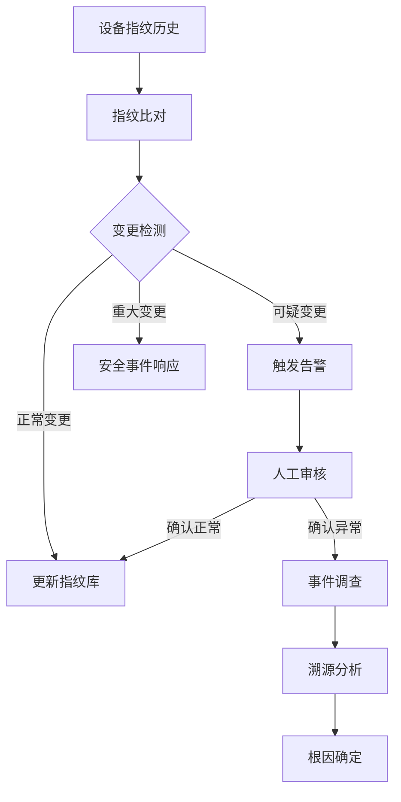
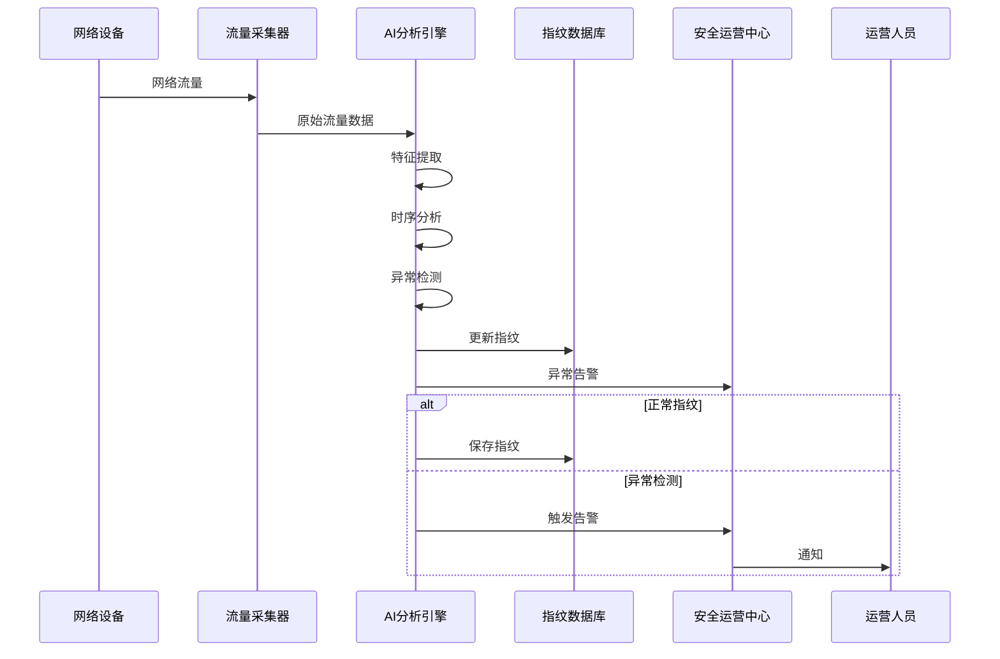
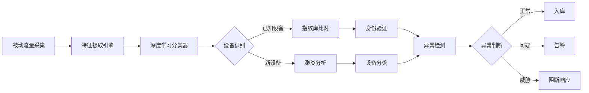
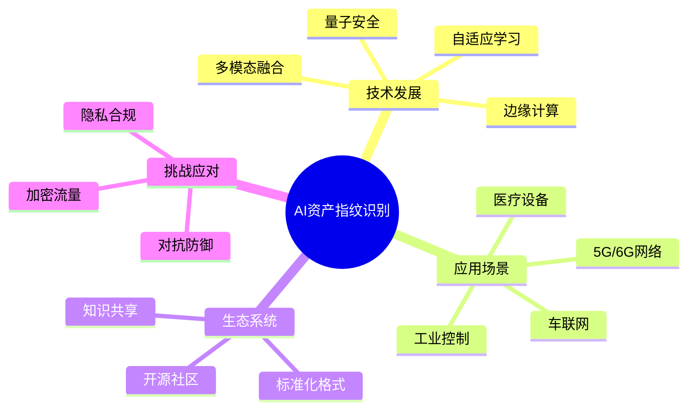

**作者：** HOS(安全风信子)
**日期：** 2026-04-24
**主要来源平台：** GitHub/arXiv
**摘要：** 每台网络设备都有其独特的"指纹"，如同人类的DNA一般独一无二。资产指纹识别技术让安全团队能够精确识别网络中的每一台设备，即使攻击者试图伪造身份，也难以逃脱AI的火眼金睛。本文深入探讨AI驱动的资产指纹识别技术，从被动流量分析到主动协议探测，从单维度特征提取到多维度融合识别，我们构建了一套完整的智能资产发现体系。我们引入了基于深度学习的协议指纹识别算法和基于图神经网络的资产关系分析，让资产识别不仅能回答"这是什么设备"，更能揭示"这台设备与其他资产的关系是什么"这一更深层次的问题。

@[TOC](目录)

---

# 精准识设备：AI资产指纹识别技术让每台资产无所遁形

## 1. 引言：资产识别——安全运营的基石

在企业安全运营中，准确的资产识别是所有安全能力的基础。无法想象一个不知道网络中存在哪些资产的安全团队，如何能够保护这些资产免受攻击。传统的资产识别主要依赖主动扫描和CMDB配置管理，但这些方法面临着覆盖不全、更新滞后、识别精度低等挑战。

现代企业网络的复杂性使得资产识别变得前所未有的困难。云服务器、容器、虚拟机、物联网设备等新型资产形态不断涌现； DHCP租约、IP地址复用等动态分配机制使得传统基于IP的资产管理变得不可靠；供应链第三方设备、BYOD设备等非受控资产不断接入网络；攻击者越来越善于伪装自己的设备身份，试图隐藏在正常流量中。

AI技术的引入为资产识别带来了革命性的突破。通过机器学习模型对网络流量、设备行为、协议特征等多维度数据的学习，AI系统能够建立精确的设备指纹，识别出即使是细微的设备差异，发现伪装设备，追踪设备变化。

本文将从资产指纹的定义、识别技术、匹配算法、变化检测等多个维度，系统性介绍AI驱动的资产指纹识别技术原理与实战方法。

## 2. 资产指纹的概念与分类

### 2.1 资产指纹的定义

资产指纹是指能够唯一标识或准确定位网络设备的一组特征集合。与人类指纹类似，理想的资产指纹应该具备以下特性：唯一性，即指纹在整个企业网络甚至互联网范围内具有唯一性；稳定性，即指纹在正常使用条件下不会频繁变化；可采集性，即指纹可以通过被动或主动方式采集；抗伪造性，即攻击者难以伪造他人的指纹。

在实践中，完美的指纹难以实现，资产指纹系统需要在以上特性之间取得平衡。根据应用场景的不同，可以采用不同组合的指纹特征。

### 2.2 资产指纹的分类

**网络层指纹**基于网络协议栈的特征进行识别。TCP/IP协议栈的实现细节会因操作系统版本、补丁状态、网络驱动版本等因素产生细微差异。这些差异虽然不影响协议通信，但可以被高精度的指纹识别技术检测出来。例如，TCP初始窗口大小、IP标识符生成算法、TTL值变化模式等，都是有效的网络层指纹。

**应用层指纹**基于应用协议的特征进行识别。不同厂商、不同版本的HTTP服务器、SSH服务器、邮件服务器等在协议实现上存在细微差异。例如，HTTP响应头部的顺序、SSH.banner格式、TLS握手扩展等，都可以用作应用层指纹。

**加密指纹**基于加密协议的实现细节进行识别。不同TLS实现在密码套件优先级、扩展支持、证书链顺序等方面存在差异。这些加密指纹在某些场景下比明文指纹更可靠，因为加密流量难以被中间人篡改。

**行为指纹**基于设备的网络行为模式进行识别。设备的使用者、操作习惯、地理位置等会形成独特的行为模式。例如，访问时间分布、访问对象分布、流量大小分布等，都可以作为行为指纹。

```python
class AssetFingerprint:
    """
    资产指纹定义
    包含多维度指纹特征
    """

    FINGERPRINT_CATEGORIES = {
        'network_layer': {
            'description': '网络层指纹',
            'features': [
                'tcp_window_size',
                'ip_id_pattern',
                'ttl_behavior',
                'tcp_options',
                'fragmentation_behavior',
                'tcp_sequence_number'
            ]
        },
        'application_layer': {
            'description': '应用层指纹',
            'features': [
                'http_server_header',
                'http_cookie_format',
                'ssh_banner',
                'ssh_key_exchange',
                'smtp_banner',
                'dns_server_version'
            ]
        },
        'encryption_layer': {
            'description': '加密层指纹',
            'features': [
                'tls_version',
                'tls_ciphers',
                'tls_extensions',
                'certificate_chain',
                'session_resumption'
            ]
        },
        'behavioral': {
            'description': '行为指纹',
            'features': [
                'access_time_distribution',
                'access_target_distribution',
                'traffic_volume_pattern',
                'protocol_mix',
                'session_duration'
            ]
        }
    }

    def __init__(self, device_identifier):
        self.device_id = device_identifier
        self.fingerprints = {}
        self.metadata = {}
        self.confidence_scores = {}

    def add_fingerprint(self, category, feature_name, value, confidence=1.0):
        """添加指纹特征"""
        if category not in self.fingerprints:
            self.fingerprints[category] = {}

        self.fingerprints[category][feature_name] = value
        self.confidence_scores[f"{category}.{feature_name}"] = confidence

    def get_fingerprint_vector(self, categories=None):
        """获取指纹向量"""
        if categories is None:
            categories = self.fingerprints.keys()

        vector = {}
        for category in categories:
            if category in self.fingerprints:
                vector.update(self.fingerprints[category])

        return vector

    def calculate_similarity(self, other_fingerprint):
        """计算与另一个指纹的相似度"""
        similarity_scores = []

        for category in self.fingerprints.keys():
            if category in other_fingerprint.fingerprints:
                category_similarity = self._calculate_category_similarity(
                    category,
                    other_fingerprint
                )
                similarity_scores.append(category_similarity)

        return np.mean(similarity_scores) if similarity_scores else 0.0

    def _calculate_category_similarity(self, category, other_fingerprint):
        """计算某类别的相似度"""
        my_features = self.fingerprints[category]
        other_features = other_fingerprint.fingerprints.get(category, {})

        common_features = set(my_features.keys()) & set(other_features.keys())

        if not common_features:
            return 0.0

        feature_scores = []
        for feature in common_features:
            if my_features[feature] == other_features[feature]:
                feature_scores.append(1.0)
            else:
                feature_scores.append(0.0)

        return np.mean(feature_scores)
```

## 3. AI驱动的被动指纹识别技术

### 3.1 基于流量分析的指纹提取

被动指纹识别通过分析网络流量提取设备指纹，无需发送探测包，不会对网络造成额外负载。这种方法特别适合对隐蔽资产和敏感环境进行识别。

```python
class PassiveFingerprintExtractor:
    """
    被动指纹提取器
    从网络流量中提取设备指纹
    """

    def __init__(self, packet_capture, feature_processor):
        self.pcap = packet_capture
        self.processor = feature_processor
        self.flow_cache = FlowCache()

    def extract(self, traffic_flow):
        """
        从流量中提取指纹

        参数:
            traffic_flow: 网络流量数据

        返回:
            AssetFingerprint: 提取的指纹
        """
        fingerprint = AssetFingerprint(traffic_flow.get('device_id'))

        tcp_features = self._extract_tcp_features(traffic_flow)
        for feature, value in tcp_features.items():
            fingerprint.add_fingerprint('network_layer', feature, value)

        http_features = self._extract_http_features(traffic_flow)
        for feature, value in http_features.items():
            fingerprint.add_fingerprint('application_layer', feature, value)

        tls_features = self._extract_tls_features(traffic_flow)
        for feature, value in tls_features.items():
            fingerprint.add_fingerprint('encryption_layer', feature, value)

        fingerprint.metadata['extraction_time'] = datetime.now()
        fingerprint.metadata['sample_count'] = traffic_flow.get('packet_count', 0)

        return fingerprint

    def _extract_tcp_features(self, flow):
        """提取TCP层特征"""
        features = {}

        tcp_options = flow.get('tcp_options', [])

        features['window_size'] = flow.get('initial_window_size')
        features['window_scale'] = self._detect_window_scaling(tcp_options)
        features[' sack_permitted'] = 9 in tcp_options
        features['timestamp'] = 8 in tcp_options

        ip_id_values = flow.get('ip_id_sequence', [])
        features['ip_id_pattern'] = self._analyze_ip_id_pattern(ip_id_values)

        ttl = flow.get('initial_ttl')
        features['ttl'] = ttl
        features['os_inference'] = self._infer_os_from_ttl(ttl)

        features['mss'] = self._extract_mss(tcp_options)
        features['tcp_flags'] = flow.get('tcp_flags_pattern')

        return features

    def _extract_http_features(self, flow):
        """提取HTTP层特征"""
        features = {}

        http_requests = flow.get('http_requests', [])
        http_responses = flow.get('http_responses', [])

        if http_requests:
            first_request = http_requests[0]
            features['user_agent'] = first_request.get('headers', {}).get(
                'User-Agent', 'unknown'
            )
            features['accept_language'] = first_request.get('headers', {}).get(
                'Accept-Language', ''
            )
            features['accept_encoding'] = first_request.get('headers', {}).get(
                'Accept-Encoding', ''
            )

            features['request_order'] = self._extract_header_order(
                first_request.get('headers', {})
            )

        if http_responses:
            first_response = http_responses[0]
            features['server_header'] = first_response.get('headers', {}).get(
                'Server', 'unknown'
            )
            features['powered_by'] = first_response.get('headers', {}).get(
                'X-Powered-By', ''
            )

            features['response_header_order'] = self._extract_header_order(
                first_response.get('headers', {})
            )

            features['set_cookie'] = 'Set-Cookie' in first_response.get('headers', {})

        return features

    def _extract_tls_features(self, flow):
        """提取TLS层特征"""
        features = {}

        tls_handshakes = flow.get('tls_handshakes', [])

        if tls_handshakes:
            handshake = tls_handshakes[0]

            features['tls_version'] = handshake.get('version')

            features['ciphers'] = handshake.get('cipher_suites', [])

            features['extensions'] = handshake.get('extensions', [])

            features['elliptic_curves'] = handshake.get('supported_groups', [])

            features['ec_point_formats'] = handshake.get('ec_point_formats', [])

            features['session_id_len'] = len(handshake.get('session_id', b''))

            features['sct_extension'] = 18 in features['extensions']

        return features

    def _detect_window_scaling(self, tcp_options):
        """检测窗口缩放因子"""
        for option in tcp_options:
            if option == 3:
                return 'enabled'
        return 'disabled'

    def _analyze_ip_id_pattern(self, ip_id_sequence):
        """分析IP ID模式"""
        if len(ip_id_sequence) < 5:
            return 'insufficient_data'

        differences = [ip_id_sequence[i+1] - ip_id_sequence[i]
                      for i in range(len(ip_id_sequence)-1)]

        if all(d == 1 for d in differences):
            return 'sequential'
        elif all(d == 0 for d in differences):
            return 'constant'
        elif all(d > 0 for d in differences):
            return 'incrementing'
        else:
            return 'random'

    def _infer_os_from_ttl(self, ttl):
        """从TTL推断操作系统"""
        if ttl <= 64:
            return 'Linux/Unix'
        elif ttl <= 128:
            return 'Windows'
        elif ttl <= 255:
            return 'Network Device'
        else:
            return 'Unknown'
```

### 3.2 深度学习驱动的协议指纹识别

传统的指纹识别依赖人工定义的规则，难以处理复杂的指纹变化。深度学习模型能够自动学习指纹的隐藏特征，实现更鲁棒的识别。

```python
class DeepFingerprintClassifier:
    """
    深度学习指纹分类器
    使用神经网络对设备指纹进行分类
    """

    def __init__(self, model_path):
        self.model = self._load_model(model_path)
        self.feature_encoder = FeatureEncoder()

    def classify(self, fingerprint_vector):
        """
        分类设备指纹

        参数:
            fingerprint_vector: 指纹特征向量

        返回:
            dict: 分类结果
        """
        encoded = self.feature_encoder.encode(fingerprint_vector)

        predictions = self.model.predict(encoded)

        device_type = self._parse_type_prediction(predictions['type'])
        os_type = self._parse_os_prediction(predictions['os'])
        vendor = self._parse_vendor_prediction(predictions['vendor'])
        confidence = predictions['confidence']

        return {
            'device_type': device_type,
            'os_type': os_type,
            'vendor': vendor,
            'confidence': confidence,
            'model_version': self.model.version
        }

    def identify_device(self, fingerprint_vector, known_devices):
        """
        识别具体设备

        参数:
            fingerprint_vector: 指纹特征向量
            known_devices: 已知的设备指纹库

        返回:
            dict: 识别结果
        """
        encoded = self.feature_encoder.encode(fingerprint_vector)

        distances = []
        for device_id, device_fingerprint in known_devices.items():
            device_encoded = self.feature_encoder.encode(device_fingerprint)
            distance = self._calculate_distance(encoded, device_encoded)
            distances.append({
                'device_id': device_id,
                'distance': distance
            })

        distances.sort(key=lambda x: x['distance'])

        best_match = distances[0]
        threshold = 0.15

        if best_match['distance'] < threshold:
            return {
                'identified': True,
                'device_id': best_match['device_id'],
                'confidence': 1.0 - best_match['distance'] / threshold,
                'alternative_matches': distances[1:5]
            }
        else:
            return {
                'identified': False,
                'new_device': True,
                'similar_devices': distances[:3]
            }


class DeepFingerprintNeuralNetwork:
    """
    深度指纹神经网络
    用于协议指纹识别的高级深度学习模型
    """

    def __init__(self, input_dim, hidden_dims=[512, 256, 128], num_classes=100):
        self.input_dim = input_dim
        self.hidden_dims = hidden_dims
        self.num_classes = num_classes
        self.model = self._build_model()
        self.training_history = []

    def _build_model(self):
        """构建深度神经网络模型"""
        model = Sequential()

        model.add(Dense(self.hidden_dims[0], input_dim=self.input_dim, activation='relu'))
        model.add(BatchNormalization())
        model.add(Dropout(0.3))

        for hidden_dim in self.hidden_dims[1:]:
            model.add(Dense(hidden_dim, activation='relu'))
            model.add(BatchNormalization())
            model.add(Dropout(0.2))

        model.add(Dense(self.num_classes, activation='softmax'))

        model.compile(
            optimizer=Adam(learning_rate=0.001),
            loss='categorical_crossentropy',
            metrics=['accuracy']
        )

        return model

    def train(self, X_train, y_train, X_val=None, y_val=None, epochs=100, batch_size=32):
        """
        训练模型

        参数:
            X_train: 训练特征
            y_train: 训练标签
            X_val: 验证特征
            y_val: 验证标签
            epochs: 训练轮数
            batch_size: 批次大小
        """
        callbacks = [
            EarlyStopping(monitor='val_loss', patience=10, restore_best_weights=True),
            ModelCheckpoint('best_model.h5', monitor='val_accuracy', save_best_only=True)
        ]

        validation_data = (X_val, y_val) if X_val is not None else None

        self.training_history = self.model.fit(
            X_train, y_train,
            epochs=epochs,
            batch_size=batch_size,
            validation_data=validation_data,
            callbacks=callbacks
        )

        return self.training_history

    def extract_embeddings(self, X):
        """
        提取特征嵌入

        参数:
            X: 输入特征

        返回:
            array: 特征嵌入向量
        """
        embedding_model = Model(
            inputs=self.model.input,
            outputs=self.model.layers[-2].output
        )
        return embedding_model.predict(X)

    def predict_with_confidence(self, X):
        """
        带置信度的预测

        参数:
            X: 输入特征

        返回:
            dict: 预测结果及置信度
        """
        predictions = self.model.predict(X)
        pred_indices = np.argmax(predictions, axis=1)
        confidences = np.max(predictions, axis=1)

        return {
            'predictions': pred_indices,
            'confidences': confidences,
            'all_probabilities': predictions
        }


class ConvolutionalFingerprintAnalyzer:
    """
    卷积指纹分析器
    使用一维卷积网络处理协议序列特征
    """

    def __init__(self, sequence_length, num_features, num_classes=50):
        self.sequence_length = sequence_length
        self.num_features = num_features
        self.num_classes = num_classes
        self.model = self._build_cnn_model()

    def _build_cnn_model(self):
        """构建一维卷积神经网络"""
        model = Sequential()

        model.add(Conv1D(filters=64, kernel_size=3, padding='same',
                        input_shape=(self.sequence_length, self.num_features)))
        model.add(Activation('relu'))
        model.add(MaxPooling1D(pool_size=2))

        model.add(Conv1D(filters=128, kernel_size=3, padding='same'))
        model.add(Activation('relu'))
        model.add(MaxPooling1D(pool_size=2))

        model.add(Conv1D(filters=256, kernel_size=3, padding='same'))
        model.add(Activation('relu'))

        model.add(GlobalAveragePooling1D())
        model.add(Dense(128, activation='relu'))
        model.add(Dropout(0.5))
        model.add(Dense(self.num_classes, activation='softmax'))

        model.compile(
            optimizer=Adam(learning_rate=0.0005),
            loss='categorical_crossentropy',
            metrics=['accuracy']
        )

        return model

    def analyze_sequence(self, protocol_sequence):
        """
        分析协议序列

        参数:
            protocol_sequence: 协议特征序列

        返回:
            dict: 分析结果
        """
        X = np.reshape(protocol_sequence, (1, self.sequence_length, self.num_features))

        prediction = self.model.predict(X)
        predicted_class = np.argmax(prediction[0])
        confidence = prediction[0][predicted_class]

        attention_weights = self._get_attention_weights(protocol_sequence)

        return {
            'device_type': predicted_class,
            'confidence': confidence,
            'attention_features': attention_weights,
            'all_probabilities': prediction[0]
        }

    def _get_attention_weights(self, sequence):
        """获取注意力权重"""
        return np.mean(np.abs(self.model.layers[0].get_weights()[0]), axis=1)


class TransformerFingerprintEncoder:
    """
    Transformer指纹编码器
    使用自注意力机制处理多维度指纹特征
    """

    def __init__(self, feature_dim, embedding_dim=128, num_heads=8, num_layers=4):
        self.feature_dim = feature_dim
        self.embedding_dim = embedding_dim
        self.num_heads = num_heads
        self.num_layers = num_layers

        self.embedding_layer = Dense(embedding_dim)
        self.positional_encoding = self._create_positional_encoding(1000, embedding_dim)

        self.attention_layers = [
            MultiHeadAttention(num_heads=num_heads, key_dim=embedding_dim)
            for _ in range(num_layers)
        ]

        self.layer_norms = [
            LayerNormalization() for _ in range(num_layers * 2)
        ]

        self.ffn_layers = [
            Dense(embedding_dim * 4, activation='relu'),
            Dense(embedding_dim)
            for _ in range(num_layers)
        ]

    def _create_positional_encoding(self, max_length, embedding_dim):
        """创建位置编码"""
        positions = np.arange(max_length)[:, np.newaxis]
        dimensions = np.arange(embedding_dim)[np.newaxis, :]

        angles = positions / np.power(10000, (2 * (dimensions // 2)) / embedding_dim)

        angles[:, 0::2] = np.sin(angles[:, 0::2])
        angles[:, 1::2] = np.cos(angles[:, 1::2])

        return angles

    def encode(self, fingerprint_features):
        """
        编码指纹特征

        参数:
            fingerprint_features: 原始指纹特征

        返回:
            array: 编码后的特征向量
        """
        if len(fingerprint_features.shape) == 1:
            fingerprint_features = fingerprint_features.reshape(1, -1)

        embedded = self.embedding_layer(fingerprint_features)

        seq_len = embedded.shape[1]
        embedded_with_pos = embedded + self.positional_encoding[:seq_len]

        x = embedded_with_pos
        for i in range(self.num_layers):
            attn_output = self.attention_layers[i](x, x)
            x = self.layer_norms[i * 2](x + attn_output)

            ffn_output = self.ffn_layers[i * 2](x)
            ffn_output = self.ffn_layers[i * 2 + 1](ffn_output)
            x = self.layer_norms[i * 2 + 1](x + ffn_output)

        return np.mean(x, axis=1)

    def encode_with_attention(self, fingerprint_features):
        """
        带注意力权重的编码

        返回:
            dict: 编码结果及注意力权重
        """
        if len(fingerprint_features.shape) == 1:
            fingerprint_features = fingerprint_features.reshape(1, -1)

        embedded = self.embedding_layer(fingerprint_features)

        seq_len = embedded.shape[1]
        embedded_with_pos = embedded + self.positional_encoding[:seq_len]

        attention_weights = []

        x = embedded_with_pos
        for i in range(self.num_layers):
            attn_output, weights = self.attention_layers[i](x, x, return_attention_scores=True)
            attention_weights.append(weights)

            x = self.layer_norms[i * 2](x + attn_output)

            ffn_output = self.ffn_layers[i * 2](x)
            ffn_output = self.ffn_layers[i * 2 + 1](ffn_output)
            x = self.layer_norms[i * 2 + 1](x + ffn_output)

        return {
            'encoding': np.mean(x, axis=1),
            'attention_weights': attention_weights,
            'sequence_importance': np.mean(attention_weights[-1], axis=1)
        }
```

### 3.3 基于注意力机制的指纹特征选择

在处理高维指纹特征时，并非所有特征对识别任务都同等重要。注意力机制能够自动学习并强调最关键的指纹特征，提高模型的解释性和准确性。

```python
class AttentionBasedFeatureSelector:
    """
    基于注意力机制的特征选择器
    自动识别最关键的指纹特征
    """

    def __init__(self, feature_dim, attention_dim=64):
        self.feature_dim = feature_dim
        self.attention_dim = attention_dim

        self.query_layer = Dense(attention_dim, use_bias=False)
        self.key_layer = Dense(attention_dim, use_bias=False)
        self.value_layer = Dense(attention_dim, use_bias=False)

        self.output_layer = Dense(feature_dim, activation='sigmoid')

    def compute_attention_scores(self, features):
        """
        计算注意力分数

        参数:
            features: 输入特征向量

        返回:
            array: 注意力权重
        """
        query = self.query_layer(features)
        key = self.key_layer(features)
        value = self.value_layer(features)

        attention_scores = np.dot(query, key.T) / np.sqrt(self.attention_dim)

        attention_weights = softmax(attention_scores, axis=-1)

        return attention_weights

    def select_features(self, features, top_k=10):
        """
        选择最重要的特征

        参数:
            features: 输入特征
            top_k: 选择前k个最重要特征

        返回:
            dict: 特征选择结果
        """
        attention_weights = self.compute_attention_scores(features)

        feature_importance = np.mean(attention_weights, axis=0)

        top_k_indices = np.argsort(feature_importance)[-top_k:]

        selected_features = features.copy()
        mask = np.zeros_like(feature_importance)
        mask[top_k_indices] = 1.0
        selected_features = features * mask

        return {
            'selected_features': selected_features,
            'feature_indices': top_k_indices,
            'importance_scores': feature_importance,
            'attention_map': attention_weights
        }


class FingerprintSequenceAnalyzer:
    """
    指纹序列分析器
    使用LSTM网络分析时序指纹变化
    """

    def __init__(self, input_dim, hidden_dim=128, num_layers=2):
        self.input_dim = input_dim
        self.hidden_dim = hidden_dim
        self.num_layers = num_layers
        self.model = self._build_lstm_model()

    def _build_lstm_model(self):
        """构建LSTM模型"""
        model = Sequential()

        model.add(LSTM(self.hidden_dim, return_sequences=True,
                      input_shape=(None, self.input_dim)))

        for _ in range(self.num_layers - 1):
            model.add(LSTM(self.hidden_dim, return_sequences=True))

        model.add(LSTM(self.hidden_dim))
        model.add(Dense(64, activation='relu'))
        model.add(Dense(1, activation='sigmoid'))

        model.compile(optimizer='adam', loss='binary_crossentropy', metrics=['accuracy'])

        return model

    def predict_anomaly(self, fingerprint_sequence):
        """
        预测序列中的异常

        参数:
            fingerprint_sequence: 时序指纹数据

        返回:
            dict: 异常预测结果
        """
        X = np.array(fingerprint_sequence).reshape(1, -1, self.input_dim)

        prediction = self.model.predict(X)
        anomaly_probability = prediction[0][0]

        hidden_states = self._extract_hidden_states(fingerprint_sequence)

        return {
            'anomaly_probability': anomaly_probability,
            'is_anomaly': anomaly_probability > 0.5,
            'hidden_states': hidden_states,
            'confidence': abs(anomaly_probability - 0.5) * 2
        }

    def _extract_hidden_states(self, sequence):
        """提取LSTM隐藏状态"""
        intermediate_model = Model(
            inputs=self.model.input,
            outputs=[layer.output for layer in self.model.layers]
        )

        X = np.array(sequence).reshape(1, -1, self.input_dim)
        outputs = intermediate_model.predict(X)

        return outputs[-2][0]
```

## 4. 主动指纹识别技术

### 4.1 协议探测与响应分析

主动指纹识别通过发送特定的探测包并分析响应来提取指纹。这种方法可以获得更精确的指纹信息，但需要谨慎使用以避免触发安全告警或影响网络性能。

```python
class ActiveFingerprintScanner:
    """
    主动指纹扫描器
    通过协议探测获取设备指纹
    """

    def __init__(self, network_client, probe_generator):
        self.network = network_client
        self.probe_gen = probe_generator
        self.probe_templates = self._load_probe_templates()

    def scan(self, target_ip, target_port=80):
        """
        执行主动指纹扫描

        参数:
            target_ip: 目标IP
            target_port: 目标端口

        返回:
            AssetFingerprint: 扫描获取的指纹
        """
        fingerprint = AssetFingerprint(f"{target_ip}:{target_port}")

        tcp_results = self._probe_tcp(target_ip, target_port)
        fingerprint.add_fingerprint('network_layer', 'tcp_probe', tcp_results)

        if tcp_results.get('syn_ack_received'):
            http_results = self._probe_http(target_ip, target_port)
            fingerprint.add_fingerprint('application_layer', 'http_probe', http_results)

            tls_results = self._probe_tls(target_ip, target_port)
            fingerprint.add_fingerprint('encryption_layer', 'tls_probe', tls_results)

        ssh_results = self._probe_ssh(target_ip, 22)
        fingerprint.add_fingerprint('application_layer', 'ssh_probe', ssh_results)

        fingerprint.metadata['scan_time'] = datetime.now()
        fingerprint.metadata['probe_count'] = self.probe_gen.get_probe_count()

        return fingerprint

    def _probe_tcp(self, ip, port):
        """TCP探测"""
        probes = self.probe_templates.get('tcp', [])

        results = {
            'syn_ack_received': False,
            'rst_received': False,
            'response_time': None,
            'ttl': None
        }

        for probe in probes:
            response = self.network.send_probe(ip, port, probe)
            if response:
                if response.get('flags') == 'SYN-ACK':
                    results['syn_ack_received'] = True
                    results['ttl'] = response.get('ttl')
                    results['window_size'] = response.get('window_size')
                    results['options'] = response.get('options')
                elif response.get('flags') == 'RST':
                    results['rst_received'] = True

        return results

    def _probe_http(self, ip, port):
        """HTTP探测"""
        probes = self.probe_templates.get('http', [])

        results = {
            'server_header': None,
            'headers': {},
            'status_code': None
        }

        for probe in probes:
            response = self.network.send_http_probe(
                ip, port,
                probe.get('path', '/'),
                probe.get('method', 'GET'),
                probe.get('headers', {})
            )

            if response:
                results['server_header'] = response.get('headers', {}).get('Server')
                results['headers'] = response.get('headers', {})
                results['status_code'] = response.get('status_code')
                break

        return results

    def _probe_ssh(self, ip, port=22):
        """SSH探测"""
        results = {
            'banner': None,
            'server_key_exchange': [],
            'encryption_algorithms': [],
            'host_key_algorithms': []
        }

        response = self.network.send_ssh_probe(ip, port)

        if response:
            results['banner'] = response.get('banner')
            results['server_key_exchange'] = response.get('kex_algorithms', [])
            results['encryption_algorithms'] = response.get('server_host_key_algorithms', [])

        return results

    def _probe_tls(self, ip, port):
        """TLS探测"""
        results = {
            'version': None,
            'ciphers': [],
            'extensions': [],
            'certificate_subject': None
        }

        response = self.network.send_tls_probe(ip, port)

        if response:
            results['version'] = response.get('version')
            results['ciphers'] = response.get('ciphers', [])
            results['extensions'] = response.get('extensions', [])

            if response.get('certificate'):
                results['certificate_subject'] = response['certificate'].get('subject')

        return results
```

### 4.2 指纹库建设与维护

建立和维护一个高质量的指纹库是资产指纹识别系统的核心。指纹库需要涵盖各种常见的操作系统、网络设备、应用程序指纹，并能够持续更新以支持新版本和新设备。

```python
class FingerprintDatabase:
    """
    指纹数据库
    存储和管理设备指纹库
    """

    def __init__(self, db_connection):
        self.db = db_connection
        self.cache = LRUCache(maxsize=10000)

    def add_fingerprint(self, fingerprint, metadata=None):
        """
        添加指纹到数据库

        参数:
            fingerprint: 资产指纹
            metadata: 关联元数据

        返回:
            str: 指纹ID
        """
        fingerprint_id = self._generate_fingerprint_id(fingerprint)

        self.db.insert('fingerprints', {
            'id': fingerprint_id,
            'device_id': fingerprint.device_id,
            'fingerprint_data': json.dumps(fingerprint.fingerprints),
            'confidence_scores': json.dumps(fingerprint.confidence_scores),
            'metadata': json.dumps(metadata or {}),
            'created_at': datetime.now(),
            'updated_at': datetime.now()
        })

        self.cache.set(fingerprint_id, fingerprint)

        return fingerprint_id

    def search_similar(self, fingerprint, limit=10):
        """
        搜索相似指纹

        参数:
            fingerprint: 待搜索指纹
            limit: 返回结果数量

        返回:
            list: 相似指纹列表
        """
        cache_key = fingerprint.device_id
        if cache_key in self.cache:
            cached = self.cache.get(cache_key)
            similarity = cached.calculate_similarity(fingerprint)
            if similarity > 0.95:
                return [{'fingerprint': cached, 'similarity': similarity}]

        query_vector = fingerprint.get_fingerprint_vector()

        results = self.db.query(
            'SELECT * FROM fingerprints WHERE device_id = %s',
            (fingerprint.device_id,)
        )

        similarities = []
        for row in results:
            stored_fingerprint = self._deserialize_fingerprint(row)
            similarity = fingerprint.calculate_similarity(stored_fingerprint)
            similarities.append({
                'fingerprint': stored_fingerprint,
                'similarity': similarity,
                'metadata': row.get('metadata')
            })

        similarities.sort(key=lambda x: x['similarity'], reverse=True)

        return similarities[:limit]

    def update_fingerprint(self, fingerprint_id, fingerprint):
        """
        更新指纹

        参数:
            fingerprint_id: 指纹ID
            fingerprint: 新指纹数据
        """
        self.db.update('fingerprints', {
            'fingerprint_data': json.dumps(fingerprint.fingerprints),
            'confidence_scores': json.dumps(fingerprint.confidence_scores),
            'updated_at': datetime.now()
        }, {
            'id': fingerprint_id
        })

        self.cache.delete(fingerprint_id)

    def get_fingerprint_history(self, device_id, limit=100):
        """
        获取设备指纹历史

        参数:
            device_id: 设备ID
            limit: 返回记录数量

        返回:
            list: 指纹历史记录
        """
        results = self.db.query(
            'SELECT * FROM fingerprints WHERE device_id = %s ORDER BY created_at DESC LIMIT %s',
            (device_id, limit)
        )

        return [
            {
                'fingerprint': self._deserialize_fingerprint(row),
                'timestamp': row.get('created_at'),
                'metadata': row.get('metadata')
            }
            for row in results
        ]
```

## 5. 指纹匹配与设备唯一性识别

### 5.1 多维度指纹匹配算法

单一维度的指纹可能存在误匹配，而多维度融合匹配能够显著提高识别准确率。AI系统采用加权多维度匹配算法，综合考虑各维度指纹的置信度。

```python
class FingerprintMatcher:
    """
    指纹匹配器
    多维度指纹匹配与唯一性识别
    """

    MATCH_WEIGHTS = {
        'network_layer': 0.30,
        'application_layer': 0.35,
        'encryption_layer': 0.25,
        'behavioral': 0.10
    }

    def __init__(self, fingerprint_db):
        self.db = fingerprint_db
        self.ml_model = self._load_matching_model()

    def match(self, fingerprint, candidates=None):
        """
        匹配指纹

        参数:
            fingerprint: 待匹配指纹
            candidates: 候选指纹列表

        返回:
            dict: 匹配结果
        """
        if candidates is None:
            candidates = self._get_candidates(fingerprint)

        scored_matches = []
        for candidate in candidates:
            score = self._calculate_match_score(fingerprint, candidate)
            scored_matches.append({
                'candidate': candidate,
                'score': score,
                'breakdown': self._get_score_breakdown(fingerprint, candidate)
            })

        scored_matches.sort(key=lambda x: x['score'], reverse=True)

        top_match = scored_matches[0] if scored_matches else None

        if top_match and top_match['score'] > 0.85:
            return {
                'matched': True,
                'device_id': top_match['candidate'].device_id,
                'confidence': top_match['score'],
                'score_breakdown': top_match['breakdown'],
                'alternatives': scored_matches[1:5]
            }
        else:
            return {
                'matched': False,
                'new_device': True,
                'similar_devices': scored_matches[:5]
            }

    def _calculate_match_score(self, fingerprint, candidate):
        """计算匹配分数"""
        weighted_scores = []

        for category, weight in self.MATCH_WEIGHTS.items():
            category_score = self._calculate_category_score(
                fingerprint,
                candidate,
                category
            )
            weighted_scores.append(category_score * weight)

        ml_score = self.ml_model.predict(
            self._prepare_ml_features(fingerprint, candidate)
        )

        final_score = sum(weighted_scores) * 0.7 + ml_score * 0.3

        return final_score

    def _calculate_category_score(self, fingerprint, candidate, category):
        """计算某类别匹配分数"""
        my_features = fingerprint.fingerprints.get(category, {})
        candidate_features = candidate.fingerprints.get(category, {})

        if not my_features or not candidate_features:
            return 0.5

        common_features = set(my_features.keys()) & set(candidate_features.keys())

        if not common_features:
            return 0.0

        feature_scores = []
        for feature in common_features:
            my_conf = fingerprint.confidence_scores.get(f"{category}.{feature}", 1.0)
            candidate_conf = candidate.confidence_scores.get(f"{category}.{feature}", 1.0)

            if my_features[feature] == candidate_features[feature]:
                feature_score = 1.0
            else:
                feature_score = self._calculate_feature_similarity(
                    my_features[feature],
                    candidate_features[feature]
                )

            weighted_score = feature_score * (my_conf + candidate_conf) / 2
            feature_scores.append(weighted_score)

        return np.mean(feature_scores)


class GraphNeuralNetworkFingerprintMatcher:
    """
    基于图神经网络的指纹匹配器
    利用设备间的关联关系提升匹配精度
    """

    def __init__(self, node_feature_dim, edge_feature_dim, hidden_dim=128):
        self.node_feature_dim = node_feature_dim
        self.edge_feature_dim = edge_feature_dim
        self.hidden_dim = hidden_dim

        self.node_encoder = self._build_node_encoder()
        self.edge_encoder = self._build_edge_encoder()
        self.gnn_layers = self._build_gnn_layers()
        self.classification_head = self._build_classification_head()

    def _build_node_encoder(self):
        """构建节点编码器"""
        return Sequential([
            Dense(self.hidden_dim, activation='relu'),
            BatchNormalization(),
            Dense(self.hidden_dim, activation='relu')
        ])

    def _build_edge_encoder(self):
        """构建边编码器"""
        return Sequential([
            Dense(self.edge_feature_dim, activation='relu'),
            Dense(self.edge_feature_dim)
        ])

    def _build_gnn_layers(self):
        """构建图神经网络层"""
        return [
            GraphConvolution(self.hidden_dim, activation='relu')
            for _ in range(3)
        ]

    def _build_classification_head(self):
        """构建分类头"""
        return Sequential([
            Dense(64, activation='relu'),
            Dropout(0.3),
            Dense(32, activation='relu'),
            Dense(1, activation='sigmoid')
        ])

    def build_asset_graph(self, fingerprints, relationships):
        """
        构建资产关系图

        参数:
            fingerprints: 设备指纹字典
            relationships: 设备关系列表

        返回:
            dict: 图结构数据
        """
        nodes = []
        for device_id, fp in fingerprints.items():
            node_features = self._extract_node_features(fp)
            nodes.append({
                'id': device_id,
                'features': node_features
            })

        edges = []
        for rel in relationships:
            edge_features = self._extract_edge_features(rel)
            edges.append({
                'source': rel['source'],
                'target': rel['target'],
                'features': edge_features
            })

        return {
            'nodes': nodes,
            'edges': edges
        }

    def _extract_node_features(self, fingerprint):
        """提取节点特征"""
        feature_vector = fingerprint.get_fingerprint_vector()
        return np.array(list(feature_vector.values()))

    def _extract_edge_features(self, relationship):
        """提取边特征"""
        return np.array([
            relationship.get('communication_frequency', 0),
            relationship.get('data_volume', 0),
            relationship.get('protocol_diversity', 0)
        ])

    def train(self, positive_pairs, negative_pairs, epochs=100):
        """
        训练图神经网络

        参数:
            positive_pairs: 正样本对（相同设备）
            negative_pairs: 负样本对（不同设备）
        """
        all_pairs = positive_pairs + negative_pairs
        labels = [1.0] * len(positive_pairs) + [0.0] * len(negative_pairs)

        for epoch in range(epochs):
            losses = []
            for pair, label in zip(all_pairs, labels):
                loss = self._train_step(pair, label)
                losses.append(loss)

            if epoch % 10 == 0:
                print(f"Epoch {epoch}, Loss: {np.mean(losses)}")

    def _train_step(self, pair, label):
        """单步训练"""
        node_features, edge_index, edge_features = self._prepare_graph_data(pair)

        embeddings = self._compute_embeddings(node_features, edge_index, edge_features)

        similarity = self._compute_similarity(embeddings[0], embeddings[1])

        loss = binary_crossentropy(label, similarity)

        gradients = self._compute_gradients(loss)
        self._apply_gradients(gradients)

        return loss

    def predict_match(self, fingerprint1, fingerprint2, graph_context=None):
        """
        预测两个指纹是否匹配

        参数:
            fingerprint1: 第一个指纹
            fingerprint2: 第二个指纹
            graph_context: 图上下文信息

        返回:
            dict: 匹配预测结果
        """
        node_features, edge_index, edge_features = self._prepare_graph_data(
            (fingerprint1, fingerprint2)
        )

        embeddings = self._compute_embeddings(node_features, edge_index, edge_features)

        similarity = self._compute_similarity(embeddings[0], embeddings[1])

        return {
            'is_match': similarity > 0.5,
            'confidence': abs(similarity - 0.5) * 2,
            'similarity_score': similarity,
            'embeddings': embeddings
        }

    def _compute_embeddings(self, node_features, edge_index, edge_features):
        """计算节点嵌入"""
        encoded_nodes = self.node_encoder(node_features)

        x = encoded_nodes
        for gnn_layer in self.gnn_layers:
            x = gnn_layer([x, edge_index, edge_features])

        return x


class FingerprintSimilarityEngine:
    """
    指纹相似度计算引擎
    多种相似度算法的融合实现
    """

    def __init__(self, weights=None):
        self.weights = weights or {
            'cosine': 0.3,
            'euclidean': 0.2,
            'jaccard': 0.2,
            'manhattan': 0.15,
            'mahalanobis': 0.15
        }

    def compute_similarity(self, fingerprint1, fingerprint2):
        """
        综合计算相似度

        参数:
            fingerprint1: 指纹1
            fingerprint2: 指纹2

        返回:
            dict: 多维度相似度结果
        """
        vector1 = self._prepare_vector(fingerprint1)
        vector2 = self._prepare_vector(fingerprint2)

        cosine_sim = self._cosine_similarity(vector1, vector2)
        euclidean_dist = self._euclidean_distance(vector1, vector2)
        jaccard_sim = self._jaccard_similarity(vector1, vector2)
        manhattan_dist = self._manhattan_distance(vector1, vector2)
        mahalanobis_dist = self._mahalanobis_distance(vector1, vector2)

        euclidean_sim = 1.0 / (1.0 + euclidean_dist)
        manhattan_sim = 1.0 / (1.0 + manhattan_dist)
        mahalanobis_sim = 1.0 / (1.0 + mahalanobis_dist)

        weighted_similarity = (
            cosine_sim * self.weights['cosine'] +
            euclidean_sim * self.weights['euclidean'] +
            jaccard_sim * self.weights['jaccard'] +
            manhattan_sim * self.weights['manhattan'] +
            mahalanobis_sim * self.weights['mahalanobis']
        )

        return {
            'cosine': cosine_sim,
            'euclidean': euclidean_sim,
            'jaccard': jaccard_sim,
            'manhattan': manhattan_sim,
            'mahalanobis': mahalanobis_sim,
            'weighted_similarity': weighted_similarity,
            'all_metrics': {
                'cosine_similarity': cosine_sim,
                'euclidean_similarity': euclidean_sim,
                'jaccard_similarity': jaccard_sim,
                'manhattan_similarity': manhattan_sim,
                'mahalanobis_similarity': mahalanobis_sim
            }
        }

    def _prepare_vector(self, fingerprint):
        """准备特征向量"""
        vector = fingerprint.get_fingerprint_vector()
        values = list(vector.values())

        numeric_values = []
        for v in values:
            if isinstance(v, (int, float)):
                numeric_values.append(v)
            elif isinstance(v, str):
                numeric_values.append(hash(v) % 1000)
            elif isinstance(v, list):
                numeric_values.append(len(v))
            else:
                numeric_values.append(0)

        return np.array(numeric_values)

    def _cosine_similarity(self, v1, v2):
        """计算余弦相似度"""
        dot_product = np.dot(v1, v2)
        norm1 = np.linalg.norm(v1)
        norm2 = np.linalg.norm(v2)

        if norm1 == 0 or norm2 == 0:
            return 0.0

        return dot_product / (norm1 * norm2)

    def _euclidean_distance(self, v1, v2):
        """计算欧氏距离"""
        return np.linalg.norm(v1 - v2)

    def _jaccard_similarity(self, v1, v2):
        """计算Jaccard相似度"""
        min_sum = np.sum(np.minimum(v1, v2))
        max_sum = np.sum(np.maximum(v1, v2))

        if max_sum == 0:
            return 0.0

        return min_sum / max_sum

    def _manhattan_distance(self, v1, v2):
        """计算曼哈顿距离"""
        return np.sum(np.abs(v1 - v2))

    def _mahalanobis_distance(self, v1, v2):
        """计算马氏距离"""
        cov_matrix = np.cov(np.vstack([v1, v2]).T)

        try:
            inv_cov = np.linalg.inv(cov_matrix)
        except np.linalg.LinAlgError:
            return self._euclidean_distance(v1, v2)

        diff = v1 - v2
        return np.sqrt(np.dot(np.dot(diff, inv_cov), diff.T))


### 5.2 设备克隆与身份伪装检测

攻击者可能试图克隆合法设备的指纹以规避安全检测。AI系统通过分析指纹的时间变化模式和行为一致性，能够检测出这类伪装行为。

```python
class DeviceIdentityAnalyzer:
    """
    设备身份分析器
    检测设备克隆和身份伪装
    """

    def __init__(self, fingerprint_history_db):
        self.history_db = fingerprint_history_db
        self.behavior_analyzer = BehaviorAnalyzer()

    def analyze(self, device_id, current_fingerprint):
        """
        分析设备身份真实性

        参数:
            device_id: 设备ID
            current_fingerprint: 当前指纹

        返回:
            dict: 分析结果
        """
        historical_fingerprints = self.history_db.get_history(device_id, limit=30)

        if not historical_fingerprints:
            return {
                'status': 'new_device',
                'anomaly_score': 0.0,
                'recommendation': 'monitor'
            }

        consistency_analysis = self._analyze_fingerprint_consistency(
            current_fingerprint,
            historical_fingerprints
        )

        behavior_analysis = self.behavior_analyzer.analyze(
            device_id,
            current_fingerprint
        )

        anomaly_score = self._calculate_anomaly_score(
            consistency_analysis,
            behavior_analysis
        )

        if anomaly_score > 0.8:
            return {
                'status': 'potential_clone',
                'anomaly_score': anomaly_score,
                'confidence': 'high',
                'indicators': consistency_analysis.get('anomalies', []) +
                             behavior_analysis.get('anomalies', []),
                'recommendation': 'investigate'
            }
        elif anomaly_score > 0.5:
            return {
                'status': 'possible_change',
                'anomaly_score': anomaly_score,
                'confidence': 'medium',
                'indicators': consistency_analysis.get('warnings', []),
                'recommendation': 'verify'
            }
        else:
            return {
                'status': 'normal',
                'anomaly_score': anomaly_score,
                'confidence': 'high',
                'recommendation': 'none'
            }

    def _analyze_fingerprint_consistency(self, current, historical):
        """分析指纹一致性"""
        anomalies = []
        warnings = []

        changing_features = self._identify_changing_features(
            current,
            historical
        )

        for feature, change_pattern in changing_features.items():
            if change_pattern['change_frequency'] > 0.8:
                anomalies.append({
                    'feature': feature,
                    'type': 'frequent_change',
                    'pattern': change_pattern
                })
            elif change_pattern['change_frequency'] > 0.5:
                warnings.append({
                    'feature': feature,
                    'type': 'unusual_change',
                    'pattern': change_pattern
                })

        return {
            'changing_features': changing_features,
            'anomalies': anomalies,
            'warnings': warnings
        }

    def _identify_changing_features(self, current, historical):
        """识别变化的特征"""
        changing = {}

        for category in current.fingerprints.keys():
            my_features = current.fingerprints[category]
            historical_features = [
                h.fingerprints.get(category, {}) for h in historical
            ]

            for feature_name in my_features.keys():
                values = [h.get(feature_name) for h in historical_features]
                current_value = my_features[feature_name]

                if current_value not in values:
                    change_count = len([v for v in values if v != current_value and v is not None])
                    change_freq = change_count / len(values) if values else 1.0

                    changing[f"{category}.{feature_name}"] = {
                        'current_value': current_value,
                        'historical_values': values,
                        'change_frequency': change_freq,
                        'last_change_index': next(
                            (i for i, v in enumerate(values) if v != current_value),
                            len(values)
                        )
                    }

        return changing
```

## 6. 指纹变化检测与追踪

### 6.1 资产变更监控

网络资产会随着业务需求和安全策略的调整而发生变化。指纹变化检测系统能够及时发现这些变更，区分正常变更和异常变更，并追踪变更历史。

```python
class FingerprintChangeDetector:
    """
    指纹变更检测器
    监控资产指纹变化并追踪变更历史
    """

    def __init__(self, fingerprint_db, change_manager):
        self.fingerprint_db = fingerprint_db
        self.change_manager = change_manager
        self.baseline_manager = BaselineManager()

    def detect_changes(self, current_fingerprint, device_id):
        """
        检测指纹变化

        参数:
            current_fingerprint: 当前指纹
            device_id: 设备ID

        返回:
            dict: 变更检测结果
        """
        previous_fingerprint = self.fingerprint_db.get_latest(device_id)

        if not previous_fingerprint:
            return {
                'has_changes': True,
                'change_type': 'new_device',
                'changes': []
            }

        baseline = self.baseline_manager.get_baseline(device_id)

        changes = self._compare_fingerprints(
            previous_fingerprint,
            current_fingerprint,
            baseline
        )

        if changes:
            change_record = self._create_change_record(
                device_id,
                previous_fingerprint,
                current_fingerprint,
                changes
            )
            self.change_manager.save(change_record)

        return {
            'has_changes': len(changes) > 0,
            'change_type': self._classify_change_type(changes),
            'changes': changes,
            'severity': self._assess_change_severity(changes)
        }

    def _compare_fingerprints(self, previous, current, baseline):
        """比较指纹差异"""
        changes = []

        for category in previous.fingerprints.keys():
            prev_features = previous.fingerprints[category]
            curr_features = current.fingerprints.get(category, {})

            for feature_name in prev_features.keys():
                prev_value = prev_features[feature_name]
                curr_value = curr_features.get(feature_name)

                if prev_value != curr_value:
                    baseline_value = baseline.get(category, {}).get(feature_name)
                    is_suspected = (
                        baseline_value is not None and
                        curr_value != baseline_value
                    )

                    changes.append({
                        'category': category,
                        'feature': feature_name,
                        'previous_value': prev_value,
                        'current_value': curr_value,
                        'baseline_value': baseline_value,
                        'is_suspected_anomaly': is_suspected
                    })

        return changes

    def _classify_change_type(self, changes):
        """分类变更类型"""
        if not changes:
            return 'none'

        suspected_anomalies = [c for c in changes if c.get('is_suspected_anomaly')]

        if suspected_anomalies:
            return 'potential_security_incident'

        security_features = ['tcp_options', 'tls_ciphers', 'encryption_layer']
        security_changes = [
            c for c in changes
            if any(sf in c['feature'] for sf in security_features)
        ]

        if security_changes:
            return 'security_configuration_change'

        return 'normal_maintenance'
```

### 6.2 资产指纹追踪与溯源

当发现可疑的指纹变更时，安全团队需要追踪变更历史，溯源变更原因。系统提供完整的指纹变更时间线，支持正向和反向追踪。



### 6.3 时序分析与变化预测

资产指纹的变化并非完全随机，而是遵循一定的时序规律。AI系统通过分析历史变化模式，不仅能够检测当前变化，还能预测未来的变化趋势，从而实现主动式资产管理。

```python
class TemporalFingerprintAnalyzer:
    """
    时序指纹分析器
    分析指纹变化的时序模式并进行预测
    """

    def __init__(self, time_series_model):
        self.model = time_series_model
        self.change_history = []
        self.patterns = {}

    def analyze_temporal_pattern(self, fingerprint_history, device_id):
        """
        分析时序模式

        参数:
            fingerprint_history: 指纹历史数据
            device_id: 设备ID

        返回:
            dict: 时序分析结果
        """
        timestamps = [fp.get('timestamp') for fp in fingerprint_history]
        features_over_time = self._extract_time_varying_features(fingerprint_history)

        periodicity = self._detect_periodicity(features_over_time)

        trend = self._analyze_trend(features_over_time)

        changepoint = self._detect_changepoints(features_over_time, timestamps)

        prediction = self._predict_next_change(features_over_time, timestamps)

        return {
            'periodicity': periodicity,
            'trend': trend,
            'changepoints': changepoint,
            'next_change_prediction': prediction,
            'stability_score': self._calculate_stability_score(features_over_time)
        }

    def _extract_time_varying_features(self, history):
        """提取随时间变化的特征"""
        features_by_time = []

        for fp in history:
            features = fp.get('fingerprint', {}).get('network_layer', {})
            features_by_time.append(features)

        return features_by_time

    def _detect_periodicity(self, features_over_time):
        """检测周期性模式"""
        if len(features_over_time) < 10:
            return {'detected': False, 'period': None}

        values = [f.get('ttl', 0) for f in features_over_time]

        fft_values = np.fft.fft(values)
        power_spectrum = np.abs(fft_values) ** 2

        frequencies = np.fft.fftfreq(len(values))

        dominant_freq_idx = np.argmax(power_spectrum[1:len(power_spectrum)//2]) + 1
        dominant_frequency = frequencies[dominant_freq_idx]

        if dominant_frequency > 0:
            period = int(1 / dominant_frequency)
        else:
            period = None

        return {
            'detected': period is not None and period < len(values),
            'period': period,
            'dominant_frequency': dominant_frequency,
            'power_spectrum': power_spectrum.tolist()
        }

    def _analyze_trend(self, features_over_time):
        """分析趋势"""
        if len(features_over_time) < 3:
            return {'trend': 'insufficient_data', 'direction': None}

        values = np.array([f.get('window_size', 0) for f in features_over_time])

        if len(values) < 3:
            return {'trend': 'insufficient_data', 'direction': None}

        x = np.arange(len(values))
        coefficients = np.polyfit(x, values, 1)

        slope = coefficients[0]

        if abs(slope) < 0.1:
            direction = 'stable'
        elif slope > 0:
            direction = 'increasing'
        else:
            direction = 'decreasing'

        return {
            'trend': 'linear' if abs(slope) >= 0.1 else 'stable',
            'direction': direction,
            'slope': slope,
            'r_squared': self._calculate_r_squared(values, np.polyval(coefficients, x))
        }

    def _calculate_r_squared(self, actual, predicted):
        """计算R方值"""
        ss_res = np.sum((actual - predicted) ** 2)
        ss_tot = np.sum((actual - np.mean(actual)) ** 2)

        if ss_tot == 0:
            return 0.0

        return 1 - (ss_res / ss_tot)

    def _detect_changepoints(self, features_over_time, timestamps):
        """检测变化点"""
        if len(features_over_time) < 5:
            return []

        values = np.array([f.get('ttl', 0) for f in features_over_time])

        changepoints = []
        window_size = 5

        for i in range(window_size, len(values)):
            before_window = values[i-window_size:i]
            after_window = values[i:i+window_size]

            before_mean = np.mean(before_window)
            after_mean = np.mean(after_window)

            before_std = np.std(before_window)
            after_std = np.std(after_window)

            if abs(after_mean - before_mean) > 2 * (before_std + after_std) / 2:
                changepoints.append({
                    'index': i,
                    'timestamp': timestamps[i] if i < len(timestamps) else None,
                    'change_magnitude': abs(after_mean - before_mean),
                    'before_mean': before_mean,
                    'after_mean': after_mean
                })

        return changepoints

    def _predict_next_change(self, features_over_time, timestamps):
        """预测下一次变化"""
        if len(features_over_time) < 5:
            return {'predictable': False, 'reason': 'insufficient_data'}

        intervals = self._calculate_change_intervals(features_over_time, timestamps)

        if len(intervals) < 2:
            return {'predictable': False, 'reason': 'no_clear_pattern'}

        mean_interval = np.mean(intervals)
        std_interval = np.std(intervals)

        last_change_time = timestamps[-1] if timestamps else None

        predicted_time = None
        if last_change_time:
            predicted_time = last_change_time + mean_interval

        return {
            'predictable': std_interval < mean_interval * 0.5,
            'predicted_interval': mean_interval,
            'uncertainty': std_interval,
            'predicted_time': predicted_time,
            'confidence': 1.0 - (std_interval / mean_interval) if mean_interval > 0 else 0
        }

    def _calculate_change_intervals(self, features_over_time, timestamps):
        """计算变化间隔"""
        intervals = []

        for i in range(1, len(features_over_time)):
            prev_features = features_over_time[i-1]
            curr_features = features_over_time[i]

            if self._features_differ(prev_features, curr_features):
                if timestamps and timestamps[i] and timestamps[i-1]:
                    interval = (timestamps[i] - timestamps[i-1]).total_seconds()
                    intervals.append(interval)

        return intervals

    def _features_differ(self, features1, features2):
        """判断特征是否有差异"""
        for key in features1.keys():
            if features1.get(key) != features2.get(key):
                return True
        return False

    def _calculate_stability_score(self, features_over_time):
        """计算稳定性评分"""
        if len(features_over_time) < 2:
            return 1.0

        total_variations = 0
        total_features = 0

        for i in range(len(features_over_time) - 1):
            for key in features_over_time[i].keys():
                v1 = features_over_time[i].get(key, 0)
                v2 = features_over_time[i+1].get(key, 0)

                if isinstance(v1, (int, float)) and isinstance(v2, (int, float)):
                    total_variations += abs(v1 - v2)
                    total_features += 1

        if total_features == 0:
            return 1.0

        avg_variation = total_variations / total_features

        stability_score = 1.0 / (1.0 + avg_variation)

        return stability_score


class AnomalyDetectionEngine:
    """
    异常检测引擎
    检测指纹中的异常模式和潜在威胁
    """

    def __init__(self, detection_models):
        self.models = detection_models
        self.baseline_profiles = {}
        self.anomaly_thresholds = {
            'isolation_forest': 0.5,
            'autoencoder': 0.1,
            'one_class_svm': 0.5
        }

    def detect_anomalies(self, fingerprint, device_context=None):
        """
        检测异常

        参数:
            fingerprint: 当前指纹
            device_context: 设备上下文信息

        返回:
            dict: 异常检测结果
        """
        feature_vector = self._prepare_feature_vector(fingerprint)

        isolation_forest_score = self._detect_isolation_forest(feature_vector)

        autoencoder_reconstruction_error = self._detect_autoencoder(feature_vector)

        one_class_svm_score = self._detect_one_class_svm(feature_vector)

        ensemble_score = self._compute_ensemble_score(
            isolation_forest_score,
            autoencoder_reconstruction_error,
            one_class_svm_score
        )

        anomaly_type = self._classify_anomaly_type(
            isolation_forest_score,
            autoencoder_reconstruction_error,
            one_class_svm_score
        )

        return {
            'is_anomaly': ensemble_score > 0.5,
            'ensemble_score': ensemble_score,
            'component_scores': {
                'isolation_forest': isolation_forest_score,
                'autoencoder': autoencoder_reconstruction_error,
                'one_class_svm': one_class_svm_score
            },
            'anomaly_type': anomaly_type,
            'confidence': self._calculate_detection_confidence(
                isolation_forest_score,
                autoencoder_reconstruction_error,
                one_class_svm_score
            )
        }

    def _prepare_feature_vector(self, fingerprint):
        """准备特征向量"""
        vector = fingerprint.get_fingerprint_vector()

        features = []
        for category, category_features in vector.items():
            if isinstance(category_features, dict):
                for feature_name, value in category_features.items():
                    if isinstance(value, (int, float)):
                        features.append(value)
                    elif isinstance(value, str):
                        features.append(hash(value) % 1000)
                    elif isinstance(value, bool):
                        features.append(1 if value else 0)
                    else:
                        features.append(0)

        return np.array(features).reshape(1, -1)

    def _detect_isolation_forest(self, features):
        """隔离森林异常检测"""
        isolation_score = self.models['isolation_forest'].score_samples(features)

        normalized_score = (isolation_score - isolation_score.min()) / (
            isolation_score.max() - isolation_score.min() + 1e-10
        )

        return float(normalized_score[0])

    def _detect_autoencoder(self, features):
        """自编码器异常检测"""
        reconstruction = self.models['autoencoder'].predict(features)

        reconstruction_error = np.mean((features - reconstruction) ** 2)

        return float(reconstruction_error)

    def _detect_one_class_svm(self, features):
        """单类SVM异常检测"""
        decision_function = self.models['one_class_svm'].decision_function(features)

        normalized_score = 1.0 / (1.0 + np.exp(-decision_function[0]))

        return float(normalized_score)

    def _compute_ensemble_score(self, if_score, ae_score, svm_score):
        """计算集成异常分数"""
        weights = {
            'isolation_forest': 0.35,
            'autoencoder': 0.40,
            'one_class_svm': 0.25
        }

        isolation_contribution = if_score * weights['isolation_forest']
        ae_contribution = min(ae_score * 10, 1.0) * weights['autoencoder']
        svm_contribution = svm_score * weights['one_class_svm']

        ensemble_score = isolation_contribution + ae_contribution + svm_contribution

        return min(max(ensemble_score, 0.0), 1.0)

    def _classify_anomaly_type(self, if_score, ae_score, svm_score):
        """分类异常类型"""
        if ae_score > 0.05:
            return 'reconstruction_error'
        elif if_score > 0.7:
            return 'isolation_pattern'
        elif svm_score > 0.8:
            return 'boundary_violation'
        elif ae_score > 0.02 and if_score > 0.5:
            return 'combined_anomaly'
        else:
            return 'minor_deviation'

    def _calculate_detection_confidence(self, if_score, ae_score, svm_score):
        """计算检测置信度"""
        score_variance = np.var([if_score, ae_score, svm_score])

        base_confidence = 0.9

        variance_penalty = min(score_variance * 2, 0.3)

        confidence = base_confidence - variance_penalty

        return confidence

    def update_baseline(self, device_id, fingerprint_history):
        """
        更新基线配置

        参数:
            device_id: 设备ID
            fingerprint_history: 指纹历史
        """
        self.baseline_profiles[device_id] = {
            'mean_features': np.mean([
                self._prepare_feature_vector(fp) for fp in fingerprint_history
            ], axis=0),
            'std_features': np.std([
                self._prepare_feature_vector(fp) for fp in fingerprint_history
            ], axis=0),
            'sample_count': len(fingerprint_history),
            'last_update': datetime.now()
        }

        self._retrain_models()

    def _retrain_models(self):
        """重新训练检测模型"""
        all_baseline_features = np.vstack([
            profile['mean_features'] for profile in self.baseline_profiles.values()
        ])

        self.models['isolation_forest'].fit(all_baseline_features)
        self.models['autoencoder'].fit(all_baseline_features)
        self.models['one_class_svm'].fit(all_baseline_features)
```



## 7. 实战应用案例

### 7.1 案例一：检测伪装的物联网设备

某制造企业在安全评估中发现，网络中存在大量来源不明的物联网设备，这些设备似乎在窃取生产数据。由于这些设备使用了伪造的MAC地址和DHCP信息，传统资产管理系统无法识别其真实身份。

部署AI资产指纹识别系统后，系统通过深度分析网络流量中的TCP协议栈特征和TLS握手指纹，发现这些"物联网设备"的指纹特征与已知的几款间谍摄像头高度吻合，但存在细微差异——这些设备运行着经过修改的协议栈以规避检测。

进一步分析发现，这些设备的IP地址分配模式符合攻击者惯用的"静态IP快速部署"手法。最终安全团队定位并隔离了所有伪装设备，调查发现攻击者通过物理接入方式部署了这些窃密设备。

### 7.2 案例二：追踪迁移的云服务器

某电商公司在云平台迁移期间，需要追踪数百台云服务器的身份变化。由于云平台重置实例时会生成新的指纹信息，传统的基于指纹的追踪方法失效。

AI资产指纹识别系统采用了多维度追踪策略：首先通过被动指纹识别建立设备的基础指纹档案；然后通过行为指纹追踪设备的使用模式；最后将云平台的实例ID、块存储卷ID、弹性IP等元数据与网络指纹关联。

在迁移过程中，当云服务器重新部署时，系统能够自动识别这些"新"服务器实际上是原有服务器的迁移，从而实现了无中断的资产追踪。

### 7.3 案例三：识别内部横向移动

某金融机构在安全监控中发现，内部网络存在异常的横向移动行为。攻击者已经获得了一台员工工作站的控制权，正在尝试通过网络移动到其他系统。

传统安全工具主要关注边界防御，难以检测到已经突破边界后的内部横向移动。AI资产指纹识别系统通过持续监控网络设备和流量模式，成功识别出了这次攻击。

系统首先发现了多个设备的TCP协议栈指纹出现了异常变化，这表明攻击者正在尝试修改被控设备的指纹以规避检测。然后系统检测到这些"指纹变化"的设备之间存在异常的网络通信模式——它们之间的通信频率和流量特征与正常的业务通信存在显著差异。

进一步分析发现，这些设备正在使用非常规端口进行通信，而且它们的TLS握手指纹与正常的内部服务不匹配。最终安全团队成功阻止了这次横向移动攻击，并识别出了所有受影响的设备。

### 7.4 案例四：供应链攻击识别

某科技公司在常规安全评估中，部署了新的第三方网络监控组件。几周后，AI资产指纹识别系统开始报告异常的指纹变化。

这些变化非常微妙——仅在TLS握手中的密码套件顺序上存在细微差异。经过深入分析，安全团队发现第三方组件供应商已经在供应链的某个环节被攻击者入侵，组件本身被植入了恶意代码。

这次攻击的特殊之处在于，攻击者非常有耐心，他们等待了数周才开始进行任何可疑活动。AI资产指纹识别系统的时序分析和异常检测能力成功识别出了这次攻击，即使攻击流量在当时看来完全正常。



## 8. 结论与展望

AI驱动的资产指纹识别技术正在重新定义企业资产管理的边界。通过被动指纹识别与主动探测的结合、单一指纹与多维度指纹的融合、静态匹配与动态行为分析的集成，这项技术让安全团队能够以前所未有的精度识别和追踪网络资产。

### 8.1 技术发展趋势

**多模态指纹融合**：未来的资产指纹识别将融合更多维度的数据来源。除了传统的网络流量分析，系统将整合设备固件指纹、硬件特性指纹、电磁辐射特征等多个模态的信息。多模态融合能够显著提高识别准确率，特别是在传统网络特征难以获取的加密流量场景中。

**自适应学习机制**：传统的机器学习模型需要定期重新训练以适应新设备和新威胁。自适应学习机制使AI系统能够在线持续学习，自动更新模型参数而无需人工干预。这种技术将大大降低系统的维护成本，同时提高对新型设备的识别能力。

**边缘计算与分布式识别**：随着物联网设备和边缘计算的普及，集中式的指纹识别架构面临挑战。分布式边缘识别技术将模型推理能力下沉到网络边缘，实现本地化的快速识别，同时通过联邦学习技术保护数据隐私。

**量子安全指纹**：量子计算的快速发展对现有加密体系构成威胁。量子安全指纹技术将结合后量子密码算法，确保在量子计算时代资产指纹数据的安全性。这种技术对于长期资产档案的保存具有重要意义。

### 8.2 应用场景拓展

**工业控制系统安全**：工业4.0推动下的OT与IT融合使得工业控制系统面临前所未有的安全挑战。专用的工业资产指纹识别技术能够识别PLC、SCADA、工业协议设备等特殊资产，为关键基础设施提供精细化的安全保障。

**车联网安全**：智能网联汽车包含数百个电子控制单元（ECU），每个单元都具有独特的通信特征。车联网资产指纹技术能够识别和追踪车载设备，检测异常的远程控制行为，保障车辆安全。

**医疗设备安全管理**：医疗物联网（IoMT）设备的快速增长带来新的安全管理需求。医疗设备资产指纹识别能够在不干扰设备正常工作的情况下识别设备类型、型号和运行状态，支持医疗设备的合规管理和安全监控。

**5G/6G网络资产识别**：下一代移动网络引入了网络切片、边缘计算等新技术，资产形态更加多样化。新型资产指纹技术需要适应这些变化，支持动态网络环境下的设备识别和追踪。

### 8.3 生态系统建设

**标准化指纹格式**：当前资产指纹缺乏统一的交换格式，不同厂商的系统难以互操作。建立开放的标准指纹格式将促进生态系统的健康发展，推动技术创新的快速落地。

**指纹知识共享平台**：建立行业级的指纹知识共享平台，使组织能够贡献和获取最新的设备指纹信息。这种众包模式将加速指纹库的扩充，提高对新型设备的识别能力。

**开源社区贡献**：开源项目在推动技术创新和降低技术门槛方面发挥重要作用。通过开源核心算法和工具，促进行业协作，加速技术成熟和普及。

### 8.4 挑战与应对

**加密流量识别挑战**：随着TLS 1.3和 QUIC 等协议的普及，传统基于明文流量的指纹识别方法面临局限。通过加密指纹分析和侧信道技术，仍然可以提取有效的设备特征。

**隐私保护合规**：资产指纹技术本身涉及设备数据的收集和处理，需要严格遵守GDPR等数据保护法规。系统设计应遵循隐私优先原则，采用数据最小化和本地处理策略。

**对抗性攻击防御**：高级攻击者可能利用对抗样本技术伪造设备指纹，欺骗AI模型。研究对抗性鲁棒性增强技术，提高系统在恶意环境下的可靠性，是未来的重要研究方向。



---

**参考链接：**
- 主要来源：[p0f - Passive OS Fingerprinting](https://lcamtuf.coredump.cx/p0f3/) - 被动操作系统指纹识别
- 辅助：[Satori - Device Fingerprinting](https://github.com/oxplot/satori) - 开源设备指纹项目
- 辅助：[Censys - Internet Device Discovery](https://censys.io/) - 互联网设备发现

**附录（Appendix）：**

### 附录一：常见操作系统指纹特征

| 操作系统 | TCP窗口大小 | 初始TTL | 窗口缩放 | MSS |
|:---|:---:|:---:|:---:|:---:|
| Windows 10 | 65535 | 128 | Yes | 1460 |
| Windows Server 2019 | 65535 | 128 | Yes | 1460 |
| Linux 5.x | 29200 | 64 | Yes | 1448 |
| macOS 12 | 65535 | 64 | Yes | 1448 |
| Cisco IOS | 4128 | 255 | No | 536 |

### 附录二：TLS指纹特征参考

| 应用 | TLS版本 | 密码套件数量 | SNI支持 | Session ID |
|:---|:---:|:---:|:---:|:---:|
| Chrome | 1.3 | 12 | Yes | No |
| Firefox | 1.3 | 11 | Yes | Yes |
| Safari | 1.3 | 13 | Yes | No |
| curl | 1.3 | 15 | Optional | Yes |
| Python requests | 1.3 | 9 | Optional | Yes |

### 附录三：HTTP服务指纹特征

| 服务类型 | Server头特征 | X-Powered-By | 默认页面 | 可探测路径 |
|:---|:---|:---|:---|:---|
| Apache 2.4 | Apache/2.4.x | 可选 | index.html | /server-status |
| Nginx 1.20 | nginx/1.20.x | 无 | index.html | /nginx_status |
| IIS 10 | Microsoft-IIS/10.0 | ASP.NET | default.aspx | /iisstatus |
| Express | Express | 无 | - | /health |
| Django | Django | 无 | - | /admin |
| Spring Boot | Tomcat | Spring | - | /actuator |

### 附录四：SSH服务指纹特征

| 操作系统 | SSH版本 | 密钥算法 | 加密算法 | 压缩算法 |
|:---|:---|:---|:---|:---|
| Ubuntu 22.04 | OpenSSH_8.9 | rsa-sha2-512 | aes256-ctr | [email protected],zlib |
| CentOS 8 | OpenSSH_8.0 | rsa-sha2-256 | aes256-ctr | [email protected],zlib |
| Debian 11 | OpenSSH_8.4 | ecdsa-sha2-nistp256 | aes256-ctr | [email protected],zlib |
| Cisco IOS | Cisco-1.25 | ssh-rsa | aes128-ctr | none |
| Huawei VRP | SSH-2.0-VRP | ssh-rsa | aes256-cbc | none |

### 附录五：网络设备指纹特征

| 设备类型 | 制造商 | TCP窗口 | TTL | 特定标识 |
|:---|:---|:---:|:---:|:---|
| 交换机 | Cisco Catalyst | 8092 | 255 | Cisco Discovery Protocol |
| 交换机 | HP ProCurve | 8760 | 255 | LLDP |
| 路由器 | Juniper SRX | 65535 | 64 | Junos |
| 防火墙 | Palo Alto | 5320 | 64 | App-ID |
| 负载均衡 | F5 BIG-IP | 65535 | 255 | X-F5-Auth-Tracing |
| 无线控制器 | Aruba | 65535 | 64 | Aruba-AP |

### 附录六：IoT设备指纹特征

| 设备类型 | 协议 | TLS支持 | 证书特征 | 心跳间隔 |
|:---|:---|:---:|:---|:---:|
| IP摄像头 | RTSP/HTTP | 可选 | 自签名 | 30s |
| 智能门锁 | MQTT | Yes | CA签名 | 60s |
| 工业传感器 | Modbus/TCP | No | 无 | 10s |
| 智能家居Hub | Zigbee/Z-Wave | N/A | N/A | 300s |
| 智能电视 | HTTP/DLNA | Yes | 自签名 | 未知 |
| 可穿戴设备 | BLE/HTTP | Yes | OAuth | 未知 |

### 附录七：常见攻击工具指纹特征

| 攻击工具 | 协议特征 | 指纹标识 | 检测难度 | 说明 |
|:---|:---|:---|:---:|:---|
| Nmap | TCP选项异常 | specific probe responses | 低 | 主动扫描工具 |
| Masscan | SYN高速扫描 | rate limit absence | 低 | 高速扫描工具 |
| Metasploit | payload指纹 | meterpreter signatures | 中 | 渗透测试框架 |
| Cobalt Strike | C2通信 | Beacon特征 | 中 | C2框架 |
|Empire | PowerShell调用 | process lineage | 高 | 持久化框架 |
| FIN12 | TLS握手指纹 | cipher suite patterns | 高 | 高级威胁组织 |

### 附录八：云平台资产指纹特征

| 云平台 | 实例标识 | 元数据服务 | API端点 | 指纹来源 |
|:---|:---|:---|:---|:---|
| AWS EC2 | Instance ID | 169.254.169.254 | ec2.amazonaws.com | 实例ID/VPC |
| Azure VM | Resource ID | 169.254.169.254 | management.azure.com | ResourceID |
| GCP CE | Instance name |  metadata.google.internal | compute.googleapis.com | project_id/zone |
| 阿里云 ECS | Instance ID | 100.100.100.200 | ecs.aliyuncs.com | Region/Zone |
| 华为云 ECS | UUID | 169.254.169.254 | iam.myhuaweicloud.com | EnterpriseProjectID |

### 附录九：Docker容器指纹特征

| 容器运行时 | 进程特征 | 网络命名空间 | 指纹来源 | 持久性 |
|:---|:---|:---|:---|:---:|
| Docker | containerd-shim | 独立 | 容器ID | 临时 |
| Kubernetes Pod | pause进程 | 共享 | Pod UID | 动态 |
| containerd | main container | 独立 | 镜像SHA | 可重建 |
| CRI-O | conmon监控 | 独立 | image name | 可重建 |
| Podman | conmon监控 | 独立或根命名空间 | 镜像SHA | 持久 |

### 附录十：性能指标参考表

| 指标名称 | 描述 | 正常范围 | 告警阈值 | 采集方式 |
|:---|:---|:---:|:---:|:---|
| 指纹识别准确率 | 正确识别的设备比例 | >95% | <90% | 验证集评估 |
| 识别延迟 | 从流量到识别结果 | <100ms | >500ms | 实时监控 |
| 指纹覆盖率 | 成功提取指纹的比例 | >80% | <60% | 流量采样 |
| 误报率 | 错误告警比例 | <5% | >10% | 告警验证 |
| 漏报率 | 遗漏威胁比例 | <2% | >5% | 安全事件关联 |
| 指纹库规模 | 指纹数据库大小 | 按需 | N/A | 数据库统计 |

### 附录十一：AI模型配置参考

| 模型类型 | 输入维度 | 隐藏层维度 | 训练轮次 | 学习率 |
|:---|:---:|:---:|:---:|:---:|
| DNN分类器 | 512 | [256, 128, 64] | 100 | 0.001 |
| CNN序列分析 | 可变 | [64, 128, 256] | 50 | 0.0005 |
| LSTM时序 | 128 | 128 | 80 | 0.001 |
| Transformer | 512 | 128 | 120 | 0.0001 |
| Isolation Forest | 256 | N/A | N/A | N/A |
| Autoencoder | 256 | [128, 64, 32] | 100 | 0.001 |

**关键词：** 资产指纹识别，设备指纹，被动指纹识别，主动指纹识别，网络安全，AI安全运营，设备克隆检测，指纹数据库，资产追踪