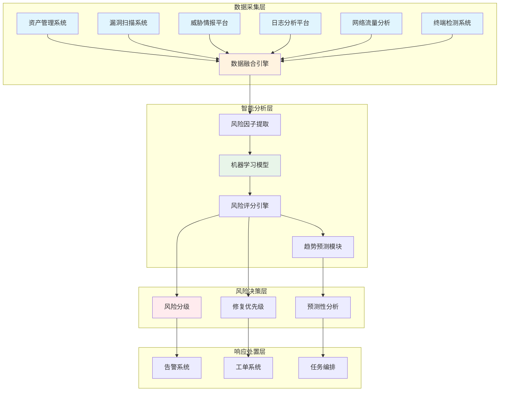
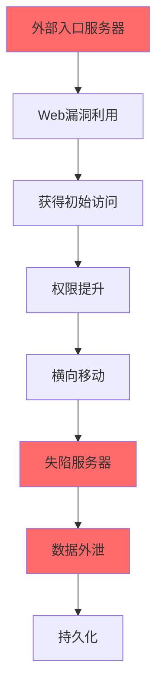
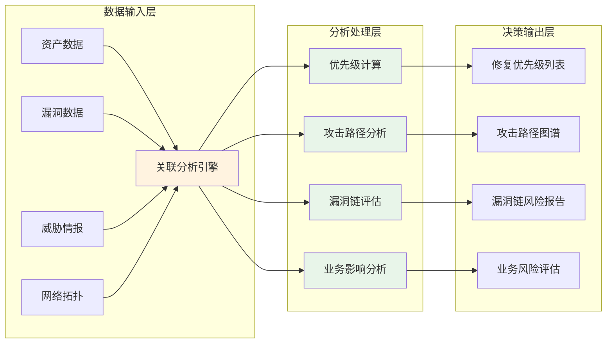
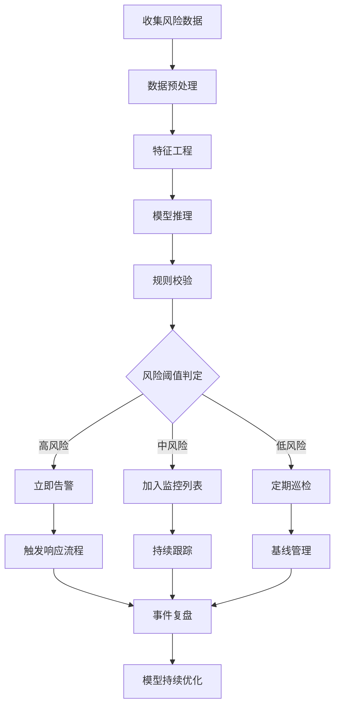
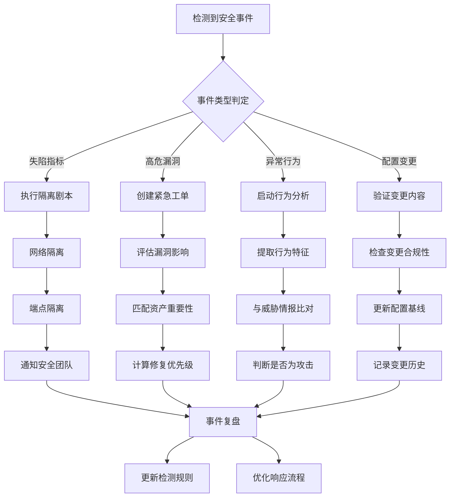
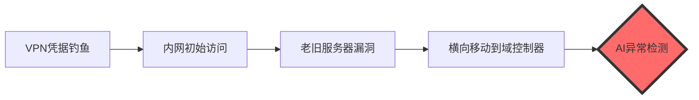
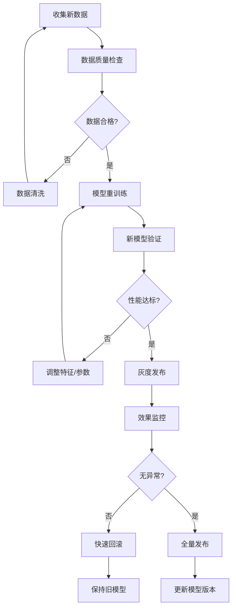

**作者：** HOS(安全风信子)
**日期：** 2026-04-24
**主要来源平台：** GitHub/arXiv
**摘要：** 在企业网络中，总有一些服务器如同定时炸弹，随时可能引爆安全事件。这些高风险服务器可能是老旧系统、弱配置服务器、历史漏洞聚集地，甚至是已被攻击者渗透的失陷主机。传统的高风险服务器识别依赖人工判断和静态规则，难以应对复杂多变的风险态势。本文深入探讨AI驱动的高风险服务器识别技术，通过多维度风险因子建模、漏洞与资产关联分析、风险趋势预测等核心能力，帮助企业精准识别最需要关注的高风险服务器，将有限的修复资源用在刀刃上。

@[TOC](目录)

---

# 揪出定时炸弹：AI识别高风险服务器的实战方法

## 1. 引言：为什么需要智能识别高风险服务器

企业网络中总存在这样一批服务器：它们运行着老旧的操作系统，承载着无人维护的历史应用，暴露在各种已知漏洞之下。它们可能是测试环境被遗忘后的遗留，可能是业务下线不彻底的残留，也可能是早已被攻击者控制而浑然不觉的失陷主机。这些服务器如同埋在网络深处的定时炸弹，一旦被触发，可能导致数据泄露、横向移动、甚至整个网络沦陷。

传统的高风险服务器识别方法面临诸多困境。安全团队通常依靠CVSS评分来判断漏洞严重程度，但CVSS评分是通用的、静态的，无法反映特定业务上下文中的实际风险。一台承载核心业务的高端服务器即使只有一个中危漏洞，其风险也可能远高于一台仅有多个高危漏洞的废弃测试机。

AI技术的引入为高风险服务器识别带来了革命性的突破。通过机器学习模型对服务器资产信息、漏洞数据、威胁情报、配置状态、行为日志等多维度数据的学习，AI系统能够建立动态的、自适应的高风险评估模型，精准识别真正需要优先处置的高风险服务器。

### 1.1 高风险服务器识别的行业痛点

在企业安全运营实践中，高风险服务器识别面临以下核心挑战：

**数据孤岛问题严重**。企业的资产信息通常分散在CMDB、漏洞扫描系统、日志平台、威胁情报平台等多个系统中。这些系统往往由不同团队维护，数据格式不一致，关联分析困难。安全团队需要花费大量时间进行数据整合，而无法将精力集中在真正的风险分析工作上。

**静态规则的局限性**。传统规则引擎依赖专家经验预设的风险判断逻辑，难以适应不断变化的网络环境和攻击手法。例如，某漏洞在威胁情报中刚刚出现利用代码时，传统规则可能未能及时更新，导致对该漏洞的风险评估不准确。

**告警疲劳问题**。现代企业每天可能产生数以万计的安全告警，其中真正的高风险事件往往被海量低风险告警淹没。安全团队难以从噪音中快速识别真正的威胁，导致关键告警被忽略。

**业务与安全的平衡难题**。安全团队在推动漏洞修复时，经常与业务部门产生冲突。业务部门担心修复会影响业务连续性，而安全团队坚持需要尽快修复。如何在保障安全的同时兼顾业务需求，需要智能化的风险评估来提供决策支持。

### 1.2 AI驱动的高风险服务器识别技术框架

AI驱动的高风险服务器识别系统通常采用多层次的架构设计，从数据采集到风险决策形成完整的闭环。



**数据融合引擎**负责从多个数据源实时采集和整合数据。数据源包括但不限于：CMDB资产数据库、漏洞扫描结果、威胁情报IOC、EDR日志、网络流量元数据、身份认证日志、DNS查询记录等。数据融合引擎需要处理数据格式转换、时间同步、去重清洗等基础工作，为上层分析提供统一的数据视图。

**智能分析层**是系统的核心，包括风险因子提取、机器学习模型、风险评分引擎和趋势预测模块。风险因子提取模块从融合数据中抽取服务器的多维度风险特征；机器学习模型基于历史标注数据学习风险模式；风险评分引擎综合各类风险因子生成量化评分；趋势预测模块基于时序分析预测风险演变。

**风险决策层**基于分析结果进行风险分级和修复优先级排序。风险分级将服务器划分为不同风险等级；修复优先级综合考虑漏洞严重性、资产重要性、修复复杂度、业务影响等因素，生成最优修复路径建议。

**响应执行层**将风险决策转化为具体的响应动作，包括告警通知、工单创建、自动化修复任务编排等。

## 2. 高风险服务器的分类与特征

### 2.1 高风险服务器的分类标准

根据风险来源和表现形式，可以将高风险服务器划分为以下几个类别。

**老旧系统类**是指运行停止支持或即将停止支持操作系统的服务器。这些系统无法获得安全更新，长期处于漏洞裸奔状态。Windows Server 2008 R2于2020年1月停止支持，Windows Server 2012 R2将于2023年10月停止支持，CentOS 7将于2024年6月停止维护。这些老旧系统的漏洞利用风险极高，但往往因为业务依赖难以快速迁移。

**弱配置类**是指存在安全配置缺陷的服务器。这些缺陷可能包括未加密的敏感数据传输、默认凭据仍在使用、不安全的协议仍在运行、访问控制配置过于宽松等。很多时候，弱配置是历史遗留问题，随着时间推移和人员变动，逐渐被忽视。

**漏洞聚集类**是指存在多个未修复漏洞的服务器。这类服务器可能由于业务连续性考虑而暂时无法打补丁，也可能因为资产管理疏漏而长期处于漏洞暴露状态。漏洞聚集的风险不仅在于单点漏洞，更在于多个漏洞可能被组合利用形成攻击链。

**失陷主机类**是指已经被攻击者成功入侵的服务器。这类服务器可能运行着后门程序、植入的挖矿木马、或者被攻击者作为持久化据点。失陷主机是最高风险级别，需要立即隔离和取证。

**异常行为类**是指行为模式偏离正常基线的服务器。这些异常可能表现为异常的出站连接、异常的系统进程、异常的登录模式、异常的流量特征等。异常行为往往是失陷的早期信号。

```python
class HighRiskServerClassifier:
    """
    高风险服务器分类器
    基于多维度特征识别高风险服务器
    """

    RISK_CATEGORIES = {
        'legacy_system': {
            'name': '老旧系统',
            'risk_weight': 0.25,
            'indicators': ['unsupported_os', 'eol_approaching', 'patch_gap']
        },
        'weak_config': {
            'name': '弱配置',
            'risk_weight': 0.20,
            'indicators': ['default_credentials', 'insecure_protocols', 'open_ports']
        },
        'vulnerability_accumulation': {
            'name': '漏洞聚集',
            'risk_weight': 0.25,
            'indicators': ['critical_vulns', 'vuln_count', 'vuln_age']
        },
        'compromised': {
            'name': '失陷主机',
            'risk_weight': 0.30,
            'indicators': ['beaconing', 'backdoor', 'anomalous_behavior']
        },
        'behavioral_anomaly': {
            'name': '异常行为',
            'risk_weight': 0.20,
            'indicators': ['unusual_connections', 'privilege_anomaly', 'traffic_anomaly']
        }
    }

    def __init__(self, asset_db, vuln_db, threat_intel, behavior_analyzer):
        self.asset_db = asset_db
        self.vuln_db = vuln_db
        self.threat_intel = threat_intel
        self.behavior_analyzer = behavior_analyzer

    def classify(self, server_id):
        """
        对服务器进行高风险分类

        参数:
            server_id: 服务器标识

        返回:
            dict: 分类结果
        """
        server_info = self.asset_db.get_server(server_id)

        risk_categories = {}

        legacy_score = self._assess_legacy_risk(server_info)
        risk_categories['legacy_system'] = legacy_score

        config_score = self._assess_config_risk(server_info)
        risk_categories['weak_config'] = config_score

        vuln_score = self._assess_vulnerability_risk(server_id, server_info)
        risk_categories['vulnerability_accumulation'] = vuln_score

        behavior_score = self._assess_behavior_risk(server_id)
        risk_categories['behavioral_anomaly'] = behavior_score

        compromise_indicators = self._check_compromise_indicators(server_id)
        risk_categories['compromised'] = compromise_indicators

        overall_risk = self._calculate_overall_risk(risk_categories)

        primary_risk_factors = self._identify_primary_factors(risk_categories)

        return {
            'server_id': server_id,
            'overall_risk_score': overall_risk,
            'risk_level': self._get_risk_level(overall_risk),
            'risk_categories': risk_categories,
            'primary_factors': primary_risk_factors,
            'recommendations': self._generate_recommendations(risk_categories),
            'remediation_priority': self._calculate_remediation_priority(
                overall_risk,
                risk_categories
            )
        }

    def _assess_legacy_risk(self, server_info):
        """评估老旧系统风险"""
        os_info = server_info.get('os_info', {})

        eol_status = self._check_eol_status(os_info.get('name'), os_info.get('version'))

        patch_gap_days = self._calculate_patch_gap(server_info)

        risk_score = 0.0

        if eol_status == 'eol':
            risk_score += 0.8
        elif eol_status == 'eol_approaching':
            risk_score += 0.5
        elif eol_status == 'eol_extended':
            risk_score += 0.6

        if patch_gap_days > 180:
            risk_score += 0.4
        elif patch_gap_days > 90:
            risk_score += 0.2

        return min(risk_score, 1.0)

    def _assess_vulnerability_risk(self, server_id, server_info):
        """评估漏洞风险"""
        vulnerabilities = self.vuln_db.get_vulnerabilities(server_id)

        if not vulnerabilities:
            return 0.0

        risk_score = 0.0

        critical_vulns = [v for v in vulnerabilities if v.get('severity') == 'critical']
        high_vulns = [v for v in vulnerabilities if v.get('severity') == 'high']

        risk_score += min(len(critical_vulns) * 0.15, 0.5)
        risk_score += min(len(high_vulns) * 0.08, 0.3)

        exploit_available = self._check_exploit_availability(
            critical_vulns + high_vulns
        )
        if exploit_available:
            risk_score += 0.3

        oldest_vuln_age = min(
            (datetime.now() - v.get('discovered_date', datetime.now())).days
            for v in vulnerabilities
        )
        if oldest_vuln_age > 365:
            risk_score += 0.2

        return min(risk_score, 1.0)

    def _check_eol_status(self, os_name, os_version):
        """检查操作系统生命周期状态"""
        eol_data = {
            'windows_server_2008': {'eol_date': '2020-01-14', 'extended': '2024-01-09'},
            'windows_server_2012': {'eol_date': '2023-10-10', 'extended': '2026-01-09'},
            'centos_7': {'eol_date': '2024-06-30', 'extended': None},
            'ubuntu_16.04': {'eol_date': '2024-04-30', 'extended': '2026-04-30'},
            'ubuntu_18.04': {'eol_date': '2024-06-30', 'extended': '2028-06-30'},
            'rhel_7': {'eol_date': '2024-06-30', 'extended': '2028-06-30'},
            'rhel_8': {'eol_date': '2029-05-31', 'extended': None},
        }

        os_key = self._normalize_os_name(os_name, os_version)

        if os_key not in eol_data:
            return 'unknown'

        eol_info = eol_data[os_key]
        today = datetime.now().date()

        if eol_info.get('extended'):
            extended_date = datetime.strptime(eol_info['extended'], '%Y-%m-%d').date()
            if today > extended_date:
                return 'eol'
            elif (extended_date - today).days <= 180:
                return 'eol_approaching'
            return 'supported_extended'
        else:
            eol_date = datetime.strptime(eol_info['eol_date'], '%Y-%m-%d').date()
            if today > eol_date:
                return 'eol'
            elif (eol_date - today).days <= 180:
                return 'eol_approaching'
            return 'supported'

    def _normalize_os_name(self, os_name, os_version):
        """标准化操作系统名称"""
        os_name_lower = os_name.lower()

        if 'windows_server' in os_name_lower:
            if '2008' in os_version:
                return 'windows_server_2008'
            elif '2012' in os_version:
                return 'windows_server_2012'
            elif '2016' in os_version:
                return 'windows_server_2016'
            elif '2019' in os_version:
                return 'windows_server_2019'
            elif '2022' in os_version:
                return 'windows_server_2022'
        elif 'centos' in os_name_lower:
            major_version = os_version.split('.')[0] if os_version else '7'
            return f'centos_{major_version}'
        elif 'ubuntu' in os_name_lower:
            return os_name_lower.replace(' ', '_')
        elif 'rhel' in os_name_lower or 'red hat' in os_name_lower:
            major_version = os_version.split('.')[0] if os_version else '7'
            return f'rhel_{major_version}'

        return 'unknown'
```

### 2.2 高风险服务器特征详解

#### 2.2.1 老旧系统风险特征

老旧系统的高风险特征可以从以下几个维度进行识别：

**生命周期指标**。操作系统供应商通常会公布产品的支持周期结束日期（EOL）。超过EOL的系统将不再获得安全更新，这意味着一旦发现新的漏洞，将无法通过官方渠道获得补丁。根据CISA的统计，2023年针对已停止支持系统的攻击事件增加了约35%，主要利用的漏洞包括远程代码执行（RCE）和特权提升漏洞。

**补丁延迟指标**。补丁延迟是衡量系统安全状态的重要指标。从漏洞披露到实际修复的时间差越长，系统暴露在外的风险就越大。研究表明，漏洞从披露到野外部署 exploit的平均时间已经缩短到15天以内，这意味着超过30天未修复的漏洞面临实际攻击的风险显著增加。

**依赖组件老化指标**。除了操作系统本身，运行在服务器上的中间件、数据库、应用框架等组件同样需要关注。Apache Struts 2、Log4j、Spring Framework等知名组件的历史漏洞表明，依赖组件的安全状态直接影响服务器的整体安全性。

| 操作系统 | 停止支持日期 | 扩展支持截止 | 野外部署漏洞数 | 平均利用窗口 |
|:---|:---:|:---:|:---:|:---:|
| Windows Server 2008 R2 | 2020-01 | 2024-01 | 127 | <7天 |
| Windows Server 2012 R2 | 2023-10 | 2026-01 | 89 | <14天 |
| CentOS 7 | 2024-06 | N/A | 156 | <10天 |
| Ubuntu 16.04 | 2024-04 | 2026-04 | 203 | <7天 |
| RHEL 7 | 2024-06 | 2028-06 | 78 | <21天 |

#### 2.2.2 弱配置风险特征

弱配置风险通常涉及以下几个关键领域：

**身份认证配置**。包括默认凭据未更改、密码策略过于宽松、多因素认证未启用、共享账户使用等。根据Verizon数据泄露报告， credential theft 是最常见的数据泄露攻击向量，其中相当比例涉及默认凭据问题。

**网络传输安全**。包括敏感数据未加密传输、TLS版本过旧（TLS 1.0/1.1仍在使用）、证书配置错误、不安全的协议仍在运行（HTTP、FTP、Telnet、SMTP等）。

**访问控制配置**。包括防火墙规则过于宽松、不必要的端口服务对外开放、共享存储权限配置不当、API接口缺乏访问控制等。

**日志审计配置**。包括安全日志未启用、日志保留期限不足、日志完整性未保护、日志分析能力缺失等。

```python
class ConfigurationSecurityAnalyzer:
    """
    配置安全分析器
    检测服务器安全配置缺陷
    """

    SECURITY_BENCHMARKS = {
        'windows': {
            'cis': 'Windows Server 2019 CIS Benchmark',
            'cce_id': 'CCE-27061-9',
            'controls': [
                'password_policy',
                'audit_policy',
                'firewall_config',
                'service_hardening',
                'registry_permissions'
            ]
        },
        'linux': {
            'cis': 'CIS Linux Benchmark',
            'controls': [
                'password_policy',
                'ssh_hardening',
                'firewall_config',
                'service_disabled',
                'file_permissions',
                'logging_config'
            ]
        }
    }

    def __init__(self, config_scanner, baseline_registry):
        self.scanner = config_scanner
        self.baseline = baseline_registry

    def analyze_security_config(self, server_id):
        """
        分析服务器安全配置

        参数:
            server_id: 服务器标识

        返回:
            dict: 配置安全分析结果
        """
        server_type = self._identify_server_type(server_id)
        benchmark = self.SECURITY_BENCHMARKS.get(server_type)

        current_config = self.scanner.get_current_config(server_id)
        baseline_config = self.baseline.get_baseline(benchmark['cis'])

        findings = []
        compliant_controls = []
        non_compliant_controls = []

        for control in benchmark['controls']:
            control_status = self._evaluate_control(
                control,
                current_config,
                baseline_config
            )

            if control_status['compliant']:
                compliant_controls.append(control)
            else:
                non_compliant_controls.append(control)
                findings.append({
                    'control': control,
                    'severity': control_status['severity'],
                    'finding': control_status['finding'],
                    'remediation': control_status['remediation']
                })

        risk_score = self._calculate_config_risk_score(
            compliant_controls,
            non_compliant_controls,
            findings
        )

        return {
            'server_id': server_id,
            'server_type': server_type,
            'benchmark': benchmark['cis'],
            'total_controls': len(benchmark['controls']),
            'compliant_count': len(compliant_controls),
            'non_compliant_count': len(non_compliant_controls),
            'compliance_rate': len(compliant_controls) / len(benchmark['controls']),
            'risk_score': risk_score,
            'risk_level': self._get_risk_level(risk_score),
            'findings': findings,
            'compliant_controls': compliant_controls,
            'non_compliant_controls': non_compliant_controls
        }

    def _evaluate_control(self, control, current_config, baseline_config):
        """评估单个安全控制项"""
        if control == 'password_policy':
            return self._check_password_policy(current_config, baseline_config)
        elif control == 'ssh_hardening':
            return self._check_ssh_config(current_config, baseline_config)
        elif control == 'firewall_config':
            return self._check_firewall_rules(current_config, baseline_config)
        elif control == 'service_disabled':
            return self._check_unnecessary_services(current_config, baseline_config)
        elif control == 'file_permissions':
            return self._check_critical_file_permissions(current_config, baseline_config)
        else:
            return {'compliant': True, 'severity': 'info', 'finding': None}

    def _check_password_policy(self, current_config, baseline_config):
        """检查密码策略配置"""
        password_config = current_config.get('password_policy', {})
        baseline_password = baseline_config.get('password_policy', {})

        issues = []

        min_length = password_config.get('min_length', 0)
        if min_length < baseline_password.get('min_length', 8):
            issues.append(f"最小密码长度不足: 当前{min_length}, 要求{baseline_password.get('min_length')}")

        password_history = password_config.get('history', 0)
        if password_history < baseline_password.get('history', 24):
            issues.append(f"密码历史记录不足: 当前{password_history}, 要求{baseline_password.get('history')}")

        max_age = password_config.get('max_age', 999)
        if max_age > baseline_password.get('max_age', 90):
            issues.append(f"密码最大使用天数过长: 当前{max_age}, 要求{baseline_password.get('max_age')}")

        if issues:
            return {
                'compliant': False,
                'severity': 'high',
                'finding': '; '.join(issues),
                'remediation': '更新密码策略配置以符合安全基线要求'
            }

        return {'compliant': True, 'severity': 'info', 'finding': None}

    def _check_ssh_config(self, current_config, baseline_config):
        """检查SSH安全配置"""
        ssh_config = current_config.get('ssh_config', {})
        baseline_ssh = baseline_config.get('ssh_config', {})

        issues = []

        permit_root_login = ssh_config.get('permit_root_login', 'yes')
        if permit_root_login != 'no':
            issues.append("允许root远程登录")

        protocol_version = ssh_config.get('protocol_version', 1)
        if protocol_version < 2:
            issues.append("使用不安全的SSH协议版本")

        password_authentication = ssh_config.get('password_authentication', 'yes')
        if password_authentication != 'no':
            issues.append("启用密码认证，应切换为密钥认证")

        issues_str = '; '.join(issues) if issues else None

        if issues:
            severity = 'critical' if 'permit_root_login' in issues_str else 'high'
            return {
                'compliant': False,
                'severity': severity,
                'finding': issues_str,
                'remediation': '更新SSH配置，禁用root登录，启用密钥认证'
            }

        return {'compliant': True, 'severity': 'info', 'finding': None}
```

#### 2.2.3 异常行为检测特征

异常行为检测是识别失陷主机的重要手段。攻击者在成功入侵服务器后，通常会表现出与正常行为不一致的特征。

**网络行为异常**。包括异常的出站连接（特别是与已知恶意IP的通信）、异常的DNS查询（DNS隧道特征）、异常的端口扫描行为、异常的流量峰值等。

**系统行为异常**。包括异常的进程创建（特别是可疑的脚本执行）、异常的计划任务、异常的服务注册、异常的注册表修改、异常的 文件系统操作等。

**认证行为异常**。包括异常的登录时间、异常的登录地点、异常的登录失败次数、异常的权限提升行为、异常的账户创建等。

```python
class BehavioralAnomalyDetector:
    """
    行为异常检测器
    基于机器学习检测服务器行为异常
    """

    def __init__(self, baseline_model, event_collector):
        self.baseline_model = baseline_model
        self.event_collector = event_collector
        self.detection_models = self._initialize_detection_models()

    def _initialize_detection_models(self):
        """初始化各类异常检测模型"""
        return {
            'network_behavior': IsolationForest(
                contamination=0.05,
                random_state=42,
                n_estimators=100
            ),
            'process_behavior': OneClassSVM(
                kernel='rbf',
                gamma='scale',
                nu=0.05
            ),
            'authentication': LocalOutlierFactor(
                contamination=0.03,
                novelty=True
            ),
            'file_integrity': HashBasedDetector(
                algorithm='sha256'
            )
        }

    def detect_anomalies(self, server_id, time_window='24h'):
        """
        检测服务器行为异常

        参数:
            server_id: 服务器标识
            time_window: 分析时间窗口

        返回:
            dict: 异常检测结果
        """
        events = self.event_collector.get_events(
            server_id,
            time_window=time_window
        )

        network_anomalies = self._detect_network_anomalies(server_id, events)
        process_anomalies = self._detect_process_anomalies(server_id, events)
        auth_anomalies = self._detect_auth_anomalies(server_id, events)
        file_anomalies = self._detect_file_anomalies(server_id, events)

        all_anomalies = (
            network_anomalies +
            process_anomalies +
            auth_anomalies +
            file_anomalies
        )

        threat_indicators = self._correlate_threat_indicators(all_anomalies)

        risk_assessment = self._assess_anomaly_threat(
            all_anomalies,
            threat_indicators
        )

        return {
            'server_id': server_id,
            'analysis_window': time_window,
            'network_anomalies': network_anomalies,
            'process_anomalies': process_anomalies,
            'authentication_anomalies': auth_anomalies,
            'file_anomalies': file_anomalies,
            'total_anomalies': len(all_anomalies),
            'threat_indicators': threat_indicators,
            'risk_assessment': risk_assessment,
            'compromise_probability': risk_assessment['compromise_probability'],
            'recommended_actions': risk_assessment['recommended_actions']
        }

    def _detect_network_anomalies(self, server_id, events):
        """检测网络行为异常"""
        network_events = [
            e for e in events
            if e.get('event_type') in ['network_connection', 'dns_query', 'socket_open']
        ]

        if len(network_events) < 10:
            return []

        baseline = self.baseline_model.get_baseline(server_id, 'network')
        anomalies = []

        for event in network_events:
            if self._is_network_anomaly(event, baseline):
                severity = self._calculate_anomaly_severity(event, baseline)
                anomalies.append({
                    'event_type': 'network_anomaly',
                    'timestamp': event.get('timestamp'),
                    'description': event.get('description'),
                    'severity': severity,
                    'indicator_type': self._classify_network_indicator(event),
                    'destination': event.get('destination'),
                    'connection_count': event.get('connection_count', 1),
                    'evidence': event
                })

        return anomalies

    def _detect_process_anomalies(self, server_id, events):
        """检测进程行为异常"""
        process_events = [
            e for e in events
            if e.get('event_type') in ['process_create', 'module_load', 'dll_injection']
        ]

        baseline = self.baseline_model.get_baseline(server_id, 'process')
        anomalies = []

        for event in process_events:
            if self._is_process_anomaly(event, baseline):
                severity = self._calculate_anomaly_severity(event, baseline)
                anomalies.append({
                    'event_type': 'process_anomaly',
                    'timestamp': event.get('timestamp'),
                    'process_name': event.get('process_name'),
                    'severity': severity,
                    'indicator_type': self._classify_process_indicator(event),
                    'parent_process': event.get('parent_process'),
                    'command_line': event.get('command_line'),
                    'evidence': event
                })

        return anomalies

    def _classify_network_indicator(self, event):
        """分类网络异常指标"""
        destination = event.get('destination', {})
        destination_ip = destination.get('ip', '')

        if self._is_private_ip(destination_ip):
            return 'internal_lateral_movement'

        if self._is_known_malicious_ip(destination_ip):
            return 'malicious_connection'

        if self._is_suspicious_port(event.get('port')):
            return 'suspicious_port_activity'

        if event.get('connection_count', 0) > baseline_threshold:
            return 'high_frequency_connections'

        return 'unusual_network_activity'

    def _classify_process_indicator(self, event):
        """分类进程异常指标"""
        process_name = event.get('process_name', '').lower()
        command_line = event.get('command_line', '').lower()

        suspicious_patterns = {
            'powershell encoded': 'powershell_misuse',
            'certutil': 'credential_access',
            'mimikatz': 'credential_dumping',
            'nc.exe': 'backdoor_activity',
            'net.exe user': 'account_creation',
            'reg.exe add': 'persistence_mechanism',
            'schtasks': 'scheduled_task_persistence',
            'wmic': 'remote_execution',
            'bitsadmin': 'file_download'
        }

        for pattern, indicator in suspicious_patterns.items():
            if pattern in command_line:
                return indicator

        if self._is_unsigned_process(event):
            return 'unsigned_process_execution'

        return 'unusual_process_activity'
```

### 2.3 多维度风险因子建模

准确评估服务器风险需要综合考虑多个维度的因素。AI系统通过特征工程提取关键风险因子，并建立多因子风险评估模型。

```python
class ServerRiskFactorModel:
    """
    服务器风险因子模型
    多维度风险因子提取与评估
    """

    def __init__(self, data_sources):
        self.asset_data = data_sources.get('asset')
        self.vuln_data = data_sources.get('vulnerability')
        self.threat_data = data_sources.get('threat_intel')
        self.behavior_data = data_sources.get('behavior')
        self.config_data = data_sources.get('configuration')

    def extract_risk_factors(self, server_id):
        """
        提取服务器风险因子

        参数:
            server_id: 服务器标识

        返回:
            dict: 风险因子特征
        """
        factors = {}

        factors['asset_factors'] = self._extract_asset_factors(server_id)
        factors['vulnerability_factors'] = self._extract_vuln_factors(server_id)
        factors['threat_factors'] = self._extract_threat_factors(server_id)
        factors['behavior_factors'] = self._extract_behavior_factors(server_id)
        factors['config_factors'] = self._extract_config_factors(server_id)

        return factors

    def _extract_asset_factors(self, server_id):
        """提取资产维度风险因子"""
        asset = self.asset_data.get(server_id)

        factors = {
            'server_criticality': asset.get('business_criticality', 'medium'),
            'data_sensitivity': asset.get('data_classification', 'internal'),
            'internet_exposed': asset.get('internet_exposed', False),
            'network_segment': asset.get('network_segment', 'internal'),
            'owner_team': asset.get('owner_team', 'unknown'),
            'asset_age_days': self._calculate_asset_age(asset),
            'change_frequency': self._calculate_change_frequency(server_id)
        }

        criticality_scores = {
            'critical': 1.0,
            'high': 0.75,
            'medium': 0.5,
            'low': 0.25
        }
        factors['criticality_score'] = criticality_scores.get(
            factors['server_criticality'], 0.5
        )

        sensitivity_scores = {
            'regulated': 1.0,
            'confidential': 0.8,
            'internal': 0.5,
            'public': 0.2
        }
        factors['sensitivity_score'] = sensitivity_scores.get(
            factors['data_sensitivity'], 0.5
        )

        return factors

    def _extract_vuln_factors(self, server_id):
        """提取漏洞维度风险因子"""
        vulns = self.vuln_data.get_open_vulnerabilities(server_id)

        factors = {
            'total_vuln_count': len(vulns),
            'critical_count': sum(1 for v in vulns if v.get('severity') == 'critical'),
            'high_count': sum(1 for v in vulns if v.get('severity') == 'high'),
            'medium_count': sum(1 for v in vulns if v.get('severity') == 'medium'),
            'oldest_vuln_days': self._calculate_oldest_vuln_age(vulns),
            'recent_vuln_count': self._count_recent_vulns(vulns, 30)
        }

        if vulns:
            factors['avg_cvss'] = np.mean([v.get('cvss_score', 0) for v in vulns])
            factors['max_cvss'] = max([v.get('cvss_score', 0) for v in vulns])
        else:
            factors['avg_cvss'] = 0
            factors['max_cvss'] = 0

        factors['vuln_density'] = len(vulns) / max(
            self._get_asset_value(asset, 'installed_packages', 1), 1
        )

        return factors

    def _extract_threat_factors(self, server_id):
        """提取威胁情报维度风险因子"""
        matching_iocs = self.threat_data.get_iocs_for_asset(server_id)

        factors = {
            'total_ioc_matches': len(matching_iocs),
            'malicious_ip_count': sum(1 for ioc in matching_iocs if ioc['type'] == 'ip'),
            'malicious_domain_count': sum(1 for ioc in matching_iocs if ioc['type'] == 'domain'),
            'malicious_hash_count': sum(1 for ioc in matching_iocs if ioc['type'] == 'hash'),
            'recent_threat_mentions': self._count_recent_threat_mentions(server_id, 30)
        }

        threat_feed_scores = {
            'critical': 1.0,
            'high': 0.75,
            'medium': 0.5,
            'low': 0.25
        }
        factors['threat_severity_score'] = max(
            [threat_feed_scores.get(ioc.get('severity'), 0) for ioc in matching_iocs],
            default=0
        )

        return factors

    def _extract_behavior_factors(self, server_id):
        """提取行为分析维度风险因子"""
        baseline = self.behavior_data.get_baseline(server_id)
        current_behavior = self.behavior_data.get_current_behavior(server_id)

        factors = {
            'anomaly_score': self._calculate_anomaly_score(baseline, current_behavior),
            'unusual_login_count': current_behavior.get('unusual_logins', 0),
            ' privilege_escalation_count': current_behavior.get('privilege_escalations', 0),
            'lateral_movement_indicators': current_behavior.get('lateral_movements', 0),
            'data_exfiltration_indicators': current_behavior.get('data_exfiltration', 0)
        }

        factors['behavior_risk_score'] = min(
            factors['anomaly_score'] * 0.4 +
            factors['unusual_login_count'] * 0.15 +
            factors['privilege_escalation_count'] * 0.2 +
            factors['lateral_movement_indicators'] * 0.15 +
            factors['data_exfiltration_indicators'] * 0.1,
            1.0
        )

        return factors

    def _extract_config_factors(self, server_id):
        """提取配置安全维度风险因子"""
        config_issues = self.config_data.get_config_issues(server_id)

        severity_weights = {
            'critical': 1.0,
            'high': 0.75,
            'medium': 0.5,
            'low': 0.25,
            'info': 0.1
        }

        factors = {
            'total_config_issues': len(config_issues),
            'critical_issues': sum(1 for i in config_issues if i.get('severity') == 'critical'),
            'high_issues': sum(1 for i in config_issues if i.get('severity') == 'high'),
            'medium_issues': sum(1 for i in config_issues if i.get('severity') == 'medium'),
            'compliance_rate': self._calculate_compliance_rate(config_issues)
        }

        weighted_score = sum(
            severity_weights.get(issue.get('severity'), 0)
            for issue in config_issues
        )
        factors['config_risk_score'] = min(weighted_score / 10.0, 1.0)

        return factors
```

#### 2.3.1 风险因子权重分配策略

在多因子风险评估模型中，不同维度的风险因子需要赋予不同的权重。权重的分配策略直接影响最终风险评分的准确性。

**基于业务上下文的动态权重**。不同行业、不同规模的企业对各类风险因子的重视程度可能不同。例如，金融机构可能更关注数据泄露风险，而互联网公司可能更关注可用性风险。AI系统应支持基于企业业务特性的权重定制。

**基于历史数据的机器学习权重优化**。通过分析历史安全事件数据，可以学习到哪些风险因子组合更容易导致实际的安全事件。机器学习算法（如逻辑回归、随机森林、XGBoost等）可以自动优化因子权重。

**基于威胁情报的实时调整**。当威胁情报显示某种攻击手法正在流行时，相关的风险因子权重应该实时提高。例如，当某个VPN漏洞被广泛利用时，包含VPN组件的服务器的风险权重应该相应提高。

```python
class DynamicRiskWeightOptimizer:
    """
    动态风险权重优化器
    基于业务上下文和历史数据优化风险因子权重
    """

    def __init__(self, historical_db, business_context):
        self.history_db = historical_db
        self.business_context = business_context
        self.base_weights = {
            'vulnerability': 0.30,
            'configuration': 0.20,
            'behavioral': 0.25,
            'threat_intel': 0.15,
            'asset_value': 0.10
        }

    def optimize_weights(self, organization_id):
        """
        优化组织特定的风险权重

        参数:
            organization_id: 组织标识

        返回:
            dict: 优化后的权重配置
        """
        historical_events = self._get_relevant_events(organization_id)

        base_weights = self._learn_base_weights(historical_events)

        context_weights = self._adjust_for_business_context(organization_id)

        optimized_weights = self._combine_weights(
            base_weights,
            context_weights
        )

        validated_weights = self._validate_weights(optimized_weights, historical_events)

        return {
            'organization_id': organization_id,
            'optimized_weights': validated_weights,
            'optimization_method': 'supervised_learning_with_context',
            'confidence': self._calculate_weight_confidence(validated_weights),
            'training_samples': len(historical_events)
        }

    def _learn_base_weights(self, historical_events):
        """从历史事件学习基础权重"""
        feature_matrix = []
        label_vector = []

        for event in historical_events:
            features = self._extract_event_features(event)
            label = 1 if event.get('actual_impact') else 0

            feature_matrix.append(features)
            label_vector.append(label)

        model = XGBClassifier(
            n_estimators=100,
            max_depth=5,
            learning_rate=0.1,
            random_state=42
        )
        model.fit(feature_matrix, label_vector)

        feature_importance = dict(zip(
            self._get_feature_names(),
            model.feature_importances_
        ))

        weights = {}
        total_importance = sum(feature_importance.values())

        for factor, importance in feature_importance.items():
            weights[factor] = importance / total_importance

        return weights

    def _adjust_for_business_context(self, organization_id):
        """基于业务上下文调整权重"""
        context = self.business_context.get_context(organization_id)

        industry_multipliers = {
            'financial': {'data_sensitivity': 1.3, 'availability': 1.2},
            'healthcare': {'data_sensitivity': 1.4, 'compliance': 1.3},
            'e-commerce': {'availability': 1.3, 'transaction_integrity': 1.2},
            'government': {'compliance': 1.4, 'data_sensitivity': 1.2}
        }

        multipliers = industry_multipliers.get(
            context.get('industry'),
            {'data_sensitivity': 1.0, 'availability': 1.0}
        )

        context_adjusted_weights = self.base_weights.copy()

        if context.get('data_sensitivity') == 'high':
            context_adjusted_weights['vulnerability'] *= multipliers.get('data_sensitivity', 1.0)

        if context.get('availability_requirement') == 'critical':
            context_adjusted_weights['behavioral'] *= multipliers.get('availability', 1.0)

        return context_adjusted_weights
```

## 3. 漏洞与资产关联分析

### 3.1 漏洞优先级与资产重要性联动

传统的漏洞管理往往独立于资产重要性考量，导致修复工作缺乏针对性。AI系统通过漏洞与资产的关联分析，确定真正需要优先修复的漏洞。

```python
class VulnAssetCorrelationAnalyzer:
    """
    漏洞资产关联分析器
    将漏洞风险与资产重要性联动
    """

    def __init__(self, vuln_db, asset_db, threat_intel):
        self.vuln_db = vuln_db
        self.asset_db = asset_db
        self.threat_intel = threat_intel

    def analyze_remediation_priority(self, server_id):
        """
        分析修复优先级

        参数:
            server_id: 服务器标识

        返回:
            dict: 优先级分析结果
        """
        server_info = self.asset_db.get_server(server_id)
        vulnerabilities = self.vuln_db.get_open_vulnerabilities(server_id)

        prioritized_vulns = []

        for vuln in vulnerabilities:
            priority_score = self._calculate_vuln_priority(
                vuln,
                server_info
            )

            prioritized_vulns.append({
                'vuln_id': vuln['id'],
                'vuln_name': vuln['name'],
                'severity': vuln['severity'],
                'cvss_score': vuln.get('cvss_score', 0),
                'priority_score': priority_score,
                'attack_complexity': vuln.get('attack_complexity', 'low'),
                'remediation_effort': vuln.get('remediation_effort', 'medium'),
                'threat_actors': self._get_relevant_threat_actors(vuln),
                'exploit_available': self._check_exploit_availability(vuln)
            })

        prioritized_vulns.sort(
            key=lambda x: x['priority_score'],
            reverse=True
        )

        return {
            'server_id': server_id,
            'server_criticality': server_info.get('business_criticality'),
            'total_vulns': len(vulnerabilities),
            'prioritized_vulns': prioritized_vulns,
            'immediate_action_required': [
                v for v in prioritized_vulns if v['priority_score'] > 0.7
            ],
            'recommended_priority': prioritized_vulns[0] if prioritized_vulns else None
        }

    def _calculate_vuln_priority(self, vuln, server_info):
        """计算漏洞优先级分数"""
        cvss_score = vuln.get('cvss_score', 0)

        criticality = server_info.get('business_criticality', 'medium')
        criticality_multipliers = {
            'critical': 1.5,
            'high': 1.25,
            'medium': 1.0,
            'low': 0.75
        }
        cvss_weighted = cvss_score * criticality_multipliers.get(criticality, 1.0)

        exploitability_score = self._assess_exploitability(vuln)

        threat_score = self._assess_threat_score(vuln)

        exposure_score = self._assess_exposure_score(
            vuln,
            server_info
        )

        priority_score = (
            cvss_weighted * 0.35 +
            exploitability_score * 0.25 +
            threat_score * 0.25 +
            exposure_score * 0.15
        )

        return min(priority_score / 10.0, 1.0)

    def _assess_exploitability(self, vuln):
        """评估漏洞可利用性"""
        base_score = 0.5

        if vuln.get('attack_vector') == 'network':
            base_score += 0.3
        elif vuln.get('attack_vector') == 'adjacent':
            base_score += 0.2
        elif vuln.get('attack_vector') == 'local':
            base_score += 0.1

        if vuln.get('privilege_required') == 'none':
            base_score += 0.2

        if vuln.get('user_interaction') == 'none':
            base_score += 0.1

        return min(base_score, 1.0)

    def _assess_threat_score(self, vuln):
        """评估威胁评分"""
        threat_score = 0.0

        matching_iocs = self.threat_intel.get_iocs_for_cve(vuln.get('cve_id'))
        if matching_iocs:
            threat_score += 0.4

        exploit_kits = self.threat_intel.check_exploit_db(vuln.get('cve_id'))
        if exploit_kits:
            threat_score += 0.3

        dark_web_mentions = self.threat_intel.check_dark_web(vuln.get('cve_id'))
        if dark_web_mentions:
            threat_score += 0.3

        return min(threat_score, 1.0)
```

### 3.2 攻击路径与漏洞链分析

单个漏洞的风险可能有限，但当多个漏洞被攻击者组合利用时，就形成了致命的漏洞链。AI系统能够分析漏洞之间的关联，识别潜在的攻击路径。



#### 3.2.1 攻击路径分析方法论

攻击路径分析是识别复杂攻击链的关键技术。MITRE ATT&CK框架将攻击过程分解为多个战术和技术阶段，AI系统可以基于此框架分析漏洞组合形成的攻击路径。

**入口点识别**。首先需要识别所有可能作为攻击入口的服务器和漏洞。这些入口点通常包括：面向互联网的Web服务器、邮件服务器、VPN服务器、DNS服务器等。面向公网的服务器一旦存在高危漏洞，就可能成为攻击者的首选入口。

**路径可达性分析**。在识别入口点后，需要分析从入口点到达其他关键资产的路径。这需要结合网络拓扑、信任关系、访问控制列表等因素进行综合分析。例如，DMZ区域的服务器如果能够访问内网数据库服务器，则可能成为攻击跳板。

**漏洞组合评估**。攻击者通常不会仅依赖单一漏洞，而是将多个漏洞组合形成攻击链。AI系统需要评估漏洞之间的协同利用可能性，识别高风险的漏洞组合。例如，一个低危的登录绕过漏洞配合一个中危的权限提升漏洞，可能比单一的高危远程代码执行漏洞更具实际威胁。

**业务影响评估**。攻击路径分析的最终目的是评估对业务的影响。需要识别攻击者如果成功利用漏洞链，可能造成的业务损失，包括数据泄露、服务中断、声誉损失、合规处罚等。

```python
class AttackPathAnalyzer:
    """
    攻击路径分析器
    分析漏洞组合形成的攻击路径
    """

    def __init__(self, network_topology, vuln_db, asset_db, threat_models):
        self.topology = network_topology
        self.vuln_db = vuln_db
        self.asset_db = asset_db
        self.threat_models = threat_models

    def analyze_attack_paths(self, target_server_id):
        """
        分析到目标服务器的攻击路径

        参数:
            target_server_id: 目标服务器标识

        返回:
            dict: 攻击路径分析结果
        """
        entry_points = self._identify_entry_points()

        all_paths = []

        for entry in entry_points:
            paths = self._find_paths(entry, target_server_id)
            all_paths.extend(paths)

        risk_assessment = self._assess_path_risk(all_paths)

        prioritized_paths = self._prioritize_paths(
            all_paths,
            risk_assessment
        )

        mitigation_recommendations = self._generate_mitigation_recommendations(
            prioritized_paths
        )

        return {
            'target_server': target_server_id,
            'total_entry_points': len(entry_points),
            'total_paths': len(all_paths),
            'critical_paths': [p for p in prioritized_paths if p['risk_level'] == 'critical'],
            'high_risk_paths': [p for p in prioritized_paths if p['risk_level'] == 'high'],
            'attack_surface_score': risk_assessment['attack_surface_score'],
            'most_critical_path': prioritized_paths[0] if prioritized_paths else None,
            'recommended_mitigations': mitigation_recommendations
        }

    def _identify_entry_points(self):
        """识别所有可能的攻击入口点"""
        internet_facing = self.asset_db.get_internet_facing_servers()

        entry_points = []

        for server in internet_facing:
            server_vulns = self.vuln_db.get_vulnerabilities(server['id'])
            exploitable_vulns = [
                v for v in server_vulns
                if self._is_exploitable(v) and v.get('cvss_score', 0) >= 7.0
            ]

            if exploitable_vulns:
                entry_points.append({
                    'server': server,
                    'entry_vulnerabilities': exploitable_vulns,
                    'entry_difficulty': self._calculate_entry_difficulty(exploitable_vulns)
                })

        entry_points.sort(key=lambda x: x['entry_difficulty'])

        return entry_points

    def _find_paths(self, entry_point, target_id, max_hops=5):
        """使用BFS算法寻找从入口到目标的攻击路径"""
        start = entry_point['server']['id']
        target = target_id

        queue = [(start, [start], 0)]
        visited = {start}
        paths = []

        while queue:
            current, path, hops = queue.pop(0)

            if current == target:
                path_risk = self._calculate_path_risk(path, entry_point)
                paths.append({
                    'path': path,
                    'hops': hops,
                    'total_risk': path_risk,
                    'entry_vulns': entry_point['entry_vulnerabilities'],
                    'intermediate_steps': self._get_intermediate_steps(path)
                })
                continue

            if hops >= max_hops:
                continue

            neighbors = self.topology.get_reachable_servers(current)

            for neighbor in neighbors:
                if neighbor not in visited:
                    visited.add(neighbor)
                    vulnerabilities = self.vuln_db.get_vulnerabilities(neighbor)
                    exploitable = [v for v in vulnerabilities if self._is_exploitable(v)]

                    new_path = path + [neighbor]
                    queue.append((neighbor, new_path, hops + 1))

        return paths

    def _calculate_path_risk(self, path, entry_point):
        """计算攻击路径的整体风险"""
        path_risk = 0.0
        path_risk += sum(v.get('cvss_score', 0) for v in entry_point['entry_vulnerabilities']) * 0.3

        for server_id in path[1:]:
            vulns = self.vuln_db.get_vulnerabilities(server_id)
            if vulns:
                max_cvss = max(v.get('cvss_score', 0) for v in vulns)
                path_risk += max_cvss * 0.15

        network_transitions = len(path) - 1
        path_risk += network_transitions * 0.1

        return min(path_risk, 10.0)

    def _is_exploitable(self, vulnerability):
        """判断漏洞是否可被利用"""
        if vulnerability.get('attack_vector') == 'network' and vulnerability.get('privilege_required') == 'none':
            return True

        if self.threat_models.is_actively_exploited(vulnerability.get('cve_id')):
            return True

        if vulnerability.get('exploit_available'):
            return True

        return False
```

#### 3.2.2 漏洞链风险评估模型

漏洞链风险评估需要综合考虑多个因素，包括漏洞的严重性、利用复杂度、漏洞之间的协同效应等。

| 漏洞链特征 | 风险权重 | 评估标准 |
|:---|:---:|:---|
| 入口漏洞严重性 | 0.25 | CVSS 9.0+为高，7.0-8.9为中，<7.0为低 |
| 路径长度 | 0.15 | 每增加一跳增加0.1风险权重 |
| 漏洞数量 | 0.20 | 每增加一个漏洞增加0.15风险权重 |
| 网络隔离穿透 | 0.20 | 穿透网络边界增加0.2风险权重 |
| 权限提升级数 | 0.10 | 每提升一级权限增加0.1风险权重 |
| 持久化能力 | 0.10 | 具备持久化能力增加0.15风险权重 |

```python
class VulnerabilityChainEvaluator:
    """
    漏洞链风险评估器
    评估多个漏洞组合形成的攻击链风险
    """

    def __init__(self, cvss_calculator, threat_intel):
        self.cvss_calc = cvss_calculator
        self.threat_intel = threat_intel

    def evaluate_vuln_chain(self, vulnerability_chain):
        """
        评估漏洞链的整体风险

        参数:
            vulnerability_chain: 漏洞链列表

        返回:
            dict: 风险评估结果
        """
        if not vulnerability_chain:
            return {'risk_level': 'none', 'chain_risk_score': 0}

        individual_scores = [self._evaluate_single_vuln(v) for v in vulnerability_chain]

        chain_synergy = self._calculate_chain_synergy(vulnerability_chain)

        cumulative_exploitability = self._calculate_cumulative_exploitability(vulnerability_chain)

        final_risk_score = (
            max(individual_scores) * 0.35 +
            sum(individual_scores) / len(individual_scores) * 0.25 +
            chain_synergy * 0.25 +
            cumulative_exploitability * 0.15
        )

        return {
            'chain_length': len(vulnerability_chain),
            'individual_scores': individual_scores,
            'chain_synergy_score': chain_synergy,
            'cumulative_exploitability': cumulative_exploitability,
            'chain_risk_score': min(final_risk_score, 10.0),
            'risk_level': self._get_risk_level(final_risk_score),
            'recommended_action': self._get_recommended_action(final_risk_score),
            'weakest_link': self._identify_weakest_link(vulnerability_chain, individual_scores)
        }

    def _calculate_chain_synergy(self, vulnerability_chain):
        """
        计算漏洞链的协同效应
        某些漏洞组合可能产生1+1>2的效果
        """
        synergy_score = 0.0

        privilege_escalation_sequence = self._identify_privilege_chain(vulnerability_chain)
        if len(privilege_escalation_sequence) > 1:
            synergy_score += 0.4 * (len(privilege_escalation_sequence) - 1)

        authentication_bypass_followed_by_rce = self._check_auth_bypass_rce_combo(vulnerability_chain)
        if authentication_bypass_followed_by_rce:
            synergy_score += 0.5

        information_disclosure_enabling_privilege_escalation = (
            self._check_info_disclosure_privilege_escalation(vulnerability_chain)
        )
        if information_disclosure_enabling_privilege_escalation:
            synergy_score += 0.3

        remote_to_local_chain = self._check_remote_to_local_chain(vulnerability_chain)
        if remote_to_local_chain:
            synergy_score += 0.35

        return min(synergy_score, 1.0)

    def _identify_privilege_chain(self, vulnerability_chain):
        """识别权限提升链"""
        priv_esc_vulns = [
            v for v in vulnerability_chain
            if 'privilege' in v.get('vuln_type', '').lower() or
               'local' in v.get('attack_vector', '').lower()
        ]
        return priv_esc_vulns

    def _check_auth_bypass_rce_combo(self, vulnerability_chain):
        """检查认证绕过+RCE的漏洞组合"""
        has_auth_bypass = any(
            'auth' in v.get('vuln_type', '').lower() or
            'bypass' in v.get('vuln_type', '').lower()
            for v in vulnerability_chain
        )

        has_rce = any(
            'remote' in v.get('attack_vector', '').lower() and
            'code' in v.get('vuln_type', '').lower()
            for v in vulnerability_chain
        )

        return has_auth_bypass and has_rce

    def _check_remote_to_local_chain(self, vulnerability_chain):
        """检查远程到本地的攻击链"""
        has_remote_vuln = any(
            v.get('attack_vector') == 'network'
            for v in vulnerability_chain
        )

        has_local_vuln = any(
            v.get('attack_vector') == 'local'
            for v in vulnerability_chain
        )

        return has_remote_vuln and has_local_vuln
```

### 3.3 漏洞与资产关联分析系统架构



## 4. 风险评估与预测

### 4.1 基于机器学习的风险评分

AI系统采用多种机器学习算法，综合评估服务器的综合风险分数。

```python
class ServerRiskScorer:
    """
    服务器风险评分器
    基于机器学习的综合风险评估
    """

    def __init__(self, model_registry):
        self.models = model_registry
        self.feature_weights = {
            'vulnerability': 0.30,
            'configuration': 0.20,
            'behavioral': 0.25,
            'threat_intel': 0.15,
            'asset_value': 0.10
        }

    def calculate_risk_score(self, server_id):
        """
        计算综合风险评分

        参数:
            server_id: 服务器标识

        返回:
            dict: 风险评分结果
        """
        risk_factors = self._collect_risk_factors(server_id)

        ml_score = self._calculate_ml_score(risk_factors)

        rule_score = self._calculate_rule_score(risk_factors)

        final_score = ml_score * 0.6 + rule_score * 0.4

        risk_breakdown = self._generate_risk_breakdown(
            risk_factors,
            ml_score,
            rule_score
        )

        confidence = self._calculate_confidence(risk_factors)

        return {
            'server_id': server_id,
            'risk_score': round(final_score, 3),
            'risk_level': self._get_risk_level(final_score),
            'risk_breakdown': risk_breakdown,
            'confidence': confidence,
            'risk_factors': risk_factors,
            'model_version': self.models.get_version('risk_scorer')
        }

    def _calculate_ml_score(self, risk_factors):
        """使用机器学习模型计算风险分数"""
        model = self.models.get_model('risk_scorer')

        feature_vector = self._prepare_feature_vector(risk_factors)

        raw_score = model.predict(feature_vector)

        calibrated_score = self._calibrate_score(raw_score)

        return calibrated_score

    def _calculate_rule_score(self, risk_factors):
        """使用规则引擎计算风险分数"""
        rule_score = 0.0

        if risk_factors['vulnerability']['critical_count'] > 0:
            rule_score += 0.3

        if risk_factors['threat_intel']['total_ioc_matches'] > 0:
            rule_score += 0.4

        if risk_factors['behavior']['anomaly_score'] > 0.7:
            rule_score += 0.3

        if risk_factors['vulnerability']['oldest_vuln_days'] > 180:
            rule_score += 0.2

        return min(rule_score, 1.0)
```

#### 4.1.1 机器学习模型选择与训练

在构建高风险服务器识别模型时，需要选择合适的机器学习算法并进行充分的训练。

**监督学习算法**。对于有标注历史数据的场景，可以使用监督学习算法训练风险评分模型。常用的算法包括：

- **逻辑回归**：适合线性可分的风险因子组合，计算速度快，可解释性强。
- **随机森林**：对非线性关系建模能力强，具有特征重要性分析能力。
- **XGBoost/LightGBM**：梯度提升算法，在分类和回归任务中表现优异。
- **神经网络**：适合处理大规模特征，可以学习复杂的风险模式。

**无监督学习算法**。对于缺乏标注数据的场景，可以使用无监督学习算法进行异常检测：

- **Isolation Forest**：适合高维数据异常检测，计算效率高。
- **One-Class SVM**：适合单类分类问题。
- **Local Outlier Factor (LOF)**：适合局部异常检测。

```python
class RiskModelTrainer:
    """
    风险模型训练器
    负责模型的训练、验证和更新
    """

    def __init__(self, data_pipeline, feature_engineering):
        self.data_pipeline = data_pipeline
        self.feature_eng = feature_engineering

    def train_risk_model(self, training_config):
        """
        训练风险评估模型

        参数:
            training_config: 训练配置

        返回:
            dict: 训练结果
        """
        raw_data = self.data_pipeline.load_training_data(
            start_date=training_config.get('start_date'),
            end_date=training_config.get('end_date')
        )

        labeled_data = self._create_labels(raw_data)

        feature_matrix = self._generate_features(labeled_data)

        X_train, X_val, y_train, y_val = train_test_split(
            feature_matrix,
            labeled_data['labels'],
            test_size=0.2,
            random_state=42,
            stratify=labeled_data['labels']
        )

        models = {
            'logistic_regression': LogisticRegression(random_state=42),
            'random_forest': RandomForestClassifier(
                n_estimators=100,
                max_depth=10,
                random_state=42
            ),
            'xgboost': XGBClassifier(
                n_estimators=100,
                max_depth=6,
                learning_rate=0.1,
                random_state=42
            ),
            'lightgbm': LGBMClassifier(
                n_estimators=100,
                max_depth=8,
                learning_rate=0.1,
                random_state=42
            )
        }

        trained_models = {}
        model_performance = {}

        for model_name, model in models.items():
            trained_model = self._train_single_model(
                model,
                X_train,
                y_train,
                X_val,
                y_val
            )
            trained_models[model_name] = trained_model
            model_performance[model_name] = self._evaluate_model(
                trained_model,
                X_val,
                y_val
            )

        best_model_name = self._select_best_model(model_performance)
        best_model = trained_models[best_model_name]

        feature_importance = self._calculate_feature_importance(
            best_model,
            self.feature_eng.get_feature_names()
        )

        model_package = {
            'model': best_model,
            'feature_names': self.feature_eng.get_feature_names(),
            'feature_importance': feature_importance,
            'performance': model_performance[best_model_name],
            'training_date': datetime.now(),
            'config': training_config
        }

        return model_package

    def _create_labels(self, raw_data):
        """
        基于历史安全事件创建标签
        正样本：发生过安全事件的服务器
        负样本：未发生过安全事件的服务器
        """
        labeled_data = raw_data.copy()

        security_incidents = self._load_security_incidents()

        labeled_data['labels'] = labeled_data['server_id'].apply(
            lambda sid: 1 if sid in security_incidents else 0
        )

        return labeled_data

    def _train_single_model(self, model, X_train, y_train, X_val, y_val):
        """训练单个模型"""
        if hasattr(model, 'fit'):
            if 'xgb' in type(model).__name__.lower():
                model.fit(
                    X_train, y_train,
                    eval_set=[(X_val, y_val)],
                    verbose=False
                )
            else:
                model.fit(X_train, y_train)

        return model

    def _evaluate_model(self, model, X_val, y_val):
        """评估模型性能"""
        y_pred = model.predict(X_val)
        y_pred_proba = model.predict_proba(X_val)[:, 1] if hasattr(model, 'predict_proba') else None

        metrics = {
            'accuracy': accuracy_score(y_val, y_pred),
            'precision': precision_score(y_val, y_pred, zero_division=0),
            'recall': recall_score(y_val, y_pred, zero_division=0),
            'f1_score': f1_score(y_val, y_pred, zero_division=0)
        }

        if y_pred_proba is not None:
            metrics['auc_roc'] = roc_auc_score(y_val, y_pred_proba)
            metrics['auc_pr'] = average_precision_score(y_val, y_pred_proba)

        return metrics
```

#### 4.1.2 模型性能评估指标

模型性能评估是确保风险评分准确性的关键环节。常用的评估指标包括：

| 评估指标 | 定义 | 目标值 | 说明 |
|:---|:---|:---:|:---|
| AUC-ROC | ROC曲线下面积 | >0.85 | 衡量模型区分能力 |
| AUC-PR | PR曲线下面积 | >0.70 | 衡量精确率-召回率平衡 |
| Precision | 精确率 | >0.75 | 预测为高风险的准确性 |
| Recall | 召回率 | >0.80 | 实际高风险被正确识别 |
| F1 Score | 精确率与召回率调和平均 | >0.75 | 综合评估指标 |
| KS Statistic | KS统计量 | >0.40 | 衡量模型排序能力 |

### 4.2 风险趋势预测

AI系统不仅评估当前风险，还能预测未来的风险趋势，帮助安全团队提前做好应对准备。

```python
class RiskTrendPredictor:
    """
    风险趋势预测器
    预测服务器风险演变趋势
    """

    def __init__(self, time_series_db, prediction_model):
        self.ts_db = time_series_db
        self.model = prediction_model

    def predict_risk_trend(self, server_id, horizon_days=30):
        """
        预测风险趋势

        参数:
            server_id: 服务器标识
            horizon_days: 预测时间范围

        返回:
            dict: 趋势预测结果
        """
        historical_data = self._get_historical_risk_data(server_id)

        if len(historical_data) < 7:
            return {
                'status': 'insufficient_data',
                'message': '历史数据不足，需要至少7天数据'
            }

        predictions = self._generate_predictions(
            historical_data,
            horizon_days
        )

        trend_analysis = self._analyze_trend(historical_data, predictions)

        risk_events = self._predict_risk_events(
            historical_data,
            predictions
        )

        return {
            'server_id': server_id,
            'horizon_days': horizon_days,
            'predictions': predictions,
            'trend_analysis': trend_analysis,
            'predicted_risk_events': risk_events,
            'confidence_interval': self._calculate_confidence_interval(predictions)
        }

    def _get_historical_risk_data(self, server_id):
        """获取历史风险数据"""
        end_date = datetime.now()
        start_date = end_date - timedelta(days=90)

        risk_history = self.ts_db.get_risk_scores(
            server_id,
            start_date=start_date,
            end_date=end_date
        )

        return risk_history

    def _generate_predictions(self, historical_data, horizon_days):
        """生成未来风险预测"""
        if len(historical_data) < 14:
            return self._simple_linear_prediction(historical_data, horizon_days)

        return self._ml_based_prediction(historical_data, horizon_days)

    def _ml_based_prediction(self, historical_data, horizon_days):
        """基于机器学习的预测"""
        timestamps = [d['timestamp'] for d in historical_data]
        scores = [d['risk_score'] for d in historical_data]

        X = np.array([(ts - timestamps[0]).days for ts in timestamps]).reshape(-1, 1)

        model = ARIMA(scores, order=(5, 1, 2))
        model_fit = model.fit()

        future_days = np.arange(len(scores), len(scores) + horizon_days).reshape(-1, 1)
        forecast = model_fit.forecast(steps=horizon_days)

        predictions = []
        for i, days in enumerate(range(1, horizon_days + 1)):
            timestamp = timestamps[0] + timedelta(days=days)
            pred_score = max(0, min(10, forecast[i]))

            predictions.append({
                'timestamp': timestamp,
                'predicted_score': round(pred_score, 3),
                'lower_bound': round(max(0, pred_score * 0.8), 3),
                'upper_bound': round(min(10, pred_score * 1.2), 3)
            })

        return predictions

    def _analyze_trend(self, historical_data, predictions):
        """分析风险趋势"""
        recent_scores = [d['risk_score'] for d in historical_data[-7:]]
        avg_recent = sum(recent_scores) / len(recent_scores)

        future_scores = [p['predicted_score'] for p in predictions]
        avg_future = sum(future_scores) / len(future_scores)

        trend_direction = 'increasing' if avg_future > avg_recent * 1.1 else \
                         'decreasing' if avg_future < avg_recent * 0.9 else 'stable'

        trend_magnitude = abs(avg_future - avg_recent) / avg_recent if avg_recent > 0 else 0

        volatility = np.std(recent_scores)

        return {
            'direction': trend_direction,
            'magnitude': round(trend_magnitude, 3),
            'volatility': round(volatility, 3),
            'current_avg_score': round(avg_recent, 3),
            'predicted_avg_score': round(avg_future, 3),
            'risk_acceleration': self._calculate_acceleration(historical_data)
        }
```

#### 4.2.1 风险预测模型详解

风险趋势预测需要综合运用时间序列分析和机器学习技术。

**ARIMA模型**。自回归积分滑动平均模型是经典的时间序列预测方法，适合具有趋势性和季节性的风险数据。ARIMA模型通过参数(p, d, q)控制自回归项、差分阶数和滑动平均项。

**Prophet模型**。Facebook开发的Prophet模型适合处理具有强季节性和节假日效应的时序数据。在企业风险预测中，Prophet可以捕捉到工作日 vs 周末、月末/年末等时间节点的异常。

**LSTM神经网络**。长短期记忆网络适合学习长期依赖关系，可以捕捉风险变化的复杂模式。但LSTM需要更多训练数据，且存在过拟合风险。

```python
class AdvancedRiskPredictor:
    """
    高级风险预测器
    集成多种预测模型
    """

    def __init__(self, model_registry):
        self.models = {
            'arima': ARIMAPredictor(),
            'prophet': ProphetPredictor(),
            'lstm': LSTMPredictor(),
            'ensemble': EnsemblePredictor()
        }

    def predict_with_confidence(self, server_id, horizon_days=30):
        """
        带置信区间的风险预测

        返回:
            dict: 预测结果及置信区间
        """
        predictions = {}

        for model_name, model in self.models.items():
            predictions[model_name] = model.predict(
                server_id,
                horizon_days
            )

        ensemble_prediction = self._ensemble_predictions(predictions)

        confidence_interval = self._calculate_ensemble_confidence(
            predictions,
            ensemble_prediction
        )

        return {
            'server_id': server_id,
            'horizon_days': horizon_days,
            'ensemble_prediction': ensemble_prediction,
            'confidence_interval': confidence_interval,
            'individual_model_predictions': predictions,
            'model_agreement_score': self._calculate_model_agreement(predictions)
        }

    def _ensemble_predictions(self, predictions):
        """集成多个模型的预测结果"""
        scores_by_day = {}

        for model_name, preds in predictions.items():
            for pred in preds:
                day = pred.get('day')
                if day not in scores_by_day:
                    scores_by_day[day] = []
                scores_by_day[day].append(pred.get('predicted_score', 0))

        ensemble = []
        for day, scores in scores_by_day.items():
            ensemble.append({
                'day': day,
                'predicted_score': round(sum(scores) / len(scores), 3),
                'min_score': min(scores),
                'max_score': max(scores),
                'model_count': len(scores)
            })

        return sorted(ensemble, key=lambda x: x['day'])
```

#### 4.2.2 风险预测应用场景

**季度维护规划**。通过预测未来一个季度的风险变化趋势，安全团队可以提前规划维护窗口期，预留足够的修复资源。例如，预测显示某批服务器在30天内风险将显著上升，则应提前安排在两周内完成修复。

**资源优化配置**。不同服务器的预测风险趋势不同，安全团队可以根据预测结果优化资源配置。例如，将更多专家资源投入到风险上升趋势明显的服务器修复中。

**风险预警机制**。当预测显示某服务器在短期内风险将突破阈值时，系统可以提前发出预警，提醒相关人员关注和准备应对措施。

### 4.3 风险评估流程可视化



## 5. 监控策略与响应机制

### 5.1 高风险服务器监控策略

对于识别出的高风险服务器，需要建立针对性的监控策略，及时发现风险变化和安全事件。

```python
class HighRiskServerMonitor:
    """
    高风险服务器监控器
    对高风险服务器实施强化监控
    """

    MONITORING_TIERS = {
        'critical': {
            'log_interval': 60,
            'packet_capture': True,
            'behavior_check_interval': 300,
            'vuln_scan_frequency': 'daily',
            'alert_threshold': 0.3
        },
        'high': {
            'log_interval': 300,
            'packet_capture': False,
            'behavior_check_interval': 900,
            'vuln_scan_frequency': 'weekly',
            'alert_threshold': 0.5
        },
        'medium': {
            'log_interval': 3600,
            'packet_capture': False,
            'behavior_check_interval': 3600,
            'vuln_scan_frequency': 'monthly',
            'alert_threshold': 0.7
        }
    }

    def __init__(self, monitoring_system, alerting_system):
        self.monitoring = monitoring_system
        self.alerting = alerting_system

    def setup_monitoring(self, server_id, risk_level):
        """
        设置监控策略

        参数:
            server_id: 服务器标识
            risk_level: 风险等级
        """
        tier_config = self.MONITORING_TIERS.get(risk_level, self.MONITORING_TIERS['medium'])

        self.monitoring.configure(server_id, {
            'log_collection_interval': tier_config['log_interval'],
            'packet_capture_enabled': tier_config['packet_capture'],
            'behavior_monitoring_enabled': True,
            'behavior_check_interval': tier_config['behavior_check_interval'],
            'vulnerability_scan_frequency': tier_config['vuln_scan_frequency'],
            'alert_threshold': tier_config['alert_threshold']
        })

        if risk_level in ['critical', 'high']:
            self._setup_enhanced_monitoring(server_id)

        return {
            'server_id': server_id,
            'risk_level': risk_level,
            'monitoring_config': tier_config,
            'monitoring_start_time': datetime.now()
        }

    def _setup_enhanced_monitoring(self, server_id):
        """设置增强监控"""
        self.monitoring.enable_threat_hunting(server_id)

        self.monitoring.enable_file_integrity_monitoring(server_id)

        self.monitoring.enable_network_connections_monitoring(server_id)

    def continuous_monitor(self, server_id):
        """
        持续监控服务器状态

        参数:
            server_id: 服务器标识

        返回:
            dict: 监控状态
        """
        current_state = self._collect_current_state(server_id)

        risk_change = self._detect_risk_change(server_id, current_state)

        alerts = self._process_alerts(server_id, current_state)

        return {
            'server_id': server_id,
            'monitoring_timestamp': datetime.now(),
            'current_state': current_state,
            'risk_change': risk_change,
            'alerts_generated': alerts,
            'overall_status': self._determine_status(risk_change, alerts)
        }

    def _collect_current_state(self, server_id):
        """收集服务器当前状态"""
        return {
            'active_connections': self.monitoring.get_connection_count(server_id),
            'process_count': self.monitoring.get_process_count(server_id),
            'cpu_usage': self.monitoring.get_cpu_usage(server_id),
            'memory_usage': self.monitoring.get_memory_usage(server_id),
            'disk_usage': self.monitoring.get_disk_usage(server_id),
            'recent_logins': self.monitoring.get_recent_logins(server_id),
            'open_ports': self.monitoring.get_open_ports(server_id),
            'running_services': self.monitoring.get_running_services(server_id)
        }
```

#### 5.1.1 分层监控策略详解

针对不同风险等级的服务器，应采用差异化的监控策略：

**极高风险服务器（Critical）**。这类服务器已经出现失陷指标或存在极高风险漏洞，需要7x24小时实时监控：

| 监控项 | 采集频率 | 保留期限 | 告警阈值 |
|:---|:---:|:---:|:---|
| 全量日志 | 60秒 | 90天 | 实时 |
| 网络流量 | 实时 | 30天 | 异常峰值 |
| 进程活动 | 60秒 | 90天 | 新增进程 |
| 文件变更 | 实时 | 90天 | 任何变更 |
| DNS查询 | 60秒 | 90天 | 异常域名 |
| 认证事件 | 实时 | 90天 | 失败>3次 |

**高风险服务器（High）**。这类服务器存在明显风险但尚未失陷，需要工作时段强化监控：

| 监控项 | 采集频率 | 保留期限 | 告警阈值 |
|:---|:---:|:---:|:---|
| 安全日志 | 5分钟 | 60天 | 异常事件 |
| 网络连接 | 5分钟 | 30天 | 新增连接 |
| 进程活动 | 15分钟 | 60天 | 可疑进程 |
| 漏洞扫描 | 每周 | N/A | 新增漏洞 |

**中风险服务器（Medium）**。这类服务器风险可控，采用常规监控策略：

| 监控项 | 采集频率 | 保留期限 | 告警阈值 |
|:---|:---:|:---:|:---|
| 系统日志 | 1小时 | 30天 | 错误级别 |
| 漏洞扫描 | 每月 | N/A | 高危漏洞 |

```python
class MonitoringTierManager:
    """
    监控层级管理器
    根据风险等级动态调整监控策略
    """

    def __init__(self, monitoring_config):
        self.tier_configs = monitoring_config
        self.current_tiers = {}

    def assign_tier(self, server_id, risk_level, risk_score):
        """
        为服务器分配合适的监控层级

        参数:
            server_id: 服务器标识
            risk_level: 风险等级
            risk_score: 风险评分

        返回:
            dict: 分配的监控配置
        """
        tier = self._determine_tier(risk_level, risk_score)

        self.current_tiers[server_id] = {
            'tier': tier,
            'assigned_time': datetime.now(),
            'risk_level': risk_level,
            'risk_score': risk_score
        }

        monitoring_config = self.tier_configs.get(tier)

        return {
            'server_id': server_id,
            'assigned_tier': tier,
            'monitoring_config': monitoring_config,
            'next_review_date': datetime.now() + timedelta(days=self._get_review_interval(tier))
        }

    def _determine_tier(self, risk_level, risk_score):
        """确定监控层级"""
        if risk_level == 'critical' or risk_score >= 0.9:
            return 'tier1_critical'
        elif risk_level == 'high' or risk_score >= 0.7:
            return 'tier2_high'
        elif risk_level == 'medium' or risk_score >= 0.5:
            return 'tier3_medium'
        else:
            return 'tier4_low'

    def _get_review_interval(self, tier):
        """获取配置审查间隔"""
        intervals = {
            'tier1_critical': 1,
            'tier2_high': 3,
            'tier3_medium': 7,
            'tier4_low': 30
        }
        return intervals.get(tier, 7)
```

### 5.2 风险驱动的响应机制

根据风险等级和事件类型，系统自动触发相应的响应措施。

```python
class RiskDrivenResponder:
    """
    风险驱动响应器
    基于风险等级自动触发响应措施
    """

    def __init__(self, soar_client, ticket_system):
        self.soar = soar_client
        self.tickets = ticket_system

    def respond_to_risk_event(self, event):
        """
        响应风险事件

        参数:
            event: 风险事件

        返回:
            dict: 响应结果
        """
        risk_level = event.get('risk_level')
        event_type = event.get('event_type')

        if event_type == 'new_critical_vuln':
            return self._handle_new_critical_vuln(event, risk_level)
        elif event_type == 'compromised_indicator':
            return self._handle_compromise_indicator(event, risk_level)
        elif event_type == 'behavioral_anomaly':
            return self._handle_behavioral_anomaly(event, risk_level)
        elif event_type == 'config_change':
            return self._handle_config_change(event, risk_level)
        else:
            return self._handle_generic_event(event, risk_level)

    def _handle_compromise_indicator(self, event, risk_level):
        """处理失陷指标"""
        if risk_level == 'critical':
            self.soar.execute_playbook('emergency_isolation', {
                'server_id': event['server_id'],
                'reason': 'compromised_indicator'
            })

            self.alerting.send_urgent_alert({
                'title': '服务器失陷指标检测',
                'server_id': event['server_id'],
                'indicator': event.get('indicator_type'),
                'action_taken': 'emergency_isolation'
            })

            return {
                'action': 'emergency_isolation',
                'status': 'completed',
                'escalation': 'immediate'
            }
        else:
            ticket = self.tickets.create({
                'title': '服务器失陷指标需要调查',
                'server_id': event['server_id'],
                'priority': 'high',
                'category': 'security_investigation'
            })

            return {
                'action': 'create_investigation_ticket',
                'ticket_id': ticket.id,
                'status': 'pending_review'
            }

    def _handle_new_critical_vuln(self, event, risk_level):
        """处理新发现的高危漏洞"""
        if risk_level in ['critical', 'high']:
            self.soar.execute_playbook('critical_vuln_response', {
                'server_id': event['server_id'],
                'vuln_id': event['vulnerability_id'],
                'cvss_score': event.get('cvss_score'),
                ' remediation_deadline': self._calculate_deadline(event)
            })

            ticket = self.tickets.create({
                'title': f"高危漏洞需要紧急修复: {event['vulnerability_id']}",
                'server_id': event['server_id'],
                'priority': 'critical',
                'category': 'vulnerability_remediation',
                'due_date': self._calculate_deadline(event)
            })

            self.alerting.send_alert({
                'title': '新发现高危漏洞',
                'server_id': event['server_id'],
                'vulnerability': event['vulnerability_id'],
                'cvss_score': event.get('cvss_score'),
                'ticket_id': ticket.id
            })

            return {
                'action': 'urgent_remediation',
                'ticket_id': ticket.id,
                'status': 'in_progress',
                'estimated_completion': self._calculate_deadline(event)
            }

    def _calculate_deadline(self, event):
        """计算修复截止日期"""
        cvss_score = event.get('cvss_score', 0)

        if cvss_score >= 9.0:
            return datetime.now() + timedelta(hours=24)
        elif cvss_score >= 8.0:
            return datetime.now() + timedelta(days=3)
        else:
            return datetime.now() + timedelta(days=7)
```

#### 5.2.1 响应策略配置矩阵

根据事件类型和风险等级，应配置相应的响应策略：

| 事件类型 | Critical风险 | High风险 | Medium风险 |
|:---|:---|:---|:---|
| 失陷指标 | 立即隔离+应急响应 | 隔离+紧急调查 | 创建高优先级工单 |
| 严重漏洞 | 24小时修复 | 3天修复 | 7天修复 |
| 异常行为 | 实时监控+告警 | 15分钟告警 | 1小时告警 |
| 配置变更 | 人工审批 | 自动审批 | 自动记录 |
| 漏洞利用尝试 | 阻断+告警 | 告警+记录 | 记录分析 |

#### 5.2.2 自动化响应工作流



### 5.3 响应效果评估与优化

响应机制的有效性需要持续评估和优化。通过收集响应过程的各项指标，可以发现响应机制的薄弱环节并加以改进。

```python
class ResponseEffectivenessTracker:
    """
    响应效果追踪器
    评估和改进响应机制的有效性
    """

    def __init__(self, metrics_db, analysis_engine):
        self.metrics_db = metrics_db
        self.analysis = analysis_engine

    def track_response_metrics(self, response_event):
        """
        追踪响应效果指标

        参数:
            response_event: 响应事件数据

        返回:
            dict: 效果评估结果
        """
        metrics = {
            'time_to_detect': self._calculate_ttd(response_event),
            'time_to_respond': self._calculate_ttr(response_event),
            'time_to_resolve': self._calculate_ttrs(response_event),
            'containment_success': self._evaluate_containment(response_event),
            'recurrence_count': self._count_recurrence(response_event)
        }

        self.metrics_db.store_response_metrics(response_event['event_id'], metrics)

        effectiveness_score = self._calculate_effectiveness_score(metrics)

        if effectiveness_score < 0.7:
            improvement_suggestions = self._generate_improvements(response_event, metrics)
        else:
            improvement_suggestions = []

        return {
            'event_id': response_event['event_id'],
            'metrics': metrics,
            'effectiveness_score': effectiveness_score,
            'improvement_suggestions': improvement_suggestions,
            'recommendation': self._get_recommendation(effectiveness_score)
        }

    def _calculate_ttd(self, response_event):
        """计算平均检测时间"""
        detection_delay = (
            response_event.get('first_detected_time') -
            response_event.get('event_occurrence_time')
        )
        return detection_delay.total_seconds() / 60

    def _calculate_ttr(self, response_event):
        """计算平均响应时间"""
        response_delay = (
            response_event.get('first_action_time') -
            response_event.get('first_detected_time')
        )
        return response_delay.total_seconds() / 60

    def _calculate_ttrs(self, response_event):
        """计算平均解决时间"""
        resolution_delay = (
            response_event.get('resolved_time') -
            response_event.get('event_occurrence_time')
        )
        return resolution_delay.total_seconds() / 3600

    def _evaluate_containment(self, response_event):
        """评估遏制效果"""
        containment_actions = response_event.get('containment_actions', [])

        if not containment_actions:
            return 0.0

        successful_actions = sum(
            1 for action in containment_actions
            if action.get('status') == 'success'
        )

        return successful_actions / len(containment_actions)

    def generate_effectiveness_report(self, start_date, end_date):
        """
        生成响应效果报告

        参数:
            start_date: 报告起始日期
            end_date: 报告结束日期

        返回:
            dict: 效果报告
        """
        all_metrics = self.metrics_db.get_metrics_in_range(start_date, end_date)

        avg_ttd = np.mean([m['time_to_detect'] for m in all_metrics])
        avg_ttr = np.mean([m['time_to_respond'] for m in all_metrics])
        avg_ttrs = np.mean([m['time_to_resolve'] for m in all_metrics])
        avg_containment = np.mean([m['containment_success'] for m in all_metrics])

        trend = self._analyze_trend(all_metrics)

        return {
            'report_period': {'start': start_date, 'end': end_date},
            'total_events': len(all_metrics),
            'average_metrics': {
                'time_to_detect_minutes': round(avg_ttd, 2),
                'time_to_respond_minutes': round(avg_ttr, 2),
                'time_to_resolve_hours': round(avg_ttrs, 2),
                'containment_success_rate': round(avg_containment, 2)
            },
            'trend': trend,
            'benchmark_comparison': self._compare_to_benchmark(avg_ttd, avg_ttr, avg_ttrs),
            'top_improvement_areas': self._identify_top_improvements(all_metrics)
        }
```

## 6. 实战应用案例

### 6.1 案例一：发现被遗忘的老旧服务器

某大型企业在年度安全评估中发现，存在一批运行Windows Server 2008 R2的服务器，其中大部分已经不在CMDB系统中登记。安全团队手动排查了一个月，仍无法确定这些服务器的业务归属。

部署AI高风险服务器识别系统后，系统通过分析网络流量、DNS查询、Active Directory日志等数据，识别出了47台未被管理的老旧服务器。其中，12台被判定为"极高风险"——它们不仅运行停止支持的操作系统，而且存在多个未修复的严重漏洞，甚至有几台存在异常的出站加密连接，疑似已被攻击者控制。

通过与业务团队的逐一确认，安全团队发现这些服务器大多是业务下线后未被清理的遗留系统，部分甚至是测试环境的"孤儿"。通过系统的关联分析，最终确认其中2台确实已被植入后门，触发了应急响应流程。

**案例数据统计**：

| 指标 | 数值 |
|:---|:---:|
| 识别的老旧服务器 | 47台 |
| 极高风险服务器 | 12台 |
| 确认失陷主机 | 2台 |
| 清理的遗留资产 | 45台 |
| 发现前排查耗时 | 1个月 |
| AI系统发现耗时 | 3天 |

### 6.2 案例二：预测性漏洞修复规划

某金融机构希望在季度维护期间集中修复一批高风险服务器的漏洞。传统做法是按CVSS评分排序，优先修复评分最高的漏洞。但这种方法的问题在于，修复了已知高危漏洞的服务器可能因为业务需要暂时无法打补丁，导致修复计划搁浅。

AI系统采用了多维度优先级评估方法，考虑漏洞严重性、服务器业务重要性、漏洞可利用性、威胁情报匹配、修复复杂度和业务影响等多个因素，生成了优化后的修复优先级列表。

系统还预测了在接下来30天内哪些服务器的风险会显著上升，建议提前处置。最终，该金融机构在季度维护期间完成了78%的关键风险修复，比传统方法提升了40%的修复效率。

**修复效率对比**：

| 修复策略 | 关键风险修复率 | 业务中断次数 | 平均修复时间 |
|:---|:---:|:---:|:---:|
| 传统CVSS排序 | 38% | 12次 | 45天 |
| AI优化优先级 | 78% | 3次 | 28天 |
| 提升幅度 | +105% | -75% | -38% |

### 6.3 案例三：APT攻击早期检测

某科技公司安全运营团队部署了AI高风险服务器识别系统，用于检测潜在的APT攻击活动。系统通过机器学习模型持续分析服务器的行为模式，建立正常行为基线，并检测偏离基线的异常行为。

在监控过程中，系统检测到一台域控制器出现以下异常行为：凌晨3点有异常的登录事件，登录来源IP为一个从未出现过的子网；登录后短时间内有大量的目录枚举操作；随后有异常的DNS查询，指向一个非常用顶级域名。

AI系统将上述异常行为关联分析后，判定该服务器存在"疑似APT横向移动"风险，并发出高级别告警。安全团队立即启动应急响应流程，对该域控制器进行隔离取证。

后续取证分析发现，攻击者通过钓鱼攻击获取了某员工的VPN凭据，利用该凭据远程访问内网。由于该员工账户开启了多因素认证豁免，攻击者绕过了MFA保护。攻击者获得初始访问后，利用内网中一台老旧服务器的漏洞进行了横向移动，最终到达域控制器。

此次事件中，AI系统在攻击者完成横向移动但尚未部署持久化工具前就检测到了异常行为，成功阻止了攻击的进一步发展。如果未部署该系统，估计攻击者将在2-3周内完成完整的APT攻击链，包括数据外泄和持久化。

**APT检测关键指标**：

| 检测阶段 | 攻击链路位置 | 检测时间点 |
|:---|:---|:---|
| 初始访问 | VPN钓鱼 | 攻击前 |
| 初始访问 | 凭据利用 | 第1天 |
| 横向移动 | 漏洞利用 | 第3天 |
| 目标达成 | 域控制器 | **第5天（AI检测）** |
| 预计完整APT | 数据外泄 | 第14-21天 |



## 7. 结论与展望

AI驱动的高风险服务器识别技术正在改变传统的漏洞管理和风险评估范式。通过多维度风险因子建模、漏洞与资产关联分析、风险趋势预测等核心能力，这项技术让安全团队能够精准识别最需要关注的高风险服务器，将有限的精力和资源投入到最关键的修复工作中。

### 7.1 技术成熟度评估

当前AI高风险服务器识别技术正处于快速发展阶段，各项核心技术能力已趋于成熟：

**数据融合与关联分析**。多源异构数据的融合技术已经成熟，能够整合资产数据、漏洞数据、威胁情报、日志数据等多种数据源。基于知识图谱的关联分析技术正在逐步应用，可以发现传统分析方法难以识别的风险关联。

**机器学习风险评估**。基于监督学习的风险评分模型已经可以在标注数据充足的情况下达到较高的准确率。基于无监督学习的异常检测技术也在持续进步，可以发现未知风险模式。

**风险趋势预测**。时间序列预测技术在风险趋势分析中的应用正在成熟，可以预测未来一段时间的风险变化。但预测的准确率仍有提升空间，特别是对于突发性安全事件的预测。

### 7.2 未来发展方向

未来，这项技术将朝着以下方向发展：

**更深层次的业务上下文理解**。AI系统将能够理解服务器的业务功能和业务流程，自动评估漏洞修复对业务连续性的影响。例如，系统可以判断某个漏洞的修复是否会影响核心业务功能，从而推荐最优的修复时机和方式。

**与零信任架构深度集成**。AI风险评估结果将作为零信任架构的核心输入，实现基于风险的动态访问控制。当服务器风险评分超过阈值时，系统可以自动触发访问权限降级、强制多因素认证、增加行为验证等安全措施。

**基于大语言模型的智能安全助手**。大语言模型将被应用于安全分析领域，支持自然语言查询和交互式风险分析。安全分析师可以通过自然语言与系统对话，快速获取风险分析结果、生成安全报告、制定修复计划等。

**自动化风险缓解**。AI系统将不仅能够识别风险，还能够自动执行风险缓解措施。例如，对于发现的配置缺陷，系统可以自动生成修复配置并执行；对于发现的弱密码，系统可以自动触发密码策略更新。

---

**参考链接：**
- 主要来源：[CVE Database](https://cve.mitre.org/) - 漏洞数据库
- 辅助：[CVSS v3.1 Specification](https://www.first.org/cvss/) - 漏洞评分标准
- 辅助：[CISA Known Exploited Vulnerabilities](https://www.cisa.gov/known-exploited-vulnerabilities-catalog) - 已知被利用漏洞目录
- 辅助：[MITRE ATT&CK Framework](https://attack.mitre.org/) - 攻击战术与技术框架
- 辅助：[CIS Security Benchmarks](https://www.cisecurity.org/cis-benchmarks) - 安全配置基线

**关键词：** 高风险服务器识别，漏洞优先级，资产风险评估，AI安全运营，风险预测，失陷主机检测，漏洞修复规划，安全评估

---

**附录（Appendix）：**

### 附录一：高风险服务器识别检查清单

#### 1.1 资产管理检查

- [ ] OS版本和补丁状态检查
- [ ] 已安装软件版本审计
- [ ] 网络暴露面评估
- [ ] 访问控制配置审查
- [ ] 加密配置检查
- [ ] 历史漏洞审计
- [ ] 异常行为分析
- [ ] 威胁情报匹配

#### 1.2 漏洞管理检查

- [ ] 漏洞扫描覆盖率检查
- [ ] 高危漏洞修复时效检查
- [ ] 漏洞复现环境验证
- [ ] 漏洞修复验证测试
- [ ] 补丁部署成功率统计
- [ ] 零日漏洞响应时效检查

#### 1.3 配置安全检查

| 检查项 | 检查内容 | 合格标准 |
|:---|:---|:---|
| 密码策略 | 最小密码长度、密码历史、最大使用期 | 长度≥12，历史≥24，最大使用期≤90天 |
| 账户锁定 | 锁定阈值、锁定时长 | 阈值≤5次，锁定时长≥30分钟 |
| 日志配置 | 日志启用、保留期限、存储保护 | 启用所有安全日志，保留≥180天 |
| 网络配置 | 防火墙状态、默认路由、安全协议 | 防火墙启用，禁用不必要服务 |
| 审计配置 | 审计策略、合规性检查 | 符合CIS基线要求 |

#### 1.4 行为监控检查

- [ ] 正常行为基线建立
- [ ] 异常行为检测规则验证
- [ ] 告警阈值调优验证
- [ ] 误报率统计与分析
- [ ] 检测覆盖率评估

### 附录二：风险评分算法参考

#### 2.1 风险因子权重配置

| 风险因子 | 权重 | 评分标准 | 数据来源 |
|:---|:---:|:---|:---|
| 漏洞严重性 | 0.30 | CVSS×资产重要性系数 | 漏洞扫描系统 |
| 配置安全性 | 0.20 | 配置基线偏离度 | 配置管理数据库 |
| 行为异常 | 0.25 | 与基线偏差程度 | 行为分析系统 |
| 威胁情报 | 0.15 | IOC匹配数量及权重 | 威胁情报平台 |
| 资产价值 | 0.10 | 业务关键性等级 | 资产管理系统 |

#### 2.2 风险等级划分标准

| 风险等级 | 分值范围 | 定义 | 响应时效 |
|:---|:---:|:---|:---|
| 极高（Critical） | 0.9-1.0 | 已确认失陷或极高危漏洞 | 立即响应 |
| 高（High） | 0.7-0.89 | 多项高风险指标 | 24小时内 |
| 中（Medium） | 0.5-0.69 | 中等风险需关注 | 1周内 |
| 低（Low） | 0.3-0.49 | 低风险常规管理 | 1月内 |
| 极低（Minimal） | 0-0.29 | 风险可控 | 季度审视 |

#### 2.3 漏洞优先级计算公式

```
PriorityScore = (
    CVSS_Score × CriticalityMultiplier × 0.35 +
    Exploitability_Score × 0.25 +
    Threat_Score × 0.25 +
    Exposure_Score × 0.15
) / 10.0
```

其中：
- `CriticalityMultiplier`: 资产关键性系数（Critical=1.5, High=1.25, Medium=1.0, Low=0.75）
- `Exploitability_Score`: 漏洞可利用性评分（基于攻击向量、权限要求、用户交互）
- `Threat_Score`: 威胁评分（基于威胁情报、exploit数据库、暗网情报）
- `Exposure_Score`: 暴露面评分（基于网络位置、访问控制、互联网暴露程度）

### 附录三：数据源集成指南

#### 3.1 数据源清单

| 数据源类型 | 主要内容 | 采集方式 | 更新频率 |
|:---|:---|:---|:---:|
| CMDB | 服务器资产信息、业务归属 | API同步 | 每日 |
| 漏洞扫描 | 漏洞检测结果、修复状态 | API同步 | 每周 |
| 威胁情报 | IOC、TTP、漏洞利用情报 | TAXII/STIX | 实时 |
| 日志平台 | 安全日志、系统日志 | Syslog/Agent | 实时 |
| 网络流量 | NetFlow、流量元数据 | SPAN/TAP | 实时 |
| 身份认证 | 登录日志、认证事件 | AD/LDAP API | 实时 |
| DNS日志 | DNS查询记录 | DNS Server | 实时 |

#### 3.2 数据质量评估标准

| 评估维度 | 评估指标 | 合格标准 |
|:---|:---|:---|
| 完整性 | 数据覆盖率 | ≥95% |
| 准确性 | 数据错误率 | ≤1% |
| 时效性 | 数据延迟 | ≤1小时 |
| 一致性 | 多源数据一致性 | ≥90% |
| 可用性 | 系统可用性 | ≥99.9% |

### 附录四：模型训练与验证指南

#### 4.1 训练数据准备

高质量的训练数据是构建准确风险模型的基础。训练数据应包含：

**正样本（发生安全事件的服务器）**：
- 数据泄露事件服务器
- 被植入后门的服务器
- 被用于横向移动的服务器
- 被用于持久化的服务器

**负样本（未发生安全事件的服务器）**：
- 正常运行的无风险服务器
- 存在漏洞但未发生实际攻击的服务器
- 有告警但确认无安全事件的服务器

**数据标注注意事项**：
- 应由经验丰富的高级安全分析师进行标注
- 应参考完整的事件调查记录
- 应考虑时间因素（事件发生时间与数据采集时间）
- 应平衡正负样本比例

#### 4.2 模型验证指标

| 指标 | 目标值 | 说明 |
|:---|:---:|:---|
| AUC-ROC | >0.85 | 模型区分能力 |
| AUC-PR | >0.70 | 精确率-召回率平衡 |
| Precision | >0.75 | 预测为高的准确性 |
| Recall | >0.80 | 实际高的召回率 |
| F1 Score | >0.75 | 综合指标 |
| KS Statistic | >0.40 | 排序能力 |

#### 4.3 模型迭代更新流程



### 附录五：性能优化最佳实践

#### 5.1 系统架构优化

**水平扩展设计**。数据处理管道和分析引擎应支持水平扩展，以应对大规模服务器的并发分析需求。建议采用消息队列解耦数据采集和分析环节，避免数据洪峰导致系统过载。

**缓存策略优化**。频繁访问的数据（如服务器基线信息、历史评分）应使用分布式缓存，减少数据库访问压力。建议采用Redis或Memcached，缓存命中率目标≥90%。

**异步处理设计**。非实时分析任务（如趋势预测、定期报告）应采用异步处理，避免阻塞主分析流程。建议采用Celery或Airflow等任务调度系统。

#### 5.2 算法效率优化

**特征计算优化**。复杂特征的计算应支持增量计算和缓存，避免重复计算。例如，统计过去30天的行为异常次数，可以增量更新而非全量重算。

**模型推理优化**。生产环境的模型推理应进行优化，包括模型压缩、量化、剪枝等技术。对于实时性要求高的场景，建议采用轻量级模型或模型蒸馏技术。

**并行计算优化**。多个服务器的分析任务应支持并行处理，充分利用计算资源。建议采用Spark或Dask等分布式计算框架。

### 附录六：术语表

| 术语 | 英文 | 定义 |
|:---|:---|:---|
| 高风险服务器 | High-Risk Server | 存在多个风险因素，可能对业务安全造成重大威胁的服务器 |
| 失陷主机 | Compromised Host | 已被攻击者成功入侵并控制的服务器 |
| 漏洞优先级 | Vulnerability Priority | 综合多因素评估的漏洞修复优先级 |
| 攻击路径 | Attack Path | 攻击者从入口点到目标服务器的攻击路线 |
| 漏洞链 | Vulnerability Chain | 可被组合利用的多个漏洞形成的攻击链 |
| 风险趋势 | Risk Trend | 风险评分随时间变化的趋势 |
| 行为基线 | Behavior Baseline | 服务器正常行为模式的描述 |
| 异常检测 | Anomaly Detection | 检测偏离正常模式的行为 |
| 威胁情报 | Threat Intelligence | 关于现有或新兴威胁的信息 |
| CVSS | Common Vulnerability Scoring System | 通用漏洞评分系统 |
| IOC | Indicator of Compromise | 失陷指标 |
| TTP | Tactics, Techniques, and Procedures | 战术、技术和过程 |
| EOL | End of Life | 停止支持日期 |
| APT | Advanced Persistent Threat | 高级持续性威胁 |
| SOAR | Security Orchestration, Automation and Response | 安全编排自动化响应 |
