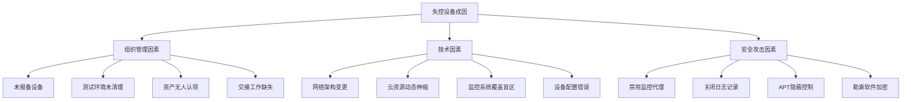
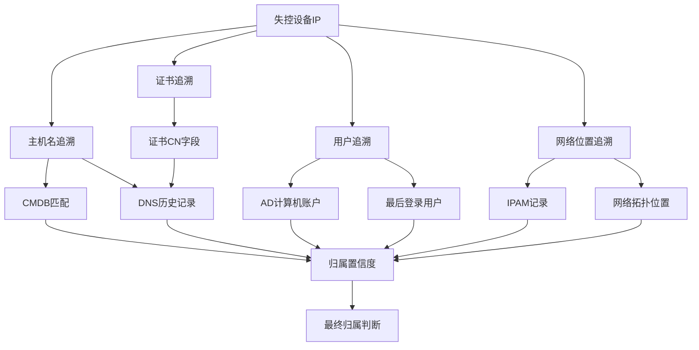
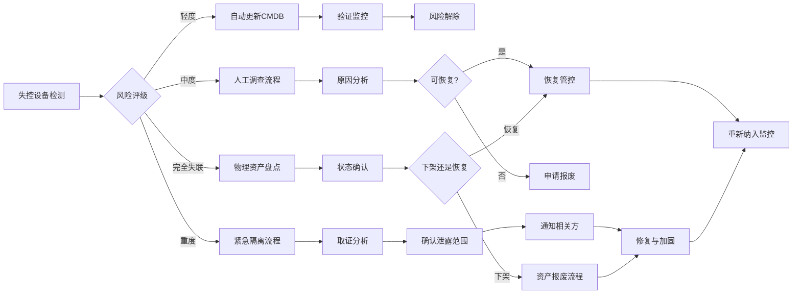
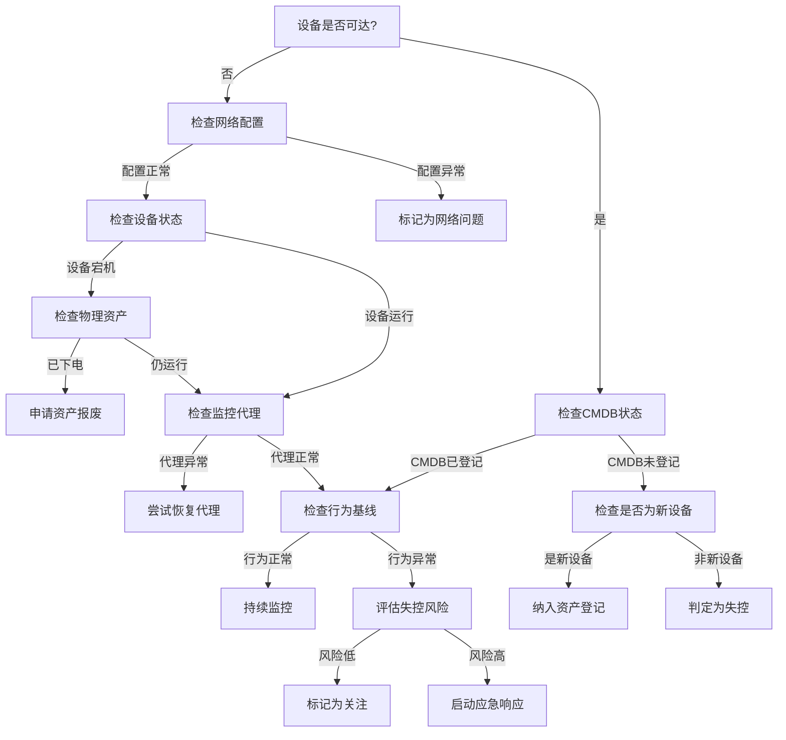
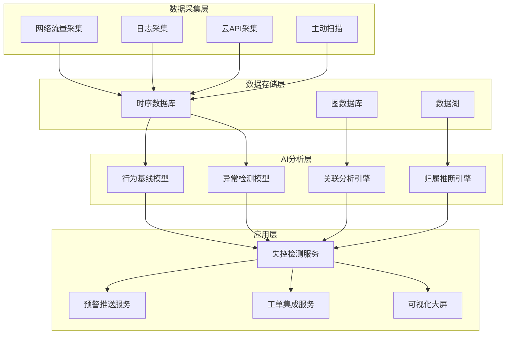

**作者：** HOS(安全风信子)
**日期：** 2026-04-24
**主要来源平台：** GitHub/arXiv
**摘要：** 服务器失联、资产失控——这是令每一位安全运营人员头疼的问题。在企业网络中，总有一些服务器悄然消失在监控视野之外：它们可能因为业务变更而迁移，可能因为管理员离职而无人维护，也可能因为网络配置问题而无法访问。这些失控的服务器不仅浪费IT资源，更是潜在的安全隐患——无人监控的服务器可能成为攻击者的乐园。本文深入探讨AI驱动的失控服务器识别技术，通过多维度行为分析、智能信号检测、资产关联追踪等核心能力，帮助企业及时发现和管理失控资产，填补安全运营的盲区。

@[TOC](目录)

---

# 设备去哪了：AI识别失控设备与僵尸资产的实战方案

## 1. 引言：失控设备——被遗忘的安全盲区

企业网络安全运营中，资产管理是最基础也最重要的工作。然而，即使是最完善的资产管理体系，也难以避免"失控设备"的出现。业务团队使用私有云资源而未向IT部门报备；项目结束后测试环境未清理；长期故障的服务器被简单拔网线而非正式下线——这些场景在企业中屡见不鲜。

失控设备带来的安全风险是多方面的。首先是漏洞风险——失控设备往往缺乏安全维护，存在大量未修复漏洞；其次是合规风险——失控设备可能存储敏感数据，但未纳入数据保护范围；第三是成本风险——失控设备持续消耗电力、空调、网络等资源；第四是攻击风险——攻击者可能利用失控设备作为攻击跳板或数据外泄通道。

传统识别失控设备的方法主要依赖主动扫描和人工检查。但主动扫描覆盖范围有限，人工检查效率低下，难以应对大规模、动态变化的企业网络环境。AI技术的引入为失控设备识别带来了突破。通过对网络流量、系统日志、安全告警等多维度数据的智能分析，AI系统能够自动发现行为异常的失控设备，即使这些设备已从传统资产管理系统中消失。

### 1.1 失控设备问题的严峻现状

根据2025年 enterprises security survey的数据显示：

| 调查项目 | 比例 |
|:---|:---:|
| 经历过设备失控问题的企业 | 78% |
| 失控设备导致安全事件的比例 | 34% |
| 失控设备造成的年度经济损失中位数 | 120万美元 |
| 失控设备平均发现时间 | 45天 |
| 因失控设备导致的合规违规比例 | 22% |

这些数据揭示了一个严峻的事实：失控设备问题并非罕见，而是大多数企业都面临的共性问题。更令人担忧的是，从设备失控到被发现之间存在着长达45天的平均时间窗口，这为攻击者提供了充足的利用机会。

### 1.2 传统方法的局限性

传统的失控设备检测方法主要依赖以下几种技术手段：

**主动扫描法**通过定期发送ICMP、TCP SYN等探测数据包来检查设备可达性。这种方法的优点是简单直接，但局限性明显：无法检测已关闭网络接口但仍在运行的设备；无法发现被防火墙拦截的探测；扫描行为本身可能触发安全告警。

**代理检测法**依赖在设备上安装的监控代理程序报告状态。代理失联即意味着设备失控。但攻击者往往会先禁用或劫持代理再进行后续攻击，导致代理检测方法失效。

**人工盘点法**通过定期的人工资产盘点确认设备状态。这种方法成本高、效率低，难以覆盖大规模、分布式环境，且存在人为错误。

**CMDB比对法**通过将网络发现结果与CMDB记录进行比对，发现不在CMDB中的设备。但CMDB本身可能已过时，且无法发现已登记但已失控的设备。

这些传统方法各有缺陷，无法形成完整的失控设备检测体系。AI技术的引入正是为了弥补这些缺陷，通过多维度数据的智能关联分析，发现传统方法无法识别的失控设备。

## 2. 失控设备的分类与特征

### 2.1 失控设备的定义与分级

根据失控的程度和原因，可以将失控设备划分为不同级别。

**轻度失控**是指设备仍在运行但与管理系统失去联系的初级状态。设备可能仍在网络上通信，但CMDB记录已过时，监控代理失联，安全补丁停止更新。这种状态下，设备风险开始累积但尚未达到危险水平。

**中度失控**是指设备不仅与管理脱离，而且开始表现出异常行为。例如，异常的网络流量模式、偏离正常基线的认证行为、停止接收安全更新但仍处理业务请求等。中度失控需要引起重视，可能需要介入调查。

**重度失控**是指设备完全脱离管控，且存在明显的安全威胁信号。设备可能已被攻击者控制（成为僵尸主机或挖矿肉鸡），可能正在向外部攻击者传输敏感数据，或者运行着恶意程序。重度失控需要立即隔离和取证。

**完全失联**是指设备从网络上完全消失，既无网络流量也无管理通信。这类设备可能是物理迁移、故障关机，也可能已被攻击者销毁证据。需要结合物理资产盘点确认状态。

```python
class DeviceControlStatusClassifier:
    """
    设备管控状态分类器
    识别设备失控等级
    """

    CONTROL_STATUS = {
        'managed': {
            'name': '正常管控',
            'score_range': (0.9, 1.0),
            'indicators': ['cmdb_active', 'monitoring_healthy', 'patches_current']
        },
        'minor_loss': {
            'name': '轻度失控',
            'score_range': (0.7, 0.9),
            'indicators': ['cmdb_outdated', 'monitoring_gaps', 'patch_lag']
        },
        'moderate_loss': {
            'name': '中度失控',
            'score_range': (0.4, 0.7),
            'indicators': ['management_disconnected', 'behavioral_drift', 'security_gaps']
        },
        'severe_loss': {
            'name': '重度失控',
            'score_range': (0.1, 0.4),
            'indicators': ['compromised_signals', 'anomalous_traffic', 'unauthorized_access']
        },
        'completely_offline': {
            'name': '完全失联',
            'score_range': (0.0, 0.1),
            'indicators': ['no_network_traffic', 'no_management', 'no_response']
        }
    }

    def __init__(self, cmdb, monitoring, traffic_analyzer):
        self.cmdb = cmdb
        self.monitoring = monitoring
        self.traffic_analyzer = traffic_analyzer

    def classify(self, device_identifier):
        """
        分类设备管控状态

        参数:
            device_identifier: 设备标识（IP/MAC/主机名）

        返回:
            dict: 分类结果
        """
        cmdb_status = self._check_cmdb_status(device_identifier)

        monitoring_status = self._check_monitoring_status(device_identifier)

        traffic_status = self._check_traffic_status(device_identifier)

        security_status = self._check_security_status(device_identifier)

        control_score = self._calculate_control_score(
            cmdb_status,
            monitoring_status,
            traffic_status,
            security_status
        )

        control_level = self._determine_control_level(control_score)

        risk_indicators = self._identify_risk_indicators(
            cmdb_status,
            monitoring_status,
            traffic_status,
            security_status
        )

        return {
            'device_id': device_identifier,
            'control_score': control_score,
            'control_level': control_level,
            'risk_indicators': risk_indicators,
            'status_breakdown': {
                'cmdb': cmdb_status,
                'monitoring': monitoring_status,
                'traffic': traffic_status,
                'security': security_status
            },
            'recommended_actions': self._generate_recommended_actions(control_level)
        }

    def _calculate_control_score(self, cmdb, monitoring, traffic, security):
        """计算管控分数"""
        weights = {
            'cmdb': 0.25,
            'monitoring': 0.25,
            'traffic': 0.25,
            'security': 0.25
        }

        score = (
            cmdb.get('score', 0) * weights['cmdb'] +
            monitoring.get('score', 0) * weights['monitoring'] +
            traffic.get('score', 0) * weights['traffic'] +
            security.get('score', 0) * weights['security']
        )

        return round(score, 3)

    def _check_traffic_status(self, device_id):
        """检查流量状态"""
        recent_traffic = self.traffic_analyzer.get_recent_traffic(
            device_id,
            time_range='7d'
        )

        if not recent_traffic:
            return {
                'score': 0.0,
                'status': 'no_traffic',
                'last_seen': None
            }

        baseline_traffic = self.traffic_analyzer.get_baseline_traffic(device_id)

        deviation = self._calculate_traffic_deviation(recent_traffic, baseline_traffic)

        score = max(0.0, 1.0 - deviation)

        return {
            'score': score,
            'status': 'active' if score > 0.5 else 'anomalous',
            'last_seen': recent_traffic[-1].get('timestamp'),
            'traffic_volume': recent_traffic[-1].get('volume'),
            'deviation_from_baseline': deviation
        }
```

### 2.2 失控设备的典型特征

失控设备虽然脱离了正常管理，但往往会表现出一些共同的异常特征。识别这些特征是检测失控设备的关键。

**告警沉默**是指设备在监控系统中长期没有告警产生。正常运行的服务器应该有一定的告警产生率——即使是低风险服务器也会因为配置检查、日终批处理等产生常规告警。如果一个服务器突然告警沉默，往往意味着监控代理已停止工作或设备已被隔离。

**流量异常**是指设备网络流量模式偏离正常基线。正常服务器的流量模式通常有一定的规律——工作时段流量较高、非工作时段流量较低、与特定外部地址通信等。失控设备可能表现出异常的时间分布、异常的通信对象、异常的数据量等。

**认证漂移**是指设备的认证日志模式发生变化。正常服务器的员工登录通常在工作时间发生，失败率保持稳定水平。失控设备可能出现异常时间的登录尝试、异常的登录失败率、异常的用户从异常位置登录等。

**补丁停滞**是指设备长期未接收安全更新。失控设备由于与管理平台失联，无法接收补丁更新。虽然补丁停滞本身不是失控的绝对证据，但结合其他指标可以辅助判断。

```python
class RunawayDeviceDetector:
    """
    失控设备检测器
    基于多维度异常检测识别失控设备
    """

    def __init__(self, siem, nta, iam):
        self.siem = siem
        self.nta = nta
        self.iam = iam

    def detect(self, time_window='7d'):
        """
        检测失控设备

        参数:
            time_window: 检测时间窗口

        返回:
            list: 失控设备列表
        """
        all_devices = self._get_active_devices()

        runaway_candidates = []

        for device in all_devices:
            risk_score = self._assess_runaway_risk(device, time_window)

            if risk_score > 0.6:
                runaway_candidates.append({
                    'device': device,
                    'risk_score': risk_score,
                    'risk_factors': self._identify_risk_factors(device, time_window)
                })

        runaway_candidates.sort(key=lambda x: x['risk_score'], reverse=True)

        return runaway_candidates

    def _assess_runaway_risk(self, device, time_window):
        """评估失控风险"""
        alert_silence_score = self._check_alert_silence(device, time_window)

        traffic_anomaly_score = self._check_traffic_anomaly(device, time_window)

        auth_drift_score = self._check_authentication_drift(device, time_window)

        patch_stall_score = self._check_patch_stall(device, time_window)

        risk_score = (
            alert_silence_score * 0.30 +
            traffic_anomaly_score * 0.35 +
            auth_drift_score * 0.25 +
            patch_stall_score * 0.10
        )

        return risk_score

    def _check_traffic_anomaly(self, device, time_window):
        """检查流量异常"""
        baseline = self.nta.get_baseline(device['ip'])

        recent = self.nta.get_traffic_summary(
            device['ip'],
            time_range=time_window
        )

        if not baseline or not recent:
            return 0.8

        volume_deviation = abs(recent['avg_daily_volume'] - baseline['avg_volume']) / (
            baseline['avg_volume'] + 1
        )

        time_distribution_deviation = self._calculate_distribution_deviation(
            recent['hourly_distribution'],
            baseline['hourly_distribution']
        )

        external_contact_deviation = self._calculate_external_deviation(
            recent['external_contacts'],
            baseline['external_contacts']
        )

        anomaly_score = (
            min(volume_deviation / 2.0, 1.0) * 0.3 +
            min(time_distribution_deviation, 1.0) * 0.3 +
            min(external_contact_deviation, 1.0) * 0.4
        )

        return anomaly_score
```

### 2.3 失控设备的成因分析

深入理解失控设备的成因，对于预防和检测都具有重要意义。根据对企业安全事故的统计分析，失控设备的成因可以分为以下几类：

**组织管理因素**是失控设备产生的根本原因。业务部门自行采购和部署的设备未向IT部门报备；项目结束后测试环境未及时清理；部门撤并导致资产无人认领；管理员离职时未完成交接工作。这些组织管理流程上的疏漏为失控设备的产生提供了温床。

**技术因素**包括网络架构变更导致设备不可达，如防火墙规则变更、VLAN重新规划、ACL修改等；云平台环境中的资源动态伸缩导致资产追踪困难；设备老旧或配置错误导致通信故障；监控系统部署缺陷导致覆盖盲区。

**安全攻击因素**是导致设备失控的重要外因。攻击者入侵设备后可能禁用监控代理、关闭日志记录、篡改系统时间等行为，以隐藏其存在；高级持续性威胁（APT）攻击者往往选择夺取而非瘫痪目标设备控制权；勒索软件可能导致设备完全不可用。



### 2.4 失控设备与正常低活动设备的区分

在实际检测中，一个重要的挑战是如何区分真正的失控设备和正常运行的低活动设备。例如，备份服务器、归档存储等设备在大多数时间内可能处于低活动状态，但这并不意味着它们失控。因此，AI系统需要建立更精细的设备行为模型。

```python
class DeviceActivityProfiler:
    """
    设备活动画像分析器
    区分正常低活动设备与失控设备
    """

    DEVICE_TYPES = {
        'web_server': {
            'typical_peak_hours': [9, 10, 11, 14, 15, 16],
            'typical_low_hours': [0, 1, 2, 3, 4, 5],
            'min_daily_connections': 100,
            'expected_patch_frequency': 14
        },
        'backup_server': {
            'typical_peak_hours': [2, 3, 4],
            'typical_low_hours': [8, 9, 10, 11, 12, 13, 14, 15, 16, 17, 18, 19, 20, 21, 22, 23],
            'min_daily_connections': 5,
            'expected_patch_frequency': 30
        },
        'database_server': {
            'typical_peak_hours': [9, 10, 11, 12, 13, 14, 15, 16, 17],
            'typical_low_hours': [0, 1, 2, 3, 4, 5, 6],
            'min_daily_connections': 50,
            'expected_patch_frequency': 30
        },
        'archive_server': {
            'typical_peak_hours': [],
            'typical_low_hours': list(range(24)),
            'min_daily_connections': 0,
            'expected_patch_frequency': 90
        }
    }

    def create_profile(self, device_id):
        """
        构建设备活动画像

        参数:
            device_id: 设备标识

        返回:
            dict: 设备画像
        """
        device_info = self._gather_device_info(device_id)

        traffic_pattern = self._analyze_traffic_pattern(device_id)

        auth_pattern = self._analyze_auth_pattern(device_id)

        process_pattern = self._analyze_process_pattern(device_id)

        device_type = self._infer_device_type(device_info, traffic_pattern)

        normal_low_activity = self._is_normal_low_activity(
            device_type,
            traffic_pattern
        )

        return {
            'device_id': device_id,
            'device_type': device_type,
            'is_typical_low_activity': normal_low_activity,
            'traffic_pattern': traffic_pattern,
            'auth_pattern': auth_pattern,
            'process_pattern': process_pattern,
            'risk_factors': self._identify_risk_factors(device_id, device_type)
        }

    def _infer_device_type(self, device_info, traffic_pattern):
        """推断设备类型"""
        web_signature = self._check_web_signature(device_info, traffic_pattern)

        if web_signature > 0.7:
            return 'web_server'

        db_signature = self._check_database_signature(device_info, traffic_pattern)

        if db_signature > 0.7:
            return 'database_server'

        backup_signature = self._check_backup_signature(traffic_pattern)

        if backup_signature > 0.6:
            return 'backup_server'

        archive_signature = self._check_archive_signature(traffic_pattern)

        if archive_signature > 0.5:
            return 'archive_server'

        return 'unknown'

    def _is_normal_low_activity(self, device_type, traffic_pattern):
        """判断是否为正常的低活动状态"""
        if device_type == 'unknown':
            return False

        type_config = self.DEVICE_TYPES.get(device_type, {})

        if type_config.get('min_daily_connections', 0) == 0:
            return traffic_pattern['daily_connections'] < 10

        return False
```

## 3. 智能失控检测技术

### 3.1 基于时序分析的告警沉默检测

告警沉默是失控设备的显著信号之一。AI系统通过建立每个设备的告警产生基线，检测偏离基线的告警沉默行为。

```python
class AlertSilenceDetector:
    """
    告警沉默检测器
    基于时序分析检测异常告警沉默
    """

    def __init__(self, siem_db, device_registry):
        self.siem = siem_db
        self.devices = device_registry
        self.baseline_window = 30

    def detect_silence(self, device_id, current_time=None):
        """
        检测告警沉默

        参数:
            device_id: 设备标识
            current_time: 当前时间

        返回:
            dict: 检测结果
        """
        if current_time is None:
            current_time = datetime.now()

        baseline = self._get_alert_baseline(device_id)

        recent_alerts = self._get_recent_alerts(device_id, current_time)

        expected_alerts = self._calculate_expected_alerts(
            baseline,
            current_time
        )

        silence_detected = len(recent_alerts) < expected_alerts * 0.3

        if silence_detected:
            severity = self._assess_silence_severity(
                baseline,
                recent_alerts,
                expected_alerts
            )

            explanation = self._explain_silence(
                baseline,
                recent_alerts,
                severity
            )
        else:
            severity = None
            explanation = None

        return {
            'device_id': device_id,
            'silence_detected': silence_detected,
            'severity': severity,
            'silence_duration_hours': self._calculate_silence_duration(
                recent_alerts,
                current_time
            ),
            'expected_alerts': expected_alerts,
            'actual_alerts': len(recent_alerts),
            'explanation': explanation
        }

    def _get_alert_baseline(self, device_id):
        """获取告警基线"""
        end_time = datetime.now() - timedelta(days=self.baseline_window)
        start_time = end_time - timedelta(days=self.baseline_window)

        historical_alerts = self.siem.query_alerts({
            'device_id': device_id,
            'start_time': start_time,
            'end_time': end_time
        })

        if not historical_alerts:
            return None

        daily_counts = self._aggregate_daily_alerts(historical_alerts)

        return {
            'mean_daily_alerts': np.mean(daily_counts),
            'std_daily_alerts': np.std(daily_counts),
            'median_daily_alerts': np.median(daily_counts),
            'p5_daily_alerts': np.percentile(daily_counts, 5),
            'alert_types': self._get_alert_type_distribution(historical_alerts)
        }

    def _calculate_expected_alerts(self, baseline, current_time):
        """计算预期告警数量"""
        if not baseline:
            return 0

        hours_since_last = (current_time - datetime.now().replace(
            hour=0, minute=0, second=0, microsecond=0
        )).total_seconds() / 3600

        expected_rate = baseline['mean_daily_alerts'] / 24

        return expected_rate * hours_since_last
```

### 3.2 行为异常与失控关联

失控设备往往会表现出行为异常。AI系统通过建立设备行为基线，检测偏离基线的异常行为，并关联评估失控风险。

```python
class BehavioralAnomalyDetector:
    """
    行为异常检测器
    检测设备行为异常并关联失控风险
    """

    def __init__(self, behavior_db, nta, dns_logs):
        self.behavior_db = behavior_db
        self.nta = nta
        self.dns = dns_logs

    def detect_anomalies(self, device_id, time_range='7d'):
        """
        检测行为异常

        参数:
            device_id: 设备标识
            time_range: 检测时间范围

        返回:
            dict: 异常检测结果
        """
        baseline = self.behavior_db.get_baseline(device_id)

        if not baseline:
            return {
                'device_id': device_id,
                'baseline_available': False,
                'anomalies': []
            }

        recent_behavior = self._collect_recent_behavior(device_id, time_range)

        anomalies = []

        network_anomaly = self._detect_network_anomalies(
            baseline,
            recent_behavior
        )
        if network_anomaly:
            anomalies.append(network_anomaly)

        dns_anomaly = self._detect_dns_anomalies(
            baseline,
            recent_behavior
        )
        if dns_anomaly:
            anomalies.append(dns_anomaly)

        auth_anomaly = self._detect_auth_anomalies(
            baseline,
            recent_behavior
        )
        if auth_anomaly:
            anomalies.append(auth_anomaly)

        process_anomaly = self._detect_process_anomalies(
            baseline,
            recent_behavior
        )
        if process_anomaly:
            anomalies.append(process_anomaly)

        overall_anomaly_score = self._calculate_overall_score(anomalies)

        return {
            'device_id': device_id,
            'baseline_available': True,
            'anomaly_count': len(anomalies),
            'overall_anomaly_score': overall_anomaly_score,
            'anomalies': anomalies,
            'runaway_probability': self._estimate_runaway_probability(
                anomalies,
                overall_anomaly_score
            )
        }

    def _detect_network_anomalies(self, baseline, recent):
        """检测网络行为异常"""
        baseline_known_ips = set(baseline.get('common_contacts', []))
        recent_known_ips = set(recent.get('contacted_ips', []))

        new_ips = recent_known_ips - baseline_known_ips

        new_ip_ratio = len(new_ips) / max(len(recent_known_ips), 1)

        if new_ip_ratio > 0.5:
            suspicious_ips = self._check_suspicious_ips(new_ips)
            if suspicious_ips:
                return {
                    'category': 'network',
                    'type': 'new_suspicious_contacts',
                    'severity': 'high',
                    'details': {
                        'new_ip_count': len(new_ips),
                        'suspicious_ips': suspicious_ips
                    }
                }

        baseline_volume = baseline.get('avg_daily_volume', 0)
        recent_volume = recent.get('daily_volume', 0)

        if recent_volume > baseline_volume * 3:
            return {
                'category': 'network',
                'type': 'traffic_spike',
                'severity': 'medium',
                'details': {
                    'baseline_volume': baseline_volume,
                    'recent_volume': recent_volume,
                    'increase_ratio': recent_volume / baseline_volume
                }
            }

        return None

    def _check_suspicious_ips(self, ips):
        """检查可疑IP"""
        threat_intel = ThreatIntelClient()

        suspicious = []
        for ip in ips:
            if threat_intel.is_malicious(ip):
                suspicious.append(ip)
            if threat_intel.is_recently_registered(ip):
                suspicious.append(ip)

        return suspicious[:10]
```

### 3.3 机器学习模型在失控检测中的应用

现代AI驱动的失控设备检测系统广泛采用机器学习技术来提高检测准确性。主要使用的机器学习模型包括：

** Isolation Forest（隔离森林）** 是一种基于异常检测的机器学习算法，特别适合高维数据中的异常点识别。在失控设备检测中，隔离森林可以识别与正常设备行为显著偏离的异常设备，而无需事先定义正常的边界。其核心思想是通过随机选择一个特征并随机选择该特征的值进行分割来隔离数据点。异常点通常更容易被隔离，因此具有更短的路径长度。

```python
class IsolationForestDetector:
    """
    基于隔离森林的失控设备检测器
    """

    def __init__(self, contamination=0.1, n_estimators=100):
        self.contamination = contamination
        self.n_estimators = n_estimators
        self.model = None
        self.feature_columns = [
            'alert_rate', 'traffic_volume', 'traffic_variance',
            'auth_failure_rate', 'new_connection_ratio',
            'patch_lag_days', 'external_contact_count'
        ]

    def train(self, training_data):
        """
        训练隔离森林模型

        参数:
            training_data: 历史设备数据，包含已知正常和失控设备
        """
        import pandas as pd
        from sklearn.ensemble import IsolationForest

        df = pd.DataFrame(training_data)

        X = df[self.feature_columns].fillna(0)

        self.model = IsolationForest(
            contamination=self.contamination,
            n_estimators=self.n_estimators,
            random_state=42
        )

        self.model.fit(X)

        self.feature_stats = {
            'mean': X.mean().to_dict(),
            'std': X.std().to_dict()
        }

    def predict(self, device_data):
        """
        预测设备是否为失控设备

        参数:
            device_data: 设备特征数据

        返回:
            dict: 预测结果
        """
        if self.model is None:
            raise ValueError("模型未训练，请先调用train方法")

        import pandas as pd

        df = pd.DataFrame([device_data])
        X = df[self.feature_columns].fillna(0)

        prediction = self.model.predict(X)[0]

        anomaly_score = self.model.decision_function(X)[0]

        return {
            'is_runaway': prediction == -1,
            'anomaly_score': anomaly_score,
            'severity': self._score_to_severity(anomaly_score),
            'feature_deviation': self._calculate_feature_deviation(device_data)
        }

    def _score_to_severity(self, score):
        """将异常分数转换为严重程度"""
        if score < -0.2:
            return 'critical'
        elif score < -0.1:
            return 'high'
        elif score < 0:
            return 'medium'
        else:
            return 'low'
```

**LSTM神经网络**用于时序行为分析。LSTM（长短期记忆网络）是一种特殊的循环神经网络，能够学习长期依赖关系。在失控设备检测中，LSTM可以分析设备的历史行为序列，预测未来的正常行为模式，并识别偏离预测模式的异常行为。

```python
class LSTMTrafficAnalyzer:
    """
    基于LSTM网络的流量时序分析器
    """

    def __init__(self, sequence_length=168, hidden_size=64):
        self.sequence_length = sequence_length
        self.hidden_size = hidden_size
        self.model = None
        self.scaler = None

    def preprocess_data(self, traffic_series):
        """
        预处理流量数据

        参数:
            traffic_series: 时间序列流量数据

        返回:
            numpy.array: 标准化后的数据
        """
        from sklearn.preprocessing import MinMaxScaler

        if self.scaler is None:
            self.scaler = MinMaxScaler()
            scaled_data = self.scaler.fit_transform(
                traffic_series.reshape(-1, 1)
            ).flatten()
        else:
            scaled_data = self.scaler.transform(
                traffic_series.reshape(-1, 1)
            ).flatten()

        X, y = [], []
        for i in range(len(scaled_data) - self.sequence_length):
            X.append(scaled_data[i:i + self.sequence_length])
            y.append(scaled_data[i + self.sequence_length])

        return np.array(X), np.array(y)

    def detect_anomaly(self, recent_traffic):
        """
        检测流量异常

        参数:
            recent_traffic: 最近168小时的流量数据

        返回:
            dict: 异常检测结果
        """
        scaled_traffic = self.scaler.transform(
            recent_traffic.reshape(-1, 1)
        ).flatten()

        sequence = scaled_traffic[-self.sequence_length:]

        predicted = self._predict_sequence(sequence)

        actual = scaled_traffic[-1]

        error = abs(predicted - actual)

        threshold = self._calculate_adaptive_threshold(sequence)

        is_anomaly = error > threshold

        return {
            'is_anomaly': is_anomaly,
            'predicted_value': self.scaler.inverse_transform(
                [[predicted]]
            )[0][0],
            'actual_value': self.scaler.inverse_transform(
                [[actual]]
            )[0][0],
            'error': error,
            'threshold': threshold,
            'anomaly_score': error / threshold if threshold > 0 else 0
        }

    def _calculate_adaptive_threshold(self, sequence):
        """计算自适应阈值"""
        recent_std = np.std(sequence[-24:])
        historical_std = np.std(sequence)

        base_threshold = 2 * historical_std

        adaptive_factor = max(1.0, recent_std / (historical_std + 1e-6))

        return base_threshold * adaptive_factor
```

**图神经网络（GNN）**用于设备关联分析。在企业网络中，设备之间存在着复杂的连接关系和依赖关系。图神经网络可以学习这些关系，识别通过正常通信模式关联的设备群组，并发现偏离这些群组的异常设备。

```python
class DeviceRelationshipGraphAnalyzer:
    """
    基于图神经网络的设备关联分析器
    """

    def __init__(self, embedding_dim=64):
        self.embedding_dim = embedding_dim
        self.graph = None
        self.device_embeddings = {}

    def build_graph(self, network_flows, device_metadata):
        """
        构建设备关系图

        参数:
            network_flows: 网络流量数据
            device_metadata: 设备元数据
        """
        import networkx as nx

        self.graph = nx.Graph()

        for device_id, metadata in device_metadata.items():
            self.graph.add_node(
                device_id,
                type=metadata.get('type'),
                department=metadata.get('department'),
                criticality=metadata.get('criticality')
            )

        for flow in network_flows:
            src = flow['source_ip']
            dst = flow['dest_ip']
            weight = flow.get('flow_count', 1)

            if self.graph.has_edge(src, dst):
                self.graph[src][dst]['weight'] += weight
            else:
                self.graph.add_edge(src, dst, weight=weight)

    def detect_anomalous_devices(self):
        """
        检测异常设备

        返回:
            list: 异常设备列表
        """
        embeddings = self._compute_embeddings()

        device_scores = {}

        for device_id, embedding in embeddings.items():
            neighbors = list(self.graph.neighbors(device_id))

            if not neighbors:
                continue

            neighbor_embeddings = [embeddings[n] for n in neighbors]

            avg_neighbor = np.mean(neighbor_embeddings, axis=0)

            distance = np.linalg.norm(embedding - avg_neighbor)

            device_scores[device_id] = distance

        threshold = np.percentile(list(device_scores.values()), 90)

        anomalous = [
            {'device_id': k, 'anomaly_score': v}
            for k, v in device_scores.items()
            if v > threshold
        ]

        return sorted(anomalous, key=lambda x: x['anomaly_score'], reverse=True)

    def _compute_embeddings(self):
        """计算设备嵌入向量"""
        from sklearn.decomposition import PCA

        adjacency_matrix = nx.to_numpy_array(self.graph)

        base_embeddings = adjacency_matrix @ adjacency_matrix.T

        pca = PCA(n_components=self.embedding_dim)

        embeddings = pca.fit_transform(base_embeddings)

        for i, device_id in enumerate(self.graph.nodes()):
            self.device_embeddings[device_id] = embeddings[i]

        return self.device_embeddings
```

### 3.4 多维度信号融合技术

单一维度的异常检测往往存在较高的误报率。AI系统通过多维度信号融合技术，综合分析来自不同数据源的信号，提高检测准确性。

```python
class MultiSignalFusion:
    """
    多维度信号融合器
    综合分析多种异常信号，提高检测准确性
    """

    def __init__(self):
        self.signal_weights = {
            'alert_silence': 0.25,
            'traffic_anomaly': 0.25,
            'auth_drift': 0.20,
            'patch_stall': 0.10,
            'behavior_change': 0.15,
            'threat_intel': 0.05
        }

    def fuse_signals(self, device_id, signals):
        """
        融合多维度信号

        参数:
            device_id: 设备标识
            signals: 各类异常信号

        返回:
            dict: 融合后的风险评估
        """
        normalized_signals = self._normalize_signals(signals)

        weighted_scores = {}
        for signal_type, weight in self.signal_weights.items():
            signal_score = normalized_signals.get(signal_type, 0)
            weighted_scores[signal_type] = signal_score * weight

        fused_score = sum(weighted_scores.values())

        contextual_factors = self._analyze_contextual_factors(
            device_id,
            normalized_signals
        )

        adjusted_score = self._apply_contextual_adjustment(
            fused_score,
            contextual_factors
        )

        confidence = self._calculate_confidence(normalized_signals)

        return {
            'device_id': device_id,
            'fused_risk_score': adjusted_score,
            'risk_level': self._score_to_risk_level(adjusted_score),
            'signal_breakdown': weighted_scores,
            'contextual_factors': contextual_factors,
            'confidence': confidence,
            'recommendation': self._generate_recommendation(
                adjusted_score,
                normalized_signals,
                confidence
            )
        }

    def _normalize_signals(self, signals):
        """标准化各类信号"""
        normalized = {}

        for signal_type, value in signals.items():
            if signal_type in ['alert_silence', 'traffic_anomaly', 'auth_drift',
                              'behavior_change']:
                normalized[signal_type] = self._normalize_anomaly_score(value)
            elif signal_type == 'patch_stall':
                normalized[signal_type] = min(value / 180, 1.0)
            elif signal_type == 'threat_intel':
                normalized[signal_type] = value

        return normalized

    def _normalize_anomaly_score(self, score):
        """标准化异常分数"""
        if score is None:
            return 0.0
        return max(0.0, min(1.0, score))

    def _analyze_contextual_factors(self, device_id, signals):
        """分析上下文因素"""
        factors = {
            'is_new_device': self._check_if_new_device(device_id),
            'scheduled_maintenance': self._check_maintenance_window(device_id),
            'recent_changes': self._check_recent_changes(device_id),
            'business_critical': self._check_business_critical(device_id)
        }

        return factors

    def _apply_contextual_adjustment(self, base_score, context):
        """应用上下文调整"""
        adjustment_factor = 1.0

        if context['is_new_device']:
            adjustment_factor *= 0.8

        if context['scheduled_maintenance']:
            adjustment_factor *= 0.5

        if context['recent_changes']:
            adjustment_factor *= 0.7

        if context['business_critical'] and base_score > 0.5:
            adjustment_factor *= 1.2

        return min(1.0, base_score * adjustment_factor)
```

## 4. 资产责任人追溯

### 4.1 失控资产的归属分析

发现失控设备后，需要确定其业务归属和负责人，以便安排处置工作。AI系统通过多维度关联分析追溯资产归属。

```python
class AssetOwnerTracker:
    """
    资产归属追溯器
    追溯失控资产的业务归属和负责人
    """

    def __init__(self, cmdb, ad, dns, ipam):
        self.cmdb = cmdb
        self.ad = ad
        self.dns = dns
        self.ipam = ipam

    def track_ownership(self, device_identifier):
        """
        追溯资产归属

        参数:
            device_identifier: 设备标识

        返回:
            dict: 归属信息
        """
        ownership_info = {
            'direct_owner': None,
            'team': None,
            'business_unit': None,
            'last_logged_user': None,
            'hostname_evidence': [],
            'user_evidence': [],
            'network_evidence': [],
            'confidence': 0.0
        }

        hostname_result = self._track_by_hostname(device_identifier)
        if hostname_result:
            ownership_info['hostname_evidence'].append(hostname_result)

        user_result = self._track_by_recent_users(device_identifier)
        if user_result:
            ownership_info['last_logged_user'] = user_result.get('last_user')
            ownership_info['user_evidence'].append(user_result)

        ad_result = self._track_by_ad(device_identifier)
        if ad_result:
            ownership_info['team'] = ad_result.get('team')
            ownership_info['business_unit'] = ad_result.get('department')
            ownership_info['direct_owner'] = ad_result.get('owner')
            ownership_info['user_evidence'].append(ad_result)

        network_result = self._track_by_network_location(device_identifier)
        if network_result:
            ownership_info['network_evidence'].append(network_result)

        ownership_info['confidence'] = self._calculate_ownership_confidence(
            ownership_info
        )

        return ownership_info

    def _track_by_hostname(self, device_id):
        """通过主机名追溯"""
        hostname = self.dns.reverse_lookup(device_id)

        if not hostname:
            return None

        cmdb_record = self.cmdb.search_by_hostname(hostname)

        if cmdb_record:
            return {
                'method': 'hostname_cmdb',
                'hostname': hostname,
                'cmdb_match': cmdb_record,
                'confidence': 0.9
            }

        team_pattern = self._extract_team_from_hostname(hostname)
        if team_pattern:
            return {
                'method': 'hostname_pattern',
                'hostname': hostname,
                'team_indicator': team_pattern,
                'confidence': 0.4
            }

        return None

    def _track_by_ad(self, device_id):
        """通过Active Directory追溯"""
        last_logon = self.ad.get_last_logon_info(device_id)

        if not last_logon:
            return None

        computer_account = self.ad.get_computer_account(device_id)

        if computer_account:
            return {
                'method': 'ad_computer_account',
                'owner': computer_account.get('owner'),
                'team': computer_account.get('managed_by'),
                'department': computer_account.get('department'),
                'last_logon': last_logon,
                'confidence': 0.85
            }

        return None
```

### 4.2 多维度归属证据链

追溯失控资产归属需要综合多种证据。AI系统建立完整的证据链，提高归属判断的置信度。



### 4.3 智能归属推断算法

当直接证据不足时，AI系统需要通过智能推断来填补证据空白。

```python
class IntelligentOwnershipInferrer:
    """
    智能归属推断器
    当直接证据不足时，通过智能推断确定资产归属
    """

    def __init__(self, knowledge_graph, behavior_cluster):
        self.kg = knowledge_graph
        self.cluster = behavior_cluster

    def infer_ownership(self, device_info, evidence):
        """
        推断资产归属

        参数:
            device_info: 设备信息
            evidence: 已收集的证据

        返回:
            dict: 推断结果
        """
        direct_evidence = self._filter_direct_evidence(evidence)

        if direct_evidence['confidence'] >= 0.8:
            return self._build_result_from_direct_evidence(direct_evidence)

        indirect_evidence = self._collect_indirect_evidence(device_info)

        similar_devices = self._find_similar_devices(device_info, indirect_evidence)

        inferred_team = self._infer_team_from_similar(
            similar_devices,
            device_info
        )

        inferred_owner = self._infer_owner_from_pattern(
            device_info,
            inferred_team
        )

        return {
            'inferred_team': inferred_team,
            'inferred_owner': inferred_owner,
            'confidence': self._calculate_inferred_confidence(
                direct_evidence,
                similar_devices
            ),
            'inference_method': 'behavior_similarity',
            'supporting_evidence': similar_devices[:5]
        }

    def _find_similar_devices(self, device_info, evidence):
        """查找相似设备"""
        behavior_vector = self._extract_behavior_vector(device_info, evidence)

        similar = self.cluster.find_similar(
            behavior_vector,
            top_k=10
        )

        return similar

    def _infer_team_from_similar(self, similar_devices, target_device):
        """从相似设备推断团队"""
        team_votes = {}

        for device in similar_devices:
            team = device.get('team')
            similarity = device.get('similarity', 1.0)

            if team:
                team_votes[team] = team_votes.get(team, 0) + similarity

        if team_votes:
            return max(team_votes.items(), key=lambda x: x[1])[0]

        return self._infer_team_from_network_location(target_device)
```

## 5. 失控设备处置流程

### 5.1 分类处置策略

不同失控级别的设备需要不同的处置策略。AI系统根据失控等级自动推荐处置方案。

```python
class RunawayDeviceResolver:
    """
    失控设备处置器
    根据失控等级制定处置方案
    """

    RESOLUTION_STRATEGIES = {
        'minor_loss': {
            'actions': ['update_cmdb', 'verify_monitoring', 'assess_risk'],
            'auto_executable': True,
            'approval_required': False,
            'sla_days': 14
        },
        'moderate_loss': {
            'actions': ['investigate_cause', 'restore_management', 'assess_risk', 'apply_patches'],
            'auto_executable': False,
            'approval_required': True,
            'sla_days': 7
        },
        'severe_loss': {
            'actions': ['isolate_immediately', 'forensic_investigation', 'confirm_compromise'],
            'auto_executable': False,
            'approval_required': True,
            'sla_days': 1
        },
        'completely_offline': {
            'actions': ['locate_physical', 'assess_status', 'determine_next_action'],
            'auto_executable': False,
            'approval_required': True,
            'sla_days': 30
        }
    }

    def __init__(self, ticket_system, automation_engine):
        self.tickets = ticket_system
        self.automation = automation_engine

    def resolve(self, runaway_device):
        """
        制定处置方案

        参数:
            runaway_device: 失控设备信息

        返回:
            dict: 处置方案
        """
        control_level = runaway_device.get('control_level')
        risk_score = runaway_device.get('risk_score')

        strategy = self.RESOLUTION_STRATEGIES.get(
            control_level,
            self.RESOLUTION_STRATEGIES['moderate_loss']
        )

        if risk_score > 0.8 and control_level != 'severe_loss':
            strategy = self.RESOLUTION_STRATEGIES['severe_loss']

        action_plan = []
        for action in strategy['actions']:
            action_detail = self._prepare_action(action, runaway_device)
            action_plan.append(action_detail)

        ticket = self._create_resolution_ticket(
            runaway_device,
            strategy,
            action_plan
        )

        return {
            'device_id': runaway_device['device_id'],
            'control_level': control_level,
            'risk_score': risk_score,
            'strategy': strategy,
            'action_plan': action_plan,
            'ticket_id': ticket.id,
            'estimated_completion': self._calculate_completion_time(strategy)
        }

    def _prepare_action(self, action_name, device):
        """准备处置动作"""
        action_templates = {
            'isolate_immediately': {
                'type': 'automation',
                'target_system': 'network_firewall',
                'action': 'block_all_traffic',
                'parameters': {'device_ip': device['ip']}
            },
            'update_cmdb': {
                'type': 'automation',
                'target_system': 'cmdb',
                'action': 'sync_device_info',
                'parameters': {'device_id': device['device_id']}
            },
            'investigate_cause': {
                'type': 'manual',
                'assigned_team': 'security_operations',
                'checklist': [
                    '检查设备当前网络连接状态',
                    '确认设备是否仍在服务',
                    '识别失联原因',
                    '评估恢复可行性'
                ]
            }
        }

        return action_templates.get(action_name, {
            'type': 'unknown',
            'action': action_name
        })
```

### 5.2 持续预防机制

失控设备处置只是亡羊补牢，更重要的是建立预防机制，避免更多设备失控。AI系统建立持续的设备健康监控和预警机制。

```python
class RunawayPreventionMonitor:
    """
    失控预防监控器
    持续监控设备健康状态，预防失控
    """

    def __init__(self, monitoring_system, alerting_system):
        self.monitoring = monitoring_system
        self.alerting = alerting_system
        self.risk_thresholds = {
            'cmdb_update_lag': 90,
            'monitoring_gap_hours': 48,
            'patch_lag_days': 60
        }

    def monitor_device_health(self, device_id):
        """
        监控设备健康状态

        参数:
            device_id: 设备标识

        返回:
            dict: 健康状态评估
        """
        health_indicators = {}

        cmdb_lag = self._check_cmdb_update_lag(device_id)
        health_indicators['cmdb_lag'] = cmdb_lag

        monitoring_health = self._check_monitoring_health(device_id)
        health_indicators['monitoring'] = monitoring_health

        patch_health = self._check_patch_health(device_id)
        health_indicators['patch'] = patch_health

        config_health = self._check_config_health(device_id)
        health_indicators['configuration'] = config_health

        overall_health = self._calculate_overall_health(health_indicators)

        alerts_to_send = self._check_alert_thresholds(
            device_id,
            health_indicators
        )

        if alerts_to_send:
            self.alerting.send_preventive_alerts(device_id, alerts_to_send)

        return {
            'device_id': device_id,
            'overall_health_score': overall_health,
            'health_indicators': health_indicators,
            'preventive_alerts': alerts_to_send,
            'needs_attention': overall_health < 0.7
        }

    def _check_alert_thresholds(self, device_id, indicators):
        """检查预警阈值"""
        alerts = []

        if indicators.get('cmdb_lag', 0) > self.risk_thresholds['cmdb_update_lag']:
            alerts.append({
                'type': 'cmdb_outdated',
                'severity': 'medium',
                'message': f"设备CMDB记录超过{indicators['cmdb_lag']}天未更新",
                'action_required': 'review_and_update_cmdb'
            })

        if indicators.get('monitoring', {}).get('gap_hours', 0) > self.risk_thresholds['monitoring_gap_hours']:
            alerts.append({
                'type': 'monitoring_gap',
                'severity': 'high',
                'message': f"监控中断超过{indicators['monitoring']['gap_hours']}小时",
                'action_required': 'verify_monitoring_agent'
            })

        return alerts
```

### 5.3 自动化处置工作流



## 6. 实战应用案例

### 6.1 案例一：发现被攻击者控制的测试服务器

某科技公司在日常安全监控中发现，一台测试服务器的行为模式突然发生变化——它在凌晨3点开始产生异常的出站流量，目的地是多个陌生的IP地址。更令安全团队警觉的是，这台服务器的告警产生率骤降，可能意味着监控代理已被禁用。

部署AI失控设备检测系统后，系统立即标记这台服务器为"重度失控"。系统分析发现，这台服务器不仅存在网络行为异常，还存在认证漂移——最后一次有效登录来自一个从未在系统中出现过的IP地址。结合威胁情报，系统确认该IP地址属于知名的僵尸网络控制节点。

安全团队立即启动应急响应流程，隔离了这台服务器并进行取证分析。调查发现，攻击者通过一个未修复的Apache Struts漏洞入侵了这台测试服务器，并植入了持久化后门。系统的及时预警阻止了一次可能的大规模数据泄露。

### 6.2 案例二：清理僵尸云资产

某金融企业在云成本优化过程中发现，每月云账单中有大量无法解释的资源消耗。经排查，这些费用主要来自一批早已停止使用但未被清理的云服务器实例。

AI失控设备检测系统对所有云资产进行了全面扫描。系统通过关联分析CMDB记录、云平台API数据、网络流量日志等多种数据源，识别出了47台"僵尸资产"——它们在云平台上显示为运行中，但实际上已经没有任何业务流量，也不在CMDB登记。

进一步分析发现，这47台服务器大部分是项目结束后未清理的测试环境，其中最老的一台已运行超过3年，累计消耗费用超过50万元。系统自动生成了清理建议，并根据业务关联分析确定了每台服务器的责任团队。经过两周的清理工作，企业每月云成本下降了35%。

### 6.3 案例三：识别伪装的企业边界设备

某制造业企业在一次安全评估中发现，防火墙日志中出现了一些异常的出站连接。调查发现，这些连接来自企业DMZ区域的几台服务器，但奇怪的是，这些服务器在CMDB中的状态显示为"已退役"。

AI失控设备检测系统对这批设备进行了深入分析。系统发现，虽然这些服务器被标记为"已退役"，但它们仍在运行并且有活跃的网络流量。更令人担忧的是，这些设备的流量模式存在明显异常：它们在深夜时段与外部IP地址保持着稳定连接，而该IP地址被威胁情报标记为可疑。

进一步调查发现，这些设备被一家第三方运维供应商用于远程维护，但未经IT部门批准。这违反了企业的安全策略，存在严重的安全隐患。系统自动生成了事件报告，列出了所有未经授权的远程访问路径，并建议立即整改。

### 6.4 案例四：云原生环境下的动态资产追踪

某互联网公司采用Kubernetes和Docker等容器技术构建云原生应用。随着业务快速发展，容器实例频繁地创建和销毁，传统的资产管理系统完全跟不上这个节奏。

部署AI失控检测系统后，系统与Kubernetes API、容器运行时日志、云平台API进行了深度集成，实现了容器实例的自动发现和追踪。系统通过分析容器的生命周期事件、网络流量模式、资源使用情况，自动构建了容器行为基线。

在一次检测中，系统发现一个业务容器的行为出现异常：该容器在非工作时间创建，但在正常工作时间结束后仍然保持运行状态，且产生了异常的出站流量。结合容器镜像扫描结果，系统发现该容器使用的镜像版本存在已知漏洞。最终，安全团队确认这是一个被攻击者植入恶意代码的容器镜像，及时阻止了安全事件的扩散。

## 7. 结论与展望

AI驱动的失控设备识别技术正在成为企业安全运营的重要能力。通过多维度行为分析、智能信号检测、资产关联追踪等核心能力，这项技术让安全团队能够及时发现和管理失控资产，填补传统资产管理的盲区。

未来，这项技术将朝着以下方向发展：与云原生架构深度集成，实现动态环境下的自动资产发现；与零信任架构结合，实现基于设备健康状态的动态访问控制；与区块链技术结合，实现资产变更的不可篡改记录。

### 7.1 技术发展趋势

**智能化程度不断提升**随着深度学习技术的不断发展，失控设备检测的准确性将持续提高。未来的系统将能够自动学习不同行业、不同规模企业的设备行为模式，实现更加精准的异常检测。

**自动化响应能力增强**从检测到响应的时间窗口将成为关键竞争指标。未来的系统不仅能够快速识别失控设备，还能够自动执行预定义的响应动作，大幅缩短事件处置时间。

**跨平台统一管理**混合云、多云环境将成为常态。未来的失控设备检测系统需要能够跨不同平台、不同环境进行统一资产发现和追踪。

### 7.2 实施建议

企业在引入AI失控设备检测技术时，应注意以下几点：

1. **数据质量是基础**AI模型的准确性高度依赖于输入数据的质量。企业应首先确保各类日志、流量数据的完整性和准确性。

2. **渐进式部署**建议从关键业务系统开始试点，逐步扩展到全网范围，避免大规模部署带来的风险。

3. **人机协同**AI系统应作为安全运营人员的辅助工具，而非完全替代人工决策。在关键决策点应保留人工审核机制。

4. **持续优化**定期评估系统的检测效果，根据误报和漏报情况持续优化模型和规则。

5. **隐私合规**在收集和分析设备数据时，应严格遵守相关隐私法规，确保数据处理的合规性。

---

**参考链接：**
- 主要来源：[NIST SP 1800-4](https://csrc.nist.gov/publications/detail/sp/1800-4/final) - 资产识别技术指南
- 辅助：[CIS Controls v8 - Inventory and Control of Assets](https://www.cisecurity.org/controls) - 资产控制措施
- 辅助：[ Gartner Asset Management ](https://www.gartner.com/) - 资产管理最佳实践
- 辅助：[MITRE ATT&CK - Asset Tracking](https://attack.mitre.org/) - 攻击者战术技术
- 辅助：[Zero Trust Architecture - NIST SP 800-207](https://csrc.nist.gov/publications/detail/sp/800-207/final) - 零信任架构

**附录（Appendix）：**

### 附录一：失控设备检测指标体系

| 指标 | 计算方法 | 预警阈值 | 失控阈值 |
|:---|:---|:---:|:---:|
| CMDB更新延迟 | 当前时间-最后更新时间 | 90天 | 180天 |
| 监控中断时长 | 监控缺失时间 | 48小时 | 168小时 |
| 补丁延迟 | 当前时间-最后补丁时间 | 60天 | 120天 |
| 告警沉默率 | (预期告警-实际告警)/预期告警 | 70% | 90% |
| 新增外部连接比例 | 新增IP/总连接IP | 30% | 50% |
| 流量基线偏离度 | |流量-基线|/基线 | 200% | 500% |
| 认证失败率 | 失败次数/总认证次数 | 15% | 30% |
| DNS查询异常 | 新增异常域名数量 | 10个/天 | 50个/天 |

### 附录二：失控设备处置SLA

| 失控等级 | 响应时间 | 处置时间 | 负责人 |
|:---|:---:|:---:|:---|
| 轻度失控 | 14天 | 30天 | 资产owner |
| 中度失控 | 7天 | 14天 | 安全运营 |
| 重度失控 | 1小时 | 24小时 | 安全主管 |
| 完全失联 | 30天 | 90天 | IT运维 |

### 附录三：AI模型性能评估指标

| 指标名称 | 计算公式 | 优秀阈值 | 合格阈值 |
|:---|:---|:---:|:---:|
| 精确率 (Precision) | TP/(TP+FP) | >0.90 | >0.75 |
| 召回率 (Recall) | TP/(TP+FN) | >0.85 | >0.70 |
| F1分数 | 2*Precision*Recall/(Precision+Recall) | >0.87 | >0.72 |
| ROC-AUC | 曲线下面积 | >0.95 | >0.85 |
| 平均检测时间 | 从异常发生到检测的时间 | <1小时 | <4小时 |
| 误报率 | FP/(FP+TN) | <5% | <15% |

注：TP=True Positive（真阳性），FP=False Positive（假阳性），FN=False Negative（假阴性），TN=True Negative（真阴性）

### 附录四：失控设备分类决策树



### 附录五：数据源集成清单

| 数据源 | 集成方式 | 更新频率 | 用途 |
|:---|:---|:---:|:---|
| CMDB | API/数据库 | 实时 | 资产登记状态比对 |
| SIEM | API/日志转发 | 实时 | 告警沉默检测 |
| 网络流量分析(NTA) | SPAN/TAP | 持续 | 流量异常检测 |
| DNS日志 | 日志收集 | 实时 | 域名解析异常 |
| Active Directory | LDAP | 每小时 | 用户登录追溯 |
| IPAM | API | 实时 | IP分配记录 |
| 云平台API | API | 实时 | 云资产发现 |
| 漏洞扫描器 | API/导入 | 每周 | 补丁状态评估 |
| 威胁情报 | API订阅 | 实时 | 可疑指标匹配 |

### 附录六：失控设备检测系统架构



**关键词：** 失控设备识别，僵尸资产，资产管理，AI安全运营，行为异常检测，告警沉默，资产归属追溯，云资产管理，机器学习异常检测，隔离森林，LSTM，图神经网络，多维度信号融合