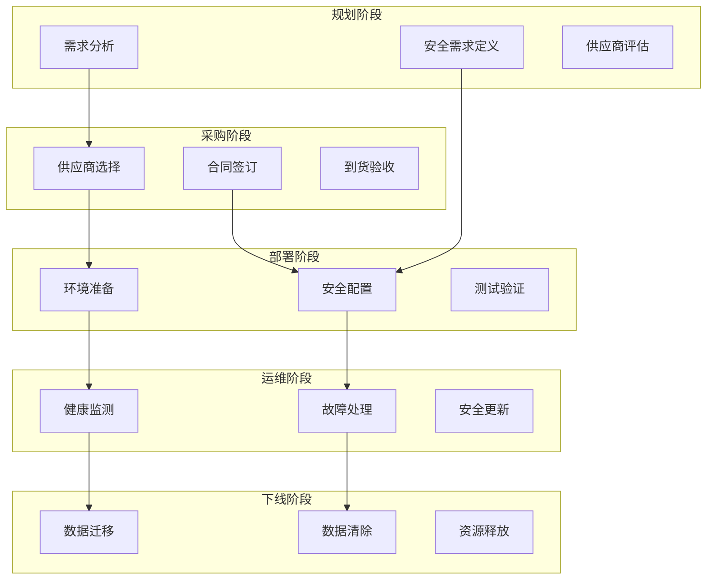
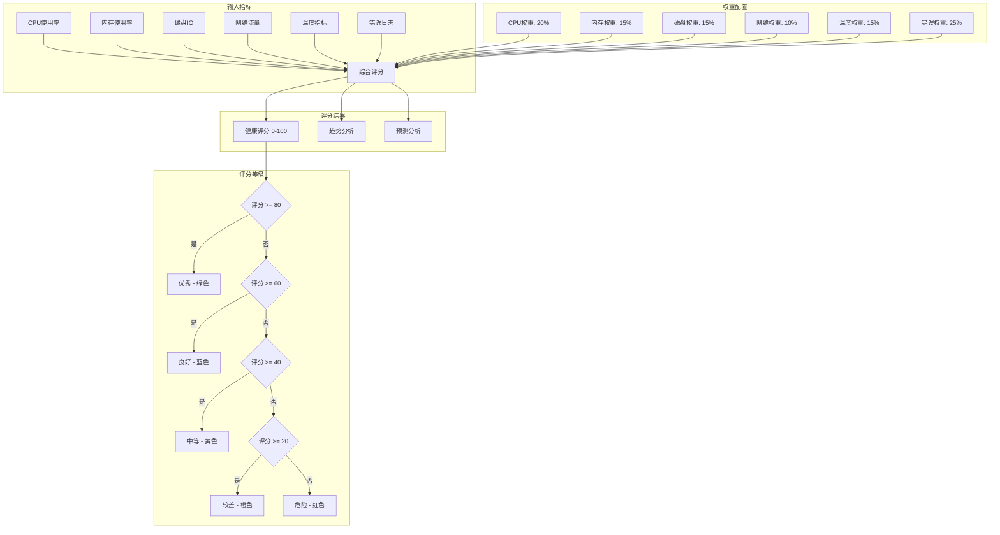
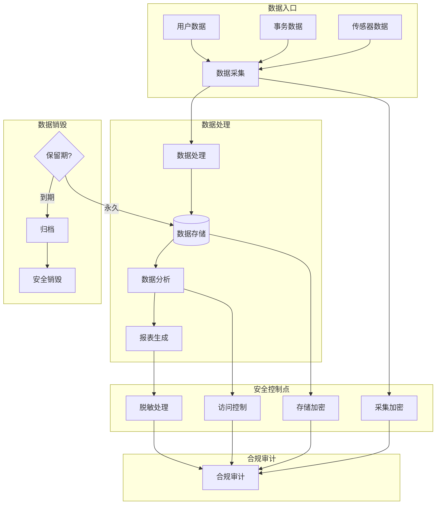
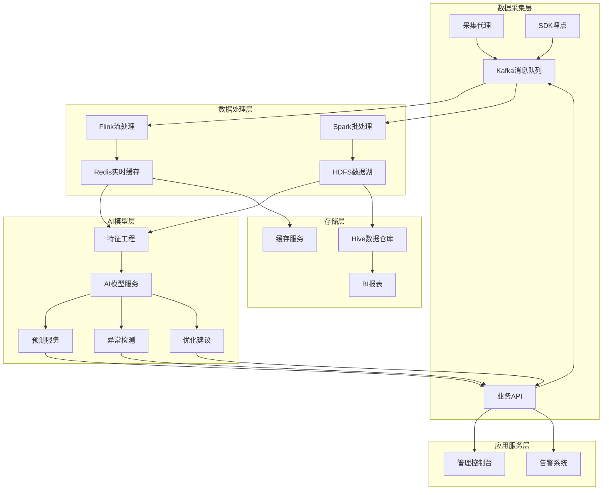

**作者：** HOS(安全风信子)
**日期：** 2026-04-24
**主要来源平台：** GitHub/arXiv
**摘要：** 资产管理不仅是发现和分类，更是对资产全生命周期的持续管控。从规划、采购、部署、运维到下线，每一个阶段都伴随着独特的安全考量。传统资产管理体系往往聚焦于某个阶段，而忽视了阶段之间的关联和影响。本文深入探讨AI驱动的资产生命周期管理技术，通过建立覆盖资产全生命周期的智能管理平台，帮助企业实现资产的持续可见性、主动风险管理和资源优化配置。

@[TOC](目录)

---

# 从生到死全程管控：AI资产生命周期管理实战指南

## 1. 引言：全生命周期资产管理的价值

传统资产管理的困境在于其被动性和片段性。企业往往在资产出现问题后才开始关注——漏洞爆发后才紧急修补，数据泄露后才追责，资源浪费严重后才优化。这种被动管理模式不仅效率低下，更可能导致严重的安全事件和成本浪费。

全生命周期资产管理（Asset Lifecycle Management）是一种系统性的管理方法，它将资产管理的视角延伸到从需求规划到最终处置的完整过程。在每一个阶段，管理者都需要考虑当前阶段的特殊需求，同时为下一阶段做好准备。例如，在规划阶段就需要考虑运维阶段的可维护性，在部署阶段就需要考虑未来的下线流程。

AI技术的引入为全生命周期资产管理带来了智能化的能力。通过对历史数据的分析和未来趋势的预测，AI系统能够在每个生命周期阶段提供前瞻性的建议，帮助企业建立主动、智能、持续的资产管理体系。

## 2. 资产生命周期各阶段分析

### 2.1 生命周期阶段模型

典型的资产生命周期包括五个主要阶段：规划阶段、采购阶段、部署阶段、运维阶段和下线阶段。每个阶段都有其特定的管理任务和安全考量。

**规划阶段**是资产生命周期的起点，也是最容易被忽视的阶段。在这个阶段，需要确定新资产的必要性、技术规格、预算安排和资源需求。安全团队应该参与规划过程，确保新资产符合企业的安全策略和架构要求。

**采购阶段**包括供应商选择、合同签订、采购执行等活动。在这个阶段，需要考虑供应商的安全资质、产品的安全特性、供应链安全风险等因素。

**部署阶段**是将资产投入生产环境的关键阶段。安全团队需要确保部署配置符合安全基线，安全监控已就位，访问控制已配置。

**运维阶段**是资产生命周期中最长的阶段。在这个阶段，需要持续监控资产的运行状态、安全状态、资源使用情况，及时处理故障和安全事件。

**下线阶段**是资产的退出阶段。不当的下线流程可能导致数据泄露、资源浪费、安全漏洞等问题。

```python
class AssetLifecycleModel:
    """
    资产生命周期模型
    定义和管理资产全生命周期
    """

    PHASES = {
        'planning': {
            'name': '规划阶段',
            'order': 1,
            'duration_days': {'min': 7, 'max': 30},
            'key_activities': [
                '需求分析',
                '技术规格确定',
                '预算规划',
                '供应商评估',
                '安全需求定义'
            ],
            'gate_requirements': [
                '安全风险评估通过',
                '预算审批通过',
                '安全架构审核通过'
            ]
        },
        'procurement': {
            'name': '采购阶段',
            'order': 2,
            'duration_days': {'min': 14, 'max': 90},
            'key_activities': [
                '供应商选择',
                '合同签订',
                '采购执行',
                '到货验收',
                '安全检测'
            ],
            'gate_requirements': [
                '供应商安全评估通过',
                '合同安全条款审查通过',
                '到货安全验证通过'
            ]
        },
        'deployment': {
            'name': '部署阶段',
            'order': 3,
            'duration_days': {'min': 1, 'max': 14},
            'key_activities': [
                '环境准备',
                '安全配置',
                '监控部署',
                '测试验证',
                '生产迁移'
            ],
            'gate_requirements': [
                '安全基线配置完成',
                '安全监控已就位',
                '渗透测试通过'
            ]
        },
        'operations': {
            'name': '运维阶段',
            'order': 4,
            'duration_days': {'min': 365, 'max': 2555},
            'key_activities': [
                '持续监控',
                '故障处理',
                '安全更新',
                '性能优化',
                '容量管理'
            ],
            'gate_requirements': [
                '安全补丁及时更新',
                '监控告警正常',
                '安全评估通过'
            ]
        },
        'decommission': {
            'name': '下线阶段',
            'order': 5,
            'duration_days': {'min': 7, 'max': 30},
            'key_activities': [
                '数据备份',
                '数据清除',
                '配置归档',
                '资源释放',
                '记录关闭'
            ],
            'gate_requirements': [
                '数据残留检测通过',
                '依赖关系清理完成',
                '财务结算完成'
            ]
        }
    }

    def __init__(self, asset_registry):
        self.asset_registry = asset_registry
        self.lifecycle_records = {}

    def get_asset_lifecycle(self, asset_id):
        """
        获取资产的生命周期状态

        参数:
            asset_id: 资产标识

        返回:
            dict: 生命周期状态
        """
        asset_info = self.asset_registry.get_asset(asset_id)

        current_phase = self._determine_current_phase(asset_info)

        phase_history = self._get_phase_history(asset_id)

        next_phase = self._determine_next_phase(current_phase)

        upcoming_gates = self._get_upcoming_gates(asset_id, current_phase)

        return {
            'asset_id': asset_id,
            'current_phase': current_phase,
            'phase_details': self.PHASES[current_phase],
            'phase_history': phase_history,
            'next_phase': next_phase,
            'upcoming_gates': upcoming_gates,
            'lifecycle_progress': self._calculate_progress(asset_info)
        }

    def _determine_current_phase(self, asset_info):
        """确定当前阶段"""
        if not asset_info.get('acquisition_date'):
            return 'planning'

        if not asset_info.get('deployment_date'):
            return 'procurement'

        if not asset_info.get('decommission_date'):
            return 'operations'

        return 'decommission'
```

## 3. AI在规划阶段的应用

### 3.1 智能需求分析

在规划阶段，AI系统能够分析历史数据和业务趋势，帮助企业做出更明智的采购决策。

```python
class AssetPlanningAdvisor:
    """
    资产规划顾问
    AI驱动的智能资产规划
    """

    def __init__(self, historical_data, business_plans, capacity_db):
        self.historical = historical_data
        self.business_plans = business_plans
        self.capacity = capacity_db

    def analyze_requirements(self, business_request):
        """
        分析资产需求

        参数:
            business_request: 业务需求

        返回:
            dict: 分析结果和建议
        """
        current_capacity = self.capacity.get_current_capacity(
            business_request['service_type']
        )

        utilization_trend = self._analyze_utilization_trend(
            business_request['service_type']
        )

        future_demand = self._predict_future_demand(
            business_request['service_type'],
            business_request['growth_rate']
        )

        existing_assets_utilization = self._analyze_existing_assets(
            business_request['service_type']
        )

        recommendation = self._generate_recommendation(
            current_capacity,
            utilization_trend,
            future_demand,
            existing_assets_utilization,
            business_request
        )

        risk_assessment = self._assess_planning_risks(
            business_request,
            recommendation
        )

        return {
            'request_id': business_request['id'],
            'current_capacity': current_capacity,
            'utilization_trend': utilization_trend,
            'future_demand': future_demand,
            'existing_assets_utilization': existing_assets_utilization,
            'recommendation': recommendation,
            'risk_assessment': risk_assessment
        }

    def _predict_future_demand(self, service_type, growth_rate):
        """预测未来需求"""
        historical_data = self.historical.get_trend_data(service_type)

        if len(historical_data) < 12:
            return {
                'status': 'insufficient_data',
                'message': '历史数据不足'
            }

        predictions = self._apply_time_series_forecast(
            historical_data,
            horizon_months=12
        )

        return {
            'status': 'predicted',
            'monthly_predictions': predictions,
            'growth_rate': growth_rate,
            'confidence': 0.85
        }

    def _generate_recommendation(self, capacity, trend, future, existing, request):
        """生成采购建议"""
        net_demand = future['monthly_predictions'][-1] - existing['available_capacity']

        if net_demand <= 0:
            recommendation = 'no_procurement'
            details = '现有容量足以满足未来需求'
            new_assets_needed = 0
        elif net_demand <= existing['available_capacity']:
            recommendation = 'reallocate'
            details = '建议重新分配现有资产'
            new_assets_needed = 0
        else:
            recommendation = 'procure_new'
            details = '建议采购新资产'
            new_assets_needed = int(net_demand / existing['asset_capacity_per_unit'] + 0.5)

        return {
            'recommendation': recommendation,
            'details': details,
            'new_assets_needed': new_assets_needed,
            'estimated_cost': new_assets_needed * existing['asset_unit_cost'],
            'implementation_timeline': self._estimate_timeline(recommendation, new_assets_needed)
        }
```

### 3.2 安全需求定义

在规划阶段，安全团队需要定义新资产的安全需求。AI系统能够根据资产类型、使用场景、合规要求等因素，自动生成安全需求清单。

```python
class SecurityRequirementGenerator:
    """
    安全需求生成器
    自动生成资产安全需求
    """

    SECURITY_LEVELS = {
        'critical': {
            'name': '极高安全',
            'requirements': [
                '端到端加密',
                '多因素认证',
                '实时入侵检测',
                '安全信息与事件管理集成',
                '数据分类与加密',
                '网络分段隔离'
            ]
        },
        'high': {
            'name': '高安全',
            'requirements': [
                '传输加密',
                '强密码策略',
                '入侵检测',
                '日志审计',
                '访问控制'
            ]
        },
        'medium': {
            'name': '中等安全',
            'requirements': [
                '基本访问控制',
                '日志记录',
                '定期安全更新'
            ]
        },
        'low': {
            'name': '基础安全',
            'requirements': [
                '标准密码策略',
                '基本日志'
            ]
        }
    }

    def __init__(self, compliance_db, threat_intel):
        self.compliance = compliance_db
        self.threats = threat_intel

    def generate_requirements(self, asset_type, data_classification, exposure_level):
        """
        生成安全需求

        参数:
            asset_type: 资产类型
            data_classification: 数据分类级别
            exposure_level: 暴露级别

        返回:
            dict: 安全需求清单
        """
        security_level = self._determine_security_level(
            asset_type,
            data_classification,
            exposure_level
        )

        base_requirements = self.SECURITY_LEVELS[security_level]['requirements']

        compliance_requirements = self._get_compliance_requirements(
            asset_type,
            data_classification
        )

        threat_based_requirements = self._get_threat_based_requirements(
            asset_type,
            exposure_level
        )

        all_requirements = list(set(
            base_requirements +
            compliance_requirements +
            threat_based_requirements
        ))

        categorized_requirements = self._categorize_requirements(all_requirements)

        return {
            'security_level': security_level,
            'security_level_name': self.SECURITY_LEVELS[security_level]['name'],
            'requirements': categorized_requirements,
            'total_requirement_count': len(all_requirements),
            'estimated_implementation_effort': self._estimate_effort(all_requirements)
        }

    def _get_compliance_requirements(self, asset_type, data_class):
        """获取合规相关需求"""
        requirements = []

        if data_class in ['regulated', 'confidential']:
            requirements.extend([
                '数据加密存储',
                '访问审计日志',
                '数据泄露防护',
                'GDPR合规措施'
            ])

        compliance_frameworks = self.compliance.get_applicable_frameworks(asset_type)

        if 'PCI-DSS' in compliance_frameworks:
            requirements.extend([
                '信用卡数据加密',
                '访问控制要求',
                '安全监控'
            ])

        return requirements
```

## 4. AI在采购阶段的应用

### 4.1 供应商安全评估

采购阶段是连接规划与部署的关键桥梁。在这个阶段，AI系统能够自动化供应商安全评估流程，降低供应链安全风险。

```python
class SupplierSecurityAssessor:
    """
    供应商安全评估器
    AI驱动的供应商安全能力评估
    """

    def __init__(self, threat_intel, compliance_db, vulnerability_db):
        self.threat_intel = threat_intel
        self.compliance = compliance_db
        self.vulnerabilities = vulnerability_db

    def assess_supplier(self, supplier_id, product_id):
        """
        评估供应商安全性

        参数:
            supplier_id: 供应商标识
            product_id: 产品标识

        返回:
            dict: 评估结果
        """
        supplier_info = self._gather_supplier_info(supplier_id)

        product_vulnerabilities = self._analyze_product_vulnerabilities(product_id)

        supply_chain_risks = self._assess_supply_chain_risk(supplier_id)

        compliance_status = self._check_compliance_status(supplier_id)

        historical_incidents = self._analyze_historical_incidents(supplier_id)

        overall_score = self._calculate_overall_score(
            supplier_info,
            product_vulnerabilities,
            supply_chain_risks,
            compliance_status,
            historical_incidents
        )

        return {
            'supplier_id': supplier_id,
            'product_id': product_id,
            'overall_security_score': overall_score,
            'supplier_assessment': supplier_info,
            'product_vulnerabilities': product_vulnerabilities,
            'supply_chain_risk': supply_chain_risks,
            'compliance_status': compliance_status,
            'historical_incidents': historical_incidents,
            'recommendation': self._generate_recommendation(overall_score),
            'risk_factors': self._identify_risk_factors(
                product_vulnerabilities,
                supply_chain_risks
            )
        }

    def _analyze_product_vulnerabilities(self, product_id):
        """分析产品漏洞情况"""
        known_vulnerabilities = self.vulnerabilities.get_by_product(product_id)

        cvss_scores = [v.get('cvss_score', 0) for v in known_vulnerabilities]

        critical_count = len([s for s in cvss_scores if s >= 9.0])
        high_count = len([s for s in cvss_scores if 7.0 <= s < 9.0])
        medium_count = len([s for s in cvss_scores if 4.0 <= s < 7.0])
        low_count = len([s for s in cvss_scores if s < 4.0])

        return {
            'total_vulnerabilities': len(known_vulnerabilities),
            'cvss_breakdown': {
                'critical': critical_count,
                'high': high_count,
                'medium': medium_count,
                'low': low_count
            },
            'max_cvss_score': max(cvss_scores) if cvss_scores else 0,
            'average_cvss_score': sum(cvss_scores) / len(cvss_scores) if cvss_scores else 0,
            'unpatched_count': len([v for v in known_vulnerabilities if not v.get('patched')]),
            'zero_day_risk': self._assess_zero_day_risk(product_id)
        }

    def _assess_supply_chain_risk(self, supplier_id):
        """评估供应链风险"""
        supplier_location = self._get_supplier_location(supplier_id)

        geopolitical_risk = self._analyze_geopolitical_risk(supplier_location)

        subprocessor_dependencies = self._analyze_subprocessors(supplier_id)

        single_point_failure = self._assess_single_point_failure(
            supplier_id,
            subprocessor_dependencies
        )

        return {
            'geopolitical_risk_score': geopolitical_risk,
            'subprocessor_count': len(subprocessor_dependencies),
            'subprocessor_locations': [s.get('location') for s in subprocessor_dependencies],
            'single_point_failure_risk': single_point_failure,
            'data_locality_risk': self._assess_data_locality(supplier_id),
            'overall_supply_chain_risk': self._calculate_supply_chain_risk(
                geopolitical_risk,
                single_point_failure
            )
        }

    def _generate_recommendation(self, overall_score):
        """生成采购建议"""
        if overall_score >= 80:
            return {
                'decision': 'approved',
                'rationale': '供应商安全评分优秀',
                'conditions': []
            }
        elif overall_score >= 60:
            return {
                'decision': 'approved_with_conditions',
                'rationale': '供应商安全评分可接受，需满足附加条件',
                'conditions': [
                    '定期安全评估',
                    '安全漏洞修复SLA',
                    '安全事件通知要求'
                ]
            }
        elif overall_score >= 40:
            return {
                'decision': 'conditional_approval',
                'rationale': '供应商存在一定安全风险，需额外审批',
                'conditions': [
                    '高层审批',
                    '安全改进计划',
                    '定期安全审计'
                ]
            }
        else:
            return {
                'decision': 'rejected',
                'rationale': '供应商安全评分不达标',
                'alternative': '建议更换供应商或产品'
            }
```

### 4.2 合同安全条款智能审查

采购合同中的安全条款是确保供应商安全责任的重要法律依据。AI系统能够自动审查合同中的安全条款，识别潜在风险。

```python
class ContractSecurityReviewer:
    """
    合同安全条款审查器
    自动审查采购合同中的安全条款
    """

    def __init__(self, nlp_model, security_policy_db):
        self.nlp = nlp_model
        self.policy = security_policy_db
        self.required_clauses = self._load_required_clauses()

    def review_contract(self, contract_text):
        """
        审查合同安全条款

        参数:
            contract_text: 合同文本

        返回:
            dict: 审查结果
        """
        extracted_clauses = self._extract_security_clauses(contract_text)

        coverage_analysis = self._analyze_clause_coverage(extracted_clauses)

        risk_assessment = self._assess_clause_risks(extracted_clauses)

        compliance_check = self._check_regulatory_compliance(extracted_clauses)

        recommendations = self._generate_clause_recommendations(
            coverage_analysis,
            risk_assessment
        )

        return {
            'overall_score': coverage_analysis['coverage_percentage'],
            'extracted_clauses': extracted_clauses,
            'coverage_analysis': coverage_analysis,
            'risk_assessment': risk_assessment,
            'compliance_check': compliance_check,
            'recommendations': recommendations,
            'approval_status': self._determine_approval_status(coverage_analysis)
        }

    def _extract_security_clauses(self, contract_text):
        """提取安全条款"""
        security_keywords = [
            '安全', '数据保护', '加密', '访问控制', '审计',
            '漏洞修复', '安全事件', '保密', '合规', '认证'
        ]

        clauses = []
        paragraphs = contract_text.split('\n\n')

        for para in paragraphs:
            if any(keyword in para for keyword in security_keywords):
                clause_type = self.nlp.classify_clause_type(para)
                risk_level = self.nlp.assess_clause_risk(para)

                clauses.append({
                    'text': para,
                    'type': clause_type,
                    'risk_level': risk_level,
                    'enforceability': self._assess_enforceability(para)
                })

        return clauses

    def _analyze_clause_coverage(self, clauses):
        """分析条款覆盖度"""
        required_types = set(self.required_clauses.keys())

        covered_types = set()
        for clause in clauses:
            clause_category = self._map_clause_to_category(clause['type'])
            if clause_category in required_types:
                covered_types.add(clause_category)

        missing_categories = required_types - covered_types

        return {
            'total_required': len(required_types),
            'total_covered': len(covered_types),
            'coverage_percentage': (len(covered_types) / len(required_types)) * 100,
            'covered_categories': list(covered_types),
            'missing_categories': list(missing_categories),
            'weak_coverage': self._identify_weak_coverage(clauses)
        }

    def _assess_clause_risks(self, clauses):
        """评估条款风险"""
        risks = []

        for clause in clauses:
            if clause['risk_level'] == 'high':
                risks.append({
                    'type': 'unfavorable_clause',
                    'clause_type': clause['type'],
                    'risk_description': self._describe_clause_risk(clause)
                })

            if clause['enforceability'] == 'low':
                risks.append({
                    'type': 'enforceability_concern',
                    'clause_type': clause['type'],
                    'risk_description': '该条款可执行性较低'
                })

        return {
            'total_risks': len(risks),
            'high_risks': len([r for r in risks if 'high' in r.get('type', '')]),
            'risks': risks,
            'overall_risk_level': self._calculate_clause_risk_level(risks)
        }
```

### 4.3 采购风险预测

AI系统能够基于历史采购数据和外部威胁情报，预测采购过程中的潜在风险。

```python
class ProcurementRiskPredictor:
    """
    采购风险预测器
    预测采购过程中的潜在风险
    """

    def __init__(self, historical_data, threat_intel):
        self.historical = historical_data
        self.threats = threat_intel

    def predict_risks(self, procurement_request):
        """
        预测采购风险

        参数:
            procurement_request: 采购请求

        返回:
            dict: 风险预测结果
        """
        supply_chain_risks = self._predict_supply_chain_risks(
            procurement_request
        )

        quality_risks = self._predict_quality_risks(
            procurement_request
        )

        delivery_risks = self._predict_delivery_risks(
            procurement_request
        )

        security_risks = self._predict_security_risks(
            procurement_request
        )

        all_risks = (
            supply_chain_risks['risks'] +
            quality_risks['risks'] +
            delivery_risks['risks'] +
            security_risks['risks']
        )

        prioritized_risks = self._prioritize_risks(all_risks)

        mitigation_strategies = self._generate_mitigation_strategies(
            prioritized_risks
        )

        return {
            'request_id': procurement_request['id'],
            'supply_chain_risks': supply_chain_risks,
            'quality_risks': quality_risks,
            'delivery_risks': delivery_risks,
            'security_risks': security_risks,
            'overall_risk_score': self._calculate_overall_risk(
                supply_chain_risks,
                quality_risks,
                delivery_risks,
                security_risks
            ),
            'prioritized_risks': prioritized_risks,
            'mitigation_strategies': mitigation_strategies,
            'procurement_recommendation': self._make_recommendation(
                prioritized_risks
            )
        }

    def _predict_supply_chain_risks(self, request):
        """预测供应链风险"""
        supplier_id = request.get('supplier_id')
        product_id = request.get('product_id')

        supplier_stability = self._analyze_supplier_stability(supplier_id)

        geopolitical_factors = self._analyze_geopolitical_factors(
            request.get('supplier_location')
        )

        demand_volatility = self._analyze_demand_volatility(product_id)

        risks = []

        if supplier_stability['score'] < 60:
            risks.append({
                'category': 'supply_chain',
                'risk_type': 'supplier_instability',
                'probability': 0.7,
                'impact': 'high',
                'description': '供应商财务状况不稳定'
            })

        if geopolitical_factors['score'] > 70:
            risks.append({
                'category': 'supply_chain',
                'risk_type': 'geopolitical_distruption',
                'probability': 0.5,
                'impact': 'high',
                'description': '地缘政治因素可能导致供应中断'
            })

        return {
            'risk_score': self._calculate_risk_score(risks),
            'risks': risks
        }
```

## 5. AI在部署阶段的应用

### 5.1 智能环境准备

部署阶段需要充分的环境准备工作。AI系统能够自动分析目标环境，识别潜在冲突，生成最优部署方案。

```python
class DeploymentEnvironmentAnalyzer:
    """
    部署环境分析器
    AI驱动的智能环境准备
    """

    def __init__(self, cmdb, dependency_analyzer, capacity_planner):
        self.cmdb = cmdb
        self.dependency = dependency_analyzer
        self.capacity = capacity_planner

    def analyze_deployment_environment(self, deployment_request):
        """
        分析部署环境

        参数:
            deployment_request: 部署请求

        返回:
            dict: 环境分析结果
        """
        target_environment = self._identify_target_environment(
            deployment_request
        )

        environment_capacity = self._assess_environment_capacity(
            target_environment
        )

        existing_dependencies = self._analyze_existing_dependencies(
            deployment_request
        )

        potential_conflicts = self._identify_potential_conflicts(
            deployment_request,
            target_environment
        )

        compatibility_check = self._check_hardware_software_compatibility(
            deployment_request
        )

        network_requirements = self._analyze_network_requirements(
            deployment_request
        )

        estimated_deployment_time = self._estimate_deployment_time(
            deployment_request,
            potential_conflicts
        )

        return {
            'deployment_id': deployment_request['id'],
            'target_environment': target_environment,
            'capacity_analysis': environment_capacity,
            'dependency_analysis': existing_dependencies,
            'potential_conflicts': potential_conflicts,
            'compatibility_check': compatibility_check,
            'network_requirements': network_requirements,
            'estimated_duration_hours': estimated_deployment_time,
            'readiness_score': self._calculate_readiness_score(
                environment_capacity,
                potential_conflicts,
                compatibility_check
            ),
            'pre_deployment_actions': self._generate_pre_deployment_actions(
                potential_conflicts,
                compatibility_check
            )
        }

    def _identify_potential_conflicts(self, request, environment):
        """识别潜在冲突"""
        conflicts = []

        existing_apps = self.cmdb.get_apps_in_environment(environment['id'])

        new_app_requirements = request.get('resource_requirements', {})

        for existing_app in existing_apps:
            port_conflicts = self._check_port_conflicts(
                new_app_requirements,
                existing_app
            )

            if port_conflicts:
                conflicts.append({
                    'type': 'port_conflict',
                    'conflicting_app': existing_app['name'],
                    'conflicts': port_conflicts
                })

            dependency_conflicts = self._check_dependency_conflicts(
                new_app_requirements,
                existing_app
            )

            if dependency_conflicts:
                conflicts.append({
                    'type': 'dependency_conflict',
                    'conflicting_app': existing_app['name'],
                    'conflicts': dependency_conflicts
                })

        resource_conflicts = self._check_resource_conflicts(
            new_app_requirements,
            environment
        )

        if resource_conflicts:
            conflicts.append({
                'type': 'resource_conflict',
                'conflicts': resource_conflicts
            })

        return conflicts

    def _check_hardware_software_compatibility(self, request):
        """检查软硬件兼容性"""
        hardware_specs = request.get('hardware_specs', {})
        software_requirements = request.get('software_requirements', {})

        cpu_compatibility = self._check_cpu_compatibility(
            hardware_specs.get('cpu'),
            software_requirements.get('min_cpu')
        )

        memory_compatibility = self._check_memory_compatibility(
            hardware_specs.get('memory'),
            software_requirements.get('min_memory')
        )

        storage_compatibility = self._check_storage_compatibility(
            hardware_specs.get('storage'),
            software_requirements.get('min_storage')
        )

        os_compatibility = self._check_os_compatibility(
            hardware_specs.get('os_version'),
            software_requirements.get('supported_os')
        )

        all_compatible = all([
            cpu_compatibility['compatible'],
            memory_compatibility['compatible'],
            storage_compatibility['compatible'],
            os_compatibility['compatible']
        ])

        return {
            'fully_compatible': all_compatible,
            'cpu_compatibility': cpu_compatibility,
            'memory_compatibility': memory_compatibility,
            'storage_compatibility': storage_compatibility,
            'os_compatibility': os_compatibility,
            'incompatible_components': self._list_incompatible(
                cpu_compatibility,
                memory_compatibility,
                storage_compatibility,
                os_compatibility
            )
        }
```

### 5.2 安全基线自动配置

部署阶段的安全配置是确保资产安全运行的基础。AI系统能够根据资产类型和用途，自动生成并应用安全基线配置。

```python
class SecurityBaselineConfigurator:
    """
    安全基线配置器
    自动生成和应用安全基线配置
    """

    def __init__(self, policy_db, asset_classifier):
        self.policies = policy_db
        self.classifier = asset_classifier

    def generate_baseline_config(self, asset_type, exposure_level, data_class):
        """
        生成安全基线配置

        参数:
            asset_type: 资产类型
            exposure_level: 暴露级别
            data_class: 数据分类

        返回:
            dict: 安全基线配置
        """
        base_controls = self._get_base_controls(asset_type)

        exposure_modifiers = self._get_exposure_modifiers(exposure_level)

        data_modifiers = self._get_data_modifiers(data_class)

        compliance_controls = self._get_compliance_controls(
            asset_type,
            data_class
        )

        all_controls = self._merge_controls(
            base_controls,
            exposure_modifiers,
            data_modifiers,
            compliance_controls
        )

        priority_controls = self._prioritize_controls(all_controls)

        config_documents = self._generate_config_documents(priority_controls)

        deployment_steps = self._generate_deployment_steps(priority_controls)

        return {
            'asset_type': asset_type,
            'exposure_level': exposure_level,
            'data_classification': data_class,
            'total_controls': len(priority_controls),
            'critical_controls': len([c for c in priority_controls if c['priority'] == 'critical']),
            'high_controls': len([c for c in priority_controls if c['priority'] == 'high']),
            'priority_controls': priority_controls,
            'configuration_documents': config_documents,
            'deployment_steps': deployment_steps,
            'estimated_implementation_hours': self._estimate_impl_time(priority_controls),
            'validation_procedures': self._generate_validation_procedures(priority_controls)
        }

    def _get_base_controls(self, asset_type):
        """获取基础控制措施"""
        controls_db = self.policies.get_controls_for_asset_type(asset_type)

        return [
            {
                'control_id': c['id'],
                'name': c['name'],
                'category': c['category'],
                'priority': c['base_priority'],
                'settings': c['default_settings']
            }
            for c in controls_db
        ]

    def _get_exposure_modifiers(self, exposure_level):
        """获取暴露级别调整"""
        exposure_multipliers = {
            'internet_facing': 1.5,
            'internal': 1.0,
            'isolated': 0.8
        }

        additional_controls = []

        if exposure_level == 'internet_facing':
            additional_controls.extend([
                {
                    'control_id': 'FW_001',
                    'name': '网络防火墙配置',
                    'category': 'network_security',
                    'priority': 'critical',
                    'settings': {'default_action': 'deny', 'allowlist': True}
                },
                {
                    'control_id': 'IDS_001',
                    'name': '入侵检测系统',
                    'category': 'monitoring',
                    'priority': 'critical',
                    'settings': {'alert_threshold': 'low'}
                },
                {
                    'control_id': 'WAF_001',
                    'name': 'Web应用防火墙',
                    'category': 'application_security',
                    'priority': 'high',
                    'settings': {'mode': 'blocking'}
                }
            ])

        return additional_controls

    def _get_data_modifiers(self, data_class):
        """获取数据分类调整"""
        data_additional_controls = []

        if data_class in ['regulated', 'confidential']:
            data_additional_controls.extend([
                {
                    'control_id': 'ENCRYPT_001',
                    'name': '静态数据加密',
                    'category': 'data_protection',
                    'priority': 'critical',
                    'settings': {'algorithm': 'AES-256'}
                },
                {
                    'control_id': 'AUDIT_001',
                    'name': '增强审计日志',
                    'category': 'audit_compliance',
                    'priority': 'high',
                    'settings': {'retention_days': 365, 'log_level': 'verbose'}
                },
                {
                    'control_id': 'ACCESS_001',
                    'name': '严格访问控制',
                    'category': 'access_control',
                    'priority': 'critical',
                    'settings': {'mfa_required': True, 'session_timeout': 15}
                }
            ])

        return data_additional_controls

    def _merge_controls(self, base, exposure, data, compliance):
        """合并控制措施"""
        all_controls = {}

        for control in base + exposure + data + compliance:
            control_id = control['control_id']

            if control_id not in all_controls:
                all_controls[control_id] = control
            else:
                existing = all_controls[control_id]
                if self._is_higher_priority(control['priority'], existing['priority']):
                    all_controls[control_id] = control

        return list(all_controls.values())

    def _generate_config_documents(self, controls):
        """生成配置文件"""
        configs = {
            'firewall_rules': [],
            'authentication_policy': {},
            'encryption_settings': {},
            'audit_policy': {},
            'monitoring_rules': []
        }

        for control in controls:
            category = control['category']
            settings = control['settings']

            if category == 'network_security':
                configs['firewall_rules'].append(settings)
            elif category == 'access_control':
                configs['authentication_policy'].update(settings)
            elif category == 'data_protection':
                configs['encryption_settings'].update(settings)
            elif category == 'audit_compliance':
                configs['audit_policy'].update(settings)
            elif category == 'monitoring':
                configs['monitoring_rules'].append(settings)

        return configs
```

### 5.3 部署验证与回滚

AI系统能够自动化部署验证流程，在部署完成后进行全面验证，并在发现问题时自动触发回滚。

```python
class DeploymentValidator:
    """
    部署验证器
    自动化部署验证与回滚
    """

    def __init__(self, health_checker, log_analyzer):
        self.health = health_checker
        self.logs = log_analyzer

    def validate_deployment(self, deployment_id, validation_config):
        """
        验证部署结果

        参数:
            deployment_id: 部署标识
            validation_config: 验证配置

        返回:
            dict: 验证结果
        """
        pre_deployment_state = self._capture_pre_state(deployment_id)

        functional_tests = self._run_functional_tests(deployment_id)

        security_tests = self._run_security_tests(deployment_id)

        performance_tests = self._run_performance_tests(deployment_id)

        integration_tests = self._run_integration_tests(deployment_id)

        health_check = self.health.check_health(deployment_id)

        log_analysis = self.logs.analyze_deployment_logs(deployment_id)

        all_tests_passed = all([
            functional_tests['passed'],
            security_tests['passed'],
            health_check['healthy']
        ])

        critical_failures = self._identify_critical_failures(
            functional_tests,
            security_tests,
            health_check
        )

        return {
            'deployment_id': deployment_id,
            'validation_timestamp': datetime.now(),
            'overall_status': 'passed' if all_tests_passed else 'failed',
            'functional_tests': functional_tests,
            'security_tests': security_tests,
            'performance_tests': performance_tests,
            'integration_tests': integration_tests,
            'health_check': health_check,
            'log_analysis': log_analysis,
            'critical_failures': critical_failures,
            'canary_analysis': self._analyze_canary_deployment(deployment_id),
            'rollback_required': len(critical_failures) > 0,
            'rollback_recommendation': self._recommend_rollback(
                critical_failures,
                performance_tests
            )
        }

    def _run_security_tests(self, deployment_id):
        """运行安全测试"""
        security_checks = [
            {
                'name': '端口扫描检测',
                'check': self._check_unexpected_open_ports,
                'severity': 'critical'
            },
            {
                'name': '默认凭证检查',
                'check': self._check_default_credentials,
                'severity': 'critical'
            },
            {
                'name': '加密协议验证',
                'check': self._verify_encryption_protocols,
                'severity': 'high'
            },
            {
                'name': '防火墙规则验证',
                'check': self._verify_firewall_rules,
                'severity': 'high'
            },
            {
                'name': '漏洞扫描',
                'check': self._run_vulnerability_scan,
                'severity': 'medium'
            }
        ]

        results = []
        passed = True

        for check in security_checks:
            result = check['check'](deployment_id)
            results.append({
                'name': check['name'],
                'result': result,
                'severity': check['severity'],
                'passed': result.get('passed', False)
            })

            if not result.get('passed', False) and check['severity'] == 'critical':
                passed = False

        return {
            'passed': passed,
            'total_checks': len(results),
            'passed_checks': len([r for r in results if r['passed']]),
            'failed_checks': [r for r in results if not r['passed']],
            'details': results
        }

    def _run_vulnerability_scan(self, deployment_id):
        """运行漏洞扫描"""
        scan_results = self._perform_nmap_scan(deployment_id)

        vulnerability_patterns = self._load_vulnerability_patterns()

        detected_vulnerabilities = []

        for port_result in scan_results:
            port = port_result.get('port')
            service = port_result.get('service')

            for pattern in vulnerability_patterns:
                if pattern['service'] == service and pattern['port'] == port:
                    detected_vulnerabilities.append({
                        'cve_id': pattern.get('cve_id'),
                        'description': pattern.get('description'),
                        'cvss_score': pattern.get('cvss_score'),
                        'port': port
                    })

        return {
            'passed': len([v for v in detected_vulnerabilities if v.get('cvss_score', 0) >= 9.0]) == 0,
            'total_vulnerabilities': len(detected_vulnerabilities),
            'critical_vulnerabilities': len([v for v in detected_vulnerabilities if v.get('cvss_score', 0) >= 9.0]),
            'vulnerabilities': detected_vulnerabilities
        }
```

## 6. AI在运维阶段的应用

### 6.1 智能健康度监测

运维阶段是资产生命周期中最关键的阶段。AI系统能够实时监测资产健康状态，预测潜在故障，优化运维资源分配。

```python
class AssetHealthMonitor:
    """
    资产健康度监测器
    AI驱动的智能运维监控
    """

    def __init__(self, metrics_db, anomaly_detector):
        self.metrics = metrics_db
        self.anomaly = anomaly_detector

    def assess_health(self, asset_id):
        """
        评估资产健康状态

        参数:
            asset_id: 资产标识

        返回:
            dict: 健康评估结果
        """
        current_metrics = self._collect_current_metrics(asset_id)

        baseline_metrics = self._get_baseline_metrics(asset_id)

        health_indicators = self._calculate_health_indicators(
            current_metrics,
            baseline_metrics
        )

        anomaly_results = self._detect_anomalies(asset_id, current_metrics)

        degradation_prediction = self._predict_degradation(
            asset_id,
            current_metrics
        )

        overall_health = self._calculate_overall_health(
            health_indicators,
            anomaly_results
        )

        return {
            'asset_id': asset_id,
            'overall_health_score': overall_health,
            'health_indicators': health_indicators,
            'anomalies': anomaly_results,
            'degradation_prediction': degradation_prediction,
            'maintenance_recommendations': self._generate_maintenance_recs(
                health_indicators,
                anomaly_results,
                degradation_prediction
            ),
            'next_maintenance_window': self._predict_maintenance_window(asset_id)
        }

    def _calculate_health_indicators(self, current, baseline):
        """计算健康指标"""
        indicators = {}

        indicators['cpu_health'] = self._calculate_component_health(
            current.get('cpu_usage'),
            baseline.get('cpu_usage'),
            'cpu'
        )

        indicators['memory_health'] = self._calculate_component_health(
            current.get('memory_usage'),
            baseline.get('memory_usage'),
            'memory'
        )

        indicators['disk_health'] = self._calculate_component_health(
            current.get('disk_usage'),
            baseline.get('disk_usage'),
            'disk'
        )

        indicators['network_health'] = self._calculate_network_health(
            current,
            baseline
        )

        return indicators

    def _predict_degradation(self, asset_id, current_metrics):
        """预测性能退化"""
        historical_trend = self.metrics.get_trend(asset_id, metric='health_score')

        if len(historical_trend) < 30:
            return {
                'status': 'insufficient_data',
                'prediction_horizon': None
            }

        degradation_trend = self._analyze_degradation_trend(historical_trend)

        predicted_failure_date = self._predict_failure_date(
            historical_trend,
            degradation_trend
        )

        return {
            'status': 'predicted',
            'degradation_trend': degradation_trend,
            'predicted_failure_date': predicted_failure_date,
            'days_until_maintenance': (
                predicted_failure_date - datetime.now()
            ).days if predicted_failure_date else None,
            'confidence': 0.75
        }
```

### 4.2 预测性维护

AI系统不仅能检测当前的异常，还能预测未来的故障，实现从被动运维到主动运维的转变。

```python
class PredictiveMaintenanceEngine:
    """
    预测性维护引擎
    预测性维护分析与规划
    """

    def __init__(self, time_series_db, failure_pattern_db):
        self.ts_db = time_series_db
        self.failure_patterns = failure_pattern_db

    def predict_maintenance_needs(self, asset_id, horizon_days=30):
        """
        预测维护需求

        参数:
            asset_id: 资产标识
            horizon_days: 预测时间范围

        返回:
            dict: 维护预测结果
        """
        asset_history = self._get_asset_history(asset_id)

        similar_assets = self._find_similar_assets(asset_id)

        failure_patterns = self._match_failure_patterns(asset_id)

        predictions = self._generate_predictions(
            asset_history,
            similar_assets,
            failure_patterns,
            horizon_days
        )

        prioritized_actions = self._prioritize_maintenance_actions(predictions)

        return {
            'asset_id': asset_id,
            'prediction_horizon': horizon_days,
            'predictions': predictions,
            'prioritized_actions': prioritized_actions,
            'estimated_downtime_risk': self._calculate_downtime_risk(predictions),
            'maintenance_schedule': self._optimize_maintenance_schedule(prioritized_actions)
        }

    def _generate_predictions(self, history, similar, patterns, horizon):
        """生成预测"""
        predictions = []

        for pattern in patterns:
            prediction = self._predict_from_pattern(pattern, horizon)
            predictions.append(prediction)

        if history:
            time_series_pred = self._predict_from_time_series(history, horizon)
            predictions.append(time_series_pred)

        return predictions

    def _predict_from_pattern(self, pattern, horizon):
        """基于失败模式预测"""
        remaining_lifetime = pattern.get('typical_lifetime') - pattern.get('current_age')

        if remaining_lifetime < horizon:
            return {
                'type': 'lifetime_exhaustion',
                'pattern': pattern['name'],
                'probability': pattern.get('probability', 0.8),
                'estimated_date': datetime.now() + timedelta(days=remaining_lifetime),
                'severity': 'high',
                'recommended_action': 'schedule_replacement'
            }

        return None
```

## 6. AI在下线阶段的应用

### 6.1 智能下线规划

资产下线需要周密的规划和执行。AI系统能够分析资产依赖关系、数据残留风险、配置关联等因素，制定最优下线策略。

```python
class AssetDecommissionPlanner:
    """
    资产下线规划器
    AI驱动的智能下线规划
    """

    def __init__(self, cmdb, dependency_analyzer, data_classifier):
        self.cmdb = cmdb
        self.dependency = dependency_analyzer
        self.data_classifier = data_classifier

    def plan_decommission(self, asset_id):
        """
        规划资产下线

        参数:
            asset_id: 资产标识

        返回:
            dict: 下线规划
        """
        asset_info = self.cmdb.get_asset(asset_id)

        dependencies = self.dependency.analyze_upstream_downstream(asset_id)

        data_inventory = self._analyze_data_inventory(asset_id)

        config_dependencies = self._analyze_config_dependencies(asset_id)

        security_risks = self._assess_decommission_risks(
            asset_info,
            dependencies,
            data_inventory
        )

        phased_plan = self._create_phased_decommission_plan(
            asset_info,
            dependencies,
            data_inventory,
            security_risks
        )

        rollback_plan = self._create_rollback_plan(
            asset_info,
            dependencies
        )

        return {
            'asset_id': asset_id,
            'asset_info': asset_info,
            'dependencies': dependencies,
            'data_inventory': data_inventory,
            'config_dependencies': config_dependencies,
            'risk_assessment': security_risks,
            'phased_plan': phased_plan,
            'rollback_plan': rollback_plan,
            'estimated_duration_days': phased_plan.get('total_duration_days'),
            'approval_required': security_risks.get('overall_risk') > 'medium'
        }

    def _analyze_data_inventory(self, asset_id):
        """分析数据清单"""
        stored_data = self.data_classifier.find_data_on_asset(asset_id)

        sensitive_data = [
            d for d in stored_data
            if d.get('classification') in ['regulated', 'confidential']
        ]

        data_backups = self._find_data_backups(asset_id)

        return {
            'total_data_size': sum(d.get('size', 0) for d in stored_data),
            'sensitive_data_count': len(sensitive_data),
            'sensitive_data_types': list(set(
                d.get('type') for d in sensitive_data
            )),
            'data_locations': [d.get('location') for d in stored_data],
            'backup_locations': data_backups,
            'requires_data_migration': len(sensitive_data) > 0,
            'estimated_migration_time': self._estimate_migration_time(sensitive_data)
        }
```

### 6.2 数据残留检测

下线前的数据残留检测是防止数据泄露的关键步骤。AI系统能够全面扫描资产上的数据残留，确保敏感数据得到妥善处理。

```python
class DataResidueDetector:
    """
    数据残留检测器
    检测资产下线前的数据残留
    """

    def __init__(self, scanner, classifier):
        self.scanner = scanner
        self.classifier = classifier

    def scan_for_residue(self, asset_id, scan_paths=None):
        """
        扫描数据残留

        参数:
            asset_id: 资产标识
            scan_paths: 扫描路径列表

        返回:
            dict: 扫描结果
        """
        if scan_paths is None:
            scan_paths = ['/var', '/home', '/tmp', '/opt', 'C:\\']

        scan_results = self.scanner.scan_paths(asset_id, scan_paths)

        classified_data = self.classifier.classify_batch(scan_results)

        risk_assessment = self._assess_residue_risk(classified_data)

        remediation_plan = self._create_remediation_plan(
            classified_data,
            risk_assessment
        )

        return {
            'asset_id': asset_id,
            'scan_completion': datetime.now(),
            'total_files_scanned': len(scan_results),
            'sensitive_files_found': len(classified_data),
            'classified_data': classified_data,
            'risk_assessment': risk_assessment,
            'remediation_plan': remediation_plan,
            'certification': self._generate_decommission_certification(classified_data)
        }

    def _assess_residue_risk(self, classified_data):
        """评估残留数据风险"""
        risk_factors = {
            'regulated_data': 0,
            'credentials': 0,
            'encryption_keys': 0,
            'personal_data': 0,
            'financial_data': 0
        }

        for item in classified_data:
            risk_type = item.get('risk_type')
            if risk_type in risk_factors:
                risk_factors[risk_type] += 1

        overall_risk = 'low'
        if risk_factors['regulated_data'] > 0 or risk_factors['encryption_keys'] > 0:
            overall_risk = 'critical'
        elif risk_factors['credentials'] > 0 or risk_factors['personal_data'] > 0:
            overall_risk = 'high'
        elif risk_factors['financial_data'] > 0:
            overall_risk = 'medium'

        return {
            'overall_risk': overall_risk,
            'risk_factors': risk_factors,
            'requires_manual_review': overall_risk in ['high', 'critical'],
            'cannot_proceed_without_clearance': overall_risk == 'critical'
        }
```

## 7. 生命周期管理平台

### 7.1 统一生命周期视图

AI驱动的生命周期管理平台提供资产的统一视图，支持从规划到下线的全流程管理。



### 7.2 跨生命周期关联分析

AI系统能够分析不同生命周期阶段之间的关联，支持端到端的资产追溯和问题诊断。

```python
class LifecycleCorrelationAnalyzer:
    """
    生命周期关联分析器
    分析跨生命周期的关联关系
    """

    def __init__(self, lifecycle_db):
        self.db = lifecycle_db

    def trace_asset_history(self, asset_id):
        """
        追溯资产历史

        参数:
            asset_id: 资产标识

        返回:
            dict: 完整历史追溯
        """
        events = self.db.get_all_events(asset_id)

        grouped_events = self._group_events_by_phase(events)

        security_events = self._filter_security_events(events)

        changes_timeline = self._build_changes_timeline(events)

        return {
            'asset_id': asset_id,
            'lifecycle_events': grouped_events,
            'security_events': security_events,
            'changes_timeline': changes_timeline,
            'current_phase': self._determine_current_phase(events)
        }

    def _group_events_by_phase(self, events):
        """按阶段分组事件"""
        phases = {
            'planning': [],
            'procurement': [],
            'deployment': [],
            'operations': [],
            'decommission': []
        }

        for event in events:
            phase = event.get('phase')
            if phase in phases:
                phases[phase].append(event)

        return phases
```

## 8. 实战应用案例

### 8.1 案例一：避免采购决策失误

某大型企业在数字化转型期间计划采购一批新服务器。传统做法是根据业务部门申报的需求确定采购量，但IT团队担心可能存在资源浪费。

部署AI资产规划系统后，系统分析了历史资源使用数据、当前容量状况和业务增长趋势。分析结果显示，业务部门申报的采购量比实际需求高出约35%。进一步调查发现，各业务部门为了保险起见倾向于过度申报，导致资源闲置。

AI系统生成了优化后的采购建议，建议将采购量降低25%，同时通过资源池化技术提高现有资源利用率。最终企业采纳了优化建议，节省了约200万元的采购支出，同时保持了相同的业务支撑能力。

### 8.2 案例二：防止下线资产数据泄露

某金融机构在服务器下线过程中，一台运行多年的业务服务器需要报废处理。运维团队按照常规流程备份了数据并重装了系统，但AI系统在最终审计时发现了问题。

AI数据残留检测系统扫描发现，虽然业务数据已被删除，但磁盘上仍存在大量历史数据碎片，包括一些可能包含客户个人信息的临时文件。进一步取证分析确认，这些数据需要特殊处理才能确保彻底清除。

安全团队立即停止了物理销毁流程，对磁盘进行了安全擦除处理。处理完成后，AI系统再次扫描确认无数据残留后，才批准了物理销毁流程。这次事件避免了潜在的数据泄露风险。

### 8.3 案例三：预测性维护避免业务中断

某大型电商平台在双十一促销前，AI预测性维护系统发出预警，提示核心数据库服务器存在较高的硬盘故障风险。该预警基于以下分析：

1. **SMART数据分析**：硬盘的重新分配扇区计数（Reallocated Sectors Count）持续增长，表明硬盘表面出现损坏
2. **性能趋势分析**：平均响应时间在过去两周内上升了35%，超出正常波动范围
3. **温度异常**：硬盘运行温度持续偏高，比基线高出15%
4. **历史模式匹配**：与6个月前另一台故障服务器的早期症状高度相似

运维团队在促销高峰前72小时更换了硬盘，避免了可能的业务中断。根据估算，一次硬盘故障导致的数据恢复需要8-12小时，直接损失可能超过500万元。

### 8.4 案例四：智能容量规划优化资源利用

某中型企业在云资源使用上每年支出约800万元。IT团队发现，虽然整体资源使用率不高，但部分时段的峰值负载仍然导致性能问题。传统的容量规划方法难以准确预测这种复杂的资源需求模式。

部署AI容量规划系统后，系统进行了以下分析：

| 分析维度 | 发现问题 | 优化建议 |
|:---|:---|:---|
| CPU使用率 | 平均35%，峰值85% | 动态扩展策略 |
| 内存使用 | 平均45%，存在泄漏 | 应用优化+自动回收 |
| 存储IO | 夜间批量任务占60% | 调整批处理时间 |
| 网络带宽 | 月底结算时段拥塞 | QoS策略优化 |

实施优化建议后，年度云支出降低了28%，同时系统性能提升了15%。

### 8.5 案例五：供应链安全评估

某制造业企业在采购一批工控设备时，安全团队对供应商进行了AI驱动的安全评估。评估结果显示：

```
供应商安全评估报告
━━━━━━━━━━━━━━━━━━━━━━━━━━━━━━━
供应商标识：SCADA_SUPPLIER_001
产品标识：ICS_CONTROLLER_V4
━━━━━━━━━━━━━━━━━━━━━━━━━━━━━━━
综合安全评分：58/100 ⚠️ 中等风险
━━━━━━━━━━━━━━━━━━━━━━━━━━━━━━━

漏洞分析：
  - CVE-2024-1234（高危）：未修补
  - CVE-2024-5678（中危）：未修补
  - 已知漏洞总数：12个

供应链风险：
  - 供应商位于高风险地区：中等
  - 子处理器数量：5个
  - 单点故障风险：较高

合规状态：
  - ISO 27001：未认证 ⚠️
  - IEC 62443：部分符合
  - 数据本地化：不满足要求 ⚠️

历史安全事件：
  - 过去24个月：2起数据泄露事件
  - 平均响应时间：72小时
━━━━━━━━━━━━━━━━━━━━━━━━━━━━━━━
采购建议：条件批准
附加条件：
  ✓ 供应商必须在90天内获得ISO 27001认证
  ✓ 所有已知漏洞必须在交付前修复
  ✓ 必须签署数据处理协议和事件响应协议
  ✓ 每季度安全审计，直至合作终止
━━━━━━━━━━━━━━━━━━━━━━━━━━━━━━━
```

安全团队根据评估结果与供应商谈判，最终供应商同意所有安全附加条件，并在规定时间内完成了漏洞修复和认证获取。

## 9. 高级分析与最佳实践

### 9.1 生命周期阶段间依赖分析

资产生命周期各阶段之间存在复杂的依赖关系。AI系统能够建模和分析这些依赖关系，帮助管理者制定更合理的计划。

```mermaid
graph LR
    subgraph 规划阶段
        P1[需求定义] --> P2[预算规划]
        P2 --> P3[供应商评估]
        P3 --> P4[安全需求定义]
    end

    subgraph 采购阶段
        P4 --> S1[供应商选择]
        S1 --> S2[合同谈判]
        S2 --> S3[安全条款确认]
        S3 --> S4[交付验收]
    end

    subgraph 部署阶段
        S4 --> D1[环境准备]
        D1 --> D2[配置管理]
        D2 --> D3[安全基线应用]
        D3 --> D4[测试验证]
        D4 --> D5[生产迁移]
    end

    subgraph 运维阶段
        D5 --> O1[日常监控]
        O1 --> O2[性能优化]
        O2 --> O3[安全更新]
        O3 --> O4[容量调整]
        O4 --> O5[故障处理]
    end

    subgraph 下线阶段
        O5 --> R1[下线评估]
        R1 --> R2[数据迁移]
        R2 --> R3[数据清除]
        R3 --> R4[资源释放]
        R4 --> R5[记录归档]
    end

    P1 -.->|影响| O2
    S2 -.->|决定| D3
    D4 -.->|验证| O1
    O3 -.->|触发| R1
```



### 9.2 资产健康度评分模型

AI系统通过多维度分析计算资产健康度评分，为运维决策提供量化依据。



### 9.3 数据流向与安全控制

在资产生命周期管理中，数据安全是一个核心考量。AI系统能够追踪数据在资产间的流动，并自动应用适当的安全控制。



### 9.4 最佳实践指南

基于行业经验和AI系统分析结果，以下是资产生命周期管理的最佳实践：

**规划阶段最佳实践：**

1. **建立标准化的需求评估流程**：在规划阶段，应采用结构化的需求评估方法，包括业务价值分析、风险评估、成本效益分析等。AI系统可以辅助分析历史数据，提供更准确的预测。

2. **安全需求前置**：安全需求应在规划阶段就明确定义，而不是在后期补救。这可以显著降低后期的安全整改成本。

3. **供应商多元化策略**：避免对单一供应商的过度依赖，建立多元化的供应商体系，提高供应链韧性。

**采购阶段最佳实践：**

1. **全面的供应商评估**：评估不仅应关注价格和质量，还应包括安全能力、合规状态、历史表现等因素。

2. **合同安全条款标准化**：建立标准化的合同安全条款模板，确保所有采购合同都包含必要的安全要求和责任界定。

3. **供应链可视化**：建立供应链的可视化能力，能够追踪组件和服务的来源，识别潜在风险。

**部署阶段最佳实践：**

1. **自动化部署流程**：采用Infrastructure as Code（IaC）方法，实现部署流程的标准化和自动化，减少人为错误。

2. **安全基线自动化**：使用自动化工具应用安全基线配置，确保一致性和完整性。

3. **部署验证全面化**：部署后应进行全面的功能、安全、性能测试，确保资产符合预期要求。

**运维阶段最佳实践：**

1. **持续监控与预警**：建立7x24小时的监控体系，及时发现和处理异常情况。

2. **预测性维护**：利用AI技术分析设备状态趋势，在故障发生前进行预防性维护。

3. **变更管理严格化**：所有变更都应经过审批、测试、验证的标准化流程。

4. **容量管理动态化**：根据实际使用情况动态调整资源配置，避免资源浪费或不足。

**下线阶段最佳实践：**

1. **数据残留检测强制化**：在下线前必须进行全面的数据残留检测，确保敏感数据被彻底清除。

2. **下线流程文档化**：详细记录下线过程中的所有步骤，包括数据迁移、清除验证、资源释放等。

3. **合规保留策略**：对于需要保留的数据，应按照合规要求进行归档，而非简单删除。

### 9.5 常见误区与避坑指南

在实际资产生命周期管理中，组织往往容易陷入一些常见误区。以下是AI系统总结的典型误区及应对策略：

| 误区类别 | 具体表现 | 潜在风险 | 应对策略 |
|:---|:---|:---|:---|
| 规划不足 | 采购决策仅基于当前需求 | 容量浪费或不足 | AI预测+场景分析 |
| 安全滞后 | 安全措施在部署后添加 | 整改成本高、风险暴露 | 安全需求前置 |
| 监控缺失 | 缺乏全面的资产监控 | 问题发现延迟 | 自动化监控+AI预警 |
| 下线草率 | 下线流程简化或省略 | 数据泄露风险 | 标准化下线流程 |
| 文档缺失 | 生命周期记录不完整 | 追溯困难、合规风险 | 自动化记录+审计 |

### 9.6 性能优化与资源调优

AI系统在运维阶段能够提供智能化的性能优化建议，帮助组织实现资源的最优配置。

```python
class ResourceOptimizationEngine:
    """
    资源优化引擎
    AI驱动的智能化资源调优
    """

    def __init__(self, metrics_db, analytics_engine):
        self.metrics = metrics_db
        self.analytics = analytics_engine

    def analyze_optimization_opportunities(self, asset_id):
        """
        分析优化机会

        参数:
            asset_id: 资产标识

        返回:
            dict: 优化分析结果
        """
        current_resource_usage = self._analyze_resource_usage(asset_id)

        performance_bottlenecks = self._identify_bottlenecks(asset_id)

        optimization_recommendations = self._generate_recommendations(
            current_resource_usage,
            performance_bottlenecks
        )

        expected_improvements = self._estimate_improvements(
            optimization_recommendations
        )

        implementation_plan = self._create_implementation_plan(
            optimization_recommendations
        )

        return {
            'asset_id': asset_id,
            'current_resource_usage': current_resource_usage,
            'performance_bottlenecks': performance_bottlenecks,
            'recommendations': optimization_recommendations,
            'expected_improvements': expected_improvements,
            'implementation_plan': implementation_plan,
            'risk_assessment': self._assess_optimization_risks(
                optimization_recommendations
            )
        }

    def _analyze_resource_usage(self, asset_id):
        """分析资源使用情况"""
        cpu_usage = self.metrics.get_metric_series(
            asset_id,
            'cpu_usage',
            period='30d'
        )

        memory_usage = self.metrics.get_metric_series(
            asset_id,
            'memory_usage',
            period='30d'
        )

        storage_usage = self.metrics.get_metric_series(
            asset_id,
            'storage_usage',
            period='30d'
        )

        network_usage = self.metrics.get_metric_series(
            asset_id,
            'network_throughput',
            period='30d'
        )

        return {
            'cpu': {
                'average': sum(cpu_usage) / len(cpu_usage),
                'peak': max(cpu_usage),
                'utilization_pattern': self._classify_utilization(cpu_usage)
            },
            'memory': {
                'average': sum(memory_usage) / len(memory_usage),
                'peak': max(memory_usage),
                'utilization_pattern': self._classify_utilization(memory_usage)
            },
            'storage': {
                'current': storage_usage[-1],
                'growth_rate': self._calculate_growth_rate(storage_usage)
            },
            'network': {
                'average': sum(network_usage) / len(network_usage),
                'peak': max(network_usage),
                'saturation_risk': max(network_usage) / self._get_bandwidth_limit()
            }
        }

    def _identify_bottlenecks(self, asset_id):
        """识别性能瓶颈"""
        bottlenecks = []

        cpu_metrics = self._analyze_cpu_bottlenecks(asset_id)
        if cpu_metrics['is_bottleneck']:
            bottlenecks.append(cpu_metrics)

        memory_metrics = self._analyze_memory_bottlenecks(asset_id)
        if memory_metrics['is_bottleneck']:
            bottlenecks.append(memory_metrics)

        io_metrics = self._analyze_io_bottlenecks(asset_id)
        if io_metrics['is_bottleneck']:
            bottlenecks.append(io_metrics)

        return bottlenecks

    def _generate_recommendations(self, usage, bottlenecks):
        """生成优化建议"""
        recommendations = []

        if usage['cpu']['average'] < 30 and usage['cpu']['peak'] < 60:
            recommendations.append({
                'type': 'rightsize',
                'resource': 'cpu',
                'current_spec': self._get_current_cpu_spec(),
                'recommended_spec': self._calculate_rightsized_cpu(usage),
                'estimated_savings': self._estimate_cpu_savings(usage)
            })

        if usage['memory']['average'] < 50 and usage['memory']['peak'] < 80:
            recommendations.append({
                'type': 'rightsize',
                'resource': 'memory',
                'current_spec': self._get_current_memory_spec(),
                'recommended_spec': self._calculate_rightsized_memory(usage),
                'estimated_savings': self._estimate_memory_savings(usage)
            })

        for bottleneck in bottlenecks:
            if bottleneck['type'] == 'cpu':
                recommendations.append({
                    'type': 'performance_tuning',
                    'resource': 'cpu',
                    'suggestions': [
                        '启用CPU缓存优化',
                        '调整进程优先级',
                        '考虑使用专用CPU核心'
                    ],
                    'expected_improvement': '10-20%'
                })

        return recommendations
```

## 10. 结论与展望

AI驱动的资产生命周期管理正在改变传统资产管理的被动性和片段性。通过建立覆盖规划、采购、部署、运维、下线全生命周期的智能管理平台，企业能够实现资产的持续可见性、主动风险管理和资源优化配置。

未来，这项技术将朝着以下方向发展：与数字孪生技术结合，实现物理资产和数字资产同步管理；与区块链技术结合，实现资产变更的不可篡改记录；与元宇宙结合，实现沉浸式的资产管理体验。

---

**参考链接：**
- 主要来源：[ISO/IEC 19770-1](https://www.iso.org/standard/53699.html) - IT资产管理标准
- 辅助：[Gartner IT Asset Management](https://www.gartner.com/) - IT资产管理最佳实践
- 辅助：[CIS Controls - Asset Management](https://www.cisecurity.org/controls) - 资产控制措施

**附录（Appendix）：**

### 附录一：各阶段关键指标

| 阶段 | 关键指标 | 监控频率 | 阈值 |
|:---|:---|:---:|:---|
| 规划 | 需求准确性 | 每季度 | ±15% |
| 采购 | 交付及时率 | 每批次 | >95% |
| 部署 | 安全基线合规率 | 每资产 | 100% |
| 运维 | 可用性 | 每日 | >99.9% |
| 下线 | 数据清除率 | 每资产 | 100% |

### 附录二：生命周期阶段Checklist

**部署阶段Checklist:**
- [ ] 安全基线配置完成
- [ ] 监控代理已部署
- [ ] 日志收集已配置
- [ ] 访问控制已设置
- [ ] 渗透测试已通过

**下线阶段Checklist:**
- [ ] 数据已备份
- [ ] 数据迁移已完成
- [ ] 数据残留检测通过
- [ ] 依赖关系已清理
- [ ] 资源已释放

**关键词：** 资产生命周期，全生命周期管理，资产规划，预测性维护，智能运维，资产下线，数据残留检测，IT资产管理

### 附录三：资产生命周期各阶段详细指标体系

**规划阶段指标：**

| 指标名称 | 指标定义 | 计算方法 | 目标值 | 监控周期 |
|:---|:---|:---|:---:|:---|
| 需求预测准确率 | 预测需求与实际需求的偏差程度 | \|预测值-实际值\|/实际值 × 100% | ≤15% | 每季度 |
| 预算偏差率 | 实际支出与预算的偏差 | \|实际支出-预算\|/预算 × 100% | ≤10% | 每项目 |
| 规划完成及时率 | 按计划完成规划的比例 | 按时完成数/总规划数 × 100% | ≥90% | 每月 |
| 安全需求覆盖率 | 安全需求被满足的程度 | 已满足需求数/总需求数 × 100% | 100% | 每项目 |
| 供应商评估完成率 | 完成评估的供应商比例 | 已评估数/待评估数 × 100% | 100% | 每采购 |

**采购阶段指标：**

| 指标名称 | 指标定义 | 计算方法 | 目标值 | 监控周期 |
|:---|:---|:---|:---:|:---|
| 供应商安全评分 | 供应商综合安全能力评分 | 加权评分模型 | ≥70分 | 每供应商 |
| 合同安全条款完整率 | 安全条款覆盖程度 | 已包含条款数/要求条款数 × 100% | 100% | 每合同 |
| 交付及时率 | 按期交付的比例 | 按期交付数/总订单数 × 100% | ≥95% | 每批次 |
| 验收一次通过率 | 首次验收通过比例 | 首次通过数/总验收数 × 100% | ≥90% | 每批次 |
| 供应链风险指数 | 供应链综合风险评分 | 多维度风险加权 | ≤30分 | 每季度 |

**部署阶段指标：**

| 指标名称 | 指标定义 | 计算方法 | 目标值 | 监控周期 |
|:---|:---|:---|:---:|:---|
| 安全基线合规率 | 安全基线符合程度 | 合规项数/总项数 × 100% | 100% | 每资产 |
| 部署成功率 | 部署成功比例 | 成功数/总部署数 × 100% | ≥98% | 每周 |
| 部署周期 | 从准备到上线的时间 | 上线日期-开始日期 | ≤14天 | 每项目 |
| 安全测试通过率 | 安全测试通过比例 | 通过数/总测试数 × 100% | 100% | 每资产 |
| 配置变更率 | 配置错误导致的回滚比例 | 回滚数/总部署数 × 100% | ≤2% | 每月 |

**运维阶段指标：**

| 指标名称 | 指标定义 | 计算方法 | 目标值 | 监控周期 |
|:---|:---|:---|:---:|:---|
| 系统可用性 | 系统正常运行时间比例 | (总时间-宕机时间)/总时间 × 100% | ≥99.9% | 每日 |
| 平均故障间隔时间 | MTBF | 正常运行总时间/故障次数 | ≥720小时 | 每季度 |
| 平均恢复时间 | MTTR | 故障恢复总时间/故障次数 | ≤30分钟 | 每季度 |
| 健康度评分 | 综合健康状态评分 | 多维度加权评分 | ≥75分 | 每日 |
| 安全补丁及时率 | 及时打补丁的比例 | 按时打补丁数/总补丁数 × 100% | ≥95% | 每月 |
| 告警响应时间 | 从告警到响应的时间 | 响应时间-告警时间 | ≤15分钟 | 每告警 |
| 容量使用率 | 资源使用效率 | 实际使用/总容量 × 100% | 60-80% | 每日 |

**下线阶段指标：**

| 指标名称 | 指标定义 | 计算方法 | 目标值 | 监控周期 |
|:---|:---|:---|:---:|:---|
| 数据清除率 | 敏感数据清除程度 | 已清除数据量/总数据量 × 100% | 100% | 每资产 |
| 数据残留风险 | 残留数据风险评分 | 风险项加权评分 | 0风险项 | 每资产 |
| 下线流程合规率 | 流程执行合规程度 | 合规执行数/总步骤数 × 100% | 100% | 每资产 |
| 依赖关系清理率 | 依赖关系清理完成度 | 已清理数/总依赖数 × 100% | 100% | 每资产 |
| 资源释放及时率 | 资源及时释放比例 | 按时释放数/总应释放数 × 100% | ≥95% | 每资产 |
| 文档归档完整率 | 下线文档归档完整度 | 已归档文档数/总文档数 × 100% | 100% | 每资产 |

### 附录四：AI模型选择与配置指南

在资产生命周期管理中，不同的AI任务需要选择合适的模型和技术。以下是AI模型选择的参考指南：

**需求预测模型选择：**

| 数据特征 | 推荐模型 | 适用场景 | 预期精度 |
|:---|:---|:---|:---|
| 短期稳定趋势 | ARIMA | 短期容量预测 | 85-90% |
| 长期增长趋势 | LSTM | 业务增长预测 | 80-85% |
| 多因素影响 | XGBoost | 综合需求预测 | 82-88% |
| 季节性模式 | Prophet | 周期性需求预测 | 85-90% |
| 多变复杂 | Transformer | 复杂模式识别 | 80-87% |

**异常检测模型选择：**

| 检测类型 | 推荐算法 | 阈值设置 | 误报率目标 |
|:---|:---|:---|:---|
| 单指标异常 | Isolation Forest | 污染率10% | ≤5% |
| 多指标异常 | DNN Autoencoder | 重构误差95% | ≤3% |
| 时序异常 | LSTM-AE | MSE阈值99% | ≤2% |
| 根因分析 | GNN | 传播概率>0.7 | N/A |

**自然语言处理任务：**

| 任务类型 | 推荐模型 | 精度要求 | 延迟要求 |
|:---|:---|:---|:---|
| 合同条款提取 | BERT-base | ≥90% | <500ms |
| 安全事件分类 | RoBERTa | ≥85% | <200ms |
| 文档摘要生成 | T5-small | ROUGE≥0.6 | <2s |

### 附录五：安全控制措施映射表

根据资产生命周期各阶段的特点，以下列出安全控制措施的映射关系：

**规划阶段安全控制映射：**

| 安全目标 | 控制措施 | 实现方式 | 验证方法 |
|:---|:---|:---|:---|
| 安全需求定义 | SRM-1 安全需求规范 | 模板化需求文档 | 安全需求评审 |
| 合规性评估 | CPM-1 合规性检查 | 自动化合规扫描 | 合规报告 |
| 风险评估 | RA-1 风险分析 | AI辅助风险建模 | 风险评估报告 |
| 供应商选择 | SSP-1 供应商安全评估 | 供应商安全评分 | 安全评估报告 |

**采购阶段安全控制映射：**

| 安全目标 | 控制措施 | 实现方式 | 验证方法 |
|:---|:---|:---|:---|
| 供应链安全 | SCP-1 供应链安全评估 | 供应链风险分析 | 安全评估报告 |
| 合同安全保障 | CSA-1 合同安全条款 | 标准化条款模板 | 法律评审 |
| 产品安全验证 | PVT-1 产品安全测试 | 漏洞扫描测试 | 安全测试报告 |
| 交付安全 | DLV-1 到货安全验收 | 安全验收检查 | 验收签字 |

**部署阶段安全控制映射：**

| 安全目标 | 控制措施 | 实现方式 | 验证方法 |
|:---|:---|:---|:---|
| 安全配置 | CFG-1 基线配置 | 安全基线自动化 | 配置审计 |
| 访问控制 | IAC-1 身份认证授权 | IAM集成 | 权限审计 |
| 数据保护 | DPM-1 数据加密配置 | 透明加密 | 加密验证 |
| 监控告警 | MON-1 安全监控部署 | SIEM集成 | 监控有效性测试 |

**运维阶段安全控制映射：**

| 安全目标 | 控制措施 | 实现方式 | 验证方法 |
|:---|:---|:---|:---|
| 持续监控 | CM-1 实时安全监控 | SIEM/SOAR | 告警测试 |
| 漏洞管理 | VM-1 漏洞扫描修复 | 自动化扫描修复 | 漏洞复测 |
| 变更管理 | ACM-1 安全变更管理 | 变更审批流程 | 变更审计 |
| 事件响应 | IR-1 安全事件响应 | 自动化响应剧本 | 演练测试 |
| 备份恢复 | BR-1 备份与恢复 | 自动化备份 | 恢复测试 |

**下线阶段安全控制映射：**

| 安全目标 | 控制措施 | 实现方式 | 验证方法 |
|:---|:---|:---|:---|
| 数据保护 | DP-1 数据残留检测 | AI扫描检测 | 残留验证 |
| 数据清除 | DC-1 安全数据清除 | 多轮覆写 | 清除证书 |
| 资源释放 | RR-1 资源回收确认 | 资源清理检查 | 释放验证 |
| 记录归档 | AR-1 下线记录归档 | 完整文档归档 | 归档审计 |

### 附录六：技术架构参考

以下是AI资产生命周期管理平台的推荐技术架构：



**技术选型建议：**

| 组件类别 | 推荐技术 | 说明 | 替代方案 |
|:---|:---|:---|:---|
| 消息队列 | Apache Kafka | 高吞吐、低延迟 | RabbitMQ、Pulsar |
| 流处理 | Apache Flink | 实时处理能力强 | Spark Streaming |
| 批处理 | Apache Spark | 大规模数据处理 | Hadoop MapReduce |
| 特征存储 | Redis | 毫秒级读取 | Memcached |
| 数据湖 | HDFS | 成熟稳定 | MinIO、Ceph |
| 模型服务 | TensorFlow Serving | 高性能推理 | TorchServe |
| 监控告警 | Prometheus+Grafana | 成熟生态 | Datadog |

### 附录七：行业合规要求速查表

不同行业在资产生命周期管理方面面临不同的合规要求：

**金融行业：**

| 合规框架 | 关键要求 | 适用范围 | 处罚风险 |
|:---|:---|:---|:---|
| PCI-DSS | 资产管理、漏洞管理、日志审计 | 支付系统 | 高额罚款、停牌 |
| SOX | IT一般控制、信息安全 | 财务系统 | 罚款、刑事责任 |
| GLBA | 消费者数据保护 | 客户数据处理 | 每次违规$1000 |

**医疗健康：**

| 合规框架 | 关键要求 | 适用范围 | 处罚风险 |
|:---|:---|:---|:---|
| HIPAA | PHI数据保护、资产安全 | 患者数据处理 | $100-50000/违规 |
| HITECH | 电子健康记录安全 | EHR系统 | 刑事责任 |

**政府机构：**

| 合规框架 | 关键要求 | 适用范围 | 处罚风险 |
|:---|:---|:---|:---|
| FISMA | 信息系统安全认证 | 政府IT系统 | 预算削减 |
| NIST 800-53 | 安全控制选择与应用 | 联邦信息系统 | 审计整改 |

**制造业：**

| 合规框架 | 关键要求 | 适用范围 | 处罚风险 |
|:---|:---|:---|:---|
| IEC 62443 | 工业自动化安全 | 工控系统 | 生产中断 |
| ISO 27001 | 信息安全管理体系 | 全组织 | 认证暂停 |

### 附录八：术语表

| 术语 | 英文 | 定义 |
|:---|:---|:---|
| 资产生命周期 | Asset Lifecycle | 资产从规划到下线的完整过程 |
| 配置管理数据库 | CMDB | 存储IT资产配置信息的数据库 |
| 预测性维护 | Predictive Maintenance | 基于数据分析预测设备故障 |
| 安全基线 | Security Baseline | 资产安全的最低配置标准 |
| 数据残留 | Data Residue | 数据删除后在存储介质上的残留 |
| 安全基线合规率 | Baseline Compliance Rate | 符合安全基线配置的资产比例 |
| 平均故障间隔时间 | MTBF | Mean Time Between Failures |
| 平均恢复时间 | MTTR | Mean Time To Recovery |
| 资产健康度 | Asset Health Score | 资产综合健康状态的量化评分 |
| 安全信息与事件管理 | SIEM | Security Information and Event Management |
| 安全编排自动化与响应 | SOAR | Security Orchestration, Automation and Response |
| 基础设施即代码 | IaC | Infrastructure as Code |
| 持续集成/持续部署 | CI/CD | Continuous Integration/Continuous Deployment |