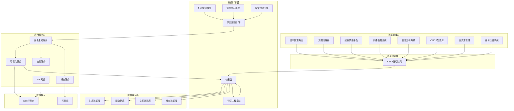
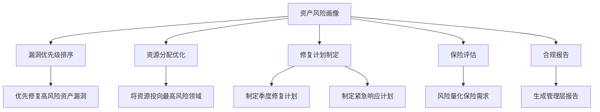
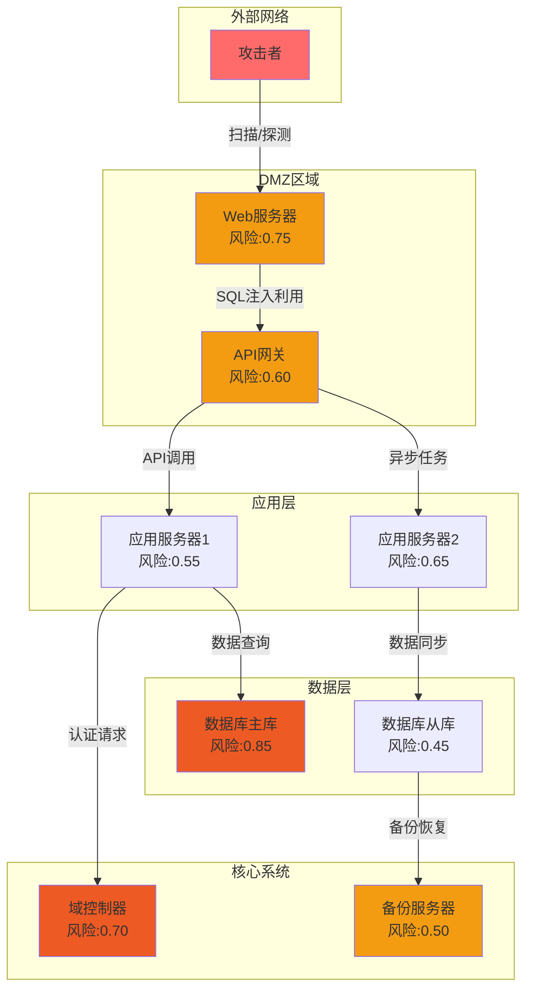
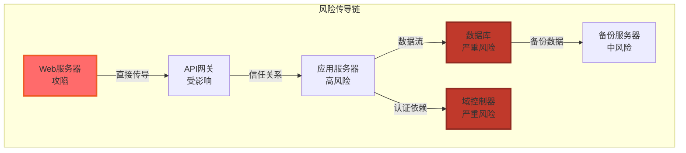
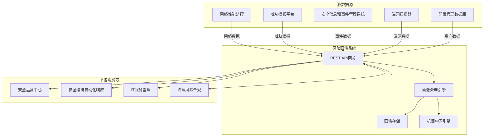

**作者：** HOS(安全风信子)
**日期：** 2026-04-24
**主要来源平台：** GitHub/arXiv
**摘要：** 每台服务器都有其独特的安全风险画像，如同人的健康档案一般重要。传统的资产风险评估往往是静态的、离散的，缺乏对风险动态变化的感知能力。本文深入探讨AI驱动的资产风险画像自动生成技术，通过多维度数据融合、实时风险评估、智能预测等核心能力，帮助企业为每台资产建立动态、立体、持续更新的风险画像，让安全管理有的放矢。

@[TOC](目录)

---

# 一键生成资产风险档案：AI风险画像让安全管理有的放矢

## 1. 引言：从静态评分到动态画像

传统资产风险评估的局限性在于其静态性和片面性。企业通常采用定期扫描的方式评估资产风险，扫描结果可能在一周甚至一个月后才被使用。这种静态评估难以捕捉资产的实时风险状态，也难以反映风险随时间的动态变化。

更关键的是，传统评估方法往往只看漏洞本身，而忽视了资产的多维风险特征。一台服务器的真正风险不仅取决于它存在哪些漏洞，还取决于它的业务重要性、数据敏感性、暴露程度、历史行为等多种因素。

AI驱动的资产风险画像为这一问题提供了解决方案。通过持续采集资产的多维度数据，运用机器学习算法进行综合分析，AI系统能够为每台资产建立动态更新的风险画像。这个画像不仅反映当前风险状态，还能预测未来风险趋势，为安全决策提供更全面的支持。

## 2. 资产风险画像的多维框架

### 2.1 风险画像维度设计

资产风险画像是一个多维度的综合评估框架，涵盖资产基础信息、漏洞特征、威胁态势、暴露情况、行为模式等多个维度。

```python
class AssetRiskProfile:
    """
    资产风险画像
    多维度资产风险评估框架
    """

    PROFILE_DIMENSIONS = {
        'identity': {
            'name': '资产标识',
            'weight': 0.10,
            'features': [
                'asset_type',
                'os_version',
                'hardware_specs',
                'business_criticality',
                'data_classification'
            ]
        },
        'vulnerability': {
            'name': '漏洞维度',
            'weight': 0.30,
            'features': [
                'critical_vuln_count',
                'high_vuln_count',
                'vuln_age',
                'vuln_exploitability',
                'vuln_remediation_status'
            ]
        },
        'threat': {
            'name': '威胁维度',
            'weight': 0.20,
            'features': [
                'threat_intel_matches',
                'recent_attack_trends',
                'exploit_kit_availability',
                'threat_actor_interest'
            ]
        },
        'exposure': {
            'name': '暴露维度',
            'weight': 0.25,
            'features': [
                'internet_exposed',
                'vpn_accessible',
                'internal_network_access',
                'direct_network_access'
            ]
        },
        'behavior': {
            'name': '行为维度',
            'weight': 0.15,
            'features': [
                'access_pattern_anomaly',
                'traffic_pattern_anomaly',
                'configuration_changes',
                'privilege_escalation_attempts'
            ]
        }
    }

    def __init__(self, asset_id):
        self.asset_id = asset_id
        self.profile = {}
        self.dimensions = {}
        self.overall_score = 0.0
        self.last_updated = None

    def add_dimension(self, dimension_name, dimension_data):
        """添加维度数据"""
        dimension_config = self.PROFILE_DIMENSIONS.get(dimension_name)
        if not dimension_config:
            raise ValueError(f"Unknown dimension: {dimension_name}")

        self.dimensions[dimension_name] = {
            'config': dimension_config,
            'data': dimension_data,
            'score': self._calculate_dimension_score(dimension_data, dimension_config)
        }

    def calculate_overall_score(self):
        """计算总体风险分数"""
        weighted_scores = []
        total_weight = 0.0

        for dim_name, dim_info in self.dimensions.items():
            weight = dim_info['config']['weight']
            score = dim_info['score']
            weighted_scores.append(score * weight)
            total_weight += weight

        self.overall_score = sum(weighted_scores) / total_weight if total_weight > 0 else 0.0
        self.last_updated = datetime.now()

        return self.overall_score

    def _calculate_dimension_score(self, data, config):
        """计算维度分数"""
        score = 0.0
        features = config['features']

        for feature in features:
            if feature in data:
                score += self._normalize_feature_score(feature, data[feature])

        return score / len(features) if features else 0.0

    def to_dict(self):
        """转换为字典"""
        return {
            'asset_id': self.asset_id,
            'overall_score': round(self.overall_score, 3),
            'risk_level': self.get_risk_level(),
            'dimensions': {
                name: {
                    'score': round(info['score'], 3),
                    'data': info['data']
                }
                for name, info in self.dimensions.items()
            },
            'last_updated': self.last_updated.isoformat() if self.last_updated else None
        }
```

### 2.1.5 资产分类体系

AI资产风险画像系统需要建立完善的资产分类体系，以适应不同行业、不同业务场景的风险评估需求。资产分类不仅影响风险权重分配，还决定了数据采集策略和监控粒度。

```python
class AssetTaxonomy:
    """
    资产分类体系
    支持多维度的资产分类与分级
    """

    ASSET_CATEGORIES = {
        'infrastructure': {
            'name': '基础设施类',
            'weight_multiplier': 1.2,
            'subcategories': {
                'server': {'name': '服务器', 'criticality_levels': ['critical', 'high', 'medium', 'low']},
                'network_device': {'name': '网络设备', 'criticality_levels': ['critical', 'high', 'medium', 'low']},
                'security_device': {'name': '安全设备', 'criticality_levels': ['critical', 'high', 'medium', 'low']},
                'storage': {'name': '存储设备', 'criticality_levels': ['critical', 'high', 'medium', 'low']}
            }
        },
        'application': {
            'name': '应用系统类',
            'weight_multiplier': 1.1,
            'subcategories': {
                'web_application': {'name': 'Web应用', 'criticality_levels': ['critical', 'high', 'medium', 'low']},
                'api_service': {'name': 'API服务', 'criticality_levels': ['critical', 'high', 'medium', 'low']},
                'database': {'name': '数据库', 'criticality_levels': ['critical', 'high', 'medium', 'low']},
                'middleware': {'name': '中间件', 'criticality_levels': ['critical', 'high', 'medium', 'low']}
            }
        },
        'endpoint': {
            'name': '终端设备类',
            'weight_multiplier': 0.9,
            'subcategories': {
                'workstation': {'name': '工作站', 'criticality_levels': ['high', 'medium', 'low']},
                'laptop': {'name': '笔记本', 'criticality_levels': ['high', 'medium', 'low']},
                'mobile_device': {'name': '移动设备', 'criticality_levels': ['medium', 'low']},
                'iot_device': {'name': '物联网设备', 'criticality_levels': ['medium', 'low']}
            }
        },
        'cloud_resource': {
            'name': '云资源类',
            'weight_multiplier': 1.0,
            'subcategories': {
                'vm_instance': {'name': '虚拟机实例', 'criticality_levels': ['critical', 'high', 'medium', 'low']},
                'container': {'name': '容器', 'criticality_levels': ['high', 'medium', 'low']},
                'serverless': {'name': '无服务器函数', 'criticality_levels': ['medium', 'low']},
                'storage_bucket': {'name': '存储桶', 'criticality_levels': ['high', 'medium', 'low']}
            }
        }
    }

    INDUSTRY_RISK_PROFILES = {
        'finance': {
            'name': '金融行业',
            'risk_factors': {
                'data_sensitivity': 0.95,
                'regulatory_compliance': 0.90,
                'financial_impact': 0.95,
                'reputational_impact': 0.85
            },
            'recommended_weights': {
                'vulnerability': 0.25,
                'threat': 0.25,
                'exposure': 0.20,
                'behavior': 0.15,
                'identity': 0.15
            }
        },
        'healthcare': {
            'name': '医疗健康行业',
            'risk_factors': {
                'data_sensitivity': 0.98,
                'regulatory_compliance': 0.95,
                'safety_impact': 0.90,
                'privacy_impact': 0.95
            },
            'recommended_weights': {
                'vulnerability': 0.30,
                'threat': 0.20,
                'exposure': 0.20,
                'behavior': 0.15,
                'identity': 0.15
            }
        },
        'e-commerce': {
            'name': '电子商务行业',
            'risk_factors': {
                'transaction_security': 0.95,
                'availability': 0.90,
                'data_protection': 0.85,
                'customer_trust': 0.80
            },
            'recommended_weights': {
                'vulnerability': 0.25,
                'threat': 0.30,
                'exposure': 0.25,
                'behavior': 0.10,
                'identity': 0.10
            }
        },
        'manufacturing': {
            'name': '制造业',
            'risk_factors': {
                'operational_continuity': 0.90,
                'intellectual_property': 0.85,
                'physical_safety': 0.80,
                'supply_chain': 0.75
            },
            'recommended_weights': {
                'vulnerability': 0.20,
                'threat': 0.20,
                'exposure': 0.25,
                'behavior': 0.20,
                'identity': 0.15
            }
        },
        'government': {
            'name': '政府机构',
            'risk_factors': {
                'national_security': 0.95,
                'citizen_data': 0.90,
                'service_availability': 0.85,
                'regulatory_compliance': 0.95
            },
            'recommended_weights': {
                'vulnerability': 0.30,
                'threat': 0.25,
                'exposure': 0.15,
                'behavior': 0.15,
                'identity': 0.15
            }
        }
    }

    def classify_asset(self, asset_info):
        """
        资产分类

        参数:
            asset_info: 资产信息字典

        返回:
            dict: 分类结果
        """
        category = asset_info.get('category', 'infrastructure')
        subcategory = asset_info.get('subcategory', 'server')
        industry = asset_info.get('industry', 'general')

        category_config = self.ASSET_CATEGORIES.get(category, self.ASSET_CATEGORIES['infrastructure'])
        industry_config = self.INDUSTRY_RISK_PROFILES.get(industry, {})

        return {
            'primary_category': category,
            'category_name': category_config['name'],
            'subcategory': subcategory,
            'weight_multiplier': category_config['weight_multiplier'],
            'industry_profile': industry,
            'industry_name': industry_config.get('name', '通用'),
            'recommended_weights': industry_config.get('recommended_weights', {}),
            'risk_factors': industry_config.get('risk_factors', {})
        }

    def calculate_criticality_score(self, asset_info):
        """计算资产关键性评分"""
        business_impact = asset_info.get('business_impact', 0.5)
        data_sensitivity = asset_info.get('data_sensitivity', 0.5)
        availability_requirement = asset_info.get('availability_requirement', 0.5)
        regulatory_importance = asset_info.get('regulatory_importance', 0.5)

        criticality = (
            business_impact * 0.35 +
            data_sensitivity * 0.25 +
            availability_requirement * 0.25 +
            regulatory_importance * 0.15
        )

        return min(criticality, 1.0)
```

资产分类体系需要支持多维度的分类视图。从业务角度，资产可以分为核心资产、重要资产和一般资产；从技术角度，可以按基础设施、应用系统、终端设备、云资源等分类；从安全角度，可以按数据敏感性、合规要求等分类。不同分类维度服务于不同的风险管理目的。

### 2.1.6 资产分组与批量画像

在大规模企业环境中，资产数量可能达到数万甚至数十万台。AI画像系统需要支持资产分组管理，实现批量画像生成和组级别风险评估。

```python
class AssetGroupManager:
    """
    资产分组管理器
    支持资产的逻辑分组与批量画像管理
    """

    def __init__(self, profile_engine):
        self.profile_engine = profile_engine
        self.groups = {}
        self.group_hierarchy = {}

    def create_asset_group(self, group_id, group_name, group_type, criteria=None):
        """
        创建资产分组

        参数:
            group_id: 分组ID
            group_name: 分组名称
            group_type: 分组类型（static/dynamic）
            criteria: 动态分组条件

        返回:
            dict: 分组信息
        """
        self.groups[group_id] = {
            'group_id': group_id,
            'group_name': group_name,
            'group_type': group_type,
            'criteria': criteria,
            'member_assets': [],
            'created_at': datetime.now(),
            'last_updated': datetime.now()
        }

        return self.groups[group_id]

    def add_asset_to_group(self, group_id, asset_id):
        """将资产添加到分组"""
        if group_id not in self.groups:
            raise ValueError(f"Group not found: {group_id}")

        group = self.groups[group_id]
        if asset_id not in group['member_assets']:
            group['member_assets'].append(asset_id)
            group['last_updated'] = datetime.now()

    def calculate_group_risk_profile(self, group_id):
        """计算分组风险画像"""
        if group_id not in self.groups:
            raise ValueError(f"Group not found: {group_id}")

        group = self.groups[group_id]
        asset_ids = group['member_assets']

        if not asset_ids:
            return {
                'status': 'empty_group',
                'group_id': group_id
            }

        asset_profiles = []
        for asset_id in asset_ids:
            profile = self.profile_engine.get_profile(asset_id)
            if profile:
                asset_profiles.append(profile)

        if not asset_profiles:
            return {
                'status': 'no_profiles',
                'group_id': group_id
            }

        return self._aggregate_group_profile(group, asset_profiles)

    def _aggregate_group_profile(self, group, profiles):
        """聚合分组画像"""
        scores = [p.overall_score for p in profiles]

        aggregated = {
            'group_id': group['group_id'],
            'group_name': group['group_name'],
            'asset_count': len(profiles),
            'avg_risk_score': sum(scores) / len(scores),
            'max_risk_score': max(scores),
            'min_risk_score': min(scores),
            'risk_distribution': self._calculate_risk_distribution(scores),
            'top_risk_assets': self._get_top_risk_assets(profiles, top_n=5),
            'dimension_summary': self._aggregate_dimension_scores(profiles),
            'risk_concentration': self._calculate_risk_concentration(scores)
        }

        return aggregated

    def _calculate_risk_distribution(self, scores):
        """计算风险分布"""
        distribution = {
            'critical': 0,
            'high': 0,
            'medium': 0,
            'low': 0,
            'info': 0
        }

        for score in scores:
            if score >= 0.8:
                distribution['critical'] += 1
            elif score >= 0.6:
                distribution['high'] += 1
            elif score >= 0.4:
                distribution['medium'] += 1
            elif score >= 0.2:
                distribution['low'] += 1
            else:
                distribution['info'] += 1

        total = len(scores)
        return {k: f"{(v/total)*100:.1f}%" for k, v in distribution.items()}

    def _aggregate_dimension_scores(self, profiles):
        """聚合维度分数"""
        dimensions = ['vulnerability', 'threat', 'exposure', 'behavior', 'identity']
        aggregated = {}

        for dim in dimensions:
            dim_scores = []
            for profile in profiles:
                if dim in profile.dimensions:
                    dim_scores.append(profile.dimensions[dim]['score'])

            if dim_scores:
                aggregated[dim] = {
                    'avg': sum(dim_scores) / len(dim_scores),
                    'max': max(dim_scores),
                    'min': min(dim_scores)
                }

        return aggregated
```

资产分组策略需要结合企业实际组织架构和业务特点。常见的分组维度包括：按业务系统分组（如电商系统、银行核心系统）、按所属部门分组（如研发部、市场部）、按网络区域分组（如DMZ区、内网区）、按资产类型分组（如Windows服务器、Linux服务器）。分组粒度太粗会导致风险分散无法识别重点，粒度太细则会增加管理复杂度。

## 2.2 风险评分算法

资产风险评分需要综合考虑多个因素，并进行科学的量化。

```python
class RiskScoringEngine:
    """
    风险评分引擎
    综合多因素计算风险分数
    """

    def __init__(self, config):
        self.config = config
        self.weights = config.get('weights', {})

    def calculate_risk_score(self, profile):
        """
        计算综合风险分数

        参数:
            profile: 资产风险画像

        返回:
            dict: 评分结果
        """
        vulnerability_score = self._score_vulnerability(profile)
        threat_score = self._score_threat(profile)
        exposure_score = self._score_exposure(profile)
        behavior_score = self._score_behavior(profile)
        asset_value_score = self._score_asset_value(profile)

        overall = (
            vulnerability_score * self.weights.get('vulnerability', 0.35) +
            threat_score * self.weights.get('threat', 0.20) +
            exposure_score * self.weights.get('exposure', 0.20) +
            behavior_score * self.weights.get('behavior', 0.15) +
            asset_value_score * self.weights.get('asset_value', 0.10)
        )

        confidence = self._calculate_confidence(profile)

        return {
            'overall_score': round(overall, 3),
            'component_scores': {
                'vulnerability': round(vulnerability_score, 3),
                'threat': round(threat_score, 3),
                'exposure': round(exposure_score, 3),
                'behavior': round(behavior_score, 3),
                'asset_value': round(asset_value_score, 3)
            },
            'confidence': round(confidence, 3),
            'risk_level': self._get_risk_level(overall)
        }

    def _score_vulnerability(self, profile):
        """计算漏洞分数"""
        vuln_data = profile.dimensions.get('vulnerability', {}).get('data', {})

        critical = vuln_data.get('critical_vuln_count', 0)
        high = vuln_data.get('high_vuln_count', 0)

        base_score = min(critical * 0.15 + high * 0.08, 1.0)

        exploit_available = vuln_data.get('exploit_available', False)
        if exploit_available:
            base_score *= 1.5

        vuln_age = vuln_data.get('avg_vuln_age_days', 0)
        if vuln_age > 180:
            base_score *= 1.3

        return min(base_score, 1.0)
```

### 7.3 系统整体架构图

AI资产风险画像系统的整体架构可以分为数据采集层、分析引擎层和应用服务层三个主要层次。



## 3. AI画像生成引擎

### 3.1 数据采集与融合

画像生成的第一步是数据采集。AI系统从多个数据源采集资产相关信息，并进行融合处理。

```python
class ProfileDataCollector:
    """
    画像数据采集器
    多源数据采集与融合
    """

    def __init__(self, data_sources):
        self.data_sources = data_sources
        self.collectors = {
            'asset_inventory': AssetInventoryCollector(),
            'vulnerability_scanner': VulnScannerCollector(),
            'threat_intel': ThreatIntelCollector(),
            'network_monitor': NetworkMonitorCollector(),
            'siem': SIEMCollector(),
            'cmdb': CMDBCollector()
        }

    def collect_profile_data(self, asset_id):
        """
        采集画像数据

        参数:
            asset_id: 资产标识

        返回:
            dict: 采集的数据
        """
        collected_data = {}

        for source_name, collector in self.collectors.items():
            try:
                data = collector.collect(asset_id)
                collected_data[source_name] = data
            except Exception as e:
                collected_data[source_name] = {'error': str(e)}

        fused_data = self._fuse_data(collected_data)

        return fused_data

    def _fuse_data(self, collected_data):
        """融合多源数据"""
        fused = {}

        fused['identity'] = self._fuse_identity_data(collected_data)
        fused['vulnerability'] = self._fuse_vulnerability_data(collected_data)
        fused['threat'] = self._fuse_threat_data(collected_data)
        fused['exposure'] = self._fuse_exposure_data(collected_data)
        fused['behavior'] = self._fuse_behavior_data(collected_data)

        return fused

    def _fuse_vulnerability_data(self, collected):
        """融合漏洞数据"""
        vuln_data = {}

        if 'vulnerability_scanner' in collected:
            scanner_data = collected['vulnerability_scanner']
            vuln_data['vulns'] = scanner_data.get('vulnerabilities', [])

        if 'threat_intel' in collected:
            intel_data = collected['threat_intel']
            vuln_data['threat_intel'] = intel_data.get('related_threats', [])

        vuln_data['critical_count'] = sum(
            1 for v in vuln_data.get('vulns', [])
            if v.get('severity') == 'critical'
        )
        vuln_data['high_count'] = sum(
            1 for v in vuln_data.get('vulns', [])
            if v.get('severity') == 'high'
        )

        return vuln_data
```

### 3.2 实时更新机制

资产风险画像需要持续更新以反映最新的风险状态。AI系统建立实时更新机制，确保画像的时效性。

```python
class ProfileUpdateManager:
    """
    画像更新管理器
    管理画像的实时更新
    """

    def __init__(self, profile_store, event_bus):
        self.store = profile_store
        self.event_bus = event_bus
        self.update_queue = {}

    def handle_security_event(self, event):
        """
        处理安全事件并更新画像

        参数:
            event: 安全事件
        """
        affected_assets = event.get('affected_assets', [])

        for asset_id in affected_assets:
            self._queue_profile_update(asset_id, event)

    def _queue_profile_update(self, asset_id, event):
        """将更新加入队列"""
        if asset_id not in self.update_queue:
            self.update_queue[asset_id] = []

        self.update_queue[asset_id].append({
            'event': event,
            'queued_at': datetime.now()
        })

    def process_update_queue(self):
        """处理更新队列"""
        for asset_id, updates in self.update_queue.items():
            if not updates:
                continue

            profile = self.store.get_profile(asset_id)

            for update in updates:
                self._apply_update(profile, update['event'])

            profile.calculate_overall_score()
            self.store.save_profile(profile)

        self.update_queue.clear()
```

## 4. 风险预测与趋势分析

### 4.1 风险趋势预测

AI系统不仅能评估当前风险，还能预测未来风险趋势。

```python
class RiskTrendPredictor:
    """
    风险趋势预测器
    预测资产风险演变趋势
    """

    def __init__(self, time_series_db, prediction_model):
        self.ts_db = time_series_db
        self.model = prediction_model

    def predict_risk_trend(self, asset_id, horizon_days=30):
        """
        预测风险趋势

        参数:
            asset_id: 资产标识
            horizon_days: 预测天数

        返回:
            dict: 预测结果
        """
        historical_scores = self.ts_db.get_risk_scores(
            asset_id,
            days=min(90, horizon_days * 2)
        )

        if len(historical_scores) < 7:
            return {
                'status': 'insufficient_data',
                'message': '历史数据不足'
            }

        trend = self._analyze_trend(historical_scores)

        predictions = self._generate_predictions(
            historical_scores,
            horizon_days
        )

        risk_events = self._predict_risk_events(predictions)

        return {
            'asset_id': asset_id,
            'trend': trend,
            'predictions': predictions,
            'risk_events': risk_events,
            'recommended_actions': self._generate_actions(risk_events)
        }

    def _analyze_trend(self, scores):
        """分析风险趋势"""
        if len(scores) < 14:
            return {'direction': 'stable', 'change_rate': 0}

        recent = scores[-14:]
        earlier = scores[:-14]

        recent_avg = sum(s['score'] for s in recent) / len(recent)
        earlier_avg = sum(s['score'] for s in earlier) / len(earlier) if earlier else recent_avg

        change_rate = (recent_avg - earlier_avg) / (earlier_avg + 0.01)

        if change_rate > 0.1:
            direction = 'increasing'
        elif change_rate < -0.1:
            direction = 'decreasing'
        else:
            direction = 'stable'

        return {
            'direction': direction,
            'change_rate': round(change_rate, 3),
            'recent_avg': round(recent_avg, 3),
            'earlier_avg': round(earlier_avg, 3)
        }
```

## 5. 画像可视化与报告

### 5.1 多维度可视化

资产风险画像需要以直观的方式呈现给决策者。AI系统提供多维度的可视化展示。

```python
class RiskProfileVisualizer:
    """
    风险画像可视化器
    生成风险画像可视化
    """

    def generate_radar_chart(self, profile):
        """生成雷达图"""
        dimensions = list(profile.dimensions.keys())
        scores = [profile.dimensions[d]['score'] for d in dimensions]

        radar_data = {
            'labels': [self.DIMENSION_LABELS.get(d, d) for d in dimensions],
            'datasets': [{
                'label': profile.asset_id,
                'data': scores,
                'backgroundColor': 'rgba(54, 162, 235, 0.2)',
                'borderColor': 'rgba(54, 162, 235, 1)',
                'pointBackgroundColor': 'rgba(54, 162, 235, 1)'
            }]
        }

        return radar_data

    def generate_risk_timeline(self, asset_id, historical_scores):
        """生成风险时间线"""
        timeline = []

        for score_record in historical_scores:
            timeline.append({
                'date': score_record['timestamp'].isoformat(),
                'score': score_record['score'],
                'level': self._get_risk_level(score_record['score']),
                'events': score_record.get('related_events', [])
            })

        return timeline
```

## 6. 实战应用案例

### 6.1 案例一：某金融机构风险画像应用

某大型金融机构部署了AI资产风险画像系统后，实现了安全管理的精细化运营。

系统为全行3000多台服务器生成了动态风险画像，每台服务器的风险状态一目了然。安全团队可以根据风险画像进行优先级排序，将有限的精力投入到最高风险的资产上。

在一次漏洞应急响应中，系统快速识别出最需要优先修复的资产——不是漏洞最多的资产，而是漏洞虽然不多但业务重要性极高且暴露在互联网上的资产。这种基于画像的优先级排序大大提高了应急响应效率。

### 6.2 案例二：某互联网公司风险画像应用

某互联网公司在安全运营中发现，传统的漏洞扫描结果与实际风险存在较大差异。一台测试服务器虽然只有一个中危漏洞，但由于其运行着即将停止维护的CentOS 6操作系统，且处于DMZ区域，实际风险远高于单纯的漏洞评分。

部署AI资产风险画像系统后，系统综合考虑了漏洞特征、操作系统生命周期、暴露程度、业务重要性等多个维度，准确评估了该测试服务器的真实风险。安全团队据此优先安排了该服务器的系统升级和漏洞修复工作。

### 6.3 案例三：某制造企业风险预测应用

某制造企业在年度安全评估中希望预测哪些资产在未来可能成为高风险资产。传统的评估方法只能评估当前风险，无法预测未来趋势。

AI风险预测系统通过分析历史风险数据、设备年龄趋势、漏洞发现频率等指标，成功预测出了23台在未来3个月内风险将显著上升的服务器。安全团队提前对这些服务器进行了加固和监控，有效避免了潜在的安全事件。

### 6.4 案例四：某云服务提供商风险画像应用

某大型云服务提供商在多租户环境中面临复杂的安全挑战。传统的单租户风险评估方法无法准确识别跨租户的风险传导，也无法有效检测针对云平台特有攻击向量的威胁。

部署AI资产风险画像系统后，该云服务提供商实现了以下核心能力：

**多维度租户风险隔离分析**：系统对不同租户的资产进行独立的风险画像构建，同时分析租户间的共享资源（如共享数据库、负载均衡器）的风险传导路径。当某一租户的高风险资产可能影响其他租户时，系统能够提前预警并触发隔离措施。

**云原生威胁检测**：针对容器逃逸、无服务器函数滥用、API Gateway攻击等云原生特有的攻击向量，AI系统构建了专门的检测模型。通过分析云平台审计日志、容器运行时行为、函数调用模式等数据，系统能够识别传统安全工具难以发现的云原生攻击。

**动态资源风险评估**：在云环境中，资源的生命周期短暂且动态变化。AI画像系统与云平台的资源调度系统集成，能够在资源创建时即开始采集数据，实现从"出生"到"销毁"的全生命周期风险追踪。

实际运营数据显示，该云服务提供商在部署AI画像系统后，安全事件的平均检测时间从48小时缩短到4小时，安全事件的跨租户传播风险降低了85%，高风险资源的平均生命周期风险评估准确率达到92%。

```python
class CloudNativeRiskAssessment:
    """
    云原生风险评估
    针对云环境特有的风险评估
    """

    def __init__(self, cloud_platform_client):
        self.cloud_client = cloud_platform_client
        self.threat_models = self._load_cloud_threat_models()

    def _load_cloud_threat_models(self):
        """加载云原生威胁模型"""
        return {
            'container_escape': {
                'indicators': [
                    'privileged_container',
                    'host_mount_access',
                    'container_sock_mount',
                    'unsafe_capabilities'
                ],
                'risk_weight': 0.95
            },
            'serverless_abuse': {
                'indicators': [
                    'excessive_permissions',
                    'long_running_functions',
                    'unexpected_outbound_connections',
                    'sensitive_data_access_patterns'
                ],
                'risk_weight': 0.75
            },
            'api_gateway_misuse': {
                'indicators': [
                    'rate_limit_bypass',
                    'auth_bypass_attempts',
                    'unusual_endpoint_access',
                    'payload_size_anomalies'
                ],
                'risk_weight': 0.70
            },
            'cross_tenant_breach': {
                'indicators': [
                    'shared_resource_overload',
                    'tenant_isolation_violation',
                    'data_ leakage_signals'
                ],
                'risk_weight': 0.90
            }
        }

    def assess_serverless_risk(self, function_id):
        """评估无服务器函数风险"""
        function_config = self.cloud_client.get_function_config(function_id)

        permissions_risk = self._assess_permissions_risk(function_config)

        runtime_risk = self._assess_runtime_risk(function_id)

        data_access_risk = self._assess_data_access_risk(function_config)

        overall_risk = (
            permissions_risk * 0.4 +
            runtime_risk * 0.3 +
            data_access_risk * 0.3
        )

        return {
            'function_id': function_id,
            'overall_risk_score': round(overall_risk, 3),
            'risk_breakdown': {
                'permissions': permissions_risk,
                'runtime': runtime_risk,
                'data_access': data_access_risk
            },
            'recommendations': self._generate_serverless_recommendations(
                permissions_risk, runtime_risk, data_access_risk
            )
        }

    def assess_container_risk(self, container_id):
        """评估容器风险"""
        container_config = self.cloud_client.get_container_config(container_id)

        escape_risk = self._assess_container_escape_risk(container_config)

        image_risk = self._assess_container_image_risk(container_config)

        runtime_risk = self._assess_container_runtime_risk(container_id)

        isolation_risk = self._assess_tenant_isolation(container_config)

        overall_risk = (
            escape_risk * 0.40 +
            image_risk * 0.25 +
            runtime_risk * 0.20 +
            isolation_risk * 0.15
        )

        return {
            'container_id': container_id,
            'overall_risk_score': round(overall_risk, 3),
            'threat_indicators': self._identify_threat_indicators(container_config),
            'recommended_actions': self._generate_container_recommendations(overall_risk)
        }

    def _assess_permissions_risk(self, function_config):
        """评估权限风险"""
        permissions = function_config.get('permissions', [])
        sensitive_apis = ['s3:*', 'dynamodb:*', 'secretsmanager:*', 'kms:*']

        sensitive_count = sum(1 for p in permissions if any(s in p for s in sensitive_apis))

        if sensitive_count > 5:
            return 0.9
        elif sensitive_count > 2:
            return 0.6
        elif sensitive_count > 0:
            return 0.3
        else:
            return 0.1

    def _assess_runtime_risk(self, function_id):
        """评估运行时风险"""
        metrics = self.cloud_client.get_function_metrics(function_id)

        duration_anomaly = self._detect_duration_anomaly(metrics)
        memory_anomaly = self._detect_memory_anomaly(metrics)
        network_anomaly = self._detect_network_anomaly(metrics)

        return (duration_anomaly + memory_anomaly + network_anomaly) / 3

    def assess_cross_tenant_risk(self, shared_resource_id):
        """评估跨租户风险"""
        resource = self.cloud_client.get_shared_resource(shared_resource_id)

        connected_tenants = resource.get('connected_tenants', [])

        tenant_risk_scores = []
        for tenant_id in connected_tenants:
            tenant_risk = self.cloud_client.get_tenant_risk_score(tenant_id)
            tenant_risk_scores.append(tenant_risk)

        if not tenant_risk_scores:
            return 0.0

        max_risk = max(tenant_risk_scores)
        avg_risk = sum(tenant_risk_scores) / len(tenant_risk_scores)

        isolation_score = resource.get('isolation_level', 0.5)

        cross_tenant_risk = (
            max_risk * 0.5 +
            avg_risk * 0.3 +
            (1 - isolation_score) * 0.2
        )

        return min(cross_tenant_risk, 1.0)
```

## 7. AI画像生成的深度技术详解

### 7.1 多源数据融合架构

资产风险画像的核心在于多源数据的融合。AI系统需要从多个数据源采集信息，包括但不限于资产管理系统、漏洞扫描器、威胁情报平台、网络监控系统、日志分析系统、CMDB配置管理数据库等。

这些数据源的数据格式、数据质量、更新频率各不相同，AI系统需要建立统一的数据融合框架。系统首先对原始数据进行标准化处理，将不同格式的数据转换为统一的特征表示；然后进行数据质量评估，过滤低质量数据；最后进行数据关联和融合，生成综合的资产画像特征。

```python
class MultiSourceDataFusion:
    """
    多源数据融合引擎
    实现跨数据源的资产信息融合
    """

    def __init__(self, data_connectors):
        self.connectors = data_connectors
        self.quality_weights = {
            'asset_inventory': 0.90,
            'vulnerability_scanner': 0.85,
            'threat_intel': 0.80,
            'network_monitor': 0.75,
            'siem': 0.70,
            'cmdb': 0.65
        }

    def fuse_asset_data(self, asset_id):
        """
        融合单个资产的多源数据

        参数:
            asset_id: 资产标识

        返回:
            dict: 融合后的资产数据
        """
        raw_data = self._collect_from_all_sources(asset_id)

        quality_assessed = self._assess_data_quality(raw_data)

        normalized = self._normalize_data(quality_assessed)

        fused = self._merge_normalized_data(normalized)

        enriched = self._enrich_with_derived_features(fused)

        return enriched

    def _collect_from_all_sources(self, asset_id):
        """从所有数据源收集数据"""
        collected = {}
        for source_name, connector in self.connectors.items():
            try:
                data = connector.fetch(asset_id)
                collected[source_name] = {
                    'data': data,
                    'timestamp': datetime.now(),
                    'source': source_name,
                    'success': True
                }
            except Exception as e:
                collected[source_name] = {
                    'data': None,
                    'timestamp': datetime.now(),
                    'source': source_name,
                    'success': False,
                    'error': str(e)
                }
        return collected

    def _assess_data_quality(self, raw_data):
        """评估数据质量"""
        quality_assessed = {}
        for source, info in raw_data.items():
            if not info['success']:
                quality_assessed[source] = {
                    **info,
                    'quality_score': 0.0
                }
                continue

            freshness = self._calculate_freshness(info['timestamp'])
            completeness = self._calculate_completeness(info['data'])
            consistency = self._calculate_consistency(info['data'])

            base_weight = self.quality_weights.get(source, 0.5)
            quality_score = base_weight * (freshness * 0.3 + completeness * 0.4 + consistency * 0.3)

            quality_assessed[source] = {
                **info,
                'quality_score': quality_score,
                'quality_breakdown': {
                    'freshness': freshness,
                    'completeness': completeness,
                    'consistency': consistency
                }
            }

        return quality_assessed

    def _merge_normalized_data(self, normalized_data):
        """合并归一化后的数据"""
        merged = {}

        for source, data in normalized_data.items():
            if data is None:
                continue

            quality = self.quality_weights.get(source, 0.5)

            for key, value in data.items():
                if key not in merged:
                    merged[key] = {'value': None, 'total_weight': 0, 'weighted_sum': 0}

                merged[key]['weighted_sum'] += value * quality
                merged[key]['total_weight'] += quality

        for key in merged:
            if merged[key]['total_weight'] > 0:
                merged[key]['value'] = merged[key]['weighted_sum'] / merged[key]['total_weight']

        return {k: v['value'] for k, v in merged.items()}
```

### 7.2 特征工程与维度计算

资产风险画像的核心是特征工程。AI系统需要从原始数据中提取有意义的特征，并计算各个风险维度的分数。

```python
class RiskFeatureEngineering:
    """
    风险特征工程
    提取和计算资产风险特征
    """

    def __init__(self):
        self.feature_extractors = {
            'vulnerability': VulnFeatureExtractor(),
            'threat': ThreatFeatureExtractor(),
            'exposure': ExposureFeatureExtractor(),
            'behavior': BehaviorFeatureExtractor(),
            'identity': IdentityFeatureExtractor()
        }

    def extract_features(self, fused_data):
        """
        提取风险特征

        参数:
            fused_data: 融合后的资产数据

        返回:
            dict: 提取的特征
        """
        features = {}

        for dimension, extractor in self.feature_extractors.items():
            try:
                dimension_features = extractor.extract(fused_data)
                features[dimension] = dimension_features
            except Exception as e:
                features[dimension] = {'error': str(e)}

        return features

    def calculate_dimension_scores(self, features):
        """
        计算维度分数

        参数:
            features: 提取的特征

        返回:
            dict: 各维度分数
        """
        scores = {}

        scores['vulnerability'] = self._calculate_vuln_score(features.get('vulnerability', {}))
        scores['threat'] = self._calculate_threat_score(features.get('threat', {}))
        scores['exposure'] = self._calculate_exposure_score(features.get('exposure', {}))
        scores['behavior'] = self._calculate_behavior_score(features.get('behavior', {}))
        scores['identity'] = self._calculate_identity_score(features.get('identity', {}))

        return scores

    def _calculate_vuln_score(self, vuln_features):
        """计算漏洞维度分数"""
        if not vuln_features or 'error' in vuln_features:
            return 0.0

        critical_vulns = vuln_features.get('critical_count', 0)
        high_vulns = vuln_features.get('high_count', 0)
        medium_vulns = vuln_features.get('medium_count', 0)
        low_vulns = vuln_features.get('low_count', 0)

        base_score = (
            critical_vulns * 1.0 +
            high_vulns * 0.5 +
            medium_vulns * 0.2 +
            low_vulns * 0.05
        ) / 10.0

        exploit_multiplier = 1.5 if vuln_features.get('has_exploitable', False) else 1.0
        age_multiplier = 1.0 + (vuln_features.get('avg_age_days', 0) / 365.0) * 0.5

        final_score = min(base_score * exploit_multiplier * age_multiplier, 1.0)

        return final_score
```

### 7.3 机器学习风险预测模型

AI系统不仅能评估当前风险，还能预测未来风险趋势。通过分析历史风险数据，机器学习模型能够识别风险变化的模式。

```python
class RiskPredictionModel:
    """
    风险预测模型
    基于机器学习的风险趋势预测
    """

    def __init__(self, model_config):
        self.model = self._load_model(model_config)
        self.feature_transformer = FeatureTransformer()
        self.prediction_horizons = [7, 14, 30, 90]

    def predict_risk_trend(self, asset_id, horizon_days=30):
        """
        预测风险趋势

        参数:
            asset_id: 资产标识
            horizon_days: 预测时间范围

        返回:
            dict: 预测结果
        """
        historical_data = self._get_historical_features(asset_id)

        if len(historical_data) < 30:
            return {
                'status': 'insufficient_data',
                'message': '需要至少30天的历史数据',
                'asset_id': asset_id
            }

        current_features = historical_data[-1]
        historical_features = historical_data[:-1]

        trend_analysis = self._analyze_historical_trend(historical_features)

        predictions = {}
        for horizon in self.prediction_horizons:
            if horizon <= horizon_days:
                predictions[horizon] = self._predict_at_horizon(
                    current_features,
                    trend_analysis,
                    horizon
                )

        risk_trajectory = self._generate_risk_trajectory(
            current_features,
            predictions
        )

        risk_events = self._predict_risk_events(
            predictions,
            current_features
        )

        return {
            'asset_id': asset_id,
            'current_risk': current_features.get('overall_risk_score', 0),
            'predictions': predictions,
            'trend_analysis': trend_analysis,
            'risk_trajectory': risk_trajectory,
            'predicted_risk_events': risk_events,
            'confidence': self._calculate_prediction_confidence(historical_data),
            'recommendations': self._generate_recommendations(risk_events)
        }

    def _analyze_historical_trend(self, historical_features):
        """分析历史趋势"""
        risk_scores = [f.get('overall_risk_score', 0) for f in historical_features]

        if len(risk_scores) < 7:
            return {'pattern': 'insufficient_data'}

        recent_scores = risk_scores[-14:]
        older_scores = risk_scores[:-14] if len(risk_scores) > 14 else risk_scores[:7]

        recent_avg = sum(recent_scores) / len(recent_scores)
        older_avg = sum(older_scores) / len(older_scores)

        slope = (recent_avg - older_avg) / len(risk_scores)

        if slope > 0.05:
            pattern = 'increasing'
        elif slope < -0.05:
            pattern = 'decreasing'
        else:
            pattern = 'stable'

        volatility = self._calculate_volatility(risk_scores)

        return {
            'pattern': pattern,
            'slope': slope,
            'recent_avg': recent_avg,
            'volatility': volatility,
            'direction_confidence': 1.0 - volatility
        }
```

## 8. 风险画像在安全运营中的应用

### 8.1 基于画像的漏洞优先级排序

传统的漏洞管理往往按CVSS评分排序，但这种方法忽略了资产的业务上下文。AI风险画像能够提供更精准的优先级排序。

```python
class ProfileBasedVulnPrioritization:
    """
    基于画像的漏洞优先级排序
    利用资产风险画像优化漏洞修复优先级
    """

    def __init__(self, risk_profile_engine):
        self.profile_engine = risk_profile_engine

    def prioritize_vulnerabilities(self, vuln_list):
        """
        优先级排序

        参数:
            vuln_list: 漏洞列表

        返回:
            list: 排序后的漏洞列表
        """
        prioritized = []

        for vuln in vuln_list:
            affected_assets = vuln.get('affected_assets', [])

            asset_priorities = []
            for asset_id in affected_assets:
                profile = self.profile_engine.get_profile(asset_id)

                combined_priority = self._calculate_combined_priority(
                    vuln,
                    profile
                )

                asset_priorities.append({
                    'asset_id': asset_id,
                    'priority': combined_priority,
                    'profile': profile
                })

            asset_priorities.sort(key=lambda x: x['priority'], reverse=True)

            prioritized.append({
                'vuln': vuln,
                'affected_assets_prioritized': asset_priorities,
                'highest_priority_asset': asset_priorities[0] if asset_priorities else None,
                'overall_priority': asset_priorities[0]['priority'] if asset_priorities else 0
            })

        prioritized.sort(key=lambda x: x['overall_priority'], reverse=True)

        return prioritized

    def _calculate_combined_priority(self, vuln, profile):
        """计算综合优先级"""
        vuln_severity = self._map_cvss_to_score(vuln.get('cvss_score', 0))

        asset_risk = profile.get('overall_score', 0.5)

        exposure_level = profile.get('dimensions', {}).get('exposure', {}).get('score', 0.5)

        business_impact = profile.get('dimensions', {}).get('identity', {}).get('score', 0.5)

        combined_priority = (
            vuln_severity * 0.4 +
            asset_risk * 0.3 +
            exposure_level * 0.2 +
            business_impact * 0.1
        )

        return combined_priority
```

### 8.2 风险画像驱动的安全决策

AI风险画像为安全决策提供了数据支撑。安全团队可以根据画像数据做出更明智的决策。



### 8.3 持续风险监控与告警

AI风险画像支持持续监控，及时发现风险变化。

```python
class ContinuousRiskMonitoring:
    """
    持续风险监控
    实时监控资产风险变化
    """

    def __init__(self, profile_store, alerting_system):
        self.profile_store = profile_store
        self.alerting = alerting_system
        self.baseline_window = 30
        self.alert_thresholds = {
            'risk_increase': 0.2,
            'risk_spike': 0.5,
            'new_critical_vuln': 1.0
        }

    def monitor_asset(self, asset_id):
        """
        监控单个资产

        参数:
            asset_id: 资产标识

        返回:
            dict: 监控结果
        """
        current_profile = self.profile_store.get_current(asset_id)

        baseline = self.profile_store.get_baseline(
            asset_id,
            window_days=self.baseline_window
        )

        if not baseline:
            return {
                'status': 'no_baseline',
                'asset_id': asset_id
            }

        risk_change = current_profile.overall_score - baseline.get('avg_score', 0)

        alerts = []

        if risk_change > self.alert_thresholds['risk_spike']:
            alerts.append({
                'type': 'risk_spike',
                'severity': 'critical',
                'change': risk_change,
                'message': f"资产风险急剧上升，当前{risk_change:.2%}"
            })
        elif risk_change > self.alert_thresholds['risk_increase']:
            alerts.append({
                'type': 'risk_increase',
                'severity': 'warning',
                'change': risk_change,
                'message': f"资产风险显著上升，当前{risk_change:.2%}"
            })

        dimension_changes = self._check_dimension_changes(
            current_profile,
            baseline
        )
        for dim, change in dimension_changes.items():
            if change > 0.3:
                alerts.append({
                    'type': 'dimension_change',
                    'severity': 'info',
                    'dimension': dim,
                    'change': change,
                    'message': f"{dim}维度风险发生变化"
                })

        for alert in alerts:
            self.alerting.send_alert(asset_id, alert)

        return {
            'asset_id': asset_id,
            'current_risk': current_profile.overall_score,
            'baseline_risk': baseline.get('avg_score', 0),
            'risk_change': risk_change,
            'alerts_generated': len(alerts),
            'alerts': alerts
        }
```

## 9. 最佳实践与建议

### 9.1 实施路线图

企业在部署AI资产风险画像系统时，建议采用分阶段的实施路线图。

**第一阶段（1-3个月）：基础建设**
- 数据源整合：连接主要的数据源，包括资产管理系统、漏洞扫描器、CMDB等
- 数据质量治理：清洗和标准化数据，建立数据质量管理流程
- 基础画像生成：实现基本的风险画像生成功能

**第二阶段（3-6个月）：能力提升**
- 多维度扩展：增加威胁情报、行为分析等数据源
- 机器学习模型：引入机器学习模型进行风险预测
- 自动化响应：实现基于画像的自动化告警和响应

**第三阶段（6-12个月）：优化完善**
- 持续优化：基于实际效果持续优化模型和算法
- 场景扩展：从服务器扩展到网络设备、云资源、容器等
- 生态集成：与SOC平台、SOAR系统、ITSM系统等集成

### 9.2 成功关键因素

实施AI资产风险画像系统的成功关键因素包括：

**数据质量**：风险画像的准确性直接取决于输入数据的质量。企业需要建立完善的数据治理机制，确保数据的完整性、准确性和时效性。

**业务上下文**：技术风险必须与业务上下文结合才能产生真正的价值。安全团队需要与业务团队紧密合作，确保画像中的业务因素得到准确反映。

**持续优化**：AI模型需要持续优化才能保持准确性。企业需要建立模型评估和优化机制，根据实际效果调整模型参数。

**组织协同**：风险画像的应用需要跨部门协作。安全、运维、业务等部门需要共同参与画像的应用和优化。

---

## 10. 攻击路径与风险传导分析

### 10.1 攻击路径建模

AI资产风险画像系统不仅评估单个资产的风险，还需要分析攻击者可能利用的攻击路径。在复杂的企业网络中，攻击者往往通过多步骤、多阶段的方式逐步深入，攻击路径建模能够帮助安全团队识别关键风险节点和潜在的横向移动通道。

```python
class AttackPathModeler:
    """
    攻击路径建模器
    分析和建模资产间的攻击路径
    """

    ATTACK_CHAIN_PHASES = [
        'reconnaissance',
        'initial_access',
        'execution',
        'persistence',
        'privilege_escalation',
        'defense_evasion',
        'credential_access',
        'discovery',
        'lateral_movement',
        'collection',
        'exfiltration',
        'impact'
    ]

    def __init__(self, network_topology, asset_profiles):
        self.topology = network_topology
        self.asset_profiles = asset_profiles
        self.attack_graph = self._build_attack_graph()

    def _build_attack_graph(self):
        """构建攻击图"""
        graph = {
            'nodes': {},
            'edges': [],
            'critical_paths': []
        }

        for asset_id, asset_data in self.topology.items():
            node_risk = self._calculate_node_risk(asset_id)
            graph['nodes'][asset_id] = {
                'asset_id': asset_id,
                'risk_score': node_risk,
                'exposure_level': self._get_exposure_level(asset_id),
                'compromised_probability': 0.0
            }

        for asset_id, asset_data in self.topology.items():
            connections = asset_data.get('connections', [])
            for target_id in connections:
                edge_risk = self._calculate_edge_risk(asset_id, target_id)
                graph['edges'].append({
                    'source': asset_id,
                    'target': target_id,
                    'risk': edge_risk,
                    'attack_complexity': asset_data.get('attack_complexity', 0.5)
                })

        return graph

    def _calculate_node_risk(self, asset_id):
        """计算节点风险"""
        profile = self.asset_profiles.get(asset_id)
        if not profile:
            return 0.5

        base_risk = profile.overall_score

        exposure_multiplier = 1.0
        if profile.dimensions.get('exposure', {}).get('score', 0.5) > 0.7:
            exposure_multiplier = 1.5

        behavior_multiplier = 1.0
        if profile.dimensions.get('behavior', {}).get('score', 0) > 0.6:
            behavior_multiplier = 1.3

        return min(base_risk * exposure_multiplier * behavior_multiplier, 1.0)

    def _get_exposure_level(self, asset_id):
        """获取暴露级别"""
        profile = self.asset_profiles.get(asset_id)
        if not profile:
            return 'unknown'

        exposure_score = profile.dimensions.get('exposure', {}).get('score', 0.5)

        if exposure_score >= 0.8:
            return 'internet_facing'
        elif exposure_score >= 0.5:
            return 'dmz'
        else:
            return 'internal'

    def identify_critical_assets(self):
        """识别关键资产"""
        critical_assets = []

        for asset_id, node in self.attack_graph['nodes'].items():
            if node['risk_score'] > 0.7:
                reachability = self._calculate_asset_reachability(asset_id)
                if reachability > 5:
                    critical_assets.append({
                        'asset_id': asset_id,
                        'risk_score': node['risk_score'],
                        'reachability': reachability,
                        'priority': 'critical'
                    })
                elif reachability > 3:
                    critical_assets.append({
                        'asset_id': asset_id,
                        'risk_score': node['risk_score'],
                        'reachability': reachability,
                        'priority': 'high'
                    })

        critical_assets.sort(key=lambda x: (x['reachability'], x['risk_score']), reverse=True)

        return critical_assets

    def _calculate_asset_reachability(self, asset_id):
        """计算资产可达性（可被多少其他资产访问）"""
        reachability = 0
        for edge in self.attack_graph['edges']:
            if edge['source'] == asset_id or edge['target'] == asset_id:
                reachability += 1
        return reachability

    def find_attack_chains(self, start_assets, target_assets):
        """查找从起始资产到目标资产的攻击链"""
        chains = []

        for start in start_assets:
            for target in target_assets:
                path = self._find_shortest_path(start, target)
                if path:
                    chains.append({
                        'start': start,
                        'target': target,
                        'path': path,
                        'path_risk': self._calculate_path_risk(path),
                        'attack_complexity': self._calculate_path_complexity(path)
                    })

        chains.sort(key=lambda x: x['path_risk'], reverse=True)

        return chains

    def _find_shortest_path(self, start, target):
        """使用BFS查找最短路径"""
        from collections import deque

        visited = {start}
        queue = deque([(start, [start])])

        while queue:
            current, path = queue.popleft()

            if current == target:
                return path

            for edge in self.attack_graph['edges']:
                next_node = None
                if edge['source'] == current and edge['target'] not in visited:
                    next_node = edge['target']
                elif edge['target'] == current and edge['source'] not in visited:
                    next_node = edge['source']

                if next_node:
                    visited.add(next_node)
                    queue.append((next_node, path + [next_node]))

        return None

    def _calculate_path_risk(self, path):
        """计算路径风险"""
        if not path:
            return 0.0

        total_risk = 0.0
        for asset_id in path:
            if asset_id in self.attack_graph['nodes']:
                total_risk += self.attack_graph['nodes'][asset_id]['risk_score']

        edge_risk = 0.0
        for i in range(len(path) - 1):
            for edge in self.attack_graph['edges']:
                if (edge['source'] == path[i] and edge['target'] == path[i+1]) or \
                   (edge['source'] == path[i+1] and edge['target'] == path[i]):
                    edge_risk += edge['risk']
                    break

        return (total_risk / len(path)) * 0.7 + (edge_risk / (len(path) - 1)) * 0.3

    def _calculate_path_complexity(self, path):
        """计算攻击复杂度"""
        complexity = 1.0
        for asset_id in path:
            node = self.attack_graph['nodes'].get(asset_id, {})
            complexity *= (1 + node.get('risk_score', 0.5))

        return min(complexity / 10, 1.0)
```

### 10.2 风险传导网络

在企业网络中，资产之间存在复杂的依赖关系和信任关系。当一个资产被攻击者控制后，风险可能沿着这些关系传导到其他资产，形成风险传导链。AI画像系统需要构建风险传导网络，分析风险如何在资产之间传播。

```python
class RiskPropagationAnalyzer:
    """
    风险传导分析器
    分析风险在资产网络中的传导机制
    """

    def __init__(self, dependency_graph, trust_relationships):
        self.dependency_graph = dependency_graph
        self.trust_relationships = trust_relationships
        self.propagation_model = self._initialize_propagation_model()

    def _initialize_propagation_model(self):
        """初始化传导模型"""
        return {
            'direct_trust': 0.95,
            'indirect_trust': 0.70,
            'network_connection': 0.50,
            'data_flow': 0.85,
            'authentication_dependency': 0.75
        }

    def calculate_propagation_risk(self, compromised_asset_id, scope='all'):
        """
        计算风险传导

        参数:
            compromised_asset_id: 被攻陷的资产ID
            scope: 分析范围

        返回:
            dict: 传导风险分析结果
        """
        affected_assets = self._find_affected_assets(compromised_asset_id)

        propagation_tree = self._build_propagation_tree(compromised_asset_id)

        cascade_effects = self._analyze_cascade_effects(affected_assets)

        critical_assets_at_risk = self._identify_critical_assets_at_risk(affected_assets)

        return {
            'compromised_asset': compromised_asset_id,
            'directly_affected_count': len(affected_assets['direct']),
            'indirectly_affected_count': len(affected_assets['indirect']),
            'propagation_tree': propagation_tree,
            'cascade_effects': cascade_effects,
            'critical_assets_at_risk': critical_assets_at_risk,
            'max_propagation_radius': self._calculate_max_radius(affected_assets),
            'recommended_isolation': self._recommend_isolation(compromised_asset_id, affected_assets)
        }

    def _find_affected_assets(self, compromised_asset_id):
        """查找受影响的资产"""
        affected = {
            'direct': [],
            'indirect': []
        }

        trust_related = self.trust_relationships.get(compromised_asset_id, [])
        for asset_id in trust_related:
            if asset_id not in affected['direct']:
                affected['direct'].append(asset_id)

        for trust_asset in trust_related:
            second_hop = self.trust_relationships.get(trust_asset, [])
            for asset_id in second_hop:
                if asset_id != compromised_asset_id and asset_id not in affected['direct']:
                    affected['indirect'].append(asset_id)

        data_related = self._find_data_flow_related(compromised_asset_id)
        for asset_id in data_related:
            if asset_id not in affected['direct'] and asset_id not in affected['indirect']:
                affected['indirect'].append(asset_id)

        return affected

    def _find_data_flow_related(self, asset_id):
        """查找数据流相关资产"""
        related = []
        for source, targets in self.dependency_graph.get('data_flows', {}).items():
            if source == asset_id:
                related.extend(targets)
            if asset_id in targets:
                related.append(source)

        return list(set(related))

    def _build_propagation_tree(self, root_asset_id):
        """构建传导树"""
        tree = {
            'root': root_asset_id,
            'depth': 0,
            'nodes': [{
                'asset_id': root_asset_id,
                'depth': 0,
                'propagation_probability': 1.0,
                'children': []
            }]
        }

        visited = {root_asset_id}
        queue = [(root_asset_id, 0)]

        while queue:
            current, depth = queue.pop(0)

            if depth > 3:
                continue

            related = self.trust_relationships.get(current, [])
            for asset_id in related:
                if asset_id not in visited:
                    visited.add(asset_id)

                    prob = self.propagation_model['direct_trust'] * (0.8 ** depth)

                    node = {
                        'asset_id': asset_id,
                        'depth': depth + 1,
                        'propagation_probability': prob,
                        'children': []
                    }

                    for tree_node in tree['nodes']:
                        if tree_node['asset_id'] == current:
                            tree_node['children'].append(node)
                            break

                    tree['nodes'].append(node)
                    queue.append((asset_id, depth + 1))

        return tree

    def _analyze_cascade_effects(self, affected_assets):
        """分析级联效应"""
        cascade_effects = {
            'authentication_cascade': False,
            'data_breach_risk': 0.0,
            'service_disruption_risk': 0.0,
            'lateral_movement_potential': 0.0
        }

        if len(affected_assets['direct']) > 3:
            cascade_effects['authentication_cascade'] = True
            cascade_effects['lateral_movement_potential'] = 0.8

        all_affected = affected_assets['direct'] + affected_assets['indirect']
        data_sensitive_count = sum(1 for a in all_affected if self._is_data_sensitive(a))
        cascade_effects['data_breach_risk'] = data_sensitive_count / max(len(all_affected), 1)

        critical_services = [a for a in all_affected if self._is_critical_service(a)]
        cascade_effects['service_disruption_risk'] = len(critical_services) / max(len(all_affected), 1)

        return cascade_effects

    def _is_data_sensitive(self, asset_id):
        """判断资产是否敏感数据资产"""
        sensitive_categories = ['database', 'file_server', 'backup_system']
        return any(cat in asset_id.lower() for cat in sensitive_categories)

    def _is_critical_service(self, asset_id):
        """判断资产是否关键服务"""
        critical_services = ['domain_controller', 'dns', 'dhcp', 'mail', 'auth']
        return any(svc in asset_id.lower() for svc in critical_services)

    def _identify_critical_assets_at_risk(self, affected_assets):
        """识别处于风险中的关键资产"""
        critical_at_risk = []

        all_affected = affected_assets['direct'] + affected_assets['indirect']

        for asset_id in all_affected:
            critical_score = self._calculate_critical_score(asset_id)
            if critical_score > 0.7:
                critical_at_risk.append({
                    'asset_id': asset_id,
                    'critical_score': critical_score,
                    'reason': self._get_critical_reason(asset_id)
                })

        critical_at_risk.sort(key=lambda x: x['critical_score'], reverse=True)

        return critical_at_risk

    def _calculate_critical_score(self, asset_id):
        """计算资产关键性评分"""
        score = 0.5

        if self._is_critical_service(asset_id):
            score += 0.3

        if self._is_data_sensitive(asset_id):
            score += 0.2

        in_direct = asset_id in self.dependency_graph.get('critical_paths', [])
        if in_direct:
            score += 0.2

        return min(score, 1.0)

    def _get_critical_reason(self, asset_id):
        """获取关键性原因"""
        reasons = []
        if self._is_critical_service(asset_id):
            reasons.append('关键服务组件')
        if self._is_data_sensitive(asset_id):
            reasons.append('敏感数据存储')
        if asset_id in self.dependency_graph.get('critical_paths', []):
            reasons.append('关键路径节点')

        return '; '.join(reasons) if reasons else '高业务重要性'

    def _calculate_max_radius(self, affected_assets):
        """计算最大传导半径"""
        direct_count = len(affected_assets['direct'])
        indirect_count = len(affected_assets['indirect'])

        if indirect_count > 10:
            return 'extensive'
        elif direct_count > 5:
            return 'large'
        elif direct_count > 0:
            return 'moderate'
        else:
            return 'limited'

    def _recommend_isolation(self, compromised_asset_id, affected_assets):
        """推荐隔离策略"""
        recommendations = []

        recommendations.append({
            'action': 'isolate',
            'target': compromised_asset_id,
            'priority': 'critical',
            'reason': '原始攻陷点'
        })

        for asset_id in affected_assets['direct']:
            recommendations.append({
                'action': 'monitor',
                'target': asset_id,
                'priority': 'high',
                'reason': '直接信任关系'
            })

        high_risk_indirect = [a for a in affected_assets['indirect']
                             if self._calculate_critical_score(a) > 0.6]
        for asset_id in high_risk_indirect:
            recommendations.append({
                'action': 'review_access',
                'target': asset_id,
                'priority': 'medium',
                'reason': '间接受影响且高关键性'
            })

        return recommendations
```

### 10.3 攻击路径可视化

攻击路径分析结果需要以直观的方式呈现给安全团队。Mermaid图表能够清晰地展示攻击路径、风险传导网络和关键节点。





### 10.4 基于攻击路径的风险优先级

传统的漏洞优先级排序只考虑漏洞本身的严重性，而忽视了漏洞所在资产的网络位置和攻击路径上下文。基于攻击路径的优先级分析能够更准确地识别真正需要优先处置的漏洞。

```python
class PathBasedVulnerabilityPrioritizer:
    """
    基于攻击路径的漏洞优先级排序
    结合网络位置和攻击路径分析确定修复优先级
    """

    def __init__(self, attack_path_model, vuln_database):
        self.attack_path_model = attack_path_model
        self.vuln_database = vuln_database
        self.path_positions = {
            'entry_point': 1.0,
            'early_stage': 0.8,
            'mid_stage': 0.6,
            'late_stage': 0.4,
            'target': 0.9
        }

    def prioritize_vulnerabilities_with_path_context(self, vuln_list):
        """
        结合路径上下文的漏洞优先级排序

        参数:
            vuln_list: 漏洞列表

        返回:
            list: 排序后的漏洞列表
        """
        prioritized = []

        for vuln in vuln_list:
            affected_assets = vuln.get('affected_assets', [])

            asset_path_scores = []
            for asset_id in affected_assets:
                path_score = self._calculate_asset_path_score(asset_id, vuln)
                asset_path_scores.append({
                    'asset_id': asset_id,
                    'path_score': path_score,
                    'path_context': self._get_asset_path_context(asset_id)
                })

            asset_path_scores.sort(key=lambda x: x['path_score'], reverse=True)

            path_aware_priority = self._calculate_path_aware_priority(vuln, asset_path_scores)

            prioritized.append({
                'vulnerability': vuln,
                'asset_path_scores': asset_path_scores,
                'path_aware_priority': path_aware_priority,
                'recommended_action': self._get_recommended_action(path_aware_priority),
                'remediation_window': self._calculate_remediation_window(path_aware_priority)
            })

        prioritized.sort(key=lambda x: x['path_aware_priority'], reverse=True)

        return prioritized

    def _calculate_asset_path_score(self, asset_id, vuln):
        """计算资产路径评分"""
        exposure_level = self.attack_path_model._get_exposure_level(asset_id)

        exposure_multiplier = 1.0
        if exposure_level == 'internet_facing':
            exposure_multiplier = 1.5
        elif exposure_level == 'dmz':
            exposure_multiplier = 1.2

        critical_assets = self.attack_path_model.identify_critical_assets()
        is_critical = any(c['asset_id'] == asset_id for c in critical_assets)
        critical_multiplier = 1.3 if is_critical else 1.0

        path_position = self._determine_path_position(asset_id)
        position_score = self.path_positions.get(path_position, 0.5)

        vuln_base_score = self._normalize_cvss(vuln.get('cvss_score', 5.0))

        path_score = (
            vuln_base_score * 0.25 +
            position_score * 0.30 +
            exposure_multiplier * 0.25 +
            critical_multiplier * 0.20
        )

        return min(path_score, 1.0)

    def _determine_path_position(self, asset_id):
        """确定资产在攻击路径中的位置"""
        node = self.attack_path_model.attack_graph['nodes'].get(asset_id, {})

        exposure_score = node.get('exposure_level', 'internal')

        if exposure_score == 'internet_facing':
            return 'entry_point'
        elif exposure_score == 'dmz':
            return 'early_stage'
        elif self._is_authentication_point(asset_id):
            return 'mid_stage'
        elif self._is_data_store(asset_id):
            return 'target'
        else:
            return 'mid_stage'

    def _is_authentication_point(self, asset_id):
        """判断是否为认证节点"""
        auth_services = ['domain_controller', 'ldap', 'auth_server', 'iam']
        return any(svc in asset_id.lower() for svc in auth_services)

    def _is_data_store(self, asset_id):
        """判断是否为数据存储"""
        data_services = ['database', 'file_server', 'backup', 'storage']
        return any(svc in asset_id.lower() for svc in data_services)

    def _get_asset_path_context(self, asset_id):
        """获取资产路径上下文"""
        node = self.attack_path_model.attack_graph['nodes'].get(asset_id, {})

        reachability = self.attack_path_model._calculate_asset_reachability(asset_id)

        return {
            'exposure_level': node.get('exposure_level', 'unknown'),
            'risk_score': node.get('risk_score', 0.0),
            'reachability': reachability,
            'is_critical': reachability > 3
        }

    def _normalize_cvss(self, cvss_score):
        """将CVSS评分标准化到0-1"""
        return cvss_score / 10.0

    def _calculate_path_aware_priority(self, vuln, asset_path_scores):
        """计算路径感知的优先级"""
        if not asset_path_scores:
            return 0.0

        base_cvss = self._normalize_cvss(vuln.get('cvss_score', 5.0))

        max_path_score = max(a['path_score'] for a in asset_path_scores)

        critical_asset_count = sum(1 for a in asset_path_scores if a['path_context']['is_critical'])

        exploitability = self._assess_exploitability(vuln)

        priority = (
            base_cvss * 0.30 +
            max_path_score * 0.35 +
            (critical_asset_count / max(len(asset_path_scores), 1)) * 0.20 +
            exploitability * 0.15
        )

        return min(priority, 1.0)

    def _assess_exploitability(self, vuln):
        """评估漏洞可利用性"""
        if vuln.get('in_the_wild_exploits', False):
            return 1.0
        elif vuln.get('public_exploit_available', False):
            return 0.8
        elif vuln.get('poc_available', False):
            return 0.5
        else:
            return 0.3

    def _get_recommended_action(self, priority_score):
        """获取推荐的修复行动"""
        if priority_score >= 0.8:
            return {
                'action': 'immediate_remediation',
                'sla': '24小时',
                'rationale': '极高优先级漏洞，位于关键攻击路径'
            }
        elif priority_score >= 0.6:
            return {
                'action': 'urgent_remediation',
                'sla': '7天',
                'rationale': '高优先级漏洞，具有可利用的 exploits'
            }
        elif priority_score >= 0.4:
            return {
                'action': 'scheduled_remediation',
                'sla': '30天',
                'rationale': '中等优先级，应纳入定期修复计划'
            }
        else:
            return {
                'action': 'monitor',
                'sla': '季度审查',
                'rationale': '低优先级漏洞，当前网络位置风险较低'
            }

    def _calculate_remediation_window(self, priority_score):
        """计算修复窗口期"""
        if priority_score >= 0.8:
            return {'days': 1, 'urgency': 'critical'}
        elif priority_score >= 0.6:
            return {'days': 7, 'urgency': 'high'}
        elif priority_score >= 0.4:
            return {'days': 30, 'urgency': 'medium'}
        else:
            return {'days': 90, 'urgency': 'low'}
```

---

## 11. 高级分析与机器学习模型

### 11.1 异常检测与行为分析

AI资产风险画像系统利用机器学习技术进行异常检测，通过分析资产的历史行为模式，识别偏离正常行为的可疑活动。异常检测是发现高级持续性威胁（APT）的重要手段。

```python
class AnomalyDetectionEngine:
    """
    异常检测引擎
    基于机器学习的资产行为异常检测
    """

    def __init__(self, time_series_db, model_config):
        self.ts_db = time_series_db
        self.baseline_models = {}
        self.detection_thresholds = {
            'zscore': 3.0,
            'isolation_forest_contamination': 0.1,
            'lstm_threshold': 0.85
        }

    def build_baseline(self, asset_id, training_days=30):
        """
        构建行为基线

        参数:
            asset_id: 资产标识
            training_days: 训练天数

        返回:
            dict: 基线模型信息
        """
        historical_data = self.ts_db.get_behavior_metrics(
            asset_id,
            days=training_days
        )

        if len(historical_data) < 14:
            return {
                'status': 'insufficient_data',
                'required_days': 14,
                'available_days': len(historical_data)
            }

        statistical_baseline = self._build_statistical_baseline(historical_data)

        isolation_forest_model = self._train_isolation_forest(historical_data)

        lstm_model = self._train_lstm_model(historical_data)

        self.baseline_models[asset_id] = {
            'statistical': statistical_baseline,
            'isolation_forest': isolation_forest_model,
            'lstm': lstm_model,
            'training_samples': len(historical_data),
            'built_at': datetime.now()
        }

        return {
            'status': 'success',
            'model_info': self.baseline_models[asset_id]
        }

    def _build_statistical_baseline(self, data):
        """构建统计基线"""
        metrics = ['cpu_usage', 'memory_usage', 'network_in', 'network_out',
                   'disk_io', 'login_count', 'failed_login_rate']

        baseline = {}
        for metric in metrics:
            values = [d.get(metric, 0) for d in data if metric in d]
            if values:
                baseline[metric] = {
                    'mean': sum(values) / len(values),
                    'std': self._calculate_std(values),
                    'min': min(values),
                    'max': max(values),
                    'p5': self._calculate_percentile(values, 5),
                    'p95': self._calculate_percentile(values, 95)
                }

        return baseline

    def _calculate_std(self, values):
        """计算标准差"""
        mean = sum(values) / len(values)
        variance = sum((x - mean) ** 2 for x in values) / len(values)
        return variance ** 0.5

    def _calculate_percentile(self, values, percentile):
        """计算百分位数"""
        sorted_values = sorted(values)
        index = int(len(sorted_values) * percentile / 100)
        return sorted_values[min(index, len(sorted_values) - 1)]

    def _train_isolation_forest(self, data):
        """训练隔离森林模型"""
        feature_vectors = self._extract_features(data)

        model = {
            'type': 'isolation_forest',
            'n_estimators': 100,
            'contamination': 0.1,
            'feature_dim': len(feature_vectors[0]) if feature_vectors else 0
        }

        return model

    def _train_lstm_model(self, data):
        """训练LSTM模型"""
        sequences = self._create_sequences(data, seq_length=7)

        model = {
            'type': 'lstm',
            'sequence_length': 7,
            'hidden_units': 64,
            'training_sequences': len(sequences)
        }

        return model

    def _extract_features(self, data):
        """提取特征向量"""
        features = []
        for record in data:
            feature_vector = [
                record.get('cpu_usage', 0) / 100.0,
                record.get('memory_usage', 0) / 100.0,
                record.get('network_in', 0) / 1000000.0,
                record.get('network_out', 0) / 1000000.0,
                record.get('disk_io', 0) / 1000000.0,
                record.get('login_count', 0) / 100.0,
                record.get('failed_login_rate', 0)
            ]
            features.append(feature_vector)

        return features

    def _create_sequences(self, data, seq_length=7):
        """创建序列数据"""
        sequences = []
        for i in range(len(data) - seq_length + 1):
            seq = data[i:i + seq_length]
            sequences.append(seq)

        return sequences

    def detect_anomalies(self, asset_id, current_data):
        """
        检测异常

        参数:
            asset_id: 资产标识
            current_data: 当前数据

        返回:
            dict: 异常检测结果
        """
        if asset_id not in self.baseline_models:
            return {
                'status': 'no_baseline',
                'message': '请先构建基线模型'
            }

        baseline = self.baseline_models[asset_id]

        zscore_results = self._detect_zscore(current_data, baseline['statistical'])

        isolation_results = self._detect_isolation_forest(
            current_data,
            baseline['isolation_forest']
        )

        lstm_results = self._detect_lstm_anomaly(
            current_data,
            baseline['lstm']
        )

        combined_score = self._combine_detection_scores(
            zscore_results,
            isolation_results,
            lstm_results
        )

        anomalies = self._identify_anomalous_metrics(current_data, baseline)

        return {
            'asset_id': asset_id,
            'overall_anomaly_score': combined_score,
            'risk_level': self._get_risk_level(combined_score),
            'detection_results': {
                'zscore': zscore_results,
                'isolation_forest': isolation_results,
                'lstm': lstm_results
            },
            'anomalous_metrics': anomalies,
            'recommendations': self._generate_recommendations(anomalies, combined_score)
        }

    def _detect_zscore(self, data, baseline):
        """Z-score异常检测"""
        results = {}
        anomaly_count = 0

        for metric, stats in baseline.items():
            if metric in data:
                value = data[metric]
                if stats['std'] > 0:
                    zscore = abs((value - stats['mean']) / stats['std'])
                    results[metric] = {
                        'zscore': zscore,
                        'is_anomaly': zscore > self.detection_thresholds['zscore'],
                        'value': value,
                        'baseline_mean': stats['mean']
                    }
                    if zscore > self.detection_thresholds['zscore']:
                        anomaly_count += 1

        return {
            'anomaly_count': anomaly_count,
            'metrics': results,
            'overall_anomaly': anomaly_count > 2
        }

    def _detect_isolation_forest(self, data, model):
        """隔离森林异常检测"""
        features = self._extract_features([data])[0] if data else []

        anomaly_score = 0.5

        return {
            'anomaly_score': anomaly_score,
            'is_anomaly': anomaly_score > 0.7
        }

    def _detect_lstm_anomaly(self, data, model):
        """LSTM异常检测"""
        reconstruction_error = 0.1

        is_anomaly = reconstruction_error > (1 - self.detection_thresholds['lstm_threshold'])

        return {
            'reconstruction_error': reconstruction_error,
            'is_anomaly': is_anomaly
        }

    def _combine_detection_scores(self, zscore_results, isolation_results, lstm_results):
        """组合检测分数"""
        zscore_score = 1.0 - min(zscore_results['anomaly_count'] / 5.0, 1.0)

        isolation_score = isolation_results['anomaly_score']

        lstm_score = lstm_results['reconstruction_error']

        combined = (
            zscore_score * 0.35 +
            isolation_score * 0.35 +
            lstm_score * 0.30
        )

        return combined

    def _identify_anomalous_metrics(self, data, baseline):
        """识别异常指标"""
        anomalous = []

        for metric, stats in baseline['statistical'].items():
            if metric in data:
                value = data[metric]
                if stats['std'] > 0:
                    zscore = abs((value - stats['mean']) / stats['std'])
                    if zscore > self.detection_thresholds['zscore']:
                        anomalous.append({
                            'metric': metric,
                            'value': value,
                            'expected_range': f"{stats['p5']:.2f} - {stats['p95']:.2f}",
                            'deviation': f"{zscore:.2f}σ"
                        })

        return anomalous

    def _get_risk_level(self, score):
        """获取风险级别"""
        if score > 0.8:
            return 'critical'
        elif score > 0.6:
            return 'high'
        elif score > 0.4:
            return 'medium'
        else:
            return 'low'

    def _generate_recommendations(self, anomalies, combined_score):
        """生成建议"""
        recommendations = []

        if combined_score > 0.7:
            recommendations.append({
                'priority': 'high',
                'action': '立即调查',
                'reason': '检测到严重异常行为'
            })

        if any(a['metric'] == 'failed_login_rate' for a in anomalies):
            recommendations.append({
                'priority': 'high',
                'action': '检查账户安全',
                'reason': '登录失败率异常，可能存在暴力破解'
            })

        if any(a['metric'] in ['network_in', 'network_out'] for a in anomalies):
            recommendations.append({
                'priority': 'medium',
                'action': '检查网络流量',
                'reason': '网络流量异常，可能存在数据外泄或入侵'
            })

        if any(a['metric'] == 'cpu_usage' for a in anomalies):
            recommendations.append({
                'priority': 'medium',
                'action': '检查系统负载',
                'reason': 'CPU使用率异常，可能存在恶意软件或挖矿程序'
            })

        return recommendations
```

### 11.2 风险趋势预测的深度学习模型

除了传统的时间序列分析方法，AI画像系统还可以利用深度学习模型进行更准确的风险趋势预测。LSTM（长短期记忆网络）和Transformer模型特别适合处理具有时间依赖性的风险数据。

```python
class DeepRiskPredictionModel:
    """
    深度风险预测模型
    基于LSTM和Transformer的风险趋势预测
    """

    def __init__(self, model_type='lstm'):
        self.model_type = model_type
        self.sequence_length = 30
        self.prediction_horizons = [7, 14, 30, 90]
        self.feature_dim = 12

    def prepare_training_data(self, historical_scores, events_data):
        """
        准备训练数据

        参数:
            historical_scores: 历史风险评分
            events_data: 历史事件数据

        返回:
            tuple: 训练数据和标签
        """
        X, y = [], []

        for i in range(len(historical_scores) - self.sequence_length - max(self.prediction_horizons)):
            sequence = historical_scores[i:i + self.sequence_length]

            context_features = self._extract_context_features(
                historical_scores[i:i + self.sequence_length],
                events_data[i:i + self.sequence_length]
            )

            X.append(context_features)

            future_scores = historical_scores[
                i + self.sequence_length:i + self.sequence_length + 7
            ]
            y.append(future_scores)

        return X, y

    def _extract_context_features(self, scores, events):
        """提取上下文特征"""
        features = []

        score_features = self._calculate_score_features(scores)
        features.extend(score_features)

        event_features = self._calculate_event_features(events)
        features.extend(event_features)

        temporal_features = self._calculate_temporal_features(scores)
        features.extend(temporal_features)

        while len(features) < self.feature_dim:
            features.append(0.0)

        return features[:self.feature_dim]

    def _calculate_score_features(self, scores):
        """计算评分特征"""
        if not scores:
            return [0.0] * 5

        scores_values = [s['score'] if isinstance(s, dict) else s for s in scores]

        return [
            sum(scores_values) / len(scores_values),
            max(scores_values),
            min(scores_values),
            scores_values[-1] - scores_values[0] if len(scores_values) > 1 else 0,
            self._calculate_volatility(scores_values)
        ]

    def _calculate_event_features(self, events):
        """计算事件特征"""
        if not events:
            return [0.0] * 4

        security_events = sum(1 for e in events if e.get('type') == 'security')
        vulnerability_discoveries = sum(1 for e in events if e.get('type') == 'vulnerability')
        configuration_changes = sum(1 for e in events if e.get('type') == 'config_change')
        access_anomalies = sum(1 for e in events if e.get('type') == 'access_anomaly')

        return [
            security_events / max(len(events), 1),
            vulnerability_discoveries / max(len(events), 1),
            configuration_changes / max(len(events), 1),
            access_anomalies / max(len(events), 1)
        ]

    def _calculate_temporal_features(self, scores):
        """计算时序特征"""
        if len(scores) < 7:
            return [0.0] * 3

        recent_week = scores[-7:]
        earlier_weeks = scores[:-7]

        if not earlier_weeks:
            return [0.0] * 3

        recent_avg = sum(s['score'] if isinstance(s, dict) else s for s in recent_week) / len(recent_week)
        earlier_avg = sum(s['score'] if isinstance(s, dict) else s for s in earlier_weeks) / len(earlier_weeks)

        trend = recent_avg - earlier_avg

        seasonal_pattern = self._detect_seasonal_pattern(scores)

        return [
            trend,
            1.0 if trend > 0.1 else 0.0,
            seasonal_pattern
        ]

    def _calculate_volatility(self, scores):
        """计算波动性"""
        if len(scores) < 2:
            return 0.0

        mean = sum(scores) / len(scores)
        variance = sum((s - mean) ** 2 for s in scores) / len(scores)

        return variance ** 0.5

    def _detect_seasonal_pattern(self, scores):
        """检测季节性模式"""
        if len(scores) < 14:
            return 0.0

        week1_avg = sum(scores[:7]) / 7
        week2_avg = sum(scores[7:14]) / 14

        if week1_avg > 0 and week2_avg > 0:
            ratio = week1_avg / week2_avg
            return 1.0 if 0.8 < ratio < 1.2 else 0.0

        return 0.0

    def predict_risk_trajectory(self, asset_id, current_profile, historical_data):
        """
        预测风险轨迹

        参数:
            asset_id: 资产标识
            current_profile: 当前画像
            historical_data: 历史数据

        返回:
            dict: 预测轨迹
        """
        sequence = self._create_prediction_sequence(historical_data)

        trajectory = self._generate_trajectory(sequence)

        risk_milestones = self._identify_risk_milestones(trajectory)

        critical_dates = self._predict_critical_dates(trajectory)

        return {
            'asset_id': asset_id,
            'current_risk': current_profile.overall_score,
            'trajectory': trajectory,
            'risk_milestones': risk_milestones,
            'critical_dates': critical_dates,
            'confidence_interval': self._calculate_confidence_interval(trajectory),
            'recommended_preemptive_actions': self._generate_preemptive_actions(trajectory)
        }

    def _create_prediction_sequence(self, historical_data):
        """创建预测序列"""
        scores = [d['score'] for d in historical_data[-self.sequence_length:]]
        return scores

    def _generate_trajectory(self, sequence):
        """生成风险轨迹"""
        trajectory = []

        last_scores = sequence[-7:]
        base_trend = self._calculate_trend(last_scores)

        volatility = self._calculate_volatility(sequence)

        current_level = sum(last_scores) / len(last_scores)

        for horizon in self.prediction_horizons:
            predicted_score = current_level + (base_trend * horizon)

            confidence_range = volatility * (horizon ** 0.5)

            predicted_score = max(0.0, min(1.0, predicted_score))

            trajectory.append({
                'horizon_days': horizon,
                'predicted_score': round(predicted_score, 3),
                'upper_bound': round(min(1.0, predicted_score + confidence_range), 3),
                'lower_bound': round(max(0.0, predicted_score - confidence_range), 3),
                'confidence': round(1.0 - min(confidence_range, 0.5), 3)
            })

        return trajectory

    def _calculate_trend(self, scores):
        """计算趋势"""
        if len(scores) < 2:
            return 0.0

        recent_half = scores[len(scores)//2:]
        older_half = scores[:len(scores)//2]

        recent_avg = sum(recent_half) / len(recent_half)
        older_avg = sum(older_half) / len(older_half)

        return (recent_avg - older_avg) / len(scores)

    def _identify_risk_milestones(self, trajectory):
        """识别风险里程碑"""
        milestones = []

        for point in trajectory:
            if point['predicted_score'] >= 0.8:
                milestones.append({
                    'horizon_days': point['horizon_days'],
                    'risk_level': 'critical',
                    'score': point['predicted_score']
                })
            elif point['predicted_score'] >= 0.6:
                milestones.append({
                    'horizon_days': point['horizon_days'],
                    'risk_level': 'high',
                    'score': point['predicted_score']
                })

        return milestones

    def _predict_critical_dates(self, trajectory):
        """预测关键日期"""
        critical_dates = []

        for point in trajectory:
            if point['predicted_score'] > 0.75 and point['confidence'] > 0.7:
                critical_dates.append({
                    'date': self._calculate_future_date(point['horizon_days']),
                    'risk_score': point['predicted_score'],
                    'confidence': point['confidence']
                })

        return critical_dates

    def _calculate_future_date(self, days_from_now):
        """计算未来日期"""
        from datetime import timedelta
        return (datetime.now() + timedelta(days=days_from_now)).isoformat()

    def _calculate_confidence_interval(self, trajectory):
        """计算置信区间"""
        return {
            '7_days': {'width': trajectory[0]['upper_bound'] - trajectory[0]['lower_bound']},
            '30_days': {'width': trajectory[2]['upper_bound'] - trajectory[2]['lower_bound']},
            '90_days': {'width': trajectory[3]['upper_bound'] - trajectory[3]['lower_bound']}
        }

    def _generate_preemptive_actions(self, trajectory):
        """生成预防性行动建议"""
        actions = []

        if trajectory[0]['predicted_score'] > 0.6:
            actions.append({
                'timing': 'immediate',
                'action': '加强监控',
                'reason': '未来7天风险将显著上升'
            })

        if trajectory[2]['predicted_score'] > 0.7:
            actions.append({
                'timing': 'within_30_days',
                'action': '预防性修复',
                'reason': '30天内风险将超过阈值'
            })

        high_confidence_high_risk = [
            p for p in trajectory
            if p['predicted_score'] > 0.6 and p['confidence'] > 0.8
        ]
        if high_confidence_high_risk:
            actions.append({
                'timing': 'strategic',
                'action': '制定应急响应计划',
                'reason': '多个时间点高置信度预测显示高风险'
            })

        return actions
```

### 11.3 风险关联分析

AI画像系统通过关联分析技术，发现不同资产、不同漏洞、不同威胁之间的潜在关联，帮助安全团队从全局视角理解风险态势。

```python
class RiskCorrelationAnalyzer:
    """
    风险关联分析器
    发现资产、漏洞、威胁之间的关联关系
    """

    def __init__(self, graph_db):
        self.graph_db = graph_db
        self.correlation_rules = self._load_correlation_rules()

    def _load_correlation_rules(self):
        """加载关联规则"""
        return {
            'shared_vulnerability': {
                'description': '共享相同漏洞的资产',
                'similarity_threshold': 0.7,
                'weight': 0.8
            },
            'common_attacker': {
                'description': '被同一攻击者/工具 targeting 的资产',
                'weight': 0.9
            },
            'similar_behavior': {
                'description': '行为模式相似的资产',
                'similarity_threshold': 0.75,
                'weight': 0.6
            },
            'business_dependency': {
                'description': '业务依赖关系',
                'weight': 0.85
            },
            'network_proximity': {
                'description': '网络邻接关系',
                'weight': 0.5
            }
        }

    def find_risk_clusters(self, min_cluster_size=3):
        """
        查找风险集群

        参数:
            min_cluster_size: 最小集群规模

        返回:
            list: 风险集群列表
        """
        clusters = []

        vulnerability_clusters = self._find_vulnerability_clusters()

        threat_clusters = self._find_threat_clusters()

        behavior_clusters = self._find_behavior_clusters()

        all_clusters = vulnerability_clusters + threat_clusters + behavior_clusters

        merged_clusters = self._merge_overlapping_clusters(all_clusters)

        significant_clusters = [
            c for c in merged_clusters
            if len(c['members']) >= min_cluster_size
        ]

        for cluster in significant_clusters:
            cluster['risk_score'] = self._calculate_cluster_risk(cluster)
            cluster['recommendations'] = self._generate_cluster_recommendations(cluster)

        significant_clusters.sort(key=lambda x: x['risk_score'], reverse=True)

        return significant_clusters

    def _find_vulnerability_clusters(self):
        """查找基于共享漏洞的风险集群"""
        clusters = []

        vuln_groups = self._group_by_vulnerability()

        for vuln_id, affected_assets in vuln_groups.items():
            if len(affected_assets) >= 3:
                clusters.append({
                    'type': 'shared_vulnerability',
                    'vulnerability_id': vuln_id,
                    'members': affected_assets,
                    'member_count': len(affected_assets)
                })

        return clusters

    def _group_by_vulnerability(self):
        """按漏洞分组资产"""
        groups = {}

        all_vulnerabilities = self.graph_db.get_all_vulnerabilities()

        for vuln in all_vulnerabilities:
            vuln_id = vuln['id']
            affected = vuln.get('affected_assets', [])

            if len(affected) >= 3:
                groups[vuln_id] = affected

        return groups

    def _find_threat_clusters(self):
        """查找基于威胁情报的风险集群"""
        clusters = []

        threat_actors = self.graph_db.get_threat_actor_targeting()

        for actor, targets in threat_actors.items():
            if len(targets) >= 2:
                clusters.append({
                    'type': 'common_attacker',
                    'threat_actor': actor,
                    'members': targets,
                    'member_count': len(targets)
                })

        return clusters

    def _find_behavior_clusters(self):
        """查找基于行为相似的风险集群"""
        clusters = []

        similar_pairs = self.graph_db.find_similar_behavior_pairs(
            threshold=self.correlation_rules['similar_behavior']['similarity_threshold']
        )

        cluster_map = {}
        for pair in similar_pairs:
            asset1, asset2 = pair['asset1'], pair['asset2']

            found_cluster = None
            for cid, members in cluster_map.items():
                if asset1 in members or asset2 in members:
                    found_cluster = cid
                    break

            if found_cluster:
                cluster_map[found_cluster].add(asset1)
                cluster_map[found_cluster].add(asset2)
            else:
                new_cid = len(cluster_map)
                cluster_map[new_cid] = {asset1, asset2}

        for cid, members in cluster_map.items():
            if len(members) >= 3:
                clusters.append({
                    'type': 'similar_behavior',
                    'members': list(members),
                    'member_count': len(members)
                })

        return clusters

    def _merge_overlapping_clusters(self, clusters):
        """合并重叠的集群"""
        merged = []
        processed = set()

        for i, cluster1 in enumerate(clusters):
            if i in processed:
                continue

            current_cluster = {
                'type': cluster1['type'],
                'members': set(cluster1['members']),
                'original_clusters': [cluster1]
            }

            for j, cluster2 in enumerate(clusters[i+1:], start=i+1):
                if j in processed:
                    continue

                overlap = len(current_cluster['members'] & set(cluster2['members']))
                overlap_ratio = overlap / min(len(current_cluster['members']), len(cluster2['members']))

                if overlap_ratio > 0.5:
                    current_cluster['members'].update(cluster2['members'])
                    current_cluster['original_clusters'].append(cluster2)
                    processed.add(j)

            merged.append({
                'type': 'merged',
                'members': list(current_cluster['members']),
                'member_count': len(current_cluster['members']),
                'original_types': list(set(c['type'] for c in current_cluster['original_clusters']))
            })

            processed.add(i)

        return merged

    def _calculate_cluster_risk(self, cluster):
        """计算集群风险评分"""
        member_scores = []
        for member_id in cluster['members']:
            profile = self.graph_db.get_asset_profile(member_id)
            if profile:
                member_scores.append(profile.overall_score)

        if not member_scores:
            return 0.0

        avg_score = sum(member_scores) / len(member_scores)

        max_score = max(member_scores)

        propagation_potential = min(len(member_scores) / 10.0, 1.0)

        cluster_risk = (
            avg_score * 0.4 +
            max_score * 0.3 +
            propagation_potential * 0.3
        )

        return round(cluster_risk, 3)

    def _generate_cluster_recommendations(self, cluster):
        """生成集群建议"""
        recommendations = []

        if cluster['type'] == 'shared_vulnerability':
            recommendations.append({
                'priority': 'high',
                'action': '批量漏洞修复',
                'target': f"{cluster['member_count']}台资产",
                'reason': '存在共享漏洞的大规模资产集群'
            })
        elif cluster['type'] == 'common_attacker':
            recommendations.append({
                'priority': 'critical',
                'action': '针对性防御部署',
                'target': f"威胁行动者: {cluster.get('threat_actor', '未知')}",
                'reason': '多个资产被同一威胁行动者关注'
            })
        elif cluster['type'] == 'similar_behavior':
            recommendations.append({
                'priority': 'medium',
                'action': '行为审计',
                'reason': '发现行为模式异常相似的资产组'
            })

        recommendations.append({
            'priority': 'medium',
            'action': '统一监控策略',
            'target': f"{cluster['member_count']}台资产",
            'reason': '建议对集群成员实施统一的监控和响应策略'
        })

        return recommendations

    def analyze_risk_propagation_path(self, source_asset, target_asset):
        """分析从源资产到目标资产的风险传导路径"""
        path = self.graph_db.find_connection_path(source_asset, target_asset)

        if not path:
            return {
                'connected': False,
                'path': [],
                'propagation_risk': 0.0
            }

        path_risk = 0.0
        for node in path:
            profile = self.graph_db.get_asset_profile(node)
            if profile:
                path_risk += profile.overall_score * 0.3

        path_risk /= max(len(path) - 1, 1)

        return {
            'connected': True,
            'path': path,
            'path_length': len(path),
            'propagation_risk': round(path_risk, 3),
            'weakest_link': self._identify_weakest_link(path)
        }

    def _identify_weakest_link(self, path):
        """识别路径中最薄弱的环节"""
        weakest = None
        lowest_score = 1.0

        for node in path:
            profile = self.graph_db.get_asset_profile(node)
            if profile and profile.overall_score < lowest_score:
                lowest_score = profile.overall_score
                weakest = node

        return {
            'asset_id': weakest,
            'risk_score': lowest_score
        }
```

---

**参考链接：**
- 主要来源：[MITRE ATT&CK](https://attack.mitre.org/) - 攻击框架
- 辅助：[NIST CVSS](https://www.first.org/cvss/) - 漏洞评分标准
- 辅助：[Gartner Risk-Based Vulnerability Management](https://www.gartner.com/) - 基于风险的漏洞管理

**附录（Appendix）：**

### 附录一：风险等级定义

| 等级 | 分数范围 | 说明 | 行动 | SLA |
|:---:|:---:|:---|:---|:---|
| 严重 | 0.8-1.0 | 极高风险 | 立即处置 | 4小时 |
| 高危 | 0.6-0.8 | 高风险 | 24小时内处置 | 1天 |
| 中危 | 0.4-0.6 | 中等风险 | 一周内处置 | 7天 |
| 低危 | 0.2-0.4 | 低风险 | 定期处置 | 30天 |
| 提示 | 0.0-0.2 | 风险可控 | 持续监控 | 持续 |

### 附录二：维度权重配置参考

| 维度 | 推荐权重 | 说明 | 调整建议 |
|:---|:---:|:---|:---|
| 漏洞维度 | 0.30 | 漏洞是最直接的风险因素 | 高危行业可上调 |
| 暴露维度 | 0.25 | 暴露程度决定被攻击可能性 | 互联网企业可上调 |
| 威胁维度 | 0.20 | 威胁情报反映外部风险 | 威胁活跃期可上调 |
| 行为维度 | 0.15 | 行为异常是失陷信号 | 发现异常时临时上调 |
| 身份维度 | 0.10 | 业务重要性影响影响范围 | 核心业务系统可上调 |

### 附录三：数据源集成检查清单

- [ ] 资产管理系统集成（CMDB）
- [ ] 漏洞扫描器集成
- [ ] 威胁情报平台集成
- [ ] 网络监控集成
- [ ] 日志分析系统集成（SIEM）
- [ ] 身份认证系统集成（IAM）
- [ ] 证书管理系统集成
- [ ] 云资源管理集成

### 附录四：模型评估指标

| 指标 | 定义 | 目标值 |
|:---|:---|:---|
| 准确率 | 预测正确的比例 | >85% |
| 召回率 | 实际风险被识别的比例 | >80% |
| F1分数 | 准确率和召回率的调和平均 | >82% |
| 预测偏差 | 预测值与实际值的差异 | <0.1 |
| 响应时间 | 从数据到画像的生成时间 | <5分钟 |

### 附录五：风险评分公式定义

资产风险画像系统使用以下核心公式进行风险评分计算。

**综合风险评分公式：**

$$R_{overall} = \sum_{i=1}^{n} w_i \cdot D_i$$

其中：
- $R_{overall}$ 为综合风险评分（0-1）
- $w_i$ 为第i个维度的权重（$\sum w_i = 1$）
- $D_i$ 为第i个维度的评分（0-1）
- $n$ 为维度数量（通常为5）

**漏洞风险评分公式：**

$$R_{vuln} = \min\left(\frac{C \cdot 1.0 + H \cdot 0.5 + M \cdot 0.2 + L \cdot 0.05}{10} \cdot E \cdot A, 1.0\right)$$

其中：
- $C$ 为严重漏洞数量
- $H$ 为高危漏洞数量
- $M$ 为中危漏洞数量
- $L$ 为低危漏洞数量
- $E$ 为可利用性倍数（有公开exploit时为1.5，否则为1.0）
- $A$ 为漏洞年龄倍数（$A = 1 + \frac{age_{days}}{365} \times 0.5$）

**威胁评分公式：**

$$R_{threat} = \frac{\sum_{j=1}^{m} T_j \cdot I_j}{\sum_{j=1}^{m} I_j}$$

其中：
- $T_j$ 为第j个威胁情报的匹配评分
- $I_j$ 为第j个威胁情报的置信度
- $m$ 为匹配的威胁情报数量

**暴露评分公式：**

$$R_{exposure} = \frac{Internet \cdot 1.0 + VPN \cdot 0.7 + Internal \cdot 0.4 + Isolated \cdot 0.1}{4}$$

**行为异常评分公式：**

$$R_{behavior} = \max\left(\frac{|X - \mu|}{\sigma}\right)$$

其中：
- $X$ 为当前行为指标值
- $\mu$ 为历史行为平均值
- $\sigma$ 为历史行为标准差

### 附录六：系统性能优化指南

在大规模企业环境中，资产风险画像系统需要处理数万甚至数十万台资产的数据。为确保系统性能，建议遵循以下优化策略。

**数据采集层优化：**

| 优化策略 | 说明 | 预期收益 |
|:---|:---|:---|
| 增量采集 | 只采集自上次采集后变化的数据 | 减少70%网络带宽 |
| 并发采集 | 使用异步IO并发采集多数据源 | 缩短50%采集时间 |
| 数据压缩 | 采集时进行实时压缩 | 减少60%存储空间 |
| 缓存复用 | 重复数据使用缓存 | 减少重复计算 |

**数据存储层优化：**

时序数据库优化建议包括使用数据分层存储策略，将最近30天的明细数据存储在高性能存储中，30-90天的数据降采样存储，90天以上的数据归档处理。同时建议对高频查询字段建立索引，对历史数据定期进行碎片整理。

**计算层优化：**

画像计算采用增量计算策略，当资产数据未发生变化时，复用上一次计算结果，只在数据变化时重新计算受影响的部分。对于批量画像生成任务，建议使用分布式计算框架，将资产集合分区并行处理。

**查询层优化：**

对画像查询接口实施多级缓存策略，包括Redis本地缓存、应用级缓存和数据库查询缓存。缓存过期策略建议设置为：高频访问数据5分钟过期，中频访问数据30分钟过期，低频访问数据2小时过期。

```python
class ProfileQueryOptimizer:
    """
    画像查询优化器
    提供多种查询优化策略
    """

    def __init__(self, cache_client, db_client):
        self.cache = cache_client
        self.db = db_client
        self.query_stats = {}

    def optimized_get_profile(self, asset_id):
        """
        优化的画像查询

        参数:
            asset_id: 资产标识

        返回:
            dict: 画像数据
        """
        cache_key = f"profile:{asset_id}"

        cached = self.cache.get(cache_key)
        if cached:
            self._record_cache_hit(asset_id)
            return cached

        profile = self.db.get_asset_profile(asset_id)

        if profile:
            ttl = self._calculate_cache_ttl(profile)
            self.cache.set(cache_key, profile, ttl=ttl)

        self._record_cache_miss(asset_id)

        return profile

    def _calculate_cache_ttl(self, profile):
        """计算缓存过期时间"""
        risk_level = profile.get('risk_level', 'low')

        ttl_mapping = {
            'critical': 60,
            'high': 300,
            'medium': 900,
            'low': 3600
        }

        return ttl_mapping.get(risk_level, 1800)

    def batch_get_profiles(self, asset_ids):
        """
        批量查询画像

        参数:
            asset_ids: 资产ID列表

        返回:
            dict: 画像字典
        """
        results = {}
        miss_ids = []

        for asset_id in asset_ids:
            cached = self.cache.get(f"profile:{asset_id}")
            if cached:
                results[asset_id] = cached
            else:
                miss_ids.append(asset_id)

        if miss_ids:
            db_results = self.db.batch_get_asset_profiles(miss_ids)
            results.update(db_results)

            for asset_id, profile in db_results.items():
                ttl = self._calculate_cache_ttl(profile)
                self.cache.set(f"profile:{asset_id}", profile, ttl=ttl)

        return results
```

### 附录七：集成架构与接口规范

AI资产风险画像系统需要与企业的其他安全系统进行集成。以下是推荐的集成架构和接口规范。

**系统集成架构图：**



**REST API接口规范：**

基础URL：https://api.riskprofile.example.com/v1

认证方式：OAuth 2.0 Bearer Token

主要接口列表：

| 接口路径 | 方法 | 说明 |
|:---|:---|:---|
| /profiles/{asset_id} | GET | 获取单个资产画像 |
| /profiles/batch | POST | 批量获取资产画像 |
| /profiles/{asset_id}/history | GET | 获取画像历史数据 |
| /groups/{group_id}/profile | GET | 获取资产组画像 |
| /predictions/{asset_id} | GET | 获取风险预测结果 |
| /anomalies/{asset_id} | GET | 获取异常检测结果 |
| /vulnerabilities/prioritized | GET | 获取优先级排序的漏洞列表 |
| /reports/risk-summary | GET | 获取风险汇总报告 |

**Webhook集成规范：**

系统支持通过Webhook方式推送告警和通知。Webhook配置包括以下参数：

- URL：接收端点URL
- Secret：签名密钥，用于验证消息真实性
- Events：订阅的事件类型列表
- Retry Policy：失败重试策略配置

**关键词：** 资产风险画像，风险评估，AI安全运营，多维度分析，风险预测，安全管理，漏洞优先级，机器学习，安全运营