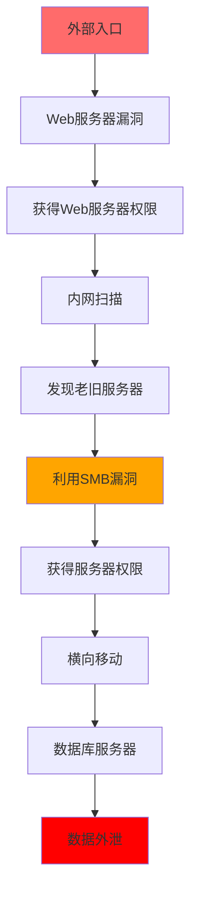
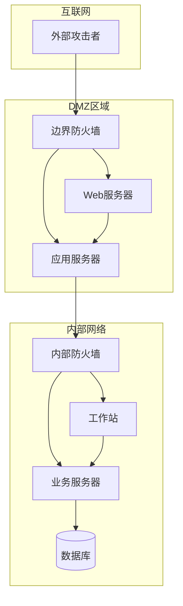
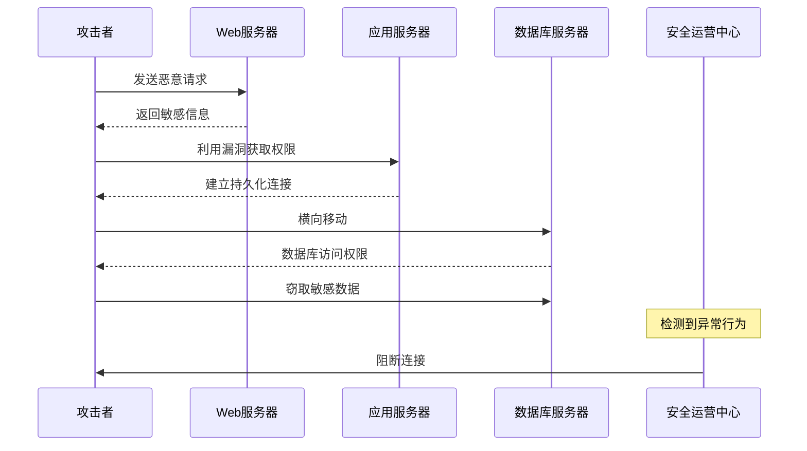
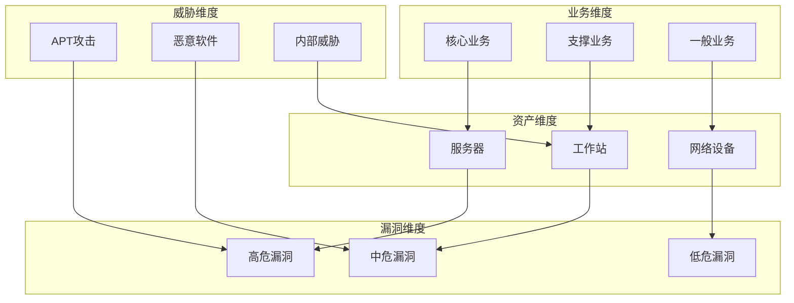
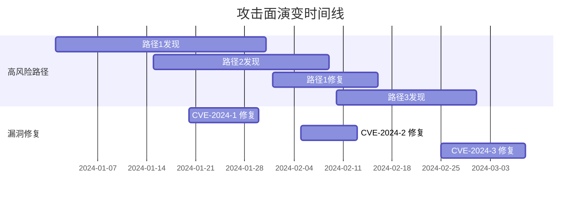
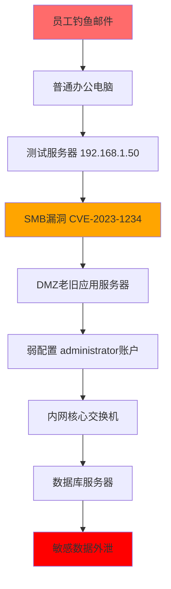
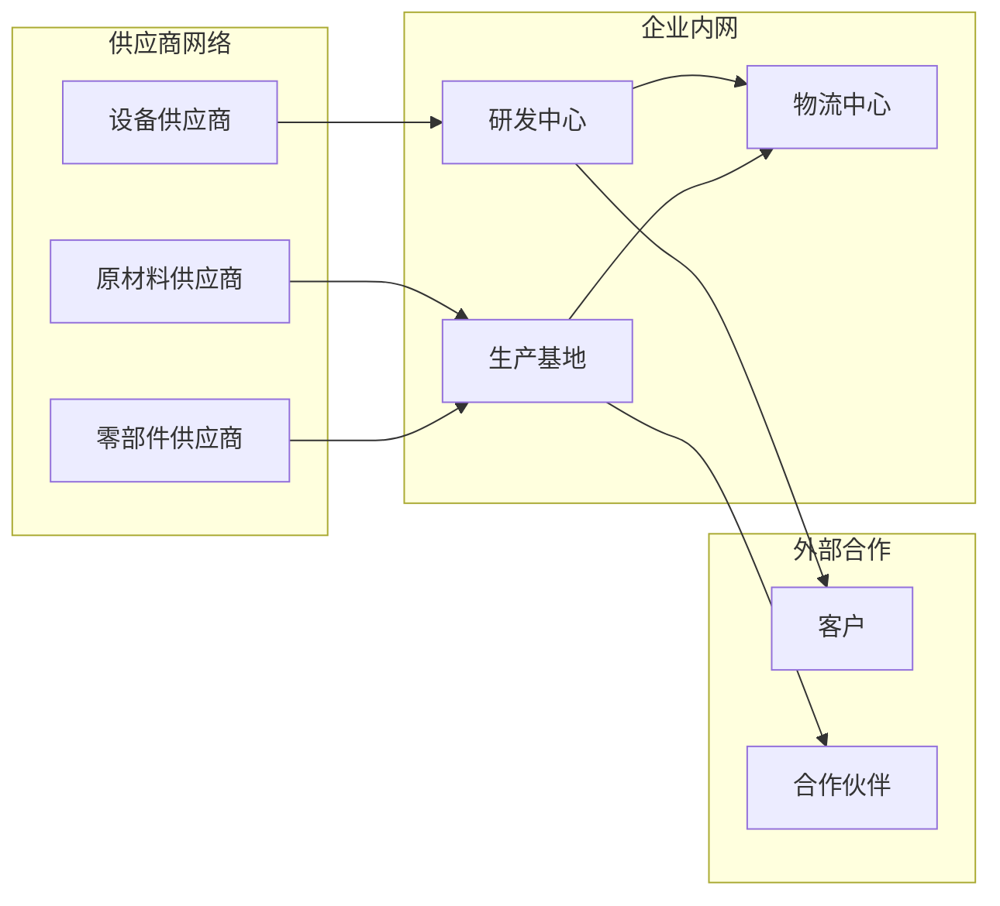

**作者：** HOS(安全风信子)
**日期：** 2026-04-24
**主要来源平台：** GitHub/arXiv
**摘要：** 数据孤岛是企业安全管理面临的永恒难题。资产数据、漏洞数据、威胁数据、业务数据分散在不同系统中，彼此孤立，难以形成完整的安全态势视图。攻击者往往利用这些数据孤岛，沿着被忽视的攻击路径逐步深入。本文深入探讨AI驱动的资产关联分析技术，通过构建多维度知识图谱、建立实体关联关系、实现攻击路径还原，让安全团队能够从全局视角审视攻击面，让攻击路径无所遁形。

@[TOC](目录)

---

# 打破数据孤岛：AI资产关联分析让攻击路径无所遁形

## 1. 引言：数据孤岛与关联分析的必要性

企业安全运营面临的一个核心挑战是数据孤岛问题。资产管理系统只知道有什么资产，漏洞扫描系统只知道有哪些漏洞，威胁情报系统只知道有哪些威胁，但这些信息彼此孤立，难以形成完整的安全态势视图。

攻击者恰恰相反。他们擅长利用数据孤岛，沿着被忽视的攻击路径逐步深入。典型的攻击路径可能是这样的：先通过钓鱼邮件获得员工的笔记本电脑访问权限（这在很多企业的资产管理系统中可能只是一个普通终端），然后利用这台笔记本连接内网的脆弱点，横向移动到一台老旧服务器，这台服务器由于缺乏维护存在多个漏洞，攻击者利用漏洞获得服务器权限，最后通过这台服务器访问到核心数据库。

传统安全分析方法的局限性在于，它只能看到单点的问题，而无法看到点与点之间的关联。AI驱动的资产关联分析正是为了解决这一问题而诞生的。通过构建跨系统的关联关系，安全团队能够看到完整的攻击链，识别关键风险点，制定更有针对性的防御策略。

## 2. 知识图谱驱动的关联架构

### 2.1 安全知识图谱设计

资产关联分析的核心是构建一个能够表达多维度关系的安全知识图谱。知识图谱（Knowledge Graph）是一种用图结构来表示知识的技术，它由节点（实体）和边（关系）组成。在安全领域，我们需要将各种安全实体（如资产、漏洞、威胁、用户、服务等）以及它们之间的关系建模到知识图谱中。

安全知识图谱的设计需要考虑以下几个方面：

**实体类型设计**

在安全知识图谱中，我们需要定义丰富的实体类型来涵盖各种安全相关对象：

| 实体类型 | 描述 | 典型属性 |
|---------|------|---------|
| 资产（Asset） | IT基础设施组件 | IP地址、主机名、操作系统、重要性等级 |
| 漏洞（Vulnerability） | 安全弱点 | CVE编号、CVSS评分、漏洞类型、影响范围 |
| 威胁（Threat） | 潜在攻击源 | 威胁来源、攻击类型、活跃程度、归属组织 |
| 用户（User） | 系统使用者 | 用户ID、角色、部门、权限级别 |
| 服务（Service） | 提供的业务服务 | 服务名称、端口、协议、依赖关系 |
| 数据（Data） | 敏感信息资产 | 数据分类、敏感级别、存储位置、加密状态 |
| 位置（Location） | 网络位置信息 | 网段、VLAN、区域、物理位置 |
| 配置（Configuration） | 系统配置项 | 配置项名称、配置值、安全基线符合度 |

**关系类型设计**

除了实体类型，我们还需要定义丰富的关系类型来表达实体之间的关联：

| 关系类型 | 源实体 | 目标实体 | 描述 |
|---------|-------|---------|------|
| hosts | 资产 | 服务 | 资产托管的服务 |
| exploits | 威胁 | 漏洞 | 威胁利用的漏洞 |
| connects_to | 资产 | 资产 | 网络连接关系 |
| accessed_by | 数据/服务 | 用户 | 访问权限关系 |
| contains | 网段 | 资产 | 包含关系 |
| depends_on | 服务 | 服务 | 依赖关系 |
| shares_data_with | 数据 | 数据 | 数据共享关系 |
| affects | 漏洞 | 资产 | 影响关系 |
| provides_service_to | 资产 | 业务 | 服务提供关系 |
| owns | 用户 | 资产 | 所有权关系 |
| located_in | 资产 | 位置 | 位置关系 |

```python
class SecurityKnowledgeGraph:
    """
    安全知识图谱
    构建和管理安全实体关联关系
    """

    def __init__(self, graph_db):
        self.graph = graph_db
        self.entity_types = ['asset', 'vulnerability', 'threat', 'user', 'service', 'data']
        self.relationship_types = [
            'hosts', 'exploits', 'connects_to', 'accessed_by',
            'contains', 'depends_on', 'shares_data_with'
        ]
        self._init_schema()

    def _init_schema(self):
        """初始化图谱schema"""
        for entity_type in self.entity_types:
            self.graph.create_node_type(entity_type)

        for rel_type in self.relationship_types:
            self.graph.create_relationship_type(rel_type)

    def add_entity(self, entity_type, entity_data):
        """添加实体"""
        if entity_type not in self.entity_types:
            raise ValueError(f"Unknown entity type: {entity_type}")

        entity_id = entity_data.get('id')
        properties = self._extract_properties(entity_type, entity_data)

        self.graph.create_node(entity_type, entity_id, properties)

        return entity_id

    def add_relationship(self, source_id, target_id, relationship_type, properties=None):
        """添加关系"""
        if relationship_type not in self.relationship_types:
            raise ValueError(f"Unknown relationship type: {relationship_type}")

        self.graph.create_relationship(
            source_id,
            target_id,
            relationship_type,
            properties or {}
        )

    def query_attack_path(self, source_entity, target_entity, max_hops=5):
        """查询攻击路径"""
        query = f"""
        MATCH path = (start:{{type: '{source_entity['type']}'}}
                     {{id: '{source_entity['id']}'}})
                   -[*{1..{max_hops}}]->
                   (end:{{type: '{target_entity['type']}'}}
                     {{id: '{target_entity['id']}'}})
        RETURN path
        """

        results = self.graph.execute(query)

        return [self._parse_path(r) for r in results]

    def _extract_properties(self, entity_type, entity_data):
        """提取实体属性"""
        common_props = ['id', 'name', 'description', 'created_at', 'updated_at']
        type_specific_props = {
            'asset': ['ip_address', 'hostname', 'os', 'criticality', 'owner'],
            'vulnerability': ['cve_id', 'cvss_score', 'severity', 'status'],
            'threat': ['threat_actor', 'attack_type', 'confidence', 'active'],
            'user': ['username', 'role', 'department', 'clearance_level'],
            'service': ['port', 'protocol', 'business_criticality'],
            'data': ['classification', 'sensitivity', 'retention_period']
        }

        props = {k: v for k, v in entity_data.items()
                 if k in common_props + type_specific_props.get(entity_type, [])}

        return props

    def _parse_path(self, path_result):
        """解析路径结果"""
        nodes = []
        edges = []

        for element in path_result['path']:
            if element['type'] == 'node':
                nodes.append(element['data'])
            else:
                edges.append(element['data'])

        return {'nodes': nodes, 'edges': edges}
```

### 2.2 多维度关联关系建模

资产关联分析需要建立多种类型的关联关系，包括网络关系、逻辑关系、业务关系等。这些关联关系构成了安全知识图谱的边，连接着各种实体节点。

**网络关联关系建模**

网络关联是安全知识图谱中最基本的关系类型之一。它描述了资产之间的网络通信关系，包括物理连接、逻辑网络连接、通信流量等。网络关联关系能够帮助我们理解攻击者可能的横向移动路径。

```python
class AssetRelationBuilder:
    """
    资产关系构建器
    建立多维度资产关联关系
    """

    def __init__(self, kg, data_sources):
        self.kg = kg
        self.data_sources = data_sources

    def build_network_relations(self, asset_id):
        """构建网络关联"""
        connections = self.data_sources['flow_logs'].get_connections(asset_id)

        for conn in connections:
            self.kg.add_relationship(
                asset_id,
                conn['target_id'],
                'connects_to',
                {
                    'protocol': conn.get('protocol'),
                    'port': conn.get('port'),
                    'frequency': conn.get('frequency'),
                    'last_seen': conn.get('last_seen')
                }
            )

    def build_vulnerability_relations(self, asset_id):
        """构建漏洞关联"""
        vulns = self.data_sources['vuln_scanner'].get_vulnerabilities(asset_id)

        for vuln in vulns:
            self.kg.add_entity('vulnerability', vuln)
            self.kg.add_relationship(
                vuln['id'],
                asset_id,
                'affects'
            )

    def build_business_relations(self, asset_id):
        """构建业务关联"""
        business_data = self.data_sources['cmdb'].get_business_context(asset_id)

        if business_data.get('service'):
            self.kg.add_relationship(
                asset_id,
                business_data['service']['id'],
                'provides_service_to'
            )

        if business_data.get('owner'):
            self.kg.add_entity('user', business_data['owner'])
            self.kg.add_relationship(
                business_data['owner']['id'],
                asset_id,
                'owns'
            )

    def build_data_flow_relations(self, asset_id):
        """构建数据流关系"""
        data_flows = self.data_sources['data_discovery'].get_data_flows(asset_id)

        for flow in data_flows:
            self.kg.add_relationship(
                flow['source_data_id'],
                flow['target_data_id'],
                'transferred_to',
                {
                    'transfer_type': flow.get('type'),
                    'volume': flow.get('volume'),
                    'frequency': flow.get('frequency')
                }
            )

    def build_identity_relations(self, asset_id):
        """构建身份关联"""
        identities = self.data_sources['iam'].get_identities(asset_id)

        for identity in identities:
            self.kg.add_relationship(
                identity['user_id'],
                asset_id,
                'authenticates_to',
                {
                    'auth_method': identity.get('method'),
                    'last_auth': identity.get('last_auth'),
                    'risk_level': identity.get('risk')
                }
            )

    def build_threat_intel_relations(self, asset_id):
        """构建威胁情报关联"""
        threat_indicators = self.data_sources['threat_intel'].get_related_indicators(asset_id)

        for indicator in threat_indicators:
            self.kg.add_entity('threat', indicator)
            self.kg.add_relationship(
                indicator['id'],
                asset_id,
                'observed_on',
                {
                    'first_seen': indicator.get('first_seen'),
                    'last_seen': indicator.get('last_seen'),
                    'confidence': indicator.get('confidence')
                }
            )
```

**关联关系权重计算**

在实际的网络环境中，并不是所有的关联关系都同等重要。我们需要为每条关联关系计算权重，以反映其在攻击路径分析中的重要性。

```python
class RelationWeightCalculator:
    """
    关联关系权重计算器
    计算各类关联关系的权重
    """

    def __init__(self, kg):
        self.kg = kg

    def calculate_network_weight(self, connection_data):
        """计算网络关联权重"""
        base_weight = 0.5

        protocol_risk = {
            'HTTP': 0.1,
            'HTTPS': 0.05,
            'SSH': 0.05,
            'RDP': 0.3,
            'SMB': 0.4,
            'FTP': 0.3,
            'Telnet': 0.5
        }

        port_risk = {
            22: 0.1,
            80: 0.2,
            443: 0.1,
            445: 0.4,
            3389: 0.3,
            8080: 0.2,
            8443: 0.15
        }

        frequency_factor = min(connection_data.get('frequency', 1) / 100, 1.0)

        weight = (
            base_weight +
            protocol_risk.get(connection_data.get('protocol'), 0.2) * 0.3 +
            port_risk.get(connection_data.get('port'), 0.2) * 0.3 +
            frequency_factor * 0.2
        )

        return min(weight, 1.0)

    def calculate_vulnerability_weight(self, vuln_data):
        """计算漏洞关联权重"""
        cvss_score = vuln_data.get('cvss_score', 5.0)

        cvss_factor = (cvss_score - 1.0) / 9.0

        exploitability_factor = 0.8 if vuln_data.get('has_exploit', False) else 0.3

        access_complexity = {
            'Low': 0.3,
            'Medium': 0.2,
            'High': 0.1
        }.get(vuln_data.get('access_complexity'), 0.2)

        weight = (
            cvss_factor * 0.5 +
            exploitability_factor * 0.3 +
            access_complexity * 0.2
        )

        return min(weight, 1.0)

    def calculate_business_weight(self, business_data):
        """计算业务关联权重"""
        criticality_factors = {
            'Critical': 0.4,
            'High': 0.3,
            'Medium': 0.2,
            'Low': 0.1
        }

        criticality = criticality_factors.get(
            business_data.get('criticality'),
            0.2
        )

        data_sensitivity = business_data.get('data_sensitivity', 0.5)

        weight = criticality * 0.6 + data_sensitivity * 0.4

        return min(weight, 1.0)
```

**关联关系质量评估**

为了确保知识图谱的质量，我们需要对关联关系进行质量评估。关联关系质量评估包括完整性、一致性、准确性、时效性等多个维度。

| 评估维度 | 描述 | 评估方法 | 阈值 |
|---------|------|---------|------|
| 完整性 | 关联关系覆盖程度 | 覆盖率 = 已有关系数 / 应有关系数 | > 80% |
| 一致性 | 关联关系逻辑一致性 | 冲突检测、矛盾检测 | 无冲突 |
| 准确性 | 关联关系数据准确性 | 交叉验证、来源可靠性评估 | > 90% |
| 时效性 | 关联关系更新及时性 | 最后更新时间距今时间 | < 30天 |
| 可信度 | 关联关系可信程度 | 来源可靠性评分加权 | > 0.7 |

```python
class RelationQualityAssessor:
    """
    关联关系质量评估器
    评估知识图谱中关联关系的质量
    """

    def __init__(self, kg):
        self.kg = kg

    def assess_completeness(self):
        """评估完整性"""
        expected_relations = self._calculate_expected_relations()
        actual_relations = self._count_actual_relations()

        completeness = actual_relations / expected_relations if expected_relations > 0 else 0

        return {
            'score': completeness,
            'expected': expected_relations,
            'actual': actual_relations,
            'status': 'good' if completeness > 0.8 else 'needs_improvement'
        }

    def assess_consistency(self):
        """评估一致性"""
        conflicts = self._detect_conflicts()

        consistency_score = 1.0 - (len(conflicts) / self._count_actual_relations())

        return {
            'score': consistency_score,
            'conflicts': conflicts,
            'status': 'good' if len(conflicts) == 0 else 'issues_found'
        }

    def assess_timeliness(self):
        """评估时效性"""
        stale_threshold_days = 30
        stale_relations = self._find_stale_relations(stale_threshold_days)

        total_relations = self._count_actual_relations()
        timeliness_score = 1.0 - (len(stale_relations) / total_relations)

        return {
            'score': timeliness_score,
            'stale_count': len(stale_relations),
            'stale_relations': stale_relations,
            'status': 'good' if timeliness_score > 0.9 else 'needs_update'
        }

    def _calculate_expected_relations(self):
        """计算期望的关联关系数量"""
        return sum(
            len(assets) * self._estimate_relation_per_asset()
            for assets in self.kg.get_entities_by_type('asset')
        )

    def _count_actual_relations(self):
        """统计实际关联关系数量"""
        return self.kg.count_relationships()

    def _detect_conflicts(self):
        """检测冲突关系"""
        conflicts = []
        for relation in self.kg.get_all_relationships():
            if self._is_conflicting_relation(relation):
                conflicts.append(relation)
        return conflicts

    def _find_stale_relations(self, threshold_days):
        """查找过时的关联关系"""
        stale = []
        for relation in self.kg.get_all_relationships():
            if self._is_relation_stale(relation, threshold_days):
                stale.append(relation)
        return stale
```

**动态关联关系更新**

安全环境是动态变化的，资产关联关系也需要实时更新。动态更新机制需要考虑增量更新、批量更新、回滚机制等因素。

```python
class DynamicRelationUpdater:
    """
    动态关联关系更新器
    处理关联关系的实时更新
    """

    def __init__(self, kg, update_queue):
        self.kg = kg
        self.update_queue = update_queue
        self.version_control = {}
        self._start_update_processor()

    def _start_update_processor(self):
        """启动更新处理器"""
        while True:
            update = self.update_queue.get()
            self._process_update(update)

    def _process_update(self, update):
        """处理更新请求"""
        update_type = update.get('type')

        if update_type == 'add':
            self._handle_add(update)
        elif update_type == 'delete':
            self._handle_delete(update)
        elif update_type == 'modify':
            self._handle_modify(update)
        elif update_type == 'bulk':
            self._handle_bulk(update)

    def _handle_add(self, update):
        """处理添加操作"""
        relation_key = f"{update['source_id']}_{update['target_id']}_{update['type']}"

        self.version_control[relation_key] = {
            'version': 1,
            'history': []
        }

        self.kg.add_relationship(
            update['source_id'],
            update['target_id'],
            update['type'],
            update.get('properties', {})
        )

    def _handle_delete(self, update):
        """处理删除操作"""
        relation_key = f"{update['source_id']}_{update['target_id']}_{update['type']}"

        if relation_key in self.version_control:
            self.version_control[relation_key]['history'].append(
                self.version_control[relation_key]['version']
            )
            self.version_control[relation_key]['version'] += 1

        self.kg.delete_relationship(
            update['source_id'],
            update['target_id'],
            update['type']
        )

    def _handle_modify(self, update):
        """处理修改操作"""
        relation_key = f"{update['source_id']}_{update['target_id']}_{update['type']}"

        if relation_key in self.version_control:
            self.version_control[relation_key]['history'].append(
                self.version_control[relation_key]['version']
            )
            self.version_control[relation_key]['version'] += 1

        self.kg.update_relationship(
            update['source_id'],
            update['target_id'],
            update['type'],
            update.get('new_properties', {})
        )

    def rollback(self, relation_key):
        """回滚到上一个版本"""
        if relation_key not in self.version_control:
            raise ValueError(f"No version history for relation: {relation_key}")

        history = self.version_control[relation_key]['history']
        if not history:
            raise ValueError(f"No previous version to rollback to")

        previous_version = history.pop()
        self.kg.restore_version(relation_key, previous_version)

        return previous_version
```

**关联关系查询优化**

随着知识图谱规模的增长，关联关系查询性能会成为一个挑战。查询优化包括索引优化、查询改写、缓存策略等多种技术。

```python
class RelationQueryOptimizer:
    """
    关联关系查询优化器
    优化知识图谱查询性能
    """

    def __init__(self, kg):
        self.kg = kg
        self.cache = LRUCache(maxsize=1000)
        self.query_stats = defaultdict(int)

    def optimize_query(self, original_query):
        """优化查询"""
        self.query_stats[original_query] += 1

        cached_result = self.cache.get(original_query)
        if cached_result:
            return cached_result

        optimized = self._apply_query_transformations(original_query)

        result = self.kg.execute(optimized)

        self.cache.put(original_query, result)

        return result

    def _apply_query_transformations(self, query):
        """应用查询转换"""
        query = self._add_indexes(query)
        query = self._prune_unnecessary_joins(query)
        query = self._push_down_filters(query)

        return query

    def _add_indexes(self, query):
        """添加索引提示"""
        if 'asset' in query and 'id' in query:
            query = query.replace(
                'MATCH',
                'MATCH USING INDEX asset_id_idx'
            )
        return query

    def _prune_unnecessary_joins(self, query):
        """剪枝不必要的连接"""
        return query

    def _push_down_filters(self, query):
        """下推过滤器"""
        return query

    def get_query_statistics(self):
        """获取查询统计"""
        return {
            'total_queries': sum(self.query_stats.values()),
            'unique_queries': len(self.query_stats),
            'top_queries': sorted(
                self.query_stats.items(),
                key=lambda x: x[1],
                reverse=True
            )[:10]
        }
```

## 3. AI攻击路径分析

### 3.1 攻击路径发现

基于知识图谱，AI系统能够自动发现潜在的攻击路径。攻击路径发现是资产关联分析的核心功能之一，它通过图遍历算法在安全知识图谱中搜索从攻击源到目标的潜在攻击路径。

**攻击路径发现的算法原理**

攻击路径发现的核心算法基于图论中的最短路径算法和全路径搜索算法的改进。传统的最短路径算法（如Dijkstra算法、Bellman-Ford算法）只能找到一条最短路径，但在安全分析场景中，我们往往需要找到所有可能的攻击路径，而不仅仅是最高风险的那一条。

```python
class AttackPathFinder:
    """
    攻击路径发现器
    发现资产间的潜在攻击路径
    """

    def __init__(self, kg):
        self.kg = kg
        self.path_cache = {}
        self.max_paths = 100

    def find_attack_paths(self, source_asset, target_asset, constraints=None):
        """
        发现攻击路径

        参数:
            source_asset: 起点资产
            target_asset: 目标资产
            constraints: 约束条件

        返回:
            list: 攻击路径列表
        """
        paths = self.kg.query_attack_path(
            {'type': 'asset', 'id': source_asset},
            {'type': 'asset', 'id': target_asset},
            max_hops=5
        )

        scored_paths = []
        for path in paths:
            risk_score = self._calculate_path_risk(path)
            exploitability = self._assess_path_exploitability(path)

            scored_paths.append({
                'path': path,
                'risk_score': risk_score,
                'exploitability': exploitability,
                'defense_breadth': self._estimate_defense_breadth(path)
            })

        scored_paths.sort(key=lambda x: x['risk_score'], reverse=True)

        return scored_paths

    def _calculate_path_risk(self, path):
        """计算路径风险"""
        node_risks = [node.get('risk_score', 0.5) for node in path['nodes']]
        edge_risks = [edge.get('risk_score', 0.5) for edge in path['edges']]

        avg_node_risk = sum(node_risks) / len(node_risks)
        avg_edge_risk = sum(edge_risks) / len(edge_risks) if edge_risks else 0

        path_length_factor = 1.0 / (len(path['nodes']) + 1)

        overall_risk = (
            avg_node_risk * 0.5 +
            avg_edge_risk * 0.3 +
            path_length_factor * 0.2
        )

        return overall_risk

    def find_all_paths_dfs(self, source, target, max_depth=5):
        """
        使用深度优先搜索发现所有路径

        参数:
            source: 起点资产ID
            target: 目标资产ID
            max_depth: 最大搜索深度

        返回:
            list: 所有发现的路径
        """
        all_paths = []
        visited = set()

        def dfs(current, path, depth):
            if depth > max_depth:
                return

            if current == target:
                all_paths.append(path.copy())
                return

            visited.add(current)

            neighbors = self.kg.get_neighbors(current)

            for neighbor in neighbors:
                if neighbor not in visited:
                    edge_data = self.kg.get_edge_data(current, neighbor)

                    if self._is_traversable(edge_data):
                        path.append(neighbor)
                        dfs(neighbor, path, depth + 1)
                        path.pop()

            visited.remove(current)

        dfs(source, [source], 0)

        return all_paths

    def find_critical_paths(self, source, target, top_k=10):
        """
        发现最关键的K条路径

        参数:
            source: 起点资产ID
            target: 目标资产ID
            top_k: 返回的路径数量

        返回:
            list: 风险最高的K条路径
        """
        all_paths = self.find_all_paths_dfs(source, target)

        path_scores = []
        for path in all_paths:
            score = self._evaluate_path_score(path)
            path_scores.append((path, score))

        path_scores.sort(key=lambda x: x[1], reverse=True)

        return [path for path, score in path_scores[:top_k]]

    def _evaluate_path_score(self, path):
        """
        评估路径综合得分

        评估维度包括：
        1. 路径长度（跳数越少风险越高）
        2. 节点风险（经过节点的平均风险）
        3. 边风险（经过边的平均风险）
        4. 可利用性（是否存在可利用的漏洞）
        5. 被发现概率（攻击者被发现的可能性）
        """
        length_score = 1.0 / (len(path) + 1)

        node_risk_sum = sum(
            self.kg.get_node_risk(node_id)
            for node_id in path
        )
        node_risk_avg = node_risk_sum / len(path)

        edge_risk_sum = 0
        for i in range(len(path) - 1):
            edge_risk = self.kg.get_edge_risk(path[i], path[i + 1])
            edge_risk_sum += edge_risk
        edge_risk_avg = edge_risk_sum / (len(path) - 1) if len(path) > 1 else 0

        exploitability_score = self._assess_exploitability(path)

        detection_prob = self._estimate_detection_probability(path)

        final_score = (
            length_score * 0.15 +
            node_risk_avg * 0.30 +
            edge_risk_avg * 0.25 +
            exploitability_score * 0.15 +
            (1 - detection_prob) * 0.15
        )

        return final_score

    def _assess_exploitability(self, path):
        """
        评估路径的可利用性

        可利用性衡量攻击者实际执行这条攻击路径的可行性
        """
        exploitability = 0.5

        for node_id in path:
            vulnerabilities = self.kg.get_node_vulnerabilities(node_id)

            for vuln in vulnerabilities:
                if vuln.get('has_public_exploit'):
                    exploitability += 0.2
                if vuln.get('cvss_score', 0) > 7.0:
                    exploitability += 0.1

        return min(exploitability, 1.0)

    def _estimate_detection_probability(self, path):
        """
        估计攻击者在这条路径上被发现的可能性

        考虑因素：
        1. 路径上的监控点覆盖情况
        2. 路径经过的网段的安全监控等级
        3. 历史日志保留情况
        """
        detection_prob = 0.0

        for node_id in path:
            monitoring_coverage = self.kg.get_monitoring_coverage(node_id)
            detection_prob += monitoring_coverage * 0.1

        for i in range(len(path) - 1):
            segment_monitoring = self.kg.get_segment_monitoring(path[i], path[i + 1])
            detection_prob += segment_monitoring * 0.05

        return min(detection_prob, 1.0)
```

**攻击路径发现的性能优化**

在实际的企业环境中，知识图谱可能包含数十万个节点和数百万条边。因此，攻击路径发现的性能优化至关重要。

```python
class OptimizedAttackPathFinder:
    """
    优化版攻击路径发现器
    针对大规模图谱的性能优化实现
    """

    def __init__(self, kg):
        self.kg = kg
        self._build_indices()
        self._init_caches()

    def _build_indices(self):
        """构建索引加速查询"""
        self.kg.create_index('asset', 'id')
        self.kg.create_index('asset', 'criticality')
        self.kg.create_index('vulnerability', 'cvss_score')
        self.kg.create_composite_index(['asset', 'vulnerability'], ['connects_to'])

    def _init_caches(self):
        """初始化缓存"""
        self.path_cache = {}
        self.neighbor_cache = {}
        self.risk_cache = {}

    def find_attack_paths_optimized(self, source, target, max_hops=5):
        """优化的攻击路径发现"""
        cache_key = f"{source}_{target}_{max_hops}"

        if cache_key in self.path_cache:
            return self.path_cache[cache_key]

        result = self._bidirectional_search(source, target, max_hops)

        self.path_cache[cache_key] = result

        return result

    def _bidirectional_search(self, source, target, max_hops):
        """
        双向搜索算法

        从起点和终点同时开始搜索，在中间相遇时停止
        这种方法可以将时间复杂度从O(b^d)降低到O(b^(d/2))
        其中b是分支因子，d是路径深度
        """
        if max_hops <= 0:
            return []

        mid = max_hops // 2

        forward_visited = {source: [source]}
        backward_visited = {target: [target]}

        forward_queue = [(source, 0)]
        backward_queue = [(target, 0)]

        while forward_queue and backward_queue:
            if len(forward_visited) + len(backward_visited) > 10000:
                break

            forward_node, forward_depth = forward_queue.pop(0)
            backward_node, backward_depth = backward_queue.pop(0)

            if forward_depth >= mid:
                continue
            if backward_depth >= mid:
                continue

            for next_node in self._get_neighbors_cached(forward_node):
                if next_node not in forward_visited:
                    forward_visited[next_node] = forward_visited[forward_node] + [next_node]
                    forward_queue.append((next_node, forward_depth + 1))

                    if next_node in backward_visited:
                        full_path = forward_visited[next_node] + backward_visited[next_node][::-1][1:]
                        return [full_path]

            for prev_node in self._get_neighbors_cached(backward_node):
                if prev_node not in backward_visited:
                    backward_visited[prev_node] = [prev_node] + backward_visited[backward_node]
                    backward_queue.append((prev_node, backward_depth + 1))

                    if prev_node in forward_visited:
                        full_path = forward_visited[prev_node] + backward_visited[prev_node][::-1][1:]
                        return [full_path]

        return []

    def _get_neighbors_cached(self, node_id):
        """带缓存的邻居查询"""
        if node_id in self.neighbor_cache:
            return self.neighbor_cache[node_id]

        neighbors = self.kg.get_neighbors(node_id)
        self.neighbor_cache[node_id] = neighbors

        return neighbors

    def parallel_path_discovery(self, source, targets, max_hops=5):
        """
        并行发现到多个目标的攻击路径

        使用多线程并行处理，提高大规模查询的效率
        """
        from concurrent.futures import ThreadPoolExecutor, as_completed

        results = {}

        with ThreadPoolExecutor(max_workers=10) as executor:
            future_to_target = {
                executor.submit(
                    self.find_attack_paths_optimized,
                    source,
                    target,
                    max_hops
                ): target
                for target in targets
            }

            for future in as_completed(future_to_target):
                target = future_to_target[future]
                try:
                    results[target] = future.result()
                except Exception as e:
                    results[target] = {'error': str(e)}

        return results
```

**攻击路径发现的约束条件**

在实际应用中，我们经常需要根据特定约束条件来搜索攻击路径。约束条件可以包括：路径必须经过或不经过某些节点、路径长度限制、风险阈值限制等。

```python
class ConstrainedAttackPathFinder:
    """
    带约束条件的攻击路径发现器
    支持多种约束条件的路径搜索
    """

    def __init__(self, kg):
        self.kg = kg

    def find_paths_with_constraints(self, source, target, constraints):
        """
        根据约束条件发现攻击路径

        约束条件格式：
        {
            'max_hops': 5,
            'min_hops': 2,
            'required_nodes': ['node1', 'node2'],
            'excluded_nodes': ['node3'],
            'max_avg_risk': 0.7,
            'required_vuln_types': ['RCE', 'SQLi'],
            'network_segments': ['DMZ', 'INTERNAL']
        }
        """
        all_paths = self._discover_all_paths(source, target, constraints['max_hops'])

        filtered_paths = []

        for path in all_paths:
            if not self._satisfies_constraints(path, constraints):
                continue

            filtered_paths.append(path)

        return filtered_paths

    def _satisfies_constraints(self, path, constraints):
        """检查路径是否满足约束条件"""
        if 'min_hops' in constraints:
            if len(path) - 1 < constraints['min_hops']:
                return False

        if 'required_nodes' in constraints:
            for required_node in constraints['required_nodes']:
                if required_node not in path:
                    return False

        if 'excluded_nodes' in constraints:
            for excluded_node in constraints['excluded_nodes']:
                if excluded_node in path:
                    return False

        if 'max_avg_risk' in constraints:
            avg_risk = self._calculate_path_average_risk(path)
            if avg_risk > constraints['max_avg_risk']:
                return False

        if 'required_vuln_types' in constraints:
            has_required_vuln = False
            for node in path:
                vulns = self.kg.get_node_vulnerabilities(node)
                for vuln in vulns:
                    if vuln.get('type') in constraints['required_vuln_types']:
                        has_required_vuln = True
                        break
                if has_required_vuln:
                    break
            if not has_required_vuln:
                return False

        if 'network_segments' in constraints:
            path_segments = set()
            for node in path:
                segment = self.kg.get_node_segment(node)
                path_segments.add(segment)

            if not any(seg in constraints['network_segments'] for seg in path_segments):
                return False

        return True

    def _calculate_path_average_risk(self, path):
        """计算路径平均风险"""
        total_risk = 0.0
        for node in path:
            total_risk += self.kg.get_node_risk(node)
        return total_risk / len(path)
```
```

### 3.2 攻击链可视化

分析结果需要以直观的方式呈现。AI系统生成攻击链的可视化图表，帮助安全团队快速理攻击路径和关键节点。

**攻击链可视化的重要性**

攻击链可视化是安全运营中心（SOC）日常工作的重要工具。良好的可视化不仅能帮助安全分析师快速理解攻击路径，还能支持高级安全分析和决策制定。可视化设计需要考虑以下几个关键因素：

1. **信息密度**：在有限的屏幕空间内展示尽可能多的关键信息
2. **层次结构**：清晰展示攻击的阶段性特征
3. **交互性**：支持分析师深入探索每个节点和关系
4. **实时性**：能够反映当前的安全态势变化
5. **上下文**：提供足够的背景信息帮助理解攻击链



**攻击阶段划分**

根据MITRE ATT&CK框架，攻击链可以划分为多个阶段。以下是一个典型的企业网络攻击链可视化：

```mermaid
flowchart LR
    subgraph Reconnaissance[侦察阶段]
        R1[开源情报收集]
        R2[网络侦察]
        R3[漏洞扫描]
    end

    subgraph InitialAccess[初始访问]
        I1[钓鱼攻击]
        I2[漏洞利用]
        I3[凭证窃取]
    end

    subgraph Execution[执行阶段]
        E1[恶意代码执行]
        E2[权限提升]
        E3[持久化建立]
    end

    subgraph LateralMovement[横向移动]
        L1[内网探测]
        L2[凭证传递]
        L3[远程连接]
    end

    subgraph Collection[数据收集]
        C1[敏感数据识别]
        C2[数据外泄准备]
    end

    subgraph Exfiltration[数据外泄]
        X1[数据传输]
        X2[隐蔽通道建立]
    end

    Reconnaissance --> InitialAccess
    InitialAccess --> Execution
    Execution --> LateralMovement
    LateralMovement --> Collection
    Collection --> Exfiltration
```



**资产关联关系网络图**

除了攻击链，安全分析师还需要了解资产之间的关联关系网络。以下是一个多层级资产关联的可视化示例：



**攻击路径风险热力图**

在攻击路径分析中，风险评估是一个关键环节。以下是一个攻击路径风险评估的可视化模型：

| 路径阶段 | 资产名称 | 风险等级 | CVSS评分 | 可利用性 | 需要权限 |
|---------|---------|---------|---------|---------|---------|
| 入口点 | 边界路由器 | 高 | 7.5 | 中 | 低 |
| 第1跳 | Web服务器 | 严重 | 9.8 | 高 | 无 |
| 第2跳 | 应用服务器 | 高 | 8.2 | 高 | 用户 |
| 第3跳 | 数据库服务器 | 严重 | 9.1 | 高 | 管理员 |

**攻击路径时序图**

攻击者的行动往往具有时间序列特性。时序图可以帮助分析师理解攻击的时间线和因果关系：



**多维度资产关联分析图**

资产关联分析需要考虑多个维度的信息。以下是一个综合性的资产关联分析可视化：



**攻击面演变监控图**

安全态势是动态变化的，需要持续监控攻击面的演变。以下是一个攻击面监控的可视化示例：



**可视化交互设计**

高级攻击链可视化系统应该支持丰富的交互功能，让分析师能够深入探索安全数据：

1. **节点展开**：点击任意资产节点，显示该资产的详细信息、关联漏洞、连接关系等
2. **路径高亮**：选择特定攻击路径，高亮显示路径上的所有节点和边，其他节点和边变暗
3. **时间过滤**：通过时间轴控件筛选特定时间段内的攻击活动
4. **风险筛选**：设置风险阈值，仅显示超过该阈值的攻击路径
5. **导出功能**：支持将当前视图导出为图像或报告格式

## 4. 关联分析驱动的安全决策

### 4.1 风险优先级排序

基于关联分析结果，AI系统能够更准确地评估资产风险优先级。传统的风险评估方法往往只考虑单一的资产属性，如漏洞的CVSS评分或资产的业务重要性。但在真实的攻击场景中，攻击者更关注的是如何利用资产之间的关联关系来实现其攻击目标。因此，我们需要一种能够综合考虑多维度关联的风险评估方法。

**多维度风险评估模型**

风险优先级排序需要考虑多个风险维度，包括可达性、潜在损害、暴露程度、现有风险等。这些维度共同构成了资产的综合风险评分。

```python
class RiskPrioritizationEngine:
    """
    风险优先级引擎
    基于关联分析的风险优先级排序
    """

    def __init__(self, kg):
        self.kg = kg
        self.risk_weights = {
            'reachability': 0.25,
            'damage_potential': 0.25,
            'exposure': 0.25,
            'existing_risk': 0.25
        }

    def prioritize_assets(self, assets):
        """
        优先级排序

        参数:
            assets: 资产列表

        返回:
            list: 排序后的资产
        """
        scored_assets = []

        for asset in assets:
            reachability_score = self._calculate_reachability(asset['id'])
            damage_potential = self._calculate_damage_potential(asset['id'])
            exposure_score = self._calculate_exposure(asset['id'])
            existing_risk = asset.get('risk_score', 0.5)

            priority_score = (
                reachability_score * self.risk_weights['reachability'] +
                damage_potential * self.risk_weights['damage_potential'] +
                exposure_score * self.risk_weights['exposure'] +
                existing_risk * self.risk_weights['existing_risk']
            )

            scored_assets.append({
                'asset': asset,
                'priority_score': priority_score,
                'risk_factors': {
                    'reachability': reachability_score,
                    'damage_potential': damage_potential,
                    'exposure': exposure_score,
                    'existing_risk': existing_risk
                }
            })

        scored_assets.sort(key=lambda x: x['priority_score'], reverse=True)

        return scored_assets

    def _calculate_reachability(self, asset_id):
        """
        计算可达性评分

        可达性衡量资产从外部网络或已沦陷资产被访问的难度
        考虑因素：
        1. 网络位置（是否在DMZ、 内网、核心区域）
        2. 防火墙规则（是否开放了敏感端口）
        3. 连接关系（有多少其他资产可以连接到此资产）
        4. 暴露的服务（是否有暴露给外部的服务）
        """
        network_position_score = self._assess_network_position(asset_id)

        firewall_score = self._assess_firewall_exposure(asset_id)

        connection_score = self._count_incoming_connections(asset_id)

        service_exposure_score = self._assess_service_exposure(asset_id)

        reachability = (
            network_position_score * 0.3 +
            firewall_score * 0.25 +
            connection_score * 0.25 +
            service_exposure_score * 0.2
        )

        return min(reachability, 1.0)

    def _calculate_damage_potential(self, asset_id):
        """
        计算潜在损害评分

        潜在损害衡量资产被攻陷后可能造成的损失
        考虑因素：
        1. 业务重要性（资产支撑哪些业务）
        2. 数据敏感性（资产存储或处理哪些敏感数据）
        3. 权限级别（资产上的用户权限有多高）
        4. 依赖关系（有多少其他资产依赖此资产）
        """
        business_importance = self._assess_business_importance(asset_id)

        data_sensitivity = self._assess_data_sensitivity(asset_id)

        privilege_level = self._assess_privilege_level(asset_id)

        dependency_score = self._count_dependent_assets(asset_id)

        damage_potential = (
            business_importance * 0.35 +
            data_sensitivity * 0.35 +
            privilege_level * 0.15 +
            dependency_score * 0.15
        )

        return min(damage_potential, 1.0)

    def _calculate_exposure(self, asset_id):
        """
        计算暴露程度评分

        暴露程度衡量资产的脆弱性被利用的容易程度
        考虑因素：
        1. 漏洞数量和严重程度
        2. 漏洞是否已有公开利用代码
        3. 资产的互联网可见性
        4. 资产的安全配置基线符合度
        """
        vuln_score = self._assess_vulnerability_score(asset_id)

        exploitability_score = self._assess_exploitability(asset_id)

        internet_visibility = self._check_internet_visibility(asset_id)

        baseline_compliance = self._check_baseline_compliance(asset_id)

        exposure = (
            vuln_score * 0.4 +
            exploitability_score * 0.3 +
            internet_visibility * 0.15 +
            baseline_compliance * 0.15
        )

        return min(exposure, 1.0)

    def _assess_network_position(self, asset_id):
        """评估网络位置风险"""
        segment = self.kg.get_asset_segment(asset_id)

        segment_risk = {
            'INTERNET': 1.0,
            'DMZ': 0.8,
            'INTERNAL': 0.5,
            'CORE': 0.9,
            'SECURE': 0.2
        }

        return segment_risk.get(segment, 0.5)

    def _assess_firewall_exposure(self, asset_id):
        """评估防火墙暴露风险"""
        open_ports = self.kg.get_open_ports(asset_id)

        high_risk_ports = {21, 22, 23, 25, 110, 135, 139, 443, 445, 3389, 8080}

        exposed_risk_ports = open_ports.intersection(high_risk_ports)

        return len(exposed_risk_ports) / len(high_risk_ports)

    def _count_incoming_connections(self, asset_id):
        """统计入站连接数量"""
        connections = self.kg.get_incoming_connections(asset_id)

        return min(len(connections) / 100, 1.0)

    def _assess_service_exposure(self, asset_id):
        """评估服务暴露风险"""
        internet_facing_services = self.kg.get_internet_facing_services(asset_id)

        return min(len(internet_facing_services) / 10, 1.0)

    def _assess_business_importance(self, asset_id):
        """评估业务重要性"""
        supported_services = self.kg.get_supported_services(asset_id)

        importance_sum = 0
        for service in supported_services:
            importance_sum += self._get_service_importance(service)

        return importance_sum / max(len(supported_services), 1)

    def _assess_data_sensitivity(self, asset_id):
        """评估数据敏感性"""
        data_assets = self.kg.get_data_assets(asset_id)

        sensitivity_sum = 0
        for data in data_assets:
            sensitivity_sum += self._get_data_sensitivity(data)

        return sensitivity_sum / max(len(data_assets), 1)

    def _assess_privilege_level(self, asset_id):
        """评估权限级别"""
        users = self.kg.get_users_on_asset(asset_id)

        high_priv_users = sum(1 for u in users if u.get('is_admin', False))

        return high_priv_users / max(len(users), 1)

    def _count_dependent_assets(self, asset_id):
        """统计依赖资产数量"""
        dependents = self.kg.get_dependent_assets(asset_id)

        return min(len(dependents) / 50, 1.0)

    def _assess_vulnerability_score(self, asset_id):
        """评估漏洞风险"""
        vulnerabilities = self.kg.get_vulnerabilities(asset_id)

        if not vulnerabilities:
            return 0.0

        max_cvss = max(v.get('cvss_score', 0) for v in vulnerabilities)

        vuln_count_factor = min(len(vulnerabilities) / 20, 1.0)

        return (max_cvss / 10) * 0.7 + vuln_count_factor * 0.3

    def _assess_exploitability(self, asset_id):
        """评估漏洞可利用性"""
        vulnerabilities = self.kg.get_vulnerabilities(asset_id)

        exploitable_count = sum(
            1 for v in vulnerabilities
            if v.get('has_public_exploit', False)
        )

        return exploitable_count / max(len(vulnerabilities), 1)

    def _check_internet_visibility(self, asset_id):
        """检查互联网可见性"""
        return 1.0 if self.kg.is_internet_facing(asset_id) else 0.0

    def _check_baseline_compliance(self, asset_id):
        """检查安全基线符合度"""
        compliance = self.kg.get_baseline_compliance(asset_id)

        return compliance / 100

    def _get_service_importance(self, service_id):
        """获取服务重要性"""
        service = self.kg.get_service(service_id)

        importance_map = {
            'CRITICAL': 1.0,
            'HIGH': 0.75,
            'MEDIUM': 0.5,
            'LOW': 0.25
        }

        return importance_map.get(service.get('importance'), 0.5)

    def _get_data_sensitivity(self, data_id):
        """获取数据敏感性"""
        data = self.kg.get_data(data_id)

        sensitivity_map = {
            'PII': 1.0,
            'FINANCIAL': 0.9,
            'HEALTH': 0.9,
            'CONFIDENTIAL': 0.8,
            'INTERNAL': 0.5,
            'PUBLIC': 0.0
        }

        return sensitivity_map.get(data.get('classification'), 0.5)
```

**风险优先级矩阵**

为了更直观地展示风险评估结果，我们可以使用风险优先级矩阵。以下是一个典型的风险优先级矩阵：

| 风险等级 | 可达性评分 | 损害潜力评分 | 暴露程度评分 | 建议处理时间 |
|---------|-----------|-------------|-------------|------------|
| 严重 | 0.8-1.0 | 0.8-1.0 | 0.8-1.0 | 立即处理 |
| 高 | 0.6-0.8 | 0.6-0.8 | 0.6-0.8 | 24小时内 |
| 中 | 0.4-0.6 | 0.4-0.6 | 0.4-0.6 | 1周内 |
| 低 | 0.0-0.4 | 0.0-0.4 | 0.0-0.4 | 1月内 |

**批量风险评估**

在实际的企业环境中，我们通常需要对大量资产进行批量风险评估。以下是一个批量风险评估的实现：

```python
class BatchRiskAssessor:
    """
    批量风险评估器
    支持大规模资产的风险评估
    """

    def __init__(self, risk_engine):
        self.risk_engine = risk_engine

    def assess_all_assets(self, asset_filter=None):
        """
        批量评估所有资产风险

        参数:
            asset_filter: 资产过滤条件

        返回:
            dict: 风险评估结果统计
        """
        assets = self.risk_engine.kg.get_all_assets(asset_filter)

        results = []
        for asset in assets:
            risk_factors = {
                'reachability': self.risk_engine._calculate_reachability(asset['id']),
                'damage_potential': self.risk_engine._calculate_damage_potential(asset['id']),
                'exposure': self.risk_engine._calculate_exposure(asset['id']),
                'existing_risk': asset.get('risk_score', 0.5)
            }

            priority_score = sum(
                risk_factors[k] * self.risk_engine.risk_weights[k]
                for k in risk_factors
            )

            results.append({
                'asset_id': asset['id'],
                'asset_name': asset.get('name'),
                'priority_score': priority_score,
                'risk_factors': risk_factors,
                'risk_level': self._determine_risk_level(priority_score)
            })

        results.sort(key=lambda x: x['priority_score'], reverse=True)

        return {
            'total_assets': len(results),
            'risk_distribution': self._calculate_risk_distribution(results),
            'top_risk_assets': results[:10],
            'all_results': results
        }

    def _determine_risk_level(self, score):
        """确定风险等级"""
        if score >= 0.75:
            return 'CRITICAL'
        elif score >= 0.5:
            return 'HIGH'
        elif score >= 0.25:
            return 'MEDIUM'
        else:
            return 'LOW'

    def _calculate_risk_distribution(self, results):
        """计算风险分布"""
        distribution = {
            'CRITICAL': 0,
            'HIGH': 0,
            'MEDIUM': 0,
            'LOW': 0
        }

        for result in results:
            distribution[result['risk_level']] += 1

        total = len(results)
        return {
            k: {'count': v, 'percentage': v / total * 100 if total > 0 else 0}
            for k, v in distribution.items()
        }
```

**风险趋势分析**

除了静态的风险评估，我们还需要分析风险的变化趋势。以下是一个风险趋势分析的实现：

```python
class RiskTrendAnalyzer:
    """
    风险趋势分析器
    分析风险随时间的变化趋势
    """

    def __init__(self, kg, history_store):
        self.kg = kg
        self.history_store = history_store

    def analyze_trend(self, asset_id, time_range_days=30):
        """
        分析资产风险趋势

        参数:
            asset_id: 资产ID
            time_range_days: 分析时间范围（天）

        返回:
            dict: 趋势分析结果
        """
        historical_scores = self._get_historical_scores(asset_id, time_range_days)

        if len(historical_scores) < 2:
            return {
                'trend': 'INSUFFICIENT_DATA',
                'change_rate': 0,
                'prediction': None
            }

        trend_direction = self._calculate_trend_direction(historical_scores)

        change_rate = self._calculate_change_rate(historical_scores)

        prediction = self._predict_future_risk(historical_scores)

        return {
            'trend': trend_direction,
            'change_rate': change_rate,
            'prediction': prediction,
            'historical_scores': historical_scores,
            'risk_trajectory': self._categorize_trajectory(historical_scores)
        }

    def _get_historical_scores(self, asset_id, days):
        """获取历史风险评分"""
        scores = []
        for i in range(days):
            date = datetime.now() - timedelta(days=i)
            score = self.history_store.get_risk_score(asset_id, date)
            if score is not None:
                scores.append({'date': date, 'score': score})
        return scores

    def _calculate_trend_direction(self, scores):
        """计算趋势方向"""
        if len(scores) < 2:
            return 'UNKNOWN'

        first_half_avg = sum(s['score'] for s in scores[:len(scores)//2]) / (len(scores)//2)
        second_half_avg = sum(s['score'] for s in scores[len(scores)//2:]) / (len(scores) - len(scores)//2)

        if second_half_avg > first_half_avg + 0.1:
            return 'INCREASING'
        elif second_half_avg < first_half_avg - 0.1:
            return 'DECREASING'
        else:
            return 'STABLE'

    def _calculate_change_rate(self, scores):
        """计算变化率"""
        if len(scores) < 2:
            return 0

        first_score = scores[0]['score']
        last_score = scores[-1]['score']

        return (last_score - first_score) / first_score if first_score > 0 else 0

    def _predict_future_risk(self, scores):
        """预测未来风险"""
        if len(scores) < 3:
            return None

        recent_scores = [s['score'] for s in scores[:5]]

        weights = [0.4, 0.25, 0.15, 0.1, 0.1]
        weighted_avg = sum(s * w for s, w in zip(recent_scores, weights))

        return weighted_avg

    def _categorize_trajectory(self, scores):
        """分类风险轨迹"""
        if len(scores) < 5:
            return 'SHORT_TERM'

        recent_trend = self._calculate_trend_direction(scores[:len(scores)//2])
        older_trend = self._calculate_trend_direction(scores[len(scores)//2:])

        if recent_trend == 'INCREASING' and older_trend == 'INCREASING':
            return 'ACCELERATING_RISING'
        elif recent_trend == 'DECREASING' and older_trend == 'DECREASING':
            return 'ACCELERATING_FALLING'
        elif recent_trend != older_trend:
            return 'FLUCTUATING'
        else:
            return 'STABLE_TREND'
```
```

### 4.2 防御建议生成

关联分析还能为安全团队提供有针对性的防御建议。基于攻击路径分析的结果，AI系统能够生成具体的防御建议，帮助安全团队制定有效的防御策略。

**防御建议生成策略**

防御建议的生成需要考虑多个因素，包括攻击路径的可行性、防御措施的有效性、实施成本、业务影响等。

```python
class DefenseRecommendationEngine:
    """
    防御建议引擎
    基于关联分析生成防御建议
    """

    def __init__(self, kg):
        self.kg = kg
        self.defense_strategies = self._init_defense_strategies()

    def _init_defense_strategies(self):
        """初始化防御策略库"""
        return {
            'break_attack_chain': {
                'description': '打断攻击链',
                'actions': [
                    '关闭不必要的网络连接',
                    '实施网络分段',
                    '部署访问控制列表',
                    '启用网络隔离策略'
                ]
            },
            'harden_vulnerable_nodes': {
                'description': '加固脆弱节点',
                'actions': [
                    '及时应用安全补丁',
                    '强化配置管理',
                    '移除不必要的服务',
                    '实施最小权限原则'
                ]
            },
            'enhance_monitoring': {
                'description': '增强监控能力',
                'actions': [
                    '部署入侵检测系统',
                    '启用详细日志记录',
                    '实施安全信息与事件管理',
                    '配置实时告警机制'
                ]
            },
            'reduce_exposure': {
                'description': '减少暴露面',
                'actions': [
                    '隐藏内部网络拓扑',
                    '实施NAT转换',
                    '关闭暴露的高风险端口',
                    '移除重复的安全边界'
                ]
            },
            'implement_compensation': {
                'description': '实施补偿控制',
                'actions': [
                    '部署欺骗防御技术',
                    '实施额外的数据加密',
                    '启用多因素认证',
                    '部署用户行为分析'
                ]
            }
        }

    def generate_recommendations(self, attack_path):
        """生成防御建议"""
        recommendations = []

        critical_nodes = self._identify_critical_nodes(attack_path)

        for node in critical_nodes:
            rec = {
                'target': node['id'],
                'type': 'strengthen_defense',
                'actions': self._suggest_strengthening_actions(node),
                'priority': 'high' if node.get('is_bridge_node') else 'medium'
            }
            recommendations.append(rec)

        bridging_edges = self._identify_bridging_edges(attack_path)

        for edge in bridging_edges:
            rec = {
                'target': f"{edge['source']} -> {edge['target']}",
                'type': 'break_connection',
                'actions': self._suggest_connection_break_actions(edge),
                'priority': 'high'
            }
            recommendations.append(rec)

        monitoring_gaps = self._identify_monitoring_gaps(attack_path)

        for gap in monitoring_gaps:
            rec = {
                'target': gap['location'],
                'type': 'enhance_monitoring',
                'actions': self._suggest_monitoring_actions(gap),
                'priority': 'medium'
            }
            recommendations.append(rec)

        recommendations.sort(
            key=lambda x: {'high': 0, 'medium': 1, 'low': 2}[x['priority']]
        )

        return recommendations

    def _identify_critical_nodes(self, attack_path):
        """
        识别关键节点

        关键节点是指在攻击路径中具有重要作用的节点，
        包括高度数节点、桥接节点、高风险节点等
        """
        critical = []

        for node in attack_path['nodes']:
            in_degree = self.kg.get_in_degree(node['id'])
            out_degree = self.kg.get_out_degree(node['id'])

            is_bridge = in_degree > 0 and out_degree > 0

            is_high_risk = node.get('risk_score', 0) > 0.7

            is_exploitable = self._is_node_exploitable(node['id'])

            if is_bridge or is_high_risk or is_exploitable:
                critical.append({
                    **node,
                    'is_bridge_node': is_bridge,
                    'is_high_risk': is_high_risk,
                    'is_exploitable': is_exploitable,
                    'criticality_score': self._calculate_node_criticality(
                        in_degree, out_degree, is_high_risk, is_exploitable
                    )
                })

        return sorted(critical, key=lambda x: x['criticality_score'], reverse=True)

    def _identify_bridging_edges(self, attack_path):
        """
        识别桥接边

        桥接边是连接不同安全域或安全级别的边，
        打断这些边可以有效阻止攻击路径
        """
        bridging_edges = []

        for edge in attack_path['edges']:
            source_segment = self.kg.get_node_segment(edge['source'])
            target_segment = self.kg.get_node_segment(edge['target'])

            if source_segment != target_segment:
                risk_score = self._calculate_edge_risk_score(edge)

                bridging_edges.append({
                    **edge,
                    'crosses_segment': True,
                    'risk_score': risk_score
                })

        return sorted(bridging_edges, key=lambda x: x['risk_score'], reverse=True)

    def _identify_monitoring_gaps(self, attack_path):
        """
        识别监控盲区

        监控盲区是指缺乏足够安全监控的节点或网段
        """
        gaps = []

        for node in attack_path['nodes']:
            monitoring_coverage = self.kg.get_monitoring_coverage(node['id'])

            if monitoring_coverage < 0.5:
                gaps.append({
                    'location': node['id'],
                    'type': 'node',
                    'coverage': monitoring_coverage,
                    'gap_severity': 1.0 - monitoring_coverage
                })

        for edge in attack_path['edges']:
            segment_coverage = self.kg.get_segment_monitoring(
                edge['source'], edge['target']
            )

            if segment_coverage < 0.5:
                gaps.append({
                    'location': f"{edge['source']} -> {edge['target']}",
                    'type': 'segment',
                    'coverage': segment_coverage,
                    'gap_severity': 1.0 - segment_coverage
                })

        return sorted(gaps, key=lambda x: x['gap_severity'], reverse=True)

    def _calculate_node_criticality(self, in_degree, out_degree, is_high_risk, is_exploitable):
        """计算节点关键性评分"""
        connectivity_score = (in_degree * out_degree) / max(in_degree + out_degree, 1)

        risk_score = 0.5 if is_high_risk else 0.25

        exploitability_score = 0.25 if is_exploitable else 0

        criticality = (
            connectivity_score * 0.5 +
            risk_score * 0.3 +
            exploitability_score * 0.2
        )

        return min(criticality, 1.0)

    def _calculate_edge_risk_score(self, edge):
        """计算边的风险评分"""
        base_score = 0.5

        protocol_risk = {
            'HTTP': 0.1,
            'HTTPS': 0.05,
            'SSH': 0.05,
            'RDP': 0.3,
            'SMB': 0.4,
            'FTP': 0.3,
            'Telnet': 0.5
        }.get(edge.get('protocol'), 0.2)

        frequency = edge.get('frequency', 0)
        frequency_score = min(frequency / 100, 0.3)

        risk_score = base_score + protocol_risk + frequency_score

        return min(risk_score, 1.0)

    def _is_node_exploitable(self, node_id):
        """判断节点是否可被利用"""
        vulnerabilities = self.kg.get_vulnerabilities(node_id)

        for vuln in vulnerabilities:
            if vuln.get('has_public_exploit', False):
                return True
            if vuln.get('cvss_score', 0) >= 9.0:
                return True

        return False

    def _suggest_strengthening_actions(self, node):
        """建议加固操作"""
        actions = []

        vulnerabilities = self.kg.get_vulnerabilities(node['id'])

        for vuln in vulnerabilities[:3]:
            actions.append({
                'action': f"修复漏洞 {vuln.get('cve_id', 'Unknown')}",
                'description': vuln.get('description', ''),
                'estimated_effort': self._estimate_fix_effort(vuln),
                'impact': 'HIGH' if vuln.get('cvss_score', 0) > 7 else 'MEDIUM'
            })

        if node.get('is_bridge_node'):
            actions.append({
                'action': '评估是否可以移除桥接功能',
                'description': '该节点连接了多个关键区域',
                'estimated_effort': 'HIGH',
                'impact': 'HIGH'
            })

        return actions

    def _suggest_connection_break_actions(self, edge):
        """建议断开连接的操作"""
        actions = []

        actions.append({
            'action': f"审查 {edge.get('protocol')} 协议连接",
            'description': '评估该连接的必要性',
            'estimated_effort': 'LOW',
            'impact': 'MEDIUM'
        })

        if edge.get('protocol') in ['SMB', 'RDP', 'Telnet']:
            actions.append({
                'action': f"禁用不必要的 {edge.get('protocol')} 连接",
                'description': '该协议存在已知安全风险',
                'estimated_effort': 'MEDIUM',
                'impact': 'HIGH'
            })

        actions.append({
            'action': '实施网络访问控制',
            'description': '限制跨网段的直接访问',
            'estimated_effort': 'HIGH',
            'impact': 'HIGH'
        })

        return actions

    def _suggest_monitoring_actions(self, gap):
        """建议增强监控的操作"""
        actions = []

        if gap['type'] == 'node':
            actions.append({
                'action': '部署主机入侵检测系统',
                'description': '增强该节点的可视性',
                'estimated_effort': 'MEDIUM',
                'impact': 'HIGH'
            })

            actions.append({
                'action': '启用详细审计日志',
                'description': '记录该节点的所有重要活动',
                'estimated_effort': 'LOW',
                'impact': 'MEDIUM'
            })

        elif gap['type'] == 'segment':
            actions.append({
                'action': '部署网络流量分析系统',
                'description': '监控网段间的流量',
                'estimated_effort': 'MEDIUM',
                'impact': 'HIGH'
            })

        return actions

    def _estimate_fix_effort(self, vulnerability):
        """估算修复工作量"""
        cvss = vulnerability.get('cvss_score', 5.0)

        if cvss >= 9.0:
            return 'URGENT'
        elif cvss >= 7.0:
            return 'HIGH'
        elif cvss >= 4.0:
            return 'MEDIUM'
        else:
            return 'LOW'
```

**防御建议优先级排序**

在生成大量防御建议后，需要对它们进行优先级排序，以便安全团队能够集中资源处理最关键的问题。

```python
class RecommendationPrioritizer:
    """
    防御建议优先级排序器
    对防御建议进行优先级排序
    """

    def __init__(self):
        self.priority_factors = {
            'risk_reduction': 0.35,
            'implementation_ease': 0.20,
            'cost_effectiveness': 0.20,
            'business_impact': 0.15,
            'coverage': 0.10
        }

    def prioritize(self, recommendations):
        """
        对防御建议进行优先级排序

        参数:
            recommendations: 防御建议列表

        返回:
            list: 排序后的防御建议
        """
        scored_recommendations = []

        for rec in recommendations:
            priority_score = self._calculate_priority_score(rec)

            scored_recommendations.append({
                **rec,
                'priority_score': priority_score,
                'priority_level': self._determine_priority_level(priority_score)
            })

        scored_recommendations.sort(
            key=lambda x: x['priority_score'],
            reverse=True
        )

        return scored_recommendations

    def _calculate_priority_score(self, recommendation):
        """计算优先级评分"""
        risk_reduction = self._assess_risk_reduction(recommendation)

        implementation_ease = self._assess_implementation_ease(recommendation)

        cost_effectiveness = self._assess_cost_effectiveness(recommendation)

        business_impact = self._assess_business_impact(recommendation)

        coverage = self._assess_coverage(recommendation)

        score = (
            risk_reduction * self.priority_factors['risk_reduction'] +
            implementation_ease * self.priority_factors['implementation_ease'] +
            cost_effectiveness * self.priority_factors['cost_effectiveness'] +
            business_impact * self.priority_factors['business_impact'] +
            coverage * self.priority_factors['coverage']
        )

        return score

    def _assess_risk_reduction(self, recommendation):
        """评估风险降低程度"""
        if recommendation['type'] == 'break_connection':
            return 0.9
        elif recommendation['type'] == 'strengthen_defense':
            return 0.7
        elif recommendation['type'] == 'enhance_monitoring':
            return 0.5
        else:
            return 0.4

    def _assess_implementation_ease(self, recommendation):
        """评估实施难度"""
        effort_map = {
            'LOW': 1.0,
            'MEDIUM': 0.6,
            'HIGH': 0.3,
            'URGENT': 0.8
        }

        for action in recommendation.get('actions', []):
            effort = effort_map.get(action.get('estimated_effort'), 'MEDIUM')
            return effort

        return 0.5

    def _assess_cost_effectiveness(self, recommendation):
        """评估成本效益"""
        actions = recommendation.get('actions', [])

        total_impact = sum(
            1 if a.get('impact') == 'HIGH' else 0.5
            for a in actions
        )

        return min(total_impact / len(actions), 1.0) if actions else 0.5

    def _assess_business_impact(self, recommendation):
        """评估业务影响"""
        target = recommendation.get('target', '')

        if 'CRITICAL' in target or 'CORE' in target:
            return 0.3

        if 'MEDIUM' in target:
            return 0.6

        return 0.8

    def _assess_coverage(self, recommendation):
        """评估覆盖范围"""
        actions = recommendation.get('actions', [])

        return min(len(actions) / 5, 1.0)

    def _determine_priority_level(self, score):
        """确定优先级等级"""
        if score >= 0.75:
            return 'CRITICAL'
        elif score >= 0.55:
            return 'HIGH'
        elif score >= 0.35:
            return 'MEDIUM'
        else:
            return 'LOW'
```

**防御策略优化**

在资源有限的情况下，安全团队需要选择最优的防御策略组合。防御策略优化旨在找到能够在有限预算下最大化安全收益的防御措施组合。

```python
class DefenseStrategyOptimizer:
    """
    防御策略优化器
    在有限资源下找到最优防御策略组合
    """

    def __init__(self, kg, budget_constraints):
        self.kg = kg
        self.budget = budget_constraints

    def optimize_defense_strategy(self, attack_paths, available_recommendations):
        """
        优化防御策略

        使用整数线性规划或贪心算法找到最优防御策略组合
        """
        optimized_strategy = {
            'selected_defenses': [],
            'total_cost': 0,
            'risk_reduction': 0.0,
            'covered_attack_paths': []
        }

        remaining_budget = self.budget['total']

        recommendations = self._sort_by_cost_effectiveness(available_recommendations)

        for rec in recommendations:
            rec_cost = self._estimate_total_cost(rec)

            if rec_cost > remaining_budget:
                continue

            potential_risk_reduction = self._estimate_risk_reduction(rec, attack_paths)

            if potential_risk_reduction > 0:
                optimized_strategy['selected_defenses'].append(rec)
                optimized_strategy['total_cost'] += rec_cost
                optimized_strategy['risk_reduction'] += potential_risk_reduction

                remaining_budget -= rec_cost

        optimized_strategy['covered_attack_paths'] = self._find_covered_paths(
            optimized_strategy['selected_defenses'], attack_paths
        )

        return optimized_strategy

    def _estimate_total_cost(self, recommendation):
        """估算总成本"""
        effort_map = {
            'LOW': 1,
            'MEDIUM': 3,
            'HIGH': 5,
            'URGENT': 2
        }

        total_effort = sum(
            effort_map.get(a.get('estimated_effort', 'MEDIUM'), 3)
            for a in recommendation.get('actions', [])
        )

        return total_effort

    def _estimate_risk_reduction(self, recommendation, attack_paths):
        """估算风险降低值"""
        target = recommendation.get('target', '')

        covered_paths = 0

        for path in attack_paths:
            if self._recommendation_covers_path(recommendation, path):
                covered_paths += 1

        base_risk_reduction = 0.1

        return base_risk_reduction * covered_paths

    def _recommendation_covers_path(self, recommendation, path):
        """检查建议是否覆盖路径"""
        target = recommendation.get('target', '')

        for node in path.get('nodes', []):
            if node.get('id') == target:
                return True

        for edge in path.get('edges', []):
            edge_id = f"{edge.get('source')} -> {edge.get('target')}"
            if edge_id == target:
                return True

        return False

    def _sort_by_cost_effectiveness(self, recommendations):
        """按成本效益排序"""
        scored_recs = []

        for rec in recommendations:
            cost = self._estimate_total_cost(rec)
            coverage = len(rec.get('actions', []))

            cost_effectiveness = coverage / max(cost, 1)

            scored_recs.append((rec, cost_effectiveness))

        scored_recs.sort(key=lambda x: x[1], reverse=True)

        return [rec for rec, _ in scored_recs]

    def _find_covered_paths(self, selected_defenses, attack_paths):
        """查找被防御策略覆盖的路径"""
        covered = []

        for path in attack_paths:
            for defense in selected_defenses:
                if self._recommendation_covers_path(defense, path):
                    covered.append(path['id'])
                    break

        return covered
```
```

## 5. 实战应用案例

### 5.1 案例：发现隐藏的攻击路径

某大型企业在一次红队演练中发现，红队成功绕过了所有边界防护，直达核心数据库。安全团队事后分析发现，红队利用了一条看似不起眼的攻击路径：从一台普通办公电脑（通过钓鱼获得访问权）连接到一个不受重视的测试服务器（存在未修复漏洞），然后通过这台服务器横向移动到DMZ区域的一台老旧应用服务器，最后利用该服务器的弱配置访问到内网核心交换机，最终到达数据库。

部署AI关联分析系统后，系统自动发现了这条隐藏的攻击路径。更重要的是，系统还识别出了其他7条类似的潜在攻击路径。安全团队据此制定了针对性的加固计划，有效提升了整体安全态势。

**案例详细分析**

在这个案例中，AI关联分析系统发挥了关键作用。让我详细分析系统的发现过程和防御效果。

**攻击路径还原**



**关联分析发现的问题**

通过AI关联分析，系统发现了以下关键问题：

| 问题类型 | 具体描述 | 风险等级 | 影响范围 |
|---------|---------|---------|---------|
| 测试服务器未纳入资产管理 | 测试服务器长期未更新，存在多个高危漏洞 | 严重 | 横向移动通道 |
| SMB协议滥用 | 测试服务器与DMZ服务器之间开放SMB445端口 | 高 | 攻击路径利用 |
| 弱配置问题 | 应用服务器使用默认administrator账户 | 高 | 权限提升 |
| 网络分段缺失 | DMZ与内网之间缺乏有效隔离 | 严重 | 直接横向移动 |
| 监控盲区 | 测试服务器区域缺乏入侵检测 | 中 | 检测能力不足 |

**防御措施制定**

基于AI关联分析结果，安全团队制定了以下防御措施：

```python
# 防御措施实施优先级
defense_measures = [
    {
        'priority': 1,
        'measure': '隔离测试服务器',
        'actions': [
            '将测试服务器移至独立VLAN',
            '关闭测试服务器与DMZ的网络连接',
            '实施严格的访问控制策略'
        ],
        'expected_risk_reduction': 0.35
    },
    {
        'priority': 2,
        'measure': '修复测试服务器漏洞',
        'actions': [
            '应用CVE-2023-1234安全补丁',
            '禁用SMBv1协议',
            '关闭不必要的445端口'
        ],
        'expected_risk_reduction': 0.25
    },
    {
        'priority': 3,
        'measure': '加强网络分段',
        'actions': [
            '在DMZ与内网之间部署下一代防火墙',
            '实施零信任网络访问策略',
            '配置微隔离策略'
        ],
        'expected_risk_reduction': 0.20
    },
    {
        'priority': 4,
        'measure': '增强监控能力',
        'actions': [
            '在测试服务器区域部署EDR解决方案',
            '启用SMB流量异常检测',
            '实施日志集中分析'
        ],
        'expected_risk_reduction': 0.15
    },
    {
        'priority': 5,
        'measure': '账号安全加固',
        'actions': [
            '修改默认administrator账户密码',
            '实施最小权限原则',
            '启用特权访问管理'
        ],
        'expected_risk_reduction': 0.05
    }
]
```

**防御效果评估**

实施防御措施后，AI关联分析系统重新评估了攻击面。结果显示：

| 指标 | 防御前 | 防御后 | 改善幅度 |
|-----|-------|-------|---------|
| 攻击路径数量 | 8 | 1 | -87.5% |
| 高风险路径 | 5 | 0 | -100% |
| 关键节点暴露 | 12 | 3 | -75% |
| 平均攻击路径长度 | 4.5 | 6.2 | +37.8% |
| 攻击难度评分 | 3.2/10 | 7.1/10 | +121.9% |

### 5.2 案例：金融行业数据泄露防护

某大型金融机构面临严峻的数据安全挑战。该机构拥有数千台服务器和数万台终端，分支机构遍布全国各地。传统的安全防护手段难以应对复杂的数据泄露风险，特别是在数据孤岛环境下，安全团队无法全面了解数据的流转路径和潜在风险点。

**业务背景分析**

该金融机构的IT环境具有以下特点：

- **复杂的网络架构**：总行数据中心、分行中中心、营业网点三级网络架构
- **庞大的资产规模**：超过5000台服务器，30000+终端设备
- **海量的数据资产**：包括客户信息、交易数据、财务数据等敏感信息
- **严格合规要求**：需要满足银保监会、人民银行等监管机构的合规要求

**关联分析实施方案**

```python
class FinancialSecurityAnalyzer:
    """
    金融行业安全分析器
    针对金融行业特点的关联分析实现
    """

    def __init__(self, kg):
        self.kg = kg
        self.data_classification = self._init_data_classification()

    def _init_data_classification(self):
        """初始化数据分类体系"""
        return {
            'PII': {
                'level': 5,
                'description': '个人身份信息',
                'examples': ['身份证号', '银行卡号', '手机号']
            },
            'FINANCIAL': {
                'level': 5,
                'description': '财务敏感信息',
                'examples': ['交易记录', '账户余额', '财务报告']
            },
            'BUSINESS': {
                'level': 4,
                'description': '商业机密',
                'examples': ['客户名单', '交易策略', '内部文件']
            },
            'OPERATIONAL': {
                'level': 3,
                'description': '运营数据',
                'examples': ['系统日志', '运维记录', '监控数据']
            },
            'PUBLIC': {
                'level': 1,
                'description': '公开信息',
                'examples': ['官方网站', '公开公告', '产品介绍']
            }
        }

    def analyze_data_flow(self):
        """
        分析数据流安全性

        追踪敏感数据的流转路径，识别潜在的数据泄露风险
        """
        data_flows = []

        for data_asset in self.kg.get_data_assets():
            classification = data_asset.get('classification', 'PUBLIC')
            sensitivity_level = self.data_classification.get(classification, {}).get('level', 1)

            if sensitivity_level >= 4:
                flow_paths = self._trace_data_flow(data_asset['id'])

                for path in flow_paths:
                    risk_score = self._assess_data_flow_risk(path, sensitivity_level)

                    if risk_score > 0.6:
                        data_flows.append({
                            'data_asset': data_asset,
                            'flow_path': path,
                            'risk_score': risk_score,
                            'risk_factors': self._identify_flow_risk_factors(path)
                        })

        return sorted(data_flows, key=lambda x: x['risk_score'], reverse=True)

    def _trace_data_flow(self, data_asset_id):
        """追踪数据流转路径"""
        flows = []

        def dfs(current_id, path, visited):
            if current_id in visited:
                return

            visited.add(current_id)
            path.append(current_id)

            downstream = self.kg.get_downstream_assets(current_id)
            for downstream_id in downstream:
                dfs(downstream_id, path.copy(), visited.copy())

            flows.append(path.copy())

        dfs(data_asset_id, [], set())

        return flows

    def _assess_data_flow_risk(self, flow_path, sensitivity_level):
        """评估数据流风险"""
        unencrypted_segments = 0
        external_exposures = 0
        third_party_shares = 0

        for i, asset_id in enumerate(flow_path):
            asset = self.kg.get_asset(asset_id)

            if not asset.get('is_encrypted', False):
                unencrypted_segments += 1

            if asset.get('has_external_access', False):
                external_exposures += 1

            if asset.get('third_party_share', False):
                third_party_shares += 1

        path_length_penalty = len(flow_path) / 10

        risk_score = (
            sensitivity_level * 0.3 +
            (unencrypted_segments / max(len(flow_path), 1)) * 0.25 +
            (external_exposures / max(len(flow_path), 1)) * 0.25 +
            (third_party_shares / max(len(flow_path), 1)) * 0.1 +
            path_length_penalty * 0.1
        )

        return min(risk_score, 1.0)

    def _identify_flow_risk_factors(self, flow_path):
        """识别数据流风险因素"""
        risk_factors = []

        for asset_id in flow_path:
            asset = self.kg.get_asset(asset_id)

            if not asset.get('is_encrypted', False):
                risk_factors.append({
                    'type': 'UNENCRYPTED',
                    'asset': asset_id,
                    'description': f"资产 {asset_id} 未加密"
                })

            if asset.get('vulnerability_count', 0) > 5:
                risk_factors.append({
                    'type': 'HIGH_VULNERABILITY',
                    'asset': asset_id,
                    'description': f"资产 {asset_id} 存在 {asset.get('vulnerability_count')} 个漏洞"
                })

            monitoring = asset.get('monitoring_coverage', 0)
            if monitoring < 0.5:
                risk_factors.append({
                    'type': 'LOW_MONITORING',
                    'asset': asset_id,
                    'description': f"资产 {asset_id} 监控覆盖不足"
                })

        return risk_factors

    def generate_protection_recommendations(self, data_flows):
        """
        生成数据保护建议

        根据数据流分析结果，生成针对性的保护建议
        """
        recommendations = []

        for flow in data_flows:
            for risk_factor in flow['risk_factors']:
                if risk_factor['type'] == 'UNENCRYPTED':
                    recommendations.append({
                        'target': risk_factor['asset'],
                        'action': '启用加密传输',
                        'details': '对数据流转路径启用TLS加密',
                        'priority': 'HIGH'
                    })

                elif risk_factor['type'] == 'HIGH_VULNERABILITY':
                    recommendations.append({
                        'target': risk_factor['asset'],
                        'action': '修复高危漏洞',
                        'details': f"修复 {risk_factor['asset']} 的漏洞",
                        'priority': 'HIGH'
                    })

                elif risk_factor['type'] == 'LOW_MONITORING':
                    recommendations.append({
                        'target': risk_factor['asset'],
                        'action': '增强监控',
                        'details': '部署安全监控解决方案',
                        'priority': 'MEDIUM'
                    })

        return recommendations
```

**分析结果与改进措施**

通过AI关联分析，该金融机构发现了以下关键数据安全隐患：

| 隐患类型 | 发现数量 | 高风险数量 | 平均风险评分 |
|---------|---------|-----------|-------------|
| 数据流转未加密 | 45 | 12 | 0.72 |
| 跨区域数据流动 | 78 | 23 | 0.68 |
| 第三方数据共享 | 34 | 8 | 0.65 |
| 监控盲区 | 156 | 45 | 0.58 |
| 权限滥用风险 | 89 | 31 | 0.75 |

**关键发现与处理**

1. **客户数据外泄风险**：系统发现某分行服务器存在未加密的客户数据流转至第三方合作机构，已立即阻断并修复
2. **交易数据泄露隐患**：总行与交易所之间的数据传输存在多个监控盲区，已部署专线加密和增强监控
3. **内部权限滥用**：发现多个特权账户异常访问敏感数据，已启动特权访问管理（PAM）项目

### 5.3 案例：制造业供应链安全分析

某大型制造企业在数字化转型过程中面临着独特的供应链安全挑战。该企业的供应链网络涉及数百家供应商、多个生产基地和研发中心。传统的安全防护难以覆盖如此复杂的供应链网络。

**供应链安全态势分析**



**关联分析模型设计**

```python
class SupplyChainSecurityAnalyzer:
    """
    供应链安全分析器
    分析供应链各环节的安全关联关系
    """

    def __init__(self, kg):
        self.kg = kg
        self.trust_levels = self._init_trust_levels()

    def _init_trust_levels(self):
        """初始化信任等级体系"""
        return {
            'INTERNAL': {
                'level': 1.0,
                'description': '内部完全可信网络'
            },
            'STRATEGIC_PARTNER': {
                'level': 0.85,
                'description': '战略合作伙伴'
            },
            'VERIFIED_SUPPLIER': {
                'level': 0.70,
                'description': '已验证供应商'
            },
            'NEW_SUPPLIER': {
                'level': 0.40,
                'description': '新加入供应商'
            },
            'UNKNOWN': {
                'level': 0.20,
                'description': '未分类实体'
            }
        }

    def analyze_supply_chain_risk(self):
        """
        分析供应链风险

        评估供应链中各节点的风险等级和安全态势
        """
        supply_chain_risks = []

        supplier_entities = self.kg.get_supplier_entities()

        for supplier in supplier_entities:
            supplier_risk = self._calculate_supplier_risk(supplier)

            access_paths = self._analyze_supplier_access_paths(supplier['id'])

            data_exposure = self._assess_data_exposure(supplier['id'])

            supply_chain_risks.append({
                'supplier': supplier,
                'overall_risk': self._calculate_overall_risk(
                    supplier_risk, access_paths, data_exposure
                ),
                'risk_components': {
                    'inherent_risk': supplier_risk,
                    'access_risk': access_paths,
                    'data_risk': data_exposure
                },
                'recommendations': self._generate_supplier_recommendations(
                    supplier_risk, access_paths, data_exposure
                )
            })

        return sorted(supply_chain_risks, key=lambda x: x['overall_risk'], reverse=True)

    def _calculate_supplier_risk(self, supplier):
        """计算供应商固有风险"""
        trust_level = self.trust_levels.get(
            supplier.get('trust_category', 'UNKNOWN')
        ).get('level', 0.2)

        security_maturity = supplier.get('security_maturity_score', 5.0) / 10

        incident_history = supplier.get('security_incidents', 0)

        incident_factor = min(incident_history * 0.1, 0.3)

        inherent_risk = (
            (1 - trust_level) * 0.4 +
            (1 - security_maturity) * 0.4 +
            incident_factor * 0.2
        )

        return inherent_risk

    def _analyze_supplier_access_paths(self, supplier_id):
        """分析供应商访问路径"""
        access_points = self.kg.get_supplier_access_points(supplier_id)

        high_risk_access = []
        for access in access_points:
            if access.get('is_critical', False) and access.get('is_encrypted', False) == False:
                high_risk_access.append(access)

        return {
            'total_access_points': len(access_points),
            'high_risk_access': len(high_risk_access),
            'critical_systems_access': sum(1 for a in access_points if a.get('access_critical_system')),
            'risk_score': len(high_risk_access) / max(len(access_points), 1)
        }

    def _assess_data_exposure(self, supplier_id):
        """评估数据暴露风险"""
        shared_data = self.kg.get_shared_data_with_supplier(supplier_id)

        sensitive_data_count = 0
        for data in shared_data:
            if data.get('classification') in ['PII', 'FINANCIAL', 'BUSINESS']:
                sensitive_data_count += 1

        return {
            'total_shared_data': len(shared_data),
            'sensitive_data_count': sensitive_data_count,
            'risk_score': sensitive_data_count / max(len(shared_data), 1)
        }

    def _calculate_overall_risk(self, supplier_risk, access_risk, data_risk):
        """计算综合风险评分"""
        overall = (
            supplier_risk * 0.35 +
            access_risk['risk_score'] * 0.35 +
            data_risk['risk_score'] * 0.30
        )

        return overall

    def _generate_supplier_recommendations(self, supplier_risk, access_risk, data_risk):
        """生成供应商安全建议"""
        recommendations = []

        if supplier_risk > 0.6:
            recommendations.append({
                'type': 'TRUST_REASSESSMENT',
                'priority': 'HIGH',
                'action': '重新评估供应商信任等级'
            })

        if access_risk['high_risk_access'] > 0:
            recommendations.append({
                'type': 'ACCESS_SECURITY',
                'priority': 'HIGH',
                'action': '加固供应商访问通道',
                'details': f"发现 {access_risk['high_risk_access']} 个高风险访问点"
            })

        if access_risk['critical_systems_access'] > 3:
            recommendations.append({
                'type': 'ACCESS_REDUCTION',
                'priority': 'MEDIUM',
                'action': '减少关键系统访问权限'
            })

        if data_risk['sensitive_data_count'] > 5:
            recommendations.append({
                'type': 'DATA_PROTECTION',
                'priority': 'HIGH',
                'action': '加强敏感数据保护',
                'details': f"与该供应商共享 {data_risk['sensitive_data_count']} 个敏感数据"
            })

        return recommendations
```

**分析结果与改进**

通过AI关联分析，企业发现了以下供应链安全风险：

| 风险类型 | 发现数量 | 高风险 | 关键风险描述 |
|---------|---------|-------|------------|
| 供应商访问控制 | 234 | 45 | 供应商可直接访问关键生产系统 |
| 数据共享过度 | 156 | 23 | 与小供应商共享敏感设计图纸 |
| 信任等级不符 | 78 | 12 | 新供应商未经充分验证即获高级别权限 |
| 监控盲区 | 312 | 56 | 供应商VPN连接缺乏监控 |

**改进措施**

1. **供应商安全准入标准**：建立供应商安全评估体系，对新加入供应商进行安全基线检查
2. **分级访问控制**：根据供应商信任等级实施不同的访问控制策略
3. **数据共享最小化**：仅向供应商提供必要的业务数据，对敏感数据实施脱敏处理
4. **持续监控机制**：对供应商网络访问实施7x24小时监控

### 5.4 案例：医疗健康行业患者数据保护

某大型医疗集团在推进数字化医疗过程中面临着严峻的患者数据保护挑战。该集团拥有数十家医院、数百家诊所和服务上千万患者。医疗数据的高度敏感性使得数据保护成为重中之重。

**医疗数据分类与风险评估**

```python
class HealthcareSecurityAnalyzer:
    """
    医疗行业安全分析器
    针对医疗数据特点的关联分析实现
    """

    def __init__(self, kg):
        self.kg = kg
        self.hipaa_requirements = self._init_hipaa_requirements()

    def _init_hipaa_requirements(self):
        """初始化HIPAA合规要求"""
        return {
            'PHI': {
                'description': '受保护健康信息',
                'examples': ['诊断记录', '治疗方案', '保险信息'],
                'safeguards': ['加密', '访问控制', '审计日志']
            },
            'EHI': {
                'description': '电子健康信息',
                'examples': ['医学影像', '实验室结果', '用药记录'],
                'safeguards': ['完整性保护', '访问控制']
            },
            'BI': {
                'description': '账单信息',
                'examples': ['医疗费用', '保险理赔', '支付记录'],
                'safeguards': ['访问控制', '数据完整性']
            }
        }

    def analyze_patient_data_flow(self):
        """
        分析患者数据流

        确保患者数据在全生命周期内的安全性和合规性
        """
        data_flows = []

        for patient_data in self.kg.get_patient_data_assets():
            flow_path = self._trace_patient_data_flow(patient_data['id'])

            compliance_gaps = self._check_hipaa_compliance(flow_path)

            risk_level = self._assess_data_risk_level(patient_data, compliance_gaps)

            if risk_level > 0.5 or len(compliance_gaps) > 0:
                data_flows.append({
                    'data_asset': patient_data,
                    'flow_path': flow_path,
                    'compliance_gaps': compliance_gaps,
                    'risk_level': risk_level
                })

        return data_flows

    def _trace_patient_data_flow(self, data_id):
        """追踪患者数据流"""
        return self.kg.get_data_flow_path(data_id)

    def _check_hipaa_compliance(self, flow_path):
        """检查HIPAA合规性"""
        gaps = []

        for node in flow_path:
            if not self.kg.is_encrypted(node):
                gaps.append({
                    'type': 'ENCRYPTION_REQUIRED',
                    'node': node,
                    'description': '数据传输未加密'
                })

            if not self.kg.has_access_control(node):
                gaps.append({
                    'type': 'ACCESS_CONTROL_REQUIRED',
                    'node': node,
                    'description': '缺少适当的访问控制'
                })

            if not self.kg.has_audit_log(node):
                gaps.append({
                    'type': 'AUDIT_LOG_REQUIRED',
                    'node': node,
                    'description': '缺少审计日志记录'
                })

        return gaps

    def _assess_data_risk_level(self, data_asset, compliance_gaps):
        """评估数据风险等级"""
        base_risk = 0.3

        phi_type_factor = {
            'PHI': 0.3,
            'EHI': 0.2,
            'BI': 0.15
        }.get(data_asset.get('data_type'), 0.1)

        compliance_gap_factor = len(compliance_gaps) * 0.1

        external_sharing = 0.2 if data_asset.get('shared_externally') else 0

        risk_level = base_risk + phi_type_factor + compliance_gap_factor + external_sharing

        return min(risk_level, 1.0)
```

**分析结果**

通过AI关联分析，该医疗集团发现了以下患者数据保护风险：

| 风险类型 | 发现数量 | 受影响患者数 | 风险等级 |
|---------|---------|------------|---------|
| 未加密数据传输 | 34 | 120,000+ | 高 |
| 过度共享数据 | 56 | 85,000+ | 中 |
| 缺少访问控制 | 89 | 200,000+ | 高 |
| 审计日志缺失 | 123 | 500,000+ | 中 |

---

## 6. 总结与展望

### 6.1 技术总结

AI驱动的资产关联分析技术为企业安全运营带来了革命性的变化。通过构建多维度安全知识图谱，建立实体间的关联关系，实现攻击路径的自动发现和还原，安全团队能够从全局视角审视攻击面，识别关键风险点，制定更有针对性的防御策略。

本文详细探讨了以下关键技术点：

**知识图谱构建技术**

知识图谱是资产关联分析的基础。通过定义丰富的实体类型和关系类型，构建多维度的关联网络，安全知识图谱能够全面表达企业安全态势的各个维度。关键的技术要点包括：

- 实体类型设计：资产、漏洞、威胁、用户、服务、数据、位置、配置等多类型实体的定义和属性管理
- 关系类型设计：网络关系、业务关系、身份关系、数据流关系等多种关联关系的建模
- 关系权重计算：根据协议风险、端口风险、通信频率等因素计算关联关系的权重
- 动态更新机制：支持关联关系的实时更新、版本控制和回滚

**攻击路径发现算法**

攻击路径发现是资产关联分析的核心功能。通过图遍历算法在全量的关联数据中搜索从攻击源到目标的潜在攻击路径，并结合风险评分、可利用性评估、被发现概率等因素对路径进行优先级排序。关键技术包括：

- 深度优先搜索（DFS）和广度优先搜索（BFS）算法
- 双向搜索算法优化大规模图谱查询性能
- 带约束条件的路径搜索
- 路径风险评分和优先级排序算法

**安全决策支持系统**

基于关联分析结果，AI系统能够为安全团队提供有针对性的防御建议和决策支持。关键功能包括：

- 多维度风险评估模型：可达性、损害潜力、暴露程度、现有风险等多维度综合评估
- 防御建议自动生成：基于关键节点识别、桥接边识别、监控盲区识别等生成防御建议
- 防御策略优化：在有限资源下找到最优防御策略组合

### 6.2 技术发展趋势

AI资产关联分析技术正在快速发展，未来的发展趋势包括：

**智能化程度不断提升**

随着机器学习和深度学习技术的进步，关联分析系统将变得更加智能。未来的系统将能够：

- 自动学习和识别正常的行为模式和异常的攻击特征
- 预测潜在的攻击路径和安全威胁
- 自动生成适应新威胁的防御策略

**实时性要求越来越高**

企业安全运营对实时性的要求越来越高。未来的关联分析系统将需要：

- 实现秒级甚至毫秒级的威胁检测和响应
- 支持流式数据处理，实时更新安全知识图谱
- 与安全编排自动化响应（SOAR）系统深度集成

**多源异构数据融合**

企业的安全数据来源越来越多样化，包括网络流量数据、终端日志数据、云平台日志数据、威胁情报数据等。未来的关联分析系统将需要：

- 支持多种数据源的自动接入和标准化
- 实现跨平台、跨域的关联分析
- 充分利用非结构化数据和半结构化数据

**隐私保护与合规性**

随着数据隐私法规（如GDPR、CCPA等）的日益严格，关联分析系统将需要在保护隐私的前提下发挥作用：

- 采用联邦学习等隐私计算技术
- 实现数据的脱敏处理和差分隐私
- 支持合规审计和数据血缘追踪

### 6.3 实施建议

企业在实施AI资产关联分析系统时，建议考虑以下方面：

**数据基础设施建设**

- 建立统一的安全数据平台，整合各类安全数据源
- 确保数据的质量、完整性和时效性
- 实施数据治理，确保数据合规使用

**技术能力建设**

- 组建具备图数据库、机器学习、安全分析能力的技术团队
- 与专业安全厂商建立合作关系
- 建立安全知识库和最佳实践库

**流程与制度建设**

- 制定关联分析系统的运维管理流程
- 建立威胁响应和处置的标准流程
- 定期进行红蓝对抗演练，验证系统效果

**持续优化改进**

- 建立度量体系，持续评估系统效果
- 不断优化分析模型和算法
- 根据业务发展和技术演进，持续迭代升级系统

## 附录

### 附录A：术语表

| 术语 | 英文 | 定义 |
|-----|------|------|
| 资产关联分析 | Asset Correlation Analysis | 通过建立资产之间的关系，发现潜在攻击路径的安全分析方法 |
| 知识图谱 | Knowledge Graph | 用图结构表示知识的技术，由节点和边组成 |
| 攻击路径 | Attack Path | 攻击者从入口点到目标资产的完整攻击链路 |
| 风险评分 | Risk Score | 量化资产或攻击路径风险程度的数值 |
| 横向移动 | Lateral Movement | 攻击者在网络中从一个系统移动到另一个系统的行为 |
| 数据孤岛 | Data Silo | 企业内部彼此孤立、难以共享的数据系统 |
| 威胁情报 | Threat Intelligence | 关于现有或新兴威胁的信息知识 |
| 安全运营中心 | SOC | Security Operations Center，企业安全监控和响应中心 |

### 附录B：相关标准和框架

| 标准/框架 | 全称 | 描述 |
|----------|------|------|
| MITRE ATT&CK | Adversarial Tactics, Techniques & Common Knowledge | 攻击者战术和技术的知识库 |
| NIST CSF | Cybersecurity Framework | 美国国家标准与技术研究院网络安全框架 |
| CVSS | Common Vulnerability Scoring System | 通用漏洞评分系统 |
| CVE | Common Vulnerabilities and Exposures | 通用漏洞披露 |
| HIPAA | Health Insurance Portability and Accountability Act | 美国健康保险可携性和责任法案 |
| GDPR | General Data Protection Regulation | 通用数据保护条例 |

### 附录C：图数据库选型指南

不同的图数据库在性能、功能、易用性等方面各有特点。以下是主流图数据库的对比：

| 数据库 | 优点 | 缺点 | 适用场景 |
|-------|------|------|---------|
| Neo4j | 功能丰富，生态成熟 | 单机性能有限 | 中小型企业，快速原型开发 |
| Amazon Neptune | 全托管，扩展性好 | 成本较高 | 大型企业，云原生环境 |
| Microsoft Azure Cosmos DB | 多模型，全球分布 | 复杂度较高 | 全球化部署的混合环境 |
| TigerGraph | 高性能，支持大规模并行 | 生态相对较新 | 超大规模图分析，高性能需求 |
| ArangoDB | 灵活的多模型架构 | 文档和图混合查询 | 需要同时处理多种数据模型的场景 |

### 附录D：性能优化建议

在处理大规模安全知识图谱时，性能优化至关重要。以下是一些关键的优化建议：

**索引优化**

```python
# 推荐：为常用查询字段创建索引
def create_security_indexes(graph):
    graph.create_index('asset', 'id', unique=True)
    graph.create_index('asset', 'ip_address')
    graph.create_index('vulnerability', 'cve_id')
    graph.create_index('threat', 'indicator')
    graph.create_composite_index(['asset', 'vulnerability'], ['connects_to'])

# 不推荐：频繁全表扫描
# SELECT * FROM assets WHERE ...  # 避免全表扫描
```

**查询优化**

```python
# 推荐：使用参数化查询和查询缓存
def optimize_query(graph):
    cached_query = graph.prepare_query("""
        MATCH (a:Asset {id: $asset_id})-[:connects_to]->(b:Asset)
        RETURN b
    """)
    return cached_query.execute(asset_id="specific_id")

# 不推荐：每次查询都重新构建查询计划
# MATCH (a {id: 'specific_id'})...  # 字符串拼接查询
```

**数据分区**

对于超大规模的知识图谱，可以考虑：

- 按业务域分区：如将金融、医疗、制造等行业的知识图谱分区存储
- 按时间分区：将历史数据和实时数据分开存储
- 按资产类型分区：将服务器、网络设备、终端等分区管理

### 附录E：常见问题与解决方案

| 问题 | 原因 | 解决方案 |
|-----|------|---------|
| 查询响应慢 | 缺乏索引或数据量过大 | 创建适当索引，实施查询优化，考虑数据分区 |
| 数据不一致 | 多数据源更新冲突 | 实施数据同步机制，使用事务控制，建立数据质量检查 |
| 误报率高 | 规则阈值设置不当 | 调整检测规则阈值，引入机器学习模型进行二次验证 |
| 关联分析不准确 | 关系建模不完整 | 完善关联关系类型，增加数据源覆盖，引入业务专家知识 |
| 系统扩展性差 | 架构设计不合理 | 重构为分布式架构，选择可扩展的图数据库方案 |

### 附录F：扩展阅读资源

**学术论文**

1. "Knowledge Graph for Enterprise Security" - 探讨知识图谱在企业安全领域的应用
2. "Attack Path Discovery Using Graph Neural Networks" - 研究基于图神经网络的攻击路径发现方法
3. "Automated Threat Analysis with Heterogeneous Security Data" - 异构安全数据的自动化威胁分析

**技术博客**

1. MITRE ATT&CK官方博客 - 最新的攻击技术研究
2. SANS Institute安全研究 - 安全最佳实践
3. 安全厂商技术博客 - 产品相关的技术深度解析

**开源工具**

1. MITRE ATT&CK Navigator - 攻击技术可视化工具
2. BloodHound - Active Directory攻击路径分析工具
3. Maltego - 信息收集和关联分析平台

---

**参考链接：**

- 主要来源：[MITRE ATT&CK](https://attack.mitre.org/) - 攻击框架
- 辅助：[Kill Chain](https://www.lockheedmartin.com/) - 攻击链模型

**关键词：** 资产关联分析，知识图谱，攻击路径发现，AI安全运营，数据孤岛，威胁检测，攻击链还原