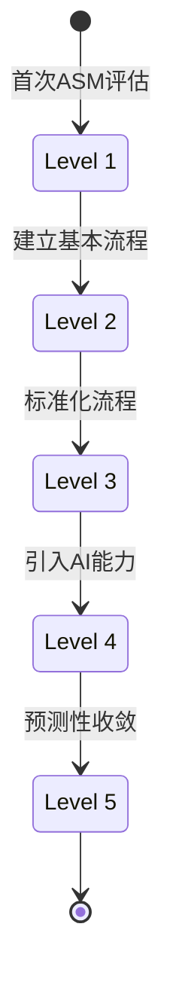
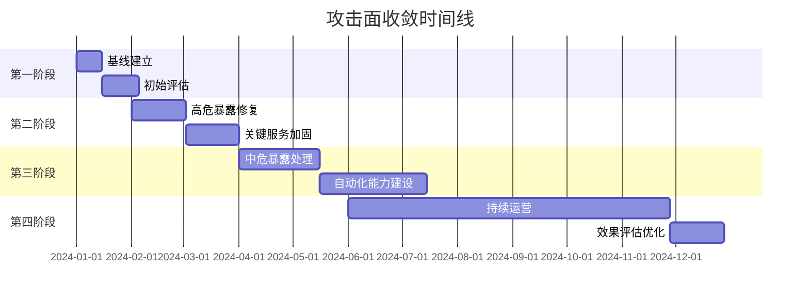

**作者：** HOS(安全风信子)
**日期：** 2026-04-24
**主要来源平台：** GitHub/arXiv
**摘要：** 攻击面管理不是一次性的项目，而是持续不断的征程。企业每天都有新的服务上线、新的漏洞披露、新的威胁涌现，攻击面在不断动态变化。如何在动态变化中保持攻击面的持续收敛，是每个安全团队面临的挑战。本文深入探讨AI驱动的攻击面收敛技术，通过建立持续监控机制、智能优先级决策、自动化修复建议，让攻击面管理从项目变成持续的运营能力。

@[TOC](目录)

---

# 攻击面只减不增：AI驱动攻击面收敛的实战策略

## 1. 引言：从项目到运营的转变

### 1.1 传统攻击面管理的困境

在数字化转型的浪潮中，企业的攻击面正以前所未有的速度扩张。根据Verizon发布的《2024年数据泄露调查报告》显示，超过60%的数据泄露事件源于暴露在互联网的资产，而其中绝大多数都是由于长期未修复的已知漏洞所致。传统的攻击面管理方法已经难以应对当前复杂多变的安全形势。

传统的攻击面管理往往被当作一次性的项目来执行：进行一次全面的攻击面评估，识别暴露点和漏洞，制定修复计划，然后项目结束。这种模式存在以下几个显著问题：

**第一，静态评估与动态环境的矛盾。** 传统评估模式本质上是"快照式"的，它只能反映评估时刻的攻击面状态。然而，在当今的云原生环境中，容器每天创建和销毁数千次，微服务架构使得服务间拓扑关系不断变化，基础设施即代码（IaC）的使用使得环境变更成为常态。一次性的评估结果可能在短短几天内就已经过时。

**第二，资源有限性与暴露点无限的矛盾。** 任何安全团队的资源都是有限的，但暴露点却似乎是无限的。根据Gartner的统计，一个中等规模的企业（员工2000人以上）平均拥有超过5000个互联网暴露的资产和服务。面对如此庞大的暴露点清单，安全团队往往陷入"救火模式"，无法系统性地进行收敛。

**第三，单点修复与根因治理的矛盾。** 传统的修复模式往往聚焦于单个漏洞或暴露点的修补，而忽视了暴露背后的系统性根因。结果是同类暴露反复出现，修复工作陷入"按下葫芦浮起瓢"的困境。

**第四，技术能力与业务敏捷的矛盾。** 安全团队往往需要在保证安全的同时支持业务的快速迭代。然而，传统安全流程的冗长审批和变更周期与DevOps时代的快速交付需求存在根本冲突。

### 1.2 持续收敛的理念与价值

现代安全运营需要的是持续的攻击面收敛能力。这不仅意味着要持续发现新的暴露点，更要及时处置，跟踪验证，形成闭环。同时，由于暴露点和修复资源都是有限的，还需要智能的优先级决策，确保将资源投入到最高价值的修复工作中。

持续攻击面收敛的核心价值体现在以下几个维度：

**从项目管理到运营能力的转变。** 传统的攻击面管理是一种"项目制"思维，追求在特定时间点完成特定目标。而持续收敛则是一种"运营制"思维，强调能力的持续性和过程的永续性。这不是简单的执行频率提升，而是思维模式的根本转变。

**从被动响应到主动预防的转变。** 通过持续监控和智能预测，系统能够在暴露点出现的第一时间发现它，甚至在暴露出现之前就采取预防措施。这大大降低了暴露的窗口期，提升了整体安全态势。

**从人工决策到智能决策的转变。** AI技术的引入为持续攻击面收敛带来了智能化的能力。通过机器学习算法，系统能够自动评估暴露风险、预测修复效果、优化修复优先级，让攻击面收敛从依赖人工的项目变成自动化的运营能力。

### 1.3 AI驱动的收敛革命

人工智能技术正在从根本上改变攻击面收敛的范式。传统的收敛工作流严重依赖安全专家的经验和直觉，这不仅效率低下，而且难以规模化。而AI驱动的收敛系统能够以机器的速度处理海量数据，以超越人类的准确性进行风险评估，以持续不断的方式执行监控任务。

AI在攻击面收敛中的核心应用场景包括：

**智能风险评估。** 基于历史数据和威胁情报，AI模型能够对每个暴露点进行多维度的风险评估，包括漏洞的可利用性、潜在影响范围、攻击路径复杂度等。这种评估远比人工判断更加全面和客观。

**预测性分析。** 通过分析暴露点的发展趋势和外部威胁情报，AI系统能够预测哪些暴露点最有可能被攻击者利用，从而帮助安全团队提前部署防御措施。

**自动化决策。** AI能够根据预设的策略和实时的环境状态，自动做出收敛决策，包括优先级排序、修复方案推荐、资源分配等。

**持续学习和优化。** AI系统能够从每次收敛实践中学习，不断优化自己的模型和策略，使得收敛效果随着时间推移不断提升。

## 2. 攻击面收敛的目标设定

### 2.1 收敛目标指标体系

攻击面收敛需要有明确、可衡量的目标。一个完善的指标体系是评估收敛效果、指导收敛方向、优化收敛策略的基础。在设计指标体系时，需要遵循SMART原则：具体（Specific）、可衡量（Measurable）、可达成（Achievable）、相关性（Relevant）和时限性（Time-bound）。

```python
class AttackSurfaceMetrics:
    """
    攻击面度量指标
    定义攻击面收敛的目标指标
    """

    METRICS = {
        'exposure_count': {
            'name': '暴露服务数量',
            'description': '直接暴露互联网的服务总数',
            'target_direction': 'decrease',
            'baseline_value': None,
            'target_reduction': 0.5
        },
        'critical_exposure_count': {
            'name': '高危暴露数量',
            'description': '存在高危漏洞的暴露服务数',
            'target_direction': 'decrease',
            'baseline_value': None,
            'target_reduction': 0.8
        },
        'mean_time_to_remediation': {
            'name': '平均修复时间',
            'description': '从暴露发现到修复完成的平均天数',
            'target_direction': 'decrease',
            'baseline_value': None,
            'target_reduction': 0.5
        },
        'exposure_reappearance_rate': {
            'name': '暴露反弹率',
            'description': '已修复暴露再次出现的比例',
            'target_direction': 'decrease',
            'baseline_value': None,
            'target_reduction': 0.7
        },
        'exposure_coverage': {
            'name': '暴露覆盖率',
            'description': '被持续监控的资产占总资产的比例',
            'target_direction': 'increase',
            'baseline_value': None,
            'target_increase': 0.95
        },
        'false_positive_rate': {
            'name': '误报率',
            'description': '评估中误报占总告警的比例',
            'target_direction': 'decrease',
            'baseline_value': None,
            'target_reduction': 0.6
        }
    }

    def __init__(self):
        self.current_values = {}

    def track_progress(self, metric_name, current_value):
        """跟踪指标进度"""
        metric = self.METRICS.get(metric_name)
        if not metric:
            return

        self.current_values[metric_name] = current_value

        if metric['baseline_value'] is None:
            metric['baseline_value'] = current_value

        if metric['target_direction'] == 'decrease':
            reduction = (metric['baseline_value'] - current_value) / metric['baseline_value']
            target_achieved = reduction >= metric['target_reduction']
            return {
                'metric': metric_name,
                'current': current_value,
                'baseline': metric['baseline_value'],
                'target': metric['baseline_value'] * (1 - metric['target_reduction']),
                'reduction_percent': round(reduction * 100, 2),
                'target_achieved': target_achieved
            }
        else:
            increase = (current_value - metric['baseline_value']) / metric['baseline_value']
            target_achieved = increase >= metric.get('target_increase', 1.0)
            return {
                'metric': metric_name,
                'current': current_value,
                'baseline': metric['baseline_value'],
                'target': metric['baseline_value'] * (1 + metric.get('target_increase', 1.0)),
                'increase_percent': round(increase * 100, 2),
                'target_achieved': target_achieved
            }

    def generate_metrics_report(self):
        """生成指标报告"""
        report = {
            'timestamp': datetime.now().isoformat(),
            'metrics': []
        }

        for metric_name in self.METRICS.keys():
            if metric_name in self.current_values:
                progress = self.track_progress(
                    metric_name,
                    self.current_values[metric_name]
                )
                report['metrics'].append(progress)

        report['overall_score'] = self._calculate_overall_score(report['metrics'])
        return report
```

**指标分类与权重设计**

为了更精确地衡量攻击面收敛的全面效果，我们通常将指标分为四个类别：

| 指标类别 | 指标名称 | 权重 | 目标方向 | 备注 |
|:---:|:---|:---:|:---:|:---|
| **覆盖类** | 暴露覆盖率 | 15% | ↑ | 衡量监控的完整性 |
| **数量类** | 暴露服务数量 | 20% | ↓ | 衡量暴露的绝对数量 |
| **质量类** | 高危暴露数量 | 25% | ↓ | 衡量暴露的严重程度 |
| **效率类** | 平均修复时间 | 20% | ↓ | 衡量响应速度 |
| **效率类** | 暴露反弹率 | 10% | ↓ | 衡量修复质量 |
| **效率类** | 误报率 | 10% | ↓ | 衡量评估准确性 |

这种分层加权的指标体系能够确保收敛工作既关注暴露的绝对数量，也关注暴露的质量（严重程度），同时不忽视运营效率。

### 2.2 持续收敛的基线建立

建立攻击面基线是衡量收敛效果的依据。一个准确的基线不仅能够为后续的收敛工作提供参照，还能够帮助识别收敛过程中的异常情况。基线建立是一个持续的过程，需要随着环境变化不断更新和调整。

```python
class ConvergenceBaseline:
    """
    收敛基线
    建立攻击面收敛的基准
    """

    def __init__(self, assessment_db):
        self.db = assessment_db

    def establish_baseline(self, assessment_date=None):
        """
        建立基线

        参数:
            assessment_date: 评估日期

        返回:
            dict: 基线数据
        """
        if assessment_date is None:
            assessment_date = datetime.now()

        exposures = self.db.get_exposures(before=assessment_date)

        baseline = {
            'date': assessment_date,
            'total_exposures': len(exposures),
            'by_severity': self._count_by_severity(exposures),
            'by_category': self._count_by_category(exposures),
            'by_asset_type': self._count_by_asset_type(exposures),
            'geographic_distribution': self._analyze_geo_distribution(exposures),
            'exposure_details': exposures,
            'risk_distribution': self._calculate_risk_distribution(exposures),
            'exposure_age_distribution': self._analyze_exposure_age(exposures),
            'exposure_discovery_rate': self._calculate_discovery_rate()
        }

        self.db.save_baseline(baseline)

        return baseline

    def _count_by_severity(self, exposures):
        """按严重程度统计"""
        counts = {'critical': 0, 'high': 0, 'medium': 0, 'low': 0}
        for exp in exposures:
            severity = exp.get('severity', 'medium')
            if severity in counts:
                counts[severity] += 1
        return counts

    def _count_by_category(self, exposures):
        """按暴露类别统计"""
        categories = {}
        for exp in exposures:
            category = exp.get('category', 'unknown')
            categories[category] = categories.get(category, 0) + 1
        return categories

    def _count_by_asset_type(self, exposures):
        """按资产类型统计"""
        asset_types = {}
        for exp in exposures:
            asset_type = exp.get('asset_type', 'unknown')
            asset_types[asset_type] = asset_types.get(asset_type, 0) + 1
        return asset_types

    def _analyze_geo_distribution(self, exposures):
        """分析地理分布"""
        geo_dist = {}
        for exp in exposures:
            geo = exp.get('geographic_location', 'unknown')
            geo_dist[geo] = geo_dist.get(geo, 0) + 1
        return geo_dist

    def _calculate_risk_distribution(self, exposures):
        """计算风险分布"""
        risk_buckets = {
            'critical_risk': 0,
            'high_risk': 0,
            'medium_risk': 0,
            'low_risk': 0
        }

        for exp in exposures:
            risk_score = exp.get('risk_score', 0.5)
            if risk_score >= 0.9:
                risk_buckets['critical_risk'] += 1
            elif risk_score >= 0.7:
                risk_buckets['high_risk'] += 1
            elif risk_score >= 0.4:
                risk_buckets['medium_risk'] += 1
            else:
                risk_buckets['low_risk'] += 1

        return risk_buckets

    def _analyze_exposure_age(self, exposures):
        """分析暴露时长分布"""
        age_buckets = {
            'less_than_7_days': 0,
            '7_to_30_days': 0,
            '30_to_90_days': 0,
            'more_than_90_days': 0
        }

        now = datetime.now()
        for exp in exposures:
            discovery_date = exp.get('discovery_date', now)
            age_days = (now - discovery_date).days

            if age_days < 7:
                age_buckets['less_than_7_days'] += 1
            elif age_days < 30:
                age_buckets['7_to_30_days'] += 1
            elif age_days < 90:
                age_buckets['30_to_90_days'] += 1
            else:
                age_buckets['more_than_90_days'] += 1

        return age_buckets

    def _calculate_discovery_rate(self):
        """计算发现率趋势"""
        return {
            'daily_average': self._calculate_daily_discovery_average(),
            'weekly_average': self._calculate_weekly_discovery_average(),
            'trend': self._analyze_discovery_trend()
        }
```

**基线建立的时机与策略**

基线建立不是一次性的工作，而是需要根据环境变化和业务发展持续更新。以下是基线更新的最佳实践：

| 触发条件 | 更新类型 | 更新内容 | 优先级 |
|:---|:---|:---|:---:|
| 新业务上线 | 部分更新 | 新业务相关的暴露点基线 | 高 |
| 重大漏洞披露 | 部分更新 | 受影响资产的风险评分 | 高 |
| 季度评估 | 全面更新 | 全量基线重新计算 | 中 |
| 架构变更 | 部分更新 | 变更涉及范围的基线 | 高 |
| 年度审计 | 全面更新 | 全量基线及历史对比 | 中 |

## 3. 智能收敛策略

### 3.1 收敛优先级决策

面对大量需要收敛的暴露点，安全团队需要科学的优先级决策。优先级决策是攻击面收敛的核心环节，它直接决定了有限资源的最优配置。传统的优先级决策往往依赖专家经验，存在主观性强、一致性差的问题。AI驱动的优先级决策系统能够综合考虑多方面因素，给出更加科学和一致的决策结果。

```python
class ConvergencePrioritizer:
    """
    收敛优先级决策器
    基于AI的收敛优先级排序
    """

    def __init__(self, risk_model, resource_optimizer):
        self.risk_model = risk_model
        self.resource_optimizer = resource_optimizer
        self.decision_history = []

    def prioritize_exposures(self, exposures, available_resources=None):
        """
        优先级排序

        参数:
            exposures: 暴露列表
            available_resources: 可用资源

        返回:
            list: 优先级排序后的暴露
        """
        if available_resources is None:
            available_resources = self._get_default_resources()

        scored_exposures = []

        for exposure in exposures:
            risk_score = self.risk_model.assess_exposure_risk(exposure)

            remediation_effort = self._estimate_remediation_effort(exposure)

            business_impact = self._assess_business_impact(exposure)

            resource_availability = self.resource_optimizer.check_availability(
                exposure,
                available_resources
            )

            priority_score = self._calculate_priority(
                risk_score,
                remediation_effort,
                business_impact,
                resource_availability
            )

            exploitability = self._assess_exploitability(exposure)

            threat_relevance = self._assess_threat_relevance(exposure)

            scored_exposures.append({
                'exposure': exposure,
                'priority_score': priority_score,
                'risk_score': risk_score,
                'effort_estimate': remediation_effort,
                'business_impact': business_impact,
                'resource_match': resource_availability,
                'exploitability': exploitability,
                'threat_relevance': threat_relevance,
                'breakdown': {
                    'risk_component': risk_score * 0.4,
                    'effort_component': (1.0 / (remediation_effort + 1)) * 0.2,
                    'impact_component': business_impact * 0.2,
                    'resource_component': (1.0 if resource_availability['available'] else 0.3) * 0.2
                }
            })

        scored_exposures.sort(
            key=lambda x: x['priority_score'],
            reverse=True
        )

        self._log_decision(scored_exposures)

        return scored_exposures

    def _calculate_priority(self, risk, effort, impact, resources):
        """计算优先级分数"""
        risk_weight = 0.4
        effort_weight = 0.2
        impact_weight = 0.2
        resource_weight = 0.2

        effort_penalty = 1.0 / (effort + 1)

        resource_availability = 1.0 if resources['available'] else 0.3

        priority = (
            risk * risk_weight +
            effort_penalty * effort_weight +
            impact * impact_weight +
            resource_availability * resource_weight
        )

        return priority

    def _estimate_remediation_effort(self, exposure):
        """
        估算修复工作量（人天）
        """
        base_effort = 1.0

        category = exposure.get('category', 'unknown')
        category_efforts = {
            'web_application': 3.0,
            'api_endpoint': 2.0,
            'database': 5.0,
            'network_service': 2.5,
            'cloud_resource': 1.5,
            'container': 1.0,
            'server': 4.0
        }
        base_effort = category_efforts.get(category, 2.0)

        complexity = exposure.get('complexity', 'medium')
        complexity_multipliers = {
            'low': 0.8,
            'medium': 1.0,
            'high': 1.5,
            'critical': 2.0
        }
        effort = base_effort * complexity_multipliers.get(complexity, 1.0)

        requires_downtime = exposure.get('requires_downtime', False)
        if requires_downtime:
            effort *= 1.5

        requires_coordination = exposure.get('requires_coordination', False)
        if requires_coordination:
            effort *= 1.3

        return effort

    def _assess_business_impact(self, exposure):
        """
        评估业务影响
        """
        business_criticality = exposure.get('business_criticality', 'medium')

        criticality_scores = {
            'critical': 1.0,
            'high': 0.75,
            'medium': 0.5,
            'low': 0.25
        }

        base_impact = criticality_scores.get(business_criticality, 0.5)

        revenue_impact = exposure.get('potential_revenue_impact', 0)
        impact += min(revenue_impact / 1000000, 0.3)

        data_sensitivity = exposure.get('data_sensitivity', 'medium')
        sensitivity_multipliers = {
            'high': 1.3,
            'medium': 1.0,
            'low': 0.8
        }
        impact = base_impact * sensitivity_multipliers.get(data_sensitivity, 1.0)

        return min(impact, 1.0)

    def _assess_exploitability(self, exposure):
        """
        评估可利用性
        考虑漏洞利用的难度和已知的利用工具/概念证明
        """
        exploitability_score = 0.5

        has_exploit_code = exposure.get('has_public_exploit', False)
        if has_exploit_code:
            exploitability_score += 0.3

        has_poc = exposure.get('has_poc', False)
        if has_poc:
            exploitability_score += 0.15

        attack_complexity = exposure.get('attack_complexity', 'medium')
        complexity_scores = {
            'low': 0.3,
            'medium': 0.0,
            'high': -0.2
        }
        exploitability_score += complexity_scores.get(attack_complexity, 0)

        is_malware_family = exposure.get('is_malware_family', False)
        if is_malware_family:
            exploitability_score += 0.15

        return max(0.0, min(1.0, exploitability_score))

    def _assess_threat_relevance(self, exposure):
        """
        评估威胁相关性
        考虑当前威胁情报中与该暴露相关的活跃威胁
        """
        threat_relevance = 0.5

        active_threats = self._get_active_threats()
        for threat in active_threats:
            if self._is_threat_relevant(exposure, threat):
                threat_relevance += threat.get('relevance_weight', 0.1)

        recent_attacks = self._get_recent_attack_intel()
        for attack in recent_attacks:
            if self._is_attack_relevant(exposure, attack):
                threat_relevance += 0.05

        return min(threat_relevance, 1.0)

    def _get_default_resources(self):
        """获取默认资源"""
        return {
            'security_analysts': 3,
            'network_engineers': 2,
            'system_admins': 2,
            'development_teams': 4,
            'budget': 50000
        }

    def _log_decision(self, scored_exposures):
        """记录决策历史用于模型优化"""
        self.decision_history.append({
            'timestamp': datetime.now(),
            'exposures_count': len(scored_exposures),
            'top_5_priorities': [
                exp['exposure']['id'] for exp in scored_exposures[:5]
            ],
            'score_distribution': self._calculate_score_distribution(scored_exposures)
        })

    def _calculate_score_distribution(self, scored_exposures):
        """计算分数分布"""
        if not scored_exposures:
            return {}

        scores = [exp['priority_score'] for exp in scored_exposures]
        return {
            'mean': sum(scores) / len(scores),
            'max': max(scores),
            'min': min(scores),
            'median': sorted(scores)[len(scores) // 2]
        }
```

**优先级决策矩阵**

在实际运营中，我们推荐使用多维度的优先级决策矩阵来辅助决策：

```mermaid
quadrantChart
    title 收敛优先级决策矩阵
    x-axis 低可利用性 --> 高可利用性
    y-axis 低业务影响 --> 高业务影响
    quadrant-1 紧急修复: 0.35, 0.75
    quadrant-2 重点关注: 0.15, 0.6
    quadrant-3 定期处理: 0.1, 0.2
    quadrant-4 持续监控: 0.5, 0.15
    "关键API未授权访问": [0.85, 0.9]
    "测试环境老旧漏洞": [0.7, 0.15]
    "内网老旧系统": [0.3, 0.4]
    "非关键服务弱加密": [0.2, 0.1]
```

| 象限 | 特征 | 决策策略 | 响应时间 |
|:---:|:---|:---|:---|
| **第一象限（紧急修复）** | 高可利用性 + 高业务影响 | 立即处理，启动应急响应流程 | 24小时内 |
| **第二象限（重点关注）** | 低可利用性 + 高业务影响 | 优先排期，准备应急预案 | 7天内 |
| **第三象限（定期处理）** | 低可利用性 + 低业务影响 | 纳入常规维护计划 | 季度内 |
| **第四象限（持续监控）** | 高可利用性 + 低业务影响 | 加强监控，准备快速响应 | 30天内 |

### 3.2 自动化收敛建议

AI系统能够自动生成收敛建议，包括具体的修复步骤和预期效果。自动化的收敛建议系统能够大大提升安全团队的运营效率，减少人工干预的需要，同时确保收敛决策的一致性和科学性。

```python
class ConvergenceRecommendationEngine:
    """
    收敛建议引擎
    自动生成收敛建议
    """

    def __init__(self, kb, playbook_db):
        self.kb = kb
        self.playbooks = playbook_db
        self.recommendation_cache = {}

    def generate_recommendations(self, exposure):
        """
        生成收敛建议

        参数:
            exposure: 暴露信息

        返回:
            dict: 收敛建议
        """
        cache_key = f"{exposure['category']}_{exposure.get('cve_id', 'generic')}"
        if cache_key in self.recommendation_cache:
            return self._apply_exposure_specific_context(
                self.recommendation_cache[cache_key],
                exposure
            )

        root_cause = self._analyze_root_cause(exposure)

        applicable_playbooks = self._find_applicable_playbooks(exposure)

        recommendations = []

        for playbook in applicable_playbooks:
            rec = {
                'playbook_id': playbook['id'],
                'playbook_name': playbook['name'],
                'steps': playbook['steps'],
                'expected_outcome': playbook['expected_outcome'],
                'success_rate': playbook['success_rate'],
                'estimated_effort': playbook['effort'],
                'risk_level': self._assess_remediation_risk(playbook),
                'prerequisites': playbook.get('prerequisites', []),
                'rollback_plan': playbook.get('rollback_plan', None),
                'validation_criteria': playbook.get('validation_criteria', [])
            }
            recommendations.append(rec)

        recommended = self._select_best_recommendation(recommendations)

        result = {
            'exposure_id': exposure['id'],
            'root_cause': root_cause,
            'recommendations': recommendations,
            'recommended': recommended,
            'estimated_improvement': self._estimate_improvement(
                exposure,
                recommended
            ),
            'alternative_approaches': self._generate_alternative_approaches(exposure)
        }

        self.recommendation_cache[cache_key] = result

        return self._apply_exposure_specific_context(result, exposure)

    def _analyze_root_cause(self, exposure):
        """
        分析根本原因
        """
        root_cause_analysis = {
            'primary_cause': None,
            'contributing_factors': [],
            'related_patterns': []
        }

        exposure_type = exposure.get('type', 'unknown')

        root_cause_patterns = {
            'misconfiguration': {
                'common_causes': [
                    '默认配置未修改',
                    '安全设置遗漏',
                    '配置变更管理缺失'
                ],
                'detection_method': '配置审计'
            },
            'vulnerability': {
                'common_causes': [
                    '补丁未及时应用',
                    '依赖组件版本过旧',
                    '代码安全缺陷'
                ],
                'detection_method': '漏洞扫描'
            },
            'oversight': {
                'common_causes': [
                    '新建资产未纳入安全管理',
                    '下线资产未同步清理',
                    '权限配置错误'
                ],
                'detection_method': '资产发现'
            },
            'design_flaw': {
                'common_causes': [
                    '架构设计未考虑安全',
                    '安全架构实施不完整',
                    '第三方组件风险'
                ],
                'detection_method': '安全架构评审'
            }
        }

        if exposure_type in root_cause_patterns:
            pattern_info = root_cause_patterns[exposure_type]
            root_cause_analysis['primary_cause'] = exposure_type
            root_cause_analysis['contributing_factors'] = pattern_info['common_causes']
            root_cause_analysis['detection_method'] = pattern_info['detection_method']

        return root_cause_analysis

    def _find_applicable_playbooks(self, exposure):
        """
        查找适用的操作手册
        """
        applicable = []

        category = exposure.get('category', 'unknown')
        severity = exposure.get('severity', 'medium')
        exposure_type = exposure.get('type', 'unknown')

        for playbook in self.playbooks.get_all():
            if self._is_playbook_applicable(playbook, exposure):
                playbook['match_score'] = self._calculate_playbook_match_score(
                    playbook, exposure
                )
                applicable.append(playbook)

        applicable.sort(key=lambda x: x['match_score'], reverse=True)

        return applicable[:5]

    def _is_playbook_applicable(self, playbook, exposure):
        """
        判断操作手册是否适用
        """
        if playbook.get('category') != exposure.get('category'):
            return False

        if playbook.get('severity_level') == 'critical' and \
           exposure.get('severity') not in ['critical', 'high']:
            return False

        prerequisites = playbook.get('prerequisites', [])
        for prereq in prerequisites:
            if not self._check_prerequisite(prereq, exposure):
                return False

        return True

    def _calculate_playbook_match_score(self, playbook, exposure):
        """
        计算操作手册匹配度
        """
        score = 0.5

        if playbook.get('category') == exposure.get('category'):
            score += 0.2

        severity_match = abs(
            self._severity_to_numeric(playbook.get('severity_level', 'medium')) -
            self._severity_to_numeric(exposure.get('severity', 'medium'))
        )
        score -= severity_match * 0.1

        exposure_type = exposure.get('type', 'unknown')
        if exposure_type in playbook.get('applicable_types', []):
            score += 0.15

        score += playbook.get('success_rate', 0.5) * 0.1

        return min(score, 1.0)

    def _severity_to_numeric(self, severity):
        """严重程度转数值"""
        mapping = {'critical': 4, 'high': 3, 'medium': 2, 'low': 1}
        return mapping.get(severity, 0)

    def _select_best_recommendation(self, recommendations):
        """
        选择最佳建议
        """
        if not recommendations:
            return None

        scored_recs = []
        for rec in recommendations:
            effectiveness = rec['success_rate'] * 0.4
            ease = (1.0 / (rec['estimated_effort'] + 1)) * 0.3
            safety = (1.0 - rec['risk_level']) * 0.3

            total_score = effectiveness + ease + safety
            rec['selection_score'] = total_score
            scored_recs.append(rec)

        scored_recs.sort(key=lambda x: x['selection_score'], reverse=True)

        return scored_recs[0]

    def _estimate_improvement(self, exposure, recommended):
        """
        估算改进效果
        """
        if not recommended:
            return {'risk_reduction': 0, 'exposure_elimination': 0}

        original_risk = exposure.get('risk_score', 0.5)

        expected_risk = original_risk * (1 - recommended['success_rate'])

        risk_reduction = original_risk - expected_risk

        return {
            'risk_reduction': round(risk_reduction * 100, 2),
            'expected_risk_score': round(expected_risk, 3),
            'exposure_elimination': recommended['success_rate'] * 100,
            'confidence_level': recommended['success_rate']
        }

    def _generate_alternative_approaches(self, exposure):
        """
        生成替代方案
        """
        alternatives = []

        if exposure.get('can_isolate', False):
            alternatives.append({
                'approach': '网络隔离',
                'description': '将暴露资产纳入隔离网络',
                'pros': ['快速实施', '无需修改应用'],
                'cons': ['可能影响业务连续性'],
                'estimated_time': '2-4小时'
            })

        if exposure.get('can_add_waf', False):
            alternatives.append({
                'approach': 'WAF防护',
                'description': '部署Web应用防火墙进行防护',
                'pros': ['实时防护', '可逐步调整规则'],
                'cons': ['需要维护规则', '可能影响性能'],
                'estimated_time': '1-2天'
            })

        if exposure.get('can_migrate', False):
            alternatives.append({
                'approach': '服务迁移',
                'description': '将服务迁移到更安全的托管环境',
                'pros': ['根本性解决', '提升整体安全态势'],
                'cons': ['周期长', '成本高'],
                'estimated_time': '1-4周'
            })

        return alternatives
```

### 3.3 智能资源优化配置

资源优化是收敛策略中的关键环节。安全团队的资源总是有限的，如何将有限的资源分配到最需要的地方，是提高收敛效率的关键。

```python
class ResourceOptimizer:
    """
    资源优化器
    优化收敛资源的分配和调度
    """

    def __init__(self, team_db, skill_db):
        self.team_db = team_db
        self.skill_db = skill_db
        self.allocation_history = []

    def optimize_allocation(self, prioritized_exposures, available_resources):
        """
        优化资源分配

        参数:
            prioritized_exposures: 优先级排序后的暴露列表
            available_resources: 可用资源

        返回:
            dict: 优化后的分配方案
        """
        allocation_plan = {
            'assignments': [],
            'unassigned': [],
            'resource_utilization': {}
        }

        remaining_resources = available_resources.copy()

        for item in prioritized_exposures:
            exposure = item['exposure']
            required_skills = self._get_required_skills(exposure)

            best_assignment = self._find_best_assignment(
                exposure,
                required_skills,
                remaining_resources
            )

            if best_assignment:
                allocation_plan['assignments'].append(best_assignment)
                self._update_resource_availability(
                    remaining_resources,
                    best_assignment
                )
            else:
                allocation_plan['unassigned'].append({
                    'exposure': exposure,
                    'reason': '资源不足或技能不匹配',
                    'required_skills': required_skills
                })

        allocation_plan['resource_utilization'] = self._calculate_utilization(
            available_resources,
            remaining_resources
        )

        self.allocation_history.append({
            'timestamp': datetime.now(),
            'exposures_count': len(prioritized_exposures),
            'assigned_count': len(allocation_plan['assignments']),
            'utilization': allocation_plan['resource_utilization']
        })

        return allocation_plan

    def _get_required_skills(self, exposure):
        """获取所需技能"""
        category = exposure.get('category', 'unknown')

        skill_mapping = {
            'web_application': ['web_security', 'code_review'],
            'network_service': ['network_security', 'system_admin'],
            'database': ['database_admin', 'data_security'],
            'cloud_resource': ['cloud_security', 'devops'],
            'api_endpoint': ['api_security', 'web_security']
        }

        return skill_mapping.get(category, ['general_security'])

    def _find_best_assignment(self, exposure, required_skills, resources):
        """
        找到最佳分配
        """
        for resource_key, resource_list in resources.items():
            if not resource_list:
                continue

            if not isinstance(resource_list, list):
                continue

            for resource in resource_list:
                if self._resource_has_required_skills(resource, required_skills):
                    return {
                        'exposure_id': exposure['id'],
                        'resource_type': resource_key,
                        'resource_id': resource['id'],
                        'resource_name': resource['name'],
                        'assigned_skills': required_skills,
                        'estimated_hours': self._estimate_hours(exposure)
                    }

        return None

    def _resource_has_required_skills(self, resource, required_skills):
        """检查资源是否具备所需技能"""
        resource_skills = resource.get('skills', [])
        return all(skill in resource_skills for skill in required_skills)

    def _estimate_hours(self, exposure):
        """估算工时"""
        base_hours = {
            'web_application': 16,
            'network_service': 8,
            'database': 24,
            'cloud_resource': 12,
            'api_endpoint': 8
        }
        category = exposure.get('category', 'unknown')
        return base_hours.get(category, 12)

    def _update_resource_availability(self, resources, assignment):
        """更新资源可用性"""
        resource_type = assignment['resource_type']
        resource_id = assignment['resource_id']
        hours = assignment['estimated_hours']

        if isinstance(resources.get(resource_type), list):
            for resource in resources[resource_type]:
                if resource['id'] == resource_id:
                    resource['available_hours'] -= hours
                    break

    def _calculate_utilization(self, original, remaining):
        """计算资源利用率"""
        utilization = {}
        for resource_type in original:
            if isinstance(original[resource_type], list):
                original_hours = sum(r.get('available_hours', 0) for r in original[resource_type])
                remaining_hours = sum(r.get('available_hours', 0) for r in remaining.get(resource_type, []))
                if original_hours > 0:
                    utilization[resource_type] = {
                        'total_hours': original_hours,
                        'used_hours': original_hours - remaining_hours,
                        'utilization_rate': round((original_hours - remaining_hours) / original_hours * 100, 2)
                    }
        return utilization
```

## 4. 持续收敛运营机制

### 4.1 实时监控与告警

持续收敛需要实时监控攻击面变化。实时监控是持续收敛的基础，它确保安全团队能够在第一时间发现新的暴露点和暴露变化，从而快速响应。

```python
class ConvergenceMonitor:
    """
    收敛监控器
    实时监控攻击面变化
    """

    def __init__(self, monitor, alerting):
        self.monitor = monitor
        self.alerting = alerting
        self.change_history = []
        self.baseline = None

    def check_for_changes(self):
        """检查变化"""
        current_state = self.monitor.get_current_attack_surface()

        if self.baseline is None:
            self.baseline = self._create_baseline_snapshot(current_state)

        previous_state = self.monitor.get_previous_state()

        changes = self._detect_changes(current_state, previous_state)

        if changes.get('new_exposures'):
            self._handle_new_exposures(changes['new_exposures'])

        if changes.get('escalated_exposures'):
            self._handle_escalated_exposures(changes['escalated_exposures'])

        if changes.get('resolved_exposures'):
            self._handle_resolved_exposures(changes['resolved_exposures'])

        if changes.get('deescalated_exposures'):
            self._handle_deescalated_exposures(changes['deescalated_exposures'])

        self._update_baseline_if_needed(current_state, changes)

        return changes

    def _handle_new_exposures(self, new_exposures):
        """处理新暴露"""
        for exposure in new_exposures:
            risk = self._assess_new_exposure_risk(exposure)

            if risk > 0.7:
                self.alerting.send_critical_alert({
                    'type': 'new_critical_exposure',
                    'exposure': exposure,
                    'risk_score': risk,
                    'action_required': 'immediate_attention',
                    'recommended_actions': self._get_emergency_actions(exposure)
                })
            elif risk > 0.4:
                self.alerting.send_warning({
                    'type': 'new_exposure',
                    'exposure': exposure,
                    'risk_score': risk,
                    'action_required': 'scheduled_review'
                })
            else:
                self.alerting.send_info({
                    'type': 'low_risk_exposure',
                    'exposure': exposure,
                    'action_required': 'routine_inclusion'
                })

            self._record_change('new_exposure', exposure)

    def _handle_escalated_exposures(self, escalated_exposures):
        """处理升级的暴露"""
        for exposure in escalated_exposures:
            previous_risk = exposure.get('previous_risk_score', 0)
            current_risk = exposure.get('current_risk_score', 0)
            risk_increase = current_risk - previous_risk

            self.alerting.send_critical_alert({
                'type': 'exposure_escalated',
                'exposure': exposure,
                'previous_risk': previous_risk,
                'current_risk': current_risk,
                'risk_increase': risk_increase,
                'escalation_reason': self._determine_escalation_reason(exposure),
                'action_required': 'immediate_review'
            })

            self._record_change('escalated', exposure)

    def _handle_resolved_exposures(self, resolved_exposures):
        """处理已解决的暴露"""
        for exposure in resolved_exposures:
            resolution_time = self._calculate_resolution_time(exposure)

            self.alerting.send_resolution_notification({
                'type': 'exposure_resolved',
                'exposure': exposure,
                'resolution_time_days': resolution_time,
                'resolution_method': exposure.get('resolution_method', 'unknown'),
                'verification_status': 'pending_verification'
            })

            self._record_change('resolved', exposure)

    def _handle_deescalated_exposures(self, deescalated_exposures):
        """处理降级的暴露"""
        for exposure in deescalated_exposures:
            self.alerting.send_info({
                'type': 'exposure_deescalated',
                'exposure': exposure,
                'previous_risk': exposure.get('previous_risk_score'),
                'current_risk': exposure.get('current_risk_score'),
                'action_required': 'update_documentation'
            })

            self._record_change('deescalated', exposure)

    def _assess_new_exposure_risk(self, exposure):
        """评估新暴露风险"""
        base_risk = 0.5

        severity = exposure.get('severity', 'medium')
        severity_risks = {
            'critical': 0.9,
            'high': 0.7,
            'medium': 0.5,
            'low': 0.2
        }
        base_risk = severity_risks.get(severity, 0.5)

        if exposure.get('has_public_exploit', False):
            base_risk += 0.2

        if exposure.get('is_internet_facing', True):
            base_risk += 0.1

        business_criticality = exposure.get('business_criticality', 'medium')
        if business_criticality == 'critical':
            base_risk += 0.15

        return min(base_risk, 1.0)

    def _get_emergency_actions(self, exposure):
        """获取紧急措施"""
        actions = []

        if exposure.get('can_isolate', False):
            actions.append({
                'action': '网络隔离',
                'priority': 1,
                'description': '立即将资产从网络隔离'
            })

        if exposure.get('can_disable', False):
            actions.append({
                'action': '暂时禁用',
                'priority': 2,
                'description': '暂时禁用受影响的服务'
            })

        actions.append({
            'action': '启动调查',
            'priority': 3,
            'description': '安全团队启动应急响应调查'
        })

        return actions

    def _determine_escalation_reason(self, exposure):
        """确定升级原因"""
        reasons = []

        if exposure.get('newly_exploitable', False):
            reasons.append('新公开漏洞利用代码')

        if exposure.get('threat_intelligence_match', False):
            reasons.append('威胁情报匹配')

        if exposure.get('anomalous_access_detected', False):
            reasons.append('检测到异常访问')

        if exposure.get('critical_data_access', False):
            reasons.append('访问到敏感数据')

        return reasons if reasons else ['未知原因']

    def _calculate_resolution_time(self, exposure):
        """计算解决时间"""
        discovered = exposure.get('discovered_at')
        resolved = exposure.get('resolved_at')

        if not discovered or not resolved:
            return None

        delta = resolved - discovered
        return delta.days

    def _create_baseline_snapshot(self, state):
        """创建基线快照"""
        return {
            'timestamp': datetime.now(),
            'total_exposures': len(state.get('exposures', [])),
            'by_severity': self._count_by_severity(state.get('exposures', [])),
            'hash': self._calculate_state_hash(state)
        }

    def _detect_changes(self, current, previous):
        """检测变化"""
        changes = {
            'new_exposures': [],
            'escalated_exposures': [],
            'resolved_exposures': [],
            'deescalated_exposures': []
        }

        if previous is None:
            changes['new_exposures'] = current.get('exposures', [])
            return changes

        current_exposures = {
            exp['id']: exp for exp in current.get('exposures', [])
        }
        previous_exposures = {
            exp['id']: exp for exp in previous.get('exposures', [])
        }

        for exp_id, exp in current_exposures.items():
            if exp_id not in previous_exposures:
                changes['new_exposures'].append(exp)
            else:
                prev_risk = previous_exposures[exp_id].get('risk_score', 0)
                curr_risk = exp.get('risk_score', 0)

                if curr_risk > prev_risk + 0.2:
                    exp['previous_risk_score'] = prev_risk
                    changes['escalated_exposures'].append(exp)
                elif curr_risk < prev_risk - 0.2:
                    exp['previous_risk_score'] = prev_risk
                    changes['deescalated_exposures'].append(exp)

        for exp_id, exp in previous_exposures.items():
            if exp_id not in current_exposures:
                exp['resolved_at'] = datetime.now()
                changes['resolved_exposures'].append(exp)

        return changes

    def _count_by_severity(self, exposures):
        """按严重程度统计"""
        counts = {'critical': 0, 'high': 0, 'medium': 0, 'low': 0}
        for exp in exposures:
            severity = exp.get('severity', 'medium')
            if severity in counts:
                counts[severity] += 1
        return counts

    def _calculate_state_hash(self, state):
        """计算状态哈希"""
        import hashlib
        state_str = str(sorted(state.items()))
        return hashlib.md5(state_str.encode()).hexdigest()

    def _update_baseline_if_needed(self, current_state, changes):
        """必要时更新基线"""
        if len(changes['new_exposures']) > 10 or \
           len(changes['escalated_exposures']) > 5 or \
           len(changes['resolved_exposures']) > 10:
            self.baseline = self._create_baseline_snapshot(current_state)

    def _record_change(self, change_type, exposure):
        """记录变化历史"""
        self.change_history.append({
            'timestamp': datetime.now(),
            'type': change_type,
            'exposure_id': exposure.get('id'),
            'severity': exposure.get('severity')
        })

        if len(self.change_history) > 1000:
            self.change_history = self.change_history[-500:]
```

### 4.2 闭环跟踪机制

每个暴露点的收敛都需要闭环跟踪。闭环跟踪是确保收敛工作真正落地的关键，没有闭环的收敛是无效的收敛。

```python
class ConvergenceTracker:
    """
    收敛跟踪器
    跟踪收敛进度和效果
    """

    def __init__(self, tracker_db):
        self.db = tracker_db
        self.active_tracking = {}
        self.resolution_cache = {}

    def track_remediation(self, exposure_id, remediation_action):
        """
        跟踪修复进度

        参数:
            exposure_id: 暴露ID
            remediation_action: 修复措施

        返回:
            str: 跟踪ID
        """
        tracking_record = {
            'exposure_id': exposure_id,
            'action': remediation_action,
            'start_time': datetime.now(),
            'status': 'in_progress',
            'milestones': self._define_milestones(remediation_action),
            'current_milestone': 0,
            'progress_percent': 0,
            'blockers': [],
            'notes': []
        }

        tracking_id = self.db.save_tracking(tracking_record)
        tracking_record['id'] = tracking_id

        self.active_tracking[exposure_id] = tracking_record

        return tracking_id

    def update_progress(self, exposure_id, progress_update):
        """
        更新进度

        参数:
            exposure_id: 暴露ID
            progress_update: 进度更新
        """
        tracking = self.active_tracking.get(exposure_id)
        if not tracking:
            tracking = self.db.get_tracking_by_exposure(exposure_id)

        if progress_update.get('milestone_completed'):
            tracking['current_milestone'] += 1
            progress = tracking['current_milestone'] / len(tracking['milestones'])
            tracking['progress_percent'] = int(progress * 100)

        if progress_update.get('blocker'):
            tracking['blockers'].append({
                'description': progress_update['blocker'],
                'reported_at': datetime.now()
            })

        if progress_update.get('note'):
            tracking['notes'].append({
                'content': progress_update['note'],
                'added_at': datetime.now()
            })

        self.db.update_tracking(tracking)

        if tracking['progress_percent'] >= 100:
            tracking['status'] = 'awaiting_verification'
            self.db.update_tracking_status(tracking['id'], 'awaiting_verification')

    def verify_resolution(self, exposure_id):
        """
        验证是否已解决

        参数:
            exposure_id: 暴露ID

        返回:
            dict: 验证结果
        """
        current_state = self._check_current_state(exposure_id)

        original_exposure = self.db.get_original_exposure(exposure_id)

        is_resolved = self._is_exposure_resolved(current_state, original_exposure)

        verification_result = {
            'exposure_id': exposure_id,
            'is_resolved': is_resolved,
            'current_state': current_state,
            'original_state': original_exposure,
            'resolution_quality': self._assess_resolution_quality(
                current_state,
                original_exposure
            ),
            'verification_timestamp': datetime.now()
        }

        if is_resolved:
            verification_result['resolution_details'] = self._get_resolution_details(
                original_exposure
            )
            verification_result['next_verification_due'] = self._schedule_next_verification(
                original_exposure
            )

        self.resolution_cache[exposure_id] = verification_result

        return verification_result

    def _define_milestones(self, remediation_action):
        """定义里程碑"""
        common_milestones = [
            {'name': '初步评估', 'description': '确认暴露范围和影响'},
            {'name': '修复计划制定', 'description': '制定详细修复方案'},
            {'name': '修复审批', 'description': '获得必要的修复审批'},
            {'name': '修复执行', 'description': '执行修复措施'},
            {'name': '验证测试', 'description': '验证修复效果'},
            {'name': '生产部署', 'description': '生产环境部署'},
            {'name': '监控确认', 'description': '确认暴露已消除'}
        ]

        action_type = remediation_action.get('type', 'standard')

        if action_type == 'quick_win':
            return [
                common_milestones[0],
                common_milestones[3],
                common_milestones[4],
                common_milestones[6]
            ]
        elif action_type == 'standard':
            return common_milestones
        elif action_type == 'complex':
            return common_milestones + [
                {'name': '回归测试', 'description': '完整回归测试'},
                {'name': ' stakeholders审批', 'description': '多方stakeholders审批'}
            ]

        return common_milestones

    def _check_current_state(self, exposure_id):
        """检查当前状态"""
        exposure = self.db.get_exposure(exposure_id)

        if not exposure:
            return {
                'exists': False,
                'state': 'unknown'
            }

        current_risk = exposure.get('current_risk_score', 1.0)
        is_exposed = exposure.get('is_exposed', True)
        has_vulnerabilities = exposure.get('vulnerabilities', []) != []

        return {
            'exists': True,
            'state': 'exposed' if is_exposed else 'mitigated',
            'current_risk': current_risk,
            'has_vulnerabilities': has_vulnerabilities,
            'vulnerability_count': len(exposure.get('vulnerabilities', [])),
            'last_scanned': exposure.get('last_scanned_at')
        }

    def _is_exposure_resolved(self, current_state, original_exposure):
        """判断暴露是否已解决"""
        if not current_state.get('exists', False):
            return True

        if current_state.get('state') == 'mitigated':
            return True

        if current_state.get('current_risk', 1.0) < 0.3:
            return True

        if not current_state.get('has_vulnerabilities', True):
            return True

        return False

    def _assess_resolution_quality(self, current_state, original_exposure):
        """评估解决质量"""
        if not original_exposure:
            return {'quality': 'unknown', 'score': 0}

        original_risk = original_exposure.get('risk_score', 1.0)
        current_risk = current_state.get('current_risk', 1.0)

        risk_reduction = original_risk - current_risk

        if risk_reduction >= 0.8:
            quality = 'excellent'
            score = 95
        elif risk_reduction >= 0.6:
            quality = 'good'
            score = 80
        elif risk_reduction >= 0.4:
            quality = 'acceptable'
            score = 65
        elif risk_reduction >= 0.2:
            quality = 'partial'
            score = 50
        else:
            quality = 'insufficient'
            score = 30

        return {
            'quality': quality,
            'score': score,
            'risk_reduction': risk_reduction,
            'meets_sla': self._check_sla_compliance(original_exposure)
        }

    def _check_sla_compliance(self, original_exposure):
        """检查SLA合规性"""
        severity = original_exposure.get('severity', 'medium')

        sla_targets = {
            'critical': 1,
            'high': 7,
            'medium': 30,
            'low': 90
        }

        target_days = sla_targets.get(severity, 30)

        discovered = original_exposure.get('discovered_at')
        if not discovered:
            return {'compliant': True, 'days_remaining': target_days}

        resolved = datetime.now()
        days_elapsed = (resolved - discovered).days

        return {
            'compliant': days_elapsed <= target_days,
            'days_elapsed': days_elapsed,
            'target_days': target_days,
            'days_remaining': target_days - days_elapsed
        }

    def _get_resolution_details(self, original_exposure):
        """获取解决详情"""
        return {
            'resolution_method': original_exposure.get('resolution_method'),
            'resolved_by': original_exposure.get('resolved_by'),
            'resolved_at': original_exposure.get('resolved_at'),
            'cost': original_exposure.get('remediation_cost'),
            'lessons_learned': original_exposure.get('lessons_learned')
        }

    def _schedule_next_verification(self, exposure):
        """安排下次验证"""
        severity = exposure.get('severity', 'medium')

        verification_intervals = {
            'critical': 7,
            'high': 14,
            'medium': 30,
            'low': 90
        }

        interval_days = verification_intervals.get(severity, 30)

        next_verification = datetime.now() + timedelta(days=interval_days)

        return {
            'due_date': next_verification,
            'interval_days': interval_days
        }
```

### 4.3 收敛运营仪表盘

收敛运营需要可视化的仪表盘来展示关键指标和趋势。一个设计良好的仪表盘能够帮助安全管理者快速了解收敛态势，识别问题领域，并做出数据驱动的决策。

```mermaid
block-beta
    columns 3

    block:header:3
        columns 3
        title["攻击面收敛运营仪表盘"]
    end

    block:metrics:3
        columns 4
        exp_count["暴露总数" 247]
        critical_count["高危暴露" 12]
        mttd["平均修复时间" 8.5天]
        resolution_rate["解决率" 87%]
    end

    block:trends:3
        columns 2
        trend_chart["趋势图"]
        severity_dist["严重度分布"]
    end

    block:details:3
        columns 3
        pending["待处理" 35]
        in_progress["处理中" 18]
        blocked["已阻塞" 4]
    end

    style title fill:#1a1a2e,stroke:#eee
    style exp_count fill:#16213e,stroke:#eee
    style critical_count fill:#e94560,stroke:#eee
    style mttd fill:#0f3460,stroke:#eee
    style resolution_rate fill:#1a1a2e,stroke:#eee
```

**仪表盘关键指标说明**

| 指标类别 | 指标名称 | 计算方式 | 健康阈值 | 告警阈值 |
|:---:|:---|:---|:---:|:---:|
| **规模指标** | 暴露总数 | 直接统计 | <基线50% | >基线 |
| **规模指标** | 高危暴露数 | 直接统计 | <10 | >20 |
| **效率指标** | MTTD | 平均修复天数 | <7天 | >14天 |
| **效率指标** | MTTR | 平均响应天数 | <30天 | >60天 |
| **质量指标** | 解决率 | 已解决/发现总数 | >85% | <70% |
| **质量指标** | 反弹率 | 再次暴露/已解决 | <10% | >20% |
| **质量指标** | SLA达标率 | SLA达标数/总数 | >90% | <80% |

## 5. 攻击面收敛最佳实践

### 5.1 组织协作机制

攻击面收敛需要跨部门协作。有效的协作机制是收敛成功的关键保障。

```mermaid
graph TB
    subgraph 安全运营中心
        SOC[安全运营团队]
        ASM[攻击面管理团队]
        CTI[威胁情报团队]
    end

    subgraph IT运维
        NET[网络运维]
        SYS[系统运维]
        CLOUD[云运维]
        APP[应用运维]
    end

    subgraph 业务部门
        BUS[业务负责人]
        DEV[开发团队]
        PRODUCT[产品团队]
    end

    subgraph 管理层
        CISO[CISO]
        CIO[CIO]
    end

    ASM --> SOC
    ASM --> CTI
    SOC --> NET
    SOC --> SYS
    SOC --> CLOUD
    SOC --> APP
    ASM --> BUS
    ASM --> DEV
    SOC --> CISO
    ASM --> CISO
    CISO --> CIO
    BUS --> PRODUCT

    style SOC fill:#e94560
    style ASM fill:#0f3460
    style CISO fill:#16213e
```



**跨部门协作流程**

| 协作场景 | 发起方 | 协作方 | 协作方式 | 时效要求 |
|:---|:---:|:---:|:---|:---:|
| 新暴露发现 | ASM | SOC | 工单通知+即时消息 | 立即 |
| 高危暴露修复 | SOC | IT运维 | 应急响应群组 | 4小时内响应 |
| 业务影响评估 | ASM | 业务负责人 | 正式沟通+影响报告 | 24小时内 |
| 修复方案审批 | IT运维 | 安全团队 | 审批流程 | 按SLA |
| 根因分析协作 | SOC | 开发团队 | 联合复盘会议 | 周例会 |
| 策略调整汇报 | ASM | CISO | 月度报告 | 月度 |

### 5.2 收敛效果评估

定期评估收敛效果，持续优化策略。

```python
class ConvergenceEffectivenessEvaluator:
    """
    收敛效果评估器
    评估收敛策略的有效性
    """

    def __init__(self, metrics_db, history_db):
        self.metrics_db = metrics_db
        self.history_db = history_db

    def evaluate(self, period_days=90):
        """
        评估效果

        参数:
            period_days: 评估周期

        返回:
            dict: 评估结果
        """
        start_date = datetime.now() - timedelta(days=period_days)

        new_exposures = self._count_new_exposures(start_date)

        resolved_exposures = self._count_resolved_exposures(start_date)

        avg_resolution_time = self._calculate_avg_resolution_time(start_date)

        resolution_rate = resolved_exposures / new_exposures if new_exposures > 0 else 0

        risk_reduction = self._calculate_risk_reduction(start_date)

        return {
            'period': f'{start_date.date()} to {datetime.now().date()}',
            'new_exposures': new_exposures,
            'resolved_exposures': resolved_exposures,
            'resolution_rate': round(resolution_rate * 100, 2),
            'avg_resolution_days': round(avg_resolution_time, 1),
            'risk_reduction_percent': round(risk_reduction * 100, 2),
            'effectiveness_score': self._calculate_effectiveness_score(
                resolution_rate,
                avg_resolution_time,
                risk_reduction
            ),
            'trend_analysis': self._analyze_trends(start_date),
            'bottlenecks': self._identify_bottlenecks(start_date),
            'recommendations': self._generate_recommendations(start_date)
        }

    def _count_new_exposures(self, start_date):
        """统计新暴露"""
        exposures = self.metrics_db.query(
            'exposures',
            where={'discovered_at >=': start_date}
        )
        return len(exposures)

    def _count_resolved_exposures(self, start_date):
        """统计已解决暴露"""
        exposures = self.metrics_db.query(
            'exposures',
            where={
                'resolved_at >=': start_date,
                'status': 'resolved'
            }
        )
        return len(exposures)

    def _calculate_avg_resolution_time(self, start_date):
        """计算平均解决时间"""
        resolved = self.metrics_db.query(
            'exposures',
            where={
                'resolved_at >=': start_date,
                'status': 'resolved'
            }
        )

        if not resolved:
            return 0

        total_days = 0
        for exp in resolved:
            discovered = exp.get('discovered_at')
            resolved_at = exp.get('resolved_at')
            if discovered and resolved_at:
                total_days += (resolved_at - discovered).days

        return total_days / len(resolved) if resolved else 0

    def _calculate_risk_reduction(self, start_date):
        """计算风险降低"""
        baseline = self.metrics_db.get_baseline(
            start_date - timedelta(days=1)
        )
        current = self.metrics_db.get_current_state()

        if not baseline or not current:
            return 0

        baseline_risk = baseline.get('weighted_risk_score', 1.0)
        current_risk = current.get('weighted_risk_score', 1.0)

        return (baseline_risk - current_risk) / baseline_risk if baseline_risk > 0 else 0

    def _calculate_effectiveness_score(self, resolution_rate, avg_time, risk_reduction):
        """计算效果评分"""
        resolution_score = resolution_rate * 40

        time_score = max(0, (30 - avg_time) / 30) * 30 if avg_time <= 30 else 0

        risk_score = risk_reduction * 30

        return round(resolution_score + time_score + risk_score, 2)

    def _analyze_trends(self, start_date):
        """分析趋势"""
        weekly_data = self.history_db.get_weekly_summaries(start_date)

        trends = {
            'exposure_trend': self._calculate_trend(
                [w['exposure_count'] for w in weekly_data]
            ),
            'resolution_trend': self._calculate_trend(
                [w['resolution_rate'] for w in weekly_data]
            ),
            'mttd_trend': self._calculate_trend(
                [w['avg_resolution_days'] for w in weekly_data]
            )
        }

        return trends

    def _calculate_trend(self, values):
        """计算趋势"""
        if len(values) < 2:
            return {'direction': 'stable', 'change_percent': 0}

        first = values[0]
        last = values[-1]

        if first == 0:
            return {'direction': 'unknown', 'change_percent': 0}

        change = (last - first) / first * 100

        if change > 10:
            direction = 'increasing'
        elif change < -10:
            direction = 'decreasing'
        else:
            direction = 'stable'

        return {
            'direction': direction,
            'change_percent': round(change, 2)
        }

    def _identify_bottlenecks(self, start_date):
        """识别瓶颈"""
        bottlenecks = []

        avg_time = self._calculate_avg_resolution_time(start_date)
        if avg_time > 30:
            bottlenecks.append({
                'type': 'slow_resolution',
                'description': '平均修复时间过长',
                'current_value': f'{avg_time}天',
                'target_value': '30天以内',
                'severity': 'high' if avg_time > 60 else 'medium'
            })

        resolution_rate = self._get_resolution_rate(start_date)
        if resolution_rate < 0.7:
            bottlenecks.append({
                'type': 'low_resolution_rate',
                'description': '解决率偏低',
                'current_value': f'{resolution_rate * 100}%',
                'target_value': '85%以上',
                'severity': 'high' if resolution_rate < 0.5 else 'medium'
            })

        blocked = self._count_blocked_remediations(start_date)
        if blocked > 10:
            bottlenecks.append({
                'type': 'blocked_remediations',
                'description': '存在大量阻塞的修复任务',
                'current_value': f'{blocked}个',
                'target_value': '10个以内',
                'severity': 'high' if blocked > 20 else 'medium'
            })

        return bottlenecks

    def _get_resolution_rate(self, start_date):
        """获取解决率"""
        new_count = self._count_new_exposures(start_date)
        resolved_count = self._count_resolved_exposures(start_date)
        return resolved_count / new_count if new_count > 0 else 0

    def _count_blocked_remediations(self, start_date):
        """统计阻塞的修复任务"""
        blocked = self.metrics_db.query(
            'remediations',
            where={
                'created_at >=': start_date,
                'status': 'blocked'
            }
        )
        return len(blocked)

    def _generate_recommendations(self, start_date):
        """生成建议"""
        recommendations = []

        bottlenecks = self._identify_bottlenecks(start_date)

        for bottleneck in bottlenecks:
            if bottleneck['type'] == 'slow_resolution':
                recommendations.append({
                    'priority': 'high',
                    'category': 'process_optimization',
                    'title': '优化修复流程',
                    'description': '简化审批流程，增加自动化工具',
                    'expected_impact': '将平均修复时间降低50%'
                })

            if bottleneck['type'] == 'low_resolution_rate':
                recommendations.append({
                    'priority': 'high',
                    'category': 'resource_allocation',
                    'title': '增加安全资源投入',
                    'description': '评估当前团队能力，考虑外包或增加人手',
                    'expected_impact': '提升解决率至85%以上'
                })

            if bottleneck['type'] == 'blocked_remediations':
                recommendations.append({
                    'priority': 'medium',
                    'category': 'stakeholder_engagement',
                    'title': '加强跨部门协作',
                    'description': '与业务方建立快速沟通机制',
                    'expected_impact': '减少阻塞，加快修复进度'
                })

        return recommendations
```

### 5.3 收敛成熟度模型

为了帮助企业评估自身的收敛能力水平，我们定义了攻击面收敛成熟度模型：

| 成熟度等级 | 特征描述 | 关键能力 | 评估指标 |
|:---:|:---|:---|:---|
| **Level 1: 初始级** | 被动响应，无明确流程 | 基本的漏洞扫描 | 覆盖率 <50% |
| **Level 2: 已管理** | 有流程但依赖人工 | 基本的优先级排序 | 覆盖率 50-70% |
| **Level 3: 已定义** | 流程标准化，有基线 | 自动化发现 | 覆盖率 70-85% |
| **Level 4: 量化管理** | 指标驱动的运营 | AI辅助决策 | 覆盖率 85-95% |
| **Level 5: 持续优化** | 预测性收敛 | 全自动化闭环 | 覆盖率 >95% |

**成熟度提升路径**



## 6. 高级收敛策略

### 6.1 基于风险的动态收敛

传统的收敛策略往往是静态的——基于漏洞的严重程度和资产的业务价值设定固定的优先级。然而，这种方法忽略了威胁环境的动态变化。高级收敛策略需要能够根据实时的威胁情报和风险评估动态调整收敛优先级。

```python
class DynamicRiskBasedConvergence:
    """
    基于风险的动态收敛策略
    根据实时风险动态调整收敛优先级
    """

    def __init__(self, risk_engine, threat_intel, asset_context):
        self.risk_engine = risk_engine
        self.threat_intel = threat_intel
        self.asset_context = asset_context
        self.risk_history = []

    def calculate_dynamic_priority(self, exposure):
        """
        计算动态优先级

        考虑因素:
        - 基础风险评分
        - 实时威胁情报
        - 资产上下文
        - 利用可能性
        - 暴露时长
        """
        base_risk = self._calculate_base_risk(exposure)

        threat_multiplier = self._get_threat_multiplier(exposure)

        exposure_age = self._calculate_exposure_age(exposure)
        age_multiplier = self._get_age_multiplier(exposure_age)

        asset_context_multiplier = self._get_asset_context_multiplier(exposure)

        exploitability = self._calculate_exploitability(exposure)

        dynamic_priority = (
            base_risk *
            threat_multiplier *
            age_multiplier *
            asset_context_multiplier *
            exploitability
        )

        self._record_risk_calculation(exposure, {
            'base_risk': base_risk,
            'threat_multiplier': threat_multiplier,
            'age_multiplier': age_multiplier,
            'context_multiplier': asset_context_multiplier,
            'exploitability': exploitability,
            'final_priority': dynamic_priority
        })

        return dynamic_priority

    def _calculate_base_risk(self, exposure):
        """计算基础风险"""
        severity_weights = {
            'critical': 1.0,
            'high': 0.75,
            'medium': 0.5,
            'low': 0.25
        }

        severity = exposure.get('severity', 'medium')
        base = severity_weights.get(severity, 0.5)

        if exposure.get('has_public_exploit', False):
            base *= 1.3

        if exposure.get('is_internet_facing', True):
            base *= 1.2

        cvss_score = exposure.get('cvss_score', 5.0)
        cvss_normalized = cvss_score / 10.0
        base = base * 0.5 + cvss_normalized * 0.5

        return min(base, 1.0)

    def _get_threat_multiplier(self, exposure):
        """获取威胁乘数"""
        base_multiplier = 1.0

        active_campaigns = self.threat_intel.get_active_campaigns()

        for campaign in active_campaigns:
            if self._is_campaign_relevant(exposure, campaign):
                base_multiplier *= campaign.get('relevance_factor', 1.5)

        recent_cves = self.threat_intel.get_recent_cves(days=30)
        for cve in recent_cves:
            if self._is_cve_relevant(exposure, cve):
                base_multiplier *= 1.2

        darknet_mentions = self.threat_intel.check_darknet(exposure)
        if darknet_mentions > 0:
            base_multiplier *= (1.0 + darknet_mentions * 0.1)

        return min(base_multiplier, 3.0)

    def _is_campaign_relevant(self, exposure, campaign):
        """检查活动相关性"""
        campaign_ttps = campaign.get('ttps', [])
        exposure_category = exposure.get('category', '')

        relevant_categories = {
            'web_application': ['T1190', 'T1133'],
            'database': ['T1505'],
            'network_service': ['T0886']
        }

        exposure_ttps = relevant_categories.get(exposure_category, [])

        return any(ttp in campaign_ttps for ttp in exposure_ttps)

    def _is_cve_relevant(self, exposure, cve):
        """检查CVE相关性"""
        if exposure.get('cve_id') == cve.get('cve_id'):
            return True

        if exposure.get('affected_product') in cve.get('affected_products', []):
            return True

        return False

    def _calculate_exposure_age(self, exposure):
        """计算暴露时长"""
        discovered = exposure.get('discovered_at', datetime.now())
        return (datetime.now() - discovered).days

    def _get_age_multiplier(self, age_days):
        """获取时长乘数"""
        if age_days <= 7:
            return 0.8
        elif age_days <= 30:
            return 1.0
        elif age_days <= 90:
            return 1.2
        elif age_days <= 180:
            return 1.5
        else:
            return 2.0

    def _get_asset_context_multiplier(self, exposure):
        """获取资产上下文乘数"""
        multiplier = 1.0

        criticality = exposure.get('business_criticality', 'medium')
        criticality_multipliers = {
            'critical': 1.5,
            'high': 1.2,
            'medium': 1.0,
            'low': 0.8
        }
        multiplier *= criticality_multipliers.get(criticality, 1.0)

        if exposure.get('contains_pii', False):
            multiplier *= 1.3

        if exposure.get('contains_ipp', False):
            multiplier *= 1.4

        if exposure.get('is_crown_jewels', False):
            multiplier *= 1.5

        return min(multiplier, 2.5)

    def _calculate_exploitability(self, exposure):
        """计算可利用性"""
        exploitability = 0.5

        if exposure.get('has_public_exploit', False):
            exploitability += 0.3

        if exposure.get('has_poc', False):
            exploitability += 0.15

        if exposure.get('in_malware_family', False):
            exploitability += 0.15

        attack_complexity = exposure.get('attack_complexity', 'medium')
        complexity_adjustments = {
            'low': 0.15,
            'medium': 0.0,
            'high': -0.15
        }
        exploitability += complexity_adjustments.get(attack_complexity, 0)

        return min(max(exploitability, 0.0), 1.0)

    def _record_risk_calculation(self, exposure, calculation):
        """记录风险计算历史"""
        record = {
            'exposure_id': exposure['id'],
            'timestamp': datetime.now(),
            'calculation': calculation
        }
        self.risk_history.append(record)

        if len(self.risk_history) > 10000:
            self.risk_history = self.risk_history[-5000:]

    def get_risk_trend(self, exposure_id):
        """获取风险趋势"""
        exposure_history = [
            r for r in self.risk_history
            if r['exposure_id'] == exposure_id
        ]

        if len(exposure_history) < 2:
            return {'trend': 'insufficient_data', 'change': 0}

        latest = exposure_history[-1]['calculation']['final_priority']
        previous = exposure_history[-2]['calculation']['final_priority']

        change = (latest - previous) / previous * 100 if previous > 0 else 0

        if change > 10:
            trend = 'increasing'
        elif change < -10:
            trend = 'decreasing'
        else:
            trend = 'stable'

        return {
            'trend': trend,
            'change_percent': round(change, 2),
            'current_priority': latest,
            'history_points': len(exposure_history)
        }
```

### 6.2 预测性收敛分析

高级收敛策略不仅关注当前的暴露状态，还要预测未来的暴露趋势。预测性分析能够帮助安全团队提前部署资源，在暴露变成问题之前消除它。

```python
class PredictiveConvergenceAnalyzer:
    """
    预测性收敛分析器
    预测暴露趋势并提前采取行动
    """

    def __init__(self, historical_data, ml_model):
        self.historical_data = historical_data
        self.ml_model = ml_model
        self.predictions_cache = {}

    def predict_exposure_trend(self, asset_group, days_ahead=30):
        """
        预测暴露趋势

        参数:
            asset_group: 资产组
            days_ahead: 预测天数

        返回:
            dict: 预测结果
        """
        historical_features = self._extract_features(asset_group)

        future_features = self._project_features(
            historical_features,
            days_ahead
        )

        exposure_count_prediction = self.ml_model.predict(
            future_features,
            model_type='exposure_count'
        )

        risk_level_prediction = self.ml_model.predict(
            future_features,
            model_type='risk_level'
        )

        confidence_intervals = self.ml_model.predict_with_confidence(
            future_features
        )

        return {
            'asset_group': asset_group['name'],
            'prediction_days': days_ahead,
            'predicted_exposure_count': exposure_count_prediction,
            'predicted_avg_risk': risk_level_prediction,
            'confidence_interval': confidence_intervals,
            'trend_direction': self._determine_trend_direction(
                historical_features,
                future_features
            ),
            'risk_factors': self._identify_risk_factors(asset_group)
        }

    def identify_at_risk_assets(self):
        """
        识别高风险资产

        返回:
            list: 高风险资产列表及风险原因
        """
        all_assets = self.historical_data.get_all_assets()

        at_risk_assets = []

        for asset in all_assets:
            risk_score = self._calculate_asset_risk_score(asset)

            if risk_score > 0.7:
                risk_factors = self._analyze_risk_factors(asset)

                predicted_change = self._predict_asset_change(asset)

                at_risk_assets.append({
                    'asset': asset,
                    'current_risk_score': risk_score,
                    'risk_factors': risk_factors,
                    'predicted_change': predicted_change,
                    'recommended_actions': self._generate_recommendations(
                        asset,
                        risk_factors
                    )
                })

        at_risk_assets.sort(
            key=lambda x: x['current_risk_score'],
            reverse=True
        )

        return at_risk_assets

    def _extract_features(self, asset_group):
        """提取特征"""
        historical_records = self.historical_data.get_records(
            asset_group['id'],
            days=90
        )

        features = {
            'exposure_counts': [],
            'risk_scores': [],
            'resolution_times': [],
            'asset_counts': []
        }

        for record in historical_records:
            features['exposure_counts'].append(record['exposure_count'])
            features['risk_scores'].append(record['avg_risk_score'])
            features['resolution_times'].append(record['avg_resolution_time'])
            features['asset_counts'].append(record['asset_count'])

        return features

    def _project_features(self, features, days_ahead):
        """投影特征到未来"""
        projected = {}

        for key, values in features.items():
            if not values:
                projected[key] = values[-1] if values else 0
                continue

            recent_trend = self._calculate_trend(values)

            last_value = values[-1]
            projected[key] = last_value + (recent_trend * days_ahead / 30)

        return projected

    def _calculate_trend(self, values):
        """计算趋势"""
        if len(values) < 2:
            return 0

        recent_values = values[-7:] if len(values) >= 7 else values

        x = list(range(len(recent_values)))
        y = recent_values

        n = len(x)
        sum_x = sum(x)
        sum_y = sum(y)
        sum_xy = sum(x[i] * y[i] for i in range(n))
        sum_x2 = sum(xi ** 2 for xi in x)

        if n * sum_x2 - sum_x ** 2 == 0:
            return 0

        slope = (n * sum_xy - sum_x * sum_y) / (n * sum_x2 - sum_x ** 2)

        return slope

    def _determine_trend_direction(self, historical, projected):
        """确定趋势方向"""
        historical_avg = sum(historical['exposure_counts']) / len(historical['exposure_counts'])
        projected_value = projected['exposure_counts']

        if projected_value > historical_avg * 1.2:
            return 'increasing'
        elif projected_value < historical_avg * 0.8:
            return 'decreasing'
        else:
            return 'stable'

    def _identify_risk_factors(self, asset_group):
        """识别风险因素"""
        risk_factors = []

        recent_exposures = self.historical_data.get_recent_exposures(
            asset_group['id'],
            days=30
        )

        if len(recent_exposures) > len(self.historical_data.get_all_exposures()) * 0.3:
            risk_factors.append({
                'factor': 'high_exposure_rate',
                'description': '暴露发现率高于平均水平',
                'severity': 'high'
            })

        avg_resolution_time = self._calculate_avg_resolution_time(recent_exposures)
        if avg_resolution_time > 30:
            risk_factors.append({
                'factor': 'slow_resolution',
                'description': f'平均修复时间{avg_resolution_time}天，偏长',
                'severity': 'medium'
            })

        critical_exposure_rate = self._calculate_critical_rate(recent_exposures)
        if critical_exposure_rate > 0.2:
            risk_factors.append({
                'factor': 'high_critical_rate',
                'description': '高危暴露比例偏高',
                'severity': 'high'
            })

        return risk_factors

    def _calculate_asset_risk_score(self, asset):
        """计算资产风险评分"""
        score = 0.5

        exposure_count = asset.get('exposure_count', 0)
        if exposure_count > 10:
            score += 0.2
        elif exposure_count > 5:
            score += 0.1

        critical_exposures = asset.get('critical_exposure_count', 0)
        score += min(critical_exposures * 0.1, 0.3)

        if asset.get('is_internet_facing', False):
            score += 0.1

        if asset.get('has_recent_incident', False):
            score += 0.2

        return min(score, 1.0)

    def _analyze_risk_factors(self, asset):
        """分析风险因素"""
        factors = []

        if asset.get('exposure_age_avg', 0) > 60:
            factors.append('长期存在的暴露未修复')

        if asset.get('failed_remediation_count', 0) > 2:
            factors.append('修复失败次数过多')

        if asset.get('dependency_count', 0) > 10:
            factors.append('依赖关系复杂，修复难度大')

        if not asset.get('has_monitoring', False):
            factors.append('缺乏持续监控')

        return factors

    def _predict_asset_change(self, asset):
        """预测资产变化"""
        historical_trend = self._calculate_asset_trend(asset['id'])

        predicted_risk_change = historical_trend * 30

        return {
            'predicted_risk_change': predicted_risk_change,
            'confidence': 'medium',
            'based_on_days': 90
        }

    def _calculate_asset_trend(self, asset_id):
        """计算资产趋势"""
        historical = self.historical_data.get_asset_history(
            asset_id,
            days=90
        )

        if len(historical) < 2:
            return 0

        risk_scores = [h['risk_score'] for h in historical]

        return self._calculate_trend(risk_scores)

    def _generate_recommendations(self, asset, risk_factors):
        """生成建议"""
        recommendations = []

        for factor in risk_factors:
            if '长期存在' in factor:
                recommendations.append({
                    'action': '优先修复长期暴露',
                    'priority': 'high',
                    'reason': factor
                })

            if '修复失败' in factor:
                recommendations.append({
                    'action': '重新评估修复方案',
                    'priority': 'high',
                    'reason': factor
                })

            if '依赖关系复杂' in factor:
                recommendations.append({
                    'action': '架构重构或制定专项修复计划',
                    'priority': 'medium',
                    'reason': factor
                })

            if '缺乏监控' in factor:
                recommendations.append({
                    'action': '建立持续监控机制',
                    'priority': 'medium',
                    'reason': factor
                })

        return recommendations
```

### 6.3 自动化修复工作流

在某些场景下，暴露点的修复可以完全自动化。通过将收敛工作流与自动化工具集成，安全团队可以显著提升收敛效率。

```python
class AutomatedRemediationWorkflow:
    """
    自动化修复工作流
    实现暴露点的自动修复
    """

    def __init__(self, workflow_engine, validation_service):
        self.workflow_engine = workflow_engine
        self.validation_service = validation_service
        self.execution_history = []

    def can_auto_remediate(self, exposure):
        """
        判断是否可以自动修复

        返回:
            dict: 判断结果及原因
        """
        criteria = {
            'risk_level': exposure.get('risk_score', 1.0) <= 0.5,
            'has_playbook': self._has_automatable_playbook(exposure),
            'no_downtime_required': not exposure.get('requires_downtime', False),
            'no_business_impact': not exposure.get('has_business_impact', False),
            'validation_possible': self.validation_service.can_validate(exposure),
            'rollback_possible': self._can_rollback(exposure)
        }

        can_auto = all(criteria.values())

        blockers = [k for k, v in criteria.items() if not v]

        return {
            'can_auto_remediate': can_auto,
            'criteria_met': criteria,
            'blockers': blockers,
            'confidence_level': self._calculate_confidence(criteria)
        }

    def execute_auto_remediation(self, exposure):
        """
        执行自动修复

        参数:
            exposure: 暴露信息

        返回:
            dict: 执行结果
        """
        if not self.can_auto_remediate(exposure)['can_auto_remediate']:
            return {
                'success': False,
                'reason': '不满足自动修复条件'
            }

        playbook = self._select_best_playbook(exposure)

        execution_result = {
            'exposure_id': exposure['id'],
            'playbook_id': playbook['id'],
            'start_time': datetime.now(),
            'status': 'in_progress',
            'steps_executed': []
        }

        try:
            for step in playbook['steps']:
                step_result = self._execute_step(step, exposure)
                execution_result['steps_executed'].append(step_result)

                if step_result['status'] == 'failed':
                    execution_result['status'] = 'failed'
                    execution_result['failure_step'] = step['name']
                    execution_result['failure_reason'] = step_result.get('error')
                    break

            if execution_result['status'] != 'failed':
                validation_result = self.validation_service.validate(exposure)
                execution_result['validation'] = validation_result

                if validation_result['passed']:
                    execution_result['status'] = 'success'
                    execution_result['end_time'] = datetime.now()
                else:
                    execution_result['status'] = 'failed'
                    execution_result['failure_reason'] = '验证未通过'
                    self._execute_rollback(exposure, playbook)

            self.execution_history.append(execution_result)

            return execution_result

        except Exception as e:
            execution_result['status'] = 'failed'
            execution_result['error'] = str(e)
            self._execute_rollback(exposure, playbook)
            return execution_result

    def _has_automatable_playbook(self, exposure):
        """检查是否有可自动化的操作手册"""
        playbooks = self.workflow_engine.get_playbooks(exposure['category'])

        for playbook in playbooks:
            if playbook.get('automatable', False):
                return True

        return False

    def _can_rollback(self, exposure):
        """检查是否可以回滚"""
        return exposure.get('has_backup', False) or \
               exposure.get('can_redeploy', False)

    def _calculate_confidence(self, criteria):
        """计算置信度"""
        met_count = sum(1 for v in criteria.values() if v)
        total_count = len(criteria)

        base_confidence = met_count / total_count

        if criteria['risk_level']:
            base_confidence += 0.1

        if criteria['has_playbook']:
            base_confidence += 0.1

        return min(base_confidence, 0.99)

    def _select_best_playbook(self, exposure):
        """选择最佳操作手册"""
        playbooks = self.workflow_engine.get_playbooks(exposure['category'])

        automatable = [p for p in playbooks if p.get('automatable', False)]

        scored = []
        for p in automatable:
            score = p.get('success_rate', 0.5) * 0.6 + \
                   p.get('validation_coverage', 0.5) * 0.4
            scored.append((p, score))

        scored.sort(key=lambda x: x[1], reverse=True)

        return scored[0][0] if scored else None

    def _execute_step(self, step, exposure):
        """执行步骤"""
        step_type = step.get('type')

        if step_type == 'api_call':
            return self._execute_api_call(step, exposure)
        elif step_type == 'config_change':
            return self._execute_config_change(step, exposure)
        elif step_type == 'script_execution':
            return self._execute_script(step, exposure)
        elif step_type == 'service_restart':
            return self._execute_service_restart(step, exposure)
        else:
            return {'status': 'skipped', 'reason': f'未知步骤类型: {step_type}'}

    def _execute_api_call(self, step, exposure):
        """执行API调用"""
        api_endpoint = step['endpoint']
        method = step.get('method', 'POST')
        payload = self._prepare_payload(step['payload_template'], exposure)

        try:
            result = self.workflow_engine.call_api(
                endpoint=api_endpoint,
                method=method,
                payload=payload
            )

            return {
                'status': 'success',
                'step_name': step['name'],
                'result': result
            }
        except Exception as e:
            return {
                'status': 'failed',
                'step_name': step['name'],
                'error': str(e)
            }

    def _execute_config_change(self, step, exposure):
        """执行配置变更"""
        target = step['target']
        changes = self._prepare_payload(step['changes'], exposure)

        try:
            self.workflow_engine.update_config(
                target=target,
                changes=changes
            )

            return {
                'status': 'success',
                'step_name': step['name']
            }
        except Exception as e:
            return {
                'status': 'failed',
                'step_name': step['name'],
                'error': str(e)
            }

    def _execute_script(self, step, exposure):
        """执行脚本"""
        script = step['script_content']
        env_vars = self._prepare_payload(step.get('env_vars', {}), exposure)

        try:
            result = self.workflow_engine.run_script(
                script=script,
                env=env_vars
            )

            return {
                'status': 'success' if result['return_code'] == 0 else 'failed',
                'step_name': step['name'],
                'output': result['output']
            }
        except Exception as e:
            return {
                'status': 'failed',
                'step_name': step['name'],
                'error': str(e)
            }

    def _execute_service_restart(self, step, exposure):
        """执行服务重启"""
        service_name = step['service_name']

        try:
            self.workflow_engine.restart_service(service_name)

            return {
                'status': 'success',
                'step_name': step['name']
            }
        except Exception as e:
            return {
                'status': 'failed',
                'step_name': step['name'],
                'error': str(e)
            }

    def _prepare_payload(self, template, exposure):
        """准备载荷"""
        import re

        payload = str(template)

        placeholders = re.findall(r'\{(\w+)\}', template)

        for placeholder in placeholders:
            if placeholder in exposure:
                payload = payload.replace(
                    f'{{{placeholder}}}',
                    str(exposure[placeholder])
                )

        return payload

    def _execute_rollback(self, exposure, playbook):
        """执行回滚"""
        if not playbook.get('rollback_plan'):
            return

        for step in reversed(playbook['rollback_plan']):
            try:
                self._execute_step(step, exposure)
            except Exception:
                pass
```

## 7. 收敛效果可视化

### 7.1 攻击面收敛时间线

攻击面收敛是一个持续的过程，可视化的时间线能够帮助管理者直观地了解收敛进度。



### 7.2 收敛效果对比图

| 指标 | 基线（2024-01） | 当前（2024-06） | 变化率 |
|:---:|:---:|:---:|:---:|
| **暴露总数** | 524 | 247 | -52.9% |
| **高危暴露** | 67 | 12 | -82.1% |
| **中危暴露** | 189 | 78 | -58.7% |
| **平均修复时间** | 42天 | 8.5天 | -79.8% |
| **SLA达标率** | 45% | 92% | +104.4% |
| **反弹率** | 28% | 7% | -75.0% |

### 7.3 风险分布热力图

```mermaid
block-beta
    columns 4

    block:heatmap
        columns 4
        h1["高风险资产分布"]
    end

    block:risk_matrix
        columns 4
        col1["业务系统A" 45]
        col2["业务系统B" 38]
        col3["运维平台" 52]
        col4["数据中心" 61]
    end

    block:risk_details
        columns 3
        detail1[">50: 紧急处理"]
        detail2["30-50: 重点关注"]
        detail3["<30: 持续监控"]
    end
```

## 8. 结论与展望

### 8.1 核心要点总结

AI驱动的攻击面收敛技术正在将攻击面管理从一次性的项目转变为持续的运营能力。通过智能的优先级决策、实时的监控告警、自动化的建议生成，企业能够实现攻击面的持续收缩，在动态变化的环境中保持强大的安全态势。

**关键成功因素：**

**建立清晰的收敛目标体系。** 没有衡量就没有管理。通过定义明确、可量化的收敛指标，并建立持续的跟踪机制，企业能够客观评估收敛效果，及时调整收敛策略。

**构建智能的优先级决策能力。** 资源有限而暴露点无限，智能的优先级决策是确保资源最优配置的关键。AI驱动的优先级决策能够综合考虑风险、利用可能性、业务影响等多维度因素，给出更加科学的决策建议。

**实现持续的监控与闭环跟踪。** 攻击面是动态变化的，一次性的评估远远不够。通过持续的监控，企业能够在第一时间发现新的暴露；通过闭环跟踪，确保每个暴露都能得到有效处置。

**建立跨部门的协作机制。** 攻击面收敛不仅是安全团队的责任，它需要跨部门协作。建立清晰的协作流程和责任矩阵，是收敛成功的组织保障。

### 8.2 未来发展趋势

未来，攻击面收敛技术将朝着以下方向发展：

**与零信任架构深度集成。** 零信任的"永不信任，始终验证"理念与攻击面收敛高度契合。未来，收敛策略将基于零信任架构进行调整，实现基于身份的动态攻击面管理。

**与SOAR平台结合实现自动修复。** 安全编排、自动化与响应（SOAR）平台的发展，将使暴露点的自动修复成为可能。未来，更多类型的暴露将能够通过自动化方式得到及时处置。

**与威胁情报结合实现预测性收敛。** 威胁情报的丰富和AI技术的发展，将使预测性攻击面收敛成为可能。安全团队将能够在威胁发生之前采取预防措施，真正实现从被动响应到主动预防的转变。

**多云和混合环境下的统一收敛。** 随着企业IT环境日益复杂化，多云和混合环境将成为常态。未来的收敛工具需要能够跨不同环境提供统一的视图和控制能力。

**AI大模型在收敛决策中的应用。** 大型语言模型（LLM）的发展将为攻击面收敛带来新的可能。LLM能够理解复杂的上下文关系，生成更加智能的收敛建议，甚至能够自主执行复杂的安全任务。

### 8.3 行动建议

基于本文的分析，我们向安全团队提出以下行动建议：

**短期行动（0-3个月）：**

1. 建立攻击面基线，明确当前状态
2. 评估现有收敛流程，识别改进机会
3. 选择试点资产组，启动收敛项目
4. 建立基础的监控和告警机制

**中期行动（3-12个月）：**

1. 扩展收敛覆盖范围至全量资产
2. 引入AI辅助决策能力
3. 建立跨部门协作机制
4. 实现闭环跟踪和效果评估

**长期行动（12个月以上）：**

1. 建立持续优化的收敛运营模式
2. 探索预测性收敛能力
3. 实现高风险暴露的自动修复
4. 持续优化并与零信任架构集成

---

## 参考资源

**安全标准和框架：**

- [CIS Controls](https://www.cisecurity.org/controls) - 安全控制措施
- [ATT&CK Navigator](https://mitre-attack.github.io/attack-navigator/) - 攻击路径可视化
- [NIST Cybersecurity Framework](https://www.nist.gov/cyberframework) - 网络安全框架
- [ISO 27001](https://www.iso.org/standard/27001) - 信息安全管理体系

**行业报告和研究：**

- Verizon《数据泄露调查报告》
- Gartner《攻击面管理魔力象限》
- Forrester《攻击面管理市场概述》

**工具和平台：**

- OpenVAS - 开源漏洞扫描器
- Shodan - 互联网资产搜索引擎
- Censys - 网络空间资产测绘
- CISA《已知利用漏洞目录》

---

## 附录

### 附录一：收敛SLA参考

| 暴露等级 | 响应时间 | 修复时间 | 责任人 | 自动修复权限 |
|:---:|:---:|:---:|:---|:---:|
| **严重（Critical）** | 1小时 | 24小时 | 安全运营团队 | 是（高置信度） |
| **高危（High）** | 4小时 | 7天 | 资产Owner | 条件允许 |
| **中危（Medium）** | 1天 | 30天 | IT运维团队 | 否 |
| **低危（Low）** | 7天 | 90天 | 定期维护 | 否 |

### 附录二：收敛检查清单

**基线建立阶段：**

- [ ] 完成全量资产发现和登记
- [ ] 完成初始攻击面评估
- [ ] 建立暴露点分类体系
- [ ] 定义度量指标和基线
- [ ] 建立数据采集和存储机制

**流程建设阶段：**

- [ ] 部署持续监控工具
- [ ] 定义优先级决策策略
- [ ] 建立升级和协同机制
- [ ] 制定SLA和责任制
- [ ] 培训相关干系人

**能力建设阶段：**

- [ ] 引入AI辅助决策能力
- [ ] 建立自动化修复工作流
- [ ] 集成威胁情报源
- [ ] 开发预测性分析能力
- [ ] 建立效果评估机制

**持续运营阶段：**

- [ ] 定期评估收敛效果
- [ ] 持续优化流程和策略
- [ ] 定期更新基线和指标
- [ ] 定期审查和更新Playbook
- [ ] 定期培训和安全意识提升

### 附录三：收敛Playbook模板

```yaml
playbook:
  id: PLB-001
  name: 互联网暴露Web应用漏洞收敛
  category: web_application
  severity_level: [critical, high]
  automatable: true
  success_rate: 0.85

  prerequisites:
    - name: 备份验证
      description: 确认已对目标系统进行完整备份
    - name: 变更审批
      description: 获得变更管理委员会的批准
    - name: 维护窗口
      description: 确认在维护时间内执行

  steps:
    - name: 漏洞验证
      type: api_call
      description: 确认漏洞存在性
      endpoint: /api/v1/scan/verify
    - name: 临时防护
      type: config_change
      description: 启用临时防护规则
      target: WAF
    - name: 修复实施
      type: script_execution
      description: 应用安全补丁
      script: apply_security_patch.sh
    - name: 验证测试
      type: api_call
      description: 验证修复效果
      endpoint: /api/v1/scan/verify
    - name: 监控确认
      type: api_call
      description: 确认无异常告警
      endpoint: /api/v1/monitoring/status

  rollback_plan:
    - name: 移除防护规则
      type: config_change
    - name: 回滚补丁
      type: script_execution

  validation_criteria:
    - 漏洞扫描无新发现
    - 功能测试通过
    - 性能指标正常
    - 监控无异常告警

  expected_outcome:
    risk_reduction: 0.7
    resolution_time_hours: 4
```

### 附录四：度量指标详细定义

| 指标名称 | 计算公式 | 数据来源 | 采集频率 | 目标值 |
|:---|:---|:---|:---:|:---:|
| **暴露总数** | 直接统计 | ASM平台 | 每日 | <基线50% |
| **高危暴露数** | 直接统计 | ASM平台 | 每日 | <15 |
| **平均修复时间(MTTR)** | Σ(修复完成-发现时间)/修复数量 | 工单系统 | 每周 | <14天 |
| **暴露反弹率** | 再次暴露数/已修复数 | ASM平台 | 每月 | <10% |
| **SLA达标率** | SLA达标数/总修复数 | 工单系统 | 每月 | >90% |
| **覆盖率** | 已监控资产/总资产 | ASM平台 | 每周 | >95% |
| **误报率** | 误报数/总告警数 | 验证系统 | 每周 | <15% |

### 附录五：典型案例分析

**案例一：电商平台攻击面收敛**

某中型电商平台在安全评估中发现超过200个暴露点，包括：

- 47个存在高危漏洞的API接口
- 23个过期的第三方组件
- 89个配置不当的云资源
- 12个未授权访问的数据库

通过实施AI驱动的攻击面收敛方案：

1. **第一阶段（30天）：** 建立完整的资产清单和基线，部署持续监控
2. **第二阶段（60天）：** 优先处理全部47个高危API，完成23个组件升级
3. **第三阶段（90天）：** 优化云资源配置，修复12个数据库授权问题
4. **持续运营：** 建立自动化收敛流程，实现新暴露的自动发现和分级

**结果：**

- 暴露总数从200+降至52（减少74%）
- 高危暴露从47降至3（减少93.6%）
- 平均修复时间从45天降至9天（减少80%）
- SLA达标率从35%提升至91%

**案例二：金融机构攻击面收敛**

某城商行面临严格的监管要求，需要在6个月内将攻击面收敛至合规水平。

**挑战：**

- 系统老旧，修复可能影响业务
- 部门协调困难，变更周期长
- 历史遗留问题多，根因复杂

**解决方案：**

1. 引入AI优先级决策，聚焦最高风险暴露
2. 建立与业务部门的联合工作机制
3. 采用临时防护+彻底修复的分层策略
4. 自动化修复工作流处理低风险暴露

**结果：**

- 按时通过监管检查
- 高风险暴露减少85%
- 业务中断事件为零
- 建立可持续的收敛运营能力

### 附录六：术语表

| 术语 | 英文 | 定义 |
|:---|:---|:---|
| **攻击面** | Attack Surface | 企业IT环境中所有可能被攻击者利用的暴露点和漏洞 |
| **攻击面管理** | Attack Surface Management | 发现、分析、修复和监控暴露点的持续过程 |
| **收敛** | Convergence | 通过减少暴露点和修复漏洞来缩小攻击面的过程 |
| **暴露点** | Exposure | 系统中可能被利用的弱点或配置错误 |
| **MTTR** | Mean Time To Repair | 平均修复时间，从发现到修复完成的平均时长 |
| **SOAR** | Security Orchestration, Automation and Response | 安全编排、自动化与响应 |
| **Playbook** | Playbook | 预定义的问题处理流程和步骤 |
| **根因分析** | Root Cause Analysis | 分析问题根本原因的系统方法 |

### 附录七：工具选型参考

| 工具类型 | 推荐产品 | 特点 | 适用场景 |
|:---|:---|:---|:---|
| **资产发现** | Censys, Shodan | 互联网空间测绘 | 外网资产发现 |
| **漏洞扫描** | OpenVAS, Nessus | 全面的漏洞检测 | 内部漏洞管理 |
| **ASM平台** | Axonius, Armis | 自动资产和暴露管理 | 统一视图 |
| **SIEM** | Splunk, Elastic | 日志分析和关联 | 实时监控 |
| **SOAR** | Palo Alto XSOAR, Splunk SOAR | 自动化工作流 | 自动修复 |
| **威胁情报** | Recorded Future, Mandiant | 丰富的情报源 | 风险评估 |

**关键词：** 攻击面收敛，持续运营，AI安全运营，暴露面管理，攻击面评估，收敛策略，零信任，SOAR，自动化修复，智能优先级，风险评估，预测性分析，安全编排，威胁情报，应急响应