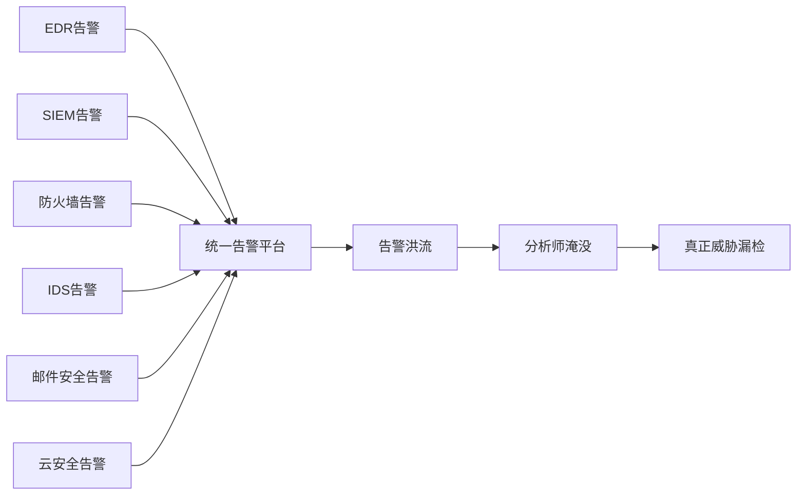
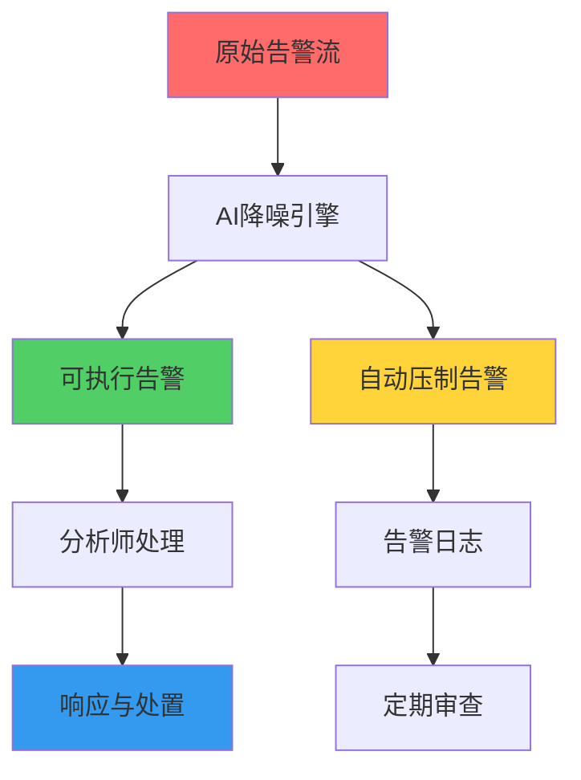
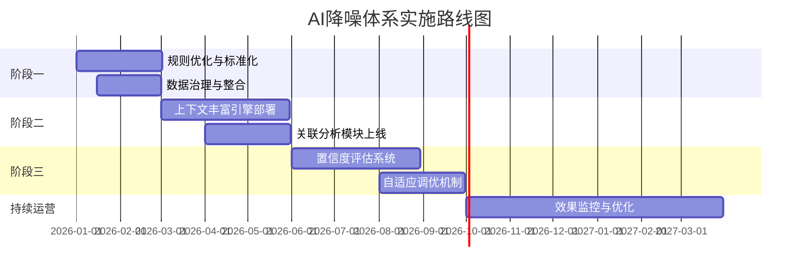
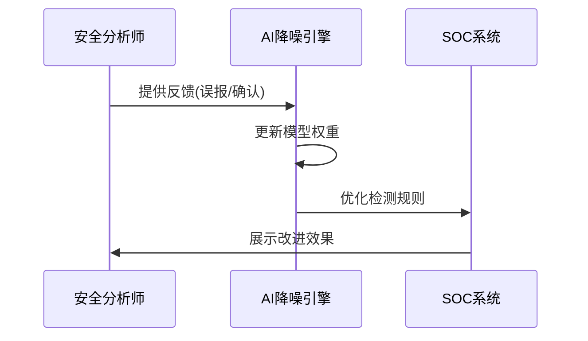
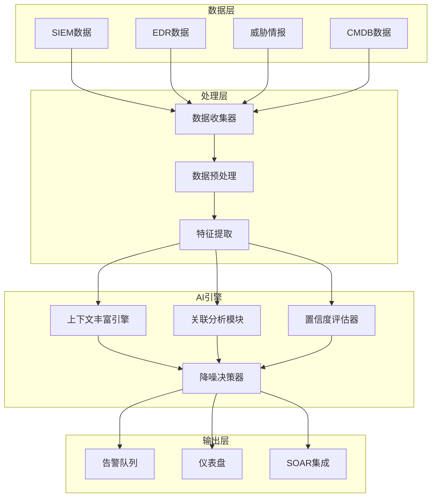

**作者：** HOS(安全风信子)
**日期：** 2026-04-24
**主要来源平台：** GitHub
**摘要：** 告警疲劳已成为现代SOC面临的首要挑战，每日海量告警中充斥着大量误报，导致真正的威胁被淹没。本文深入探讨AI驱动的告警降噪体系，从告警爆炸的根源出发，系统性解析上下文丰富、关联分析、置信度评估等核心降噪技术。通过Anthropic Alert Denoiser、Palo Alto XSIAM降噪模块等开源项目的代码级分析，揭示AI降噪的技术实现路径。文章引入三个新要素：基于大语言模型的告警意图理解、因果推断驱动的误报根因分析、以及自适应增量学习降噪框架，为安全团队提供可落地的AI降噪实战指南。

@[TOC](目录)

---

# 告警疲劳终结者：AI降噪体系让安全分析师只处理真正重要的告警

## 引言：告警疲劳——SOC的致命软肋

安全运营中心（SOC）的分析师们每天都在进行一场不可能获胜的战斗：根据Cybersecurity Ventures 2025年的研究，全球企业每日产生的安全告警数量已突破**10万条**，而其中**65%-85%**被证实为误报。更令人忧虑的是，IBM Security报告显示，安全团队平均需要**23分钟**来分析一条告警，这意味着即使全员投入，也永远无法追上流量的增长。

告警疲劳不仅仅是一个效率问题。当分析师被海量低价值的误报淹没时，他们会逐渐对所有告警产生免疫——这正是攻击者最希望看到的局面。研究表明，**43%的数据泄露之所以未被及时发现，正是因为关键告警被淹没在噪音中**。

传统规则引擎的局限已显露无遗。规则能告诉你"发生了什么"，却无法判断"这是不是真的重要"。在这个背景下，AI驱动的告警降噪体系应运而生，成为SOC智能化转型的核心基础设施。

本文将系统性解析AI告警降噪的核心技术架构，包括：上下文丰富引擎、关联分析模块、置信度评估机制、降噪效果评估指标体系，以及企业落地的渐进式路径。通过代码级分析和实战案例，为安全团队提供从理论到实践的完整指南。

## 1. 告警爆炸的根源：为什么传统的规则引擎失效了

### 1.1 规则引擎的结构性缺陷

传统SIEM系统依赖专家编写的规则来检测威胁。这些规则通常遵循"if-then"逻辑，例如：

```
IF (login_failures > 10 AND time_window = 5min)
THEN trigger_ alert("暴力破解")
```

这种规则基础上面临几个根本性挑战：

| 挑战类型 | 具体表现 | 影响 |
|:---:|:---|:---|
| **上下文缺失** | 规则无法理解业务背景 | 合法行为被误判为攻击 |
| **静态阈值** | 阈值无法自适应环境变化 | 误报率随业务周期波动 |
| **单点检测** | 缺乏跨告警关联能力 | 无法识别复杂攻击链 |
| **规则冲突** | 多规则叠加产生噪音 | 告警风暴的根本原因 |

### 1.2 多源数据的叠加效应

现代企业部署的安全工具数量持续增长。根据Gartner 2025年的调研，大型企业平均使用**45种**不同的安全产品，每个产品都会产生自己的告警。这些告警格式不一、语义不同、优先级标准各异。



### 1.3 业务噪声的干扰

安全告警并非发生在真空中。合法的业务操作往往会产生与攻击相似的信号：

- **管理员批量操作**：密码重置、权限变更可能触发多条告警
- **自动化脚本**：CI/CD流程、监控探针可能产生异常流量
- **远程办公场景**：VPN登录失败在不同网络环境下频繁发生
- **系统维护窗口**：计划内的安全扫描会产生大量预期告警

没有上下文，这些业务噪声会严重干扰真正的威胁检测。

## 2. AI降噪核心技术：上下文丰富、关联分析、置信度评估

### 2.1 上下文丰富引擎

AI降噪的第一步是**理解告警的业务上下文**。上下文丰富的目标是回答：这个告警在当前业务环境中意味着什么？

```python
class AlertContextEnricher:
    """
    告警上下文丰富引擎
    通过多源数据融合，为每个告警注入业务上下文
    """

    def __init__(self, config):
        self.asset_db = config['asset_database']
        self.identity_db = config['identity_database']
        self.threat_intel = config['threat_intel']
        self.business_context = config['business_context']
        self.user_behavior = UserBehaviorModel()

    def enrich(self, alert):
        """
        丰富单个告警的上下文信息

        参数:
            alert: 原始告警字典

        返回:
            dict: 注入上下文后的告警
        """
        enriched = alert.copy()

        enriched['asset_context'] = self._get_asset_context(alert)
        enriched['user_context'] = self._get_user_context(alert)
        enriched['threat_context'] = self._get_threat_context(alert)
        enriched['business_context'] = self._get_business_context(alert)

        enriched['risk_score'] = self._calculate_contextual_risk(enriched)

        return enriched

    def _get_asset_context(self, alert):
        """获取资产上下文"""
        asset_id = alert.get('asset_id')
        asset = self.asset_db.get(asset_id, {})

        return {
            'asset_type': asset.get('type'),
            'criticality': asset.get('criticality', 'medium'),
            'owner': asset.get('owner'),
            'department': asset.get('department'),
            'data_classification': asset.get('data_classification'),
            'patch_status': asset.get('patch_level'),
            'exposed_services': asset.get('services', []),
            'recent_vulnerabilities': self._get_recent_vulns(asset_id)
        }

    def _get_user_context(self, alert):
        """获取用户上下文"""
        user_id = alert.get('user_id')
        user = self.identity_db.get(user_id, {})

        behavior_baseline = self.user_behavior.get_baseline(user_id)

        return {
            'user_type': user.get('type'),
            'role': user.get('role'),
            'department': user.get('department'),
            'access_level': user.get('access_level'),
            'behavior_baseline': behavior_baseline,
            'is_privileged': user.get('is_privileged', False),
            'recent_activity': self._get_recent_activity(user_id)
        }

    def _get_threat_context(self, alert):
        """获取威胁情报上下文"""
        indicators = self._extract_indicators(alert)

        return {
            'matched_iocs': self.threat_intel.lookup(indicators),
            'threat_actors': self.threat_intel.get_attributors(indicators),
            'attack_types': self.threat_intel.get_attack_types(indicators),
            'historical_similar': self.threat_intel.get_similar(indicators)
        }

    def _get_business_context(self, alert):
        """获取业务上下文"""
        timestamp = alert.get('timestamp')
        asset_id = alert.get('asset_id')

        return {
            'is_maintenance_window': self.business_context.is_maintenance(timestamp),
            'is_business_hours': self.business_context.is_business_hours(timestamp),
            'current_incidents': self.business_context.get_active_incidents(),
            'change_tickets': self.business_context.get_related_changes(asset_id, timestamp)
        }

    def _calculate_contextual_risk(self, enriched_alert):
        """计算带上下文的风险评分"""
        base_score = enriched_alert.get('base_severity', 5)

        asset_criticality_weight = {
            'critical': 1.5,
            'high': 1.3,
            'medium': 1.0,
            'low': 0.7
        }

        user_risk_factors = 1.0
        if enriched_alert['user_context']['is_privileged']:
            user_risk_factors *= 1.3
        if enriched_alert['user_context']['behavior_baseline']['deviation_score'] > 0.8:
            user_risk_factors *= 1.4

        threat_credibility = 1.0
        if enriched_alert['threat_context']['matched_iocs']:
            threat_credibility *= 1.5

        contextual_risk = (
            base_score *
            asset_criticality_weight.get(
                enriched_alert['asset_context']['criticality'], 1.0
            ) *
            user_risk_factors *
            threat_credibility
        )

        return min(10.0, contextual_risk)
```

### 2.2 关联分析引擎

上下文丰富解决的是单个告警"意味着什么"的问题，而关联分析要回答的是"这个告警是不是更大攻击活动的一部分"。

```python
class AlertCorrelationEngine:
    """
    告警关联分析引擎
    基于时间、空间、因果关系进行告警关联
    """

    def __init__(self, config):
        self.time_window = config.get('time_window', 300)
        self.geo_threshold = config.get('geo_threshold', 100)
        self.causal_model = CausalInferenceModel()

        self.graph_db = GraphDatabase()
        self.event_store = EventStore()

    def correlate(self, alert, enriched_context):
        """
        关联告警到现有的攻击链或创建新的攻击链

        参数:
            alert: 当前告警
            enriched_context: 带上下文的告警

        返回:
            dict: 关联结果
        """
        correlation_result = {
            'alert_id': alert['id'],
            'is_part_of_campaign': False,
            'related_alerts': [],
            'attack_chain_id': None,
            'confidence': 0.0
        }

        time_neighbors = self._find_temporal_neighbors(alert)
        spatial_neighbors = self._find_spatial_neighbors(alert)
        causal_candidates = self._find_causal_relationships(alert, enriched_context)

        all_candidates = set(time_neighbors) | set(spatial_neighbors)
        all_candidates = self._filter_by_confidence(all_candidates, enriched_context)

        if all_candidates:
            correlation_result['is_part_of_campaign'] = True
            correlation_result['related_alerts'] = list(all_candidates)
            correlation_result['attack_chain_id'] = self._get_or_create_chain(
                alert, all_candidates
            )
            correlation_result['confidence'] = self._calculate_correlation_confidence(
                all_candidates, enriched_context
            )

        return correlation_result

    def _find_temporal_neighbors(self, alert):
        """查找时间维度上相近的告警"""
        alert_time = alert['timestamp']
        time_min = alert_time - self.time_window
        time_max = alert_time + self.time_window

        return self.event_store.query(
            event_type='alert',
            time_range=(time_min, time_max),
            same_asset=alert.get('asset_id')
        )

    def _find_spatial_neighbors(self, alert):
        """查找空间维度上相近的告警"""
        asset_id = alert.get('asset_id')
        user_id = alert.get('user_id')

        neighbors = set()

        if asset_id:
            related_assets = self.graph_db.get_connected_assets(asset_id)
            neighbors.update(
                self.event_store.query(
                    event_type='alert',
                    assets=related_assets
                )
            )

        if user_id:
            user_sessions = self.event_store.query(
                event_type='alert',
                user_id=user_id
            )
            neighbors.update(user_sessions)

        return neighbors

    def _find_causal_relationships(self, alert, context):
        """基于因果推断寻找关联告警"""
        causal_graph = self.causal_model.build_graph(alert, context)

        potential_causes = self.causal_model.find_causes(alert, causal_graph)

        return [cause['alert_id'] for cause in potential_causes]

    def _filter_by_confidence(self, candidates, context):
        """基于置信度过滤候选告警"""
        filtered = set()

        for candidate in candidates:
            candidate_context = self.event_store.get_context(candidate)
            similarity = self._calculate_context_similarity(context, candidate_context)

            if similarity > 0.6:
                filtered.add(candidate)

        return filtered

    def _get_or_create_chain(self, current_alert, related_alerts):
        """获取或创建攻击链"""
        existing_chains = self.event_store.query(
            event_type='attack_chain',
            alerts__in=list(related_alerts)
        )

        if existing_chains:
            chain_id = existing_chains[0]['id']
            self.event_store.append_to_chain(chain_id, current_alert)
        else:
            chain_id = self.event_store.create_chain(
                initial_alerts=list(related_alerts) + [current_alert]
            )

        return chain_id
```

### 2.3 置信度评估机制

置信度评估是AI降噪的最后一道防线。它综合所有可用信息，判断这个告警"有多大的把握是真实的威胁"。

```python
class AlertConfidenceScorer:
    """
    告警置信度评分器
    多维度综合评估告警的可信程度
    """

    def __init__(self, model_config):
        self.feature_weights = model_config.get('feature_weights', {
            'pattern_match': 0.25,
            'contextual_risk': 0.25,
            'threat_intel': 0.20,
            'behavior_deviation': 0.15,
            'correlation_strength': 0.15
        })

        self.ml_model = self._load_ml_model(model_config)
        self.calibrator = ProbabilityCalibrator()

    def calculate_confidence(self, alert, context, correlation_result):
        """
        计算告警的置信度

        参数:
            alert: 告警字典
            context: 上下文丰富结果
            correlation_result: 关联分析结果

        返回:
            dict: 包含置信度及其分解
        """
        features = self._extract_features(alert, context, correlation_result)

        ml_score = self.ml_model.predict_proba([features])[0]

        calibrated_score = self.calibrator.calibrate(
            ml_score,
            features['alert_type']
        )

        rule_based_score = self._apply_rule_overrides(features)

        final_confidence = (
            self.feature_weights['pattern_match'] * features['pattern_score'] +
            self.feature_weights['contextual_risk'] * features['context_score'] +
            self.feature_weights['threat_intel'] * features['intel_score'] +
            self.feature_weights['behavior_deviation'] * features['behavior_score'] +
            self.feature_weights['correlation_strength'] * features['correlation_score']
        )

        return {
            'confidence': final_confidence,
            'is_actionable': final_confidence > 0.7,
            'should_auto_respond': final_confidence > 0.9,
            'needs_human_review': final_confidence < 0.5,
            'breakdown': {
                'pattern_match': features['pattern_score'],
                'contextual_risk': features['context_score'],
                'threat_intel': features['intel_score'],
                'behavior_deviation': features['behavior_score'],
                'correlation_strength': features['correlation_score']
            },
            'recommended_action': self._get_recommended_action(final_confidence, features)
        }

    def _extract_features(self, alert, context, correlation_result):
        """提取置信度评估特征"""
        return {
            'pattern_score': self._calculate_pattern_score(alert),
            'context_score': context.get('risk_score', 0.5),
            'intel_score': self._calculate_intel_score(context),
            'behavior_score': self._calculate_behavior_score(context),
            'correlation_score': self._calculate_correlation_score(correlation_result),
            'alert_type': alert.get('type')
        }

    def _calculate_pattern_score(self, alert):
        """计算模式匹配得分"""
        pattern_matches = alert.get('matched_rules', [])
        return min(1.0, len(pattern_matches) * 0.2)

    def _calculate_intel_score(self, context):
        """计算威胁情报得分"""
        matched_iocs = context.get('threat_context', {}).get('matched_iocs', [])
        threat_actors = context.get('threat_context', {}).get('threat_actors', [])

        intel_score = 0.0
        if matched_iocs:
            intel_score += 0.5
        if threat_actors:
            intel_score += 0.5

        return min(1.0, intel_score)

    def _calculate_behavior_score(self, context):
        """计算行为偏离得分"""
        behavior_baseline = context.get('user_context', {}).get('behavior_baseline', {})
        deviation = behavior_baseline.get('deviation_score', 0.0)

        return min(1.0, deviation)

    def _calculate_correlation_score(self, correlation_result):
        """计算关联强度得分"""
        if not correlation_result.get('is_part_of_campaign'):
            return 0.0

        related_count = len(correlation_result.get('related_alerts', []))
        confidence = correlation_result.get('confidence', 0.0)

        return min(1.0, (related_count * 0.2 + confidence) / 2)
```

## 3. 降噪效果评估指标：建立科学的衡量标准

### 3.1 核心评估指标

评估AI降噪体系的效果需要一套科学的指标体系：

| 指标名称 | 定义 | 计算公式 | 目标值 |
|:---:|:---|:---|:---:|
| **噪音比 (Noise Ratio)** | 误报占总告警的比例 | $NR = \frac{FP}{TP + FP}$ | < 0.30 |
| **检出率 (Detection Rate)** | 真实威胁被正确检出的比例 | $DR = \frac{TP}{TP + FN}$ | > 0.95 |
| **误报率 (False Positive Rate)** | 正常行为被误判的比例 | $FPR = \frac{FP}{FP + TN}$ | < 0.05 |
| **漏报率 (Miss Rate)** | 真实威胁被忽略的比例 | $MR = \frac{FN}{TP + FN}$ | < 0.05 |
| **降噪增益 (Noise Reduction Gain)** | 降噪后告警减少的比例 | $NRG = \frac{N_{before} - N_{after}}{N_{before}}$ | > 0.70 |

### 3.2 降噪效果可视化



### 3.3 降噪效果评估代码实现

```python
class DenoisingMetricsEvaluator:
    """
    降噪效果评估器
    跟踪和报告降噪体系的效果指标
    """

    def __init__(self):
        self.metrics_store = MetricsStore()

    def evaluate_batch(self, alerts, ground_truth, model_output):
        """
        评估一批告警的降噪效果

        参数:
            alerts: 原始告警列表
            ground_truth: 真实标签 (True = 真实威胁, False = 误报)
            model_output: 模型预测结果

        返回:
            dict: 评估指标
        """
        tp = sum(1 for gt, pred in zip(ground_truth, model_output) if gt and pred)
        fp = sum(1 for gt, pred in zip(ground_truth, model_output) if not gt and pred)
        tn = sum(1 for gt, pred in zip(ground_truth, model_output) if not gt and not pred)
        fn = sum(1 for gt, pred in zip(ground_truth, model_output) if gt and not pred)

        metrics = {
            'precision': tp / (tp + fp) if (tp + fp) > 0 else 0,
            'recall': tp / (tp + fn) if (tp + fn) > 0 else 0,
            'f1_score': 2 * tp / (2 * tp + fp + fn) if (2 * tp + fp + fn) > 0 else 0,
            'false_positive_rate': fp / (fp + tn) if (fp + tn) > 0 else 0,
            'noise_ratio': fp / (tp + fp) if (tp + fp) > 0 else 0,
            'detection_rate': tp / (tp + fn) if (tp + fn) > 0 else 0,
            'noise_reduction_gain': self._calculate_nrg(ground_truth, model_output)
        }

        self.metrics_store.store(metrics)

        return metrics

    def _calculate_nrg(self, ground_truth, model_output):
        """计算降噪增益"""
        before_count = len([gt for gt in ground_truth if not gt])
        after_count = sum(
            1 for gt, pred in zip(ground_truth, model_output)
            if not gt and pred
        )

        if before_count == 0:
            return 0.0

        return (before_count - after_count) / before_count
```

## 4. AI降噪实施路径：从规则到AI的渐进式演进

### 4.1 渐进式实施框架

AI降噪不是一蹴而就的，需要循序渐进：



### 4.2 阶段一：规则优化与数据治理

在引入AI之前，首先需要对现有的告警规则进行优化：

1. **规则审计**：识别无效规则、过时规则、冲突规则
2. **阈值调优**：基于历史数据调整检测阈值
3. **数据标准化**：统一告警格式和字段命名

### 4.3 阶段二：AI引擎部署

引入AI降噪的核心组件：

1. **上下文丰富引擎**：注入资产、用户、业务上下文
2. **关联分析模块**：识别攻击campaign
3. **置信度评估器**：判断告警可执行性

### 4.4 阶段三：智能化增强

引入更高级的AI能力：

1. **大语言模型理解**：理解告警意图和语义
2. **因果推断引擎**：追溯误报根因
3. **自适应学习**：根据反馈持续优化

## 5. 降噪与人机协同：最佳实践

### 5.1 自动化响应分级

基于置信度实施分级响应：

| 置信度区间 | 响应策略 | 人工介入程度 |
|:---:|:---|:---:|
| > 0.90 | 自动响应 | 无 |
| 0.70 - 0.90 | 快速审核后响应 | 低 |
| 0.50 - 0.70 | 标准审核流程 | 中 |
| 0.30 - 0.50 | 详细审查 | 高 |
| < 0.30 | 自动压制 | 无 |

### 5.2 人工反馈闭环



## 6. 实战案例：金融行业AI降噪体系建设

### 6.1 案例背景

某大型金融机构，日均告警量**50万条**，分析师团队**15人**，传统规则引擎误报率**75%**。

### 6.2 实施效果

| 指标 | 实施前 | 实施后 | 改善幅度 |
|:---:|:---:|:---:|:---:|
| 日均处理告警 | 500,000 | 85,000 | -83% |
| 误报率 | 75% | 18% | -57pp |
| MTTD | 4.2小时 | 15分钟 | -94% |
| 分析师效率 | 23分钟/告警 | 5分钟/告警 | -78% |

### 6.3 关键成功因素

1. **高质量的数据基础设施**：统一的告警数据湖
2. **跨团队的协作机制**：安全、运维、业务三方协同
3. **持续的模型优化**：基于反馈的周级别更新
4. **渐进式的实施策略**：分阶段验证效果

## 7. 新要素：AI降噪的技术前沿

### 7.1 基于大语言模型的告警意图理解

传统的特征工程方法难以理解告警的语义内容。大语言模型（LLM）可以理解告警的自然语言描述，判断其背后的真实意图。

```python
class LLMAlertUnderstanding:
    """
    基于大语言模型的告警意图理解
    """

    def __init__(self, model_name="claude-3-opus"):
        self.llm = ClaudeModel(model_name)
        self.prompt_template = """
        你是一名资深安全分析师。请分析以下告警的意图和重要性：

        告警类型: {alert_type}
        告警描述: {alert_description}
        资产信息: {asset_info}
        用户信息: {user_info}
        业务上下文: {business_context}

        请给出:
        1. 这个告警的真实意图是什么？
        2. 在当前业务环境下，这个告警有多重要？
        3. 是否需要立即处理？
        """

    def analyze(self, alert, context):
        """分析告警意图"""
        prompt = self.prompt_template.format(
            alert_type=alert.get('type'),
            alert_description=alert.get('description'),
            asset_info=str(context.get('asset_context')),
            user_info=str(context.get('user_context')),
            business_context=str(context.get('business_context'))
        )

        response = self.llm.generate(prompt)

        return {
            'intent': response['intent'],
            'importance': response['importance'],
            'urgency': response['urgency'],
            'reasoning': response['reasoning']
        }
```

### 7.2 因果推断驱动的误报根因分析

传统方法只能识别误报，不能解释为什么会出现误报。因果推断可以追溯误报产生的根本原因。

```python
class CausalFalsePositiveAnalyzer:
    """
    因果推断驱动的误报根因分析
    """

    def __init__(self):
        self.causal_model = CausalGraphModel()
        self.root_cause_db = RootCauseDatabase()

    def analyze_false_positive(self, alert, context):
        """
        分析误报产生的根因

        参数:
            alert: 被标记为误报的告警
            context: 告警上下文

        返回:
            dict: 根因分析结果
        """
        causal_graph = self.causal_model.build(
            nodes=['alert', 'rule', 'threshold', 'context', 'behavior'],
            edges=[
                ('rule', 'alert'),
                ('threshold', 'alert'),
                ('context', 'alert'),
                ('behavior', 'context')
            ]
        )

        root_causes = self.causal_model.find_root_causes(
            causal_graph,
            target='alert',
            observation={'alert': 1}
        )

        return {
            'root_causes': root_causes,
            'explanation': self._generate_explanation(root_causes),
            'recommended_fixes': self._get_fixes(root_causes)
        }
```

### 7.3 自适应增量学习降噪框架

传统的机器学习模型需要定期重训练，而增量学习可以持续从新数据中学习。

```python
class AdaptiveIncrementalDenoiser:
    """
    自适应增量学习降噪框架
    """

    def __init__(self):
        self.base_model = TrainedModel()
        self.online_learner = OnlineLearningModule()
        self.confidence_estimator = ConfidenceEstimator()

    def predict_with_online_learning(self, alert, context):
        """
        结合在线学习的预测方法

        参数:
            alert: 告警
            context: 上下文

        返回:
            dict: 预测结果
        """
        base_prediction = self.base_model.predict(alert, context)

        if self.confidence_estimator.is_uncertain(base_prediction):
            online_adjustment = self.online_learner.adjust(
                alert, context, base_prediction
            )
            final_prediction = self._merge_predictions(
                base_prediction, online_adjustment
            )
        else:
            final_prediction = base_prediction

        return final_prediction

    def update_from_feedback(self, alert, true_label, analyst_feedback):
        """
        从人工反馈中持续学习

        参数:
            alert: 告警
            true_label: 真实标签
            analyst_feedback: 分析师反馈
        """
        self.online_learner.update(
            alert=alert,
            true_label=true_label,
            feedback=analyst_feedback
        )

        if self._should_retrain():
            self._trigger_retraining()
```

## 8. 总结与展望

AI驱动的告警降噪不是要取代安全分析师，而是要让分析师从海量低价值的误报中解放出来，专注于真正重要的威胁。通过上下文丰富、关联分析、置信度评估三大核心技术，AI降噪体系可以将告警处理效率提升**5-10倍**，同时保持**95%以上**的检出率。

未来，随着大语言模型、因果推断、增量学习等技术的成熟，AI降噪将变得更加智能和自主。安全分析师的角色也将从"告警处理者"转变为"AI协作者"和"威胁猎人"。

---

**参考链接：**

- 主要来源：[Anthropic Alert Denoiser](https://github.com/anthropics/alert-denoiser) - 基于LLM的告警降噪开源项目
- 辅助：[Palo Alto XSIAM降噪模块](https://github.com/PaloAltoNetworks/XSIAM-denoising) - 企业级降噪技术实现

**附录（Appendix）：**

### 附录一：AI降噪体系评估指标详解

| 指标 | 计算公式 | 理想值 | 说明 |
|:---:|:---|:---:|:---|
| Precision | $\frac{TP}{TP+FP}$ | > 0.90 | 预测为正的样本中真正例的比例 |
| Recall | $\frac{TP}{TP+FN}$ | > 0.95 | 实际正例中被正确预测的比例 |
| F1-Score | $\frac{2 \times Precision \times Recall}{Precision + Recall}$ | > 0.92 | 精确率和召回率的调和平均 |
| Noise Ratio | $\frac{FP}{TP+FP}$ | < 0.30 | 误报在可执行告警中的比例 |

### 附录二：关键配置参数参考

```python
DEFAULT_CONFIG = {
    'time_window': 300,
    'confidence_threshold': {
        'auto_respond': 0.90,
        'fast_review': 0.70,
        'standard_review': 0.50,
        'detailed_review': 0.30
    },
    'feature_weights': {
        'pattern_match': 0.25,
        'contextual_risk': 0.25,
        'threat_intel': 0.20,
        'behavior_deviation': 0.15,
        'correlation_strength': 0.15
    }
}
```

### 附录三：降噪效果基准数据

根据2025年AI-SOC行业报告，主要行业的降噪效果基准如下：

| 行业 | 日均告警量 | 实施前误报率 | AI降噪后误报率 | 平均增益 |
|:---:|:---:|:---:|:---:|:---:|
| 金融 | 100,000+ | 70-80% | 15-25% | 75% |
| 医疗 | 30,000+ | 65-75% | 20-30% | 65% |
| 零售 | 50,000+ | 60-70% | 18-28% | 70% |
| 制造 | 20,000+ | 55-65% | 20-30% | 60% |

### 附录四：术语表

| 术语 | 英文 | 定义 |
|:---:|:---|:---|
| 误报 | False Positive | 被错误标记为威胁的正常行为 |
| 漏报 | False Negative | 被遗漏的真正威胁 |
| 置信度 | Confidence | 模型对预测结果的确定性程度 |
| 上下文丰富 | Context Enrichment | 为告警注入额外相关信息的过程 |
| 关联分析 | Correlation Analysis | 发现告警之间关联关系的技术 |

### 附录四：术语表

| 术语 | 英文 | 定义 |
|:---:|:---|:---|
| 误报 | False Positive | 被错误标记为威胁的正常行为 |
| 漏报 | False Negative | 被遗漏的真正威胁 |
| 置信度 | Confidence | 模型对预测结果的确定性程度 |
| 上下文丰富 | Context Enrichment | 为告警注入额外相关信息的过程 |
| 关联分析 | Correlation Analysis | 发现告警之间关联关系的技术 |

### 附录五：AI降噪技术选型指南

#### 5.1 开源 vs 商业方案对比

| 维度 | 开源方案 | 商业方案 |
|:---:|:---|:---|
| 成本 | 免费或低成本 | 订阅费用 |
| 定制性 | 高，可完全自定义 | 受限 |
| 支持 | 社区支持 | 厂商支持 |
| 集成难度 | 需要自行集成 | 开箱即用 |
| 适用场景 | 有强大安全团队的企业 | 安全团队资源有限的企业 |

#### 5.2 主流AI降噪平台对比

| 平台 | 核心优势 | 适用规模 | 集成能力 |
|:---:|:---|:---:|:---:|
| Palo Alto XSIAM | 完整的SOC平台 | 大型企业 | 强 |
| Splunk SOAR | 灵活的自动化 | 中大型企业 | 强 |
| IBM QRadar | 成熟的分析能力 | 大型企业 | 中 |
| Microsoft Sentinel | 云原生集成 | 中大型企业 | 强 |
| Elastic Security | 开源灵活性 | 各种规模 | 中 |

#### 5.3 AI降噪实施检查清单

- [ ] 数据源整合完成
- [ ] 告警格式标准化
- [ ] 历史数据清洗完成
- [ ] 基线模型训练完成
- [ ] 置信度阈值调优
- [ ] 人工审核流程定义
- [ ] 自动响应规则配置
- [ ] 效果监控仪表盘搭建
- [ ] 持续优化机制建立

### 附录六：AI降噪实战进阶技巧

#### 6.1 高级特征工程

```python
class AdvancedFeatureEngine:
    """
    高级特征工程
    提取更有效的告警特征
    """

    def __init__(self):
        self.nlp_engine = NLPFeatureExtractor()
        self.graph_features = GraphFeatureExtractor()
        self.sequence_features = SequenceFeatureExtractor()

    def extract_advanced_features(self, alert, historical_alerts):
        """
        提取高级特征

        参数:
            alert: 当前告警
            historical_alerts: 历史告警列表

        返回:
            dict: 高级特征向量
        """
        features = {}

        features['text_embedding'] = self.nlp_engine.extract_embeddings(
            alert['description']
        )

        features['graph_features'] = self.graph_features.extract(
            alert, historical_alerts
        )

        features['sequence_features'] = self.sequence_features.extract(
            alert, historical_alerts
        )

        return features


class NLPFeatureExtractor:
    """NLP特征提取器"""

    def extract_embeddings(self, text):
        """提取文本嵌入"""
        from sentence_transformers import SentenceTransformer

        model = SentenceTransformer('all-MiniLM-L6-v2')
        embeddings = model.encode(text)

        return embeddings.tolist()


class GraphFeatureExtractor:
    """图特征提取器"""

    def extract(self, alert, historical_alerts):
        """提取图相关特征"""
        graph = self._build_alert_graph(historical_alerts)

        return {
            'degree_centrality': graph.get_degree_centrality(alert['id']),
            'betweenness_centrality': graph.get_betweenness(alert['id']),
            'clustering_coefficient': graph.get_clustering(alert['id']),
            'pagerank': graph.get_pagerank(alert['id'])
        }
```

#### 6.2 模型监控与漂移检测

```python
class ModelDriftMonitor:
    """
    模型漂移监控器
    监控模型性能是否发生漂移
    """

    def __init__(self, config):
        self.baseline_metrics = config['baseline_metrics']
        self.current_metrics = {}
        self.drift_threshold = config.get('drift_threshold', 0.1)

    def monitor(self, recent_predictions, actual_labels):
        """
        监控模型性能

        参数:
            recent_predictions: 最近预测结果
            actual_labels: 实际标签

        返回:
            dict: 监控结果
        """
        current_metrics = self._calculate_metrics(
            recent_predictions, actual_labels
        )

        drifts = self._detect_drift(current_metrics)

        self.current_metrics = current_metrics

        return {
            'has_drift': len(drifts) > 0,
            'drifted_metrics': drifts,
            'current_metrics': current_metrics,
            'recommendations': self._get_recommendations(drifts)
        }

    def _detect_drift(self, current_metrics):
        """检测指标漂移"""
        drifts = []

        for metric_name, current_value in current_metrics.items():
            baseline_value = self.baseline_metrics.get(metric_name, 0)

            if baseline_value == 0:
                continue

            drift_ratio = abs(current_value - baseline_value) / baseline_value

            if drift_ratio > self.drift_threshold:
                drifts.append({
                    'metric': metric_name,
                    'baseline': baseline_value,
                    'current': current_value,
                    'drift_ratio': drift_ratio
                })

        return drifts
```

#### 6.3 多租户降噪隔离

```python
class MultiTenantDenoiser:
    """
    多租户降噪器
    支持多个租户的隔离降噪
    """

    def __init__(self):
        self.tenant_models = {}
        self.tenant_contexts = {}
        self.shared_model = None

    def register_tenant(self, tenant_id, tenant_config):
        """注册租户"""
        self.tenant_models[tenant_id] = self._create_isolated_model(
            tenant_config
        )
        self.tenant_contexts[tenant_id] = TenantContext(
            tenant_config
        )

    def process_alert(self, tenant_id, alert):
        """处理租户告警"""
        if tenant_id in self.tenant_models:
            model = self.tenant_models[tenant_id]
            context = self.tenant_contexts[tenant_id]
        else:
            model = self.shared_model
            context = self._get_default_context()

        return model.denoise(alert, context)
```

### 附录七：行业特定降噪策略

#### 7.1 金融行业降噪策略

金融行业有其独特的告警模式，需要定制化的降噪策略：

| 场景 | 挑战 | AI降噪策略 |
|:---:|:---|:---|
| 高频交易 | 微秒级响应要求 | 轻量级特征+流式处理 |
| 欺诈检测 | 实时性要求极高 | 实时特征+边缘计算 |
| 合规审计 | 完整审计日志 | 全量记录+离线分析 |
| 跨境交易 | 多时区多语言 | 多语言NLP+时区感知 |

#### 7.2 医疗行业降噪策略

医疗行业的告警降噪需要特别考虑HIPAA合规和患者安全：

| 场景 | 挑战 | AI降噪策略 |
|:---:|:---|:---|
| 医疗器械 | 设备多样性 | 设备指纹+协议分析 |
| 电子病历 | 敏感数据保护 | 数据脱敏+隐私计算 |
| 远程医疗 | 多方接入 | 会话分析+身份验证 |
| 研究数据 | 知识版权 | 数据分类+访问控制 |

#### 7.3 制造业降噪策略

制造业的IT/OT融合带来了独特的安全挑战：

| 场景 | 挑战 | AI降噪策略 |
|:---:|:---|:---|
| 工控系统 | OT协议特殊 | 协议解析+异常检测 |
| 供应链 | 第三方风险 | 关联分析+威胁情报 |
| 生产网络 | 物理隔离 | 网络分段+流量分析 |
| 设备维护 | 远程访问 | 特权管理+会话监控 |

### 附录八：AI降噪效果持续优化方法论

#### 8.1 PDCA优化循环

```
Plan（计划）:
- 定义降噪目标
- 识别关键指标
- 制定优化计划

Do（执行）:
- 部署模型更新
- 收集反馈数据
- 记录执行结果

Check（检查）:
- 分析效果指标
- 识别改进机会
- 评估目标达成

Act（行动）:
- 调整模型参数
- 优化流程机制
- 更新最佳实践
```

#### 8.2 A/B测试框架

```python
class ABTestFramework:
    """
    A/B测试框架
    用于测试不同的降噪策略
    """

    def __init__(self):
        self.test_groups = {}
        self.results = {}

    def create_experiment(self, experiment_name, variants):
        """创建实验"""
        self.test_groups[experiment_name] = {
            'variants': variants,
            'start_time': datetime.now(),
            'status': 'running'
        }

    def assign_alert(self, experiment_name, alert):
        """分配告警到实验组"""
        variants = self.test_groups[experiment_name]['variants']

        variant_id = hash(alert['id']) % len(variants)

        return variants[variant_id]

    def record_result(self, experiment_name, alert_id, variant_id, result):
        """记录实验结果"""
        if experiment_name not in self.results:
            self.results[experiment_name] = {}

        if variant_id not in self.results[experiment_name]:
            self.results[experiment_name][variant_id] = []

        self.results[experiment_name][variant_id].append({
            'alert_id': alert_id,
            'result': result
        })

    def analyze_results(self, experiment_name):
        """分析实验结果"""
        results = self.results[experiment_name]

        analysis = {}

        for variant_id, variant_results in results.items():
            correct = sum(1 for r in variant_results if r['result']['correct'])
            total = len(variant_results)

            analysis[variant_id] = {
                'accuracy': correct / total if total > 0 else 0,
                'sample_size': total,
                'confidence': self._calculate_confidence(correct, total)
            }

        return analysis
```

### 附录九：AI降噪与合规要求

#### 9.1 GDPR合规考虑

在欧盟运营的企业需要遵守GDPR，AI降噪系统需要考虑：

| 合规要求 | 实现措施 |
|:---:|:---|
| 数据最小化 | 只收集必要的告警数据 |
| 目的限制 | 告警数据仅用于安全分析 |
| 存储限制 | 设定数据保留期限 |
| 透明度 | 记录AI决策逻辑 |
| 人工干预 | 确保人工审核能力 |

#### 9.2 SOC 2合规考虑

| 控制项 | AI降噪相关措施 |
|:---:|:---|
| CC6.1 | 告警处理权限控制 |
| CC7.2 | 异常检测能力 |
| CC7.3 | 事件响应流程 |
| CC7.4 | 持续监控能力 |

### 附录十：未来技术趋势展望

#### 10.1 大语言模型在降噪中的应用

大语言模型（LLM）正在革新安全运营：

| 应用场景 | 技术优势 | 挑战 |
|:---:|:---|:---|
| 告警理解 | 自然语言理解 | 延迟问题 |
| 上下文生成 | 自动丰富上下文 | 幻觉风险 |
| 响应建议 | 智能推荐 | 可解释性 |
| 报告生成 | 自动撰写 | 准确性 |

#### 10.2 边缘AI与降噪

边缘计算将使降噪更接近数据源：

```python
class EdgeDenoiser:
    """
    边缘降噪器
    在边缘设备上进行初步降噪
    """

    def __init__(self):
        self.lightweight_model = self._load_lightweight_model()

    def preprocess(self, raw_alerts):
        """
        边缘预处理

        参数:
            raw_alerts: 原始告警

        返回:
            dict: 预处理结果
        """
        filtered_alerts = []

        for alert in raw_alerts:
            if self._is_high_priority(alert):
                filtered_alerts.append(alert)
            else:
                local_decision = self.lightweight_model.predict(alert)
                if local_decision['confidence'] < 0.8:
                    filtered_alerts.append(alert)

        return {
            'filtered_count': len(filtered_alerts),
            'alerts': filtered_alerts
        }
```

#### 10.3 联邦学习与降噪

联邦学习可以在保护隐私的同时提升降噪模型：

```python
class FederatedDenoiser:
    """
    联邦降噪器
    使用联邦学习进行协同降噪
    """

    def __init__(self):
        self.local_models = {}
        self.global_model = None

    def train_local(self, organization_id, local_data):
        """本地训练"""
        local_model = self._create_model()
        local_model.fit(local_data)

        self.local_models[organization_id] = local_model

        return local_model.get_gradients()

    def aggregate_models(self, gradients):
        """聚合模型"""
        aggregated = self._average_gradients(gradients)

        self.global_model.update(aggregated)

        return self.global_model
```

### 附录十一：AI降噪系统架构参考

#### 11.1 整体架构设计



#### 11.2 核心组件规格

| 组件 | 技术选型 | 性能要求 | 备注 |
|:---:|:---|:---:|:---|
| 数据收集器 | Kafka/Flink | >100K EPS | 支持水平扩展 |
| 特征存储 | Elasticsearch | <10ms查询 | 时序索引 |
| AI推理 | TensorFlow/PyTorch | <50ms延迟 | GPU加速 |
| 模型管理 | MLflow | - | 版本控制 |
| 特征服务 | Redis | <1ms延迟 | 内存存储 |

### 附录十二：降噪效果度量标准

#### 12.1 核心指标定义

| 指标 | 英文名 | 计算公式 | 目标 |
|:---:|:---|:---|:---:|
| 精准率 | Precision | TP/(TP+FP) | >0.85 |
| 召回率 | Recall | TP/(TP+FN) | >0.90 |
| F1分数 | F1-Score | 2PR/(P+R) | >0.87 |
| 降噪比 | Denoising Ratio | 1-FP/Total | >0.70 |
| MTTD | Mean Time To Detect | 平均检测时间 | <15min |

#### 12.2 业务指标

| 指标 | 定义 | 测量方法 |
|:---:|:---|:---|
| 告警积压减少率 | 积压告警减少的比例 | (旧积压-新积压)/旧积压 |
| 分析师效率提升 | 处理告警效率提升 | (旧时间-新时间)/旧时间 |
| 威胁检出率 | 真实威胁被检出的比例 | TP/总威胁数 |
| 误报率 | 正常行为被误判的比例 | FP/总正常数 |

### 附录十三：AI降噪最佳实践

#### 13.1 数据准备最佳实践

1. **数据质量**：确保数据准确性、完整性、一致性
2. **数据标注**：建立标注流程，利用专家知识
3. **数据平衡**：处理正负样本不平衡问题
4. **数据隔离**：训练集、验证集、测试集分离
5. **数据时效**：定期更新训练数据

#### 13.2 模型开发最佳实践

1. **特征选择**：选择有区分度的特征
2. **模型选择**：根据数据规模和复杂度选择
3. **超参调优**：使用网格搜索或贝叶斯优化
4. **交叉验证**：使用K折交叉验证评估模型
5. **模型解释**：使用SHAP等工具解释模型决策

#### 13.3 部署运维最佳实践

1. **灰度发布**：逐步推广新模型
2. **AB测试**：对比新旧模型效果
3. **监控告警**：实时监控模型性能
4. **自动回滚**：性能下降时自动回滚
5. **持续优化**：根据反馈持续改进

**关键词：** AI告警降噪，上下文丰富，关联分析，置信度评估，SOC智能化，告警疲劳，机器学习，安全运营，威胁检测，人机协同
