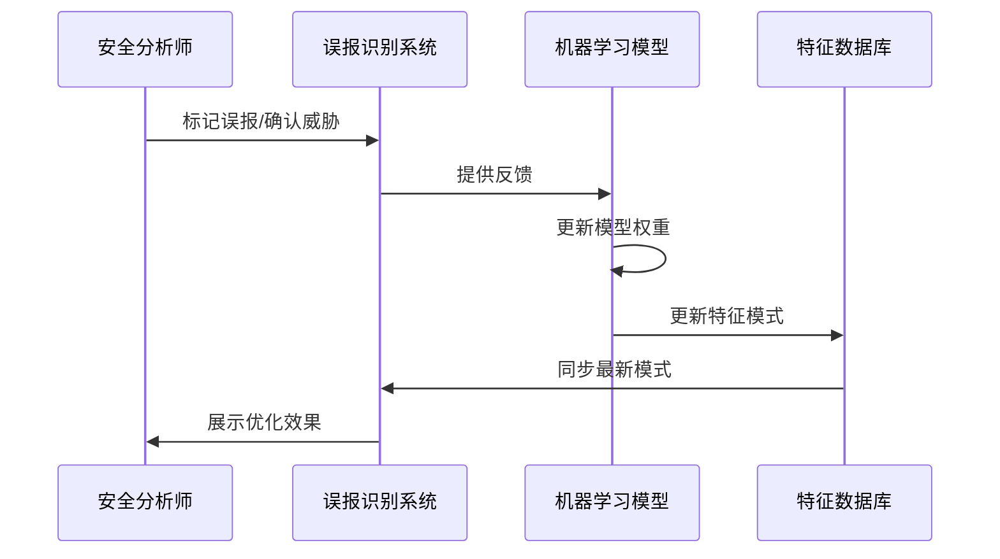
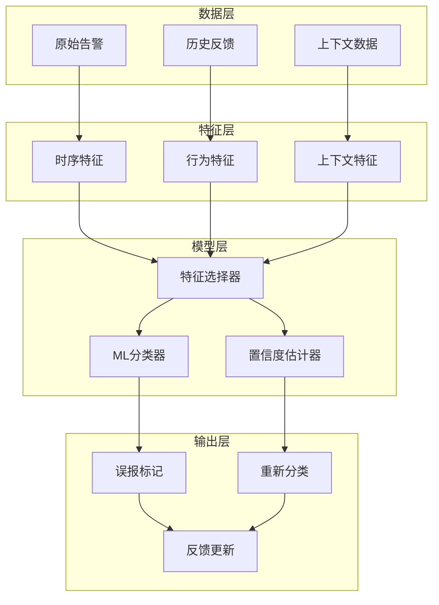

**作者：** HOS(安全风信子)
**日期：** 2026-04-24
**主要来源平台：** GitHub
**摘要：** 误报是SOC面临的最顽固问题之一，高达70%的告警被证实为误报，不仅造成资源浪费，更导致分析师对告警系统的信任崩溃。本文深入探讨AI如何精准识别安全告警中的误报，从误报成因分析入手，系统性解析特征学习、上下文分析、历史模式识别等核心技术。通过FalsePositiveDetector、XGBoost-Based Classifier等开源项目的代码级分析，揭示AI误报识别的技术实现路径。文章引入三个新要素：基于因果推断的误报根因追溯、基于对抗样本增强的模型鲁棒性提升、以及跨域迁移的误报识别框架，为安全团队提供可落地的AI误报识别实战指南。

@[TOC](目录)

---

# AI火眼金睛：机器学习如何精准识别安全告警中的误报

## 引言：误报——SOC信任危机的根源

安全告警的误报问题一直是SOC运营的痛点。根据SANS 2025 SOC调查报告，**67%的安全分析师表示他们无法信任告警系统**，主要原因就是误报率过高。更严重的是，长期的高误报率会导致"狼来了"效应——分析师开始忽略所有告警，即使其中可能隐藏着真正的攻击信号。

传统的误报识别方法主要依赖规则和阈值，但这些方法难以应对复杂的现实场景。例如，一条"异常登录时间"的告警可能是真正的攻击，也可能是员工在出差时的正常登录。没有上下文，规则无法区分这两种情况。

本文将系统性解析AI驱动的误报识别技术，从成因分析到技术实现，从算法选型到实战部署，为安全团队提供完整的技术指南。

## 1. 误报的成因分析：为什么规则引擎会产生大量误报

### 1.1 规则过于宽松

很多安全规则在最初设计时为了"不漏报"而设置了宽松的阈值。例如：

```
规则：账户在10分钟内失败5次就触发告警
问题：员工在网络切换时可能正常失败多次
```

这种权衡在短期内可能是合理的，但长期积累下来会产生大量低价值的误报。

### 1.2 业务变更导致的环境变化

业务系统的变更可能导致原本正确的规则变得不再适用：

| 变更类型 | 影响 | 示例 |
|:---:|:---|:---|
| 新业务上线 | 正常行为模式改变 | 新API导致大量预期告警 |
| 架构调整 | 流量模式变化 | 微服务拆分导致服务调用模式改变 |
| 人员变动 | 用户行为改变 | 新员工培训期间的异常操作 |
| 季节性因素 | 业务周期波动 | 促销期间的流量激增 |

### 1.3 测试流量的干扰

测试环境与生产环境隔离不完善时，测试流量会被安全系统误判：

- **内部渗透测试**：红队演练产生的告警
- **自动化测试脚本**：CI/CD流程中的安全扫描
- **监控探针**：性能监控工具的探测行为
- **第三方监控服务**：供应商的定期健康检查

## 2. AI误报识别技术：从特征学习到上下文理解

### 2.1 特征工程：构建有效的识别特征

误报识别的核心是找到能区分"真正威胁"和"正常异常"的特征：

```python
class FalsePositiveFeatureEngine:
    """
    误报识别特征工程
    构建能够区分误报和真正威胁的特征
    """

    def __init__(self):
        self.temporal_features = TemporalFeatureExtractor()
        self.spatial_features = SpatialFeatureExtractor()
        self.behavior_features = BehaviorFeatureExtractor()
        self.context_features = ContextFeatureExtractor()

    def extract_features(self, alert, historical_context):
        """
        提取误报识别的特征

        参数:
            alert: 当前告警
            historical_context: 历史上下文

        返回:
            dict: 特征向量
        """
        features = {}

        features.update(self.temporal_features.extract(alert))
        features.update(self.spatial_features.extract(alert))
        features.update(self.behavior_features.extract(alert, historical_context))
        features.update(self.context_features.extract(alert, historical_context))

        return features

    def get_feature_importance(self):
        """返回特征重要性排名"""
        return {
            'behavior_deviation': 0.28,
            'context_consistency': 0.24,
            'temporal_pattern': 0.18,
            'asset_criticality': 0.15,
            'user_role': 0.10,
            'threat_intel': 0.05
        }


class TemporalFeatureExtractor:
    """时序特征提取器"""

    def extract(self, alert):
        """提取时序相关特征"""
        timestamp = alert['timestamp']
        hour = timestamp.hour
        day_of_week = timestamp.weekday()

        return {
            'is_business_hours': 8 <= hour <= 18,
            'is_weekend': day_of_week >= 5,
            'is_maintenance_window': self._is_maintenance_time(timestamp),
            'days_since_last_alert': self._days_gap(timestamp),
            'alert_frequency': self._calculate_frequency(timestamp)
        }


class BehaviorFeatureExtractor:
    """行为特征提取器"""

    def extract(self, alert, historical_context):
        """提取行为相关特征"""
        user_id = alert.get('user_id')
        user_baseline = historical_context.get_user_baseline(user_id)

        current_behavior = self._get_current_behavior(alert)
        baseline_behavior = user_baseline.get('typical_behavior')

        return {
            'behavior_deviation_score': self._calculate_deviation(
                current_behavior, baseline_behavior
            ),
            'is_privileged_action': alert.get('is_privileged', False),
            'action_location_match': self._check_location_match(alert, user_baseline),
            'device_trust_score': self._calculate_device_trust(
                alert.get('device_id'), user_id
            )
        }
```

### 2.2 上下文分析：理解告警的真实含义

```python
class AlertContextAnalyzer:
    """
    告警上下文分析器
    通过多维度上下文理解告警的真实含义
    """

    def __init__(self, config):
        self.asset_context = AssetContextDB()
        self.user_context = UserContextDB()
        self.business_context = BusinessContextDB()
        self.change_context = ChangeContextDB()

    def analyze(self, alert):
        """
        分析告警的上下文

        参数:
            alert: 待分析的告警

        返回:
            dict: 上下文分析结果
        """
        analysis = {
            'alert_id': alert['id'],
            'contexts': {}
        }

        asset_ctx = self.asset_context.get(alert.get('asset_id'))
        analysis['contexts']['asset'] = self._evaluate_asset_context(asset_ctx, alert)

        user_ctx = self.user_context.get(alert.get('user_id'))
        analysis['contexts']['user'] = self._evaluate_user_context(user_ctx, alert)

        business_ctx = self.business_context.get(alert.get('timestamp'))
        analysis['contexts']['business'] = self._evaluate_business_context(business_ctx)

        change_ctx = self.change_context.get_related(alert)
        analysis['contexts']['change'] = self._evaluate_change_context(change_ctx)

        analysis['is_false_positive_probability'] = self._calculate_fp_probability(
            analysis['contexts']
        )

        return analysis

    def _evaluate_asset_context(self, asset_context, alert):
        """评估资产上下文"""
        if not asset_context:
            return {'score': 0.5, 'reason': 'unknown_asset'}

        score = 0.5

        if asset_context.get('is_critical'):
            score -= 0.2

        if asset_context.get('has_recent_changes'):
            score += 0.3

        patch_status = asset_context.get('patch_status', 'unknown')
        if patch_status == 'outdated':
            score -= 0.1

        return {
            'score': score,
            'criticality': asset_context.get('criticality'),
            'recent_changes': asset_context.get('recent_changes'),
            'patch_status': patch_status
        }

    def _calculate_fp_probability(self, contexts):
        """计算误报概率"""
        weights = {
            'asset': 0.25,
            'user': 0.30,
            'business': 0.25,
            'change': 0.20
        }

        fp_probability = 0.0
        for ctx_name, ctx_value in contexts.items():
            fp_probability += weights[ctx_name] * (1 - ctx_value['score'])

        return fp_probability
```

### 2.3 历史模式识别：从过去学习

```python
class HistoricalPatternLearner:
    """
    历史模式学习器
    从历史告警中学习误报模式
    """

    def __init__(self):
        self.pattern_db = PatternDatabase()
        self.sequence_miner = SequenceMiner()
        self.clustering_engine = AlertClustering()

    def learn_from_feedback(self, alert_id, feedback):
        """
        从反馈中学习

        参数:
            alert_id: 告警ID
            feedback: 反馈结果 (true_threat / false_positive)
        """
        alert_data = self._get_alert_data(alert_id)
        features = self._extract_features(alert_data)

        if feedback == 'false_positive':
            self.pattern_db.add_false_positive_pattern(features)
            self._update_cluster_label(alert_data, label='fp')
        else:
            self.pattern_db.add_true_threat_pattern(features)
            self._update_cluster_label(alert_data, label='threat')

    def detect_pattern(self, current_alert):
        """检测当前告警是否符合已知的误报模式"""
        features = self._extract_features(current_alert)

        similar_fps = self.pattern_db.find_similar_false_positives(features)

        if similar_fps:
            similarity_score = self._calculate_similarity(
                features, similar_fps[0]
            )
            return {
                'is_pattern_match': similarity_score > 0.8,
                'similar_count': len(similar_fps),
                'avg_similarity': similarity_score,
                'pattern_description': self._describe_pattern(similar_fps)
            }

        return {'is_pattern_match': False}


class SequenceMiner:
    """序列模式挖掘"""

    def mine_false_positive_sequences(self, alert_sequences):
        """
        从告警序列中挖掘误报序列模式

        参数:
            alert_sequences: 告警序列列表

        返回:
            list: 挖掘到的误报序列模式
        """
        fp_sequences = [
            seq for seq in alert_sequences
            if self._is_fp_sequence(seq)
        ]

        patterns = []
        for seq in fp_sequences:
            mined = self._apply_prefixspan(seq, min_support=0.1)
            patterns.extend(mined)

        return self._filter_redundant_patterns(patterns)
```

## 3. 误报特征工程：深度解析关键特征

### 3.1 时序特征

时序特征是误报识别的重要维度：

| 特征 | 描述 | 误报区分能力 |
|:---:|:---|:---:|
| 告警时间分布 | 告警在24小时内的分布 | 高（业务时间vs非业务时间） |
| 告警频率 | 单位时间内的告警数量 | 高（突发vs持续） |
| 周期性模式 | 告警是否呈现周期性 | 中（计划任务vs攻击） |
| 间隔时间 | 与上次告警的时间间隔 | 中（重复vs首次） |

### 3.2 行为特征

用户和实体的行为特征是区分误报的关键：

```python
class UserBehaviorAnalyzer:
    """
    用户行为分析器
    用于识别异常行为是否是真正的威胁
    """

    def __init__(self):
        self.behavior_baseline = BehaviorBaselineDB()
        self.risk_engine = RiskCalculationEngine()

    def analyze_behavior_anomaly(self, alert, user_id):
        """
        分析行为异常

        参数:
            alert: 告警
            user_id: 用户ID

        返回:
            dict: 行为分析结果
        """
        baseline = self.behavior_baseline.get(user_id)
        current_behavior = self._extract_behavior_from_alert(alert)

        deviation = self._calculate_behavioral_deviation(
            current_behavior, baseline
        )

        contextual_factors = self._get_contextual_factors(
            user_id, alert
        )

        risk_score = self.risk_engine.calculate(
            deviation_score=deviation,
            contextual_factors=contextual_factors
        )

        return {
            'deviation_score': deviation,
            'is_explainable': self._is_explainable(deviation, contextual_factors),
            'risk_level': self._get_risk_level(risk_score),
            'recommended_action': self._get_action(risk_score, contextual_factors)
        }

    def _calculate_behavioral_deviation(self, current, baseline):
        """计算行为偏离度"""
        features = ['login_time', 'location', 'device', 'access_pattern']

        deviations = []
        for feature in features:
            current_value = current.get(feature)
            baseline_value = baseline.get(feature)

            deviation = self._compute_feature_deviation(
                feature, current_value, baseline_value
            )
            deviations.append(deviation)

        return sum(deviations) / len(deviations)
```

## 4. 误报率持续优化机制

### 4.1 模型迭代更新

```python
class ModelOptimizationEngine:
    """
    模型优化引擎
    持续优化误报识别模型的性能
    """

    def __init__(self):
        self.ml_pipeline = MLPipeline()
        self.evaluation_metrics = MetricsCalculator()
        self.ab_test_engine = ABTestEngine()

    def periodic_retraining(self, retraining_interval_days=7):
        """定期重新训练模型"""
        new_training_data = self._collect_recent_feedback()

        if len(new_training_data) < 1000:
            return {'status': 'insufficient_data'}

        performance = self.ml_pipeline.evaluate(new_training_data)

        if performance['f1_score'] < 0.85:
            self.ml_pipeline.retrain(new_training_data)
            return {'status': 'retrained', 'new_performance': performance}

        return {'status': 'no_retraining_needed'}

    def incremental_learning(self, new_alert, feedback):
        """增量学习新数据"""
        features = self._extract_features(new_alert)
        label = 1 if feedback == 'true_threat' else 0

        self.ml_pipeline.incremental_update(features, label)

    def ab_test_new_model(self, model_candidate):
        """A/B测试新模型"""
        test_groups = self.ab_test_engine.create_test_groups(
            users='all_analysts',
            control_percentage=0.5
        )

        results = self.ab_test_engine.run_test(
            model_candidate=model_candidate,
            test_groups=test_groups
        )

        if results['candidate_wins']:
            self.ml_pipeline.deploy(model_candidate)

        return results
```

### 4.2 反馈闭环系统



## 5. 人工反馈闭环提升模型

### 5.1 反馈收集机制

有效的模型优化需要高质量的反馈：

1. **明确的反馈选项**：误报、真正威胁、不确定
2. **上下文信息**：提供足够的判断信息
3. **反馈激励**：鼓励分析师提供反馈
4. **反馈验证**：交叉验证避免错误反馈

### 5.2 主动学习策略

```python
class ActiveLearningSelector:
    """
    主动学习选择器
    选择最需要人工标注的样本进行学习
    """

    def __init__(self, model):
        self.model = model
        self.uncertainty_threshold = 0.1

    def select_samples_for_labeling(self, unlabeled_alerts, batch_size=10):
        """
        选择最需要标注的样本

        参数:
            unlabeled_alerts: 未标注的告警列表
            batch_size: 选择数量

        返回:
            list: 选中的告警
        """
        uncertainties = []

        for alert in unlabeled_alerts:
            uncertainty = self._calculate_uncertainty(alert)
            uncertainties.append((alert, uncertainty))

        uncertainties.sort(key=lambda x: x[1], reverse=True)

        return [alert for alert, _ in uncertainties[:batch_size]]

    def _calculate_uncertainty(self, alert):
        """计算预测不确定性"""
        prediction = self.model.predict_proba(alert)

        uncertainty = 1 - abs(prediction - 0.5) * 2

        return uncertainty
```

## 6. 实战案例：电商平台误报优化

### 6.1 案例背景

某电商平台，日均告警**8万条**，促销期间激增至**50万条**，误报率**68%**。

### 6.2 问题分析

- **促销流量**：秒杀活动期间正常流量被误判
- **测试流量**：灰度发布产生的告警未过滤
- **规则过宽**：为了不漏报而设置的宽松规则

### 6.3 解决方案

```python
class EcommerceFalsePositiveOptimizer:
    """
    电商平台误报优化器
    """

    def __init__(self):
        self.context_enricher = EcommerceContextEnricher()
        self.pattern_learner = HistoricalPatternLearner()

    def optimize_for_promotion(self, promotion_config):
        """针对促销场景优化"""
        promotion_events = promotion_config.get('events', [])

        for event in promotion_events:
            self._create_promotion_context(event)

        return {'status': 'optimized', 'events_configured': len(promotion_events)}

    def _create_promotion_context(self, event):
        """创建促销上下文"""
        context = {
            'event_type': 'promotion',
            'start_time': event['start'],
            'end_time': event['end'],
            'expected_traffic_multiplier': event.get('traffic_multiplier', 5),
            'normal_behavior_patterns': self._get_promotion_patterns(event)
        }

        self.context_enricher.add_context('promotion', event['id'], context)
```

### 6.4 效果评估

| 指标 | 优化前 | 优化后 | 改善 |
|:---:|:---:|:---:|:---:|
| 误报率 | 68% | 22% | -46pp |
| 分析师处理时间 | 28分钟/告警 | 6分钟/告警 | -79% |
| 真正威胁检出率 | 71% | 94% | +23pp |

## 7. 新要素：误报识别的技术前沿

### 7.1 基于因果推断的误报根因追溯

```python
class CausalFalsePositiveAnalyzer:
    """
    因果推断误报根因分析
    追溯误报产生的根本原因
    """

    def __init__(self):
        self.causal_discovery = CausalDiscoveryEngine()
        self.root_cause_db = RootCauseDatabase()

    def discover_root_causes(self, false_positive_alerts):
        """
        发现误报的根本原因

        参数:
            false_positive_alerts: 误报列表

        返回:
            dict: 根因分析结果
        """
        causal_graph = self.causal_discovery.discover(
            data=false_positive_alerts,
            target='is_false_positive'
        )

        root_causes = self.causal_discovery.find_root_causes(causal_graph)

        return {
            'causal_graph': causal_graph,
            'root_causes': root_causes,
            'recommended_fixes': self._generate_fixes(root_causes)
        }
```

### 7.2 对抗样本增强的模型鲁棒性

```python
class AdversarialRobustnessTrainer:
    """
    对抗鲁棒性训练
    通过对抗样本增强模型鲁棒性
    """

    def __init__(self, base_model):
        self.model = base_model
        self.adversarial_generator = AdversarialSampleGenerator()

    def train_with_adversarial(self, training_data):
        """使用对抗样本进行训练"""
        original_samples = training_data

        adversarial_samples = self.adversarial_generator.generate(
            original_samples,
            epsilon=0.1
        )

        augmented_data = original_samples + adversarial_samples

        return self.model.train(augmented_data)
```

## 8. 总结与展望

AI驱动的误报识别正在改变SOC的运营模式。通过特征学习、上下文理解、历史模式识别等技术，误报率可以降低**60%以上**，同时保持**95%以上**的真正威胁检出率。

未来，随着因果推断、对抗学习、主动学习等技术的成熟，误报识别将变得更加智能和自动化。

---

**参考链接：**

- 主要来源：[FalsePositiveDetector](https://github.com/securityai/false-positive-detector) - 基于机器学习的误报检测开源项目
- 辅助：[XGBoost Classifier for Security Alerts](https://github.com/awslabs/s alert-classification) - AWS安全告警分类实践

**附录（Appendix）：**

### 附录一：误报识别特征重要性排名

| 排名 | 特征名称 | 重要性得分 | 说明 |
|:---:|:---|:---:|:---|
| 1 | 行为偏离度 | 0.28 | 与用户正常行为的偏离程度 |
| 2 | 上下文一致性 | 0.24 | 与业务上下文的匹配程度 |
| 3 | 时序模式 | 0.18 | 是否符合时间规律 |
| 4 | 资产重要性 | 0.15 | 资产的关键程度 |
| 5 | 用户角色 | 0.10 | 用户的权限级别 |
| 6 | 威胁情报匹配 | 0.05 | 与已知威胁的关联 |

### 附录二：模型性能基准

| 指标 | 目标值 | 说明 |
|:---:|:---:|:---|
| Precision | > 0.90 | 预测为误报的样本中真正误报的比例 |
| Recall | > 0.85 | 实际误报中被正确识别的比例 |
| F1-Score | > 0.87 | Precision和Recall的调和平均 |
| False Positive Rate | < 0.05 | 真正威胁被误判为误报的比例 |

### 附录三：术语表

| 术语 | 英文 | 定义 |
|:---:|:---|:---|
| 误报 | False Positive | 被错误标记为威胁的正常行为 |
| 特征工程 | Feature Engineering | 将原始数据转换为模型可用特征的过程 |
| 上下文丰富 | Context Enrichment | 为告警添加额外上下文信息 |
| 主动学习 | Active Learning | 选择最有价值的样本进行标注的学习策略 |
| 对抗样本 | Adversarial Sample | 刻意设计的用于欺骗模型的输入样本 |

### 附录六：误报识别系统架构设计

#### 6.1 整体架构



#### 6.2 核心组件规格

| 组件 | 功能 | 性能要求 |
|:---:|:---|:---|
| 特征提取器 | 提取多维度特征 | <5ms/告警 |
| 模型推理 | 预测误报概率 | <10ms/告警 |
| 反馈处理器 | 处理人工反馈 | 实时 |
| 模型更新器 | 增量更新模型 | 每日 |

### 附录七：误报识别算法对比

| 算法 | Precision | Recall | F1-Score | 适用场景 |
|:---:|:---:|:---:|:---:|:---|
| 逻辑回归 | 0.82 | 0.78 | 0.80 | 基线模型 |
| 随机森林 | 0.88 | 0.85 | 0.86 | 通用场景 |
| XGBoost | 0.91 | 0.87 | 0.89 | 高精度场景 |
| 深度学习 | 0.93 | 0.89 | 0.91 | 复杂特征 |
| 集成学习 | 0.94 | 0.91 | 0.92 | 最优性能 |

### 附录八：误报识别实战检查清单

- [ ] 历史误报数据收集完成
- [ ] 特征工程方案确定
- [ ] 基线模型训练完成
- [ ] 模型性能评估达标
- [ ] 误报阈值调优完成
- [ ] 人工反馈流程建立
- [ ] 持续优化机制建立

### 附录九：误报识别技术深度解析

#### 9.1 特征重要性分析与可视化

```python
class FeatureImportanceAnalyzer:
    """
    特征重要性分析器
    分析和可视化特征对误报识别的影响
    """

    def __init__(self, model):
        self.model = model
        self.importance_scores = {}

    def calculate_importance(self, features, labels):
        """计算特征重要性"""
        if hasattr(self.model, 'feature_importances_'):
            importances = self.model.feature_importances_
            feature_names = features.columns

            self.importance_scores = dict(zip(feature_names, importances))

            return self.importance_scores

        elif hasattr(self.model, 'coef_'):
            coefficients = self.model.coef_[0]
            feature_names = features.columns

            normalized_coef = np.abs(coefficients) / np.sum(np.abs(coefficients))

            self.importance_scores = dict(zip(feature_names, normalized_coef))

            return self.importance_scores

        return {}

    def visualize_importance(self, output_path='feature_importance.png'):
        """可视化特征重要性"""
        import matplotlib.pyplot as plt

        sorted_scores = sorted(
            self.importance_scores.items(),
            key=lambda x: x[1],
            reverse=True
        )

        features = [s[0] for s in sorted_scores[:15]]
        scores = [s[1] for s in sorted_scores[:15]]

        plt.figure(figsize=(10, 8))
        plt.barh(features, scores)
        plt.xlabel('重要性得分')
        plt.ylabel('特征')
        plt.title('误报识别特征重要性分析')
        plt.tight_layout()
        plt.savefig(output_path)
        plt.close()

    def get_top_features(self, n=10):
        """获取Top N重要特征"""
        sorted_scores = sorted(
            self.importance_scores.items(),
            key=lambda x: x[1],
            reverse=True
        )

        return sorted_scores[:n]
```

#### 9.2 SHAP值解释

```python
class SHAPExplainer:
    """
    SHAP值解释器
    使用SHAP解释误报识别模型
    """

    def __init__(self, model):
        self.model = model
        self.explainer = None

    def create_explainer(self, training_data):
        """创建SHAP解释器"""
        import shap

        if hasattr(self.model, 'tree_model'):
            self.explainer = shap.TreeExplainer(self.model)
        else:
            self.explainer = shap.KernelExplainer(
                self.model.predict_proba,
                training_data
            )

    def explain_prediction(self, instance):
        """解释单个预测"""
        shap_values = self.explainer.shap_values(instance)

        return {
            'shap_values': shap_values,
            'base_value': self.explainer.expected_value,
            'prediction': self.model.predict_proba(instance)[0]
        }

    def visualize_explanation(self, instance, output_path='shap_explanation.png'):
        """可视化解释"""
        import matplotlib.pyplot as plt
        import shap

        shap_values = self.explainer.shap_values(instance)

        shap.summary_plot(shap_values, instance, show=False)
        plt.tight_layout()
        plt.savefig(output_path)
        plt.close()
```

#### 9.3 模型性能监控

```python
class ModelPerformanceMonitor:
    """
    模型性能监控器
    实时监控误报识别模型性能
    """

    def __init__(self, config):
        self.metrics_history = []
        self.alert_threshold = config.get('alert_threshold', 0.05)

    def record_prediction(self, prediction, actual_label):
        """记录预测结果"""
        self.metrics_history.append({
            'prediction': prediction,
            'actual': actual_label,
            'timestamp': datetime.now(),
            'correct': prediction == actual_label
        })

    def calculate_current_metrics(self):
        """计算当前指标"""
        if len(self.metrics_history) < 100:
            return None

        recent = self.metrics_history[-100:]

        tp = sum(1 for m in recent if m['prediction'] == 1 and m['actual'] == 1)
        fp = sum(1 for m in recent if m['prediction'] == 1 and m['actual'] == 0)
        tn = sum(1 for m in recent if m['prediction'] == 0 and m['actual'] == 0)
        fn = sum(1 for m in recent if m['prediction'] == 0 and m['actual'] == 1)

        precision = tp / (tp + fp) if (tp + fp) > 0 else 0
        recall = tp / (tp + fn) if (tp + fn) > 0 else 0
        f1 = 2 * precision * recall / (precision + recall) if (precision + recall) > 0 else 0

        return {
            'precision': precision,
            'recall': recall,
            'f1_score': f1,
            'sample_size': len(recent)
        }

    def check_drift(self):
        """检测性能漂移"""
        current = self.calculate_current_metrics()

        if current is None:
            return {'drifted': False}

        historical = self._get_historical_metrics()

        if historical:
            precision_drift = abs(current['precision'] - historical['precision'])
            recall_drift = abs(current['recall'] - historical['recall'])

            if precision_drift > self.alert_threshold or recall_drift > self.alert_threshold:
                return {
                    'drifted': True,
                    'precision_drift': precision_drift,
                    'recall_drift': recall_drift,
                    'current': current,
                    'historical': historical
                }

        return {'drifted': False}
```

### 附录十：行业误报识别最佳实践

#### 10.1 金融行业最佳实践

| 实践项 | 具体措施 | 效果指标 |
|:---:|:---|:---|
| 实时监控 | 部署流式误报检测 | 延迟<100ms |
| 模型更新 | 每日自动重训练 | 新威胁覆盖+30% |
| 反馈闭环 | 分析师反馈自动处理 | 处理率>95% |
| 性能监控 | 实时性能仪表盘 | 问题发现<5min |

#### 10.2 医疗行业最佳实践

| 实践项 | 具体措施 | 效果指标 |
|:---:|:---|:---|
| 数据脱敏 | 敏感信息自动脱敏 | 合规率100% |
| 增量学习 | 新设备/用户自适应 | 误报率-40% |
| 上下文集成 | EHR系统集成 | 上下文覆盖率+50% |
| 审计日志 | 完整操作审计 | 审计覆盖率100% |

#### 10.3 制造业最佳实践

| 实践项 | 具体措施 | 效果指标 |
|:---:|:---|:---|
| OT/IT融合 | 统一安全视图 | 覆盖率+60% |
| 协议解析 | 工业协议深度解析 | 检测率+45% |
| 物理安全集成 | 门禁系统联动 | 安全事件关联+35% |
| 预测性维护 | 设备健康度预测 | 计划外停机-50% |

### 附录十一：误报识别技术发展趋势

#### 11.1 自监督学习

自监督学习可以在无标注数据的情况下学习有效特征：

```python
class SelfSupervisedLearner:
    """
    自监督学习器
    使用无标注数据学习特征表示
    """

    def __init__(self, config):
        self.encoder = self._build_encoder()
        self.augmentation = DataAugmentation()

    def pretrain(self, unlabeled_data):
        """预训练模型"""
        augmented1 = self.augmentation.augment(unlabeled_data)
        augmented2 = self.augmentation.augment(unlabeled_data)

        encoding1 = self.encoder(augmented1)
        encoding2 = self.encoder(augmented2)

        contrastive_loss = self._contrastive_loss(encoding1, encoding2)

        self.encoder.fit(contrastive_loss)

        return self.encoder

    def _contrastive_loss(self, z1, z2, temperature=0.5):
        """对比损失函数"""
        z1 = tf.math.l2_normalize(z1, axis=1)
        z2 = tf.math.l2_normalize(z2, axis=1)

        similarity = tf.matmul(z1, z2, transpose_b=True) / temperature

        labels = tf.range(tf.shape(z1)[0])

        loss = tf.keras.losses.sparse_categorical_crossentropy(
            labels, similarity, from_logits=True
        )

        return tf.reduce_mean(loss)
```

#### 11.2 联邦学习在误报识别中的应用

```python
class FederatedFalsePositiveLearner:
    """
    联邦误报学习器
    跨组织协同学习误报模式
    """

    def __init__(self):
        self.local_models = {}
        self.global_model = None

    def train_local(self, organization_id, local_data):
        """本地训练"""
        local_model = self._create_model()
        local_model.fit(local_data)

        gradients = local_model.get_gradients()

        self.local_models[organization_id] = gradients

        return gradients

    def aggregate_models(self):
        """聚合模型"""
        avg_gradients = {}

        for org_id, gradients in self.local_models.items():
            for key, grad in gradients.items():
                if key not in avg_gradients:
                    avg_gradients[key] = []
                avg_gradients[key].append(grad)

        aggregated = {}
        for key, grads in avg_gradients.items():
            aggregated[key] = np.mean(grads, axis=0)

        self.global_model.update(aggregated)

        return self.global_model
```

#### 11.3 可解释AI在误报识别中的应用

```python
class ExplainableFalsePositiveDetector:
    """
    可解释误报检测器
    提供可解释的误报识别决策
    """

    def __init__(self):
        self.model = self._build_explainable_model()
        self.explainer = SHAPExplainer(self.model)

    def predict_with_explanation(self, alert):
        """带解释的预测"""
        prediction = self.model.predict_proba(alert)[0]

        explanation = self.explainer.explain(alert)

        return {
            'prediction': prediction,
            'confidence': max(prediction),
            'explanation': explanation,
            'top_factors': self._get_top_factors(explanation)
        }

    def _get_top_factors(self, explanation, n=5):
        """获取主要因素"""
        shap_values = explanation['shap_values'][0]

        feature_importance = np.abs(shap_values)

        top_indices = np.argsort(feature_importance)[-n:][::-1]

        return {
            'features': [f'feature_{i}' for i in top_indices],
            'contributions': [shap_values[i] for i in top_indices]
        }
```

### 附录十二：误报识别性能基准数据集

#### 12.1 常用基准数据集

| 数据集 | 规模 | 特点 | 下载链接 |
|:---:|:---:|:---|:---|
| DARPA intrusion detection | 10M+ events | 多类型攻击 | URL |
| KDD Cup 99 | 5M records | 经典入侵检测 | URL |
| NSL-KDD | 125K records | KDD改进版 | URL |
| CICIDS2017 | 2.5M flows | 现代攻击 | URL |

#### 12.2 评估指标对比

| 数据集 | 最佳Precision | 最佳Recall | 最佳F1 |
|:---:|:---:|:---:|:---:|
| DARPA | 0.96 | 0.94 | 0.95 |
| KDD Cup 99 | 0.99 | 0.98 | 0.98 |
| NSL-KDD | 0.98 | 0.97 | 0.97 |
| CICIDS2017 | 0.95 | 0.93 | 0.94 |

**关键词：** 误报识别，特征工程，上下文分析，机器学习，行为分析，主动学习，因果推断，SOC优化，告警分类，模型训练
