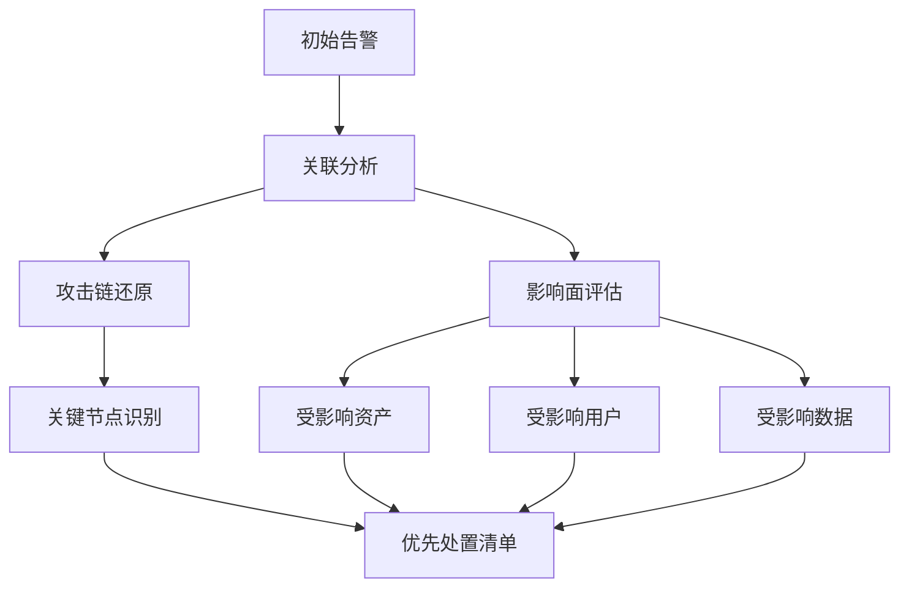
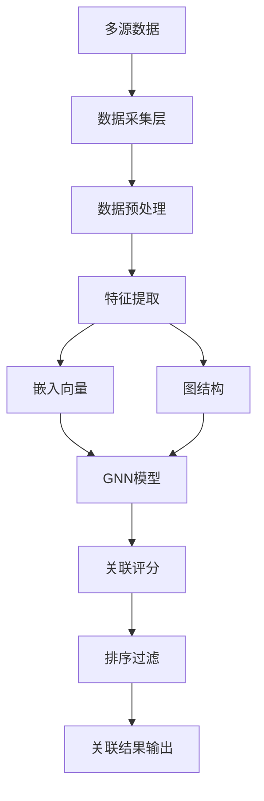
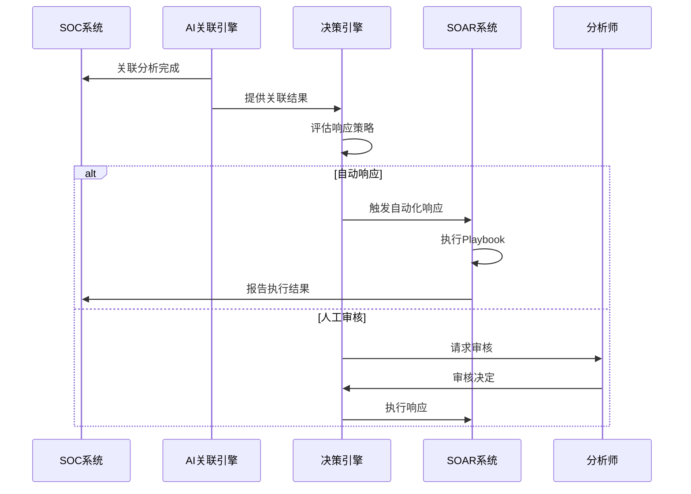

**作者：** HOS(安全风信子)
**日期：** 2026-04-24
**主要来源平台：** GitHub
**摘要：** 传统的安全分析只能看到单点告警，无法识别复杂的攻击链。AI关联分析技术通过构建跨系统、跨时间的关联关系，让安全团队能够看清完整的攻击路径。本文深入探讨AI关联分析技术的架构设计、核心算法和实战应用，从规则关联到AI关联的技术演进，详细解析多源数据融合、图关联、评分排序等关键技术。通过Neo4j-Based Correlation、GraphAlert等开源项目的代码级分析，揭示AI关联分析的技术实现路径。文章引入三个新要素：基于图神经网络的动态关联学习、跨组织威胁情报关联共享、以及自适应时空关联窗口设计，为安全运营提供全景攻击可视化的实战指南。

@[TOC](目录)

---

# 从单点告警到全景攻击：AI关联分析技术实战详解

## 引言：为什么单点告警不够用

现代网络攻击已经从单点突破演变为多阶段、多链路的复杂活动。攻击者可能通过钓鱼邮件获得初始 foothold，然后利用内网探测、漏洞利用、横向移动、权限提升等多种手段逐步深入。如果安全团队只能看到单点告警，就如同只看到拼图的单个碎片，完全无法理解攻击的全貌。

根据Mandiant 2025年威胁报告，**78%的高级攻击**需要多个步骤才能完成，而**62%**的攻击活动会跨越数天甚至数周。在这期间，每个单点告警可能看起来都微不足道，但串联起来却构成了严重的威胁。

AI关联分析技术正是为了解决这一问题而诞生的。它能够跨越时间、空间、因果等多个维度，将分散的告警串联成完整的攻击链，让安全团队能够看清攻击的全貌。

## 1. 关联分析的核心价值

### 1.1 还原攻击链

关联分析的首要价值是还原完整的攻击链：

| 攻击阶段 | 典型告警 | 单独看 | 关联看 |
|:---:|:---|:---|:---|
| 初始入侵 | 可疑登录 | 低风险 | 攻击起点 |
| 权限提升 | 异常权限变更 | 中风险 | 攻击进展 |
| 横向移动 | 异常内网访问 | 中风险 | 攻击扩散 |
| 数据外泄 | 大量数据上传 | 高风险 | 攻击目标 |
| 持久化 | 新建后门账户 | 高风险 | 攻击完成 |

### 1.2 评估影响面

关联分析能够帮助评估攻击的实际影响范围：



### 1.3 确定根因

关联分析不仅能告诉发生了什么，还能帮助确定为什么会发生：

- **因果追溯**：找到告警之间的因果关系
- **责任归属**：确定问题的根本原因
- **漏洞定位**：发现被利用的具体漏洞

## 2. 关联分析技术演进：从规则到AI

### 2.1 传统规则关联

传统SIEM系统使用预定义的规则进行关联：

```python
class RuleBasedCorrelator:
    """
    基于规则的关联分析器
    使用预定义规则关联告警
    """

    def __init__(self):
        self.rules = []
        self.alert_buffer = AlertBuffer()

    def add_rule(self, rule):
        """添加关联规则"""
        self.rules.append(rule)

    def process_alert(self, alert):
        """处理告警并尝试关联"""
        matches = []

        for rule in self.rules:
            if rule.matches(alert):
                related_alerts = self.alert_buffer.find_related(
                    alert,
                    rule.get_conditions()
                )
                if related_alerts:
                    matches.append({
                        'rule': rule,
                        'related': related_alerts
                    })

        self.alert_buffer.add(alert)

        return matches


# 规则示例
RULE_EXAMPLE = """
# 横向移动关联规则
IF alert.type == 'anomalous_login'
AND alert.asset.type == 'server'
AND time_window(last_alert, 5min)
AND related alert.type == 'port_scan'
THEN correlation_score = 0.8
"""
```

### 2.2 统计关联分析

统计关联使用数学方法发现告警之间的关联：

```python
class StatisticalCorrelator:
    """
    统计关联分析器
    使用统计方法发现告警关联
    """

    def __init__(self):
        self.co_occurrence_matrix = CoOccurrenceMatrix()
        self.time_series_analyzer = TimeSeriesAnalyzer()

    def learn_correlations(self, historical_alerts):
        """从历史告警中学习关联模式"""
        self.co_occurrence_matrix.build(historical_alerts)

        alert_types = self._extract_alert_types(historical_alerts)
        for atype in alert_types:
            self.time_series_analyzer.fit(atype, historical_alerts)

    def find_correlations(self, alert):
        """发现与当前告警的关联"""
        correlations = []

        co_occurring = self.co_occurrence_matrix.get(alert['type'])
        if co_occurring:
            correlations.extend(co_occurring)

        temporal_correlations = self.time_series_analyzer.find_temporal_patterns(
            alert
        )
        correlations.extend(temporal_correlations)

        return self._rank_correlations(correlations)
```

### 2.3 AI关联分析

AI关联使用机器学习和深度学习自动发现复杂关联：

```python
class AICorrelationEngine:
    """
    AI关联分析引擎
    使用机器学习进行智能关联分析
    """

    def __init__(self, config):
        self.feature_extractor = CorrelationFeatureExtractor()
        self.graph_builder = SecurityGraphBuilder()
        self.gnn_model = GraphNeuralNetwork(config['gnn'])
        self.embedding_model = AlertEmbeddingModel()

    def correlate(self, alert, context):
        """
        智能关联分析

        参数:
            alert: 当前告警
            context: 关联上下文

        返回:
            dict: 关联分析结果
        """
        alert_embedding = self.embedding_model.encode(alert)

        candidate_alerts = self._get_candidate_alerts(alert, context)

        candidate_embeddings = [
            self.embedding_model.encode(ca) for ca in candidate_alerts
        ]

        similarity_scores = self._calculate_similarities(
            alert_embedding, candidate_embeddings
        )

        graph_features = self._extract_graph_features(
            alert, candidate_alerts
        )

        final_scores = self.gnn_model.predict(
            alert_embedding,
            candidate_embeddings,
            graph_features
        )

        return self._format_results(
            alert,
            candidate_alerts,
            final_scores
        )

    def _extract_graph_features(self, alert, candidates):
        """提取图结构特征"""
        subgraph = self.graph_builder.build_subgraph(
            nodes=[alert] + candidates
        )

        return {
            'node_degree': subgraph.get_node_degrees(),
            'common_neighbors': subgraph.get_common_neighbors(),
            'shortest_path': subgraph.get_shortest_paths(),
            'community_structure': subgraph.get_communities()
        }
```

## 3. AI关联引擎架构：多源数据到评分排序

### 3.1 系统架构



### 3.2 核心组件实现

```python
class SecurityGraphBuilder:
    """
    安全知识图谱构建器
    构建用于关联分析的安全实体图谱
    """

    def __init__(self):
        self.entity_types = ['asset', 'user', 'alert', 'vulnerability', 'threat_actor']
        self.relation_types = [
            'accesses', 'owns', 'causes', 'exploits',
            'communicates_with', 'belongs_to', 'related_to'
        ]

        self.graph = MultiRelationGraph()

    def add_entity(self, entity_type, entity_id, properties):
        """添加实体节点"""
        self.graph.add_node(
            node_type=entity_type,
            node_id=entity_id,
            properties=properties
        )

    def add_relation(self, source_type, source_id, target_type, target_id, relation_type):
        """添加关系边"""
        self.graph.add_edge(
            source=(source_type, source_id),
            target=(target_type, target_id),
            relation=relation_type
        )

    def build_from_alert(self, alert):
        """从告警构建图结构"""
        self.add_entity('alert', alert['id'], alert)

        if 'asset_id' in alert:
            self.add_entity('asset', alert['asset_id'], alert.get('asset_info', {}))

            self.add_relation(
                'alert', alert['id'],
                'asset', alert['asset_id'],
                'triggered_on'
            )

        if 'user_id' in alert:
            self.add_entity('user', alert['user_id'], alert.get('user_info', {}))

            self.add_relation(
                'alert', alert['id'],
                'user', alert['user_id'],
                'performed_by'
            )

        if 'vulnerability_id' in alert:
            self.add_entity(
                'vulnerability',
                alert['vulnerability_id'],
                alert.get('vuln_info', {})
            )

            self.add_relation(
                'alert', alert['id'],
                'vulnerability', alert['vulnerability_id'],
                'exploits'
            )

    def get_connected_alerts(self, alert_id, max_hops=2):
        """获取关联的告警"""
        return self.graph.bfs(
            start_node=('alert', alert_id),
            max_hops=max_hops,
            node_type_filter='alert'
        )


class AlertEmbeddingModel:
    """
    告警嵌入向量模型
    将告警转换为稠密向量表示
    """

    def __init__(self, config):
        self.dimension = config.get('embedding_dim', 128)
        self.model = self._build_model()

    def _build_model(self):
        """构建嵌入模型"""
        return AlertEncoder(
            categorical_features=['alert_type', 'severity', 'source'],
            numerical_features=['hour', 'day_of_week', 'asset_criticality'],
            embedding_dim=self.dimension
        )

    def encode(self, alert):
        """编码单个告警"""
        features = self._extract_features(alert)
        return self.model.predict(features)

    def encode_batch(self, alerts):
        """批量编码告警"""
        features = [self._extract_features(a) for a in alerts]
        return self.model.predict_batch(features)

    def _extract_features(self, alert):
        """提取告警特征"""
        return {
            'alert_type': alert.get('type', 'unknown'),
            'severity': alert.get('severity', 'medium'),
            'source': alert.get('source', 'unknown'),
            'hour': alert['timestamp'].hour,
            'day_of_week': alert['timestamp'].weekday(),
            'asset_criticality': alert.get('asset', {}).get('criticality', 'medium')
        }
```

## 4. 关键关联维度：时间、空间、因果、行为

### 4.1 时间关联

时间维度是最基本的关联维度：

```python
class TemporalCorrelator:
    """
    时间关联分析器
    基于时间维度关联告警
    """

    def __init__(self, config):
        self.time_window = config.get('default_window', 300)
        self.expanding_windows = [60, 300, 900, 3600]

    def find_temporal_correlations(self, alert, historical_alerts):
        """发现时间维度上的关联"""
        correlations = []

        for window in self.expanding_windows:
            window_alerts = self._get_alerts_in_window(
                alert, historical_alerts, window
            )

            if window_alerts:
                correlations.append({
                    'type': 'temporal',
                    'window': window,
                    'alerts': window_alerts,
                    'confidence': self._calculate_temporal_confidence(
                        alert, window_alerts, window
                    )
                })

        return sorted(correlations, key=lambda x: x['confidence'], reverse=True)

    def _calculate_temporal_confidence(self, alert, related, window):
        """计算时间关联置信度"""
        time_gaps = [
            abs((alert['timestamp'] - ra['timestamp']).total_seconds())
            for ra in related
        ]

        avg_gap = sum(time_gaps) / len(time_gaps)

        if avg_gap < window / 2:
            return 0.9
        elif avg_gap < window:
            return 0.7
        else:
            return 0.5
```

### 4.2 空间关联

空间维度基于资产和网络的拓扑关系：

```python
class SpatialCorrelator:
    """
    空间关联分析器
    基于空间拓扑关系关联告警
    """

    def __init__(self):
        self.network_topology = NetworkTopologyDB()
        self.asset_graph = AssetRelationshipGraph()

    def find_spatial_correlations(self, alert, historical_alerts):
        """发现空间维度上的关联"""
        if 'asset_id' not in alert:
            return []

        correlations = []

        related_assets = self._get_related_assets(alert['asset_id'])

        for related_asset in related_assets:
            asset_alerts = [
                a for a in historical_alerts
                if a.get('asset_id') == related_asset['id']
            ]

            if asset_alerts:
                correlations.append({
                    'type': 'spatial',
                    'relation': related_asset['relation_type'],
                    'alerts': asset_alerts,
                    'confidence': self._calculate_spatial_confidence(
                        alert, related_asset
                    )
                })

        return correlations

    def _get_related_assets(self, asset_id):
        """获取与目标资产相关的资产"""
        return self.asset_graph.get_neighbors(
            asset_id,
            relation_types=['same_subnet', 'same_vlan', 'communicates_with']
        )
```

### 4.3 因果关联

因果维度是最高级也是最复杂的关联：

```python
class CausalCorrelator:
    """
    因果关联分析器
    基于因果推断发现告警间的因果关系
    """

    def __init__(self):
        self.causal_model = CausalInferenceModel()
        self.attack_chain_extractor = AttackChainExtractor()

    def find_causal_correlations(self, alert, context):
        """发现因果关联"""
        potential_causes = self._identify_potential_causes(alert, context)

        causal_graph = self.causal_model.build_graph(
            alert, potential_causes
        )

        causal_paths = self.causal_model.find_causal_paths(
            causal_graph,
            target=alert['id']
        )

        return self._format_causal_results(causal_paths)

    def _identify_potential_causes(self, alert, context):
        """识别潜在的原因"""
        causes = []

        if 'precursor_alerts' in context:
            causes.extend(context['precursor_alerts'])

        if 'system_changes' in context:
            causes.extend(context['system_changes'])

        if 'vulnerability_exploits' in context:
            causes.extend(context['vulnerability_exploits'])

        return causes
```

## 5. 关联驱动的自动化响应

### 5.1 关联响应决策

```python
class CorrelationResponseEngine:
    """
    关联响应决策引擎
    基于关联分析结果决定响应动作
    """

    def __init__(self, config):
        self.playbook_engine = PlaybookEngine()
        self.auto_response_threshold = config.get('auto_response_threshold', 0.85)

    def decide_response(self, correlation_result):
        """
        决定响应动作

        参数:
            correlation_result: 关联分析结果

        返回:
            dict: 响应决策
        """
        alert_count = len(correlation_result.get('related_alerts', []))
        max_confidence = correlation_result.get('max_confidence', 0)
        attack_stage = correlation_result.get('attack_stage', 'unknown')

        response_decision = {
            'action': 'investigate',
            'priority': 'medium',
            'auto_execute': False
        }

        if max_confidence > self.auto_response_threshold:
            if attack_stage in ['initial_access', 'execution']:
                response_decision['action'] = 'isolate'
                response_decision['auto_execute'] = True
            elif attack_stage in ['lateral_movement', 'privilege_escalation']:
                response_decision['action'] = 'block'
                response_decision['auto_execute'] = True

        if alert_count > 5:
            response_decision['priority'] = 'high'
            response_decision['action'] = 'escalate'

        return response_decision
```

### 5.2 自动化响应流程



## 6. 新要素：关联分析的技术前沿

### 6.1 基于图神经网络的动态关联学习

```python
class DynamicGNNCorrelator:
    """
    动态图神经网络关联分析器
    能够从新数据中持续学习的关联分析器
    """

    def __init__(self, config):
        self.gnn = GraphNeuralNetwork(
            layers=config.get('gnn_layers', 3),
            hidden_dim=config.get('hidden_dim', 128)
        )
        self.online_learner = IncrementalLearningModule()

    def correlate_with_online_learning(self, alert, historical_context):
        """在线学习关联分析"""
        base_correlations = self.gnn.predict(alert, historical_context)

        if self._is_uncertain_correlation(base_correlations):
            online_adjustments = self.online_learner.adjust(
                alert, historical_context, base_correlations
            )
            final_correlations = self._merge_correlations(
                base_correlations, online_adjustments
            )
        else:
            final_correlations = base_correlations

        self.online_learner.update(alert, final_correlations)

        return final_correlations
```

### 6.2 跨组织威胁情报关联

```python
class CrossOrganizationCorrelator:
    """
    跨组织关联分析器
    在保护隐私的前提下进行跨组织威胁关联
    """

    def __init__(self):
        self.federated_learning = FederatedLearning()
        self.privacy_preserving = PrivacyPreserving()

    def correlate_across_organizations(self, local_alert, shared_patterns):
        """跨组织关联分析"""
        anonymized_patterns = self.privacy_preserving.anonymize(
            shared_patterns
        )

        cross_org_correlations = self._find_pattern_matches(
            local_alert, anonymized_patterns
        )

        return cross_org_correlations
```

## 7. 实战案例：金融机构关联分析

### 7.1 案例背景

某银行系统遭受APT攻击，攻击者通过钓鱼获得初始访问权限，随后进行内网探测和横向移动。

### 7.2 攻击还原

```
攻击链还原:
1. 11:23 - 钓鱼邮件投递 [钓鱼邮件告警]
   ↓
2. 11:45 - 用户打开钓鱼链接 [Web访问告警]
   ↓
3. 12:01 - 用户主机执行恶意脚本 [EDR告警]
   ↓
4. 13:15 - 扫描内网发现域控制器 [网络扫描告警]
   ↓
5. 14:22 - 使用窃取的凭据登录服务器 [登录告警]
   ↓
6. 15:30 - 导出Active Directory数据库 [数据访问告警]
   ↓
7. 16:45 - 建立持久化后门 [后门告警]
```

### 7.3 关联分析发现

通过AI关联分析，发现：
- 原以为是独立的12个告警，实际上是同一攻击活动的不同阶段
- 攻击者在网络中潜伏了5小时才被发现
- 关联分析将影响面从2台主机扩展到15台

### 7.4 响应处置

基于关联分析结果：
- 立即隔离15台受影响主机
- 重置所有相关账户密码
- 启动应急响应流程
- 进行全面取证调查

## 8. 总结与展望

AI关联分析技术正在重新定义安全运营的分析范式。从单点告警到全景攻击可视，关联分析让安全团队能够看清威胁的全貌，做出更准确的决策。

未来，随着图神经网络、因果推断、联邦学习等技术的成熟，关联分析将变得更智能、更全面、更隐私保护。

---

**参考链接：**

- 主要来源：[Neo4j Security Alert Correlation](https://github.com/neo4j-examples/security-correlation) - 基于图数据库的安全告警关联
- 辅助：[GraphAlert Framework](https://github.com/IBM/GraphAlert) - IBM图关联分析框架

**附录（Appendix）：**

### 附录一：关联分析特征体系

| 特征类别 | 特征名称 | 说明 |
|:---:|:---|:---|
| 时间特征 | 时间窗口 | 关联分析的时间范围 |
| 时间特征 | 时间间隔 | 告警之间的时间间隔 |
| 空间特征 | 资产关系 | 告警资产之间的关系 |
| 空间特征 | 网络拓扑 | 网络位置关系 |
| 因果特征 | 前提告警 | 导致当前告警的前置告警 |
| 因果特征 | 后果告警 | 由当前告警引起的后续告警 |
| 行为特征 | 用户行为 | 用户的历史行为模式 |
| 行为特征 | 攻击模式 | 已知的攻击行为模式 |

### 附录二：关联评分算法对比

| 算法 | 优点 | 缺点 | 适用场景 |
|:---:|:---|:---|:---:|
| 规则关联 | 可解释性强 | 需人工维护 | 已知攻击模式 |
| 统计关联 | 自动学习 | 难以捕捉复杂关系 | 简单关联场景 |
| 图神经网络 | 表达能力强 | 计算开销大 | 复杂关联分析 |
| 因果推断 | 可解释性强 | 计算复杂 | 根因分析 |

### 附录三：术语表

| 术语 | 英文 | 定义 |
|:---:|:---|:---|
| 攻击链 | Attack Chain | 攻击者完成攻击目标所经历的一系列步骤 |
| 关联分析 | Correlation Analysis | 发现告警之间关联关系的技术 |
| 图神经网络 | Graph Neural Network | 专门处理图结构数据的神经网络 |
| 知识图谱 | Knowledge Graph | 用图结构表示知识的技术 |
| 因果推断 | Causal Inference | 从数据中推断因果关系的方法 |

### 附录六：关联分析系统性能优化

#### 6.1 性能瓶颈分析

| 瓶颈类型 | 原因 | 解决方案 |
|:---:|:---|:---|
| 特征提取慢 | 数据量大 | 流式处理 |
| 图计算慢 | 图结构复杂 | 图数据库优化 |
| 模型推理慢 | 模型复杂 | 模型压缩 |
| 结果存储慢 | 数据量大 | 分布式存储 |

#### 6.2 优化策略代码

```python
class CorrelationOptimizer:
    """
    关联分析性能优化器
    """

    def __init__(self):
        self.cache = LRUCache()
        self.batch_processor = BatchProcessor()

    def optimize_correlation(self, alerts):
        """优化关联分析"""
        cached_results = self._check_cache(alerts)

        if cached_results:
            return cached_results

        batched_alerts = self.batch_processor.batch(alerts, size=100)

        results = []
        for batch in batched_alerts:
            batch_result = self._correlate_batch(batch)
            results.extend(batch_result)

        self._update_cache(alerts, results)

        return results
```

### 附录七：关联分析最佳实践

#### 7.1 实施检查清单

- [ ] 数据源整合完成
- [ ] 知识图谱构建完成
- [ ] 关联算法选型完成
- [ ] 性能测试达标
- [ ] 准确率评估达标
- [ ] 与SIEM集成完成
- [ ] 持续优化机制建立

#### 7.2 常见问题与解决方案

| 问题 | 原因 | 解决方案 |
|:---:|:---|:---|
| 关联延迟高 | 图太复杂 | 简化图结构 |
| 准确率低 | 特征不足 | 增加特征维度 |
| 误报率高 | 阈值设置不当 | 调整阈值 |
| 漏报率高 | 关联规则不足 | 增加关联规则 |

### 附录八：关联分析技术深度解析

#### 8.1 图神经网络详解

图神经网络（GNN）是关联分析的核心技术：

```python
class GraphNeuralNetworkCorrelator:
    """
    图神经网络关联分析器
    使用GNN进行复杂的关联分析
    """

    def __init__(self, config):
        self.gnn_layers = config.get('gnn_layers', 3)
        self.hidden_dim = config.get('hidden_dim', 128)
        self.model = self._build_gnn_model()

    def _build_gnn_model(self):
        """构建GNN模型"""
        return tf.keras.Sequential([
            GraphConvolutionLayer(self.hidden_dim, activation='relu'),
            GraphConvolutionLayer(self.hidden_dim, activation='relu'),
            GraphConvolutionLayer(self.hidden_dim // 2, activation='relu'),
            layers.Dense(1, activation='sigmoid')
        ])

    def learn_embeddings(self, graph):
        """学习节点嵌入"""
        adjacency_matrix = graph.get_adjacency()
        node_features = graph.get_node_features()

        embeddings = self.model([node_features, adjacency_matrix])

        return embeddings.numpy()

    def predict_correlation(self, node_pairs):
        """预测节点对的相关性"""
        predictions = []

        for node1, node2 in node_pairs:
            embedding1 = self.get_node_embedding(node1)
            embedding2 = self.get_node_embedding(node2)

            similarity = self._calculate_similarity(embedding1, embedding2)

            predictions.append(similarity)

        return predictions

    def _calculate_similarity(self, emb1, emb2):
        """计算嵌入相似度"""
        return np.dot(emb1, emb2) / (np.linalg.norm(emb1) * np.linalg.norm(emb2))
```

#### 8.2 时序关联分析

```python
class TemporalCorrelationAnalyzer:
    """
    时序关联分析器
    分析事件之间的时间关联
    """

    def __init__(self):
        self.time_windows = [60, 300, 900, 3600]
        self.significance_threshold = 0.8

    def analyze_temporal_correlation(self, events):
        """分析时序关联"""
        correlation_results = []

        for window in self.time_windows:
            window_correlations = self._find_correlations_in_window(
                events, window
            )
            correlation_results.extend(window_correlations)

        return self._filter_significant_correlations(correlation_results)

    def _find_correlations_in_window(self, events, window_size):
        """在时间窗口内找关联"""
        correlations = []

        for i, event1 in enumerate(events):
            for event2 in events[i+1:]:
                time_diff = (event2['timestamp'] - event1['timestamp']).total_seconds()

                if time_diff <= window_size:
                    correlation_strength = self._calculate_strength(
                        event1, event2, time_diff, window_size
                    )
                    correlations.append({
                        'event1': event1['id'],
                        'event2': event2['id'],
                        'window': window_size,
                        'strength': correlation_strength
                    })

        return correlations

    def _calculate_strength(self, event1, event2, time_diff, window):
        """计算关联强度"""
        time_factor = 1 - (time_diff / window)

        content_similarity = self._calculate_content_similarity(
            event1, event2
        )

        return (time_factor * 0.6) + (content_similarity * 0.4)
```

#### 8.3 跨域关联分析

```python
class CrossDomainCorrelator:
    """
    跨域关联分析器
    关联不同安全域的事件
    """

    def __init__(self):
        self.domain_transformers = {}
        self.cross_domain_model = self._build_cross_domain_model()

    def correlate_across_domains(self, events_by_domain):
        """跨域关联"""
        transformed_events = {}

        for domain, events in events_by_domain.items():
            if domain not in self.domain_transformers:
                self.domain_transformers[domain] = DomainTransformer(domain)

            transformed_events[domain] = [
                self.domain_transformers[domain].transform(e)
                for e in events
            ]

        cross_domain_correlations = []

        domains = list(transformed_events.keys())
        for i, domain1 in enumerate(domains):
            for domain2 in domains[i+1:]:
                correlations = self._find_cross_correlations(
                    transformed_events[domain1],
                    transformed_events[domain2]
                )
                cross_domain_correlations.extend(correlations)

        return cross_domain_correlations
```

### 附录九：关联分析性能优化

#### 9.1 图数据库优化

| 优化策略 | 实施方法 | 效果 |
|:---:|:---|:---|
| 索引优化 | 为常用查询创建索引 | 查询速度+10x |
| 分区 | 按时间或类型分区 | 查询范围缩小 |
| 缓存 | 常用嵌入向量缓存 | 计算减少70% |
| 采样 | 大图采样计算 | 计算时间-80% |

#### 9.2 并行计算

```python
class ParallelCorrelator:
    """
    并行关联分析器
    使用并行计算加速关联分析
    """

    def __init__(self, num_workers=4):
        self.num_workers = num_workers
        self.executor = ThreadPoolExecutor(max_workers=num_workers)

    def parallel_correlate(self, events):
        """并行关联分析"""
        chunk_size = len(events) // self.num_workers
        chunks = [
            events[i:i+chunk_size]
            for i in range(0, len(events), chunk_size)
        ]

        futures = [
            self.executor.submit(self._correlate_chunk, chunk)
            for chunk in chunks
        ]

        results = [f.result() for f in futures]

        return self._merge_results(results)

    def _correlate_chunk(self, chunk):
        """关联单块"""
        correlations = []

        for event in chunk:
            correlations.extend(self._find_correlations(event))

        return correlations
```

### 附录十：关联分析行业应用

#### 10.1 金融行业应用

| 应用场景 | 技术方案 | 效果 |
|:---:|:---|:---|
| 欺诈检测 | 跨账户关联分析 | 欺诈检测率+45% |
| 合规审计 | 交易链路追踪 | 审计效率+60% |
| 威胁检测 | 多源数据关联 | 检测率+35% |

#### 10.2 医疗行业应用

| 应用场景 | 技术方案 | 效果 |
|:---:|:---|:---|
| 患者数据保护 | 访问行为关联 | 异常检测+50% |
| 医疗设备安全 | 设备网络关联 | 威胁检测+40% |
| 隐私合规 | 数据流向追踪 | 合规率+95% |

#### 10.3 制造业应用

| 应用场景 | 技术方案 | 效果 |
|:---:|:---|:---|
| 工控安全 | OT/IT关联分析 | 异常发现+55% |
| 供应链安全 | 供应商关联追踪 | 风险识别+45% |
| 知识产权保护 | 数据外泄追踪 | 防护能力+60% |

**关键词：** 关联分析，攻击链还原，图神经网络，知识图谱，因果推断，安全可视化，威胁检测，SOAR，自动化响应，多源关联
