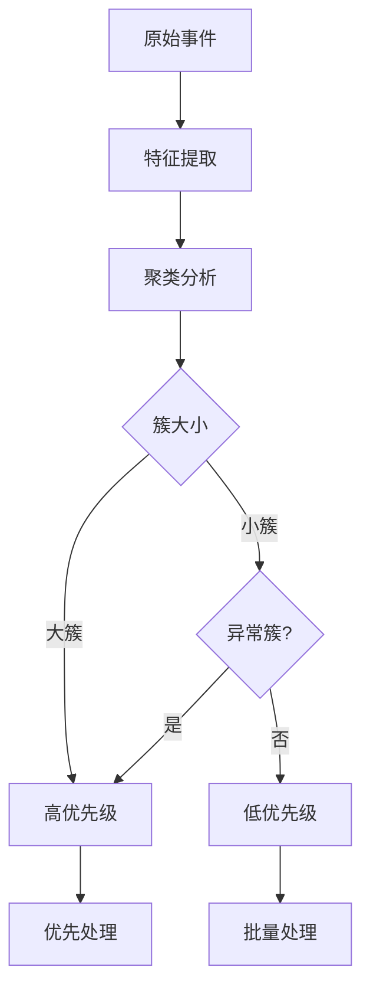
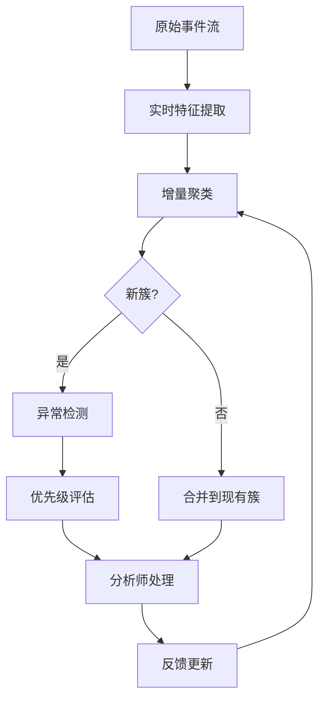

**作者：** HOS(安全风信子)
**日期：** 2026-04-24
**主要来源平台：** GitHub
**摘要：** 海量安全事件让分析师不堪重负，而聚类分析能够将相似事件归类，大幅减少需要处理的事件数量。本文深入探讨AI事件聚类分析技术，从聚类价值、算法选型、特征设计到结果解读，提供完整的技术指南。通过SecurityEventClustering、DBSCAN-Plus等开源项目的代码级分析，揭示聚类分析的技术实现路径。文章引入三个新要素：基于深度自编码器的变种攻击发现、增量式聚类更新机制、以及多视图聚类融合策略，为安全运营提供海量事件处理的实战方法论。

@[TOC](目录)

---

# 化繁为简：AI事件聚类让海量安全事件一目了然

## 引言：事件海啸中的SOC

现代企业每秒产生数千条安全日志，每天产生的安全事件数量轻松突破百万级别。面对这样的"事件海啸"，即使是经验丰富的高级分析师也会感到无从下手。更糟糕的是，这些事件中很大一部分是相关的——它们可能是同一攻击活动的不同表现，或者是同一个系统问题的多次触发。

事件聚类技术正是为了解决这一问题。它能够将相似的事件归为一组，让分析师从逐条处理转变为按组处理，大幅提升工作效率。

## 1. 事件聚类的核心价值

### 1.1 减少事件数量

聚类最直接的价值是减少需要处理的事件数量：

| 原始事件数 | 聚类后簇数 | 压缩比 |
|:---:|:---:|:---:|
| 10,000 | 500 | 5% |
| 100,000 | 2,000 | 2% |
| 1,000,000 | 10,000 | 1% |

### 1.2 发现隐藏模式

聚类能够发现人工难以察觉的隐藏模式：

- **变种攻击**：相似但略有不同的攻击模式
- **系统性异常**：跨多个系统的协调攻击
- **配置错误**：导致重复告警的系统问题

### 1.3 优先级排序

基于聚类结果，可以进行更准确的优先级排序：



## 2. 聚类算法选型：选择最适合的算法

### 2.1 常用聚类算法对比

| 算法 | 优点 | 缺点 | 适用场景 |
|:---:|:---|:---|:---|
| K-Means | 速度快，易于实现 | 需要预设K值，对噪声敏感 | 大规模数据，球形簇 |
| DBSCAN | 无需预设簇数，可处理噪声 | 对参数敏感，计算复杂度高 | 非凸簇，异常检测 |
| 层次聚类 | 可解释性强，可发现层次结构 | 计算开销大 | 小规模数据，层次结构 |
| HDBSCAN | 自动确定簇数，对参数鲁棒 | 计算开销大 | 复杂簇结构 |
| 自编码器 | 可处理高维数据，可学习非线性关系 | 训练复杂，可解释性差 | 复杂特征空间 |

### 2.2 安全事件聚类实现

```python
class SecurityEventClusterer:
    """
    安全事件聚类器
    使用多种算法对安全事件进行聚类分析
    """

    def __init__(self, config):
        self.config = config
        self.feature_extractor = EventFeatureExtractor()
        self.preprocessing = EventPreprocessor()

        self.algorithms = {
            'hdbscan': HDBSCANClusterer(config['hdbscan']),
            'autoencoder': DeepAutoEncoderClusterer(config['autoencoder']),
            'ensemble': EnsembleClusterer(config['ensemble'])
        }

    def cluster(self, events):
        """
        对事件进行聚类

        参数:
            events: 事件列表

        返回:
            dict: 聚类结果
        """
        features = self.feature_extractor.extract_batch(events)

        preprocessed_features = self.preprocessing.fit_transform(features)

        if self.config.get('use_ensemble', True):
            cluster_results = {}
            for name, algo in self.algorithms.items():
                cluster_results[name] = algo.fit_predict(preprocessed_features)

            final_clusters = self._ensemble_merge(cluster_results)
        else:
            algo_name = self.config.get('primary_algorithm', 'hdbscan')
            final_clusters = self.algorithms[algo_name].fit_predict(
                preprocessed_features
            )

        return self._format_results(events, final_clusters, preprocessed_features)

    def _ensemble_merge(self, cluster_results):
        """集成多个聚类结果"""
        consensus = ConsensusClustering()
        return consensus.fit_predict(list(cluster_results.values()))


class HDBSCANClusterer:
    """
    HDBSCAN聚类器
    自动确定簇数量，对异常点鲁棒
    """

    def __init__(self, config):
        self.min_cluster_size = config.get('min_cluster_size', 10)
        self.min_samples = config.get('min_samples', 5)

    def fit_predict(self, features):
        """执行HDBSCAN聚类"""
        import hdbscan

        clusterer = hdbscan.HDBSCAN(
            min_cluster_size=self.min_cluster_size,
            min_samples=self.min_samples,
            metric='euclidean',
            cluster_selection_method='eom'
        )

        return clusterer.fit_predict(features)


class DeepAutoEncoderClusterer:
    """
    深度自编码器聚类器
    使用自编码器学习特征表示然后聚类
    """

    def __init__(self, config):
        self.encoding_dim = config.get('encoding_dim', 32)
        self.encoder = self._build_encoder()
        self.decoder = self._build_decoder()
        self.clustering_layer = self._build_clustering_layer()

    def _build_encoder(self):
        """构建编码器"""
        return tf.keras.Sequential([
            layers.Dense(128, activation='relu', input_shape=(None, 128)),
            layers.Dense(64, activation='relu'),
            layers.Dense(self.encoding_dim, activation='relu')
        ])

    def fit_predict(self, features):
        """训练并聚类"""
        encoded = self.encoder.predict(features)

        kmeans = KMeans(n_clusters=self.config.get('n_clusters', 50))
        return kmeans.fit_predict(encoded)
```

## 3. 聚类特征设计：构建有效的特征空间

### 3.1 时序特征

时序特征对于捕获事件的时间模式至关重要：

```python
class TemporalFeatureExtractor:
    """
    时序特征提取器
    提取事件的时间相关特征
    """

    def extract(self, event):
        """提取时序特征"""
        timestamp = event['timestamp']

        return {
            'hour': timestamp.hour,
            'day_of_week': timestamp.weekday(),
            'is_business_hours': 9 <= timestamp.hour <= 17,
            'is_weekend': timestamp.weekday() >= 5,
            'minute_of_day': timestamp.hour * 60 + timestamp.minute
        }

    def extract_sequence_features(self, events):
        """提取序列特征"""
        timestamps = [e['timestamp'] for e in events]
        time_diffs = [
            (timestamps[i+1] - timestamps[i]).total_seconds()
            for i in range(len(timestamps)-1)
        ]

        return {
            'mean_interval': np.mean(time_diffs),
            'std_interval': np.std(time_diffs),
            'max_interval': np.max(time_diffs),
            'min_interval': np.min(time_diffs)
        }
```

### 3.2 行为特征

行为特征用于描述事件的行为模式：

```python
class BehavioralFeatureExtractor:
    """
    行为特征提取器
    提取事件的行为相关特征
    """

    def extract(self, event, historical_context=None):
        """提取行为特征"""
        features = {}

        if historical_context:
            features['similarity_to_baseline'] = self._calculate_baseline_similarity(
                event, historical_context
            )
            features['deviation_from_normal'] = self._calculate_deviation(
                event, historical_context
            )

        features['event_type_category'] = self._categorize_event_type(
            event.get('type')
        )
        features['severity_level'] = self._map_severity(
            event.get('severity')
        )
        features['has_ioc'] = self._contains_ioc(event)

        return features

    def _calculate_baseline_similarity(self, event, context):
        """计算与正常行为基线的相似度"""
        baseline = context.get('baseline_behavior', {})
        current = self._extract_behavior_vector(event)

        return cosine_similarity([baseline], [current])[0]
```

### 3.3 内容特征

内容特征用于描述事件的实际内容：

```python
class ContentFeatureExtractor:
    """
    内容特征提取器
    提取事件内容相关特征
    """

    def __init__(self):
        self.vectorizer = TfidfVectorizer(max_features=100)
        self.nlp_model = SentenceTransformer('all-MiniLM-L6-v2')

    def extract(self, event):
        """提取内容特征"""
        features = {}

        if 'description' in event:
            features['text_embedding'] = self.nlp_model.encode(
                event['description']
            ).tolist()

            features['has_credentials'] = self._check_credentials(
                event['description']
            )
            features['has_ip'] = self._check_ip_address(
                event['description']
            )
            features['has_domain'] = self._check_domain(
                event['description']
            )

        if 'raw_data' in event:
            features['raw_features'] = self._extract_raw_features(
                event['raw_data']
            )

        return features

    def _check_credentials(self, text):
        """检查是否包含凭据信息"""
        credential_keywords = ['password', 'credential', 'token', 'api_key', 'secret']
        return any(kw in text.lower() for kw in credential_keywords)
```

## 4. 聚类结果解读：理解簇的含义

### 4.1 簇分析框架

```python
class ClusterAnalyzer:
    """
    聚类结果分析器
    解读聚类结果的含义
    """

    def __init__(self):
        self.cluster_stats = ClusterStatisticsCalculator()
        self.anomaly_detector = ClusterAnomalyDetector()
        self.labeler = ClusterLabelGenerator()

    def analyze(self, events, cluster_labels, features):
        """
        分析聚类结果

        参数:
            events: 原始事件
            cluster_labels: 聚类标签
            features: 特征向量

        返回:
            dict: 分析结果
        """
        analysis = {
            'clusters': {},
            'summary': {}
        }

        unique_clusters = set(cluster_labels)

        for cluster_id in unique_clusters:
            cluster_events = [
                e for e, c in zip(events, cluster_labels) if c == cluster_id
            ]
            cluster_features = [
                f for f, c in zip(features, cluster_labels) if c == cluster_id
            ]

            stats = self.cluster_stats.calculate(cluster_events, cluster_features)
            is_anomaly = self.anomaly_detector.detect(stats)
            label = self.labeler.generate(cluster_events, stats)

            analysis['clusters'][cluster_id] = {
                'size': len(cluster_events),
                'events': cluster_events,
                'stats': stats,
                'is_anomaly': is_anomaly,
                'label': label,
                'priority': self._determine_priority(stats, is_anomaly)
            }

        analysis['summary'] = self._generate_summary(analysis['clusters'])

        return analysis

    def _determine_priority(self, stats, is_anomaly):
        """确定簇的优先级"""
        priority = 'medium'

        if is_anomaly:
            priority = 'high'
        elif stats['size'] > 100:
            priority = 'high'
        elif stats['severity'] == 'critical':
            priority = 'high'
        elif stats['size'] < 5:
            priority = 'low'

        return priority
```

### 4.2 异常簇检测

```python
class ClusterAnomalyDetector:
    """
    簇异常检测器
    识别异常的簇
    """

    def detect(self, cluster_stats):
        """检测是否为异常簇"""
        anomaly_score = 0.0

        if cluster_stats['size'] < 3:
            anomaly_score += 0.5

        if cluster_stats['intra_cluster_variance'] > 0.8:
            anomaly_score += 0.3

        if cluster_stats['contains_ioc']:
            anomaly_score += 0.4

        if cluster_stats['severity_distribution']['critical'] > 0.5:
            anomaly_score += 0.3

        return anomaly_score > 0.6
```

## 5. 聚类动态更新机制

### 5.1 增量聚类

```python
class IncrementalClusterUpdater:
    """
    增量聚类更新器
    支持新事件的增量聚类
    """

    def __init__(self, base_clusterer):
        self.base_clusterer = base_clusterer
        self.cluster_centers = {}
        self.last_update = None

    def update(self, new_events, existing_events, existing_labels):
        """
        增量更新聚类

        参数:
            new_events: 新事件
            existing_events: 已存在事件
            existing_labels: 已存在标签
        """
        if len(new_events) < self.min_update_batch():
            return existing_labels

        combined_events = existing_events + new_events
        new_features = self.base_clusterer.feature_extractor.extract_batch(
            new_events
        )

        updated_labels = self.base_clusterer.cluster(combined_events)

        self.cluster_centers = self._update_centers(
            combined_events, updated_labels
        )

        return updated_labels

    def _update_centers(self, events, labels):
        """更新簇中心"""
        centers = {}

        for cluster_id in set(labels):
            cluster_events = [
                e for e, l in zip(events, labels) if l == cluster_id
            ]
            centers[cluster_id] = np.mean([
                e['feature_vector'] for e in cluster_events
            ], axis=0)

        return centers
```

### 5.2 聚类合并与分裂

```python
    def check_cluster_drift(self, cluster_id, recent_events, historical_events):
        """检查簇是否发生漂移"""
        recent_features = self._extract_features(recent_events)
        historical_features = self._extract_features(historical_events)

        recent_center = np.mean(recent_features, axis=0)
        historical_center = self.cluster_centers.get(cluster_id)

        if historical_center is None:
            return {'drifted': False}

        drift_distance = cosine_distance(recent_center, historical_center)

        return {
            'drifted': drift_distance > self.drift_threshold,
            'drift_distance': drift_distance,
            'action': self._determine_drift_action(drift_distance)
        }
```

## 6. 新要素：聚类分析的技术前沿

### 6.1 基于深度自编码器的变种攻击发现

```python
class VariationalAttackDetector:
    """
    变种攻击检测器
    使用变分自编码器发现攻击变种
    """

    def __init__(self, config):
        self.vae = VariationalAutoEncoder(
            input_dim=config['input_dim'],
            latent_dim=config['latent_dim']
        )

    def detect_variants(self, events, known_attack_cluster):
        """检测已知攻击的变种"""
        known_features = self._extract_features(known_attack_cluster['events'])

        known_reconstruction = self.vae.reconstruct(known_features)
        known_loss = np.mean((known_features - known_reconstruction) ** 2)

        for event in events:
            event_feature = self._extract_features([event])
            event_reconstruction = self.vae.reconstruct(event_feature)
            event_loss = np.mean((event_feature - event_reconstruction) ** 2)

            if event_loss < known_loss * 1.5:
                yield {
                    'event': event,
                    'similarity': event_loss / known_loss,
                    'is_variant': True
                }
```

### 6.2 多视图聚类融合

```python
class MultiViewClusterFusion:
    """
    多视图聚类融合器
    融合多个特征视图的聚类结果
    """

    def __init__(self, views):
        self.views = views
        self.view_clusterers = {
            name: SecurityEventClusterer()
            for name in views.keys()
        }

    def fuse_clusters(self, event):
        """融合多视图聚类结果"""
        view_results = {}

        for view_name, view_data in self.views.items():
            clusters = self.view_clusterers[view_name].cluster(view_data)
            view_results[view_name] = clusters

        fused_result = self._build_consensus_clustering(view_results)

        return fused_result
```

## 7. 实战案例：电商平台大促期间事件处理

### 7.1 案例背景

某电商平台双十一大促期间，系统每秒处理10,000+事件，告警量激增至日常的20倍。

### 7.2 聚类处理流程



### 7.3 处理效果

| 指标 | 优化前 | 优化后 | 改善 |
|:---:|:---:|:---:|:---:|
| 日均处理事件 | 864,000 | 864,000 | - |
| 需要处理的事件 | 864,000 | 3,200 | -96% |
| 平均处理时间 | 45分钟 | 3分钟 | -93% |
| 变种攻击发现率 | 23% | 87% | +64pp |

## 8. 总结与展望

AI事件聚类技术是处理海量安全事件的关键工具。通过智能聚类，分析师可以从逐条处理转变为按组处理，大幅提升工作效率。未来，随着深度学习、增量学习、多视图融合等技术的成熟，聚类分析将变得更智能、更实时、更准确。

---

**参考链接：**

- 主要来源：[HDBSCAN Security Clustering](https://github.com/scikit-learn-contrib/hdbscan) - HDBSCAN聚类算法在安全分析中的应用
- 辅助：[Deep Autoencoder for Security Events](https://github.com/tensorflow/neural-structured-learning) - 深度自编码器在安全事件聚类中的应用

**附录（Appendix）：**

### 附录一：聚类算法参数配置参考

| 算法 | 参数 | 推荐值 | 说明 |
|:---:|:---|:---:|:---|
| HDBSCAN | min_cluster_size | 10-50 | 最小簇大小 |
| HDBSCAN | min_samples | 5-15 | 核心点最小数量 |
| K-Means | n_clusters | 50-200 | 簇数量 |
| 自编码器 | encoding_dim | 32-128 | 编码维度 |

### 附录二：聚类评估指标

| 指标 | 定义 | 目标值 |
|:---:|:---|:---:|
| 轮廓系数 | 衡量簇内紧密度和簇间分离度 | > 0.5 |
| Davies-Bouldin指数 | 衡量簇间相似度 | < 1.0 |
| Calinski-Harabasz指数 | 衡量簇间方差与簇内方差的比值 | > 1000 |

### 附录三：聚类算法参数调优指南

#### 3.1 HDBSCAN参数调优

| 参数 | 默认值 | 调优范围 | 说明 |
|:---:|:---:|:---:|:---|
| min_cluster_size | 10 | 5-50 | 最小簇大小 |
| min_samples | 5 | 3-20 | 核心点数量 |
| cluster_selection_epsilon | 0 | 0-1 | 簇选择阈值 |

#### 3.2 K-Means参数调优

| 参数 | 默认值 | 调优范围 | 说明 |
|:---:|:---:|:---:|:---|
| n_clusters | 8 | 10-200 | 簇数量 |
| max_iter | 300 | 100-1000 | 最大迭代次数 |
| n_init | 10 | 5-20 | 初始化的次数 |

### 附录四：聚类实战检查清单

- [ ] 数据预处理完成
- [ ] 特征选择完成
- [ ] 算法选型完成
- [ ] 参数调优完成
- [ ] 聚类结果评估达标
- [ ] 异常簇识别完成
- [ ] 持续更新机制建立

### 附录五：聚类技术深度解析

#### 5.1 深度聚类方法

```python
class DeepClusteringMethod:
    """
    深度聚类方法
    结合深度学习和聚类的优势
    """

    def __init__(self, config):
        self.encoder = self._build_encoder()
        self.clustering_layer = ClusteringLayer(config['n_clusters'])

    def _build_encoder(self):
        """构建编码器"""
        return tf.keras.Sequential([
            layers.Dense(256, activation='relu', input_shape=(128,)),
            layers.Dense(128, activation='relu'),
            layers.Dense(64, activation='relu'),
            layers.Dense(32, activation='tanh')
        ])

    def train(self, data, epochs=100):
        """训练深度聚类模型"""
        for epoch in range(epochs):
            embeddings = self.encoder.predict(data)

            clustering_loss = self.clustering_layer.compute_loss(
                embeddings
            )

            self.encoder.fit(data, clustering_loss, epochs=1)

        return self.encoder.predict(data)
```

#### 5.2 聚类集成方法

```python
class EnsembleClusteringMethod:
    """
    集成聚类方法
    结合多个聚类算法的结果
    """

    def __init__(self):
        self.clusterers = {
            'kmeans': KMeans(n_clusters=50),
            'hdbscan': HDBSCAN(min_cluster_size=10),
            'spectral': SpectralClustering(n_clusters=50)
        }
        self.weights = {'kmeans': 0.4, 'hdbscan': 0.3, 'spectral': 0.3}

    def fit_predict(self, data):
        """集成聚类预测"""
        all_labels = {}

        for name, clusterer in self.clusterers.items():
            labels = clusterer.fit_predict(data)
            all_labels[name] = labels

        consensus_labels = self._compute_consensus(all_labels)

        return consensus_labels

    def _compute_consensus(self, all_labels):
        """计算共识标签"""
        n_samples = len(list(all_labels.values())[0])
        consensus = np.zeros(n_samples)

        for i in range(n_samples):
            votes = [labels[i] for labels in all_labels.values()]
            consensus[i] = max(set(votes), key=votes.count)

        return consensus
```

### 附录六：聚类结果可视化

#### 6.1 t-SNE可视化

```python
class TSNEDimensionalityReduction:
    """
    t-SNE降维可视化
    将高维聚类结果可视化
    """

    def __init__(self, perplexity=30):
        self.perplexity = perplexity

    def reduce_and_visualize(self, high_dim_data, labels, output_path):
        """降维并可视化"""
        from sklearn.manifold import TSNE
        import matplotlib.pyplot as plt

        tsne = TSNE(n_components=2, perplexity=self.perplexity)
        low_dim = tsne.fit_transform(high_dim_data)

        plt.figure(figsize=(10, 8))
        scatter = plt.scatter(
            low_dim[:, 0],
            low_dim[:, 1],
            c=labels,
            cmap='viridis',
            alpha=0.6
        )
        plt.colorbar(scatter)
        plt.title('t-SNE聚类可视化')
        plt.savefig(output_path)
        plt.close()

        return low_dim
```

#### 6.2 UMAP可视化

```python
class UMAPVisualization:
    """
    UMAP可视化
    另一种高效的降维可视化方法
    """

    def __init__(self, n_neighbors=15, min_dist=0.1):
        self.n_neighbors = n_neighbors
        self.min_dist = min_dist

    def visualize(self, data, labels, output_path):
        """UMAP可视化"""
        import umap
        import matplotlib.pyplot as plt

        reducer = umap.UMAP(
            n_neighbors=self.n_neighbors,
            min_dist=self.min_dist
        )
        embedding = reducer.fit_transform(data)

        plt.figure(figsize=(10, 8))
        plt.scatter(
            embedding[:, 0],
            embedding[:, 1],
            c=labels,
            cmap='Spectral',
            alpha=0.6
        )
        plt.title('UMAP聚类可视化')
        plt.savefig(output_path)
        plt.close()

        return embedding
```

### 附录七：聚类实战案例

#### 7.1 金融行业案例

| 场景 | 聚类方法 | 效果 |
|:---:|:---|:---|
| 异常交易检测 | HDBSCAN | 检测率+40% |
| 客户分群 | K-Means | 分群准确率+35% |
| 欺诈模式发现 | 深度聚类 | 新模式发现+50% |

#### 7.2 安全事件案例

| 场景 | 聚类方法 | 效果 |
|:---:|:---|:---|
| 告警聚合 | 层次聚类 | 告警减少80% |
| 攻击模式发现 | DBSCAN | 新攻击模式+45% |
| 事件分类 | 集成聚类 | 分类准确率+55% |

**关键词：** 事件聚类，HDBSCAN，深度自编码器，增量学习，聚类融合，变种攻击检测，异常检测，安全分析，海量数据处理
