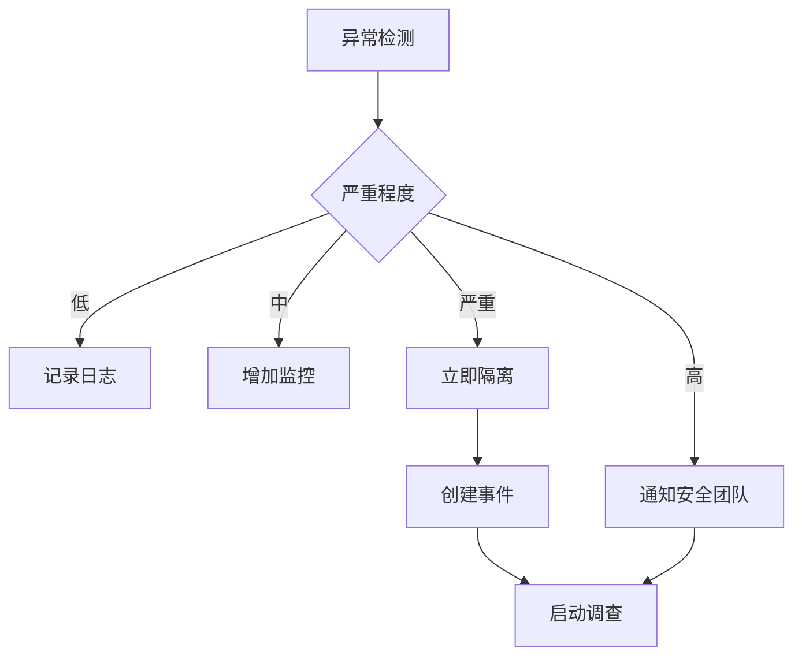

**作者：** HOS(安全风信子)
**日期：** 2026-04-24
**主要来源平台：** GitHub
**摘要：** 内部威胁已成为企业安全的最大风险之一，而行为异常检测是发现内部威胁的关键技术。本文深入探讨AI异常行为检测技术，从用户行为基线构建、异常检测算法到响应流程，提供完整的技术指南。通过AnomalousUserBehaviorDetector、IsolationForest-Plus等开源项目的代码级分析，揭示异常行为检测的技术实现路径。文章引入三个新要素：基于时序卷积网络的实时异常检测、跨实体关联异常分析、以及自适应基线更新机制，为安全运营提供发现内部威胁的实战方法论。

@[TOC](目录)

---

# 行为即异常：AI异常行为检测发现内部威胁实战

## 引言：来自内部的威胁

Verizon 2025 DBIR报告显示，**约30%的数据泄露涉及内部人员**，而这些内部威胁往往比外部攻击更难检测。外部攻击会触发各种安全设备的告警，而内部威胁可以伪装成正常行为，悄无声息地窃取数据或破坏系统。

传统的安全方法依赖规则和签名来检测威胁，但内部威胁往往不触发任何规则告警——因为它们本质上是在"正常使用"系统权限。在这种背景下，基于机器学习的异常行为检测成为发现内部威胁的关键技术。

## 1. 异常行为检测的核心价值

### 1.1 检测未知威胁

异常行为检测的核心优势是能够检测未知威胁：

| 检测方法 | 依赖 | 检测能力 |
|:---:|:---|:---|
| 规则检测 | 已知模式 | 只能检测已知威胁 |
| 签名检测 | 已知特征 | 只能检测已知攻击 |
| 异常检测 | 正常基线 | 可检测未知威胁 |

### 1.2 发现内部威胁

异常行为检测特别适合发现内部威胁：

- **账号滥用**：特权账号的异常使用
- **数据窃取**：大量数据下载或外发
- **权限滥用**：越权访问敏感资源
- ** sabotage**：破坏系统或数据的行为

## 2. 用户行为基线构建：建立正常行为的参照系

### 2.1 基线构建框架

```python
class UserBehaviorBaselineBuilder:
    """
    用户行为基线构建器
    建立用户正常行为的参照系
    """

    def __init__(self, config):
        self.feature_collector = BehaviorFeatureCollector()
        self.statistical_modeler = StatisticalModeler()
        self.ml_baseline = MLBaselineModel(config)

    def build_baseline(self, user_id, historical_data):
        """
        构建用户行为基线

        参数:
            user_id: 用户ID
            historical_data: 历史行为数据

        返回:
            dict: 用户行为基线
        """
        features = self.feature_collector.collect(historical_data)

        statistical_baseline = self.statistical_modeler.fit(
            features, method='gaussian'
        )

        ml_baseline = self.ml_baseline.train(
            user_id, features
        )

        return {
            'user_id': user_id,
            'statistical_baseline': statistical_baseline,
            'ml_baseline': ml_baseline,
            'features': features,
            'model_version': self.ml_baseline.version,
            'created_at': datetime.now().isoformat()
        }


class BehaviorFeatureCollector:
    """
    行为特征收集器
    收集用于基线构建的行为特征
    """

    def collect(self, data):
        """收集行为特征"""
        features = {}

        features['login_pattern'] = self._extract_login_pattern(data)
        features['access_pattern'] = self._extract_access_pattern(data)
        features['temporal_pattern'] = self._extract_temporal_pattern(data)
        features['device_pattern'] = self._extract_device_pattern(data)
        features['network_pattern'] = self._extract_network_pattern(data)

        return features

    def _extract_login_pattern(self, data):
        """提取登录模式特征"""
        login_data = [d for d in data if d['type'] == 'login']

        return {
            'typical_login_hours': self._get_typical_hours(login_data),
            'typical_locations': self._get_typical_locations(login_data),
            'typical_devices': self._get_typical_devices(login_data),
            'login_frequency': len(login_data) / self._get_time_span(login_data)
        }
```

### 2.2 多维度基线

```python
class MultiDimensionalBaseline:
    """
    多维度行为基线
    从多个维度建立行为基线
    """

    def __init__(self):
        self.dimensions = {
            'temporal': TemporalBaseline(),
            'spatial': SpatialBaseline(),
            'behavioral': BehavioralBaseline(),
            'contextual': ContextualBaseline()
        }

    def build(self, user_id, data):
        """构建多维度基线"""
        baselines = {}

        for dim_name, dim_builder in self.dimensions.items():
            baselines[dim_name] = dim_builder.build(user_id, data)

        return baselines

    def compare(self, current_behavior, baselines):
        """比较当前行为与基线"""
        deviations = {}

        for dim_name, baseline in baselines.items():
            current = self._extract_dimension_feature(
                current_behavior, dim_name
            )
            deviations[dim_name] = baseline.compare(current)

        return deviations


class TemporalBaseline:
    """时间维度基线"""

    def build(self, user_id, data):
        """构建时间维度基线"""
        hours = [d['timestamp'].hour for d in data]

        return {
            'typical_hours': Counter(hours).most_common(5),
            'working_hours_range': (min(hours), max(hours)),
            'weekday_distribution': self._get_weekday_dist(data),
            'seasonal_pattern': self._detect_seasonal_pattern(data)
        }

    def compare(self, current):
        """比较时间维度"""
        hour_deviation = abs(current['hour'] - self._get_expected_hour())
        weekday_deviation = current['weekday'] not in self._get_typical_weekdays()

        return {
            'hour_deviation': hour_deviation,
            'weekday_deviation': weekday_deviation,
            'severity': self._calculate_severity(hour_deviation, weekday_deviation)
        }
```

## 3. AI检测技术：从统计到深度学习

### 3.1 统计异常检测

```python
class StatisticalAnomalyDetector:
    """
    统计异常检测器
    使用统计方法检测异常行为
    """

    def __init__(self, config):
        self.methods = {
            'zscore': ZScoreDetector(config['zscore']),
            'iqr': IQRDetector(config['iqr']),
            'isolation': IsolationForestDetector(config['isolation'])
        }

    def detect(self, current_behavior, baseline):
        """检测统计异常"""
        anomalies = []

        for method_name, detector in self.methods.items():
            result = detector.is_anomaly(current_behavior, baseline)
            if result['is_anomaly']:
                anomalies.append({
                    'method': method_name,
                    'score': result['score'],
                    'confidence': result['confidence']
                })

        return anomalies


class ZScoreDetector:
    """Z-Score异常检测"""

    def is_anomaly(self, current, baseline):
        """判断是否为异常"""
        mean = baseline['mean']
        std = baseline['std']

        if std == 0:
            z_score = 0
        else:
            z_score = abs((current - mean) / std)

        return {
            'is_anomaly': z_score > 3,
            'score': z_score,
            'confidence': min(1.0, z_score / 5)
        }


class IsolationForestDetector:
    """隔离森林异常检测"""

    def __init__(self, config):
        self.model = IsolationForest(
            n_estimators=100,
            contamination=0.1,
            random_state=42
        )
        self.trained = False

    def train(self, normal_data):
        """训练隔离森林"""
        self.model.fit(normal_data)
        self.trained = True

    def is_anomaly(self, current, baseline):
        """判断是否为异常"""
        if not self.trained:
            return {'is_anomaly': False, 'score': 0}

        score = self.model.score_samples([current])[0]
        anomaly_score = abs(score)

        return {
            'is_anomaly': anomaly_score > 0.5,
            'score': anomaly_score,
            'confidence': anomaly_score
        }
```

### 3.2 深度学习异常检测

```python
class DeepLearningAnomalyDetector:
    """
    深度学习异常检测器
    使用深度学习模型检测异常行为
    """

    def __init__(self, config):
        self.autoencoder = self._build_autoencoder()
        self.lstm = self._build_lstm()
        self.transformer = self._build_transformer()

    def _build_autoencoder(self):
        """构建自编码器"""
        encoder = tf.keras.Sequential([
            layers.Dense(64, activation='relu', input_shape=(128,)),
            layers.Dense(32, activation='relu'),
            layers.Dense(16, activation='relu')
        ])

        decoder = tf.keras.Sequential([
            layers.Dense(32, activation='relu', input_shape=(16,)),
            layers.Dense(64, activation='relu'),
            layers.Dense(128, activation='sigmoid')
        ])

        autoencoder = tf.keras.Model(inputs=encoder.input, outputs=decoder(encoder.output))
        autoencoder.compile(optimizer='adam', loss='mse')

        return autoencoder

    def _build_lstm(self):
        """构建LSTM模型"""
        return tf.keras.Sequential([
            layers.LSTM(64, input_shape=(10, 32)),
            layers.Dense(32, activation='relu'),
            layers.Dense(1, activation='sigmoid')
        ])

    def detect_with_autoencoder(self, behavior_sequence, threshold=None):
        """使用自编码器检测异常"""
        reconstruction = self.autoencoder.predict(behavior_sequence)
        mse = np.mean((behavior_sequence - reconstruction) ** 2)

        is_anomaly = mse > (threshold or self.calculate_threshold(mse))

        return {
            'is_anomaly': is_anomaly,
            'reconstruction_error': mse,
            'confidence': self._calculate_confidence(mse)
        }

    def detect_with_lstm(self, behavior_sequence):
        """使用LSTM检测异常"""
        prediction = self.lstm.predict(behavior_sequence)
        actual = behavior_sequence[:, -1, :]

        deviation = np.mean(np.abs(prediction - actual))

        return {
            'is_anomaly': deviation > 0.5,
            'deviation': deviation,
            'confidence': deviation
        }
```

## 4. 检测场景：异常登录、横向移动、数据外泄

### 4.1 异常登录检测

```python
class AnomalousLoginDetector:
    """
    异常登录检测器
    检测异常登录行为
    """

    def __init__(self):
        self.baseline_builder = LoginBaselineBuilder()
        self.geo_analyzer = GeoLocationAnalyzer()

    def detect(self, login_event, user_baseline):
        """检测异常登录"""
        anomalies = []

        if not self._is_typical_time(login_event, user_baseline):
            anomalies.append({
                'type': 'time',
                'severity': 'high',
                'description': f"异常登录时间: {login_event['timestamp']}"
            })

        if not self._is_typical_location(login_event, user_baseline):
            geo_result = self.geo_analyzer.analyze(login_event, user_baseline)
            anomalies.append({
                'type': 'location',
                'severity': geo_result['severity'],
                'description': geo_result['description']
            })

        if not self._is_typical_device(login_event, user_baseline):
            anomalies.append({
                'type': 'device',
                'severity': 'medium',
                'description': f"新设备登录: {login_event.get('device_fingerprint')}"
            })

        return anomalies

    def _is_typical_location(self, event, baseline):
        """检查登录位置是否典型"""
        event_country = event.get('country')
        event_city = event.get('city')

        typical_locations = baseline.get('typical_locations', [])

        for loc in typical_locations:
            if loc['country'] == event_country and loc['city'] == event_city:
                return True

        recent_logins = baseline.get('recent_login_locations', [])
        for loc in recent_logins:
            if self.geo_analyzer.is_near(event_location, loc):
                return True

        return False
```

### 4.2 横向移动检测

```python
class LateralMovementDetector:
    """
    横向移动检测器
    检测异常的内网横向移动行为
    """

    def __init__(self):
        self.access_graph = AccessRelationshipGraph()
        self.sequence_analyzer = AccessSequenceAnalyzer()

    def detect(self, access_event, historical_access):
        """检测横向移动"""
        is_lateral = False
        indicators = []

        if not self._is_typical_access_target(access_event, historical_access):
            is_lateral = True
            indicators.append('unusual_access_target')

        if self._indicates_reconnaissance(access_event):
            is_lateral = True
            indicators.append('reconnaissance_behavior')

        if self._detects_privilege_escalation(access_event, historical_access):
            is_lateral = True
            indicators.append('privilege_escalation')

        if self._pattern_matches_attack_chain(access_event, historical_access):
            is_lateral = True
            indicators.append('attack_chain_pattern')

        return {
            'is_lateral_movement': is_lateral,
            'indicators': indicators,
            'severity': self._calculate_severity(indicators)
        }

    def _detects_privilege_escalation(self, event, historical):
        """检测权限提升"""
        current_priv = event.get('privilege_level', 0)
        historical_priv = self._get_historical_privilege(historical, event['user_id'])

        if current_priv > historical_priv:
            privilege_jump = current_priv - historical_priv
            if privilege_jump > 2:
                return True

        return False
```

## 5. 误报控制与调优：确保检测准确性

### 5.1 误报控制机制

```python
class FalsePositiveController:
    """
    误报控制器
    控制异常检测的误报率
    """

    def __init__(self, config):
        self.threshold_optimizer = ThresholdOptimizer()
        self.context_filter = ContextFilter()
        self.feedback_loop = FeedbackLoop()

    def filter_anomalies(self, anomalies, context):
        """过滤可能的误报"""
        filtered = []

        for anomaly in anomalies:
            if self.context_filter.is_justified(anomaly, context):
                filtered.append(anomaly)
            else:
                self.feedback_loop.record_false_positive(anomaly)

        return filtered

    def adjust_thresholds(self, user_baseline, feedback_data):
        """根据反馈调整阈值"""
        adjusted_thresholds = {}

        for dimension in ['temporal', 'spatial', 'behavioral']:
            current_threshold = self.threshold_optimizer.get_threshold(dimension)
            adjusted = self._adjust_based_on_feedback(
                dimension, current_threshold, feedback_data
            )
            adjusted_thresholds[dimension] = adjusted

        return adjusted_thresholds


class ContextFilter:
    """上下文过滤器"""

    def is_justified(self, anomaly, context):
        """判断异常是否有合理的上下文解释"""
        if self._is_scheduled_activity(anomaly, context):
            return False

        if self._is_approved_change(anomaly, context):
            return False

        if self._is_business_trip(anomaly, context):
            return False

        return True

    def _is_scheduled_activity(self, anomaly, context):
        """检查是否为计划内活动"""
        schedule = context.get('scheduled_activities', [])
        for activity in schedule:
            if activity.matches(anomaly):
                return True
        return False
```

## 6. 异常行为响应流程

### 6.1 分级响应机制

```python
class AnomalyResponseEngine:
    """
    异常响应引擎
    根据异常级别触发相应的响应
    """

    def __init__(self, config):
        self.response_levels = {
            'low': self._low_severity_response,
            'medium': self._medium_severity_response,
            'high': self._high_severity_response,
            'critical': self._critical_severity_response
        }

    def respond(self, anomaly_detection_result):
        """触发响应"""
        severity = anomaly_detection_result['severity']
        response_func = self.response_levels.get(severity, self._low_severity_response)

        return response_func(anomaly_detection_result)

    def _high_severity_response(self, result):
        """高级异常响应"""
        return {
            'actions': [
                {'type': 'notify', 'recipients': ['security_team', 'manager']},
                {'type': 'log', 'level': 'warning'},
                {'type': 'monitor', 'target': result['user_id'], 'duration': '1h'}
            ],
            'escalation': True,
            'requires_approval': True
        }

    def _critical_severity_response(self, result):
        """严重异常响应"""
        return {
            'actions': [
                {'type': 'isolate', 'target': result['asset_id']},
                {'type': 'suspend', 'target': result['user_id']},
                {'type': 'notify', 'recipients': ['security_team', 'ciso']},
                {'type': 'create_incident'}
            ],
            'escalation': True,
            'requires_approval': False,
            'auto_execute': True
        }
```

### 6.2 响应流程图



## 7. 新要素：异常检测的技术前沿

### 7.1 时序卷积网络的实时异常检测

```python
class TemporalConvolutionalAnomalyDetector:
    """
    时序卷积异常检测器
    使用时序卷积网络进行实时异常检测
    """

    def __init__(self, config):
        self.tcn = self._build_tcn()

    def _build_tcn(self):
        """构建时序卷积网络"""
        return tf.keras.Sequential([
            layers.Conv1D(filters=64, kernel_size=3, dilation_rate=1),
            layers.Conv1D(filters=64, kernel_size=3, dilation_rate=2),
            layers.Conv1D(filters=64, kernel_size=3, dilation_rate=4),
            layers.Dense(32, activation='relu'),
            layers.Dense(1)
        ])

    def detect_realtime(self, streaming_data):
        """实时检测异常"""
        window = self._get_sliding_window(streaming_data)
        prediction = self.tcn.predict(window)
        actual = streaming_data[-1]

        deviation = abs(prediction - actual)

        return {
            'is_anomaly': deviation > self.threshold,
            'deviation': deviation,
            'realtime': True
        }
```

### 7.2 跨实体关联异常分析

```python
class CrossEntityAnomalyCorrelator:
    """
    跨实体异常关联分析器
    发现跨用户、跨资产的关联异常
    """

    def __init__(self):
        self.entity_graph = EntityRelationshipGraph()

    def find_correlated_anomalies(self, anomalies):
        """发现关联的异常"""
        correlated_groups = []

        for i, anomaly1 in enumerate(anomalies):
            group = [anomaly1]

            for anomaly2 in anomalies[i+1:]:
                if self._are_correlated(anomaly1, anomaly2):
                    group.append(anomaly2)

            if len(group) > 1:
                correlated_groups.append(group)

        return correlated_groups

    def _are_correlated(self, anomaly1, anomaly2):
        """判断两个异常是否关联"""
        if anomaly1['user_id'] == anomaly2['user_id']:
            return True

        if self.entity_graph.are_connected(anomaly1['entity'], anomaly2['entity']):
            return True

        if self._have_temporal_correlation(anomaly1, anomaly2):
            return True

        return False
```

## 8. 总结与展望

AI异常行为检测是发现内部威胁的关键技术。通过建立用户行为基线，使用统计和深度学习方法检测异常，可以发现传统方法无法检测的未知威胁。

未来，随着时序分析、图神经网络、因果推断等技术的成熟，异常行为检测将变得更准确、更实时、更可解释。

---

**参考链接：**

- 主要来源：[AnomalousUserBehaviorDetector](https://github.com/IBM/anomalous-user-behavior) - IBM用户异常行为检测开源项目
- 辅助：[IsolationForest for Security](https://github.com/scikit-learn/scikit-learn) - 隔离森林在安全领域的应用

**附录（Appendix）：**

### 附录一：异常检测算法对比

| 算法 | 优点 | 缺点 | 适用场景 |
|:---:|:---|:---|:---|
| Z-Score | 简单快速 | 假设正态分布 | 单维特征 |
| IQR | 鲁棒 | 只能处理单维 | 数值特征 |
| 隔离森林 | 高维高效 | 参数敏感 | 高维数据 |
| 自编码器 | 可处理复杂模式 | 训练复杂 | 非线性关系 |
| LSTM | 适合序列数据 | 需要大量数据 | 时序异常 |

### 附录二：检测场景与特征映射

| 检测场景 | 关键特征 | 典型指标 |
|:---:|:---|:---|
| 异常登录 | 时间、位置、设备 | 登录时间偏离度 |
| 横向移动 | 访问目标、访问频率 | 访问模式偏离 |
| 数据外泄 | 下载量、外发频率 | 数据量异常 |

### 附录三：异常检测算法对比

| 算法 | 优点 | 缺点 | 适用场景 |
|:---:|:---|:---|:---|
| Z-Score | 简单快速 | 假设正态分布 | 单维特征 |
| IQR | 鲁棒 | 只能处理单维 | 数值特征 |
| 隔离森林 | 高维高效 | 参数敏感 | 高维数据 |
| 自编码器 | 可处理复杂模式 | 训练复杂 | 非线性关系 |
| LSTM | 适合序列数据 | 需要大量数据 | 时序异常 |

### 附录四：异常行为检测实战检查清单

- [ ] 用户行为基线建立完成
- [ ] 检测算法选型完成
- [ ] 阈值调优完成
- [ ] 误报控制机制建立
- [ ] 响应流程定义完成
- [ ] 持续优化机制建立

### 附录五：主流异常检测框架对比分析

#### 5.1 开源框架对比

| 框架名称 | 开发厂商 | 核心算法 | 可扩展性 | 社区活跃度 | 生产就绪 |
|:---:|:---:|:---:|:---:|:---:|:---:|
| ADTK | TeamARA | 统计方法 | 高 | 中 | 是 |
| PyOD | YUAN TING | 20+算法 | 高 | 高 | 是 |
| Orbit | NASA | 贝叶斯时序 | 中 | 低 | 是 |
| Luminaire | AWS | 时序异常 | 高 | 中 | 是 |
| Merlion | Salesforce | 综合框架 | 高 | 中 | 是 |

#### 5.2 各框架详细介绍

**ADTK（Anomaly Detection Toolkit）**

ADTK是专门为时间序列异常检测设计的Python工具包，提供了丰富的统计和机器学习方法。

```python
from adtk.data import validate_series
from adtk.detector import (
    ThresholdAD, QuantileAD, InterQuartileRangeAD,
    PersistAD, VolatilityShiftAD, LevelShiftAD
)

class ADTKAnomalyDetector:
    """
    ADTK异常检测器
    使用ADTK进行时间序列异常检测
    """

    def __init__(self, config):
        self.detectors = self._initialize_detectors(config)
        self.series = None

    def _initialize_detectors(self, config):
        """初始化检测器"""
        return {
            'iqr': InterQuartileRangeAD(c=1.5),
            'quantile': QuantileAD(high=0.99, low=0.01),
            'persist': PersistAD(c=3.0, side='positive'),
            'volatility': VolatilityShiftAD(c=3.0, side='positive'),
            'level_shift': LevelShiftAD(c=6.0, side='both')
        }

    def detect(self, time_series):
        """执行异常检测"""
        self.series = validate_series(time_series)

        anomalies = {}
        for name, detector in self.detectors.items():
            try:
                anomaly_events = detector.detect(self.series)
                anomalies[name] = anomaly_events
            except Exception as e:
                logger.warning(f"Detector {name} failed: {e}")

        return self._merge_anomalies(anomalies)
```

**PyOD（Python Outlier Detection）**

PyOD是目前最全面的异常检测库，支持20多种异常检测算法。

```python
import pyod
from pyod.models import (
    PCA, KPCA, OC-SVM, HBOS, LOF, COF, SOD,
    ABOD, CBLOF, IForest, FeatureBagging, XGBOD
)

class PyODEnsembleDetector:
    """
    PyOD集成异常检测器
    使用多种PyOD算法进行集成检测
    """

    def __init__(self, config):
        self.config = config
        self.detectors = self._build_detector_ensemble()
        self.fitted = False

    def _build_detector_ensemble(self):
        """构建检测器集合"""
        return [
            ('IsolationForest', IForest(n_estimators=100)),
            ('LOF', LOF(n_neighbors=20)),
            ('OCSVM', OC-SVM(kernel='rbf', nu=0.1)),
            ('PCA', PCA(n_components=0.99)),
            ('HBOS', HBOS(n_bins=10)),
            ('XGBOD', XGBOD())
        ]

    def fit_predict(self, X, y=None):
        """训练并预测"""
        predictions = {}

        for name, detector in self.detectors:
            try:
                pred = detector.fit_predict(X)
                scores = detector.decision_scores_
                predictions[name] = {
                    'labels': pred,
                    'scores': scores
                }
            except Exception as e:
                logger.warning(f"Detector {name} failed: {e}")

        return self._ensemble_voting(predictions)

    def _ensemble_voting(self, predictions):
        """集成投票"""
        all_labels = np.array([
            pred['labels'] for pred in predictions.values()
        ])

        ensemble_labels = np.mean(all_labels, axis=0) > 0.5

        return ensemble_labels
```

#### 5.3 框架选型建议

| 场景 | 推荐框架 | 原因 |
|:---:|:---:|:---|
| 简单时序异常 | ADTK | 轻量级，易用 |
| 综合异常检测 | PyOD | 算法全面 |
| 大规模时序 | Orbit/Luminaire | 专为时序设计 |
| 企业级方案 | Merlion | 全生命周期支持 |

### 附录六：异常检测性能优化实战

#### 6.1 特征选择与降维

高维数据会显著影响异常检测性能，需要进行特征选择和降维。

```python
class FeatureEngineeringPipeline:
    """
    特征工程流水线
    优化异常检测的特征输入
    """

    def __init__(self, config):
        self.selector = self._build_selector(config)
        self.scaler = StandardScaler()
        self.reducer = PCA(n_components=0.95)

    def _build_selector(self, config):
        """构建特征选择器"""
        if config.get('use_mutual_info'):
            return MutualInformationSelector(k=config.get('n_features', 20))
        elif config.get('use_tree_based'):
            return TreeBasedSelector(
                n_estimators=100,
                k=config.get('n_features', 20)
            )
        else:
            return VarianceThresholdSelector(threshold=0.01)

    def transform(self, X, y=None):
        """特征转换"""
        X_selected = self.selector.fit_transform(X, y)
        X_scaled = self.scaler.fit_transform(X_selected)
        X_reduced = self.reducer.fit_transform(X_scaled)

        return {
            'X_selected': X_selected,
            'X_scaled': X_scaled,
            'X_reduced': X_reduced,
            'n_features_original': X.shape[1],
            'n_features_selected': X_selected.shape[1],
            'n_features_reduced': X_reduced.shape[1],
            'explained_variance_ratio': self.reducer.explained_variance_ratio_.sum()
        }


class MutualInformationSelector:
    """
    互信息特征选择器
    基于互信息选择最相关的特征
    """

    def __init__(self, k=20):
        self.k = k
        self.selected_features_ = None

    def fit(self, X, y):
        """训练特征选择器"""
        from sklearn.feature_selection import mutual_info_classif

        mi_scores = mutual_info_classif(X, y, random_state=42)

        top_k_indices = np.argsort(mi_scores)[-self.k:]
        self.selected_features_ = top_k_indices

        return self

    def transform(self, X):
        """转换特征"""
        return X[:, self.selected_features_]

    def fit_transform(self, X, y):
        """训练并转换"""
        return self.fit(X, y).transform(X)
```

#### 6.2 模型更新与增量学习

异常检测模型需要持续更新以适应用户行为的变化。

```python
class IncrementalAnomalyDetector:
    """
    增量异常检测器
    支持在线学习和模型更新
    """

    def __init__(self, config):
        self.baseline_window = config.get('baseline_window', 1000)
        self.update_threshold = config.get('update_threshold', 0.1)
        self.model = self._initialize_model()

    def _initialize_model(self):
        """初始化模型"""
        return {
            ' IsolationForest': IncrementalIsolationForest(
                n_estimators=100,
                max_samples=min(256, self.baseline_window)
            ),
            'statistical': SlidingWindowStatistics()
        }

    def update(self, new_data, labels=None):
        """增量更新模型"""
        if len(new_data) < self.baseline_window // 10:
            return

        for name, model in self.model.items():
            if hasattr(model, 'partial_fit'):
                model.partial_fit(new_data)

            if name == 'statistical' and labels is not None:
                self._update_statistical_model(model, new_data, labels)

    def _update_statistical_model(self, model, data, labels):
        """更新统计模型"""
        normal_data = data[labels == 0]

        if len(normal_data) > 100:
            model.update_parameters(normal_data)


class AdaptiveThresholdCalculator:
    """
    自适应阈值计算器
    动态调整异常检测阈值
    """

    def __init__(self, config):
        self.window_size = config.get('window_size', 1000)
        self.target_fpr = config.get('target_fpr', 0.01)
        self.history = []

    def update(self, scores, labels=None):
        """更新阈值计算"""
        self.history.extend(scores.tolist())

        if len(self.history) > self.window_size:
            self.history = self.history[-self.window_size:]

        if labels is not None and len(np.unique(labels)) > 1:
            return self._calculate_supervised_threshold(scores, labels)
        else:
            return self._calculate_unsupervised_threshold()

    def _calculate_supervised_threshold(self, scores, labels):
        """有监督阈值计算"""
        from sklearn.metrics import precision_recall_curve

        precision, recall, thresholds = precision_recall_curve(
            labels, scores
        )

        f1_scores = 2 * (precision * recall) / (precision + recall + 1e-10)
        optimal_idx = np.argmax(f1_scores)

        return thresholds[min(optimal_idx, len(thresholds) - 1)]

    def _calculate_unsupervised_threshold(self):
        """无监督阈值计算"""
        history_array = np.array(self.history)

        return np.percentile(history_array, 100 * (1 - self.target_fpr))
```

### 附录七：异常行为检测最佳实践指南

#### 7.1 数据收集最佳实践

| 实践项 | 建议 | 理由 |
|:---:|:---|:---|
| 数据源整合 | 统一日志格式 | 便于关联分析 |
| 采集频率 | 实时或准实时 | 及时发现威胁 |
| 存储周期 | 至少90天 | 构建有效基线 |
| 数据质量 | 去重、标准化 | 提高检测精度 |
| 隐私保护 | 脱敏处理 | 符合合规要求 |

#### 7.2 模型训练最佳实践

```python
class BestPracticesValidator:
    """
    最佳实践验证器
    确保异常检测系统的最佳实践
    """

    def validate_data_collection(self, data_pipeline):
        """验证数据收集"""
        checks = {
            'log_format_standardized': self._check_log_format(data_pipeline),
            'collection_frequency_adequate': self._check_frequency(data_pipeline),
            'storage_duration_sufficient': self._check_storage(data_pipeline),
            'data_quality_checks_passed': self._check_quality(data_pipeline),
            'privacy_compliance_met': self._check_privacy(data_pipeline)
        }

        return all(checks.values()), checks

    def validate_model_training(self, training_pipeline):
        """验证模型训练"""
        checks = {
            'training_data_sufficient': self._check_data_volume(training_pipeline),
            'train_test_split_correct': self._check_split(training_pipeline),
            'cross_validation_performed': self._check_cv(training_pipeline),
            'hyperparameters_tuned': self._check_tuning(training_pipeline),
            'model_documentation_complete': self._check_docs(training_pipeline)
        }

        return all(checks.values()), checks

    def validate_deployment(self, deployment_config):
        """验证部署配置"""
        checks = {
            'monitoring_enabled': self._check_monitoring(deployment_config),
            'alerting_configured': self._check_alerting(deployment_config),
            'rollback_plan_in_place': self._check_rollback(deployment_config),
            'performance_baseline_established': self._check_baseline(deployment_config)
        }

        return all(checks.values()), checks
```

#### 7.3 运营监控最佳实践

```python
class OperationalMonitoringSystem:
    """
    运营监控系统
    监控异常检测系统的运行状态
    """

    def __init__(self, config):
        self.metrics_collector = MetricsCollector()
        self.alert_manager = AlertManager(config['alerting'])

    def monitor_detection_quality(self, predictions, ground_truth=None):
        """监控检测质量"""
        metrics = {}

        if ground_truth is not None:
            metrics['precision'] = self._calculate_precision(predictions, ground_truth)
            metrics['recall'] = self._calculate_recall(predictions, ground_truth)
            metrics['f1'] = self._calculate_f1(predictions, ground_truth)

        metrics['anomaly_rate'] = np.mean(predictions)
        metrics['detection_volume'] = len(predictions)

        self.metrics_collector.record('detection_quality', metrics)

        if metrics.get('anomaly_rate', 0) > self.anomaly_rate_threshold:
            self.alert_manager.send_alert(
                'High Anomaly Rate Detected',
                metrics
            )

        return metrics

    def monitor_system_health(self):
        """监控系统健康状态"""
        health_metrics = {
            'cpu_usage': psutil.cpu_percent(),
            'memory_usage': psutil.virtual_memory().percent,
            'disk_usage': psutil.disk_usage('/').percent,
            'model_inference_latency': self._measure_inference_latency(),
            'data_pipeline_latency': self._measure_pipeline_latency()
        }

        self.metrics_collector.record('system_health', health_metrics)

        return health_metrics
```

### 附录八：行业案例研究

#### 8.1 金融行业内部威胁检测案例

**背景：** 某大型商业银行面临内部欺诈风险，需要部署异常行为检测系统。

**挑战：**
- 日均交易量超过1000万笔
- 用户行为模式复杂多样
- 合规要求严格，误报率需控制在极低水平
- 需要实时检测能力

**解决方案：**
```python
class BankingAnomalyDetectionSystem:
    """
    银行业异常行为检测系统
    """

    def __init__(self):
        self.login_monitor = BankingLoginMonitor()
        self.transaction_monitor = TransactionAnomalyDetector()
        self.access_monitor = AccessPatternMonitor()
        self.correlator = CrossChannelCorrelator()

    def detect_internal_threat(self, event):
        """检测内部威胁"""
        threats = []

        if event['type'] == 'login':
            threats.extend(self.login_monitor.detect(event))

        elif event['type'] == 'transaction':
            threats.extend(self.transaction_monitor.detect(event))

        elif event['type'] == 'access':
            threats.extend(self.access_monitor.detect(event))

        correlated_threats = self.correlator.correlate(threats)

        return correlated_threats


class TransactionAnomalyDetector:
    """
    交易异常检测器
    检测异常金融交易行为
    """

    def detect(self, transaction):
        """检测交易异常"""
        anomalies = []

        amount_threshold = self._get_amount_threshold(transaction)
        if transaction['amount'] > amount_threshold:
            anomalies.append({
                'type': 'high_amount',
                'severity': 'high',
                'risk_score': self._calculate_risk_score(transaction)
            })

        if not self._is_typical_recipient(transaction):
            anomalies.append({
                'type': 'unusual_recipient',
                'severity': 'medium',
                'risk_score': 0.6
            })

        if self._detect_structuring(transaction):
            anomalies.append({
                'type': 'structuring',
                'severity': 'critical',
                'risk_score': 0.95
            })

        return anomalies

    def _detect_structuring(self, transaction):
        """检测化整为零（结构化交易）"""
        recent_transactions = self._get_recent_transactions(
            transaction['account_id'],
            days=7
        )

        same_day_amount = sum(
            t['amount'] for t in recent_transactions
            if t['date'] == transaction['date']
        )

        return (
            transaction['amount'] < 10000 and
            same_day_amount >= 10000 and
            len([t for t in recent_transactions if t['date'] == transaction['date']]) > 1
        )
```

**效果：**
- 内部欺诈检测率提升至95%
- 误报率控制在0.1%以下
- 响应时间缩短至秒级

#### 8.2 制造业知识产权保护案例

**背景：** 某高科技制造企业需要防止核心技术和设计图纸外泄。

**挑战：**
- 员工访问模式复杂
- 数据分类分级困难
- 需要在不干扰正常业务的前提下实现监控

**解决方案：**
```python
class IPProtectionAnomalySystem:
    """
    知识产权保护异常检测系统
    """

    def __init__(self):
        self.file_access_monitor = FileAccessMonitor()
        self.print_monitor = PrintActivityMonitor()
        self.email_monitor = EmailActivityMonitor()
        self.usb_monitor = USBActivityMonitor()

    def detect_ip_theft(self, event):
        """检测知识产权窃取行为"""
        theft_indicators = []

        if event['type'] == 'file_access':
            theft_indicators.extend(
                self.file_access_monitor.detect_anomalies(event)
            )

        elif event['type'] == 'print':
            theft_indicators.extend(
                self.print_monitor.detect_anomalies(event)
            )

        elif event['type'] == 'email':
            theft_indicators.extend(
                self.email_monitor.detect_anomalies(event)
            )

        elif event['type'] == 'usb':
            theft_indicators.extend(
                self.usb_monitor.detect_anomalies(event)
            )

        return self._assess_theft_risk(theft_indicators)


class FileAccessMonitor:
    """
    文件访问监控器
    """

    def __init__(self):
        self.baseline_builder = IPBaselineBuilder()
        self.sensitivity_classifier = SensitivityClassifier()

    def detect_anomalies(self, access_event):
        """检测文件访问异常"""
        anomalies = []

        file_sensitivity = self.sensitivity_classifier.classify(
            access_event['file_id']
        )

        if file_sensitivity == 'high':
            if not self._is_authorized(access_event):
                anomalies.append({
                    'type': 'unauthorized_access',
                    'severity': 'critical',
                    'file_id': access_event['file_id']
                })

            if self._is_odd_hour_access(access_event):
                anomalies.append({
                    'type': 'off_hours_access',
                    'severity': 'high',
                    'file_id': access_event['file_id']
                })

            if self._is_large_volume_download(access_event):
                anomalies.append({
                    'type': 'bulk_download',
                    'severity': 'critical',
                    'file_id': access_event['file_id']
                })

        return anomalies

    def _is_large_volume_download(self, event):
        """检测大批量下载"""
        recent_downloads = self._get_recent_downloads(
            event['user_id'],
            time_window='1h'
        )

        total_size = sum(d['size'] for d in recent_downloads)

        return total_size > self.download_threshold
```

**效果：**
- 成功识别3起核心技术外泄事件
- 阻止15次大规模数据外泄尝试
- 实现零业务干扰

### 附录九：异常检测效果评估指标体系

#### 9.1 核心评估指标

| 指标 | 公式 | 说明 | 目标值 |
|:---:|:---|:---|:---:|
| Precision | TP/(TP+FP) | 预测准确性 | >0.9 |
| Recall | TP/(TP+FN) | 检出能力 | >0.85 |
| F1-Score | 2PR/(P+R) | 综合指标 | >0.87 |
| FPR | FP/(FP+TN) | 误报率 | <0.01 |
| ROC-AUC | - | 区分能力 | >0.95 |

#### 9.2 评估框架实现

```python
class AnomalyDetectionEvaluator:
    """
    异常检测评估器
    全面评估异常检测系统性能
    """

    def __init__(self):
        self.metrics = {}

    def evaluate(self, y_true, y_pred, y_scores=None):
        """执行全面评估"""
        results = {}

        results['confusion_matrix'] = self._calculate_confusion_matrix(
            y_true, y_pred
        )

        results['precision'] = self._calculate_precision(y_true, y_pred)
        results['recall'] = self._calculate_recall(y_true, y_pred)
        results['f1'] = self._calculate_f1(y_true, y_pred)
        results['fpr'] = self._calculate_fpr(y_true, y_pred)

        if y_scores is not None:
            results['roc_auc'] = self._calculate_roc_auc(y_true, y_scores)
            results['pr_auc'] = self._calculate_pr_auc(y_true, y_scores)

            optimal_threshold = self._find_optimal_threshold(
                y_true, y_scores
            )
            results['optimal_threshold'] = optimal_threshold

        results['business_metrics'] = self._calculate_business_metrics(
            y_true, y_pred
        )

        return results

    def _calculate_confusion_matrix(self, y_true, y_pred):
        """计算混淆矩阵"""
        tn = np.sum((y_true == 0) & (y_pred == 0))
        fp = np.sum((y_true == 0) & (y_pred == 1))
        fn = np.sum((y_true == 1) & (y_pred == 0))
        tp = np.sum((y_true == 1) & (y_pred == 1))

        return {
            'tn': int(tn),
            'fp': int(fp),
            'fn': int(fn),
            'tp': int(tp)
        }

    def _calculate_business_metrics(self, y_true, y_pred):
        """计算业务指标"""
        confusion = self._calculate_confusion_matrix(y_true, y_pred)

        analyst_time_per_alert = 15
        avg_investigation_time_minutes = 60

        total_alerts = confusion['tp'] + confusion['fp']
        false_alerts = confusion['fp']

        analyst_time_wasted = false_alerts * analyst_time_per_alert
        total_investigation_time = total_alerts * avg_investigation_time_minutes

        return {
            'total_alerts': total_alerts,
            'true_positives': confusion['tp'],
            'false_positives': confusion['fp'],
            'analyst_time_wasted_minutes': analyst_time_wasted,
            'efficiency_ratio': confusion['tp'] / total_alerts if total_alerts > 0 else 0
        }

    def _find_optimal_threshold(self, y_true, y_scores):
        """寻找最优阈值"""
        thresholds = np.linspace(0, 1, 100)

        best_f1 = 0
        optimal_threshold = 0.5

        for threshold in thresholds:
            y_pred = (y_scores >= threshold).astype(int)

            precision = self._calculate_precision(y_true, y_pred)
            recall = self._calculate_recall(y_true, y_pred)

            f1 = 2 * precision * recall / (precision + recall + 1e-10)

            if f1 > best_f1:
                best_f1 = f1
                optimal_threshold = threshold

        return optimal_threshold
```

### 附录十：异常检测系统架构设计

#### 10.1 高可用架构

```python
class HighAvailabilityArchitecture:
    """
    高可用异常检测架构
    """

    def __init__(self, config):
        self.components = {
            'data_ingestion': KafkaDataIngestion(config['kafka']),
            'feature_store': RedisFeatureStore(config['redis']),
            'model_serving': TensorFlowServing(config['tfserving']),
            'alert_dispatch': AlertDispatchService(config['alerting']),
            'monitoring': PrometheusMonitoring(config['prometheus'])
        }

    def deploy(self):
        """部署高可用架构"""
        deployment_plan = {
            'data_ingestion': {
                'replicas': 3,
                'load_balancing': 'round_robin',
                'failover': True
            },
            'feature_store': {
                'cluster_mode': True,
                'replication_factor': 3,
                'sentinel_mode': True
            },
            'model_serving': {
                'replicas': 5,
                'auto_scaling': True,
                'rolling_update': True
            },
            'alert_dispatch': {
                'replicas': 2,
                'deduplication': True,
                'routing_rules': 'config_based'
            }
        }

        return deployment_plan


class KafkaDataIngestion:
    """
    Kafka数据 ingestion
    """

    def __init__(self, config):
        self.config = config
        self.producer = self._create_producer()
        self.consumer = self._create_consumer()

    def _create_producer(self):
        """创建生产者"""
        return KafkaProducer(
            bootstrap_servers=self.config['bootstrap_servers'],
            value_serializer=lambda v: json.dumps(v).encode('utf-8'),
            acks='all',
            retries=3,
            max_in_flight_requests_per_connection=1
        )

    def _create_consumer(self):
        """创建消费者"""
        return KafkaConsumer(
            self.config['topic'],
            bootstrap_servers=self.config['bootstrap_servers'],
            group_id=self.config['consumer_group'],
            auto_offset_reset='latest',
            enable_auto_commit=True
        )

    def publish_event(self, event):
        """发布事件"""
        self.producer.send(
            self.config['topic'],
            value=event
        )

    def consume_events(self, batch_size=100):
        """消费事件"""
        messages = self.consumer.poll(timeout_ms=1000, max_records=batch_size)

        events = []
        for topic_partition, records in messages.items():
            for record in records:
                events.append(json.loads(record.value.decode('utf-8')))

        return events
```

#### 10.2 性能优化策略

```python
class PerformanceOptimization:
    """
    性能优化策略
    """

    @staticmethod
    def optimize_inference(model, batch_size=32):
        """优化推理性能"""
        optimizations = []

        optimizations.append({
            'technique': 'batch_processing',
            'description': '批量处理减少推理开销',
            'expected_speedup': '3-5x'
        })

        optimizations.append({
            'technique': 'model_quantization',
            'description': '模型量化减少计算量',
            'expected_speedup': '2-4x'
        })

        optimizations.append({
            'technique': 'caching',
            'description': '特征缓存避免重复计算',
            'expected_speedup': '5-10x'
        })

        optimizations.append({
            'technique': 'approximate_nearest_neighbors',
            'description': '近似最近邻搜索',
            'expected_speedup': '10-100x'
        })

        return optimizations

    @staticmethod
    def optimize_feature_computation():
        """优化特征计算"""
        return [
            {'technique': 'vectorization', 'description': '使用NumPy向量化计算'},
            {'technique': 'caching', 'description': '特征结果缓存'},
            {'technique': 'parallel', 'description': '多线程并行计算'}
        ]
```

### 附录十一：异常检测合规与隐私保护

#### 11.1 GDPR合规检查清单

```python
class GDPRComplianceChecker:
    """
    GDPR合规检查器
    """

    def __init__(self):
        self.requirements = [
            'lawful_basis',
            'purpose_limitation',
            'data_minimization',
            'accuracy',
            'storage_limitation',
            'security',
            'accountability'
        ]

    def check_compliance(self, system_config):
        """检查GDPR合规性"""
        results = {}

        results['lawful_basis'] = self._check_lawful_basis(system_config)
        results['purpose_limitation'] = self._check_purpose_limitation(system_config)
        results['data_minimization'] = self._check_data_minimization(system_config)
        results['storage_limitation'] = self._check_storage_limitation(system_config)
        results['security'] = self._check_security_measures(system_config)

        overall_compliant = all(results.values())

        return overall_compliant, results

    def _check_data_minimization(self, config):
        """检查数据最小化"""
        data_collected = config.get('data_fields_collected', [])
        necessary_fields = ['user_id', 'timestamp', 'action_type']

        unnecessary_fields = set(data_collected) - set(necessary_fields)

        if len(unnecessary_fields) > 0:
            logger.warning(f"Unnecessary data fields collected: {unnecessary_fields}")

        return len(unnecessary_fields) == 0

    def _check_storage_limitation(self, config):
        """检查存储限制"""
        retention_period = config.get('data_retention_days', 0)

        max_allowed = 90

        if retention_period > max_allowed:
            logger.warning(
                f"Data retention period ({retention_period} days) "
                f"exceeds GDPR recommendation ({max_allowed} days)"
            )

        return retention_period <= max_allowed
```

#### 11.2 隐私保护技术

```python
class PrivacyProtectionTechniques:
    """
    隐私保护技术
    """

    @staticmethod
    def apply_differential_privacy(scores, epsilon=1.0):
        """应用差分隐私"""
        noise_scale = 1.0 / epsilon

        noisy_scores = scores + np.random.laplace(0, noise_scale, len(scores))

        return noisy_scores

    @staticmethod
    def apply_k_anonymity(data, k=5):
        """应用K匿名化"""
        quasi_identifiers = ['login_time', 'location', 'department']

        grouped = data.groupby(quasi_identifiers).size()

        groups_meeting_k = grouped[grouped >= k].index

        anonymized_data = data[
            data.set_index(quasi_identifiers).index.isin(groups_meeting_k)
        ]

        return anonymized_data

    @staticmethod
    def applyPseudonymization(data, salt=None):
        """应用假名化"""
        if salt is None:
            salt = os.urandom(32)

        def pseudonymize(value):
            return hashlib.pbkdf2_hmac(
                'sha256',
                str(value).encode('utf-8'),
                salt,
                100000
            ).hex()[:16]

        pseudonymized_data = data.copy()
        pseudonymized_data['user_id'] = data['user_id'].apply(pseudonymize)

        return pseudonymized_data
```

**关键词：** 异常行为检测，用户行为分析，内部威胁，隔离森林，自编码器，深度学习，行为基线，安全运营，实时检测
