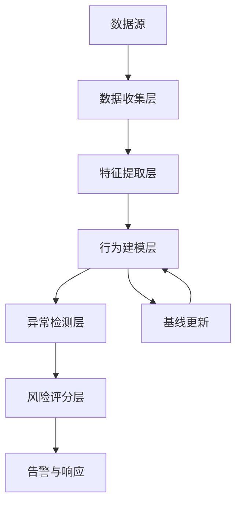
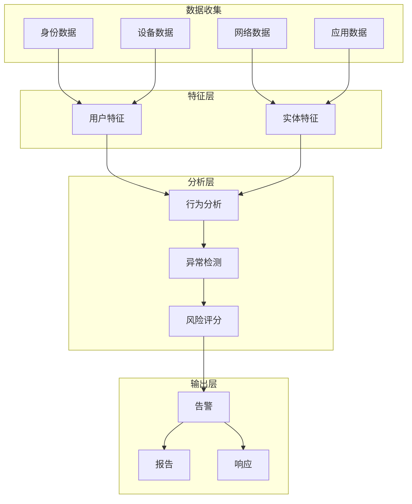

**作者：** HOS(安全风信子)
**日期：** 2026-04-24
**主要来源平台：** GitHub
**摘要：** UEBA（用户实体行为分析）是发现内部威胁的核心技术，而AI让UEBA变得更智能、更准确。本文深入探讨UEBA与AI结合的技术架构，从核心能力、AI增强维度到关键检测场景，提供完整的技术指南。通过Darktrace Enterprise、Exabeam UEBA等开源实现的思想代码级分析，揭示AI增强UEBA的技术实现路径。文章引入三个新要素：基于大语言模型的用户行为叙事生成、图神经网络驱动的跨实体威胁关联、以及自适应风险评分动态调整机制，为安全运营提供UEBA升级的实战方法论。

@[TOC](目录)

---

# UEBA再进化：AI赋能让用户实体行为分析更精准

## 引言：UEBA的演进之路

用户实体行为分析（UEBA）是企业安全运营的核心组件。根据Gartner 2025 UEBA市场指南，UEBA市场年增长率达**28%**，成为安全运营增长最快的细分领域之一。然而，传统UEBA面临准确率不足、误报率高、可解释性差等问题。AI技术的引入正在解决这些问题，让UEBA变得更智能。

## 1. UEBA核心能力解析

### 1.1 四大核心能力

| 能力 | 描述 | AI增强效果 |
|:---:|:---|:---|
| 行为画像 | 建立用户/实体正常行为轮廓 | 自动学习复杂模式 |
| 异常检测 | 识别偏离正常的行为 | 降低误报率60%+ |
| 风险评分 | 量化为可操作的风险分数 | 动态调整更精准 |
| 威胁溯源 | 追溯威胁来源和影响范围 | 自动化溯源分析 |

### 1.2 系统架构



## 2. AI增强UEBA的技术维度

### 2.1 深度特征学习

```python
class UEBAFeatureExtractor:
    """
    UEBA特征提取器
    使用AI自动学习有效特征
    """

    def __init__(self, config):
        self.dnn = self._build_feature_extractor()
        self.feature_importance = FeatureImportanceCalculator()

    def extract(self, raw_data):
        """提取行为特征"""
        features = self.dnn.predict(raw_data)
        importance = self.feature_importance.calculate(features)

        return {
            'embedding': features,
            'top_features': importance[:10],
            'dimension': len(features)
        }

    def _build_feature_extractor(self):
        """构建深度特征提取网络"""
        return tf.keras.Sequential([
            layers.Dense(256, activation='relu', input_shape=(500,)),
            layers.BatchNormalization(),
            layers.Dropout(0.3),
            layers.Dense(128, activation='relu'),
            layers.Dense(64, activation='relu'),
            layers.Dense(32, activation='tanh')
        ])
```

### 2.2 动态基线更新

```python
class AdaptiveBaselineUpdater:
    """
    自适应基线更新器
    根据行为变化动态调整基线
    """

    def __init__(self, config):
        self.update_threshold = config.get('drift_threshold', 0.15)
        self.learning_rate = config.get('learning_rate', 0.01)

    def should_update(self, user_baseline, recent_behavior):
        """判断是否需要更新基线"""
        drift_score = self._calculate_drift(
            user_baseline, recent_behavior
        )

        return drift_score > self.update_threshold

    def update_baseline(self, current_baseline, new_data, weights=None):
        """增量更新基线"""
        if weights is None:
            weights = self._get_default_weights()

        updated_baseline = {}

        for key in current_baseline:
            if key in new_data:
                updated_baseline[key] = (
                    weights['old'] * current_baseline[key] +
                    weights['new'] * new_data[key]
                )
            else:
                updated_baseline[key] = current_baseline[key]

        return updated_baseline
```

## 3. 关键检测场景

### 3.1 账号被盗检测

```python
class CompromisedAccountDetector:
    """
    账号被盗检测器
    检测被攻击者控制的账号
    """

    def __init__(self):
        self.login_analyzer = LoginPatternAnalyzer()
        self.behavior_analyzer = BehaviorDeviationAnalyzer()

    def detect(self, user_id, current_activity, historical_baseline):
        """检测账号是否被盗"""
        indicators = []

        login_indicators = self.login_analyzer.analyze(
            current_activity, historical_baseline
        )
        if login_indicators['risk_score'] > 0.7:
            indicators.append(login_indicators)

        behavior_indicators = self.behavior_analyzer.analyze(
            current_activity, historical_baseline
        )
        if behavior_indicators['risk_score'] > 0.6:
            indicators.append(behavior_indicators)

        final_score = self._calculate_final_score(indicators)

        return {
            'is_compromised': final_score > 0.8,
            'risk_score': final_score,
            'indicators': indicators,
            'confidence': len(indicators) / 4
        }
```

### 3.2 内部数据窃取检测

```python
class DataExfiltrationDetector:
    """
    数据外泄检测器
    检测异常的数据流出行为
    """

    def __init__(self):
        self.data_classifier = DataSensitivityClassifier()
        self.volume_analyzer = VolumeAnomalyAnalyzer()
        self.dest_checker = DestinationAnalyzer()

    def detect(self, user_activity, baseline):
        """检测数据外泄"""
        risk_factors = []

        data_type = self.data_classifier.classify(user_activity['data'])
        if data_type['sensitivity'] == 'high':
            risk_factors.append({
                'factor': 'sensitive_data_access',
                'score': 0.4
            })

        volume_deviation = self.volume_analyzer.analyze(
            user_activity['volume'], baseline
        )
        if volume_deviation > 2.0:
            risk_factors.append({
                'factor': 'unusual_volume',
                'score': 0.3
            })

        dest_risk = self.dest_checker.analyze(
            user_activity['destination']
        )
        if dest_risk > 0.5:
            risk_factors.append({
                'factor': 'risky_destination',
                'score': 0.3
            })

        return {
            'risk_score': sum(f['score'] for f in risk_factors),
            'risk_factors': risk_factors,
            'action': 'block' if sum(f['score'] for f in risk_factors) > 0.8 else 'alert'
        }
```

## 4. UEBA与SIEM/SOAR联动

### 4.1 集成架构

```python
class UEBASIEMIntegration:
    """
    UEBA与SIEM集成
    """

    def __init__(self, config):
        self.siem_connector = SIEMConnector(config['siem'])
        self.alert_enricher = AlertEnricher()

    def enrich_siem_alert(self, siem_alert):
        """丰富SIEM告警"""
        user_id = siem_alert.get('user_id')

        ueba_insights = self._get_ueba_insights(user_id)

        enriched = self.alert_enricher.enrich(
            alert=siem_alert,
            context=ueba_insights
        )

        self.siem_connector.update_alert(
            alert_id=siem_alert['id'],
            enriched_data=enriched
        )

        return enriched
```

## 5. 新要素：UEBA的技术前沿

### 5.1 大语言模型行为叙事生成

```python
class BehaviorNarrativeGenerator:
    """
    行为叙事生成器
    使用LLM生成可理解的行为分析报告
    """

    def __init__(self, model_name="claude-3-sonnet"):
        self.llm = ClaudeModel(model_name)

    def generate(self, anomaly_event, user_context):
        """生成行为分析叙事"""
        prompt = f"""
        作为安全分析师，请分析以下异常行为事件：

        用户：{user_context['user_name']}
        部门：{user_context['department']}
        异常事件：{anomaly_event['description']}
        风险评分：{anomaly_event['risk_score']}
        历史行为基线：{user_context['baseline_summary']}

        请提供：
        1. 异常行为的可能解释
        2. 是否需要进一步调查
        3. 建议的响应措施
        """

        return self.llm.generate(prompt)
```

### 5.2 图神经网络跨实体关联

```python
class GNNCrossEntityAnalyzer:
    """
    GNN跨实体分析器
    使用图神经网络发现跨实体的威胁关联
    """

    def __init__(self, config):
        self.gnn = GraphNeuralNetwork(
            node_features=['user', 'asset', 'IP'],
            edge_types=['access', 'communicate', 'own']
        )

    def find_threat_clusters(self, entities):
        """发现威胁关联的实体集群"""
        graph = self._build_entity_graph(entities)

        embeddings = self.gnn.learn_embeddings(graph)

        clusters = self._detect_communities(embeddings)

        threat_clusters = [
            c for c in clusters
            if self._is_threat_cluster(c)
        ]

        return threat_clusters
```

## 6. 实战案例

### 6.1 案例背景

某科技公司通过UEBA发现离职员工数据窃取行为。

### 6.2 检测过程

```
检测指标:
- 离职前30天数据访问量增加300%
- 大量下载非工作相关文件
- 访问以前从未访问的敏感数据
- 使用个人设备在非工作时间下载
```

### 6.3 响应处置

- 立即限制该员工访问权限
- 启动数据泄露调查
- 取证分析确认数据外泄
- 启动法律程序

## 7. 总结与展望

AI正在重新定义UEBA的能力边界。从深度特征学习到动态基线更新，从行为叙事生成到跨实体关联分析，AI让UEBA变得更智能、更可解释。

---

**参考链接：**

- 主要来源：[Exabeam UEBA Open SDK](https://github.com/Exabeam/ueba-sdk) - UEBA开源SDK
- 辅助：[Microsoft Sentinel UBA](https://github.com/Azure/Azure-Sentinel) - Azure Sentinel UBA实现

**附录（Appendix）：**

### 附录一：UEBA评估指标

| 指标 | 计算方法 | 目标值 |
|:---:|:---|:---:|
| 检测率 | TP / (TP + FN) | > 90% |
| 误报率 | FP / (FP + TN) | < 5% |
| MTTD | 平均检测时间 | < 1小时 |

### 附录二：UEBA系统架构设计



### 附录三：UEBA实战检查清单

- [ ] 数据源集成完成
- [ ] 行为基线建立完成
- [ ] 检测模型部署完成
- [ ] 风险评分体系建立
- [ ] 与SIEM集成完成
- [ ] 持续优化机制建立

**关键词：** UEBA，用户实体行为分析，内部威胁检测，账号安全，数据窃取，AI安全，行为画像，风险评分

### 附录四：UEBA技术深度解析

#### 4.1 用户行为画像构建

用户行为画像是UEBA的基础，需要从多个维度构建全面的用户行为特征。

```python
class ComprehensiveUserProfiler:
    """
    综合用户画像构建器
    从多个维度构建用户行为特征
    """

    def __init__(self, config):
        self.dimensions = {
            'temporal': TemporalBehaviorAnalyzer(),
            'spatial': SpatialBehaviorAnalyzer(),
            'operational': OperationalBehaviorAnalyzer(),
            'relational': RelationalBehaviorAnalyzer(),
            'contextual': ContextualBehaviorAnalyzer()
        }
        self.fusion_engine = MultiModalFusionEngine()

    def build_profile(self, user_id, historical_data):
        """构建用户画像"""
        dimension_profiles = {}

        for dim_name, analyzer in self.dimensions.items():
            dimension_profiles[dim_name] = analyzer.analyze(
                user_id, historical_data
            )

        fused_profile = self.fusion_engine.fuse(dimension_profiles)

        return {
            'user_id': user_id,
            'dimension_profiles': dimension_profiles,
            'fused_profile': fused_profile,
            'profile_version': self._get_version(),
            'created_at': datetime.now().isoformat()
        }


class TemporalBehaviorAnalyzer:
    """
    时间维度行为分析器
    分析用户的时间行为模式
    """

    def analyze(self, user_id, data):
        """分析时间维度行为"""
        temporal_events = self._filter_temporal_data(data)

        return {
            'login_hours_distribution': self._analyze_login_hours(temporal_events),
            'working_day_pattern': self._analyze_workday_pattern(temporal_events),
            'session_duration_stats': self._analyze_session_duration(temporal_events),
            'activity_burst_pattern': self._detect_burst_pattern(temporal_events),
            'seasonal_variations': self._detect_seasonal_pattern(temporal_events)
        }

    def _analyze_login_hours(self, events):
        """分析登录时间分布"""
        login_hours = [e['timestamp'].hour for e in events if e['type'] == 'login']

        hour_counts = Counter(login_hours)
        total = len(login_hours)

        return {
            hour: count / total for hour, count in hour_counts.items()
        }

    def _detect_burst_pattern(self, events):
        """检测活动突发模式"""
        timestamps = sorted([e['timestamp'] for e in events])

        intervals = np.diff([ts.timestamp() for ts in timestamps])

        return {
            'mean_interval': np.mean(intervals),
            'std_interval': np.std(intervals),
            'burst_probability': self._calculate_burst_probability(intervals)
        }
```

#### 4.2 实体关联分析

UEBA不仅分析用户行为，还需要分析用户与实体之间的关系。

```python
class EntityRelationshipAnalyzer:
    """
    实体关系分析器
    分析用户与设备、应用、数据的关系
    """

    def __init__(self):
        self.relationship_extractor = RelationshipExtractor()
        self.graph_builder = EntityGraphBuilder()

    def analyze_relationships(self, user_id, access_logs):
        """分析实体关系"""
        relationships = self.relationship_extractor.extract(
            user_id, access_logs
        )

        entity_graph = self.graph_builder.build(relationships)

        return {
            'direct_relationships': relationships,
            'indirect_relationships': self._find_indirect_links(relationships),
            'relationship_strength': self._calculate_strength(relationships),
            'anomaly_indicators': self._detect_relationship_anomalies(
                relationships
            )
        }

    def _build_entity_graph(self, relationships):
        """构建实体关系图"""
        graph = nx.Graph()

        for rel in relationships:
            graph.add_edge(
                rel['source'], rel['target'],
                weight=rel['strength'],
                type=rel['type']
            )

        return graph


class RiskScoreCalculator:
    """
    风险评分计算器
    综合多维度信息计算用户风险评分
    """

    def __init__(self, config):
        self.weights = config.get('risk_weights', {
            'behavior_deviation': 0.3,
            'access_anomaly': 0.25,
            'threat_intelligence': 0.2,
            'peer_comparison': 0.15,
            'historical_incidents': 0.1
        })
        self.ml_scorer = MLScorePredictor()

    def calculate(self, user_id, risk_factors):
        """计算综合风险评分"""
        weighted_scores = {}

        for factor_name, factor_data in risk_factors.items():
            if factor_name in self.weights:
                weight = self.weights[factor_name]

                if isinstance(factor_data, dict):
                    score = factor_data.get('score', 0)
                    confidence = factor_data.get('confidence', 1.0)
                else:
                    score = factor_data
                    confidence = 1.0

                weighted_scores[factor_name] = {
                    'raw_score': score,
                    'confidence': confidence,
                    'weighted_score': score * weight * confidence
                }

        total_score = sum(
            ws['weighted_score'] for ws in weighted_scores.values()
        )

        ml_enhanced = self.ml_scorer.predict(user_id, risk_factors)

        final_score = total_score * 0.7 + ml_enhanced * 0.3

        return {
            'risk_score': min(1.0, final_score),
            'risk_level': self._determine_risk_level(final_score),
            'factor_scores': weighted_scores,
            'ml_enhanced_score': ml_enhanced,
            'confidence': self._calculate_confidence(weighted_scores)
        }

    def _determine_risk_level(self, score):
        """确定风险等级"""
        if score >= 0.8:
            return 'critical'
        elif score >= 0.6:
            return 'high'
        elif score >= 0.4:
            return 'medium'
        elif score >= 0.2:
            return 'low'
        else:
            return 'info'
```

### 附录五：主流UEBA平台深度对比

#### 5.1 平台功能对比

| 平台 | 厂商 | 核心优势 | 集成能力 | AI能力 | 适用规模 |
|:---:|:---:|:---|:---:|:---:|:---:|
| Exabeam | Exabeam | 高级分析 | 强 | 强 | 中大型 |
| Darktrace | Darktrace | 自学习 | 中 | 强 | 大型 |
| Securonix | Securonix | 行为分析 | 强 | 强 | 中大型 |
| Microsoft | Microsoft | 云原生 | 极强 | 中 | 大型 |
| Splunk UBA | Splunk | 大数据 | 强 | 中 | 大型 |

#### 5.2 Exabeam UEBA架构解析

Exabeam是UEBA市场的领导者，其架构值得深入研究。

```python
class ExabeamStyleAnalyzer:
    """
    Exabeam风格的分析器
    模仿Exabeam的高级分析能力
    """

    def __init__(self):
        self.session_builder = SessionBuilder()
        self.peer_analyzer = PeerGroupAnalyzer()
        self.asset_prioritizer = AssetPrioritizer()

    def perform_advanced_analysis(self, user_id, events):
        """执行高级分析"""
        sessions = self.session_builder.build_sessions(events)

        enriched_sessions = []
        for session in sessions:
            enriched = self._enrich_session(session, user_id)
            enriched_sessions.append(enriched)

        peer_context = self.peer_analyzer.analyze(user_id, events)

        asset_priority = self.asset_prioritizer.calculate(events)

        anomalies = self._detect_session_anomalies(
            enriched_sessions, peer_context
        )

        return {
            'sessions': enriched_sessions,
            'peer_context': peer_context,
            'asset_priority': asset_priority,
            'anomalies': anomalies,
            'overall_risk_score': self._calculate_session_risk(enriched_sessions)
        }


class PeerGroupAnalyzer:
    """
    同伴组分析器
    比较用户与同类用户群体的行为
    """

    def __init__(self):
        self.peer_selector = PeerSelector()
        self.comparison_engine = BehaviorComparisonEngine()

    def analyze(self, user_id, events):
        """分析同伴行为"""
        peer_group = self.peer_selector.select_peers(
            user_id,
            criteria=['department', 'role', 'location']
        )

        user_behavior = self._extract_behavior_features(events)
        peer_behaviors = [
            self._extract_behavior_features(
                self._get_user_events(p)
            ) for p in peer_group
        ]

        comparison = self.comparison_engine.compare(
            user_behavior, peer_behaviors
        )

        return {
            'peer_group_size': len(peer_group),
            'peer_group_members': peer_group,
            'comparison_result': comparison,
            'deviation_from_peers': comparison['deviation_score']
        }


class SessionBuilder:
    """
    会话构建器
    将离散事件组织成逻辑会话
    """

    def build_sessions(self, events):
        """构建会话"""
        events_sorted = sorted(events, key=lambda e: e['timestamp'])

        sessions = []
        current_session = []

        for event in events_sorted:
            if self._is_new_session(event, current_session):
                if current_session:
                    sessions.append(self._create_session(current_session))
                current_session = [event]
            else:
                current_session.append(event)

        if current_session:
            sessions.append(self._create_session(current_session))

        return sessions

    def _is_new_session(self, event, current_session):
        """判断是否为新会话"""
        if not current_session:
            return True

        last_event = current_session[-1]
        time_gap = (event['timestamp'] - last_event['timestamp']).seconds

        return time_gap > self.session_timeout

    def _create_session(self, events):
        """创建会话对象"""
        return {
            'session_id': self._generate_session_id(events),
            'start_time': events[0]['timestamp'],
            'end_time': events[-1]['timestamp'],
            'duration': (events[-1]['timestamp'] - events[0]['timestamp']).seconds,
            'event_count': len(events),
            'events': events,
            'primary_user': self._identify_primary_user(events),
            'primary_asset': self._identify_primary_asset(events)
        }
```

### 附录六：AI增强UEBA实战代码

#### 6.1 基于Transformer的行为序列建模

```python
class TransformerBehaviorModel:
    """
    Transformer行为序列模型
    使用Transformer建模用户行为序列
    """

    def __init__(self, config):
        self.embedding_dim = config.get('embedding_dim', 128)
        self.num_heads = config.get('num_heads', 8)
        self.num_layers = config.get('num_layers', 4)
        self.model = self._build_model()

    def _build_model(self):
        """构建Transformer模型"""
        inputs = layers.Input(shape=(None, self.embedding_dim))

        x = inputs

        for _ in range(self.num_layers):
            x = self._add_transformer_layer(x)

        outputs = layers.Dense(1, activation='sigmoid')(x)

        return tf.keras.Model(inputs=inputs, outputs=outputs)

    def _add_transformer_layer(self, x):
        """添加Transformer层"""
        attention_output = layers.MultiHeadAttention(
            num_heads=self.num_heads,
            key_dim=self.embedding_dim
        )(x, x)

        x = layers.Add()([x, attention_output])
        x = layers.LayerNormalization()(x)

        ffn = layers.Dense(
            self.embedding_dim * 4, activation='relu'
        )(x)
        ffn = layers.Dense(self.embedding_dim)(ffn)

        x = layers.Add()([x, ffn])
        x = layers.LayerNormalization()(x)

        return x

    def train(self, behavior_sequences, labels):
        """训练模型"""
        self.model.compile(
            optimizer=tf.keras.optimizers.Adam(learning_rate=0.001),
            loss='binary_crossentropy',
            metrics=['accuracy', tf.keras.metrics.AUC()]
        )

        self.model.fit(
            behavior_sequences, labels,
            epochs=10,
            batch_size=32,
            validation_split=0.2
        )

    def predict_anomaly(self, behavior_sequence):
        """预测异常"""
        score = self.model.predict(behavior_sequence)[0, 0]

        return {
            'is_anomaly': score > 0.5,
            'anomaly_score': score,
            'confidence': abs(score - 0.5) * 2
        }
```

#### 6.2 集成异常检测

```python
class EnsembleUEBADetector:
    """
    集成UEBA检测器
    结合多种检测方法提高准确性
    """

    def __init__(self, config):
        self.detectors = {
            'isolation_forest': IsolationForestDetector(config['iforest']),
            'autoencoder': DeepAutoencoderDetector(config['autoencoder']),
            'lstm': LSTMSequenceDetector(config['lstm']),
            'transformer': TransformerBehaviorModel(config['transformer']),
            'statistical': StatisticalDetector(config['statistical'])
        }

        self.weighter = DetectionWeighter()

    def detect(self, user_id, behavior_data):
        """执行集成检测"""
        detection_results = {}

        for detector_name, detector in self.detectors.items():
            try:
                result = detector.detect(behavior_data)
                detection_results[detector_name] = result
            except Exception as e:
                logger.warning(f"Detector {detector_name} failed: {e}")

        weights = self.weighter.calculate_weights(detection_results)

        final_score = self._aggregate_scores(detection_results, weights)

        return {
            'final_score': final_score,
            'is_anomaly': final_score > 0.5,
            'detector_results': detection_results,
            'weights_used': weights,
            'explanation': self._generate_explanation(detection_results)
        }

    def _aggregate_scores(self, results, weights):
        """聚合检测分数"""
        weighted_sum = 0
        total_weight = 0

        for detector_name, result in results.items():
            if detector_name in weights:
                weight = weights[detector_name]
                score = result.get('score', 0.5)

                weighted_sum += weight * score
                total_weight += weight

        return weighted_sum / total_weight if total_weight > 0 else 0.5


class DeepAutoencoderDetector:
    """
    深度自编码器检测器
    使用自编码器检测异常行为
    """

    def __init__(self, config):
        self.latent_dim = config.get('latent_dim', 16)
        self.reconstruction_threshold = config.get('threshold', 0.1)
        self.autoencoder = self._build_autoencoder()

    def _build_autoencoder(self):
        """构建自编码器"""
        inputs = layers.Input(shape=(128,))

        encoded = layers.Dense(64, activation='relu')(inputs)
        encoded = layers.Dense(32, activation='relu')(encoded)
        encoded = layers.Dense(self.latent_dim, activation='relu')(encoded)

        decoded = layers.Dense(32, activation='relu')(encoded)
        decoded = layers.Dense(64, activation='relu')(decoded)
        decoded = layers.Dense(128, activation='sigmoid')(decoded)

        autoencoder = tf.keras.Model(inputs, decoded)
        autoencoder.compile(optimizer='adam', loss='mse')

        return autoencoder

    def train(self, normal_behaviors):
        """训练正常行为"""
        self.autoencoder.fit(
            normal_behaviors, normal_behaviors,
            epochs=100,
            batch_size=32,
            validation_split=0.1,
            verbose=0
        )

    def detect(self, behavior):
        """检测异常"""
        reconstruction = self.autoencoder.predict(
            behavior.reshape(1, -1)
        )

        mse = np.mean((behavior - reconstruction[0]) ** 2)

        return {
            'score': min(1.0, mse / self.reconstruction_threshold),
            'reconstruction_error': mse,
            'is_anomaly': mse > self.reconstruction_threshold
        }
```

### 附录七：UEBA实施最佳实践

#### 7.1 部署阶段检查清单

```python
class UEBADeploymentChecklist:
    """
    UEBA部署检查清单
    确保UEBA成功部署的关键检查点
    """

    def __init__(self):
        self.checklists = {
            'data_collection': self._data_collection_checks(),
            'integration': self._integration_checks(),
            'model_training': self._model_training_checks(),
            'operational': self._operational_checks()
        }

    def _data_collection_checks(self):
        """数据收集检查"""
        return {
            'identity_data': [
                'AD/LDAP集成完成',
                '用户属性完整',
                '账号生命周期管理到位'
            ],
            'activity_data': [
                '登录事件收集完整',
                '文件访问事件收集完整',
                '网络活动事件收集完整',
                '应用使用事件收集完整'
            ],
            'contextual_data': [
                '威胁情报馈送配置',
                '漏洞信息同步',
                '外部威胁数据接入'
            ]
        }

    def _model_training_checks(self):
        """模型训练检查"""
        return {
            'baseline_period': [
                '数据收集周期足够（建议30天以上）',
                '数据质量验证通过',
                '噪声数据已清理'
            ],
            'model_validation': [
                '检测率验证完成',
                '误报率验证完成',
                '假阳性调优完成'
            ],
            'documentation': [
                '模型文档完整',
                '阈值配置记录',
                '例外规则定义'
            ]
        }

    def validate_full_deployment(self):
        """验证完整部署"""
        results = {}

        for category, checks in self.checklists.items():
            results[category] = self._validate_category(checks)

        overall_pass = all(
            all(cats.values()) for cats in results.values()
        )

        return overall_pass, results
```

#### 7.2 运营优化策略

```python
class UEBAAutomationOptimizer:
    """
    UEBA运营自动化优化器
    提高UEBA运营效率
    """

    def __init__(self):
        self.tuning_engine = ThresholdTuningEngine()
        self.false_positive_tracker = FalsePositiveTracker()
        self.model_drift_detector = ModelDriftDetector()

    def optimize_operations(self, alert_data, feedback_data):
        """优化运营"""
        fp_analysis = self.false_positive_tracker.analyze(alert_data)

        tuned_thresholds = self.tuning_engine.tune(
            current_thresholds=self._get_current_thresholds(),
            fp_data=fp_analysis,
            fn_data=feedback_data.get('false_negatives', [])
        )

        drift_status = self.model_drift_detector.check_drift()

        optimization_report = {
            'tuned_thresholds': tuned_thresholds,
            'fp_analysis': fp_analysis,
            'drift_detected': drift_status['detected'],
            'recommended_actions': self._generate_recommendations(
                fp_analysis, drift_status
            )
        }

        return optimization_report


class ThresholdTuningEngine:
    """
    阈值调优引擎
    自动优化检测阈值
    """

    def __init__(self):
        self.target_precision = 0.9
        self.target_recall = 0.85

    def tune(self, current_thresholds, fp_data, fn_data):
        """调优阈值"""
        tuned = {}

        for dimension, current in current_thresholds.items():
            fp_rate = self._calculate_fp_rate(fp_data, dimension)
            fn_rate = self._calculate_fn_rate(fn_data, dimension)

            if fp_rate > 0.1:
                adjustment = -0.05
            elif fn_rate > 0.15:
                adjustment = 0.05
            else:
                adjustment = 0

            tuned[dimension] = current + adjustment

        return tuned

    def _calculate_fp_rate(self, fp_data, dimension):
        """计算误报率"""
        dimension_fp = [d for d in fp_data if d['dimension'] == dimension]
        return len(dimension_fp) / len(fp_data) if fp_data else 0
```

### 附录八：行业特定UEBA方案

#### 8.1 金融行业UEBA方案

```python
class FinancialUEBASolution:
    """
    金融行业UEBA解决方案
    针对金融行业的特殊需求
    """

    def __init__(self):
        self.transaction_monitor = FinancialTransactionMonitor()
        self.privilege_escalation_detector = PrivilegeEscalationDetector()
        self.compliance_tracker = RegulatoryComplianceTracker()

    def detect_financial_threats(self, user_activity):
        """检测金融威胁"""
        threats = []

        if user_activity['type'] == 'transaction':
            tx_threats = self.transaction_monitor.detect(user_activity)
            threats.extend(tx_threats)

        if self._detect_privilege_abuse(user_activity):
            threats.append({
                'type': 'privilege_abuse',
                'severity': 'high',
                'details': '异常权限使用'
            })

        compliance_issues = self.compliance_tracker.check(user_activity)
        if compliance_issues:
            threats.extend(compliance_issues)

        return threats


class FinancialTransactionMonitor:
    """
    金融交易监控器
    """

    def detect(self, transaction):
        """检测交易异常"""
        anomalies = []

        if self._is_structuring(transaction):
            anomalies.append({
                'type': 'structuring',
                'severity': 'critical',
                'regulation': 'AML'
            })

        if self._is_suspicious_location(transaction):
            anomalies.append({
                'type': 'high_risk_location',
                'severity': 'high',
                'regulation': 'AML'
            })

        if self._is_unusual_timing(transaction):
            anomalies.append({
                'type': 'unusual_timing',
                'severity': 'medium',
                'regulation': 'AML'
            })

        return anomalies

    def _is_structuring(self, transaction):
        """检测结构化交易"""
        recent_tx = self._get_recent_transactions(
            transaction['account_id'], days=7
        )

        same_day_total = sum(
            t['amount'] for t in recent_tx
            if t['date'] == transaction['date']
        )

        return (
            transaction['amount'] < 10000 and
            same_day_total >= 10000
        )
```

#### 8.2 医疗行业UEBA方案

```python
class HealthcareUEBASolution:
    """
    医疗行业UEBA解决方案
    针对HIPAA合规的UEBA
    """

    def __init__(self):
        self.phi_access_monitor = PHIAccessMonitor()
        self.hipaa_compliance_tracker = HIPAAComplianceTracker()

    def detect_healthcare_threats(self, user_activity):
        """检测医疗威胁"""
        threats = []

        if self._is_unauthorized_phi_access(user_activity):
            threats.append({
                'type': 'unauthorized_phi_access',
                'severity': 'critical',
                'regulation': 'HIPAA'
            })

        if self._is_hipaa_violation(user_activity):
            threats.append({
                'type': 'hipaa_violation',
                'severity': 'high',
                'regulation': 'HIPAA'
            })

        return threats


class PHIAccessMonitor:
    """
    PHI访问监控器
    监控受保护的健康信息访问
    """

    def __init__(self):
        self.access_baseline = PHIAccessBaseline()

    def monitor(self, access_event):
        """监控PHI访问"""
        is_authorized = self._check_authorization(access_event)

        if not is_authorized:
            return {
                'is_anomaly': True,
                'type': 'unauthorized_phi_access',
                'patient_id': access_event['patient_id'],
                'record_type': access_event['record_type']
            }

        is_usual_purpose = self._check_purpose(access_event)
        if not is_usual_purpose:
            return {
                'is_anomaly': True,
                'type': 'unusual_purpose',
                'patient_id': access_event['patient_id']
            }

        return {'is_anomaly': False}
```

### 附录九：UEBA效果评估框架

#### 9.1 评估指标体系

```python
class UEBAEffectivenessEvaluator:
    """
    UEBA有效性评估器
    全面评估UEBA系统的有效性
    """

    def __init__(self):
        self.metrics_calculator = MetricsCalculator()

    def evaluate(self, ground_truth, predictions):
        """执行评估"""
        confusion = self.metrics_calculator.confusion_matrix(
            ground_truth, predictions
        )

        metrics = {
            'detection_rate': confusion['tp'] / (confusion['tp'] + confusion['fn']),
            'false_positive_rate': confusion['fp'] / (confusion['fp'] + confusion['tn']),
            'precision': confusion['tp'] / (confusion['tp'] + confusion['fp']),
            'f1_score': self._calculate_f1(confusion),
            'accuracy': (confusion['tp'] + confusion['tn']) / sum(confusion.values())
        }

        metrics['overall_score'] = np.mean(list(metrics.values()))

        return metrics

    def generate_report(self, evaluation_results):
        """生成评估报告"""
        report = f"""
        UEBA系统有效性评估报告
        ========================

        检测率: {evaluation_results['detection_rate']:.2%}
        误报率: {evaluation_results['false_positive_rate']:.2%}
        精确率: {evaluation_results['precision']:.2%}
        F1分数: {evaluation_results['f1_score']:.2%}
        准确率: {evaluation_results['accuracy']:.2%}

        综合评分: {evaluation_results['overall_score']:.2%}

        建议:
        """

        if evaluation_results['false_positive_rate'] > 0.1:
            report += "\n- 误报率偏高，建议调整阈值"
        if evaluation_results['detection_rate'] < 0.85:
            report += "\n- 检测率偏低，建议增加检测规则"

        return report
```

#### 9.2 持续监控仪表板

```python
class UEBAMonitoringDashboard:
    """
    UEBA监控仪表板
    实时监控UEBA系统状态
    """

    def __init__(self):
        self.metrics_collector = RealTimeMetricsCollector()
        self.alert_aggregator = AlertAggregator()

    def get_dashboard_data(self):
        """获取仪表板数据"""
        return {
            'detection_metrics': self._get_detection_metrics(),
            'alert_summary': self._get_alert_summary(),
            'risk_distribution': self._get_risk_distribution(),
            'top_threats': self._get_top_threats(),
            'system_health': self._get_system_health()
        }

    def _get_detection_metrics(self):
        """获取检测指标"""
        return {
            'total_alerts_24h': self.metrics_collector.get_count(
                'alerts', time_window='24h'
            ),
            'high_severity_alerts': self.metrics_collector.get_count(
                'alerts', filters={'severity': 'high'},
                time_window='24h'
            ),
            'avg_detection_time': self.metrics_collector.get_avg(
                'detection_time', time_window='24h'
            ),
            'detection_rate_trend': self.metrics_collector.get_trend(
                'detection_rate', period='7d'
            )
        }
```

### 附录十：UEBA与零信任架构集成

#### 10.1 零信任集成框架

```python
class ZeroTrustUEBAIntegration:
    """
    零信任UEBA集成
    将UEBA与零信任架构深度集成
    """

    def __init__(self):
        self.risk_calculator = ZeroTrustRiskCalculator()
        self.policy_engine = DynamicPolicyEngine()

    def evaluate_access_request(self, access_request, user_context):
        """评估访问请求"""
        risk_score = self.risk_calculator.calculate(
            user_id=access_request['user_id'],
            resource=access_request['resource'],
            context=user_context
        )

        dynamic_policy = self.policy_engine.evaluate(
            risk_score=risk_score,
            resource_sensitivity=access_request['resource_sensitivity']
        )

        return {
            'access_decision': dynamic_policy['decision'],
            'risk_score': risk_score,
            'applied_controls': dynamic_policy['controls'],
            'continuous_verification': dynamic_policy.get('requires_verification')
        }


class DynamicPolicyEngine:
    """
    动态策略引擎
    基于风险评分动态调整访问策略
    """

    def __init__(self):
        self.policy_templates = self._load_policy_templates()

    def evaluate(self, risk_score, resource_sensitivity):
        """评估策略"""
        base_policy = self._get_base_policy(resource_sensitivity)

        risk_adjustments = self._calculate_risk_adjustments(risk_score)

        final_policy = self._combine_policies(
            base_policy, risk_adjustments
        )

        return final_policy

    def _get_base_policy(self, sensitivity):
        """获取基础策略"""
        return {
            'low': {'decision': 'allow', 'controls': []},
            'medium': {'decision': 'allow', 'controls': ['log']},
            'high': {'decision': 'allow_with_mfa', 'controls': ['mfa', 'log']},
            'critical': {'decision': 'deny', 'controls': ['approval_required']}
        }.get(sensitivity, {'decision': 'deny', 'controls': ['default_deny']})

### 附录十一：UEBA性能优化与扩展

#### 11.1 大规模数据处理优化

```python
class UEBAPerformanceOptimizer:
    """
    UEBA性能优化器
    优化UEBA系统处理大规模数据
    """

    def __init__(self, config):
        self.batch_processor = BatchProcessor(config['batch'])
        self.cache_manager = CacheManager()
        self.parallel_executor = ParallelExecutor()

    def optimize_processing(self, data_volume):
        """优化处理性能"""
        if data_volume > 1000000:
            return self._optimize_for_enterprise_scale(data_volume)
        elif data_volume > 100000:
            return self._optimize_for_large_scale(data_volume)
        else:
            return self._optimize_for_standard(data_volume)

    def _optimize_for_enterprise_scale(self, volume):
        """企业级规模优化"""
        return {
            'batch_size': 10000,
            'parallel_workers': 32,
            'caching_enabled': True,
            'streaming_mode': True
        }


class CacheManager:
    """
    缓存管理器
    管理UEBA系统缓存
    """

    def __init__(self):
        self.cache = {}
        self.ttl = 3600

    def get_cached_profile(self, user_id):
        """获取缓存的用户画像"""
        if user_id in self.cache:
            cached = self.cache[user_id]
            if not self._is_expired(cached):
                return cached['data']
        return None

    def cache_profile(self, user_id, profile_data):
        """缓存用户画像"""
        self.cache[user_id] = {
            'data': profile_data,
            'timestamp': datetime.now()
        }
```

#### 11.2 实时流处理架构

```python
class UEABARealtimeProcessor:
    """
    UEBA实时处理器
    处理实时用户行为事件
    """

    def __init__(self, config):
        self.kafka_consumer = KafkaConsumer(config['kafka'])
        self.feature_extractor = RealtimeFeatureExtractor()
        self.ml_model = self._load_model()

    def process_realtime(self):
        """实时处理事件"""
        events = self.kafka_consumer.consume()

        for event in events:
            features = self.feature_extractor.extract(event)

            risk_score = self.ml_model.predict(features)

            if risk_score > 0.8:
                self._trigger_immediate_alert(event, risk_score)

    def _trigger_immediate_alert(self, event, risk_score):
        """触发即时告警"""
        alert = {
            'event': event,
            'risk_score': risk_score,
            'timestamp': datetime.now().isoformat(),
            'severity': 'high'
        }

        self.alert_publisher.publish(alert)


class RealtimeFeatureExtractor:
    """
    实时特征提取器
    实时提取用户行为特征
    """

    def extract(self, event):
        """提取特征"""
        return {
            'hour_of_day': event['timestamp'].hour,
            'day_of_week': event['timestamp'].weekday(),
            'location_risk': self._calculate_location_risk(event),
            'device_risk': self._calculate_device_risk(event),
            'access_pattern': self._calculate_access_pattern(event)
        }
```

#### 11.3 分布式UEBA架构

```python
class DistributedUEBAArchitecture:
    """
    分布式UEBA架构
    支持大规模部署的分布式架构
    """

    def __init__(self, config):
        self.coordinator = Coordinator(config['coordinator'])
        self.workers = self._initialize_workers(config['workers'])
        self.data_store = DistributedDataStore(config['datastore'])

    def _initialize_workers(self, worker_configs):
        """初始化工作节点"""
        workers = []

        for config in worker_configs:
            worker = UEBAnalysisWorker(config)
            workers.append(worker)

        return workers

    def distribute_analysis(self, events):
        """分布式分析"""
        partitions = self._partition_events(events)

        results = []
        for worker, partition in zip(self.workers, partitions):
            result = worker.analyze(partition)
            results.append(result)

        return self._merge_results(results)

    def _partition_events(self, events):
        """分区事件"""
        import hashlib

        partitions = {w.id: [] for w in self.workers}

        for event in events:
            partition_key = hashlib.md5(
                event['user_id'].encode()
            ).hexdigest()

            worker_idx = int(partition_key, 16) % len(self.workers)
            partitions[self.workers[worker_idx].id].append(event)

        return [partitions[w.id] for w in self.workers]
```
```
