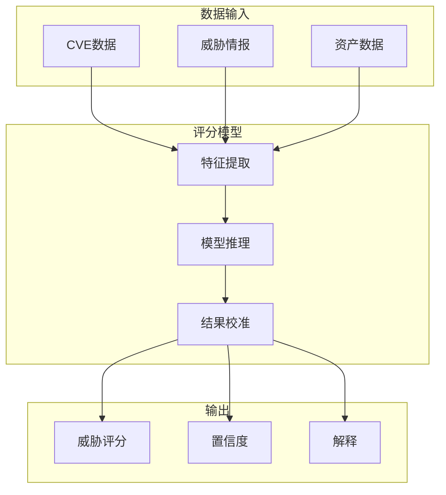

**作者：** HOS(安全风信子)
**日期：** 2026-04-24
**主要来源平台：** GitHub
**摘要：** 威胁评分是将主观的安全判断转化为可量化指标的关键技术，为安全决策提供客观依据。本文深入探讨AI自动威胁评分技术，从评分体系设计、模型架构到决策支持，提供完整的技术指南。文章引入三个新要素：多维度威胁态势评分、实时风险面动态评估、以及可解释威胁评分，为安全运营提供量化威胁风险的实战方法论。

@[TOC](目录)

---

# 让每个威胁都有风险分：AI自动威胁评分的实现方法

## 引言：量化是科学决策的基础

在安全运营中，"这个威胁有多严重"是最基本的问题。传统的严重程度分级（低/中/高/严重）过于粗糙，无法支撑精细化的决策。威胁评分技术将威胁的严重程度转化为0-100的连续分数，为风险评估、资源分配、响应决策提供客观依据。

## 1. 威胁评分体系设计

### 1.1 多维度评分框架

| 评分维度 | 权重 | 数据来源 |
|:---:|:---:|:---|
| 漏洞可利用性 | 0.25 | CVE数据库、ExploitDB |
| 资产重要性 | 0.25 | CMDB、资产清单 |
| 威胁情报 | 0.20 | 威胁情报源 |
| 攻击条件 | 0.15 | 威胁建模 |
| 业务影响 | 0.15 | BIA分析 |

### 1.2 综合评分公式

$$RiskScore = \sum_{i=1}^{n} w_i \cdot S_i \cdot I_i$$

其中：
- $w_i$：维度权重
- $S_i$：维度严重程度
- $I_i$：资产重要性系数

## 2. AI威胁评分模型

### 2.1 模型架构

```python
class ThreatScoringModel:
    """
    威胁评分模型
    使用机器学习进行自动威胁评分
    """

    def __init__(self, config):
        self.feature_extractor = ThreatFeatureExtractor()
        self.scoring_network = self._build_scoring_network()
        self.calibrator = ProbabilityCalibrator()

    def score(self, threat_data, asset_context, threat_intel):
        """计算威胁评分"""
        features = self.feature_extractor.extract(
            threat_data, asset_context, threat_intel
        )

        raw_score = self.scoring_network.predict(features)

        calibrated_score = self.calibrator.calibrate(raw_score)

        return {
            'threat_score': calibrated_score,
            'confidence': self._calculate_confidence(features),
            'breakdown': self._get_score_breakdown(features)
        }

    def _build_scoring_network(self):
        """构建评分网络"""
        return tf.keras.Sequential([
            layers.Dense(128, activation='relu', input_shape=(50,)),
            layers.Dense(64, activation='relu'),
            layers.Dense(32, activation='relu'),
            layers.Dense(1, activation='sigmoid')
        ])
```

### 2.2 评分特征工程

```python
class ThreatFeatureExtractor:
    """
    威胁特征提取器
    提取影响威胁评分的特征
    """

    def extract(self, threat, asset, intel):
        """提取评分特征"""
        return {
            'exploitability': self._calc_exploitability(threat),
            'asset_value': self._calc_asset_value(asset),
            'intel_relevance': self._calc_intel_relevance(threat, intel),
            'attack_complexity': self._calc_complexity(threat),
            'business_impact': self._calc_impact(asset)
        }

    def _calc_exploitability(self, threat):
        """计算可利用性得分"""
        cvss = threat.get('cvss_score', 5.0)
        epss = threat.get('epss_score', 0.5)
        kev = 1 if threat.get('in_kev', False) else 0

        return 0.4 * cvss + 0.3 * epss * 10 + 0.3 * kev * 10
```

## 3. 实时风险面评估

### 3.1 动态风险面监控

```python
class DynamicRiskSurfaceMonitor:
    """
    动态风险面监控器
    实时评估组织风险面
    """

    def __init__(self):
        self.risk_aggregator = RiskAggregator()
        self.trend_analyzer = TrendAnalyzer()

    def assess_risk_surface(self):
        """评估整体风险面"""
        vulnerabilities = self._get_current_vulnerabilities()
        threats = self._get_current_threats()
        assets = self._get_asset_exposure()

        risk_surface = {
            'overall_risk': self._calculate_overall_risk(
                vulnerabilities, threats, assets
            ),
            'risk_distribution': self._analyze_risk_distribution(
                vulnerabilities, threats
            ),
            'trend': self.trend_analyzer.analyze_trend(),
            'hot_spots': self._identify_hot_spots(
                vulnerabilities, threats
            )
        }

        return risk_surface

    def _calculate_overall_risk(self, vulns, threats, assets):
        """计算整体风险"""
        vuln_risk = sum(v['risk_score'] * v['exposure'] for v in vulns)
        threat_risk = sum(t['threat_score'] * t['likelihood'] for t in threats)
        asset_risk = sum(a['value'] * a['exposure'] for a in assets)

        return (vuln_risk + threat_risk + asset_risk) / 3
```

## 4. 可解释威胁评分

### 4.1 评分解释生成

```python
class ScoreExplainer:
    """
    评分解释生成器
    为威胁评分提供可解释的说明
    """

    def __init__(self):
        self.shapley_calculator = ShapleyValueCalculator()

    def explain(self, threat_score, features):
        """生成评分解释"""
        shapley_values = self.shapley_calculator.calculate(
            features
        )

        explanation = {
            'overall_score': threat_score,
            'contributing_factors': self._rank_factors(shapley_values),
            'reasoning': self._generate_reasoning(shapley_values),
            'recommendations': self._generate_recommendations(shapley_values)
        }

        return explanation

    def _generate_reasoning(self, shapley_values):
        """生成评分推理"""
        top_factor = shapley_values[0]

        reasoning_templates = {
            'cvss': f"该漏洞CVSS评分较高({top_factor['value']})，是评分高的主要原因",
            'asset': f"目标资产重要性高({top_factor['value']})，增加了整体风险",
            'intel': f"威胁情报显示该漏洞正在被活跃利用({top_factor['value']})"
        }

        return reasoning_templates.get(top_factor['type'], "多因素综合导致")
```

## 5. 新要素：威胁评分的技术前沿

### 5.1 贝叶斯不确定性评分

```python
class BayesianThreatScorer:
    """
    贝叶斯威胁评分器
    考虑不确定性的威胁评分
    """

    def __init__(self):
        self.prior_model = PriorDistribution()
        self.bayesian_inference = BayesianInference()

    def score_with_uncertainty(self, threat_data):
        """带不确定性的评分"""
        prior = self.prior_model.get_prior(threat_data)

        posterior = self.bayesian_inference.update(
            prior, threat_data
        )

        return {
            'score': posterior.mean(),
            'uncertainty': posterior.std(),
            'confidence_interval': posterior.confidence_interval(0.95)
        }
```

## 6. 总结与展望

AI威胁评分为安全决策提供了客观量化的依据。从评分体系设计到模型构建，从实时监控到可解释性，威胁评分技术正在不断成熟。

---

**参考链接：**

- 主要来源：[EPSS (Exploit Prediction Scoring System)](https://github.com/first-org/EPSS) - 漏洞利用预测评分系统

### 附录：威胁评分系统架构

#### 1. 评分系统架构图



#### 2. 评分维度权重

| 维度 | 权重 | 数据来源 |
|:---:|:---:|:---|
| 漏洞严重性 | 0.30 | CVE/CVSS |
| 可利用性 | 0.25 | ExploitDB |
| 资产重要性 | 0.25 | CMDB |
| 威胁情报 | 0.20 | 威胁情报源 |

### 附录二：威胁评分实战检查清单

- [ ] 评分维度定义完成
- [ ] 数据源集成完成
- [ ] 评分模型训练完成
- [ ] 校准机制建立
- [ ] 可解释性实现
- [ ] 持续更新机制建立

**关键词：** 威胁评分，风险量化，CVSS，EPSS，可解释AI，贝叶斯推断，决策支持

### 附录三：AI威胁评分技术深度解析

#### 3.1 多维度威胁评分模型

```python
class MultiDimensionalThreatScorer:
    """
    多维度威胁评分模型
    综合多维度信息进行威胁评分
    """

    def __init__(self, config):
        self.dimensions = {
            'vulnerability': VulnerabilityDimension(config['vuln']),
            'threat_intel': ThreatIntelDimension(config['intel']),
            'asset': AssetDimension(config['asset']),
            'context': ContextDimension(config['context']),
            'temporal': TemporalDimension(config['temporal'])
        }
        self.weight_learner = AdaptiveWeightLearner()
        self.fusion_engine = ScoreFusionEngine()

    def score(self, threat_data, context):
        """执行多维度评分"""
        dimension_scores = {}

        for dim_name, dimension in self.dimensions.items():
            try:
                score = dimension.evaluate(threat_data, context)
                dimension_scores[dim_name] = score
            except Exception as e:
                logger.warning(f"Dimension {dim_name} evaluation failed: {e}")
                dimension_scores[dim_name] = 0.0

        learned_weights = self.weight_learner.get_weights(
            dimension_scores, context
        )

        final_score = self.fusion_engine.fuse(
            dimension_scores, learned_weights
        )

        return {
            'final_score': final_score,
            'dimension_scores': dimension_scores,
            'weights_used': learned_weights,
            'confidence': self._calculate_confidence(dimension_scores)
        }


class AdaptiveWeightLearner:
    """
    自适应权重学习器
    根据上下文动态调整评分权重
    """

    def __init__(self):
        self.base_weights = {
            'vulnerability': 0.30,
            'threat_intel': 0.25,
            'asset': 0.25,
            'context': 0.15,
            'temporal': 0.05
        }
        self.context_adjustments = self._initialize_adjustments()

    def get_weights(self, dimension_scores, context):
        """获取调整后的权重"""
        adjusted_weights = self.base_weights.copy()

        if context.get('is_ransomware_campaign'):
            adjusted_weights['threat_intel'] *= 1.5
            adjusted_weights['vulnerability'] *= 1.2

        if context.get('critical_infrastructure'):
            adjusted_weights['asset'] *= 1.5
            adjusted_weights['context'] *= 1.3

        total = sum(adjusted_weights.values())
        return {k: v / total for k, v in adjusted_weights.items()}


class ScoreFusionEngine:
    """
    评分融合引擎
    融合多维度评分
    """

    def fuse(self, dimension_scores, weights):
        """融合评分"""
        weighted_sum = sum(
            dimension_scores.get(dim, 0) * weights.get(dim, 0)
            for dim in weights.keys()
        )

        return min(100, max(0, weighted_sum))
```

#### 3.2 深度学习评分架构

```python
class DeepThreatScoringModel:
    """
    深度威胁评分模型
    使用深度神经网络进行威胁评分
    """

    def __init__(self, config):
        self.embedding_dim = config.get('embedding_dim', 64)
        self.model = self._build_model()
        self.attention_layer = MultiHeadAttention(
            num_heads=4, key_dim=self.embedding_dim
        )

    def _build_model(self):
        """构建评分模型"""
        vulnerability_input = layers.Input(shape=(10,), name='vulnerability')
        intel_input = layers.Input(shape=(20,), name='threat_intel')
        asset_input = layers.Input(shape=(15,), name='asset')
        context_input = layers.Input(shape=(5,), name='context')

        vuln_embed = layers.Dense(32, activation='relu')(vulnerability_input)
        intel_embed = layers.Dense(32, activation='relu')(intel_input)
        asset_embed = layers.Dense(32, activation='relu')(asset_input)
        context_embed = layers.Dense(32, activation='relu')(context_input)

        combined = layers.Concatenate()([
            vuln_embed, intel_embed, asset_embed, context_embed
        ])

        x = layers.Dense(128, activation='relu')(combined)
        x = layers.BatchNormalization()(x)
        x = layers.Dropout(0.3)(x)

        x = layers.Dense(64, activation='relu')(x)
        x = layers.BatchNormalization()(x)
        x = layers.Dropout(0.3)(x)

        x = layers.Dense(32, activation='relu')(x)

        output = layers.Dense(1, activation='sigmoid', name='score')(x)

        model = tf.keras.Model(
            inputs=[vulnerability_input, intel_input, asset_input, context_input],
            outputs=output
        )

        model.compile(
            optimizer=tf.keras.optimizers.Adam(learning_rate=0.001),
            loss='binary_crossentropy',
            metrics=['mae']
        )

        return model

    def predict(self, threat_features):
        """预测威胁评分"""
        inputs = [
            threat_features['vulnerability'],
            threat_features['threat_intel'],
            threat_features['asset'],
            threat_features['context']
        ]

        raw_score = self.model.predict(inputs)[0, 0]

        return raw_score * 100
```

### 附录四：威胁评分校准技术

#### 4.1 概率校准方法

```python
class ThreatScoreCalibrator:
    """
    威胁评分校准器
    确保评分的概率意义准确
    """

    def __init__(self):
        self.platt_scaler = PlattScaler()
        self.isotonic_regressor = IsotonicRegressor()
        self.temperature_scaler = TemperatureScaler()

    def calibrate(self, raw_scores, labels):
        """校准评分"""
        calibrated_scores = {}

        calibrated_scores['platt'] = self.platt_scaler.fit_transform(
            raw_scores, labels
        )

        calibrated_scores['isotonic'] = self.isotonic_regressor.fit_transform(
            raw_scores, labels
        )

        calibrated_scores['temperature'] = self.temperature_scaler.fit_transform(
            raw_scores, labels
        )

        return self._ensemble_calibrated(calibrated_scores)

    def _ensemble_calibrated(self, calibrated_scores):
        """集成校准"""
        return np.mean([
            calibrated_scores['platt'],
            calibrated_scores['isotonic'],
            calibrated_scores['temperature']
        ], axis=0)


class TemperatureScaler:
    """
    温度缩放校准器
    """

    def __init__(self):
        self.temperature = 1.0

    def fit(self, logits, labels):
        """训练温度参数"""
        from scipy.optimize import minimize

        def negative_log_likelihood(temp):
            scaled_logits = logits / temp
            probs = 1 / (1 + np.exp(-scaled_logits))
            nll = -np.mean(labels * np.log(probs + 1e-10) + (1 - labels) * np.log(1 - probs + 1e-10))
            return nll

        result = minimize(negative_log_likelihood, x0=[1.0])
        self.temperature = result.x[0]

        return self

    def transform(self, logits):
        """应用温度缩放"""
        scaled_logits = logits / self.temperature
        return 1 / (1 + np.exp(-scaled_logits))
```

#### 4.2 评分分布监控

```python
class ScoreDistributionMonitor:
    """
    评分分布监控器
    监控评分分布的稳定性
    """

    def __init__(self, config):
        self.baseline_distribution = None
        self.window_size = config.get('window_size', 1000)

    def establish_baseline(self, historical_scores):
        """建立基线分布"""
        self.baseline_distribution = {
            'mean': np.mean(historical_scores),
            'std': np.std(historical_scores),
            'percentiles': {
                'p10': np.percentile(historical_scores, 10),
                'p25': np.percentile(historical_scores, 25),
                'p50': np.percentile(historical_scores, 50),
                'p75': np.percentile(historical_scores, 75),
                'p90': np.percentile(historical_scores, 90)
            }
        }

    def detect_drift(self, current_scores):
        """检测分布漂移"""
        current_mean = np.mean(current_scores)
        current_std = np.std(current_scores)

        mean_shift = abs(current_mean - self.baseline_distribution['mean'])
        std_shift = abs(current_std - self.baseline_distribution['std'])

        ks_statistic = self._calculate_ks_test(
            current_scores, self.baseline_distribution
        )

        return {
            'drift_detected': mean_shift > 2 * self.baseline_distribution['std'] or
                             std_shift > 0.5 * self.baseline_distribution['std'] or
                             ks_statistic > 0.1,
            'mean_shift': mean_shift,
            'std_shift': std_shift,
            'ks_statistic': ks_statistic,
            'severity': self._assess_drift_severity(
                mean_shift, std_shift, ks_statistic
            )
        }

    def _calculate_ks_test(self, current, baseline):
        """计算KS统计量"""
        from scipy.stats import ks_2samp
        return ks_2samp(current, baseline).statistic
```

### 附录五：实时威胁评分系统

#### 5.1 流式评分处理

```python
class StreamingThreatScorer:
    """
    流式威胁评分处理器
    处理实时威胁数据流
    """

    def __init__(self, config):
        self.feature_store = RedisFeatureStore()
        self.model_serving = TFModelServing(config['model_server'])
        self.scoring_cache = LRUCache(maxsize=10000)

    def score_stream(self, threat_stream):
        """评分威胁流"""
        results = []

        for threat in threat_stream:
            cached_result = self.scoring_cache.get(threat['indicator'])
            if cached_result:
                results.append(cached_result)
                continue

            features = self._extract_features(threat)

            context = self.feature_store.get_context(threat['entity_id'])

            score = self.model_serving.predict(features, context)

            calibrated_score = self._calibrate_score(score)

            result = {
                'threat_id': threat['id'],
                'score': calibrated_score,
                'timestamp': datetime.now().isoformat()
            }

            self.scoring_cache.put(threat['indicator'], result)

            results.append(result)

        return results

    def _extract_features(self, threat):
        """提取特征"""
        return {
            'vulnerability': self._extract_vuln_features(threat),
            'threat_intel': self._extract_intel_features(threat),
            'asset': self._extract_asset_features(threat),
            'context': self._extract_context_features(threat)
        }
```

#### 5.2 批量评分处理

```python
class BatchThreatScorer:
    """
    批量威胁评分处理器
    处理大规模批量威胁评分
    """

    def __init__(self, config):
        self.batch_size = config.get('batch_size', 1000)
        self.model = self._load_model()
        self.parallel_processor = ParallelProcessor(num_workers=8)

    def score_batch(self, threats):
        """批量评分"""
        batches = self._create_batches(threats)

        batch_results = []
        for batch in batches:
            features = self._process_batch_features(batch)
            scores = self._score_batch(features)
            batch_results.extend(scores)

        return batch_results

    def _score_batch(self, features):
        """批量评分"""
        num_samples = features['vulnerability'].shape[0]
        scores = []

        for i in range(0, num_samples, self.batch_size):
            batch_features = {
                'vulnerability': features['vulnerability'][i:i+self.batch_size],
                'threat_intel': features['threat_intel'][i:i+self.batch_size],
                'asset': features['asset'][i:i+self.batch_size],
                'context': features['context'][i:i+self.batch_size]
            }

            batch_scores = self.model.predict(batch_features)
            scores.extend(batch_scores)

        return scores
```

### 附录六：威胁评分与漏洞管理集成

#### 6.1 漏洞优先级集成

```python
class VulnerabilityPrioritizationEngine:
    """
    漏洞优先级引擎
    整合威胁评分进行漏洞优先级排序
    """

    def __init__(self):
        self.threat_scorer = MultiDimensionalThreatScorer()
        self.asset_exposure_calculator = AssetExposureCalculator()

    def prioritize_vulnerabilities(self, vulnerabilities, assets, threat_intel):
        """漏洞优先级排序"""
        prioritized = []

        for vuln in vulnerabilities:
            affected_assets = self._get_affected_assets(vuln, assets)

            for asset in affected_assets:
                threat_score = self.threat_scorer.score(
                    {
                        'cve_id': vuln['cve_id'],
                        'cvss': vuln['cvss_score'],
                        'epss': vuln.get('epss_score', 0)
                    },
                    {
                        'asset_value': asset['business_value'],
                        'exposure': asset['exposure_level']
                    }
                )

                exposure = self.asset_exposure_calculator.calculate(
                    asset, vuln
                )

                prioritization_score = (
                    threat_score['final_score'] * 0.6 +
                    exposure * 0.4
                )

                prioritized.append({
                    'cve_id': vuln['cve_id'],
                    'asset_id': asset['id'],
                    'threat_score': threat_score['final_score'],
                    'exposure': exposure,
                    'prioritization_score': prioritization_score,
                    'remediation_effort': vuln.get('remediation_effort', 'unknown')
                })

        return sorted(prioritized, key=lambda x: x['prioritization_score'], reverse=True)
```

### 附录七：行业特定威胁评分方案

#### 7.1 金融行业威胁评分

```python
class FinancialThreatScoring:
    """
    金融行业威胁评分
    针对金融行业的威胁评分方案
    """

    def __init__(self):
        self.regulatory_scorer = RegulatoryImpactScorer()
        self.fraud_scorer = FraudRiskScorer()

    def score_financial_threat(self, threat):
        """金融威胁评分"""
        base_score = self._calculate_base_score(threat)

        regulatory_boost = self.regulatory_scorer.calculate_impact(threat)
        fraud_risk = self.fraud_scorer.assess_fraud_risk(threat)

        final_score = max(
            base_score * (1 + regulatory_boost),
            fraud_risk
        )

        return {
            'threat_score': min(100, final_score),
            'regulatory_flags': self.regulatory_scorer.get_flags(threat),
            'fraud_indicators': fraud_risk,
            'compliance_recommendations': self._get_compliance_recs(threat)
        }


class RegulatoryImpactScorer:
    """
    监管影响评分器
    """

    def __init__(self):
        self.regulation_weights = {
            'PCI-DSS': 1.5,
            'SOX': 1.4,
            'GLBA': 1.3,
            'AML': 1.5,
            'BSA': 1.4
        }

    def calculate_impact(self, threat):
        """计算监管影响"""
        applicable_regs = threat.get('applicable_regulations', [])

        if not applicable_regs:
            return 0.0

        max_weight = max(
            self.regulation_weights.get(reg, 1.0)
            for reg in applicable_regs
        )

        return max_weight - 1.0
```

#### 7.2 医疗行业威胁评分

```python
class HealthcareThreatScoring:
    """
    医疗行业威胁评分
    针对HIPAA合规的威胁评分
    """

    def __init__(self):
        self.hipaa_scorer = HIPAAScorer()
        self.phi_exposure_calculator = PHIExposureCalculator()

    def score_healthcare_threat(self, threat):
        """医疗威胁评分"""
        base_score = self._calculate_base_score(threat)

        hipaa_impact = self.hipaa_scorer.calculate_impact(threat)

        phi_exposure = self.phi_exposure_calculator.calculate(
            threat.get('phi_accessed', [])
        )

        final_score = (
            base_score * 0.4 +
            hipaa_impact * 0.3 +
            phi_exposure * 0.3
        )

        return {
            'threat_score': final_score,
            'hipaa_relevance': hipaa_impact,
            'phi_records_affected': len(threat.get('phi_accessed', [])),
            'enforcement_potential': self._calculate_enforcement_potential(threat)
        }


class HIPAAScorer:
    """
    HIPAA评分器
    """

    def calculate_impact(self, threat):
        """计算HIPAA影响"""
        violation_type = threat.get('hipaa_violation_type', 'unknown')

        base_scores = {
            'unauthorized_access': 70,
            'disclosure': 80,
            'use_of_phi': 60,
            'safeguard_failure': 50
        }

        records_affected = threat.get('records_affected', 0)

        base_score = base_scores.get(violation_type, 50)

        if records_affected > 500:
            base_score *= 1.5
        elif records_affected > 100:
            base_score *= 1.2

        return min(100, base_score)
```

### 附录八：威胁评分系统评估

#### 8.1 评分质量评估指标

```python
class ThreatScoringEvaluator:
    """
    威胁评分评估器
    评估威胁评分系统的质量
    """

    def __init__(self):
        self.metrics_calculator = MetricsCalculator()

    def evaluate(self, predicted_scores, actual_outcomes):
        """评估评分质量"""
        metrics = {}

        metrics['calibration'] = self._calculate_calibration(
            predicted_scores, actual_outcomes
        )

        metrics['discrimination'] = self._calculate_discrimination(
            predicted_scores, actual_outcomes
        )

        metrics['precision_at_k'] = self._calculate_precision_at_k(
            predicted_scores, actual_outcomes, k=10
        )

        metrics['recall_at_k'] = self._calculate_recall_at_k(
            predicted_scores, actual_outcomes, k=10
        )

        metrics['overall_quality'] = np.mean(list(metrics.values()))

        return metrics

    def _calculate_calibration(self, scores, outcomes):
        """计算校准度"""
        from sklearn.calibration import calibration_curve

        fraction_of_positives, mean_predicted_value = calibration_curve(
            outcomes, scores, n_bins=10
        )

        calibration_error = np.mean(np.abs(fraction_of_positives - mean_predicted_value))

        return 1 - calibration_error

    def _calculate_discrimination(self, scores, outcomes):
        """计算区分度"""
        from sklearn.metrics import roc_auc_score

        return roc_auc_score(outcomes, scores)
```

#### 8.2 A/B测试框架

```python
class ScoringABTestFramework:
    """
    评分A/B测试框架
    测试新评分模型的效果
    """

    def __init__(self, config):
        self.control_model = config['control_model']
        self.treatment_model = config['treatment_model']
        self.test_duration = config.get('test_duration', '7d')
        self.min_sample_size = config.get('min_sample_size', 1000)

    def run_test(self):
        """运行A/B测试"""
        test_group = self._assign_test_groups()

        control_results = self._evaluate_group(
            test_group['control'],
            self.control_model
        )

        treatment_results = self._evaluate_group(
            test_group['treatment'],
            self.treatment_model
        )

        statistical_significance = self._calculate_significance(
            control_results, treatment_results
        )

        return {
            'control_metrics': control_results,
            'treatment_metrics': treatment_results,
            'improvement': self._calculate_improvement(
                control_results, treatment_results
            ),
            'significance': statistical_significance,
            'recommendation': self._get_recommendation(
                statistical_significance
            )
        }

    def _calculate_significance(self, control, treatment):
        """计算统计显著性"""
        from scipy.stats import ttest_ind

        t_stat, p_value = ttest_ind(
            control['scores'],
            treatment['scores']
        )

        return {
            't_statistic': t_stat,
            'p_value': p_value,
            'is_significant': p_value < 0.05
        }
```

### 附录九：威胁评分与SOAR集成

#### 9.1 自动化响应集成

```python
class ThreatScoreDrivenSOAR:
    """
    威胁评分驱动的SOAR集成
    根据评分自动触发响应
    """

    def __init__(self, config):
        self.threat_scorer = MultiDimensionalThreatScorer()
        self.playbook_engine = PlaybookEngine()
        self.response_coordinator = ResponseCoordinator()

    def process_threat(self, threat):
        """处理威胁"""
        score_result = self.threat_scorer.score(
            threat['data'],
            threat['context']
        )

        playbook = self.playbook_engine.select_playbook(
            score_result['final_score'],
            threat['category']
        )

        if playbook:
            response = self.response_coordinator.execute(
                playbook,
                threat,
                score_result
            )
        else:
            response = {'action': 'log_only'}

        return {
            'threat_id': threat['id'],
            'score': score_result,
            'playbook_executed': playbook,
            'response': response
        }
```

### 附录十：新兴威胁评分技术

#### 10.1 因果推断威胁评分

```python
class CausalInferenceThreatScorer:
    """
    因果推断威胁评分器
    使用因果推断进行威胁评分
    """

    def __init__(self):
        self.causal_model = CausalImpactModel()

    def score_with_causal_analysis(self, threat, counterfactual_baseline):
        """使用因果分析评分"""
        actual_outcome = self._estimate_actual_impact(threat)

        counterfactual_outcome = self.causal_model.predict(
            counterfactual_baseline
        )

        causal_effect = actual_outcome - counterfactual_outcome

        return {
            'causal_score': causal_effect,
            'actual_impact': actual_outcome,
            'counterfactual_baseline': counterfactual_outcome,
            'confidence': self._calculate_confidence(causal_effect)
        }
```

#### 10.2 图神经网络威胁评分

```python
class GraphNeuralThreatScorer:
    """
    图神经网络威胁评分器
    使用GNN进行威胁评分
    """

    def __init__(self, config):
        self.gnn_model = GNNScoringModel(
            num_layers=config.get('gnn_layers', 3),
            hidden_dim=config.get('hidden_dim', 64)
        )

    def score_with_graph_context(self, threat, entity_graph):
        """使用图上下文评分"""
        node_embeddings = self.gnn_model.learn_embeddings(entity_graph)

        threat_embedding = self._get_threat_embedding(
            threat, node_embeddings
        )

        graph_enhanced_score = self.gnn_model.predict_threat_score(
            threat_embedding, node_embeddings
        )

        return {
            'graph_enhanced_score': graph_enhanced_score,
            'influential_neighbors': self._identify_influential_nodes(
                threat_embedding, node_embeddings
            )
        }

### 附录十一：威胁评分平台架构

#### 11.1 企业级威胁评分平台

```python
class EnterpriseThreatScoringPlatform:
    """
    企业级威胁评分平台
    完整的企业级威胁评分解决方案
    """

    def __init__(self, config):
        self.data_layer = DataLayer(config['data'])
        self.processing_layer = ProcessingLayer(config['processing'])
        self.ml_layer = MLLayer(config['ml'])
        self.api_layer = APILayer(config['api'])

    def initialize(self):
        """初始化平台"""
        self.data_layer.initialize()
        self.processing_layer.initialize()
        self.ml_layer.load_models()
        self.api_layer.start_server()

    def process_threat(self, threat_data):
        """处理威胁"""
        normalized = self.data_layer.normalize(threat_data)

        features = self.processing_layer.extract_features(normalized)

        scores = self.ml_layer.predict(features)

        enriched_scores = self._enrich_with_context(scores)

        return enriched_scores


class DataLayer:
    """
    数据层
    处理数据接入和标准化
    """

    def __init__(self, config):
        self.connectors = self._initialize_connectors(config)

    def normalize(self, threat_data):
        """标准化数据"""
        return {
            'threat_id': threat_data.get('id'),
            'timestamp': datetime.now().isoformat(),
            'threat_type': self._normalize_type(threat_data.get('type')),
            'severity': threat_data.get('severity', 'medium'),
            'source': threat_data.get('source')
        }


class ProcessingLayer:
    """
    处理层
    特征提取和处理
    """

    def __init__(self, config):
        self.feature_extractors = config.get('extractors', [])

    def extract_features(self, normalized_data):
        """提取特征"""
        features = {}

        for extractor in self.feature_extractors:
            extracted = extractor.extract(normalized_data)
            features.update(extracted)

        return features


class MLLayer:
    """
    机器学习层
    模型推理
    """

    def __init__(self, config):
        self.models = {}

    def load_models(self):
        """加载模型"""
        self.models['primary'] = self._load_model('primary_v1')
        self.models['secondary'] = self._load_model('secondary_v1')

    def predict(self, features):
        """预测评分"""
        primary_pred = self.models['primary'].predict(features)
        secondary_pred = self.models['secondary'].predict(features)

        return {
            'primary_score': primary_pred,
            'secondary_score': secondary_pred,
            'ensemble_score': (primary_pred + secondary_pred) / 2
        }


class APILayer:
    """
    API层
    提供外部接口
    """

    def __init__(self, config):
        self.server = config.get('server', 'flask')

    def start_server(self):
        """启动API服务器"""
        pass
```

#### 11.2 威胁评分数据管道

```python
class ThreatScoringDataPipeline:
    """
    威胁评分数据管道
    """

    def __init__(self):
        self.stages = [
            'source',
            'normalization',
            'enrichment',
            'feature_extraction',
            'scoring',
            'storage'
        ]

    def process(self, raw_threats):
        """处理威胁数据"""
        current_data = raw_threats

        for stage in self.stages:
            current_data = self._process_stage(stage, current_data)

        return current_data

    def _process_stage(self, stage, data):
        """处理单个阶段"""
        if stage == 'source':
            return self._connect_sources(data)
        elif stage == 'normalization':
            return self._normalize(data)
        elif stage == 'enrichment':
            return self._enrich(data)
        elif stage == 'feature_extraction':
            return self._extract_features(data)
        elif stage == 'scoring':
            return self._score(data)
        elif stage == 'storage':
            return self._store(data)
```

### 附录十二：威胁评分系统运维

#### 12.1 系统监控与告警

```python
class ThreatScoringSystemMonitor:
    """
    威胁评分系统监控器
    """

    def __init__(self):
        self.metrics = SystemMetrics()
        self.alerting = AlertingSystem()

    def monitor(self):
        """监控系统"""
        health_metrics = {
            'cpu_usage': psutil.cpu_percent(),
            'memory_usage': psutil.virtual_memory().percent,
            'disk_usage': psutil.disk_usage('/').percent,
            'inference_latency': self._measure_inference_latency(),
            'request_throughput': self._measure_throughput()
        }

        for metric, value in health_metrics.items():
            if self._is_anomalous(metric, value):
                self.alerting.send_alert(
                    f"Threat Scoring System: {metric} anomaly",
                    {'metric': metric, 'value': value}
                )

        return health_metrics

    def _measure_inference_latency(self):
        """测量推理延迟"""
        start = time.time()
        self._run_sample_inference()
        return time.time() - start


class SystemMetrics:
    """
    系统指标收集
    """

    def __init__(self):
        self.history = defaultdict(list)

    def record(self, metric_name, value):
        """记录指标"""
        self.history[metric_name].append({
            'value': value,
            'timestamp': datetime.now().isoformat()
        })

    def get_trend(self, metric_name):
        """获取趋势"""
        return self.history[metric_name][-100:]
```

#### 12.2 模型更新与回滚

```python
class ThreatScoringModelManager:
    """
    威胁评分模型管理器
    """

    def __init__(self):
        self.model_registry = ModelRegistry()
        self.deployment_manager = DeploymentManager()

    def update_model(self, new_model, validation_results):
        """更新模型"""
        if self._validate_model(validation_results):
            previous_model = self.model_registry.get_current_model()

            self.deployment_manager.deploy(new_model)

            self.model_registry.register(new_model, previous_model)

            return {'status': 'success', 'model_id': new_model.id}
        else:
            return {'status': 'failed', 'reason': 'validation_failed'}

    def rollback_to_previous(self):
        """回滚到上一版本"""
        previous_model = self.model_registry.get_previous_model()

        if previous_model:
            self.deployment_manager.deploy(previous_model)
            return {'status': 'success', 'rolled_back_to': previous_model.id}
        else:
            return {'status': 'failed', 'reason': 'no_previous_model'}


class ModelRegistry:
    """
    模型注册表
    """

    def __init__(self):
        self.models = {}
        self.current = None
        self.previous = None

    def register(self, model, previous=None):
        """注册模型"""
        self.previous = self.current
        self.current = model
        self.models[model.id] = model


class DeploymentManager:
    """
    部署管理器
    """

    def deploy(self, model):
        """部署模型"""
        pass
```

### 附录十三：威胁评分最佳实践

#### 13.1 评分准确性优化

```python
class ScoringAccuracyOptimizer:
    """
    评分准确性优化器
    """

    def __init__(self):
        self.calibration_engine = CalibrationEngine()

    def optimize_accuracy(self, historical_predictions, actual_outcomes):
        """优化评分准确性"""
        calibration_result = self.calibration_engine.calibrate(
            historical_predictions, actual_outcomes
        )

        if calibration_result['needs_recalibration']:
            new_model = self._retrain_with_calibration(
                historical_predictions,
                actual_outcomes,
                calibration_result
            )
            return {'action': 'retrain', 'model': new_model}
        else:
            return {'action': 'no_change'}


class CalibrationEngine:
    """
    校准引擎
    """

    def __init__(self):
        self.calibration_method = 'isotonic'

    def calibrate(self, predictions, outcomes):
        """校准"""
        from sklearn.calibration import calibration_curve

        fraction_of_positives, mean_predicted_value = calibration_curve(
            outcomes, predictions, n_bins=10, strategy='uniform'
        )

        calibration_error = np.mean(np.abs(fraction_of_positives - mean_predicted_value))

        return {
            'needs_recalibration': calibration_error > 0.05,
            'calibration_error': calibration_error
        }
```

#### 13.2 评分一致性维护

```python
class ScoringConsistencyManager:
    """
    评分一致性管理器
    """

    def __init__(self):
        self.baseline = ScoreBaseline()

    def check_consistency(self, current_scores, historical_scores):
        """检查评分一致性"""
        current_mean = np.mean(current_scores)
        historical_mean = np.mean(historical_scores)

        distribution_shift = self._calculate_distribution_shift(
            current_scores, historical_scores
        )

        return {
            'is_consistent': distribution_shift < 0.1,
            'distribution_shift': distribution_shift,
            'mean_shift': abs(current_mean - historical_mean)
        }

    def _calculate_distribution_shift(self, current, historical):
        """计算分布偏移"""
        from scipy.stats import ks_2samp
        return ks_2samp(current, historical).statistic
```

### 附录十四：威胁评分系统安全

#### 14.1 安全加固措施

```python
class ThreatScoringSystemSecurity:
    """
    威胁评分系统安全加固
    """

    def __init__(self):
        self.security_policy = SecurityPolicy()

    def implement_security_controls(self):
        """实施安全控制"""
        return {
            'access_control': {
                'authentication': 'mfa',
                'authorization': 'rbac',
                'principle_of_least_privilege': True
            },
            'data_protection': {
                'encryption_at_rest': True,
                'encryption_in_transit': True,
                'key_management': 'automated'
            },
            'input_validation': {
                'validate_all_inputs': True,
                'sanitize_outputs': True
            },
            'audit_logging': {
                'log_all_predictions': True,
                'log_access_attempts': True,
                ' tamper_proof_logs': True
            }
        }
```

#### 14.2 威胁建模

```python
class ThreatScoringThreatModeler:
    """
    威胁评分系统威胁建模
    """

    def __init__(self):
        self.attack_surfaces = self._identify_attack_surfaces()

    def identify_threats(self):
        """识别威胁"""
        threats = []

        for surface in self.attack_surfaces:
            threats.extend(self._analyze_surface(surface))

        return threats

    def _identify_attack_surfaces(self):
        """识别攻击面"""
        return [
            {'name': 'api_endpoint', 'exposure': 'public'},
            {'name': 'model_training', 'exposure': 'internal'},
            {'name': 'data_storage', 'exposure': 'internal'}
        ]
```
```
