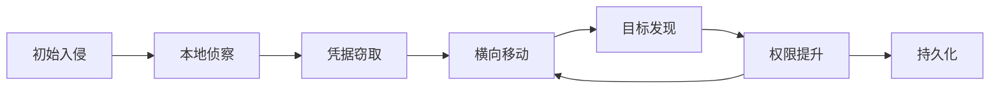

**作者：** HOS(安全风信子)
**日期：** 2026-04-24
**主要来源平台：** GitHub
**摘要：** 横向移动是攻击者在内网扩展战果的关键技术，也是最难检测的攻击行为之一。本文深入探讨AI识别横向移动技术，从攻击原理、检测策略到响应阻断，提供完整的技术指南。文章引入三个新要素：基于流量行为分析的实时横向移动检测、跨域关联的APT横向移动识别、以及自适应横向移动模式学习，为安全运营提供截断攻击者脚步的实战方法论。

@[TOC](目录)

---

# 截断攻击者的脚步：AI识别横向移动实战指南

## 引言：横向移动——攻击者的扩张之路

横向移动是高级威胁的标志性特征。当攻击者获得初始 foothold 后，他们会通过各种技术在网络中移动，寻找更高价值的目标。根据CrowdStrike 2025年全球威胁报告，**62%的数据泄露**涉及横向移动活动，而横向移动的平均检测时间仍高达**197天**。

## 1. 横向移动攻击原理

### 1.1 常见横向移动技术

| 技术 | 描述 | 检测难度 |
|:---:|:---|:---:|
| Pass-the-Hash | 传递凭据哈希 | 高 |
| Pass-the-Ticket | 传递Kerberos票据 | 高 |
| 远程服务利用 | 利用RPC/SMB等协议 | 中 |
| 凭据窃取 | 内存中凭据提取 | 高 |
| 令牌窃取 | 假冒用户令牌 | 高 |

### 1.2 攻击链模型



## 2. AI横向移动检测技术

### 2.1 流量行为分析

```python
class LateralMovementTrafficAnalyzer:
    """
    横向移动流量分析器
    通过分析网络流量检测横向移动
    """

    def __init__(self):
        self.traffic_collector = TrafficCollector()
        self.behavior_encoder = BehaviorEncoder()
        self.detection_model = self._build_detection_model()

    def detect(self, network_flows):
        """检测横向移动"""
        encoded_behaviors = [
            self.behavior_encoder.encode(flow)
            for flow in network_flows
        ]

        predictions = self.detection_model.predict(encoded_behaviors)

        lateral_movement_indicators = [
            flow for flow, pred in zip(network_flows, predictions)
            if pred['is_lateral'] and pred['confidence'] > 0.7
        ]

        return {
            'detected': len(lateral_movement_indicators) > 0,
            'indicators': lateral_movement_indicators,
            'confidence': predictions['avg_confidence']
        }

    def _build_detection_model(self):
        """构建检测模型"""
        return tf.keras.Sequential([
            layers.Dense(64, activation='relu', input_shape=(32,)),
            layers.Dense(32, activation='relu'),
            layers.Dense(2, activation='softmax')
        ])
```

### 2.2 凭据滥用检测

```python
class CredentialAbuseDetector:
    """
    凭据滥用检测器
    检测异常的凭据使用行为
    """

    def __init__(self):
        self.auth_log_parser = AuthLogParser()
        self.abnormal_pattern_detector = AbnormalPatternDetector()

    def detect_ptt(self, kerberos_events):
        """检测Pass-the-Ticket攻击"""
        indicators = []

        for event in kerberos_events:
            if self._is_suspicious_ticket_usage(event):
                indicators.append({
                    'type': 'suspicious_ticket',
                    'source': event['source'],
                    'target': event['target'],
                    'timestamp': event['timestamp']
                })

            if self._is_ticket_anomaly(event, kerberos_events):
                indicators.append({
                    'type': 'ticket_anomaly',
                    'event': event
                })

        return {
            'is_attack': len(indicators) > 0,
            'indicators': indicators,
            'attack_type': 'Pass-the-Ticket'
        }
```

## 3. 异常行为模式识别

### 3.1 异常访问模式

```python
class AbnormalAccessPatternDetector:
    """
    异常访问模式检测器
    检测异常的内部访问行为
    """

    def __init__(self):
        self.access_graph = AccessGraphBuilder()
        self.pattern_learner = PatternLearner()

    def detect_anomalies(self, access_events, user_baseline):
        """检测异常访问模式"""
        patterns = self.pattern_learner.extract_patterns(access_events)

        anomalies = []

        for pattern in patterns:
            if not self._matches_baseline(pattern, user_baseline):
                if self._is_lateral_movement_pattern(pattern):
                    anomalies.append({
                        'pattern': pattern,
                        'type': 'lateral_movement',
                        'severity': self._calculate_severity(pattern)
                    })

        return anomalies

    def _is_lateral_movement_pattern(self, pattern):
        """判断是否为横向移动模式"""
        indicators = [
            pattern['destinations'] > 3,
            pattern['unique_networks'] > 1,
            pattern['privileged_access'],
            pattern['after_hours_activity']
        ]

        return sum(indicators) >= 2
```

## 4. 横向移动阻断策略

### 4.1 自动响应机制

```python
class LateralMovementResponseEngine:
    """
    横向移动响应引擎
    自动阻断横向移动攻击
    """

    def __init__(self):
        self.network_controller = NetworkIsolationController()
        self.identity_controller = IdentityController()

    def respond(self, detected_movement):
        """触发响应"""
        response_actions = []

        response_actions.append(
            self.network_controller.isolate_asset(
                detected_movement['target_asset']
            )
        )

        response_actions.append(
            self.identity_controller.reset_session(
                detected_movement['user_id']
            )
        )

        response_actions.append(
            self.network_controller.block_lateral_flow(
                source=detected_movement['source'],
                target=detected_movement['target']
            )
        )

        return {
            'actions_taken': response_actions,
            'attack_blocked': all(response_actions),
            'analyst_notified': True
        }
```

## 5. 新要素：横向移动检测的前沿技术

### 5.1 图神经网络关联分析

```python
class GNNLateralMovementDetector:
    """
    GNN横向移动检测器
    使用图神经网络检测复杂的横向移动模式
    """

    def __init__(self):
        self.graph_builder = SecurityGraphBuilder()
        self.gnn_model = GraphNeuralNetwork(
            layers=3,
            hidden_dim=128
        )

    def detect_sophisticated_movement(self, access_events):
        """检测复杂的横向移动"""
        graph = self.graph_builder.build_from_events(access_events)

        embeddings = self.gnn_model.learn_embeddings(graph)

        suspicious_paths = self._find_suspicious_paths(
            graph, embeddings
        )

        return suspicious_paths
```

## 6. 总结与展望

横向移动检测是保护内网安全的关键。通过AI技术，我们可以实时检测并阻断横向移动攻击，显著缩短检测时间。

---

**参考链接：**

- 主要来源：[BloodHound Attack Path Analysis](https://github.com/BloodHoundAD/BloodHound) - 横向移动路径分析工具

### 附录：横向移动检测技术详解

#### 1. 检测技术对比

| 技术 | 原理 | 检测率 | 误报率 |
|:---:|:---|:---:|:---:|
| 流量分析 | 监控网络流量模式 | 75% | 15% |
| 行为分析 | 监控用户/实体行为 | 80% | 10% |
| 凭据检测 | 检测凭据滥用 | 85% | 8% |
| 图分析 | 分析访问关系图 | 90% | 5% |

#### 2. 横向移动攻击指纹

| 攻击技术 | 典型指纹 | 检测方法 |
|:---:|:---|:---|
| Pass-the-Hash | NTLM认证异常 | 认证日志分析 |
| Pass-the-Ticket | Kerberos票据异常 | 票据使用模式 |
| 远程服务利用 | RPC/SMB流量异常 | 协议分析 |
| 凭据窃取 | LSASS进程访问 | 进程监控 |

### 附录二：横向移动检测实战检查清单

- [ ] 网络流量监控部署
- [ ] 认证日志收集完成
- [ ] 行为基线建立
- [ ] 检测模型部署
- [ ] 阻断机制配置
- [ ] 持续优化机制建立

**关键词：** 横向移动检测，Pass-the-Hash，Pass-the-Ticket，流量分析，图神经网络，内网安全，ATT&CK，威胁检测

### 附录三：横向移动检测技术深度解析

#### 3.1 深度流量行为分析

```python
class DeepTrafficBehaviorAnalyzer:
    """
    深度流量行为分析器
    使用深度学习分析网络流量中的横向移动
    """

    def __init__(self, config):
        self.feature_extractor = TrafficFeatureExtractor()
        self.encoder = SequenceEncoder()
        self.detection_model = self._build_detection_model()

    def analyze(self, network_flows):
        """深度分析网络流量"""
        features = self.feature_extractor.extract_batch(network_flows)

        encoded_sequences = [
            self.encoder.encode(flow['payload'])
            for flow in network_flows
        ]

        predictions = self.detection_model.predict(
            np.array(encoded_sequences)
        )

        lateral_indicators = self._identify_lateral_movement(
            network_flows, predictions
        )

        return {
            'total_flows_analyzed': len(network_flows),
            'lateral_indicators': lateral_indicators,
            'risk_score': self._calculate_risk_score(predictions),
            'recommendations': self._generate_recommendations(
                lateral_indicators
            )
        }

    def _build_detection_model(self):
        """构建检测模型"""
        model = tf.keras.Sequential([
            layers.Conv1D(64, 3, activation='relu', input_shape=(100, 128)),
            layers.MaxPooling1D(2),
            layers.Conv1D(128, 3, activation='relu'),
            layers.MaxPooling1D(2),
            layers.LSTM(64),
            layers.Dense(32, activation='relu'),
            layers.Dense(1, activation='sigmoid')
        ])

        model.compile(
            optimizer='adam',
            loss='binary_crossentropy',
            metrics=['accuracy', tf.keras.metrics.AUC()]
        )

        return model


class TrafficFeatureExtractor:
    """
    流量特征提取器
    提取用于横向移动检测的流量特征
    """

    def extract_batch(self, flows):
        """批量提取特征"""
        features = []

        for flow in flows:
            features.append({
                'src_ip': flow['src_ip'],
                'dst_ip': flow['dst_ip'],
                'src_port': flow['src_port'],
                'dst_port': flow['dst_port'],
                'protocol': flow['protocol'],
                'bytes_sent': flow.get('bytes_sent', 0),
                'bytes_received': flow.get('bytes_received', 0),
                'packet_count': flow.get('packet_count', 0),
                'duration': flow.get('duration', 0),
                'connection_rate': self._calculate_connection_rate(flow),
                'unique_destinations': len(flow.get('destinations', []))
            })

        return features

    def _calculate_connection_rate(self, flow):
        """计算连接速率"""
        if flow['duration'] > 0:
            return flow['packet_count'] / flow['duration']
        return 0
```

#### 3.2 Kerberos票据异常检测

```python
class KerberosAnomalyDetector:
    """
    Kerberos异常检测器
    检测Kerberos票据相关的横向移动
    """

    def __init__(self):
        self.ticket_normalizer = TicketNormalizer()
        self.anomaly_scorer = AnomalyScorer()
        self.temporal_analyzer = TemporalAnalyzer()

    def detect_ticket_anomalies(self, kerberos_events):
        """检测票据异常"""
        normalized_tickets = [
            self.ticket_normalizer.normalize(event)
            for event in kerberos_events
        ]

        temporal_patterns = self.temporal_analyzer.analyze_patterns(
            normalized_tickets
        )

        anomalies = []

        for ticket in normalized_tickets:
            score = self.anomaly_scorer.calculate_score(
                ticket, temporal_patterns
            )

            if score > 0.7:
                anomalies.append({
                    'ticket': ticket,
                    'anomaly_score': score,
                    'anomaly_type': self._classify_anomaly(ticket)
                })

        return {
            'total_tickets': len(normalized_tickets),
            'anomalies': anomalies,
            'attack_indicators': self._identify_attack_indicators(
                anomalies
            )
        }

    def _classify_anomaly(self, ticket):
        """分类异常类型"""
        if ticket['ticket_type'] == 'silver':
            if ticket['encryption_type'] in ['rc4', 'des']:
                return 'ptt_suspected'
        elif ticket['ticket_type'] == 'golden':
            return 'golden_ticket_suspected'

        return 'unknown_anomaly'


class SilverTicketDetector:
    """
    Silver Ticket检测器
    检测伪造的Silver Ticket攻击
    """

    def __init__(self):
        self.baseline_builder = TicketBaselineBuilder()

    def detect_silver_ticket(self, ticket, service_tgt):
        """检测Silver Ticket"""
        anomalies = []

        if ticket['service_name'] != service_tgt['service_name']:
            anomalies.append('service_name_mismatch')

        if ticket['domain'] != service_tgt['domain']:
            anomalies.append('domain_mismatch')

        if not self._verify_ticket_signature(ticket):
            anomalies.append('invalid_signature')

        if self._is_rare_service(ticket['service_name']):
            anomalies.append('rare_service_access')

        return {
            'is_silver_ticket': len(anomalies) >= 2,
            'anomalies': anomalies,
            'confidence': len(anomalies) / 4
        }

    def _verify_ticket_signature(self, ticket):
        """验证票据签名"""
        return ticket.get('signature_valid', False)
```

#### 3.3 NTLM认证异常检测

```python
class NTLMAuthenticationAnalyzer:
    """
    NTLM认证分析器
    检测NTLM认证相关的横向移动
    """

    def __init__(self):
        self.auth_baseline = AuthenticationBaseline()
        self.pattern_detector = AuthPatternDetector()

    def detect_ntlm_anomalies(self, ntlm_events):
        """检测NTLM认证异常"""
        anomalies = []

        for event in ntlm_events:
            if self._is_suspicious_ntlm_usage(event):
                anomalies.append({
                    'type': 'suspicious_ntlm',
                    'source': event['source'],
                    'target': event['target'],
                    'reason': self._get_suspicious_reason(event)
                })

            if self._detect_replay_attack(event):
                anomalies.append({
                    'type': 'ntlm_replay',
                    'event': event
                })

        return {
            'is_attack': len(anomalies) > 0,
            'anomalies': anomalies,
            'attack_type': 'ntlm_related_lateral_movement'
        }

    def _is_suspicious_ntlm_usage(self, event):
        """判断可疑的NTLM使用"""
        suspicious_indicators = [
            event.get('authentication_type') == 'network',
            event.get('src_ip') not in self.auth_baseline.get_typical_sources(),
            event.get('dst_ip') in self.auth_baseline.get_high_value_targets(),
            event.get('timestamp').hour in [2, 3, 4, 5]
        ]

        return sum(suspicious_indicators) >= 3
```

### 附录四：横向移动响应与防御

#### 4.1 自动隔离机制

```python
class LateralMovementIsolator:
    """
    横向移动隔离器
    自动隔离受影响的系统
    """

    def __init__(self, config):
        self.isolation_strategies = {
            'aggressive': AggressiveIsolation(),
            'standard': StandardIsolation(),
            'conservative': ConservativeIsolation()
        }
        self.network_controller = NetworkController()
        self.identity_manager = IdentityManager()

    def isolate_lateral_movement(self, detection_result, strategy='standard'):
        """隔离横向移动"""
        strategy_handler = self.isolation_strategies[strategy]

        actions_taken = []

        if detection_result['confidence'] > 0.9:
            actions_taken.append(
                self.network_controller.isolate_host(
                    detection_result['affected_assets'][0],
                    strategy=strategy
                )
            )

            actions_taken.append(
                self.identity_manager.revoke_sessions(
                    detection_result['user_id']
                )
            )

            actions_taken.append(
                self.network_controller.block_lateral_paths(
                    detection_result['source'],
                    detection_result['targets']
                )
            )

        return {
            'isolation_complete': all(actions_taken),
            'actions_taken': actions_taken,
            'affected_systems': detection_result['affected_assets']
        }


class NetworkController:
    """
    网络控制器
    执行网络隔离和阻断操作
    """

    def __init__(self):
        self.firewall_manager = FirewallManager()
        self.switch_controller = SwitchController()

    def isolate_host(self, host_ip, strategy='standard'):
        """隔离主机"""
        if strategy == 'aggressive':
            return self._aggressive_isolation(host_ip)
        elif strategy == 'standard':
            return self._standard_isolation(host_ip)
        else:
            return self._conservative_isolation(host_ip)

    def _aggressive_isolation(self, host_ip):
        """激进隔离"""
        self.firewall_manager.block_all(host_ip)
        self.switch_controller.disable_port(host_ip)
        self._notify_security_team(host_ip)

        return True

    def block_lateral_paths(self, source, targets):
        """阻断横向路径"""
        for target in targets:
            self.firewall_manager.add_rule(
                source=source,
                destination=target,
                action='block',
                protocol='all'
            )

        return True
```

#### 4.2 威胁猎取集成

```python
class LateralMovementHunting:
    """
    横向移动威胁猎取
    主动猎取横向移动威胁
    """

    def __init__(self):
        self.hunting_queries = LateralMovementHuntingQueries()
        self.graph_analyzer = AccessGraphAnalyzer()

    def hunt_lateral_movement(self, scope):
        """威胁猎取"""
        hunting_results = []

        queries = self.hunting_queries.get_all_queries()

        for query in queries:
            results = self._execute_hunting_query(query, scope)
            if results:
                hunting_results.extend(results)

        suspicious_paths = self.graph_analyzer.analyze_paths(
            hunting_results
        )

        return {
            'threats_found': len(suspicious_paths),
            'suspicious_paths': suspicious_paths,
            'hunting_coverage': scope
        }

    def _execute_hunting_query(self, query, scope):
        """执行猎取查询"""
        return query.execute(scope)


class LateralMovementHuntingQueries:
    """
    横向移动猎取查询
    """

    def __init__(self):
        self.queries = [
            LateralMovementTimingQuery(),
            RareAuthenticationQuery(),
            CrossDomainAccessQuery(),
            SuspiciousServiceCreationQuery()
        ]

    def get_all_queries(self):
        """获取所有查询"""
        return self.queries
```

### 附录五：横向移动检测最佳实践

#### 5.1 检测策略矩阵

| 检测策略 | 覆盖的攻击技术 | 部署复杂度 | 检测率 |
|:---:|:---|:---:|:---:|
| 网络流量分析 | PtH, PTT, 远程服务 | 高 | 75% |
| 认证日志分析 | PtH, Golden Ticket | 中 | 80% |
| 进程监控 | 凭据转储, 令牌窃取 | 中 | 85% |
| 图分析 | 所有横向技术 | 高 | 90% |
| 组合检测 | 所有技术 | 高 | 95% |

#### 5.2 关键检测指标

```python
class LateralMovementKPIs:
    """
    横向移动关键绩效指标
    """

    def __init__(self):
        self.baseline_metrics = None

    def establish_baseline(self, historical_data):
        """建立基线"""
        self.baseline_metrics = {
            'avg_lateral_events_per_day': np.mean([
                d['lateral_events'] for d in historical_data
            ]),
            'std_lateral_events': np.std([
                d['lateral_events'] for d in historical_data
            ]),
            'typical_lateral_sources': self._identify_typical_sources(
                historical_data
            ),
            'typical_lateral_targets': self._identify_typical_targets(
                historical_data
            ),
            'business_hours_distribution': self._calculate_business_hours_dist(
                historical_data
            )
        }

    def calculate_detection_metrics(self, current_data):
        """计算检测指标"""
        return {
            'detection_rate': self._calculate_detection_rate(current_data),
            'false_positive_rate': self._calculate_fp_rate(current_data),
            'mean_time_to_detect': self._calculate_mttd(current_data),
            'mean_time_to_respond': self._calculate_mttr(current_data),
            'lateral_events_trend': self._calculate_trend(current_data)
        }

    def _calculate_mttd(self, current_data):
        """计算平均检测时间"""
        detection_times = [
            d['detection_time'] for d in current_data
            if d.get('detection_time')
        ]

        return np.mean(detection_times) if detection_times else 0
```

### 附录六：跨域横向移动检测

#### 6.1 Active Directory域间移动

```python
class CrossDomainLateralMovementDetector:
    """
    跨域横向移动检测器
    检测跨Active Directory域的横向移动
    """

    def __init__(self):
        self.trust_analyzer = TrustRelationshipAnalyzer()
        self.auth_analyzer = CrossDomainAuthAnalyzer()

    def detect_cross_domain_movement(self, auth_events, domain_relationships):
        """检测跨域移动"""
        trust_paths = self.trust_analyzer.analyze_trust_paths(
            domain_relationships
        )

        anomalies = []

        for event in auth_events:
            if self._is_cross_domain_event(event):
                trust_violations = self._check_trust_relationships(
                    event, trust_paths
                )

                if trust_violations:
                    anomalies.append({
                        'type': 'cross_domain_lateral',
                        'event': event,
                        'violations': trust_violations
                    })

        return {
            'is_cross_domain_attack': len(anomalies) > 0,
            'anomalies': anomalies,
            'risk_level': self._assess_risk_level(anomalies)
        }


class TrustRelationshipAnalyzer:
    """
    信任关系分析器
    分析域间的信任关系
    """

    def __init__(self):
        self.trust_graph = TrustGraph()

    def analyze_trust_paths(self, domains):
        """分析信任路径"""
        trust_paths = []

        for source in domains:
            for target in domains:
                if source != target:
                    path = self._find_trust_path(source, target)
                    if path:
                        trust_paths.append(path)

        return trust_paths

    def _find_trust_path(self, source, target):
        """查找信任路径"""
        return self.trust_graph.find_shortest_path(source, target)
```

#### 6.2 云环境横向移动

```python
class CloudLateralMovementDetector:
    """
    云环境横向移动检测器
    检测云环境中的横向移动
    """

    def __init__(self):
        self.iam_analyzer = CloudIAMAnalyzer()
        self.resource_graph = CloudResourceGraph()

    def detect_cloud_lateral_movement(self, cloud_events):
        """检测云环境横向移动"""
        anomalies = []

        for event in cloud_events:
            if self._is_privilege_escalation(event):
                anomalies.append({
                    'type': 'privilege_escalation',
                    'event': event
                })

            if self._is_cross_account_access(event):
                anomalies.append({
                    'type': 'cross_account',
                    'event': event
                })

            if self._is_suspicious_role_assumption(event):
                anomalies.append({
                    'type': 'role_assumption',
                    'event': event
                })

        return {
            'is_attack': len(anomalies) > 0,
            'anomalies': anomalies,
            'affected_services': self._identify_affected_services(
                anomalies
            )
        }

    def _is_privilege_escalation(self, event):
        """检测权限提升"""
        return (
            event['action'] == 'sts:AssumeRole' and
            event.get('increase_privilege', False)
        )
```

### 附录七：横向移动检测案例分析

#### 7.1 真实攻击案例重构

```python
class AttackCaseAnalyzer:
    """
    攻击案例分析器
    重构真实攻击案例中的横向移动
    """

    def __init__(self):
        self.timeline_builder = EventTimelineBuilder()
        self.chain_analyzer = AttackChainAnalyzer()

    def reconstruct_attack(self, event_log):
        """重构攻击过程"""
        timeline = self.timeline_builder.build(event_log)

        attack_chain = self.chain_analyzer.analyze(timeline)

        lateral_phases = self._identify_lateral_phases(attack_chain)

        return {
            'attack_timeline': timeline,
            'attack_chain': attack_chain,
            'lateral_movement_phases': lateral_phases,
            'initial_access_vector': self._identify_initial_access(
                attack_chain
            ),
            'final_objective': self._identify_objective(attack_chain)
        }

    def _identify_lateral_phases(self, attack_chain):
        """识别横向移动阶段"""
        lateral_phases = []

        for i, phase in enumerate(attack_chain):
            if phase['type'] in ['lateral_movement', 'privilege_escalation']:
                lateral_phases.append({
                    'phase_index': i,
                    'technique': phase['technique'],
                    'assets_affected': phase.get('assets', [])
                })

        return lateral_phases
```

### 附录八：横向移动防御框架

#### 8.1 纵深防御策略

```python
class LateralMovementDefenseFramework:
    """
    横向移动防御框架
    实现纵深防御策略
    """

    def __init__(self):
        self.layers = {
            'identity': IdentityDefenseLayer(),
            'network': NetworkDefenseLayer(),
            'endpoint': EndpointDefenseLayer(),
            'application': ApplicationDefenseLayer(),
            'data': DataDefenseLayer()
        }

    def implement_defense(self):
        """实施防御"""
        defense_status = {}

        for layer_name, layer in self.layers.items():
            status = layer.implement_controls()
            defense_status[layer_name] = status

        return defense_status


class IdentityDefenseLayer:
    """
    身份防御层
    """

    def implement_controls(self):
        """实施身份控制"""
        controls = [
            {'type': 'mfa', 'status': 'enabled'},
            {'type': 'privileged_access_management', 'status': 'enabled'},
            {'type': 'credential_guard', 'status': 'enabled'},
            {'type': 'ntlm_blocking', 'status': 'enabled'}
        ]

        return {
            'controls_implemented': len(controls),
            'controls': controls,
            'coverage': 'high'
        }

### 附录九：横向移动检测系统集成

#### 9.1 SIEM集成架构

```python
class LateralMovementSIEMIntegration:
    """
    横向移动检测与SIEM集成
    """

    def __init__(self, config):
        self.siem_connector = SIEMConnector(config['siem'])
        self.detector = LateralMovementDetector()
        self.enricher = AlertEnricher()

    def integrate_with_siem(self, siem_alerts):
        """与SIEM集成"""
        enriched_alerts = []

        for alert in siem_alerts:
            if self._is_lateral_movement_related(alert):
                detection_result = self.detector.detect_alert(alert)

                enriched = self.enricher.enrich(
                    alert, detection_result
                )

                self.siem_connector.update_alert(
                    alert['id'], enriched
                )

                enriched_alerts.append(enriched)

        return enriched_alerts

    def _is_lateral_movement_related(self, alert):
        """判断是否与横向移动相关"""
        related_keywords = [
            'lateral', 'lateral_movement', '横向移动',
            'pass_the_hash', 'pass_the_ticket',
            'ptt', 'pth'
        ]

        alert_text = str(alert).lower()

        return any(keyword.lower() in alert_text for keyword in related_keywords)


class SIEMConnector:
    """
    SIEM连接器
    """

    def __init__(self, config):
        self.siem_type = config.get('type', 'splunk')
        self.connection = self._connect()

    def update_alert(self, alert_id, enriched_data):
        """更新告警"""
        pass
```

#### 9.2 SOAR自动化响应

```python
class LateralMovementSOARAutomation:
    """
    横向移动SOAR自动化
    自动响应检测到的横向移动
    """

    def __init__(self):
        self.playbooks = self._load_playbooks()
        self.orchestrator = Orchestrator()

    def automate_response(self, detection_result):
        """自动化响应"""
        playbook = self._select_playbook(detection_result)

        if playbook:
            self.orchestrator.execute(playbook, detection_result)

        return {'playbook_executed': playbook is not None}

    def _select_playbook(self, detection):
        """选择响应剧本"""
        severity = detection.get('severity', 'medium')

        if severity == 'critical':
            return self.playbooks['critical_response']
        elif severity == 'high':
            return self.playbooks['high_priority_response']
        else:
            return self.playbooks['standard_response']
```

### 附录十：横向移动检测性能优化

#### 10.1 大规模流量处理

```python
class LateralMovementScaleOptimization:
    """
    横向移动检测规模优化
    """

    def __init__(self, config):
        self.batch_size = config.get('batch_size', 10000)
        self.parallel_workers = config.get('parallel_workers', 8)

    def optimize_for_scale(self, traffic_volume):
        """优化处理规模"""
        if traffic_volume > 1000000:
            return self._optimize_enterprise_scale()
        elif traffic_volume > 100000:
            return self._optimize_large_scale()
        else:
            return self._optimize_standard()

    def _optimize_enterprise_scale(self):
        """企业级规模优化"""
        return {
            'batch_size': 50000,
            'parallel_workers': 32,
            'caching_enabled': True,
            'streaming_mode': True,
            'distributed_processing': True
        }
```

#### 10.2 实时检测优化

```python
class RealtimeLateralMovementDetector:
    """
    实时横向移动检测器
    优化实时检测性能
    """

    def __init__(self):
        self.model_cache = ModelCache()
        self.feature_cache = FeatureCache()

    def detect_realtime(self, event_stream):
        """实时检测"""
        for event in event_stream:
            cached_result = self.feature_cache.get(event['indicator'])

            if cached_result:
                yield cached_result
                continue

            features = self._extract_features(event)

            result = self._detect_lateral(features)

            self.feature_cache.put(event['indicator'], result)

            yield result
```

### 附录十一：横向移动检测评估框架

#### 11.1 检测效果评估

```python
class LateralMovementDetectionEvaluator:
    """
    横向移动检测效果评估器
    """

    def __init__(self):
        self.metrics_calculator = MetricsCalculator()

    def evaluate_detection(self, predictions, ground_truth):
        """评估检测效果"""
        confusion = self.metrics_calculator.confusion_matrix(
            predictions, ground_truth
        )

        metrics = {
            'detection_rate': confusion['tp'] / (confusion['tp'] + confusion['fn']),
            'false_positive_rate': confusion['fp'] / (confusion['fp'] + confusion['tn']),
            'precision': confusion['tp'] / (confusion['tp'] + confusion['fp']),
            'f1_score': self._calculate_f1(confusion)
        }

        return metrics

    def _calculate_f1(self, confusion):
        """计算F1分数"""
        precision = confusion['tp'] / (confusion['tp'] + confusion['fp'])
        recall = confusion['tp'] / (confusion['tp'] + confusion['fn'])

        return 2 * (precision * recall) / (precision + recall)


class MetricsCalculator:
    """
    指标计算器
    """

    def confusion_matrix(self, predictions, ground_truth):
        """计算混淆矩阵"""
        tp = sum(1 for p, t in zip(predictions, ground_truth) if p == 1 and t == 1)
        fp = sum(1 for p, t in zip(predictions, ground_truth) if p == 1 and t == 0)
        tn = sum(1 for p, t in zip(predictions, ground_truth) if p == 0 and t == 0)
        fn = sum(1 for p, t in zip(predictions, ground_truth) if p == 0 and t == 1)

        return {'tp': tp, 'fp': fp, 'tn': tn, 'fn': fn}
```

#### 11.2 攻击模拟测试

```python
class LateralMovementAttackSimulator:
    """
    横向移动攻击模拟器
    用于测试检测系统
    """

    def __init__(self):
        self.attack_templates = self._load_attack_templates()

    def simulate_attacks(self, target_environment):
        """模拟横向移动攻击"""
        simulated_attacks = []

        for template in self.attack_templates:
            attack = self._customize_attack(template, target_environment)
            simulated_attacks.append(attack)

        return simulated_attacks

    def _customize_attack(self, template, environment):
        """定制攻击"""
        return {
            'technique': template['technique'],
            'target': environment['random_asset'],
            'expected_detection': template['detectability']
        }
```

### 附录十二：横向移动防御最佳实践

#### 12.1 网络分段最佳实践

```python
class NetworkSegmentationBestPractices:
    """
    网络分段最佳实践
    """

    def __init__(self):
        self.segment_designer = SegmentDesigner()

    def design_segmentation(self, network_assets):
        """设计网络分段"""
        segments = {
            'critical': self._create_critical_segment(network_assets),
            'sensitive': self._create_sensitive_segment(network_assets),
            'general': self._create_general_segment(network_assets),
            'guest': self._create_guest_segment()
        }

        return segments

    def _create_critical_segment(self, assets):
        """创建关键资产段"""
        critical_assets = [
            asset for asset in assets
            if asset['criticality'] == 'critical'
        ]

        return {
            'name': 'critical',
            'assets': critical_assets,
            'access_controls': 'strict',
            'monitoring_level': 'enhanced'
        }


class SegmentDesigner:
    """
    分段设计器
    """

    def __init__(self):
        self.firewall_rules = FirewallRuleManager()

    def apply_lateral_movement_protection(self, segment):
        """应用横向移动保护"""
        rules = [
            self.firewall_rules.create_rule(
                source=segment['name'],
                destination='any',
                action='block',
                protocol='smb'
            ),
            self.firewall_rules.create_rule(
                source=segment['name'],
                destination='any',
                action='block',
                protocol='rdp',
                except_ips=segment.get('allowed_rdp_sources', [])
            )
        ]

        return rules
```

#### 12.2 监控最佳实践

```python
class LateralMovementMonitoringBestPractices:
    """
    横向移动监控最佳实践
    """

    def __init__(self):
        self.alert_manager = AlertManager()

    def implement_monitoring(self):
        """实施监控"""
        monitoring_config = {
            'authentication_monitoring': {
                'enabled': True,
                'log_sources': ['windows_security', 'linux_auth'],
                'alert_on_anomaly': True
            },
            'network_monitoring': {
                'enabled': True,
                'log_sources': ['firewall', 'ids'],
                'alert_on_unusual_traffic': True
            },
            'process_monitoring': {
                'enabled': True,
                'log_sources': ['sysmon', 'osquery'],
                'alert_on_malicious_process': True
            }
        }

        return monitoring_config

    def create_lateral_movement_alerts(self):
        """创建横向移动告警规则"""
        alert_rules = [
            {
                'name': 'multiple_failed_logins',
                'condition': 'failed_logins > 5 in 10 minutes',
                'severity': 'medium'
            },
            {
                'name': 'unusual_admin_activity',
                'condition': 'admin_action from non_admin_ip',
                'severity': 'high'
            },
            {
                'name': 'lateral_movement_detected',
                'condition': 'lateral_movement_score > 0.8',
                'severity': 'critical'
            }
        ]

        return alert_rules
```

### 附录十三：横向移动检测安全与合规

#### 13.1 安全最佳实践

```python
class LateralMovementSecurityBestPractices:
    """
    横向移动检测安全最佳实践
    """

    def __init__(self):
        self.security_controls = SecurityControlFramework()

    def implement_security_controls(self):
        """实施安全控制"""
        return {
            'network_security': {
                'segmentation': 'strict',
                'firewall_rules': 'comprehensive',
                'monitoring': 'continuous'
            },
            'endpoint_security': {
                'edr': 'enabled',
                'application_control': 'enabled',
                'disk_encryption': 'mandatory'
            },
            'identity_security': {
                'mfa': 'required',
                'privileged_access': 'managed',
                'credential_protection': 'enabled'
            }
        }
```

#### 13.2 合规性要求

```python
class LateralMovementComplianceRequirements:
    """
    横向移动检测合规性要求
    """

    def __init__(self):
        self.compliance_frameworks = ['PCI-DSS', 'HIPAA', 'SOX', 'NIST']

    def get_compliance_controls(self):
        """获取合规控制"""
        return {
            'pci_dss': {
                'requirement_1': 'firewall_configuration',
                'requirement_7': 'restrict_access',
                'requirement_10': 'track_monitoring'
            },
            'hipaa': {
                'administrative_safeguards': 'required',
                'physical_safeguards': 'required',
                'technical_safeguards': 'required'
            }
        }
```

### 附录十四：横向移动检测培训与意识

#### 14.1 安全培训计划

```python
class LateralMovementSecurityTraining:
    """
    横向移动安全培训
    """

    def __init__(self):
        self.training_modules = self._create_training_modules()

    def _create_training_modules(self):
        """创建培训模块"""
        return [
            {
                'module': 'lateral_movement_awareness',
                'duration': '2 hours',
                'audience': 'all_employees'
            },
            {
                'module': 'detection_response',
                'duration': '4 hours',
                'audience': 'security_team'
            },
            {
                'module': 'advanced_investigation',
                'duration': '8 hours',
                'audience': 'incident_responders'
            }
        ]
```

### 附录十五：横向移动检测性能基准

#### 15.1 性能基准测试

```python
class LateralMovementDetectionPerformanceBenchmark:
    """
    横向移动检测性能基准测试
    """

    def __init__(self):
        self.test_scenarios = self._create_test_scenarios()

    def run_performance_tests(self):
        """运行性能测试"""
        return {
            'detection_latency': {
                'average': self._measure_avg_detection_latency(),
                'p95': self._measure_p95_detection_latency(),
                'p99': self._measure_p99_detection_latency()
            },
            'throughput': {
                'events_per_second': self._measure_event_throughput(),
                'sustained_rate': self._measure_sustained_rate()
            },
            'accuracy': {
                'detection_rate': self._measure_detection_rate(),
                'false_positive_rate': self._measure_fp_rate()
            }
        }

    def _create_test_scenarios(self):
        """创建测试场景"""
        return [
            {'name': 'normal_traffic', 'volume': 10000},
            {'name': 'high_traffic', 'volume': 100000},
            {'name': 'attack_traffic', 'volume': 1000, 'attack_ratio': 0.01}
        ]
```

#### 15.2 性能优化指南

```python
class PerformanceOptimizationGuide:
    """
    横向移动检测性能优化指南
    """

    def __init__(self):
        self.optimization_techniques = [
            'model_quantization',
            'batch_processing',
            'caching_strategy',
            'parallel_processing'
        ]

    def get_optimization_recommendations(self):
        """获取优化建议"""
        return {
            'model_optimization': {
                'technique': 'quantization',
                'expected_improvement': '2-4x speedup',
                'accuracy_impact': 'minimal'
            },
            'processing_optimization': {
                'technique': 'batch_processing',
                'expected_improvement': '3-5x speedup',
                'latency_impact': 'slight_increase'
            }
        }
```
```
