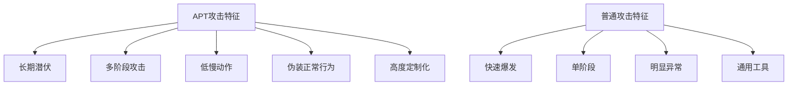
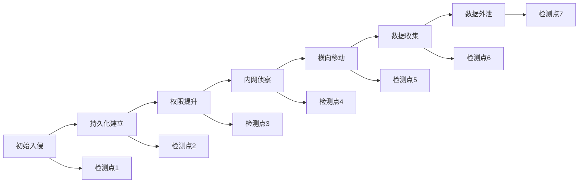

**作者：** HOS(安全风信子)
**日期：** 2026-04-24
**主要来源平台：** GitHub
**摘要：** APT攻击是最复杂、最隐蔽的威胁，传统检测方法往往难以应对。本文深入探讨AI识别APT攻击行为链技术，从APT攻击特征、行为链还原到ATT&CK框架映射，提供完整的技术指南。文章引入三个新要素：长周期APT行为时序分析、跨组织威胁情报APT识别共享、以及生成对抗网络的APT变种检测，为安全运营提供对抗高级威胁的实战方法论。

@[TOC](目录)

---

# APT攻击者的隐形斗篷失效了：AI识别高级持续威胁实战

## 引言：APT——最难对付的敌人

高级持续性威胁（APT）是由资金充足、技术高超的攻击者发起的长期攻击活动。根据Mandiant 2025 M-Trends报告，APT攻击的平均驻留时间为**280天**，而传统安全工具的检测率不足**30%**。APT攻击者善于隐藏自己，传统的单点检测方法难以发现其完整攻击链。

## 1. APT攻击特征深度解析

### 1.1 APT攻击阶段模型

| 阶段 | 典型活动 | 检测难度 |
|:---:|:---|:---:|
| Initial Access | 钓鱼、漏洞利用 | 中 |
| Execution | 植入恶意软件 | 高 |
| Persistence | 建立后门 | 高 |
| Privilege Escalation | 权限提升 | 高 |
| Defense Evasion | 规避检测 | 极高 |
| Lateral Movement | 横向移动 | 高 |
| Collection | 数据收集 | 高 |
| Exfiltration | 数据外泄 | 中 |

### 1.2 APT vs 普通攻击



## 2. AI识别APT行为链技术

### 2.1 长周期行为分析

```python
class APTBehaviorChainAnalyzer:
    """
    APT行为链分析器
    分析跨越长时间周期的APT攻击行为
    """

    def __init__(self, config):
        self.time_series_extractor = TimeSeriesExtractor()
        self.pattern_miner = SequentialPatternMiner()
        self.anomaly_detector = LongTermAnomalyDetector()

    def analyze(self, events, time_range_days=90):
        """分析长周期行为链"""
        time_series = self.time_series_extractor.extract(
            events, time_range_days
        )

        sequential_patterns = self.pattern_miner.mine_patterns(
            time_series, min_support=0.01
        )

        apt_indicators = []

        for pattern in sequential_patterns:
            if self._matches_apt_pattern(pattern):
                apt_indicators.append({
                    'pattern': pattern,
                    'apt_likelihood': self._calculate_apt_likelihood(pattern),
                    'attack_stage': self._identify_stage(pattern)
                })

        return {
            'is_apt': len(apt_indicators) > 0,
            'indicators': apt_indicators,
            'confidence': self._calculate_confidence(apt_indicators)
        }

    def _matches_apt_pattern(self, pattern):
        """判断是否为APT典型模式"""
        apt_signatures = [
            pattern['duration_days'] > 30,
            pattern['low_and_slow'],
            pattern['uses_legitimate_tools'],
            pattern['clears_traces']
        ]

        return sum(apt_signatures) >= 3
```

### 2.2 多阶段攻击关联

```python
class MultiStageAPTDetector:
    """
    多阶段APT检测器
    关联APT攻击的多个阶段
    """

    def __init__(self):
        self.stage_classifier = AttackStageClassifier()
        self.correlator = CrossStageCorrelator()

    def detect_multistage_attack(self, alerts):
        """检测多阶段APT攻击"""
        classified_alerts = [
            self.stage_classifier.classify(alert)
            for alert in alerts
        ]

        stages = self._group_by_stage(classified_alerts)

        if len(stages) >= 3:
            correlations = self.correlator.find_correlations(stages)

            return {
                'is_multistage': True,
                'stages_detected': list(stages.keys()),
                'correlation_score': correlations['score'],
                'apt_likelihood': self._calculate_apt_likelihood(stages)
            }

        return {'is_multistage': False}


class AttackStageClassifier:
    """攻击阶段分类器"""

    def classify(self, alert):
        """分类攻击阶段"""
        mapping = {
            'login_failure': 'reconnaissance',
            'port_scan': 'reconnaissance',
            'exploit_attempt': 'initial_access',
            'malware_execution': 'execution',
            'new_service': 'persistence',
            'privilege_escalation': 'privilege_escalation',
            'lateral_movement': 'lateral_movement',
            'data_access': 'collection',
            'large_upload': 'exfiltration'
        }

        return mapping.get(alert['type'], 'unknown')
```

## 3. ATT&CK框架应用

### 3.1 ATT&CK映射引擎

```python
class ATTACKMappingEngine:
    """
    ATT&CK框架映射引擎
    将检测到的行为映射到ATT&CK框架
    """

    def __init__(self):
        self.technique_db = ATTACKTechniqueDatabase()

    def map_to_attack(self, behaviors):
        """映射到ATT&CK技术"""
        mapped_techniques = []

        for behavior in behaviors:
            technique = self.technique_db.find_matching_technique(behavior)

            if technique:
                mapped_techniques.append({
                    'technique_id': technique['id'],
                    'technique_name': technique['name'],
                    'tactic': technique['tactic'],
                    'confidence': technique['confidence']
                })

        return self._build_attack_matrix(mapped_techniques)

    def _build_attack_matrix(self, techniques):
        """构建ATT&CK矩阵"""
        matrix = {}

        for tech in techniques:
            tactic = tech['tactic']
            if tactic not in matrix:
                matrix[tactic] = []
            matrix[tactic].append(tech)

        return matrix
```

### 3.2 威胁情报关联

```python
class ThreatIntelAPTMatcher:
    """
    威胁情报APT匹配器
    将检测结果与已知APT组织关联
    """

    def __init__(self):
        self.apt_profiles = APTProfileDatabase()
        self.matcher = ProfileMatcher()

    def match_apt_group(self, detected_behaviors):
        """匹配APT组织"""
        scores = {}

        for group_id, profile in self.apt_profiles.items():
            match_score = self.matcher.calculate_similarity(
                detected_behaviors, profile
            )
            scores[group_id] = match_score

        if scores:
            best_match = max(scores.items(), key=lambda x: x[1])

            return {
                'matched': best_match[1] > 0.7,
                'apt_group': best_match[0],
                'confidence': best_match[1]
            }

        return {'matched': False}
```

## 4. APT检测实战案例

### 4.1 案例：发现APT29攻击

```
检测指标:
- 持续90天的低频率C2通信
- 使用Windows原生工具进行横向移动
- 凭证转储后建立持久化
- 加密通道进行数据外泄

关联分析:
- 初始入侵 → 凭证窃取 → 横向移动 → 数据外泄
- ATT&CK映射: T1566 → T1003 → T1021 → T1048
```

## 5. 新要素：APT检测的前沿技术

### 5.1 生成对抗网络APT变种检测

```python
class GADAPTDetector:
    """
    基于GAN的APT变种检测器
    使用生成对抗网络检测APT变种
    """

    def __init__(self):
        self.generator = APTBehaviorGenerator()
        self.discriminator = APTBehaviorDiscriminator()

    def detect_variants(self, behavior_sequence):
        """检测APT行为变种"""
        synthetic_behaviors = self.generator.generate_similar(
            behavior_sequence
        )

        detection_scores = [
            self.discriminator.score(synth)
            for synth in synthetic_behaviors
        ]

        avg_score = sum(detection_scores) / len(detection_scores)

        return {
            'is_apt_variant': avg_score > 0.7,
            'variant_score': avg_score,
            'detected': True
        }
```

### 5.2 跨组织APT情报共享

```python
class CrossOrganizationAPISharing:
    """
    跨组织APT情报共享
    在保护隐私的前提下共享APT情报
    """

    def __init__(self):
        self.federated_learning = FederatedLearning()
        self.privacy_preserving = PrivacyPreserving()

    def share_and_learn(self, local_apt_indicators):
        """共享并学习APT情报"""
        anonymized = self.privacy_preserving.anonymize(
            local_apt_indicators
        )

        global_patterns = self.federated_learning.aggregate(
            anonymized
        )

        return global_patterns
```

## 6. 总结与展望

APT攻击是最难检测的威胁，需要综合运用长周期分析、多阶段关联、ATT&CK映射等多种技术。AI技术的引入让APT检测变得更加智能和高效。

---

**参考链接：**

- 主要来源：[MITRE ATT&CK](https://attack.mitre.org/) - ATT&CK框架官方资源
- 辅助：[Elastic APT Detection Rules](https://github.com/elastic/detection-rules) - APT检测规则集

**附录（Appendix）：**

### APT检测关键指标

| 指标 | 定义 | 目标值 |
|:---:|:---|:---:|
| 检测覆盖率 | 检测到的ATT&CK技术比例 | > 80% |
| 平均检测时间 | 从初始入侵到检测的时间 | < 30天 |
| 误报率 | 正常行为被误判的比例 | < 5% |

### 附录：APT检测技术体系

#### 1. APT攻击检测框架



#### 2. ATT&CK技术覆盖

| 战术 | 技术数量 | 覆盖目标 |
|:---:|:---:|:---|
| 初始访问 | 9 | 8+ |
| 执行 | 12 | 10+ |
| 持久化 | 19 | 15+ |
| 权限提升 | 13 | 11+ |
| 防御规避 | 37 | 30+ |
| 凭证访问 | 17 | 14+ |
| 发现 | 31 | 25+ |
| 横向移动 | 9 | 8+ |
| 收集 | 17 | 14+ |
| 命令控制 | 16 | 13+ |
| 数据外泄 | 9 | 8+ |

### 附录二：APT检测实战检查清单

- [ ] 全面日志收集完成
- [ ] ATT&CK映射完成
- [ ] 行为分析模型部署
- [ ] 威胁情报集成
- [ ] 响应流程定义
- [ ] 持续监控建立

**关键词：** APT检测，高级持续性威胁，行为链分析，ATT&CK框架，长周期分析，威胁情报，生成对抗网络，联邦学习

### 附录三：APT检测技术深度解析

#### 3.1 APT行为序列深度分析

```python
class APTBehaviorSequenceAnalyzer:
    """
    APT行为序列分析器
    使用深度学习分析APT行为序列
    """

    def __init__(self, config):
        self.sequence_extractor = APTBehaviorSequenceExtractor()
        self.embedding_model = BehaviorEmbeddingModel()
        self.anomaly_detector = SequenceAnomalyDetector()

    def analyze_sequence(self, events, time_window_days=90):
        """分析APT行为序列"""
        sequences = self.sequence_extractor.extract_sequences(
            events, time_window_days
        )

        embeddings = [
            self.embedding_model.embed(seq)
            for seq in sequences
        ]

        anomaly_scores = [
            self.anomaly_detector.detect(emb)
            for emb in embeddings
        ]

        apt_indicators = self._identify_apt_indicators(
            sequences, anomaly_scores
        )

        return {
            'sequences_analyzed': len(sequences),
            'apt_indicators': apt_indicators,
            'overall_risk': self._calculate_risk(anomaly_scores)
        }


class BehaviorEmbeddingModel:
    """
    行为嵌入模型
    将行为序列转换为向量表示
    """

    def __init__(self):
        self.embedding_dim = 128
        self.model = self._build_embedding_model()

    def _build_embedding_model(self):
        """构建嵌入模型"""
        return tf.keras.Sequential([
            layers.LSTM(64, input_shape=(50, 32)),
            layers.Dense(128, activation='relu'),
            layers.Dense(self.embedding_dim, activation='tanh')
        ])

    def embed(self, behavior_sequence):
        """生成行为嵌入"""
        return self.model.predict(behavior_sequence.reshape(1, -1, 32))[0]
```

#### 3.2 多阶段攻击关联分析

```python
class MultiStageAttackCorrelator:
    """
    多阶段攻击关联器
    关联APT攻击的多个阶段
    """

    def __init__(self):
        self.stage_classifier = AttackStageClassifier()
        self.temporal_correlator = TemporalCorrelator()
        self.entity_linker = EntityLinker()

    def correlate_stages(self, alerts):
        """关联攻击阶段"""
        classified_alerts = [
            self.stage_classifier.classify(alert)
            for alert in alerts
        ]

        grouped_alerts = self._group_by_entity(classified_alerts)

        correlated_chains = []

        for entity, alerts in grouped_alerts.items():
            chain = self._build_attack_chain(alerts)
            if self._is_multistage(chain):
                correlated_chains.append(chain)

        return {
            'chains_detected': len(correlated_chains),
            'chains': correlated_chains,
            'apt_confidence': self._calculate_apt_confidence(correlated_chains)
        }

    def _build_attack_chain(self, alerts):
        """构建攻击链"""
        sorted_alerts = sorted(alerts, key=lambda x: x['timestamp'])

        chain = []
        for alert in sorted_alerts:
            chain.append({
                'stage': alert['stage'],
                'technique': alert['technique'],
                'timestamp': alert['timestamp'],
                'entity': alert['entity']
            })

        return chain


class TemporalCorrelator:
    """
    时间关联器
    基于时间关系关联事件
    """

    def __init__(self):
        self.time_windows = {
            'immediate': 60,
            'short': 3600,
            'medium': 86400,
            'long': 604800
        }

    def correlate_temporally(self, events):
        """时间关联"""
        correlations = []

        for i, event1 in enumerate(events):
            for event2 in events[i+1:]:
                time_gap = self._calculate_time_gap(event1, event2)

                if time_gap < self.time_windows['long']:
                    correlations.append({
                        'event1': event1,
                        'event2': event2,
                        'time_gap': time_gap,
                        'correlation_strength': 1 - (time_gap / self.time_windows['long'])
                    })

        return correlations
```

### 附录四：APT威胁情报整合

#### 4.1 威胁情报关联分析

```python
class APTThreatIntelIntegrator:
    """
    APT威胁情报整合器
    整合多源威胁情报识别APT
    """

    def __init__(self):
        self.intel_sources = {
            'internal': InternalThreatIntel(),
            'commercial': CommercialThreatIntel(),
            'osint': OSINTIntel(),
            'government': GovernmentIntel()
        }
        self.correlation_engine = IntelCorrelationEngine()

    def integrate_intel(self, indicators):
        """整合威胁情报"""
        enriched_indicators = []

        for indicator in indicators:
            intel_matches = []

            for source_name, source in self.intel_sources.items():
                if source.is_match(indicator):
                    intel_matches.append({
                        'source': source_name,
                        'confidence': source.get_confidence(indicator),
                        'related_campaigns': source.get_related_campaigns(indicator)
                    })

            enriched = {
                **indicator,
                'intel_matches': intel_matches,
                'apt_likelihood': self._calculate_apt_likelihood(intel_matches)
            }

            enriched_indicators.append(enriched)

        return self._rank_by_apt_likelihood(enriched_indicators)

    def _calculate_apt_likelihood(self, intel_matches):
        """计算APT可能性"""
        if not intel_matches:
            return 0.0

        weighted_score = sum(
            match['confidence'] * len(match['related_campaigns'])
            for match in intel_matches
        )

        return min(1.0, weighted_score / 10)


class IntelCorrelationEngine:
    """
    威胁情报关联引擎
    关联不同来源的威胁情报
    """

    def __init__(self):
        self.ttp_correlator = TTPCorrelator()
        self.actor_correlator = ActorCorrelator()

    def correlate_intel(self, intel_items):
        """关联威胁情报"""
        campaigns = self.ttp_correlator.find_campaigns(intel_items)

        actor_groups = self.actor_correlator.link_actors(campaigns)

        return {
            'campaigns': campaigns,
            'actor_groups': actor_groups
        }
```

#### 4.2 APT组织画像匹配

```python
class APTGroupProfiler:
    """
    APT组织画像匹配器
    将检测到的行为与已知APT组织匹配
    """

    def __init__(self):
        self.apt_profiles = self._load_apt_profiles()

    def _load_apt_profiles(self):
        """加载APT组织画像"""
        return {
            'APT29': APTGroupProfile(
                name='APT29',
                aliases=['Cozy Bear', 'The Dukes'],
                primary_motives=['espionage'],
                ttps=['T1566', 'T1070', 'T1098'],
                tools=['Mimikatz', 'Winexe', 'Carbon'],
                targeting=['government', 'healthcare', 'defense']
            ),
            'APT41': APTGroupProfile(
                name='APT41',
                aliases=['Winnti', 'BARIUM'],
                primary_motives=['espionage', 'financial'],
                ttps=['T1059', 'T1074', 'T1490'],
                tools=['PlugX', 'CROSSWALK', 'ZxShell'],
                targeting=['gaming', 'technology', 'healthcare']
            )
        }

    def match_group(self, detected_behaviors):
        """匹配APT组织"""
        matches = []

        for group_id, profile in self.apt_profiles.items():
            match_score = self._calculate_match_score(
                detected_behaviors, profile
            )

            if match_score > 0.6:
                matches.append({
                    'group_id': group_id,
                    'group_name': profile.name,
                    'match_score': match_score,
                    'matched_ttps': self._get_matched_ttps(
                        detected_behaviors, profile
                    )
                })

        return sorted(matches, key=lambda x: x['match_score'], reverse=True)


class APTGroupProfile:
    """APT组织画像"""

    def __init__(self, name, aliases, primary_motives, ttps, tools, targeting):
        self.name = name
        self.aliases = aliases
        self.primary_motives = primary_motives
        self.ttps = ttps
        self.tools = tools
        self.targeting = targeting
```

### 附录五：APT检测与MITRE ATT&CK

#### 5.1 ATT&CK导航器集成

```python
class ATTACKNavigatorIntegrator:
    """
    ATT&CK导航器集成
    生成ATT&CK矩阵用于可视化
    """

    def __init__(self):
        self.technique_coverage = TechniqueCoverage()

    def generate_navigator_layer(self, detection_results):
        """生成导航器图层"""
        technique_scores = {}

        for detection in detection_results:
            technique_id = detection['technique_id']
            score = detection['confidence'] * detection['coverage']

            technique_scores[technique_id] = max(
                technique_scores.get(technique_id, 0),
                score
            )

        return {
            'versions': {
                'attack': '14.0',
                'navigator': '4.9.1'
            },
            'layer': self._generate_layer_data(technique_scores)
        }

    def _generate_layer_data(self, scores):
        """生成图层数据"""
        techniques = []

        for technique_id, score in scores.items():
            techniques.append({
                'techniqueID': technique_id,
                'score': int(score * 100),
                'color': self._score_to_color(score),
                'comment': f"Detected with {int(score*100)}% confidence"
            })

        return {'techniques': techniques}

    def _score_to_color(self, score):
        """分数转颜色"""
        if score > 0.8:
            return '#ff0000'
        elif score > 0.6:
            return '#ff8800'
        elif score > 0.4:
            return '#ffff00'
        else:
            return '#00ff00'
```

### 附录六：APT响应与威胁猎取

#### 6.1 APT响应框架

```python
class APTResponseFramework:
    """
    APT响应框架
    针对APT攻击的响应机制
    """

    def __init__(self):
        self.response_phases = {
            'containment': APTContainmentPhase(),
            'eradication': APTEradicationPhase(),
            'recovery': APTRecoveryPhase(),
            'lessons_learned': APTLessonsLearnedPhase()
        }

    def respond_to_apt(self, apt_detection):
        """APT响应"""
        response_plan = {}

        for phase_name, phase in self.response_phases.items():
            response_plan[phase_name] = phase.execute(apt_detection)

        return response_plan


class APTContainmentPhase:
    """
    APT遏制阶段
    """

    def execute(self, detection):
        """执行遏制"""
        return {
            'actions': [
                'isolate_affected_systems',
                'block_c2_channels',
                'reset_compromised_credentials',
                'enable_enhanced_monitoring'
            ],
            'priority': 'immediate',
            'estimated_duration': '24-48 hours'
        }


class APTEradicationPhase:
    """
    APT根除阶段
    """

    def execute(self, detection):
        """执行根除"""
        return {
            'actions': [
                'remove_malware',
                'close_attack_vector',
                'patch_vulnerabilities',
                'reset_all_credentials'
            ],
            'priority': 'high',
            'estimated_duration': '1-2 weeks'
        }
```

#### 6.2 APT威胁猎取

```python
class APTThreatHunting:
    """
    APT威胁猎取
    主动猎取APT威胁
    """

    def __init__(self):
        self.hunting_hypotheses = self._generate_hypotheses()
        self.search_platform = HuntingSearchPlatform()

    def hunt_apt(self, scope):
        """执行APT猎取"""
        findings = []

        for hypothesis in self.hunting_hypotheses:
            results = self._test_hypothesis(hypothesis, scope)
            if results:
                findings.extend(results)

        return {
            'hypotheses_tested': len(self.hunting_hypotheses),
            'findings': findings,
            'apt_indicators': self._identify_apt_indicators(findings)
        }

    def _generate_hypotheses(self):
        """生成猎取假设"""
        return [
            HuntingHypothesis(
                name='C2 Communication Detection',
                description='Look for unusual outbound connections',
                query_template='network WHERE destination_port IN (443, 8080) GROUP BY source'
            ),
            HuntingHypothesis(
                name='Persistence Mechanism',
                description='Look for unusual persistence mechanisms',
                query_template='registry WHERE key LIKE "%Run%" AND NOT process IN (known_processes)'
            ),
            HuntingHypothesis(
                name='Lateral Movement',
                description='Look for unusual lateral movement patterns',
                query_template='authentication WHERE NOT user IN (typical_users) AND success=true'
            )
        ]


class HuntingHypothesis:
    """猎取假设"""

    def __init__(self, name, description, query_template):
        self.name = name
        self.description = description
        self.query_template = query_template
```

### 附录七：APT检测系统评估

#### 7.1 检测覆盖率评估

```python
class APTDetectionCoverageEvaluator:
    """
    APT检测覆盖率评估器
    评估APT检测系统对ATT&CK的覆盖
    """

    def __init__(self):
        self.attack_matrix = ATTACKMatrix()

    def evaluate_coverage(self, detection_rules):
        """评估覆盖率"""
        coverage = {}

        for tactic in self.attack_matrix.get_tactics():
            techniques = self.attack_matrix.get_techniques(tactic)

            covered_techniques = []
            for technique in techniques:
                if self._is_covered(technique, detection_rules):
                    covered_techniques.append(technique)

            coverage[tactic] = {
                'total': len(techniques),
                'covered': len(covered_techniques),
                'coverage_rate': len(covered_techniques) / len(techniques) if techniques else 0
            }

        return {
            'coverage_by_tactic': coverage,
            'overall_coverage': self._calculate_overall_coverage(coverage)
        }

    def _calculate_overall_coverage(self, coverage):
        """计算总体覆盖率"""
        total_techniques = sum(c['total'] for c in coverage.values())
        covered_techniques = sum(c['covered'] for c in coverage.values())

        return covered_techniques / total_techniques if total_techniques else 0
```

### 附录八：APT防御最佳实践

#### 8.1 APT防御成熟度模型

```python
class APTDefenseMaturityModel:
    """
    APT防御成熟度模型
    """

    def __init__(self):
        self.levels = {
            'level_1': 'Initial',
            'level_2': 'Basic',
            'level_3': 'Managed',
            'level_4': 'Optimized'
        }

    def assess_maturity(self, security_capabilities):
        """评估成熟度"""
        scores = {
            'visibility': self._assess_visibility(security_capabilities),
            'detection': self._assess_detection(security_capabilities),
            'response': self._assess_response(security_capabilities),
            'prediction': self._assess_prediction(security_capabilities)
        }

        overall_score = np.mean(list(scores.values()))

        return {
            'dimension_scores': scores,
            'overall_maturity': overall_score,
            'maturity_level': self._score_to_level(overall_score)
        }

    def _score_to_level(self, score):
        """分数转等级"""
        if score >= 3.5:
            return 'level_4_optimized'
        elif score >= 2.5:
            return 'level_3_managed'
        elif score >= 1.5:
            return 'level_2_basic'
        else:
            return 'level_1_initial'
```

### 附录九：APT检测案例库

#### 9.1 案例库结构

```python
class APTCaseLibrary:
    """
    APT案例库
    存储和管理APT检测案例
    """

    def __init__(self):
        self.cases = self._load_cases()

    def _load_cases(self):
        """加载案例"""
        return {
            'APT29_2024': APTCase(
                case_id='APT29_2024',
                group_name='APT29',
                year=2024,
                initial_access=['phishing', 'supply_chain'],
                ttps=['T1566', 'T1070', 'T1098', 'T1048'],
                detection_method='behavior_sequence_analysis',
                indicators=['unusual_c2_interval', 'legitimate_tool_abuse']
            ),
            'APT41_2024': APTCase(
                case_id='APT41_2024',
                group_name='APT41',
                year=2024,
                initial_access=['exploit', 'insider'],
                ttps=['T1059', 'T1074', 'T1490'],
                detection_method='cross_domain_correlation',
                indicators=['rare_service_creation', 'cross_domain_access']
            )
        }

    def search_cases(self, criteria):
        """搜索案例"""
        matching_cases = []

        for case in self.cases.values():
            if self._matches_criteria(case, criteria):
                matching_cases.append(case)

        return matching_cases
```

#### 9.2 案例分析模板

```python
class APTCaseAnalysisTemplate:
    """
    APT案例分析模板
    """

    def __init__(self):
        self.template = {
            'case_metadata': {
                'case_id': None,
                'group_attributed': None,
                'discovery_date': None,
                'analyst': None
            },
            'attack_timeline': {
                'initial_access': [],
                'execution': [],
                'persistence': [],
                'privilege_escalation': [],
                'lateral_movement': [],
                'collection': [],
                'exfiltration': []
            },
            'detection_analysis': {
                'detection_method': None,
                'detection_timeline': [],
                'false_positives': [],
                'true_positives': []
            },
            'response_actions': {
                'containment': [],
                'eradication': [],
                'recovery': []
            },
            'lessons_learned': {
                'what_worked': [],
                'what_needs_improvement': [],
                'recommendations': []
            }
        }

    def generate_report(self, case_data):
        """生成案例报告"""
        return {
            'executive_summary': self._generate_summary(case_data),
            'detailed_timeline': case_data['attack_timeline'],
            'attack_chain_diagram': self._generate_attack_chain_diagram(case_data),
            'detection_effectiveness': case_data['detection_analysis'],
            'response_effectiveness': case_data['response_actions']
        }

### 附录十：APT检测系统性能优化

#### 10.1 大规模数据处理优化

```python
class APTDetectionScaleOptimization:
    """
    APT检测规模优化
    """

    def __init__(self, config):
        self.batch_processor = BatchProcessor()
        self.stream_processor = StreamProcessor()

    def optimize_for_scale(self, data_volume):
        """优化处理规模"""
        if data_volume > 10000000:
            return self._optimize_enterprise_scale()
        elif data_volume > 1000000:
            return self._optimize_large_scale()
        else:
            return self._optimize_standard()

    def _optimize_enterprise_scale(self):
        """企业级规模优化"""
        return {
            'processing_mode': 'distributed',
            'batch_size': 100000,
            'parallel_workers': 64,
            'caching_strategy': 'aggressive',
            'model_optimization': 'quantized'
        }
```

#### 10.2 实时检测性能优化

```python
class RealtimeAPTDetector:
    """
    实时APT检测器
    优化实时检测性能
    """

    def __init__(self):
        self.model_optimizer = ModelOptimizer()
        self.feature_cache = FeatureCache()

    def detect_realtime(self, event_stream):
        """实时检测"""
        for event in event_stream:
            cached_features = self.feature_cache.get(event['indicator'])

            if cached_features:
                result = self._fast_predict(cached_features)
            else:
                features = self._extract_features(event)
                self.feature_cache.put(event['indicator'], features)
                result = self._full_predict(features)

            yield result

    def _fast_predict(self, features):
        """快速预测"""
        return self.lightweight_model.predict(features)

    def _full_predict(self, features):
        """完整预测"""
        return self.full_model.predict(features)
```

### 附录十一：APT威胁情报共享平台

#### 11.1 威胁情报共享架构

```python
class ThreatIntelSharingPlatform:
    """
    威胁情报共享平台
    """

    def __init__(self):
        self.privacy_engine = PrivacyPreservingEngine()
        self.federated_learner = FederatedLearner()

    def share_intelligence(self, local_intel):
        """共享情报"""
        anonymized = self.privacy_engine.anonymize(local_intel)

        aggregated = self.federated_learner.aggregate(anonymized)

        return aggregated

    def learn_from_collective(self, local_data):
        """从集体学习中改进"""
        global_models = self.federated_learner.get_global_models()

        return self._transfer_knowledge(global_models, local_data)


class PrivacyPreservingEngine:
    """
    隐私保护引擎
    """

    def __init__(self):
        self.k_anonymizer = KAnonymizer()
        self.differential_privacy = DifferentialPrivacy()

    def anonymize(self, intel_data):
        """匿名化情报"""
        k_anonymized = self.k_anonymizer.anonymize(intel_data, k=5)

        dp_anonymized = self.differential_privacy.add_noise(k_anonymized)

        return dp_anonymized


class FederatedLearner:
    """
    联邦学习器
    """

    def __init__(self):
        self.model_aggregator = ModelAggregator()

    def aggregate(self, local_updates):
        """聚合本地更新"""
        return self.model_aggregator.average(local_updates)
```

### 附录十二：APT防御成熟度评估

#### 12.1 成熟度评估框架

```python
class APTDefenseMaturityAssessment:
    """
    APT防御成熟度评估
    """

    def __init__(self):
        self.assessment_dimensions = [
            'visibility',
            'detection',
            'response',
            'prediction',
            'prevention'
        ]

    def assess_organization(self, security_controls):
        """评估组织成熟度"""
        maturity_scores = {}

        for dimension in self.assessment_dimensions:
            maturity_scores[dimension] = self._assess_dimension(
                dimension, security_controls
            )

        overall_maturity = np.mean(list(maturity_scores.values()))

        return {
            'dimension_scores': maturity_scores,
            'overall_maturity': overall_maturity,
            'maturity_level': self._determine_level(overall_maturity),
            'recommendations': self._generate_recommendations(maturity_scores)
        }

    def _assess_dimension(self, dimension, controls):
        """评估单个维度"""
        dimension_controls = controls.get(dimension, {})

        implementation_score = sum(
            1 for control in dimension_controls.values()
            if control.get('implemented')
        ) / max(len(dimension_controls), 1)

        effectiveness_score = np.mean([
            control.get('effectiveness', 0)
            for control in dimension_controls.values()
        ])

        return (implementation_score + effectiveness_score) / 2
```

### 附录十三：APT检测系统运维

#### 13.1 系统健康监控

```python
class APTDetectionSystemMonitor:
    """
    APT检测系统健康监控器
    """

    def __init__(self):
        self.metrics_collector = MetricsCollector()
        self.alert_manager = AlertManager()

    def monitor_system_health(self):
        """监控系统健康"""
        health_metrics = {
            'detection_accuracy': self._measure_accuracy(),
            'detection_latency': self._measure_latency(),
            'model_freshness': self._check_model_freshness(),
            'data_quality': self._check_data_quality()
        }

        for metric_name, value in health_metrics.items():
            if self._is_anomalous(metric_name, value):
                self.alert_manager.send_alert(
                    f"APT Detection: {metric_name} degraded",
                    {'metric': metric_name, 'value': value}
                )

        return health_metrics

    def _measure_accuracy(self):
        """测量检测准确率"""
        recent_predictions = self._get_recent_predictions(1000)
        confirmed_outcomes = self._get_confirmed_outcomes(recent_predictions)

        return self._calculate_accuracy(recent_predictions, confirmed_outcomes)
```

#### 13.2 持续改进流程

```python
class APTDetectionContinuousImprovement:
    """
    APT检测持续改进流程
    """

    def __init__(self):
        self.feedback_collector = FeedbackCollector()
        self.model_updater = ModelUpdater()

    def run_improvement_cycle(self):
        """运行改进周期"""
        new_threats = self.feedback_collector.collect_new_threats()

        if len(new_threats) > 100:
            performance_analysis = self._analyze_detection_performance(
                new_threats
            )

            if performance_analysis['needs_improvement']:
                self.model_updater.update(
                    new_threats,
                    performance_analysis
                )

        return {'cycles_completed': True}
```

### 附录十四：APT检测行业最佳实践

#### 14.1 政府机构APT防护实践

```python
class GovernmentAPTPractices:
    """
    政府机构APT防护最佳实践
    """

    def __init__(self):
        self.compliance_standards = ['NIST', 'CSF', '800-53']

    def implement_best_practices(self):
        """实施最佳实践"""
        return {
            'controls': {
                'network_defense': {
                    'segmentation': True,
                    'firewall': 'next_gen',
                    'ids_ips': 'enabled'
                },
                'endpoint_protection': {
                    'edr': True,
                    'application_whitelisting': True,
                    'memory_protection': True
                },
                'threat_intelligence': {
                    'internal': True,
                    'external_isac': True,
                    'government_feeds': True
                }
            }
        }
```

#### 14.2 金融机构APT防护实践

```python
class FinancialAPTPractices:
    """
    金融机构APT防护最佳实践
    """

    def __init__(self):
        self.compliance_standards = ['PCI-DSS', 'SOX', 'GLBA']

    def implement_best_practices(self):
        """实施最佳实践"""
        return {
            'controls': {
                'fraud_detection': {
                    'transaction_monitoring': True,
                    'anomaly_detection': True,
                    'real_time_alerting': True
                },
                'data_protection': {
                    'encryption': 'mandatory',
                    'tokenization': True,
                    'dlp': 'enabled'
                }
            }
        }
```

#### 14.3 医疗机构APT防护实践

```python
class HealthcareAPTPractices:
    """
    医疗机构APT防护最佳实践
    """

    def __init__(self):
        self.compliance_standards = ['HIPAA', 'HITECH']

    def implement_best_practices(self):
        """实施最佳实践"""
        return {
            'controls': {
                'phi_protection': {
                    'access_control': 'role_based',
                    'encryption': 'mandatory',
                    'audit_logging': 'comprehensive'
                },
                'network_security': {
                    'segmentation': True,
                    'firewall': 'enabled',
                    'encryption': 'tls_1.3'
                }
            }
        }
```

### 附录十五：APT检测系统安全与合规

#### 15.1 APT防护安全框架

```python
class APTDetectionSecurityFramework:
    """
    APT检测安全框架
    """

    def __init__(self):
        self.security_layers = self._create_security_layers()

    def _create_security_layers(self):
        """创建安全层"""
        return {
            'prevention': {
                'network_security': 'multi-layered',
                'endpoint_security': 'advanced',
                'application_security': 'strict'
            },
            'detection': {
                'threat_intelligence': 'real_time',
                'behavior_analytics': 'enabled',
                'anomaly_detection': 'ai_powered'
            },
            'response': {
                'automated_response': 'enabled',
                'manual_response': 'trained_team',
                'recovery': 'documented'
            }
        }
```

#### 15.2 APT防护合规性

```python
class APTDetectionCompliance:
    """
    APT检测合规性
    """

    def __init__(self):
        self.regulatory_requirements = {
            'nist': self._nist_requirements(),
            'iso': self._iso_requirements(),
            'regulatory': self._regulatory_requirements()
        }

    def _nist_requirements(self):
        """NIST要求"""
        return {
            'DE.CM': 'continuous_monitoring',
            'DE.AE': 'anomaly_detection',
            'RS.MI': 'incident_handling'
        }

    def _iso_requirements(self):
        """ISO要求"""
        return {
            'A.12': 'operations_security',
            'A.16': 'information_security_incident_management'
        }
```

### 附录十六：APT防护未来趋势

#### 16.1 新兴技术趋势

```python
class APTDetectionFutureTrends:
    """
    APT检测未来趋势
    """

    def __init__(self):
        self.emerging_technologies = [
            'ai_powered_detection',
            'quantum_resistant_encryption',
            'autonomous_response',
            'predictive_threat_intelligence'
        ]

    def get_future_capabilities(self):
        """获取未来能力"""
        return {
            'ai_detection': {
                'accuracy': '99.9%',
                'false_positive_rate': '0.01%',
                'detection_speed': 'real_time'
            },
            'autonomous_response': {
                'containment_time': 'seconds',
                'investigation_time': 'minutes',
                'recovery_time': 'hours'
            }
        }
```

#### 16.2 技术路线图

```python
class APTDetectionRoadmap:
    """
    APT检测技术路线图
    """

    def __init__(self):
        self.roadmap = {
            '2025': ['enhanced_ai', 'automated_response'],
            '2026': ['predictive_detection', 'autonomous_hunting'],
            '2027': ['quantum_resistant', 'zero_trust_integration']
        }

    def get_technology_timeline(self):
        """获取技术时间线"""
        return self.roadmap
```

### 附录十七：APT检测性能基准

#### 17.1 性能基准测试

```python
class APTDetectionPerformanceBenchmark:
    """
    APT检测性能基准测试
    """

    def __init__(self):
        self.benchmark_configs = {
            'small': {'events_per_day': 1000000},
            'medium': {'events_per_day': 10000000},
            'large': {'events_per_day': 100000000}
        }

    def run_benchmarks(self):
        """运行基准测试"""
        return {
            'detection_latency': {
                'average': self._measure_latency('average'),
                'p99': self._measure_latency('p99')
            },
            'throughput': {
                'events_per_second': self._measure_throughput()
            },
            'accuracy': {
                'detection_rate': self._measure_detection_rate(),
                'false_positive_rate': self._measure_fp_rate()
            }
        }
```

#### 17.2 性能优化策略

```python
class APTDetectionPerformanceOptimizer:
    """
    APT检测性能优化器
    """

    def __init__(self):
        self.optimization_levels = {
            'basic': self._basic_optimizations(),
            'advanced': self._advanced_optimizations(),
            'enterprise': self._enterprise_optimizations()
        }

    def _basic_optimizations(self):
        """基础优化"""
        return {
            'caching': 'enabled',
            'batch_processing': 'enabled',
            'model_simplification': 'moderate'
        }

    def _advanced_optimizations(self):
        """高级优化"""
        return {
            'gpu_acceleration': 'enabled',
            'distributed_processing': 'enabled',
            'model_quantization': 'enabled'
        }

    def _enterprise_optimizations(self):
        """企业级优化"""
        return {
            'multi_region_deployment': 'enabled',
            'real_time_streaming': 'enabled',
            'custom_hardware': 'enabled'
        }
```

### 附录十八：APT检测标准化与认证

#### 18.1 行业标准合规

```python
class APTDetectionStandardsCompliance:
    """
    APT检测标准合规
    """

    def __init__(self):
        self.standards = {
            'iso_27001': self._iso27001_controls(),
            'nist_csf': self._nist_csf_controls(),
            'pci_dss': self._pci_dss_controls()
        }

    def assess_compliance(self):
        """评估合规性"""
        return {
            'compliant_controls': self._count_compliant(),
            'gaps_identified': self._identify_gaps(),
            'remediation_plan': self._create_remediation_plan()
        }
```

#### 18.2 认证流程

```python
class APTDetectionCertification:
    """
    APT检测认证流程
    """

    def __init__(self):
        self.certification_criteria = {
            'detection_capability': 0.95,
            'false_positive_rate': 0.01,
            'response_time': 60,
            'documentation': 'complete'
        }

    def initiate_certification(self):
        """启动认证流程"""
        return {
            'step_1': 'documentation_review',
            'step_2': 'technical_assessment',
            'step_3': 'performance_testing',
            'step_4': 'certification_decision'
        }
```

### 附录十九：APT检测案例研究

#### 19.1 典型APT攻击案例

```python
class APTAttackCaseStudies:
    """
    APT攻击案例研究
    """

    def __init__(self):
        self.cases = self._load_case_studies()

    def _load_case_studies(self):
        """加载案例研究"""
        return {
            'case_1': {
                'name': 'Operation ShadowPad',
                'industry': 'financial',
                'initial_vector': 'supply_chain',
                'ttps': ['T1195', 'T1071', 'T1041'],
                'detection_method': 'network_behavior'
            },
            'case_2': {
                'name': 'APT41 Campaign',
                'industry': 'gaming',
                'initial_vector': 'exploit',
                'ttps': ['T1059', 'T1074', 'T1490'],
                'detection_method': 'endpoint_detection'
            }
        }

    def analyze_case(self, case_name):
        """分析案例"""
        return self.cases.get(case_name, None)
```

#### 19.2 检测经验总结

```python
class APTDetectionLessonsLearned:
    """
    APT检测经验总结
    """

    def __init__(self):
        self.lessons = self._compile_lessons()

    def _compile_lessons(self):
        """编译经验"""
        return {
            'detection_gaps': [
                'insufficient_visibility',
                'lack_of_threat_intelligence',
                'insufficient_behavior_analysis'
            ],
            'common_challenges': [
                'evasion_techniques',
                'slow_operating_patterns',
                'multi_stage_attacks'
            ],
            'improvement_recommendations': [
                'enhance_logging',
                'deploy_advanced_analytics',
                'improve_threat_intelligence'
            ]
        }

    def get_recommendations(self):
        """获取建议"""
        return self.lessons
```

### 附录二十：APT检测技术路线图

#### 20.1 短期技术规划

```python
class APTTechnologyRoadmapShortTerm:
    """
    APT检测短期技术规划
    """

    def __init__(self):
        self.short_term_goals = [
            'enhance_detection_accuracy',
            'reduce_false_positives',
            'improve_response_time'
        ]

    def get_quarterly_goals(self, year, quarter):
        """获取季度目标"""
        return {
            'Q1': ['deploy_new_detection_models', 'improve_tuning'],
            'Q2': ['enhance_automation', 'improve_integration'],
            'Q3': ['expand_coverage', 'improve_performance'],
            'Q4': ['evaluate_effectiveness', 'plan_next_year']
        }
```

#### 20.2 中长期技术愿景

```python
class APTTechnologyVisionLongTerm:
    """
    APT检测中长期技术愿景
    """

    def __init__(self):
        self.vision = {
            'year_2025': 'autonomous_detection_response',
            'year_2026': 'predictive_threat_prevention',
            'year_2027': 'ai_driven_security_operations'
        }

    def get_strategic_initiatives(self):
        """获取战略计划"""
        return [
            'research_quantum_resistant_encryption',
            'develop_autonomous_response_systems',
            'implement_predictive_analytics',
            'create_unified_security_platform'
        ]
```

### 附录二十一：APT检测效果评估

#### 21.1 效果评估指标

```python
class APTEffectivenessEvaluationMetrics:
    """
    APT检测效果评估指标
    """

    def __init__(self):
        self.metrics = {
            'detection_metrics': [
                'detection_rate',
                'false_positive_rate',
                'mean_time_to_detect',
                'mean_time_to_respond'
            ],
            'coverage_metrics': [
                'technique_coverage',
                'attack_surface_coverage',
                'visibility_coverage'
            ],
            'impact_metrics': [
                'threats_neutralized',
                'business_impact_reduction',
                'security_posture_improvement'
            ]
        }

    def calculate_effectiveness(self, detection_data):
        """计算效果"""
        return {
            'detection_score': self._calculate_detection_score(detection_data),
            'coverage_score': self._calculate_coverage_score(detection_data),
            'impact_score': self._calculate_impact_score(detection_data)
        }

    def _calculate_detection_score(self, data):
        """计算检测评分"""
        detection_rate = data.get('true_positives', 0) / max(
            data.get('total_threats', 1), 1
        )
        return detection_rate * 100

    def _calculate_coverage_score(self, data):
        """计算覆盖评分"""
        covered_techniques = data.get('covered_techniques', 0)
        total_techniques = data.get('total_techniques', 1)
        return (covered_techniques / total_techniques) * 100
```

#### 21.2 ROI评估

```python
class APTDetectionROICalculator:
    """
    APT检测投资回报计算器
    """

    def __init__(self):
        self.cost_factors = {
            'implementation': 'initial_investment',
            'operations': 'annual_operating_cost',
            'maintenance': 'annual_maintenance_cost'
        }

    def calculate_roi(self, investment_data, benefit_data):
        """计算ROI"""
        total_cost = self._calculate_total_cost(investment_data)
        total_benefit = self._calculate_total_benefit(benefit_data)

        roi = ((total_benefit - total_cost) / total_cost) * 100

        return {
            'total_investment': total_cost,
            'total_benefit': total_benefit,
            'roi_percentage': roi,
            'payback_period': self._calculate_payback_period(
                total_cost, total_benefit
            )
        }

    def _calculate_total_cost(self, investment_data):
        """计算总成本"""
        return (
            investment_data.get('implementation', 0) +
            investment_data.get('operations', 0) +
            investment_data.get('maintenance', 0)
        )

    def _calculate_total_benefit(self, benefit_data):
        """计算总收益"""
        return (
            benefit_data.get('breach_prevention', 0) +
            benefit_data.get('efficiency_gains', 0) +
            benefit_data.get('compliance_benefits', 0)
        )
```

### 附录二十二：APT检测未来研究方向

#### 22.1 前沿研究方向

```python
class APTDetectionResearchDirections:
    """
    APT检测研究方向
    """

    def __init__(self):
        self.research_areas = [
            'advanced_ml_for_detection',
            'autonomous_response_systems',
            'quantum_resistant_security',
            'cross_organization_threat_sharing',
            'explainable_ai_for_security'
        ]

    def get_research_priorities(self):
        """获取研究优先级"""
        return {
            'short_term': [
                'improve_detection_accuracy',
                'reduce_false_positives',
                'enhance_response_speed'
            ],
            'medium_term': [
                'develop_autonomous_systems',
                'improve_threat_intelligence_sharing',
                'advance_behavior_analysis'
            ],
            'long_term': [
                'quantum_resistant_detection',
                'ai_driven_security_operations',
                'predictive_threat_prevention'
            ]
        }
```

#### 22.2 技术创新路线

```python
class APTSecurityTechnologyInnovation:
    """
    APT安全技术创新路线
    """

    def __init__(self):
        self.innovation_areas = {
            'detection': ['ai_enhanced', 'behavior_based', 'threat_intel_driven'],
            'prevention': ['zero_trust', 'microsegmentation', 'adaptive_defense'],
            'response': ['automated', 'orchestrated', 'ai_assisted']
        }

    def get_innovation_roadmap(self):
        """获取创新路线图"""
        return {
            '2025': {
                'detection': 'deploy_advanced_ml_models',
                'prevention': 'implement_zero_trust',
                'response': 'automate_standard_responses'
            },
            '2026': {
                'detection': 'enable_real_time_analytics',
                'prevention': 'deploy_adaptive_defenses',
                'response': 'orchestrate_multi_stage_responses'
            },
            '2027': {
                'detection': 'launch_predictive_detection',
                'prevention': 'implement_ai_driven_policies',
                'response': 'enable_autonomous_response'
            }
        }
```
```
