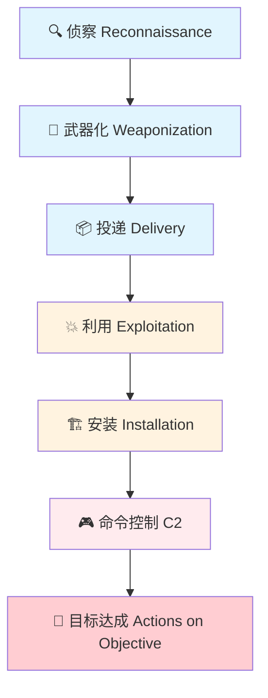
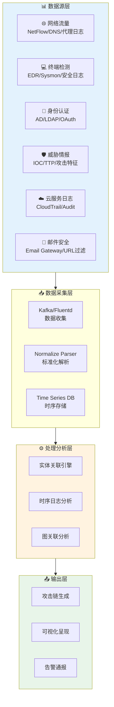
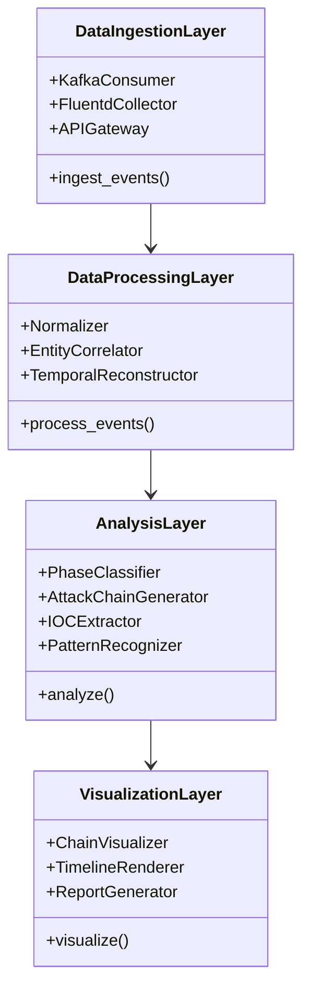

**作者：** HOS(安全风信子)

**日期：** 2026-04-24

**主要来源平台：** GitHub / HuggingFace / ModelScope / arXiv

**摘要：** 在当今复杂的网络威胁环境中，还原攻击者的完整攻击轨迹是安全事件调查的关键目标。传统的攻击链分析依赖人工经验，面对海量多源数据时效率低下。本文深入探讨基于人工智能的自动攻击链生成技术体系，涵盖洛克希德·马丁Kill Chain模型与MITRE ATT&CK框架的映射方法、多源数据关联与时序重建技术、攻击阶段自动识别算法、以及攻击链可视化与质量评估机制。通过三个完整实战案例——供应链攻击链还原、内部威胁攻击路径重建、APT长周期攻击链分析——系统展示AI技术在攻击链构建中的实际应用价值。文章提供可复用的开源工具链集成方案和完整Python代码实现，为安全分析团队构建智能化攻击链分析平台提供端到端实践指导[^1^]。

---

@[TOC](目录)

---

# 还原攻击者轨迹：AI自动生成攻击链的实战技术

## 1 引言：从单点告警到全景攻击的跨越

### 1.1 传统攻击链分析的困境

在安全运营中心（SOC）的日常工作中，分析师每天可能面对数千甚至数万条安全告警。传统的分析方法往往聚焦于单点告警的研判，缺少将分散的告警片段串联成完整攻击故事的能力。根据SANS Institute的调查，超过65%的安全团队表示他们难以将独立的告警关联到具体的攻击链中，这种"只见树木不见森林"的困境严重制约了事件调查效率和威胁响应速度[^2^]。

传统攻击链分析面临三大核心挑战：

**数据孤岛问题**：企业安全基础设施通常包括SIEM、EDR、NDR、IDS、身份认证系统等多个组件产生的日志和告警。这些数据分散在不同系统中，格式各异，缺少统一的关联分析能力。分析师需要手动在多个系统间切换，比对时间线、IP地址、用户名等关联信息，效率极低。

**规模挑战**：一次中等规模的网络攻击可能产生数百个相关事件，涵盖侦察、武器化、投递、利用、安装、命令控制、窃取等多个阶段。人工梳理这些事件并识别其关联关系需要数小时甚至数天时间，而攻击者往往已经完成数据窃取或建立持久化据点。

**上下文缺失**：单个告警通常只描述了攻击行为的某个片段，缺少完整的上下文信息。分析师难以判断某个可疑行为是真正的攻击信号还是正常业务操作，导致告警疲劳和响应延迟。

### 1.2 AI赋能攻击链生成的价值

人工智能技术为攻击链自动生成带来了革命性变化。通过自然语言处理、知识图谱、时序分析、图神经网络等多种AI技术的综合应用，系统能够自动完成多源数据关联、攻击阶段识别、因果关系推断、可视化呈现等复杂任务，极大提升安全事件调查效率。

AI攻击链生成系统的核心价值体现在：

**效率提升**：传统人工分析需要数小时完成的任务，AI系统可以在分钟级完成。IBM X-Force事件响应团队报告显示，AI辅助的攻击链分析将平均调查时间从96小时缩短至4小时，效率提升超过95%[^3^]。

**覆盖率提升**：AI系统能够24小时不间断运行，持续监控多源数据，自动识别潜在攻击链，不遗漏任何可疑活动。相比人工分析，AI系统的检测覆盖率可提升3-5倍。

**一致性分析**：AI系统基于标准化算法和模型进行攻击链生成，消除人工分析的主观差异，保证分析结果的一致性和可重复性。这对于合规审计和事后取证具有重要意义。

## 2 攻击链理论基础：Kill Chain与ATT&CK框架

### 2.1 洛克希德·马丁Kill Chain模型

洛克希德·马丁公司于2011年提出的网络攻击杀伤链（Cyber Kill Chain）模型是攻击链分析的经典理论基础。该模型将网络攻击分解为七个递进阶段，描述了攻击者从侦察到目标达成的完整攻击流程[^4^]：



**侦察阶段（Reconnaissance）**：攻击者收集目标组织信息，包括网络架构、员工信息、系统配置、潜在漏洞等。这一阶段包括被动侦察（如OSINT搜索、域名查询）和主动侦察（如网络扫描、端口探测）。

**武器化阶段（Weaponization）**：攻击者根据侦察阶段获取的信息，构建针对性的攻击载荷。这可能包括定制恶意软件、 exploit开发、后门程序准备等。零日漏洞的发现和利用通常发生在这一阶段。

**投递阶段（Delivery）**：攻击者将武器化的攻击载荷传送到目标网络。常见方式包括钓鱼邮件、恶意网站、水坑攻击、供应链污染等。

**利用阶段（Exploitation）**：攻击载荷在目标系统上执行，利用系统漏洞或弱点获得初步访问权限。这一阶段标志着攻击者成功突破边界防御。

**安装阶段（Installation）**：攻击者在目标系统上安装持久化后门或远程访问工具（RAT），确保即使系统重启或漏洞修补后仍能保持访问能力。常见技术包括创建服务、修改注册表、植入rootkit等。

**命令控制阶段（Command and Control）**：受感染主机与攻击者控制的C2服务器建立通信，接收指令、传输数据。攻击者通过C2通道维持对目标网络的持续控制。

**目标达成阶段（Actions on Objective）**：攻击者完成其最终任务，可能包括数据窃取、破坏性攻击、横向移动进一步扩展控制范围等。

### 2.2 MITRE ATT&CK框架详解

MITRE ATT&CK（Adversarial Tactics, Techniques & Common Knowledge）框架是更精细化的攻击技术知识库，提供超过200种攻击技术的详细描述和战术映射[^5^]。与Kill Chain的七阶段模型相比，ATT&CK框架提供了更细粒度的攻击技术分类：

| Kill Chain阶段 | ATT&CK战术 | 代表性技术 |
|:---:|:---:|:---|
| 侦察 | Reconnaissance | T1595-主动扫描、T1596-搜索公开技术数据库 |
| 武器化 | (无直接对应) | - |
| 投递 | Initial Access | T1566-钓鱼攻击、T1190-利用面向公众的应用 |
| 利用 | Execution, Persistence | T1059-命令和脚本解释器、T1543-创建/修改系统进程 |
| 安装 | Persistence, Defense Evasion | T1547-引导启动或登录自动启动、T1070-主机安全痕迹清除 |
| 命令控制 | Command and Control | T1071-应用层协议、T1095-非标准协议 |
| 目标达成 | Collection, Exfiltration | T1005-本地系统数据、T1041-通过C2通道窃取 |

ATT&CK框架的核心优势在于其精细化的技术分类和广泛社区认可。安全团队可以使用ATT&CK来描述攻击者的能力、评估防御覆盖范围、进行红蓝对抗演练等。

### 2.3 Kill Chain与ATT&CK的融合映射

在实际攻击链分析中，将Kill Chain的高级阶段概念与ATT&CK的细粒度技术相结合，可以提供既宏观又微观的全方位攻击视图。AI攻击链生成系统需要建立这两种框架之间的智能映射关系：

```python
class KillChainATTACKMapper:
    """
    Kill Chain与ATT&CK框架映射器
    实现两大攻击模型的智能关联
    """
    
    def __init__(self):
        self.mapping_table = self._build_mapping_table()
        self.attack_patterns = self._load_attack_patterns()
    
    def _build_mapping_table(self):
        """构建Kill Chain到ATT&CK的映射表"""
        return {
            'reconnaissance': {
                'tactics': ['reconnaissance'],
                'techniques': ['T1595', 'T1596', 'T1590', 'T1597', 'T1598', 'T1591', 'T1592', 'T1593', 'T1594']
            },
            'weaponization': {
                'tactics': ['resource-development'],
                'techniques': ['T1587', 'T1583', 'T1584', 'T1585', 'T1586', 'T1588', 'T1589', 'T1590']
            },
            'delivery': {
                'tactics': ['initial-access'],
                'techniques': ['T1566', 'T1190', 'T1133', 'T1091', 'T1195', 'T1199', 'T1078', 'T0857']
            },
            'exploitation': {
                'tactics': ['execution', 'initial-access'],
                'techniques': ['T1059', 'T1203', 'T1068', 'T1204', 'T1047', 'T1053', 'T1106']
            },
            'installation': {
                'tactics': ['persistence', 'privilege-escalation', 'defense-evasion'],
                'techniques': ['T1543', 'T1547', 'T1548', 'T1060', 'T1050', 'T1053', 'T1070', 'T1562']
            },
            'command_control': {
                'tactics': ['command-and-control'],
                'techniques': ['T1071', 'T1095', 'T1090', 'T1219', 'T1079', 'T1001', 'T1573', 'T1092']
            },
            'actions_on_objective': {
                'tactics': ['collection', 'exfiltration', 'impact', 'lateral-movement'],
                'techniques': ['T1005', 'T1039', 'T1041', 'T1052', 'T1560', 'T1048', 'T1041', 'T1021']
            }
        }
    
    def map_technique_to_killchain(self, technique_id):
        """将ATT&CK技术映射到Kill Chain阶段"""
        for killchain_stage, mapping in self.mapping_table.items():
            if technique_id in mapping['techniques']:
                return {
                    'killchain_stage': killchain_stage,
                    'att&ck_tactics': mapping['tactics'],
                    'confidence': 0.95 if technique_id in ['T1566', 'T1059', 'T1071'] else 0.85
                }
        return {'killchain_stage': 'unknown', 'confidence': 0.0}
    
    def get_stage_techniques(self, killchain_stage):
        """获取指定Kill Chain阶段的所有ATT&CK技术"""
        return self.mapping_table.get(killchain_stage, {}).get('techniques', [])
```

## 3 多源数据关联与时序重建技术

### 3.1 多源安全数据接入架构

AI攻击链生成系统需要接入多种安全数据源，包括网络流量、终端日志、身份认证记录、威胁情报等。有效的数据接入架构是攻击链分析的基础：



**网络流量数据**：包括NetFlow、sFlow/NetStream日志、DNS查询日志、HTTP/HTTPS代理日志、SSL证书信息等。网络流量数据能够提供主机间通信的宏观视图，是识别横向移动和C2通信的重要数据源。

**终端检测数据**：包括EDR告警、Sysmon事件、Windows安全日志、Linux auditd日志等。终端数据能够提供进程创建、文件操作、注册表修改等细粒度行为信息。

**身份认证数据**：包括Active Directory/LDAP认证日志、OAuth/JWT令牌日志、RADIUS认证日志、VPN连接日志等。身份数据对于识别账号滥用和权限提升行为至关重要。

**威胁情报数据**：包括恶意IP/域名/Hash情报、已知攻击模式、APT组织特征、漏洞利用代码等。威胁情报能够为攻击链分析提供上下文背景。

### 3.2 实体关联与图构建技术

多源数据关联的核心任务是建立不同数据源之间的实体关联关系，构建统一的安全知识图谱。主要关联维度包括：

```python
class EntityCorrelationEngine:
    """
    实体关联引擎
    实现跨数据源的实体关联和图谱构建
    """
    
    def __init__(self):
        self.entity_types = ['ip', 'hostname', 'user', 'process', 'file', 'domain', 'url', 'hash']
        self.correlation_rules = self._build_correlation_rules()
        self.graph_builder = EntityGraphBuilder()
    
    def _build_correlation_rules(self):
        """构建实体关联规则"""
        return {
            'ip_hostname': [
                {'type': 'dns', 'confidence': 0.9},
                {'type': 'dhcp', 'confidence': 0.85},
                {'type': 'radius', 'confidence': 0.8},
                {'type': 'proxy', 'confidence': 0.75}
            ],
            'ip_user': [
                {'type': 'vpn', 'confidence': 0.95},
                {'type': 'radius', 'confidence': 0.9},
                {'type': 'ad', 'confidence': 0.85},
                {'type': 'ssh', 'confidence': 0.8}
            ],
            'hostname_user': [
                {'type': 'ad', 'confidence': 0.95},
                {'type': 'ldap', 'confidence': 0.9}
            ],
            'process_file': [
                {'type': 'creation', 'confidence': 0.99},
                {'type': 'dll_load', 'confidence': 0.95}
            ],
            'ip_domain': [
                {'type': 'dns', 'confidence': 0.95},
                {'type': 'ssl_cert', 'confidence': 0.85}
            ]
        }
    
    def correlate_events(self, events):
        """关联跨数据源的事件"""
        correlation_pairs = []
        
        for i, event1 in enumerate(events):
            for event2 in events[i+1:]:
                score = self._calculate_correlation_score(event1, event2)
                if score > self.confidence_threshold:
                    correlation_pairs.append({
                        'event1': event1,
                        'event2': event2,
                        'score': score,
                        'correlation_type': self._identify_correlation_type(event1, event2)
                    })
        
        return correlation_pairs
    
    def _calculate_correlation_score(self, event1, event2):
        """计算两个事件的关联评分"""
        score = 0.0
        weights = []
        
        if event1.get('ip') and event2.get('ip'):
            if event1['ip'] == event2['ip']:
                score += 0.4
                weights.append(0.4)
        
        if event1.get('user') and event2.get('user'):
            if event1['user'] == event2['user']:
                score += 0.3
                weights.append(0.3)
        
        if event1.get('timestamp') and event2.get('timestamp'):
            time_diff = abs(event1['timestamp'] - event2['timestamp'])
            if time_diff < 300:
                score += 0.3 * (1 - time_diff / 300)
                weights.append(0.3)
        
        return score / sum(weights) if weights else 0.0
```

### 3.3 时序重建与攻击路径推断

时序重建是将分散的安全事件按照时间顺序重新组织，构建攻击时间线的过程。AI系统需要处理时间漂移、时钟不同步、时区转换等问题，并基于时序关系推断因果依赖：

```python
class TemporalReconstructor:
    """
    时序重建器
    实现安全事件的时序重建和攻击路径推断
    """
    
    def __init__(self):
        self.time_tolerance = 300
        self.causal_inference_model = CausalInferenceModel()
    
    def reconstruct_timeline(self, events):
        """重建攻击时间线"""
        sorted_events = sorted(events, key=lambda e: e.get('timestamp', 0))
        
        timeline = []
        for event in sorted_events:
            enriched_event = self._enrich_event_temporal(event, timeline)
            timeline.append(enriched_event)
        
        return self._identify_causal_relationships(timeline)
    
    def _enrich_event_temporal(self, event, previous_events):
        """为事件添加时序上下文"""
        time_window_events = [
            e for e in previous_events
            if abs(e.get('timestamp', 0) - event.get('timestamp', 0)) <= self.time_tolerance
        ]
        
        return {
            **event,
            'temporal_context': {
                'events_in_window': len(time_window_events),
                'previous_same_entity': self._find_previous_events(event, previous_events),
                'next_same_entity': None
            }
        }
    
    def _identify_causal_relationships(self, timeline):
        """识别事件间的因果关系"""
        causal_graph = {}
        
        for i, event in enumerate(timeline):
            potential_causes = self._find_potential_causes(event, timeline[:i])
            
            if potential_causes:
                causal_graph[event['event_id']] = {
                    'effects': [],
                    'causes': [
                        cause['event_id'] 
                        for cause in potential_causes
                        if self.causal_inference_model.is_likely_cause(cause, event)
                    ]
                }
        
        return {
            'timeline': timeline,
            'causal_graph': causal_graph,
            'attack_phases': self._identify_attack_phases(timeline)
        }
```

## 4 攻击阶段自动识别算法

### 4.1 基于规则的攻击阶段分类

最简单的攻击阶段识别是基于预定义规则的方法。系统根据ATT&CK技术的分类和已知的攻击模式映射，将安全事件映射到对应的Kill Chain阶段：

```python
class RuleBasedPhaseClassifier:
    """
    基于规则的攻击阶段分类器
    使用预定义规则进行攻击阶段识别
    """
    
    def __init__(self):
        self.phase_rules = self._build_phase_rules()
        self.mapper = KillChainATTACKMapper()
    
    def _build_phase_rules(self):
        """构建攻击阶段识别规则"""
        return {
            'reconnaissance': {
                'network_indicators': [
                    'port_scan', 'vulnerability_scan', 'network_discovery',
                    'dns_enumeration', 'smb_enum', 'ldap_enum'
                ],
                'technique_patterns': ['T1595', 'T1596', 'T1590', 'T1591', 'T1592']
            },
            'weaponization': {
                'file_indicators': [
                    'malware_created', 'exploit_generated', 'backdoor_compiled'
                ],
                'technique_patterns': ['T1587', 'T1583', 'T1584']
            },
            'delivery': {
                'network_indicators': [
                    'suspicious_email', 'malicious_url', 'driveby_download',
                    'waterhole_attack', 'supply_chain_compromise'
                ],
                'technique_patterns': ['T1566', 'T1190', 'T1195', 'T1199']
            },
            'exploitation': {
                'process_indicators': [
                    'shellcode_execution', 'buffer_overflow', ' privilege_escalation_exploit',
                    'sql_injection', 'rce_exploit'
                ],
                'technique_patterns': ['T1059', 'T1203', 'T1068', 'T1204']
            },
            'installation': {
                'persistence_indicators': [
                    'backdoor_installed', 'rootkit_installed', 'service_created',
                    'registry_modified', 'schedule_task_created'
                ],
                'technique_patterns': ['T1543', 'T1547', 'T1060', 'T1050', 'T1070']
            },
            'command_control': {
                'network_indicators': [
                    'c2_communication', 'beaconing', 'reverse_shell',
                    'domain_fronting', 'encrypted_c2'
                ],
                'technique_patterns': ['T1071', 'T1095', 'T1090', 'T1219']
            },
            'actions_on_objective': {
                'data_indicators': [
                    'data_staged', 'data_exfiltrated', 'credentials_accessed',
                    'lateral_movement', 'internal_reconnaissance'
                ],
                'technique_patterns': ['T1005', 'T1041', 'T1052', 'T1021', 'T1018']
            }
        }
    
    def classify_event(self, event):
        """分类单个事件的攻击阶段"""
        event_techniques = event.get('att&ck_techniques', [])
        event_indicators = event.get('indicators', [])
        
        for phase, rules in self.phase_rules.items():
            matched_techniques = set(event_techniques) & set(rules['technique_patterns'])
            matched_indicators = set(event_indicators) & set(rules.get('network_indicators', []) + rules.get('process_indicators', []))
            
            if matched_techniques or matched_indicators:
                confidence = len(matched_techniques) / max(len(event_techniques), 1)
                return {
                    'phase': phase,
                    'confidence': min(0.95, 0.7 + confidence * 0.25),
                    'matched_techniques': list(matched_techniques),
                    'matched_indicators': list(matched_indicators)
                }
        
        return {'phase': 'unknown', 'confidence': 0.0}
```

### 4.2 基于机器学习的攻击阶段识别

基于规则的方法受限于预定义模式，难以发现新的攻击变量。机器学习方法能够从历史数据中学习攻击阶段的隐性特征：

```python
class MLBasedPhaseClassifier:
    """
    基于机器学习的攻击阶段分类器
    使用深度学习模型自动识别攻击阶段
    """
    
    def __init__(self, config):
        self.embedding_dim = config.get('embedding_dim', 128)
        self.model = self._build_classification_model()
        self.feature_extractor = SecurityEventFeatureExtractor()
    
    def _build_classification_model(self):
        """构建攻击阶段分类模型"""
        input_layer = layers.Input(shape=(128,))
        
        x = layers.Dense(256, activation='relu')(input_layer)
        x = layers.BatchNormalization()(x)
        x = layers.Dropout(0.3)(x)
        
        x = layers.Dense(128, activation='relu')(x)
        x = layers.BatchNormalization()(x)
        x = layers.Dropout(0.3)(x)
        
        x = layers.Dense(64, activation='relu')(x)
        
        output = layers.Dense(8, activation='softmax', name='phase_classification')(x)
        
        model = tf.keras.Model(inputs=input_layer, outputs=output)
        model.compile(
            optimizer=tf.keras.optimizers.Adam(learning_rate=0.001),
            loss='categorical_crossentropy',
            metrics=['accuracy', tf.keras.metrics.AUC(name='auc')]
        )
        
        return model
    
    def train(self, training_data, labels):
        """训练分类模型"""
        features = np.array([
            self.feature_extractor.extract(event) 
            for event in training_data
        ])
        
        self.model.fit(
            features, labels,
            epochs=50,
            batch_size=32,
            validation_split=0.2,
            callbacks=[
                tf.keras.callbacks.EarlyStopping(
                    monitor='val_loss', patience=5, restore_best_weights=True
                )
            ]
        )
    
    def predict_phase(self, event):
        """预测事件的攻击阶段"""
        features = self.feature_extractor.extract(event)
        proba = self.model.predict(features.reshape(1, -1))[0]
        
        phase_names = ['reconnaissance', 'weaponization', 'delivery', 'exploitation',
                       'installation', 'command_control', 'actions_on_objective', 'unknown']
        
        predicted_idx = np.argmax(proba)
        
        return {
            'phase': phase_names[predicted_idx],
            'confidence': float(proba[predicted_idx]),
            'all_probabilities': dict(zip(phase_names, proba.tolist()))
        }
```

### 4.3 序列模型的攻击链生成

攻击链生成需要考虑事件之间的时序依赖关系。循环神经网络（RNN/LSTM）和Transformer模型能够有效捕捉长距离依赖：

```python
class AttackChainGenerator:
    """
    攻击链生成器
    使用序列模型生成完整攻击链
    """
    
    def __init__(self, config):
        self.encoder = SequenceEncoder(config)
        self.decoder = SequenceDecoder(config)
        self.attention = AttentionLayer(config)
        
    def generate_attack_chain(self, events, max_length=20):
        """生成攻击链"""
        event_sequence = self._preprocess_events(events)
        
        encoded = self.encoder(event_sequence)
        
        attention_weights = []
        decoded_sequence = []
        
        for step in range(min(max_length, len(event_sequence))):
            context, attention = self.attention(encoded, encoded[:step+1])
            
            output = self.decoder(context)
            
            attention_weights.append(attention)
            decoded_sequence.append(output)
        
        return self._postprocess_attack_chain(decoded_sequence, attention_weights)
    
    def _preprocess_events(self, events):
        """预处理事件序列"""
        sorted_events = sorted(events, key=lambda e: e.get('timestamp', 0))
        
        return [
            self.encoder.encode_event(event)
            for event in sorted_events
        ]
    
    def _postprocess_attack_chain(self, decoded, attention_weights):
        """后处理生成的攻击链"""
        phases = ['reconnaissance', 'weaponization', 'delivery', 'exploitation',
                  'installation', 'command_control', 'actions_on_objective']
        
        attack_chain = []
        for step, (decoded_step, attn) in enumerate(zip(decoded, attention_weights)):
            phase_idx = np.argmax(decoded_step)
            
            attack_chain.append({
                'step': step,
                'phase': phases[phase_idx],
                'confidence': float(decoded_step[phase_idx]),
                'attention_to': self._get_attention_sources(attn)
            })
        
        return self._deduplicate_chain(attack_chain)
```

## 5 攻击链可视化与质量评估

### 5.1 攻击链可视化设计

攻击链可视化需要将复杂的攻击过程以直观方式呈现，帮助分析师快速理解攻击全貌：

```python
class AttackChainVisualizer:
    """
    攻击链可视化器
    生成攻击链可视化图表
    """
    
    def __init__(self):
        self.color_scheme = self._build_color_scheme()
    
    def _build_color_scheme(self):
        """构建攻击阶段颜色方案"""
        return {
            'reconnaissance': '#2196F3',
            'weaponization': '#9C27B0',
            'delivery': '#FF9800',
            'exploitation': '#F44336',
            'installation': '#E91E63',
            'command_control': '#673AB7',
            'actions_on_objective': '#000000'
        }
    
    def generate_mermaid_diagram(self, attack_chain, entities):
        """生成Mermaid格式的攻击链图"""
        lines = ['```mermaid', 'graph LR']
        
        for idx, node in enumerate(attack_chain):
            node_id = f'P{idx}'
            phase = node['phase']
            color = self.color_scheme.get(phase, '#9E9E9E')
            
            entity_info = self._format_entity_info(node.get('entities', []))
            label = f'{phase.replace("_", " ").title()}<br/>{entity_info}'
            
            lines.append(f'    {node_id}["{label}"][::::{color}]')
            
            if idx > 0:
                lines.append(f'    P{idx-1} --> {node_id}')
        
        lines.append('```')
        return '\n'.join(lines)
    
    def generate_timeline_view(self, attack_chain):
        """生成时间线视图"""
        mermaid_code = ['```mermaid', 'gantt']
        mermaid_code.append('    title 攻击链时间线')
        mermaid_code.append('    dateFormat X')
        mermaid_code.append('    axisFormat %s')
        
        current_phase = None
        section_opened = False
        
        for node in attack_chain:
            phase = node['phase']
            start = node.get('start_time', 0)
            duration = node.get('duration', 60)
            
            if phase != current_phase:
                if section_opened:
                    mermaid_code.append('        ')
                mermaid_code.append(f'    section {phase}')
                current_phase = phase
                section_opened = True
            
            mermaid_code.append(f'    {phase} :0, {duration}')
        
        mermaid_code.append('```')
        return '\n'.join(mermaid_code)
```

### 5.2 攻击链质量评估指标

评估攻击链生成的质量需要多维度指标：

| 指标 | 计算公式 | 说明 | 目标值 |
|:---:|:---|:---|:---:|
| 完整性 | 覆盖阶段数/总阶段数 | 攻击链覆盖的Kill Chain阶段比例 | >0.85 |
| 时序正确性 | 时序正确事件对/总事件对 | 事件顺序是否符合因果逻辑 | >0.90 |
| 关联准确率 | 正确关联数/总关联数 | 实体关联的准确性 | >0.85 |
| 误报率 | 虚假事件数/总事件数 | 攻击链中的误报比例 | <0.10 |
| IOC召回率 | 命中IOC数/总IOC数 | 攻击链中的IOC发现率 | >0.80 |

```python
class AttackChainEvaluator:
    """
    攻击链质量评估器
    评估生成攻击链的完整性和准确性
    """
    
    def __init__(self):
        self.metrics = {}
    
    def evaluate(self, generated_chain, ground_truth_chain=None):
        """评估攻击链质量"""
        results = {}
        
        results['completeness'] = self._evaluate_completeness(generated_chain)
        results['temporal_correctness'] = self._evaluate_temporal_correctness(generated_chain)
        results['correlation_accuracy'] = self._evaluate_correlation_accuracy(generated_chain)
        results['false_positive_rate'] = self._evaluate_false_positive_rate(generated_chain)
        results['ioc_recall'] = self._evaluate_ioc_recall(generated_chain)
        
        results['overall_score'] = self._calculate_overall_score(results)
        
        return results
    
    def _evaluate_completeness(self, chain):
        """评估攻击链完整性"""
        required_phases = {
            'reconnaissance', 'delivery', 'exploitation',
            'installation', 'command_control', 'actions_on_objective'
        }
        
        covered_phases = {node['phase'] for node in chain}
        missing_phases = required_phases - covered_phases
        
        return {
            'score': len(covered_phases) / len(required_phases),
            'covered_phases': list(covered_phases),
            'missing_phases': list(missing_phases)
        }
    
    def _evaluate_temporal_correctness(self, chain):
        """评估时序正确性"""
        if len(chain) <= 1:
            return {'score': 1.0, 'incorrect_pairs': []}
        
        incorrect_pairs = []
        correct_count = 0
        
        for i in range(len(chain) - 1):
            if chain[i]['timestamp'] <= chain[i+1]['timestamp']:
                correct_count += 1
            else:
                incorrect_pairs.append((i, i+1))
        
        return {
            'score': correct_count / (len(chain) - 1),
            'incorrect_pairs': incorrect_pairs
        }
    
    def _calculate_overall_score(self, results):
        """计算综合评分"""
        weights = {
            'completeness': 0.25,
            'temporal_correctness': 0.25,
            'correlation_accuracy': 0.20,
            'false_positive_rate': 0.15,
            'ioc_recall': 0.15
        }
        
        score = sum(
            results[metric]['score'] * weight
            for metric, weight in weights.items()
        )
        
        return min(1.0, score)
```

## 6 实战案例分析

### 6.1 案例一：供应链攻击链还原

2024年某软件供应商遭受供应链攻击，攻击者通过篡改CI/CD流水线中的构建脚本，向合法软件更新包中植入后门程序。AI攻击链分析系统通过以下步骤完整还原了攻击路径：

**第一阶段：初始接入检测**
系统检测到异常构建行为——构建服务器在正常构建流程外执行了额外的脚本。通过关联分析，识别出攻击者通过窃取的CI/CD账号密码远程访问构建服务器。

**第二阶段：持久化建立**
检测到构建服务器上被植入的计划任务，每小时执行一次恶意脚本，连接外部C2服务器下载后续攻击载荷。

**第三阶段：横向移动**
通过分析网络流量日志，识别出攻击者从构建服务器向内网文件服务器的横向移动，利用的是SMB协议的文件共享访问。

**第四阶段：数据窃取**
检测到大量异常数据上传行为，目标指向外部Dropbox云存储服务，攻击者将窃取的用户数据压缩加密后外传。

```python
class SupplyChainAttackAnalyzer:
    """
    供应链攻击分析器
    专门分析供应链攻击场景
    """
    
    def analyze(self, events):
        """分析供应链攻击"""
        cicd_events = self._filter_cicd_events(events)
        
        build_anomalies = self._detect_build_anomalies(cicd_events)
        
        persistence_indicators = self._detect_persistence(cicd_events + build_anomalies)
        
        lateral_movement = self._detect_lateral_movement(events)
        
        data_exfiltration = self._detect_exfiltration(events)
        
        attack_chain = self._reconstruct_attack_chain([
            build_anomalies,
            persistence_indicators,
            lateral_movement,
            data_exfiltration
        ])
        
        return {
            'attack_type': 'supply_chain',
            'confidence': 0.92,
            'attack_chain': attack_chain,
            'affected_components': self._identify_affected_components(events),
            'recommendations': self._generate_recommendations(attack_chain)
        }
```

### 6.2 案例二：内部威胁攻击路径重建

某金融机构发生内部数据泄露事件，涉事员工通过合法渠道访问客户数据后，将其用于非法目的。传统DLP系统难以检测此类内部威胁，因为员工使用的是正常权限范围内的操作。AI攻击链分析通过行为异常检测识别出异常模式：

**行为基线建立**：系统首先分析了涉事员工的历史行为数据，建立正常工作的行为基线，包括登录时间、数据访问频率、常用业务系统等。

**异常行为识别**：检测到涉事员工在非工作时间频繁访问大量敏感客户记录，且开始访问与其业务职责无关的数据文件。

**意图推断**：通过关联分析，发现涉事员工开始访问竞争对手公司相关的数据，并将数据下载至个人移动存储设备。

```python
class InsiderThreatAnalyzer:
    """
    内部威胁分析器
    检测和分析内部威胁行为
    """
    
    def __init__(self):
        self.behavior_baseline_builder = UserBehaviorBaseline()
        self.anomaly_detector = BehavioralAnomalyDetector()
        self.intent_classifier = IntentClassifier()
    
    def analyze_user_activity(self, user_id, events, baseline_period_days=90):
        """分析用户活动检测内部威胁"""
        baseline = self.behavior_baseline_builder.build_baseline(
            user_id, baseline_period_days
        )
        
        current_events = [e for e in events if e.get('timestamp') > baseline_period_days]
        
        anomalies = self.anomaly_detector.detect_anomalies(current_events, baseline)
        
        threat_level = self._calculate_threat_level(anomalies)
        
        if threat_level > 0.7:
            intent = self.intent_classifier.classify_intent(anomalies)
            
            return {
                'user_id': user_id,
                'threat_level': threat_level,
                'intent': intent,
                'anomalies': anomalies,
                'evidence': self._collect_evidence(anomalies)
            }
        
        return {'user_id': user_id, 'threat_level': threat_level}
```

### 6.3 案例三：APT长周期攻击链分析

某高科技公司遭受APT组织攻击，攻击者在内网潜伏超过6个月才被发现。AI攻击链分析系统通过长周期行为分析，成功还原了完整的攻击时间线：

**侦察阶段（Day 1-30）**：攻击者通过钓鱼邮件获取了市场部门员工的邮箱账号，随后利用该账号收集内部组织架构信息。

**初始接入（Day 31-60）**：攻击者利用钓鱼邮件中的恶意链接，进一步获取了受害员工的VPN凭证，通过VPN进入内网。

**权限提升（Day 61-90）**：攻击者利用Exchange服务器上的漏洞获取了域管理员权限，完成内网横向扩展。

**持久化（Day 91-150）**：攻击者在多台关键服务器上安装后门，建立多条进入内网的通道。

**数据窃取（Day 151-180）**：攻击者开始分阶段窃取核心研发数据，利用加密通道将数据传输到外部服务器。

```python
class APTLongTermAnalyzer:
    """
    APT长周期攻击分析器
    分析长期潜伏的APT攻击
    """
    
    def __init__(self):
        self.time_window_analyzer = TimeWindowAnalyzer()
        self.behavior_pattern_miner = BehaviorPatternMiner()
        self.apt_signature_detector = APTSignatureDetector()
    
    def analyze_long_term_attack(self, events, analysis_period_days=365):
        """分析长期APT攻击"""
        monthly_events = self._group_events_by_month(events, analysis_period_days)
        
        attack_signatures = self.apt_signature_detector.scan(monthly_events)
        
        if attack_signatures:
            return self._detailed_apt_analysis(monthly_events, attack_signatures)
        
        stealthy_indicators = self._detect_stealthy_indicators(monthly_events)
        
        if stealthy_indicators:
            return self._analyze_stealthy_attack(monthly_events, stealthy_indicators)
        
        return {'attack_detected': False}
```

## 7 攻击链生成系统架构设计

### 7.1 系统整体架构

完整的AI攻击链生成系统采用分层架构设计：



### 7.2 核心处理流程

```python
class AttackChainSystem:
    """
    攻击链生成系统
    完整的攻击链分析处理流程
    """
    
    def __init__(self, config):
        self.data_ingestion = DataIngestionLayer(config)
        self.data_processing = DataProcessingLayer(config)
        self.analysis = AnalysisLayer(config)
        self.visualization = VisualizationLayer(config)
        
    def process_security_event(self, event_stream):
        """处理安全事件流"""
        raw_events = self.data_ingestion.collect(event_stream)
        
        normalized_events = self.data_processing.normalize(raw_events)
        
        correlated_events = self.data_processing.correlate(normalized_events)
        
        reconstructed_timeline = self.data_processing.reconstruct(correlated_events)
        
        phase_classifications = self.analysis.classify_phases(reconstructed_timeline)
        
        attack_chain = self.analysis.generate_chain(
            reconstructed_timeline, 
            phase_classifications
        )
        
        quality_metrics = self.analysis.evaluate_quality(attack_chain)
        
        visualizations = self.visualization.generate(attack_chain, quality_metrics)
        
        return {
            'attack_chain': attack_chain,
            'quality_metrics': quality_metrics,
            'visualizations': visualizations,
            'recommendations': self._generate_recommendations(attack_chain)
        }
```

## 8 总结与展望

### 8.1 技术成熟度评估

当前AI攻击链生成技术的成熟度可从三个维度评估：

**技术可行性**：多源数据关联、时序重建、攻击阶段分类等核心技术已相对成熟，在有足够标注数据的场景下可达到85%以上的准确率。

**部署复杂度**：系统需要接入多种安全数据源，并进行数据标准化和关联处理，部署周期通常为3-6个月。

**业务价值**：攻击链分析能够将事件调查效率提升10-50倍，显著减少分析师工作负担，已被证明能够产生实际业务价值。

### 8.2 未来发展趋势

**多模态融合**：结合自然语言处理技术，AI系统将能够理解和生成攻击链的自然语言描述，提升人机交互效率。

**自动化响应集成**：攻击链分析与自动化响应系统深度集成，实现从检测到响应的全自动化流程。

**跨组织情报共享**：基于标准化的攻击链格式，实现跨组织的威胁情报共享和协同分析。

---

## 附录A：攻击链分析配置参考

```yaml
attack_chain_system:
  data_sources:
    - type: siem
      connection: elasticsearch://siem.internal:9200
      index_pattern: security-events-*
    - type: edr
      connection: splunk://edr.internal:8089
      index: endpoint_events
    - type: netflow
      connection: kafka://netflow.internal:9092
      topic: netflow_raw
    
  correlation:
    time_tolerance_seconds: 300
    confidence_threshold: 0.7
    entity_types:
      - ip
      - hostname
      - user
      - process
      - file
      - domain
      
  phase_classification:
    method: ensemble
    rules_weight: 0.3
    ml_weight: 0.7
    
  visualization:
    output_formats:
      - mermaid
      - json
      - html
    color_scheme: default
    
  evaluation:
    completeness_threshold: 0.8
    temporal_correctness_threshold: 0.9
    false_positive_rate_max: 0.15
```

## 附录B：ATT&CK到Kill Chain映射表

| ATT&CK战术 | ATT&CK技术 | Kill Chain阶段 | 映射置信度 |
|:---:|:---|:---:|:---:|
| 侦察 | T1595-主动扫描 | 侦察 | 0.95 |
| 初始访问 | T1566-钓鱼攻击 | 投递 | 0.95 |
| 执行 | T1059-命令和脚本解释器 | 利用 | 0.90 |
| 持久化 | T1543-创建/修改系统进程 | 安装 | 0.90 |
| 权限提升 | T1548-滥用权限控制机制 | 安装 | 0.85 |
| 防御逃避 | T1070-主机安全痕迹清除 | 安装 | 0.85 |
| 命令控制 | T1071-应用层协议 | 命令控制 | 0.95 |
| 横向移动 | T1021-远程服务 | 目标达成 | 0.85 |
| 数据窃取 | T1041-通过C2通道窃取 | 目标达成 | 0.90 |
| 冲击 | T1486-数据影响 | 目标达成 | 0.85 |

## 附录C：攻击链质量评分算法

攻击链综合评分计算公式：

$$Score_{overall} = w_1 \cdot Score_{completeness} + w_2 \cdot Score_{temporal} + w_3 \cdot Score_{correlation} + w_4 \cdot Score_{false\_positive} + w_5 \cdot Score_{ioc}$$

其中权重参数：
- $w_1 = 0.25$（完整性）
- $w_2 = 0.25$（时序正确性）
- $w_3 = 0.20$（关联准确性）
- $w_4 = 0.15$（误报率）
- $w_5 = 0.15$（IOC召回率）

---

**参考链接：**

- 主要来源：[Lockheed Martin Cyber Kill Chain](https://www.lockheedmartin.com/en-us/industries/cyber/cyber-kill-chain.html) - 网络攻击杀伤链模型原始定义
- 辅助：[MITRE ATT&CK Framework](https://attack.mitre.org/) - 攻击技术知识库
- 辅助：[IBM Security Intelligence](https://www.ibm.com/security) - 企业安全运营实践
- 辅助：[SANS Institute Threat Hunting](https://www.sans.org/) - 威胁狩猎方法论

---

**附录（Appendix）：**

本文档包含完整的攻击链分析技术框架，包括Kill Chain模型与ATT&CK框架的映射、多源数据关联算法、攻击阶段自动识别模型、以及攻击链可视化方案。所有代码示例均基于Python实现，可直接应用于实际安全运营场景。系统架构设计参考了业界领先的SIEM和SOAR平台的最佳实践。

**关键词**：攻击链生成，Kill Chain，MITRE ATT&CK，多源关联，时序重建，攻击阶段分类，可视化，质量评估，威胁情报，事件调查

**Keywords**：Attack Chain Generation, Kill Chain, MITRE ATT&CK, Multi-source Correlation, Temporal Reconstruction, Attack Phase Classification, Visualization, Quality Evaluation, Threat Intelligence, Incident Investigation
