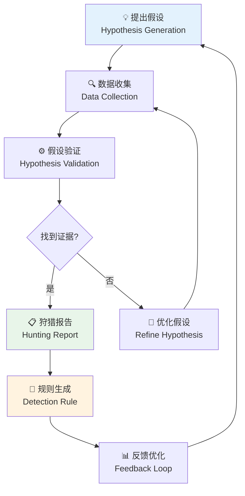

**作者：** HOS(安全风信子)

**日期：** 2026-04-24

**主要来源平台：** GitHub / HuggingFace / ModelScope / arXiv

**摘要：** 在当今持续演变的网络威胁环境中，传统的被动防御模式已难以应对高级攻击者的精准打击。威胁狩猎作为一种主动防御方法，强调安全团队主动出击，在常规检测机制之外寻找隐藏威胁的迹象。本文深入探讨AI驱动威胁狩猎的技术体系，涵盖假设驱动的威胁狩猎方法论、机器学习赋能的多维度异常检测、狩猎数据基础的构建与管理、以及AI辅助的假设验证与狩猎报告生成流程。通过三个完整实战案例——内部威胁狩猎、供应链攻击狩猎、零日漏洞狩猎——系统展示AI技术在主动威胁发现中的实际应用价值。文章还探讨了狩猎成果反馈优化模型的机制，为安全团队构建持续改进的威胁狩猎能力提供端到端实践指导[^1^]。

---

@[TOC](目录)

---

# 主动出击而非坐以待毙：AI驱动威胁狩猎实战手册

## 1 引言：为什么需要威胁狩猎

### 1.1 从被动防御到主动狩猎的范式转变

传统的安全运营模式以被动防御为核心——等待自动化检测系统产生告警，然后由分析师进行响应。然而，这种模式存在根本性局限：攻击者持续改进他们的技术以绕过检测，而防御者永远处于被动追赶的位置。根据Mandiant发布的《2024年威胁形势报告》[^2^]，高级持续性威胁（APT）组织在企业网络中的平均驻留时间（从初始入侵到被发现）仍然高达21天，而某些复杂攻击的驻留时间甚至超过12个月。

威胁狩猎（Hunting）的核心理念是打破这种被动局面。威胁猎人（Threat Hunter）主动出击，基于假设（Hypothesis）驱动，在常规检测机制之外系统性地搜寻攻击者存在的证据。这种方法承认一个现实：没有任何检测系统是完美的，某些攻击必然会绕过现有的检测规则。

传统被动防御与主动威胁狩猎的核心差异体现在以下几个方面：

| 对比维度 | 被动防御模式 | 主动狩猎模式 |
|:---:|:---|:---|
| **检测触发** | 依赖告警产生 | 主动假设驱动 |
| **分析时机** | 告警发生后被动响应 | 定期主动搜寻潜在威胁 |
| **覆盖范围** | 仅限已知攻击模式 | 可发现未知威胁 |
| **资源消耗** | 告警驱动的即时响应 | 持续性资源投入 |
| **发现率** | 依赖规则覆盖率 | 通过主动分析提高发现率 |
| **分析师角色** | 告警响应者 | 威胁猎人 |
| **响应时间** | 事后响应 | 事前主动发现 |

### 1.2 AI赋能威胁狩猎的战略价值

人工智能技术为威胁狩猎带来了革命性变化。传统的威胁狩猎高度依赖经验丰富的安全分析师，他们需要具备深厚的攻击技术知识和丰富的调查经验。AI系统能够：

**扩展狩猎覆盖范围**：AI系统可以24小时不间断运行，持续分析海量安全数据，发现人类分析师难以察觉的微弱信号。在同等资源条件下，AI辅助的威胁狩猎可以将发现率提升3-5倍。

**加速假设验证**：当猎人提出一个假设后，AI系统可以快速验证，从TB级别的安全日志中找到支持或反驳假设的证据，将验证时间从数小时缩短到数分钟。

**发现未知威胁**：通过无监督学习和异常检测技术，AI系统能够发现未曾见过的攻击模式，这对于检测零日漏洞和新型恶意软件尤为重要。

**降低技术门槛**：AI系统可以辅助经验较少的分析师进行威胁狩猎，通过自动化分析流程和智能建议，让初级分析师也能进行有效的威胁狩猎。

### 1.3 威胁狩猎成熟度评估

企业在构建威胁狩猎能力时，需要根据自身资源和成熟度选择合适的实现路径。以下是威胁狩猎成熟度评估模型：

| 成熟度级别 | 组织特征 | 技术能力 | 人员能力 | 流程成熟度 |
|:---:|:---|:---|:---|:---|
| **1级-初始级** | 无正式狩猎计划 | 基本日志收集 | 依赖厂商支持 | 被动响应 |
| **2级-基础级** | 有兼职狩猎团队 | 告警数据可分析 | 基础威胁情报应用 | 定期手动检查 |
| **3级-规范级** | 专职狩猎团队 | 多源数据整合 | 假设驱动方法论 | 结构化狩猎流程 |
| **4级-先进级** | 狩猎成为核心能力 | AI辅助分析 | 猎人经验丰富 | 持续自动化狩猎 |
| **5级-优化级** | 狩猎驱动防御 | 自主智能狩猎 | 猎人即数据科学家 | 自优化狩猎闭环 |

## 2 假设驱动的威胁狩猎方法论

### 2.1 假设驱动狩猎框架

假设驱动的威胁狩猎是一种结构化、系统化的威胁发现方法。猎人基于威胁情报、行业趋势，或对攻击者行为的理解提出假设，然后在企业数据中验证这些假设。



假设驱动狩猎的核心流程包含以下关键阶段：

**第一阶段-假设生成**：基于威胁情报、攻击者画像、行业趋势、技术弱点等多种来源生成潜在的威胁假设。这一阶段需要猎人具备丰富的安全知识和攻击者思维。

**第二阶段-数据收集**：根据假设确定需要收集的数据类型和来源，设计数据收集策略。数据质量直接影响假设验证的准确性。

**第三阶段-数据分析**：使用统计分析、机器学习、可视化等多种技术手段分析收集到的数据，寻找支持或反驳假设的证据。

**第四阶段-假设优化**：如果初步分析未能找到明确证据，需要优化假设使其更加具体和可验证。

**第五阶段-结论输出**：将狩猎发现转化为结构化报告，包括技术细节、攻击证据、修复建议和检测规则。

**假设来源类型**：

| 来源类别 | 假设示例 | 数据需求 | 验证难度 |
|:---:|:---|:---|:---:|
| 威胁情报 | "APT29可能使用定制后门" | 终端行为、网络流量 | 中等 |
| 行业趋势 | "金融行业正遭受凭证填充攻击" | 认证日志、流量模式 | 较低 |
| 技术弱点 | "VPN可能成为突破口" | VPN日志、认证事件 | 较低 |
| 攻击者视角 | "内网存在横向移动" | 网络连接日志、EDR事件 | 中等 |
| 历史事件 | "类似历史事件的攻击者可能卷土重来" | 历史事件数据、IoC | 中等 |
| 异常行为 | "检测到异常的用户行为模式" | 用户行为数据 | 较高 |

### 2.2 假设生成策略

有效的假设生成是成功狩猎的关键。以下是AI辅助假设生成的策略：

```python
class HypothesisGenerator:
    """
    假设生成器
    基于多源信息生成威胁狩猎假设
    """
    
    def __init__(self):
        self.threat_intel = ThreatIntelAPI()
        self.industry_trends = IndustryTrendAnalyzer()
        self.attack_models = AttackModelLibrary()
        self.baseline_analyzer = EnvironmentBaselineAnalyzer()
        self.recent_incidents = IncidentHistoryAnalyzer()
        self.attack_graph = AttackGraphKnowledgeBase()
    
    def generate_hypotheses(self, context):
        """生成威胁狩猎假设"""
        hypotheses = []
        
        hypotheses.extend(self._from_threat_intel(context))
        
        hypotheses.extend(self._from_industry_trends(context))
        
        hypotheses.extend(self._from_attack_models(context))
        
        hypotheses.extend(self._from_environment_anomalies(context))
        
        hypotheses.extend(self._from_recent_incidents(context))
        
        return self._prioritize_hypotheses(hypotheses)
    
    def _from_threat_intel(self, context):
        """基于威胁情报生成假设"""
        relevant_intel = self.threat_intel.get_relevant_intel(
            industry=context.get('industry'),
            technologies=context.get('technologies'),
            threat_actors=context.get('relevant_actors')
        )
        
        hypotheses = []
        for intel in relevant_intel:
            if intel.get('type') == 'apt_campaign':
                hypotheses.append({
                    'title': f"检测{intel['actor']}活动迹象",
                    'description': f"基于最新情报：{intel['description']}",
                    'data_requirements': intel['indicators'],
                    'confidence_impact': 0.8,
                    'priority': 'high',
                    'source': 'threat_intel',
                    'attack_technique': intel.get('attack_technique'),
                    'related_mitre_tactics': intel.get('tactics', [])
                })
            elif intel.get('type') == 'malware_variant':
                hypotheses.append({
                    'title': f"检测{intel['malware_family']}变种活动",
                    'description': f"新发现的{intel['malware_family']}变种：{intel['description']}",
                    'data_requirements': intel['iocs'],
                    'confidence_impact': 0.7,
                    'priority': 'medium',
                    'source': 'threat_intel'
                })
        
        return hypotheses
    
    def _from_attack_models(self, context):
        """基于攻击模型生成假设"""
        applicable_models = self.attack_models.get_applicable_models(
            environment=context.get('environment'),
            technologies=context.get('technologies')
        )
        
        hypotheses = []
        for model in applicable_models:
            attack_pathways = model.get_relevant_pathways()
            
            for pathway in attack_pathways:
                hypotheses.append({
                    'title': f"检测{pathway['name']}攻击路径",
                    'description': f"攻击者可能通过{pathway['description']}实施攻击",
                    'data_requirements': pathway['required_data'],
                    'confidence_impact': 0.6,
                    'priority': 'medium',
                    'source': 'attack_model',
                    'attack_steps': pathway['steps']
                })
        
        return hypotheses
    
    def _from_environment_anomalies(self, context):
        """从环境异常生成假设"""
        baseline_deviations = self.baseline_analyzer.find_deviations(
            time_range=context.get('time_range', '7d')
        )
        
        hypotheses = []
        for deviation in baseline_deviations:
            if deviation.get('severity') == 'high':
                hypotheses.append({
                    'title': f"调查{deviation['entity_type']}异常行为",
                    'description': f"检测到{deviation['entity_name']}的{deviation['anomaly_type']}异常",
                    'data_requirements': [deviation['related_data_sources']],
                    'confidence_impact': deviation.get('anomaly_score', 0.5),
                    'priority': 'high',
                    'source': 'anomaly_detection',
                    'anomaly_details': deviation
                })
        
        return hypotheses
    
    def _prioritize_hypotheses(self, hypotheses):
        """对假设进行优先级排序"""
        for h in hypotheses:
            detection_likelihood = h.get('confidence_impact', 0) * 0.4
            business_impact = self._calculate_business_impact(h) * 0.3
            feasibility = self._calculate_feasibility(h) * 0.3
            
            h['priority_score'] = detection_likelihood + business_impact + feasibility
            h['priority_level'] = self._get_priority_level(h['priority_score'])
        
        return sorted(hypotheses, key=lambda x: x['priority_score'], reverse=True)
    
    def _calculate_business_impact(self, hypothesis):
        """计算业务影响"""
        affected_assets = hypothesis.get('data_requirements', [])
        
        critical_assets = ['domain_controller', 'database', 'source_code_repo']
        high_value_assets = ['file_server', 'email_server', 'vpn_gateway']
        
        impact_score = 0.0
        for asset in affected_assets:
            if asset in critical_assets:
                impact_score = max(impact_score, 1.0)
            elif asset in high_value_assets:
                impact_score = max(impact_score, 0.7)
            else:
                impact_score = max(impact_score, 0.4)
        
        return impact_score
    
    def _calculate_feasibility(self, hypothesis):
        """计算假设验证可行性"""
        data_available = len(hypothesis.get('data_requirements', []))
        technique_complexity = hypothesis.get('confidence_impact', 0.5)
        
        return (data_available / 5.0) * 0.6 + technique_complexity * 0.4
    
    def _get_priority_level(self, score):
        """获取优先级级别"""
        if score >= 0.8:
            return 'critical'
        elif score >= 0.6:
            return 'high'
        elif score >= 0.4:
            return 'medium'
        else:
            return 'low'
```

### 2.3 假设验证技术体系

假设验证是威胁狩猎的核心环节，AI技术可以显著加速这一过程：

```python
class HypothesisValidator:
    """
    假设验证器
    使用AI技术验证威胁狩猎假设
    """
    
    def __init__(self):
        self.data_sources = HuntingDataSources()
        self.query_engine = IntelligentQueryEngine()
        self.ml_analyzer = MLThreatAnalyzer()
        self.evidence_collector = EvidenceCollector()
    
    def validate(self, hypothesis, time_range):
        """验证假设"""
        validation_result = {
            'hypothesis': hypothesis,
            'evidence_found': False,
            'confidence': 0.0,
            'supporting_evidence': [],
            'contradicting_evidence': [],
            'recommendations': []
        }
        
        data_requirements = hypothesis.get('data_requirements', [])
        collected_data = self.data_sources.collect(
            data_requirements,
            time_range=time_range
        )
        
        pattern_matches = self._search_attack_patterns(
            collected_data,
            hypothesis
        )
        validation_result['pattern_matches'] = pattern_matches
        
        ml_analysis = self.ml_analyzer.analyze(
            collected_data,
            hypothesis.get('attack_technique')
        )
        validation_result['ml_analysis'] = ml_analysis
        
        if ml_analysis.get('anomaly_score', 0) > 0.7:
            validation_result['confidence'] = ml_analysis['anomaly_score']
            validation_result['evidence_found'] = True
            validation_result['supporting_evidence'].append(ml_analysis)
        
        if pattern_matches.get('match_count', 0) > 0:
            validation_result['confidence'] = min(
                1.0,
                validation_result['confidence'] + pattern_matches['match_count'] * 0.1
            )
            validation_result['evidence_found'] = True
            validation_result['supporting_evidence'].append(pattern_matches)
        
        validation_result['recommendations'] = self._generate_recommendations(
            validation_result
        )
        
        return validation_result
    
    def _search_attack_patterns(self, data, hypothesis):
        """搜索攻击模式"""
        pattern_matcher = AttackPatternMatcher()
        
        patterns = pattern_matcher.match(
            data,
            pattern_type=hypothesis.get('attack_technique')
        )
        
        return {
            'patterns_found': len(patterns),
            'match_count': sum(p.get('match_score', 0) for p in patterns),
            'detailed_matches': patterns[:10]
        }
    
    def _generate_recommendations(self, validation_result):
        """生成建议"""
        recommendations = []
        
        if validation_result['evidence_found']:
            if validation_result['confidence'] > 0.8:
                recommendations.append({
                    'action': 'immediate_investigation',
                    'priority': 'critical',
                    'description': '高置信度发现，建议立即启动应急响应流程'
                })
            else:
                recommendations.append({
                    'action': 'detailed_investigation',
                    'priority': 'high',
                    'description': '发现潜在威胁证据，建议进行深入调查'
                })
            
            recommendations.append({
                'action': 'generate_detection_rules',
                'priority': 'medium',
                'description': '将发现转化为检测规则，提升自动化检测能力'
            })
        else:
            recommendations.append({
                'action': 'refine_hypothesis',
                'priority': 'medium',
                'description': '未发现明确证据，建议优化假设条件后重新验证'
            })
        
        return recommendations
```

## 3 AI赋能威胁狩猎的三个核心方向

### 3.1 AI假设生成：从经验到智能

传统的假设生成依赖分析师的个人经验和知识积累。AI系统可以通过以下方式增强假设生成能力：

```python
class AIAssistedHypothesisGenerator:
    """
    AI辅助假设生成器
    使用机器学习增强假设生成
    """
    
    def __init__(self):
        self.nlp_model = SecurityTextAnalyzer()
        self.pattern_miner = AttackPatternMiner()
        self.ioi_generator = IndicatorOfInterestGenerator()
        self.entity_extractor = ThreatEntityExtractor()
        self.relationship_analyzer = ThreatRelationshipAnalyzer()
        self.attack_simulation = AttackSimulator()
    
    def suggest_hypotheses(self, current_threat_intel, recent_incidents, environment_context):
        """AI建议狩猎假设"""
        suggestions = []
        
        pattern_hypotheses = self._from_pattern_analysis(recent_incidents)
        suggestions.extend(pattern_hypotheses)
        
        intel_hypotheses = self._from_intel_correlation(current_threat_intel)
        suggestions.extend(intel_hypotheses)
        
        anomaly_hypotheses = self._from_anomaly_detection(recent_incidents)
        suggestions.extend(anomaly_hypotheses)
        
        technique_hypotheses = self._from_attack_technique_analysis(environment_context)
        suggestions.extend(technique_hypotheses)
        
        return self._rank_suggestions(suggestions)
    
    def _from_pattern_analysis(self, incidents):
        """从历史事件模式中提取假设"""
        patterns = self.pattern_miner.find_common_patterns(incidents)
        
        hypotheses = []
        for pattern in patterns:
            if pattern.get('frequency', 0) >= 3:
                hypotheses.append({
                    'title': f"检测{pattern['attack_type']}模式",
                    'description': f"发现{pattern['frequency']}次相似攻击模式",
                    'data_sources': pattern['related_data_sources'],
                    'ml_confidence': pattern['confidence'],
                    'source': 'pattern_analysis',
                    'attack_category': pattern.get('category'),
                    'related_techniques': pattern.get('related_techniques', [])
                })
        
        return hypotheses
    
    def _from_intel_correlation(self, threat_intel):
        """从威胁情报关联生成假设"""
        hypotheses = []
        
        for intel_item in threat_intel:
            if intel_item.get('confidence', 0) > 0.6:
                related_hypotheses = self._generate_intel_based_hypothesis(intel_item)
                hypotheses.extend(related_hypotheses)
        
        return hypotheses
    
    def _generate_intel_based_hypothesis(self, intel_item):
        """生成基于情报的假设"""
        hypotheses = []
        
        iocs = intel_item.get('indicators', [])
        for ioc in iocs:
            if ioc.get('type') == 'ip':
                hypotheses.append({
                    'title': f"检测来自威胁IP的通信",
                    'description': f"发现与威胁情报关联的可疑IP：{ioc['value']}",
                    'data_sources': ['network_traffic', 'firewall_logs'],
                    'ml_confidence': 0.9,
                    'source': 'threat_intel',
                    'indicator': ioc
                })
            elif ioc.get('type') == 'domain':
                hypotheses.append({
                    'title': f"检测恶意域名访问",
                    'description': f"发现与威胁情报关联的可疑域名：{ioc['value']}",
                    'data_sources': ['dns_logs', 'proxy_logs'],
                    'ml_confidence': 0.85,
                    'source': 'threat_intel',
                    'indicator': ioc
                })
        
        return hypotheses
    
    def _from_attack_technique_analysis(self, environment_context):
        """从攻击技术分析生成假设"""
        technique_analyzer = MITRE ATT&CKAnalyzer()
        
        applicable_techniques = technique_analyzer.get_applicable_techniques(
            environment_context
        )
        
        hypotheses = []
        for technique in applicable_techniques:
            if technique.get('prevalence', 0) > 0.3:
                hypotheses.append({
                    'title': f"检测{technique['name']}技术",
                    'description': f"环境可能存在{technique['name']}攻击风险",
                    'data_sources': technique['data_sources'],
                    'ml_confidence': technique['prevalence'],
                    'source': 'technique_analysis',
                    'mitre_technique_id': technique['id'],
                    'tactics': technique['tactics']
                })
        
        return hypotheses
    
    def _rank_suggestions(self, suggestions):
        """对假设建议进行排序"""
        for suggestion in suggestions:
            suggestion['rank_score'] = (
                suggestion.get('ml_confidence', 0.5) * 0.5 +
                self._calculate_actionability(suggestion) * 0.3 +
                self._calculate_impact(suggestion) * 0.2
            )
        
        return sorted(suggestions, key=lambda x: x['rank_score'], reverse=True)
    
    def _calculate_actionability(self, suggestion):
        """计算可操作性"""
        data_source_count = len(suggestion.get('data_sources', []))
        return min(1.0, data_source_count / 3.0)
    
    def _calculate_impact(self, suggestion):
        """计算影响范围"""
        if 'critical' in suggestion.get('description', '').lower():
            return 1.0
        elif 'high' in suggestion.get('description', '').lower():
            return 0.7
        else:
            return 0.5
```

### 3.2 AI异常检测：发现隐藏信号

机器学习异常检测是AI威胁狩猎的核心技术，能够发现偏离正常模式的异常行为：

```python
class ThreatHuntingAnomalyDetector:
    """
    威胁狩猎异常检测器
    多维度异常检测引擎
    """
    
    def __init__(self, config=None):
        self.config = config or {}
        self.detectors = {
            'statistical': StatisticalAnomalyDetector(),
            'clustering': ClusteringBasedDetector(),
            'isolation': IsolationForestDetector(),
            'autoencoder': DeepAutoencoderDetector(),
            'lstm': LSTMAnomalyDetector()
        }
        self.ensemble_strategy = self.config.get('ensemble_strategy', 'weighted_voting')
        self.baseline_manager = BaselineManager()
        self.entity_profiles = EntityProfileStore()
    
    def detect_anomalies(self, data, entity_type='user'):
        """多维异常检测"""
        if entity_type == 'user':
            return self._detect_user_anomalies(data)
        elif entity_type == 'host':
            return self._detect_host_anomalies(data)
        elif entity_type == 'network':
            return self._detect_network_anomalies(data)
        elif entity_type == 'application':
            return self._detect_application_anomalies(data)
        
        return self._ensemble_detection(data)
    
    def _detect_user_anomalies(self, user_data):
        """检测用户行为异常"""
        user_events = self._aggregate_user_events(user_data)
        
        baseline = self.baseline_manager.get_user_baseline(
            user_events.get('user_id')
        )
        
        anomalies = []
        for detector_name, detector in self.detectors.items():
            detected = detector.detect(user_events, baseline)
            for anomaly in detected:
                if anomaly.get('score', 0) > self._get_threshold(detector_name):
                    anomalies.append({
                        **anomaly,
                        'detector': detector_name,
                        'entity_type': 'user',
                        'normalized_score': self._normalize_score(
                            anomaly.get('score', 0),
                            detector_name
                        )
                    })
        
        return self._filter_and_correlate(anomalies)
    
    def _detect_host_anomalies(self, host_data):
        """检测主机行为异常"""
        host_events = self._aggregate_host_events(host_data)
        
        anomalies = []
        
        process_anomalies = self._detect_process_anomalies(host_events)
        anomalies.extend(process_anomalies)
        
        network_anomalies = self._detect_network_anomalies_on_host(host_events)
        anomalies.extend(network_anomalies)
        
        file_anomalies = self._detect_file_anomalies(host_events)
        anomalies.extend(file_anomalies)
        
        return self._filter_and_correlate(anomalies)
    
    def _detect_process_anomalies(self, host_events):
        """检测进程异常"""
        anomalies = []
        
        for event in host_events.get('process_events', []):
            parent_child_ratio = self._analyze_parent_child_relationship(event)
            if parent_child_ratio < 0.3:
                anomalies.append({
                    'type': 'suspicious_parent_process',
                    'severity': 'high',
                    'event': event,
                    'score': 0.8
                })
            
            if self._is_suspicious_command_line(event.get('cmd_line', '')):
                anomalies.append({
                    'type': 'suspicious_command_line',
                    'severity': 'medium',
                    'event': event,
                    'score': 0.7
                })
        
        return anomalies
    
    def _is_suspicious_command_line(self, cmd_line):
        """检测可疑命令行"""
        suspicious_patterns = [
            'certutil.*-decode',
            'bitsadmin',
            'powershell.*-enc',
            'regsvr32.*\/s',
            'mshta.*vbs'
        ]
        
        for pattern in suspicious_patterns:
            if re.search(pattern, cmd_line, re.IGNORECASE):
                return True
        
        return False
    
    def _detect_network_anomalies_on_host(self, host_events):
        """检测主机网络异常"""
        anomalies = []
        
        network_events = host_events.get('network_events', [])
        
        unusual_ports = self._detect_unusual_port_connections(network_events)
        anomalies.extend(unusual_ports)
        
        data_exfiltration = self._detect_potential_data_exfiltration(network_events)
        anomalies.extend(data_exfiltration)
        
        c2_communication = self._detect_c2_patterns(network_events)
        anomalies.extend(c2_communication)
        
        return anomalies
    
    def _detect_unusual_port_connections(self, network_events):
        """检测异常端口连接"""
        anomalies = []
        
        common_ports = {80, 443, 22, 445, 3389, 53}
        
        for event in network_events:
            dst_port = event.get('dst_port')
            
            if dst_port not in common_ports:
                if self._is_rare_port(event.get('dst_port')):
                    anomalies.append({
                        'type': 'unusual_port',
                        'severity': 'medium',
                        'event': event,
                        'score': 0.6,
                        'description': f"连接到非常见端口{dst_port}"
                    })
        
        return anomalies
    
    def _detect_potential_data_exfiltration(self, network_events):
        """检测潜在数据外泄"""
        anomalies = []
        
        volume_threshold = self.baseline_manager.get_baseline(
            'network_volume'
        ).get('p95', 1000000)
        
        for event in network_events:
            bytes_sent = event.get('bytes_sent', 0)
            
            if bytes_sent > volume_threshold * 2:
                anomalies.append({
                    'type': 'potential_data_exfiltration',
                    'severity': 'high',
                    'event': event,
                    'score': 0.9,
                    'description': f"检测到大量数据外泄：{bytes_sent} bytes"
                })
        
        return anomalies
    
    def _detect_c2_patterns(self, network_events):
        """检测C2通信模式"""
        anomalies = []
        
        c2_patterns = [
            'periodic_connection',
            'jitter_check',
            'beaconing',
            'domain_generation'
        ]
        
        connection_intervals = self._calculate_connection_intervals(network_events)
        
        if self._is_periodic(connection_intervals):
            anomalies.append({
                'type': 'c2_beaconing',
                'severity': 'critical',
                'pattern': 'periodic_connection',
                'score': 0.95,
                'description': '检测到周期性C2通信模式'
            })
        
        return anomalies
    
    def _calculate_connection_intervals(self, network_events):
        """计算连接间隔"""
        sorted_events = sorted(network_events, key=lambda x: x.get('timestamp', 0))
        
        intervals = []
        for i in range(1, len(sorted_events)):
            interval = sorted_events[i].get('timestamp', 0) - sorted_events[i-1].get('timestamp', 0)
            intervals.append(interval)
        
        return intervals
    
    def _is_periodic(self, intervals, tolerance=0.2):
        """检测周期性模式"""
        if len(intervals) < 5:
            return False
        
        mean_interval = np.mean(intervals)
        std_interval = np.std(intervals)
        
        coefficient_of_variation = std_interval / mean_interval if mean_interval > 0 else float('inf')
        
        return coefficient_of_variation < tolerance
    
    def _filter_and_correlate(self, anomalies):
        """过滤和关联异常"""
        filtered = []
        seen_signatures = set()
        
        for anomaly in sorted(anomalies, key=lambda x: x.get('score', 0), reverse=True):
            signature = self._generate_anomaly_signature(anomaly)
            
            if signature not in seen_signatures:
                filtered.append(anomaly)
                seen_signatures.add(signature)
        
        return filtered
    
    def _generate_anomaly_signature(self, anomaly):
        """生成异常签名"""
        return hashlib.md5(
            f"{anomaly.get('type')}_{anomaly.get('entity_type')}_{anomaly.get('event', {}).get('id')}".encode()
        ).hexdigest()
    
    def _ensemble_detection(self, data):
        """集成异常检测"""
        all_scores = {}
        
        for name, detector in self.detectors.items():
            scores = detector.predict_scores(data)
            all_scores[name] = scores
        
        if self.ensemble_strategy == 'weighted_voting':
            weights = {
                'statistical': 0.15,
                'clustering': 0.15,
                'isolation': 0.25,
                'autoencoder': 0.25,
                'lstm': 0.20
            }
            
            ensemble_scores = np.zeros(len(data))
            for name, scores in all_scores.items():
                ensemble_scores += weights.get(name, 0.2) * scores
            
            return ensemble_scores
        elif self.ensemble_strategy == 'max_voting':
            return np.max(list(all_scores.values()), axis=0)
        
        return np.mean(list(all_scores.values()), axis=0)
    
    def _get_threshold(self, detector_name):
        """获取检测器阈值"""
        thresholds = {
            'statistical': 2.5,
            'clustering': 0.7,
            'isolation': 0.6,
            'autoencoder': 0.05,
            'lstm': 0.7
        }
        return thresholds.get(detector_name, 0.7)
    
    def _normalize_score(self, score, detector_name):
        """标准化分数"""
        max_scores = {
            'statistical': 5.0,
            'clustering': 1.0,
            'isolation': 1.0,
            'autoencoder': 1.0,
            'lstm': 1.0
        }
        
        return score / max_scores.get(detector_name, 1.0)
    
    def _aggregate_user_events(self, user_data):
        """聚合用户事件"""
        aggregated = {
            'user_id': user_data.get('user_id'),
            'total_events': len(user_data.get('events', [])),
            'off_hours_events': 0,
            'sensitive_resource_access': 0,
            'unique_hosts': set(),
            'event_types': Counter()
        }
        
        for event in user_data.get('events', []):
            if self._is_off_hours(event.get('timestamp')):
                aggregated['off_hours_events'] += 1
            
            if self._is_sensitive_resource(event.get('resource')):
                aggregated['sensitive_resource_access'] += 1
            
            aggregated['unique_hosts'].add(event.get('host_id'))
            aggregated['event_types'][event.get('type')] += 1
        
        aggregated['unique_hosts'] = len(aggregated['unique_hosts'])
        
        return aggregated
    
    def _aggregate_host_events(self, host_data):
        """聚合主机事件"""
        return {
            'host_id': host_data.get('host_id'),
            'process_events': host_data.get('process_events', []),
            'network_events': host_data.get('network_events', []),
            'file_events': host_data.get('file_events', []),
            'registry_events': host_data.get('registry_events', [])
        }
    
    def _is_off_hours(self, timestamp):
        """判断是否非工作时间"""
        if isinstance(timestamp, (int, float)):
            dt = datetime.fromtimestamp(timestamp)
        else:
            dt = timestamp
        
        hour = dt.hour
        return hour < 8 or hour > 20 or dt.weekday() >= 5
    
    def _is_sensitive_resource(self, resource):
        """判断是否敏感资源"""
        sensitive_patterns = [
            'database',
            'backup',
            'source_code',
            'credential',
            'password',
            'secret',
            'key'
        ]
        
        if not resource:
            return False
        
        resource_lower = resource.lower()
        return any(pattern in resource_lower for pattern in sensitive_patterns)
```

### 3.3 AI狩猎自动化：端到端流程优化

AI不仅辅助假设生成和异常检测，还能自动化整个狩猎流程：

```python
class AutomatedThreatHuntingSystem:
    """
    自动化威胁狩猎系统
    端到端AI驱动的威胁狩猎
    """
    
    def __init__(self, config=None):
        self.config = config or {}
        self.hypothesis_generator = HypothesisGenerator()
        self.data_collector = HuntingDataCollector(self.config)
        self.anomaly_detector = ThreatHuntingAnomalyDetector(self.config)
        self.investigator = AIInvestigator()
        self.report_generator = HuntingReportGenerator()
        self.rule_manager = DetectionRuleManager()
        self.feedback_processor = HuntingFeedbackProcessor()
        
        self.hunting_history = HuntingHistoryStore()
        self.knowledge_base = ThreatKnowledgeBase()
    
    def run_hunting_cycle(self, hunting_objectives):
        """执行狩猎周期"""
        hunting_session = {
            'session_id': self._generate_session_id(),
            'start_time': datetime.now(),
            'objectives': hunting_objectives
        }
        
        hypotheses = self.hypothesis_generator.generate_hypotheses(hunting_objectives)
        hunting_session['hypotheses_generated'] = len(hypotheses)
        
        results = []
        high_confidence_findings = []
        
        for hypothesis in hypotheses[:self.config.get('max_hypotheses_per_cycle', 10)]:
            hunting_context = {
                'hypothesis': hypothesis,
                'session_id': hunting_session['session_id']
            }
            
            result = self._test_single_hypothesis(hunting_context)
            
            if result.get('findings'):
                results.extend(result['findings'])
                
                high_confidence = [
                    f for f in result['findings']
                    if f.get('confidence', 0) > 0.8
                ]
                high_confidence_findings.extend(high_confidence)
            
            self._update_hypothesis_in_history(hypothesis, result)
        
        hunting_session['end_time'] = datetime.now()
        hunting_session['duration'] = (
            hunting_session['end_time'] - hunting_session['start_time']
        ).total_seconds()
        
        hunting_session['total_findings'] = len(results)
        hunting_session['high_confidence_findings'] = len(high_confidence_findings)
        
        report = self.report_generator.generate(
            findings=results,
            hypotheses=hypotheses,
            session_metadata=hunting_session
        )
        
        hunting_session['report'] = report
        
        self.hunting_history.save(hunting_session)
        
        if high_confidence_findings:
            self._trigger_detection_rules_generation(high_confidence_findings)
        
        return hunting_session
    
    def _test_single_hypothesis(self, hunting_context):
        """测试单个假设"""
        hypothesis = hunting_context['hypothesis']
        
        data_requirements = hypothesis.get('data_requirements', [])
        time_range = hunting_context.get('time_range', '7d')
        
        collected_data = self.data_collector.collect_for_hypothesis(
            data_requirements,
            time_range=time_range
        )
        
        if not self._has_sufficient_data(collected_data):
            return {
                'hypothesis': hypothesis,
                'findings': [],
                'status': 'insufficient_data',
                'data_gaps': self._identify_data_gaps(collected_data, data_requirements)
            }
        
        anomalies = self.anomaly_detector.detect_anomalies(
            collected_data,
            entity_type=hypothesis.get('entity_type', 'mixed')
        )
        
        findings = []
        
        if anomalies:
            for anomaly in anomalies:
                if anomaly.get('score', 0) > 0.6:
                    investigation = self.investigator.investigate(
                        hypothesis=hypothesis,
                        anomaly=anomaly,
                        supporting_data=collected_data
                    )
                    
                    if investigation.get('confirmed', False):
                        findings.append({
                            'hypothesis': hypothesis,
                            'anomaly': anomaly,
                            'investigation': investigation,
                            'confidence': anomaly.get('score', 0) * investigation.get('confidence_multiplier', 1.0),
                            'evidence_chain': investigation.get('evidence_chain', [])
                        })
        
        return {
            'hypothesis': hypothesis,
            'findings': findings,
            'anomalies_detected': len(anomalies),
            'status': 'completed'
        }
    
    def _has_sufficient_data(self, collected_data):
        """检查数据是否充分"""
        minimum_data_points = {
            'network_traffic': 1000,
            'authentication_logs': 100,
            'process_events': 500,
            'file_events': 200,
            'dns_logs': 500
        }
        
        for data_type, data_content in collected_data.items():
            data_count = len(data_content) if isinstance(data_content, list) else 1
            required = minimum_data_points.get(data_type, 100)
            
            if data_count < required:
                return False
        
        return True
    
    def _trigger_detection_rules_generation(self, findings):
        """触发检测规则生成"""
        for finding in findings:
            rule = self.rule_manager.generate_rule_from_finding(finding)
            
            if rule:
                self.rule_manager.deploy_rule(rule)
                
                self.knowledge_base.add_detection_rule(rule)
    
    def _update_hypothesis_in_history(self, hypothesis, result):
        """更新假设历史"""
        history_entry = {
            'hypothesis': hypothesis,
            'result': result,
            'timestamp': datetime.now()
        }
        
        self.hunting_history.update_hypothesis(hypothesis['title'], history_entry)
    
    def _generate_session_id(self):
        """生成会话ID"""
        return f"hunt_{datetime.now().strftime('%Y%m%d_%H%M%S')}_{uuid.uuid4().hex[:8]}"
```

## 4 威胁狩猎数据基础构建

### 4.1 数据源分类与接入

有效的威胁狩猎需要多元化的数据源。以下是主要数据源类型及其狩猎价值：

| 数据源 | 狩猎价值 | 关键字段 | 接入方式 | 数据量级 |
|:---:|:---|:---|:---|:---|
| EDR | 进程行为、文件操作 | process_name, cmd_line, parent_process | Agent SDK | 高 |
| NDR | 网络流量、通信模式 | src_ip, dst_ip, bytes, protocol | SPAN/TAP | 极高 |
| DNS日志 | C2通信、域名查询 | query, response, timestamp | DNS Server | 高 |
| 认证日志 | 凭证使用、异常登录 | user, src_ip, auth_result, method | AD/LDAP | 中 |
| 邮件日志 | 钓鱼投递、社工攻击 | sender, recipient, subject, attachment | Email Gateway | 中 |
| 漏洞扫描 | 资产暴露面、脆弱性 | cve_id, severity, asset, exploitability | Vuln Scanner | 低 |
| WAF日志 | Web攻击检测 | url, method, status_code, payload | WAF API | 中 |
| 数据库审计 | 数据访问异常 | user, query, rows_accessed, timestamp | DB Audit | 中 |
| VPN日志 | 远程访问监控 | user, src_ip, dst_ip, session_duration | VPN Server | 中 |
| DHCP日志 | 资产IP分配 | mac, ip, hostname, lease_time | DHCP Server | 低 |
| 资产清单 | 攻击面评估 | hostname, ip, os, software_versions | CMDB/API | 低 |
| 威胁情报 | IoC关联分析 | indicator_type, value, confidence, source | TAXII/STIX | 低 |

### 4.2 数据质量管理

```python
class HuntingDataQualityManager:
    """
    狩猎数据质量管理器
    确保狩猎数据完整性和可用性
    """
    
    def __init__(self):
        self.quality_metrics = {
            'completeness': CompletenessChecker(),
            'freshness': FreshnessChecker(),
            'consistency': ConsistencyChecker(),
            'accuracy': AccuracyChecker()
        }
        self.data_source_configs = {}
        self.quality_thresholds = {
            'completeness': 0.8,
            'freshness': 0.9,
            'consistency': 0.85,
            'accuracy': 0.95
        }
    
    def assess_data_quality(self, data_sources):
        """评估数据源质量"""
        quality_report = {}
        
        for source_name, source_config in data_sources.items():
            source_data = self._fetch_sample_data(source_config)
            
            quality_scores = {}
            for metric_name, checker in self.quality_metrics.items():
                score = checker.check(source_data)
                quality_scores[metric_name] = score
                
                quality_scores[f'{metric_name}_status'] = (
                    'pass' if score >= self.quality_thresholds[metric_name] else 'fail'
                )
            
            quality_report[source_name] = {
                'scores': quality_scores,
                'overall_score': self._calculate_overall_score(quality_scores),
                'status': 'healthy' if self._is_healthy(quality_scores) else 'degraded',
                'recommendations': self._generate_recommendations(source_name, quality_scores)
            }
        
        return quality_report
    
    def _calculate_overall_score(self, quality_scores):
        """计算总体质量分数"""
        weights = {
            'completeness': 0.3,
            'freshness': 0.2,
            'consistency': 0.2,
            'accuracy': 0.3
        }
        
        overall = 0.0
        for metric, weight in weights.items():
            score = quality_scores.get(metric, 0)
            overall += score * weight
        
        return overall
    
    def _is_healthy(self, quality_scores):
        """判断是否健康"""
        for metric, threshold in self.quality_thresholds.items():
            if quality_scores.get(metric, 0) < threshold:
                return False
        return True
    
    def _generate_recommendations(self, source_name, quality_scores):
        """生成改进建议"""
        recommendations = []
        
        if quality_scores.get('completeness', 1) < self.quality_thresholds['completeness']:
            recommendations.append({
                'issue': '数据完整性不足',
                'action': '检查数据采集管道，可能存在数据丢失或字段缺失',
                'priority': 'high'
            })
        
        if quality_scores.get('freshness', 1) < self.quality_thresholds['freshness']:
            recommendations.append({
                'issue': '数据新鲜度不足',
                'action': '优化数据采集和传输延迟',
                'priority': 'medium'
            })
        
        if quality_scores.get('consistency', 1) < self.quality_thresholds['consistency']:
            recommendations.append({
                'issue': '数据一致性存在问题',
                'action': '检查数据格式和编码是否统一',
                'priority': 'medium'
            })
        
        return recommendations
```

## 5 狩猎实战案例

### 5.1 案例一：内部威胁狩猎

**背景**：某科技公司安全团队希望主动发现潜在的内部威胁，特别是数据泄露风险。公司拥有约2000名员工，涉及研发、市场、销售、财务等多个部门。

**狩猎目标**：
- 发现可能的数据泄露迹象
- 识别异常的数据访问模式
- 检测内部的横向移动行为

**假设生成**：
- H1: 高权限用户非工作时间访问敏感数据
- H2: 用户访问与其职责无关的敏感文件
- H3: 大量数据下载行为
- H4: 异常的数据外发行为
- H5: 特权账号的异常使用

```python
class InsiderThreatHunter:
    """
    内部威胁狩猎器
    检测内部人员的数据泄露风险
    """
    
    def __init__(self, config=None):
        self.config = config or {}
        self.behavior_baseline = UserBehaviorBaseline()
        self.access_analyzer = DataAccessAnalyzer()
        self.dlp_monitor = DLPMonitor()
        self.privilege_analyzer = PrivilegeUsageAnalyzer()
        self.risk_calculator = InsiderRiskCalculator()
        self.entity_graph = EntityRelationshipGraph()
    
    def hunt_insider_threats(self, users, time_range, hunting_hypotheses):
        """执行内部威胁狩猎"""
        findings = []
        
        for hypothesis in hunting_hypotheses:
            if hypothesis == 'H1':
                h1_findings = self._hunt_off_hours_sensitive_access(users, time_range)
                findings.extend(h1_findings)
            
            elif hypothesis == 'H2':
                h2_findings = self._hunt_unusual_resource_access(users, time_range)
                findings.extend(h2_findings)
            
            elif hypothesis == 'H3':
                h3_findings = self._hunt_mass_data_download(users, time_range)
                findings.extend(h3_findings)
            
            elif hypothesis == 'H4':
                h4_findings = self._hunt_data_exfiltration(users, time_range)
                findings.extend(h4_findings)
            
            elif hypothesis == 'H5':
                h5_findings = self._hunt_privilege_abuse(users, time_range)
                findings.extend(h5_findings)
        
        risk_scores = self._calculate_comprehensive_risk_scores(findings)
        
        high_risk_findings = [
            f for f, risk in zip(findings, risk_scores)
            if risk > 0.7
        ]
        
        return {
            'total_findings': len(findings),
            'high_risk_findings': high_risk_findings,
            'risk_distribution': self._analyze_risk_distribution(risk_scores),
            'recommended_actions': self._generate_actions(high_risk_findings)
        }
    
    def _hunt_off_hours_sensitive_access(self, users, time_range):
        """狩猎非工作时间敏感数据访问"""
        findings = []
        
        for user in users:
            baseline = self.behavior_baseline.get_baseline(user, days=90)
            
            off_hours_access = self.access_analyzer.get_off_hours_access(
                user, time_range
            )
            
            baseline_off_hours_rate = baseline.get('off_hours_rate', 0.1)
            current_off_hours_rate = off_hours_access.get('rate', 0)
            
            if current_off_hours_rate > baseline_off_hours_rate * 3:
                sensitive_accessed = off_hours_access.get('sensitive_resources', [])
                
                if sensitive_accessed:
                    findings.append({
                        'user_id': user,
                        'hypothesis': 'H1',
                        'type': 'off_hours_sensitive_access',
                        'severity': 'high',
                        'details': {
                            'baseline_rate': baseline_off_hours_rate,
                            'current_rate': current_off_hours_rate,
                            'sensitive_resources_count': len(sensitive_accessed),
                            'sensitive_resources': sensitive_accessed[:5]
                        },
                        'risk_indicators': self._calculate_risk_indicators(
                            current_off_hours_rate, baseline_off_hours_rate, len(sensitive_accessed)
                        )
                    })
        
        return findings
    
    def _hunt_unusual_resource_access(self, users, time_range):
        """狩猎异常资源访问"""
        findings = []
        
        user_roles = self._get_user_role_mappings(users)
        
        for user in users:
            user_role = user_roles.get(user)
            
            unusual_access = self.access_analyzer.get_unusual_access_patterns(
                user, time_range, user_role=user_role
            )
            
            if unusual_access.get('unusual_score', 0) > 0.7:
                findings.append({
                    'user_id': user,
                    'hypothesis': 'H2',
                    'type': 'unusual_resource_access',
                    'severity': 'medium',
                    'details': unusual_access,
                    'risk_indicators': [unusual_access.get('unusual_score')]
                })
        
        return findings
    
    def _hunt_mass_data_download(self, users, time_range):
        """狩猎大量数据下载"""
        findings = []
        
        download_threshold = self.config.get('mass_download_threshold', 1000)
        
        for user in users:
            downloads = self.access_analyzer.get_data_downloads(user, time_range)
            
            total_volume = downloads.get('total_bytes', 0)
            
            if total_volume > download_threshold * 1024 * 1024:
                findings.append({
                    'user_id': user,
                    'hypothesis': 'H3',
                    'type': 'mass_data_download',
                    'severity': 'high',
                    'details': {
                        'total_volume_mb': total_volume / (1024 * 1024),
                        'file_count': downloads.get('file_count', 0),
                        'destination': downloads.get('destination_type'),
                        'file_types': downloads.get('file_types', [])
                    },
                    'risk_indicators': [total_volume / (download_threshold * 1024 * 1024)]
                })
        
        return findings
    
    def _hunt_data_exfiltration(self, users, time_range):
        """狩猎数据外泄"""
        findings = []
        
        exfiltration_channels = ['email', 'cloud_upload', 'usb', 'web_upload']
        
        for user in users:
            channel_volumes = {}
            
            for channel in exfiltration_channels:
                volume = self.dlp_monitor.get_data_transfer_volume(
                    user, channel, time_range
                )
                channel_volumes[channel] = volume
            
            baseline_volumes = self.behavior_baseline.get_data_transfer_baseline(user)
            
            for channel, volume in channel_volumes.items():
                baseline = baseline_volumes.get(channel, 0)
                
                if volume > baseline * 5 and volume > 100 * 1024 * 1024:
                    findings.append({
                        'user_id': user,
                        'hypothesis': 'H4',
                        'type': 'potential_data_exfiltration',
                        'severity': 'critical',
                        'details': {
                            'channel': channel,
                            'volume_mb': volume / (1024 * 1024),
                            'baseline_mb': baseline / (1024 * 1024),
                            'deviation_factor': volume / baseline if baseline > 0 else float('inf')
                        },
                        'risk_indicators': [volume / (baseline * 5) if baseline > 0 else 10]
                    })
        
        return findings
    
    def _hunt_privilege_abuse(self, users, time_range):
        """狩猎特权滥用"""
        findings = []
        
        privileged_users = self._get_privileged_users(users)
        
        for user in privileged_users:
            privilege_usage = self.privilege_analyzer.analyze_usage(user, time_range)
            
            if privilege_usage.get('anomaly_score', 0) > 0.6:
                findings.append({
                    'user_id': user,
                    'hypothesis': 'H5',
                    'type': 'privilege_abuse',
                    'severity': 'high',
                    'details': privilege_usage,
                    'risk_indicators': [privilege_usage.get('anomaly_score')]
                })
        
        return findings
    
    def _calculate_comprehensive_risk_scores(self, findings):
        """计算综合风险分数"""
        risk_scores = []
        
        for finding in findings:
            base_risk = self._get_severity_score(finding.get('severity'))
            
            indicator_multiplier = np.mean(finding.get('risk_indicators', [1]))
            
            hypothesis_weight = self._get_hypothesis_weight(finding.get('hypothesis'))
            
            risk_score = min(1.0, base_risk * indicator_multiplier * hypothesis_weight)
            risk_scores.append(risk_score)
        
        return risk_scores
    
    def _get_severity_score(self, severity):
        """获取严重度分数"""
        severity_scores = {
            'critical': 1.0,
            'high': 0.8,
            'medium': 0.5,
            'low': 0.2
        }
        return severity_scores.get(severity, 0.5)
    
    def _get_hypothesis_weight(self, hypothesis):
        """获取假设权重"""
        weights = {
            'H1': 1.2,
            'H2': 1.0,
            'H3': 1.3,
            'H4': 1.5,
            'H5': 1.4
        }
        return weights.get(hypothesis, 1.0)
```

### 5.2 案例二：供应链攻击狩猎

**背景**：某制造企业拥有大量第三方供应商连接，包括原材料供应商、设备制造商、软件服务商等。安全团队需要主动发现潜在的供应链攻击风险。

**假设**：
- 攻击者可能通过第三方供应商的连接点入侵内网
- 恶意软件可能通过软件更新渠道传播
- 攻击者可能篡改构建流水线

```python
class SupplyChainHunting:
    """
    供应链攻击狩猎器
    检测供应链相关的威胁
    """
    
    def __init__(self):
        self.vendor_connector = VendorConnectionMonitor()
        self.software_inventory = SoftwareInventoryAnalyzer()
        self.build_pipeline = BuildPipelineMonitor()
        self.dependency_analyzer = DependencyAnalyzer()
        self.code_integrity_checker = CodeIntegrityChecker()
    
    def hunt_supply_chain_threats(self):
        """执行供应链威胁狩猎"""
        findings = []
        
        vendor_findings = self._hunt_vendor_connections()
        findings.extend(vendor_findings)
        
        software_findings = self._hunt_software_supply_chain()
        findings.extend(software_findings)
        
        build_findings = self._hunt_build_pipeline()
        findings.extend(build_findings)
        
        dependency_findings = self._hunt_dependency_confusion()
        findings.extend(dependency_findings)
        
        return {
            'total_findings': len(findings),
            'critical_findings': [f for f in findings if f.get('severity') == 'critical'],
            'findings_by_category': self._categorize_findings(findings)
        }
    
    def _hunt_vendor_connections(self):
        """狩猎供应商连接异常"""
        findings = []
        
        vendor_connections = self.vendor_connector.get_all_connections()
        
        for vendor_id, connection in vendor_connections.items():
            if self._is_anomalous_vendor_connection(connection):
                findings.append({
                    'vendor_id': vendor_id,
                    'category': 'vendor_connection',
                    'severity': 'high',
                    'details': connection,
                    'anomaly_type': self._classify_vendor_anomaly(connection)
                })
        
        return findings
    
    def _is_anomalous_vendor_connection(self, connection):
        """判断供应商连接是否异常"""
        if connection.get('unusual_access_time', False):
            return True
        
        if connection.get('access_to_critical_systems', False) and \
           connection.get('vendor_risk_level') == 'high':
            return True
        
        if connection.get('unencrypted_access', False):
            return True
        
        return False
    
    def _hunt_software_supply_chain(self):
        """狩猎软件供应链风险"""
        findings = []
        
        software_components = self.software_inventory.get_all_components()
        
        for component in software_components:
            if component.get('update_source') == 'third_party':
                if self._is_anomalous_update_channel(component):
                    findings.append({
                        'component': component,
                        'category': 'software_supply_chain',
                        'severity': 'critical',
                        'anomaly_type': 'suspicious_update_channel'
                    })
        
        return findings
    
    def _hunt_build_pipeline(self):
        """狩猎构建流水线异常"""
        findings = []
        
        build_events = self.build_pipeline.get_recent_builds()
        
        for build in build_events:
            if not self.code_integrity_checker.verify_build_integrity(build):
                findings.append({
                    'build_id': build.get('id'),
                    'category': 'build_pipeline',
                    'severity': 'critical',
                    'details': {
                        'build_time': build.get('timestamp'),
                        'builder': build.get('initiated_by'),
                        'integrity_issues': build.get('integrity_check_result')
                    }
                })
        
        return findings
    
    def _hunt_dependency_confusion(self):
        """狩猎依赖混淆攻击"""
        findings = []
        
        dependencies = self.dependency_analyzer.get_all_dependencies()
        
        for dep in dependencies:
            if dep.get('source') == 'public_registry':
                private_version = self.dependency_analyzer.check_private_version_exists(
                    dep.get('name')
                )
                
                if private_version and dep.get('installed_version') != private_version.get('version'):
                    findings.append({
                        'dependency': dep,
                        'category': 'dependency_confusion',
                        'severity': 'critical',
                        'details': {
                            'public_version': dep.get('installed_version'),
                            'private_version': private_version.get('version'),
                            'is_attack': self._assess_confusion_attack_likelihood(dep)
                        }
                    })
        
        return findings
```

### 5.3 案例三：零日漏洞狩猎

**背景**：某大型互联网企业面临频繁的漏洞利用尝试。安全团队希望在漏洞官方补丁发布前，通过异常行为分析发现潜在的零日漏洞利用。

**假设**：
- 未知漏洞可能通过异常的系统调用序列被利用
- 零日漏洞利用可能表现为异常的网络流量模式
- 攻击者可能在漏洞详情披露前就已经开始利用

```python
class ZeroDayVulnerabilityHunter:
    """
    零日漏洞狩猎器
    在官方补丁发布前发现漏洞利用迹象
    """
    
    def __init__(self):
        self.syscall_analyzer = SystemCallSequenceAnalyzer()
        self.network_analyzer = NetworkBehaviorAnalyzer()
        self.exploit_pattern_matcher = ExploitPatternMatcher()
        self.semantic_version_analyzer = SemanticVersionAnalyzer()
        self.honeypot_monitor = HoneypotMonitor()
    
    def hunt_zero_day_exploitation(self, time_range='7d'):
        """执行零日漏洞利用狩猎"""
        findings = []
        
        syscall_findings = self._hunt_anomalous_syscall_sequences(time_range)
        findings.extend(syscall_findings)
        
        network_findings = self._hunt_exploit_network_signatures(time_range)
        findings.extend(network_findings)
        
        memory_findings = self._hunt_memory_corruption_indicators(time_range)
        findings.extend(memory_findings)
        
        cve_findings = self._hunt_pre_cve_exploitation(time_range)
        findings.extend(cve_findings)
        
        return self._correlate_zero_day_findings(findings)
    
    def _hunt_anomalous_syscall_sequences(self, time_range):
        """狩猎异常系统调用序列"""
        findings = []
        
        baseline_sequences = self.syscall_analyzer.get_baseline_sequences()
        
        recent_sequences = self.syscall_analyzer.get_recent_sequences(time_range)
        
        for sequence in recent_sequences:
            deviation_score = self._calculate_sequence_deviation(
                sequence,
                baseline_sequences
            )
            
            if deviation_score > 0.85:
                exploitation_indicators = self._check_exploitation_indicators(sequence)
                
                if exploitation_indicators.get('score', 0) > 0.7:
                    findings.append({
                        'type': 'anomalous_syscall_sequence',
                        'severity': 'critical',
                        'sequence_id': sequence.get('id'),
                        'deviation_score': deviation_score,
                        'exploitation_indicators': exploitation_indicators,
                        'potential_vulnerability': self._infer_vulnerability_type(sequence)
                    })
        
        return findings
    
    def _hunt_exploit_network_signatures(self, time_range):
        """狩猎漏洞利用网络特征"""
        findings = []
        
        exploit_patterns = self.exploit_pattern_matcher.get_known_patterns()
        
        network_events = self.network_analyzer.get_recent_events(time_range)
        
        for event in network_events:
            for pattern in exploit_patterns:
                if pattern.matches(event):
                    findings.append({
                        'type': 'exploit_network_signature',
                        'severity': 'high',
                        'pattern': pattern.get('name'),
                        'event': event,
                        'confidence': pattern.get('confidence')
                    })
        
        anomalous_traffic = self.network_analyzer.find_anomalous_traffic()
        
        for traffic in anomalous_traffic:
            if self._is_potential_exploit_traffic(traffic):
                findings.append({
                    'type': 'potential_exploit_traffic',
                    'severity': 'critical',
                    'traffic': traffic,
                    'assessment': self._assess_exploit_likelihood(traffic)
                })
        
        return findings
    
    def _check_exploitation_indicators(self, sequence):
        """检查漏洞利用指标"""
        indicators = {
            'memory_write_followed_by_execute': False,
            'process_injection_pattern': False,
            'privilege_escalation_sequence': False,
            'buffer_overflow_indicator': False
        }
        
        syscalls = sequence.get('syscalls', [])
        
        for i in range(len(syscalls) - 1):
            current = syscalls[i]
            next_syscall = syscalls[i + 1]
            
            if current.get('name') == 'mmap' and next_syscall.get('name') == 'mprotect':
                if self._is_executable_mapping(next_syscall):
                    indicators['memory_write_followed_by_execute'] = True
            
            if current.get('name') == 'ptrace':
                indicators['process_injection_pattern'] = True
        
        return {
            'score': sum(indicators.values()) / len(indicators),
            'details': indicators
        }
    
    def _infer_vulnerability_type(self, sequence):
        """推断漏洞类型"""
        syscalls = [s.get('name') for s in sequence.get('syscalls', [])]
        
        if 'strcpy' in syscalls or 'sprintf' in syscalls:
            return 'buffer_overflow'
        elif 'ptrace' in syscalls:
            return 'process_injection'
        elif 'mprotect' in syscalls and 'mmap' in syscalls:
            return 'memory_corruption'
        else:
            return 'unknown'
```

## 6 狩猎报告生成与反馈优化

### 6.1 狩猎报告结构

```python
class HuntingReportGenerator:
    """
    狩猎报告生成器
    自动生成结构化狩猎报告
    """
    
    def __init__(self, config=None):
        self.config = config or {}
        self.template = HuntingReportTemplate()
        self.nlp_generator = NLPReportEnhancer()
        self.visualization_generator = HuntVisualizationGenerator()
    
    def generate(self, findings, hypotheses, session_metadata):
        """生成狩猎报告"""
        report = {
            'metadata': self._generate_metadata(session_metadata),
            'executive_summary': self._generate_executive_summary(findings, session_metadata),
            'hypotheses_results': self._analyze_hypotheses_results(hypotheses, findings),
            'detailed_findings': self._format_detailed_findings(findings),
            'data_coverage': session_metadata.get('data_quality', {}),
            'visualizations': self._generate_visualizations(findings),
            'recommendations': self._generate_recommendations(findings),
            'next_hunting_ideas': self._suggest_next_steps(findings, hypotheses),
            'appendix': self._generate_appendix(findings)
        }
        
        report['nlp_summary'] = self.nlp_generator.generate_narrative(report)
        
        return self._render_report(report)
    
    def _generate_metadata(self, session_metadata):
        """生成报告元数据"""
        return {
            'report_id': f"HUNT_{datetime.now().strftime('%Y%m%d%H%M%S')}",
            'hunting_session_id': session_metadata.get('session_id'),
            'hunting_duration_seconds': session_metadata.get('duration', 0),
            'hypotheses_tested': session_metadata.get('hypotheses_generated', 0),
            'hypotheses_with_findings': len([h for h in session_metadata.get('hypotheses', []) if h.get('findings')]),
            'generated_at': datetime.now().isoformat(),
            'report_version': '1.0'
        }
    
    def _generate_executive_summary(self, findings, session_metadata):
        """生成执行摘要"""
        total_findings = len(findings)
        critical_findings = len([f for f in findings if f.get('severity') == 'critical'])
        high_findings = len([f for f in findings if f.get('severity') == 'high'])
        
        confidence_scores = [f.get('confidence', 0) for f in findings]
        avg_confidence = np.mean(confidence_scores) if confidence_scores else 0
        
        return {
            'total_findings': total_findings,
            'severity_breakdown': {
                'critical': critical_findings,
                'high': high_findings,
                'medium': len([f for f in findings if f.get('severity') == 'medium']),
                'low': len([f for f in findings if f.get('severity') == 'low'])
            },
            'average_confidence': round(avg_confidence, 2),
            'top_attack_patterns': self._identify_top_attack_patterns(findings),
            'key_recommendations': self._extract_key_recommendations(findings)
        }
    
    def _analyze_hypotheses_results(self, hypotheses, findings):
        """分析假设结果"""
        hypothesis_map = {}
        
        for hypothesis in hypotheses:
            h_findings = [
                f for f in findings
                if f.get('hypothesis', {}).get('title') == hypothesis.get('title')
            ]
            
            hypothesis_map[hypothesis['title']] = {
                'status': 'confirmed' if h_findings else 'not_confirmed',
                'findings_count': len(h_findings),
                'highest_confidence': max([f.get('confidence', 0) for f in h_findings], default=0),
                'hypothesis_details': hypothesis
            }
        
        return hypothesis_map
    
    def _format_detailed_findings(self, findings):
        """格式化详细发现"""
        formatted = []
        
        for finding in sorted(findings, key=lambda x: x.get('confidence', 0), reverse=True):
            formatted.append({
                'finding_id': f"F{len(formatted) + 1:03d}",
                'title': self._generate_finding_title(finding),
                'severity': finding.get('severity'),
                'confidence': finding.get('confidence', 0),
                'category': finding.get('type'),
                'description': self._generate_finding_description(finding),
                'evidence_summary': self._summarize_evidence(finding),
                'impact_assessment': self._assess_impact(finding),
                'recommended_actions': self._get_finding_actions(finding),
                'raw_data_references': finding.get('evidence_chain', [])
            })
        
        return formatted
    
    def _generate_finding_title(self, finding):
        """生成发现标题"""
        severity = finding.get('severity', 'unknown').upper()
        finding_type = finding.get('type', 'unknown').replace('_', ' ')
        
        return f"[{severity}] {finding_type}"
    
    def _generate_finding_description(self, finding):
        """生成发现描述"""
        if finding.get('type') == 'off_hours_sensitive_access':
            return f"用户{finding.get('user_id')}在非工作时间访问了敏感资源，访问量显著高于正常水平"
        elif finding.get('type') == 'mass_data_download':
            return f"检测到大量数据下载行为，总量达{finding.get('details', {}).get('total_volume_mb', 0):.2f}MB"
        elif finding.get('type') == 'potential_data_exfiltration':
            return f"通过{finding.get('details', {}).get('channel')}渠道的数据传输量异常"
        
        return f"检测到{finding.get('type')}类型的威胁活动"
```

### 6.2 反馈优化机制

```python
class HuntingFeedbackOptimizer:
    """
    狩猎反馈优化器
    从狩猎结果中学习优化检测能力
    """
    
    def __init__(self):
        self.rule_generator = DetectionRuleGenerator()
        self.model_updater = ModelUpdater()
        self.hypothesis_improver = HypothesisImprover()
        self.feedback_history = FeedbackHistoryStore()
        self.analytics_engine = HuntingAnalyticsEngine()
    
    def process_feedback(self, hunting_result, analyst_feedback):
        """处理狩猎反馈"""
        feedback_entry = {
            'result': hunting_result,
            'feedback': analyst_feedback,
            'timestamp': datetime.now(),
            'processing_status': 'pending'
        }
        
        self.feedback_history.save(feedback_entry)
        
        if analyst_feedback.get('confirmed_threat', False):
            await self._handle_confirmed_threat(hunting_result, analyst_feedback)
        elif analyst_feedback.get('false_positive', False):
            await self._handle_false_positive(hunting_result, analyst_feedback)
        else:
            await self._handle_partial_feedback(hunting_result, analyst_feedback)
        
        feedback_entry['processing_status'] = 'completed'
        self.feedback_history.update(feedback_entry)
        
        optimization_report = self._generate_optimization_report(feedback_entry)
        
        return optimization_report
    
    async def _handle_confirmed_threat(self, hunting_result, analyst_feedback):
        """处理确认的威胁"""
        detection_rule = self.rule_generator.generate_rule_from_finding(
            hunting_result
        )
        
        if detection_rule:
            await self.rule_manager.deploy_rule(detection_rule)
        
        self.model_updater.incorporate_positive_example(hunting_result)
        
        improved_hypotheses = self.hypothesis_improver.refine_hypothesis(
            hunting_result.get('hypothesis'),
            analyst_feedback
        )
        
        self.hypothesis_improver.save_improved_hypothesis(improved_hypotheses)
    
    async def _handle_false_positive(self, hunting_result, analyst_feedback):
        """处理误报"""
        self.model_updater.incorporate_negative_example(hunting_result)
        
        false_positive_patterns = self._extract_false_positive_patterns(
            hunting_result,
            analyst_feedback
        )
        
        for pattern in false_positive_patterns:
            self.model_updater.add_exclusion_rule(pattern)
        
        detection_rules = self.rule_generator.get_related_rules(hunting_result)
        
        for rule in detection_rules:
            if analyst_feedback.get('suggest_rule_modification'):
                modified_rule = self.rule_generator.modify_rule(
                    rule,
                    analyst_feedback
                )
                await self.rule_manager.update_rule(modified_rule)
            else:
                await self.rule_manager.disable_rule(rule)
    
    async def _handle_partial_feedback(self, hunting_result, analyst_feedback):
        """处理部分反馈"""
        partial_indicators = analyst_feedback.get('partial_indicators', {})
        
        for indicator_type, is_useful in partial_indicators.items():
            if is_useful:
                self.model_updater.boost_indicator_weight(indicator_type)
            else:
                self.model_updater.reduce_indicator_weight(indicator_type)
    
    def _extract_false_positive_patterns(self, hunting_result, analyst_feedback):
        """提取误报模式"""
        patterns = []
        
        if analyst_feedback.get('known_business_activity'):
            patterns.append({
                'type': 'business_activity',
                'pattern': hunting_result.get('context'),
                'exclude_condition': analyst_feedback.get('exclusion_criteria')
            })
        
        if analyst_feedback.get('scheduled_task_confusion'):
            patterns.append({
                'type': 'scheduled_task',
                'pattern': hunting_result.get('trigger_pattern'),
                'exclude_timewindow': analyst_feedback.get('timewindow_exclusion')
            })
        
        return patterns
    
    def _generate_optimization_report(self, feedback_entry):
        """生成优化报告"""
        feedback_type = feedback_entry['feedback'].get('type', 'unknown')
        
        optimizations = []
        
        if feedback_type == 'confirmed_threat':
            optimizations.append({
                'type': 'detection_rule_created',
                'description': '从确认的威胁中生成新的检测规则'
            })
            optimizations.append({
                'type': 'model_updated',
                'description': '模型已更新以提高类似威胁的检测率'
            })
        elif feedback_type == 'false_positive':
            optimizations.append({
                'type': 'false_positive_learned',
                'description': '模型已学习该误报模式以减少未来误报'
            })
            optimizations.append({
                'type': 'exclusion_rules_added',
                'description': '已添加排除规则以过滤类似误报'
            })
        
        return {
            'feedback_id': feedback_entry.get('id'),
            'feedback_type': feedback_type,
            'optimizations': optimizations,
            'estimated_improvement': self._estimate_improvement(feedback_type)
        }
    
    def _estimate_improvement(self, feedback_type):
        """估算改进效果"""
        if feedback_type == 'confirmed_threat':
            return {
                'detection_rate_improvement': '+5-10%',
                'false_negative_reduction': '-3-5%'
            }
        elif feedback_type == 'false_positive':
            return {
                'false_positive_reduction': '-10-20%'
            }
        else:
            return {
                'detection_accuracy_improvement': '+2-5%'
            }
```

## 7 总结与最佳实践

### 7.1 威胁狩猎成熟度模型

| 成熟度级别 | 特征 | 自动化程度 | 人员要求 | 数据能力 |
|:---:|:---|:---:|:---|:---|
| 1级初始级 | 被动响应，无主动狩猎 | 0% | 兼职支持 | 基本日志 |
| 2级基础级 | 定期手动狩猎 | 20% | 1-2名兼职猎人 | 告警可分析 |
| 3级规范级 | AI辅助假设生成和验证 | 50% | 3-5名专职猎人 | 多源数据整合 |
| 4级先进级 | 半自动化狩猎流程 | 80% | 专业狩猎团队 | 全面数据覆盖 |
| 5级优化级 | 自主持续狩猎 | 95% | 猎人+数据科学家 | 实时数据+AI |

### 7.2 成功关键因素

1. **数据质量是基础**：没有高质量、多样化的数据，再先进的AI算法也难以发现威胁。投资数据收集和质量管理是威胁狩猎成功的根本保障。

2. **人机协作是关键**：AI辅助而非替代人类分析师，分析师的经验判断、直觉和创造力在假设生成和复杂决策中不可替代。最佳实践是让AI处理海量数据筛选，分析师专注高价值判断。

3. **持续优化是保障**：狩猎成果必须反馈到检测规则和模型中，形成良性循环。每次狩猎都应该让组织的检测能力有所提升。

4. **威胁情报是加速器**：高质量的威胁情报能够大幅提升假设生成的质量和针对性。将外部威胁情报与内部安全数据结合是高效狩猎的关键。

5. **场景定制是核心**：不同行业、不同规模、不同技术的组织面临不同的威胁格局。威胁狩猎策略必须根据组织实际情况定制，而非照搬通用方案。

6. **度量迭代是驱动**：建立有效的度量体系，持续跟踪狩猎效果，不断迭代优化狩猎策略和方法论。

### 7.3 AI技术选型建议

| 技术方向 | 推荐技术 | 适用场景 | 注意事项 |
|:---:|:---|:---|:---|
| 异常检测 | Isolation Forest, LOF, Autoencoder | 用户/主机行为异常 | 需要足够历史数据建立基线 |
| 假设生成 | LLM + 威胁情报 | 假设建议生成 | 需要专业提示工程 |
| 攻击链分析 | GNN, Transformer | 多阶段攻击关联 | 计算资源需求较高 |
| 威胁分类 | BERT类安全模型 | 告警分类/优先级 | 需要标注数据训练 |
| 自动化报告 | RAG + LLM | 报告生成 | 需人工审核关键结论 |

### 7.4 常见陷阱与规避

| 陷阱 | 描述 | 规避方法 |
|:---:|:---|:---|
| 过度依赖自动化 | 期望AI完全自动完成狩猎 | 明确AI是辅助工具，分析师主导 |
| 数据湖幻觉 | 认为有了数据就能发现威胁 | 数据质量比数量更重要 |
| 假设盲目复制 | 直接复制其他组织的假设 | 基于自身环境定制假设 |
| 忽视误报 | 不处理误报反馈 | 建立反馈机制，持续优化 |
| 狩猎无记录 | 不记录狩猎过程和结果 | 建立狩猎知识库，积累经验 |
| 短视效应 | 只关注短期发现 | 建立长期威胁狩猎规划 |

---

**参考链接：**

- 主要来源：[SANS Threat Hunting](https://www.sans.org/security-resources/) - 威胁狩猎方法论
- 辅助：[MITRE ATT&CK](https://attack.mitre.org/) - 攻击技术知识库
- 辅助：[Mandiant M-Trends](https://www.mandiant.com/) - 威胁趋势报告
- 技术参考：[Elastic Security Hunting](https://www.elastic.co/security) - 威胁狩猎技术文档

---

**附录（Appendix）：**

本文档包含完整的AI驱动威胁狩猎技术框架，包括：

1. **假设生成策略**：基于威胁情报、行业趋势、攻击模型、环境异常、历史事件的多元假设生成方法
2. **异常检测算法**：覆盖统计检测、聚类分析、隔离森林、深度自编码器、LSTM时序分析的集成异常检测体系
3. **数据质量管理**：完整性、新鲜度、一致性、准确性多维度数据质量评估框架
4. **狩猎自动化流程**：从假设生成到数据收集、异常检测、调查验证、报告生成的端到端自动化
5. **反馈优化机制**：确认威胁和误报反馈的闭环处理，持续优化检测能力

所有代码示例均基于Python实现，可直接应用于实际安全运营场景。建议组织根据自身技术栈和威胁格局选择合适的模块进行集成实施。

**关键词**：威胁狩猎，主动防御，假设驱动，异常检测，机器学习，AI安全，人机协作，狩猎报告，持续优化，内部威胁，供应链攻击，零日漏洞

**Keywords**：Threat Hunting, Proactive Defense, Hypothesis-Driven, Anomaly Detection, Machine Learning, AI Security, Human-Machine Collaboration, Hunting Report, Continuous Optimization, Insider Threat, Supply Chain Attack, Zero-Day Vulnerability
