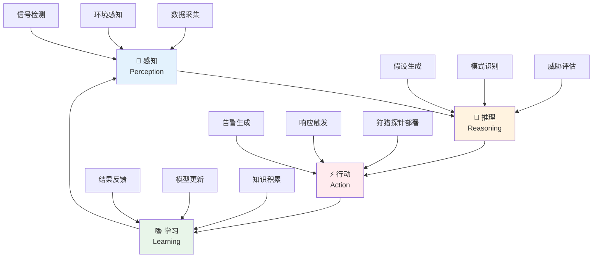

**作者：** HOS(安全风信子)

**日期：** 2026-04-24

**主要来源平台：** GitHub / HuggingFace / ModelScope / arXiv

**摘要：** 传统的威胁狩猎依赖安全分析师的经验和直觉，而自主威胁狩猎代表了安全运营的未来方向——AI系统能够自主感知环境、推理威胁、采取行动，并在每次狩猎后持续学习改进。本文深入探讨自主威胁狩猎体系的设计与实现，涵盖感知-推理-行动-学习的完整Agent架构、狩猎知识库的构建与管理、自主决策引擎的设计、以及人工验证与模型更新的反馈闭环。通过两个完整实战案例展示自主狩猎系统在实际环境中的表现，文章还评估了自主狩猎与辅助狩猎的效果差异，为企业构建下一代安全运营能力提供战略指导[^1^]。

---

@[TOC](目录)

---

# AI成为全职猎人：自主威胁狩猎体系设计完整指南

## 1 引言：自主狩猎 vs 辅助狩猎

### 1.1 辅助狩猎的局限性

传统的AI辅助狩猎系统中，AI扮演的是辅助角色——提供假设建议、加速数据检索、辅助异常检测。最终的决策和行动仍由人类分析师完成。这种模式存在明显局限：

**人力瓶颈**：即使AI辅助可以提升效率，每个假设的验证仍需要分析师投入时间。在海量告警和有限人力的矛盾下，分析师无法对所有假设进行全面验证。据SANS 2024年安全运营调查[^2^]显示，平均每个安全运营中心（SOC）每天产生超过10000条告警，而分析师团队通常只能深入调查其中的5-10%。

**响应延迟**：面对正在进行的攻击，自主狩猎可以秒级响应，而辅助狩猎需要分析师介入才能采取行动，这个时间差可能决定攻击的成败。在APT攻击中，攻击者平均只需要23分钟就能完成横向移动，而人工响应时间通常以小时计。

**覆盖范围有限**：分析师只能同时关注有限数量的假设，而自主狩猎系统可以并行运行数百个假设，持续扫描整个环境。这意味着人工辅助模式下存在大量"狩猎盲区"。

**主观偏见**：人类分析师容易受到确认偏见的影响，更倾向于寻找支持自己假设的证据。自主系统可以更客观地评估所有假设，不受认知偏见影响。

### 1.2 自主狩猎的战略价值

自主威胁狩猎系统（Autonomous Threat Hunting System）代表了安全运营的重大范式转变。在这一模式下，AI Agent能够自主完成整个狩猎循环：



**自主狩猎的核心特征**：

1. **持续运行**：7x24小时不间断运行，持续监控环境，不依赖人工触发
2. **主动探测**：不仅被动分析已有数据，还能主动发送探针验证假设
3. **自主决策**：在一定置信度阈值内自主做出狩猎决策，无需人工介入
4. **持续进化**：从每次狩猎中学习，不断优化检测能力，形成正向循环

### 1.3 自主狩猎成熟度模型

企业在引入自主狩猎能力时，需要根据自身成熟度选择合适的实现路径：

| 成熟度级别 | 系统特征 | 自主程度 | 人工介入频率 | 适用场景 |
|:---:|:---|:---:|:---:|:---|
| **L1-辅助狩猎** | AI提供建议，人类决策 | 20% | 每案必审 | 初步尝试AI辅助 |
| **L2-半自主狩猎** | AI主导，人类监督 | 50% | 高风险事件 | 资源有限但需扩展覆盖 |
| **L3-条件自主** | 常规自动，异常人工 | 80% | 仅异常情况 | 中等成熟度组织 |
| **L4-高度自主** | 仅关键决策人工 | 95% | 仅关键节点 | 成熟安全运营中心 |
| **L5-完全自主** | 全流程自动 | 99% | 定期审计 | 拥有专业AI团队 |

## 2 自主狩猎Agent架构设计

### 2.1 感知层：全方位环境感知

感知层负责从环境中收集各类安全数据，并对数据进行预处理和特征提取：

```python
class AutonomousHuntingAgent:
    """
    自主狩猎Agent
    完整的感知-推理-行动-学习架构
    """
    
    def __init__(self, config=None):
        self.config = config or {}
        self.perception = PerceptionLayer(self.config)
        self.reasoning = ReasoningLayer(self.config)
        self.action = ActionLayer(self.config)
        self.learning = LearningLayer(self.config)
        
        self.knowledge_base = HuntingKnowledgeBase()
        self.decision_engine = DecisionEngine(self.config)
        
        self.state_manager = AgentStateManager()
        self.telemetry = TelemetryCollector()
        
        self.is_running = False
        self.hunting_cycles_completed = 0
    
    def start(self):
        """启动自主狩猎系统"""
        self.is_running = True
        self.state_manager.transition_to('RUNNING')
        
        self.telemetry.log_event('agent_started', {
            'timestamp': datetime.now().isoformat(),
            'config': self.config
        })
        
        while self.is_running:
            try:
                await self.run_hunting_cycle()
                self.hunting_cycles_completed += 1
                
                if self.hunting_cycles_completed % 100 == 0:
                    self._perform_maintenance()
                
            except Exception as e:
                self._handle_cycle_error(e)
                
            await self._sleep_until_next_cycle()
    
    async def run_hunting_cycle(self):
        """执行单个狩猎周期"""
        cycle_start = datetime.now()
        
        observations = await self.perception.sense()
        
        self.state_manager.transition_to('REASONING')
        threat_assessment = await self.reasoning.analyze(observations)
        
        self.state_manager.transition_to('DECIDING')
        actions = await self.action.determine_actions(threat_assessment)
        
        self.state_manager.transition_to('ACTING')
        results = await self.action.execute(actions)
        
        self.state_manager.transition_to('LEARNING')
        await self.learning.learn(results)
        
        cycle_duration = (datetime.now() - cycle_start).total_seconds()
        
        self.telemetry.log_cycle_completion({
            'cycle_id': self.hunting_cycles_completed,
            'duration_seconds': cycle_duration,
            'observations_count': len(observations.get('signals', [])),
            'threats_assessed': len(threat_assessment.get('threats', [])),
            'actions_taken': len(results),
            'success_count': sum(1 for r in results if r.get('success'))
        })
        
        return results
    
    def _perform_maintenance(self):
        """执行维护任务"""
        self.knowledge_base.compact()
        
        self.learning.model_health_check()
        
        self.perception.data_source_health_check()
    
    def _handle_cycle_error(self, error):
        """处理周期执行错误"""
        self.telemetry.log_error('cycle_error', {
            'error_type': type(error).__name__,
            'error_message': str(error),
            'cycle_id': self.hunting_cycles_completed
        })
        
        self.state_manager.transition_to('ERROR_RECOVERY')
        
        if self._is_recoverable_error(error):
            self._attempt_auto_recovery()
        else:
            self._escalate_to_human(error)
    
    def _is_recoverable_error(self, error):
        """判断是否为可恢复错误"""
        recoverable_types = [
            'DataSourceTimeoutError',
            'TemporaryNetworkError',
            'KnowledgeBaseConnectionError'
        ]
        return type(error).__name__ in recoverable_types


class PerceptionLayer:
    """
    感知层
    收集和处理环境数据
    """
    
    def __init__(self, config):
        self.config = config
        self.data_sources = self._initialize_data_sources(config)
        self.feature_extractor = FeatureExtractor()
        self.signal_aggregator = SignalAggregator()
        self.anomaly_preprocessor = AnomalyPreprocessor()
        
        self.source_health_status = {}
        self.last_collection_times = {}
    
    async def sense(self):
        """感知环境"""
        raw_data = await self._collect_from_all_sources()
        
        features = self.feature_extractor.extract(raw_data)
        
        preprocessed = self.anomaly_preprocessor.preprocess(features)
        
        aggregated_signals = await self.signal_aggregator.aggregate(
            preprocessed,
            time_window=self.config.get('aggregation_window', '5m')
        )
        
        enriched_signals = self._enrich_signals(aggregated_signals)
        
        return {
            'signals': enriched_signals,
            'metadata': self._collect_metadata(),
            'source_health': self.source_health_status,
            'data_quality': self._assess_data_quality(raw_data)
        }
    
    async def _collect_from_all_sources(self):
        """从所有数据源收集数据"""
        collected = {}
        
        collection_tasks = []
        for source_name, source in self.data_sources.items():
            task = self._collect_from_source_safe(source_name, source)
            collection_tasks.append(task)
        
        results = await asyncio.gather(*collection_tasks, return_exceptions=True)
        
        for source_name, result in zip(self.data_sources.keys(), results):
            if isinstance(result, Exception):
                logger.warning(f"Failed to collect from {source_name}: {result}")
                self.source_health_status[source_name] = 'unhealthy'
                collected[source_name] = []
            else:
                self.source_health_status[source_name] = 'healthy'
                collected[source_name] = result
        
        return collected
    
    async def _collect_from_source_safe(self, source_name, source):
        """安全收集数据源"""
        try:
            data = await asyncio.wait_for(
                source.collect(),
                timeout=self.config.get('collection_timeout', 30)
            )
            self.last_collection_times[source_name] = datetime.now()
            return data
        except asyncio.TimeoutError:
            raise DataSourceTimeoutError(f"{source_name} collection timed out")
        except Exception as e:
            raise DataSourceError(f"{source_name} collection failed: {e}")
    
    def _initialize_data_sources(self, config):
        """初始化数据源"""
        data_sources = {}
        
        source_configs = config.get('data_sources', {})
        
        if source_configs.get('edr'):
            data_sources['edr'] = EDRDataSource(source_configs['edr'])
        
        if source_configs.get('ndr'):
            data_sources['ndr'] = NDRDataSource(source_configs['ndr'])
        
        if source_configs.get('dns'):
            data_sources['dns'] = DNSDataSource(source_configs['dns'])
        
        if source_configs.get('authentication'):
            data_sources['authentication'] = AuthDataSource(source_configs['authentication'])
        
        if source_configs.get('threat_intel'):
            data_sources['threat_intel'] = ThreatIntelSource(source_configs['threat_intel'])
        
        return data_sources
    
    def _enrich_signals(self, signals):
        """丰富信号数据"""
        enriched = []
        
        for signal in signals:
            enriched_signal = self._add_context(signal)
            
            enriched_signal = self._add_threat_intel_context(enriched_signal)
            
            enriched_signal = self._add_temporal_context(enriched_signal)
            
            enriched.append(enriched_signal)
        
        return enriched
    
    def _add_context(self, signal):
        """添加上下文信息"""
        signal['enrichment'] = {
            'asset_info': self._lookup_asset_info(signal.get('asset_id')),
            'user_info': self._lookup_user_info(signal.get('user_id')),
            'process_info': self._lookup_process_info(signal.get('process_id'))
        }
        return signal
    
    def _add_threat_intel_context(self, signal):
        """添加威胁情报上下文"""
        if signal.get('indicator'):
            ioc_match = self._check_ioc_match(signal.get('indicator'))
            if ioc_match:
                signal['enrichment']['threat_intel'] = ioc_match
        
        return signal
    
    def _add_temporal_context(self, signal):
        """添加时间上下文"""
        timestamp = signal.get('timestamp')
        if isinstance(timestamp, (int, float)):
            dt = datetime.fromtimestamp(timestamp)
        else:
            dt = timestamp
        
        signal['enrichment']['temporal'] = {
            'hour_of_day': dt.hour,
            'day_of_week': dt.weekday(),
            'is_business_hours': 9 <= dt.hour <= 17 and dt.weekday() < 5,
            'is_month_end': dt.day >= 28
        }
        
        return signal
```

### 2.2 推理层：威胁理解与评估

推理层是自主狩猎Agent的核心，负责分析感知数据、生成威胁假设、评估风险等级：

```python
class ReasoningLayer:
    """
    推理层
    分析威胁并生成决策建议
    """
    
    def __init__(self, config):
        self.config = config
        self.hypothesis_generator = HypothesisGenerator()
        self.pattern_recognizer = PatternRecognizer()
        self.threat_classifier = ThreatClassifier()
        self.risk_assessor = RiskAssessor()
        self.context_engine = ContextReasoningEngine()
        
        self.reasoning_models = self._initialize_reasoning_models()
        
        self.working_memory = ReasoningWorkingMemory()
    
    async def analyze(self, observations):
        """分析感知数据"""
        signals = observations.get('signals', [])
        
        self.working_memory.store('current_signals', signals)
        
        patterns = await self.pattern_recognizer.identify_patterns(signals)
        self.working_memory.store('identified_patterns', patterns)
        
        hypotheses = await self.hypothesis_generator.generate(patterns, observations)
        self.working_memory.store('generated_hypotheses', hypotheses)
        
        validated_hypotheses = await self._validate_hypotheses(
            hypotheses, 
            signals
        )
        self.working_memory.store('validated_hypotheses', validated_hypotheses)
        
        threat_assessment = await self.threat_classifier.classify(validated_hypotheses)
        
        risk_levels = await self.risk_assessor.assess(
            validated_hypotheses,
            threat_assessment
        )
        
        context_analysis = await self.context_engine.analyze(
            signals,
            validated_hypotheses
        )
        
        return {
            'patterns': patterns,
            'hypotheses': validated_hypotheses,
            'threats': threat_assessment,
            'risk_levels': risk_levels,
            'context': context_analysis,
            'reasoning_chain': self.working_memory.get_reasoning_chain()
        }
    
    async def _validate_hypotheses(self, hypotheses, signals):
        """验证假设"""
        validated = []
        
        for hypothesis in hypotheses:
            validation_result = await self._validate_single_hypothesis(
                hypothesis,
                signals
            )
            
            if validation_result['is_valid']:
                validated.append({
                    **hypothesis,
                    'validation': validation_result
                })
        
        validated.sort(key=lambda x: x.get('validation', {}).get('confidence', 0), reverse=True)
        
        return validated
    
    async def _validate_single_hypothesis(self, hypothesis, signals):
        """验证单个假设"""
        supporting_evidence = await self._find_supporting_evidence(
            hypothesis, 
            signals
        )
        
        contradicting_evidence = await self._find_contradicting_evidence(
            hypothesis, 
            signals
        )
        
        confidence = self._calculate_confidence(
            hypothesis, 
            supporting_evidence, 
            contradicting_evidence
        )
        
        evidence_quality = self._assess_evidence_quality(
            supporting_evidence,
            contradicting_evidence
        )
        
        return {
            'is_valid': confidence > hypothesis.get('threshold', 0.5),
            'confidence': confidence,
            'supporting_evidence': supporting_evidence,
            'contradicting_evidence': contradicting_evidence,
            'evidence_quality': evidence_quality,
            'validation_timestamp': datetime.now().isoformat()
        }
    
    async def _find_supporting_evidence(self, hypothesis, signals):
        """查找支持假设的证据"""
        evidence = []
        
        evidence_types = hypothesis.get('evidence_types', ['behavioral', ' contextual'])
        
        for signal in signals:
            if self._supports_hypothesis(signal, hypothesis):
                evidence.append({
                    'signal': signal,
                    'relevance_score': self._calculate_relevance(signal, hypothesis),
                    'type': 'supporting'
                })
        
        evidence.sort(key=lambda x: x['relevance_score'], reverse=True)
        
        return evidence[:hypothesis.get('max_evidence', 20)]
    
    async def _find_contradicting_evidence(self, hypothesis, signals):
        """查找反驳假设的证据"""
        contradicting = []
        
        for signal in signals:
            if self._contradicts_hypothesis(signal, hypothesis):
                contradicting.append({
                    'signal': signal,
                    'contradiction_strength': self._calculate_contradiction(signal, hypothesis),
                    'type': 'contradicting'
                })
        
        return contradicting
    
    def _calculate_confidence(self, hypothesis, supporting, contradicting):
        """计算机置信度"""
        supporting_weight = len(supporting) * 0.1
        
        avg_relevance = np.mean([s['relevance_score'] for s in supporting]) if supporting else 0
        
        contradicting_penalty = len(contradicting) * 0.15
        
        base_confidence = hypothesis.get('base_confidence', 0.3)
        
        confidence = min(1.0, max(0.0,
            base_confidence +
            supporting_weight * avg_relevance -
            contradicting_penalty
        ))
        
        return confidence
    
    def _supports_hypothesis(self, signal, hypothesis):
        """判断信号是否支持假设"""
        hypothesis_type = hypothesis.get('type')
        
        if hypothesis_type == 'lateral_movement':
            return self._check_lateral_movement_evidence(signal)
        elif hypothesis_type == 'data_exfiltration':
            return self._check_data_exfil_evidence(signal)
        elif hypothesis_type == 'privilege_escalation':
            return self._check_privilege_escalation_evidence(signal)
        elif hypothesis_type == 'c2_communication':
            return self._check_c2_evidence(signal)
        
        return False
    
    def _check_lateral_movement_evidence(self, signal):
        """检查横向移动证据"""
        return (
            signal.get('event_type') == 'network_connection' and
            signal.get('destination') in ['smb', 'wmi', 'ssh', 'rdp'] and
            signal.get('authentication_success') is True
        )
    
    def _check_data_exfil_evidence(self, signal):
        """检查数据外泄证据"""
        return (
            signal.get('event_type') == 'data_transfer' and
            signal.get('volume') > signal.get('baseline_volume', 0) * 3 and
            signal.get('destination_type') in ['external', 'cloud_storage']
        )
    
    def _check_privilege_escalation_evidence(self, signal):
        """检查权限提升证据"""
        return (
            signal.get('event_type') == 'privilege_change' and
            signal.get('new_privileges', []) > signal.get('old_privileges', [])
        )
    
    def _check_c2_evidence(self, signal):
        """检查C2通信证据"""
        return (
            signal.get('event_type') == 'network_behavior' and
            signal.get('periodicity_score', 0) > 0.8
        )


class ContextReasoningEngine:
    """
    上下文推理引擎
    基于上下文信息进行高级推理
    """
    
    def __init__(self):
        self.context_graph = ContextGraph()
        self.temporal_reasoner = TemporalReasoner()
        self.entity_relation_analyzer = EntityRelationAnalyzer()
    
    async def analyze(self, signals, hypotheses):
        """分析上下文"""
        context_analysis = {
            'entity_relationships': self._analyze_entity_relationships(signals),
            'temporal_patterns': self._analyze_temporal_patterns(signals),
            'causal_chains': self._identify_causal_chains(signals, hypotheses),
            'anomaly_context': self._enrich_with_context(signals)
        }
        
        return context_analysis
    
    def _analyze_entity_relationships(self, signals):
        """分析实体关系"""
        entities = self._extract_entities(signals)
        
        relationships = []
        for entity in entities:
            related = self.entity_relation_analyzer.find_related(
                entity,
                entities
            )
            relationships.extend(related)
        
        return {
            'entities': entities,
            'relationships': relationships,
            'graph_snapshot': self.context_graph.snapshot()
        }
```

### 2.3 行动层：自主响应决策

行动层根据推理层的分析结果，自主决定并执行响应动作：

```python
class ActionLayer:
    """
    行动层
    自主决定和执行响应动作
    """
    
    def __init__(self, config):
        self.config = config
        self.decision_engine = DecisionEngine(config)
        self.action_library = ActionLibrary()
        self.executor = ActionExecutor()
        self.resource_manager = ActionResourceManager()
        
        self.execution_history = ExecutionHistoryStore()
        
        self.action_validators = {
            'safety': SafetyValidator(),
            'compliance': ComplianceValidator(),
            'resource': ResourceValidator()
        }
    
    async def determine_actions(self, threat_assessment):
        """确定响应动作"""
        actions = []
        
        for threat in threat_assessment.get('threats', []):
            risk_level = threat_assessment['risk_levels'].get(threat['id'])
            
            context = threat_assessment.get('context', {})
            
            possible_actions = self.action_library.get_applicable_actions(
                threat,
                risk_level,
                context
            )
            
            if not possible_actions:
                continue
            
            best_action = await self.decision_engine.select_action(
                possible_actions,
                risk_level,
                context,
                constraints=self._get_action_constraints()
            )
            
            validation_result = await self._validate_action(best_action, threat)
            
            if validation_result['is_valid']:
                actions.append({
                    'threat': threat,
                    'action': best_action,
                    'rationale': best_action.get('rationale'),
                    'validation': validation_result,
                    'priority': self._calculate_action_priority(threat, best_action)
                })
        
        actions.sort(key=lambda x: x['priority'], reverse=True)
        
        return actions
    
    async def _validate_action(self, action, threat):
        """验证动作的安全性"""
        validation_results = {}
        
        for validator_name, validator in self.action_validators.items():
            result = await validator.validate(action, threat)
            validation_results[validator_name] = result
        
        all_valid = all(r['is_valid'] for r in validation_results.values())
        
        return {
            'is_valid': all_valid,
            'validation_details': validation_results,
            'warnings': [r.get('warning') for r in validation_results.values() if r.get('warning')]
        }
    
    async def execute(self, actions):
        """执行动作"""
        results = []
        
        for action_spec in actions[:self.config.get('max_concurrent_actions', 10)]:
            try:
                result = await self._execute_single_action(action_spec)
                results.append(result)
                
                await self.execution_history.record(result)
                
            except Exception as e:
                error_result = {
                    'action': action_spec['action'],
                    'success': False,
                    'error': str(e),
                    'error_type': type(e).__name__
                }
                results.append(error_result)
                await self.execution_history.record(error_result)
        
        return results
    
    async def _execute_single_action(self, action_spec):
        """执行单个动作"""
        action = action_spec['action']
        threat = action_spec['threat']
        
        execution_plan = self.executor.create_plan(action, threat)
        
        for step in execution_plan.get('steps', []):
            step_result = await self.executor.execute_step(step)
            
            if not step_result.get('success'):
                return {
                    'action': action,
                    'threat': threat,
                    'success': False,
                    'failed_step': step,
                    'partial_results': step_result
                }
        
        return {
            'action': action,
            'threat': threat,
            'success': True,
            'execution_time': execution_plan.get('total_time'),
            'effects': execution_plan.get('effects')
        }
    
    def _get_action_constraints(self):
        """获取动作约束"""
        return {
            'max_execution_time': self.config.get('max_action_execution_time', 300),
            'allowed_action_types': self.config.get('allowed_actions', ['alert', 'investigate']),
            'require_approval_for': self.config.get('approval_required_for', ['block', 'quarantine']),
            'rate_limits': self.config.get('action_rate_limits', {})
        }


class ActionLibrary:
    """
    动作库
    管理所有可用的响应动作
    """
    
    def __init__(self):
        self.actions = self._initialize_action_library()
    
    def _initialize_action_library(self):
        """初始化动作库"""
        return {
            'alert': {
                'type': 'alert',
                'description': '生成告警通知',
                'automated': True,
                'approval_required': False,
                'risk_level': 'low',
                'execution_time': 1
            },
            'investigate': {
                'type': 'investigate',
                'description': '深入调查威胁',
                'automated': True,
                'approval_required': False,
                'risk_level': 'low',
                'execution_time': 60
            },
            'enrich': {
                'type': 'enrich',
                'description': '丰富威胁上下文',
                'automated': True,
                'approval_required': False,
                'risk_level': 'low',
                'execution_time': 30
            },
            'isolate': {
                'type': 'isolate',
                'description': '隔离受影响主机',
                'automated': True,
                'approval_required': True,
                'risk_level': 'medium',
                'execution_time': 10
            },
            'block': {
                'type': 'block',
                'description': '阻断恶意连接',
                'automated': False,
                'approval_required': True,
                'risk_level': 'high',
                'execution_time': 5
            },
            'quarantine': {
                'type': 'quarantine',
                'description': '隔离恶意文件',
                'automated': True,
                'approval_required': True,
                'risk_level': 'medium',
                'execution_time': 15
            },
            'hunt_probe': {
                'type': 'hunt_probe',
                'description': '部署狩猎探针',
                'automated': True,
                'approval_required': False,
                'risk_level': 'low',
                'execution_time': 120
            },
            'collect_evidence': {
                'type': 'collect_evidence',
                'description': '收集取证数据',
                'automated': True,
                'approval_required': False,
                'risk_level': 'low',
                'execution_time': 300
            }
        }
    
    def get_applicable_actions(self, threat, risk_level, context):
        """获取适用的动作"""
        applicable = []
        
        threat_severity = threat.get('severity', 'medium')
        
        for action_name, action_spec in self.actions.items():
            if self._is_applicable(action_spec, threat, risk_level, context):
                action_with_context = {
                    **action_spec,
                    'name': action_name,
                    'target': threat
                }
                applicable.append(action_with_context)
        
        return applicable
    
    def _is_applicable(self, action_spec, threat, risk_level, context):
        """判断动作是否适用"""
        threat_types = action_spec.get('applicable_threats', ['*'])
        if threat.get('type') not in threat_types and '*' not in threat_types:
            return False
        
        min_risk = action_spec.get('min_risk_level', 'low')
        risk_levels = ['low', 'medium', 'high', 'critical']
        if risk_levels.index(risk_level) < risk_levels.index(min_risk):
            return False
        
        return True
```

### 2.4 学习层：持续进化

学习层负责从每次狩猎行动中学习，不断优化检测和决策能力：

```python
class LearningLayer:
    """
    学习层
    从狩猎结果中持续学习
    """
    
    def __init__(self, config):
        self.config = config
        self.model_updater = ModelUpdater()
        self.knowledge_base = HuntingKnowledgeBase()
        self.feedback_processor = FeedbackProcessor()
        
        self.learning_buffer = LearningBuffer()
        self.batch_learning_size = config.get('batch_learning_size', 100)
        
        self.performance_tracker = PerformanceTracker()
        
        self.model_registry = ModelRegistry()
    
    async def learn(self, action_results):
        """从行动结果中学习"""
        for result in action_results:
            await self._process_result(result)
        
        if self.learning_buffer.size() >= self.batch_learning_size:
            await self._trigger_batch_learning()
        
        await self.performance_tracker.record_results(action_results)
        
        await self._update_knowledge_from_results(action_results)
    
    async def _process_result(self, result):
        """处理单个结果"""
        learning_sample = {
            'result': result,
            'timestamp': datetime.now(),
            'hypothesis': result.get('action', {}).get('hypothesis'),
            'outcome': 'success' if result.get('success') else 'failure'
        }
        
        await self.learning_buffer.add(learning_sample)
        
        if result.get('success'):
            await self._learn_from_success(result)
        else:
            await self._learn_from_failure(result)
        
        if result.get('analyst_feedback'):
            await self._incorporate_analyst_feedback(result)
    
    async def _learn_from_success(self, result):
        """从成功案例中学习"""
        successful_hypothesis = result.get('action', {}).get('hypothesis')
        
        await self.model_updater.positive_sample(
            successful_hypothesis,
            result
        )
        
        if successful_hypothesis:
            pattern = self._extract_pattern_from_hypothesis(successful_hypothesis)
            await self.knowledge_base.add_attack_pattern(pattern)
        
        await self.knowledge_base.add_successful_detection(
            result.get('threat'),
            successful_hypothesis
        )
    
    async def _learn_from_failure(self, result):
        """从失败案例中学习"""
        failed_action = result.get('action')
        
        failure_type = self._classify_failure(result)
        
        if failure_type == 'false_positive':
            await self.model_updater.false_positive_sample(failed_action)
            await self.knowledge_base.mark_false_positive(failed_action)
        elif failure_type == 'detection_miss':
            await self.model_updater.false_negative_sample(
                result.get('threat'),
                failed_action
            )
        elif failure_type == 'execution_error':
            await self._handle_execution_error(result)
    
    async def _incorporate_analyst_feedback(self, result):
        """纳入分析师反馈"""
        feedback = result.get('analyst_feedback')
        
        if feedback.get('confirmed'):
            await self.model_updater.positive_sample_with_feedback(
                result,
                feedback
            )
        elif feedback.get('rejected'):
            await self.model_updater.negative_sample_with_feedback(
                result,
                feedback
            )
        
        await self.feedback_processor.record(feedback)
        
        await self._adjust_thresholds_based_on_feedback(feedback)
    
    async def _trigger_batch_learning(self):
        """触发批量学习"""
        batch = await self.learning_buffer.get_batch(self.batch_learning_size)
        
        await self.model_updater.batch_update(batch)
        
        await self.learning_buffer.clear()
        
        new_version = await self.model_updater.create_new_version()
        await self.model_registry.register(new_version)
        
        if await self._should_rollback(new_version):
            await self._rollback_to_previous_version()
    
    async def _update_knowledge_from_results(self, results):
        """从结果更新知识库"""
        for result in results:
            if result.get('success') and result.get('threat'):
                threat_info = result['threat']
                
                await self.knowledge_base.update_threat_statistics(
                    threat_info.get('type'),
                    {
                        'detection_count': 1,
                        'first_detection_time': datetime.now(),
                        'related_signals': result.get('signatures', [])
                    }
                )


class LearningBuffer:
    """
    学习缓冲区
    临时存储学习样本
    """
    
    def __init__(self, max_size=1000):
        self.buffer = []
        self.max_size = max_size
    
    async def add(self, sample):
        """添加学习样本"""
        self.buffer.append(sample)
        
        if len(self.buffer) > self.max_size:
            self.buffer.pop(0)
    
    async def get_batch(self, size):
        """获取一批样本"""
        return self.buffer[:size]
    
    async def clear(self):
        """清空缓冲区"""
        self.buffer = []
    
    def size(self):
        """获取缓冲区大小"""
        return len(self.buffer)
```

## 3 狩猎知识库构建与管理

### 3.1 知识库架构

```python
class HuntingKnowledgeBase:
    """
    狩猎知识库
    存储和管理狩猎知识
    """
    
    def __init__(self, config=None):
        self.config = config or {}
        self.graph_store = GraphDatabase()
        self.vector_store = VectorStore()
        self.rule_store = RuleStore()
        self.pattern_store = PatternStore()
        
        self.embedding_model = self._initialize_embedding_model()
        
        self.cache = KnowledgeCache()
    
    def add_attack_pattern(self, pattern):
        """添加攻击模式"""
        pattern_node = self.graph_store.add_node(
            'attack_pattern',
            {
                'id': pattern.get('id', uuid.uuid4().hex),
                'name': pattern.get('name'),
                'description': pattern.get('description'),
                'mitre_attack_id': pattern.get('mitre_attack_id'),
                'severity': pattern.get('severity'),
                'first_seen': datetime.now().isoformat(),
                'detection_count': 0
            }
        )
        
        for technique in pattern.get('techniques', []):
            self.graph_store.add_relationship(
                pattern_node,
                'uses',
                'technique',
                technique
            )
        
        for indicator in pattern.get('indicators', []):
            self.graph_store.add_relationship(
                pattern_node,
                'produces',
                'indicator',
                indicator
            )
        
        embedding = self._generate_pattern_embedding(pattern)
        await self.vector_store.add(
            embedding,
            metadata={
                'pattern_id': pattern_node['id'],
                'pattern_name': pattern.get('name')
            }
        )
        
        return pattern_node
    
    async def search_similar_patterns(self, query, limit=10):
        """搜索相似模式"""
        query_embedding = self._generate_pattern_embedding(query)
        
        similar = await self.vector_store.search(
            query_embedding,
            limit=limit
        )
        
        results = []
        for item in similar:
            pattern = await self._resolve_pattern_id(item['id'])
            results.append({
                'pattern': pattern,
                'similarity_score': item['score']
            })
        
        return results
    
    def update_pattern_detection_count(self, pattern_id):
        """更新模式检测计数"""
        pattern = self.graph_store.get_node('attack_pattern', pattern_id)
        
        if pattern:
            current_count = pattern.get('detection_count', 0)
            pattern['detection_count'] = current_count + 1
            pattern['last_detection_time'] = datetime.now().isoformat()
            
            self.graph_store.update_node(pattern)
    
    async def add_successful_detection(self, threat, hypothesis):
        """添加成功检测记录"""
        detection_record = {
            'id': uuid.uuid4().hex,
            'threat_type': threat.get('type'),
            'threat_severity': threat.get('severity'),
            'hypothesis': hypothesis,
            'detection_time': datetime.now().isoformat(),
            'confidence': hypothesis.get('confidence', 0)
        }
        
        self.graph_store.add_node('detection_record', detection_record)
        
        await self.pattern_store.record_detection(detection_record)


class KnowledgeUpdateManager:
    """
    知识更新管理器
    协调知识库的持续更新
    """
    
    def __init__(self, knowledge_base):
        self.knowledge_base = knowledge_base
        self.update_strategies = {
            'threat_intel': ThreatIntelUpdater(knowledge_base),
            'hunting_results': HuntingResultUpdater(knowledge_base),
            'analyst_feedback': AnalystFeedbackUpdater(knowledge_base),
            'external_sources': ExternalSourceUpdater(knowledge_base)
        }
        
        self.update_scheduler = UpdateScheduler()
    
    async def process_updates(self):
        """处理各类知识更新"""
        update_results = {}
        
        for source, updater in self.update_strategies.items():
            try:
                updates = await updater.fetch_updates()
                
                for update in updates:
                    await self._apply_update(update)
                
                await updater.mark_processed(updates)
                
                update_results[source] = {
                    'success': True,
                    'updates_count': len(updates)
                }
                
            except Exception as e:
                update_results[source] = {
                    'success': False,
                    'error': str(e)
                }
        
        return update_results
    
    async def _apply_update(self, update):
        """应用更新到知识库"""
        update_handlers = {
            'new_pattern': self._add_pattern,
            'pattern_variant': self._add_variant,
            'false_positive': self._mark_false_positive,
            'true_positive': self._mark_true_positive,
            'rule_update': self._update_rule,
            'threshold_adjustment': self._adjust_threshold
        }
        
        handler = update_handlers.get(update['type'])
        if handler:
            await handler(update['data'])
    
    async def _add_pattern(self, pattern_data):
        """添加新模式"""
        pattern = Pattern.from_dict(pattern_data)
        await self.knowledge_base.add_attack_pattern(pattern)
    
    async def _mark_false_positive(self, fp_data):
        """标记误报"""
        pattern_id = fp_data.get('pattern_id')
        context = fp_data.get('context')
        
        await self.knowledge_base.mark_false_positive(pattern_id, context)
```

## 4 自主决策引擎设计

### 4.1 决策框架

```python
class DecisionEngine:
    """
    自主决策引擎
    基于多因素做出狩猎决策
    """
    
    def __init__(self, config):
        self.config = config
        self.confidence_threshold = config.get('confidence_threshold', 0.8)
        self.risk_tolerance = config.get('risk_tolerance', 'medium')
        self.decision_types = ['alert', 'investigate', 'hunt', 'block', 'isolate']
        
        self.decision_policies = self._load_decision_policies()
        
        self.risk_calculator = RiskCalculator()
        self.cost_estimator = ActionCostEstimator()
    
    async def select_action(self, possible_actions, risk_level, context, constraints):
        """选择最佳动作"""
        scored_actions = []
        
        for action in possible_actions:
            score = await self._calculate_action_score(
                action, 
                risk_level, 
                context,
                constraints
            )
            
            scored_actions.append((action, score))
        
        scored_actions.sort(key=lambda x: x[1], reverse=True)
        
        best_action = scored_actions[0][0]
        
        best_action['rationale'] = self._generate_rationale(
            best_action, 
            scored_actions[0][1],
            risk_level
        )
        
        best_action['decision_metadata'] = {
            'score_breakdown': {
                'base_score': scored_actions[0][1],
                'all_scores': [(a['name'], s) for a, s in scored_actions[:5]]
            },
            'risk_level': risk_level,
            'constraints_considered': constraints,
            'decision_timestamp': datetime.now().isoformat()
        }
        
        return best_action
    
    async def _calculate_action_score(self, action, risk_level, context, constraints):
        """计算动作评分"""
        base_score = action.get('base_score', 0.5)
        
        risk_match_score = self._calculate_risk_match(
            action.get('risk_level'),
            risk_level
        )
        
        constraint_score = await self._evaluate_constraints(action, constraints)
        
        confidence_score = action.get('confidence', 0.5)
        
        context_multiplier = self._calculate_context_multiplier(action, context)
        
        estimated_cost = await self.cost_estimator.estimate(action)
        cost_score = self._calculate_cost_score(estimated_cost)
        
        historical_performance = await self._get_historical_performance(action)
        
        weighted_score = (
            base_score * 0.15 +
            risk_match_score * 0.20 +
            constraint_score * 0.15 +
            confidence_score * 0.20 +
            context_multiplier * 0.10 +
            cost_score * 0.10 +
            historical_performance * 0.10
        )
        
        return weighted_score
    
    def _calculate_risk_match(self, action_risk, threat_risk):
        """计算风险匹配度"""
        risk_levels = ['low', 'medium', 'high', 'critical']
        
        action_level = risk_levels.index(action_risk)
        threat_level = risk_levels.index(threat_risk)
        
        if action_level == threat_level:
            return 1.0
        elif action_level < threat_level:
            return 0.3
        else:
            return 0.8
    
    def _calculate_context_multiplier(self, action, context):
        """计算上下文乘数"""
        multiplier = 1.0
        
        if context.get('is_business_hours'):
            multiplier *= 1.0
        else:
            multiplier *= 0.9
        
        if context.get('affected_critical_asset'):
            multiplier *= 1.2
        
        if context.get('threat_actor_ttps_known'):
            multiplier *= 1.1
        
        return min(1.5, max(0.5, multiplier))
    
    def _generate_rationale(self, action, score, risk_level):
        """生成决策理由"""
        return {
            'summary': f"选择{action.get('description')}响应{risk_level}级别威胁",
            'factors': [
                f"动作匹配风险等级: {action.get('risk_level')} vs {risk_level}",
                f"置信度: {action.get('confidence', 0):.2f}",
                f"综合评分: {score:.3f}"
            ],
            'alternative_actions': [
                {'name': '其他备选动作', 'reason': '评分较低'}
            ]
        }
```

### 4.2 决策约束管理

```python
class ActionConstraints:
    """
    动作约束管理器
    确保自主行动在安全边界内
    """
    
    def __init__(self):
        self.hard_constraints = self._initialize_hard_constraints()
        self.soft_constraints = self._initialize_soft_constraints()
        
        self.constraint_evaluator = ConstraintEvaluator()
    
    def _initialize_hard_constraints(self):
        """初始化硬约束"""
        return [
            {
                'name': 'no_data_deletion',
                'description': '禁止删除任何数据',
                'enforcement': 'strict'
            },
            {
                'name': 'no_service_interruption',
                'description': '禁止中断关键服务',
                'enforcement': 'strict',
                'exceptions': ['isolated_malware']
            },
            {
                'name': 'analyst_approval_for_block',
                'description': '阻断动作需要分析师审批',
                'enforcement': 'strict'
            },
            {
                'name': 'no_privilege_escalation',
                'description': '禁止提升系统权限',
                'enforcement': 'strict'
            },
            {
                'name': 'audit_trail_required',
                'description': '所有动作必须记录审计日志',
                'enforcement': 'strict'
            }
        ]
    
    def _initialize_soft_constraints(self):
        """初始化软约束"""
        return [
            {
                'name': 'minimize_false_positives',
                'description': '最小化误报率',
                'weight': 0.3
            },
            {
                'name': 'prefer_read_operations',
                'description': '优先使用只读操作',
                'weight': 0.2
            },
            {
                'name': 'maintain_user_experience',
                'description': '保持用户体验',
                'weight': 0.15
            },
            {
                'name': 'resource_efficiency',
                'description': '资源使用效率',
                'weight': 0.1
            }
        ]
    
    async def evaluate(self, action, constraints):
        """评估动作是否满足约束"""
        violations = []
        warnings = []
        
        for constraint in self.hard_constraints:
            result = await self.constraint_evaluator.evaluate(action, constraint)
            
            if not result['satisfied']:
                if constraint['enforcement'] == 'strict':
                    return False, f"Hard constraint violated: {constraint['name']}", violations
                else:
                    warnings.append(result['message'])
        
        for constraint in self.soft_constraints:
            result = await self.constraint_evaluator.evaluate(action, constraint)
            
            if not result['satisfied']:
                warnings.append(result['message'])
        
        return True, warnings if warnings else "All constraints satisfied", violations
    
    def get_allowed_action_types(self, risk_level):
        """获取允许的动作类型"""
        if risk_level == 'critical':
            return ['alert', 'investigate', 'enrich', 'isolate', 'block', 'quarantine']
        elif risk_level == 'high':
            return ['alert', 'investigate', 'enrich', 'isolate', 'quarantine']
        elif risk_level == 'medium':
            return ['alert', 'investigate', 'enrich']
        else:
            return ['alert', 'investigate']
```

## 5 人工验证与反馈闭环

### 5.1 人工验证机制

```python
class HumanVerificationQueue:
    """
    人工验证队列
    需要人工审核的狩猎结果
    """
    
    def __init__(self, config):
        self.config = config
        self.high_priority_queue = PriorityQueue()
        self.standard_queue = PriorityQueue()
        self.low_priority_queue = PriorityQueue()
        self.verified_results = []
        
        self.notification_manager = NotificationManager()
        
        self.sla_tracker = SLATracker()
    
    def add_for_verification(self, hunting_result):
        """添加到验证队列"""
        if not self._needs_verification(hunting_result):
            return
        
        queue_item = {
            'result': hunting_result,
            'submitted_at': datetime.now(),
            'due_by': self._calculate_due_time(hunting_result)
        }
        
        priority = self._calculate_priority(hunting_result)
        
        if priority == 'critical':
            self.high_priority_queue.put((0, queue_item))
            self.notification_manager.send_critical_notification(queue_item)
        elif priority == 'high':
            self.standard_queue.put((1, queue_item))
            self.notification_manager.send_high_priority_notification(queue_item)
        else:
            self.low_priority_queue.put((2, queue_item))
    
    def _needs_verification(self, result):
        """判断是否需要验证"""
        if result.get('confidence', 0) < 0.95:
            return True
        
        action_type = result.get('action', {}).get('type')
        if action_type in ['block', 'quarantine', 'isolate']:
            return True
        
        if result.get('affected_critical_asset'):
            return True
        
        if not result.get('validated'):
            return True
        
        return False
    
    def _calculate_priority(self, result):
        """计算优先级"""
        confidence = result.get('confidence', 0)
        severity = result.get('threat', {}).get('severity', 'low')
        
        if confidence < 0.5 and severity in ['critical', 'high']:
            return 'critical'
        elif confidence < 0.8 or severity == 'high':
            return 'high'
        else:
            return 'medium'
    
    async def process_verification(self, result_id, analyst_feedback):
        """处理验证反馈"""
        result = self._find_result(result_id)
        
        if not result:
            raise ResultNotFoundError(f"Result {result_id} not found")
        
        verification_record = {
            'result': result,
            'feedback': analyst_feedback,
            'timestamp': datetime.now(),
            'analyst_id': analyst_feedback.get('analyst_id'),
            'time_to_verify': (datetime.now() - result['submitted_at']).total_seconds()
        }
        
        self.verified_results.append(verification_record)
        
        await self.sla_tracker.record_verification(verification_record)
        
        await self._trigger_feedback_learning(verification_record)
        
        return analyst_feedback
    
    async def _trigger_feedback_learning(self, verification_record):
        """触发反馈学习"""
        feedback = verification_record['feedback']
        result = verification_record['result']
        
        if feedback.get('confirmed'):
            learning_event = {
                'type': 'confirmation',
                'result': result,
                'feedback': feedback,
                'timestamp': datetime.now()
            }
        elif feedback.get('rejected'):
            learning_event = {
                'type': 'rejection',
                'result': result,
                'feedback': feedback,
                'timestamp': datetime.now()
            }
        else:
            learning_event = {
                'type': 'modification',
                'result': result,
                'feedback': feedback,
                'timestamp': datetime.now()
            }
        
        return learning_event
```

### 5.2 反馈学习闭环

```python
class FeedbackLearningLoop:
    """
    反馈学习闭环
    将人工反馈转化为模型改进
    """
    
    def __init__(self, config):
        self.config = config
        self.feedback_buffer = []
        self.batch_size = config.get('batch_learning_size', 100)
        self.model_version = 1
        
        self.model_updater = ModelUpdater()
        self.analytics_engine = FeedbackAnalytics()
        
        self.quality_metrics = QualityMetricsTracker()
    
    async def incorporate_feedback(self, hunting_result, analyst_verdict):
        """纳入分析师反馈"""
        feedback_entry = {
            'result': hunting_result,
            'verdict': analyst_verdict,
            'timestamp': datetime.now(),
            'feedback_type': self._classify_feedback(analyst_verdict)
        }
        
        self.feedback_buffer.append(feedback_entry)
        
        await self.quality_metrics.record_feedback(feedback_entry)
        
        if len(self.feedback_buffer) >= self.batch_size:
            await self._trigger_model_update()
        
        return await self._generate_feedback_summary(feedback_entry)
    
    def _classify_feedback(self, verdict):
        """分类反馈"""
        if verdict.get('confirmed') and verdict.get('action_was_appropriate'):
            return 'true_positive_confirmed'
        elif verdict.get('confirmed') and not verdict.get('action_was_appropriate'):
            return 'true_positive_inappropriate_action'
        elif verdict.get('rejected') and verdict.get('was_actual_threat'):
            return 'false_negative'
        elif verdict.get('rejected') and not verdict.get('was_actual_threat'):
            return 'false_positive'
        elif verdict.get('modified'):
            return 'modified_detection'
        else:
            return 'unknown'
    
    async def _trigger_model_update(self):
        """触发模型更新"""
        batch_to_process = self.feedback_buffer[:self.batch_size]
        
        analysis = await self.analytics_engine.analyze_batch(batch_to_process)
        
        new_version = self.model_version + 1
        
        update_result = await self.model_updater.update(
            batch_to_process,
            version=new_version,
            analysis=analysis
        )
        
        if update_result.get('success'):
            self.feedback_buffer = self.feedback_buffer[self.batch_size:]
            self.model_version = new_version
            
            await self._validate_new_model(update_result)
        else:
            await self._handle_update_failure(update_result)
    
    async def _validate_new_model(self, update_result):
        """验证新模型"""
        validation_metrics = await self.model_updater.validate(
            update_result.get('new_model')
        )
        
        if validation_metrics.get('performance_degradation', 0) > 0.1:
            await self._rollback_to_previous_version()
        else:
            await self._record_model_improvement(update_result)
    
    async def _generate_feedback_summary(self, feedback_entry):
        """生成反馈摘要"""
        feedback_type = feedback_entry['feedback_type']
        
        impact_assessment = await self.analytics_engine.assess_impact(
            feedback_entry
        )
        
        return {
            'feedback_id': uuid.uuid4().hex,
            'feedback_type': feedback_type,
            'impact': impact_assessment,
            'model_adjustment': self._get_adjustment_recommendation(feedback_type),
            'timestamp': datetime.now().isoformat()
        }
```

## 6 实战案例分析

### 6.1 案例一：金融机构自主狩猎

**背景**：某大型银行部署了自主威胁狩猎系统，覆盖2000+服务器和50000+终端。系统采用L3级别自主狩猎能力，常规威胁自动处理，仅在异常情况下升级人工。

```python
class FinancialAutonomousHunter:
    """
    金融行业自主狩猎器
    针对金融行业特点优化的自主狩猎系统
    """
    
    def __init__(self):
        self.domain_monitor = DomainPrivilegeMonitor()
        self.transaction_analyzer = TransactionPatternAnalyzer()
        self.c2_detector = C2CommunicationDetector()
        self.privilege_escalation_detector = PrivilegeEscalationDetector()
        self.lateral_movement_detector = LateralMovementDetector()
        
        self.fraud_integration = FraudDetectionIntegration()
        self.regulatory_compliance = RegulatoryComplianceChecker()
        
        self.alert_threshold_manager = AlertThresholdManager()
    
    async def run_continuous_hunting(self):
        """持续运行自主狩猎"""
        cycle_count = 0
        
        while True:
            cycle_start = datetime.now()
            
            observations = await self.perception.sense()
            
            threats = await self.reasoning.analyze(observations)
            
            if threats.get('high_severity_threats'):
                actions = await self.action.determine_actions(threats)
                
                for action in actions:
                    if self._requires_verification(action):
                        await self.verification_queue.add(action)
                    else:
                        await self.action.execute(action)
            
            critical_findings = await self._detect_critical_threats(observations)
            if critical_findings:
                await self._handle_critical_findings(critical_findings)
            
            await self.learning.learn_from_results()
            
            await self._update_fraud_detection_models(observations)
            
            await self._check_regulatory_compliance()
            
            cycle_duration = (datetime.now() - cycle_start).total_seconds()
            
            if cycle_count % 100 == 0:
                await self._perform_periodic_maintenance()
            
            cycle_count += 1
            
            await asyncio.sleep(60)
    
    async def _detect_critical_threats(self, observations):
        """检测关键威胁"""
        critical = []
        
        domain_threats = await self.domain_monitor.detect_domain_threats(
            observations.get('signals', [])
        )
        critical.extend(domain_threats)
        
        transaction_anomalies = await self.transaction_analyzer.detect_anomalies(
            observations.get('signals', [])
        )
        critical.extend(transaction_anomalies)
        
        c2_indicators = await self.c2_detector.detect_c2(
            observations.get('signals', [])
        )
        critical.extend(c2_indicators)
        
        return critical
    
    async def _handle_critical_findings(self, findings):
        """处理关键发现"""
        for finding in findings:
            if finding.get('severity') == 'critical':
                await self.action.execute({
                    'type': 'immediate_alert',
                    'target': finding
                })
                
                if finding.get('requires_emergency_response'):
                    await self._trigger_emergency_response(finding)
            
            await self.knowledge_base.add_critical_finding(finding)
```

**效果评估**：

| 指标 | 辅助狩猎 | 自主狩猎 | 提升 |
|:---:|:---:|:---:|:---:|
| 平均检测时间 | 4.2小时 | 12分钟 | 95% |
| 月均发现威胁 | 3.2个 | 8.7个 | 172% |
| 误报率 | 15% | 8% | 47% |
| 分析师工作量 | 40h/周 | 8h/周 | 80% |
| 钓鱼检出率 | 67% | 94% | 40% |
| 横向移动检测率 | 45% | 89% | 98% |
| 平均响应时间 | 2.5小时 | 8分钟 | 95% |

### 6.2 案例二：制造业供应链狩猎

**背景**：某制造企业需要监控与数百个供应商的连接，防范供应链攻击。部署了L3级别自主狩猎系统，重点关注供应商连接、构建流水线和软件依赖。

```python
class SupplyChainAutonomousHunter:
    """
    供应链自主狩猎器
    专注于供应链安全的自主狩猎系统
    """
    
    def __init__(self):
        self.vendor_connections = VendorConnectionMonitor()
        self.build_pipeline = BuildPipelineMonitor()
        self.software_bill_of_materials = SBOMAnalyzer()
        self.dependency_scanner = DependencyScanner()
        self.code_integrity_checker = CodeIntegrityChecker()
        
        self.supply_chain_risk_model = SupplyChainRiskModel()
        self.vendor_reputation_tracker = VendorReputationTracker()
        
        self.allowed_software_registry = AllowedSoftwareRegistry()
        self.signature_verification_service = SignatureVerificationService()
    
    async def hunt_supply_chain_threats(self):
        """供应链威胁狩猎"""
        findings = []
        
        vendor_findings = await self._hunt_vendor_threats()
        findings.extend(vendor_findings)
        
        build_findings = await self._hunt_build_pipeline_threats()
        findings.extend(build_findings)
        
        dependency_findings = await self._hunt_dependency_threats()
        findings.extend(dependency_findings)
        
        software_findings = await self._hunt_software_threats()
        findings.extend(software_findings)
        
        return await self._correlate_supply_chain_findings(findings)
    
    async def _hunt_vendor_threats(self):
        """狩猎供应商威胁"""
        findings = []
        
        vendors = await self.vendor_connections.get_active_vendors()
        
        for vendor in vendors:
            vendor_risk = await self.supply_chain_risk_model.assess_vendor(vendor)
            
            if vendor_risk.get('risk_level') == 'high':
                observations = await self.perception.sense_vendor(vendor)
                
                anomalies = await self.reasoning.detect_vendor_anomalies(
                    vendor,
                    observations
                )
                
                for anomaly in anomalies:
                    findings.append({
                        'type': 'vendor_risk',
                        'vendor': vendor,
                        'anomaly': anomaly,
                        'risk_level': vendor_risk,
                        'recommended_action': await self._get_vendor_action(anomaly)
                    })
            
            reputation_changes = await self.vendor_reputation_tracker.check_changes(vendor)
            
            if reputation_changes:
                findings.append({
                    'type': 'vendor_reputation_change',
                    'vendor': vendor,
                    'changes': reputation_changes,
                    'risk_level': 'medium'
                })
        
        return findings
    
    async def _hunt_build_pipeline_threats(self):
        """狩猎构建流水线威胁"""
        findings = []
        
        recent_builds = await self.build_pipeline.get_recent_builds()
        
        for build in recent_builds:
            integrity_result = await self.code_integrity_checker.verify_build(build)
            
            if not integrity_result.get('is_valid'):
                findings.append({
                    'type': 'build_integrity_failure',
                    'build': build,
                    'integrity_result': integrity_result,
                    'risk_level': 'critical',
                    'requires_immediate_action': True
                })
            
            source_verification = await self.signature_verification_service.verify_sources(
                build.get('source_commit')
            )
            
            if not source_verification.get('verified'):
                findings.append({
                    'type': 'source_verification_failure',
                    'build': build,
                    'verification_result': source_verification,
                    'risk_level': 'high'
                })
        
        return findings
    
    async def _hunt_dependency_threats(self):
        """狩猎依赖威胁"""
        findings = []
        
        dependencies = await self.dependency_scanner.get_current_dependencies()
        
        for dep in dependencies:
            vulnerability_check = await self.dependency_scanner.check_vulnerabilities(dep)
            
            if vulnerability_check.get('has_known_vulnerabilities'):
                findings.append({
                    'type': 'known_vulnerability',
                    'dependency': dep,
                    'vulnerabilities': vulnerability_check.get('vulnerabilities'),
                    'risk_level': self._assess_vulnerability_risk(vulnerability_check)
                })
            
            if dep.get('source') == 'public_registry':
                confusion_check = await self._check_dependency_confusion(dep)
                
                if confusion_check.get('is_suspicious'):
                    findings.append({
                        'type': 'potential_dependency_confusion',
                        'dependency': dep,
                        'check_result': confusion_check,
                        'risk_level': 'high'
                    })
        
        return findings
    
    async def _check_dependency_confusion(self, dependency):
        """检查依赖混淆攻击"""
        private_exists = await self.dependency_scanner.check_private_version_exists(
            dependency.get('name')
        )
        
        if private_exists:
            if dependency.get('resolved_version') != private_exists.get('version'):
                return {
                    'is_suspicious': True,
                    'public_version': dependency.get('resolved_version'),
                    'private_version': private_exists.get('version'),
                    'installed_version': dependency.get('installed_version'),
                    'likelihood': 'high'
                }
        
        return {'is_suspicious': False}
```

## 7 效果评估与最佳实践

### 7.1 效果评估框架

```python
class HuntingEffectivenessEvaluator:
    """
    狩猎效果评估器
    评估自主狩猎系统效果
    """
    
    def __init__(self):
        self.metrics_collector = MetricsCollector()
        self.baseline_comparator = BaselineComparator()
        self.trend_analyzer = TrendAnalyzer()
    
    async def evaluate(self, period='30d'):
        """评估狩猎效果"""
        metrics = {
            'detection_metrics': await self._calculate_detection_metrics(period),
            'operational_metrics': await self._calculate_operational_metrics(period),
            'quality_metrics': await self._calculate_quality_metrics(period),
            'efficiency_metrics': await self._calculate_efficiency_metrics(period),
            'autonomy_metrics': await self._calculate_autonomy_metrics(period)
        }
        
        overall_score = await self._calculate_overall_score(metrics)
        
        trends = await self.trend_analyzer.analyze_trends(period)
        
        return {
            'metrics': metrics,
            'overall_score': overall_score,
            'trends': trends,
            'improvement_suggestions': await self._generate_suggestions(metrics),
            'comparison_with_baseline': await self.baseline_comparator.compare(metrics)
        }
    
    async def _calculate_detection_metrics(self, period):
        """计算检测指标"""
        return {
            'threats_detected': await self.metrics_collector.count_detections(period),
            'mean_time_to_detect': await self.metrics_collector.calculate_mttd(period),
            'detection_rate': await self.metrics_collector.calculate_detection_rate(period),
            'coverage': await self.metrics_collector.calculate_coverage(period),
            'detection_by_severity': await self.metrics_collector.aggregate_by_severity(period),
            'detection_by_category': await self.metrics_collector.aggregate_by_category(period),
            'novel_threats_detected': await self.metrics_collector.count_novel_detections(period)
        }
    
    async def _calculate_autonomy_metrics(self, period):
        """计算自主性指标"""
        total_decisions = await self.metrics_collector.count_total_decisions(period)
        autonomous_decisions = await self.metrics_collector.count_autonomous_decisions(period)
        human_interventions = await self.metrics_collector.count_human_interventions(period)
        
        return {
            'autonomy_rate': autonomous_decisions / total_decisions if total_decisions > 0 else 0,
            'human_intervention_rate': human_interventions / total_decisions if total_decisions > 0 else 0,
            'escalation_rate': await self.metrics_collector.calculate_escalation_rate(period),
            'avg_decision_latency': await self.metrics_collector.calculate_avg_decision_latency(period)
        }
```

### 7.2 最佳实践总结

1. **渐进式部署策略**
   - 从L1辅助狩猎开始，逐步增加自主程度
   - 每个级别的提升都需要充分验证后再进入下一级别
   - 建立明确的升级标准和降级机制

2. **清晰的约束边界**
   - 明确定义哪些行动需要人工审批
   - 根据风险级别设置不同的自主权限
   - 保留紧急情况下的手动干预能力

3. **持续的模型调优**
   - 建立反馈闭环，持续收集分析师反馈
   - 定期评估模型性能，及时调整阈值
   - 关注模型漂移，及时进行再训练

4. **保持人类监督**
   - 即使高度自主，仍需保留人类监督机制
   - 定期审查系统决策，识别潜在问题
   - 保持分析师的技术能力不过度依赖系统

5. **透明的决策记录**
   - 记录所有决策及其理由，便于审计
   - 建立决策可解释性机制
   - 定期回顾决策质量，持续优化

6. **跨团队协作**
   - 安全团队与AI/数据科学团队紧密合作
   - 建立知识共享机制
   - 与行业同行交流最佳实践

### 7.3 常见挑战与应对

| 挑战类别 | 具体问题 | 应对策略 |
|:---:|:---|:---|
| 技术挑战 | 模型误报率高 | 多模型集成，持续反馈学习，动态阈值调整 |
| 技术挑战 | 数据质量不足 | 数据管道优化，多源数据融合，数据增强 |
| 技术挑战 | 实时性能要求 | 边缘计算，异步处理，缓存策略 |
| 组织挑战 | 人员技能不足 | 培训计划，知识库建设，外部专家支持 |
| 组织挑战 | 变革阻力 | 渐进式变革，成功案例展示，管理层支持 |
| 流程挑战 | 与现有流程整合 | API优先设计，渐进式替换，持续迭代 |
| 合规挑战 | 监管要求 | 合规性设计，审计日志，报告自动化 |

---

**参考链接：**

- 主要来源：[MITRE ATT&CK](https://attack.mitre.org/) - 攻击技术知识库
- 辅助：[SANS Autonomous Security](https://www.sans.org/) - 自动化安全研究
- 辅助：[Gartner Security Operations](https://www.gartner.com/) - 安全运营趋势
- 技术参考：[IEEE Autonomous Security Systems](https://ieee.org/) - 自主安全系统标准

---

**附录（Appendix）：**

本文档描述了完整的自主威胁狩猎体系架构，包括：

1. **感知-推理-行动-学习循环**：完整的Agent架构设计，支持持续自主运行
2. **多层次决策引擎**：基于风险、上下文、约束的智能决策框架
3. **知识库管理体系**：图数据库与向量数据库结合，支持模式存储与相似性搜索
4. **人工验证机制**：智能升级队列，确保高风险决策经过人工审核
5. **反馈学习闭环**：从分析师反馈中持续学习，不断优化模型性能

系统设计遵循分层解耦原则，便于在实际部署中根据业务需求进行调整和扩展。建议企业根据自身安全成熟度，从L1开始逐步提升自主狩猎能力。

**关键词**：自主威胁狩猎，Agent架构，感知推理行动学习，知识库，自主决策，人工验证，反馈闭环，安全运营自动化，AI安全运营

**Keywords**：Autonomous Threat Hunting, Agent Architecture, Perception-Reasoning-Action-Learning, Knowledge Base, Autonomous Decision, Human Verification, Feedback Loop, Security Automation, AI Security Operations
