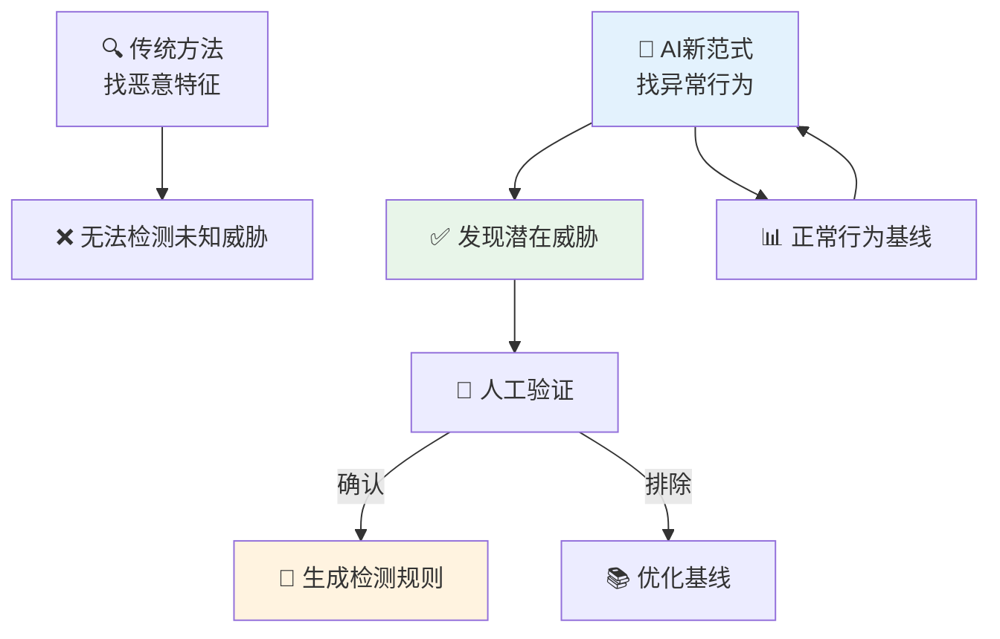

**作者：** HOS(安全风信子)

**日期：** 2026-04-24

**主要来源平台：** GitHub / HuggingFace / ModelScope / arXiv

**摘要：** 传统的安全检测依赖已知威胁特征库，面对未知威胁和零日漏洞时束手无策。未知威胁发现是安全运营的最高境界——在攻击者利用漏洞之前就发现其存在。本文深入探讨AI发现未知威胁的技术体系，涵盖无监督学习技术、基因变异性分析、未知威胁到IOC提取再到规则生成的完整链路、以及与传统安全工具的协同机制。通过三个完整实战案例展示AI技术在未知威胁发现中的实际应用价值，文章还评估了未知威胁发现的效果指标和改进方向[^1^]。

---

@[TOC](目录)

---

# 揪出零号病人：AI发现未知威胁的实战方法论

## 1 引言：未知威胁的挑战

### 1.1 为什么未知威胁最难发现

已知威胁有明确的特征——病毒签名、恶意域名、恶意IP地址。安全团队可以构建特征库，用规则或机器学习模型检测这些已知威胁。然而，未知威胁没有先验特征，使得传统检测方法失效。

**未知威胁的三个"无"特征**：

1. **无特征（No Signature）**：恶意软件经过变形，加壳、加密，传统的特征扫描无法检测
2. **无规则（No Rule）**：行为模式是全新的，现有的SIEM规则和YARA规则都匹配不上
3. **无先验（No Prior）**：没有任何历史数据表明这是恶意的，系统无法学习

根据CrowdStrike的《2024年全球威胁报告》[^2^]，超过68%的成功攻击使用了从未见过的恶意软件变种或攻击技术，这意味着一味依赖已知特征库的防御体系存在巨大的检测盲区。

未知威胁发现之所以困难，根本原因在于安全检测的本质是模式识别问题，而模式识别需要"已知模式"作为参照。传统的安全检测方法——无论是基于签名的杀毒软件还是基于规则的SIEM——都依赖于预先定义的攻击模式。这种方法在面对以下场景时会失效：

| 攻击场景 | 传统检测失效原因 |
|:---:|:---|
| 零日漏洞利用 | 没有已知签名，无法匹配 |
| 定制化恶意软件 | 仅针对特定目标开发，不在病毒库中 |
| 多态恶意软件 | 代码不断变化，特征扫描失效 |
| 无文件攻击 | 不落地磁盘，传统的端点检测无效 |
| 供应链攻击 | 合法软件被篡改，签名依然有效 |
| 社会工程攻击 | 技术指标正常，需要人工判断 |

### 1.2 AI发现未知威胁的范式转变

AI技术，特别是无监督学习和异常检测，为未知威胁发现提供了新思路。与其寻找"这个是恶意的"证据，不如寻找"这个与正常行为显著不同"的证据。



**AI发现未知威胁的核心思路**：

1. **建立正常行为基线**：学习正常情况下系统、用户、网络的行为模式
2. **检测显著偏差**：识别与正常基线存在显著偏差的异常行为
3. **聚类分析发现变种**：将相似异常聚类，发现已知攻击的未知变种
4. **规则生成形成闭环**：将发现的威胁转化为可部署的检测规则

**AI范式转变的技术优势**：

| 传统方法 | AI新方法 | 优势 |
|:---:|:---:|:---|
| 需要已知样本 | 仅需正常样本 | 不依赖攻击样本 |
| 特征工程复杂 | 自动特征学习 | 减少人工工作量 |
| 规则需要更新 | 模型自动适应 | 持续学习进化 |
| 检测已知威胁 | 可发现未知威胁 | 扩大覆盖范围 |
| 误报率高 | 可调检测阈值 | 灵活平衡精度召回 |

## 2 无监督学习技术体系

### 2.1 异常检测基础

无监督学习的核心假设是：正常行为是相似的，异常行为与正常行为不同。这种假设使得无监督学习特别适合未知威胁发现，因为我们很难收集到所有可能的攻击样本，但正常行为样本相对容易获取。

```python
class UnknownThreatDetector:
    """
    未知威胁检测器
    基于无监督学习的未知威胁发现
    """
    
    def __init__(self, config=None):
        self.config = config or {}
        self.baseline_builder = BehaviorBaselineBuilder()
        self.anomaly_detectors = {
            'isolation_forest': IsolationForestDetector(),
            'autoencoder': DeepAutoencoderDetector(),
            'one_class_svm': OneClassSVMDetector(),
            'dbscan': DensityBasedDetector(),
            'lstm': LSTMAnomalyDetector()
        }
        self.cluster_analyzer = ClusterAnalyzer()
        self.ioc_extractor = IOCExtractor()
        self.feature_engineering = FeatureEngineeringPipeline()
        
        self.baseline_cache = {}
        self.detection_history = DetectionHistoryStore()
    
    def detect_unknown_threats(self, data, entity_type='mixed'):
        """检测未知威胁"""
        baseline = self._get_or_build_baseline(
            data.get('historical'),
            entity_type
        )
        
        current_events = data['current']
        
        processed_events = self.feature_engineering.process(
            current_events,
            entity_type=entity_type
        )
        
        anomalies = self._detect_anomalies(processed_events, baseline)
        
        threat_clusters = self.cluster_analyzer.analyze(
            anomalies,
            min_cluster_size=self.config.get('min_cluster_size', 3)
        )
        
        refined_threats = self._filter_false_positives(
            threat_clusters,
            baseline
        )
        
        for threat in refined_threats:
            self.detection_history.record(threat)
        
        return {
            'threats': refined_threats,
            'anomaly_count': len(anomalies),
            'threat_clusters': len(threat_clusters),
            'detection_time': datetime.now().isoformat(),
            'baseline_info': baseline.get('info', {})
        }
    
    def _get_or_build_baseline(self, historical_data, entity_type):
        """获取或构建基线"""
        cache_key = f"{entity_type}_baseline"
        
        if cache_key in self.baseline_cache:
            cached_baseline = self.baseline_cache[cache_key]
            if self._is_baseline_valid(cached_baseline):
                return cached_baseline
        
        baseline = self.baseline_builder.build(
            historical_data,
            entity_type=entity_type,
            time_window=self.config.get('baseline_window', '30d')
        )
        
        self.baseline_cache[cache_key] = baseline
        
        return baseline
    
    def _is_baseline_valid(self, baseline):
        """检查基线是否有效"""
        baseline_age = datetime.now() - baseline.get('created_at')
        max_age = timedelta(days=self.config.get('baseline_max_age_days', 7))
        
        return baseline_age < max_age
    
    def _detect_anomalies(self, events, baseline):
        """多算法异常检测"""
        all_anomalies = []
        
        for detector_name, detector in self.anomaly_detectors.items():
            try:
                scores = detector.predict_scores(events, baseline)
                
                threshold = self._calculate_adaptive_threshold(
                    scores,
                    method=self.config.get('threshold_method', 'percentile')
                )
                
                anomalies = self._extract_anomalies(events, scores, threshold)
                
                for anomaly in anomalies:
                    anomaly['detector'] = detector_name
                    anomaly['raw_score'] = scores[anomaly['index']]
                
                all_anomalies.extend(anomalies)
                
            except Exception as e:
                logger.warning(f"Detector {detector_name} failed: {e}")
        
        deduplicated = self._deduplicate_anomalies(all_anomalies)
        
        return sorted(
            deduplicated,
            key=lambda x: x.get('normalized_score', 0),
            reverse=True
        )
    
    def _calculate_adaptive_threshold(self, scores, method='percentile'):
        """计算自适应阈值"""
        if method == 'percentile':
            percentile = self.config.get('threshold_percentile', 95)
            return np.percentile(scores, percentile)
        elif method == 'mad':
            median = np.median(scores)
            mad = np.median(np.abs(scores - median))
            threshold = median + (3 * 1.4826 * mad)
            return threshold
        elif method == 'sigma':
            mean = np.mean(scores)
            std = np.std(scores)
            sigma = self.config.get('sigma_multiplier', 3)
            return mean + sigma * std
        else:
            return self.config.get('fixed_threshold', 0.5)
    
    def _extract_anomalies(self, events, scores, threshold):
        """提取异常事件"""
        anomalies = []
        
        for i, (event, score) in enumerate(zip(events, scores)):
            if abs(score) > threshold:
                anomalies.append({
                    'event': event,
                    'index': i,
                    'score': score,
                    'normalized_score': self._normalize_score(score, threshold)
                })
        
        return anomalies
    
    def _normalize_score(self, score, threshold):
        """标准化分数"""
        if score <= threshold:
            return 0.0
        
        max_expected = threshold * 10
        return min(1.0, (score - threshold) / (max_expected - threshold))
    
    def _deduplicate_anomalies(self, anomalies):
        """去重异常"""
        seen_signatures = {}
        deduplicated = []
        
        for anomaly in anomalies:
            event = anomaly.get('event', {})
            signature = self._generate_event_signature(event)
            
            if signature not in seen_signatures:
                seen_signatures[signature] = anomaly
                deduplicated.append(anomaly)
            else:
                existing = seen_signatures[signature]
                if anomaly.get('normalized_score', 0) > existing.get('normalized_score', 0):
                    seen_signatures[signature] = anomaly
        
        return list(seen_signatures.values())
    
    def _generate_event_signature(self, event):
        """生成事件签名"""
        key_fields = [
            event.get('event_type'),
            event.get('source_ip'),
            event.get('destination_ip'),
            event.get('process_name'),
            event.get('user')
        ]
        
        return hashlib.md5(
            '|'.join(str(f) for f in key_fields).encode()
        ).hexdigest()
    
    def _filter_false_positives(self, threat_clusters, baseline):
        """过滤误报"""
        filtered = []
        
        for cluster in threat_clusters:
            if self._is_likely_threat(cluster, baseline):
                filtered.append(cluster)
        
        return filtered
    
    def _is_likely_threat(self, cluster, baseline):
        """判断是否为可能的威胁"""
        if cluster.get('size', 0) < self.config.get('min_cluster_size', 3):
            return False
        
        avg_score = cluster.get('average_score', 0)
        if avg_score < self.config.get('min_threat_score', 0.6):
            return False
        
        cluster_context = cluster.get('context', {})
        if self._matches_known_good_context(cluster_context, baseline):
            return False
        
        return True
    
    def _matches_known_good_context(self, context, baseline):
        """匹配已知的正常上下文"""
        known_good = baseline.get('known_good_contexts', [])
        
        for good_context in known_good:
            if self._context_matches(context, good_context):
                return True
        
        return False
    
    def _context_matches(self, context1, context2):
        """上下文是否匹配"""
        matching_fields = 0
        total_fields = len(context2)
        
        for field, value in context2.items():
            if context1.get(field) == value:
                matching_fields += 1
        
        return matching_fields / total_fields > 0.8 if total_fields > 0 else False
```

### 2.2 深度自编码器检测

深度自编码器通过学习数据的压缩表示，能够发现不符合正常模式的异常。自编码器的核心思想是：训练一个神经网络来学习数据的压缩表示，然后通过重构误差来检测异常——正常数据能够被很好地重构，而异常数据的重构误差会很大。

```python
class DeepAutoencoderDetector:
    """
    深度自编码器异常检测
    用于发现未知威胁
    """
    
    def __init__(self, config=None):
        self.config = config or {}
        self.latent_dim = self.config.get('latent_dim', 16)
        self.reconstruction_threshold = self.config.get('threshold', 0.05)
        self.epochs = self.config.get('epochs', 100)
        self.batch_size = self.config.get('batch_size', 32)
        
        self.autoencoder = None
        self.encoder_model = None
        self.scaler = StandardScaler()
        
        self.is_trained = False
        self.training_history = []
    
    def _build_autoencoder(self):
        """构建自编码器"""
        input_dim = self.config.get('input_dim', 128)
        
        input_layer = layers.Input(shape=(input_dim,))
        
        encoded = layers.Dense(64, activation='relu')(input_layer)
        encoded = layers.BatchNormalization()(encoded)
        encoded = layers.Dropout(0.2)(encoded)
        
        encoded = layers.Dense(32, activation='relu')(encoded)
        encoded = layers.BatchNormalization()(encoded)
        encoded = layers.Dropout(0.2)(encoded)
        
        encoded = layers.Dense(self.latent_dim, activation='relu', name='latent')(encoded)
        
        decoded = layers.Dense(32, activation='relu')(encoded)
        decoded = layers.BatchNormalization()(decoded)
        decoded = layers.Dropout(0.2)(decoded)
        
        decoded = layers.Dense(64, activation='relu')(decoded)
        decoded = layers.BatchNormalization()(decoded)
        decoded = layers.Dropout(0.2)(decoded)
        
        output = layers.Dense(input_dim, activation='sigmoid')(decoded)
        
        autoencoder = tf.keras.Model(input_layer, output)
        autoencoder.compile(
            optimizer=tf.keras.optimizers.Adam(
                learning_rate=self.config.get('learning_rate', 0.001)
            ),
            loss='mse'
        )
        
        encoder = tf.keras.Model(input_layer, encoded)
        
        return autoencoder, encoder
    
    def train(self, normal_data):
        """训练正常行为"""
        if self.autoencoder is None:
            input_dim = normal_data.shape[1] if len(normal_data.shape) > 1 else self.config.get('input_dim', 128)
            self.config['input_dim'] = input_dim
            self.autoencoder, self.encoder_model = self._build_autoencoder()
        
        scaled_data = self.scaler.fit_transform(normal_data)
        
        early_stopping = tf.keras.callbacks.EarlyStopping(
            monitor='val_loss',
            patience=10,
            restore_best_weights=True
        )
        
        history = self.autoencoder.fit(
            scaled_data, scaled_data,
            epochs=self.epochs,
            batch_size=self.batch_size,
            validation_split=0.1,
            callbacks=[early_stopping],
            verbose=0
        )
        
        self.training_history = history.history
        self.is_trained = True
        
        return self
    
    def predict_scores(self, data, baseline=None):
        """预测异常分数"""
        if baseline is not None and not self.is_trained:
            combined = np.vstack([data, baseline])
            self.train(combined)
        
        if not self.is_trained:
            raise ValueError("Model not trained. Call train() first.")
        
        scaled_data = self.scaler.transform(data)
        
        reconstructions = self.autoencoder.predict(scaled_data, verbose=0)
        
        mse = np.mean(np.square(scaled_data - reconstructions), axis=1)
        
        return mse
    
    def detect(self, data, threshold=None):
        """检测异常"""
        if threshold is None:
            threshold = self.reconstruction_threshold
        
        scores = self.predict_scores(data)
        
        return scores > threshold
    
    def get_reconstruction_error_distribution(self, data):
        """获取重构误差分布"""
        scores = self.predict_scores(data)
        
        return {
            'mean': float(np.mean(scores)),
            'std': float(np.std(scores)),
            'min': float(np.min(scores)),
            'max': float(np.max(scores)),
            'percentiles': {
                '50': float(np.percentile(scores, 50)),
                '90': float(np.percentile(scores, 90)),
                '95': float(np.percentile(scores, 95)),
                '99': float(np.percentile(scores, 99))
            }
        }
    
    def visualize_reconstruction(self, data, labels=None):
        """可视化重构结果"""
        scaled_data = self.scaler.transform(data)
        reconstructions = self.autoencoder.predict(scaled_data, verbose=0)
        
        errors = np.mean(np.square(scaled_data - reconstructions), axis=1)
        
        if self.latent_dim <= 2:
            latent_repr = self.encoder_model.predict(scaled_data, verbose=0)
            
            return {
                'latent_representation': latent_repr.tolist(),
                'reconstruction_errors': errors.tolist(),
                'visualization_type': 'latent_space'
            }
        else:
            pca = PCA(n_components=2)
            reconstructed_space = pca.fit_transform(scaled_data)
            
            return {
                'pca_representation': reconstructed_space.tolist(),
                'reconstruction_errors': errors.tolist(),
                'visualization_type': 'pca'
            }
```

### 2.3 聚类分析发现变种

聚类分析是将相似的样本分组的技术，在未知威胁发现中，我们使用聚类来发现：
1. 已知攻击的未知变种
2. 新的攻击模式
3. 异常行为的自然分组

```python
class ThreatVariantClusterAnalyzer:
    """
    威胁变种聚类分析器
    发现攻击的未知变种
    """
    
    def __init__(self, config=None):
        self.config = config or {}
        self.feature_extractor = ThreatFeatureExtractor()
        self.clustering_algorithms = {
            'hdbscan': HDBSCANClusterer(
                min_cluster_size=self.config.get('min_cluster_size', 5),
                min_samples=self.config.get('min_samples', 3)
            ),
            'spectral': SpectralClusterer(
                n_clusters=self.config.get('max_clusters', 10)
            ),
            'agglomerative': AgglomerativeClusterer(
                distance_threshold=self.config.get('distance_threshold', 0.5)
            ),
            'dbscan': DBSCANClusterer(
                eps=self.config.get('dbscan_eps', 0.5),
                min_samples=self.config.get('dbscan_min_samples', 5)
            )
        }
        
        self.known_attack_database = KnownAttackDatabase()
        self.variant_history = VariantHistoryStore()
    
    def analyze_variants(self, threats, entity_type='mixed'):
        """分析威胁变种"""
        if len(threats) < 2:
            return {
                'variants': threats,
                'clusters': [],
                'novel_variants': threats,
                'summary': {'total_threats': len(threats), 'clusters_found': 0}
            }
        
        features = np.array([
            self.feature_extractor.extract(t, entity_type=entity_type)
            for t in threats
        ])
        
        clusters = self._apply_clustering_algorithms(features)
        
        consensus_clusters = self._generate_consensus_clusters(clusters, features)
        
        variant_groups = self._group_into_variants(threats, consensus_clusters, features)
        
        novel_variants = self._identify_novel_variants(variant_groups)
        
        threat_clusters = self._build_threat_clusters(variant_groups, threats, features)
        
        return {
            'variants': variant_groups,
            'clusters': clusters,
            'novel_variants': novel_variants,
            'threat_clusters': threat_clusters,
            'summary': self._generate_summary(variant_groups, novel_variants, threats)
        }
    
    def _apply_clustering_algorithms(self, features):
        """应用聚类算法"""
        results = {}
        
        for name, algorithm in self.clustering_algorithms.items():
            try:
                if name == 'hdbscan':
                    cluster_labels = algorithm.fit_predict(features)
                elif name == 'spectral':
                    n_clusters = min(self.config.get('max_clusters', 10), len(features))
                    algorithm = SpectralClusterer(n_clusters=n_clusters)
                    cluster_labels = algorithm.fit_predict(features)
                elif name == 'agglomerative':
                    cluster_labels = algorithm.fit_predict(features)
                elif name == 'dbscan':
                    cluster_labels = algorithm.fit_predict(features)
                
                results[name] = {
                    'labels': cluster_labels,
                    'n_clusters': len(set(cluster_labels)) - (1 if -1 in cluster_labels else 0)
                }
                
            except Exception as e:
                logger.warning(f"Clustering algorithm {name} failed: {e}")
        
        return results
    
    def _generate_consensus_clusters(self, cluster_results, features):
        """生成共识聚类"""
        if not cluster_results:
            return np.zeros(len(features))
        
        label_arrays = []
        for result in cluster_results.values():
            labels = result['labels']
            if len(labels) == len(features):
                label_arrays.append(labels)
        
        if not label_arrays:
            return np.zeros(len(features))
        
        co_association_matrix = np.zeros((len(features), len(features)))
        
        for labels in label_arrays:
            for i in range(len(features)):
                for j in range(len(features)):
                    if labels[i] == labels[j] and labels[i] != -1:
                        co_association_matrix[i, j] += 1
                    elif labels[i] != labels[j] or labels[i] == -1:
                        co_association_matrix[i, j] -= 0.5
        
        co_association_matrix = co_association_matrix / len(label_arrays)
        
        consensus_labels = self._hierarchical_consensus(co_association_matrix)
        
        return consensus_labels
    
    def _hierarchical_consensus(self, co_association_matrix):
        """层次共识聚类"""
        distance_matrix = 1 - co_association_matrix
        
        linkage = hierarchy.linkage(
            distance_matrix[np.triu_indices(len(distance_matrix), k=1)],
            method='average'
        )
        
        threshold = self.config.get('consensus_threshold', 0.5)
        consensus_labels = hierarchy.fcluster(linkage, t=threshold, criterion='distance')
        
        return consensus_labels - 1
    
    def _group_into_variants(self, threats, clusters, features):
        """分组为变种"""
        variant_groups = {}
        
        for i, (threat, cluster_id) in enumerate(zip(threats, clusters)):
            if cluster_id not in variant_groups:
                variant_groups[cluster_id] = {
                    'cluster_id': cluster_id,
                    'threats': [],
                    'features': [],
                    'common_iocs': [],
                    'attack_patterns': [],
                    'confidence': 0.0
                }
            
            variant_groups[cluster_id]['threats'].append(threat)
            variant_groups[cluster_id]['features'].append(features[i])
        
        for cluster_id, group in variant_groups.items():
            group['features'] = np.array(group['features'])
            group['centroid'] = np.mean(group['features'], axis=0)
            group['size'] = len(group['threats'])
            
            if group['size'] > 1:
                group['intra_distance'] = float(
                    np.mean([
                        np.linalg.norm(group['features'][i] - group['features'][j])
                        for i in range(group['size'])
                        for j in range(i + 1, group['size'])
                    ])
                )
            else:
                group['intra_distance'] = 0.0
            
            group['confidence'] = self._calculate_cluster_confidence(group)
        
        return list(variant_groups.values())
    
    def _identify_novel_variants(self, variant_groups):
        """识别新颖变种"""
        novel = []
        
        for group in variant_groups:
            if group['size'] < self.config.get('min_variant_size', 2):
                novelty_score = 1.0
            else:
                similarity_to_known = self._check_similarity_to_known_attacks(group)
                novelty_score = 1.0 - similarity_to_known
            
            if novelty_score > self.config.get('novelty_threshold', 0.7):
                group['novelty_score'] = novelty_score
                group['is_novel'] = True
                novel.append(group)
            else:
                group['novelty_score'] = novelty_score
                group['is_novel'] = False
        
        return novel
    
    def _check_similarity_to_known_attacks(self, variant_group):
        """检查与已知攻击的相似性"""
        centroid = variant_group['centroid']
        
        similar_attacks = self.known_attack_database.find_similar(centroid, top_k=5)
        
        if not similar_attacks:
            return 0.0
        
        max_similarity = max(attack['similarity'] for attack in similar_attacks)
        
        return max_similarity
    
    def _calculate_cluster_confidence(self, cluster):
        """计算聚类置信度"""
        size_factor = min(1.0, cluster['size'] / 10)
        
        distance_factor = 1.0 - min(1.0, cluster.get('intra_distance', 0) / 2.0)
        
        confidence = (size_factor * 0.4 + distance_factor * 0.6)
        
        return confidence
    
    def _build_threat_clusters(self, variant_groups, threats, features):
        """构建威胁聚类结果"""
        threat_clusters = []
        
        for group in variant_groups:
            threat_indices = [i for i, c in enumerate(group.get('cluster_id'))]
            
            cluster_threats = [threats[i] for i in threat_indices]
            cluster_features = features[threat_indices]
            
            threat_clusters.append({
                'cluster_id': group['cluster_id'],
                'threats': cluster_threats,
                'features': cluster_features,
                'centroid': group['centroid'],
                'size': len(cluster_threats),
                'confidence': group['confidence'],
                'is_novel': group.get('is_novel', False),
                'novelty_score': group.get('novelty_score', 0.0)
            })
        
        return threat_clusters
    
    def _generate_summary(self, variant_groups, novel_variants, all_threats):
        """生成摘要"""
        return {
            'total_threats': len(all_threats),
            'total_clusters': len(variant_groups),
            'novel_variants_count': len(novel_variants),
            'known_variants_count': len(variant_groups) - len(novel_variants),
            'avg_cluster_size': np.mean([g['size'] for g in variant_groups]) if variant_groups else 0,
            'novelty_rate': len(novel_variants) / len(variant_groups) if variant_groups else 0
        }
```

## 3 基因变异性分析

### 3.1 恶意软件基因分析

恶意软件通常不是完全从零编写的，而是基于已有代码库修改而来。基因分析可以发现这种继承关系，通过识别恶意软件的代码片段、编译特征、加密算法等"基因"，将其与已知恶意软件家族进行比对，从而发现未知变种。

```python
class MalwareGeneAnalyzer:
    """
    恶意软件基因分析器
    通过代码相似性发现变种
    """
    
    def __init__(self, config=None):
        self.config = config or {}
        self.similarity_engine = SimilarityEngine()
        self.gene_tracker = GeneTracker()
        self.family_classifier = FamilyClassifier()
        
        self.gene_database = GeneDatabase()
        self.family_registry = FamilyRegistry()
        
        self.extractors = {
            'binary': BinaryGeneExtractor(self.config),
            'script': ScriptGeneExtractor(self.config),
            'document': DocumentGeneExtractor(self.config),
            'memory': MemoryGeneExtractor(self.config)
        }
    
    def analyze_malware_genes(self, sample):
        """分析恶意软件基因"""
        sample_type = self._identify_sample_type(sample)
        
        genes = self._extract_gene_segments(sample, sample_type)
        
        similar_genes = self.similarity_engine.find_similar_genes(
            genes,
            top_k=self.config.get('similar_genes_count', 20)
        )
        
        gene_family = self.gene_tracker.trace_lineage(genes)
        
        variant_assessment = self._assess_variant_relationship(
            sample, gene_family, similar_genes
        )
        
        generated_iocs = self._extract_genes_as_iocs(genes)
        
        detection_rules = self._generate_gene_based_rules(genes, variant_assessment)
        
        return {
            'sample_id': sample.get('id'),
            'sample_type': sample_type,
            'genes': genes,
            'similar_genes': similar_genes,
            'family': gene_family,
            'variant_type': variant_assessment['type'],
            'novelty_score': variant_assessment['novelty_score'],
            'confidence': variant_assessment['confidence'],
            'iocs': generated_iocs,
            'detection_rules': detection_rules,
            'analysis_timestamp': datetime.now().isoformat()
        }
    
    def _identify_sample_type(self, sample):
        """识别样本类型"""
        if sample.get('type'):
            return sample['type']
        
        content = sample.get('content', b'')
        
        if content.startswith(b'MZ'):
            return 'binary'
        elif content.startswith(b'#') or 'function' in content.decode('utf-8', errors='ignore'):
            return 'script'
        elif b'PK' in content[:4]:
            return 'document'
        else:
            return 'unknown'
    
    def _extract_gene_segments(self, sample, sample_type):
        """提取基因片段"""
        extractor = self.extractors.get(sample_type)
        
        if not extractor:
            return []
        
        genes = extractor.extract(sample)
        
        for gene in genes:
            gene['metadata'] = {
                'sample_id': sample.get('id'),
                'extraction_time': datetime.now().isoformat(),
                'extractor_version': extractor.version
            }
        
        return genes
    
    def _assess_variant_relationship(self, sample, family, similar_genes):
        """评估变种关系"""
        if not family and not similar_genes:
            return {
                'type': 'novel_malware',
                'novelty_score': 1.0,
                'confidence': 0.5,
                'related_families': []
            }
        
        if not similar_genes:
            return {
                'type': 'possibly_novel',
                'novelty_score': 0.8,
                'confidence': 0.4,
                'related_families': []
            }
        
        top_matches = similar_genes[:5]
        
        avg_similarity = np.mean([m['similarity'] for m in top_matches])
        
        family_similarity = 0.0
        if family:
            family_similarities = []
            for ref_gene in family.get('reference_genes', []):
                for match in similar_genes:
                    if match.get('gene_id') == ref_gene.get('id'):
                        family_similarities.append(match['similarity'])
            if family_similarities:
                family_similarity = np.max(family_similarities)
        
        max_similarity = max(avg_similarity, family_similarity)
        
        if max_similarity > 0.95:
            variant_type = 'same_malware'
            novelty_score = 0.0
        elif max_similarity > 0.8:
            variant_type = 'close_variant'
            novelty_score = 1.0 - max_similarity
        elif max_similarity > 0.6:
            variant_type = 'distant_variant'
            novelty_score = 0.7
        else:
            variant_type = 'possibly_novel_family'
            novelty_score = 0.85
        
        return {
            'type': variant_type,
            'novelty_score': novelty_score,
            'confidence': max_similarity,
            'related_families': [m.get('family_name') for m in top_matches[:3]],
            'top_matches': top_matches
        }
    
    def _extract_genes_as_iocs(self, genes):
        """从基因提取IOC"""
        iocs = []
        
        for gene in genes:
            if gene.get('type') == 'ip_address':
                iocs.append({
                    'type': 'ip',
                    'value': gene['value'],
                    'source': 'gene_analysis',
                    'confidence': gene.get('confidence', 0.8)
                })
            elif gene.get('type') == 'domain':
                iocs.append({
                    'type': 'domain',
                    'value': gene['value'],
                    'source': 'gene_analysis',
                    'confidence': gene.get('confidence', 0.8)
                })
            elif gene.get('type') == 'mutex':
                iocs.append({
                    'type': 'mutex',
                    'value': gene['value'],
                    'source': 'gene_analysis',
                    'confidence': gene.get('confidence', 0.7)
                })
            elif gene.get('type') == 'api_sequence':
                iocs.append({
                    'type': 'behavioral_signature',
                    'value': gene['value'],
                    'source': 'gene_analysis',
                    'confidence': gene.get('confidence', 0.9)
                })
        
        return iocs
    
    def _generate_gene_based_rules(self, genes, variant_assessment):
        """生成基于基因的检测规则"""
        rules = []
        
        for gene in genes:
            if gene.get('type') == 'string_pattern':
                rule = {
                    'type': 'yara',
                    'name': f"Gene_{gene.get('id')}_{gene.get('name')}",
                    'condition': f"strings: $s1 = \"{gene['value']}\"',
                    'metadata': {
                        'gene_id': gene.get('id'),
                        'variant_type': variant_assessment['type']
                    }
                }
                rules.append(rule)
            
            elif gene.get('type') == 'api_sequence':
                rule = {
                    'type': 'sigma',
                    'name': f"API_Gene_{gene.get('id')}",
                    'condition': gene['value'],
                    'metadata': {
                        'gene_id': gene.get('id'),
                        'variant_type': variant_assessment['type']
                    }
                }
                rules.append(rule)
        
        return rules


class BinaryGeneExtractor:
    """二进制基因提取器"""
    
    def __init__(self, config):
        self.version = "1.0"
        self.pe_analyzer = PEAnalyzer()
        self.section_hasher = SectionHasher()
        self.import_analyzer = ImportAnalyzer()
        self.string_extractor = StringExtractor()
    
    def extract(self, sample):
        """提取二进制基因"""
        genes = []
        
        try:
            pe_struct = self.pe_analyzer.analyze(sample['content'])
            
            section_genes = self.section_hasher.extract_sections(pe_struct)
            genes.extend(section_genes)
            
            import_genes = self.import_analyzer.extract_imports(pe_struct)
            genes.extend(import_genes)
            
            string_genes = self.string_extractor.extract_strings(
                sample['content'],
                min_length=self.config.get('min_string_length', 8)
            )
            genes.extend(string_genes)
            
            entropy_genes = self._extract_entropy_regions(sample['content'])
            genes.extend(entropy_genes)
            
        except Exception as e:
            logger.warning(f"Binary gene extraction failed: {e}")
        
        return genes
    
    def _extract_entropy_regions(self, content):
        """提取熵异常区域"""
        genes = []
        
        window_size = 256
        step = 64
        
        for i in range(0, len(content) - window_size, step):
            window = content[i:i + window_size]
            entropy = self._calculate_entropy(window)
            
            if entropy > 7.0 or entropy < 2.0:
                genes.append({
                    'type': 'entropy_region',
                    'offset': i,
                    'size': window_size,
                    'entropy': entropy,
                    'value': window.hex()
                })
        
        return genes
    
    def _calculate_entropy(self, data):
        """计算香农熵"""
        if not data:
            return 0.0
        
        byte_counts = [0] * 256
        for byte in data:
            byte_counts[byte] += 1
        
        entropy = 0.0
        for count in byte_counts:
            if count > 0:
                p = count / len(data)
                entropy -= p * math.log2(p)
        
        return entropy
```

### 3.2 行为变异检测

除了代码层面的基因分析，行为变异检测关注的是攻击行为模式。攻击者可能会修改代码实现，但往往会保留相似的行为模式，例如创建特定的文件路径、使用类似的加密算法、建立相似的网络连接模式等。

```python
class BehavioralVariantDetector:
    """
    行为变种检测器
    检测攻击行为的变异
    """
    
    def __init__(self, config=None):
        self.config = config or {}
        self.behavior_extractor = BehaviorExtractor()
        self.sequence_analyzer = SequenceAnalyzer()
        self.variant_scorer = VariantScorer()
        self.pattern_miner = PatternMiner()
        
        self.known_patterns = KnownAttackPatternDatabase()
        self.behavior_history = BehaviorHistoryStore()
    
    def detect_behavioral_variants(self, current_behavior, entity_type='host'):
        """检测行为变种"""
        current_sequence = self.behavior_extractor.extract_sequence(
            current_behavior,
            entity_type=entity_type
        )
        
        normalized_sequence = self._normalize_sequence(current_sequence)
        
        known_patterns = self.known_patterns.get_relevant_patterns(
            entity_type=entity_type
        )
        
        matched_patterns = []
        for pattern in known_patterns:
            pattern_sequence = pattern['sequence']
            
            similarity = self.sequence_analyzer.calculate_similarity(
                normalized_sequence,
                pattern_sequence,
                method=self.config.get('similarity_method', 'edit_distance')
            )
            
            if similarity > self.config.get('base_similarity_threshold', 0.5):
                matched_patterns.append({
                    'pattern': pattern,
                    'similarity': similarity,
                    'matched_elements': self._get_matched_elements(
                        normalized_sequence,
                        pattern_sequence
                    )
                })
        
        matched_patterns.sort(key=lambda x: x['similarity'], reverse=True)
        
        if matched_patterns:
            result = {
                'is_variant': True,
                'matched_patterns': matched_patterns,
                'variant_score': matched_patterns[0]['similarity'],
                'is_novel': matched_patterns[0]['similarity'] < self.config.get('novel_threshold', 0.7),
                'requires_investigation': matched_patterns[0]['similarity'] < self.config.get('investigation_threshold', 0.8)
            }
        else:
            behavioral_novelty = self._assess_behavioral_novelty(normalized_sequence)
            
            result = {
                'is_variant': False,
                'is_novel_behavior': True,
                'novelty_score': behavioral_novelty,
                'requires_investigation': behavioral_novelty > self.config.get('novel_investigation_threshold', 0.6)
            }
        
        if current_behavior.get('detailed_events'):
            extracted_patterns = self.pattern_miner.extract_patterns(
                current_behavior['detailed_events']
            )
            result['extracted_patterns'] = extracted_patterns
        
        return result
    
    def _normalize_sequence(self, sequence):
        """标准化序列"""
        normalized = []
        
        for item in sequence:
            normalized_item = {
                'action': self._normalize_action(item.get('action')),
                'target_type': item.get('target_type', 'unknown'),
                'result': item.get('result', 'unknown')
            }
            
            if item.get('parameters'):
                normalized_item['parameters'] = self._normalize_parameters(
                    item['parameters']
                )
            
            normalized.append(normalized_item)
        
        return normalized
    
    def _normalize_action(self, action):
        """标准化动作"""
        action_mapping = {
            'create_process': ['CreateProcess', 'createProcess', 'createprocess'],
            'write_file': ['WriteFile', 'writeFile', 'write_file', 'Write'],
            'read_file': ['ReadFile', 'readFile', 'read_file', 'Read'],
            'network_connect': ['connect', 'NetworkConnect', 'Connect'],
            'registry_write': ['RegSetValue', 'registryWrite', 'RegWrite'],
            'dll_load': ['LoadLibrary', 'dll_load', 'LoadDll']
        }
        
        if not action:
            return 'unknown'
        
        action_lower = action.lower()
        for normalized, variants in action_mapping.items():
            if action_lower in [v.lower() for v in variants]:
                return normalized
        
        return action
    
    def _normalize_parameters(self, parameters):
        """标准化参数"""
        normalized = {}
        
        path_keys = ['path', 'file', 'filename', 'target']
        for key in path_keys:
            for pk, pv in parameters.items():
                if key in pk.lower() and isinstance(pv, str):
                    normalized['normalized_path'] = self._normalize_path(pv)
                    break
        
        for key, value in parameters.items():
            if isinstance(value, str) and len(value) < 100:
                normalized[key] = value
        
        return normalized
    
    def _normalize_path(self, path):
        """标准化路径"""
        if not path:
            return 'unknown'
        
        path = path.replace('\\', '/')
        
        parts = path.split('/')
        normalized_parts = []
        for part in parts:
            if part and not part.replace(':', '').replace(' ', '').isalnum():
                normalized_parts.append('VARIABLE')
            else:
                normalized_parts.append(part.lower())
        
        return '/'.join(normalized_parts)
    
    def _assess_behavioral_novelty(self, sequence):
        """评估行为新颖性"""
        historical_sequences = self.behavior_history.get_recent_sequences(
            limit=1000
        )
        
        if not historical_sequences:
            return 0.8
        
        similarities = []
        for historical in historical_sequences:
            sim = self.sequence_analyzer.calculate_similarity(
                sequence,
                historical,
                method='jaccard'
            )
            similarities.append(sim)
        
        avg_similarity = np.mean(similarities)
        
        novelty_score = 1.0 - avg_similarity
        
        return novelty_score
```

## 4 IOC自动提取与规则生成

### 4.1 IOC自动提取

从发现的未知威胁中自动提取可操作的威胁指标（IOC），是未知威胁发现流程的关键环节。提取的IOC可以用于创建检测规则、丰富威胁情报、或者直接用于阻断正在进行的攻击。

```python
class AutomatedIOCExtractor:
    """
    自动IOC提取器
    从未知威胁中提取指标
    """
    
    def __init__(self, config=None):
        self.config = config or {}
        self.extractors = {
            'ip': IPIndicatorExtractor(self.config),
            'domain': DomainIndicatorExtractor(self.config),
            'hash': HashIndicatorExtractor(self.config),
            'url': URLIndicatorExtractor(self.config),
            'mutex': MutexIndicatorExtractor(self.config),
            'registry': RegistryIndicatorExtractor(self.config),
            'certificate': CertificateIndicatorExtractor(self.config),
            'email': EmailIndicatorExtractor(self.config)
        }
        
        self.validator = IOCValidator()
        self.enricher = ThreatIntelligenceEnricher()
        
        self.extraction_history = ExtractionHistoryStore()
    
    def extract_iocs(self, threat_data):
        """自动提取IOC"""
        sample_type = threat_data.get('type', 'unknown')
        
        iocs = {}
        
        if sample_type == 'file' or threat_data.get('content'):
            file_iocs = self._extract_from_file(threat_data)
            iocs.update(file_iocs)
        
        if sample_type == 'memory' or threat_data.get('memory_dump'):
            memory_iocs = self._extract_from_memory(threat_data)
            iocs.update(memory_iocs)
        
        if sample_type == 'network' or threat_data.get('network_capture'):
            network_iocs = self._extract_from_network(threat_data)
            iocs.update(network_iocs)
        
        if sample_type == 'behavior' or threat_data.get('behavior_log'):
            behavior_iocs = self._extract_from_behavior(threat_data)
            iocs.update(behavior_iocs)
        
        validated_iocs = self._validate_extracted_iocs(iocs)
        
        enriched_iocs = self._enrich_with_context(validated_iocs, threat_data)
        
        enriched_iocs = self._enrich_with_threat_intel(enriched_iocs)
        
        self.extraction_history.record({
            'threat_id': threat_data.get('id'),
            'extracted_iocs': enriched_iocs,
            'timestamp': datetime.now().isoformat()
        })
        
        return enriched_iocs
    
    def _extract_from_file(self, threat_data):
        """从文件提取IOC"""
        iocs = {}
        
        content = threat_data.get('content', b'')
        
        if isinstance(content, str):
            content = content.encode()
        
        iocs['hashes'] = self.extractors['hash'].extract(content)
        
        strings = self._extract_strings(content)
        for string in strings:
            if self._is_ip_pattern(string):
                iocs.setdefault('ip_addresses', []).extend(
                    self.extractors['ip'].extract_from_string(string)
                )
            elif self._is_domain_pattern(string):
                iocs.setdefault('domains', []).extend(
                    self.extractors['domain'].extract_from_string(string)
                )
            elif self._is_url_pattern(string):
                iocs.setdefault('urls', []).extend(
                    self.extractors['url'].extract_from_string(string)
                )
        
        if threat_data.get('pe_info'):
            pe_iocs = self._extract_pe_iocs(threat_data['pe_info'])
            iocs.update(pe_iocs)
        
        return iocs
    
    def _extract_strings(self, content, min_length=8):
        """提取字符串"""
        strings = []
        current = []
        
        for byte in content:
            if 32 <= byte <= 126:
                current.append(chr(byte))
            else:
                if len(current) >= min_length:
                    strings.append(''.join(current))
                current = []
        
        if len(current) >= min_length:
            strings.append(''.join(current))
        
        return strings
    
    def _is_ip_pattern(self, string):
        """判断是否为IP模式"""
        ip_pattern = r'\d{1,3}\.\d{1,3}\.\d{1,3}\.\d{1,3}'
        return bool(re.match(ip_pattern, string))
    
    def _is_domain_pattern(self, string):
        """判断是否为域名模式"""
        domain_pattern = r'[a-zA-Z0-9][a-zA-Z0-9-]*\.[a-zA-Z]{2,}'
        return bool(re.match(domain_pattern, string)) and '.' in string
    
    def _is_url_pattern(self, string):
        """判断是否为URL模式"""
        url_patterns = [
            r'https?://',
            r'ftp://',
            r'smb://'
        ]
        return any(re.match(p, string) for p in url_patterns)
    
    def _extract_pe_iocs(self, pe_info):
        """提取PE文件IOC"""
        iocs = {}
        
        if pe_info.get('imports'):
            suspicious_imports = self._filter_suspicious_imports(pe_info['imports'])
            if suspicious_imports:
                iocs['suspicious_imports'] = suspicious_imports
        
        if pe_info.get('exports'):
            iocs['exports'] = pe_info['exports']
        
        if pe_info.get('sections'):
            iocs['section_hashes'] = [
                {'name': s['name'], 'hash': s['hash']}
                for s in pe_info['sections']
            ]
        
        return iocs
    
    def _filter_suspicious_imports(self, imports):
        """过滤可疑导入"""
        suspicious_api = [
            'VirtualAlloc', 'VirtualProtect', 'WriteProcessMemory',
            'CreateRemoteThread', 'LoadLibrary', 'GetProcAddress',
            'InternetOpen', 'InternetReadFile', 'URLDownloadToFile',
            'CreateProcess', 'ShellExecute', 'WinExec'
        ]
        
        suspicious = []
        for imp in imports:
            if imp.get('name') in suspicious_api:
                suspicious.append(imp)
        
        return suspicious
    
    def _validate_extracted_iocs(self, iocs):
        """验证提取的IOC"""
        validated = {}
        
        for ioc_type, indicators in iocs.items():
            if not isinstance(indicators, list):
                indicators = [indicators]
            
            validated_indicators = []
            seen = set()
            
            for indicator in indicators:
                if not indicator:
                    continue
                
                value = indicator.get('value') if isinstance(indicator, dict) else indicator
                
                if not value or value in seen:
                    continue
                
                if self.validator.is_valid(value, ioc_type):
                    validated_indicators.append(
                        indicator if isinstance(indicator, dict) 
                        else {'value': indicator}
                    )
                    seen.add(value)
            
            if validated_indicators:
                validated[ioc_type] = validated_indicators
        
        return validated
    
    def _enrich_with_context(self, iocs, threat_data):
        """添加上下文"""
        enriched = {}
        
        for ioc_type, indicators in iocs.items():
            enriched_indicators = []
            
            for indicator in indicators:
                enriched_indicator = {
                    **indicator,
                    'context': {
                        'source_threat_id': threat_data.get('id'),
                        'source_type': threat_data.get('type'),
                        'first_seen': datetime.now().isoformat(),
                        'extraction_confidence': indicator.get('confidence', 0.8)
                    }
                }
                
                if threat_data.get('behavior'):
                    enriched_indicator['context']['related_behavior'] = \
                        self._extract_relevant_behavior(
                            indicator,
                            threat_data['behavior']
                        )
                
                enriched_indicators.append(enriched_indicator)
            
            enriched[ioc_type] = enriched_indicators
        
        return enriched
    
    def _extract_relevant_behavior(self, indicator, behavior_log):
        """提取相关行为"""
        relevant = []
        
        value = indicator.get('value') if isinstance(indicator, dict) else indicator
        
        for event in behavior_log:
            event_str = str(event)
            if str(value) in event_str:
                relevant.append(event)
        
        return relevant[:5]
    
    def _enrich_with_threat_intel(self, iocs):
        """使用威胁情报丰富IOC"""
        enriched = {}
        
        for ioc_type, indicators in iocs.items():
            enriched_indicators = []
            
            for indicator in indicators:
                intel_data = self.enricher.enrich(
                    indicator.get('value'),
                    ioc_type
                )
                
                enriched_indicator = {
                    **indicator,
                    'threat_intel': intel_data
                }
                
                enriched_indicators.append(enriched_indicator)
            
            enriched[ioc_type] = enriched_indicators
        
        return enriched
```

### 4.2 检测规则自动生成

将发现的未知威胁和提取的IOC自动转化为可部署的检测规则，是实现检测能力闭环的关键步骤。生成的规则需要支持多种格式（如YARA、Sigma、SNORT等），以适配不同的安全工具。

```python
class AutomatedRuleGenerator:
    """
    自动规则生成器
    从未知威胁生成检测规则
    """
    
    def __init__(self, config=None):
        self.config = config or {}
        self.rule_templates = RuleTemplateLibrary()
        self.snippet_generator = SnippetGenerator()
        
        self.supported_formats = ['yara', 'sigma', 'snort', 'suricata', 'stix']
        
        self.rule_history = RuleHistoryStore()
        self.validation_engine = RuleValidationEngine()
    
    def generate_rules(self, threat_data, iocs, output_formats=None):
        """生成检测规则"""
        if output_formats is None:
            output_formats = self.config.get('default_formats', ['sigma', 'yara'])
        
        rules = []
        
        for ioc_type, indicators in iocs.items():
            for ioc in indicators:
                for format_type in output_formats:
                    if format_type in self.supported_formats:
                        rule = self._generate_ioc_rule(
                            ioc, 
                            ioc_type,
                            format_type,
                            threat_data
                        )
                        if rule:
                            rules.append(rule)
        
        if threat_data.get('behavior'):
            behavior_rules = self._generate_behavior_rules(
                threat_data['behavior'],
                output_formats
            )
            rules.extend(behavior_rules)
        
        if threat_data.get('genes'):
            gene_rules = self._generate_gene_based_rules(
                threat_data['genes'],
                output_formats
            )
            rules.extend(gene_rules)
        
        optimized_rules = self._optimize_rules(rules)
        
        validated_rules = []
        for rule in optimized_rules:
            validation_result = self.validation_engine.validate(rule)
            if validation_result['is_valid']:
                validated_rules.append(rule)
            else:
                logger.warning(f"Rule validation failed: {validation_result['errors']}")
        
        for rule in validated_rules:
            self.rule_history.record(rule)
        
        return {
            'rules': validated_rules,
            'total_generated': len(rules),
            'total_valid': len(validated_rules),
            'by_format': self._count_by_format(validated_rules),
            'by_type': self._count_by_type(validated_rules)
        }
    
    def _generate_ioc_rule(self, ioc, ioc_type, format_type, threat_data):
        """生成IOC规则"""
        template = self.rule_templates.get_template(ioc_type, format_type)
        
        if not template:
            return None
        
        value = ioc.get('value') if isinstance(ioc, dict) else ioc
        
        confidence = ioc.get('confidence', 0.8) if isinstance(ioc, dict) else 0.8
        
        try:
            if format_type == 'yara':
                rule_code = self._generate_yara_rule(
                    template, value, ioc, threat_data
                )
            elif format_type == 'sigma':
                rule_code = self._generate_sigma_rule(
                    template, value, ioc, threat_data
                )
            elif format_type == 'snort':
                rule_code = self._generate_snort_rule(
                    template, value, ioc, threat_data
                )
            elif format_type == 'suricata':
                rule_code = self._generate_suricata_rule(
                    template, value, ioc, threat_data
                )
            else:
                rule_code = template.format(
                    indicator=value,
                    confidence=confidence,
                    category=ioc.get('category', 'threat'),
                    source=threat_data.get('id', 'unknown')
                )
        except Exception as e:
            logger.error(f"Rule generation failed for {format_type}: {e}")
            return None
        
        return {
            'type': 'ioc_rule',
            'ioc_type': ioc_type,
            'format': format_type,
            'rule': rule_code,
            'coverage': self._estimate_coverage(ioc_type),
            'false_positive_rate': self._estimate_fp_rate(ioc, ioc_type),
            'confidence': confidence,
            'metadata': {
                'source_threat': threat_data.get('id'),
                'generated_at': datetime.now().isoformat(),
                'ioc_context': ioc.get('context', {})
            }
        }
    
    def _generate_yara_rule(self, template, value, ioc, threat_data):
        """生成YARA规则"""
        rule_name = f"auto_{ioc_type}_{hashlib.md5(str(value).encode()).hexdigest()[:8]}"
        
        if ioc_type == 'hash':
            condition = f'$hash = {value}'
        elif ioc_type == 'ip':
            condition = f'$ip = {value}'
        elif ioc_type == 'domain':
            condition = f'$domain = "{value}"'
        elif ioc_type == 'url':
            condition = f'$url = "{value}"'
        else:
            condition = f'$indicator = "{value}"'
        
        yara_rule = f'''
rule {rule_name}
{{
    meta:
        description = "Auto-generated rule for {ioc_type}: {value}"
        author = "AI Threat Detection System"
        date = "{datetime.now().strftime('%Y-%m-%d')}"
        confidence = "{ioc.get('confidence', 0.8)}"
        source = "{threat_data.get('id', 'unknown')}"
    
    strings:
        {condition}
    
    condition:
        {condition.split('=')[0].strip()}
}}
'''
        return yara_rule.strip()
    
    def _generate_sigma_rule(self, template, value, ioc, threat_data):
        """生成Sigma规则"""
        rule_id = f"sig_{hashlib.md5(str(value).encode()).hexdigest()[:12]}"
        
        if ioc_type == 'ip':
            detection = f'''
    selection:
        - SourceIp|contains: "{value}"
        - DestinationIp|contains: "{value}"
    condition: selection'''
        elif ioc_type == 'domain':
            detection = f'''
    selection:
        - DomainName|contains: "{value}"
    condition: selection'''
        elif ioc_type == 'hash':
            detection = f'''
    selection:
        - Hash|contains: "{value}"
    condition: selection'''
        else:
            detection = f'''
    selection:
        - Field|contains: "{value}"
    condition: selection'''
        
        sigma_rule = f'''title: Auto-generated Detection for {ioc_type}
id: {rule_id}
status: experimental
description: Auto-generated rule for {value}
author: AI Threat Detection System
date: {datetime.now().strftime('%Y/%m/%d')}
logsource:
    product: security
    service: detection
detection:{detection}
level: {"high" if ioc.get('confidence', 0.8) > 0.7 else "medium"}
'''
        return sigma_rule.strip()
    
    def _generate_behavior_rules(self, behavior, output_formats):
        """生成行为规则"""
        rules = []
        
        behavior_patterns = self.pattern_miner.extract_patterns(behavior)
        
        for pattern in behavior_patterns:
            for format_type in output_formats:
                if format_type == 'sigma':
                    rule = self._generate_behavior_sigma_rule(pattern, format_type)
                    rules.append(rule)
                elif format_type == 'yara':
                    rule = self._generate_behavior_yara_rule(pattern, format_type)
                    rules.append(rule)
        
        return rules
    
    def _generate_behavior_sigma_rule(self, pattern, format_type):
        """生成行为Sigma规则"""
        rule_id = f"behavior_{pattern.get('id', hashlib.md5(str(pattern).encode()).hexdigest()[:8])}"
        
        sigma_rule = f'''title: Behavioral Detection - {pattern.get('name', 'Unknown Pattern')}
id: {rule_id}
status: experimental
description: Detects {pattern.get('description', 'suspicious behavior')}
author: AI Threat Detection System
date: {datetime.now().strftime('%Y/%m/%d')}
logsource:
    product: security
    service: endpoint
detection:
    selection:
        EventID: {pattern.get('event_ids', [1])}
    {pattern.get('detection_logic', '')}
condition: selection
level: medium
'''
        return {
            'type': 'behavior_rule',
            'format': format_type,
            'rule': sigma_rule.strip(),
            'confidence': pattern.get('confidence', 0.7),
            'metadata': {'pattern': pattern}
        }
    
    def _generate_gene_based_rules(self, genes, output_formats):
        """生成基于基因的规则"""
        rules = []
        
        for gene in genes:
            if gene.get('type') == 'api_sequence':
                for format_type in output_formats:
                    rule = self._generate_api_sequence_rule(gene, format_type)
                    if rule:
                        rules.append(rule)
        
        return rules
    
    def _generate_api_sequence_rule(self, gene, format_type):
        """生成API序列规则"""
        rule_id = f"api_gene_{gene.get('id', 'unknown')}"
        
        api_sequence = gene.get('value', [])
        
        if format_type == 'sigma':
            sigma_rule = f'''title: API Sequence Detection - {rule_id}
id: {rule_id}
status: experimental
description: Detects suspicious API sequence
author: AI Threat Detection System
date: {datetime.now().strftime('%Y/%m/%d')}
detection:
    selection:
        API|endswith:
{chr(10).join(f'            - "{api}"' for api in api_sequence[:5])}
    condition: selection
level: high
'''
            return {
                'type': 'gene_rule',
                'format': format_type,
                'rule': sigma_rule.strip(),
                'confidence': gene.get('confidence', 0.8),
                'metadata': {'gene': gene}
            }
        
        return None
    
    def _optimize_rules(self, rules):
        """优化规则"""
        optimized = []
        
        for rule in rules:
            if self._is_duplicate(rule, optimized):
                continue
            
            if rule.get('false_positive_rate', 1.0) > self.config.get('max_fp_rate', 0.1):
                continue
            
            optimized.append(rule)
        
        return optimized
    
    def _is_duplicate(self, rule, existing_rules):
        """检查是否重复"""
        rule_signature = self._generate_rule_signature(rule)
        
        for existing in existing_rules:
            existing_signature = self._generate_rule_signature(existing)
            
            if rule_signature == existing_signature:
                return True
        
        return False
    
    def _generate_rule_signature(self, rule):
        """生成规则签名"""
        key = f"{rule.get('type')}_{rule.get('format')}_{rule.get('rule', '')[:100]}"
        return hashlib.md5(key.encode()).hexdigest()
    
    def _estimate_coverage(self, ioc_type):
        """估算覆盖率"""
        coverage_map = {
            'hash': 'high',
            'ip': 'medium',
            'domain': 'medium',
            'url': 'medium',
            'mutex': 'low',
            'registry': 'low',
            'certificate': 'medium'
        }
        return coverage_map.get(ioc_type, 'unknown')
    
    def _estimate_fp_rate(self, ioc, ioc_type):
        """估算误报率"""
        confidence = ioc.get('confidence', 0.8) if isinstance(ioc, dict) else 0.8
        
        base_fp_rates = {
            'hash': 0.01,
            'ip': 0.05,
            'domain': 0.08,
            'url': 0.10,
            'mutex': 0.15,
            'registry': 0.20,
            'certificate': 0.05
        }
        
        base_rate = base_fp_rates.get(ioc_type, 0.1)
        
        return base_rate * (1 - confidence)
```

## 5 与传统安全工具协同

### 5.1 协同检测架构

AI未知威胁检测并非要替代传统安全工具，而是与传统工具形成互补。最佳实践是将AI检测与传统检测有机结合，形成多层次的防御体系。

```python
class HybridThreatDetectionSystem:
    """
    混合威胁检测系统
    结合AI未知威胁检测与传统检测
    """
    
    def __init__(self, config=None):
        self.config = config or {}
        
        self.traditional_detector = TraditionalDetector()
        self.ai_unknown_detector = UnknownThreatDetector()
        
        self.correlation_engine = CorrelationEngine()
        self.response_coordinator = ResponseCoordinator()
        
        self.detection_history = HybridDetectionHistory()
        
        self.weight_config = self.config.get('detection_weights', {
            'traditional': 0.6,
            'ai': 0.4
        })
    
    def detect(self, event):
        """混合检测"""
        detection_start = datetime.now()
        
        traditional_result = self.traditional_detector.detect(event)
        
        ai_result = self.ai_unknown_detector.detect(event)
        
        if traditional_result.get('is_malicious', False):
            result = self._create_traditional_detection_result(
                traditional_result,
                detection_start
            )
        elif ai_result.get('is_anomalous', False) and ai_result.get('confidence', 0) > self.config.get('ai_high_confidence_threshold', 0.85):
            result = self._create_ai_detection_result(
                ai_result,
                detection_start
            )
        elif traditional_result.get('confidence', 0) > 0 and ai_result.get('confidence', 0) > 0:
            correlated = self.correlation_engine.correlate(
                traditional_result,
                ai_result
            )
            
            if correlated.get('combined_confidence', 0) > self.config.get('correlation_threshold', 0.7):
                result = self._create_correlated_result(
                    correlated,
                    detection_start
                )
            else:
                result = self._create_no_detection_result(detection_start)
        else:
            result = self._create_no_detection_result(detection_start)
        
        self.detection_history.record(result)
        
        return result
    
    def _create_traditional_detection_result(self, traditional_result, start_time):
        """创建传统检测结果"""
        return {
            'is_malicious': True,
            'detection_type': 'traditional',
            'confidence': traditional_result.get('confidence', 0.9),
            'severity': traditional_result.get('severity', 'medium'),
            'matched_rules': traditional_result.get('matched_rules', []),
            'detection_time_ms': (datetime.now() - start_time).total_seconds() * 1000,
            'metadata': {
                'detection_source': 'signature_based',
                'matched_count': len(traditional_result.get('matched_rules', []))
            }
        }
    
    def _create_ai_detection_result(self, ai_result, start_time):
        """创建AI检测结果"""
        return {
            'is_malicious': True,
            'detection_type': 'ai_anomaly',
            'confidence': ai_result.get('confidence', 0.8),
            'severity': self._calculate_severity_from_confidence(
                ai_result.get('confidence', 0.8)
            ),
            'anomaly_score': ai_result.get('anomaly_score'),
            'anomaly_detectors': ai_result.get('detectors', []),
            'detection_time_ms': (datetime.now() - start_time).total_seconds() * 1000,
            'metadata': {
                'detection_source': 'ai_unknown_threat',
                'anomaly_type': ai_result.get('anomaly_type', 'unknown')
            }
        }
    
    def _create_correlated_result(self, correlated, start_time):
        """创建关联检测结果"""
        combined_confidence = correlated.get('combined_confidence', 0)
        
        return {
            'is_malicious': True,
            'detection_type': 'correlated',
            'confidence': combined_confidence,
            'severity': self._calculate_severity_from_confidence(combined_confidence),
            'traditional_evidence': correlated.get('traditional_evidence'),
            'ai_evidence': correlated.get('ai_evidence'),
            'correlation_strength': correlated.get('correlation_strength'),
            'detection_time_ms': (datetime.now() - start_time).total_seconds() * 1000,
            'metadata': {
                'detection_source': 'hybrid_correlation',
                'correlation_type': correlated.get('type')
            }
        }
    
    def _create_no_detection_result(self, start_time):
        """创建无检测结果"""
        return {
            'is_malicious': False,
            'detection_type': 'none',
            'confidence': 0.0,
            'severity': 'none',
            'detection_time_ms': (datetime.now() - start_time).total_seconds() * 1000,
            'metadata': {
                'detection_source': 'hybrid'
            }
        }
    
    def _calculate_severity_from_confidence(self, confidence):
        """根据置信度计算严重性"""
        if confidence >= 0.9:
            return 'critical'
        elif confidence >= 0.8:
            return 'high'
        elif confidence >= 0.6:
            return 'medium'
        else:
            return 'low'
```

### 5.2 告警优先级融合

当传统检测和AI检测同时产生告警时，需要智能地融合这些告警，确定真正的威胁优先级。

```python
class AlertPriorityFusion:
    """
    告警优先级融合
    协调传统和AI告警
    """
    
    def __init__(self, config=None):
        self.config = config or {}
        self.priority_calculator = PriorityCalculator()
        self.false_positive_tracker = FalsePositiveTracker()
        
        self.fusion_weights = self.config.get('fusion_weights', {
            'traditional_confidence': 0.5,
            'ai_confidence': 0.3,
            'severity': 0.2
        })
    
    def calculate_fused_priority(self, traditional_alert, ai_alert):
        """计算融合优先级"""
        if traditional_alert and ai_alert:
            return self._fuse_both(traditional_alert, ai_alert)
        elif traditional_alert:
            return self._traditional_only(traditional_alert)
        elif ai_alert:
            return self._ai_only(ai_alert)
        
        return {'priority': 'low', 'confidence': 0.0}
    
    def _fuse_both(self, traditional, ai):
        """融合两种告警"""
        fp_score = self._calculate_false_positive_score(traditional, ai)
        
        if fp_score > self.config.get('fp_threshold', 0.8):
            return {
                'priority': 'low',
                'confidence': 0.0,
                'is_likely_fp': True,
                'sources': ['traditional', 'ai'],
                'fp_reason': 'High false positive score'
            }
        
        traditional_confidence = traditional.get('confidence', 0)
        ai_confidence = ai.get('confidence', 0)
        
        combined_confidence = (
            traditional_confidence * self.fusion_weights['traditional_confidence'] +
            ai_confidence * self.fusion_weights['ai_confidence']
        )
        
        severity = self._calculate_combined_severity(
            traditional.get('severity'),
            ai.get('severity')
        )
        
        priority = self.priority_calculator.calculate(
            combined_confidence,
            severity,
            extra_factors={
                'has_ai_evidence': True,
                'has_traditional_evidence': True,
                'fp_score': fp_score
            }
        )
        
        return {
            'priority': priority,
            'confidence': combined_confidence,
            'severity': severity,
            'sources': ['traditional', 'ai'],
            'traditional_evidence': traditional,
            'ai_evidence': ai,
            'is_likely_fp': False
        }
    
    def _traditional_only(self, traditional):
        """仅传统检测"""
        if self._is_known_false_positive(traditional):
            return {
                'priority': 'low',
                'confidence': 0.0,
                'is_likely_fp': True,
                'sources': ['traditional']
            }
        
        return {
            'priority': self.priority_calculator.calculate(
                traditional.get('confidence', 0),
                traditional.get('severity', 'medium')
            ),
            'confidence': traditional.get('confidence', 0),
            'severity': traditional.get('severity', 'medium'),
            'sources': ['traditional'],
            'traditional_evidence': traditional,
            'is_likely_fp': False
        }
    
    def _ai_only(self, ai):
        """仅AI检测"""
        if ai.get('confidence', 0) < self.config.get('ai_min_confidence', 0.6):
            return {
                'priority': 'low',
                'confidence': ai.get('confidence', 0),
                'severity': 'low',
                'sources': ['ai'],
                'ai_evidence': ai,
                'is_likely_fp': False,
                'note': 'Below minimum AI confidence threshold'
            }
        
        severity = self._calculate_severity_from_confidence(
            ai.get('confidence', 0)
        )
        
        return {
            'priority': self.priority_calculator.calculate(
                ai.get('confidence', 0) * 0.8,
                severity
            ),
            'confidence': ai.get('confidence', 0),
            'severity': severity,
            'sources': ['ai'],
            'ai_evidence': ai,
            'is_likely_fp': False
        }
    
    def _calculate_false_positive_score(self, traditional, ai):
        """计算误报分数"""
        traditional_fp_history = self.false_positive_tracker.get_fp_rate(
            traditional.get('rule_id')
        )
        
        ai_fp_history = self.false_positive_tracker.get_ai_fp_rate(
            ai.get('anomaly_type')
        )
        
        fp_score = (
            traditional_fp_history * 0.6 +
            ai_fp_history * 0.4
        )
        
        return fp_score
    
    def _is_known_false_positive(self, alert):
        """检查是否为已知误报"""
        return self.false_positive_tracker.is_known_fp(
            alert.get('rule_id'),
            alert.get('context')
        )
    
    def _calculate_combined_severity(self, traditional_severity, ai_severity):
        """计算组合严重性"""
        severity_levels = ['low', 'medium', 'high', 'critical']
        
        max_level = max(
            severity_levels.index(traditional_severity),
            severity_levels.index(ai_severity)
        )
        
        return severity_levels[max_level]
    
    def _calculate_severity_from_confidence(self, confidence):
        """根据置信度计算严重性"""
        if confidence >= 0.9:
            return 'critical'
        elif confidence >= 0.8:
            return 'high'
        elif confidence >= 0.6:
            return 'medium'
        else:
            return 'low'
```

## 6 实战案例分析

### 6.1 案例一：新型勒索软件变种发现

**背景**：某企业的EDR检测到异常进程行为，AI系统发现这是一种未知勒索软件变种。

```python
class RansomwareVariantDiscovery:
    """
    勒索软件变种发现
    """
    
    def __init__(self):
        self.process_analyzer = ProcessBehaviorAnalyzer()
        self.file_encryption_detector = FileEncryptionDetector()
        self.ransomware_family_tracker = FamilyTracker()
        self.gene_analyzer = MalwareGeneAnalyzer()
        self.ioc_extractor = AutomatedIOCExtractor()
        self.rule_generator = AutomatedRuleGenerator()
    
    def discover_variant(self, suspicious_process):
        """发现勒索软件变种"""
        behavior = self.process_analyzer.analyze(suspicious_process)
        
        encryption_indicators = self.file_encryption_detector.analyze(
            behavior
        )
        
        if encryption_indicators.get('is_suspicious', False):
            genes = self.gene_analyzer.analyze_malware_genes(
                suspicious_process
            )
            
            family = self.ransomware_family_tracker.find_related(
                suspicious_process
            )
            
            if family:
                variant_assessment = self._assess_variant(
                    suspicious_process,
                    family,
                    genes
                )
                
                if variant_assessment['is_variant']:
                    return self._generate_variant_report(
                        suspicious_process,
                        behavior,
                        variant_assessment,
                        genes
                    )
            
            return self._generate_novel_ransomware_report(
                suspicious_process,
                behavior,
                encryption_indicators
            )
        
        return None
    
    def _assess_variant(self, suspicious_process, family, genes):
        """评估变种关系"""
        family_genes = family.get('genes', [])
        
        gene_similarity = self._calculate_gene_similarity(
            genes,
            family_genes
        )
        
        behavior_similarity = self._compare_behavior(
            suspicious_process,
            family
        )
        
        combined_similarity = (
            gene_similarity * 0.6 +
            behavior_similarity * 0.4
        )
        
        if combined_similarity > 0.8:
            return {
                'is_variant': True,
                'family': family.get('name'),
                'similarity': combined_similarity,
                'variant_type': 'known_variant'
            }
        elif combined_similarity > 0.5:
            return {
                'is_variant': True,
                'family': family.get('name'),
                'similarity': combined_similarity,
                'variant_type': 'distant_variant'
            }
        else:
            return {
                'is_variant': False,
                'family': None,
                'similarity': 0,
                'variant_type': 'possibly_novel'
            }
    
    def _generate_variant_report(self, suspicious_process, behavior, variant_assessment, genes):
        """生成变种报告"""
        iocs = self.ioc_extractor.extract_iocs({
            'type': 'file',
            'content': suspicious_process.get('content'),
            'id': suspicious_process.get('id')
        })
        
        rules = self.rule_generator.generate_rules(
            suspicious_process,
            iocs
        )
        
        return {
            'type': 'ransomware_variant',
            'variant_status': 'known_variant_detected',
            'family': variant_assessment['family'],
            'similarity_score': variant_assessment['similarity'],
            'behavior_summary': behavior.get('summary'),
            'iocs': iocs,
            'detection_rules': rules,
            'recommended_actions': self._get_recommended_actions(variant_assessment),
            'threat_level': 'high'
        }
    
    def _generate_novel_ransomware_report(self, suspicious_process, behavior, indicators):
        """生成新型勒索软件报告"""
        return {
            'type': 'ransomware_variant',
            'variant_status': 'novel_ransomware_detected',
            'family': 'unknown',
            'confidence': indicators.get('confidence', 0.8),
            'behavior_summary': behavior.get('summary'),
            'encryption_patterns': indicators.get('patterns'),
            'recommended_actions': [
                'Isolate affected systems immediately',
                'Begin forensic investigation',
                'Notify security team',
                'Update detection rules'
            ],
            'threat_level': 'critical'
        }
```

### 6.2 案例二：无文件攻击检测

**背景**：某企业的内存检测系统发现异常PowerShell行为，AI确认为无文件攻击变种。

```python
class FilelessAttackDetector:
    """
    无文件攻击检测器
    """
    
    def __init__(self):
        self.memory_analyzer = MemoryBehaviorAnalyzer()
        self.process_injection_detector = InjectionDetector()
        self.obfuscation_analyzer = ObfuscationAnalyzer()
        self.script_analyzer = ScriptBehaviorAnalyzer()
        self.gene_analyzer = MalwareGeneAnalyzer()
    
    def detect_fileless_attack(self, memory_dump):
        """检测无文件攻击"""
        anomalies = []
        
        injection_indicators = self.process_injection_detector.scan(memory_dump)
        if injection_indicators.get('detected', False):
            anomalies.append({
                'type': 'process_injection',
                'confidence': injection_indicators.get('confidence', 0.8),
                'details': injection_indicators
            })
        
        obfuscation_signs = self.obfuscation_analyzer.analyze(memory_dump)
        if obfuscation_signs.get('suspicious', False):
            anomalies.append({
                'type': 'code_obfuscation',
                'confidence': obfuscation_signs.get('confidence', 0.7),
                'details': obfuscation_signs
            })
        
        script_behavior = self.script_analyzer.analyze(
            memory_dump.get('scripts', [])
        )
        if script_behavior.get('is_malicious', False):
            anomalies.append({
                'type': 'malicious_script',
                'confidence': script_behavior.get('confidence', 0.8),
                'details': script_behavior
            })
        
        if len(anomalies) >= 2:
            combined_confidence = self._calculate_combined_confidence(anomalies)
            
            attack_classification = self._classify_fileless_attack(
                anomalies
            )
            
            return {
                'is_attack': True,
                'attack_type': 'fileless',
                'confidence': combined_confidence,
                'classification': attack_classification,
                'indicators': anomalies,
                'severity': self._calculate_severity(combined_confidence, anomalies),
                'recommended_actions': self._get_fileless_attack_response(
                    attack_classification
                )
            }
        
        return {'is_attack': False, 'confidence': 0.0}
    
    def _calculate_combined_confidence(self, anomalies):
        """计算组合置信度"""
        if not anomalies:
            return 0.0
        
        confidences = [a.get('confidence', 0) for a in anomalies]
        
        if len(anomalies) == 1:
            return confidences[0]
        
        combined = 1.0
        for conf in confidences:
            combined *= conf
        
        return 1 - (1 - combined) ** (1 / len(anomalies))
    
    def _classify_fileless_attack(self, anomalies):
        """分类无文件攻击"""
        types = [a.get('type') for a in anomalies]
        
        if 'process_injection' in types:
            return 'process_injection_attack'
        elif 'malicious_script' in types:
            return 'script_based_attack'
        elif 'code_obfuscation' in types:
            return 'obfuscated_malware'
        else:
            return 'unknown_fileless_attack'
```

## 7 效果评估与最佳实践

### 7.1 未知威胁发现评估指标

```python
class UnknownThreatMetrics:
    """
    未知威胁发现评估指标
    """
    
    def __init__(self):
        self.baseline_metrics = None
        self.ground_truth_database = GroundTruthDatabase()
        self.metrics_history = MetricsHistoryStore()
    
    def calculate_metrics(self, detection_results, ground_truth=None):
        """计算评估指标"""
        if ground_truth is None:
            ground_truth = self.ground_truth_database.get_latest()
        
        metrics = {
            'detection_rate': self._calculate_detection_rate(
                detection_results,
                ground_truth
            ),
            'false_positive_rate': self._calculate_fp_rate(
                detection_results,
                ground_truth
            ),
            'novel_variant_recall': self._calculate_variant_recall(
                detection_results,
                ground_truth
            ),
            'mean_time_to_detect': self._calculate_mttd(detection_results),
            'precision': self._calculate_precision(
                detection_results,
                ground_truth
            ),
            'recall': self._calculate_recall(
                detection_results,
                ground_truth
            ),
            'f1_score': self._calculate_f1(
                detection_results,
                ground_truth
            )
        }
        
        self.metrics_history.record(metrics)
        
        return metrics
    
    def _calculate_detection_rate(self, results, ground_truth):
        """计算检测率"""
        true_positives = sum(
            1 for r in results
            if r.get('is_malicious') and ground_truth.is_malicious(r)
        )
        
        false_negatives = sum(
            1 for r in results
            if not r.get('is_malicious') and ground_truth.is_malicious(r)
        )
        
        total_malicious = true_positives + false_negatives
        
        return true_positives / total_malicious if total_malicious > 0 else 0.0
    
    def _calculate_fp_rate(self, results, ground_truth):
        """计算误报率"""
        false_positives = sum(
            1 for r in results
            if r.get('is_malicious') and not ground_truth.is_malicious(r)
        )
        
        true_negatives = sum(
            1 for r in results
            if not r.get('is_malicious') and not ground_truth.is_malicious(r)
        )
        
        total_negative = false_positives + true_negatives
        
        return false_positives / total_negative if total_negative > 0 else 0.0
```

### 7.2 最佳实践总结

1. **多算法集成**：单一异常检测算法难以覆盖所有场景，集成多种算法效果更佳。使用集成方法可以互补不同算法的优缺点，提高检测覆盖率。

2. **持续基线更新**：正常行为基线需要随业务变化持续更新。建议至少每周更新一次基线，并在业务发生重大变化（如新系统上线）时及时更新。

3. **人机协同验证**：AI发现的异常需要人工验证，不断优化检测精度。建立反馈机制，将人工验证结果反馈给模型进行持续学习。

4. **规则自动化生成**：将验证后的威胁自动转化为检测规则，形成防御闭环。支持的规则格式应覆盖主流安全工具。

5. **与传统工具协同**：AI检测与传统特征检测互补，构建纵深防御体系。AI擅长发现未知威胁，传统工具擅长已知威胁检测。

6. **关注检测与误报的平衡**：根据业务场景调整检测灵敏度，在安全性和可用性之间取得平衡。

---

**参考链接：**

- 主要来源：[MITRE ATT&CK](https://attack.mitre.org/) - 攻击技术知识库
- 辅助：[DARPA AI Gatherings](https://www.darpa.org/) - AI安全研究
- 辅助：[VirusTotal Intelligence](https://www.virustotal.com/) - 恶意软件分析
- 技术参考：[Anomaly Detection Resources](https://scikit-learn.org/) - 异常检测技术文档

---

**附录（Appendix）：**

本文档包含完整的AI发现未知威胁技术框架，包括：

1. **无监督学习算法体系**：覆盖Isolation Forest、深度自编码器、One-Class SVM、DBSCAN、LSTM等多种异常检测算法
2. **基因变异性分析**：通过代码相似性和行为模式发现恶意软件变种
3. **IOC自动提取**：从多种数据类型中自动提取可操作的威胁指标
4. **规则自动生成**：支持YARA、Sigma、SNORT、Suricata等多种规则格式
5. **协同检测机制**：AI与传统安全工具的智能协同

所有代码示例均基于Python实现，可直接应用于实际安全运营场景。建议组织根据自身技术栈和威胁场景选择合适的模块进行集成实施。

**关键词**：未知威胁发现，无监督学习，异常检测，基因分析，IOC提取，规则生成，零日检测，恶意软件变种，无文件攻击

**Keywords**：Unknown Threat Discovery, Unsupervised Learning, Anomaly Detection, Gene Analysis, IOC Extraction, Rule Generation, Zero-Day Detection, Malware Variant, Fileless Attack
