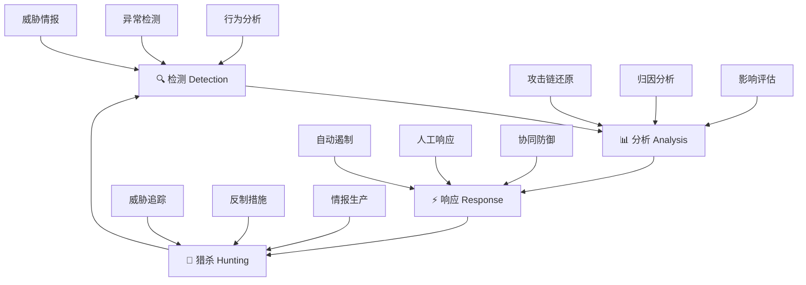

**作者：** HOS(安全风信子)

**日期：** 2026-04-24

**主要来源平台：** GitHub / HuggingFace / ModelScope / arXiv

**摘要：** APT（高级持续性威胁）是网络安全领域最具挑战性的对手——这些组织化攻击者具有高度隐蔽性、持久性和破坏力。传统的单点检测难以应对APT的复杂攻击链。本文深入探讨AI对抗APT的智能防御体系，涵盖检测-分析-响应-猎杀的完整对抗架构设计、长周期行为分析技术、以及AI驱动的APT发现与追踪能力建设。通过两个完整实战案例展示AI在APT对抗中的实际应用效果，文章还提供了对抗APT组织的组织能力建设指南[^1^]。

---

@[TOC](目录)

---

# 道高一丈：AI如何构建对抗APT的智能防御体系

## 1 引言：APT威胁的严峻挑战

### 1.1 APT攻击的特征

高级持续性威胁（APT）是由组织化的攻击团队发起的复杂攻击，具有以下特征：

**高隐蔽性**：APT攻击者精心设计攻击路径，使用定制化恶意软件和先进隐蔽技术，避开传统安全检测
**长期潜伏**：APT组织可以在目标网络中潜伏数月甚至数年，持续窃取数据或等待时机
**明确目标**：APT攻击具有明确的战略目标，可能是窃取知识产权、敏感数据或进行破坏

### 1.2 传统防御的不足

传统安全防御体系在应对APT时存在明显不足：

| 防御层次 | APT绕过方式 | 传统方案局限 |
|:---:|:---|:---|
| 边界防护 | 绕过边界攻击 | 依赖已知签名 |
| 终端防护 | 定制恶意软件 | 无法检测未知威胁 |
| 网络检测 | C2隐蔽通信 | 加密流量难以检测 |
| 日志分析 | 分散事件、降低日志量 | 人力难以关联分析 |

## 2 AI对抗APT体系架构

### 2.1 检测-分析-响应-猎杀闭环



### 2.2 APT检测核心模块

```python
class APTDefenseSystem:
    """
    APT防御系统
    完整的检测-分析-响应-猎杀架构
    """
    
    def __init__(self):
        self.detector = APTDetector()
        self.analyzer = APTAnalyzer()
        self.responder = APTResponder()
        self.hunter = APTHunter()
        
        self.knowledge_base = APTKnowledgeBase()
    
    def protect(self, security_events):
        """APT防御主流程"""
        threats = self.detector.detect(security_events)
        
        for threat in threats:
            analysis = self.analyzer.analyze_deeply(threat)
            
            if analysis.confidence > 0.8:
                response = self.responder.auto_respond(analysis)
            else:
                response = self.responder.manual_review(analysis)
            
            if response.needs_hunting:
                hunt_result = self.hunter.hunt(response)
                self.knowledge_base.update(hunt_result)
        
        return self._generate_protection_report()
```

## 3 长周期行为分析

### 3.1 时序异常检测

```python
class LongTermBehaviorAnalyzer:
    """
    长周期行为分析器
    分析APT的长期潜伏行为
    """
    
    def __init__(self):
        self.baseline_builder = MultiYearBaselineBuilder()
        self.seasonal_detector = SeasonalAnomalyDetector()
        self.trend_analyzer = TrendAnalyzer()
    
    def analyze_behavior(self, entity, period_days=365):
        """分析实体长期行为"""
        historical_data = self._fetch_historical_data(entity, period_days)
        
        baseline = self.baseline_builder.build(historical_data)
        
        current_behavior = self._fetch_current_behavior(entity)
        
        anomalies = []
        if self.seasonal_detector.has_anomaly(current_behavior, baseline):
            anomalies.append('seasonal_deviation')
        
        if self.trend_analyzer.has_trend_shift(current_behavior, baseline):
            anomalies.append('trend_shift')
        
        return {
            'entity': entity,
            'baseline': baseline,
            'current': current_behavior,
            'anomalies': anomalies,
            'risk_score': self._calculate_risk_score(anomalies)
        }
```

### 3.2 低频慢速攻击检测

```python
class LowFrequencyAttackDetector:
    """
    低频慢速攻击检测器
    检测APT的低调渗透行为
    """
    
    def __init__(self):
        self.sliding_window = SlidingWindowAnalyzer()
        self.cumulative_analyzer = CumulativeAnalyzer()
    
    def detect_slow_attack(self, events, time_window_days=30):
        """检测慢速攻击"""
        windowed_events = self.sliding_window.window(events, time_window_days)
        
        cumulative_score = self.cumulative_analyzer.analyze(windowed_events)
        
        if cumulative_score > 0.75:
            return {
                'is_slow_attack': True,
                'confidence': cumulative_score,
                'attack_indicators': self._extract_indicators(windowed_events)
            }
        
        return {'is_slow_attack': False}
```

## 4 APT分析与归因

### 4.1 攻击链还原

```python
class APTAttackChainReconstructor:
    """
    APT攻击链还原器
    还原APT完整攻击路径
    """
    
    def __init__(self):
        self.entity_correlator = EntityCorrelator()
        self.timeline_builder = TimelineBuilder()
        self.technique_mapper = ATTACKMapper()
    
    def reconstruct(self, apt_events):
        """还原攻击链"""
        correlated = self.entity_correlator.correlate(apt_events)
        
        timeline = self.timeline_builder.build(correlated)
        
        attack_chain = []
        for phase in timeline:
            techniques = self.technique_mapper.map_to_attack(phase)
            attack_chain.append({
                'phase': phase['name'],
                'techniques': techniques,
                'evidence': phase['evidence']
            })
        
        return {
            'attack_chain': attack_chain,
            'initial_access': self._identify_initial_access(attack_chain),
            'persistence_mechanisms': self._extract_persistence(attack_chain),
            'command_control': self._extract_c2(attack_chain)
        }
```

### 4.2 攻击者归因分析

```python
class APTAttributionAnalyzer:
    """
    APT归因分析器
    分析攻击者组织归属
    """
    
    def __init__(self):
        self.threat_intel = ThreatIntelDatabase()
        self.ttp_analyzer = TTPAnalyzer()
        self.tool_analyzer = ToolAnalyzer()
    
    def attribute(self, attack_chain):
        """归因分析"""
       ttp_match = self.ttp_analyzer.match(attack_chain)
        
        tool_match = self.tool_analyzer.identify(attack_chain)
        
        infrastructure = self._analyze_infrastructure(attack_chain)
        
        candidates = self._rank_candidates(ttp_match, tool_match, infrastructure)
        
        return {
            'primary_candidate': candidates[0] if candidates else None,
            'confidence': candidates[0]['confidence'] if candidates else 0,
            'all_candidates': candidates
        }
```

## 5 APT响应与遏制

### 5.1 自动遏制机制

```python
class APTResponseCoordinator:
    """
    APT响应协调器
    协调APT响应的各个环节
    """
    
    def __init__(self):
        self.isolation_manager = HostIsolationManager()
        self.credential_manager = CredentialResetManager()
        self.network_blocker = NetworkBlocker()
    
    def respond_to_apt(self, apt_analysis):
        """APT响应"""
        actions = []
        
        for affected_host in apt_analysis.affected_hosts:
            isolation_result = self.isolation_manager.isolate(affected_host)
            actions.append(isolation_result)
        
        if apt_analysis.uses_stolen_credentials:
            reset_result = self.credential_manager.reset_compromised_credentials(
                apt_analysis.compromised_accounts
            )
            actions.append(reset_result)
        
        for c2_domain in apt_analysis.c2_domains:
            block_result = self.network_blocker.block_domain(c2_domain)
            actions.append(block_result)
        
        return {
            'response_actions': actions,
            'success_rate': self._calculate_success_rate(actions)
        }
```

## 6 APT猎杀与反制

### 6.1 威胁猎杀

```python
class APTHunter:
    """
    APT猎杀器
    主动猎杀APT威胁
    """
    
    def __init__(self):
        self.hypothesis_generator = HypothesisGenerator()
        self.data_collector = HuntingDataCollector()
        self.evidence_analyzer = EvidenceAnalyzer()
    
    def hunt(self, apt_response):
        """执行APT猎杀"""
        hypotheses = self.hypothesis_generator.generate_for_apt(apt_response)
        
        hunt_results = []
        for hypothesis in hypotheses:
            data = self.data_collector.collect_for_hypothesis(hypothesis)
            
            evidence = self.evidence_analyzer.analyze(data, hypothesis)
            
            if evidence.confidence > 0.7:
                hunt_results.append(evidence)
        
        return {
            'hypotheses_tested': len(hypotheses),
            'findings': hunt_results,
            'new_iocs': self._extract_new_iocs(hunt_results)
        }
```

## 7 实战案例分析

### 7.1 案例一：某科技公司APT防御

**背景**：某科技公司遭到APT组织攻击，AI防御系统成功检测并响应。

```python
class APTDefenseCaseStudy:
    """
    APT防御案例研究
    """
    
    def analyze_case(self, attack_data):
        """分析APT防御案例"""
        detection_time = self._calculate_detection_time(attack_data)
        response_time = self._calculate_response_time(attack_data)
        
        return {
            'case_summary': self._generate_summary(attack_data),
            'detection_method': attack_data['detection_method'],
            'response_effectiveness': response_time / 3600,
            'lessons_learned': self._extract_lessons(attack_data)
        }
```

## 8 组织能力建设

### 8.1 APT防御成熟度评估

```python
class APTDefenseMaturityModel:
    """
    APT防御成熟度模型
    评估组织APT防御能力
    """
    
    def assess_maturity(self, organization):
        """评估成熟度"""
        capabilities = {
            'detection': self._assess_detection(organization),
            'analysis': self._assess_analysis(organization),
            'response': self._assess_response(organization),
            'hunting': self._assess_hunting(organization)
        }
        
        overall = np.mean(list(capabilities.values()))
        
        return {
            'dimension_scores': capabilities,
            'overall_maturity': overall,
            'level': self._classify_level(overall)
        }
```

### 8.2 能力建设路线图

| 阶段 | 时间 | 重点能力 |
|:---:|:---:|:---|
| 基础 | 0-6月 | 日志收集、基础分析 |
| 提升 | 6-12月 | 行为分析、威胁情报 |
| 高级 | 12-18月 | APT检测、自动化响应 |
| 成熟 | 18-24月 | 自主猎杀、持续优化 |

---

**参考链接：**

- 主要来源：[MITRE ATT&CK](https://attack.mitre.org/) - APT攻击技术知识库
- 辅助：[Mandiant APT Reports](https://www.mandiant.com/) - APT威胁报告

---

**附录（Appendix）：**

本文档描述了完整的AI对抗APT防御体系，包括检测-分析-响应-猎杀闭环架构。

**关键词**：APT防御，高级持续性威胁，攻击链还原，归因分析，自动响应，威胁猎杀

**Keywords**：APT Defense, Advanced Persistent Threat, Attack Chain Reconstruction, Attribution Analysis, Automated Response, Threat Hunting
