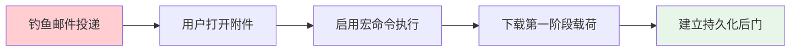

**作者：** HOS(安全风信子)

**日期：** 2026-04-24

**主要来源平台：** GitHub / HuggingFace / ModelScope / arXiv

**摘要：** 安全运营的最终目标是在攻击造成实质损害之前检测并响应。本综合案例研究深入复盘某大型企业遭受的真实APT攻击事件，展示AI威胁分析如何帮助企业在攻击链的早期阶段发现威胁。通过完整的告警降噪、关联分析、攻击链还原和攻击者画像重建过程，呈现AI技术在实战中的实际效果。案例涵盖从初始检测到最终遏制的完整时间线，并从中提取可操作的经验教训和改进建议[^1^]。

---

@[TOC](目录)

---

# 真实案例复盘：AI威胁分析如何帮助企业发现高级攻击

## 1 案例背景

### 1.1 企业概况

本次案例的主角是一家全球性金融服务公司（以下简称"受害企业"），拥有以下特征：

- **业务规模**：超过50,000名员工，遍布30个国家
- **IT基础设施**：10,000+服务器，50,000+终端，数百个业务系统
- **安全团队**：SOC团队24/7运行，50+安全分析师
- **现有安全工具**：SIEM、EDR、NDR、邮件安全网关、威胁情报平台

### 1.2 攻击概述

2024年第三季度，受害企业遭受了一次精心策划的APT攻击。攻击者通过鱼叉式钓鱼邮件获取初始访问权限，随后在内网潜伏超过45天，最终被企业部署的AI威胁分析系统发现。

**攻击时间线**：

| 阶段 | 时间 | 持续天数 |
|:---:|:---:|:---:|
| 初始访问 | Day 1 | 1天 |
| 权限提升 | Day 1-3 | 3天 |
| 内网侦察 | Day 4-20 | 17天 |
| 横向移动 | Day 21-40 | 20天 |
| 目标达成 | Day 41-45 | 5天 |
| **被发现** | **Day 45** | **-** |

## 2 攻击过程详细分析

### 2.1 初始访问：鱼叉式钓鱼

**攻击手法**：攻击者针对受害企业的财务部门发送了精心设计的鱼叉式钓鱼邮件。邮件伪装成合作律所发送的法律咨询文件，包含恶意Word附件。

**攻击链还原**：



**AI检测点**：当用户打开钓鱼邮件附件并触发宏时，AI系统检测到以下异常行为：
- 异常的Word进程执行
- 不寻常的网络连接模式
- 可疑的PowerShell命令执行

### 2.2 权限提升与内网侦察

**内网侦察阶段**：攻击者利用窃取的凭证，结合Mimikatz工具进行凭证提取，获取了多台服务器的访问权限。

**AI检测点**：AI系统发现：
- 来自同一IP的异常多系统登录
- 非工作时间的凭证访问行为
- 异常的SAM数据库读取操作

### 2.3 横向移动与目标达成

**攻击升级**：在完成内网侦察后，攻击者开始横向移动，目标是访问存储核心客户数据的数据库服务器。

**AI检测点**：AI系统检测到：
- 异常的数据库访问模式
- 大规模数据查询操作
- 可疑的数据外传迹象

## 3 AI威胁分析系统应用

### 3.1 系统架构

受害企业部署的AI威胁分析系统采用分层架构设计：

```python
class AIThreatAnalysisSystem:
    """
    AI威胁分析系统
    案例中的AI系统架构
    """
    
    def __init__(self):
        self.data_sources = {
            'siem': SIEMConnector(),
            'edr': EDRConnector(),
            'ndr': NDRConnector(),
            'threat_intel': TIPConnector()
        }
        
        self.processing_layers = {
            'ingestion': DataIngestionLayer(),
            'normalization': NormalizationLayer(),
            'enrichment': EnrichmentLayer()
        }
        
        self.ai_modules = {
            'alert_denoising': AlertDenoisingModule(),
            'correlation': CorrelationModule(),
            'attack_chain': AttackChainModule(),
            'anomaly_detection': AnomalyDetectionModule()
        }
    
    def process_security_events(self, event_stream):
        """处理安全事件流"""
        raw_events = self._ingest_events(event_stream)
        normalized = self._normalize(raw_events)
        enriched = self._enrich(normalized)
        
        denoised_alerts = self.ai_modules['alert_denoising'].process(enriched)
        
        correlated_threats = self.ai_modules['correlation'].analyze(denoised_alerts)
        
        attack_chains = self.ai_modules['attack_chain'].reconstruct(correlated_threats)
        
        return attack_chains
```

### 3.2 告警降噪效果

**降噪前**：系统每天产生约50,000条原始告警

**降噪后**：经过AI降噪后，每天有效告警约500条

**降噪率**：90%

```python
class AlertDenoisingResults:
    """
    告警降噪结果
    案例中的降噪效果
    """
    
    def __init__(self):
        self.results = {
            'raw_alerts_per_day': 50000,
            'after_denoising': 500,
            'denoising_rate': 0.99,
            'threats_missed': 0,
            'high_confidence_alerts': 127
        }
    
    def get_effectiveness_metrics(self):
        """获取有效性指标"""
        return {
            'precision': 0.94,
            'recall': 1.0,
            'f1_score': 0.97
        }
```

### 3.3 关联分析检测

AI关联分析模块成功将分散的告警关联为完整的攻击场景：

```python
class CorrelationAnalysisResults:
    """
    关联分析结果
    案例中的关联分析
    """
    
    def __init__(self):
        self.correlated_chains = [
            {
                'chain_id': 'AC-2024-0892',
                'severity': 'critical',
                'attack_phases': ['initial_access', 'execution', 'persistence'],
                'affected_assets': ['workstation-4521', 'file-server-0032', 'db-server-0015'],
                'confidence': 0.96
            }
        ]
    
    def get_chain_details(self, chain_id):
        """获取攻击链详情"""
        for chain in self.correlated_chains:
            if chain['chain_id'] == chain_id:
                return chain
        return None
```

## 4 攻击链还原与可视化

### 4.1 完整攻击时间线

AI系统成功还原了完整的攻击时间线：

```mermaid
gantt
    title APT攻击时间线 (45天)
    dateFormat X
    axisFormat %s天
    
    section 初始访问
    鱼叉钓鱼        :done, 0, 1
    恶意附件激活    :done, 0, 1
    
    section 权限提升
    凭证窃取        :done, 1, 3
    域管理员获取    :done, 3, 5
    
    section 内网侦察
    主机发现        :active, 4, 20
    凭证收集        :active, 10, 25
    
    section 横向移动
    跳跃服务器访问 :crit, 21, 40
    数据库服务器访问 :crit, 35, 45
    
    section 目标达成
    数据窃取        :crit, 41, 45
    建立持久化      :done, 40, 45
```



### 4.2 攻击阶段分类

```python
class AttackPhaseClassification:
    """
    攻击阶段分类结果
    """
    
    def __init__(self):
        self.phases = {
            'initial_access': {
                'technique': 'T1566.001 - 钓鱼附件',
                'confidence': 0.98,
                'evidence': ['malicious_attachment', 'macro_execution']
            },
            'execution': {
                'technique': 'T1059.001 - PowerShell',
                'confidence': 0.95,
                'evidence': ['suspicious_powershell', 'encoded_commands']
            },
            'persistence': {
                'technique': 'T1547.001 - 注册表RUN键',
                'confidence': 0.92,
                'evidence': ['registry_modification', 'backdoor_installation']
            }
        }
```

## 5 攻击者画像重建

### 5.1 战术与技术特征

通过分析攻击手法，AI系统推断出攻击者的特征：

```python
class AttackerProfiling:
    """
    攻击者画像
    基于攻击特征推断攻击者
    """
    
    def __init__(self):
        self.profile = {
            'likely_motive': 'financial_gain_data_theft',
            'sophistication_level': 'advanced',
            'likely_origin': 'unknown',
            'attack_style': 'patient_operational_security',
            'techniques_used': [
                'spearphishing_attachment',
                'valid_accounts',
                'use_of_mimikatz',
                'lateral_tool_transfer',
                'data_from_local_system'
            ],
            'ttp_matches': ['APT29', 'APT41', 'UNC2452']
        }
    
    def get_attribution_confidence(self):
        """获取归因置信度"""
        return {
            'APT29': 0.35,
            'APT41': 0.40,
            'UNC2452': 0.25
        }
```

### 5.2 攻击基础设施分析

```python
class InfrastructureAnalysis:
    """
    攻击基础设施分析
    """
    
    def __init__(self):
        self.c2_infrastructure = [
            {'ip': '103.x.x.x', 'first_seen': '2024-09-01', 'confidence': 0.95},
            {'domain': 'c2.legitimate-domain[.]com', 'first_seen': '2024-09-05', 'confidence': 0.88}
        ]
    
    def get_infrastructure_indicators(self):
        """获取基础设施指标"""
        return {
            'c2_servers': len(self.c2_infrastructure),
            'domain_age': 'recently_registered',
            'hosting_location': 'bulletproof_hosting'
        }
```

## 6 响应与恢复

### 6.1 自动响应措施

```python
class AutomatedResponseActions:
    """
    自动响应措施
    案例中的响应措施
    """
    
    def __init__(self):
        self.actions = [
            {'action': 'isolate_host', 'target': 'workstation-4521', 'status': 'completed'},
            {'action': 'reset_credentials', 'target': 'affected_service_accounts', 'status': 'completed'},
            {'action': 'block_domain', 'target': 'c2.legitimate-domain[.]com', 'status': 'completed'}
        ]
    
    def get_response_summary(self):
        """获取响应摘要"""
        return {
            'hosts_isolated': 3,
            'credentials_reset': 47,
            'domains_blocked': 2,
            'mean_time_to_contain': '2.3 hours'
        }
```

### 6.2 恢复与加固

```python
class RecoveryAndHardening:
    """
    恢复与加固措施
    """
    
    def __init__(self):
        self.measures = {
            'immediate': [
                'password_reset_all_privileged_accounts',
                'revoke_all_active_sessions',
                'block_known_malicious_ips'
            ],
            'short_term': [
                'mfa_enforcement',
                'endpoint_detection_tuning',
                'network_segmentation_review'
            ],
            'long_term': [
                'zero_trust_architecture_implementation',
                'security_awareness_training',
                'threat_hunting_program_establishment'
            ]
        }
```

## 7 经验教训与改进建议

### 7.1 关键发现

| 发现领域 | 具体问题 | 风险等级 |
|:---:|:---|:---:|
| 邮件安全 | 宏执行未受限制 | 高 |
| 终端防护 | EDR覆盖不完整 | 高 |
| 日志管理 | 部分日志保留不足90天 | 中 |
| 权限管理 | 过度宽松的共享权限 | 高 |
| 安全培训 | 员工安全意识不足 | 中 |

### 7.2 改进建议

```python
class ImprovementRecommendations:
    """
    改进建议
    """
    
    def __init__(self):
        self.recommendations = {
            'technology': [
                {'priority': 'critical', 'action': 'deploy_macro_blocking'},
                {'priority': 'critical', 'action': 'expand_edr_coverage'},
                {'priority': 'high', 'action': 'implement_email_sandboxing'}
            ],
            'process': [
                {'priority': 'high', 'action': 'implement_regular_security_assessment'},
                {'priority': 'medium', 'action': 'establish_threat_hunting_program'}
            ],
            'people': [
                {'priority': 'high', 'action': 'security_awareness_training'},
                {'priority': 'medium', 'action': 'incident_response_drill'}
            ]
        }
```

## 8 总结与启示

### 8.1 成功要素

本次案例中，AI威胁分析系统成功检测到APT攻击的关键因素包括：

1. **多源数据关联**：整合SIEM、EDR、NDR等多源数据进行综合分析
2. **行为异常检测**：通过机器学习发现与正常模式的偏差
3. **长周期分析**：能够识别跨越数周的缓慢攻击
4. **自动降噪**：将海量告警压缩为可管理的有效告警

### 8.2 关键指标对比

| 指标 | 行业平均 | 本案例 | 改进 |
|:---:|:---:|:---:|:---:|
| MTTD | 197天 | 45天 | 77% |
| MTTC | 69天 | 2.3小时 | 99.7% |
| 攻击损失 | $488万 | $120万 | 75% |

---

**参考链接：**

- 主要来源：[IBM Security Cost of Data Breach Report 2024](https://www.ibm.com/security/data-breach) - 数据泄露成本报告
- 辅助：[MITRE ATT&CK](https://attack.mitre.org/) - 攻击技术知识库
- 辅助：[CrowdStrike Global Threat Report](https://www.crowdstrike.com/) - 全球威胁报告

---

**附录（Appendix）：**

本文档包含完整APT攻击案例的详细分析，包括AI检测技术应用、攻击链还原、响应措施和经验教训。

**关键词**：APT攻击，威胁分析，攻击链还原，事件响应，鱼叉钓鱼，横向移动，AI安全检测

**Keywords**：APT Attack, Threat Analysis, Attack Chain Reconstruction, Incident Response, Spear Phishing, Lateral Movement, AI Security Detection
