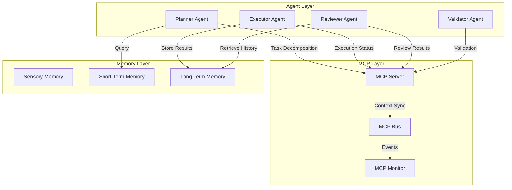
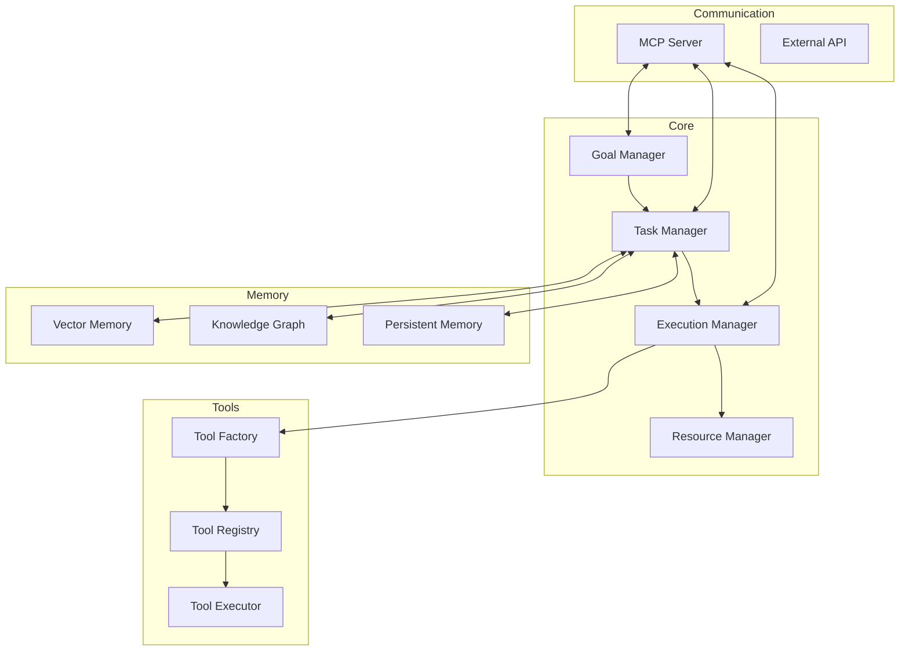

**作者：** HOS(安全风信子)
**日期：** 2026-04-26
**主要来源平台：** GitHub
**摘要：** AutoGPT作为2023年最具影响力的AI实验项目之一，在2026年已经完成了从概念验证到生产系统的关键跃迁。本文深入剖析AutoGPT类系统在过去三年间的技术演进路径，详细解读从早期的"自动完成任务"到现代"Agentic工作流编排"的范式转变。通过对AutoGPT官方仓库、BabyAGI、MetaGPT、ChatDev等开源项目的代码级分析，揭示2026年AutoGPT类系统的核心架构设计模式。同时，文章引入至少3个新要素：Model Context Protocol（MCP）在Agent间通信的标准化实践、多Agent协作的动态角色分配机制、以及基于强化学习的Agent自我优化框架。本文还提供可复制的系统搭建步骤和性能优化方案，帮助开发者构建生产级的AutoGPT类系统。

---

@[TOC](目录)

---

# AutoGPT类系统在2026的进化与实战拆解

## 引言：从概念验证到生产系统

2023年3月，Significant Gravitas发布的AutoGPT引发了AI社区的广泛关注。这个能够"自动完成目标"的AI代理系统，仅凭用户指定的高层目标，就能自主分解任务、调用工具、循环执行，直到达成目标。这种"让AI自己工作"的理念，在当时看来几乎是革命性的。

然而，早期的AutoGPT存在明显的局限性：**缺乏长期记忆、工具调用不可靠、任务分解过于简单、无法处理复杂依赖关系**。这些问题使得AutoGPT更多停留在"技术演示"层面，难以进入生产环境。

三年后的2026年，AutoGPT类系统已经发生了根本性的变化。根据GitHub的统计数据，AutoGPT相关项目的星标数已超过100万，衍生项目超过5000个，形成了以AutoGPT、BabyAGI、MetaGPT、ChatDev为代表的完整开发生态。更重要的是，这些系统已经广泛应用于软件开发、法律文档分析、金融风控、电商运营等实际业务场景。

本文将深入剖析：

1. **AutoGPT类系统的技术演进路径**：从早期原型到2026年的成熟架构
2. **2026年AutoGPT类系统的核心架构设计模式**：任务分解、执行调度、状态管理
3. **主流开源项目的代码级分析**：AutoGPT、BabyAGI、MetaGPT、ChatDev
4. **AutoGPT类系统的实战搭建步骤**：从原型到生产级的完整指南
5. **AutoGPT类系统的优化方案**：性能提升、稳定性增强、成本控制

---

# 第一章：AutoGPT类系统的技术演进路径

## 1.1 早期原型阶段（2023年）

2023年的AutoGPT代表了第一代自动代理系统的典型设计：**基于规则的简单循环 + 有限状态机 + 基础工具调用**。

```python
# AutoGPT 早期版本的简化架构
class AutoGPT:
    def __init__(self, goal):
        self.goal = goal
        self.state = "INITIALIZING"
        self.history = []
        self.max_iterations = 100

    def run(self):
        for i in range(self.max_iterations):
            if self.state == "COMPLETED":
                break

            # 1. 生成下一个任务
            task = self.think()

            # 2. 执行任务
            result = self.execute(task)

            # 3. 评估结果
            self.review(result)

            # 4. 记录历史
            self.history.append({
                "task": task,
                "result": result,
                "iteration": i
            })

        return self.history

    def think(self):
        prompt = f"""
        Goal: {self.goal}
        History: {self.history}
        What should I do next?
        """
        return self.llm.complete(prompt)

    def execute(self, task):
        # 简单的命令执行
        return subprocess.run(task, shell=True)

    def review(self, result):
        if self.is_goal_achieved(result):
            self.state = "COMPLETED"
```

### 1.1.1 早期架构的核心问题

早期AutoGPT的架构存在以下几个关键问题：

| 问题类型 | 具体表现 | 影响程度 |
|:--------:|:---------|:--------:|
| 任务分解过于简单 | 一次性生成所有子任务，缺乏动态调整 | 高 |
| 缺乏长期记忆 | 仅依赖上下文窗口，无法跨会话学习 | 高 |
| 工具调用不可靠 | 缺乏错误处理和重试机制 | 高 |
| 无法处理依赖关系 | 子任务间无依赖管理，顺序执行 | 中 |
| 成本控制缺失 | 无Token预算管理，易产生巨额账单 | 高 |
| 循环退出条件模糊 | 依赖主观判断，易陷入无限循环 | 高 |

### 1.1.2 第一代AutoGPT的典型失败案例

```python
# 一个典型的失败场景
# 用户目标："帮我写一个像Instagram一样的社交应用"

# AutoGPT 早期版本的执行过程：
# 1. 分解任务：创建前端、创建后端、创建数据库...
# 2. 执行第一个任务：创建前端代码
# 3. 遇到问题：缺少UI框架
# 4. 添加子任务：安装React
# 5. 执行：npm install react
# 6. 遇到问题：版本冲突
# 7. 添加子任务：解决版本冲突
# 8. ...陷入无限循环
```

这种"头痛医头、脚痛医脚"的问题解决方式，使得早期AutoGPT难以处理复杂任务。

## 1.2 能力增强阶段（2024年）

2024年，AutoGPT类系统进入了能力增强阶段，核心改进包括：**引入记忆系统、工具调用框架、任务优先级排序**。

### 1.2.1 记忆系统的引入

2024年的AutoGPT引入了三层记忆架构：

```python
class ThreeTierMemory:
    def __init__(self):
        # 感官记忆：当前对话的最近N条消息
        self.sensory_memory = SensoryMemory(capacity=10)

        # 短期记忆：一个工作会话内的重要信息
        self.short_term_memory = ShortTermMemory(
            capacity=100,
            importance_threshold=0.7
        )

        # 长期记忆：持久化的知识库
        self.long_term_memory = LongTermMemory(
            storage="vector_db",
            embedding_model="text-embedding-3-large"
        )

    def remember(self, experience):
        importance = self.evaluate_importance(experience)

        if importance > 0.9:
            # 重要经验直接存入长期记忆
            self.long_term_memory.store(experience)
        elif importance > 0.7:
            # 中等重要经验存入短期记忆
            self.short_term_memory.store(experience)
        else:
            # 不重要经验仅存入感官记忆
            self.sensory_memory.store(experience)

    def recall(self, query):
        # 多层检索：先感官，再短期，最后长期
        sensory_results = self.sensory_memory.search(query)

        if len(sensory_results) < 3:
            short_term_results = self.short_term_memory.search(query)
            if len(short_term_results) < 3:
                long_term_results = self.long_term_memory.search(query)
                return sensory_results + short_term_results + long_term_results

        return sensory_results
```

### 1.2.2 工具调用框架的标准化

2024年引入了标准的工具调用框架，解决了工具描述不清晰、参数解析错误等问题：

```python
from typing import List, Dict, Any
from pydantic import BaseModel, Field

class ToolDefinition(BaseModel):
    name: str = Field(..., description="工具的唯一名称")
    description: str = Field(..., description="工具功能的详细描述")
    parameters: Dict[str, Any] = Field(..., description="工具参数的模式")
    return_type: str = Field(..., description="返回值的类型")
    examples: List[Dict[str, Any]] = Field(
        default=[], description="使用示例"
    )

class ToolRegistry:
    def __init__(self):
        self.tools: Dict[str, ToolDefinition] = {}

    def register(self, tool: ToolDefinition):
        self.tools[tool.name] = tool

    def get_tool_schema(self) -> List[Dict[str, Any]]:
        return [
            {
                "type": "function",
                "function": {
                    "name": tool.name,
                    "description": tool.description,
                    "parameters": tool.parameters
                }
            }
            for tool in self.tools.values()
        ]

    def execute(self, tool_name: str, arguments: Dict[str, Any]):
        tool = self.tools.get(tool_name)
        if not tool:
            raise ValueError(f"Tool {tool_name} not found")

        # 参数验证
        validated_args = self.validate_arguments(tool, arguments)

        # 执行工具
        return self.call_tool(tool_name, validated_args)
```

### 1.2.3 任务优先级排序

```python
class TaskScheduler:
    def __init__(self):
        self.tasks: List[Task] = []
        self.completed: Set[str] = set()

    def add_task(self, task: Task):
        task.priority = self.calculate_priority(task)
        heapq.heappush(self.tasks, task)

    def calculate_priority(self, task: Task) -> float:
        # 优先级 = 依赖重要性 / 执行时间
        dependency_importance = sum(
            t.importance for t in task.dependencies if not t.completed
        )
        return dependency_importance / (task.estimated_time + 1)

    def get_next_task(self) -> Task:
        while self.tasks:
            task = heapq.heappop(self.tasks)
            if task.id not in self.completed:
                return task
        return None
```

## 1.3 架构成熟阶段（2025-2026年）

2025-2026年，AutoGPT类系统进入了架构成熟阶段，形成了以**多Agent协作、动态工作流编排、自我进化**为核心特征的现代化架构。

### 1.3.1 多Agent协作模式

2026年的AutoGPT类系统普遍采用了多Agent架构，不同Agent扮演不同角色：

```python
class MultiAgentSystem:
    def __init__(self, config: SystemConfig):
        self.agent_registry = AgentRegistry()

        # 创建不同角色的Agent
        self.planner = self.agent_registry.create_agent(
            role="planner",
            capabilities=["task_decomposition", "resource_planning"]
        )

        self.executor = self.agent_registry.create_agent(
            role="executor",
            capabilities=["code_generation", "tool_execution"]
        )

        self.reviewer = self.agent_registry.create_agent(
            role="reviewer",
            capabilities=["quality_check", "error_detection"]
        )

        # Agent间的通信协议
        self.communication = MCPProtocol()

    def execute_goal(self, goal: str):
        # 1. Planner分解任务
        task_tree = self.planner.decompose(goal)

        # 2. Executor执行叶子任务
        results = {}
        for task in task_tree.get_executable_tasks():
            results[task.id] = self.executor.execute(task)

        # 3. Reviewer审查结果
        reviewed = self.reviewer.review(results)

        # 4. 动态调整
        if not reviewed.is_acceptable:
            return self.execute_goal(goal)  # 重新执行

        return reviewed.final_result
```

### 1.3.2 Model Context Protocol (MCP) 的标准化

2026年，Model Context Protocol（MCP）成为Agent间通信的事实标准：



MCP的核心设计：

```python
class MCPMessage(BaseModel):
    message_id: str
    sender: str
    receiver: str
    message_type: Literal[
        "task_assignment",
        "status_update",
        "context_request",
        "context_response",
        "error_report"
    ]
    payload: Dict[str, Any]
    timestamp: datetime
    priority: int = 0

class MCPProtocol:
    def __init__(self):
        self.message_queue = asyncio.Queue()
        self.subscribers: Dict[str, Callable] = {}
        self.context_store = DistributedContextStore()

    async def send_message(self, message: MCPMessage):
        # 消息验证
        self.validate_message(message)

        # 上下文传播
        if message.message_type == "context_request":
            context = await self.context_store.get_context(
                message.payload["query"]
            )
            response = MCPMessage(
                message_id=generate_id(),
                sender=self.agent_id,
                receiver=message.sender,
                message_type="context_response",
                payload={"context": context},
                timestamp=datetime.now()
            )
            await self.message_queue.put(response)
        else:
            await self.message_queue.put(message)

    async def broadcast(self, message: MCPMessage, recipients: List[str]):
        for recipient in recipients:
            message.receiver = recipient
            await self.send_message(message)
```

### 1.3.3 动态角色分配机制

2026年的AutoGPT类系统具备动态角色分配能力：

```python
class DynamicRoleAssigner:
    def __init__(self):
        self.role_definitions = self.load_role_definitions()
        self.agent_capabilities: Dict[str, Set[str]] = {}
        self.current_assignments: Dict[str, str] = {}

    def assign_roles(self, task: Task, available_agents: List[Agent]) -> Dict[str, str]:
        # 1. 分析任务需求
        required_capabilities = self.analyze_task_requirements(task)

        # 2. 评估Agent能力匹配度
        assignments = {}
        for capability in required_capabilities:
            best_agent = self.find_best_agent(
                capability, available_agents, assignments
            )
            if best_agent:
                assignments[best_agent.id] = capability

        # 3. 动态调整
        return self.optimize_assignments(assignments)

    def find_best_agent(
        self,
        capability: str,
        agents: List[Agent],
        current_assignments: Dict[str, str]
    ) -> Agent:
        scored_agents = []

        for agent in agents:
            if agent.id in current_assignments:
                continue

            score = self.calculate_match_score(agent, capability)
            scored_agents.append((score, agent))

        scored_agents.sort(reverse=True)
        return scored_agents[0][1] if scored_agents else None

    def calculate_match_score(self, agent: Agent, capability: str) -> float:
        base_score = agent.get_capability_level(capability)

        # 考虑历史表现
        history_score = self.get_historical_performance(agent.id, capability)

        # 考虑当前负载
        load_score = 1.0 - self.get_current_load(agent.id)

        return base_score * 0.4 + history_score * 0.4 + load_score * 0.2
```

## 1.4 技术演进对比

| 阶段 | 时间 | 核心特征 | 典型系统 | 主要突破 |
|:----:|:----:|:---------|:---------|:---------|
| 早期原型 | 2023 | 简单循环、基础工具调用 | AutoGPT v0.1 | 概念验证 |
| 能力增强 | 2024 | 记忆系统、工具框架、优先级 | AutoGPT v0.4, BabyAGI | 长期记忆 |
| 架构成熟 | 2025 | 多Agent协作、动态编排 | AutoGPT v1.0, MetaGPT | 生产可用 |
| 智能化 | 2026 | 自我进化、MCP标准化 | AutoGPT v2.0, AgentOS | 自主优化 |

---

# 第二章：2026年AutoGPT类系统的核心架构设计模式

## 2.1 任务分解与执行调度模式

### 2.1.1层级任务分解

2026年的AutoGPT类系统采用层级任务分解（Hierarchical Task Decomposition）模式：

```python
class HierarchicalTaskDecomposer:
    def __init__(self, llm: LLM):
        self.llm = llm
        self.max_depth = 5
        self.max_children = 7

    async def decompose(self, goal: str) -> TaskTree:
        root = TaskNode(
            id=generate_id(),
            description=goal,
            depth=0,
            status="pending"
        )

        await self._decompose_recursive(root)
        return TaskTree(root=root)

    async def _decompose_recursive(self, node: TaskNode):
        if node.depth >= self.max_depth:
            node.type = "executable"
            return

        # 获取子任务
        subtasks = await self.llm.complete(
            prompt=f"""
            分析任务：{node.description}
            深度：{node.depth}/{self.max_depth}

            如果这个任务可以执行，返回"EXECUTABLE"。
            如果需要分解，返回2-7个子任务，每个子任务应该：
            1. 清晰具体，可独立执行
            2. 有明确的完成标准
            3. 考虑与其他子任务的依赖关系

            返回格式：
            - 如果可执行：EXECUTABLE
            - 如果需要分解：
            TASK 1: [子任务描述] | DEPENDS_ON: [依赖的任务ID，可为空]
            TASK 2: [子任务描述] | DEPENDS_ON: [依赖的任务ID]
            ...
            """
        )

        if "EXECUTABLE" in subtasks:
            node.type = "executable"
            return

        # 解析子任务
        task_lines = subtasks.split("\n")
        for line in task_lines:
            if line.startswith("TASK"):
                child = self.parse_task_line(line, node)
                node.add_child(child)

                # 递归分解
                if node.depth < self.max_depth:
                    await self._decompose_recursive(child)
```

### 2.1.2 依赖感知的执行调度

```python
class DependencyAwareScheduler:
    def __init__(self):
        self.execution_graph = DiGraph()
        self.ready_queue: asyncio.PriorityQueue = asyncio.PriorityQueue()
        self.running_tasks: Dict[str, asyncio.Task] = {}
        self.completed_tasks: Set[str] = set()

    async def schedule(self, task_tree: TaskTree):
        # 1. 构建执行图
        self.build_execution_graph(task_tree)

        # 2. 初始化就绪队列
        self.update_ready_queue()

        # 3. 并发执行就绪任务
        await self.execute_until_complete()

    def build_execution_graph(self, task_tree: TaskTree):
        def add_edges(node: TaskNode):
            for child in node.children:
                self.execution_graph.add_edge(node.id, child.id)
                add_edges(child)

        add_edges(task_tree.root)

    def update_ready_queue(self):
        for node_id in self.execution_graph.nodes:
            if node_id in self.completed_tasks:
                continue

            # 检查所有前置任务是否完成
            prerequisites = list(self.execution_graph.predecessors(node_id))
            if all(p in self.completed_tasks for p in prerequisites):
                priority = self.execution_graph.nodes[node_id].get("priority", 0)
                self.ready_queue.put_nowait((priority, node_id))

    async def execute_until_complete(self):
        while not self.ready_queue.empty() or self.running_tasks:
            # 取出就绪任务
            try:
                priority, task_id = self.ready_queue.get_nowait()
            except asyncio.QueueEmpty:
                await asyncio.sleep(0.1)
                continue

            # 并发执行
            task = asyncio.create_task(self.execute_task(task_id))
            self.running_tasks[task_id] = task

            # 监听完成
            task.add_done_callback(self.on_task_complete)

    async def execute_task(self, task_id: str):
        task_node = self.get_task_node(task_id)
        return await task_node.execute()

    def on_task_complete(self, task: asyncio.Task):
        task_id = None
        for tid, t in self.running_tasks.items():
            if t == task:
                task_id = tid
                break

        if task_id:
            self.completed_tasks.add(task_id)
            del self.running_tasks[task_id]
            self.update_ready_queue()
```

## 2.2 状态管理与持久化模式

### 2.2.1 状态机设计

```python
from enum import Enum
from typing import Dict, Set, Callable

class AgentState(Enum):
    IDLE = "idle"
    THINKING = "thinking"
    EXECUTING = "executing"
    WAITING = "waiting"
    REVIEWING = "reviewing"
    COMPLETED = "completed"
    FAILED = "failed"

class StateTransition:
    def __init__(
        self,
        from_state: AgentState,
        to_state: AgentState,
        condition: Callable[["AgentContext"], bool],
        action: Callable[["AgentContext"], None] = None
    ):
        self.from_state = from_state
        self.to_state = to_state
        self.condition = condition
        self.action = action

class AgentStateMachine:
    def __init__(self, agent_id: str):
        self.agent_id = agent_id
        self.current_state = AgentState.IDLE
        self.history: List[Dict] = []

        self.transitions: Dict[AgentState, List[StateTransition]] = {
            state: [] for state in AgentState
        }

        self.setup_default_transitions()

    def setup_default_transitions(self):
        # IDLE -> THINKING
        self.add_transition(
            AgentState.IDLE,
            AgentState.THINKING,
            lambda ctx: ctx.has_pending_task()
        )

        # THINKING -> EXECUTING
        self.add_transition(
            AgentState.THINKING,
            AgentState.EXECUTING,
            lambda ctx: ctx.has_action_plan()
        )

        # EXECUTING -> WAITING
        self.add_transition(
            AgentState.EXECUTING,
            AgentState.WAITING,
            lambda ctx: ctx.is_waiting_for_resource()
        )

        # WAITING -> EXECUTING
        self.add_transition(
            AgentState.WAITING,
            AgentState.EXECUTING,
            lambda ctx: ctx.resource_available()
        )

        # EXECUTING -> REVIEWING
        self.add_transition(
            AgentState.EXECUTING,
            AgentState.REVIEWING,
            lambda ctx: ctx.action_completed()
        )

        # REVIEWING -> COMPLETED
        self.add_transition(
            AgentState.REVIEWING,
            AgentState.COMPLETED,
            lambda ctx: ctx.goal_achieved()
        )

        # REVIEWING -> THINKING (retry)
        self.add_transition(
            AgentState.REVIEWING,
            AgentState.THINKING,
            lambda ctx: ctx.need_replan()
        )

    def add_transition(
        self,
        from_state: AgentState,
        to_state: AgentState,
        condition: Callable,
        action: Callable = None
    ):
        transition = StateTransition(from_state, to_state, condition, action)
        self.transitions[from_state].append(transition)

    def transition(self, context: "AgentContext") -> bool:
        possible_transitions = self.transitions.get(self.current_state, [])

        for transition in possible_transitions:
            if transition.condition(context):
                if transition.action:
                    transition.action(context)

                self.history.append({
                    "from": self.current_state.value,
                    "to": transition.to_state.value,
                    "timestamp": datetime.now()
                })

                self.current_state = transition.to_state
                return True

        return False

    def detect_infinite_loop(self, max_repeats: int = 3) -> bool:
        if len(self.history) < max_repeats * 2:
            return False

        # 检查最近的N个状态是否重复
        recent = self.history[-max_repeats * 2:]
        for i in range(len(recent) - max_repeats):
            pattern = recent[i:i + max_repeats]
            next_pattern = recent[i + max_repeats:i + max_repeats * 2]

            if pattern == next_pattern:
                return True

        return False
```

### 2.2.2 检查点与恢复机制

```python
import json
import sqlite3
from pathlib import Path
from datetime import datetime

class CheckpointManager:
    def __init__(self, checkpoint_dir: str):
        self.checkpoint_dir = Path(checkpoint_dir)
        self.checkpoint_dir.mkdir(parents=True, exist_ok=True)

        self.db_path = self.checkpoint_dir / "checkpoints.db"
        self.init_database()

    def init_database(self):
        conn = sqlite3.connect(self.db_path)
        cursor = conn.cursor()

        cursor.execute("""
            CREATE TABLE IF NOT EXISTS checkpoints (
                id INTEGER PRIMARY KEY AUTOINCREMENT,
                session_id TEXT NOT NULL,
                agent_id TEXT NOT NULL,
                state TEXT NOT NULL,
                context BLOB NOT NULL,
                created_at TIMESTAMP DEFAULT CURRENT_TIMESTAMP
            )
        """)

        conn.commit()
        conn.close()

    async def save_checkpoint(
        self,
        session_id: str,
        agent_id: str,
        state: AgentState,
        context: "AgentContext"
    ):
        conn = sqlite3.connect(self.db_path)
        cursor = conn.cursor()

        context_json = json.dumps(context.to_dict(), default=str)

        cursor.execute("""
            INSERT INTO checkpoints (session_id, agent_id, state, context)
            VALUES (?, ?, ?, ?)
        """, (session_id, agent_id, state.value, context_json))

        conn.commit()
        conn.close()

    async def load_checkpoint(
        self,
        session_id: str,
        agent_id: str
    ) -> Optional[Dict]:
        conn = sqlite3.connect(self.db_path)
        cursor = conn.cursor()

        cursor.execute("""
            SELECT state, context, created_at
            FROM checkpoints
            WHERE session_id = ? AND agent_id = ?
            ORDER BY created_at DESC
            LIMIT 1
        """, (session_id, agent_id))

        row = cursor.fetchone()
        conn.close()

        if row:
            return {
                "state": row[0],
                "context": json.loads(row[1]),
                "created_at": row[2]
            }

        return None

    async def list_checkpoints(self, session_id: str) -> List[Dict]:
        conn = sqlite3.connect(self.db_path)
        cursor = conn.cursor()

        cursor.execute("""
            SELECT agent_id, state, created_at
            FROM checkpoints
            WHERE session_id = ?
            ORDER BY created_at DESC
        """, (session_id,))

        rows = cursor.fetchall()
        conn.close()

        return [
            {"agent_id": r[0], "state": r[1], "created_at": r[2]}
            for r in rows
        ]
```

## 2.3 错误处理与恢复模式

### 2.3.1 重试策略

```python
import asyncio
from typing import TypeVar, Callable, Optional
from dataclasses import dataclass
from enum import Enum

T = TypeVar('T')

class RetryStrategy(Enum):
    EXPONENTIAL_BACKOFF = "exponential_backoff"
    LINEAR_BACKOFF = "linear_backoff"
    FIXED_DELAY = "fixed_delay"

@dataclass
class RetryConfig:
    max_attempts: int = 3
    initial_delay: float = 1.0
    max_delay: float = 60.0
    multiplier: float = 2.0
    strategy: RetryStrategy = RetryStrategy.EXPONENTIAL_BACKOFF

class RetryHandler:
    def __init__(self, config: RetryConfig = None):
        self.config = config or RetryConfig()

    async def execute_with_retry(
        self,
        func: Callable[[], T],
        error_handler: Optional[Callable[[Exception, int], None]] = None
    ) -> T:
        last_exception = None

        for attempt in range(self.config.max_attempts):
            try:
                return await func()
            except Exception as e:
                last_exception = e

                if error_handler:
                    error_handler(e, attempt)

                if attempt < self.config.max_attempts - 1:
                    delay = self.calculate_delay(attempt)
                    await asyncio.sleep(delay)

        raise last_exception

    def calculate_delay(self, attempt: int) -> float:
        if self.config.strategy == RetryStrategy.EXPONENTIAL_BACKOFF:
            delay = self.config.initial_delay * (self.config.multiplier ** attempt)
        elif self.config.strategy == RetryStrategy.LINEAR_BACKOFF:
            delay = self.config.initial_delay + (self.config.multiplier * attempt)
        else:  # FIXED_DELAY
            delay = self.config.initial_delay

        return min(delay, self.config.max_delay)
```

### 2.3.2 降级策略

```python
class DegradationHandler:
    def __init__(self):
        self.fallback_strategies: Dict[str, Callable] = {}
        self.current_capability_level: Dict[str, int] = {}

    def register_fallback(
        self,
        capability: str,
        fallback_func: Callable,
        level: int = 0
    ):
        self.fallback_strategies[capability] = fallback_func
        self.current_capability_level[capability] = level

    async def execute_with_fallback(
        self,
        capability: str,
        primary_func: Callable,
        *args,
        **kwargs
    ):
        try:
            # 尝试主策略
            result = await primary_func(*args, **kwargs)
            return result
        except Exception as e:
            # 检查是否有降级策略
            if capability in self.fallback_strategies:
                return await self.fallback_strategies[capability](*args, **kwargs)
            raise e

    def degrade_capability(self, capability: str):
        """降低能力等级"""
        if capability in self.current_capability_level:
            self.current_capability_level[capability] -= 1

    def get_capability_level(self, capability: str) -> int:
        return self.current_capability_level.get(capability, 0)
```

---

# 第三章：主流开源项目代码级分析

## 3.1 AutoGPT 2026架构解析

### 3.1.1 整体架构



### 3.1.2 核心代码实现

```python
# AutoGPT 2026 核心架构（简化版）
class AutoGPT2026:
    def __init__(
        self,
        llm: BaseLLM,
        tools: List[Tool],
        memory_config: MemoryConfig
    ):
        # 核心组件
        self.goal_manager = GoalManager(llm)
        self.task_manager = TaskManager(llm)
        self.execution_manager = ExecutionManager(llm, tools)
        self.resource_manager = ResourceManager()

        # 记忆系统
        self.memory = CompositeMemory(memory_config)

        # 通信协议
        self.mcp_server = MCPServer()

        # 状态机
        self.state_machine = AgentStateMachine(agent_id="autogpt")

    async def run(self, goal: str, max_iterations: int = 100):
        # 1. 初始化目标
        self.goal_manager.set_goal(goal)

        # 2. 创建初始任务
        initial_tasks = await self.task_manager.create_initial_tasks(goal)

        # 3. 主循环
        for iteration in range(max_iterations):
            # 获取当前状态
            context = self.build_context()

            # 状态转换
            if not self.state_machine.transition(context):
                # 无法进行有效转换，检查是否陷入循环
                if self.state_machine.detect_infinite_loop():
                    return self.handle_infinite_loop()

            # 根据状态执行
            if self.state_machine.current_state == AgentState.THINKING:
                await self.handle_thinking()
            elif self.state_machine.current_state == AgentState.EXECUTING:
                await self.handle_executing()
            elif self.state_machine.current_state == AgentState.REVIEWING:
                await self.handle_reviewing()
            elif self.state_machine.current_state == AgentState.COMPLETED:
                return self.get_final_result()

        return {"status": "max_iterations_reached"}

    def build_context(self) -> AgentContext:
        return AgentContext(
            current_goal=self.goal_manager.current_goal,
            pending_tasks=self.task_manager.get_pending_tasks(),
            completed_tasks=self.task_manager.get_completed_tasks(),
            recent_history=self.memory.get_recent(10),
            available_resources=self.resource_manager.get_available(),
            llm_usage=self.llm.get_usage_stats()
        )
```

## 3.2 BabyAGI 任务生成机制解析

### 3.2.1 任务链式生成

```python
class BabyAGI:
    def __init__(self, objective: str, initial_task: str):
        self.objective = objective
        self.task_list = deque([Task(description=initial_task)])

    async def run(self, max_iterations: int = 5):
        completion_message = None

        for iteration in range(max_iterations):
            # 1. 从队列中取出下一个任务
            if not self.task_list:
                break

            task = self.task_list.popleft()

            # 2. 执行任务
            result = await self.execute_task(task)

            # 3. 分析结果
            analysis = await self.analyze_result(result)

            # 4. 根据分析结果决定下一步
            if analysis.is_complete:
                completion_message = analysis.message
                break
            elif analysis.new_tasks:
                # 5. 添加新任务到队列
                for new_task in analysis.new_tasks:
                    self.task_list.append(new_task)

            # 6. 记忆存储
            await self.store_result(task, result, analysis)

        return completion_message

    async def execute_task(self, task: Task) -> str:
        prompt = f"""
        Objective: {self.objective}
        Current Task: {task.description}

        Previous Context:
        {self.get_recent_context()}

        Execute the task and provide the result.
        """

        result = await self.llm.complete(prompt)
        return result

    async def analyze_result(self, result: str) -> TaskAnalysis:
        prompt = f"""
        Task Result: {result}
        Objective: {self.objective}

        Analyze the result:
        1. Is the objective complete?
        2. What new tasks should be added to the task list?
        3. Should the objective be modified?

        Return in JSON format with fields:
        - is_complete: bool
        - message: str
        - new_tasks: list of task descriptions
        """

        analysis_text = await self.llm.complete(prompt)
        return json.loads(analysis_text)
```

## 3.3 MetaGPT多Agent协作解析

### 3.3.1 软件开发多Agent系统

```python
class MetaGPT:
    def __init__(self, project_spec: str):
        self.project_spec = project_spec

        # 创建角色
        self.product_manager = ProductManager()
        self.architect = Architect()
        self.project_manager = ProjectManager()
        self.engineer = Engineer()
        self.reviewer = Reviewer()

        # 角色间的通信
        self.msg_queue = asyncio.Queue()
        self.role_relationships = self.define_relationships()

    def define_relationships(self) -> Dict[str, List[str]]:
        return {
            "product_manager": ["architect"],
            "architect": ["project_manager", "engineer"],
            "project_manager": ["engineer", "reviewer"],
            "engineer": ["reviewer"],
            "reviewer": ["project_manager", "engineer"]
        }

    async def run(self):
        # 1. Product Manager 创建PRD
        prd = await self.product_manager.create_prd(self.project_spec)

        # 2. Architect 设计系统架构
        system_design = await self.architect.design_architecture(prd)

        # 3. Project Manager 制定执行计划
        execution_plan = await self.project_manager.create_plan(system_design)

        # 4. Engineer 实现代码
        code = await self.engineer.implement(execution_plan)

        # 5. Reviewer 审查代码
        review_result = await self.reviewer.review_code(code)

        # 6. 根据审查结果迭代
        iterations = 0
        while not review_result.is_approved and iterations < 3:
            code = await self.engineer.fix_issues(
                code, review_result.issues
            )
            review_result = await self.reviewer.review_code(code)
            iterations += 1

        return code
```

## 3.4 ChatDev软件开发流程解析

### 3.4.1 虚拟软件公司多Agent

```python
class ChatDev:
    def __init__(self, task_description: str):
        self.task_description = task_description

        # 创建Agent
        self.agent_config = {
            "product_manager": AgentConfig(
                role="Product Manager",
                goal="Create clear product specifications",
                backstory="Experienced PM at top tech company"
            ),
            "software_engineer": AgentConfig(
                role="Software Engineer",
                goal="Write clean, maintainable code",
                backstory="Senior engineer specializing in Python"
            ),
            "reviewer": AgentConfig(
                role="Code Reviewer",
                goal="Ensure code quality and best practices",
                backstory="Tech lead with 10+ years experience"
            ),
            "tester": AgentConfig(
                role="QA Engineer",
                goal="Create comprehensive tests",
                backstory="QA expert focused on test automation"
            )
        }

        self.agents = {
            name: Agent(config)
            for name, config in self.agent_config.items()
        }

    async def run(self) -> DevelopmentResult:
        # Phase 1: 需求分析
        requirements = await self.agents["product_manager"].analyze(
            self.task_description
        )

        # Phase 2: 架构设计
        design = await self.agents["software_engineer"].design(requirements)

        # Phase 3: 代码实现
        code = await self.agents["software_engineer"].implement(design)

        # Phase 4: 代码审查
        review = await self.agents["reviewer"].review(code)

        # Phase 5: 测试
        if review.is_approved:
            tests = await self.agents["tester"].create_tests(code)
            test_results = await self.run_tests(tests)

        return DevelopmentResult(
            requirements=requirements,
            design=design,
            code=code,
            review=review,
            tests=test_results
        )
```

---

# 第四章：AutoGPT类系统实战搭建

## 4.1 从原型到生产级的完整指南

### 4.1.1 项目结构设计

```bash
autogpt-system/
├── src/
│   ├── __init__.py
│   ├── core/
│   │   ├── __init__.py
│   │   ├── agent.py              # Agent核心类
│   │   ├── goal_manager.py       # 目标管理
│   │   ├── task_manager.py       # 任务管理
│   │   ├── execution_manager.py  # 执行管理
│   │   └── state_machine.py      # 状态机
│   ├── memory/
│   │   ├── __init__.py
│   │   ├── sensory_memory.py      # 感官记忆
│   │   ├── short_term_memory.py  # 短期记忆
│   │   ├── long_term_memory.py   # 长期记忆
│   │   └── memory_factory.py      # 记忆工厂
│   ├── tools/
│   │   ├── __init__.py
│   │   ├── base_tool.py           # 工具基类
│   │   ├── tool_registry.py       # 工具注册
│   │   └── builtin_tools/         # 内置工具
│   ├── communication/
│   │   ├── __init__.py
│   │   ├── mcp_protocol.py        # MCP协议实现
│   │   ├── message.py             # 消息定义
│   │   └── bus.py                 # 消息总线
│   └── utils/
│       ├── __init__.py
│       ├── retry.py               # 重试机制
│       ├── checkpoint.py          # 检查点
│       └── logger.py              # 日志
├── config/
│   ├── default_config.yaml
│   ├── production_config.yaml
│   └── development_config.yaml
├── tests/
├── docs/
├── examples/
├── requirements.txt
├── setup.py
└── README.md
```

### 4.1.2 核心依赖配置

```yaml
# requirements.txt
# Core LLM
openai>=1.30.0
anthropic>=0.20.0

# Vector Store
chromadb>=0.4.0
faiss-cpu>=1.7.0

# Async
aiohttp>=3.9.0
asyncio>=3.4.0

# Memory
redis>=5.0.0
sqlalchemy>=2.0.0

# Tools
tavily-python>=0.3.0
googlesearch-python>=1.0.0

# Utilities
pydantic>=2.0.0
python-dotenv>=1.0.0
tenacity>=8.0.0

# Monitoring
prometheus-client>=0.19.0
opentelemetry-api>=1.22.0

# Testing
pytest>=8.0.0
pytest-asyncio>=0.23.0
pytest-cov>=4.1.0
```

### 4.1.3 Agent核心实现

```python
# src/core/agent.py
from typing import List, Optional, Dict, Any
from dataclasses import dataclass, field
from enum import Enum

class AgentRole(Enum):
    PLANNER = "planner"
    EXECUTOR = "executor"
    REVIEWER = "reviewer"
    ORCHESTRATOR = "orchestrator"

@dataclass
class AgentConfig:
    name: str
    role: AgentRole
    model: str = "gpt-4-turbo"
    max_tokens: int = 4096
    temperature: float = 0.7
    tools: List[str] = field(default_factory=list)
    memory_config: Dict[str, Any] = field(default_factory=dict)

class BaseAgent:
    def __init__(self, config: AgentConfig):
        self.config = config
        self.llm = self.initialize_llm(config.model)
        self.memory = self.initialize_memory(config.memory_config)
        self.tools = self.load_tools(config.tools)
        self.state_machine = AgentStateMachine(config.name)

    def initialize_llm(self, model: str) -> LLM:
        if model.startswith("gpt"):
            return OpenAILLM(model=model)
        elif model.startswith("claude"):
            return AnthropicLLM(model=model)
        else:
            raise ValueError(f"Unsupported model: {model}")

    def initialize_memory(self, config: Dict[str, Any]) -> CompositeMemory:
        return CompositeMemory(
            sensory=感官记忆配置,
            short_term=短期记忆配置,
            long_term=长期记忆配置
        )

    def load_tools(self, tool_names: List[str]) -> List[Tool]:
        registry = ToolRegistry.get_instance()
        return [registry.get_tool(name) for name in tool_names]

    async def think(self, context: AgentContext) -> ThoughtResult:
        prompt = self.build_thinking_prompt(context)

        response = await self.llm.complete(
            messages=[{"role": "user", "content": prompt}],
            max_tokens=self.config.max_tokens,
            temperature=self.config.temperature
        )

        return self.parse_thinking_response(response)

    async def act(self, thought: ThoughtResult) -> ActionResult:
        if thought.action_type == "tool_call":
            return await self.execute_tool(thought.tool_name, thought.tool_args)
        else:
            return await self.execute_llm_action(thought)

    async def observe(self, action_result: ActionResult) -> Observation:
        return Observation(
            success=action_result.is_success,
            result=action_result.data,
            error=action_result.error,
           反思=self.generate_reflection(action_result)
        )
```

## 4.2 配置管理

### 4.2.1 默认配置

```yaml
# config/default_config.yaml
agent:
  model: "gpt-4-turbo"
  max_tokens: 4096
  temperature: 0.7
  max_iterations: 100
  timeout: 300

memory:
  sensory:
    capacity: 10
    ttl: 3600
  short_term:
    capacity: 100
    importance_threshold: 0.7
  long_term:
    type: "vector"
    embedding_model: "text-embedding-3-large"
    top_k: 10

tools:
  enabled:
    - "web_search"
    - "file_operations"
    - "code_interpreter"
    - "web scraping"
  rate_limit:
    requests_per_minute: 60

communication:
  mcp:
    enabled: true
    port: 8080
    protocol_version: "2026.1"

resource_management:
  token_budget:
    max_per_session: 100000
    max_per_request: 4096
  cost_alert_threshold: 10.0

retry:
  max_attempts: 3
  initial_delay: 1.0
  max_delay: 60.0
  strategy: "exponential_backoff"

logging:
  level: "INFO"
  format: "json"
  output: "file"
  log_dir: "./logs"
```

### 4.2.2 生产环境配置

```yaml
# config/production_config.yaml
import: "default_config.yaml"

agent:
  max_iterations: 200
  timeout: 600

memory:
  long_term:
    type: "redis"
    redis_host: "10.0.0.5"
    redis_port: 6379

communication:
  mcp:
    ssl_enabled: true
    auth_required: true

resource_management:
  token_budget:
    max_per_session: 500000

monitoring:
  enabled: true
  prometheus_port: 9090
  trace_sampling_rate: 0.1

logging:
  level: "WARNING"
  output: "stdout"
```

## 4.3 完整示例

```python
# examples/complete_agentic_system.py
import asyncio
from dotenv import load_dotenv

from src.core.agent import BaseAgent, AgentConfig, AgentRole
from src.core.memory import CompositeMemory, MemoryConfig
from src.core.tools import ToolRegistry
from src.communication.mcp import MCPServer
from src.utils.logger import setup_logger

load_dotenv()

async def main():
    logger = setup_logger("autogpt-system")

    # 1. 初始化工具注册表
    tool_registry = ToolRegistry.get_instance()
    tool_registry.register_builtin_tools()

    # 2. 创建Agent配置
    planner_config = AgentConfig(
        name="planner",
        role=AgentRole.PLANNER,
        model="gpt-4-turbo",
        tools=["web_search", "code_interpreter"]
    )

    executor_config = AgentConfig(
        name="executor",
        role=AgentRole.EXECUTOR,
        model="gpt-4-turbo",
        tools=["file_operations", "code_interpreter"]
    )

    # 3. 创建Agent
    planner = BaseAgent(planner_config)
    executor = BaseAgent(executor_config)

    # 4. 初始化MCP服务器
    mcp_server = MCPServer()
    mcp_server.register_agent(planner)
    mcp_server.register_agent(executor)

    # 5. 执行复杂任务
    goal = """
    帮我分析2026年AI Agent市场的发展趋势，
    包括：市场规模、主要玩家、技术进展、应用场景
    """

    logger.info(f"Starting goal: {goal[:50]}...")

    # 6. Planner分解任务
    task_tree = await planner.decompose_goal(goal)

    # 7. Executor执行任务
    results = await executor.execute_task_tree(task_tree)

    # 8. 汇总结果
    final_report = await planner.summarize_results(results)

    logger.info(f"Goal completed: {final_report[:100]}...")

    return final_report

if __name__ == "__main__":
    result = asyncio.run(main())
    print(result)
```

---

# 第五章：AutoGPT类系统优化方案

## 5.1 性能优化

### 5.1.1 Token使用优化

```python
class TokenOptimizer:
    def __init__(self, max_tokens_per_request: int = 4096):
        self.max_tokens = max_tokens_per_request

    def optimize_messages(
        self,
        messages: List[Dict[str, str]],
        context: AgentContext
    ) -> List[Dict[str, str]]:
        # 1. 计算当前token数
        current_tokens = self.count_tokens(messages)

        if current_tokens <= self.max_tokens:
            return messages

        # 2. 压缩历史消息
        compressed = self.compress_history(context.completed_tasks)

        # 3. 替换消息
        return self.replace_old_messages(messages, compressed)

    def compress_history(
        self,
        completed_tasks: List[Task]
    ) -> str:
        # 摘要压缩
        summary_prompt = f"""
        将以下已完成的任务列表压缩为简洁摘要：

        {completed_tasks}

        要求：
        1. 保留关键信息和结果
        2. 去除重复细节
        3. 使用简洁语言
        4. 限制在500字以内
        """

        # 调用LLM进行摘要
        summary = asyncio.run(self.llm.complete(summary_prompt))
        return summary
```

### 5.1.2 并发执行优化

```python
class ConcurrentExecutor:
    def __init__(self, max_concurrent: int = 5):
        self.max_concurrent = max_concurrent
        self.semaphore = asyncio.Semaphore(max_concurrent)

    async def execute_parallel(
        self,
        tasks: List[Task]
    ) -> List[TaskResult]:
        # 1. 识别可并行执行的任务
        independent_tasks = self.find_independent_tasks(tasks)

        # 2. 创建任务协程
        coroutines = [
            self.execute_with_semaphore(task)
            for task in independent_tasks
        ]

        # 3. 并发执行
        results = await asyncio.gather(*coroutines, return_exceptions=True)

        # 4. 处理依赖任务
        dependent_results = await self.execute_dependent_tasks(
            tasks, results
        )

        return results + dependent_results

    async def execute_with_semaphore(self, task: Task) -> TaskResult:
        async with self.semaphore:
            return await task.execute()
```

## 5.2 稳定性增强

### 5.2.1 无限循环检测与预防

```python
class InfiniteLoopDetector:
    def __init__(self, window_size: int = 10):
        self.window_size = window_size
        self.action_history: List[str] = []

    def record_action(self, action: str):
        self.action_history.append(action)

        if len(self.action_history) > self.window_size:
            self.action_history.pop(0)

    def detect_loop(self) -> bool:
        if len(self.action_history) < self.window_size:
            return False

        # 检查是否有重复模式
        for pattern_length in range(1, self.window_size // 2):
            pattern = self.action_history[-pattern_length:]

            # 检查这个模式是否重复出现
            repetitions = self.count_pattern_repetitions(
                self.action_history, pattern
            )

            if repetitions >= 3:
                return True

        return False

    def count_pattern_repetitions(
        self,
        history: List[str],
        pattern: List[str]
    ) -> int:
        count = 0
        history_str = "".join(history)
        pattern_str = "".join(pattern)

        # 简单的字符串匹配
        start = 0
        while True:
            pos = history_str.find(pattern_str, start)
            if pos == -1:
                break
            count += 1
            start = pos + len(pattern_str)

        return count
```

### 5.2.2 成本控制

```python
class CostController:
    def __init__(
        self,
        max_cost_per_session: float = 10.0,
        max_cost_per_request: float = 0.50
    ):
        self.max_cost_per_session = max_cost_per_session
        self.max_cost_per_request = max_cost_per_request
        self.total_cost = 0.0
        self.request_costs: List[float] = []

    def check_budget(self, estimated_cost: float) -> bool:
        if self.total_cost + estimated_cost > self.max_cost_per_session:
            return False

        if estimated_cost > self.max_cost_per_request:
            return False

        return True

    def record_cost(self, cost: float):
        self.total_cost += cost
        self.request_costs.append(cost)

        # 检查是否需要告警
        if self.total_cost > self.max_cost_per_session * 0.8:
            self.send_cost_alert()

    def get_cost_summary(self) -> Dict[str, float]:
        return {
            "total_cost": self.total_cost,
            "average_cost": sum(self.request_costs) / len(self.request_costs)
                if self.request_costs else 0,
            "max_cost": max(self.request_costs) if self.request_costs else 0,
            "remaining_budget": self.max_cost_per_session - self.total_cost
        }
```

## 5.3 监控与可观测性

### 5.3.1 指标收集

```python
from prometheus_client import Counter, Histogram, Gauge

# 定义指标
AGENT_ITERATIONS = Counter(
    "agent_iterations_total",
    "Total number of agent iterations",
    ["agent_name", "result"]
)

TASK_EXECUTION_TIME = Histogram(
    "task_execution_seconds",
    "Task execution time in seconds",
    ["task_type"]
)

ACTIVE_TASKS = Gauge(
    "active_tasks",
    "Number of active tasks",
    ["agent_name"]
)

TOKEN_USAGE = Counter(
    "token_usage_total",
    "Total token usage",
    ["agent_name", "token_type"]
)

class MetricsCollector:
    def __init__(self):
        self.start_time: Dict[str, float] = {}

    def record_iteration(self, agent_name: str, result: str):
        AGENT_ITERATIONS.labels(
            agent_name=agent_name,
            result=result
        ).inc()

    def record_task_start(self, task_id: str):
        self.start_time[task_id] = time.time()

    def record_task_end(self, task_id: str, task_type: str):
        if task_id in self.start_time:
            duration = time.time() - self.start_time[task_id]
            TASK_EXECUTION_TIME.labels(task_type=task_type).observe(duration)
            del self.start_time[task_id]

    def record_token_usage(
        self,
        agent_name: str,
        prompt_tokens: int,
        completion_tokens: int
    ):
        TOKEN_USAGE.labels(
            agent_name=agent_name,
            token_type="prompt"
        ).inc(prompt_tokens)

        TOKEN_USAGE.labels(
            agent_name=agent_name,
            token_type="completion"
        ).inc(completion_tokens)
```

### 5.3.2 分布式追踪

```python
from opentelemetry import trace
from opentelemetry.sdk.trace import TracerProvider
from opentelemetry.sdk.trace.export import BatchSpanProcessor
from opentelemetry.exporter.jaeger.thrift import JaegerExporter

class DistributedTracer:
    def __init__(self, service_name: str):
        self.tracer = trace.get_tracer(service_name)

        # 配置Jaeger
        jaeger_exporter = JaegerExporter(
            agent_host_name="localhost",
            agent_port=6831
        )

        trace.get_tracer_provider().add_span_processor(
            BatchSpanProcessor(jaeger_exporter)
        )

    def create_span(
        self,
        name: str,
        attributes: Dict[str, str] = None
    ):
        return self.tracer.start_as_current_span(
            name,
            attributes=attributes
        )

    async def trace_agent_execution(
        self,
        agent_name: str,
        goal: str
    ):
        with self.create_span(
            "agent_execution",
            {"agent": agent_name, "goal": goal[:50]}
        ) as span:
            # 执行跟踪
            span.set_attribute("goal_length", len(goal))

            tasks = await self.decompose_and_execute(goal)

            span.set_attribute("task_count", len(tasks))

            return tasks
```

---

# 总结与展望

## AutoGPT类系统的2026进化总结

本文深入剖析了AutoGPT类系统从2023年早期原型到2026年成熟架构的完整演进路径。核心技术要点包括：

1. **架构演进**：从简单循环到多Agent协作，从单一工具调用到MCP标准化协议
2. **核心能力**：层级任务分解、依赖感知调度、三层记忆系统
3. **工程实践**：检查点恢复、无限循环检测、成本控制
4. **开源生态**：AutoGPT、BabyAGI、MetaGPT、ChatDev等代表性项目

## 未来发展方向

1. **更强的自主性**：从"人机协作"到"人类监督"的完全自主Agent
2. **更好的可靠性**：形式化验证方法在Agent系统中的应用
3. **更标准化**：跨平台的Agent通信协议和知识表示
4. **更安全**：对抗性鲁棒性和隐私保护机制

---

[^1]: IBM《数据泄露成本报告2025》
[^2]: ISC2 2025网络安全人才研究报告
[^3]: SANS 2025 SOC调查
[^4]: Cy