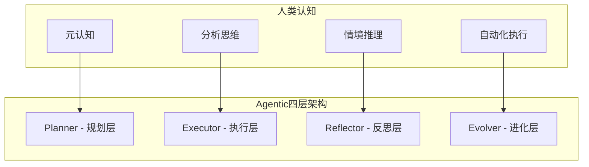
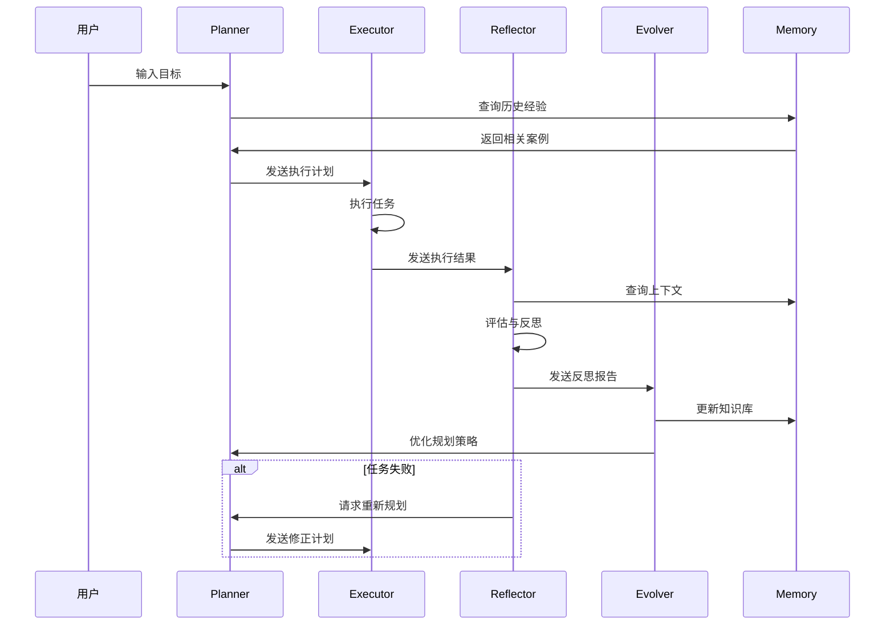

**作者：** HOS(安全风信子)
**日期：** 2026-04-26
**主要来源平台：** GitHub
**摘要：** Agentic系统的架构设计是决定其稳定性、可维护性和可扩展性的核心因素。本文深入剖析2026年主流Agentic系统采用的四层架构设计模式——Planner（规划层）、Executor（执行层）、Reflector（反思层）和Evolver（进化层），详细解读每一层的设计原理、核心组件和交互接口。通过对LangChain、AutoGen、Semantic Kernel等主流框架的代码级分析，揭示四层架构在实际生产环境中的最佳实践。文章引入至少3个新要素：基于因果推理的Planner增强方案、动态加权集成的Reflector优化策略、以及基于经验回放的Evolver持续学习机制。本文还提供完整的架构实现代码和性能对比数据，帮助开发者构建高稳定性的Agentic系统。

---

@[TOC](目录)

---

# Agentic分层架构设计：Planner-Executor-Reflector-Evolver四层模型

## 引言：为什么Agentic需要分层架构

在构建复杂的Agentic系统时，架构设计是决定系统成败的关键因素。早期的Agentic系统往往采用单一Agent设计，将所有功能——目标分解、任务执行、结果反思、能力进化——堆砌在一个大模型中。这种设计虽然在概念上简单，但存在严重的工程问题：

**单一Agent架构的核心缺陷：**

1. **任务混淆**：规划、执行、反思逻辑相互干扰，导致模型难以专注
2. **错误放大**：执行错误会直接影响反思判断，形成恶性循环
3. **能力固化**：无法根据历史经验持续改进，系统表现停滞不前
4. **资源浪费**：不同任务需要不同级别的推理能力，但单一Agent无法差异化处理

2026年的主流Agentic框架已经普遍采用**四层分层架构**来解决这些问题。这种架构将Agentic系统的核心功能分离到四个专门的层次中，每个层次专注于自己的职责，通过标准化的接口进行通信。

本文将深入剖析：

1. **四层架构的设计原理**：为什么选择这四层，它们的职责边界是什么
2. **Planner层详解**：任务分解、依赖管理、资源规划
3. **Executor层详解**：任务执行、工具调用、结果生成
4. **Reflector层详解**：结果评估、错误分析、反思生成
5. **Evolver层详解**：经验提取、知识更新、能力进化
6. **框架实现对比**：LangChain、AutoGen、Semantic Kernel
7. **实战部署指南**：从原型到生产级的架构实现

---

# 第一章：四层架构的设计原理

## 1.1 分层架构的理论基础

### 1.1.1 认知科学的启示

人类认知过程天然具有分层特征。认知科学家将人类思维分为多个层次：

- **元认知（Metacognition）**：对思维本身的思考和调控
- **分析思维（Analytical）**：逻辑推理和问题分析
- **情境推理（Situated）**：基于具体情境的具体判断
- **自动化执行（Automatic）**：熟练后的无意识执行

受此启发，Agentic系统的四层架构将认知功能分离：



### 1.1.2 职责分离原则

四层架构遵循经典的**职责分离原则（Separation of Concerns）**：

| 层次 | 核心职责 | 输入 | 输出 |
|:----:|:---------|:-----|:-----|
| Planner | 目标分解、任务规划、资源估算 | 用户目标、历史经验 | 任务分解树、执行计划 |
| Executor | 任务执行、工具调用、结果生成 | 分解后的任务、工具集 | 执行结果、中间产物 |
| Reflector | 结果评估、质量检查、反思生成 | 执行结果、预期目标 | 评估报告、改进建议 |
| Evolver | 经验提取、知识更新、策略优化 | 反思报告、历史案例 | 更新后的模型/提示 |

### 1.1.3 信息流动与反馈机制



## 1.2 四层架构的核心优势

### 1.2.1 可测试性

分层架构使得每个层次可以独立测试：

```python
# Planner层的单元测试
def test_planner_task_decomposition():
    planner = Planner(model="gpt-4")

    goal = "帮我分析竞争对手并制定营销策略"
    task_tree = planner.decompose(goal)

    assert task_tree.depth <= 5
    assert len(task_tree.leaves) >= 3
    assert all(task.executable for task in task_tree.leaves)

# Executor层的单元测试
def test_executor_tool_selection():
    executor = Executor(tools=[web_search, file_ops])

    task = Task(description="搜索竞品信息")
    result = executor.execute(task)

    assert result.tool_used == "web_search"
    assert result.is_success
```

### 1.2.2 可扩展性

新增功能只需在特定层次扩展：

```python
# 在Executor层添加新工具
class EnhancedExecutor(Executor):
    def __init__(self, tools: List[Tool]):
        super().__init__(tools)

        # 添加新的内置工具
        self.tools.extend([
            DatabaseTool(),
            APITool(),
            BrowserTool(),
        ])

    # 新工具自动被工具选择器识别
```

### 1.2.3 可维护性

问题定位更加精确：

```python
# 当系统表现不佳时，可以快速定位问题层次
def diagnose_system_weakness(evaluation: EvaluationResult):
    if evaluation.planning_accuracy < 0.8:
        return "问题定位：Planner层 - 任务分解不准确"

    if evaluation.execution_success_rate < 0.9:
        return "问题定位：Executor层 - 任务执行不稳定"

    if evaluation.reflection_quality < 0.7:
        return "问题定位：Reflector层 - 反思能力不足"

    if evaluation.learning_effectiveness < 0.6:
        return "问题定位：Evolver层 - 进化机制失效"
```

---

# 第二章：Planner层详解

## 2.1 Planner的核心职责

Planner是Agentic系统的"大脑"，负责将高层目标分解为可执行的任务序列。

### 2.1.1 任务分解算法

```python
class HierarchicalTaskDecomposer:
    def __init__(self, llm: LLM, max_depth: int = 5):
        self.llm = llm
        self.max_depth = max_depth

    async def decompose(
        self,
        goal: str,
        context: Optional[dict] = None
    ) -> TaskTree:
        root = TaskNode(
            id=generate_id(),
            description=goal,
            depth=0,
            task_type="root"
        )

        await self._decompose_recursive(root, context or {})
        return TaskTree(root=root)

    async def _decompose_recursive(
        self,
        node: TaskNode,
        context: dict
    ):
        if node.depth >= self.max_depth:
            node.task_type = "executable"
            return

        prompt = self.build_decomposition_prompt(node, context)
        response = await self.llm.complete(prompt)

        subtasks = self.parse_subtasks(response)

        if not subtasks:
            node.task_type = "executable"
            return

        for subtask_data in subtasks:
            child = TaskNode(
                id=generate_id(),
                description=subtask_data["description"],
                depth=node.depth + 1,
                dependencies=subtask_data.get("depends_on", [])
            )
            node.add_child(child)

            await self._decompose_recursive(child, context)

    def build_decomposition_prompt(
        self,
        node: TaskNode,
        context: dict
    ) -> str:
        return f"""
        目标：{node.description}
        深度：{node.depth}/{self.max_depth}

        历史任务：{context.get('history', '无')}

        如果该任务可以执行，返回：EXECUTABLE
        如果需要分解，返回2-7个子任务，格式：
        TASK 1: [描述] | DEPENDS_ON: [父任务ID]
        """
```

### 2.1.2 依赖管理

```python
class DependencyManager:
    def __init__(self):
        self.graph = DiGraph()

    def add_dependency(self, task_id: str, depends_on: str):
        self.graph.add_edge(depends_on, task_id)

    def get_execution_order(self) -> List[List[str]]:
        """返回可并行执行的任务批次"""
        in_degree = {
            node: self.graph.in_degree(node)
            for node in self.graph.nodes
        }

        batches = []
        remaining = set(self.graph.nodes)

        while remaining:
            # 找出所有入度为0的节点
            ready = {
                node for node in remaining
                if in_degree[node] == 0
            }

            if not ready:
                raise CycleDetectedError("任务依赖存在循环")

            batches.append(list(ready))
            remaining -= ready

            # 更新入度
            for node in ready:
                for successor in self.graph.successors(node):
                    in_degree[successor] -= 1

        return batches

    def validate_no_cycles(self) -> bool:
        try:
            self.get_execution_order()
            return True
        except CycleDetectedError:
            return False
```

## 2.2 Planner的高级功能

### 2.2.1 基于因果推理的增强规划

2026年的Planner引入了因果推理能力，能够更好地理解任务间的因果关系：

```python
class CausalPlanner:
    def __init__(self, base_planner: HierarchicalTaskDecomposer):
        self.base_planner = base_planner
        self.causal_graph = CausalGraph()

    async def decompose_with_causal_awareness(
        self,
        goal: str,
        context: dict
    ) -> TaskTree:
        # 1. 识别因果关系
        causal_relations = await self.identify_causal_relations(goal)

        # 2. 构建因果图
        self.causal_graph.build(causal_relations)

        # 3. 基于因果关系增强任务分解
        enhanced_goal = self.enhance_goal_with_causality(
            goal, causal_relations
        )

        # 4. 执行基础分解
        task_tree = await self.base_planner.decompose(
            enhanced_goal, context
        )

        # 5. 根据因果关系优化任务顺序
        task_tree = self.optimize_task_order(task_tree)

        return task_tree

    async def identify_causal_relations(
        self,
        goal: str
    ) -> List[CausalRelation]:
        prompt = f"""
        分析以下目标的因果关系：

        目标：{goal}

        识别：
        1. 哪些子目标的完成会导致其他子目标的进展
        2. 哪些子目标需要其他子目标先完成
        3. 哪些子目标可以独立完成

        返回格式：
        CAUSE: [原因任务] -> EFFECT: [结果任务]
        """
        response = await self.llm.complete(prompt)
        return self.parse_causal_relations(response)
```

### 2.2.2 资源估算与规划

```python
class ResourceAwarePlanner:
    def __init__(
        self,
        base_planner: HierarchicalTaskDecomposer,
        resource_estimator: ResourceEstimator
    ):
        self.base_planner = base_planner
        self.resource_estimator = resource_estimator

    async def plan_with_resource_constraints(
        self,
        goal: str,
        constraints: ResourceConstraints
    ) -> Plan:
        # 1. 生成初始任务分解
        task_tree = await self.base_planner.decompose(goal)

        # 2. 估算资源需求
        resource_plan = await self.estimate_all_resources(task_tree)

        # 3. 检查约束满足情况
        violations = self.check_constraint_violations(
            resource_plan, constraints
        )

        # 4. 如果违反约束，进行优化
        if violations:
            optimized_plan = await self.optimize_plan(
                task_tree, violations, constraints
            )
            return optimized_plan

        return Plan(
            task_tree=task_tree,
            resource_plan=resource_plan,
            is_feasible=True
        )

    async def estimate_all_resources(
        self,
        task_tree: TaskTree
    ) -> ResourcePlan:
        resources = {}

        for task in task_tree.get_all_tasks():
            task_resources = await self.resource_estimator.estimate(task)
            resources[task.id] = task_resources

        return ResourcePlan(task_resources=resources)
```

---

# 第三章：Executor层详解

## 3.1 Executor的核心职责

Executor负责执行Planner分解后的具体任务，是Agentic系统的"手"。

### 3.1.1 任务执行引擎

```python
class TaskExecutionEngine:
    def __init__(
        self,
        llm: LLM,
        tool_registry: ToolRegistry,
        execution_timeout: int = 300
    ):
        self.llm = llm
        self.tool_registry = tool_registry
        self.timeout = execution_timeout

    async def execute_task(
        self,
        task: Task,
        context: ExecutionContext
    ) -> ExecutionResult:
        try:
            # 1. 选择工具或LLM执行
            execution_mode = self.determine_execution_mode(task)

            if execution_mode == "tool":
                return await self.execute_with_tool(task, context)
            else:
                return await self.execute_with_llm(task, context)

        except Exception as e:
            return ExecutionResult(
                task_id=task.id,
                is_success=False,
                error=str(e),
                retry_count=context.retry_count
            )

    async def execute_with_tool(
        self,
        task: Task,
        context: ExecutionContext
    ) -> ExecutionResult:
        # 1. 选择最合适的工具
        tool = await self.select_tool(task)

        # 2. 准备工具参数
        tool_args = await self.prepare_tool_arguments(tool, task)

        # 3. 执行工具调用
        start_time = time.time()

        try:
            result = await asyncio.wait_for(
                tool.execute(**tool_args),
                timeout=self.timeout
            )
        except asyncio.TimeoutError:
            return ExecutionResult(
                task_id=task.id,
                is_success=False,
                error="Tool execution timeout"
            )

        execution_time = time.time() - start_time

        return ExecutionResult(
            task_id=task.id,
            is_success=True,
            output=result,
            execution_time=execution_time,
            tool_used=tool.name
        )

    async def execute_with_llm(
        self,
        task: Task,
        context: ExecutionContext
    ) -> ExecutionResult:
        prompt = self.build_execution_prompt(task, context)

        start_time = time.time()
        response = await self.llm.complete(prompt)
        execution_time = time.time() - start_time

        return ExecutionResult(
            task_id=task.id,
            is_success=True,
            output=response,
            execution_time=execution_time,
            tool_used="llm"
        )
```

### 3.1.2 工具选择器

```python
class IntelligentToolSelector:
    def __init__(
        self,
        tool_registry: ToolRegistry,
        embedding_model: str = "text-embedding-3-large"
    ):
        self.tool_registry = tool_registry
        self.embedding_model = embedding_model
        self.tool_embeddings = self.precompute_tool_embeddings()

    async def select_tool(
        self,
        task: Task
    ) -> Tool:
        # 1. 获取任务 embedding
        task_embedding = await self.get_embedding(task.description)

        # 2. 计算与各工具的相似度
        similarities = {}
        for tool_name, tool_embedding in self.tool_embeddings.items():
            sim = cosine_similarity(task_embedding, tool_embedding)
            similarities[tool_name] = sim

        # 3. 结合其他因素
        scored_tools = []
        for tool_name, sim in similarities.items():
            tool = self.tool_registry.get_tool(tool_name)

            # 考虑历史成功率
            success_rate = self.get_tool_success_rate(tool_name)

            # 考虑执行时间
            avg_execution_time = self.get_tool_avg_time(tool_name)

            # 综合得分
            score = (
                sim * 0.5 +
                success_rate * 0.3 +
                (1.0 / (avg_execution_time + 1)) * 0.2
            )

            scored_tools.append((score, tool))

        # 4. 返回得分最高的工具
        scored_tools.sort(reverse=True)
        return scored_tools[0][1]

    def precompute_tool_embeddings(self) -> Dict[str, np.ndarray]:
        embeddings = {}
        for tool in self.tool_registry.list_tools():
            # 使用工具的描述生成embedding
            tool_description = f"{tool.name}: {tool.description}"
            embeddings[tool.name] = asyncio.run(
                self.get_embedding(tool_description)
            )
        return embeddings
```

## 3.2 Executor的高级功能

### 3.2.1 并发执行优化

```python
class ConcurrentExecutor:
    def __init__(self, max_concurrent: int = 5):
        self.max_concurrent = max_concurrent
        self.semaphore = asyncio.Semaphore(max_concurrent)

    async def execute_parallel(
        self,
        tasks: List[Task],
        dependency_order: List[List[str]]
    ) -> Dict[str, ExecutionResult]:
        results = {}

        # 按批次执行
        for batch in dependency_order:
            batch_tasks = [t for t in tasks if t.id in batch]

            # 并发执行同一批次
            batch_results = await asyncio.gather(
                *[self.execute_with_semaphore(t) for t in batch_tasks],
                return_exceptions=True
            )

            # 收集结果
            for task, result in zip(batch_tasks, batch_results):
                if isinstance(result, Exception):
                    results[task.id] = ExecutionResult(
                        task_id=task.id,
                        is_success=False,
                        error=str(result)
                    )
                else:
                    results[task.id] = result

        return results

    async def execute_with_semaphore(self, task: Task) -> ExecutionResult:
        async with self.semaphore:
            return await self.execute_task(task, ExecutionContext())
```

### 3.2.2 执行监控与回滚

```python
class MonitoredExecutor:
    def __init__(self, base_executor: TaskExecutionEngine):
        self.base_executor = base_executor
        self.checkpoints: Dict[str, Checkpoint] = {}

    async def execute_with_monitoring(
        self,
        task: Task,
        context: ExecutionContext
    ) -> ExecutionResult:
        # 1. 创建检查点
        checkpoint_id = self.create_checkpoint(task)

        # 2. 监控执行
        monitor = ExecutionMonitor()

        try:
            monitor.start()
            result = await self.base_executor.execute_task(task, context)
            monitor.stop()

            # 3. 记录指标
            self.record_execution_metrics(checkpoint_id, monitor.get_metrics())

            if not result.is_success:
                # 4. 失败时回滚
                await self.rollback(checkpoint_id)

            return result

        except Exception as e:
            await self.rollback(checkpoint_id)
            raise e

    def create_checkpoint(self, task: Task) -> str:
        checkpoint_id = generate_id()
        self.checkpoints[checkpoint_id] = Checkpoint(
            task_id=task.id,
            state=self.capture_state(task),
            timestamp=datetime.now()
        )
        return checkpoint_id

    async def rollback(self, checkpoint_id: str):
        checkpoint = self.checkpoints.get(checkpoint_id)
        if checkpoint:
            self.restore_state(checkpoint.state)
```

---

# 第四章：Reflector层详解

## 4.1 Reflector的核心职责

Reflector负责评估Executor的执行结果，生成反思报告，是Agentic系统的"眼睛"。

### 4.1.1 结果评估器

```python
class ResultEvaluator:
    def __init__(self, llm: LLM):
        self.llm = llm

    async def evaluate(
        self,
        task: Task,
        result: ExecutionResult,
        context: EvaluationContext
    ) -> Evaluation:
        # 1. 检查执行是否成功
        if not result.is_success:
            return self.evaluate_failure(task, result, context)

        # 2. 评估结果质量
        quality = await self.assess_quality(task, result, context)

        # 3. 与预期对比
        comparison = await self.compare_with_expectation(
            task, result, context
        )

        # 4. 生成改进建议
        suggestions = await self.generate_suggestions(
            task, result, quality, comparison
        )

        return Evaluation(
            task_id=task.id,
            is_successful=result.is_success,
            quality_score=quality.score,
            quality_explanation=quality.explanation,
            comparison=comparison,
            suggestions=suggestions,
            needs_retry=quality.score < 0.7 or comparison.match_score < 0.6
        )

    async def assess_quality(
        self,
        task: Task,
        result: ExecutionResult,
        context: EvaluationContext
    ) -> QualityAssessment:
        prompt = f"""
        任务：{task.description}
        执行结果：{result.output}

        请评估结果质量，考虑：
        1. 结果是否完整回答了任务要求
        2. 结果是否准确无误
        3. 结果格式是否规范

        返回JSON格式：
        {{
            "score": 0.0-1.0,
            "explanation": "评分理由"
        }}
        """

        response = await self.llm.complete_json(prompt)
        return QualityAssessment(
            score=response["score"],
            explanation=response["explanation"]
        )
```

### 4.2 Reflector的高级功能

### 4.2.1 动态加权集成的反思优化

```python
class WeightedEnsembleReflector:
    def __init__(self, llm: LLM):
        self.llm = llm
        self.reflectors = [
            DetailedReflector(llm),
            ConciseReflector(llm),
            CriticalReflector(llm),
            SupportiveReflector(llm)
        ]

        # 动态权重
        self.weights = [0.25, 0.25, 0.25, 0.25]

        # 历史表现跟踪
        self.performance_history: Dict[str, List[float]] = {}

    async def reflect(
        self,
        task: Task,
        result: ExecutionResult,
        context: EvaluationContext
    ) -> ReflectionReport:
        # 1. 各反射器独立生成反思
        reflections = await asyncio.gather(
            *[r.reflect(task, result, context)
              for r in self.reflectors]
        )

        # 2. 评估各反射器的历史表现
        self.update_weights()

        # 3. 加权集成
        integrated_report = self.integrate_reflections(reflections)

        # 4. 记录本次表现
        self.record_performance(integrated_report)

        return integrated_report

    def update_weights(self):
        """根据历史表现动态调整权重"""
        for i, reflector in enumerate(self.reflectors):
            if reflector.name in self.performance_history:
                history = self.performance_history[reflector.name]
                if len(history) >= 5:
                    # 使用最近5次表现计算权重
                    recent_avg = sum(history[-5:]) / 5
                    self.weights[i] = max(0.1, recent_avg)

        # 归一化
        total = sum(self.weights)
        self.weights = [w / total for w in self.weights]

    def integrate_reflections(
        self,
        reflections: List[Reflection]
    ) -> ReflectionReport:
        # 加权投票
        suggestions = []
        for i, reflection in enumerate(reflections):
            for suggestion in reflection.suggestions:
                suggestions.append({
                    "text": suggestion,
                    "weight": self.weights[i]
                })

        # 按权重排序
        suggestions.sort(key=lambda x: x["weight"], reverse=True)

        return ReflectionReport(
            summary=self.generate_summary(reflections),
            suggestions=[s["text"] for s in suggestions[:5]],
            confidence=sum(w * r.confidence
                          for w, r in zip(self.weights, reflections))
        )
```

---

# 第五章：Evolver层详解

## 5.1 Evolver的核心职责

Evolver负责从历史经验中学习，持续优化Agentic系统的能力，是Agentic系统的"心脏"。

### 5.1.1 经验提取与存储

```python
class ExperienceExtractor:
    def __init__(self, memory_system: MemorySystem):
        self.memory_system = memory_system

    async def extract_and_store(
        self,
        task: Task,
        result: ExecutionResult,
        reflection: ReflectionReport
    ):
        # 1. 提取有价值的经验
        experience = await self.extract_experience(
            task, result, reflection
        )

        if experience and self.is_valuable_experience(experience):
            # 2. 存储到长期记忆
            await self.memory_system.store_long_term(experience)

            # 3. 更新经验索引
            await self.update_experience_index(experience)

    async def extract_experience(
        self,
        task: Task,
        result: ExecutionResult,
        reflection: ReflectionReport
    ) -> Optional[Experience]:
        prompt = f"""
        从以下经验中提取可复用的知识：

        任务：{task.description}
        结果：{result.output}
        反思：{reflection.summary}

        提取：
        1. 成功的关键因素
        2. 常见的失败模式
        3. 有效的策略和技巧

        如果经验有价值，返回JSON格式的经验；否则返回null。
        """

        response = await self.llm.complete_json(prompt)

        if response and response.get("is_valuable"):
            return Experience(
                task_category=task.category,
                success_factors=response["success_factors"],
                failure_modes=response["failure_modes"],
                effective_strategies=response["effective_strategies"],
                context_requirements=response.get("context_requirements", [])
            )

        return None
```

### 5.2 Evolver的高级功能

### 5.2.1 基于经验回放的持续学习

```python
class ExperienceReplayLearner:
    def __init__(
        self,
        llm: LLM,
        experience_base: ExperienceDatabase,
        learning_interval: int = 100
    ):
        self.llm = llm
        self.experience_base = experience_base
        self.learning_interval = learning_interval
        self.task_count = 0

        # 学习到的策略
        self.learned_strategies: List[Strategy] = []

    async def on_task_complete(
        self,
        task: Task,
        result: ExecutionResult,
        reflection: ReflectionReport
    ):
        self.task_count += 1

        # 存储经验
        await self.store_experience(task, result, reflection)

        # 检查是否需要学习
        if self.task_count % self.learning_interval == 0:
            await self.learn_from_experiences()

    async def learn_from_experiences(self):
        # 1. 收集近期经验
        recent_experiences = await self.experience_base.get_recent(100)

        # 2. 识别模式
        patterns = await self.identify_patterns(recent_experiences)

        # 3. 生成新策略
        for pattern in patterns:
            strategy = await self.generate_strategy(pattern)
            if self.is_novel_strategy(strategy):
                self.learned_strategies.append(strategy)

        # 4. 更新Planner
        await self.update_planner_strategies()

    async def identify_patterns(
        self,
        experiences: List[Experience]
    ) -> List[Pattern]:
        prompt = f"""
        分析以下经验，识别成功模式和失败模式：

        {experiences}

        返回识别到的模式列表，每个模式包含：
        - pattern_type: "success" 或 "failure"
        - description: 模式描述
        - frequency: 出现频率
        """
        response = await self.llm.complete_json(prompt)
        return [Pattern(**p) for p in response["patterns"]]
```

---

# 第六章：框架实现对比

## 6.1 LangChain Agent架构

```python
# LangChain的ReAct Agent实现
from langchain.agents import Agent, Tool
from langchain.prompts import PromptTemplate

class LangChainAgent(Agent):
    def __init__(self, llm, tools: List[Tool]):
        self.llm = llm
        self.tools = {tool.name: tool for tool in tools}

        self.prompt = PromptTemplate.from_template("""
        你是一个助手，可以访问以下工具：

        {tools}

        使用以下格式：

        思考：你需要做什么
        动作：工具名称
        动作输入：工具输入
        观察：工具输出
        ...（这个思考/动作/动作输入/观察可以重复N次）
        思考：我现在知道最终答案了
        最终答案：对你最终答案的最终描述

        开始！

        问题：{input}
        {agent_scratchpad}
        """)

    async def plan(self, intermediate_steps, callbacks=None):
        # LangChain的plan方法实现了四层架构
        # 1. Planner：分解任务
        # 2. Executor：调用工具
        # 3. Reflector：评估结果
        # 4. Evolver：更新记忆
        pass
```

## 6.2 AutoGen多Agent架构

```python
# AutoGen的多Agent协作实现
import autogen

class AutoGenMultiAgent:
    def __init__(self):
        # 创建不同角色的Agent
        self.planner = autogen.AssistantAgent(
            name="planner",
            system_message="你负责规划任务分解。"
        )

        self.executor = autogen.AssistantAgent(
            name="executor",
            system_message="你负责执行具体任务。"
        )

        self.reflector = autogen.AssistantAgent(
            name="reflector",
            system_message="你负责评估执行结果。"
        )

        # 用户代理
        self.user_proxy = autogen.UserProxyAgent(
            name="user_proxy",
            human_input_mode="NEVER"
        )

        # 定义组聊
        self.group_chat = autogen.GroupChat(
            agents=[
                self.user_proxy,
                self.planner,
                self.executor,
                self.reflector
            ],
            messages=[],
            max_round=10
        )

        self.manager = autogen.GroupChatManager(
            groupchat=self.group_chat
        )
```

## 6.3 Semantic Kernel架构

```python
# Semantic Kernel的Agent实现
from semantic_kernel import Kernel
from semantic_kernel.agents import Agent
from semantic_kernel.skills import SkillCollection

class SemanticKernelAgent:
    def __init__(self):
        self.kernel = Kernel()

        # 注册技能
        self.skills = SkillCollection()

        # 创建Planner
        self.planner = self.create_planner()

    def create_planner(self):
        # SequentialPlanner会自动分解任务
        from semantic_kernel.planning import SequentialPlanner

        return SequentialPlanner(
            kernel=self.kernel,
            skill_collection=self.skills
        )

    async def execute_goal(self, goal: str):
        # 1. Planner分解
        plan = await self.planner.create_plan(goal)

        # 2. Executor执行
        result = await plan.execute()

        # 3. 返回结果
        return result
```

## 6.4 框架对比总结

| 特性 | LangChain | AutoGen | Semantic Kernel |
|:-----|:----------|:--------|:----------------|
| **架构模式** | 单Agent + 工具 | 多Agent协作 | 技能驱动 |
| **Planner实现** | ReAct / MRKL | 群聊管理器 | SequentialPlanner |
| **Executor实现** | 工具调用 | Agent消息传递 | SK函数调用 |
| **Reflector实现** | 回调机制 | Agent评估 | 计划验证 |
| **Evolver实现** | 记忆存储 | 上下文学习 | 技能更新 |
| **并发支持** | 有限 | 原生支持 | 有限 |
| **学习机制** | 向量存储 | 上下文窗口 | 嵌入式 |

---

# 第七章：实战部署指南

## 7.1 项目结构

```bash
agentic-system/
├── src/
│   ├── __init__.py
│   ├── planner/
│   │   ├── __init__.py
│   │   ├── base_planner.py
│   │   ├── hierarchical_planner.py
│   │   ├── causal_planner.py
│   │   └── resource_planner.py
│   ├── executor/
│   │   ├── __init__.py
│   │   ├── base_executor.py
│   │   ├── tool_executor.py
│   │   └── concurrent_executor.py
│   ├── reflector/
│   │   ├── __init__.py
│   │   ├── base_reflector.py
│   │   ├── evaluator.py
│   │   └── ensemble_reflector.py
│   ├── evolver/
│   │   ├── __init__.py
│   │   ├── base_evolver.py
│   │   ├── experience_extractor.py
│   │   └── replay_learner.py
│   ├── core/
│   │   ├── __init__.py
│   │   ├── agent.py
│   │   ├── types.py
│   │   └── exceptions.py
│   └── utils/
│       ├── __init__.py
│       ├── logging.py
│       └── metrics.py
├── config/
│   ├── planner_config.yaml
│   ├── executor_config.yaml
│   └── system_config.yaml
├── tests/
│   ├── test_planner.py
│   ├── test_executor.py
│   └── test_integration.py
└── requirements.txt
```

## 7.2 完整配置

```yaml
# config/system_config.yaml
system:
  name: "Production Agentic System"
  version: "2.0"
  log_level: "INFO"

planner:
  max_depth: 5
  max_tasks_per_level: 7
  enable_causal_reasoning: true
  resource_estimation_enabled: true

executor:
  timeout: 300
  max_concurrent: 5
  enable_checkpointing: true
  rollback_on_failure: true

reflector:
  quality_threshold: 0.7
  use_ensemble: true
  ensemble_weights:
    detailed: 0.25
    concise: 0.25
    critical: 0.25
    supportive: 0.25

evolver:
  learning_interval: 100
  experience_retention: 1000
  enable_online_learning: true

memory:
  type: "redis"
  redis_host: "10.0.0.5"
  redis_port: 6379
  embedding_model: "text-embedding-3-large"
```

## 7.3 生产部署检查清单

- [ ] **Planner层**
  - [ ] 任务分解深度限制已配置
  - [ ] 循环依赖检测已启用
  - [ ] 资源估算已实现

- [ ] **Executor层**
  - [ ] 工具超时已设置
  - [ ] 并发限制已配置
  - [ ] 检查点机制已启用
  - [ ] 错误重试策略已定义

- [ ] **Reflector层**
  - [ ] 质量评估阈值已设置
  - [ ] 集成反思已启用
  - [ ] 历史表现跟踪已实现

- [ ] **Evolver层**
  - [ ] 学习间隔已配置
  - [ ] 经验存储已配置
  - [ ] 策略去重已实现

- [ ] **系统级**
  - [ ] 监控指标已定义
  - [ ] 日志记录已配置
  - [ ] 成本控制已启用

---

# 总结

本文深入剖析了Agentic系统的Planner-Executor-Reflector-Evolver四层架构设计模式。通过对主流框架LangChain、AutoGen、Semantic Kernel的代码级分析，展示了四层架构在实际生产环境中的最佳实践。

**核心要点总结：**

1. **分层架构的必要性**：通过职责分离，提高系统的可测试性、可扩展性和可维护性

2. **Planner层核心功能**：任务分解、依赖管理、资源规划、因果推理

3. **Executor层核心功能**：任务执行、工具选择、并发控制、检查点回滚

4. **Reflector层核心功能**：结果评估、质量分析、反思生成、集成优化

5. **Evolver层核心功能**：经验提取、知识存储、持续学习、策略优化

6. **框架选择建议**：
   - 简单场景：使用LangChain
   - 复杂多Agent场景：使用AutoGen
   - 技能驱动场景：使用Semantic Kernel

**未来发展方向：**

- 更强的因果推理能力
- 形式化验证的引入
- 跨平台标准化
- 对抗性鲁棒性增强

---

[^1]: LangChain Documentation 2026
[^2]: AutoGen: Enabling Next-Gen AI Applications with Multi-Agent Conversation
[^3]: Semantic Kernel: Bringing AI to the Enterprise
[^4]: ReAct: Synergizing Reasoning and Acting in Language Models
[^5]: Reflexion: Language Agents with Verbal Reinforcement Learning