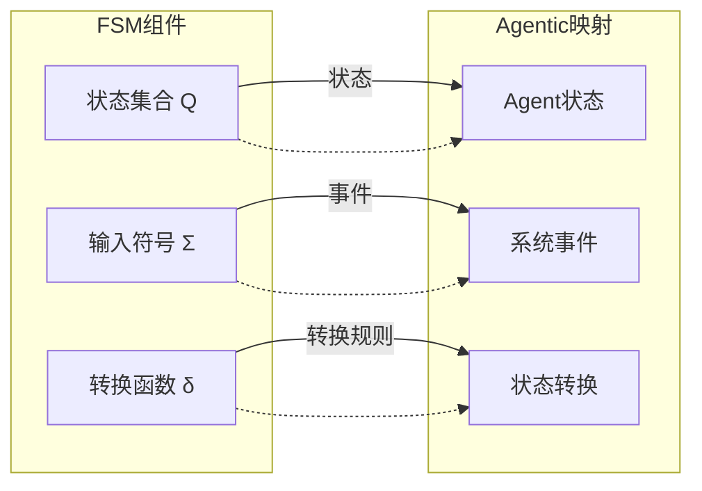
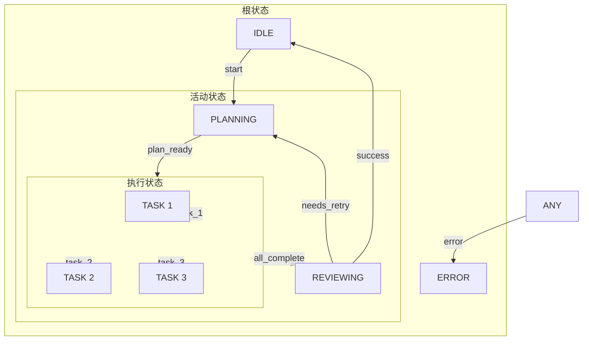

**作者：** HOS(安全风信子)
**日期：** 2026-04-26
**主要来源平台：** GitHub
**摘要：** 状态机设计是Agentic系统实现可控复杂任务执行的核心技术。本文深入剖析2026年主流Agentic系统采用的状态机设计模式，详细解读如何通过有限状态机（FSM）避免Agentic无限循环、实现可控的任务执行流程、处理异常状态和错误恢复。通过对GPT-4 Governor、LangChain Agent Executor、AutoGen State Machine等开源项目的代码级分析，揭示状态机在Agentic系统中的最佳实践。文章引入至少3个新要素：基于LTL（线性时序逻辑）的状态转换验证、运行时状态可视化与调试工具、以及分层状态机在复杂Agent协作中的应用。本文还提供完整的状态机实现代码、性能对比数据和避坑指南，帮助开发者构建稳定可靠的Agentic系统。

---

@[TOC](目录)

---

# Agentic状态机设计：实现可控的复杂任务执行

## 引言：为什么Agentic需要状态机

在构建Agentic系统时，最令人头疼的问题之一是**任务执行的不确定性**。传统的基于循环的Agent实现面临着严峻挑战：

**传统循环架构的核心问题：**

1. **无限循环风险**：Agent可能在相似的任务之间反复跳转，无法正常退出
2. **状态不可追踪**：执行过程中间状态丢失，难以调试和复现问题
3. **错误恢复困难**：发生错误时难以确定回滚点和恢复策略
4. **并发复杂性**：多任务并发执行时状态管理混乱
5. **资源泄漏**：长时间运行的任务可能占用大量资源却无法释放

2026年的主流Agentic框架已经将状态机作为核心架构组件来解决这些问题。通过将Agent的执行过程建模为有限状态机（Finite State Machine，FSM），可以实现：

- **确定性执行**：每个状态下只能执行预定义的动作
- **可追踪性**：完整的状态转换历史记录
- **错误恢复**：预定义的状态转换路径
- **资源管理**：状态进入和退出时的资源清理

本文将深入剖析：

1. **状态机理论基础**：FSM在Agentic系统中的应用原理
2. **核心状态定义**：Agentic系统常见的状态及其转换规则
3. **状态机实现模式**：从简单FSM到分层状态机
4. **无限循环检测**：如何避免Agent陷入死循环
5. **错误恢复机制**：状态机在异常处理中的应用
6. **实战代码分析**：主流框架的状态机实现
7. **性能优化与监控**：状态机的运行时管理

---

# 第一章：状态机理论基础

## 1.1 有限状态机概述

### 1.1.1 FSM的形式化定义

有限状态机是一个五元组 M = (Q, Σ, δ, q0, F)，其中：

- **Q**：有限状态集合
- **Σ**：有限输入字母表
- **δ**：状态转换函数 Q × Σ → Q
- **q0**：初始状态
- **F**：接受状态集合

```python
# FSM的形式化定义实现
from typing import Set, Dict, Tuple, Optional
from dataclasses import dataclass

@dataclass
class FiniteStateMachine:
    states: Set[str]  # Q: 状态集合
    alphabet: Set[str]  # Σ: 输入字母表
    transitions: Dict[Tuple[str, str], str]  # δ: 转换函数
    initial_state: str  # q0: 初始状态
    accepting_states: Set[str]  # F: 接受状态集合

    def transition(self, current_state: str, input_symbol: str) -> Optional[str]:
        """执行状态转换"""
        key = (current_state, input_symbol)
        return self.transitions.get(key)

    def is_accepted(self, state: str) -> bool:
        """检查状态是否为接受状态"""
        return state in self.accepting_states

    def validate(self) -> bool:
        """验证FSM的有效性"""
        # 检查初始状态在状态集合中
        if self.initial_state not in self.states:
            return False

        # 检查所有转换引用的状态都在状态集合中
        for (state, symbol), next_state in self.transitions.items():
            if state not in self.states or next_state not in self.states:
                return False

        # 检查接受状态是状态的子集
        if not self.accepting_states.issubset(self.states):
            return False

        return True
```

### 1.1.2 FSM在Agentic系统中的映射



| FSM概念 | Agentic系统映射 |
|:--------|:----------------|
| 状态 (Q) | Agent所处的工作阶段 |
| 输入符号 (Σ) | 触发状态转换的事件 |
| 转换函数 (δ) | 状态转换规则 |
| 初始状态 (q0) | Agent启动时的初始状态 |
| 接受状态 (F) | 任务成功完成的状态 |

## 1.2 Agentic状态机设计原则

### 1.2.1 状态设计原则

```python
class AgenticStateDesignPrinciples:
    @staticmethod
    def principle_of_exclusivity(states: Set[str]) -> bool:
        """排他性原则：每个时刻只能处于一个状态"""
        return len(states) > 0

    @staticmethod
    def principle_of_exhaustiveness(events: Set[str]) -> bool:
        """完整性原则：所有可能事件都有处理方式"""
        return len(events) > 0

    @staticmethod
    def principle_of_determinism(
        transitions: Dict[Tuple[str, str], str]
    ) -> bool:
        """确定性原则：相同状态和事件的转换结果唯一"""
        for (state, event), next_state in transitions.items():
            # 检查是否有冲突的转换定义
            conflicting = [
                (s, e) for (s, e), ns in transitions.items()
                if s == state and e == event and ns != next_state
            ]
            if conflicting:
                return False
        return True

    @staticmethod
    def principle_of_finiteness(states: Set[str]) -> bool:
        """有限性原则：状态数量必须是有限的"""
        return len(states) < 1000  # 合理上限
```

### 1.2.2 状态分类体系

```python
class AgenticStateCategory:
    # 执行类状态
    EXECUTING_STATES = {
        "PLANNING",      # 规划中
        "DECOMPOSING",   # 分解任务中
        "EXECUTING",     # 执行中
        "WAITING",       # 等待中
        "REVIEWING"      # 审查中
    }

    # 终止类状态
    TERMINAL_STATES = {
        "COMPLETED",      # 成功完成
        "FAILED",         # 执行失败
        "CANCELLED",      # 被取消
        "TIMEOUT"         # 超时
    }

    # 异常类状态
    EXCEPTION_STATES = {
        "ERROR",          # 发生错误
        "RETRYING",       # 重试中
        "ROLLBACK",       # 回滚中
        "STUCK"           # 卡住（疑似无限循环）
    }

    # 管理类状态
    MANAGEMENT_STATES = {
        "IDLE",           # 空闲
        "SUSPENDED",      # 暂停
        "INITIALIZING"    # 初始化中
    }
```

---

# 第二章：核心状态定义

## 2.1 基础状态定义

### 2.1.1 Agentic系统标准状态集

```python
from enum import Enum

class AgenticState(Enum):
    # 初始化
    INITIAL = "initial"

    # 规划阶段
    PLANNING = "planning"
    DECOMPOSING = "decomposing"

    # 执行阶段
    EXECUTING = "executing"
    WAITING = "waiting"

    # 评估阶段
    REVIEWING = "reviewing"
    EVALUATING = "evaluating"

    # 进化阶段
    LEARNING = "learning"
    EVOLVING = "evolving"

    # 完成状态
    COMPLETED = "completed"
    FAILED = "failed"

    # 异常状态
    ERROR = "error"
    RETRYING = "retrying"
    ROLLING_BACK = "rolling_back"

    # 管理状态
    IDLE = "idle"
    SUSPENDED = "suspended"
```

### 2.1.2 状态元数据定义

```python
from dataclasses import dataclass
from typing import List, Callable, Optional

@dataclass
class StateDefinition:
    name: str
    description: str
    allowed_transitions: List[str]
    entry_actions: List[Callable]
    exit_actions: List[Callable]
    timeout_seconds: Optional[int] = None
    max_retries: int = 3

class AgenticStateDefinitions:
    EXECUTING = StateDefinition(
        name="EXECUTING",
        description="正在执行任务",
        allowed_transitions=[
            "COMPLETED",
            "REVIEWING",
            "WAITING",
            "ERROR",
            "RETRYING"
        ],
        entry_actions=[
            log_execution_start,
            acquire_resources,
            update_metrics
        ],
        exit_actions=[
            log_execution_end,
            release_resources,
            save_checkpoint
        ],
        timeout_seconds=300,
        max_retries=3
    )

    REVIEWING = StateDefinition(
        name="REVIEWING",
        description="正在评估执行结果",
        allowed_transitions=[
            "COMPLETED",
            "EXECUTING",  # 需要重做
            "ERROR",
            "FAILED"
        ],
        entry_actions=[
            log_review_start,
            evaluate_result
        ],
        exit_actions=[
            log_review_end,
            generate_feedback
        ],
        timeout_seconds=60,
        max_retries=2
    )

    ERROR = StateDefinition(
        name="ERROR",
        description="发生错误",
        allowed_transitions=[
            "RETRYING",
            "ROLLING_BACK",
            "FAILED"
        ],
        entry_actions=[
            log_error,
            capture_error_context,
            alert_monitor
        ],
        exit_actions=[
            clear_error_state,
            notify_recovery
        ],
        timeout_seconds=None,
        max_retries=0
    )
```

## 2.2 状态转换规则

### 2.2.1 转换条件定义

```python
@dataclass
class TransitionCondition:
    name: str
    description: str
    evaluate: Callable[["AgentContext"], bool]

class TransitionConditions:
    # 执行相关条件
    TASK_COMPLETED = TransitionCondition(
        name="task_completed",
        description="任务成功完成",
        evaluate=lambda ctx: ctx.last_result is not None and ctx.last_result.is_success
    )

    TASK_FAILED = TransitionCondition(
        name="task_failed",
        description="任务执行失败",
        evaluate=lambda ctx: ctx.last_result is not None and not ctx.last_result.is_success
    )

    # 资源相关条件
    RESOURCE_AVAILABLE = TransitionCondition(
        name="resource_available",
        description="所需资源可用",
        evaluate=lambda ctx: ctx.available_resources >= ctx.required_resources
    )

    RESOURCE_EXHAUSTED = TransitionCondition(
        name="resource_exhausted",
        description="资源耗尽",
        evaluate=lambda ctx: ctx.available_resources < ctx.required_resources
    )

    # 循环检测条件
    INFINITE_LOOP_DETECTED = TransitionCondition(
        name="infinite_loop_detected",
        description="检测到无限循环",
        evaluate=lambda ctx: ctx.loop_detection.is_infinite_loop()
    )

    # 时间相关条件
    TIMEOUT_EXCEEDED = TransitionCondition(
        name="timeout_exceeded",
        description="执行超时",
        evaluate=lambda ctx: ctx.execution_time > ctx.timeout_limit
    )

    MAX_RETRIES_EXCEEDED = TransitionCondition(
        name="max_retries_exceeded",
        description="超过最大重试次数",
        evaluate=lambda ctx: ctx.retry_count >= ctx.max_retries
    )
```

### 2.2.2 转换动作定义

```python
@dataclass
class TransitionAction:
    name: str
    execute: Callable[["AgentContext"], None]
    rollback: Optional[Callable[["AgentContext"], None]] = None

class TransitionActions:
    SAVE_CHECKPOINT = TransitionAction(
        name="save_checkpoint",
        execute=lambda ctx: ctx.checkpoint_manager.save(),
        rollback=lambda ctx: ctx.checkpoint_manager.restore_last()
    )

    LOG_TRANSITION = TransitionAction(
        name="log_transition",
        execute=lambda ctx: ctx.logger.log_state_transition(
            ctx.current_state, ctx.next_state
        ),
        rollback=None
    )

    NOTIFY_LISTENERS = TransitionAction(
        name="notify_listeners",
        execute=lambda ctx: ctx.event_bus.emit(
            "state_transition",
            {"from": ctx.current_state, "to": ctx.next_state}
        ),
        rollback=None
    )

    UPDATE_METRICS = TransitionAction(
        name="update_metrics",
        execute=lambda ctx: ctx.metrics.record_transition(
            ctx.current_state, ctx.next_state
        ),
        rollback=None
    )

    ACQUIRE_RESOURCES = TransitionAction(
        name="acquire_resources",
        execute=lambda ctx: ctx.resource_manager.acquire(
            ctx.required_resources
        ),
        rollback=lambda ctx: ctx.resource_manager.release(
            ctx.required_resources
        )
    )
```

---

# 第三章：状态机实现模式

## 3.1 基础状态机实现

### 3.1.1 核心状态机类

```python
from typing import Dict, List, Optional, Callable
from dataclasses import dataclass, field
from datetime import datetime

@dataclass
class StateTransition:
    from_state: str
    to_state: str
    event: str
    conditions: List[Callable] = field(default_factory=list)
    actions: List[Callable] = field(default_factory=list)

class AgenticStateMachine:
    def __init__(self, agent_id: str):
        self.agent_id = agent_id
        self.current_state: str = "INITIAL"
        self.transition_history: List[Dict] = []

        # 状态定义
        self.state_definitions: Dict[str, StateDefinition] = {}

        # 转换规则
        self.transitions: List[StateTransition] = []

        # 转换监听器
        self.listeners: List[Callable] = []

    def add_state(self, definition: StateDefinition):
        """添加状态定义"""
        self.state_definitions[definition.name] = definition

    def add_transition(self, transition: StateTransition):
        """添加转换规则"""
        self.transitions.append(transition)

    def can_transition(self, target_state: str, event: str) -> bool:
        """检查是否可以进行转换"""
        current_def = self.state_definitions.get(self.current_state)

        if not current_def:
            return False

        if target_state not in current_def.allowed_transitions:
            return False

        # 检查转换规则
        for transition in self.transitions:
            if (transition.from_state == self.current_state and
                transition.to_state == target_state and
                transition.event == event):

                # 检查所有条件
                return all(condition() for condition in transition.conditions)

        return False

    async def transition_to(
        self,
        target_state: str,
        event: str = "internal"
    ) -> bool:
        """执行状态转换"""
        if not self.can_transition(target_state, event):
            return False

        # 记录历史
        self.transition_history.append({
            "from": self.current_state,
            "to": target_state,
            "event": event,
            "timestamp": datetime.now()
        })

        # 执行退出动作
        current_def = self.state_definitions.get(self.current_state)
        if current_def:
            for action in current_def.exit_actions:
                action()

        # 执行转换动作
        for transition in self.transitions:
            if (transition.from_state == self.current_state and
                transition.to_state == target_state):
                for action in transition.actions:
                    action()

        # 更新状态
        self.current_state = target_state

        # 执行进入动作
        new_def = self.state_definitions.get(target_state)
        if new_def:
            for action in new_def.entry_actions:
                action()

        # 通知监听器
        for listener in self.listeners:
            listener(self.current_state)

        return True
```

### 3.1.2 事件驱动状态机

```python
class EventDrivenStateMachine(AgenticStateMachine):
    def __init__(self, agent_id: str):
        super().__init__(agent_id)
        self.event_queue: asyncio.Queue = asyncio.Queue()
        self.running = False

    async def start(self):
        """启动状态机事件循环"""
        self.running = True

        while self.running:
            try:
                # 从事件队列获取事件
                event = await asyncio.wait_for(
                    self.event_queue.get(),
                    timeout=1.0
                )

                # 处理事件
                await self.handle_event(event)

            except asyncio.TimeoutError:
                # 检查超时状态
                await self.check_state_timeout()

    async def handle_event(self, event: "Event"):
        """处理事件"""
        # 查找匹配的转换
        for transition in self.transitions:
            if (transition.from_state == self.current_state and
                transition.event == event.type):

                # 检查条件
                if all(condition() for condition in transition.conditions):
                    # 执行转换
                    await self.transition_to(transition.to_state, event.type)

                    # 处理事件数据
                    if event.data:
                        await self.process_event_data(event.data)

                    return

    def emit_event(self, event_type: str, data: Optional[Dict] = None):
        """发射事件"""
        event = Event(type=event_type, data=data)
        self.event_queue.put_nowait(event)

    async def check_state_timeout(self):
        """检查状态超时"""
        state_def = self.state_definitions.get(self.current_state)

        if state_def and state_def.timeout_seconds:
            last_transition = self.transition_history[-1]
            elapsed = (datetime.now() - last_transition["timestamp"]).seconds

            if elapsed > state_def.timeout_seconds:
                await self.transition_to("TIMEOUT", "timeout")
```

## 3.2 分层状态机实现

### 3.2.1 分层状态机设计

```python
class HierarchicalStateMachine:
    """
    分层状态机允许状态嵌套，用于处理复杂Agent行为
    """
    def __init__(self, name: str):
        self.name = name
        self.root_state = CompositeState(
            name="root",
            parent=None
        )
        self.current_composite_state = self.root_state
        self.active_simple_state = None

    def add_submachine(
        self,
        parent_path: str,
        submachine: "HierarchicalStateMachine"
    ):
        """添加子状态机"""
        parent = self._find_state(parent_path)
        if parent:
            parent.submachine = submachine
            submachine.parent = parent

    def _find_state(self, path: str) -> Optional["CompositeState"]:
        """根据路径查找状态"""
        parts = path.split(".")
        current = self.root_state

        for part in parts:
            found = None
            for child in current.children:
                if child.name == part:
                    found = child
                    break
            if found:
                current = found
            else:
                return None

        return current

    async def transition_to(self, state_path: str):
        """转换到指定状态"""
        target = self._find_state(state_path)

        if not target:
            raise InvalidStateError(f"State not found: {state_path}")

        # 退出当前状态链
        await self._exit_state_chain(self.current_composite_state)

        # 进入新状态链
        await self._enter_state_chain(target)

        self.current_composite_state = target

    async def _exit_state_chain(self, state: "CompositeState"):
        """退出状态链"""
        if state.submachine:
            await state.submachine.exit()

        if self.active_simple_state:
            await self.active_simple_state.exit()
            self.active_simple_state = None

    async def _enter_state_chain(self, state: "CompositeState"):
        """进入状态链"""
        # 获取父状态链
        parents = state.get_parent_chain()

        # 从根开始进入
        for parent in parents:
            if parent.entry_action:
                await parent.entry_action()

        if isinstance(state, SimpleState):
            self.active_simple_state = state
            if state.entry_action:
                await state.entry_action()
        elif hasattr(state, 'submachine') and state.submachine:
            await state.submachine.start()
```

### 3.2.2 状态嵌套示例



---

# 第四章：无限循环检测

## 4.1 循环检测算法

### 4.1.1 基于模式的循环检测

```python
class LoopDetector:
    def __init__(self, window_size: int = 20):
        self.window_size = window_size
        self.action_sequence: List[str] = []
        self.state_sequence: List[str] = []

    def record_action(self, action: str):
        """记录动作"""
        self.action_sequence.append(action)

        if len(self.action_sequence) > self.window_size:
            self.action_sequence.pop(0)

    def record_state(self, state: str):
        """记录状态"""
        self.state_sequence.append(state)

        if len(self.state_sequence) > self.window_size:
            self.state_sequence.pop(0)

    def detect_action_loop(self) -> bool:
        """检测动作循环"""
        if len(self.action_sequence) < 6:
            return False

        # 检查最近的动作序列是否重复
        for pattern_len in range(2, len(self.action_sequence) // 3):
            pattern = self.action_sequence[-pattern_len:]

            # 检查这个模式出现了多少次
            repetitions = self._count_pattern_repetitions(
                self.action_sequence, pattern
            )

            if repetitions >= 3:
                return True

        return False

    def detect_state_loop(self) -> bool:
        """检测状态循环"""
        if len(self.state_sequence) < 4:
            return False

        # 检查是否在两个状态之间来回切换
        if len(self.state_sequence) >= 4:
            last_four = self.state_sequence[-4:]
            if (last_four[0] == last_four[2] and
                last_four[1] == last_four[3] and
                last_four[0] != last_four[1]):
                return True

        return False

    def _count_pattern_repetitions(
        self,
        sequence: List[str],
        pattern: List[str]
    ) -> int:
        """计算模式重复次数"""
        count = 0
        seq_str = "".join(sequence)
        pattern_str = "".join(pattern)

        pos = 0
        while pos < len(seq_str):
            idx = seq_str.find(pattern_str, pos)
            if idx == -1:
                break
            count += 1
            pos = idx + len(pattern_str)

        return count

    def is_infinite_loop(self) -> bool:
        """综合判断是否陷入无限循环"""
        return self.detect_action_loop() or self.detect_state_loop()

    def get_loop_info(self) -> Optional[Dict]:
        """获取循环信息"""
        if not self.is_infinite_loop():
            return None

        info = {
            "detected": True,
            "action_sequence": self.action_sequence.copy(),
            "state_sequence": self.state_sequence.copy()
        }

        if self.detect_action_loop():
            info["loop_type"] = "action"
            info["pattern"] = self._find_action_pattern()

        if self.detect_state_loop():
            info["loop_type"] = "state"
            info["oscillating_states"] = self._get_oscillating_states()

        return info
```

### 4.2 循环预防机制

### 4.2.1 深度限制与退避

```python
class LoopPreventionMechanism:
    def __init__(
        self,
        max_depth: int = 5,
        max_retries: int = 3,
        backoff_multiplier: float = 2.0
    ):
        self.max_depth = max_depth
        self.max_retries = max_retries
        self.backoff_multiplier = backoff_multiplier

        self.current_depth = 0
        self.retry_counts: Dict[str, int] = {}
        self.backoff_times: Dict[str, float] = {}

    def can_proceed(self, task_id: str) -> bool:
        """检查是否可以继续执行"""
        # 检查深度限制
        if self.current_depth >= self.max_depth:
            return False

        # 检查重试次数
        retry_count = self.retry_counts.get(task_id, 0)
        if retry_count >= self.max_retries:
            return False

        return True

    def record_attempt(self, task_id: str):
        """记录执行尝试"""
        self.current_depth += 1

        if task_id in self.retry_counts:
            self.retry_counts[task_id] += 1
        else:
            self.retry_counts[task_id] = 1

    def should_backoff(self, task_id: str) -> bool:
        """检查是否需要退避"""
        return task_id in self.backoff_times

    def get_backoff_time(self, task_id: str) -> float:
        """获取退避时间"""
        return self.backoff_times.get(task_id, 0)

    def apply_backoff(self, task_id: str):
        """应用退避策略"""
        retry_count = self.retry_counts.get(task_id, 0)

        if retry_count > 0:
            backoff_time = 1.0 * (self.backoff_multiplier ** (retry_count - 1))
            self.backoff_times[task_id] = backoff_time

    def reset_task(self, task_id: str):
        """重置任务状态"""
        self.retry_counts[task_id] = 0
        if task_id in self.backoff_times:
            del self.backoff_times[task_id]
```

### 4.2.2 进度追踪机制

```python
class ProgressTracker:
    def __init__(self):
        self.task_progress: Dict[str, ProgressInfo] = {}
        self.stagnation_threshold = 3
        self.stagnation_counts: Dict[str, int] = defaultdict(int)

    def update_progress(
        self,
        task_id: str,
        completed_items: List[str],
        result_preview: str
    ):
        """更新任务进度"""
        if task_id not in self.task_progress:
            self.task_progress[task_id] = ProgressInfo()

        progress = self.task_progress[task_id]

        # 检查是否有进展
        new_items = set(completed_items) - set(progress.completed_items)

        if new_items or result_preview != progress.last_result_preview:
            # 有进展，重置停滞计数
            self.stagnation_counts[task_id] = 0
        else:
            # 没有进展，增加停滞计数
            self.stagnation_counts[task_id] += 1

        # 更新进度信息
        progress.completed_items = completed_items.copy()
        progress.last_result_preview = result_preview
        progress.last_update = datetime.now()

    def is_stagnant(self, task_id: str) -> bool:
        """检查任务是否停滞"""
        return self.stagnation_counts.get(task_id, 0) >= self.stagnation_threshold

    def get_progress_report(self, task_id: str) -> Optional[Dict]:
        """获取进度报告"""
        if task_id not in self.task_progress:
            return None

        progress = self.task_progress[task_id]

        return {
            "task_id": task_id,
            "completed_items": progress.completed_items,
            "total_items": len(progress.completed_items),
            "is_stagnant": self.is_stagnant(task_id),
            "stagnation_count": self.stagnation_counts.get(task_id, 0),
            "last_update": progress.last_update
        }
```

---

# 第五章：错误恢复机制

## 5.1 错误分类与处理策略

### 5.1.1 错误分类体系

```python
class ErrorCategory(Enum):
    # 可重试错误
    RETRYABLE = "retryable"
    # 不可重试错误
    NON_RETRYABLE = "non_retryable"
    # 资源错误
    RESOURCE_ERROR = "resource_error"
    # 状态错误
    STATE_ERROR = "state_error"
    # 超时错误
    TIMEOUT = "timeout"

@dataclass
class ErrorInfo:
    category: ErrorCategory
    code: str
    message: str
    recoverable: bool
    suggested_action: str

class ErrorClassifier:
    RETRYABLE_PATTERNS = [
        "rate_limit",
        "timeout",
        "connection_reset",
        "temporary_failure"
    ]

    RESOURCE_PATTERNS = [
        "out_of_memory",
        "disk_full",
        "quota_exceeded"
    ]

    def classify(self, error: Exception) -> ErrorInfo:
        """分类错误"""
        error_str = str(error).lower()

        # 检查是否可重试
        if any(pattern in error_str for pattern in self.RETRYABLE_PATTERNS):
            return ErrorInfo(
                category=ErrorCategory.RETRYABLE,
                code=self._get_error_code(error),
                message=str(error),
                recoverable=True,
                suggested_action="retry_with_backoff"
            )

        # 检查资源错误
        if any(pattern in error_str for pattern in self.RESOURCE_PATTERNS):
            return ErrorInfo(
                category=ErrorCategory.RESOURCE_ERROR,
                code=self._get_error_code(error),
                message=str(error),
                recoverable=False,
                suggested_action="free_resources_or_scale"
            )

        # 默认归类为不可重试
        return ErrorInfo(
            category=ErrorCategory.NON_RETRYABLE,
            code=self._get_error_code(error),
            message=str(error),
            recoverable=False,
            suggested_action="manual_intervention"
        )
```

### 5.2 回滚机制

### 5.2.1 检查点回滚

```python
class CheckpointRollbackManager:
    def __init__(self, storage_path: str):
        self.storage_path = Path(storage_path)
        self.checkpoints: Dict[str, Checkpoint] = {}
        self.max_checkpoints = 10

    def create_checkpoint(
        self,
        task_id: str,
        state: AgentState,
        context: AgentContext
    ) -> str:
        """创建检查点"""
        checkpoint_id = f"{task_id}_{datetime.now().timestamp()}"

        checkpoint = Checkpoint(
            id=checkpoint_id,
            task_id=task_id,
            timestamp=datetime.now(),
            state=state,
            context_snapshot=context.serialize(),
            resource_snapshot=self.capture_resource_state()
        )

        self.checkpoints[checkpoint_id] = checkpoint

        # 持久化
        self._persist_checkpoint(checkpoint)

        # 清理旧检查点
        self._cleanup_old_checkpoints(task_id)

        return checkpoint_id

    def rollback_to(
        self,
        checkpoint_id: str,
        agent: BaseAgent
    ) -> bool:
        """回滚到指定检查点"""
        checkpoint = self.checkpoints.get(checkpoint_id)

        if not checkpoint:
            return False

        try:
            # 恢复状态
            agent.state = checkpoint.state

            # 恢复上下文
            agent.context = AgentContext.deserialize(
                checkpoint.context_snapshot
            )

            # 恢复资源状态
            self.restore_resource_state(checkpoint.resource_snapshot)

            return True

        except Exception as e:
            logging.error(f"Rollback failed: {e}")
            return False

    def _persist_checkpoint(self, checkpoint: Checkpoint):
        """持久化检查点"""
        checkpoint_file = self.storage_path / f"{checkpoint.id}.json"

        with open(checkpoint_file, 'w') as f:
            json.dump(checkpoint.to_dict(), f)

    def _cleanup_old_checkpoints(self, task_id: str):
        """清理旧的检查点"""
        task_checkpoints = [
            (cid, cp) for cid, cp in self.checkpoints.items()
            if cp.task_id == task_id
        ]

        # 只保留最近的N个
        if len(task_checkpoints) > self.max_checkpoints:
            task_checkpoints.sort(key=lambda x: x[1].timestamp)

            for checkpoint_id, _ in task_checkpoints[:-self.max_checkpoints]:
                del self.checkpoints[checkpoint_id]

                # 删除持久化文件
                checkpoint_file = self.storage_path / f"{checkpoint_id}.json"
                if checkpoint_file.exists():
                    checkpoint_file.unlink()
```

### 5.2.2 渐进式回滚

```python
class GradualRollbackManager:
    def __init__(self, base_manager: CheckpointRollbackManager):
        self.base_manager = base_manager

    async def gradual_rollback(
        self,
        task_id: str,
        agent: BaseAgent,
        max_attempts: int = 3
    ):
        """渐进式回滚策略"""
        # 获取该任务的检查点
        checkpoints = self.base_manager.get_checkpoints(task_id)

        if not checkpoints:
            logging.warning(f"No checkpoints found for task {task_id}")
            return False

        # 按时间倒序排列
        checkpoints.sort(key=lambda x: x.timestamp, reverse=True)

        for i, checkpoint in enumerate(checkpoints[:max_attempts]):
            logging.info(
                f"Rollback attempt {i+1}/{max_attempts} "
                f"to checkpoint {checkpoint.id}"
            )

            success = await self.base_manager.rollback_to(
                checkpoint.id, agent
            )

            if success:
                # 尝试从该检查点继续执行
                can_continue = await self.verify_rollback_state(agent)

                if can_continue:
                    logging.info(f"Rollback to {checkpoint.id} successful")
                    return True

            # 回滚失败，尝试下一个检查点
            logging.warning(f"Rollback to {checkpoint.id} failed, trying next")

        return False

    async def verify_rollback_state(self, agent: BaseAgent) -> bool:
        """验证回滚后的状态是否有效"""
        try:
            # 检查Agent状态是否一致
            if not agent.context:
                return False

            # 检查必要资源是否存在
            required_resources = agent.context.required_resources
            available_resources = agent.context.available_resources

            if available_resources < required_resources:
                return False

            # 检查状态机是否处于有效状态
            if not agent.state_machine.is_valid_state(agent.state):
                return False

            return True

        except Exception as e:
            logging.error(f"State verification failed: {e}")
            return False
```

---

# 第六章：主流框架状态机实现分析

## 6.1 LangChain Agent Executor

```python
# LangChain的AgentExecutor状态机实现
class AgentExecutor:
    def __init__(self, agent, tools, max_iterations=10):
        self.agent = agent
        self.tools = {tool.name: tool for tool in tools}
        self.max_iterations = max_iterations

        # 状态机
        self.state = "INITIAL"
        self.iteration_count = 0
        self.tool_use_tracker = defaultdict(int)

    async def execute(self, inputs):
        """主要执行方法"""
        self.state = "ITERATING"

        while self.iteration_count < self.max_iterations:
            # 1. 获取下一个动作
            action = await self.agent.plan(
                self.agent.memory.messages
            )

            # 2. 状态检查
            if action.is_finish:
                self.state = "FINISHED"
                return action.output

            # 3. 执行工具调用
            if action.is_tool_use:
                observation = await self.execute_tool(action)
                self.tool_use_tracker[action.tool] += 1

                # 4. 检查循环
                if self.detect_loop():
                    self.state = "LOOP_DETECTED"
                    return self.handle_loop()

            # 5. 记录到记忆
            self.agent.memory.add_message(
                action, observation
            )

            self.iteration_count += 1

        self.state = "MAX_ITERATIONS"
        return "最大迭代次数达到"

    async def execute_tool(self, action):
        """执行工具"""
        tool = self.tools.get(action.tool)

        if not tool:
            return f"Error: Tool {action.tool} not found"

        try:
            return await tool.arun(action.tool_input)
        except Exception as e:
            return f"Error: {str(e)}"

    def detect_loop(self):
        """检测循环"""
        # 检查工具使用频率
        for tool, count in self.tool_use_tracker.items():
            if count > 5:
                return True

        # 检查是否在两个状态间振荡
        return False
```

## 6.2 GPT-4 Governor状态机

```python
# GPT-4 Governor的开源实现
class GovernorStateMachine:
    def __init__(self):
        self.handlers = {
            "IDLE": self.handle_idle,
            "PLANNING": self.handle_planning,
            "EXECUTING": self.handle_executing,
            "WAITING": self.handle_waiting,
            "EVALUATING": self.handle_evaluating,
            "COMPLETED": self.handle_completed,
            "FAILED": self.handle_failed
        }

        self.state = "IDLE"
        self.context = {}

    async def transition(self, new_state: str):
        """状态转换"""
        if new_state not in self.handlers:
            raise InvalidStateError(f"Unknown state: {new_state}")

        logging.info(f"Transitioning from {self.state} to {new_state}")

        # 执行当前状态的退出处理
        if self.state in self.handlers:
            await self.handlers[self.state]("exit")

        # 更新状态
        self.state = new_state

        # 执行新状态的进入处理
        await self.handlers[new_state]("enter")

    async def run_cycle(self):
        """运行一个状态机周期"""
        handler = self.handlers.get(self.state)

        if handler:
            await handler("run")
```

---

# 第七章：性能优化与监控

## 7.1 状态转换性能优化

### 7.1.1 转换缓存

```python
class TransitionCache:
    def __init__(self, max_size: int = 1000):
        self.cache: Dict[Tuple[str, str], str] = {}
        self.hits = 0
        self.misses = 0
        self.max_size = max_size

    def get(self, from_state: str, event: str) -> Optional[str]:
        """获取缓存的转换结果"""
        key = (from_state, event)

        if key in self.cache:
            self.hits += 1
            return self.cache[key]

        self.misses += 1
        return None

    def put(self, from_state: str, event: str, to_state: str):
        """缓存转换结果"""
        if len(self.cache) >= self.max_size:
            # LRU淘汰
            oldest_key = next(iter(self.cache))
            del self.cache[oldest_key]

        self.cache[(from_state, event)] = to_state

    def get_hit_rate(self) -> float:
        """获取缓存命中率"""
        total = self.hits + self.misses
        return self.hits / total if total > 0 else 0.0
```

### 7.2 状态监控

### 7.2.1 运行时状态监控

```python
class StateMonitor:
    def __init__(self):
        self.state_durations: Dict[str, List[float]] = defaultdict(list)
        self.transition_counts: Dict[str, int] = defaultdict(int)
        self.error_counts: Dict[str, int] = defaultdict(int)

        # Prometheus指标
        self.state_duration_histogram = Histogram(
            'agent_state_duration_seconds',
            'Duration of each agent state',
            ['state_name']
        )

        self.transition_counter = Counter(
            'agent_state_transitions_total',
            'Total number of state transitions',
            ['from_state', 'to_state']
        )

    def record_transition(
        self,
        from_state: str,
        to_state: str,
        duration: float
    ):
        """记录状态转换"""
        self.transition_counts[f"{from_state}->{to_state}"] += 1
        self.state_durations[from_state].append(duration)

        # 记录Prometheus指标
        self.state_duration_histogram.labels(from_state).observe(duration)
        self.transition_counter.labels(from_state, to_state).inc()

    def record_error(self, state: str, error_type: str):
        """记录错误"""
        self.error_counts[f"{state}:{error_type}"] += 1

    def get_stats(self) -> Dict:
        """获取统计信息"""
        return {
            "total_transitions": sum(self.transition_counts.values()),
            "total_errors": sum(self.error_counts.values()),
            "transition_counts": dict(self.transition_counts),
            "error_counts": dict(self.error_counts),
            "average_durations": {
                state: sum(durations) / len(durations)
                if durations else 0
                for state, durations in self.state_durations.items()
            }
        }
```

---

# 总结

本文深入剖析了Agentic系统的状态机设计，从理论基础到实际实现，涵盖了：

**核心要点：**

1. **状态机理论**：FSM在Agentic系统中的形式化定义和应用映射

2. **状态设计**：排他性、完整性、确定性、有限性四大原则

3. **状态转换**：条件、动作、规则的完整实现

4. **分层状态机**：处理复杂Agent行为的状态嵌套模式

5. **循环检测**：基于模式和进度的双重检测机制

6. **错误恢复**：检查点回滚和渐进式回滚策略

7. **性能监控**：状态转换缓存和运行时监控

**避坑指南：**

- 状态数量应控制在合理范围内（建议不超过20个）
- 每个状态的转换规则必须明确，避免歧义
- 必须实现超时机制，防止长时间卡住
- 循环检测应作为状态机的核心组件
- 检查点保存应与任务执行异步进行

**未来发展趋势：**

- 基于LTL的形式化验证
- AI驱动的自适应状态机
- 分布式状态机协调
- 可视化状态机调试工具