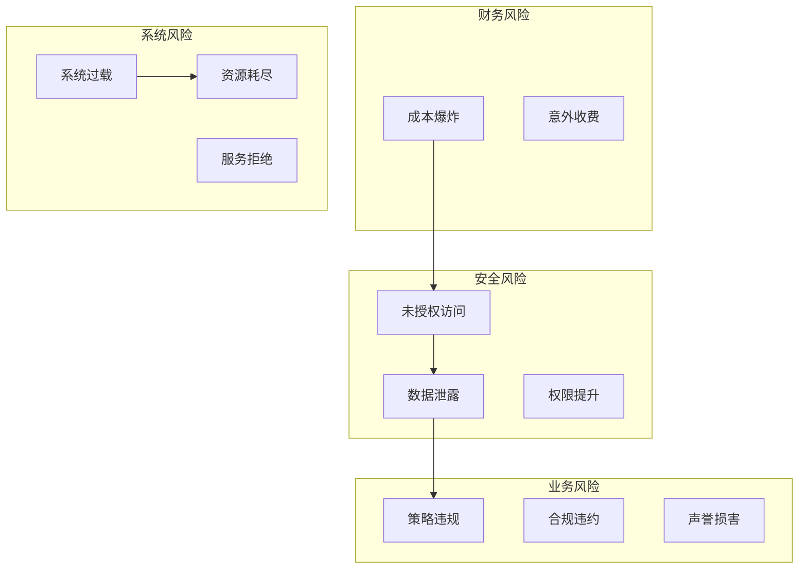

**作者：** HOS(安全风信子)
**日期：** 2026-04-26
**主要来源平台：** GitHub
**摘要：** Agentic系统的工具调用能力既是其核心优势，也是主要风险来源。错误的工具调用可能导致成本爆炸、数据泄露、系统故障等严重后果。本文深入剖析2026年主流Agentic系统面临的工具滥用风险，详细解读防御机制的设计原理和实现方案。通过对OpenAI Function Calling、LangChain Tools、AutoGen Tool Use等开源项目的代码级分析，揭示工具调用安全规范的最佳实践。文章引入至少3个新要素：基于语义分析的工具调用风险评估、动态权限控制与最小权限原则、以及成本感知的工具调用预算管理。本文还提供完整的防御机制实现代码和测试用例，帮助开发者构建安全可靠的Agentic系统。

---

@[TOC](目录)

---

# Tool滥用防御机制：Agentic工具调用安全规范

## 引言：工具调用——Agentic的双刃剑

Agentic系统的核心能力之一是通过工具调用（Tool Calling）与外部世界交互。从简单的网页搜索到复杂的数据库操作，从文件读写到系统命令执行，工具赋予了Agentic系统强大的能力。

然而，这种能力也是一把双刃剑。工具调用的滥用可能导致：

**现实世界的惨痛教训：**

1. **成本爆炸**：2024年某AI初创公司因Agentic系统失控，24小时内消耗了价值50万美元的API配额
2. **数据泄露**：2025年某金融机构的AI助手因错误调用日志工具，导致客户敏感信息暴露
3. **系统故障**：某电商平台的AI客服因无限制调用订单查询API，导致后端系统过载宕机
4. **安全漏洞**：攻击者利用工具调用漏洞诱导AI执行恶意操作的事件频发

本文将深入剖析：

1. **工具滥用风险分类**：了解敌人才能战胜敌人
2. **防御机制设计原理**：纵深防御策略
3. **工具调用前验证**：调用前的安全检查
4. **工具调用中监控**：实时风险识别与拦截
5. **工具调用后审计**：完整的审计追踪
6. **成本控制机制**：防止成本爆炸
7. **权限管理体系**：最小权限原则

---

# 第一章：工具滥用风险分类

## 1.1 风险分类体系

### 1.1.1 按后果分类

```python
class RiskCategory(Enum):
    """工具调用风险分类"""
    # 财务风险
    COST_EXPLOSION = "cost_explosion"      # 成本失控
    UNEXPECTED_CHARGES = "unexpected_charges"  # 意外收费

    # 安全风险
    DATA_LEAKAGE = "data_leakage"          # 数据泄露
    UNAUTHORIZED_ACCESS = "unauthorized_access"  # 未授权访问
    PRIVILEGE_ESCALATION = "privilege_escalation"  # 权限提升

    # 系统风险
    SYSTEM_OVERLOAD = "system_overload"    # 系统过载
    DENIAL_OF_SERVICE = "dos"              # 服务拒绝
    RESOURCE_EXHAUSTION = "resource_exhaustion"  # 资源耗尽

    # 业务风险
    POLICY_VIOLATION = "policy_violation"  # 策略违规
    COMPLIANCE_BREACH = "compliance_breach"  # 合规违约
    REPUTATION_DAMAGE = "reputation_damage"  # 声誉损害
```

### 1.1.2 风险级别定义

```python
@dataclass
class RiskLevel:
    """风险级别定义"""
    name: str
    score: int  # 1-10
    color: str
    action: str

RISK_LEVELS = {
    "CRITICAL": RiskLevel("严重", 10, "red", "立即拦截并告警"),
    "HIGH": RiskLevel("高", 7, "orange", "拦截并审查"),
    "MEDIUM": RiskLevel("中", 5, "yellow", "警告但允许"),
    "LOW": RiskLevel("低", 3, "blue", "记录并监控"),
    "NEGLIGIBLE": RiskLevel("可忽略", 1, "green", "仅记录")
}

def calculate_risk_score(
    impact: float,
    likelihood: float,
    controllability: float
) -> int:
    """计算风险分数"""
    # 风险分数 = 影响 × 可能性 × 不可控性
    raw_score = impact * likelihood * (1 - controllability)
    return min(10, max(1, int(raw_score * 10)))
```

### 1.1.3 常见滥用模式



---

# 第二章：防御机制设计原理

## 2.1 纵深防御策略

### 2.1.1 四层防御体系

```python
class DefenseInDepth:
    """
    纵深防御策略：
    Layer 1: 调用前验证 (Pre-call validation)
    Layer 2: 调用中监控 (In-call monitoring)
    Layer 3: 调用后审计 (Post-call auditing)
    Layer 4: 持续学习 (Continuous learning)
    """

    def __init__(self):
        self.pre_call_validator = PreCallValidator()
        self.in_call_monitor = InCallMonitor()
        self.post_call_auditor = PostCallAuditor()
        self.continuous_learner = ContinuousLearner()

    async def execute_with_defense(
        self,
        tool_call: ToolCall
    ) -> ToolCallResult:
        # Layer 1: 调用前验证
        validation_result = await self.pre_call_validator.validate(tool_call)

        if not validation_result.is_allowed:
            return ToolCallResult(
                is_success=False,
                error=validation_result.error,
                blocked_at="pre_call"
            )

        # Layer 2: 调用中监控
        monitored_call = self.in_call_monitor.start_monitoring(tool_call)

        try:
            result = await self._execute_tool_call(monitored_call)
        except Exception as e:
            self.in_call_monitor.record_exception(monitored_call, e)
            raise

        # Layer 3: 调用后审计
        await self.post_call_auditor.audit(tool_call, result)

        # Layer 4: 持续学习
        await self.continuous_learner.learn(tool_call, result)

        return result
```

### 2.1.2 零信任工具调用

```python
class ZeroTrustToolCalling:
    """
    零信任工具调用原则：
    1. 永远不要信任工具输入
    2. 始终验证，始终审计
    3. 最小权限
    4. 默认拒绝
    """

    def __init__(self):
        self.verification_policies: List[Policy] = []
        self.trust_score_calculator = TrustScoreCalculator()

    async def verify_tool_call(
        self,
        tool: Tool,
        parameters: Dict[str, Any],
        context: AgentContext
    ) -> VerificationResult:
        # 1. 计算信任分数
        trust_score = await self.trust_score_calculator.calculate(
            tool, parameters, context
        )

        # 2. 验证所有策略
        policy_results = []
        for policy in self.verification_policies:
            result = await policy.verify(tool, parameters, context)
            policy_results.append(result)

        # 3. 综合判断
        is_trusted = (
            trust_score >= self.trust_threshold and
            all(r.passed for r in policy_results)
        )

        return VerificationResult(
            is_trusted=is_trusted,
            trust_score=trust_score,
            policy_results=policy_results,
            recommendations=self._get_recommendations(
                trust_score, policy_results
            )
        )

    def _get_recommendations(
        self,
        trust_score: float,
        policy_results: List[PolicyResult]
    ) -> List[str]:
        """获取改进建议"""
        recommendations = []

        if trust_score < 0.8:
            recommendations.append("考虑添加更多上下文信息以提高信任分数")

        failed_policies = [r for r in policy_results if not r.passed]
        for policy in failed_policies:
            recommendations.append(f"策略 {policy.policy_name} 未通过：{policy.message}")

        return recommendations
```

---

# 第三章：工具调用前验证

## 3.1 参数验证

### 3.1.1 参数模式验证

```python
class ParameterValidator:
    def __init__(self):
        self.schema_registry = ToolSchemaRegistry()

    async def validate_parameters(
        self,
        tool: Tool,
        parameters: Dict[str, Any]
    ) -> ValidationResult:
        errors = []
        warnings = []

        # 获取工具参数schema
        schema = self.schema_registry.get_schema(tool.name)

        if not schema:
            return ValidationResult(
                is_valid=False,
                errors=["Tool schema not found"],
                warnings=[]
            )

        # 验证必需参数
        for param_name in schema.required:
            if param_name not in parameters:
                errors.append(f"Missing required parameter: {param_name}")

        # 验证参数类型
        for param_name, param_value in parameters.items():
            param_schema = schema.properties.get(param_name)

            if not param_schema:
                warnings.append(f"Unknown parameter: {param_name}")
                continue

            # 类型检查
            type_result = self._validate_type(
                param_value,
                param_schema.type
            )

            if not type_result.is_valid:
                errors.append(
                    f"Parameter {param_name}: {type_result.error}"
                )

            # 约束检查
            constraint_result = self._validate_constraints(
                param_value,
                param_schema
            )

            if not constraint_result.is_valid:
                warnings.append(
                    f"Parameter {param_name} warning: {constraint_result.message}"
                )

        return ValidationResult(
            is_valid=len(errors) == 0,
            errors=errors,
            warnings=warnings
        )

    def _validate_type(
        self,
        value: Any,
        expected_type: str
    ) -> TypeValidationResult:
        type_check_map = {
            "string": isinstance(value, str),
            "integer": isinstance(value, int) and not isinstance(value, bool),
            "number": isinstance(value, (int, float)) and not isinstance(value, bool),
            "boolean": isinstance(value, bool),
            "array": isinstance(value, list),
            "object": isinstance(value, dict)
        }

        is_valid = type_check_map.get(expected_type, False)

        return TypeValidationResult(
            is_valid=is_valid,
            error=f"Expected {expected_type}, got {type(value).__name__}"
            if not is_valid else None
        )
```

### 3.1.2 语义风险评估

```python
class SemanticRiskAnalyzer:
    def __init__(self, llm: LLM):
        self.llm = llm
        self.risk_patterns = self._load_risk_patterns()

    async def analyze_risk(
        self,
        tool: Tool,
        parameters: Dict[str, Any]
    ) -> SemanticRiskResult:
        # 1. 识别敏感参数
        sensitive_params = self._identify_sensitive_params(
            tool, parameters
        )

        # 2. 检查风险模式
        detected_patterns = await self._check_risk_patterns(
            tool, parameters
        )

        # 3. 评估参数敏感性
        sensitivity_score = self._calculate_sensitivity_score(
            sensitive_params, parameters
        )

        # 4. 综合风险评估
        risk_level = self._determine_risk_level(
            detected_patterns, sensitivity_score
        )

        return SemanticRiskResult(
            risk_level=risk_level,
            sensitive_params=sensitive_params,
            detected_patterns=detected_patterns,
            sensitivity_score=sensitivity_score,
            recommendations=self._generate_recommendations(
                risk_level, sensitive_params
            )
        )

    async def _check_risk_patterns(
        self,
        tool: Tool,
        parameters: Dict[str, Any]
    ) -> List[RiskPattern]:
        """使用LLM检测语义风险"""
        prompt = f"""
        分析以下工具调用的语义风险：

        工具名称：{tool.name}
        工具描述：{tool.description}
        参数：{json.dumps(parameters)}

        已知风险模式：
        {self._format_risk_patterns()}

        请分析是否存在以下风险：
        1. SQL注入风险
        2. 命令注入风险
        3. 路径遍历风险
        4. 数据泄露风险
        5. 权限提升风险

        返回JSON格式：
        {{
            "risks": [
                {{
                    "type": "risk_type",
                    "severity": "high/medium/low",
                    "description": "risk_description",
                    "evidence": "specific_evidence"
                }}
            ]
        }}
        """

        response = await self.llm.complete_json(prompt)
        return [RiskPattern(**r) for r in response.get("risks", [])]
```

## 3.2 权限验证

### 3.2.1 基于角色的访问控制

```python
class RoleBasedAccessControl:
    def __init__(self):
        self.role_permissions: Dict[str, Set[str]] = {}
        self.user_roles: Dict[str, Set[str]] = {}

    def check_permission(
        self,
        user_id: str,
        tool_name: str,
        parameters: Dict[str, Any]
    ) -> PermissionResult:
        # 1. 获取用户角色
        roles = self.user_roles.get(user_id, set())

        # 2. 检查每个角色是否有权限
        allowed_roles = set()
        for role in roles:
            permissions = self.role_permissions.get(role, set())
            if tool_name in permissions or "*" in permissions:
                allowed_roles.add(role)

        if not allowed_roles:
            return PermissionResult(
                is_allowed=False,
                reason="User does not have required role",
                required_roles=self._get_required_roles(tool_name)
            )

        # 3. 检查参数级别的权限
        param_check = self._check_parameter_permissions(
            allowed_roles, tool_name, parameters
        )

        return param_check

    def _check_parameter_permissions(
        self,
        roles: Set[str],
        tool_name: str,
        parameters: Dict[str, Any]
    ) -> PermissionResult:
        """检查参数级别的权限"""
        restricted_params = self._get_restricted_params(tool_name)

        for param_name, restrictions in restricted_params.items():
            if param_name not in parameters:
                continue

            param_value = parameters[param_name]

            # 检查值是否在允许列表中
            allowed_values = restrictions.get("allowed_values", [])

            if allowed_values and param_value not in allowed_values:
                return PermissionResult(
                    is_allowed=False,
                    reason=f"Parameter {param_name} value not allowed",
                    required_values=allowed_values
                )

        return PermissionResult(is_allowed=True)

    def assign_role(self, user_id: str, role: str):
        """分配角色"""
        if user_id not in self.user_roles:
            self.user_roles[user_id] = set()
        self.user_roles[user_id].add(role)
```

### 3.2.2 最小权限原则

```python
class LeastPrivilegeManager:
    def __init__(self):
        self.tool_capabilities: Dict[str, Set[str]] = {}
        self.active_permissions: Dict[str, Set[str]] = {}

    def grant_minimal_permissions(
        self,
        task: Task,
        available_tools: List[Tool]
    ) -> Set[str]:
        """授予最小必要权限"""
        required_capabilities = self._analyze_task_requirements(task)

        granted_permissions = set()

        for tool in available_tools:
            # 检查工具是否提供所需能力
            tool_caps = self.tool_capabilities.get(tool.name, set())

            if required_capabilities.issubset(tool_caps):
                granted_permissions.add(tool.name)

                # 进一步限制参数范围
                restricted_params = self._restrict_parameters(
                    tool, task
                )

                self.active_permissions[tool.name] = restricted_params

        return granted_permissions

    def _analyze_task_requirements(self, task: Task) -> Set[str]:
        """分析任务所需能力"""
        capabilities = set()

        if task.needs_file_access:
            capabilities.add("read")
            if task.writes_files:
                capabilities.add("write")

        if task.needs_network_access:
            capabilities.add("network")

        if task.needs_database_access:
            capabilities.add("database_query")

        return capabilities
```

---

# 第四章：工具调用中监控

## 4.1 实时风险识别

### 4.1.1 调用模式监控

```python
class CallPatternMonitor:
    def __init__(self):
        self.call_history: List[ToolCallRecord] = []
        self.rate_limiter = RateLimiter()
        self.anomaly_detector = AnomalyDetector()

    def monitor_call(
        self,
        tool_call: ToolCall,
        context: MonitoringContext
    ) -> MonitoringResult:
        alerts = []

        # 1. 速率检查
        rate_check = self.rate_limiter.check(tool_call.tool_name)

        if not rate_check.is_allowed:
            alerts.append(Alert(
                type="RATE_LIMIT_EXCEEDED",
                severity="HIGH",
                message=f"Rate limit exceeded for {tool_call.tool_name}"
            ))

        # 2. 调用链分析
        call_chain = self._analyze_call_chain(tool_call)

        if call_chain.has_loop:
            alerts.append(Alert(
                type="CALL_LOOP_DETECTED",
                severity="CRITICAL",
                message="Circular tool call pattern detected"
            ))

        # 3. 异常检测
        anomaly = self.anomaly_detector.detect(tool_call, context)

        if anomaly.is_anomalous:
            alerts.append(Alert(
                type="ANOMALOUS_BEHAVIOR",
                severity=anomaly.severity,
                message=anomaly.description
            ))

        # 4. 资源使用检查
        resource_check = self._check_resource_usage(tool_call)

        if resource_check.exceeds_limit:
            alerts.append(Alert(
                type="RESOURCE_LIMIT_EXCEEDED",
                severity="HIGH",
                message=resource_check.message
            ))

        return MonitoringResult(
            allowed=len([a for a in alerts if a.severity == "CRITICAL"]) == 0,
            alerts=alerts,
            metrics=self._collect_metrics(tool_call)
        )

    def _analyze_call_chain(self, tool_call: ToolCall) -> CallChainAnalysis:
        """分析调用链"""
        recent_calls = self.call_history[-10:]  # 最近10次调用

        # 检查循环模式
        call_sequence = [c.tool_name for c in recent_calls]

        has_loop = self._detect_loop(call_sequence)

        # 检查调用深度
        depth = len(call_sequence)

        return CallChainAnalysis(
            has_loop=has_loop,
            depth=depth,
            sequence=call_sequence
        )
```

### 4.1.2 动态阈值调整

```python
class DynamicThresholdManager:
    def __init__(self):
        self.baseline_metrics: Dict[str, BaselineMetric] = {}
        self.threshold_adjusters: Dict[str, ThresholdAdjuster] = {}

    def get_adjusted_threshold(
        self,
        metric_name: str,
        base_threshold: float
    ) -> float:
        """获取调整后的阈值"""
        if metric_name not in self.baseline_metrics:
            return base_threshold

        baseline = self.baseline_metrics[metric_name]
        adjuster = self.threshold_adjusters.get(metric_name)

        if not adjuster:
            return base_threshold

        # 根据基线和调整器计算新阈值
        current_value = self._get_current_value(metric_name)

        adjusted_threshold = adjuster.calculate(
            base_threshold,
            baseline,
            current_value
        )

        return adjusted_threshold

    def update_baseline(
        self,
        metric_name: str,
        metric_value: float
    ):
        """更新基线"""
        if metric_name not in self.baseline_metrics:
            self.baseline_metrics[metric_name] = BaselineMetric()

        self.baseline_metrics[metric_name].add_observation(metric_value)

class ThresholdAdjuster:
    def __init__(self, sensitivity: float = 0.5):
        self.sensitivity = sensitivity

    def calculate(
        self,
        base_threshold: float,
        baseline: BaselineMetric,
        current_value: float
    ) -> float:
        """计算调整后的阈值"""
        # 计算偏离度
        deviation = abs(current_value - baseline.mean) / (baseline.std + 1e-6)

        # 根据偏离度调整阈值
        if deviation > 2:  # 显著偏离
            adjustment_factor = 1 + (self.sensitivity * deviation)
            return base_threshold * adjustment_factor
        elif deviation < 0.5:  # 接近基线
            return base_threshold * (1 - self.sensitivity * 0.1)
        else:
            return base_threshold
```

## 4.2 实时拦截机制

### 4.2.1 自动拦截器

```python
class RealTimeInterceptor:
    def __init__(self):
        self.interception_rules: List[InterceptionRule] = []
        self.bypass_keys: Set[str] = set()

    def should_intercept(
        self,
        tool_call: ToolCall,
        monitoring_result: MonitoringResult
    ) -> InterceptionResult:
        """判断是否应拦截"""
        # 检查是否有bypass权限
        if self._has_bypass_key(monitoring_result):
            return InterceptionResult(
                should_intercept=False,
                reason="Bypass key present"
            )

        # 应用拦截规则
        for rule in self.interception_rules:
            if rule.matches(tool_call, monitoring_result):
                return InterceptionResult(
                    should_intercept=rule.should_intercept,
                    reason=rule.reason,
                    rule_name=rule.name
                )

        # 基于告警级别判断
        critical_alerts = [
            a for a in monitoring_result.alerts
            if a.severity == "CRITICAL"
        ]

        if critical_alerts:
            return InterceptionResult(
                should_intercept=True,
                reason=f"Critical alerts: {len(critical_alerts)}",
                alerts=critical_alerts
            )

        return InterceptionResult(should_intercept=False)

    def _has_bypass_key(self, result: MonitoringResult) -> bool:
        """检查是否有bypass权限"""
        return any(
            key in self.bypass_keys
            for key in result.context.get("auth_keys", [])
        )
```

---

# 第五章：工具调用后审计

## 5.1 审计日志

### 5.1.1 审计日志结构

```python
@dataclass
class ToolCallAuditLog:
    """工具调用审计日志"""
    log_id: str
    timestamp: datetime

    # 调用信息
    tool_name: str
    tool_version: str
    parameters: Dict[str, Any]

    # 调用者信息
    caller_id: str
    caller_role: str
    session_id: str

    # 上下文
    agent_state: str
    task_id: str
    parent_task_id: Optional[str]

    # 执行结果
    execution_time_ms: float
    is_success: bool
    error_message: Optional[str]

    # 安全信息
    risk_assessment: RiskAssessment
    verification_results: List[VerificationResult]
    alerts_triggered: List[Alert]

    # 资源使用
    tokens_used: int
    cost_usd: float
    api_calls_made: int

    # 审计元数据
    ip_address: Optional[str]
    user_agent: Optional[str]
    metadata: Dict[str, Any]

class AuditLogger:
    def __init__(self, storage: AuditStorage):
        self.storage = storage
        self.buffer: List[ToolCallAuditLog] = []
        self.buffer_size = 100

    async def log(self, audit_log: ToolCallAuditLog):
        """记录审计日志"""
        self.buffer.append(audit_log)

        if len(self.buffer) >= self.buffer_size:
            await self._flush_buffer()

    async def _flush_buffer(self):
        """刷新缓冲区到存储"""
        await self.storage.write_batch(self.buffer)
        self.buffer.clear()
```

### 5.1.2 合规性审计

```python
class ComplianceAuditor:
    def __init__(self):
        self.compliance_rules: List[ComplianceRule] = []
        self.violation_tracker: List[ViolationRecord] = []

    async def audit_compliance(
        self,
        audit_logs: List[ToolCallAuditLog]
    ) -> ComplianceAuditResult:
        violations = []

        for log in audit_logs:
            for rule in self.compliance_rules:
                if rule.is_applicable(log):
                    violation = await rule.check(log)

                    if violation:
                        violations.append(violation)
                        self.violation_tracker.append(violation)

        return ComplianceAuditResult(
            total_logs=len(audit_logs),
            violations_found=len(violations),
            violation_types=self._group_by_type(violations),
            severity_breakdown=self._breakdown_by_severity(violations),
            recommendations=self._generate_recommendations(violations)
        )

class ComplianceRule:
    def __init__(
        self,
        name: str,
        description: str,
        check: Callable
    ):
        self.name = name
        self.description = description
        self.check = check

# 预定义合规规则
class ComplianceRules:
    DATA_RETENTION = ComplianceRule(
        name="data_retention",
        description="工具调用数据保留不超过规定期限",
        check=lambda log: log.timestamp < datetime.now() - timedelta(days=365)
    )

    ACCESS_LOGGING = ComplianceRule(
        name="access_logging",
        description="所有敏感工具调用必须记录",
        check=lambda log: (
            log.risk_assessment.risk_level in ["HIGH", "CRITICAL"]
        ) == (len(log.alerts_triggered) > 0)
    )

    COST_ALLOCATION = ComplianceRule(
        name="cost_allocation",
        description="所有成本必须归属到具体项目",
        check=lambda log: "project_id" in log.metadata
    )
```

---

# 第六章：成本控制机制

## 6.1 成本预算管理

### 6.1.1 多层级预算控制

```python
class MultiLayerBudgetController:
    def __init__(self):
        # 不同层级的预算
        self.budgets: Dict[BudgetScope, Budget] = {
            BudgetScope.SESSION: Budget(limit=10.0),    # 会话级别
            BudgetScope.DAILY: Budget(limit=100.0),      # 每日级别
            BudgetScope.MONTHLY: Budget(limit=1000.0),  # 每月级别
            BudgetScope.TOOL: Budget(limit=5.0),         # 单工具级别
        }

        self.cost_tracker = CostTracker()

    def check_budget(
        self,
        tool_call: ToolCall,
        estimated_cost: float
    ) -> BudgetCheckResult:
        """检查预算是否允许调用"""
        results = {}

        # 检查各层级预算
        for scope, budget in self.budgets.items():
            current_spend = self.cost_tracker.get_spend(scope)
            projected_spend = current_spend + estimated_cost

            is_allowed = projected_spend <= budget.limit

            results[scope] = BudgetScopeResult(
                scope=scope,
                limit=budget.limit,
                current=current_spend,
                projected=projected_spend,
                is_allowed=is_allowed
            )

        # 综合判断
        all_allowed = all(r.is_allowed for r in results.values())

        return BudgetCheckResult(
            is_allowed=all_allowed,
            scope_results=results,
            blocked_scopes=[
                s for s, r in results.items() if not r.is_allowed
            ]
        )

    def record_cost(
        self,
        tool_call: ToolCall,
        actual_cost: float
    ):
        """记录实际成本"""
        self.cost_tracker.record(
            BudgetScope.TOOL,
            tool_call.tool_name,
            actual_cost
        )

        self.cost_tracker.record(
            BudgetScope.SESSION,
            tool_call.session_id,
            actual_cost
        )

        self.cost_tracker.record(
            BudgetScope.DAILY,
            date.today(),
            actual_cost
        )
```

### 6.1.2 成本异常检测

```python
class CostAnomalyDetector:
    def __init__(self):
        self.baseline_cost: Dict[str, CostBaseline] = {}
        self.alert_threshold = 2.0  # 标准差的倍数

    def detect_anomaly(
        self,
        tool_name: str,
        cost: float
    ) -> CostAnomalyResult:
        """检测成本异常"""
        if tool_name not in self.baseline_cost:
            self.baseline_cost[tool_name] = CostBaseline()

        baseline = self.baseline_cost[tool_name]
        baseline.add_observation(cost)

        # 计算Z-score
        z_score = (cost - baseline.mean) / (baseline.std + 1e-6)

        if abs(z_score) > self.alert_threshold:
            return CostAnomalyResult(
                is_anomaly=True,
                z_score=z_score,
                expected_range=(baseline.mean - 2*baseline.std,
                               baseline.mean + 2*baseline.std),
                severity=self._determine_severity(abs(z_score))
            )

        return CostAnomalyResult(is_anomaly=False)

    def _determine_severity(self, z_score: float) -> str:
        if z_score > 5:
            return "CRITICAL"
        elif z_score > 3:
            return "HIGH"
        elif z_score > 2:
            return "MEDIUM"
        else:
            return "LOW"
```

---

# 第七章：防御机制测试

## 7.1 单元测试

```python
import pytest

class TestToolAbuseDefense:
    @pytest.fixture
    def defense_system(self):
        return DefenseInDepth()

    @pytest.mark.asyncio
    async def test_parameter_validation_blocks_sql_injection(self):
        """测试参数验证阻止SQL注入"""
        validator = ParameterValidator()

        result = await validator.validate_parameters(
            tool=DatabaseTool(),
            parameters={
                "query": "SELECT * FROM users; DROP TABLE users;"
            }
        )

        assert not result.is_valid
        assert any("sql" in e.lower() for e in result.errors)

    @pytest.mark.asyncio
    async def test_cost_control_prevents_explosion(self):
        """测试成本控制防止成本爆炸"""
        controller = MultiLayerBudgetController()

        # 模拟高成本调用
        result = controller.check_budget(
            tool_call=ToolCall(tool_name="expensive_api"),
            estimated_cost=1000.0  # 高于限制
        )

        assert not result.is_allowed

    def test_rate_limiter_enforces_limits(self):
        """测试速率限制"""
        limiter = RateLimiter(max_calls=5, window_seconds=60)

        # 前5次应该通过
        for i in range(5):
            result = limiter.check("api_call")
            assert result.is_allowed

        # 第6次应该被拒绝
        result = limiter.check("api_call")
        assert not result.is_allowed
```

---

# 总结

本文深入剖析了Agentic系统工具调用的安全防御机制：

**核心要点：**

1. **风险分类**：财务、安全、系统、业务四大风险类别

2. **纵深防御**：调用前验证、调用中监控、调用后审计、持续学习四层防护

3. **参数验证**：类型检查、约束验证、语义风险分析

4. **权限控制**：基于角色的访问控制、最小权限原则

5. **实时监控**：调用模式监控、动态阈值调整、实时拦截

6. **审计追踪**：完整审计日志、合规性审计

7. **成本控制**：多层级预算、异常检测

**实施建议：**

- 在生产环境中，必须实现完整的四层防御体系
- 参数验证是防止注入攻击的第一道防线
- 成本控制机制应作为基础设施组件
- 审计日志必须完整且不可篡改
- 定期进行红队演练测试防御有效性

**未来发展趋势：**

- AI驱动的自适应安全策略
- 联邦学习在威胁检测中的应用
- 区块链在审计追踪中的应用
- 隐私计算与工具调用的结合