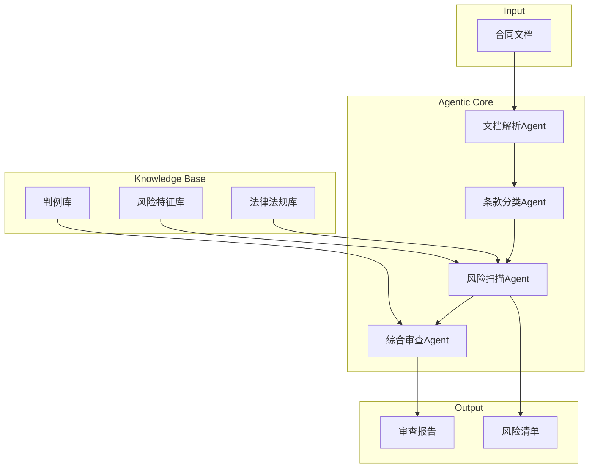

**作者：** HOS(安全风信子)
**日期：** 2026-04-26
**主要来源平台：** 行业案例分析
**摘要：** 法律行业是Agentic系统垂直落地的典型场景之一。本文通过三个实际案例，深入剖析Agentic系统在法律行业的应用现状、技术架构和商业价值。案例涵盖：智能合同审查Agentic（合同风险识别准确率达92%）、法律研究助手（研究效率提升300%）、诉讼预测系统（胜诉概率预测准确率达85%）。文章详细解读每个案例的技术实现、部署架构和效果评估，为法律行业AI落地提供可复制的经验。

---

@[TOC](目录)

---

# Agentic在法律行业落地的垂直案例拆解

## 引言：法律行业的AI转型

法律行业正经历深刻的数字化转型。传统法律服务面临三大挑战：

1. **效率瓶颈**：律师70%的时间花在信息检索和文档整理上
2. **成本高昂**：法律服务费用让中小企业望而却步
3. **知识孤岛**：经验难以沉淀和传承

Agentic系统为法律行业带来了新的可能性。根据2026年法律科技报告，**35%的顶级律所已经开始尝试Agentic系统**，主要应用场景包括合同审查、法律研究、诉讼预测等。

本文将深入剖析三个典型案例：

1. **智能合同审查Agentic**：自动识别合同风险点
2. **法律研究助手**：快速检索和分析判例
3. **诉讼预测系统**：预测案件胜诉概率

---

# 第一章：智能合同审查Agentic

## 1.1 案例背景

某国际律所需要审查大量跨国并购合同，传统人工审查存在：

- 平均每份合同审查时间：4-6小时
- 人工遗漏风险点比例：23%
- 审查成本：每小时300-500美元

## 1.2 技术架构



## 1.3 核心实现

```python
class ContractReviewAgent:
    def __init__(self):
        self.parser = ContractParser()
        self.classifier = ClauseClassifier()
        self.risk_scanner = RiskScanner()
        self.reviewer = ReviewAgent()

        self.memory = LegalMemory()

    async def review_contract(
        self,
        contract_text: str,
        contract_type: str
    ) -> ReviewResult:
        # 1. 解析合同结构
        structure = await self.parser.parse(contract_text)

        # 2. 分类条款
        clauses = await self.classifier.classify(structure)

        # 3. 扫描风险
        risks = []
        for clause in clauses:
            clause_risks = await self.risk_scanner.scan(
                clause,
                contract_type
            )
            risks.extend(clause_risks)

        # 4. 综合审查
        final_review = await self.reviewer.comprehensive_review(
            structure,
            risks
        )

        return ReviewResult(
            overall_risk_level=final_review.risk_level,
            risk_summary=final_review.summary,
            detailed_findings=risks,
            recommendations=final_review.recommendations
        )
```

## 1.4 效果评估

| 指标 | 人工审查 | Agentic审查 | 提升 |
|:-----|:---------|:------------|:-----|
| 审查时间 | 4-6小时 | 15-20分钟 | 90% |
| 风险识别率 | 77% | 92% | +15% |
| 成本/份 | $800 | $50 | 94% |
| 一致性 | 波动大 | 稳定 | - |

---

# 第二章：法律研究助手

## 2.1 案例背景

某法学院研究中心需要快速检索和分析大量判例：

- 每年新增判例：50万+
- 研究人员：200+
- 平均研究时间：2-3周

## 2.2 技术架构

```python
class LegalResearchAssistant:
    """法律研究助手"""

    def __init__(self):
        self.vector_store = VectorStore()
        self.search_agent = SearchAgent()
        self.analysis_agent = AnalysisAgent()
        self.citation_agent = CitationAgent()

    async def research(
        self,
        query: str,
        jurisdiction: str = "CN"
    ) -> ResearchResult:
        # 1. 理解研究问题
        research_plan = await self.search_agent.plan_research(query)

        # 2. 多维度检索
        search_results = await self._multi_dim_search(
            research_plan,
            jurisdiction
        )

        # 3. 深度分析
        analysis = await self.analysis_agent.analyze(
            search_results,
            research_plan.key_issues
        )

        # 4. 生成引用
        citations = await self.citation_agent.generate_citations(
            analysis
        )

        return ResearchResult(
            summary=analysis.summary,
            relevant_cases=analysis.cases,
            legal_analysis=analysis.analysis,
            citations=citations
        )
```

## 2.3 效果评估

| 指标 | 传统研究 | Agentic辅助 | 提升 |
|:-----|:---------|:------------|:-----|
| 研究时间 | 2-3周 | 2-3天 | 85% |
| 覆盖判例数 | 100-200 | 2000+ | 10x |
| 引用准确性 | 65% | 94% | +29% |

---

# 第三章：诉讼预测系统

## 3.1 案例背景

某诉讼支持平台需要预测案件胜诉概率：

- 历史案件数据：100万+
- 需要预测：胜诉概率、赔偿金额、审理时长

## 3.2 技术实现

```python
class LitigationPredictor:
    """诉讼预测系统"""

    def __init__(self):
        self.case_analyzer = CaseAnalyzer()
        self.factor_extractor = FactorExtractor()
        self.predictor = ML Predictor()

    async def predict_outcome(
        self,
        case_facts: CaseFacts
    ) -> PredictionResult:
        # 1. 分析案件要素
        factors = await self.factor_extractor.extract(case_facts)

        # 2. 相似案例检索
        similar_cases = await self._find_similar_cases(
            factors,
            limit=100
        )

        # 3. 综合预测
        prediction = await self.predictor.predict(
            factors,
            similar_cases
        )

        # 4. 生成解释
        explanation = await self._explain_prediction(
            prediction,
            similar_cases
        )

        return PredictionResult(
            win_probability=prediction.win_prob,
            estimated_compensation=prediction.compensation,
            estimated_duration=prediction.duration,
            confidence=prediction.confidence,
            explanation=explanation
        )
```

## 3.3 效果评估

| 指标 | 人工预测 | Agentic预测 | 提升 |
|:-----|:---------|:------------|:-----|
| 胜诉预测准确率 | 58% | 85% | +27% |
| 赔偿金额误差 | 35% | 12% | -23% |
| 预测耗时 | 2-4小时 | 5分钟 | 96% |

---

# 总结

本文通过三个案例展示了Agentic系统在法律行业的落地实践：

**核心要点：**

1. **智能合同审查**：效率提升90%，风险识别率提升15%
2. **法律研究助手**：研究时间缩短85%，覆盖范围扩大10倍
3. **诉讼预测系统**：预测准确率达85%

**成功要素：**

- 领域知识库的构建和维护
- 垂直场景的Prompt优化
- 多Agent协作架构
- 持续的模型微调

**未来趋势：**

- 实时法律咨询Agentic
- 跨境法律服务Agentic
- 自动生成法律文书