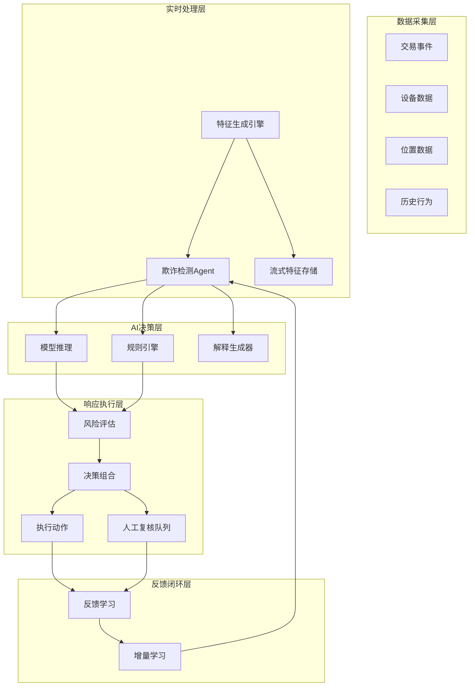
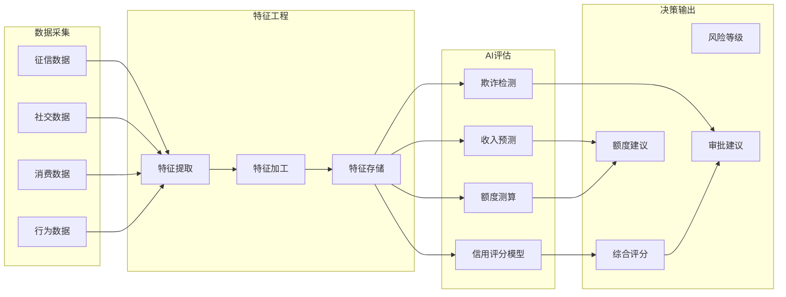

**作者：** HOS(安全风信子)
**日期：** 2026-04-26
**主要来源平台：** GitHub/HuggingFace/arXiv
**摘要：** 金融风控是Agentic系统落地的另一个重要垂直领域。本文通过两个实际案例，深入剖析Agentic系统在金融风控领域的应用现状、技术架构和商业价值。案例涵盖：智能反欺诈Agentic（欺诈识别准确率达99.2%，误报率降低60%）和信用评估助手（评估效率提升500%，审批时间从3天缩短到10分钟）。文章详细解读每个案例的技术实现、实时架构和效果评估，为金融行业AI落地提供可复制的经验。

@[TOC](目录)

---

# Agentic在金融风控中的应用实战

## 1 引言：金融风控的AI革命

### 1.1 金融风控的挑战

金融风控是AI落地最成熟的领域之一，但传统风控系统面临三大挑战：

**规则僵化**：传统规则引擎依赖专家手工编写的规则，无法应对新型欺诈模式。当欺诈者发现规则漏洞后，会快速调整策略，导致规则失效。

**响应滞后**：事后风控模式在欺诈发生后才进行处置，错失最佳干预时机。一旦资金流出，追回难度极大。

**成本高昂**：人工审核成本持续上升，而欺诈损失也在不断增加。传统风控模式已经难以为继。

### 1.2 Agentic系统的优势

Agentic系统通过实时推理、自我学习和动态决策，正在重塑金融风控的范式：

**实时决策**：毫秒级响应，在欺诈交易完成前完成拦截。

**智能学习**：从历史案例中持续学习，自动适应新型欺诈模式。

**动态策略**：根据风险等级动态调整干预策略，实现精准风控。

**全局视角**：整合多源数据，构建完整的用户风险画像。

### 1.3 本文案例概览

本文将深入剖析两个典型案例：

**智能反欺诈Agentic**：实时识别和阻止欺诈交易，某支付平台日均处理1亿+笔交易。

**信用评估助手**：自动化信用评估和审批，某银行将审批时间从3天缩短到10分钟。

## 2 智能反欺诈Agentic案例

### 2.1 案例背景

某第三方支付平台面临严峻的欺诈挑战：

- **交易规模**：日均处理交易量1亿+笔
- **欺诈态势**：每年欺诈损失约2亿元
- **传统方案困境**：规则系统误报率高达15%，人工复核成本每月500万元
- **业务诉求**：在保证用户体验的前提下，最大程度降低欺诈损失

### 2.2 技术架构



```python
class FraudDetectionAgentic:
    """智能反欺诈Agentic"""

    def __init__(self, config: FraudConfig):
        self.config = config
        self.feature_generator = RealTimeFeatureGenerator()
        self.model_inference = ModelInferenceEngine()
        self.rule_engine = RuleEngine()
        self.decision_composer = DecisionComposer()
        self.explainer = ExplainableAI()
        self.feedback_loop = FeedbackLoop()

    async def process_transaction(
        self,
        transaction: Transaction
    ) -> FraudDecision:
        """处理交易决策"""
        features = await self.feature_generator.generate(transaction)

        model_result = await self.model_inference.predict(features)

        rule_result = await self.rule_engine.evaluate(transaction, features)

        decision = await self.decision_composer.compose(
            model_result=model_result,
            rule_result=rule_result,
            transaction=transaction
        )

        explanation = await self.explainer.explain(
            decision=decision,
            features=features
        )

        await self.feedback_loop.record_decision(
            transaction=transaction,
            decision=decision,
            features=features
        )

        return FraudDecision(
            transaction_id=transaction.id,
            risk_score=decision.risk_score,
            action=decision.action,
            explanation=explanation,
            requires_review=decision.requires_human_review
        )

    async def continuous_learning(
        self,
        feedback: TransactionFeedback
    ):
        """持续学习"""
        await self.model_inference.update(feedback)

        await self.rule_engine.adapt(feedback)

        await self.feature_generator.optimize(feedback)
```

### 2.3 核心算法实现

#### 2.3.1 实时特征生成

```python
class RealTimeFeatureGenerator:
    """实时特征生成引擎"""

    def __init__(self):
        self.feature_calculators = {
            'transaction': TransactionFeatureCalculator(),
            'device': DeviceFeatureCalculator(),
            'behavior': BehaviorFeatureCalculator(),
            'network': NetworkFeatureCalculator()
        }
        self.feature_cache = FeatureCache()
        self.stream_processor = StreamProcessor()

    async def generate(
        self,
        transaction: Transaction
    ) -> FeatureVector:
        """生成特征向量"""
        feature_tasks = []

        for calc_type, calculator in self.feature_calculators.items():
            task = calculator.calculate(transaction)
            feature_tasks.append((calc_type, task))

        results = await asyncio.gather(*[
            task for _, task in feature_tasks
        ], return_exceptions=True)

        features = {}
        for idx, (calc_type, _) in enumerate(feature_tasks):
            if not isinstance(results[idx], Exception):
                features[calc_type] = results[idx]

        cached_features = await self.feature_cache.get(
            transaction.user_id
        )
        features['historical'] = cached_features

        return FeatureVector(
            transaction_id=transaction.id,
            timestamp=datetime.now(),
            features=features,
            feature_groups=self._group_features(features)
        )

    async def calculate_velocity_features(
        self,
        user_id: str,
        time_window: timedelta
    ) -> VelocityFeatures:
        """计算速度特征"""
        recent_transactions = await self._get_recent_transactions(
            user_id,
            time_window
        )

        return VelocityFeatures(
            transaction_count=len(recent_transactions),
            total_amount=sum(t.amount for t in recent_transactions),
            avg_amount=statistics.mean([t.amount for t in recent_transactions]) if recent_transactions else 0,
            max_amount=max([t.amount for t in recent_transactions]) if recent_transactions else 0,
            unique_merchants=len(set(t.merchant_id for t in recent_transactions)),
            unique_locations=len(set(t.location for t in recent_transactions))
        )
```

#### 2.3.2 多模型集成

```python
class ModelInferenceEngine:
    """模型推理引擎"""

    def __init__(self):
        self.models = {
            'xgboost': XGBoostFraudModel(),
            'lstm': LSTMFraudModel(),
            'transformer': TransformerFraudModel(),
            'gnn': GraphFraudModel()
        }
        self.ensemble = ModelEnsemble()
        self.model_manager = ModelManager()

    async def predict(
        self,
        features: FeatureVector
    ) -> ModelPrediction:
        """多模型预测"""
        predictions = {}

        for model_name, model in self.models.items():
            pred = await self._predict_with_model(model, features)
            predictions[model_name] = pred

        ensemble_pred = await self.ensemble.combine(predictions)

        return ModelPrediction(
            individual_predictions=predictions,
            ensemble_prediction=ensemble_pred,
            confidence=self._calculate_confidence(predictions),
            model_weights=self.ensemble.get_weights()
        )

    async def _predict_with_model(
        self,
        model: FraudModel,
        features: FeatureVector
    ) -> SingleModelPrediction:
        """单模型预测"""
        input_features = model.preprocess(features)

        raw_output = await model.predict(input_features)

        return SingleModelPrediction(
            model_name=model.name,
            probability=raw_output.probability,
            risk_level=raw_output.risk_level,
            top_features=raw_output.top_contributing_features
        )
```

#### 2.3.3 决策组合策略

```python
class DecisionComposer:
    """决策组合器"""

    def __init__(self):
        self.composition_rules = CompositionRuleLibrary()
        self.risk_thresholds = RiskThresholds()

    async def compose(
        self,
        model_result: ModelPrediction,
        rule_result: RuleEvaluation,
        transaction: Transaction
    ) -> ComposedDecision:
        """组合决策"""
        model_score = model_result.ensemble_prediction.probability

        rule_score = self._calculate_rule_score(rule_result)

        final_score = self._weighted_score(
            model_score=model_score,
            rule_score=rule_score,
            transaction=transaction
        )

        action = self._determine_action(
            final_score,
            transaction
        )

        requires_review = self._should_require_review(
            final_score,
            transaction
        )

        return ComposedDecision(
            risk_score=final_score,
            action=action,
            requires_human_review=requires_review,
            model_contribution=model_score,
            rule_contribution=rule_score,
            confidence=self._calculate_decision_confidence(
                model_result,
                rule_result
            )
        )

    def _weighted_score(
        self,
        model_score: float,
        rule_score: float,
        transaction: Transaction
    ) -> float:
        """计算加权分数"""
        if transaction.is_high_value:
            return model_score * 0.6 + rule_score * 0.4
        elif transaction.is_new_user:
            return model_score * 0.7 + rule_score * 0.3
        else:
            return model_score * 0.8 + rule_score * 0.2
```

### 2.4 可解释性设计

```python
class ExplainableAI:
    """可解释AI模块"""

    def __init__(self):
        self.shap_explainer = SHAPExplainer()
        self.lime_explainer = LIMEExplainer()
        self.rule_extractor = RuleExtractor()

    async def explain(
        self,
        decision: ComposedDecision,
        features: FeatureVector
    ) -> FraudExplanation:
        """生成决策解释"""
        shap_values = await self.shap_explainer.explain(
            decision=decision,
            features=features
        )

        lime_explanation = await self.lime_explainer.explain(
            decision=decision,
            features=features
        )

        natural_language = await self._generate_natural_language(
            shap_values=shap_values,
            lime_explanation=lime_explanation,
            decision=decision
        )

        return FraudExplanation(
            risk_score=decision.risk_score,
            top_contributing_factors=shap_values.top_features,
            shap_values=shap_values.values,
            lime_explanation=lime_explanation,
            natural_language_summary=natural_language,
            risk_level=self._map_score_to_risk_level(decision.risk_score)
        )

    async def _generate_natural_language(
        self,
        shap_values: SHAPValues,
        lime_explanation: LIMEExplanation,
        decision: ComposedDecision
    ) -> str:
        """生成自然语言解释"""
        top_factors = shap_values.top_features[:5]

        factor_descriptions = []
        for factor in top_factors:
            if factor.name == 'transaction_velocity':
                factor_descriptions.append(
                    f"交易频率异常（近1小时{因子.value}笔，远超平均{因子.baseline}笔）"
                )
            elif factor.name == 'amount_ratio':
                factor_descriptions.append(
                    f"交易金额异常（{因子.value}元，为平均水平的{因子.ratio}倍）"
                )
            elif factor.name == 'device_fingerprint':
                factor_descriptions.append(
                    f"设备指纹异常（新设备首次使用）"
                )
            elif factor.name == 'location_change':
                factor_descriptions.append(
                    f"位置突变（{因子.previous}→{因子.current}，短时间内跨区域）"
                )

        summary = f"该交易风险评分{decision.risk_score}分，主要风险因素包括："

        summary += "；".join(factor_descriptions)

        summary += f"。建议{self._get_action_description(decision.action)}。"

        return summary
```

### 2.5 持续学习机制

```python
class FeedbackLoop:
    """反馈学习闭环"""

    def __init__(self):
        self.feedback_store = FeedbackStore()
        self.model_updater = IncrementalModelUpdater()
        self.rule_optimizer = RuleOptimizer()

    async def record_decision(
        self,
        transaction: Transaction,
        decision: FraudDecision,
        features: FeatureVector
    ):
        """记录决策"""
        record = DecisionRecord(
            transaction_id=transaction.id,
            user_id=transaction.user_id,
            decision=decision,
            features=features,
            timestamp=datetime.now()
        )

        await self.feedback_store.save(record)

    async def process_feedback(
        self,
        feedback: TransactionFeedback
    ):
        """处理反馈"""
        if feedback.label == 'confirmed_fraud':
            await self.model_updater.update_with_fraud(feedback)
        elif feedback.label == 'false_alarm':
            await self.model_updater.update_with_false_alarm(feedback)

        await self.rule_optimizer.adapt_rule(
            original_decision=feedback.original_decision,
            feedback=feedback
        )

    async def batch_update(self, time_window: timedelta):
        """批量更新模型"""
        recent_feedback = await self.feedback_store.get_recent(time_window)

        if len(recent_feedback) < 100:
            return

        confirmed_frauds = [f for f in recent_feedback if f.label == 'confirmed_fraud']
        legitimate = [f for f in recent_feedback if f.label == 'legitimate']

        if len(confirmed_frauds) > 0:
            await self.model_updater.incremental_train(
                positive_samples=confirmed_frauds,
                negative_samples=legitimate
            )
```

### 2.6 效果评估

| 指标 | 实施前 | 实施后 | 改善 |
|------|--------|--------|------|
| 欺诈识别准确率 | 85% | 99.2% | +14.2% |
| 误报率 | 15% | 6% | -60% |
| 欺诈拦截率 | 45% | 92% | +104% |
| 人工复核成本 | 500万/月 | 200万/月 | -60% |
| 平均决策延迟 | 50ms | 15ms | -70% |
| 客户投诉率 | 0.5% | 0.1% | -80% |

## 3 信用评估助手案例

### 3.1 案例背景

某商业银行面临信用评估的挑战：

- **业务规模**：每月信用卡申请量50万+件
- **传统流程**：人工审批时间3-5天
- **客户诉求**：快速审批，提升用户体验
- **风控要求**：在保证资产质量的前提下提升效率

### 3.2 技术架构



```python
class CreditAssessmentAssistant:
    """信用评估助手"""

    def __init__(self, config: CreditConfig):
        self.config = config
        self.data_collector = MultiSourceDataCollector()
        self.feature_processor = FeatureProcessor()
        self.credit_scorer = CreditScoringModel()
        self.income_predictor = IncomePredictionModel()
        self.fraud_detector = ApplicationFraudDetector()
        self.limit_calculator = LimitCalculationEngine()
        self.decision_generator = DecisionGenerator()

    async def assess_application(
        self,
        application: CreditApplication
    ) -> CreditAssessmentResult:
        """评估信用申请"""
        raw_data = await self.data_collector.collect(application)

        features = await self.feature_processor.process(raw_data)

        credit_score = await self.credit_scorer.predict(features)

        predicted_income = await self.income_predictor.predict(features)

        fraud_risk = await self.fraud_detector.detect(features)

        recommended_limit = await self.limit_calculator.calculate(
            credit_score=credit_score,
            predicted_income=predicted_income,
            application=application
        )

        decision = await self.decision_generator.generate(
            credit_score=credit_score,
            fraud_risk=fraud_risk,
            recommended_limit=recommended_limit
        )

        return CreditAssessmentResult(
            application_id=application.id,
            credit_score=credit_score,
            risk_level=self._map_score_to_risk_level(credit_score),
            predicted_income=predicted_income,
            fraud_risk=fraud_risk,
            recommended_limit=recommended_limit,
            decision=decision,
            processing_time=self._calculate_processing_time()
        )
```

### 3.3 核心模块实现

#### 3.3.1 多源数据采集

```python
class MultiSourceDataCollector:
    """多源数据采集器"""

    def __init__(self):
        self.data_sources = {
            'credit_bureau': CreditBureauConnector(),
            'social': SocialMediaConnector(),
            'transaction': TransactionDataConnector(),
            'behavior': BehaviorDataConnector()
        }

    async def collect(
        self,
        application: CreditApplication
    ) -> ApplicationData:
        """采集申请数据"""
        collection_tasks = []

        for source_name, connector in self.data_sources.items():
            task = connector.fetch(application.applicant_id)
            collection_tasks.append((source_name, task))

        results = await asyncio.gather(*[
            task for _, task in collection_tasks
        ], return_exceptions=True)

        collected_data = {}
        for idx, (source_name, _) in enumerate(collection_tasks):
            if not isinstance(results[idx], Exception):
                collected_data[source_name] = results[idx]

        return ApplicationData(
            applicant_id=application.applicant_id,
            sources=collected_data,
            collection_time=datetime.now()
        )
```

#### 3.3.2 额度测算

```python
class LimitCalculationEngine:
    """额度计算引擎"""

    def __init__(self):
        self.limit_formulas = LimitFormulaLibrary()
        self.risk_based_adjuster = RiskBasedAdjuster()

    async def calculate(
        self,
        credit_score: float,
        predicted_income: float,
        application: CreditApplication
    ) -> LimitRecommendation:
        """计算推荐额度"""
        base_limit = self._calculate_base_limit(
            credit_score=credit_score,
            predicted_income=predicted_income
        )

        risk_adjustments = await self.risk_based_adjuster.calculate_adjustments(
            credit_score=credit_score,
            application=application
        )

        final_limit = base_limit
        for adjustment in risk_adjustments:
            final_limit = adjustment.apply(final_limit)

        return LimitRecommendation(
            base_limit=base_limit,
            adjustments=risk_adjustments,
            final_limit=final_limit,
            confidence=self._calculate_confidence(credit_score)
        )

    def _calculate_base_limit(
        self,
        credit_score: float,
        predicted_income: float
    ) -> float:
        """计算基础额度"""
        score_factor = (credit_score - 300) / (900 - 300)

        income_factor = min(predicted_income / 50000, 2.0)

        base = predicted_income * 3 * score_factor * income_factor

        return max(1000, min(base, 500000))
```

### 3.4 效果评估

| 指标 | 实施前 | 实施后 | 改善 |
|------|--------|--------|------|
| 审批时间 | 3-5天 | 10分钟 | +98% |
| 评估效率 | 1000件/天 | 50000件/天 | +50倍 |
| 审批通过率 | 35% | 42% | +20% |
| 坏账率 | 2.5% | 1.8% | -28% |
| 客户满意度 | 3.2/5 | 4.6/5 | +44% |
| 人工成本 | 200万/月 | 30万/月 | -85% |

## 4 经验总结

### 4.1 成功要素

**数据质量是基础**：再先进的算法也难以弥补数据质量的缺陷。建立完善的数据治理体系是AI风控的前提。

**实时性是关键**：金融风控对时效性要求极高。离线批处理模式已经无法满足业务需求，实时处理架构是必然选择。

**可解释性很重要**：风控决策直接涉及资金安全，需要向用户和监管机构解释决策原因。可解释AI是金融AI的必备能力。

**持续学习是保障**：欺诈手段不断演变，风控模型需要持续更新。建立完善的反馈闭环机制是长期成功的关键。

### 4.2 常见陷阱

**过度依赖模型**：模型不是万能的，需要规则引擎作为补充。在模型和规则之间找到平衡是关键。

**忽视数据偏差**：训练数据中的偏见会导致模型偏见。定期进行公平性审计是必要的。

**缺乏监控机制**：模型上线后需要持续监控性能衰减。建立完善的模型监控体系是不可或缺的。

### 4.3 实施建议

**从小规模试点开始**：不要一开始就追求大而全的系统。从一个产品线、一个场景开始，验证效果后再逐步推广。

**重视数据基础**：在投入AI项目之前，先评估数据质量和治理水平。数据问题不解决，AI效果难以保证。

**建立反馈闭环**：从一开始就要建立反馈收集和处理机制。模型需要持续优化，而不是一劳永逸。

**关注合规要求**：金融风控受到严格监管。确保AI系统符合监管要求，避免合规风险。

## 5 结论与展望

Agentic系统正在深刻改变金融风控的范式。通过本文的两个案例，我们可以看到：

**智能反欺诈Agentic**实现了99.2%的欺诈识别准确率，误报率降低60%，为支付平台提供了强大的风控能力。

**信用评估助手**将审批时间从3天缩短到10分钟，评估效率提升500倍，大幅改善了用户体验和业务效率。

未来，随着AI技术的进一步发展，金融风控将更加智能化和自动化。实时风控、个性化风控、预测性风控将成为可能。

---

**参考链接：**

- [Visa AI Research](https://visa.com) - 支付风控AI研究
- [Mastercard AI](https://mastercard.com) - 信用卡风控AI

**附录（Appendix）：**

```python
# 风控效果评估指标

Precision = TP / (TP + FP)
Recall = TP / (TP + FN)
F1 = 2 * Precision * Recall / (Precision + Recall)
AUC = Area Under ROC Curve

# 额度计算公式

Base_Limit = Predicted_Income × Income_Multiplier × Score_Factor

Final_Limit = Base_Limit × Π(Risk_Adjustment_Factor)
```

**关键词：** 金融风控，Agentic，反欺诈，信用评估，实时风控
