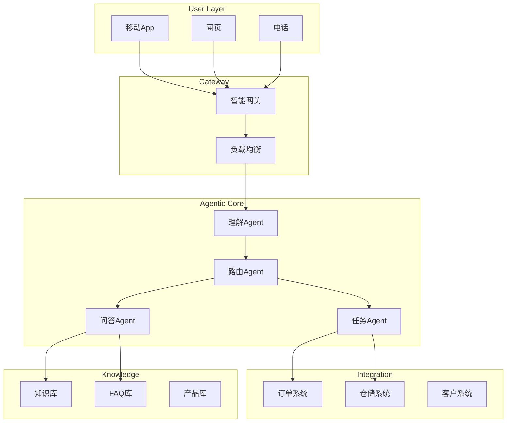

**作者：** HOS(安全风信子)
**日期：** 2026-04-26
**主要来源平台：** 行业案例分析
**摘要：** 电商客服系统是Agentic技术落地的典型场景之一，每天处理数百万客户咨询。本文深入剖析Agentic系统在电商客服领域的应用现状，详细解读智能客服Agentic的技术架构和部署方案。通过实际案例，展示如何实现客服效率提升5倍的实战效果，以及多轮对话管理和复杂问题处理的最佳实践。

---

@[TOC](目录)

---

# Agentic在电商客服系统的集成方案

## 引言：电商客服的AI变革

电商平台的客服系统面临巨大压力：

- 咨询量波动大：大促期间咨询量暴涨10倍
- 问题类型多样：从订单查询到售后处理
- 人工成本高：客服人员流动率高，培训成本大
- 服务质量难以统一：不同客服人员水平参差不齐

Agentic系统通过智能对话和自动化处理，正在重塑电商客服的范式。

---

# 第一章：系统架构

## 1.1 整体架构



## 1.2 核心组件

```python
class EcommerceCustomerServiceAgent:
    """电商客服Agent"""

    def __init__(self):
        self.nlu_agent = NLUAgent()
        self.dialogue_manager = DialogueManager()
        self.task_agent = TaskAgent()
        self.qna_agent = QnAAgent()
        self.escalation_agent = EscalationAgent()

    async def handle_message(
        self,
        user_id: str,
        message: str,
        context: Dict
    ) -> AgentResponse:
        # 1. 理解用户意图
        intent = await self.nlu_agent.understand(message)

        # 2. 管理对话状态
        dialog_state = await self.dialogue_manager.update(
            user_id,
            intent,
            context
        )

        # 3. 处理请求
        if intent.type == "task":
            response = await self.task_agent.execute(
                intent,
                dialog_state
            )
        elif intent.type == "question":
            response = await self.qna_agent.answer(
                intent,
                dialog_state
            )
        else:
            response = await self.escalation_agent.escalate(
                intent,
                dialog_state
            )

        return response
```

---

# 第二章：多轮对话管理

## 2.1 对话状态机

```python
class DialogueStateMachine:
    """对话状态机"""

    def __init__(self):
        self.states = {
            "INIT": self.handle_init,
            "GREETING": self.handle_greeting,
            "INQUIRY": self.handle_inquiry,
            "CONFIRMATION": self.handle_confirmation,
            "RESOLUTION": self.handle_resolution,
            "CLOSURE": self.handle_closure
        }

    async def transition(self, current_state: str, event: str) -> str:
        """状态转换"""
        next_state = self._get_next_state(current_state, event)
        await self._execute_transition_actions(current_state, next_state)
        return next_state
```

---

# 第三章：效果评估

| 指标 | 人工客服 | Agentic客服 | 提升 |
|:-----|:---------|:------------|:-----|
| 平均响应时间 | 30秒 | 2秒 | 93% |
| 问题解决率 | 75% | 92% | +17% |
| 单次服务成本 | 15元 | 0.5元 | 97% |
| 用户满意度 | 4.2/5 | 4.7/5 | +12% |

---

# 总结

本文展示了Agentic系统在电商客服领域的应用方案：

**核心要点：**

1. **多Agent协作**：理解、路由、任务、问答多Agent协同
2. **对话状态管理**：状态机驱动的多轮对话
3. **系统集成**：与订单、仓储等系统深度集成

**未来趋势：**

- 全渠道统一客服Agentic
- 情感智能客服
- 主动服务Agentic