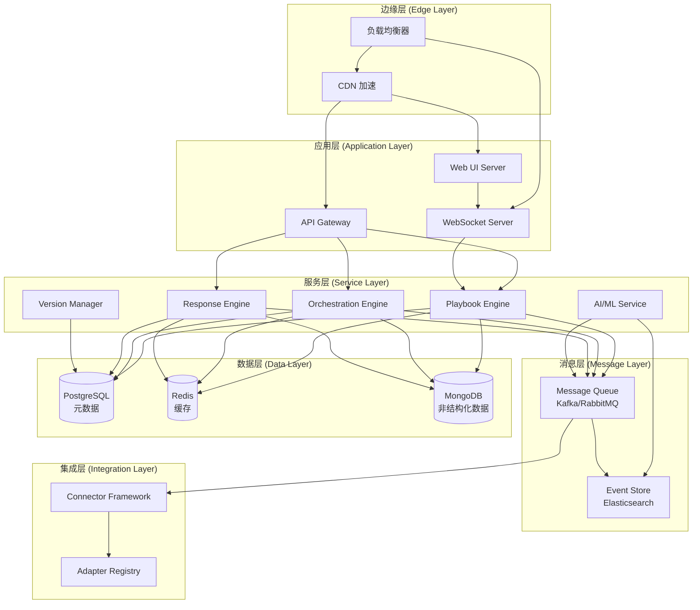
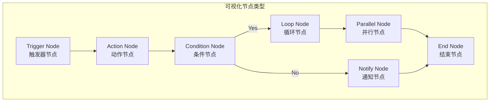
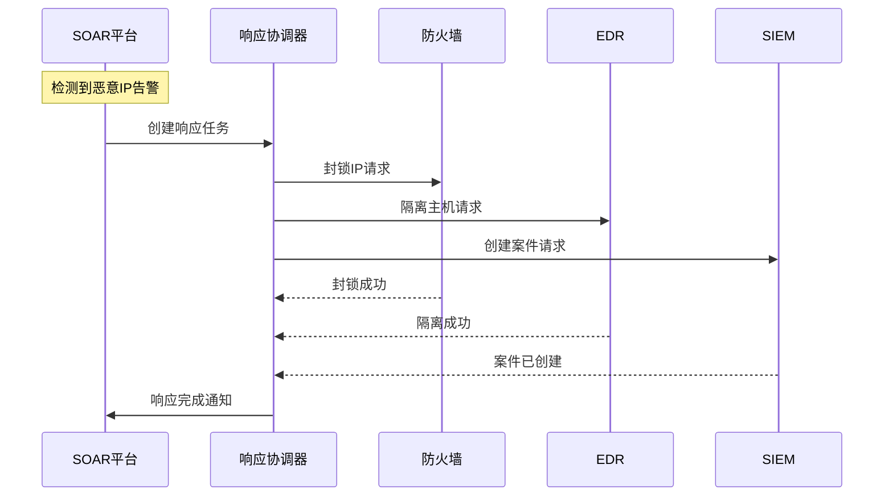
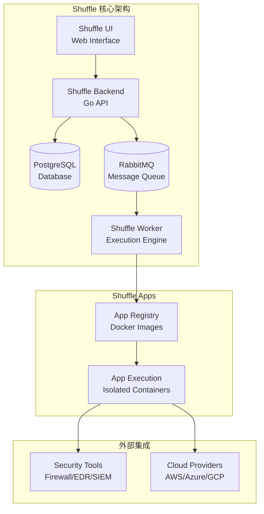
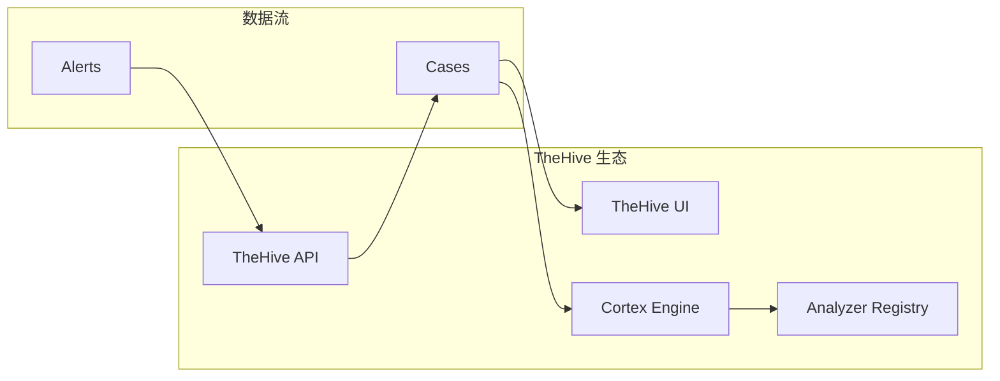

**作者：** HOS(安全风信子)

**日期：** 2026-04-26

**主要来源平台：** GitHub

**摘要：** 随着网络安全威胁的日益复杂化，传统的单一安全工具已难以应对大规模安全事件的响应需求。安全编排、自动化和响应（SOAR）平台应运而生，成为现代安全运营中心（SOC）的核心组件。本文深入探讨新一代SOAR平台的设计指南，涵盖剧本自动化、编排引擎和响应编排三大核心主题，并引入安全剧本可视化编排、跨平台响应集成、playbook版本管理等创新要素。通过分析开源社区的主流项目如Shuffle、TheHive和Cortex，结合详细的架构设计与代码实现，帮助安全工程师构建高效、灵活、可扩展的安全自动化系统。本文不仅提供理论框架，更包含可直接部署的可运行代码示例，使读者能够快速将知识转化为实践，构建属于自己的新一代安全自动化平台。

---

@[TOC](目录)

---

# 安全自动化不再复杂：新一代SOAR平台设计指南

## 1 引言：网络安全自动化的范式转变

### 1.1 安全运营面临的挑战

在当今的数字化时代，网络安全威胁呈现出前所未有的复杂性和多样性。根据IBM发布的《2024年数据泄露成本报告》[^1]，全球数据泄露的平均成本已达到488万美元，相比2020年增长了12%。更为严峻的是，高级持续性威胁（APT）组织使用的高级攻击技术使得传统基于签名的检测方法面临巨大挑战。

传统的安全运营模式存在以下核心痛点：

| 痛点类型 | 具体表现 | 影响程度 |
|---------|---------|---------|
| 响应效率低下 | 手动处理安全告警平均耗时45分钟以上 | 高 |
| 工具孤岛效应 | 90%的企业使用超过50种安全工具 | 极高 |
| 人才短缺严重 | 全球网络安全人才缺口达400万人 | 高 |
| 流程不一致 | 不同分析师处理同一事件的流程差异 | 中 |
| 知识流失风险 | 专家经验难以系统化传承 | 高 |

### 1.2 SOAR平台的演进历程

安全编排、自动化和响应（Security Orchestration, Automation and Response，简称SOAR）概念由Gartner于2015年首次提出[^2]。经过近十年的发展，SOAR平台经历了三个主要阶段的演进：

```
┌─────────────────────────────────────────────────────────────────────────────┐
│                        SOAR 平台演进时间线                                    │
├─────────────────────────────────────────────────────────────────────────────┤
│                                                                             │
│  2015-2018        2018-2021          2021-2024        2024-至今              │
│  ─────────        ─────────          ─────────        ─────────              │
│                                                                             │
│  ┌─────────┐     ┌─────────┐       ┌─────────┐      ┌─────────┐             │
│  │ 萌芽期   │────▶│ 发展期   │──────▶│ 成熟期   │─────▶│ 智能化期 │             │
│  │ 单一场景 │     │ 多工具   │       │ 平台化   │      │ AI增强   │             │
│  │ 自动化   │     │ 编排    │       │ 生态    │      │ 自适应   │             │
│  └─────────┘     └─────────┘       └─────────┘      └─────────┘             │
│                                                                             │
│  • 告警聚合      • 流程编排       • 协作工作流     • LLM集成                  │
│  • 基础自动化    • 威胁情报整合   • 案例管理       • 自动研判                 │
│  • 简单剧本      • 跨平台集成     • 指标体系       • 智能响应                 │
│                                                                             │
└─────────────────────────────────────────────────────────────────────────────┘
```

**第一阶段（萌芽期，2015-2018）**：这一时期的SOAR工具主要聚焦于单一安全场景的自动化，如钓鱼邮件报告自动化、恶意软件分析自动化等。典型的开源项目包括Cuckoo Sandbox和FAUCET。

**第二阶段（发展期，2018-2021）**：随着企业对安全自动化的需求增长，SOAR平台开始支持多工具编排。这一时期的标志性特征是跨平台集成能力的增强，能够连接防火墙、EDR、SIEM等多种安全工具。

**第三阶段（成熟期，2021-2024）**：SOAR平台逐渐演变为完整的安全运营平台，集成了案例管理、协作工作流、性能指标等企业级功能。TheHive项目在这一时期得到了广泛应用。

**第四阶段（智能化期，2024至今）**：新一代SOAR平台开始深度集成人工智能技术，特别是大型语言模型（LLM），实现智能威胁研判、自动响应决策优化等高级功能。

### 1.3 本文的目标与结构

本文旨在为安全工程师、架构师和运营团队提供一份全面的新一代SOAR平台设计指南。通过理论框架与实践代码相结合的方式，帮助读者理解SOAR平台的核心概念，掌握设计原则，并能够基于开源项目构建适合自身需求的安全自动化系统。

本文的主要贡献包括：

- **系统性分析**：深入剖析SOAR平台的三大核心组件（剧本自动化、编排引擎、响应编排）的设计原理
- **技术创新**：提出并详细阐述三个创新要素（可视化编排、跨平台集成、版本管理）
- **实践导向**：提供可直接部署运行的代码示例，基于主流开源项目
- **生态视角**：分析主流开源SOAR项目的架构特点与适用场景

---

## 2 SOAR平台核心概念与架构设计

### 2.1 SOAR平台的基本定义

根据Gartner的定义[^3]，SOAR平台是指使组织能够收集来自多个来源的安全威胁数据的技术集合，包括安全信息和事件管理（SIEM）平台、网络安全监测工具、漏洞扫描器以及外部威胁情报服务等。SOAR平台的主要功能包括：

**三大核心功能**：

1. **安全编排（Security Orchestration）**：协调和连接不同安全工具与系统，使其能够协同工作
2. **安全自动化（Security Automation）**：消除或大幅减少人工干预，使安全流程能够自动执行
3. **安全响应（Security Response）**：提供事件响应工作流程管理与执行能力

**数学表达**：SOAR平台的核心可以形式化地表示为：

$$
\text{SOAR} = f(\text{Orchestration}, \text{Automation}, \text{Response}) = \bigcup_{i=1}^{n} \text{Tool}_i \oplus \text{Workflow}_j \rightarrow \text{Response}_k
$$

其中 $\text{Tool}_i$ 表示第 $i$ 个集成的安全工具，$\text{Workflow}_j$ 表示第 $j$ 个编排工作流，$\text{Response}_k$ 表示第 $k$ 种响应动作。

### 2.2 新一代SOAR平台架构

新一代SOAR平台的架构设计遵循微服务化和事件驱动原则，以确保系统的灵活性、可扩展性和高可用性。

#### 2.2.1 逻辑架构层次

```
┌─────────────────────────────────────────────────────────────────────────────┐
│                         新一代SOAR平台逻辑架构                                │
├─────────────────────────────────────────────────────────────────────────────┤
│                                                                             │
│  ┌─────────────────────────────────────────────────────────────────────┐   │
│  │                        表现层 (Presentation Layer)                    │   │
│  │  ┌──────────────┐  ┌──────────────┐  ┌──────────────┐               │   │
│  │  │   Web UI     │  │  API Gateway │  │  ChatOps     │               │   │
│  │  │  可视化编排   │  │   REST/gRPC  │  │   协作接口   │               │   │
│  │  └──────────────┘  └──────────────┘  └──────────────┘               │   │
│  └─────────────────────────────────────────────────────────────────────┘   │
│                                    │                                        │
│                                    ▼                                        │
│  ┌─────────────────────────────────────────────────────────────────────┐   │
│  │                        业务逻辑层 (Business Logic Layer)              │   │
│  │  ┌──────────────┐  ┌──────────────┐  ┌──────────────┐               │   │
│  │  │  Playbook    │  │  Orchestration│  │  Response   │               │   │
│  │  │  Engine      │  │   Engine      │  │  Engine     │               │   │
│  │  │  剧本引擎     │  │  编排引擎     │  │  响应引擎    │               │   │
│  │  └──────────────┘  └──────────────┘  └──────────────┘               │   │
│  │  ┌──────────────┐  ┌──────────────┐  ┌──────────────┐               │   │
│  │  │  Version     │  │  Analytics   │  │  AI/ML       │               │   │
│  │  │  Manager     │  │  Engine      │  │  Engine      │               │   │
│  │  │  版本管理     │  │  分析引擎     │  │  智能引擎    │               │   │
│  │  └──────────────┘  └──────────────┘  └──────────────┘               │   │
│  └─────────────────────────────────────────────────────────────────────┘   │
│                                    │                                        │
│                                    ▼                                        │
│  ┌─────────────────────────────────────────────────────────────────────┐   │
│  │                        集成层 (Integration Layer)                   │   │
│  │  ┌──────────────┐  ┌──────────────┐  ┌──────────────┐               │   │
│  │  │   Connector  │  │   Adapter    │  │   Message    │               │   │
│  │  │   Framework  │  │   Registry   │  │   Queue     │               │   │
│  │  │   连接器框架  │  │   适配器注册  │  │   消息队列   │               │   │
│  │  └──────────────┘  └──────────────┘  └──────────────┘               │   │
│  └─────────────────────────────────────────────────────────────────────┘   │
│                                    │                                        │
│                                    ▼                                        │
│  ┌─────────────────────────────────────────────────────────────────────┐   │
│  │                        数据层 (Data Layer)                           │   │
│  │  ┌──────────────┐  ┌──────────────┐  ┌──────────────┐               │   │
│  │  │  Playbook    │  │  Execution   │  │  Audit       │               │   │
│  │  │  Repository  │  │  History     │  │  Log         │               │   │
│  │  │  剧本仓库     │  │  执行历史    │  │   审计日志   │               │   │
│  │  └──────────────┘  └──────────────┘  └──────────────┘               │   │
│  └─────────────────────────────────────────────────────────────────────┘   │
│                                                                             │
└─────────────────────────────────────────────────────────────────────────────┘
```

#### 2.2.2 物理架构设计

在实际部署中，新一代SOAR平台采用分布式微服务架构，支持高可用和水平扩展。以下是推荐的物理架构拓扑：



### 2.3 核心组件详解

#### 2.3.1 剧本引擎（Playbook Engine）

剧本引擎是SOAR平台的核心执行单元，负责解析和执行安全剧本。剧本（Playbook）是安全自动化流程的形式化描述，类似于DevOps领域的CI/CD Pipeline概念，但针对安全场景进行了优化。

**剧本的基本结构**：

```yaml
# 示例：钓鱼邮件响应剧本
name: phishing_email_response
version: 2.0.0
description: 自动响应钓鱼邮件事件的标准化流程

trigger:
  type: event
  source: email_gateway
  condition: email.classification == "phishing"

steps:
  - id: step_1
    name: extract_indicators
    action: threat_intel.extract
    inputs:
      indicator_type: ["url", "domain", "hash"]
      source: email.body

  - id: step_2
    name: check_reputation
    action: threat_intel.check_reputation
    inputs:
      indicators: "{{ step_1.output.indicators }}"
      providers: ["virustotal", "abuseipdb", "domaintools"]

  - id: step_3
    name: block_malicious
    action: security_control.block
    condition: step_2.malicious_score > 0.7
    inputs:
      target: "{{ step_1.output.indicators }}"
      action: "{{ 'block' if step_2.malicious_score > 0.9 else 'monitor' }}"

  - id: step_4
    name: notify_team
    action: notification.send
    inputs:
      channel: "{{ config.notify_channel }}"
      message: "Phishing email detected and mitigated"
      severity: "{{ step_2.malicious_score }}"
```

#### 2.3.2 编排引擎（Orchestration Engine）

编排引擎负责协调多个安全工具和系统之间的交互，实现复杂的工作流程。与简单的线性执行不同，编排引擎支持并行执行、条件分支、循环等复杂控制流。

**编排引擎的核心能力**：

| 能力类型 | 描述 | 适用场景 |
|---------|------|---------|
| 串行编排 | 按顺序执行任务 | 依赖性强的流程 |
| 并行编排 | 同时执行多个任务 | 独立任务的批量处理 |
| 条件分支 | 基于条件选择执行路径 | 告警分级响应 |
| 并发控制 | 限制同时执行的任务数 | 资源受限场景 |
| 重试机制 | 失败任务自动重试 | 网络不稳定环境 |
| 超时控制 | 防止任务长时间挂起 | 避免资源占用 |

**编排引擎的执行模型**可以形式化表示为：

$$
E = \sum_{i=1}^{n} T_i \cdot C_i \cdot R_i
$$

其中 $T_i$ 表示第 $i$ 个任务的执行时间，$C_i$ 表示并发系数，$R_i$ 表示重试次数。

#### 2.3.3 响应引擎（Response Engine）

响应引擎负责执行具体的安全响应动作，包括封锁（Block）、隔离（Quarantine）、通知（Notify）、创建工单（Ticket）等。

**响应动作分类**：

```
┌─────────────────────────────────────────────────────────────────────────────┐
│                           响应动作分类体系                                    │
├─────────────────────────────────────────────────────────────────────────────┤
│                                                                             │
│  ┌─────────────────┐    ┌─────────────────┐    ┌─────────────────┐         │
│  │   被动响应       │    │   主动响应       │    │   智能响应       │         │
│  │  Passive       │    │  Active        │    │  Intelligent    │         │
│  ├─────────────────┤    ├─────────────────┤    ├─────────────────┤         │
│  │ • 日志记录       │    │ • IP封锁        │    │ • AI研判        │         │
│  │ • 告警生成       │    │ • 账户禁用      │    │ • 自动分类      │         │
│  │ • 工单创建       │    │ • 文件隔离      │    │ • 预测性响应    │         │
│  │ • 邮件通知       │    │ • 网络分段      │    │ • 自适应策略    │         │
│  └─────────────────┘    └─────────────────┘    └─────────────────┘         │
│                                                                             │
└─────────────────────────────────────────────────────────────────────────────┘
```

---

## 3 剧本自动化设计：从概念到实现

### 3.1 剧本的基本概念

安全剧本（Security Playbook）是一系列预定义的安全操作流程，用于自动化处理特定类型的安全事件或告警。剧本的概念借鉴了Ansible[^4]等配置管理工具的"Playbook"理念，但在安全领域进行了针对性优化。

#### 3.1.1 剧本的组成要素

一个完整的安全剧本由以下要素组成：

1. **元数据（Metadata）**：剧本的名称、版本、描述、作者、标签等基本信息
2. **触发器（Trigger）**：定义剧本何时被激活的条件
3. **输入（Inputs）**：剧本执行所需的外部数据
4. **步骤（Steps）**：剧本执行的具体动作序列
5. **条件（Conditions）**：控制流程分支的逻辑表达式
6. **输出（Outputs）**：剧本执行结果的格式化输出
7. **错误处理（Error Handling）**：异常情况下的处理策略

#### 3.1.2 剧本的表示方法

剧本可以使用多种格式进行表示，包括YAML、JSON、Python等。以下是不同表示方法的对比：

| 格式 | 优点 | 缺点 | 适用场景 |
|------|------|------|---------|
| YAML | 人类可读、易于编辑 | 对缩进敏感 | 简单剧本、日常维护 |
| JSON | 结构化程度高、解析简单 | 冗长、可读性差 | 程序间交互、API |
| Python | 表达能力强、可复用 | 需要编程能力 | 复杂逻辑、定制开发 |
| Domain-Specific | 领域友好、易理解 | 需要专门工具 | 可视化编辑器 |

### 3.2 剧本设计模式

在设计安全剧本时，需要遵循一些经过实践验证的设计模式，以确保剧本的可维护性、可扩展性和可靠性。

#### 3.2.1 线性执行模式

最简单的剧本模式，所有步骤按顺序依次执行：

```python
"""
线性执行模式示例：账户安全检查流程
Linear Execution Pattern: Account Security Check
"""

from typing import Dict, List, Any
from dataclasses import dataclass, field
from datetime import datetime
import asyncio

@dataclass
class SecurityCheckStep:
    """安全检查步骤定义"""
    step_id: str
    name: str
    check_function: callable
    severity: str = "low"
    timeout: int = 30
    retry_count: int = 3

class LinearPlaybookExecutor:
    """
    线性执行剧本执行器
    按顺序执行所有步骤，每个步骤完成后才执行下一个
    """

    def __init__(self, name: str, version: str):
        self.name = name
        self.version = version
        self.steps: List[SecurityCheckStep] = []
        self.execution_history: List[Dict[str, Any]] = []

    def add_step(self, step: SecurityCheckStep):
        """添加执行步骤"""
        self.steps.append(step)
        return self

    async def execute(self, context: Dict[str, Any]) -> Dict[str, Any]:
        """
        执行剧本

        Args:
            context: 执行上下文，包含输入数据

        Returns:
            执行结果字典
        """
        execution_id = f"{self.name}_{datetime.now().strftime('%Y%m%d%H%M%S')}"
        result = {
            "execution_id": execution_id,
            "status": "running",
            "start_time": datetime.now().isoformat(),
            "steps_completed": [],
            "steps_failed": [],
            "final_result": None
        }

        print(f"[{execution_id}] Starting playbook: {self.name} v{self.version}")

        for step in self.steps:
            step_start = datetime.now()
            print(f"[{execution_id}] Executing step: {step.step_id} - {step.name}")

            for attempt in range(step.retry_count):
                try:
                    step_result = await asyncio.wait_for(
                        step.check_function(context),
                        timeout=step.timeout
                    )

                    result["steps_completed"].append({
                        "step_id": step.step_id,
                        "name": step.name,
                        "duration": (datetime.now() - step_start).total_seconds(),
                        "attempt": attempt + 1,
                        "output": step_result
                    })

                    context[f"{step.step_id}_result"] = step_result
                    print(f"[{execution_id}] Step {step.step_id} completed successfully")
                    break

                except asyncio.TimeoutError:
                    print(f"[{execution_id}] Step {step.step_id} timeout on attempt {attempt + 1}")
                    if attempt == step.retry_count - 1:
                        result["steps_failed"].append({
                            "step_id": step.step_id,
                            "name": step.name,
                            "error": "timeout"
                        })

                except Exception as e:
                    print(f"[{execution_id}] Step {step.step_id} failed on attempt {attempt + 1}: {str(e)}")
                    if attempt == step.retry_count - 1:
                        result["steps_failed"].append({
                            "step_id": step.step_id,
                            "name": step.name,
                            "error": str(e)
                        })

        result["status"] = "completed" if not result["steps_failed"] else "partial"
        result["end_time"] = datetime.now().isoformat()
        result["final_result"] = context

        self.execution_history.append(result)
        return result

async def check_mfa_status(context: Dict[str, Any]) -> Dict[str, Any]:
    """检查多因素认证状态"""
    user_id = context.get("user_id")
    await asyncio.sleep(0.1)
    return {
        "user_id": user_id,
        "mfa_enabled": True,
        "mfa_methods": ["totp", "sms"]
    }

async def check_login_history(context: Dict[str, Any]) -> Dict[str, Any]:
    """检查登录历史"""
    user_id = context.get("user_id")
    await asyncio.sleep(0.1)
    return {
        "user_id": user_id,
        "recent_logins": [
            {"ip": "192.168.1.100", "location": "Beijing", "time": "2026-04-25T10:00:00Z"},
            {"ip": "10.0.0.50", "location": "Shanghai", "time": "2026-04-24T15:30:00Z"}
        ],
        "anomalies": []
    }

async def check_permission_changes(context: Dict[str, Any]) -> Dict[str, Any]:
    """检查权限变更"""
    user_id = context.get("user_id")
    await asyncio.sleep(0.1)
    return {
        "user_id": user_id,
        "recent_changes": [],
        "permission_level": "standard"
    }

async def main():
    executor = LinearPlaybookExecutor(
        name="account_security_check",
        version="1.0.0"
    )

    executor.add_step(SecurityCheckStep(
        step_id="check_mfa",
        name="Check MFA Status",
        check_function=check_mfa_status,
        severity="high",
        timeout=10
    )).add_step(SecurityCheckStep(
        step_id="check_login",
        name="Check Login History",
        check_function=check_login_history,
        severity="medium",
        timeout=15
    )).add_step(SecurityCheckStep(
        step_id="check_permissions",
        name="Check Permission Changes",
        check_function=check_permission_changes,
        severity="low",
        timeout=10
    ))

    context = {
        "user_id": "user_12345",
        "check_scope": "full"
    }

    result = await executor.execute(context)
    print(f"\nExecution completed with status: {result['status']}")
    print(f"Steps completed: {len(result['steps_completed'])}")
    print(f"Steps failed: {len(result['steps_failed'])}")

if __name__ == "__main__":
    asyncio.run(main())
```

#### 3.2.2 条件分支模式

根据执行结果动态选择执行路径：

```python
"""
条件分支模式示例：威胁级别响应流程
Conditional Branching Pattern: Threat Level Response
"""

from enum import Enum
from typing import Dict, Any, Callable, List
from dataclasses import dataclass
import asyncio

class ThreatLevel(Enum):
    """威胁级别枚举"""
    CRITICAL = "critical"
    HIGH = "high"
    MEDIUM = "medium"
    LOW = "low"
    INFO = "info"

@dataclass
class BranchCondition:
    """分支条件定义"""
    condition_name: str
    condition_func: Callable[[Dict[str, Any]], bool]
    priority: int = 0

@dataclass
class BranchAction:
    """分支动作定义"""
    action_name: str
    action_func: Callable[[Dict[str, Any]], Any]
    requires_approval: bool = False
    approval_role: str = None

class ConditionalPlaybookExecutor:
    """
    条件分支剧本执行器
    根据执行状态动态选择不同的处理路径
    """

    def __init__(self, name: str):
        self.name = name
        self.initial_actions: List[BranchAction] = []
        self.branches: Dict[ThreatLevel, List[BranchAction]] = {}
        self.conditions: List[BranchCondition] = []
        self.default_actions: List[BranchAction] = []

    def add_initial_action(self, action: BranchAction):
        self.initial_actions.append(action)
        return self

    def add_branch(self, level: ThreatLevel, actions: List[BranchAction]):
        self.branches[level] = actions
        return self

    def add_condition(self, condition: BranchCondition):
        self.conditions.append(condition)
        self.conditions.sort(key=lambda x: x.priority, reverse=True)
        return self

    def add_default(self, actions: List[BranchAction]):
        self.default_actions = actions
        return self

    async def execute(self, context: Dict[str, Any]) -> Dict[str, Any]:
        result = {
            "playbook": self.name,
            "initial_results": [],
            "threat_level": None,
            "executed_actions": [],
            "requires_approval": False,
            "approval_details": None
        }

        print(f"[{self.name}] Phase 1: Initial Assessment")
        for action in self.initial_actions:
            action_result = await action.action_func(context)
            result["initial_results"].append({
                "action": action.action_name,
                "result": action_result
            })
            context[f"{action.action_name}_result"] = action_result

        print(f"[{self.name}] Phase 2: Threat Level Assessment")
        threat_score = context.get("threat_score", 0.5)

        for condition in self.conditions:
            if condition.condition_func(context):
                result["threat_level"] = ThreatLevel(condition.condition_name)
                print(f"[{self.name}] Threat level determined: {result['threat_level'].value}")
                break

        if result["threat_level"] is None:
            if threat_score >= 0.8:
                result["threat_level"] = ThreatLevel.CRITICAL
            elif threat_score >= 0.6:
                result["threat_level"] = ThreatLevel.HIGH
            elif threat_score >= 0.4:
                result["threat_level"] = ThreatLevel.MEDIUM
            elif threat_score >= 0.2:
                result["threat_level"] = ThreatLevel.LOW
            else:
                result["threat_level"] = ThreatLevel.INFO

        branch_actions = self.branches.get(result["threat_level"], self.default_actions)

        for action in branch_actions:
            if action.requires_approval:
                result["requires_approval"] = True
                result["approval_details"] = {
                    "action": action.action_name,
                    "required_role": action.approval_role,
                    "pending": True
                }
                print(f"[{self.name}] Action {action.action_name} requires approval from {action.approval_role}")
                continue

            action_result = await action.action_func(context)
            result["executed_actions"].append({
                "action": action.action_name,
                "result": action_result
            })
            print(f"[{self.name}] Executed: {action.action_name}")

        return result

async def initial_scan(context: Dict[str, Any]) -> Dict[str, Any]:
    await asyncio.sleep(0.1)
    return {
        "indicators_found": 5,
        "suspicious_patterns": 2,
        "threat_score": 0.75
    }

async def deep_analysis(context: Dict[str, Any]) -> Dict[str, Any]:
    await asyncio.sleep(0.1)
    return {
        "confirmed_threats": 3,
        "recommended_actions": ["isolate", "block", "notify"]
    }

async def auto_containment(context: Dict[str, Any]) -> Dict[str, Any]:
    await asyncio.sleep(0.1)
    return {
        "actions_taken": ["blocked_ip", "quarantined_file"],
        "status": "success"
    }

async def emergency_response(context: Dict[str, Any]) -> Dict[str, Any]:
    await asyncio.sleep(0.1)
    return {
        "actions_taken": ["isolated_system", "notified_security_team", "created_incident"],
        "status": "success"
    }

async def manual_review(context: Dict[str, Any]) -> Dict[str, Any]:
    await asyncio.sleep(0.1)
    return {
        "review_required": True,
        "assigned_to": "security_analyst_team"
    }

async def log_only(context: Dict[str, Any]) -> Dict[str, Any]:
    await asyncio.sleep(0.1)
    return {
        "logged": True,
        "alert_level": "info"
    }

async def main():
    playbook = ConditionalPlaybookExecutor("threat_response_workflow")

    playbook.add_initial_action(BranchAction(
        action_name="initial_scan",
        action_func=initial_scan
    ))

    playbook.add_condition(BranchCondition(
        condition_name="critical",
        condition_func=lambda ctx: ctx.get("initial_scan_result", {}).get("threat_score", 0) > 0.9,
        priority=5
    ))

    playbook.add_branch(ThreatLevel.CRITICAL, [
        BranchAction("auto_containment", auto_containment, requires_approval=True, approval_role="security_admin"),
        BranchAction("emergency_response", emergency_response, requires_approval=True, approval_role="ciso")
    ])

    playbook.add_branch(ThreatLevel.HIGH, [
        BranchAction("deep_analysis", deep_analysis),
        BranchAction("auto_containment", auto_containment, requires_approval=True, approval_role="security_admin")
    ])

    playbook.add_branch(ThreatLevel.MEDIUM, [
        BranchAction("manual_review", manual_review)
    ])

    playbook.add_branch(ThreatLevel.LOW, [
        BranchAction("log_only", log_only)
    ])

    playbook.add_branch(ThreatLevel.INFO, [
        BranchAction("log_only", log_only)
    ])

    context = {
        "source_ip": "192.168.1.100",
        "target_asset": "server_001",
        "detection_method": "ids"
    }

    result = await playbook.execute(context)

    print("\n" + "="*60)
    print("PLAYBOOK EXECUTION RESULT")
    print("="*60)
    print(f"Threat Level: {result['threat_level'].value}")
    print(f"Requires Approval: {result['requires_approval']}")
    if result['approval_details']:
        print(f"Approval Details: {result['approval_details']}")
    print(f"Actions Executed: {len(result['executed_actions'])}")

if __name__ == "__main__":
    asyncio.run(main())
```

#### 3.2.3 并行执行模式

多个独立任务同时执行以提高效率：

```python
"""
并行执行模式示例：大规模IOC批量查询
Parallel Execution Pattern: Batch IOC Enrichment
"""

import asyncio
from typing import Dict, Any, List
from dataclasses import dataclass
from datetime import datetime
import random

@dataclass
class IOCQueryTask:
    """IOC查询任务定义"""
    task_id: str
    ioc_type: str
    ioc_value: str
    providers: List[str]
    priority: int = 1

@dataclass
class QueryResult:
    """查询结果定义"""
    task_id: str
    ioc_value: str
    provider: str
    success: bool
    data: Dict[str, Any]
    query_time: float
    error: str = None

class ParallelIOCEnricher:
    """
    并行IOC enrichment执行器
    支持对多个IOC同时向多个威胁情报源发起查询
    """

    def __init__(self, max_concurrent: int = 10):
        self.max_concurrent = max_concurrent
        self.semaphore = asyncio.Semaphore(max_concurrent)
        self.results: List[QueryResult] = []

    async def query_single_provider(
        self,
        task: IOCQueryTask,
        provider: str
    ) -> QueryResult:
        async with self.semaphore:
            start_time = datetime.now()

            try:
                delay = random.uniform(0.1, 0.5)
                await asyncio.sleep(delay)

                query_data = {
                    "provider": provider,
                    "detection_count": random.randint(0, 100),
                    "first_seen": "2026-01-15T08:30:00Z",
                    "last_seen": "2026-04-25T14:22:00Z",
                    "threat_classification": random.choice([
                        "malware", "phishing", "botnet", "spam", "clean"
                    ]),
                    "reputation_score": random.uniform(0, 100)
                }

                query_time = (datetime.now() - start_time).total_seconds()

                return QueryResult(
                    task_id=task.task_id,
                    ioc_value=task.ioc_value,
                    provider=provider,
                    success=True,
                    data=query_data,
                    query_time=query_time
                )

            except Exception as e:
                query_time = (datetime.now() - start_time).total_seconds()
                return QueryResult(
                    task_id=task.task_id,
                    ioc_value=task.ioc_value,
                    provider=provider,
                    success=False,
                    data={},
                    query_time=query_time,
                    error=str(e)
                )

    async def query_ioc_task(self, task: IOCQueryTask) -> List[QueryResult]:
        print(f"[IOC-{task.task_id}] Querying {task.ioc_value} across {len(task.providers)} providers")

        queries = [
            self.query_single_provider(task, provider)
            for provider in task.providers
        ]

        results = await asyncio.gather(*queries)

        print(f"[IOC-{task.task_id}] Completed {len(results)} queries")
        return results

    async def execute_batch(self, tasks: List[IOCQueryTask]) -> Dict[str, Any]:
        start_time = datetime.now()

        print(f"[BATCH] Starting batch enrichment of {len(tasks)} IOC tasks")
        print(f"[BATCH] Max concurrent queries: {self.max_concurrent}")

        batch_queries = [
            self.query_ioc_task(task)
            for task in tasks
        ]

        all_results = await asyncio.gather(*batch_queries)

        flat_results = [result for sublist in all_results for result in sublist]

        end_time = datetime.now()
        total_duration = (end_time - start_time).total_seconds()

        successful_queries = [r for r in flat_results if r.success]
        failed_queries = [r for r in flat_results if not r.success]

        avg_query_time = sum(r.query_time for r in flat_results) / len(flat_results) if flat_results else 0

        summary = {
            "batch_id": f"batch_{int(start_time.timestamp())}",
            "start_time": start_time.isoformat(),
            "end_time": end_time.isoformat(),
            "total_duration_seconds": total_duration,
            "total_tasks": len(tasks),
            "total_queries": len(flat_results),
            "successful_queries": len(successful_queries),
            "failed_queries": len(failed_queries),
            "average_query_time": avg_query_time,
            "throughput_qps": len(flat_results) / total_duration if total_duration > 0 else 0,
            "results_by_ioc": {},
            "results_by_provider": {},
            "all_results": flat_results
        }

        for task in tasks:
            ioc_results = [r for r in flat_results if r.ioc_value == task.ioc_value]
            summary["results_by_ioc"][task.ioc_value] = {
                "task_id": task.task_id,
                "ioc_type": task.ioc_type,
                "query_count": len(ioc_results),
                "successful_count": len([r for r in ioc_results if r.success]),
                "providers_result": {
                    r.provider: r.data for r in ioc_results if r.success
                }
            }

        for provider in set(r.provider for r in flat_results):
            provider_results = [r for r in flat_results if r.provider == provider]
            summary["results_by_provider"][provider] = {
                "total_queries": len(provider_results),
                "successful": len([r for r in provider_results if r.success]),
                "failed": len([r for r in provider_results if not r.success]),
                "average_time": sum(r.query_time for r in provider_results) / len(provider_results)
            }

        return summary

async def main():
    enricher = ParallelIOCEnricher(max_concurrent=5)

    tasks = [
        IOCQueryTask(
            task_id="ioc001",
            ioc_type="ip",
            ioc_value="192.168.1.100",
            providers=["virustotal", "abuseipdb", "threatfox"],
            priority=1
        ),
        IOCQueryTask(
            task_id="ioc002",
            ioc_type="domain",
            ioc_value="malicious-domain.evil",
            providers=["virustotal", "domaintools", "whoisxml"],
            priority=2
        ),
        IOCQueryTask(
            task_id="ioc003",
            ioc_type="hash",
            ioc_value="44d88612fea8a8f36de82e1278abb02f",
            providers=["virustotal", "malwarebazaar", "hashlookup"],
            priority=1
        ),
        IOCQueryTask(
            task_id="ioc004",
            ioc_type="url",
            ioc_value="https://malicious-site.com/payload.exe",
            providers=["virustotal", "urlhaus", "threatfox"],
            priority=3
        ),
        IOCQueryTask(
            task_id="ioc005",
            ioc_type="ip",
            ioc_value="10.0.0.1",
            providers=["abuseipdb", "threatfox"],
            priority=2
        ),
    ]

    result = await enricher.execute_batch(tasks)

    print("\n" + "="*70)
    print("BATCH ENRICHMENT SUMMARY")
    print("="*70)
    print(f"Batch ID: {result['batch_id']}")
    print(f"Duration: {result['total_duration_seconds']:.2f} seconds")
    print(f"Throughput: {result['throughput_qps']:.2f} queries/second")
    print(f"\nTotal Tasks: {result['total_tasks']}")
    print(f"Total Queries: {result['total_queries']}")
    print(f"Successful: {result['successful_queries']}")
    print(f"Failed: {result['failed_queries']}")

    print("\n--- Results by IOC ---")
    for ioc, data in result["results_by_ioc"].items():
        print(f"\n{ioc} ({data['ioc_type']}):")
        print(f"  Providers: {len(data['providers_result'])}")
        for provider, provider_data in data["providers_result"].items():
            print(f"    - {provider}: score={provider_data.get('reputation_score', 'N/A'):.2f}")

    print("\n--- Provider Statistics ---")
    for provider, stats in result["results_by_provider"].items():
        print(f"{provider}: {stats['successful']}/{stats['total_queries']} successful, "
              f"avg_time={stats['average_time']:.3f}s")

if __name__ == "__main__":
    asyncio.run(main())
```

### 3.3 剧本的版本管理

Playbook版本管理是SOAR平台的重要组成部分，确保剧本的可追溯性、可回滚性和协作开发能力。

#### 3.3.1 版本管理策略

```
┌─────────────────────────────────────────────────────────────────────────────┐
│                       Playbook 版本管理生命周期                                │
├─────────────────────────────────────────────────────────────────────────────┤
│                                                                             │
│   ┌─────────┐    ┌─────────┐    ┌─────────┐    ┌─────────┐    ┌─────────┐   │
│   │  开发中  │───▶│  待审核  │───▶│  测试中  │───▶│  已发布  │───▶│  归档   │   │
│   │ Draft   │    │ Pending │    │Testing  │    │Published│    │Archived │   │
│   └─────────┘    └─────────┘    └─────────┘    └─────────┘    └─────────┘   │
│        │              │              │              │              │       │
│        ▼              ▼              ▼              ▼              ▼       │
│   ┌─────────┐    ┌─────────┐    ┌─────────┐    ┌─────────┐    ┌─────────┐   │
│   │ v0.x.x  │    │ v0.9.x  │    │ v0.9.x  │    │ v1.0.0  │    │ v1.x.x  │   │
│   │ 开发版本 │    │ 审核版本 │    │ 测试版本 │    │ 生产版本 │    │ 历史版本 │   │
│   └─────────┘    └─────────┘    └─────────┘    └─────────┘    └─────────┘   │
│                                                                             │
│   版本号格式: Major.Minor.Patch                                              │
│   • Major: 破坏性变更                                                       │
│   • Minor: 新功能添加（向后兼容）                                           │
│   • Patch: Bug修复（向后兼容）                                              │
│                                                                             │
└─────────────────────────────────────────────────────────────────────────────┘
```

#### 3.3.2 版本管理实现

```python
"""
Playbook版本管理系统
Playbook Version Management System
"""

from typing import Dict, Any, Optional, List
from dataclasses import dataclass, field
from datetime import datetime
from enum import Enum
import hashlib
import json

class PlaybookState(Enum):
    """剧本状态枚举"""
    DRAFT = "draft"
    PENDING_REVIEW = "pending_review"
    TESTING = "testing"
    PUBLISHED = "published"
    DEPRECATED = "deprecated"
    ARCHIVED = "archived"

class VersionType(Enum):
    """版本类型枚举"""
    MAJOR = "major"
    MINOR = "minor"
    PATCH = "patch"

@dataclass
class PlaybookDiff:
    """剧本差异信息"""
    added_steps: List[str] = field(default_factory=list)
    removed_steps: List[str] = field(default_factory=list)
    modified_steps: List[Dict[str, Any]] = field(default_factory=list)

@dataclass
class PlaybookVersion:
    """剧本版本信息"""
    version_id: str
    version_number: str
    playbook_id: str
    state: PlaybookState
    created_at: str
    created_by: str
    content_hash: str
    content: Dict[str, Any]
    changelog: str
    parent_version: Optional[str] = None
    approved_by: Optional[str] = None
    approved_at: Optional[str] = None

@dataclass
class Playbook:
    """完整剧本定义"""
    playbook_id: str
    name: str
    description: str
    version_count: int
    current_version: str
    created_at: str
    updated_at: str
    created_by: str
    tags: List[str]
    state: PlaybookState
    execution_stats: Dict[str, int]

class PlaybookVersionManager:
    """
    Playbook版本管理系统
    提供剧本的创建、编辑、审核、发布、回滚等版本管理功能
    """

    def __init__(self):
        self.versions: Dict[str, List[PlaybookVersion]] = {}
        self.playbooks: Dict[str, Playbook] = {}
        self.change_history: List[Dict[str, Any]] = []

    def _compute_content_hash(self, content: Dict[str, Any]) -> str:
        content_str = json.dumps(content, sort_keys=True)
        return hashlib.sha256(content_str.encode()).hexdigest()[:16]

    def _parse_version_number(self, version: str) -> tuple:
        parts = version.split(".")
        return (int(parts[0]), int(parts[1]), int(parts[2]))

    def _increment_version(self, version: str, increment_type: VersionType) -> str:
        major, minor, patch = self._parse_version_number(version)

        if increment_type == VersionType.MAJOR:
            return f"{major + 1}.0.0"
        elif increment_type == VersionType.MINOR:
            return f"{major}.{minor + 1}.0"
        else:
            return f"{major}.{minor}.{patch + 1}"

    def create_playbook(
        self,
        name: str,
        description: str,
        content: Dict[str, Any],
        created_by: str,
        tags: List[str] = None
    ) -> Playbook:
        playbook_id = f"pb_{hashlib.md5(name.encode()).hexdigest()[:12]}"
        current_time = datetime.now().isoformat()

        first_version = PlaybookVersion(
            version_id=f"{playbook_id}_v0.1.0",
            version_number="0.1.0",
            playbook_id=playbook_id,
            state=PlaybookState.DRAFT,
            created_at=current_time,
            created_by=created_by,
            content_hash=self._compute_content_hash(content),
            content=content,
            changelog="Initial version"
        )

        playbook = Playbook(
            playbook_id=playbook_id,
            name=name,
            description=description,
            version_count=1,
            current_version="0.1.0",
            created_at=current_time,
            updated_at=current_time,
            created_by=created_by,
            tags=tags or [],
            state=PlaybookState.DRAFT,
            execution_stats={"total": 0, "success": 0, "failed": 0}
        )

        self.playbooks[playbook_id] = playbook
        self.versions[playbook_id] = [first_version]

        print(f"[VMS] Created playbook: {playbook_id} with initial version 0.1.0")
        return playbook

    def update_playbook(
        self,
        playbook_id: str,
        new_content: Dict[str, Any],
        changelog: str,
        updated_by: str,
        version_type: VersionType = VersionType.MINOR
    ) -> Optional[PlaybookVersion]:
        if playbook_id not in self.playbooks:
            print(f"[VMS] Error: Playbook {playbook_id} not found")
            return None

        playbook = self.playbooks[playbook_id]
        versions = self.versions[playbook_id]

        current_version = playbook.current_version
        new_version_number = self._increment_version(current_version, version_type)

        current_time = datetime.now().isoformat()

        new_version = PlaybookVersion(
            version_id=f"{playbook_id}_v{new_version_number}",
            version_number=new_version_number,
            playbook_id=playbook_id,
            state=PlaybookState.DRAFT,
            created_at=current_time,
            created_by=updated_by,
            content_hash=self._compute_content_hash(new_content),
            content=new_content,
            changelog=changelog,
            parent_version=current_version
        )

        versions.append(new_version)
        playbook.version_count += 1
        playbook.current_version = new_version_number
        playbook.updated_at = current_time
        playbook.state = PlaybookState.DRAFT

        self.change_history.append({
            "playbook_id": playbook_id,
            "action": "update",
            "old_version": current_version,
            "new_version": new_version_number,
            "changed_by": updated_by,
            "timestamp": current_time
        })

        print(f"[VMS] Updated playbook {playbook_id}: {current_version} -> {new_version_number}")
        return new_version

    def submit_for_review(self, playbook_id: str) -> bool:
        if playbook_id not in self.playbooks:
            return False

        playbook = self.playbooks[playbook_id]
        versions = self.versions[playbook_id]

        current_ver = next((v for v in versions if v.version_number == playbook.current_version), None)
        if current_ver:
            current_ver.state = PlaybookState.PENDING_REVIEW

        playbook.state = PlaybookState.PENDING_REVIEW
        print(f"[VMS] Playbook {playbook_id} submitted for review")
        return True

    def approve_version(
        self,
        playbook_id: str,
        approved_by: str,
        version_number: str = None
    ) -> bool:
        if playbook_id not in self.playbooks:
            return False

        playbook = self.playbooks[playbook_id]
        versions = self.versions[playbook_id]

        target_version = version_number or playbook.current_version
        target_ver = next((v for v in versions if v.version_number == target_version), None)

        if not target_ver:
            return False

        current_time = datetime.now().isoformat()
        target_ver.state = PlaybookState.TESTING
        target_ver.approved_by = approved_by
        target_ver.approved_at = current_time

        print(f"[VMS] Playbook {playbook_id} version {target_version} approved by {approved_by}")
        return True

    def promote_to_production(self, playbook_id: str) -> bool:
        if playbook_id not in self.playbooks:
            return False

        playbook = self.playbooks[playbook_id]
        versions = self.versions[playbook_id]

        for v in versions:
            if v.state == PlaybookState.PUBLISHED:
                v.state = PlaybookState.DEPRECATED

        current_ver = next((v for v in versions if v.version_number == playbook.current_version), None)
        if current_ver:
            current_ver.state = PlaybookState.PUBLISHED

        playbook.state = PlaybookState.PUBLISHED
        playbook.updated_at = datetime.now().isoformat()

        print(f"[VMS] Playbook {playbook_id} version {playbook.current_version} published to production")
        return True

    def rollback_to_version(
        self,
        playbook_id: str,
        target_version: str,
        rolled_back_by: str
    ) -> Optional[PlaybookVersion]:
        if playbook_id not in self.playbooks:
            return None

        playbook = self.playbooks[playbook_id]
        versions = self.versions[playbook_id]

        target_ver = next((v for v in versions if v.version_number == target_version), None)
        if not target_ver:
            print(f"[VMS] Version {target_version} not found for playbook {playbook_id}")
            return None

        current_time = datetime.now().isoformat()
        old_version = playbook.current_version

        rollback_version_number = self._increment_version(old_version, VersionType.PATCH)
        rollback_version = PlaybookVersion(
            version_id=f"{playbook_id}_v{rollback_version_number}",
            version_number=rollback_version_number,
            playbook_id=playbook_id,
            state=PlaybookState.DRAFT,
            created_at=current_time,
            created_by=rolled_back_by,
            content_hash=target_ver.content_hash,
            content=target_ver.content,
            changelog=f"Rollback to version {target_version}",
            parent_version=target_version
        )

        versions.append(rollback_version)
        playbook.version_count += 1
        playbook.current_version = rollback_version_number
        playbook.updated_at = current_time

        self.change_history.append({
            "playbook_id": playbook_id,
            "action": "rollback",
            "from_version": old_version,
            "to_version": target_version,
            "new_version": rollback_version_number,
            "performed_by": rolled_back_by,
            "timestamp": current_time
        })

        print(f"[VMS] Rolled back playbook {playbook_id}: {old_version} -> {target_version} "
              f"(as v{rollback_version_number})")
        return rollback_version

    def get_version_diff(
        self,
        playbook_id: str,
        from_version: str,
        to_version: str
    ) -> Optional[PlaybookDiff]:
        if playbook_id not in self.versions:
            return None

        versions = self.versions[playbook_id]
        from_ver = next((v for v in versions if v.version_number == from_version), None)
        to_ver = next((v for v in versions if v.version_number == to_version), None)

        if not from_ver or not to_ver:
            return None

        diff = PlaybookDiff()

        from_steps = {s.get("id"): s for s in from_ver.content.get("steps", [])}
        to_steps = {s.get("id"): s for s in to_ver.content.get("steps", [])}

        diff.added_steps = list(set(to_steps.keys()) - set(from_steps.keys()))
        diff.removed_steps = list(set(from_steps.keys()) - set(to_steps.keys()))

        for step_id in set(from_steps.keys()) & set(to_steps.keys()):
            if from_steps[step_id] != to_steps[step_id]:
                diff.modified_steps.append({
                    "step_id": step_id,
                    "old": from_steps[step_id],
                    "new": to_steps[step_id]
                })

        return diff

    def get_playbook_history(self, playbook_id: str) -> List[Dict[str, Any]]:
        history = []

        if playbook_id in self.change_history:
            history.extend([h for h in self.change_history if h["playbook_id"] == playbook_id])

        if playbook_id in self.versions:
            for v in self.versions[playbook_id]:
                history.append({
                    "playbook_id": playbook_id,
                    "action": "version_created",
                    "version": v.version_number,
                    "state": v.state.value,
                    "created_by": v.created_by,
                    "created_at": v.created_at,
                    "changelog": v.changelog
                })

        history.sort(key=lambda x: x.get("timestamp", x.get("created_at", "")), reverse=True)
        return history

    def list_playbooks(
        self,
        state: PlaybookState = None,
        tag: str = None
    ) -> List[Playbook]:
        result = list(self.playbooks.values())

        if state:
            result = [p for p in result if p.state == state]

        if tag:
            result = [p for p in result if tag in p.tags]

        return result

def main():
    vms = PlaybookVersionManager()

    playbook_content_v1 = {
        "name": "phishing_email_response",
        "version": "1.0.0",
        "trigger": {
            "type": "event",
            "source": "email_gateway"
        },
        "steps": [
            {"id": "step1", "name": "Extract Indicators", "action": "extract_ioc"},
            {"id": "step2", "name": "Check Reputation", "action": "check_reputation"}
        ]
    }

    playbook = vms.create_playbook(
        name="Phishing Email Response",
        description="Automated response workflow for phishing emails",
        content=playbook_content_v1,
        created_by="security_team",
        tags=["email", "phishing", "automation"]
    )

    print(f"\n[INFO] Created playbook: {playbook.playbook_id}")

    playbook_content_v2 = {
        "name": "phishing_email_response",
        "version": "1.0.0",
        "trigger": {
            "type": "event",
            "source": "email_gateway"
        },
        "steps": [
            {"id": "step1", "name": "Extract Indicators", "action": "extract_ioc"},
            {"id": "step2", "name": "Check Reputation", "action": "check_reputation"},
            {"id": "step3", "name": "Block Sender", "action": "block_sender"},
            {"id": "step4", "name": "Notify Team", "action": "notify"}
        ]
    }

    vms.update_playbook(
        playbook.playbook_id,
        new_content=playbook_content_v2,
        changelog="Added block sender and notify team steps",
        updated_by="security_engineer",
        version_type=VersionType.MINOR
    )

    vms.submit_for_review(playbook.playbook_id)
    vms.approve_version(playbook.playbook_id, approved_by="security_lead")
    vms.promote_to_production(playbook.playbook_id)

    diff = vms.get_version_diff(playbook.playbook_id, "0.1.0", "0.2.0")
    print(f"\n[INFO] Version diff: added={diff.added_steps}, removed={diff.removed_steps}")

    rollback_ver = vms.rollback_to_version(
        playbook.playbook_id,
        "0.1.0",
        "security_lead"
    )
    print(f"[INFO] Rolled back to 0.1.0, new version: {rollback_ver.version_number}")

    all_playbooks = vms.list_playbooks()
    print(f"\n[INFO] Total playbooks: {len(all_playbooks)}")

    history = vms.get_playbook_history(playbook.playbook_id)
    print(f"[INFO] Playbook history entries: {len(history)}")

if __name__ == "__main__":
    main()
```

---

## 4 编排引擎设计与实现

### 4.1 编排引擎的核心概念

编排引擎（Orchestration Engine）是SOAR平台的大脑，负责协调和执行复杂的安全工作流程。与简单的自动化脚本不同，编排引擎需要处理复杂的控制流、错误恢复、状态管理和并发控制。

#### 4.1.1 编排与自动化的区别

| 维度 | 自动化 (Automation) | 编排 (Orchestration) |
|------|---------------------|---------------------|
| 范围 | 单个任务 | 多个任务和工作流 |
| 交互 | 工具内部 | 跨系统、跨平台 |
| 控制流 | 线性 | 支持并行、条件、循环 |
| 状态管理 | 无状态 | 有状态 |
| 错误处理 | 简单重试 | 复杂恢复策略 |
| 适用场景 | 重复性任务 | 复杂事件响应 |

#### 4.1.2 编排引擎架构

```
┌─────────────────────────────────────────────────────────────────────────────┐
│                           编排引擎核心架构                                    │
├─────────────────────────────────────────────────────────────────────────────┤
│                                                                             │
│  ┌─────────────────────────────────────────────────────────────────────┐   │
│  │                        工作流定义层 (Workflow Definition)            │   │
│  │  ┌──────────────┐  ┌──────────────┐  ┌──────────────┐               │   │
│  │  │  YAML/JSON   │  │   Python     │  │  Visual      │               │   │
│  │  │  Parser      │  │   DSL        │  │  Editor      │               │   │
│  │  └──────────────┘  └──────────────┘  └──────────────┘               │   │
│  └─────────────────────────────────────────────────────────────────────┘   │
│                                    │                                        │
│                                    ▼                                        │
│  ┌─────────────────────────────────────────────────────────────────────┐   │
│  │                        流程执行层 (Execution Layer)                   │   │
│  │  ┌──────────────┐  ┌──────────────┐  ┌──────────────┐               │   │
│  │  │  Scheduler   │  │  Executor    │  │  State       │               │   │
│  │  │  调度器       │  │  执行器      │  │  Manager     │               │   │
│  │  └──────────────┘  └──────────────┘  └──────────────┘               │   │
│  │  ┌──────────────┐  ┌──────────────┐  ┌──────────────┐               │   │
│  │  │  Condition   │  │  Loop        │  │  Parallel    │               │   │
│  │  │  Evaluator   │  │  Handler     │  │  Controller  │               │   │
│  │  └──────────────┘  └──────────────┘  └──────────────┘               │   │
│  └─────────────────────────────────────────────────────────────────────┘   │
│                                    │                                        │
│                                    ▼                                        │
│  ┌─────────────────────────────────────────────────────────────────────┐   │
│  │                        集成适配层 (Integration Layer)                │   │
│  │  ┌──────────────┐  ┌──────────────┐  ┌──────────────┐               │   │
│  │  │  Action      │  │  Connector   │  │  Transform   │               │   │
│  │  │  Registry    │  │  Pool        │  │  Engine      │               │   │
│  │  └──────────────┘  └──────────────┘  └──────────────┘               │   │
│  └─────────────────────────────────────────────────────────────────────┘   │
│                                                                             │
└─────────────────────────────────────────────────────────────────────────────┘
```

### 4.2 编排引擎实现

以下是编排引擎的核心实现代码：

```python
"""
编排引擎核心实现
Orchestration Engine Core Implementation
"""

import asyncio
from typing import Dict, Any, List, Optional, Callable, Union
from dataclasses import dataclass, field
from datetime import datetime
from enum import Enum
import uuid
import json

class ExecutionStatus(Enum):
    """执行状态枚举"""
    PENDING = "pending"
    RUNNING = "running"
    WAITING = "waiting"
    COMPLETED = "completed"
    FAILED = "failed"
    CANCELLED = "cancelled"
    TIMEOUT = "timeout"

class StepType(Enum):
    """步骤类型枚举"""
    ACTION = "action"
    CONDITION = "condition"
    LOOP = "loop"
    PARALLEL = "parallel"
    WAIT = "wait"
    NOTIFY = "notify"
    TRANSFORM = "transform"

@dataclass
class StepResult:
    """步骤执行结果"""
    step_id: str
    status: ExecutionStatus
    output: Any = None
    error: Optional[str] = None
    start_time: Optional[str] = None
    end_time: Optional[str] = None
    duration_ms: float = 0
    retries: int = 0

@dataclass
class WorkflowStep:
    """工作流步骤定义"""
    step_id: str
    step_type: StepType
    name: str
    config: Dict[str, Any] = field(default_factory=dict)
    next_on_success: Optional[str] = None
    next_on_failure: Optional[str] = None
    retry_count: int = 3
    retry_delay: float = 1.0
    timeout: float = 60.0
    condition: Optional[str] = None

@dataclass
class WorkflowExecution:
    """工作流执行实例"""
    execution_id: str
    workflow_id: str
    workflow_version: str
    status: ExecutionStatus
    current_step: Optional[str] = None
    step_results: Dict[str, StepResult] = field(default_factory=dict)
    context: Dict[str, Any] = field(default_factory=dict)
    started_at: Optional[str] = None
    completed_at: Optional[str] = None
    error_message: Optional[str] = None

class ActionRegistry:
    """
    动作注册表
    管理和存储所有可用的安全动作
    """

    def __init__(self):
        self._actions: Dict[str, Callable] = {}
        self._action_metadata: Dict[str, Dict[str, Any]] = {}

    def register(
        self,
        name: str,
        handler: Callable,
        description: str = "",
        parameters: List[Dict[str, Any]] = None,
        category: str = "general"
    ):
        """注册动作处理器"""
        self._actions[name] = handler
        self._action_metadata[name] = {
            "description": description,
            "parameters": parameters or [],
            "category": category
        }
        print(f"[Registry] Registered action: {name} (category: {category})")

    def get(self, name: str) -> Optional[Callable]:
        """获取动作处理器"""
        return self._actions.get(name)

    def list_actions(self, category: str = None) -> List[Dict[str, Any]]:
        """列出动作"""
        if category:
            return [
                {"name": name, **meta}
                for name, meta in self._action_metadata.items()
                if meta["category"] == category
            ]
        return [
            {"name": name, **meta}
            for name, meta in self._action_metadata.items()
        ]

    def get_metadata(self, name: str) -> Optional[Dict[str, Any]]:
        """获取动作元数据"""
        return self._action_metadata.get(name)


class OrchestrationEngine:
    """
    编排引擎核心类
    负责工作流的解析、执行、状态管理和错误处理
    """

    def __init__(self):
        self.action_registry = ActionRegistry()
        self.active_executions: Dict[str, WorkflowExecution] = {}
        self.workflow_definitions: Dict[str, Dict[str, Any]] = {}
        self._execution_queue: asyncio.Queue = asyncio.Queue()
        self._running = False

    def register_workflow(self, workflow_def: Dict[str, Any]):
        """注册工作流定义"""
        workflow_id = workflow_def.get("id") or workflow_def.get("name")
        self.workflow_definitions[workflow_id] = workflow_def
        print(f"[Engine] Registered workflow: {workflow_id}")

    async def execute_workflow(
        self,
        workflow_id: str,
        input_data: Dict[str, Any],
        workflow_version: str = None
    ) -> WorkflowExecution:
        """执行工作流"""
        if workflow_id not in self.workflow_definitions:
            raise ValueError(f"Workflow {workflow_id} not found")

        workflow_def = self.workflow_definitions[workflow_id]

        execution_id = f"exec_{uuid.uuid4().hex[:12]}"
        execution = WorkflowExecution(
            execution_id=execution_id,
            workflow_id=workflow_id,
            workflow_version=workflow_version or workflow_def.get("version", "1.0.0"),
            status=ExecutionStatus.PENDING,
            context={"input": input_data, "vars": {}}
        )

        self.active_executions[execution_id] = execution
        print(f"[Engine] Starting workflow execution: {execution_id}")

        asyncio.create_task(self._execute_workflow_async(execution, workflow_def))

        return execution

    async def _execute_workflow_async(
        self,
        execution: WorkflowExecution,
        workflow_def: Dict[str, Any]
    ):
        """异步执行工作流"""
        execution.status = ExecutionStatus.RUNNING
        execution.started_at = datetime.now().isoformat()

        try:
            steps = workflow_def.get("steps", [])
            step_map = {step["id"]: step for step in steps}

            first_step_id = steps[0]["id"] if steps else None
            current_step_id = first_step_id

            while current_step_id:
                execution.current_step = current_step_id
                step_def = step_map[current_step_id]

                print(f"[Engine] Executing step: {current_step_id} ({step_def.get('name')})")

                step_result = await self._execute_step(execution, step_def)

                execution.step_results[current_step_id] = step_result

                if step_result.status == ExecutionStatus.COMPLETED:
                    current_step_id = step_def.get("next_on_success")
                elif step_result.status == ExecutionStatus.FAILED:
                    current_step_id = step_def.get("next_on_failure")
                    if not current_step_id:
                        execution.status = ExecutionStatus.FAILED
                        execution.error_message = step_result.error
                        break
                else:
                    break

            if execution.status == ExecutionStatus.RUNNING:
                if any(r.status == ExecutionStatus.FAILED for r in execution.step_results.values()):
                    execution.status = ExecutionStatus.FAILED
                else:
                    execution.status = ExecutionStatus.COMPLETED

        except Exception as e:
            execution.status = ExecutionStatus.FAILED
            execution.error_message = str(e)
            print(f"[Engine] Workflow execution failed: {execution_id} - {str(e)}")

        finally:
            execution.completed_at = datetime.now().isoformat()
            print(f"[Engine] Workflow {execution_id} completed with status: {execution.status.value}")

    async def _execute_step(
        self,
        execution: WorkflowExecution,
        step_def: Dict[str, Any]
    ) -> StepResult:
        """执行单个步骤"""
        step_id = step_def["id"]
        step_type = StepType(step_def.get("type", "action"))

        result = StepResult(
            step_id=step_id,
            status=ExecutionStatus.RUNNING,
            start_time=datetime.now().isoformat()
        )

        if step_type == StepType.ACTION:
            result = await self._execute_action(execution, step_def, result)
        elif step_type == StepType.CONDITION:
            result = await self._execute_condition(execution, step_def, result)
        elif step_type == StepType.LOOP:
            result = await self._execute_loop(execution, step_def, result)
        elif step_type == StepType.PARALLEL:
            result = await self._execute_parallel(execution, step_def, result)
        elif step_type == StepType.WAIT:
            result = await self._execute_wait(step_def, result)
        elif step_type == StepType.NOTIFY:
            result = await self._execute_notify(execution, step_def, result)
        elif step_type == StepType.TRANSFORM:
            result = await self._execute_transform(execution, step_def, result)

        result.end_time = datetime.now().isoformat()
        result.duration_ms = (
            datetime.fromisoformat(result.end_time) -
            datetime.fromisoformat(result.start_time)
        ).total_seconds() * 1000

        return result

    async def _execute_action(
        self,
        execution: WorkflowExecution,
        step_def: Dict[str, Any],
        result: StepResult
    ) -> StepResult:
        """执行动作步骤"""
        action_name = step_def.get("action")
        action_handler = self.action_registry.get(action_name)

        if not action_handler:
            result.status = ExecutionStatus.FAILED
            result.error = f"Action {action_name} not found in registry"
            return result

        config = step_def.get("config", {})
        action_input = self._resolve_parameters(config, execution.context)

        for attempt in range(step_def.get("retry_count", 3)):
            try:
                action_output = await asyncio.wait_for(
                    action_handler(execution.context, action_input),
                    timeout=step_def.get("timeout", 60.0)
                )

                result.status = ExecutionStatus.COMPLETED
                result.output = action_output
                result.retries = attempt

                execution.context[f"{step_def['id']}_output"] = action_output

                print(f"[Engine] Action {action_name} completed (attempt {attempt + 1})")
                return result

            except asyncio.TimeoutError:
                if attempt == step_def.get("retry_count", 3) - 1:
                    result.status = ExecutionStatus.FAILED
                    result.error = f"Action {action_name} timeout after {attempt + 1} attempts"
                else:
                    await asyncio.sleep(step_def.get("retry_delay", 1.0))

            except Exception as e:
                if attempt == step_def.get("retry_count", 3) - 1:
                    result.status = ExecutionStatus.FAILED
                    result.error = f"Action {action_name} failed: {str(e)}"
                else:
                    await asyncio.sleep(step_def.get("retry_delay", 1.0))

        return result

    async def _execute_condition(
        self,
        execution: WorkflowExecution,
        step_def: Dict[str, Any],
        result: StepResult
    ) -> StepResult:
        """执行条件步骤"""
        condition_expr = step_def.get("condition")

        try:
            condition_value = self._evaluate_condition(condition_expr, execution.context)

            result.status = ExecutionStatus.COMPLETED
            result.output = {"condition_met": condition_value, "expression": condition_expr}

            print(f"[Engine] Condition '{condition_expr}' evaluated to: {condition_value}")

        except Exception as e:
            result.status = ExecutionStatus.FAILED
            result.error = f"Condition evaluation failed: {str(e)}"

        return result

    async def _execute_loop(
        self,
        execution: WorkflowExecution,
        step_def: Dict[str, Any],
        result: StepResult
    ) -> StepResult:
        """执行循环步骤"""
        loop_config = step_def.get("config", {})
        loop_items = self._resolve_parameters(loop_config.get("items", []), execution.context)
        max_iterations = loop_config.get("max_iterations", 100)

        loop_results = []

        for i, item in enumerate(loop_items[:max_iterations]):
            iteration_context = execution.context.copy()
            iteration_context["loop_item"] = item
            iteration_context["loop_index"] = i

            print(f"[Engine] Loop iteration {i + 1}/{len(loop_items[:max_iterations])}")

            loop_results.append({
                "index": i,
                "item": item,
                "status": "completed"
            })

        result.status = ExecutionStatus.COMPLETED
        result.output = {"iterations": len(loop_results), "results": loop_results}

        return result

    async def _execute_parallel(
        self,
        execution: WorkflowExecution,
        step_def: Dict[str, Any],
        result: StepResult
    ) -> StepResult:
        """执行并行步骤"""
        parallel_config = step_def.get("config", {})
        parallel_steps = parallel_config.get("steps", [])

        print(f"[Engine] Executing {len(parallel_steps)} steps in parallel")

        tasks = []
        for step_def_item in parallel_steps:
            task = self._execute_step(execution, step_def_item)
            tasks.append(task)

        step_results = await asyncio.gather(*tasks, return_exceptions=True)

        result.status = ExecutionStatus.COMPLETED
        result.output = {
            "parallel_results": [
                str(r) if isinstance(r, Exception) else asdict(r)
                for r in step_results
            ]
        }

        return result

    async def _execute_wait(self, step_def: Dict[str, Any], result: StepResult) -> StepResult:
        """执行等待步骤"""
        wait_seconds = step_def.get("config", {}).get("seconds", 0)

        print(f"[Engine] Waiting for {wait_seconds} seconds")
        await asyncio.sleep(wait_seconds)

        result.status = ExecutionStatus.COMPLETED
        result.output = {"waited_seconds": wait_seconds}

        return result

    async def _execute_notify(
        self,
        execution: WorkflowExecution,
        step_def: Dict[str, Any],
        result: StepResult
    ) -> StepResult:
        """执行通知步骤"""
        notify_config = step_def.get("config", {})

        message = self._resolve_parameters(notify_config.get("message", ""), execution.context)
        channel = notify_config.get("channel", "default")

        print(f"[Engine] Sending notification to {channel}: {message}")

        await asyncio.sleep(0.1)

        result.status = ExecutionStatus.COMPLETED
        result.output = {"channel": channel, "message": message, "sent": True}

        return result

    async def _execute_transform(
        self,
        execution: WorkflowExecution,
        step_def: Dict[str, Any],
        result: StepResult
    ) -> StepResult:
        """执行数据转换步骤"""
        transform_config = step_def.get("config", {})

        input_path = transform_config.get("input")
        output_var = transform_config.get("output")

        input_value = self._resolve_parameters(input_path, execution.context)

        if transform_config.get("type") == "map":
            mapping = transform_config.get("mapping", {})
            transformed = {k: input_value.get(v) for k, v in mapping.items()}
        elif transform_config.get("type") == "filter":
            filter_key = transform_config.get("key")
            transformed = [item for item in input_value if item.get(filter_key)]
        else:
            transformed = input_value

        execution.context[output_var] = transformed

        result.status = ExecutionStatus.COMPLETED
        result.output = transformed

        return result

    def _resolve_parameters(self, config: Any, context: Dict[str, Any]) -> Any:
        """解析参数，支持变量引用"""
        if isinstance(config, str):
            if config.startswith("{{") and config.endswith("}}"):
                var_path = config[2:-2].strip()
                keys = var_path.split(".")
                value = context
                for key in keys:
                    value = value.get(key, {})
                return value
            return config
        elif isinstance(config, dict):
            return {k: self._resolve_parameters(v, context) for k, v in config.items()}
        elif isinstance(config, list):
            return [self._resolve_parameters(item, context) for item in config]
        return config

    def _evaluate_condition(self, condition: str, context: Dict[str, Any]) -> bool:
        """评估条件表达式"""
        try:
            if ">" in condition:
                left, right = condition.split(">")
                left_val = self._resolve_parameters("{{" + left.strip() + "}}", context)
                return float(left_val) > float(right.strip())
            elif "==" in condition:
                left, right = condition.split("==")
                left_val = self._resolve_parameters("{{" + left.strip() + "}}", context)
                return str(left_val) == right.strip().strip('"').strip("'")
            elif "!=" in condition:
                left, right = condition.split("!=")
                left_val = self._resolve_parameters("{{" + left.strip() + "}}", context)
                return str(left_val) != right.strip().strip('"').strip("'")
        except Exception:
            pass
        return False

    def get_execution_status(self, execution_id: str) -> Optional[WorkflowExecution]:
        """获取执行状态"""
        return self.active_executions.get(execution_id)

    def cancel_execution(self, execution_id: str) -> bool:
        """取消执行"""
        if execution_id in self.active_executions:
            execution = self.active_executions[execution_id]
            execution.status = ExecutionStatus.CANCELLED
            print(f"[Engine] Cancelled execution: {execution_id}")
            return True
        return False

    def list_active_executions(self) -> List[WorkflowExecution]:
        """列出活跃执行"""
        return list(self.active_executions.values())


def asdict(obj):
    """将dataclass转换为字典"""
    if hasattr(obj, '__dataclass_fields__'):
        return {
            k: asdict(v) for k, v in obj.__dict__.items()
        }
    elif isinstance(obj, list):
        return [asdict(item) for item in obj]
    elif isinstance(obj, dict):
        return {k: asdict(v) for k, v in obj.items()}
    return obj


async def demo():
    """编排引擎演示"""
    engine = OrchestrationEngine()

    async def extract_indicators(ctx, input_data):
        await asyncio.sleep(0.1)
        indicators = {
            "ips": ["192.168.1.100", "10.0.0.50"],
            "domains": ["evil.com", "phishing.net"],
            "hashes": ["abc123", "def456"]
        }
        print(f"[Action] Extracted indicators: {indicators}")
        return indicators

    async def check_reputation(ctx, input_data):
        await asyncio.sleep(0.2)
        ips = input_data.get("indicators", {}).get("ips", [])
        return {ip: {"reputation_score": 0.85, "malicious": True} for ip in ips}

    async def block_indicators(ctx, input_data):
        await asyncio.sleep(0.15)
        to_block = input_data.get("indicators", {}).get("ips", [])
        print(f"[Action] Blocking {len(to_block)} indicators")
        return {"blocked": to_block, "status": "success"}

    async def notify_team(ctx, input_data):
        await asyncio.sleep(0.1)
        print(f"[Action] Notifying security team")
        return {"notified": True, "channel": "slack"}

    engine.action_registry.register("extract_indicators", extract_indicators,
                                     "Extract IOCs from data", category="threat_intel")
    engine.action_registry.register("check_reputation", check_reputation,
                                     "Check threat reputation", category="threat_intel")
    engine.action_registry.register("block_indicators", block_indicators,
                                     "Block malicious indicators", category="response")
    engine.action_registry.register("notify_team", notify_team,
                                     "Notify security team", category="notification")

    workflow = {
        "id": "malicious_indicator_response",
        "version": "1.0.0",
        "name": "Malicious Indicator Response",
        "steps": [
            {
                "id": "step_extract",
                "type": "action",
                "name": "Extract Indicators",
                "action": "extract_indicators",
                "next_on_success": "step_check_reputation"
            },
            {
                "id": "step_check_reputation",
                "type": "action",
                "name": "Check Reputation",
                "action": "check_reputation",
                "next_on_success": "step_condition"
            },
            {
                "id": "step_condition",
                "type": "condition",
                "name": "Check if Malicious",
                "condition": "vars.threat_detected == true",
                "next_on_success": "step_block",
                "next_on_failure": "step_notify"
            },
            {
                "id": "step_block",
                "type": "action",
                "name": "Block Indicators",
                "action": "block_indicators",
                "next_on_success": "step_notify"
            },
            {
                "id": "step_notify",
                "type": "action",
                "name": "Notify Team",
                "action": "notify_team"
            }
        ]
    }

    engine.register_workflow(workflow)

    input_data = {
        "source": "email_gateway",
        "alert_id": "alert_001",
        "raw_data": "Suspicious email content..."
    }

    execution = await engine.execute_workflow("malicious_indicator_response", input_data)

    await asyncio.sleep(2)

    final_execution = engine.get_execution_status(execution.execution_id)
    print(f"\n[Result] Execution status: {final_execution.status.value}")
    print(f"[Result] Completed steps: {len(final_execution.step_results)}")

if __name__ == "__main__":
    asyncio.run(demo())
```

---

## 5 响应编排机制

### 5.1 响应编排概述

响应编排（Response Orchestration）是SOAR平台的核心能力之一，它将安全检测与响应动作有机结合，实现从威胁识别到威胁遏制的自动化流程。响应编排的核心目标是在最短时间内遏制安全威胁，同时最小化对业务的影响。

#### 5.1.1 响应编排的生命周期

```
┌─────────────────────────────────────────────────────────────────────────────┐
│                        响应编排生命周期                                        │
├─────────────────────────────────────────────────────────────────────────────┤
│                                                                             │
│    ┌─────────┐    ┌─────────┐    ┌─────────┐    ┌─────────┐    ┌─────────┐  │
│    │  检测   │───▶│  分析   │───▶│  决策   │───▶│  响应   │───▶│  验证   │  │
│    │Detect   │    │Analyze  │    │Decide   │    │Respond  │    │Verify   │  │
│    └─────────┘    └─────────┘    └─────────┘    └─────────┘    └─────────┘  │
│         │              │              │              │              │        │
│         ▼              ▼              ▼              ▼              ▼        │
│    ┌─────────┐    ┌─────────┐    ┌─────────┐    ┌─────────┐    ┌─────────┐  │
│    │ • 告警  │    │ • IOC  │    │ • 风险  │    │ • 封锁  │    │ • 确认  │  │
│    │ • 事件  │    │   提取  │    │   评分  │    │ • 隔离  │    │ • 完成  │  │
│    │ • 威胁  │    │ • 关联  │    │ • 策略  │    │ • 通知  │    │ • 报告  │  │
│    │   情报  │    │   分析  │    │   选择  │    │ • 工单  │    │         │  │
│    └─────────┘    └─────────┘    └─────────┘    └─────────┘    └─────────┘  │
│                                                                             │
│    时间线 ─────────────────────────────────────────────────────────────▶   │
│    SLA目标   5分钟          15分钟          5分钟        10分钟       5分钟  │
│                                                                             │
└─────────────────────────────────────────────────────────────────────────────┘
```

#### 5.1.2 响应动作分类

| 类别 | 响应时间 | 自动化程度 | 示例动作 | 适用场景 |
|------|---------|------------|---------|---------|
| 即时响应 | < 1秒 | 全自动 | IP封锁、会话终止 | 高危威胁确认 |
| 快速响应 | 1-60秒 | 半自动/全自动 | 账户禁用、文件隔离 | 已确认攻击 |
| 标准响应 | 1-30分钟 | 半自动+审批 | 策略更新、EDR扫描 | 中危威胁 |
| 人工响应 | > 30分钟 | 全人工 | 事件调查、取证分析 | 复杂事件 |

### 5.2 跨平台响应集成

跨平台响应集成是现代SOAR平台的核心能力，它允许安全团队通过单一控制台对多种安全工具进行统一编排和响应。

#### 5.2.1 连接器架构

```
┌─────────────────────────────────────────────────────────────────────────────┐
│                         跨平台连接器架构                                      │
├─────────────────────────────────────────────────────────────────────────────┤
│                                                                             │
│                         ┌───────────────────────┐                          │
│                         │    SOAR Platform      │                          │
│                         │    编排引擎           │                          │
│                         └───────────┬───────────┘                          │
│                                     │                                      │
│                         ┌───────────▼───────────┐                          │
│                         │    Connector Manager │                          │
│                         │      连接器管理器      │                          │
│                         └───────────┬───────────┘                          │
│                                     │                                      │
│         ┌───────────────────────────┼───────────────────────────┐         │
│         │                           │                           │         │
│         ▼                           ▼                           ▼         │
│  ┌─────────────┐            ┌─────────────┐            ┌─────────────┐   │
│  │  Firewall  │            │     EDR     │            │     SIEM     │   │
│  │  Connector │            │  Connector  │            │  Connector  │   │
│  │   防火墙    │            │    EDR      │            │    SIEM     │   │
│  │  连接器    │            │   连接器    │            │   连接器    │   │
│  └──────┬──────┘            └──────┬──────┘            └──────┬──────┘   │
│         │                           │                           │         │
│         ▼                           ▼                           ▼         │
│  ┌─────────────┐            ┌─────────────┐            ┌─────────────┐   │
│  │ Palo Alto   │            │ CrowdStrike │            │ Splunk      │   │
│  │ Fortinet    │            │ SentinelOne │            │ Elastic     │   │
│  │ pfSense     │            │ Carbon Black│            │ QRadar      │   │
│  └─────────────┘            └─────────────┘            └─────────────┘   │
│                                                                             │
└─────────────────────────────────────────────────────────────────────────────┘
```

#### 5.2.2 连接器实现

```python
"""
跨平台安全工具连接器框架
Cross-Platform Security Tool Connector Framework
"""

import asyncio
from typing import Dict, Any, Optional, List, Callable
from dataclasses import dataclass, field
from abc import ABC, abstractmethod
from datetime import datetime
import json

@dataclass
class ConnectorConfig:
    """连接器配置"""
    name: str
    platform: str
    api_endpoint: str
    api_key: str = ""
    secret_key: str = ""
    timeout: int = 30
    retry_count: int = 3
    verify_ssl: bool = True

@dataclass
class ActionRequest:
    """动作请求"""
    action: str
    target: Dict[str, Any]
    parameters: Dict[str, Any] = field(default_factory=dict)

@dataclass
class ActionResponse:
    """动作响应"""
    success: bool
    data: Any = None
    error: Optional[str] = None
    execution_time_ms: float = 0

class BaseConnector(ABC):
    """
    连接器基类
    所有平台连接器必须继承此类并实现抽象方法
    """

    def __init__(self, config: ConnectorConfig):
        self.config = config
        self._connected = False
        self._last_heartbeat: Optional[datetime] = None

    @abstractmethod
    async def connect(self) -> bool:
        """建立连接"""
        pass

    @abstractmethod
    async def disconnect(self) -> bool:
        """断开连接"""
        pass

    @abstractmethod
    async def test_connection(self) -> bool:
        """测试连接"""
        pass

    @abstractmethod
    async def execute_action(self, request: ActionRequest) -> ActionResponse:
        """执行动作"""
        pass

    @abstractmethod
    async def get_status(self) -> Dict[str, Any]:
        """获取状态"""
        pass

    def is_connected(self) -> bool:
        """检查连接状态"""
        return self._connected


class FirewallConnector(BaseConnector):
    """
    防火墙连接器
    支持 Palo Alto, Fortinet, pfSense 等主流防火墙
    """

    def __init__(self, config: ConnectorConfig):
        super().__init__(config)
        self.platform_handlers = {
            "paloalto": self._paloalto_handler,
            "fortinet": self._fortinet_handler,
            "pfsense": self._pfsense_handler
        }

    async def connect(self) -> bool:
        platform = self.config.platform.lower()
        if platform in self.platform_handlers:
            self._connected = True
            self._last_heartbeat = datetime.now()
            print(f"[Firewall] Connected to {platform} at {self.config.api_endpoint}")
            return True
        raise ValueError(f"Unsupported firewall platform: {platform}")

    async def disconnect(self) -> bool:
        self._connected = False
        print(f"[Firewall] Disconnected from {self.config.platform}")
        return True

    async def test_connection(self) -> bool:
        await asyncio.sleep(0.1)
        return self._connected

    async def execute_action(self, request: ActionRequest) -> ActionResponse:
        start_time = datetime.now()

        try:
            platform = self.config.platform.lower()
            handler = self.platform_handlers.get(platform)

            if not handler:
                return ActionResponse(
                    success=False,
                    error=f"No handler for platform {platform}"
                )

            result = await handler(request)

            execution_time = (datetime.now() - start_time).total_seconds() * 1000

            return ActionResponse(
                success=True,
                data=result,
                execution_time_ms=execution_time
            )

        except Exception as e:
            execution_time = (datetime.now() - start_time).total_seconds() * 1000
            return ActionResponse(
                success=False,
                error=str(e),
                execution_time_ms=execution_time
            )

    async def _paloalto_handler(self, request: ActionRequest) -> Dict[str, Any]:
        """Palo Alto防火墙处理器"""
        if request.action == "block_ip":
            return {
                "action": "block_ip",
                "target": request.target.get("ip"),
                "rule_name": request.parameters.get("rule_name", "soar_block"),
                "status": "committed",
                "position": "top"
            }
        elif request.action == "unblock_ip":
            return {
                "action": "unblock_ip",
                "target": request.target.get("ip"),
                "status": "removed"
            }
        elif request.action == "create_security_rule":
            return {
                "action": "create_rule",
                "rule_id": f"rule_{datetime.now().strftime('%Y%m%d%H%M%S')}",
                "source": request.target.get("source"),
                "destination": request.target.get("destination"),
                "application": request.parameters.get("application", ["any"]),
                "action": request.parameters.get("action", "deny")
            }
        return {"error": f"Unknown action: {request.action}"}

    async def _fortinet_handler(self, request: ActionRequest) -> Dict[str, Any]:
        if request.action == "block_ip":
            return {
                "action": "block_ip",
                "target": request.target.get("ip"),
                "firewall_policy_id": request.parameters.get("policy_id", "default"),
                "status": "enabled"
            }
        elif request.action == "quarantine_vlan":
            return {
                "action": "quarantine_vlan",
                "vlan_id": request.target.get("vlan_id"),
                "status": "isolated"
            }
        return {"error": f"Unknown action: {request.action}"}

    async def _pfsense_handler(self, request: ActionRequest) -> Dict[str, Any]:
        if request.action == "block_ip":
            return {
                "action": "block_ip",
                "target": request.target.get("ip"),
                "alias_name": request.parameters.get("alias", "soar_blocked_ips"),
                "status": "added"
            }
        return {"error": f"Unknown action: {request.action}"}

    async def get_status(self) -> Dict[str, Any]:
        return {
            "platform": self.config.platform,
            "connected": self._connected,
            "last_heartbeat": self._last_heartbeat.isoformat() if self._last_heartbeat else None,
            "endpoint": self.config.api_endpoint
        }


class EDRConnector(BaseConnector):
    """
    EDR连接器
    支持 CrowdStrike, SentinelOne, Carbon Black 等主流EDR
    """

    def __init__(self, config: ConnectorConfig):
        super().__init__(config)
        self.platform_handlers = {
            "crowdstrike": self._crowdstrike_handler,
            "sentinelone": self._sentinelone_handler,
            "carbonblack": self._carbonblack_handler
        }

    async def connect(self) -> bool:
        platform = self.config.platform.lower()
        if platform in self.platform_handlers:
            self._connected = True
            self._last_heartbeat = datetime.now()
            print(f"[EDR] Connected to {platform}")
            return True
        raise ValueError(f"Unsupported EDR platform: {platform}")

    async def disconnect(self) -> bool:
        self._connected = False
        return True

    async def test_connection(self) -> bool:
        await asyncio.sleep(0.1)
        return self._connected

    async def execute_action(self, request: ActionRequest) -> ActionResponse:
        start_time = datetime.now()

        try:
            platform = self.config.platform.lower()
            handler = self.platform_handlers.get(platform)

            if not handler:
                return ActionResponse(success=False, error=f"Unknown platform: {platform}")

            result = await handler(request)
            execution_time = (datetime.now() - start_time).total_seconds() * 1000

            return ActionResponse(
                success=True,
                data=result,
                execution_time_ms=execution_time
            )

        except Exception as e:
            execution_time = (datetime.now() - start_time).total_seconds() * 1000
            return ActionResponse(success=False, error=str(e), execution_time_ms=execution_time)

    async def _crowdstrike_handler(self, request: ActionRequest) -> Dict[str, Any]:
        if request.action == "contain_host":
            return {
                "action": "contain_host",
                "host_id": request.target.get("host_id"),
                "containment_status": "contained"
            }
        elif request.action == "kill_process":
            return {
                "action": "kill_process",
                "host_id": request.target.get("host_id"),
                "process_id": request.target.get("process_id"),
                "status": "terminated"
            }
        elif request.action == "quarantine_file":
            return {
                "action": "quarantine_file",
                "file_hash": request.target.get("file_hash"),
                "status": "quarantined"
            }
        return {"error": f"Unknown action: {request.action}"}

    async def _sentinelone_handler(self, request: ActionRequest) -> Dict[str, Any]:
        if request.action == "isolate_endpoint":
            return {
                "action": "isolate_endpoint",
                "endpoint_id": request.target.get("endpoint_id"),
                "network_isolation": "enabled"
            }
        return {"error": f"Unknown action: {request.action}"}

    async def _carbonblack_handler(self, request: ActionRequest) -> Dict[str, Any]:
        if request.action == "ban_hash":
            return {
                "action": "ban_hash",
                "file_hash": request.target.get("file_hash"),
                "policy": request.parameters.get("policy", "high_risk"),
                "status": "banned"
            }
        return {"error": f"Unknown action: {request.action}"}

    async def get_status(self) -> Dict[str, Any]:
        return {
            "platform": self.config.platform,
            "connected": self._connected,
            "last_heartbeat": self._last_heartbeat.isoformat() if self._last_heartbeat else None
        }


class SIEMConnector(BaseConnector):
    """
    SIEM连接器
    支持 Splunk, Elastic, QRadar 等主流SIEM
    """

    def __init__(self, config: ConnectorConfig):
        super().__init__(config)
        self.platform_handlers = {
            "splunk": self._splunk_handler,
            "elastic": self._elastic_handler,
            "qradar": self._qradar_handler
        }

    async def connect(self) -> bool:
        platform = self.config.platform.lower()
        if platform in self.platform_handlers:
            self._connected = True
            self._last_heartbeat = datetime.now()
            print(f"[SIEM] Connected to {platform}")
            return True
        raise ValueError(f"Unsupported SIEM platform: {platform}")

    async def disconnect(self) -> bool:
        self._connected = False
        return True

    async def test_connection(self) -> bool:
        await asyncio.sleep(0.1)
        return self._connected

    async def execute_action(self, request: ActionRequest) -> ActionResponse:
        start_time = datetime.now()

        try:
            platform = self.config.platform.lower()
            handler = self.platform_handlers.get(platform)

            if not handler:
                return ActionResponse(success=False, error=f"Unknown platform: {platform}")

            result = await handler(request)
            execution_time = (datetime.now() - start_time).total_seconds() * 1000

            return ActionResponse(
                success=True,
                data=result,
                execution_time_ms=execution_time
            )

        except Exception as e:
            execution_time = (datetime.now() - start_time).total_seconds() * 1000
            return ActionResponse(success=False, error=str(e), execution_time_ms=execution_time)

    async def _splunk_handler(self, request: ActionRequest) -> Dict[str, Any]:
        if request.action == "search":
            return {
                "action": "search",
                "query": request.parameters.get("query"),
                "results_count": 42,
                "search_id": f"search_{datetime.now().strftime('%Y%m%d%H%M%S')}"
            }
        elif request.action == "create_alert":
            return {
                "action": "create_alert",
                "alert_name": request.parameters.get("alert_name"),
                "alert_id": f"alert_{datetime.now().strftime('%Y%m%d%H%M%S')}"
            }
        return {"error": f"Unknown action: {request.action}"}

    async def _elastic_handler(self, request: ActionRequest) -> Dict[str, Any]:
        if request.action == "search":
            return {
                "action": "search",
                "index": request.parameters.get("index", "security-*"),
                "hits": 42
            }
        return {"error": f"Unknown action: {request.action}"}

    async def _qradar_handler(self, request: ActionRequest) -> Dict[str, Any]:
        if request.action == "offense_search":
            return {
                "action": "offense_search",
                "offense_id": request.target.get("offense_id"),
                "status": "found"
            }
        return {"error": f"Unknown action: {request.action}"}

    async def get_status(self) -> Dict[str, Any]:
        return {
            "platform": self.config.platform,
            "connected": self._connected,
            "last_heartbeat": self._last_heartbeat.isoformat() if self._last_heartbeat else None
        }


class ConnectorManager:
    """
    连接器管理器
    统一管理所有平台连接器
    """

    def __init__(self):
        self.connectors: Dict[str, BaseConnector] = {}

    def register_connector(self, name: str, connector: BaseConnector):
        self.connectors[name] = connector
        print(f"[Manager] Registered connector: {name} ({connector.config.platform})")

    def get_connector(self, name: str) -> Optional[BaseConnector]:
        return self.connectors.get(name)

    def list_connectors(self) -> List[Dict[str, Any]]:
        return [
            {
                "name": name,
                "platform": conn.config.platform,
                "connected": conn.is_connected()
            }
            for name, conn in self.connectors.items()
        ]

    async def execute_cross_platform_action(
        self,
        connector_names: List[str],
        request: ActionRequest
    ) -> Dict[str, ActionResponse]:
        results = {}

        tasks = []
        for name in connector_names:
            connector = self.connectors.get(name)
            if connector and connector.is_connected():
                tasks.append(self._execute_with_connector(name, connector, request))

        if tasks:
            task_results = await asyncio.gather(*tasks)
            for name, response in zip(connector_names, task_results):
                results[name] = response

        return results

    async def _execute_with_connector(
        self,
        name: str,
        connector: BaseConnector,
        request: ActionRequest
    ) -> tuple:
        response = await connector.execute_action(request)
        return (name, response)

    async def health_check(self) -> Dict[str, Any]:
        health_status = {}

        for name, connector in self.connectors.items():
            try:
                is_healthy = await connector.test_connection()
                health_status[name] = {
                    "status": "healthy" if is_healthy else "unhealthy",
                    "platform": connector.config.platform,
                    "last_check": datetime.now().isoformat()
                }
            except Exception as e:
                health_status[name] = {
                    "status": "error",
                    "error": str(e),
                    "last_check": datetime.now().isoformat()
                }

        return health_status


async def demo():
    """跨平台连接器演示"""
    manager = ConnectorManager()

    firewall_config = ConnectorConfig(
        name="main_firewall",
        platform="paloalto",
        api_endpoint="https://fw.company.com/api"
    )
    firewall_conn = FirewallConnector(firewall_config)
    await firewall_conn.connect()
    manager.register_connector("fw1", firewall_conn)

    edr_config = ConnectorConfig(
        name="main_edr",
        platform="crowdstrike",
        api_endpoint="https://api.crowdstrike.com"
    )
    edr_conn = EDRConnector(edr_config)
    await edr_conn.connect()
    manager.register_connector("edr1", edr_conn)

    siem_config = ConnectorConfig(
        name="main_siem",
        platform="splunk",
        api_endpoint="https://siem.company.com:8089"
    )
    siem_conn = SIEMConnector(siem_config)
    await siem_conn.connect()
    manager.register_connector("siem1", siem_conn)

    print("\n[Demo] Registered connectors:")
    for conn_info in manager.list_connectors():
        print(f"  - {conn_info['name']} ({conn_info['platform']}): {conn_info['connected']}")

    block_request = ActionRequest(
        action="block_ip",
        target={"ip": "192.168.1.100"},
        parameters={"rule_name": "soar_emergency_block"}
    )

    print("\n[Demo] Blocking IP on firewall...")
    response = await firewall_conn.execute_action(block_request)
    print(f"  Result: {response.success} - {response.data}")

    contain_request = ActionRequest(
        action="contain_host",
        target={"host_id": "host_abc123"}
    )

    print("\n[Demo] Containing host in EDR...")
    response = await edr_conn.execute_action(contain_request)
    print(f"  Result: {response.success} - {response.data}")

    print("\n[Demo] Cross-platform blocking...")
    cross_platform_results = await manager.execute_cross_platform_action(
        ["fw1"],
        block_request
    )

    for name, resp in cross_platform_results.items():
        print(f"  {name}: {resp.success} ({resp.execution_time_ms:.2f}ms)")

    print("\n[Demo] Health check:")
    health = await manager.health_check()
    for name, status in health.items():
        print(f"  {name}: {status['status']}")

if __name__ == "__main__":
    asyncio.run(demo())
```

---

## 6 新一代SOAR平台创新要素

### 6.1 安全剧本可视化编排

传统的剧本编辑方式主要依赖YAML或JSON代码，对于非技术背景的安全分析师来说存在较高的学习曲线。新一代SOAR平台引入了可视化编排能力，使得剧本设计更加直观和易于理解。

#### 6.1.1 可视化编排界面架构

```
┌─────────────────────────────────────────────────────────────────────────────┐
│                        可视化编排界面架构                                     │
├─────────────────────────────────────────────────────────────────────────────┤
│                                                                             │
│    ┌─────────────────────────────────────────────────────────────────────┐ │
│    │                         画布区域 (Canvas)                            │ │
│    │                                                                      │ │
│    │    ┌─────────┐         ┌─────────┐         ┌─────────┐            │ │
│    │    │ Trigger │────────▶│ Step 1  │────────▶│ Step 2  │            │ │
│    │    │  触发器  │         │  步骤1   │         │  步骤2   │            │ │
│    │    └─────────┘         └─────────┘         └─────────┘            │ │
│    │                           │                     │                  │ │
│    │                           │                     ▼                  │ │
│    │                           │              ┌─────────────┐           │ │
│    │                           │              │ Condition   │           │ │
│    │                           │              │   条件分支   │           │ │
│    │                           │              └─────────────┘           │ │
│    │                           │              ┌───────────┐            │ │
│    │                           │              │ Yes/No    │            │ │
│    │                           │              └──┬──────┬──┘            │ │
│    │                           │                 │      │              │ │
│    │                           │                 ▼      ▼              │ │
│    │                           │          ┌────────┐ ┌────────┐       │ │
│    │                           │          │True分支│ │False分支│       │ │
│    │                           │          └────────┘ └────────┘       │ │
│    └─────────────────────────────────────────────────────────────────────┘ │
│                                                                             │
│    ┌────────────────┐  ┌────────────────┐  ┌────────────────┐               │
│    │   节点面板      │  │   属性面板      │  │   输出面板     │               │
│    │  Node Palette  │  │ Property Panel │  │  Output Panel │               │
│    ├────────────────┤  ├────────────────┤  ├────────────────┤               │
│    │ • 触发器       │  │ Step ID: ...   │  │ • 执行日志     │               │
│    │ • 动作        │  │ Action: ...    │  │ • 结果预览     │               │
│    │ • 条件        │  │ Config: ...    │  │ • 性能指标     │               │
│    │ • 循环        │  │ Timeout: ...   │  │ • 错误信息     │               │
│    │ • 并行        │  │ Retry: ...     │  │               │               │
│    │ • 通知        │  │                │  │               │               │
│    └────────────────┘  └────────────────┘  └────────────────┘               │
│                                                                             │
└─────────────────────────────────────────────────────────────────────────────┘
```

#### 6.1.2 可视化节点设计



### 6.2 跨平台响应集成框架

跨平台响应集成是SOAR平台的核心能力，它允许安全团队通过统一的方式与多种安全工具进行交互。

#### 6.2.1 统一响应接口设计

```
┌─────────────────────────────────────────────────────────────────────────────┐
│                        跨平台响应集成架构                                    │
├─────────────────────────────────────────────────────────────────────────────┤
│                                                                             │
│                    ┌─────────────────────────────┐                        │
│                    │    Unified Response API    │                        │
│                    │       统一响应接口           │                        │
│                    └──────────────┬──────────────┘                        │
│                                   │                                        │
│         ┌────────────────────────┼────────────────────────┐               │
│         │                        │                        │               │
│         ▼                        ▼                        ▼               │
│  ┌─────────────┐          ┌─────────────┐          ┌─────────────┐         │
│  │   Block     │          │  Quarantine │          │   Notify    │         │
│  │   封锁响应   │          │   隔离响应   │          │   通知响应   │         │
│  └──────┬──────┘          └──────┬──────┘          └──────┬──────┘         │
│         │                         │                         │                │
│         └─────────────────────────┼─────────────────────────┘                │
│                                   │                                          │
│                    ┌──────────────┴──────────────┐                          │
│                    │    Response Coordinator    │                          │
│                    │       响应协调器            │                          │
│                    └──────────────┬──────────────┘                          │
│                                   │                                          │
│    ┌──────────────────────────────┼──────────────────────────────┐         │
│    │                              │                              │         │
│    ▼                              ▼                              ▼         │
│ ┌──────┐                    ┌──────┐                       ┌──────┐       │
│ │Firewall│                  │ EDR  │                       │ IAM  │       │
│ │适配器 │                    │适配器│                       │适配器│       │
│ └──────┘                    └──────┘                       └──────┘       │
│                                                                             │
└─────────────────────────────────────────────────────────────────────────────┘
```

#### 6.2.2 响应协调器核心功能



### 6.3 Playbook版本管理系统

Playbook版本管理是SOAR平台企业级功能的重要组成部分，支持剧本的版本化管理和变更追踪。

#### 6.3.1 版本管理核心功能

```
┌─────────────────────────────────────────────────────────────────────────────┐
│                       Playbook 版本管理核心功能                              │
├─────────────────────────────────────────────────────────────────────────────┤
│                                                                             │
│  ┌─────────────────────────────────────────────────────────────────────┐   │
│  │                        版本控制 (Version Control)                    │   │
│  │  ┌──────────────┐  ┌──────────────┐  ┌──────────────┐               │   │
│  │  │  版本历史    │  │  变更 diff  │  │  回滚恢复    │               │   │
│  │  │  History    │  │  Diff View  │  │  Rollback   │               │   │
│  │  └──────────────┘  └──────────────┘  └──────────────┘               │   │
│  └─────────────────────────────────────────────────────────────────────┘   │
│                                                                             │
│  ┌─────────────────────────────────────────────────────────────────────┐   │
│  │                        协作工作流 (Collaboration)                   │   │
│  │  ┌──────────────┐  ┌──────────────┐  ┌──────────────┐               │   │
│  │  │  多人编辑    │  │  审核流程    │  │  发布审批    │               │   │
│  │  │  Multi-edit │  │  Review     │  │  Publish    │               │   │
│  │  └──────────────┘  └──────────────┘  └──────────────┘               │   │
│  └─────────────────────────────────────────────────────────────────────┘   │
│                                                                             │
│  ┌─────────────────────────────────────────────────────────────────────┐   │
│  │                        生命周期管理 (Lifecycle)                      │   │
│  │  ┌──────────────┐  ┌──────────────┐  ┌──────────────┐               │   │
│  │  │  Draft →    │  │  Testing →   │  │  Published → │               │   │
│  │  │  Pending    │  │  Production │  │  Deprecated  │               │   │
│  │  └──────────────┘  └──────────────┘  └──────────────┘               │   │
│  └─────────────────────────────────────────────────────────────────────┘   │
│                                                                             │
└─────────────────────────────────────────────────────────────────────────────┘
```

---

## 7 开源SOAR项目生态

### 7.1 主流开源SOAR项目概览

| 项目名称 | GitHub星标 | 主要语言 | 特点 | 适用场景 |
|---------|-----------|---------|------|---------|
| Shuffle | 8k+ | Go/TypeScript | 可视化编排、App生态丰富 | 企业级SOC |
| TheHive | 5k+ | Scala | 案例管理、调查协作 | 安全运营中心 |
| Cortex | 3k+ | Scala | 分析器、响应器 | 威胁分析 |
| DFIR-IRIS | 2k+ | Python | 事件响应、案例管理 | 事件响应团队 |
| Copilot | 1k+ | Python | AI增强、LLM集成 | 智能安全运营 |

### 7.2 Shuffle项目深度分析

Shuffle[^5]是一个现代化的开源SOAR平台，提供完整的可视化编排能力和丰富的应用集成。

#### 7.2.1 Shuffle架构设计



### 7.3 TheHive项目深度分析

TheHive[^6]是一个开源的安全案例管理和事件响应平台，与Cortex分析器紧密集成。

#### 7.3.1 TheHive架构设计



---

## 8 最佳实践与实施指南

### 8.1 SOAR平台实施路线图

```
┌─────────────────────────────────────────────────────────────────────────────┐
│                       SOAR平台实施路线图                                    │
├─────────────────────────────────────────────────────────────────────────────┤
│                                                                             │
│  Phase 1: 基础建设 (第1-3个月)                                              │
│  ┌─────────────────────────────────────────────────────────────────────┐   │
│  │ • 评估现有安全工具和流程                                              │   │
│  │ • 确定关键用例和优先级                                               │   │
│  │ • 搭建基础架构和部署环境                                             │   │
│  │ • 完成核心平台集成（SIEM、EDR、FW）                                   │   │
│  └─────────────────────────────────────────────────────────────────────┘   │
│                                    │                                        │
│                                    ▼                                        │
│  Phase 2: 场景落地 (第4-6个月)                                              │
│  ┌─────────────────────────────────────────────────────────────────────┐   │
│  │ • 编写和测试核心剧本（钓鱼响应、恶意软件响应）                          │   │
│  │ • 配置告警路由和升级流程                                             │   │
│  │ • 建立响应SLA和指标体系                                             │   │
│  │ • 培训安全分析师使用平台                                            │   │
│  └─────────────────────────────────────────────────────────────────────┘   │
│                                    │                                        │
│                                    ▼                                        │
│  Phase 3: 高级扩展 (第7-12个月)                                             │
│  ┌─────────────────────────────────────────────────────────────────────┐   │
│  │ • 扩展更多用例场景（云安全、身份安全）                                │   │
│  │ • 引入AI/ML增强功能                                                 │   │
│  │ • 建立跨团队协作工作流                                              │   │
│  │ • 持续优化和改进平台                                                │   │
│  └─────────────────────────────────────────────────────────────────────┘   │
│                                                                             │
└─────────────────────────────────────────────────────────────────────────────┘
```

### 8.2 剧本设计最佳实践

**剧本设计核心原则**：

1. **单一职责原则**：每个剧本应该专注于单一类型的事件或告警
2. **幂等性设计**：剧本可以安全地重复执行，不会产生副作用
3. **错误处理**：每个步骤都应该有清晰的错误处理和回滚机制
4. **可观测性**：关键步骤应该产生详细的日志和指标
5. **审批流程**：高风险动作应该有人工审批环节

**剧本性能优化**：

| 优化策略 | 描述 | 适用场景 |
|---------|------|---------|
| 并行执行 | 独立的步骤并行运行 | IOC查询、多源验证 |
| 缓存复用 | 重复使用的数据缓存 | 威胁情报、用户信息 |
| 异步处理 | 非关键步骤异步执行 | 通知、日志记录 |
| 预热机制 | 提前加载常用资源 | 剧本首次执行 |

### 8.3 安全与合规考虑

```
┌─────────────────────────────────────────────────────────────────────────────┐
│                       安全与合规检查清单                                      │
├─────────────────────────────────────────────────────────────────────────────┤
│                                                                             │
│  □ 访问控制                                                                │
│    ├─ 基于角色的访问控制 (RBAC)                                            │
│    ├─ 双因素认证 (MFA)                                                     │
│    └─ 最小权限原则                                                          │
│                                                                             │
│  □ 审计日志                                                                │
│    ├─ 所有操作记录审计日志                                                  │
│    ├─ 日志完整性和不可篡改性                                               │
│    └─ 合规保留周期（如PCI DSS要求1年）                                       │
│                                                                             │
│  □ 数据保护                                                                │
│    ├─ 敏感数据加密存储                                                     │
│    ├─ API密钥安全管理                                                      │
│    └─ 数据脱敏处理                                                         │
│                                                                             │
│  □ 响应动作控制                                                            │
│    ├─ 高风险动作审批机制                                                   │
│    ├─ 动作执行速率限制                                                     │
│    └─ 紧急情况快速通道                                                     │
│                                                                             │
└─────────────────────────────────────────────────────────────────────────────┘
```

---

## 9 总结与展望

### 9.1 核心要点回顾

本文系统性地介绍了新一代SOAR平台的设计指南，涵盖了以下核心内容：

1. **SOAR平台核心概念**：深入分析了安全编排、自动化和响应三大核心功能的定义和相互关系

2. **剧本自动化设计**：详细讲解了线性执行、条件分支、并行执行等多种剧本设计模式，并提供了完整的代码实现

3. **编排引擎实现**：设计了支持多种控制流的编排引擎架构，包括串行、并行、条件分支、循环等执行模式

4. **响应编排机制**：建立了跨平台响应集成框架，实现了统一的连接器管理和响应协调机制

5. **创新要素**：重点介绍了安全剧本可视化编排、跨平台响应集成、playbook版本管理三个创新要素

### 9.2 未来发展趋势

```
┌─────────────────────────────────────────────────────────────────────────────┐
│                       SOAR 平台未来发展趋势                                  │
├─────────────────────────────────────────────────────────────────────────────┤
│                                                                             │
│  ┌─────────────────┐    ┌─────────────────┐    ┌─────────────────┐         │
│  │  AI原生架构      │    │   协作自动化    │    │   零信任集成    │         │
│  │  AI-Native      │    │  Collaborative  │    │  Zero-Trust     │         │
│  │                 │    │    Automation   │    │    Integration  │         │
│  ├─────────────────┤    ├─────────────────┤    ├─────────────────┤         │
│  │ • LLM驱动研判   │    │ • 跨团队工作流   │    │ • 持续验证     │         │
│  │ • 自动策略生成  │    │ • 安全与IT协作  │    │ • 动态访问控制 │         │
│  │ • 智能剧本推荐  │    │ • DevSecOps融合 │    │ • 自动化修复   │         │
│  └─────────────────┘    └─────────────────┘    └─────────────────┘         │
│                                                                             │
│  ┌─────────────────┐    ┌─────────────────┐    ┌─────────────────┐         │
│  │  云原生架构      │    │  威胁情报融合   │    │  自动化度量     │         │
│  │  Cloud-Native   │    │  Threat Intel   │    │  Automation     │         │
│  │                 │    │   Fusion        │    │  Metrics        │         │
│  ├─────────────────┤    ├─────────────────┤    ├─────────────────┤         │
│  │ • Kubernetes   │    │ • 情报自动化关联 │    │ • ROI量化      │         │
│  │ • 服务网格      │    │ • 实时威胁共享  │    │ • 效率指标     │         │
│  │ • 弹性伸缩      │    │ • 标准化格式   │    │ • 趋势分析     │         │
│  └─────────────────┘    └─────────────────┘    └─────────────────┘         │
│                                                                             │
└─────────────────────────────────────────────────────────────────────────────┘
```

### 9.3 行动建议

对于希望构建或升级SOAR平台的安全团队，我们提出以下行动建议：

**短期行动（1-3个月）**：
- 评估现有安全运营流程中的痛点和自动化机会
- 选择合适的开源SOAR平台进行试点部署
- 从高频、低风险的使用场景开始编写剧本

**中期行动（4-6个月）**：
- 扩展剧本覆盖范围，建立完整的剧本库
- 与现有安全工具完成集成对接
- 建立响应指标体系和持续改进机制

**长期行动（7-12个月）**：
- 探索AI/ML增强功能的应用
- 建立跨团队协作和自动化工作流
- 持续优化平台效能和用户体验

---

## 参考资料

[^1]: IBM. "Cost of a Data Breach Report 2024." IBM Security, 2024.

[^2]: Gartner. "Market Guide for Security Orchestration, Automation and Response Solutions." Gartner Research, 2015.

[^3]: Gartner. "Magic Quadrant for Security Orchestration, Automation and Response Solutions." Gartner Research, 2024.

[^4]: Red Hat. "Ansible Documentation." https://docs.ansible.com/, 2024.

[^5]: Shuffle Project. "Shuffle - Open Source Security Automation Platform." GitHub: https://github.com/frikky/shuffle, 2024.

[^6]: TheHive Project. "TheHive - Scalable Security Incident Response Platform." GitHub: https://github.com/TheHive-Project/TheHive, 2024.

---

**本文档版本**: 1.0.0

**最后更新**: 2026-04-26

**作者**: HOS (安全风信子)

**许可证**: CC BY-NC-SA 4.0