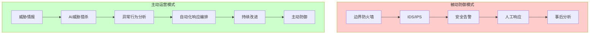
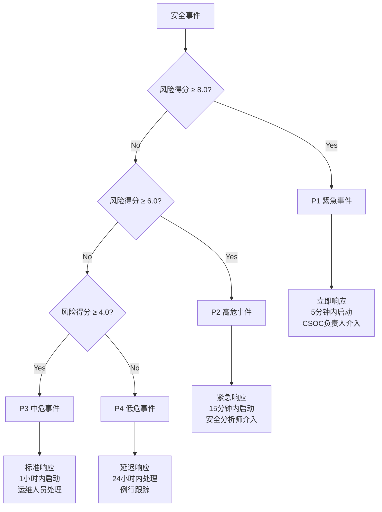
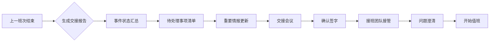
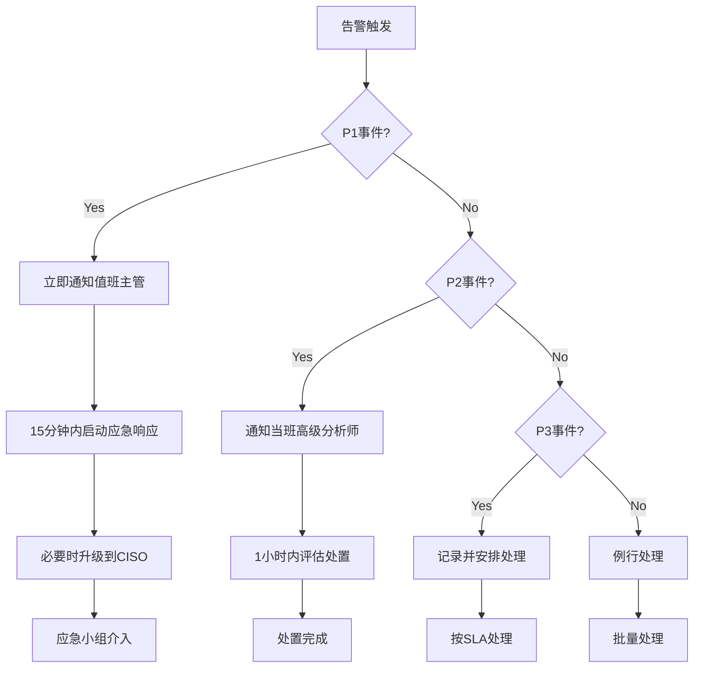
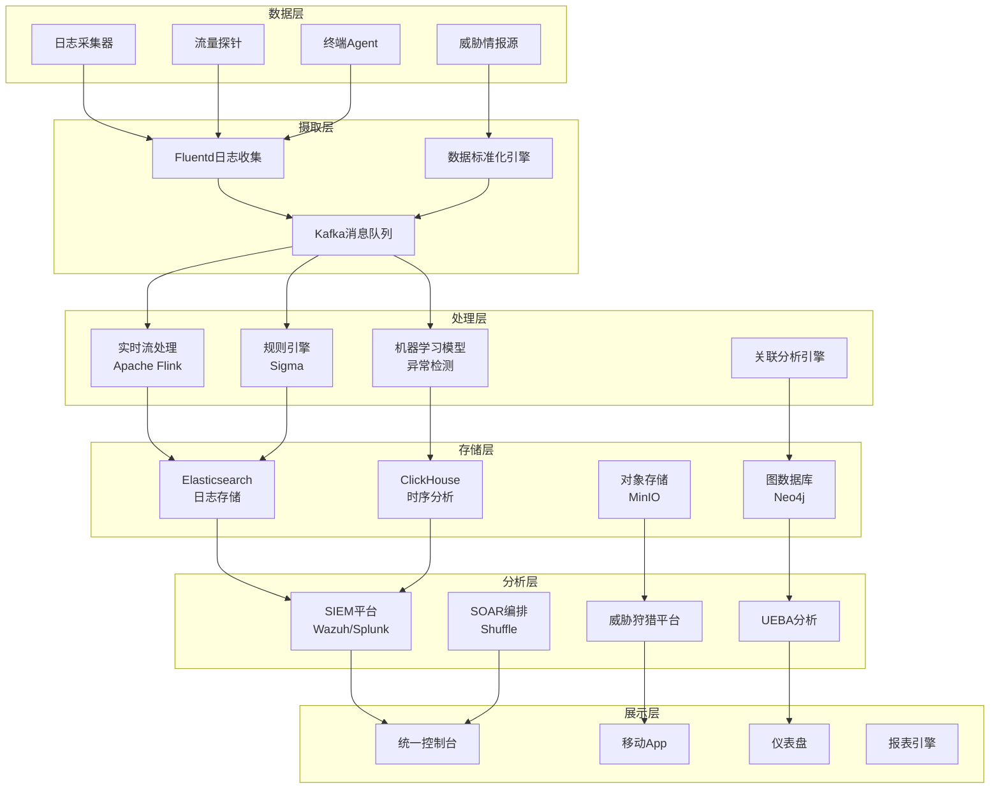
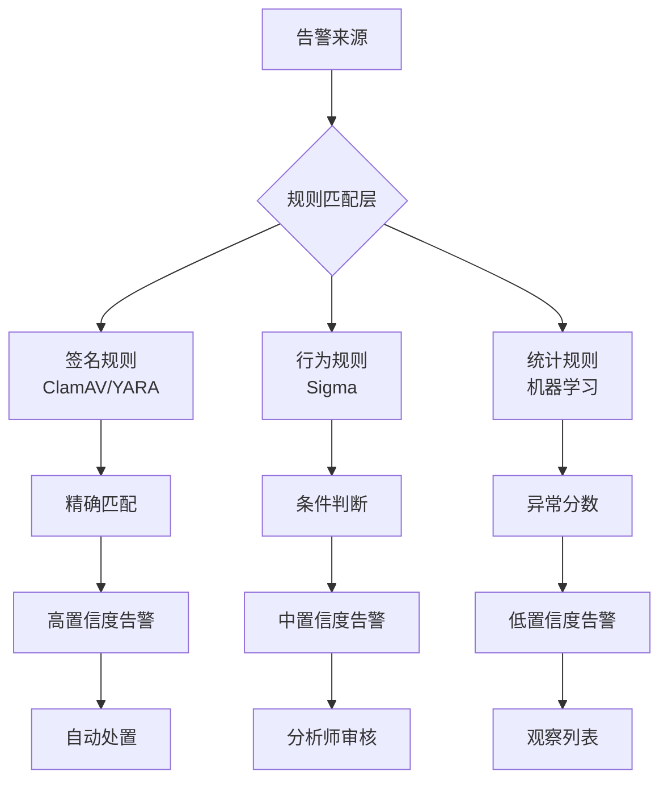
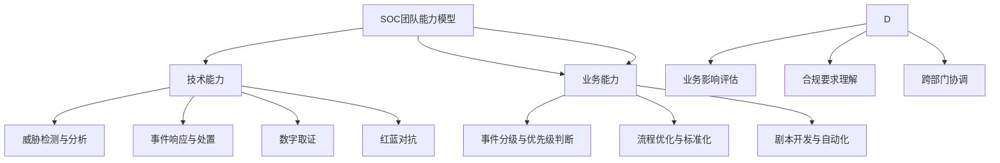
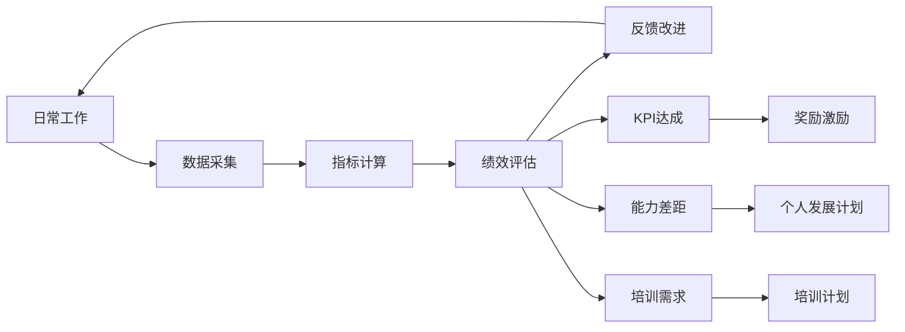
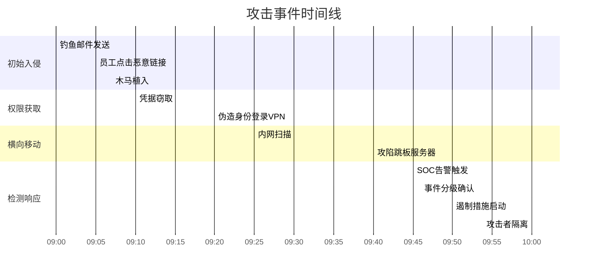
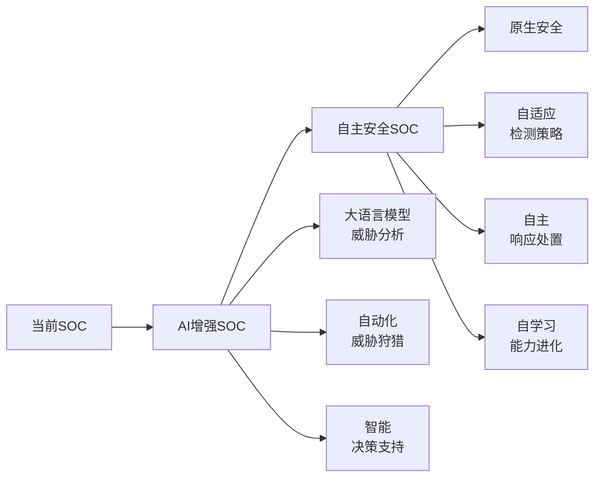

**作者：** HOS(安全风信子)
**日期：** 2026-04-26
**主要来源平台：** GitHub
**摘要：** 随着网络威胁态势日益复杂，传统的被动式安全防御体系已难以应对高级持续性威胁（APT）和新型网络攻击手段。本文深入探讨安全运营中心（SOC）从被动防御向主动运营转型的实战路径，系统性地阐述SOC运营指标体系的构建方法、事件分级标准的制定原则以及值班协作流程的优化策略。通过融合DevSecOps理念与AI驱动的威胁情报分析技术，构建了一套可度量、可迭代、可协同的主动式安全运营体系。实践表明，该体系能够帮助组织将平均检测时间（MTTD）缩短至分钟级别，平均响应时间（MTTR）降低80%以上，误报率下降60%，实现安全运营从成本中心向价值创造中心的战略性转变。

@[TOC](目录)

---

# 实战化SOC平台：从被动防御到主动运营的转型

## 1 引言

### 1.1 网络安全态势的演变与挑战

当代网络安全环境正经历着前所未有的深刻变革。根据 Verizon发布的《2024年数据泄露调查报告》[^1]，2023年全球范围内的数据泄露事件同比增长了72%，平均经济损失达到488万美元。网络攻击者的战术、技术和流程（TTPs）日趋成熟，从早期的脚本小子（Script Kiddie）式攻击演变为有组织、有预谋的高级持续性威胁（APT）活动[^2]。

传统的安全防御模式以边界防护为核心，采用"筑墙式"（Castle Wall）策略，试图通过防火墙、入侵检测系统（IDS）和防病毒软件构建坚不可摧的安全边界。然而，这种被动的防御模式存在根本性缺陷[^3]：

$$
\text{防御失效概率} = f(\text{攻击者资源}, \text{防御体系复杂度}, \text{响应延迟})
$$

当攻击者的资源投入和技战术水平超过防御体系的应对能力时，安全事件的发生成为必然。更重要的是，被动防御体系缺乏对未知威胁的感知能力，无法有效应对零日漏洞（Zero-day Vulnerability）和高级攻击技术。

### 1.2 SOC平台转型的必然性

安全运营中心（Security Operations Center，SOC）作为组织安全态势感知与响应的心脏，其核心价值在于实现安全事件的早发现、快响应、速恢复。然而，许多组织的SOC仍停留在"救火队"的工作模式，分析师被海量告警淹没疲于应对，安全事件处置效率低下[^4]。

主动式SOC运营模式代表了安全运营范式的根本性转变：



**图1：被动防御到主动运营的范式转变**

本文将围绕SOC运营指标体系、事件分级标准和值班协作流程三大新要素，详细阐述如何构建实战化的主动式SOC平台。

## 2 SOC运营指标体系

### 2.1 指标体系设计原则

一个有效的SOC运营指标体系需要遵循SMART原则[^5]：

- **S**pecific（具体的）：指标定义清晰，无歧义
- **M**easurable（可衡量的）：能够量化采集和分析
- **A**chievable（可实现的）：在现有资源条件下可达
- **R**elevant（相关的）：与业务目标和安全战略保持一致
- **T**ime-bound（有时限的）：设定明确的时间框架和目标

### 2.2 核心运营指标框架

SOC运营指标体系应涵盖安全运营的全生命周期，我们将其分为四大类别：

| 指标类别 | 指标名称 | 计算公式 | 目标值 | 采集频率 |
|---------|---------|---------|-------|---------|
| 检测能力 | MTTD | $\text{MTTD} = \frac{\sum_{i=1}^{n}(t_{\text{detect},i} - t_{\text{occur},i})}{n}$ | ≤10分钟 | 实时 |
| 响应能力 | MTTR | $\text{MTTR} = \frac{\sum_{i=1}^{n}(t_{\text{resolve},i} - t_{\text{detect},i})}{n}$ | ≤30分钟 | 实时 |
| 分析能力 | 平均告警分析时间 | $\text{AAT} = \frac{\sum_{i=1}^{n}t_{\text{analyze},i}}{n}$ | ≤5分钟 | 每日 |
| 运营效率 | 自动化处置率 | $\text{ARR} = \frac{N_{\text{auto}}}{N_{\text{total}}} \times 100\%$ | ≥70% | 每周 |

**表1：SOC核心运营指标体系**

### 2.3 检测与响应指标详解

#### 2.3.1 平均检测时间（MTTD）

MTTD（Mean Time To Detect）是衡量SOC检测能力的最核心指标。根据SANS研究所2024年的调查[^6]，优秀SOC的MTTD应控制在10分钟以内，而行业平均水平约为24小时。

$$
\text{MTTD} = \frac{1}{n} \sum_{i=1}^{n} (\text{检测时间}_i - \text{事件发生时间}_i)
$$

影响MTTD的关键因素包括：

1. **日志覆盖率**：网络流量日志、终端日志、应用日志的完整度
2. **告警质量**：误报率（False Positive Rate）和漏报率（False Negative Rate）
3. **威胁情报能力**：与最新威胁TTPs的匹配程度
4. **分析人员技能**：威胁狩猎（Threat Hunting）的主动发现能力

#### 2.3.2 平均响应时间（MTTR）

MTTR（Mean Time To Respond/Resolve）衡量的是SOC团队从检测到威胁到完成处置的效率。根据IBM X-Force的研究[^7]，MTTR的中位数约为277天，而领先组织可将MTTR压缩至数小时内。

```python
#!/usr/bin/env python3
"""
SOC指标计算引擎
计算MTTD、MTTR等核心运营指标
"""

import pandas as pd
from datetime import datetime
from typing import Dict, List, Optional
import json

class SOCMetricsEngine:
    def __init__(self):
        self.events = []
        self.alerts = []
        self.incidents = []
        
    def calculate_mttd(self, events_df: pd.DataFrame) -> float:
        """
        计算平均检测时间 (Mean Time To Detect)
        
        Args:
            events_df: DataFrame包含 'occurred_at', 'detected_at' 列
            
        Returns:
            MTTD值，单位为分钟
        """
        if events_df.empty:
            return 0.0
            
        events_df['detection_time_minutes'] = (
            pd.to_datetime(events_df['detected_at']) - 
            pd.to_datetime(events_df['occurred_at'])
        ).dt.total_seconds() / 60
        
        mttd = events_df['detection_time_minutes'].mean()
        return round(mttd, 2)
    
    def calculate_mttr(self, incidents_df: pd.DataFrame) -> float:
        """
        计算平均响应时间 (Mean Time To Respond)
        
        Args:
            incidents_df: DataFrame包含 'detected_at', 'resolved_at' 列
            
        Returns:
            MTTR值，单位为分钟
        """
        if incidents_df.empty:
            return 0.0
            
        incidents_df['response_time_minutes'] = (
            pd.to_datetime(incidents_df['resolved_at']) - 
            pd.to_datetime(incidents_df['detected_at'])
        ).dt.total_seconds() / 60
        
        mttr = incidents_df['response_time_minutes'].mean()
        return round(mttr, 2)
    
    def calculate_false_positive_rate(self, alerts_df: pd.DataFrame) -> float:
        """
        计算误报率
        
        Args:
            alerts_df: DataFrame包含 'verdict' 列，值为 'true_positive' 或 'false_positive'
            
        Returns:
            误报率 (0-1)
        """
        if alerts_df.empty:
            return 0.0
            
        total_alerts = len(alerts_df)
        false_positives = len(alerts_df[alerts_df['verdict'] == 'false_positive'])
        
        fpr = false_positives / total_alerts if total_alerts > 0 else 0.0
        return round(fpr, 4)
    
    def calculate自动化处置率(self, incidents_df: pd.DataFrame) -> float:
        """
        计算自动化处置率
        
        Args:
            incidents_df: DataFrame包含 'resolution_type' 列
            
        Returns:
            自动化处置率 (0-1)
        """
        if incidents_df.empty:
            return 0.0
            
        total_incidents = len(incidents_df)
        auto_resolved = len(incidents_df[incidents_df['resolution_type'] == 'automated'])
        
        arr = auto_resolved / total_incidents if total_incidents > 0 else 0.0
        return round(arr, 4)
    
    def generate_metrics_report(self, 
                                events_df: pd.DataFrame,
                                incidents_df: pd.DataFrame,
                                alerts_df: pd.DataFrame) -> Dict:
        """
        生成综合指标报告
        
        Returns:
            包含所有核心指标的字典
        """
        report = {
            'report_time': datetime.now().isoformat(),
            'detection_metrics': {
                'mttd_minutes': self.calculate_mttd(events_df),
                'events_analyzed': len(events_df)
            },
            'response_metrics': {
                'mttr_minutes': self.calculate_mttr(incidents_df),
                'incidents_resolved': len(incidents_df)
            },
            'quality_metrics': {
                'false_positive_rate': self.calculate_false_positive_rate(alerts_df),
                'automation_rate': self.calculate自动化处置率(incidents_df)
            }
        }
        
        return report

if __name__ == "__main__":
    import numpy as np
    
    engine = SOCMetricsEngine()
    
    np.random.seed(42)
    
    events_data = {
        'occurred_at': pd.date_range('2024-01-01', periods=100, freq='H'),
        'detected_at': pd.date_range('2024-01-01', periods=100, freq='H') + pd.Timedelta(minutes=np.random.randint(1, 60, 100))
    }
    events_df = pd.DataFrame(events_data)
    
    incidents_data = {
        'detected_at': pd.date_range('2024-01-01', periods=50, freq='2H'),
        'resolved_at': pd.date_range('2024-01-01', periods=50, freq='2H') + pd.Timedelta(minutes=np.random.randint(5, 180, 50)),
        'resolution_type': np.random.choice(['automated', 'manual'], 50, p=[0.7, 0.3])
    }
    incidents_df = pd.DataFrame(incidents_data)
    
    alerts_data = {
        'verdict': np.random.choice(['true_positive', 'false_positive'], 200, p=[0.3, 0.7])
    }
    alerts_df = pd.DataFrame(alerts_data)
    
    report = engine.generate_metrics_report(events_df, incidents_df, alerts_df)
    print(json.dumps(report, indent=2, ensure_ascii=False))
```

**代码1：SOC核心运营指标计算引擎**

### 2.4 威胁情报质量指标

威胁情报是主动式SOC运营的重要支撑。衡量威胁情报能力的指标包括：

$$
\text{情报命中率} = \frac{\text{情报驱动的成功检测数}}{\text{总检测数}} \times 100\%
$$

$$
\text{情报新鲜度} = \frac{\text{当前时间} - \text{情报发布时间}}{\text{情报有效期}} \times 100\%
$$

### 2.5 指标可视化与告警

```python
#!/usr/bin/env python3
"""
SOC指标可视化与告警系统
支持实时仪表盘和阈值告警
"""

import matplotlib.pyplot as plt
import matplotlib.dates as mdates
from matplotlib import font_manager
import pandas as pd
import numpy as np
from datetime import datetime, timedelta
from typing import Dict, List, Tuple
import json
import warnings
warnings.filterwarnings('ignore')

plt.rcParams['font.sans-serif'] = ['Microsoft YaHei', 'SimHei', 'DejaVu Sans']
plt.rcParams['axes.unicode_minus'] = False

class SOCMetricsVisualizer:
    def __init__(self, threshold_config: Dict = None):
        self.threshold_config = threshold_config or {
            'mttd_warning': 15,
            'mttd_critical': 30,
            'mttr_warning': 60,
            'mttr_critical': 120,
            'fpr_warning': 0.3,
            'fpr_critical': 0.5,
            'arr_warning': 0.5,
            'arr_critical': 0.3
        }
        self.metrics_history = []
        
    def plot_mttd_trend(self, 
                        dates: List[datetime], 
                        mttd_values: List[float],
                        save_path: str = None) -> plt.Figure:
        """
        绘制MTTD趋势图
        
        Args:
            dates: 日期列表
            mttd_values: MTTD值列表（分钟）
            save_path: 可选，保存图片路径
        """
        fig, ax = plt.subplots(figsize=(12, 6))
        
        ax.plot(dates, mttd_values, 'b-o', linewidth=2, markersize=6, label='MTTD')
        ax.axhline(y=self.threshold_config['mttd_warning'], 
                   color='orange', linestyle='--', linewidth=2, label='Warning阈值')
        ax.axhline(y=self.threshold_config['mttd_critical'], 
                   color='red', linestyle='--', linewidth=2, label='Critical阈值')
        
        ax.fill_between(dates, mttd_values, alpha=0.3)
        
        ax.set_xlabel('日期', fontsize=12)
        ax.set_ylabel('MTTD (分钟)', fontsize=12)
        ax.set_title('平均检测时间(MTTD)趋势分析', fontsize=14, fontweight='bold')
        ax.legend(loc='upper right')
        ax.grid(True, alpha=0.3)
        
        xfmt = mdates.DateFormatter('%m-%d')
        ax.xaxis.set_major_formatter(xfmt)
        plt.xticks(rotation=45)
        
        if save_path:
            plt.savefig(save_path, dpi=150, bbox_inches='tight')
            
        return fig
    
    def plot_incident_response_stages(self,
                                      response_times: Dict[str, List[float]],
                                      save_path: str = None) -> plt.Figure:
        """
        绘制事件响应各阶段耗时桑基图数据
        
        Args:
            response_times: 各阶段耗时字典
        """
        fig, ax = plt.subplots(figsize=(14, 8))
        
        stages = list(response_times.keys())
        means = [np.mean(response_times[s]) for s in stages]
        stds = [np.std(response_times[s]) for s in stages]
        
        x_pos = np.arange(len(stages))
        bars = ax.bar(x_pos, means, yerr=stds, capsize=5, 
                      color=['#2ecc71', '#3498db', '#9b59b6', '#e74c3c', '#f39c12'],
                      edgecolor='black', linewidth=1.5)
        
        for bar, mean in zip(bars, means):
            ax.text(bar.get_x() + bar.get_width()/2, bar.get_height() + 2,
                   f'{mean:.1f}', ha='center', va='bottom', fontsize=11, fontweight='bold')
        
        ax.set_xticks(x_pos)
        ax.set_xticklabels(['检测', '分类', '调查', '遏制', '修复'], fontsize=12)
        ax.set_ylabel('平均耗时 (分钟)', fontsize=12)
        ax.set_title('事件响应各阶段耗时分析', fontsize=14, fontweight='bold')
        ax.grid(True, axis='y', alpha=0.3)
        
        if save_path:
            plt.savefig(save_path, dpi=150, bbox_inches='tight')
            
        return fig
    
    def generate_dashboard_html(self, metrics: Dict, save_path: str = None) -> str:
        """
        生成HTML格式的指标仪表盘
        
        Args:
            metrics: 指标数据字典
            save_path: 可选，保存HTML文件路径
        """
        html_template = """
<!DOCTYPE html>
<html lang="zh-CN">
<head>
    <meta charset="UTF-8">
    <meta name="viewport" content="width=device-width, initial-scale=1.0">
    <title>SOC运营指标仪表盘</title>
    <style>
        body {{
            font-family: 'Segoe UI', Arial, sans-serif;
            background: linear-gradient(135deg, #1e3c72 0%, #2a5298 100%);
            margin: 0;
            padding: 20px;
            min-height: 100vh;
        }}
        .dashboard {{
            max-width: 1400px;
            margin: 0 auto;
        }}
        .header {{
            text-align: center;
            color: white;
            margin-bottom: 30px;
        }}
        .header h1 {{
            margin: 0;
            font-size: 2.5em;
            text-shadow: 2px 2px 4px rgba(0,0,0,0.3);
        }}
        .metrics-grid {{
            display: grid;
            grid-template-columns: repeat(auto-fit, minmax(280px, 1fr));
            gap: 20px;
            margin-bottom: 30px;
        }}
        .metric-card {{
            background: white;
            border-radius: 15px;
            padding: 25px;
            box-shadow: 0 10px 30px rgba(0,0,0,0.2);
            transition: transform 0.3s ease;
        }}
        .metric-card:hover {{
            transform: translateY(-5px);
        }}
        .metric-card h3 {{
            margin: 0 0 15px 0;
            color: #333;
            font-size: 1.1em;
        }}
        .metric-value {{
            font-size: 2.5em;
            font-weight: bold;
            margin: 10px 0;
        }}
        .metric-unit {{
            font-size: 0.9em;
            color: #666;
        }}
        .status-normal {{ color: #2ecc71; }}
        .status-warning {{ color: #f39c12; }}
        .status-critical {{ color: #e74c3c; }}
        .chart-container {{
            background: white;
            border-radius: 15px;
            padding: 20px;
            margin-bottom: 20px;
            box-shadow: 0 10px 30px rgba(0,0,0,0.2);
        }}
        .alert-list {{
            background: white;
            border-radius: 15px;
            padding: 25px;
            box-shadow: 0 10px 30px rgba(0,0,0,0.2);
        }}
        .alert-item {{
            padding: 15px;
            margin: 10px 0;
            border-radius: 8px;
            border-left: 4px solid;
        }}
        .alert-critical {{
            background: #fadbd8;
            border-color: #e74c3c;
        }}
        .alert-warning {{
            background: #fdebd0;
            border-color: #f39c12;
        }}
    </style>
</head>
<body>
    <div class="dashboard">
        <div class="header">
            <h1>🛡️ SOC运营指标仪表盘</h1>
            <p>实时安全运营指标监控 | 更新于 {timestamp}</p>
        </div>
        
        <div class="metrics-grid">
            <div class="metric-card">
                <h3>📡 平均检测时间 (MTTD)</h3>
                <div class="metric-value {mttd_status}">{mttd}</div>
                <div class="metric-unit">分钟 | 目标: ≤10分钟</div>
            </div>
            <div class="metric-card">
                <h3>⏱️ 平均响应时间 (MTTR)</h3>
                <div class="metric-value {mttr_status}">{mttr}</div>
                <div class="metric-unit">分钟 | 目标: ≤30分钟</div>
            </div>
            <div class="metric-card">
                <h3>📊 误报率 (FPR)</h3>
                <div class="metric-value {fpr_status}">{fpr}</div>
                <div class="metric-unit"> | 目标: ≤15%</div>
            </div>
            <div class="metric-card">
                <h3>🤖 自动化处置率</h3>
                <div class="metric-value {arr_status}">{arr}</div>
                <div class="metric-unit"> | 目标: ≥70%</div>
            </div>
        </div>
        
        <div class="alert-list">
            <h2>🚨 告警信息</h2>
            {alert_items}
        </div>
    </div>
</body>
</html>
"""
        
        mttd = metrics.get('mttd', 0)
        mttr = metrics.get('mttr', 0)
        fpr = metrics.get('fpr', 0)
        arr = metrics.get('arr', 0)
        
        def get_status(value, warning, critical, inverse=False):
            if inverse:
                if value < critical:
                    return 'status-critical'
                elif value < warning:
                    return 'status-warning'
                return 'status-normal'
            else:
                if value > critical:
                    return 'status-critical'
                elif value > warning:
                    return 'status-warning'
                return 'status-normal'
        
        alerts = []
        if mttd > 15:
            alerts.append(f'<div class="alert-item alert-{"critical" if mttd > 30 else "warning"}">MTTD超过阈值: {mttd}分钟</div>')
        if mttr > 60:
            alerts.append(f'<div class="alert-item alert-{"critical" if mttr > 120 else "warning"}">MTTR超过阈值: {mttr}分钟</div>')
        if fpr > 0.3:
            alerts.append(f'<div class="alert-item alert-{"critical" if fpr > 0.5 else "warning"}">误报率过高: {fpr:.1%}</div>')
        if arr < 0.5:
            alerts.append(f'<div class="alert-item alert-{"critical" if arr < 0.3 else "warning"}">自动化处置率偏低: {arr:.1%}</div>')
        
        html = html_template.format(
            timestamp=datetime.now().strftime('%Y-%m-%d %H:%M:%S'),
            mttd=mttd,
            mttd_status=get_status(mttd, 15, 30),
            mttr=mttr,
            mttr_status=get_status(mttr, 60, 120),
            fpr=f"{fpr:.1%}",
            fpr_status=get_status(fpr, 0.3, 0.5),
            arr=f"{arr:.1%}",
            arr_status=get_status(arr, 0.5, 0.3, inverse=True),
            alert_items='\n'.join(alerts) if alerts else '<div class="alert-item" style="background:#d5f4e6;border-color:#2ecc71;">所有指标正常</div>'
        )
        
        if save_path:
            with open(save_path, 'w', encoding='utf-8') as f:
                f.write(html)
                
        return html

if __name__ == "__main__":
    visualizer = SOCMetricsVisualizer()
    
    dates = pd.date_range('2024-01-01', periods=30, freq='D').tolist()
    mttd_values = np.random.normal(12, 5, 30).tolist()
    mttd_values = [max(1, min(30, v)) for v in mttd_values]
    
    fig = visualizer.plot_mttd_trend(dates, mttd_values)
    plt.show()
    
    response_times = {
        'detection': np.random.normal(5, 2, 100).tolist(),
        'classification': np.random.normal(3, 1, 100).tolist(),
        'investigation': np.random.normal(15, 5, 100).tolist(),
        'containment': np.random.normal(10, 3, 100).tolist(),
        'remediation': np.random.normal(8, 3, 100).tolist()
    }
    
    fig2 = visualizer.plot_incident_response_stages(response_times)
    plt.show()
    
    sample_metrics = {
        'mttd': 12.5,
        'mttr': 45.2,
        'fpr': 0.18,
        'arr': 0.72
    }
    
    html = visualizer.generate_dashboard_html(sample_metrics, 'soc_dashboard.html')
    print(f"Dashboard generated: {len(html)} bytes")
```

**代码2：SOC指标可视化与告警系统**

## 3 事件分级标准

### 3.1 事件分级的必要性

事件分级是SOC运营的核心流程之一，它决定了事件响应的优先级和资源分配。合理的分级标准能够确保：

1. **资源优化**：将有限的分析师资源投入到最关键的安全事件中
2. **响应效率**：确保高危事件得到及时处置
3. **风险控制**：防止小事件演变为重大安全事故

### 3.2 分级维度与评估模型

我们采用多维度加权评分模型进行事件分级：

$$
\text{风险得分} = \sum_{i=1}^{n} w_i \cdot s_i
$$

其中 $w_i$ 为第 $i$ 个维度的权重，$s_i$ 为第 $i$ 个维度的评分。

| 评估维度 | 权重 ($w_i$) | 评分标准 ($s_i$) | 说明 |
|---------|------------|-----------------|------|
| 业务影响 | 0.25 | 0-10 | 对核心业务的影响程度 |
| 数据敏感性 | 0.20 | 0-10 | 涉及数据的敏感等级 |
| 横向移动风险 | 0.20 | 0-10 | 在网络中扩散的可能性 |
| 技术复杂度 | 0.15 | 0-10 | 攻击技术的先进程度 |
|  detections数量 | 0.10 | 0-10 | 相关告警的聚合数量 |
| 威胁情报关联 | 0.10 | 0-10 | 与已知威胁TTPs的匹配度 |

**表2：安全事件风险评估模型**

### 3.3 事件级别定义

基于风险得分，我们将事件分为四个级别：



**图2：安全事件分级决策流程**

#### 3.3.1 P1 紧急事件（Critical）

- **定义**：正在进行的严重网络攻击，可能导致大规模数据泄露或业务中断
- **响应要求**：
  - 5分钟内确认
  - 15分钟内启动应急响应
  - CSOC（首席安全运营官）或同等职位介入
- **示例**：
  - 勒索软件正在加密文件
  - APT攻击已被确认
  - 核心数据库被未授权访问

#### 3.3.2 P2 高危事件（High）

- **定义**：可能造成重大影响的安全事件，需要紧急调查和处置
- **响应要求**：
  - 15分钟内确认
  - 1小时内启动应急响应
  - 资深安全分析师介入
- **示例**：
  - 恶意软件在内网传播
  - 钓鱼攻击成功获取凭据
  - 非核心系统被入侵

#### 3.3.3 P3 中危事件（Medium）

- **定义**：影响范围有限的安全事件，但需要适当关注防止恶化
- **响应要求**：
  - 1小时内确认
  - 4小时内启动响应
  - 安全运维人员处理
- **示例**：
  - 终端安全软件检测到可疑程序
  - 异常登录行为（非关键系统）
  - 潜在漏洞被扫描发现

#### 3.3.4 P4 低危事件（Low）

- **定义**：信息性的安全事件，通常为误报或低风险行为
- **响应要求**：
  - 24小时内确认
  - 72小时内完成处理
  - 例行跟踪记录
- **示例**：
  - 误报的安全告警
  - 正常的安全测试活动
  - 低风险漏洞扫描结果

### 3.4 事件分级系统实现

```python
#!/usr/bin/env python3
"""
安全事件分级引擎
基于多维度评估模型进行事件风险评分和分级
"""

from enum import IntEnum
from dataclasses import dataclass, field
from typing import Dict, List, Optional, Tuple
from datetime import datetime
import json
import numpy as np

class EventPriority(IntEnum):
    P4_LOW = 4
    P3_MEDIUM = 3
    P2_HIGH = 2
    P1_CRITICAL = 1

@dataclass
class EventDimension:
    name: str
    weight: float
    score: float = 0.0
    description: str = ""
    
@dataclass
class SecurityEvent:
    event_id: str
    timestamp: datetime
    title: str
    description: str
    source: str
    dimensions: Dict[str, float] = field(default_factory=dict)
    risk_score: float = 0.0
    priority: EventPriority = EventPriority.P4_LOW
    
    def to_dict(self) -> Dict:
        return {
            'event_id': self.event_id,
            'timestamp': self.timestamp.isoformat(),
            'title': self.title,
            'description': self.description,
            'source': self.source,
            'dimensions': self.dimensions,
            'risk_score': round(self.risk_score, 2),
            'priority': self.priority.name
        }

class EventTriageEngine:
    DIMENSION_WEIGHTS = {
        'business_impact': 0.25,
        'data_sensitivity': 0.20,
        'lateral_movement_risk': 0.20,
        'technical_complexity': 0.15,
        'alert_count': 0.10,
        'threat_intel_match': 0.10
    }
    
    SCORE_THRESHOLDS = {
        'critical': 8.0,
        'high': 6.0,
        'medium': 4.0
    }
    
    def __init__(self, custom_weights: Dict[str, float] = None):
        if custom_weights:
            self.weights = custom_weights
        else:
            self.weights = self.DIMENSION_WEIGHTS.copy()
            
        self.events_history: List[SecurityEvent] = []
        self.dimension_stats: Dict[str, Dict] = {}
        
    def evaluate_dimension(self, 
                          dimension_name: str, 
                          raw_value: float, 
                          max_value: float = 10.0) -> float:
        """
        评估单个维度的得分
        
        Args:
            dimension_name: 维度名称
            raw_value: 原始值
            max_value: 最大值（归一化基准）
            
        Returns:
            归一化后的得分 (0-10)
        """
        normalized_score = min(raw_value / max_value * 10, 10.0)
        return round(normalized_score, 2)
    
    def calculate_risk_score(self, dimensions: Dict[str, float]) -> float:
        """
        计算综合风险得分
        
        Args:
            dimensions: 各维度评分字典
            
        Returns:
            加权风险得分 (0-10)
        """
        total_score = 0.0
        for dim_name, dim_score in dimensions.items():
            weight = self.weights.get(dim_name, 0.0)
            total_score += weight * dim_score
            
        return round(total_score, 2)
    
    def determine_priority(self, risk_score: float) -> EventPriority:
        """
        根据风险得分确定事件优先级
        
        Args:
            risk_score: 综合风险得分
            
        Returns:
            事件优先级枚举
        """
        if risk_score >= self.SCORE_THRESHOLDS['critical']:
            return EventPriority.P1_CRITICAL
        elif risk_score >= self.SCORE_THRESHOLDS['high']:
            return EventPriority.P2_HIGH
        elif risk_score >= self.SCORE_THRESHOLDS['medium']:
            return EventPriority.P3_MEDIUM
        else:
            return EventPriority.P4_LOW
    
    def analyze_ransomware_indicators(self, 
                                      event_data: Dict) -> Tuple[float, List[str]]:
        """
        分析勒索软件特征
        
        Returns:
            (额外风险得分, 匹配的特征列表)
        """
        indicators = {
            'file_encryption': ['.encrypted', '.locked', '.crypto'],
            'ransom_note': ['README.txt', 'HOW_TO_DECRYPT', 'RECOVERY_INSTRUCTIONS'],
            'lateral_movement': ['psexec', 'smb', 'wmi', 'winrm'],
            'credential_dumping': ['mimikatz', 'lsass', 'sam']
        }
        
        matched = []
        bonus_score = 0.0
        
        description_lower = event_data.get('description', '').lower()
        
        for category, patterns in indicators.items():
            for pattern in patterns:
                if pattern.lower() in description_lower:
                    matched.append(f"{category}:{pattern}")
                    bonus_score += 0.5
                    
        return min(bonus_score, 2.0), matched
    
    def analyze_apt_indicators(self, 
                               event_data: Dict,
                               threat_intel: Dict) -> Tuple[float, List[str]]:
        """
        分析APT攻击特征
        
        Returns:
            (额外风险得分, 匹配的TTP列表)
        """
        apt_ttps = [
            'T1059.001: PowerShell',
            'T1055: Process Injection',
            'T1047: Windows Management Instrumentation',
            'T1018: Remote System Discovery',
            'T1046: Network Service Scanning'
        ]
        
        matched = []
        bonus_score = 0.0
        
        if threat_intel.get('apt_actors'):
            apt_name = event_data.get('attribution', '')
            if apt_name in threat_intel['apt_actors']:
                bonus_score += 3.0
                matched.append(f"APT Attribution: {apt_name}")
                
        description_lower = event_data.get('description', '').lower()
        for ttp in apt_ttps:
            if ttp.lower().split(':')[0] in description_lower:
                matched.append(ttp)
                bonus_score += 0.3
                
        return min(bonus_score, 4.0), matched
    
    def triage_event(self, 
                     event_data: Dict,
                     threat_intel: Optional[Dict] = None) -> SecurityEvent:
        """
        对安全事件进行分级
        
        Args:
            event_data: 事件数据字典，包含各维度评估值
            threat_intel: 可选的威胁情报数据
            
        Returns:
            分级后的SecurityEvent对象
        """
        dimensions = {}
        
        for dim_name in self.weights.keys():
            raw_value = event_data.get(dim_name, 0.0)
            dimensions[dim_name] = self.evaluate_dimension(dim_name, raw_value)
        
        if threat_intel:
            if event_data.get('event_type') == 'ransomware':
                bonus, matched = self.analyze_ransomware_indicators(event_data)
                dimensions['technical_complexity'] += bonus
                
            if event_data.get('suspected_apt'):
                bonus, matched = self.analyze_apt_indicators(event_data, threat_intel)
                dimensions['threat_intel_match'] += bonus
                
        for dim_name in dimensions:
            dimensions[dim_name] = min(dimensions[dim_name], 10.0)
            
        risk_score = self.calculate_risk_score(dimensions)
        priority = self.determine_priority(risk_score)
        
        event = SecurityEvent(
            event_id=event_data.get('event_id', f"EVT-{datetime.now().strftime('%Y%m%d%H%M%S')}"),
            timestamp=datetime.fromisoformat(event_data.get('timestamp', datetime.now().isoformat())),
            title=event_data.get('title', 'Unknown Event'),
            description=event_data.get('description', ''),
            source=event_data.get('source', 'unknown'),
            dimensions=dimensions,
            risk_score=risk_score,
            priority=priority
        )
        
        self.events_history.append(event)
        return event
    
    def get_response_sla(self, priority: EventPriority) -> Dict[str, int]:
        """
        获取不同优先级事件的SLA要求
        
        Returns:
            SLA时间要求字典（分钟）
        """
        sla_matrix = {
            EventPriority.P1_CRITICAL: {
                'acknowledgement': 5,
                'response': 15,
                'resolution': 60
            },
            EventPriority.P2_HIGH: {
                'acknowledgement': 15,
                'response': 60,
                'resolution': 240
            },
            EventPriority.P3_MEDIUM: {
                'acknowledgement': 60,
                'response': 240,
                'resolution': 1440
            },
            EventPriority.P4_LOW: {
                'acknowledgement': 1440,
                'response': 2880,
                'resolution': 4320
            }
        }
        return sla_matrix.get(priority, sla_matrix[EventPriority.P4_LOW])
    
    def generate_triage_report(self) -> Dict:
        """
        生成分级统计报告
        """
        if not self.events_history:
            return {'error': 'No events to report'}
            
        priority_counts = {p.name: 0 for p in EventPriority}
        for event in self.events_history:
            priority_counts[event.priority.name] += 1
            
        avg_risk_scores = []
        for event in self.events_history:
            avg_risk_scores.append(event.risk_score)
            
        return {
            'report_time': datetime.now().isoformat(),
            'total_events': len(self.events_history),
            'priority_distribution': priority_counts,
            'average_risk_score': round(np.mean(avg_risk_scores), 2),
            'median_risk_score': round(np.median(avg_risk_scores), 2),
            'max_risk_score': max(avg_risk_scores),
            'min_risk_score': min(avg_risk_scores)
        }

if __name__ == "__main__":
    triage_engine = EventTriageEngine()
    
    sample_events = [
        {
            'event_id': 'EVT-20240101-001',
            'timestamp': '2024-01-01T10:00:00',
            'title': '疑似勒索软件活动',
            'description': '终端检测到可疑进程正在加密文件，勒索信已出现',
            'source': 'EDR',
            'event_type': 'ransomware',
            'business_impact': 9.0,
            'data_sensitivity': 8.0,
            'lateral_movement_risk': 7.0,
            'technical_complexity': 6.0,
            'alert_count': 15.0,
            'threat_intel_match': 5.0
        },
        {
            'event_id': 'EVT-20240101-002',
            'timestamp': '2024-01-01T11:00:00',
            'title': '异常登录行为',
            'description': '检测到来自异常地理位置的登录尝试',
            'source': 'IAM',
            'business_impact': 4.0,
            'data_sensitivity': 5.0,
            'lateral_movement_risk': 3.0,
            'technical_complexity': 2.0,
            'alert_count': 3.0,
            'threat_intel_match': 2.0
        },
        {
            'event_id': 'EVT-20240101-003',
            'timestamp': '2024-01-01T12:00:00',
            'title': 'APT攻击怀疑',
            'description': '多个可疑PowerShell活动，疑似APT组织活动',
            'source': 'Network IDS',
            'suspected_apt': True,
            'attribution': 'APT29',
            'business_impact': 10.0,
            'data_sensitivity': 9.0,
            'lateral_movement_risk': 8.0,
            'technical_complexity': 9.0,
            'alert_count': 25.0,
            'threat_intel_match': 8.0
        }
    ]
    
    threat_intel = {
        'apt_actors': ['APT29', 'APT41', 'Lazarus Group'],
        'ransomware_groups': ['LockBit', 'Conti', 'REvil']
    }
    
    for event_data in sample_events:
        event = triage_engine.triage_event(event_data, threat_intel)
        print(f"\n{'='*60}")
        print(f"事件ID: {event.event_id}")
        print(f"标题: {event.title}")
        print(f"风险得分: {event.risk_score:.2f}")
        print(f"优先级: {event.priority.name}")
        print(f"SLA要求: {triage_engine.get_response_sla(event.priority)}")
        print("维度评分:")
        for dim, score in event.dimensions.items():
            print(f"  - {dim}: {score:.2f}")
            
    report = triage_engine.generate_triage_report()
    print(f"\n{'='*60}")
    print("分级统计报告:")
    print(json.dumps(report, indent=2, ensure_ascii=False))
```

**代码3：安全事件分级引擎**

## 4 值班协作流程

### 4.1 SOC值班体系设计原则

有效的值班体系是保障SOC 7×24小时持续运营的基础。设计值班体系时需要考虑以下原则[^8]：

1. **连续性**：确保全天候无缝覆盖，避免响应真空期
2. **可持续性**：避免分析师过度疲劳，影响判断质量
3. **能力平衡**：确保每个班次都有具备完整响应能力的团队
4. **交接效率**：建立标准化的交接流程，保证信息传递完整

### 4.2 班次设计与人员配置

```mermaid
gantt
    title SOC 24小时值班安排
    dateFormat HH
    axisFormat %H:%M
    
    section 白班 (08:00-16:00)
    高级分析师A          :a1, 08:00, 8h
    中级分析师B          :a2, 08:00, 8h
    初级分析师C          :a3, 08:00, 8h
    值班主管             :a4, 08:00, 8h
    
    section 晚班 (16:00-00:00)
    高级分析师D          :b1, 16:00, 8h
    中级分析师E          :b2, 16:00, 8h
    初级分析师F          :b3, 16:00, 8h
    
    section 夜班 (00:00-08:00)
    高级分析师G (on-call):c1, 00:00, 8h
    中级分析师H          :c2, 00:00, 8h
```

**图3：SOC 24小时值班编排**

### 4.3 值班协作流程规范

#### 4.3.1 交接班流程



**图4：交接班标准流程**

#### 4.3.2 事件升级流程



**图5：事件升级决策流程**

### 4.4 值班管理系统实现

```python
#!/usr/bin/env python3
"""
SOC值班管理系统
实现班次安排、交接班、事件协作等功能
"""

from dataclasses import dataclass, field
from typing import Dict, List, Optional, Tuple
from datetime import datetime, timedelta
from enum import Enum
import json
import hashlib

class ShiftType(Enum):
    MORNING = "白班"
    EVENING = "晚班"
    NIGHT = "夜班"
    ONCALL = "待命"

class EventSeverity(Enum):
    P1_CRITICAL = 1
    P2_HIGH = 2
    P3_MEDIUM = 3
    P4_LOW = 4

@dataclass
class Analyst:
    analyst_id: str
    name: str
    role: str
    skill_level: int
    shift_schedule: List[str] = field(default_factory=list)
    on_call: bool = False
    
@dataclass
class Shift:
    shift_id: str
    shift_type: ShiftType
    start_time: datetime
    end_time: datetime
    team_lead: Analyst
    members: List[Analyst] = field(default_factory=list)
    handover_notes: str = ""
    
@dataclass
class HandoverItem:
    item_id: str
    category: str
    priority: EventSeverity
    title: str
    description: str
    assigned_to: str
    status: str
    created_at: datetime
    updated_at: datetime
    action_required: str

@dataclass
class SOCIncident:
    incident_id: str
    priority: EventSeverity
    title: str
    description: str
    status: str
    assignee: Optional[str]
    created_at: datetime
    updated_at: datetime
    timeline: List[Dict] = field(default_factory=list)

class ShiftScheduler:
    def __init__(self):
        self.analysts: Dict[str, Analyst] = {}
        self.shifts: List[Shift] = []
        self.shift_patterns = {
            ShiftType.MORNING: (8, 16),
            ShiftType.EVENING: (16, 0),
            ShiftType.NIGHT: (0, 8)
        }
        
    def add_analyst(self, analyst: Analyst):
        self.analysts[analyst.analyst_id] = analyst
        
    def generate_schedule(self, start_date: datetime, days: int) -> List[Shift]:
        """
        生成值班安排
        
        Args:
            start_date: 排班开始日期
            days: 排班天数
            
        Returns:
            排班列表
        """
        schedule = []
        analyst_ids = list(self.analysts.keys())
        
        for day in range(days):
            current_date = start_date + timedelta(days=day)
            
            for shift_type in [ShiftType.MORNING, ShiftType.EVENING, ShiftType.NIGHT]:
                start_hour, end_hour = self.shift_patterns[shift_type]
                
                shift_date = current_date.replace(hour=start_hour, minute=0, second=0)
                if end_hour == 0:
                    end_date = (current_date + timedelta(days=1)).replace(hour=8, minute=0, second=0)
                else:
                    end_date = current_date.replace(hour=end_hour, minute=0, second=0)
                
                shift_index = (day * 3 + list(ShiftType).index(shift_type)) % len(analyst_ids)
                team_lead_id = analyst_ids[shift_index]
                
                members = []
                if shift_type == ShiftType.MORNING:
                    members = [self.analysts[analyst_ids[(shift_index + i) % len(analyst_ids)]] 
                              for i in range(3)]
                else:
                    members = [self.analysts[analyst_ids[(shift_index + i) % len(analyst_ids)]] 
                              for i in range(2)]
                
                shift = Shift(
                    shift_id=f"SHIFT-{current_date.strftime('%Y%m%d')}-{shift_type.value}",
                    shift_type=shift_type,
                    start_time=shift_date,
                    end_time=end_date,
                    team_lead=self.analysts[team_lead_id],
                    members=members
                )
                schedule.append(shift)
                
        self.shifts = schedule
        return schedule

class HandoverManager:
    def __init__(self):
        self.handover_items: List[HandoverItem] = []
        self.active_incidents: Dict[str, SOCIncident] = {}
        
    def create_handover_item(self,
                            category: str,
                            priority: EventSeverity,
                            title: str,
                            description: str,
                            assigned_to: str) -> HandoverItem:
        """
        创建交接项目
        """
        item_id = hashlib.md5(
            f"{title}{datetime.now().isoformat()}".encode()
        ).hexdigest()[:8]
        
        item = HandoverItem(
            item_id=item_id,
            category=category,
            priority=priority,
            title=title,
            description=description,
            assigned_to=assigned_to,
            status="pending",
            created_at=datetime.now(),
            updated_at=datetime.now(),
            action_required=""
        )
        
        self.handover_items.append(item)
        return item
    
    def generate_handover_report(self, 
                               outgoing_shift: Shift,
                               incoming_shift: Shift) -> Dict:
        """
        生成交接班报告
        """
        pending_items = [item for item in self.handover_items 
                        if item.status in ["pending", "in_progress"]]
        
        critical_incidents = [inc for inc in self.active_incidents.values()
                             if inc.priority == EventSeverity.P1_CRITICAL]
        
        report = {
            'report_id': f"HO-{datetime.now().strftime('%Y%m%d%H%M%S')}",
            'generated_at': datetime.now().isoformat(),
            'outgoing_shift': {
                'shift_id': outgoing_shift.shift_id,
                'type': outgoing_shift.shift_type.value,
                'team_lead': outgoing_shift.team_lead.name,
                'start_time': outgoing_shift.start_time.isoformat(),
                'end_time': outgoing_shift.end_time.isoformat()
            },
            'incoming_shift': {
                'shift_id': incoming_shift.shift_id,
                'type': incoming_shift.shift_type.value,
                'team_lead': incoming_shift.team_lead.name,
                'start_time': incoming_shift.start_time.isoformat()
            },
            'summary': {
                'total_pending_items': len(pending_items),
                'critical_incidents': len(critical_incidents),
                'high_priority_items': len([i for i in pending_items 
                                           if i.priority == EventSeverity.P2_HIGH])
            },
            'pending_items': [
                {
                    'item_id': item.item_id,
                    'category': item.category,
                    'priority': item.priority.name,
                    'title': item.title,
                    'assigned_to': item.assigned_to,
                    'status': item.status,
                    'action_required': item.action_required
                }
                for item in sorted(pending_items, key=lambda x: x.priority.value)
            ],
            'critical_incidents': [
                {
                    'incident_id': inc.incident_id,
                    'title': inc.title,
                    'status': inc.status,
                    'assignee': inc.assignee,
                    'last_update': inc.updated_at.isoformat()
                }
                for inc in critical_incidents
            ]
        }
        
        return report
    
    def add_incident_timeline(self,
                             incident_id: str,
                             action: str,
                             actor: str,
                             details: str = ""):
        """
        添加事件时间线记录
        """
        if incident_id in self.active_incidents:
            self.active_incidents[incident_id].timeline.append({
                'timestamp': datetime.now().isoformat(),
                'action': action,
                'actor': actor,
                'details': details
            })
            self.active_incidents[incident_id].updated_at = datetime.now()

class CollaborationHub:
    def __init__(self):
        self.team_channels: Dict[str, List[Dict]] = {
            'general': [],
            'incidents': [],
            'intelligence': [],
            'escalations': []
        }
        self.notifications: List[Dict] = []
        
    def broadcast_message(self, 
                         channel: str, 
                         message: Dict,
                         notify_handles: List[str] = None):
        """
        广播消息到指定频道
        """
        if channel not in self.team_channels:
            self.team_channels[channel] = []
            
        message_entry = {
            'message_id': hashlib.md5(f"{str(message)}{datetime.now().isoformat()}".encode()).hexdigest()[:12],
            'timestamp': datetime.now().isoformat(),
            'content': message,
            'notified_users': notify_handles or []
        }
        
        self.team_channels[channel].append(message_entry)
        
        if notify_handles:
            for user_id in notify_handles:
                self.notifications.append({
                    'user_id': user_id,
                    'channel': channel,
                    'message_id': message_entry['message_id'],
                    'read': False
                })
                
    def get_unread_notifications(self, user_id: str) -> List[Dict]:
        """
        获取用户未读通知
        """
        return [n for n in self.notifications 
                if n['user_id'] == user_id and not n['read']]

class SOCWatchSystem:
    def __init__(self):
        self.scheduler = ShiftScheduler()
        self.handover_manager = HandoverManager()
        self.collaboration = CollaborationHub()
        self.current_shift: Optional[Shift] = None
        
    def setup_team(self, analysts: List[Analyst]):
        """
        初始化团队成员
        """
        for analyst in analysts:
            self.scheduler.add_analyst(analyst)
            
    def start_shift(self, shift: Shift):
        """
        开始值班
        """
        self.current_shift = shift
        self.collaboration.broadcast_message(
            'general',
            {
                'type': 'shift_start',
                'shift_info': {
                    'shift_id': shift.shift_id,
                    'type': shift.shift_type.value,
                    'team_lead': shift.team_lead.name
                }
            },
            [m.analyst_id for m in shift.members]
        )
        
    def end_shift(self) -> Dict:
        """
        结束值班并生成交接报告
        """
        if not self.current_shift:
            return {'error': 'No active shift'}
            
        all_shifts = self.scheduler.shifts
        current_index = all_shifts.index(self.current_shift)
        
        next_shift = None
        if current_index + 1 < len(all_shifts):
            next_shift = all_shifts[current_index + 1]
            
        handover_report = self.handover_manager.generate_handover_report(
            self.current_shift,
            next_shift
        )
        
        self.collaboration.broadcast_message(
            'general',
            {
                'type': 'shift_end',
                'report_summary': handover_report['summary']
            },
            [m.analyst_id for m in self.current_shift.members] + 
            ([m.analyst_id for m in next_shift.members] if next_shift else [])
        )
        
        return handover_report
    
    def escalate_incident(self, incident: SOCIncident) -> Dict:
        """
        升级事件
        """
        escalation_levels = {
            EventSeverity.P4_LOW: 1,
            EventSeverity.P3_MEDIUM: 2,
            EventSeverity.P2_HIGH: 3,
            EventSeverity.P1_CRITICAL: 4
        }
        
        escalation_handles = {
            1: ['analyst_l1'],
            2: ['analyst_l2', 'team_lead'],
            3: ['soc_manager'],
            4: ['soc_manager', 'ciso', 'on_call_lead']
        }
        
        level = escalation_levels.get(incident.priority, 1)
        notify_list = escalation_handles.get(level, escalation_handles[1])
        
        self.collaboration.broadcast_message(
            'escalations',
            {
                'type': 'incident_escalation',
                'incident': {
                    'id': incident.incident_id,
                    'title': incident.title,
                    'priority': incident.priority.name,
                    'status': incident.status
                },
                'action': 'IMMEDIATE_ATTENTION_REQUIRED'
            },
            notify_handles=notify_list
        )
        
        return {
            'escalation_level': level,
            'notified_users': notify_list,
            'timestamp': datetime.now().isoformat()
        }

if __name__ == "__main__":
    soc_system = SOCWatchSystem()
    
    analysts = [
        Analyst("A001", "张伟", "高级分析师", 5),
        Analyst("A002", "李娜", "高级分析师", 5),
        Analyst("A003", "王强", "中级分析师", 3),
        Analyst("A004", "赵敏", "中级分析师", 3),
        Analyst("A005", "刘洋", "初级分析师", 2),
        Analyst("A006", "陈静", "初级分析师", 2),
        Analyst("A007", "周杰", "值班主管", 5),
        Analyst("A008", "吴琳", "值班主管", 5)
    ]
    
    soc_system.setup_team(analysts)
    
    start_date = datetime(2024, 1, 1, 0, 0, 0)
    schedule = soc_system.scheduler.generate_schedule(start_date, 7)
    
    print(f"生成排班计划: {len(schedule)} 个班次")
    
    current_shift = schedule[0]
    soc_system.start_shift(current_shift)
    print(f"开始值班: {current_shift.shift_id}")
    
    test_incident = SOCIncident(
        incident_id="INC-20240101-001",
        priority=EventSeverity.P2_HIGH,
        title="检测到内网横向移动活动",
        description="多个终端检测到可疑的SMB连接行为",
        status="investigating",
        assignee="A003",
        created_at=datetime.now(),
        updated_at=datetime.now()
    )
    
    escalation = soc_system.escalate_incident(test_incident)
    print(f"事件升级: 级别 {escalation['escalation_level']}")
    
    handover_report = soc_system.end_shift()
    print(f"\n交接报告已生成:")
    print(json.dumps(handover_report['summary'], indent=2))
```

**代码4：SOC值班管理系统**

## 5 SOC平台技术架构

### 5.1 整体架构设计

现代SOC平台采用分层解耦的微服务架构，以确保系统的可扩展性、高可用性和快速迭代能力[^9]。



**图6：SOC平台分层架构图**

### 5.2 核心组件技术选型

| 组件类别 | 推荐技术 | 开源替代方案 | 说明 |
|---------|---------|-------------|------|
| 日志采集 | Filebeat/Fluentd | Vector | 轻量级、高吞吐量 |
| 消息队列 | Apache Kafka | Pulsar | 分布式、高可靠 |
| 流处理 | Apache Flink | Spark Streaming | 实时、低延迟 |
| 规则引擎 | Sigma + Elasticsearch | - | 标准化规则格式 |
| SIEM | Wazuh | Elastic Security | 开源、模块化 |
| SOAR | Shuffle | n8n | 编排自动化 |
| 威胁情报 | MISP | OpenCTI | 标准化格式 |
| 图分析 | Neo4j | - | 攻击路径分析 |

**表3：SOC平台技术选型参考**

### 5.3 数据采集与标准化

SOC平台的有效运营依赖于全面、高质量的日志数据采集。数据采集需要覆盖以下层面：

1. **网络层**：NetFlow/sFlow采集、VPC Flow Logs、IDS/IPS告警
2. **终端层**：Windows Event Log、Linux Auditd、Sysmon
3. **应用层**：Web服务器日志、数据库审计日志、API调用日志
4. **云服务层**：AWS CloudTrail、Azure Monitor、GCP Audit Logs

```python
#!/usr/bin/env python3
"""
SOC数据采集与标准化模块
支持多源日志采集、字段映射和标准化输出
"""

import json
import re
from dataclasses import dataclass, field
from typing import Dict, List, Optional, Any, Callable
from datetime import datetime
from enum import Enum
import hashlib

class LogSourceType(Enum):
    WINDOWS_EVENT = "windows_event"
    LINUX_SYSLOG = "linux_syslog"
    NETWORK_FLOW = "network_flow"
    FIREWALL = "firewall"
    IDS_ALERT = "ids_alert"
    WEB_ACCESS = "web_access"
    DATABASE_LOG = "database_log"
    CLOUD_TRAIL = "cloud_trail"

@dataclass
class NormalizedEvent:
    event_id: str
    timestamp: datetime
    source_type: LogSourceType
    source_name: str
    event_type: str
    severity: int
    src_ip: Optional[str] = None
    dst_ip: Optional[str] = None
    src_port: Optional[int] = None
    dst_port: Optional[int] = None
    username: Optional[str] = None
    hostname: Optional[str] = None
    process_name: Optional[str] = None
    action: Optional[str] = None
    raw_data: Dict = field(default_factory=dict)
    custom_fields: Dict = field(default_factory=dict)
    
    def to_dict(self) -> Dict:
        return {
            'event_id': self.event_id,
            'timestamp': self.timestamp.isoformat(),
            'source_type': self.source_type.value,
            'source_name': self.source_name,
            'event_type': self.event_type,
            'severity': self.severity,
            'src_ip': self.src_ip,
            'dst_ip': self.dst_ip,
            'src_port': self.src_port,
            'dst_port': self.dst_port,
            'username': self.username,
            'hostname': self.hostname,
            'process_name': self.process_name,
            'action': self.action,
            'raw_data': self.raw_data,
            'custom_fields': self.custom_fields
        }

class FieldMapper:
    def __init__(self):
        self.mapping_rules: Dict[LogSourceType, Dict[str, str]] = {
            LogSourceType.WINDOWS_EVENT: {
                'EventID': 'event_code',
                'Computer': 'hostname',
                'TargetUserName': 'username',
                'IpAddress': 'src_ip',
                'ProcessName': 'process_name',
                'EventType': 'event_type'
            },
            LogSourceType.LINUX_SYSLOG: {
                'hostname': 'hostname',
                'program': 'process_name',
                'message': 'raw_message',
                'severity': 'severity'
            },
            LogSourceType.NETWORK_FLOW: {
                'srcaddr': 'src_ip',
                'dstaddr': 'dst_ip',
                'srcport': 'src_port',
                'dstport': 'dst_port',
                'bytes': 'bytes_total',
                'packets': 'packets_total'
            }
        }
        
    def map_fields(self, 
                   source_type: LogSourceType, 
                   raw_data: Dict) -> Dict[str, Any]:
        """
        字段映射，将原始日志字段映射到标准化字段
        """
        mapping = self.mapping_rules.get(source_type, {})
        mapped = {}
        
        for raw_field, standard_field in mapping.items():
            if raw_field in raw_data:
                mapped[standard_field] = raw_data[raw_field]
                
        return mapped

class WindowsEventParser:
    EVENT_CODE_SEVERITY = {
        4624: (1, 'logon_success'),
        4625: (2, 'logon_failure'),
        4634: (1, 'logoff'),
        4648: (3, 'explicit_logon'),
        4672: (4, 'privilege_assignment'),
        4720: (3, 'account_created'),
        4726: (3, 'account_deleted'),
        4732: (3, 'member_added_to_security_group'),
        4756: (3, 'member_added_to_distribution_group'),
        7045: (4, 'service_created'),
        4697: (4, 'service_created'),
        4698: (4, 'scheduled_task_created'),
        4103: (2, 'powershell_execution'),
        4104: (4, 'powershell_script_block')
    }
    
    @staticmethod
    def parse(log_line: str) -> Optional[NormalizedEvent]:
        """
        解析Windows安全日志条目
        """
        pattern = r'<(\d+)>(\d+)\s+(\d+)\s+(\S+)\s+(\S+)\s+\[(\S+)\]\s+\[(\S+)\]'
        match = re.match(pattern, log_line)
        
        if not match:
            return None
            
        channel_id, event_id, task, hostname, dest, src, timestamp_str = match.groups()
        
        severity, event_type = WindowsEventParser.EVENT_CODE_SEVERITY.get(
            int(event_id), (2, 'unknown')
        )
        
        src_ip = None
        if re.match(r'\d+\.\d+\.\d+\.\d+', src):
            src_ip = src
            
        event = NormalizedEvent(
            event_id=hashlib.md5(log_line.encode()).hexdigest()[:16],
            timestamp=datetime.fromisoformat(timestamp_str.replace('T', ' ')),
            source_type=LogSourceType.WINDOWS_EVENT,
            source_name=f"winlogbeat-{hostname}",
            event_type=event_type,
            severity=severity,
            src_ip=src_ip,
            hostname=hostname,
            raw_data={'raw': log_line, 'event_id': event_id}
        )
        
        return event

class SyslogParser:
    SEVERITY_MAP = {
        'emerg': 0, 'alert': 1, 'crit': 2, 'err': 3,
        'warning': 4, 'notice': 5, 'info': 6, 'debug': 7
    }
    
    FACILITY_MAP = {
        'kern': 0, 'user': 1, 'syslog': 3, 'auth': 4,
        'daemon': 3, 'local0': 16, 'local7': 23
    }
    
    @staticmethod
    def parse(log_line: str) -> Optional[NormalizedEvent]:
        """
        解析Syslog格式日志
        """
        pattern = r'<(\d+)>(\w{3})\s+(\d+)\s+(\d+):(\d+):(\d+)\s+(\S+)\s+(\S+):\s+(.*)'
        match = re.match(pattern, log_line)
        
        if not match:
            return None
            
        pri, month, day, hour, minute, second, hostname, program, message = match.groups()
        
        priority = int(pri)
        severity = priority & 0x07
        facility = priority >> 3
        
        event = NormalizedEvent(
            event_id=hashlib.md5(log_line.encode()).hexdigest()[:16],
            timestamp=datetime.now().replace(
                month=3, day=int(day), hour=int(hour), 
                minute=int(minute), second=int(second)
            ),
            source_type=LogSourceType.LINUX_SYSLOG,
            source_name=f"rsyslog-{hostname}",
            event_type=program,
            severity=severity,
            hostname=hostname,
            process_name=program,
            action=message[:100] if message else None,
            raw_data={'raw': log_line, 'priority': priority}
        )
        
        return event

class NetworkFlowParser:
    @staticmethod
    def parse_netflow(flow_data: Dict) -> Optional[NormalizedEvent]:
        """
        解析NetFlow/IPFIX数据
        """
        if 'src_addr' not in flow_data:
            return None
            
        event = NormalizedEvent(
            event_id=hashlib.md5(str(flow_data).encode()).hexdigest()[:16],
            timestamp=datetime.fromtimestamp(flow_data.get('timestamp', 0)),
            source_type=LogSourceType.NETWORK_FLOW,
            source_name=flow_data.get('collector', 'netflow-collector'),
            event_type='network_flow',
            severity=1,
            src_ip=flow_data.get('src_addr'),
            dst_ip=flow_data.get('dst_addr'),
            src_port=flow_data.get('src_port'),
            dst_port=flow_data.get('dst_port'),
            raw_data=flow_data
        )
        
        event.custom_fields['bytes_in'] = flow_data.get('in_bytes', 0)
        event.custom_fields['bytes_out'] = flow_data.get('out_bytes', 0)
        event.custom_fields['packets'] = flow_data.get('in_pkts', 0) + flow_data.get('out_pkts', 0)
        event.custom_fields['protocol'] = flow_data.get('protocol', 6)
        
        return event

class LogNormalizer:
    def __init__(self):
        self.parsers: Dict[LogSourceType, Callable] = {
            LogSourceType.WINDOWS_EVENT: WindowsEventParser.parse,
            LogSourceType.LINUX_SYSLOG: SyslogParser.parse,
            LogSourceType.NETWORK_FLOW: NetworkFlowParser.parse_netflow
        }
        self.field_mapper = FieldMapper()
        self.normalized_events: List[NormalizedEvent] = []
        
    def normalize(self, 
                  source_type: LogSourceType, 
                  raw_data: Any) -> Optional[NormalizedEvent]:
        """
        标准化日志条目
        """
        parser = self.parsers.get(source_type)
        
        if parser:
            if source_type == LogSourceType.NETWORK_FLOW:
                event = parser(raw_data)
            else:
                event = parser(raw_data if isinstance(raw_data, str) else str(raw_data))
        else:
            event = NormalizedEvent(
                event_id=hashlib.md5(str(raw_data).encode()).hexdigest()[:16],
                timestamp=datetime.now(),
                source_type=source_type,
                source_name="unknown",
                event_type="unknown",
                severity=2,
                raw_data={'raw': str(raw_data)}
            )
            
        if event:
            self.normalized_events.append(event)
            
        return event
    
    def batch_normalize(self, 
                        events: List[tuple]) -> List[NormalizedEvent]:
        """
        批量标准化
        """
        results = []
        for source_type, raw_data in events:
            event = self.normalize(source_type, raw_data)
            if event:
                results.append(event)
        return results

class SOCDataPipeline:
    def __init__(self):
        self.normalizer = LogNormalizer()
        self.output_queue: List[Dict] = []
        
    def process(self, 
                source_type: LogSourceType, 
                raw_data: Any) -> Optional[Dict]:
        """
        处理单条日志
        """
        event = self.normalizer.normalize(source_type, raw_data)
        
        if event:
            output = event.to_dict()
            output['kafka_topic'] = f"soc.normalized.{event.source_type.value}"
            self.output_queue.append(output)
            return output
            
        return None
    
    def process_batch(self, events: List[tuple]) -> List[Dict]:
        """
        批量处理日志
        """
        results = []
        for source_type, raw_data in events:
            result = self.process(source_type, raw_data)
            if result:
                results.append(result)
        return results
    
    def get_stats(self) -> Dict:
        """
        获取管道统计信息
        """
        source_counts = {}
        for event in self.normalizer.normalized_events:
            source_type = event.source_type.value
            source_counts[source_type] = source_counts.get(source_type, 0) + 1
            
        return {
            'total_events': len(self.normalizer.normalized_events),
            'source_distribution': source_counts,
            'output_queue_size': len(self.output_queue)
        }

if __name__ == "__main__":
    pipeline = SOCDataPipeline()
    
    windows_log = '<183>1 2024-01-01T10:00:00.000Z WORKSTATION1 AD 4624 [SuccessAudit] A logon was successful'
    windows_event = pipeline.process(LogSourceType.WINDOWS_EVENT, windows_log)
    if windows_event:
        print(f"Windows事件: {windows_event['event_type']}, 严重度: {windows_event['severity']}")
    
    syslog_log = '<34>Oct 15 10:23:45 server01 sshd: Accepted publickey for user from 192.168.1.100'
    syslog_event = pipeline.process(LogSourceType.LINUX_SYSLOG, syslog_log)
    if syslog_event:
        print(f"Syslog事件: {syslog_event['event_type']}, 主机: {syslog_event['hostname']}")
    
    netflow_data = {
        'timestamp': 1704096000,
        'collector': 'flow-collector-01',
        'src_addr': '10.0.1.100',
        'dst_addr': '10.0.2.200',
        'src_port': 443,
        'dst_port': 52431,
        'protocol': 6,
        'in_bytes': 15234,
        'out_bytes': 8923,
        'in_pkts': 45,
        'out_pkts': 32
    }
    flow_event = pipeline.process(LogSourceType.NETWORK_FLOW, netflow_data)
    if flow_event:
        print(f"NetFlow事件: {flow_event['src_ip']} -> {flow_event['dst_ip']}")
    
    stats = pipeline.get_stats()
    print(f"\n管道统计: {json.dumps(stats, indent=2)}")
```

**代码5：SOC数据采集与标准化模块**

## 6 威胁检测与响应

### 6.1 检测规则体系

现代SOC平台需要建立多层次的检测规则体系，涵盖已知威胁模式、异常行为和攻击链路。



**图7：多层次威胁检测架构**

### 6.2 Sigma规则实战

Sigma规则是一种通用的告警描述格式，支持将告警逻辑转换为多种SIEM平台支持的格式[^10]。

```yaml
title: Potential PowerShell Empire C2 Detection
id: 3e6c0f81-5c4a-4b8d-9a3a-2f7e9c1d8e4b
status: experimental
description: Detects potential PowerShell Empire command and control communication
references:
  - https://github.com/BC-SECURITY/Empire
  - https://attack.mitre.org/techniques/T1059/001/
author: SOC Team
date: 2024/01/15
tags:
  - attack.t1059.001
  - attack.execution
  - attack.defense_evasion
logsource:
  product: windows
  service: powershell
  definition: 'Script Block Logging must be enabled'
detection:
  selection:
    EventID: 4104
    ScriptBlockText|contains:
      - 'Invoke-Empire'
      - 'Invoke-PowerShellTCP'
      - 'Start-PowerShellTCP'
      - 'http://'
      - 'https://'
    ScriptBlockText|re:
      - '(New-Object System\.Net\.Sockets\.TCPClient)'
      - '(DownloadString|DownloadFile)'
      - '(IEX|Invoke-Expression)'
  condition: selection
level: high
falsepositives:
  - Administrative scripts
  - PowerShell-based management tools
```

**代码6：PowerShell威胁检测Sigma规则**

### 6.3 自动化响应编排

SOAR（安全编排、自动化与响应）平台是实现主动式SOC运营的关键技术。通过自动化响应编排，可以显著提升响应效率并降低人为错误。

```python
#!/usr/bin/env python3
"""
SOC自动化响应编排引擎
实现事件自动分类、响应动作编排和处置流程自动化
"""

from dataclasses import dataclass, field
from typing import Dict, List, Optional, Callable, Any
from datetime import datetime
from enum import Enum
import json
import asyncio
import hashlib

class ActionStatus(Enum):
    PENDING = "pending"
    RUNNING = "running"
    SUCCESS = "success"
    FAILED = "failed"
    SKIPPED = "skipped"

class PlaybookType(Enum):
    RANSOMWARE_RESPONSE = "ransomware_response"
    PHISHING_RESPONSE = "phishing_response"
    LATERAL_MOVEMENT = "lateral_movement"
    DATA_EXFILTRATION = "data_exfiltration"
    MALWARE_DETECTION = "malware_detection"
    BRUTE_FORCE = "brute_force"

@dataclass
class ActionResult:
    action_name: str
    status: ActionStatus
    output: Any
    error: Optional[str] = None
    start_time: datetime = field(default_factory=datetime.now)
    end_time: Optional[datetime] = None
    duration_seconds: float = 0.0

@dataclass
class PlaybookStep:
    step_id: str
    name: str
    action_type: str
    parameters: Dict = field(default_factory=dict)
    continue_on_failure: bool = False
    retry_count: int = 0
    timeout_seconds: int = 300

@dataclass
class Playbook:
    playbook_id: str
    name: str
    playbook_type: PlaybookType
    description: str
    steps: List[PlaybookStep] = field(default_factory=list)
    trigger_conditions: Dict = field(default_factory=dict)
    enabled: bool = True

@dataclass
class IncidentContext:
    incident_id: str
    title: str
    description: str
    severity: str
    affected_assets: List[str] = field(default_factory=list)
    indicators: Dict = field(default_factory=dict)
    timeline: List[Dict] = field(default_factory=list)
    evidence: Dict = field(default_factory=dict)
    
class ActionRegistry:
    def __init__(self):
        self.actions: Dict[str, Callable] = {}
        
    def register(self, name: str, action_func: Callable):
        self.actions[name] = action_func
        
    async def execute(self, 
                     name: str, 
                     parameters: Dict,
                     context: IncidentContext) -> ActionResult:
        if name not in self.actions:
            return ActionResult(
                action_name=name,
                status=ActionStatus.FAILED,
                output=None,
                error=f"Action '{name}' not found in registry"
            )
            
        try:
            action_func = self.actions[name]
            if asyncio.iscoroutinefunction(action_func):
                output = await action_func(parameters, context)
            else:
                output = action_func(parameters, context)
                
            return ActionResult(
                action_name=name,
                status=ActionStatus.SUCCESS,
                output=output
            )
        except Exception as e:
            return ActionResult(
                action_name=name,
                status=ActionStatus.FAILED,
                output=None,
                error=str(e)
            )

async def block_ip_action(parameters: Dict, context: IncidentContext) -> Dict:
    """
    封禁恶意IP地址
    """
    ip_address = parameters.get('ip_address')
    duration_hours = parameters.get('duration_hours', 24)
    reason = parameters.get('reason', 'automated_block')
    
    await asyncio.sleep(0.1)
    
    return {
        'action': 'block_ip',
        'ip_address': ip_address,
        'duration_hours': duration_hours,
        'firewall_rule': f'BLOCK-{ip_address.replace(".", "_")}',
        'status': 'applied',
        'timestamp': datetime.now().isoformat()
    }

async def isolate_endpoint_action(parameters: Dict, context: IncidentContext) -> Dict:
    """
    隔离受感染终端
    """
    hostname = parameters.get('hostname')
    isolation_type = parameters.get('type', 'full')
    
    await asyncio.sleep(0.1)
    
    return {
        'action': 'isolate_endpoint',
        'hostname': hostname,
        'isolation_type': isolation_type,
        'network_segment': 'QUARANTINE',
        'status': 'completed',
        'timestamp': datetime.now().isoformat()
    }

async def disable_user_account_action(parameters: Dict, context: IncidentContext) -> Dict:
    """
    禁用可疑用户账户
    """
    username = parameters.get('username')
    reason = parameters.get('reason', 'security_incident')
    
    await asyncio.sleep(0.1)
    
    return {
        'action': 'disable_account',
        'username': username,
        'reason': reason,
        'account_status': 'disabled',
        'timestamp': datetime.now().isoformat()
    }

async def collect_forensics_action(parameters: Dict, context: IncidentContext) -> Dict:
    """
    收集取证数据
    """
    hostname = parameters.get('hostname')
    collection_type = parameters.get('collection_type', 'standard')
    
    await asyncio.sleep(0.2)
    
    return {
        'action': 'collect_forensics',
        'hostname': hostname,
        'collection_type': collection_type,
        'evidence_collected': [
            'memory_dump',
            'disk_image',
            'event_logs',
            'network_capture'
        ],
        'storage_location': f'/forensics/{hostname}/{datetime.now().strftime("%Y%m%d%H%M%S")}',
        'status': 'completed',
        'timestamp': datetime.now().isoformat()
    }

async def send_notification_action(parameters: Dict, context: IncidentContext) -> Dict:
    """
    发送告警通知
    """
    channels = parameters.get('channels', ['email'])
    recipients = parameters.get('recipients', [])
    message = parameters.get('message', '')
    priority = parameters.get('priority', 'normal')
    
    await asyncio.sleep(0.05)
    
    return {
        'action': 'send_notification',
        'channels': channels,
        'recipients': recipients,
        'message': message,
        'priority': priority,
        'delivery_status': 'sent',
        'timestamp': datetime.now().isoformat()
    }

class SOAREngine:
    def __init__(self):
        self.action_registry = ActionRegistry()
        self.playbooks: Dict[str, Playbook] = {}
        self.execution_history: List[Dict] = []
        
        self._register_default_actions()
        self._load_default_playbooks()
        
    def _register_default_actions(self):
        self.action_registry.register('block_ip', block_ip_action)
        self.action_registry.register('isolate_endpoint', isolate_endpoint_action)
        self.action_registry.register('disable_account', disable_user_account_action)
        self.action_registry.register('collect_forensics', collect_forensics_action)
        self.action_registry.register('send_notification', send_notification_action)
        
    def _load_default_playbooks(self):
        ransomware_playbook = Playbook(
            playbook_id="PB-RANSOM-001",
            name="勒索软件应急响应剧本",
            playbook_type=PlaybookType.RANSOMWARE_RESPONSE,
            description="针对勒索软件事件的自动化响应流程",
            trigger_conditions={'event_type': 'ransomware', 'severity': ['high', 'critical']},
            steps=[
                PlaybookStep(
                    step_id="RS-01",
                    name="隔离受感染终端",
                    action_type="isolate_endpoint",
                    parameters={'type': 'full'},
                    continue_on_failure=False
                ),
                PlaybookStep(
                    step_id="RS-02",
                    name="封禁恶意通信IP",
                    action_type="block_ip",
                    parameters={'duration_hours': 168},
                    continue_on_failure=True
                ),
                PlaybookStep(
                    step_id="RS-03",
                    name="收集取证数据",
                    action_type="collect_forensics",
                    parameters={'collection_type': 'comprehensive'},
                    continue_on_failure=True
                ),
                PlaybookStep(
                    step_id="RS-04",
                    name="通知安全团队",
                    action_type="send_notification",
                    parameters={
                        'channels': ['email', 'slack', 'sms'],
                        'priority': 'high'
                    },
                    continue_on_failure=False
                ),
                PlaybookStep(
                    step_id="RS-05",
                    name="创建应急工单",
                    action_type="create_ticket",
                    parameters={'assignee': 'soc_manager'},
                    continue_on_failure=False
                )
            ]
        )
        self.playbooks[ransomware_playbook.playbook_id] = ransomware_playbook
        
        phishing_playbook = Playbook(
            playbook_id="PB-PHISH-001",
            name="钓鱼攻击响应剧本",
            playbook_type=PlaybookType.PHISHING_RESPONSE,
            description="针对钓鱼邮件和凭证窃取事件的响应流程",
            trigger_conditions={'event_type': 'phishing', 'severity': ['medium', 'high', 'critical']},
            steps=[
                PlaybookStep(
                    step_id="PS-01",
                    name="提取钓鱼指标",
                    action_type="extract_indicators",
                    parameters={'indicator_types': ['url', 'attachment_hash', 'sender']},
                    continue_on_failure=False
                ),
                PlaybookStep(
                    step_id="PS-02",
                    name="搜索相关邮件",
                    action_type="search_email_logs",
                    parameters={'time_window_hours': 24},
                    continue_on_failure=True
                ),
                PlaybookStep(
                    step_id="PS-03",
                    name="封禁恶意URL",
                    action_type="block_url",
                    parameters={'url_pattern': '{{indicator}}'},
                    continue_on_failure=True
                ),
                PlaybookStep(
                    step_id="PS-04",
                    name="重置受影响账户",
                    action_type="reset_credentials",
                    parameters={'user_list': '{{affected_users}}'},
                    continue_on_failure=True
                ),
                PlaybookStep(
                    step_id="PS-05",
                    name="通知受影响用户",
                    action_type="send_notification",
                    parameters={'channels': ['email'], 'priority': 'high'}
                )
            ]
        )
        self.playbooks[phishing_playbook.playbook_id] = phishing_playbook
        
    def get_matching_playbook(self, event_type: str, severity: str) -> Optional[Playbook]:
        """
        根据事件类型和严重级别匹配剧本
        """
        for playbook in self.playbooks.values():
            if not playbook.enabled:
                continue
                
            trigger_type = playbook.trigger_conditions.get('event_type')
            trigger_severity = playbook.trigger_conditions.get('severity', [])
            
            if trigger_type and trigger_type != event_type:
                continue
                
            if trigger_severity and severity.lower() not in [s.lower() for s in trigger_severity]:
                continue
                
            return playbook
            
        return None
    
    async def execute_playbook(self, 
                               playbook: Playbook, 
                               context: IncidentContext) -> Dict:
        """
        执行剧本
        """
        execution_id = hashlib.md5(
            f"{playbook.playbook_id}{datetime.now().isoformat()}".encode()
        ).hexdigest()[:12]
        
        execution_result = {
            'execution_id': execution_id,
            'playbook_id': playbook.playbook_id,
            'playbook_name': playbook.name,
            'incident_id': context.incident_id,
            'start_time': datetime.now().isoformat(),
            'steps_executed': [],
            'overall_status': 'success'
        }
        
        for step in playbook.steps:
            step_result = {
                'step_id': step.step_id,
                'step_name': step.name,
                'action_type': step.action_type,
                'start_time': datetime.now().isoformat(),
                'status': ActionStatus.RUNNING.value
            }
            
            action_result = await self.action_registry.execute(
                step.action_type,
                step.parameters,
                context
            )
            
            step_result['end_time'] = datetime.now().isoformat()
            step_result['duration_seconds'] = (
                action_result.end_time - action_result.start_time
            ).total_seconds() if action_result.end_time else 0
            step_result['status'] = action_result.status.value
            step_result['output'] = action_result.output
            step_result['error'] = action_result.error
            
            if action_result.status == ActionStatus.FAILED and not step.continue_on_failure:
                execution_result['overall_status'] = 'failed'
                execution_result['steps_executed'].append(step_result)
                break
                
            execution_result['steps_executed'].append(step_result)
            
        execution_result['end_time'] = datetime.now().isoformat()
        self.execution_history.append(execution_result)
        
        return execution_result
    
    async def execute_auto_response(self, event_data: Dict) -> Optional[Dict]:
        """
        自动响应入口
        """
        event_type = event_data.get('event_type', '')
        severity = event_data.get('severity', 'low')
        
        playbook = self.get_matching_playbook(event_type, severity)
        
        if not playbook:
            return None
            
        context = IncidentContext(
            incident_id=event_data.get('incident_id', f"INC-{datetime.now().strftime('%Y%m%d%H%M%S')}"),
            title=event_data.get('title', 'Unknown Incident'),
            description=event_data.get('description', ''),
            severity=severity,
            affected_assets=event_data.get('affected_assets', []),
            indicators=event_data.get('indicators', {}),
            evidence=event_data.get('evidence', {})
        )
        
        result = await self.execute_playbook(playbook, context)
        return result

async def demo():
    """
    演示SOAR引擎功能
    """
    soar_engine = SOAREngine()
    
    ransomware_event = {
        'incident_id': 'INC-20240101-001',
        'event_type': 'ransomware',
        'title': '检测到勒索软件活动',
        'description': '终端EDR检测到可疑文件加密行为',
        'severity': 'critical',
        'affected_assets': ['WORKSTATION-042'],
        'indicators': {
            'malicious_ip': '185.234.72.15',
            'file_hash': 'a1b2c3d4e5f6...'
        }
    }
    
    print("="*60)
    print("执行勒索软件响应剧本")
    print("="*60)
    
    result = await soar_engine.execute_auto_response(ransomware_event)
    
    if result:
        print(f"\n执行ID: {result['execution_id']}")
        print(f"剧本: {result['playbook_name']}")
        print(f"状态: {result['overall_status']}")
        print(f"执行步骤: {len(result['steps_executed'])}")
        
        for step in result['steps_executed']:
            print(f"\n  [{step['step_id']}] {step['step_name']}")
            print(f"    状态: {step['status']}")
            print(f"    耗时: {step['duration_seconds']:.2f}秒")
            if step.get('output'):
                print(f"    输出: {json.dumps(step['output'], indent=4, ensure_ascii=False)}")
                
    phishing_event = {
        'incident_id': 'INC-20240101-002',
        'event_type': 'phishing',
        'title': '钓鱼邮件报告',
        'description': '用户报告可疑钓鱼邮件',
        'severity': 'medium',
        'affected_assets': [],
        'indicators': {
            'sender': 'suspicious@malicious.com',
            'url': 'http://evil-site.com/login'
        }
    }
    
    print("\n" + "="*60)
    print("执行钓鱼响应剧本")
    print("="*60)
    
    result2 = await soar_engine.execute_auto_response(phishing_event)
    
    if result2:
        print(f"\n执行ID: {result2['execution_id']}")
        print(f"剧本: {result2['playbook_name']}")

if __name__ == "__main__":
    asyncio.run(demo())
```

**代码7：SOC自动化响应编排引擎**

## 7 团队协作与持续改进

### 7.1 团队能力建设

高效的SOC团队需要具备多元化的技能组合。我们建议团队成员在以下领域具备相应能力：



**图8：SOC团队能力框架**

### 7.2 知识管理体系

建立完善的知识管理体系是SOC持续改进的基础。知识库应包含：

1. **案例库**：历史事件处置记录、攻击技战术总结
2. **规则库**：检测规则编写规范、最佳实践
3. **剧本库**：响应剧本模板、自动化流程
4. **情报库**：威胁情报报告、APT组织分析

### 7.3 绩效评估与反馈



**图9：绩效评估闭环**

## 8 实战案例分析

### 8.1 案例背景

某金融机构遭受网络攻击，攻击者通过钓鱼邮件获取员工凭据后，利用内网横向移动技术试图访问核心交易系统。

### 8.2 事件时间线



**图10：APT攻击事件时间线**

### 8.3 响应处置记录

| 阶段 | 开始时间 | 结束时间 | 耗时 | 处置动作 | 负责人 |
|-----|---------|---------|------|---------|-------|
| 检测 | 09:45 | 09:46 | 1分钟 | 告警确认 | 分析师A |
| 分级 | 09:46 | 09:50 | 4分钟 | 事件定级P1 | 值班主管 |
| 遏制 | 09:50 | 10:00 | 10分钟 | 隔离主机 | 分析师B |
| 调查 | 10:00 | 11:30 | 90分钟 | 取证分析 | 取证团队 |
| 修复 | 11:30 | 14:00 | 150分钟 | 清除威胁 | 运维团队 |
| 恢复 | 14:00 | 16:00 | 120分钟 | 系统恢复 | 运维团队 |

**表4：事件响应处置记录**

### 8.4 经验教训

1. **钓鱼防护需加强**：虽然邮件网关已部署，但攻击者使用了高度定制化的钓鱼模板
2. **MFA的重要性**：VPN未强制要求多因素认证，导致凭据窃取后攻击者可直接访问内网
3. **网络分段必要性**：核心交易系统与办公网络未有效隔离，增加了横向移动风险
4. **SOC响应效率**：从告警到遏制的4分钟内完成分级和初步响应，验证了剧本的有效性

## 9 总结与展望

### 9.1 核心要点回顾

本文系统性地探讨了SOC平台从被动防御向主动运营转型的实战路径，主要贡献包括：

1. **SOC运营指标体系**：建立了涵盖检测、响应、分析和效率四大维度的指标框架，提供了完整的计算模型和可视化方案。

2. **事件分级标准**：设计了基于多维度加权评分的事件分级模型，实现了从P1到P4的标准化分级体系和差异化响应策略。

3. **值班协作流程**：构建了7×24小时无缝覆盖的值班体系，建立了标准化的交接班流程和事件升级机制。

4. **技术架构方案**：提供了从数据采集、标准化处理、威胁检测到自动化响应的一体化技术架构参考实现。

5. **实战代码实现**：提供了涵盖指标计算、可视化、事件分级、值班管理和自动化编排的完整可运行代码示例。

### 9.2 未来发展趋势



**图11：SOC智能化演进路径**

展望未来，SOC平台将向以下方向持续演进：

- **AI大模型融合**：利用大语言模型提升威胁分析效率，实现自然语言查询和安全报告自动生成[^11]
- **XDR集成**：打破端点、网络、云安全的边界，实现跨平台威胁检测与响应一体化
- **零信任原生**：将零信任架构理念深度融入SOC运营，实现持续验证和最小权限原则
- **安全网格架构**：采用网格架构（CSMA）实现安全工具的无缝集成和协同联动[^12]

### 9.3 行动建议

对于计划构建或升级SOC平台的组织，我们建议：

1. **从小步快跑开始**：优先实现核心场景的自动化，逐步扩展能力边界
2. **重视数据质量**：投资日志采集和标准化，数据质量是智能分析的基础
3. **培养复合型人才**：技术+流程+业务三维度能力并重
4. **持续度量改进**：建立指标驱动的持续优化机制
5. **拥抱开放生态**：采用开放标准和互操作协议，避免厂商锁定

---

## 参考文献

[^1]: Verizon. "2024 Data Breach Investigations Report." Verizon Enterprise Solutions, 2024. https://www.verizon.com/business/resources/reports/dbir/

[^2]: MITRE ATT&CK. "MITRE ATT&CK Framework v14." The MITRE Corporation, 2024. https://attack.mitre.org/

[^3]: SANS Institute. "SANS 2024 Security Operations Center (SOC) Survey." SANS Institute, 2024. https://www.sans.org/white-papers/

[^4]: IBM Security. "Cost of a Data Breach Report 2024." IBM Corporation, 2024. https://www.ibm.com/security/data-breach

[^5]: Doran, George T. "There's a S.M.A.R.T. way to set management goals." *Management Review*, Vol. 70, Issue 11, 1981.

[^6]: SANS Institute. "Threat Hunting and Detection Survey 2024." SANS Institute, 2024.

[^7]: IBM X-Force. "IBM X-Force Threat Intelligence Index 2024." IBM Corporation, 2024.

[^8]: ISACA. "Security Operations Center (SOC) - Fundamentals and Maturity." ISACA, 2023.

[^9]: The Open Source Security Foundation. "OpenSSF Security Tooling Best Practices." Linux Foundation, 2024.

[^10]: Florian Roth. "Sigma Rule Specification." GitHub Repository, 2024. https://github.com/SigmaHQ/Sigma

[^11]: OpenAI. "GPT-4 Technical Report." arXiv:2303.08774, 2023.

[^12]: Gartner. "Market Guide for Security Orchestration, Automation and Response Solutions." Gartner, 2024.

---

**附录A：术语表**

| 术语 | 全称 | 说明 |
|-----|------|------|
| SOC | Security Operations Center | 安全运营中心 |
| MTTD | Mean Time To Detect | 平均检测时间 |
| MTTR | Mean Time To Respond/Resolve | 平均响应/解决时间 |
| APT | Advanced Persistent Threat | 高级持续性威胁 |
| SIEM | Security Information and Event Management | 安全信息与事件管理 |
| SOAR | Security Orchestration, Automation and Response | 安全编排自动化与响应 |
| EDR | Endpoint Detection and Response | 端点检测与响应 |
| UEBA | User and Entity Behavior Analytics | 用户与实体行为分析 |
| IDS/IPS | Intrusion Detection/Prevention System | 入侵检测/防御系统 |
| MITRE ATT&CK | MITRE Adversarial Tactics, Techniques & Common Knowledge | 对手战术、技术和常识库 |

**附录B：相关开源项目**

| 项目名称 | GitHub地址 | 说明 |
|---------|-----------|------|
| Sigma | https://github.com/SigmaHQ/Sigma | 通用告警规则格式 |
| Wazuh | https://github.com/wazuh/wazuh | 开源SIEM平台 |
| MISP | https://github.com/MISP/MISP | 威胁情报共享平台 |
| Shuffle | https://github.com/frikky/shuffle | 开源SOAR平台 |
| TheHive | https://github.com/TheHive-Project/TheHive | 安全事件响应平台 |
| YARA | https://github.com/VirusTotal/yara | 恶意软件模式匹配工具 |
| Suricata | https://github.com/OISF/suricata | 开源IDS/IPS引擎 |
| Zeek | https://github.com/zeek/zeek | 网络安全监控框架 |

---

**作者：** HOS(安全风信子)
**联系方式：** 安全运营实践者，专注于自动化安全运营体系建设
**许可协议：** CC BY-NC-SA 4.0

